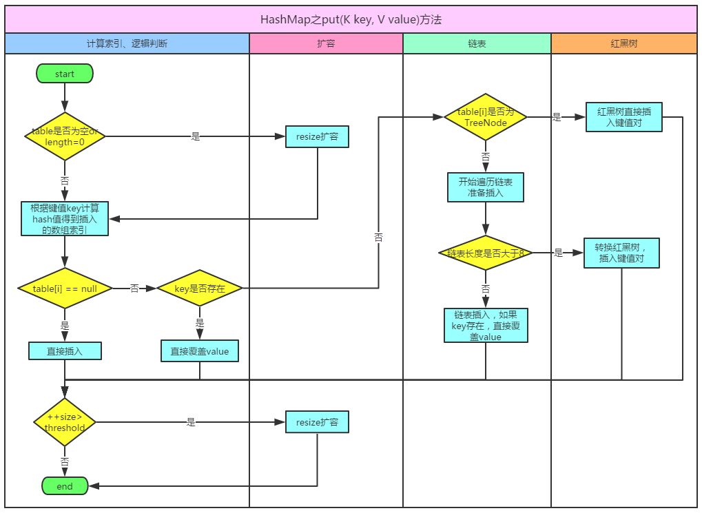
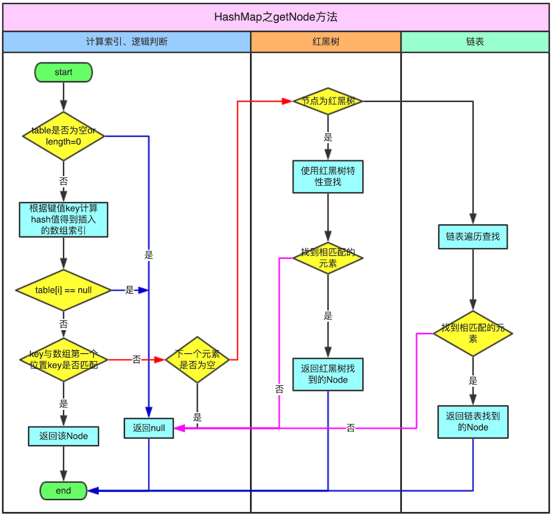

<!-- START doctoc generated TOC please keep comment here to allow auto update -->
<!-- DON'T EDIT THIS SECTION, INSTEAD RE-RUN doctoc TO UPDATE -->
**目录**

- [一、HashMap 基本](#%E4%B8%80hashmap-%E5%9F%BA%E6%9C%AC)
  - [1、HashMap的特点](#1hashmap%E7%9A%84%E7%89%B9%E7%82%B9)
    - [1.1、HashMap 基本结构](#11hashmap-%E5%9F%BA%E6%9C%AC%E7%BB%93%E6%9E%84)
    - [1.2、HashMap的特点](#12hashmap%E7%9A%84%E7%89%B9%E7%82%B9)
    - [1.3、不可变对象与 HashMap 的key](#13%E4%B8%8D%E5%8F%AF%E5%8F%98%E5%AF%B9%E8%B1%A1%E4%B8%8E-hashmap-%E7%9A%84key)
  - [2、HashMap和HashTable的区别](#2hashmap%E5%92%8Chashtable%E7%9A%84%E5%8C%BA%E5%88%AB)
  - [5、键的不变性](#5%E9%94%AE%E7%9A%84%E4%B8%8D%E5%8F%98%E6%80%A7)
  - [6、Java8 中 HashMap 的改进](#6java8-%E4%B8%AD-hashmap-%E7%9A%84%E6%94%B9%E8%BF%9B)
  - [7、延迟加载机制](#7%E5%BB%B6%E8%BF%9F%E5%8A%A0%E8%BD%BD%E6%9C%BA%E5%88%B6)
  - [8、初始化HashMap指定容量](#8%E5%88%9D%E5%A7%8B%E5%8C%96hashmap%E6%8C%87%E5%AE%9A%E5%AE%B9%E9%87%8F)
- [二、签名](#%E4%BA%8C%E7%AD%BE%E5%90%8D)
- [三、设计理念](#%E4%B8%89%E8%AE%BE%E8%AE%A1%E7%90%86%E5%BF%B5)
  - [1.HashMap 的数据结构](#1hashmap-%E7%9A%84%E6%95%B0%E6%8D%AE%E7%BB%93%E6%9E%84)
  - [2、哈希表(hash table)](#2%E5%93%88%E5%B8%8C%E8%A1%A8hash-table)
  - [3、HashMap是一个线性的数组实现](#3hashmap%E6%98%AF%E4%B8%80%E4%B8%AA%E7%BA%BF%E6%80%A7%E7%9A%84%E6%95%B0%E7%BB%84%E5%AE%9E%E7%8E%B0)
  - [4、HashMap 的工作原理](#4hashmap-%E7%9A%84%E5%B7%A5%E4%BD%9C%E5%8E%9F%E7%90%86)
  - [5、HashMap的哈希函数的设计原理](#5hashmap%E7%9A%84%E5%93%88%E5%B8%8C%E5%87%BD%E6%95%B0%E7%9A%84%E8%AE%BE%E8%AE%A1%E5%8E%9F%E7%90%86)
- [四、构造方法与成员变量](#%E5%9B%9B%E6%9E%84%E9%80%A0%E6%96%B9%E6%B3%95%E4%B8%8E%E6%88%90%E5%91%98%E5%8F%98%E9%87%8F)
  - [1、无参构造方法与其他构造方法](#1%E6%97%A0%E5%8F%82%E6%9E%84%E9%80%A0%E6%96%B9%E6%B3%95%E4%B8%8E%E5%85%B6%E4%BB%96%E6%9E%84%E9%80%A0%E6%96%B9%E6%B3%95)
  - [2、容量(Capacity)与平衡因子(LoadFactor)](#2%E5%AE%B9%E9%87%8Fcapacity%E4%B8%8E%E5%B9%B3%E8%A1%A1%E5%9B%A0%E5%AD%90loadfactor)
  - [3、modcount](#3modcount)
- [五、HashMap 的存取实现](#%E4%BA%94hashmap-%E7%9A%84%E5%AD%98%E5%8F%96%E5%AE%9E%E7%8E%B0)
  - [1、put方法](#1put%E6%96%B9%E6%B3%95)
    - [1.1、JDK6和JDK7](#11jdk6%E5%92%8Cjdk7)
    - [1.2、JDK8 的实现](#12jdk8-%E7%9A%84%E5%AE%9E%E7%8E%B0)
  - [2、get方法](#2get%E6%96%B9%E6%B3%95)
    - [2.1、JDK6的实现](#21jdk6%E7%9A%84%E5%AE%9E%E7%8E%B0)
    - [2.2、JDK8的实现](#22jdk8%E7%9A%84%E5%AE%9E%E7%8E%B0)
  - [3、hash 函数的实现](#3hash-%E5%87%BD%E6%95%B0%E7%9A%84%E5%AE%9E%E7%8E%B0)
    - [3.1、JDK6的实现](#31jdk6%E7%9A%84%E5%AE%9E%E7%8E%B0)
    - [3.2、JDK7的实现](#32jdk7%E7%9A%84%E5%AE%9E%E7%8E%B0)
    - [3.3、JDK8的实现](#33jdk8%E7%9A%84%E5%AE%9E%E7%8E%B0)
    - [3.4、关于性能](#34%E5%85%B3%E4%BA%8E%E6%80%A7%E8%83%BD)
  - [4、resize 的实现](#4resize-%E7%9A%84%E5%AE%9E%E7%8E%B0)
    - [4.1、JDK6的实现](#41jdk6%E7%9A%84%E5%AE%9E%E7%8E%B0)
    - [4.3、JDK8 的实现](#43jdk8-%E7%9A%84%E5%AE%9E%E7%8E%B0)
- [六、高并发下 HashMap 的使用的问题](#%E5%85%AD%E9%AB%98%E5%B9%B6%E5%8F%91%E4%B8%8B-hashmap-%E7%9A%84%E4%BD%BF%E7%94%A8%E7%9A%84%E9%97%AE%E9%A2%98)
- [七、面试题](#%E4%B8%83%E9%9D%A2%E8%AF%95%E9%A2%98)
  - [1、get和put的原理？JDK8](#1get%E5%92%8Cput%E7%9A%84%E5%8E%9F%E7%90%86jdk8)
  - [2、你知道hash的实现吗？为什么要这样实现？](#2%E4%BD%A0%E7%9F%A5%E9%81%93hash%E7%9A%84%E5%AE%9E%E7%8E%B0%E5%90%97%E4%B8%BA%E4%BB%80%E4%B9%88%E8%A6%81%E8%BF%99%E6%A0%B7%E5%AE%9E%E7%8E%B0)
  - [3、容量处理](#3%E5%AE%B9%E9%87%8F%E5%A4%84%E7%90%86)
  - [4、为什么 JDK8 的 HashMap 使用的跟以往不同的实现](#4%E4%B8%BA%E4%BB%80%E4%B9%88-jdk8-%E7%9A%84-hashmap-%E4%BD%BF%E7%94%A8%E7%9A%84%E8%B7%9F%E4%BB%A5%E5%BE%80%E4%B8%8D%E5%90%8C%E7%9A%84%E5%AE%9E%E7%8E%B0)
  - [5、为什么HashMap默认的加载因子是0.75](#5%E4%B8%BA%E4%BB%80%E4%B9%88hashmap%E9%BB%98%E8%AE%A4%E7%9A%84%E5%8A%A0%E8%BD%BD%E5%9B%A0%E5%AD%90%E6%98%AF075)
  - [6、为什么HashMap的默认初始容量是16,且容量必须是 2的幂](#6%E4%B8%BA%E4%BB%80%E4%B9%88hashmap%E7%9A%84%E9%BB%98%E8%AE%A4%E5%88%9D%E5%A7%8B%E5%AE%B9%E9%87%8F%E6%98%AF16%E4%B8%94%E5%AE%B9%E9%87%8F%E5%BF%85%E9%A1%BB%E6%98%AF-2%E7%9A%84%E5%B9%82)
- [参考资料](#%E5%8F%82%E8%80%83%E8%B5%84%E6%96%99)

<!-- END doctoc generated TOC please keep comment here to allow auto update -->

# 一、HashMap 基本

HashMap 是基于一个数组和多个链表来实现的，HashMap继承AbstractMap, 实现了 Map、Cloneable、Serializable

## 1、HashMap的特点
### 1.1、HashMap 基本结构

在JDK8之前使用了一个内部类 Entry<K, V>来存储数据, 这个内部类是一个简单的键值对,HashMap将数据存储到多个单向Entry链表中, 所有的列表都被注册到一个Entry数组中(Entry<K, V>[]数组),这个内部数组的默认长度是 16；

在JDK8之后，内部采用的是Node<K,V>节点来存储数据的

### 1.2、HashMap的特点

- 线程非安全，并且允许key与value都为 null 值，HashTable 与之相反，为线程安全，key与value都不允许 null 值；
- 不保证其内部元素的顺序，而且随着时间的推移，同一元素的位置也可能改变（resize的情况）
- put、get操作的时间复杂度为O(1).
- 遍历其集合视角的时间复杂度与其容量（capacity，槽的个数）和现有元素的大小（entry的个数）成正比，所以如果遍历的性能要求很高，不要把capactiy设置的过高或把平衡因子（load factor，当entry数大于capacity*loadFactor时，会进行resize，reside会导致key进行rehash）设置的过低
- 由于HashMap是线程非安全的，这也就是意味着如果多个线程同时对一hashmap的集合试图做迭代时有结构的上改变（添加、删除entry，只改变entry的value的值不算结构改变），那么会报ConcurrentModificationException专业术语叫fail-fast
- Map m = Collections.synchronizedMap(new HashMap())； 通过这种方式可以得到一个线程安全的map

### 1.3、不可变对象与 HashMap 的key

- 如果 HashMap Key 的哈希值在存储键值对后发生改变，Map 可能再也查找不到这个 Entry 了。如果Key对象是可变的，那么Key的哈希值就可能改变。在HashMap中可变对象作为Key会造成数据丢失
- 在 HashMap 中使用不可变对象。在 HashMap 中，使用 String、Integer 等不可变类型用作Key是非常明智的定义属于自己的不可变类时，在改变对象状态的时候，不要改变它的哈希值了

## 2、HashMap和HashTable的区别

- HashTable的方法是同步的，在方法的前面都有synchronized来同步，HashMap未经同步，所以在多线程场合要手动同步
- HashTable不允许null值(key和value都不可以) ，HashMap允许null值(key和value都可以)。
- HashTable有一个contains(Object value)功能和containsValue(Object value)功能一样。
- HashTable使用Enumeration进行遍历，HashMap使用Iterator进行遍历。
- HashTable中hash数组默认大小是11，增加的方式是 old*2+1。HashMap中hash数组的默认大小是16，而且一定是2的指数。在取模计算时，如果模数是2的幂，那么我们可以直接使用位运算来得到结果，效率要大大高于做除法
- 哈希值的使用不同，HashTable 直接使用对象的 hashCode，代码是这样的：
	```java
	int hash = key.hashCode();
	int index = (hash & 0x7FFFFFFF) % tab.length;
	```
	而 HashMap重新计算hash值，而且用与代替求模
	```java
	int hash = hash(k);
	int i = indexFor(hash, table.length);
	static int hash(Object x) {
	h ^= (h >>> 20) ^ (h >>> 12);
			return h ^ (h >>> 7) ^ (h >>> 4);
	}
	static int indexFor(int h, int length) {
		return h & (length-1);
	}
	```
## 3、HashMap与HashSet的关系

- HashSet底层是采用HashMap实现的
	```java
	public HashSet() {
		map = new HashMap<E,Object>();
	}
	```
- 调用HashSet的add方法时，实际上是向HashMap中增加了一行(key-value对)，该行的key就是向HashSet增加的那个对象，该行的value就是一个Object类型的常量
	```java
	private static final Object PRESENT = new Object(); public boolean add(E e) { 
		return map.put(e, PRESENT)==null; 
	} 
	public boolean remove(Object o) { 
		return map.remove(o)==PRESENT; 
	}
	```
## 4、HashTable和ConcurrentHashMap 的关系

- ConcurrentHashMap 也是一种线程安全的集合类，他和 HashTable 也是有区别的，主要区别:就是加锁的粒度以及如何加锁；ConcurrentHashMap 的加锁粒度要比 HashTable 更细一点。将数据分成一段一段的存储，然后给每一段数据配一把锁，当一个线程占用锁访问其中一个段数据的时候，其他段的数据也能被其他线程访问
- ConcurrentHashMap 如何实现写分段锁，如何实现弱一致性和读不加锁，不加锁情况能否保证每次获取的元素都是最新的?ConcurrentHashMap Segment
- 为什么需要ConcurrentHashMap和CopyOnWriteArrayList
	- 同步的集合类(Hashtable和Vector)同步的封装类(使用Collections.synchronizedMap()方法和 Collections.synchronizedList()方法返回的对象)可以创建出线程安全的Map和List。但是有些因素使得它们不适合高并发的系统。它们仅有单个锁，对整个集合加锁，以及为了防止ConcurrentModificationException异常经常要在迭代的时候要将集合锁定一段时间，这些特性对可扩展性来说都是障碍；
	- ConcurrentHashMap和CopyOnWriteArrayList保留了线程安全的同时，也提供了更高的并发性。ConcurrentHashMap和 CopyOnWriteArrayList 并不是处处都需要用；大部分时候你只需要用到HashMap和ArrayList，它们用于应对一些普通的情况

## 5、键的不变性

- 为什么将字符串和整数作为HashMap的键是一种很好的实现？

	主要是因为它们是不可变的！如果你选择自己创建一个类作为键，但不能保证这个类是不可变的，那么你可能会在HashMap内部丢失数据

## 6、Java8 中 HashMap 的改进

- 在Java 8中，使用数组，但它会被保存在Node中，Node 中包含了和之前 Entry 对象一样的信息，并且也会使用链表
- 和JDK7相比，最大区别在于 Node可以被扩展成TreeNode。TreeNode是一个红黑树的数据结构，它可以存储更多的信息这样我们可以在O(log(n))的复杂度下添加、删除或者获取一个元素；
	```java
	// 它继承自 LinkedHashMap.Entry,而 LinkedHashMap.Entry 继承自 HashMap.Node
	static final class TreeNode<K,V> extends LinkedHashMap.Entry<K,V> {
		TreeNode<K,V> parent;  // red-black tree links
		TreeNode<K,V> left;
		TreeNode<K,V> right;
		TreeNode<K,V> prev;    // needed to unlink next upon deletion
		boolean red;
	}

	static class Entry<K,V> extends HashMap.Node<K,V> {
		Entry<K,V> before, after;
		Entry(int hash, K key, V value, Node<K,V> next) {
						super(hash, key, value, next);
		}
	}
	```
- 红黑树是自平衡的二叉搜索树，不管是添加还是删除节点，它的内部机制可以保证它的长度总是log(n)。使用这种类型的树，最主要的好处是针对内部表中许多数据都具有相同索引（桶）的情况，这时对树进行搜索的复杂度是O(log(n))，而对于链表来说，执行相同的操作，复杂度是O(n)；
- jdk8中HashMap有三个关于红黑树的关键参数：
	* TREEIFY_THRESHOLD = 8：<br>
		一个桶的树化阈值,当桶中元素超过这个值时,使用红黑树节点替换链表节点值为8，应该跟加载因子类似
	* UNTREEIFY_THRESHOLD = 6：<br>
		一个树的链表还原阈值,当扩容时,桶中元素个数小于这个值,会把树形的桶元素还原为链表结构，这个值是6，应该比 TREEIFY_THRESHOLD 小
	* MIN_TREEIFY_CAPACITY = 64：<br>
		哈希表的最小树形化容量，当哈希表中的容量大于这个值时，表中的桶才能进行树形化，否则桶内元素太多时会扩容,而不是树形化。为了避免进行扩容、树形化选择的冲突,这个值不能小于 4 * TREEIFY_THRESHOLD

## 7、延迟加载机制

从Java 7开始，HashMap 采用了延迟加载的机制：这意味着即使你为HashMap指定了大小，在我们第一次使用put()方法之前，记录使用的内部数组（耗费4*CAPACITY字节）也不会在内存中分配空间

## 8、初始化HashMap指定容量

如果你需要存储大量数据，你应该在创建HashMap时指定一个初始的容量，这个容量应该接近你期望的大小。通过初始化时指定Map期望的大小，你可以避免调整大小操作带来的消耗。如果你不这样做，Map会使用默认的大小即16，factorLoad的值是0.75。前11次调用put()方法会非常快，但是第12次（16*0.75）调用时会创建一个新的长度为32的内部数组（以及对应的链表/树），第13次到第22次调用put()方法会很快

# 二、签名
```java
public class HashMap<K,V> extends AbstractMap<K,V>implements Map<K,V>, Cloneable, Serializable
```

- 实现标记接口 Cloneable，用于表明 HashMap 对象会重写 java.lang.Object#clone()方法，HashMap 实现的是浅拷贝(shallow copy)；
- 实现标记接口 Serializable，用于表明 HashMap 对象可以被序列化；
- HashMap 继承 AbstractMap 抽象类的同时又实现了 Map 接口：在语法层面继承接口Map是多余的，这么做仅仅是为了让阅读代码的人明确知道 HashMap 是属于 Map 体系的，起到了文档的作用AbstractMap 相当于个辅助类，Map 的一些操作这里面已经提供了默认实现，后面具体的子类如果没有特殊行为，可直接使用AbstractMap提供的实现；

- AbstractMap 抽象类：对 Map 中的方法提供了一个基本实现,减少了实现Map接口的工作量
	- 如果要实现个不可变(unmodifiable)的map，那么只需继承 AbstractMap，然后实现其entrySet方法，这个方法返回的set不支持add与remove，同时这个set的迭代器(iterator)不支持remove操作即可。
	- 如果要实现个可变(modifiable)的map，首先继承 AbstractMa，然后重写 AbstractMap 的put方法，同时实现entrySet所返回set的迭代器的remove方法即可

***为什么继承了 AbstractMap 还需要实现 Map 接口？*** HashMap的作者说这是一个写法错误；并没有其他意思；也有可能是为了语义和代码上更清晰吧；


# 三、设计理念

## 1、HashMap 的数据结构

数据结构中有数组和链表来实现对数据的存储，但这两者基本上是两个极端；
- 数组：数组必须事先定义固定的长度（元素个数），不能适应数据动态地增减的情况。当数据增加时，可能超出原先定义的元素个数；
	- 当数据减少时，造成内存浪费
	- 数组是静态分配内存，并且在内存中连续。
	- 数组利用下标定位，时间复杂度为O(1)
	- 数组插入或删除元素的时间复杂度O(n)
	- 数组的特点是：寻址容易，插入和删除困难；
- 链表：链表存储区间离散，占用内存比较宽松
	- 链表是动态分配内存，并不连续。
	- 链表定位元素时间复杂度O(n)
	- 链表插入或删除元素的时间复杂度O(1)
	- 链表的特点是：寻址困难，插入和删除容易

## 2、哈希表(hash table)

HashMap是一种基于哈希表（hash table）实现的map，既满足了数据的查找方便，同时不占用太多的内容空间，
- 哈希表(也叫关联数组)一种通用的数据结构：key经过hash函数作用后得到一个槽(buckets或slots)的索引(index)，槽中保存着我们想要获取的值；
- 一些不同的key经过同一hash函数后可能产生相同的索引，利用哈希表这种数据结构实现具体类时：设计个好的hash函数，使冲突尽可能的减少，其次是需要解决发生冲突后如何处理。

## 3、HashMap是一个线性的数组实现

可以理解为其存储数据的容器就是一个线性数组，HashMap里面实现一个静态内部类 Entry，其重要的属性有 key、value、next，从属性key、value我们就能很明显的看出来 Entry 就是 HashMap 键值对实现的一个基础bean，我们上面说到HashMap的基础就是一个线性数组，这个数组就是 Entry[],Map 里面的内容都保存在 Entry[]里面

***在 JDK8中,HashMap中内容保存在 Node[] 数组中的***

## 4、HashMap 的工作原理

- 通过hash的方法，通过put和get存储和获取对象；
- 存储对象时，我们将K/V传给put方法时，它调用hashCode计算hash从而得到bucket位置进一步存储，HashMap会根据当前bucket的占用情况自动调整容量（超过Load Facotr则resize为原来的2倍）；
- 取对象时，我们将K传给get，它调用hashCode计算hash从而得到bucket位置，并进一步调用equals()方法确定键值对；
- 如果发生碰撞的时候，Hashmap通过链表将产生碰撞冲突的元素组织起来，在Java 8中，如果一个bucket中碰撞冲突的元素超过某个限制(默认是8)，则使用红黑树来替换链表，从而提高速度；

## 5、HashMap的哈希函数的设计原理

- HashMap 的初始长度是 16，并且每次自动扩展或是手动初始化时长度必须是2的幂。
- 之所以 HashMap 的初始长度是 16，是为了服务于 key映射到 index 的hash算法。
- 如何实现一个尽量均匀分布的 hash 函数呢?可以通过 key 的hashcode值来做某种运算。
	```java
	index =  HashCode(Key) &  (Length - 1) 
	```
	其中 length是 HashMap 的长度hash算法的最终得到的index结果，完全取决。使用位运算的效果等同于取模，但是却大大提升了性能。
- 为什么是 16？ 可以试试，如果是10会产生什么结果？当 HashMap 长度等于10 的时候，有些 index 结果出现的几率会更大，而有些index的结果永远不会出现。这显然不符合Hash算法均匀分布的原则。而16或者其他2的幂，Length - 1的值是所有二进制位全为1，这种情况下，index的结果等于 hashCode 后几位的值。只要输入hashcode本身是均匀分布的，hash算法等于均匀的

# 四、构造方法与成员变量

## 1、无参构造方法与其他构造方法

HashMap 提供了一个参数为空的构造函数与有一个参数且参数类型为 Map 的构造函数，除此之外,还提供了两个构造函数，用于设置 HashMap 的容量（capacity）与平衡因子（loadFactor）
```java
public HashMap(int initialCapacity, float loadFactor) {
	if (initialCapacity < 0)
		throw new IllegalArgumentException("Illegal initial capacity: " + initialCapacity);
	if (initialCapacity > MAXIMUM_CAPACITY)
		initialCapacity = MAXIMUM_CAPACITY;
	if (loadFactor <= 0 || Float.isNaN(loadFactor))
		throw new IllegalArgumentException("Illegal load factor: " + loadFactor);
	this.loadFactor = loadFactor;
	threshold = initialCapacity;
	init();
}
public HashMap(int initialCapacity) {
	this(initialCapacity, DEFAULT_LOAD_FACTOR);
}
public HashMap() {
	this(DEFAULT_INITIAL_CAPACITY, DEFAULT_LOAD_FACTOR);
}
```

## 2、容量(Capacity)与平衡因子(LoadFactor)

都有个默认值，并且容量有个最大值
- 默认的平衡因子为0.75，这是权衡了时间复杂度与空间复杂度之后的最好取值（JDK说是最好的），过高的因子会降低存储空间但是查找（lookup，包括HashMap中的put与get方法）的时间就会增加：
	```java
	static final float DEFAULT_LOAD_FACTOR = 0.75f;
	```
- 容量必须为2的指数倍，定义如下：
	```java
	static final int DEFAULT_INITIAL_CAPACITY = 1 << 4;
	```
- Capacity就是bucket的大小，Load factor就是bucket填满程度的最大比例。如果对迭代性能要求很高的话不要把capacity设置过大，也不要把load factor设置过小。当bucket中的entries的数目大于capacity*load factor时就需要调整bucket的大小为当前的2倍

## 3、modcount

```java
// 这个用来实现“fast-fail”机制
transient int modCount
```
所谓快速失败就是在并发集合中，其进行迭代操作时，若有其他线程对其结构性的修改，这是迭代器会立马感知到，并且立刻抛出ConcurrentModificationException异常，而不是等待迭代完成之后才告诉你已经出错

# 五、HashMap 的存取实现

## 1、put方法
- JDK6
```java
public V put(K key, V value) {
	if (key == null)
		return putForNullKey(value);
	int hash = hash(key.hashCode());
	int i = indexFor(hash, table.length);
	for (Entry<K,V> e = table[i]; e != null; e = e.next) {
		Object k;
		if (e.hash == hash && ((k = e.key) == key || key.equals(k))) {
			V oldValue = e.value;
			e.value = value;
			e.recordAccess(this);
			return oldValue;
		}
	}

	modCount++;
	addEntry(hash, key, value, i);
	return null;
}
```
- JDK7 在上述JDK6的基础上增加了一个判断
```java
if (table == EMPTY_TABLE) {
	inflateTable(threshold);
}
```
- JDK8
```java
public V put(K key, V value) {
	return putVal(hash(key), key, value, false, true);
}
final V putVal(int hash, K key, V value, boolean onlyIfAbsent, boolean evict)
```
### 1.1、JDK6和JDK7

- （1）JDK7比JDK6增加了一个判断:
	先判断table（存放bullet的数组,初始类定义：transient Entry<K,V>[] table = (Entry<K,V>[]) EMPTY_TABLE;）是否为空，如果为空则扩充table，其中包括确保table的大小为2的整数倍
	```java
	if (table == EMPTY_TABLE) {
		inflateTable(threshold);
	}
	```
- （2）如果key值为 null,则特殊处理，调用putForNullKey(V value)，hash值为0，存入table中，最终会将这个 entry 放到 table[0] 中
- （3）如果key值不为null,则计算key的hash值；
- （4）然后计算key在table中的索引index；
- （5）遍历table[index]的链表，如果发现链表中有bullet中的键的hash值与key相等，并且调用equals()方法也返回true，则替换旧值（oldValue），保证key的唯一性；
- （6）addEntry()方法:
	- ①.JDK6：新节点一直插入在最前端,新节点始终是单向列表的头节点
		```java
		void addEntry(int hash, K key, V value, int bucketIndex) {
			// 下面两行行代码的逻辑是,创建一个新节点放到单向链表的头部,旧节点向后移
			// 取出索引bucketIndex位置处的链表节点,如果节点不存在那就是null,也就是说当数组该位
			// 置处还不曾存放过节点的时候,这个地方就是null;
			Entry<K,V> e = table[bucketIndex];
			// 创建一个节点,并放置在数组的bucketIndex索引位置处,并让新的节点的next指向原来的节点
			table[bucketIndex] = new Entry<K,V>(hash, key, value, e);
			// 如果当前HashMap中的元素已经到达了临界值,则将容量扩大2倍,并将size计数+1
			if (size++ >= threshold)
				resize(2 * table.length);
		}
		```
	- ②.JDK7:
		```java
		void addEntry(int hash, K key, V value, int bucketIndex) {
			if ((size >= threshold) && (null != table[bucketIndex])) {
				resize(2 * table.length);
				hash = (null != key) ? hash(key) : 0;
				bucketIndex = indexFor(hash, table.length);
			}
			createEntry(hash, key, value, bucketIndex);
		}
		void createEntry(int hash, K key, V value, int bucketIndex) {
			Entry<K,V> e = table[bucketIndex];
			table[bucketIndex] = new Entry<>(hash, key, value, e);
			size++;
		}
		```
		如果没有，在插入之前先判断table中阈值的大小，如果table中的bullet个数size超过阈值(threshold)则扩容(resize)两倍；注意扩容的顺序，扩容之前old1->old2->old3，扩容之后old3->old2->old1，扩展之前和扩容之后的table的index不一定相同，但是对于原bullet中的链表中的数据在扩容之后肯定还在一个链表中，因为hash值是一样的

### 1.2、JDK8 的实现

put的时候根据 h & (length – 1) 定位到那个桶然后看是红黑树还是链表再putVal



```java
public V put(K key, V value) {
	return putVal(hash(key), key, value, false, true);
}
```
- （1）对key的hashCode()做hash，然后再计算index;
- （2）如果没碰撞直接放到bucket里；
- （3）如果碰撞了，以链表的形式存在buckets后；
- （4）如果碰撞导致链表过长（大于等于TREEIFY_THRESHOLD），就把链表转换成红黑树；
- （5）如果节点已经存在就替换old value- （保证key的唯一性)
- （6）如果bucket满了（超过load factor*current capacity)，就要resize

## 2、get方法

public V get(Object key)
- JDK6
```java
public V get(Object key) {
	if (key == null)
		return getForNullKey();
	int hash = hash(key.hashCode());
	for (Entry<K,V> e = table[indexFor(hash, table.length)];e != null;e = e.next) {
		Object k;
		if (e.hash == hash && ((k = e.key) == key || key.equals(k)))
			return e.value;
	}
	return null;
}
```
- JDK7
```java
public V get(Object key) {
	if (key == null)
		return getForNullKey();
	Entry<K,V> entry = getEntry(key);
	return null == entry ? null : entry.getValue();
}
```
- JDK8
```java
public V get(Object key) {
	Node<K,V> e;
	return (e = getNode(hash(key), key)) == null ? null : e.value;
}
```

### 2.1、JDK6的实现

- （1）判断key值是否为null,如果是则特殊处理（在table[0]的链表中寻找）
- （2）否则计算hash值,进而获得table中的index值
- （3）在table[index]的链表中寻找,根据hash值和equals()方法获得相应的value。
```java
public V get(Object key) {
	// 如果key等于null,则调通getForNullKey方法
	if (key == null)
		return getForNullKey();
	// 计算key对应的hash值
	int hash = hash(key.hashCode());
	// 通过hash值找到key对应数组的索引位置,遍历该数组位置的链表
	for (Entry<K,V> e = table [indexFor (hash, table .length)];
			e != null;
			e = e. next) {
		Object k;
		// 如果hash值和key都相等,则认为相等
		if (e.hash == hash && ((k = e.key) == key || key.equals(k)))
			// 返回value
			return e.value ;
	}
	return null;
}
private V getForNullKey() {
	// 遍历数组第一个位置处的链表
	for (Entry<K,V> e = table [0]; e != null; e = e. next) {
		if (e.key == null)
			return e.value ;
	}
	return null;
}
```
### 2.2、JDK8的实现



主要是getNode()方法
- bucket里的第一个节点，直接命中；
- 如果有冲突，则通过`key.equals(k)`去查找对应的entry；若为树，则在树中通过`key.equals(k)`查找,O(logn)；若为链表，则在链表中通过`key.equals(k)`查找，O(n)。

## 3、hash 函数的实现

哈希函数每次在相同或相等的对象上应用哈希函数时, 应每次返回相同的哈希码。换句话说, 两个相等的对象必须一致地生成相同的哈希码

在get和put的过程中，计算下标时，先对hashCode进行hash操作，然后再通过hash值进一步计算下标

### 3.1、JDK6的实现
```java
	static int hash(int h) {
		h ^= (h >>> 20) ^ (h >>> 12);
		return h ^ (h >>> 7) ^ (h >>> 4);
	}
```
为了了更有效的工作,内部数组的大小必须是2的幂值

### 3.2、JDK7的实现
```java
final int hash(Object k) {
	int h = hashSeed;
	if (0 != h && k instanceof String) {
					return sun.misc.Hashing.stringHash32((String) k);
	}

	h ^= k.hashCode();

	// This function ensures that hashCodes that differ only by
	// constant multiples at each bit position have a bounded
	// number of collisions (approximately 8 at default load factor).
	h ^= (h >>> 20) ^ (h >>> 12);
	return h ^ (h >>> 7) ^ (h >>> 4);
}
```

### 3.3、JDK8的实现

高16bit不变,低16bit和高16bit做了一个异或
```java
static final int hash(Object key) {
	int h;
	return (key == null) ? 0 : (h = key.hashCode()) ^ (h >>> 16);
}
```
在Java 8之前的实现中是用链表解决冲突的，在产生碰撞的情况下，进行get时，两步的时间复杂度是O(1)+O(n)。因此，当碰撞很厉害的时候n很大，O(n)的速度显然是影响速度的。因此在Java 8中，利用红黑树替换链表，这样复杂度就变成了O(1)+O(logn)了，这样在n很大的时候，能够比较理想的解决这个问题；

### 3.4、关于性能

HashMap的数据是存储在链表数组里面的，在对HashMap进行插入/删除等操作时，都需要根据K-V对的键值定位到他应该保存在数组的哪个下标中.而这个通过键值求取下标的操作就叫做哈希。HashMap的数组是有长度的，Java中规定这个长度只能是2的倍数，初始值为16.简单的做法是先求取出键值的hashcode，然后在将hashcode得到的int值对数组长度进行取模.为了考虑性能，Java总采用按位与操作实现取模操作。

## 4、resize 的实现

### 4.1、JDK6的实现
```java
void resize(int newCapacity) {
	Entry[] oldTable = table;
	int oldCapacity = oldTable.length;
	if (oldCapacity == MAXIMUM_CAPACITY) {
		threshold = Integer.MAX_VALUE;
		return;
	}

	Entry[] newTable = new Entry[newCapacity];
	transfer(newTable);
	table = newTable;
	threshold = (int)(newCapacity * loadFactor);
}
```
- 获取当前数组的容量,如果容量已经是默认最大容量 MAXIMUM_CAPACITY,则将临界值改为 Integer.MAX_VALUE
	```java
	if (oldCapacity == MAXIMUM_CAPACITY) {
		threshold = Integer.MAX_VALUE;
		return;
	}
	```
- 如果不是默认最大容量
	```java
	// 使用新的容量创建一个新的链表数组
	Entry[] newTable = new Entry[newCapacity];
	// 将当前数组中的元素都移动到新数组中
	transfer(newTable);
	// 将当前数组指向新创建的数组
	table = newTable;
	// 重新计算临界值
	threshold = (int)(newCapacity * loadFactor);
	```
### 4.2、JDK7实现
```java
void resize(int newCapacity) {
	Entry[] oldTable = table;
	int oldCapacity = oldTable.length;
	if (oldCapacity == MAXIMUM_CAPACITY) {
		threshold = Integer.MAX_VALUE;
		return;
	}

	Entry[] newTable = new Entry[newCapacity];
	transfer(newTable, initHashSeedAsNeeded(newCapacity));
	table = newTable;
	threshold = (int)Math.min(newCapacity * loadFactor, MAXIMUM_CAPACITY + 1);
}
```
与JDK6实现基本类似，只不过扩容时增加了对hash掩码的初始化，并且计算阈值时有对新容量与int最大值进行比较去较小的值

### 4.3、JDK8 的实现

final Node<K,V>[] resize()

- 当put时，如果发现目前的bucket占用程度已经超过了Load Factor所希望的比例，那么就会发生resize。在resize的过程，简单的说就是把bucket扩充为2倍，之后重新计算index，把节点再放到新的bucket中
- 扩充HashMap的时候，不需要重新计算hash，只需要看看原来的hash值新增的那个bit是1还是0就好了，是0的话索引没变，是1的话索引变成“原索引+oldCap”

# 六、高并发下 HashMap 的使用的问题

- 扩容-resize()：影响resize发生的因素
	- capacity：HashMap当前的长度(2的幂);
	- loadfactor：加载因子,默认是0.75f衡量HashMap是否进行resize条件: HashMap.size >= capacity * loadfactor.
- 扩容步骤
	- （1）扩容：创建一个新的entry数组，长度是原来数组的两倍；
	- （2）rehash：遍历原entry数组，把所有的entry重写hash到新的数组。为什么需要重新hash？因为长度扩大异以后，hash规则也随之改变；`index =  HashCode(Key)&(Length - 1)` 当原数组长度为8时，Hash 运算是 和 111B做与运算；新数组长度为16，Hash 运算是和1111B做与运算.
- 在单线程下上述步骤执行没有任何问题；在多线程环境下，reHash在并发的情况下可能会形成链表环。此时问题并没有直接产生。当调用Get查找一个不存在的Key，而这个Key的Hash结果恰好等于某个值的时候，由于位置该值带有环形链表，所以程序将会进入死循环
- 在高并发环境下，通常使用 `ConcurrentHashMap`，兼顾了线程安全和性能；
- 下面代码只在JDK7以前的版本有效，jdk8之后就不存在这种问题了
	```java
	private static Map<Long, Set<Integer>> setMap = new ConcurrentHashMap<>();
	public static void main(String[] args) throws InterruptedException {
		final long key = 1L;
		setMap.put(key, new HashSet<Integer>());
		for (int i = 0; i < 100; i++) {
			setMap.get(key).add(i);
		}
		Thread a = new Thread(new Runnable() {
			@Override
			public void run() {
				for (int j = 100; j < 200000; j++) {
					setMap.get(key).add(j);
				}
			}
		});
		Thread b = new Thread(new Runnable() {
			@Override
			public void run() {
				for (int j = 200000; j < (200000 + 200000); j++) {
					setMap.get(key).add(j);
				}
			}
		});
		a.start();
		b.start();
		Thread.sleep(1000 * 10);
		System.out.println(setMap.toString()); // 报java.lang.OutOfMemoryError: Java heap space
	}
	```

# 七、面试题

## 1、get和put的原理？JDK8

通过对key的hashCode()进行hashing,并计算下标`( n-1 & hash)`,从而获得buckets的位置。如果产生碰撞,则利用key.equals()方法去链表或树中去查找对应的节点.
	
## 2、你知道hash的实现吗？为什么要这样实现？

在Java 1.8的实现中,是通过hashCode()的高16位异或低16位实现的：`(h = k.hashCode()) ^ (h >>> 16)`；

主要是从速度、功效、质量来考虑的,这么做可以在bucket的n比较小的时候,也能保证考虑到高低bit都参与到hash的计算中,同时不会有太大的开销

## 3、容量处理

- 如果HashMap的大小超过了负载因子(load factor)定义的容量。如何处理？如果超过了负载因子(默认0.75)。则会重新resize一个原来长度两倍的HashMap。并且重新调用hash方法。
- 如果指定了HashMap的容量，如：new HashMap(17)，那么其容量会变为32。

## 4、为什么 JDK8 的 HashMap 使用的跟以往不同的实现

- 一直到JDK7为止，HashMap 的结构都是这么简单，基于一个数组以及多个链表的实现，hash 值冲突时就将对应节点以链表形式存储。这样的 HashMap 在性能上存在问题：如果很多节点在hash时发生碰撞，存储在一个链表中，那么如果要查找其中一个节点时，不可避免要花费O(N)的时间;
- 在JDK8中，使用红黑树来解决问题。在最坏的情况下，链表的查找时间复杂度是O(N)，而红黑树一直是O(logN)。JDK7 中HashMap采用的是位桶+链表的方式，即我们常说的散列链表的方式；而 JDK8 中采用的是`位桶+链表/红黑树`也是非线程安全的。当某个位桶的链表的长度达到某个阀值的时候，这个链表就将转换成红黑树

## 5、为什么HashMap默认的加载因子是0.75

- 5.1、加载因子：表示hash表中元素填满的程度.
	* 加载因子越大，填满的元素越多，空间利用率越高,但冲突的机会加大；
	* 反之,加载因子越小，填满的元素越少，冲突的机会减少，但空间利用率不高。冲突的机会越大，则查找的成本越高；反之。查找的成本越小。需要在"冲突的机会" 和 "空间利用率上" 寻找平衡

- 5.2、为什么HashMap的默认加载因子是0.75：在理想情况下,使用随机哈希码,节点出现的频率在hash桶中遵循泊松分布,同时给出了桶中元素个数和概率的对照表.
	```
	0: 0.60653066
	1: 0.30326533
	2: 0.07581633
	3: 0.01263606
	4: 0.00157952
	5: 0.00015795
	6: 0.00001316
	7: 0.00000094
	8: 0.00000006
	```
	从上面的表中可以看到当桶中元素到达8个的时候，概率已经变得非常小，也就是说用0.75作为加载因子，每个碰撞位置的链表长度超过８个是几乎不可能的

## 6、为什么HashMap的默认初始容量是16,且容量必须是 2的幂

之所以是选择16是为了服务于从 key 映射到 index 的 hash 算法。从key映射到HashMap 数组对应的位置，会用到一个hash函数。实现高效的hash算法，HashMap 中使用位运算。index = hashcode(key) & (length - 1)。  hash算法最终得到的index结果，完全取决于Key的Hashcode值的最后几位。长度是2的幂不仅提高了性能，因为length - 1的二进制值位全是1，这种情况下，index的结果等同于Hashcode后几位的值，只要输入hashcode均匀分布，hash算法的结果就是均匀的。


# 参考资料

* [Java8 HashMap实现原理](http://www.codeceo.com/article/java8-hashmap-learn.html)
* [JDK8重新认识HashMap](https://tech.meituan.com/java-hashmap.html)
* [HashMap完全解读](http://www.hollischuang.com/archives/82)
* [Java HashMap工作原理](http://www.importnew.com/16599.html)
* [Java HashMap工作原理及实现:(JDK8)](http://yikun.github.io/2015/04/01/Java-HashMap%E5%B7%A5%E4%BD%9C%E5%8E%9F%E7%90%86%E5%8F%8A%E5%AE%9E%E7%8E%B0/)
* [hash()分析](http://www.hollischuang.com/archives/2091)
* [HashMap 和 ConcurrentHashMap 全解析](https://javadoop.com/post/hashmap)
* [加载因子是默认为0.75](https://blog.csdn.net/hcmony/article/details/56494527)
* [高并发下的HashMap](https://www.jianshu.com/p/c15f7c180375)
* [彻底理解HashMap](https://mp.weixin.qq.com/s/DfAoqmjh2tt5nZaUc8Dxwg)
* [HashMap与Hashtable](https://mp.weixin.qq.com/s/h3Cg1O0pjfqp5E8ckDz_Jg)


