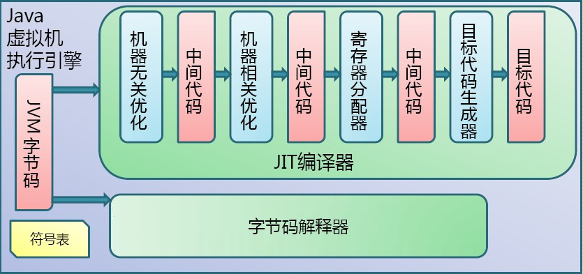
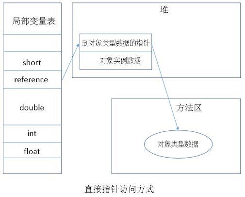

*任何一个JVM参数的默认值可以通过 `java -XX:+PrintFlagsFinal -version |grep JVMParamName` 获取，例如：`java -XX:+PrintFlagsFinal -version |grep MetaspaceSize`*

`java -XX:+PrintCommandLineFlags -version`：查看初始默认参数

# 0、虚拟机历史

- Sun Classic：世界上第一款商用Java虚拟机，在JDK1.2之前是 Sun JDK中唯一的虚拟机，在JDK1.2时，它与HotSpot虚拟机共存，但默认的是Classic VM，在JDK1.3时成为默认虚拟机，直到1.4之后才完全退出历史舞台.

- Sun HotSpot VM：Sun JDK 和 Open JDK 中自带的虚拟机

# 1、Java 代码编译和执行的整个过程

Java代码编译是由Java源码编译器来完成，流程图如下所示：


Java字节码的执行是由JVM执行引擎来完成，流程图如下所示：



## 1.1、包含三个重要机制

- Java源码编译机制：Java 源码编译有三个过程：
	- 分析和输入到符号表
	- 注解处理
	- 语义分析和生成class文件

	生成的class文件包括：
	- 结构信息：包括 class文件格式版本号及各部分的数量与大小的信息。
	- 元数据：对应于 Java 源码中声明与常量的信息。包含类/继承的超类/实现的接口的声明信息、域与方法声明信息和常量池。
	- 方法信息：对应 Java 源码中语句和表达式对应的信息.包含字节码、异常处理器表、求值栈与局部变量区大小、求值栈的类型记录、调试符号信息

- 类加载机制：JVM 的类加载是通过ClassLoader及其子类来完成的；
	- Bootstrap ClassLoader：负责加载`$JAVA_HOME`中`jre/lib/rt.jar`里所有的 class，由 C++ 实现，不是 ClassLoader 子类
	- Extension ClassLoader：负责加载Java平台中扩展功能的一些 jar 包，包括`$JAVA_HOME`中`jre/lib*.jar`或`-Djava.ext.dirs`指定目录下的 jar 包
	- App ClassLoader：负责记载 classpath 中指定的 jar 包及目录中 class
	- Custom ClassLoader：属于应用程序根据自身需要自定义的 ClassLoader，如 Tomcat、jboss 都会根据 J2EE 规范自行实现 ClassLoader.

- 类执行机制：JVM 是基于栈的体系结构来执行 class 字节码的。线程创建后，都会产生程序计数器(PC)和栈(Stack)，程序计数器存放下一条要执行的指令在方法内的偏移量，栈中存放一个个栈帧，每个栈帧对应着每个方法的每次调用，而栈帧又是有局部变量区和操作数栈两部分组成，局部变量区用于存放方法中的局部变量和536，操作数栈中用于存放方法执行过程中产生的中间结果；

## 1.2、JVM 运行原理

类加载器classloader + 执行引擎executionengine + 运行时数据区域runtime data area 类加载器将 class 文件加载到{JVM}中的运行时数据区域，其不负责类的执行，由执行引擎执行;

# 2、Java 内存区域

## 2.1.Java 虚拟机

虚拟机： 模拟某种计算机体系机构，执行特定指令集的软件

- 进程虚拟机：JVM 等
- 高级语言虚拟机：JVM、.NET、CLR
- Java tm 虚拟机：
	- 必须通过 Java TCK 的兼容性测试的 Java 虚拟机才能成为 "Java TM 虚拟机"
	- Java tm 虚拟机并非一定要执行 Java 语言
	- 业界三大商用 JVM：Oracle HotSpot， Oracle JRockit VM， IBM J9 VM

## 2.2、内存区域

Java 虚拟机规范将 JVM 所管理的内存分为以下几个运行时数据区：程序计数器、Java 虚拟机栈、本地方法栈、Java 堆、方法区；其中"程序计数器、Java 虚拟机栈、本地方法栈"三者是线程私有内存区；“Java 堆、方法区”为线程共享内存区


### 2.2.1、程序计数器

`无内存溢出异常（PC 寄存器）`

- 一块较小的内存空间，它是当前线程所执行的字节码的行号指示器，字节码解释器工作时通过改变该计数器的值来选择下一条需要执行的字节码指令，分支、跳转、循环等基础功能都要依赖它来实现。
- 每条线程都有一个独立的的程序计数器，各线程间的计数器互不影响，因此该区域是线程私有的;
- 当线程在执行一个 Java 方法时，该计数器记录的是正在执行的虚拟机字节码指令的地址，当线程在执行的是Native方法（调用本地操作系统方法）时，该计数器的值为空;
- 该内存区域是唯一一个在 Java 虚拟机规范中没有规定任何 OOM（内存溢出：OutOfMemoryError）情况的区域；

### 2.2.2、Java 虚拟机栈

`该区域也是线程私有的，它的生命周期也与线程相同`

#### 2.2.2.1、虚拟机栈特征

- 虚拟机栈描述的是Java方法执行的内存模型：每个方法被执行的时候都会同时创建一个栈帧，栈帧是用于支持续虚拟机进行方法调用和方法执行的数据结构
- 栈帧：用于支持续虚拟机进行方法调用和方法执行的数据结构
	- 对于执行引擎来讲，活动线程中，只有栈顶的栈帧是有效的，称为当前栈帧，这个栈帧所关联的方法称为当前方法，执行引擎所运行的所有字节码指令都只针对当前栈帧进行操作；
	- 栈帧用于存储局部变量表、操作数栈、动态链接、方法返回地址和一些额外的附加信息；
	- 一个栈帧需要分配多少内存，不会受到程序运行期变量数据的影响，而仅仅取决于具体的虚拟机实现；
	- 每个方法从调用到执行完成的过程，就对应着一个栈帧在虚拟机栈中入栈到出栈的过程；

#### 2.2.2.2、该区域存在的异常情况

- 如果线程请求的栈深度大于虚拟机所允许的深度，将抛出 StackOverflowError 异常
- 如果虚拟机在动态扩展栈时无法申请到足够的内存空间，则抛出 OutOfMemoryError 异常（Hotspot虚拟机栈内存不可扩展）

#### 2.2.2.3、栈帧中所存放的各部分信息的作用和数据结构

- 局部变量表：是一组变量值存储空间，用于存放方法参数和方法内部定义的局部变量，存放的数据的类型是编译期可知的各种基本数据类型、对象引用(reference)和returnAddress(它指向了一条字节码指令的地址)类型;

	- ①、局部变量表所需的内存空间在编译期间完成分配，即在Java程序被编译成Class文件时，在方法的Code属性的max_locals数据项中确定了所需分配的
		最大局部变量表的容量，方法运行期间不会改变局部变量表的大小；

	- ②、局部变量表的容量以变量槽(Slot)为最小单位，虚拟机规范中没有明确指明一个Slot，应占用的内存空间大小，一个Slot可以存放一个32位以内的数据类型：boolean、byte、char、short、int、float、reference和returnAddresss；对于64位的数据类型(long 和 double)，虚拟机会以高位在前的方式为其分配两个连续的 Slot 空间;

	- ③、虚拟机通过索引定位的方式使用局部变量表，索引值的范围是从0开始到局部变量表最大的Slot数量，对于32位数据类型的变量，索引n代表第n个Slot，对于64位的，索引n代表第n和第 n+1两个 Slot对于两个相邻的共同存放一个64位数据的两个 Slot，不允许采用任何方式单独访问其中一个，虚拟机规范中要求如果遇到这种操作的字节码序列，虚拟机在类加载的校验阶段抛出异常;

	- ④、在方法执行时，虚拟机是使用局部变量表来完成参数值到参数变量列表的传递过程的，如果是非静态方法，则局部变量表中的第0位索引的Slot默认是用于传递方法所属对象实例的引用，在方法中可以通过关键字this来访问这个隐含的参数，其余参数则按照参数表的顺序来排列，占用从1开始的局部变量Slot，参数表分配完毕后;

	- ⑤、类变量有两次赋初始值的过程：
		- 一次是在准备阶段，赋予系统初始值;
		- 另一次是在初始化阶段，赋予程序员定义的初始值；

- 操作数栈：是一个先入后出栈，其最大深度在编译时写入到 Code 属性的 max_stacks 数据项中
	- ①、32位数据类型所占的栈容量为1，64为数据类型所占的栈容量为2;
	- ②、当方法开始执行时，它的操作数栈是空的，在方法的执行过程中，会有各种字节码指令向操作栈中写于和提取内容，即出栈和入栈
	- ③、Java 虚拟机是基于栈的，Android 虚拟机是基于寄存器的：
		- 基于栈的指令集最主要的优点是可移植性强，主要的缺点是执行速度相对会慢些;
		- 基于寄存器指令集最主要的优点是执行速度快，主要的缺点是可移植性差，寄存器由硬件直接提供;
		```
		如：计算1+1的时候
		--> 基于栈的指令集会是这样：
			iconst_1
			iconst_1 //两条iconst_1指令连续把两个常量1压入栈
			iadd     //iadd指令把栈顶的两个值出栈、相加后把结果放回栈顶。
			istore_0 //把栈顶值存入局部变量表第0个slot中
		--> 基于寄存器的指令：
			mov eax，1   //将eax寄存器址设为1
			add eax，1   //将eax寄存器与1相加结果依旧存入eax寄存器
		```
	- ④、操作数栈中元素的数据类型必须与字节码指令的序列严格匹配；

- 动态连接：
	- ①、每个栈桢都包含一个指向运行时常量池中该栈桢所属方法的引用，持有该引用是支持方法调用过程的动态连接；
	- ②、Class 文件的常量池中存在有大量的符号引用，字节码中的方法调用指令就以常量池中指向方法的符号引用为参数；这些符号引用，一部分会在类加载阶段或第一次使用的时候转化为直接引用(如 final、static 域等)称为静态解析；另一部分将在每一次的运行期间转化为直接引用，这部分称为动态连接

- 方法返回地址：
	- ①、当一个方法被执行后，有两种方式退出该方法：

		执行引擎遇到了任意一个方法返回的字节码指令或遇到了异常，并且该异常没有在方法体内得到处理一般来说，方法正常退出时，调用者的PC计数器的值就可以作为返回地址，栈帧中很可能保存了这个计数器值，而方法异常退出时，返回地址是要通过异常处理器来确定的，栈帧中一般不会保存这部分信息；

	- ②、方法退出的过程实际上等同于把当前栈帧出，因此退出时可能执行的操作有：恢复上层方法的局部变量表和操作数栈，如果有返回值，则把它压入调用者栈帧的操作数栈中，调整PC计数器的值以指向方法调用指令后面的一条指令

### 2.2.3、本地方法栈

使用到的本地操作系统(Native)方法服务，线程私有，与虚拟机栈发挥的作用类似;

### 2.2.4、Java 堆

- Java 虚拟机所管理的内存中最大的一块，它是所有线程共享的一块内存区域。几乎所有的对象实例和数组都在这里分配内存.
- Java Heap 是垃圾收集器管理的主要区域，因此很多时候也被称为"GC堆"
- 如果在堆中没有内存可分配时，并且堆也无法扩展时，将会抛出 OutOfMemoryError 异常
- Java 堆可以处在物理上不连续的内存空间中，只要逻辑上是连续的即可;
- 其大小可以通过`-Xmx`和`-Xms`来控制;
- Java 堆分为新生代和老生代，新生代又被分为 Eden 和 Survivor 组成。对象主要分配在 Eden 区上新建的对象分配在新生代中。新生代大小可以由`-Xmn` 来控制，也可以用`-XX:SurvivorRatio` 来控制Eden和Survivor的比例；老生代存放新生代中经过多次垃圾回收(也即Minor GC)仍然存活的对象和较大内处对象，通常是从Survivor区域拷贝过来的对象，但并不绝对。
- 从内存模型的角度来看，对Eden区域继续进行划分，HotSpotJVM还有一个概念叫做TLAB(Thread Local Allocation Buffer)。这是JVM为每个线程分配的一个私有缓存区域，否则，多线程同时分配内存时，为避免操作同一地址，可能需要使用加锁等机制，进而影响分配速度；大对象无法再TLAB分配

**堆与栈的区别：**
- 管理方式：栈自动释放，堆需要GC
- 空间大小：栈比堆小
- 碎片先关：栈产生的碎片远小于堆；
- 分配方式：栈支持静态和动态分配，而堆仅支持动态分配；
- 效率：栈的效率比堆高；
- 尽量使用基本类型，不涉及堆的操作

### 2.2.5、方法区

和Java堆一样，是各个线程共享的内存区域，其是逻辑上的划分
- 它用于存储已经被虚拟机加载的类信息、常量、静态变量、即时编译器编译后的代码等数据；
- 它和 Java Heap 一样不需要连续的内存，虚拟机规范允许该区域可以选择不实现垃圾回收该区域的内存回收目标主要针是对废弃常量的和无用类的回收；
- 根据Java虚拟机规范的规定，当方法区无法满足内存分配需求时，将抛出 OutOfMemoryError 异常；
- 在JDK7版本之后，将字符串常量池从方法区中移除，放到了堆中；
- 在HotSpot虚拟机中，习惯称方法区为永久代，在JDK8中将永久代移除，同时增加了元空间来代替永久代；

*其并不等同于“永久代”，因为Hospot虚拟机把GC分代收集扩展至方法区，或者说使用永久代来实现而已。其他虚拟机并不存在永久代的概念*

**静态常量池：Class文件常量池**
- 字面量：例如文本字符串、final修饰的常量；
- 符号引用：例如类和接口的全限定名、字段的名称和描述符、方法的名称和描述符

**运行时常量池：**
- Class文件中除了有类的版本、字段、方法、接口等描述信息外，还有一项信息是常量池(Class文件常量池)，用于存放编译器生成的各种字面量和符号引用，这部分内容将在类加载后存放到方法区的运行时常量池中；
- 运行时常量池相对于Class文件常量池的另一个重要特征是具备动态性；运行期间也可能将新的常量放入池中，这种特性被开发人员利用比较多的是String类的intern()方法;

### 2.2.6、直接内存（堆外内存）

其并不是虚拟机运行时数据区的一部分，也不是Java虚拟机规范中定义的内存区域。它直接从操作系统中分配，因此不受Java堆大小的限制，但是会受到本机总内存的大小及处理器寻址空间的限制，因此它也可能导致 OutOfMemoryError 异常出现。

在JAVA中，可以通过[Unsafe](../源码分析/Unsafe.md#2.1内存操作)和NIO包下的ByteBuffer（DirectBuffer）来操作堆外内存。

最底层是通过malloc方法申请的，但是这块内存需要进行手动释放，JVM并不会进行回收，幸好Unsafe提供了另一个接口freeMemory可以对申请的堆外内存进行释放

**1、使用unsafe分配堆外内存**
```java
private static void unsafeAllocate() throws Exception{
	// 回报安全异常：SecurityException
//  Unsafe unsafe = Unsafe.getUnsafe();
	Field theUnsafe = Unsafe.class.getDeclaredField("theUnsafe");
	theUnsafe.setAccessible(true);
	Unsafe unsafe = (Unsafe) theUnsafe.get(null);

	unsafe.allocateMemory(1024);
	unsafe.reallocateMemory(1024, 1024);
	unsafe.freeMemory(1024);
}
```

**2、使用Nio包写的DirectBuffer**

```java
ByteBuffer bb = ByteBuffer.allocateDirect(1024*1024*10);
```

**3、堆外内存垃圾回收**

- 堆外内存会溢出么

	通过修改JVM参数：`-XX:MaxDirectMemorySize=40M`，将最大堆外内存设置为40M。既然堆外内存有限，则必然会发生内存溢出。MaxDirectMemorySize 参数对 Unsafe 类不起作用
	
	为模拟内存溢出，可以设置JVM参数：`-XX:+DisableExplicitGC`，禁止代码中显式调用`System.gc()`。可以看到出现OOM。得到的结论是，堆外内存会溢出，并且其垃圾回收依赖于代码显式调用System.gc();
	```java
	Exception in thread "main" java.lang.OutOfMemoryError: Direct buffer memory
	at java.nio.Bits.reserveMemory(Bits.java:694)
	at java.nio.DirectByteBuffer.<init>(DirectByteBuffer.java:123)
	at java.nio.ByteBuffer.allocateDirect(ByteBuffer.java:311)
	at com.blue.fish.jvm.direct.DirectMemoryAllocate.nioAllocate(DirectMemoryAllocate.java:33)
	at com.blue.fish.jvm.direct.DirectMemoryAllocate.main(DirectMemoryAllocate.java:17)
	```
- 什么时候会触发堆外内存回收

	关于堆外内存垃圾回收的时机，首先考虑堆外内存的分配过程。JVM在堆内只保存堆外内存的引用，用DirectByteBuffer对象来表示。每个DirectByteBuffer对象在初始化时，都会创建一个对应的Cleaner对象。这个Cleaner对象会在合适的时候执行`unsafe.freeMemory(address)`，从而回收这块堆外内存。

	当DirectByteBuffer对象在某次YGC中被回收，只有Cleaner对象知道堆外内存的地址。当下一次FGC执行时，Cleaner对象会将自身Cleaner链表上删除，并触发clean方法清理堆外内存。此时，堆外内存将被回收，Cleaner对象也将在下次YGC时被回收。如果JVM一直没有执行FGC的话，无法触发Cleaner对象执行clean方法，从而堆外内存也一直得不到释放。

	其实，在`ByteBuffer.allocateDirect`方式中，会主动调用`System.gc()`强制执行FGC。JVM觉得有需要时，就会真正执行GC操作。不过很多线上环境的JVM参数有`-XX:+DisableExplicitGC`，导致了`System.gc()`等于一个空函数，根本不会触发FGC

**4、使用堆外内存优点以及注意事项**

- 优点：
	- 减少了垃圾回收
	- 加快了复制的速度

- 注意事项：`java.nio.DirectByteBuffer`对象在创建过程中会先通过Unsafe接口直接通过`os::malloc`来分配内存，然后将内存的起始地址和大小存到DirectByteBuffer对象里，这样就可以直接操作这些内存。这些内存只有在DirectByteBuffer回收掉之后才有机会被回收，因此如果这些对象大部分都移到了old，但是一直没有触发CMS GC或者Full GC，那么悲剧将会发生，因为你的物理内存被他们耗尽了，因此为了避免这种悲剧的发生，通过`-XX:MaxDirectMemorySize`来指定最大的堆外内存大小，当使用达到了阈值的时候将调用`System.gc`来做一次full gc，以此来回收掉没有被使用的堆外内存；

## 2.3、JDK8的JVM内存结构

### 2.3.1、堆区

- 年轻代
	- S0 + S1
	- Eden

- 老年代

### 2.3.2、非堆（metaspace）

- metaspace：主要存放class、package、method、field、字节码、常量池、符号引用等

- CCS：32位指针的class，使用参数`-XX:+UseCompressedClassPoniters`来开启压缩

- CodeCache：JIT编译后的本地代码，JNI使用的C代码

	JVM生成的native code存放的内存空间称之为Code Cache；JIT编译、JNI等都会编译代码到native code，其中JIT生成的native code占用了Code Cache的绝大部分空间

# 3、对象访问与内存分配

## 3.1、对象的创建

在Java语言层面上，创建对象通常仅仅是一个new关键字而已，在虚拟机层面上对象的创建又是一个怎么样的过程？（暂时限于普通java对象，不包括数组和Class对象）
- （1）类加载检查：虚拟机遇到new时先检查此指令的参数是否能在常量池中找到类的符号引用，并检查符号引用代表的类是否被加载、解析、初始化，若没有则先进行类加载；
- （2）分配内存：类加载检查通过后，虚拟机为新生对象分配内存，对象所需内存大小在类加载完成后便可完全确定。分配内存的任务等同于从堆中分出一块确定大小的内存；
	- 根据内存是否规整（即用的放一边，空闲的放另一边，是否如此与所使用的垃圾收集器是否带有压缩整理Compact功能有关），分配方式分为指针碰撞（Serial、ParNe等收集器）和空闲列表（CMS收集器等）两种
		- 指针碰撞：假设Java堆中内存是绝对规整的，所有用过的内存都放在一边，空闲的内存放在另一边，中间放着一个指针作为分界点的指示器，那所分配的内存就仅仅是把那个指针向空闲空间那边挪动一段与对象大小相等的距离；
		- 空闲列表：如果java堆的内存并不是规整的，已使用的内存和空闲的内存相互交错，没办法进行简单的指针碰撞了，虚拟机必须维护一个列表，记录上哪些内存块是可用的，在分配的时候从列表中找到一块足够大的空间划分给对象实例，并更新列表上的记录；

		选择哪种分配方式由Java堆是规整决定，而java堆是否规则又由所采用的垃圾收集器是否带有压缩整理功能决定的；
		- 在属于Serial、parNew等待compact过程的收集器时，系统采用的分配算法是指针碰撞；
		- 而使用 CMS这种基于Mark-sweep算法的收集器时，通常采用的是空闲列表
	- 并发控制：可能多个对象同时从堆中分配内存因此需要同步，两种解决方案：虚拟机用CAS配上失败重试保证原子操作；把内存分配动作按线程划分在不同空间中进行，即每个线程预先分配一块线程本地缓冲区TLAB，各线程在各自TLAB为各自对象分配内存
- （3）对象的初始化：对象头和对象实例数据的初始化

`Object obj = new Object();`

这段代码的执行会涉及 Java 栈、Java 堆、方法区三个最重要的内存区域；obj 会作为引用类型的数据保存Java栈的本地变量中，表示一个reference类型数据。new Object()作为实例对象数据存储在堆中，保存该引用的实例化对象。Java 堆中还必须包含能查到此对象类型的地址信息（如对象类型、父类、实现的接口、方法等），这些类型数据保存在方法区中;

## 3.2、对象的内存布局

在HotSpot虚拟机中，对象的内存中存储的布局可以分为3大区域：对象头（Header）、实例数据（Instance Area）和对齐填充（padding）
- 对象头：标记字（32位虚拟机4B，64位虚拟机8B） + 类型指针（32位虚拟机4B，64位虚拟机8B）+ [`数组长（对于数组对象才需要此部分信息）`]
	- Mark Word 部分数据的长度在32位和64位虚拟机（未开启压缩指针）中分别为32bit和64bit，存储对象自身的运行时数据如哈希值、GC分代年龄、锁状态标志、线程持有的锁、偏向线程ID、偏向时间戳等。Mark Word一般被设计为非固定的数据结构，以便存储更多的数据信息和复用自己的存储空间。
	- 类型指针 指向它的类元数据的指针，用于判断对象属于哪个类的实例

- 实例数据：对象真正存储的有效数据。如各种字段内容，各字段的分配策略为`longs/doubles、ints、shorts/chars、bytes/boolean、oops(ordinary object pointers)`，相同宽度的字段总是被分配到一起，便于之后取数据。父类定义的变量会出现在子类定义的变量的前面

- 对齐填充：对于64位虚拟机来说，对象大小必须是8字节的整数倍，不够的话需要占位填充


通过[JOL](http://openjdk.java.net/projects/code-tools/jol/)分析Java对象的内存布局，使用参考：[JOL使用方式](http://zhongmingmao.me/2016/07/03/jvm-jol-tutorial-3/)

## 3.3、对象的访问定位

对象的访问定位也取决于具体的虚拟机实现。当我们在堆上创建一个对象实例后，就要通过虚拟机栈中的reference类型数据来操作堆上的对象。现在主流的访问方式有两种（HotSpot虚拟机采用的是第二种）：
- 使用句柄池访问对象：最大好处是reference中存放的是最稳定的句柄地址，在对象被移动时只会改变句柄中的实例数据指针。而reference本身不需要修改
- 直接指针访问对象：最大好处是速度快，节省了一次指针定位的时间开销。

两种方式有各自的优缺点。当垃圾回收移动对象时，对于方式一而言，reference中存储的地址是稳定的地址，不需要修改，仅需要修改对象句柄的地址；而对于方式二，则需要修改reference中存储的地址。从访问效率上看，方式二优于方式一，因为方式二只进行了一次指针定位，节省了时间开销，而这也是HotSpot采用的实现方式。下图是句柄访问与指针访问的示意图：




## 3.4、内存分配区域

*问题：是不是所有的对象和数组都会在堆内存分配空间？*

不一定，随着JIT编译器的发展，在编译期间，如果JIT经过逃逸分析，发现有些对象没有逃逸出方法，那么有可能堆内存分配会被优化成栈内存分配。但是这也并不是绝对的，在开启逃逸分析之后，也并不是所有对象都没有在堆上分配

什么是[逃逸分析](#10455逃逸分析)

# 4、内存溢出与内存泄漏

## 4.1、内存溢出

指程序所需要的内存超出了系统所能分配的内存(包括动态扩展)的上限。

发生OOM的线程一般情况下会死亡，也就是会被终结掉，该线程持有的对象占用的heap都会被gc了，释放内存。因为发生OOM之前要进行gc，就算其他线程能够正常工作，也会因为频繁gc产生较大的影响

## 4.2、内存泄漏

指分配出去的内存没有被回收回来，由于失去了对该内存区域的控制，因而造成了资源的浪费；Java 中一般不会产生内存泄露，因为有垃圾回收器自动回收垃圾，但这也不绝对，当我们 new 了对象，并保存了其引用，但是后面一直没用它，而垃圾回收器又不会去回收它，这边会造成内存泄露，耗尽内存资源并降低系统性能。如果不处理，应用程序最终将耗尽其资源，最终以致命的java.lang.OutOfMemoryError终止

垃圾收集器会定期删除未引用的对象，但它永远不会收集仍在引用的对象。这是可能发生内存泄漏的地方

引发内存泄露的对象的特点：
- 这些对象是可达的，即在有向图中，存在通路可以与其相连；
- 这些对象是无用的，即程序以后不会再使用这些对象。

### 4.2.1、内存泄漏产生症状

- 应用程序长时间连续运行时性能严重下降
- 应用程序中的OutOfMemoryError堆错误
- 自发且奇怪的应用程序崩溃
- 应用程序偶尔会耗尽连接对象

### 4.2.2、常见引起泄漏的原因

- static字段引起的内存泄漏
	- 在Java中，静态字段通常拥有与整个应用程序相匹配的生命周期；大量使用static(静态)变量可能引起内存泄漏
	- 如果集合或大对象被声明为static，那么它们将在应用程序的整个生命周期中保留在内存中，从而阻止可能在其他地方使用的重要内存；
	- 如何预防：最大限度地减少静态变量的使用；另外在使用单例时，依赖于延迟加载对象而不是立即加载的方式；

- 未关闭的资源导致的内存泄漏
	- 每当我们创建连接或打开一个流时，JVM都会为这些资源分配内存。例如数据库连接，输入流或者会话对象；
	- 忘记关闭这些资源会导致持续占有内存，从而使他们无法GC。如果异常阻止程序执行到达处理关闭这些资源的代码，则甚至可能发生这种情况。
	- 在任一种情况下，资源留下的开放连接都会消耗内存，如果我们不处理他们，他们可能会降低性能，甚至可能导致 OutOfMemoryError；
	- 如何预防：始终使用 finally块来关闭资源；使用Java 7+时，我们可以使用 try-with-resources块；

- 不正确的 equals()和 hashCode()实现：主要是在使用hashmap等时需要注意是hashcode方法重写，当某个对象的hashcode值变化了，再移除这个对象时无法移除导致的内存泄漏；

- 引用了外部类的内部类
	- 这种情况发生在非静态内部类（匿名类）的情况下
	- 默认情况下，每个非静态内部类都包含对其包含类的隐式引用。如果我们在应用程序中使用这个内部类'对象，那么即使在我们的包含类'对象超出范围之后，它也不会被垃圾收集；
	- 如果内部类不需要访问包含的类成员，请考虑将其转换为静态类；

- finalize()方法造成的内存泄漏
	- 每当重写类的 finalize（）方法时，该类的对象不会立即被垃圾收集。相反，GC将它们排队等待最终确定，这将在稍后的时间点发生
	- 避免 finalizers

- 常量字符串造成的内存泄漏
	- JDK7之前的版本，如果我们读取一个庞大的大量String对象，并在该对象上调用intern（），那么它将转到字符串池，它位于PermGen（永生代）中，并且只要我们的应用程序运行就会保留在那里。这会占用内存并在我们的应用程序中造成重大内存泄漏。
	- JDK7之后，String池从Java版本7开始转移到HeapSpace；
	- 如果处理大型字符串，请增加PermGen空间的大小以避免任何潜在的OutOfMemoryErrors：`-XX:MaxPermSize=512m`

- 使用 ThreadLocal造成的内存泄漏

***C语言中的内存泄露是指分配给对象后，指针丢失，从而造成内存泄露***

### 4.2.3、处理内存泄漏的其他策略

- 使用 Profiling工具：Java分析器是通过应用程序监视和诊断内存泄漏的工具。他们分析我们的应用程序内部发生了什么 - 例如，如何分配内存
- 详细垃圾回收：通过启用详细垃圾收集，我们将跟踪GC的详细跟踪。要启用此功能，我们需要将以下内容添加到JVM配置中；通过添加此参数，我们可以看到GC内部发生的详细信息
- 使用引用对象避免内存泄漏：可以使用java中的引用对象来构建`java.lang.ref`包来处理内存泄漏。使用`java.lang.ref`包，我们使用对象的特殊引用，而不是直接引用对象，这些对象可以很容易地进行垃圾回收

## 4.3、内存溢出测试方法

### 4.3.1、Java堆

无限循环的创建对象，在List中保存引用，以不被垃圾收集器回收;
```java
	// VM Args： -Xms20m -Xmx20m -XX：+HeapDumpOnOutOfMemoryError -XX:HeapDumpPath=<指定dump目录>
	public class HeapOOM {
		static class OOMObject{}
		public static void main(String[] args) {
			List<OOMObject> list = new ArrayList<>();
			while(true){
				list.add(new OOMObject());
			}
		}
	}
```
`-XX:+HeapDumpOnOutOfMemoryError`：可以让虚拟机在出现内存溢出时Dump当前的内存堆转储快照，事后可以进行分析。运行代码：
```
java.lang.OutOfMemoryError： Java heap space
Dumping heap to java_pid5148.hprof ...
Heap dump file created [27980413 bytes in 0.370 secs]
Exception in thread "main" java.lang.OutOfMemoryError： Java heap space
```
- 解决异常，一般是通过内存映像分析工具对dump出来的堆转储快照进行分析，重点是确认内存中的对象是否是必要的，也就是先分清楚是内存泄漏还是内存溢出。
- 如果是内存溢出，可以进一步通过工具查看泄漏对象到GC Roots 的引用链。
- 如果不存在泄漏，换而言之，就是内存中的对象确实都还必须存活着，那就应当检查虚拟机的堆参数（Xmx 和 Xms），与机器物理内存对比是否还可以调大，代码上检查是否存在某些对象生命周期过长，持有状态时间过长的情况，尝试减少程序运行期的内存消耗；

`-XX:HeapDumpPath=<指定dump目录>` 指定dump文件的目录

### 4.3.2、方法区和运行时常量池

生成大量的动态类，或无限循环调用 String 的intern()方法产生不同的String对象实例，并在List中保存其引用，以不被垃圾收集器回收;

- JDK1.6以及之前的版本，由于常量池分配在永久代中，我们可以通过 `-XX:PermSize` 和 `-XX:MaxPermSize` 限制方法区的的大小，从而简介限制其中常量池的容量；常量池对象太大；
- 方法区存放 Class 相关信息，如类名、访问修饰符、常量池、字段描述、方法描述等。对于这些区域的测试，基本思路是：运行时产生大量的类去填满方法区，直到溢出。当前很多主类框架，如图Spring等，在对类进行增强时，都会用到CGLib这类字节码技术，增强的类越多，就需要越大的方法区来保证动态生存的Class可以载入内存。
- 常见大量生存类的场景：
	- 大量JSP或者动态产生JSP文件的应用；
	- 基于OSGI的应用；
	- 动态代理的操作库生成了大量的动态类；
	- 脚本语言动态类加载；

```java
/**
 * JDK 6: -XX:PermSize=6m -XX:MaxPermSize=6m
 * 报永久代溢出(java.lang.OutOfMemoryError: PermGen space)
 * ==========
 * JDK 7: -XX:PermSize=6m -XX:MaxPermSize=6m
 * 不报错，原因：JDK 7把字符串常量池放到堆了，设置-Xmx6m会报堆内存溢出
 * ==========
 * JDK 8+：同JDK 7
 */
public class MethodAreaOOMTest1 {
    public static void main(String[] args) {
        // 使用Set保持着常量池引用
        Set<String> set = new HashSet<String>();
        int i = 0;
        while (true) {
            // intern()：native方法
            // 如果字符串常量池里面已经包含了等于字符串x的字符串；那么
            // 就返回常量池中这个字符串的引用
            // 如果常量池中不存在，那么就会把当前字符串添加到常量池，
            // 并返回这个字符串的引用
            set.add(String.valueOf(i++).intern());
        }
    }
}
```

### 4.3.3、虚拟机栈和本地方法栈

由于在 HotSpot 虚拟机中并不区分虚拟机栈和本地方法栈，栈容量只由 `-Xss` 参数设置

- 单线程：递归调用一个简单的方法，如不累积方法，会抛出 StackOverflowError
- 多线程：无限循环的创建线程，并为每个线程无限循环的增加内存，会抛出 OutOfMemoryError

- 使用 `-Xss` 参数减少栈内存容量，结果抛出 `StackOverflowError`，异常时输出的堆栈深度相应缩小。定义了大量本地变量，增大此方法帧中本地变量表的长度，结果抛出 StackOverflowError，异常时输出的堆栈深度相应缩小。栈的默认大小是`1M`，可通过命令：`java -XX:+PrintFlagsFinal -version | grep ThreadStackSize`

```java
// VM Args：-Xss128k
public class StackSOF {
	private int stackLength = 1;
	public void stackLeak(){
		stackLength++;
		stackLeak();
	}
	public static void main(String[] args)throws Throwable {
		StackSOF oom = new StackSOF();
		try{
			oom.stackLeak();
		} catch(Throwable e){
			System.out.println("stack length："+ oom.stackLength);
			throw e;
		}
	}
}
```
运行结果：
```
stack length：995
Exception in thread "main" java.lang.StackOverflowError
	at demo1.StackSOF.stackLeak(StackSOF.java：11)
	at demo1.StackSOF.stackLeak(StackSOF.java：12)
	at demo1.StackSOF.stackLeak(StackSOF.java：12)
```
结论：在单个线程下，无论是由于栈桢太大还是虚拟机栈容量太小，当内存无法分配时，虚拟机抛出的都是StackOverflowError 异常。

- 创建线程导致内存溢出：
```java
// VM Args：-Xss2M
public class StackOOM {
	private void dontStop(){
		while(true){}
	}
	public void stackLeadByThread(){
		while(true){
			Thread thread = new Thread(new Runnable() {
				public void run() {dontStop();}
			});
			thread.start();
		}
	}
	public static void main(String[] args) {
		StackOOM oom = new StackOOM();
		oom.stackLeadByThread();
	}
}
```
运行结果：Exception in thread "main" java.lang.OutOfMemoryError： unable to create new native thread

- ①、不断创建线程的方式可以产生栈内存溢出异常。每个线程的栈分配的内存越大，越容易产生内存溢出异常。<br>
	原因如下：<br>
	操作系统分配给每个进程的内存是有限制的。虚拟机提供了参数来控制Java堆和方法区这两部分内存的最大值。剩余的内存为2GB（操作系统限制）减去Xmx（最大堆容量），再减去MaxPermSize（最大方法区容量），程序计数器消耗内存很小，可以忽略掉。如果虚拟机进程本身耗费的内存不计算在内，剩下的内存就由虚拟机栈和本地方法栈"瓜分"了。每个线程分配到栈容量越大，可以建立的线程数量自然就越小，建立线程时就越容易把剩下内存耗尽;

- ②、在开发多线程应用时需要特别注意，出现 StackOverflowError 异常有时错误可以阅读，相对来说，比较容易找到问题所在。而且，如果使用虚拟机默认参数，栈深度在大多数情况下达到1000-2000完全没有问题。对于正常的方法调用(包括递归)，这个深深度完全够用。如果建立过多线程导致内存溢出，在不能减少线程数或者更换64位虚拟机的情况下，只能通过减少最大堆或减少栈容量来换取更多的线程。

```java
private int stackLength = 1;
private void stackLeak() {
	long unused1, unused2, unused3, unused4, unused5,unused6, unused7, unused8, unused9, unused10,unused11, unused12, unused13, unused14, 
	unused15,unused16, unused17, unused18, unused19, unused20,unused21, unused22, unused23, unused24, unused25,unused26, unused27, 
	unused28, unused29, unused30,unused31, unused32, unused33, unused34, unused35,unused36, unused37, unused38, unused39, unused40,
	unused41, unused42, unused43, unused44, unused45,unused46, unused47, unused48, unused49, unused50,unused51, unused52, unused53, 
	unused54, unused55, unused56, unused57, unused58, unused59, unused60, unused61, unused62, unused63, unused64, unused65, unused66, unused67, unused68, unused69, unused70, unused71, unused72, unused73, unused74, unused75, unused76, unused77, unused78, unused79, unused80, unused81, unused82, unused83, unused84, unused85, unused86, unused87, unused88, unused89, unused90, unused91, unused92, 
	unused93, unused94, unused95, unused96, unused97, unused98, unused99, unused100 = 0;
	stackLength++;
	this.stackLeak();
}
public static void main(String[] args) {
	StackOOMTest2 oom = new StackOOMTest2();
	try {
		oom.stackLeak();
	} catch (Error e) {
		System.out.println("stack length:" + oom.stackLength);
		throw e;
	}
}
```
上述代码中能够创建的栈深度其实很低，因为在 stackLeak 存在很多局部变量，而局部变量是存在栈帧当中的，每个栈帧占用空间变大；

### 4.3.4、本机直接内存溢出

DirectMemory 容量可通过 `-XX:MaxDirectMemorySize` 指定，如果不指定，则默认与Java堆最大值(`-Xmx`指定)一样。使用 Unsafe 来操作。
```java
// VM Args：-Xmx20M -XX：MaxDirectMemorySize=10M
public class DirectMemoryOOM {
	private static final int _1MB = 1024 * 1024;
	public static void main(String[] args)throws Exception {
		Field unsafeField = Unsafe.class.getDeclaredFields()[0];
		unsafeField.setAccessible(true);
		Unsafe unsafe = (Unsafe) unsafeField.get(null);
		while(true){
			unsafe.allocateMemory(_1MB);
		}
	}
}
```
运行结果：
```
Exception in thread "main" java.lang.OutOfMemoryError
	at sun.misc.Unsafe.allocateMemory(Native Method)
	at demo1.DirectMemoryOOM.main(DirectMemoryOOM.java：21)
```
由直接内存导致的内存溢出，一个明显的特征是在 Heap Dump 文件中不会看见明显的异常，如果发现OOM后dump文件很小，而程序又间接或直接使用了NIO，可以考虑检查是不是直接内存的问题。

```java
// 1. ByteBuffer直接内存溢出报错是java.lang.OutOfMemoryError: Direct buffer memory
// 2. -XX:MaxDirectMemorySize对ByteBuffer有效
public class DirectMemoryTest4 {
    private static final int GB_1 = 1024 * 1024 * 1024;
    /**
     * ByteBuffer参考文档：
     * https://blog.csdn.net/z69183787/article/details/77102198/
     */
    public static void main(String[] args) {
        int i= 0;
        while (true) {
            ByteBuffer buffer = ByteBuffer.allocateDirect(GB_1);
            System.out.println(++i);
        }
    }
}
```

### 4.3.5、代码缓存区满（CodeCache）

代码缓存区是存储编译后的代码，[JVM参数](JVM参数.md)

如果CodeCache太小，之前已经编译过的代码会编译执行，未编译的代码会解释执行，可能造成应用性能下降；
```
CodeCache: size=3000Kb used=2499Kb max_used=2499Kb free=500Kb
Java HotSpot(TM) 64-Bit Server VM warning: CodeCache is full. Compiler has been disabled.
 bounds [0x00000001050df000, 0x00000001053bf000, 0x00000001053cd000]
 total_blobs=1211 nmethods=860 adapters=272
 compilation: disabled (not enough contiguous free space left)
```

**Code Cache 满了怎么办**
- JIT编译器被停止了，并且不会被重新启动，此时会回归到解释执行；
- 被编译过的代码仍然以编译方式执行，但是尚未被编译的代码就 只能以解释方式执行了;

针对这种情况，JVM提供了一种比较激进的codeCache回收方式：Speculative flushing。在`JDK1.7.0_4`之后这种回收方式默认开启，而之前的版本需要通过一个启动参数来开启：`-XX:+UseCodeCacheFlushing`。在Speculative flushing开启的情况下，当codeCache将要耗尽时:
- 最早被编译的一半方法将会被放到一个old列表中等待回收；
- 在一定时间间隔内，如果old列表中方法没有被调用，这个方法就会被从codeCache充清除；

但是在实际应用中，JIT编译并没有恢复正常，并且系统整体性能下降很多，出现大量超时；由于codeCache回收算法的问题，当codeCache满了之后会导致编译线程无法继续，并且消耗大量CPU导致系统运行变慢

目前来看，开启UseCodeCacheFlushing会导致问题，如下：
- Code Cache满了时紧急进行清扫工作，它会丢弃一半老的编译代码；
- Code Cache空间降了一半，方法编译工作仍然可能不会重启；
- flushing可能导致高的cpu使用，从而影响性能下降；

## 4.4、JVM参数

通过参数优化虚拟机内存的参数如下所示

- `Xms`：初始Heap大小，等价于`-XX:InitialHeapSize`；这个值的大小必须是1024的倍数，并且大于1M
- `Xmx`：java heap最大值，等价于`-XX:MaxHeapSize`；HeapSize是512K对齐的，如果你设置的大小，并不是512K的整数倍，那么会取比你设置的值要大的512K的最小公倍数，如果 `Xmx` 和 `-XX:MaxHeapSize` 两个同时存在，比如：`java Xmx=125M -XX:MaxHeapSize=256M -jar hello.jar`，那么其取的是 MaxHeapSize 里配置的值； 
- `Xmn`：young generation的heap大小，还可以通过其他两个选项来代替这个选项来指定年轻代最小和最大内存：`-XX:NewSize`指定初始化大小,`-XX:MaxNewSize`指定最大内存大小
- `Xss`：每个线程的Stack大小，和`-XX:ThreadStackSize`相同
- `-XX:MinHeapFreeRatio=40`<br>
	Minimum percentage of heap free after GC to avoid expansion.
- `-XX:MaxHeapFreeRatio=70`<br>
	Maximum percentage of heap free after GC to avoid shrinking.
- `-XX:NewRatio` ：老年代和新生代的比例，默认情况下，这个数值是2，意味着老年代是新生代的2倍，换而言之，新生代是堆大小的1/3
- `-XX:NewSize=2.125M`：不使用上述比例方式设置新生代大小，直接指定下面的参数，设定具体的内存大小数值
- `-XX:MaxNewSize=`<br>
	Maximum size of new generation (in bytes). Since 1.4， MaxNewSize is computed as a function of NewRatio.
- `-XX:SurvivorRatio=8`：Eden和Survivor的大小是按照比例设置的，如果Survivor是8，那么Eden与Survivor的比例：`8:1:1`，那么Survivor区域就是Eden的1/8大小，也就是新生代的1/10，因为YG = Eden + 2* Survivor
- `-XX:PermSize=`<br>
	Initial size of permanent generation
- `-XX:MaxPermSize=64m`<br>
	Size of the Permanent Generation. [5.0 and newer： 64 bit VMs are scaled 30% larger; 1.4 amd64： 96m;1.3.1 -client： 32m.]
- `-XX:MetaspaceSize`，初始空间大小，达到该值就会触发垃圾收集进行类型卸载，同时GC会对该值进行调整；如果释放了大量的空间，就适当降低该值；如果释放了很少的空间，那么在不超过MaxMetaspaceSize时，适当提高该值；
- `-XX:MaxMetaspaceSize`， 最大空间，默认是没有限制的，MaxMetaspaceSize并不会在jvm启动的时候分配一块这么大的内存出来，而MaxPermSize是会分配一块这么大的内存的

## 4.5、提高内存利用率，降低内存风险

- 尽早释放无用对象的引用(XX = null;)
- 谨慎使用集合数据类型，如数组，树，图，链表等数据结构，这些数据结构对GC来说回收更复杂.
- 避免显式申请数组空间，不得不显式申请时，尽量准确估计其合理值.
- 尽量避免在类的默认构造器中创建、初始化大量的对象，防止在调用其自类的构造器时造成不必要的内存资源浪费
- 尽量避免强制系统做垃圾内存的回收，增长系统做垃圾回收的最终时间
- 尽量做远程方法调用类应用开发时使用瞬间值变量，除非远程调用端需要获取该瞬间值变量的值.
- 尽量在合适的场景下使用对象池技术以提高系统性能

## 4.6、永久代溢出

java.lang.OutOfMemoryError：PermGen Space

由于方法区主要存储类的相关信息。所以对于动态生成类的情况比较容易出现永久代的内存溢出

## 4.7、Java8移除永久代

### 4.7.1、永久代

- 永久代是一片连续的堆空间；
- 可通过设置参数`-XX:MaxPermSize`来设定永久代最大可分配的内存空间，默认大小是64M；
- 永久代的垃圾收集是和老年代（old generation）捆绑在一起的，因此无论谁满了，都会触发永久代和老年代的垃圾收集；
- 当JVM加载的类信息容量超过了参数`-XX：MaxPermSize`设定的值时，应用将会报OOM的错误

### 4.7.2、为什么移除永久代

- 在JDK7之前的版本，对于HopSpot JVM，interned-strings存储在永久代（又名PermGen），会导致大量的性能问题和OOM错误；在JDK1.7中，已经把原本放在永久代的字符串常量池移出，放在堆中；

- 在JDK7的版本中，提供了完整支持G1垃圾收集器，以取代在JDK5中发布的CMS收集器，使用G1，PermGen仅仅在FullGC（STW）时才会被收集，G1仅仅在PermGen满了或者应用分配内存的速度比G1并发垃圾收集速度快的时候才触发FullGC；

- 通常使用PermSize和MaxPermSize设置永久代的大小，这个大小就决定了永久代的上限，但是不是总是知道应该设置为多大的，如果使用默认值容易遇到OOM错误。这两个配置在 JDK8 后失效了；

- 建议JVM的实现中将类的元数据放入native memory，将字符串池和类的静态变量放入java堆中。这样可以加载多少类的元数据就不在由MaxPermSize控制，而由系统的实际可用空间来控制

- 类的元数据信息转移到Metaspace的原因是PermGen很难调整，PermGen中类的元数据信息在每次FullGC的时候可能会被收集，而且应该为PermGen分配多大的空间很难确定，因为PermSize的大小依赖于很多因素；由于在HotSpot中的每个垃圾收集器需要专门的代码来处理存储在PermGen中的类的元数据信息，从PermGen分离类的元数据信息到Metaspace，由于Metaspace的分配具有和Java Heap相同的地址空间，因此Metaspace和Java Heap可以无缝的管理，而且简化了FullGC的过程

- 更深层的原因还是要合并HotSpot和JRockit的代码，JRockit从来没有一个叫永久代的东西，但是运行良好，也不需要开发运维人员设置这么一个永久代的大小。

## 4.8、元空间

### 4.8.1、基本概念

Metaspace VM 利用内存管理技术来管理Metaspace。元空间使用的本地内存，而永久代使用的是JVM内存的

Metaspace背后的一个思想是，类和它的元数据的生命周期是和它的类加载器的生命周期一致的。也就是说，只要类的类加载器是存活的，在Metaspace中的类元数据也是存活的，不能被释放；

- 元空间的特点：
	- 每个加载器有专门的存储空间；
	- 不会单独回收某个类；
	- 元空间里的对象的位置是固定的；
	- 如果发现某个加载器不再存活了，会把相关的空间整个回收

### 4.8.2、元空间组成

- 元空间基本组成：
	- Klass Metaspace：用来存klass，即class文件在jvm里的运行时数据结构，该内存是紧接着heap区的，这块内存大小可通过`-XX:CompressedClassSpaceSize`参数来控制，这个参数默认是1G，但是该内存也可以没有，假如没有开启压缩指针就不会有这块内存，这种情况下klass都会存在NoKlass Metaspace里；
	- NoKlass Metaspace：存klass相关的其他的内容，比如method，constantPool等，这块内存是由多块内存组合起来的，所以可以认为是不连续的内存块组成的，块内存是必须的，虽然叫做NoKlass Metaspace，但是也其实可以存klass的内容；

	Klass Metaspace和NoKlass Mestaspace都是所有classloader共享的，所以类加载器们要分配内存，但是每个类加载器都有一个SpaceManager，来管理属于这个类加载的内存小块

- 元空间与永久代
	- 元空间本质和永久代类似，都是对JVM规范中方法区的实现；
	- 元空间与永久代之间最大的区别在于：元空间并不在虚拟机中，而是使用本地内存；

### 4.8.3、元空间参数

- 默认情况下，元空间的大小仅受本地内存限制，但可以通过以下参数来指定元空间的大小：
	- `-XX:MetaspaceSize`，初始空间大小，达到该值就会触发垃圾收集进行类型卸载，同时GC会对该值进行调整；如果释放了大量的空间，就适当降低该值；如果释放了很少的空间，那么在不超过MaxMetaspaceSize时，适当提高该值；
	- `-XX:MaxMetaspaceSize`， 最大空间，默认是没有限制的，MaxMetaspaceSize并不会在jvm启动的时候分配一块这么大的内存出来，而MaxPermSize是会分配一块这么大的内存的

	除了上面两个指定大小的选项以外，还有与 GC 相关的属性：

	- `-XX:MinMetaspaceFreeRatio`，在GC之后，最小的Metaspace剩余空间容量的百分比，减少为分配空间所导致的垃圾收集；
	- `-XX:MaxMetaspaceFreeRatio`，在GC之后，最大的Metaspace剩余空间容量的百分比，减少为释放空间所导致的垃圾收集；
	- UseLargePagesInMetaspace：默认false，这个参数是说是否在metaspace里使用LargePage，一般情况下我们使用4KB的page size，这个参数依赖于UseLargePages这个参数开启，不过这个参数我们一般不开；
	- InitialBootClassLoaderMetaspaceSize：64位下默认4M，32位下默认2200K；
	- CompressedClassSpaceSize

- 元空间的扩容与分配
	- （1）无论`-XX:MetaspaceSize`配置什么值，Metaspace的初始容量一定是`21807104（约20.8m）`；Meta区容量范围为`[20.8m, MaxMetaspaceSize)`；
	- （2）Metaspace由于使用不断扩容到`-XX:MetaspaceSize`参数指定的量，就会发生FGC；且之后每次Metaspace扩容都会发生FGC；
	- （3）如果Old区配置CMS垃圾回收，那么第2点的FGC也会使用CMS算法进行回收；
	- （4）如果`MaxMetaspaceSize`设置太小，可能会导致频繁FGC，甚至OOM；

### 4.8.4、元空间垃圾回收

- 如果类元数据的空间占用达到参数“MaxMetaspaceSize”设置的值，将会触发对死亡对象和类加载器的垃圾回收

- 为了限制垃圾回收的频率和延迟，适当的监控和调优元空间是非常有必要的。元空间过多的垃圾收集可能表示类、类加载器内存泄漏或对应用程序来说元空间太小了

### 4.8.5、比较JDK6、JDK7、JDK8区别

以字符串常量为例，这段程序以2的指数级不断的生成新的字符串，这样可以比较快速的消耗内存
```java
/**
 * VM参数：-XX:PermSize=8m -XX:MaxPermSize=8m -Xmx16m
 */
public class StringOomMock {  
    static String  base = "string";  
    public static void main(String[] args) {  
        List<String> list = new ArrayList<String>();  
        for (int i=0;i< Integer.MAX_VALUE;i++){  
            String str = base + base;  
            base = str;  
            list.add(str.intern());  
        }  
    }  
}  
```

- JDK6（具体版本：1.6.0_45）

```java
E:\>D:\develop\Java\jdk1.6.0_45\bin\java -XX:PermSize=8m -XX:MaxPermSize=8m -Xmx16m StringOomMock
Exception in thread "main" java.lang.OutOfMemoryError: PermGen space
        at java.lang.String.intern(Native Method)
        at StringOomMock.main(StringOomMock.java:11)
```

- JDK7（具体版本：1.7.0_67）
```java
E:\>D:\develop\Java\jdk1.7.0_67\bin\java -XX:PermSize=8m -XX:MaxPermSize=8m -Xmx16m StringOomMock
Exception in thread "main" java.lang.OutOfMemoryError: Java heap space
        at java.util.Arrays.copyOf(Arrays.java:2367)
        at java.lang.AbstractStringBuilder.expandCapacity(AbstractStringBuilder.java:130)
        at java.lang.AbstractStringBuilder.ensureCapacityInternal(AbstractStringBuilder.java:114)
        at java.lang.AbstractStringBuilder.append(AbstractStringBuilder.java:415)
        at java.lang.StringBuilder.append(StringBuilder.java:132)
        at StringOomMock.main(StringOomMock.java:9)
```

- JDK8（具体版本：jdk1.8.0_162）
```java
E:\>D:\develop\Java\jdk1.8.0_162\bin\java -XX:PermSize=8m -XX:MaxPermSize=8m -Xmx16m StringOomMock
Java HotSpot(TM) 64-Bit Server VM warning: ignoring option PermSize=8m; support was removed in 8.0
Java HotSpot(TM) 64-Bit Server VM warning: ignoring option MaxPermSize=8m; support was removed in 8.0
Exception in thread "main" java.lang.OutOfMemoryError: Java heap space
        at java.util.Arrays.copyOf(Arrays.java:3332)
        at java.lang.AbstractStringBuilder.ensureCapacityInternal(AbstractStringBuilder.java:124)
        at java.lang.AbstractStringBuilder.append(AbstractStringBuilder.java:448)
        at java.lang.StringBuilder.append(StringBuilder.java:136)
        at StringOomMock.main(StringOomMock.java:9)
```

**从上述结果可以看出，JDK 1.6下，会出现“PermGen Space”的内存溢出，而在 JDK 1.7和 JDK 1.8 中，会出现堆内存溢出，并且 JDK 1.8中 PermSize 和 MaxPermGen 已经无效。因此，可以大致验证 JDK 1.7 和 1.8 将字符串常量由永久代转移到堆中，并且 JDK 1.8 中已经不存在永久代的结论**

**JDK8+移除了Perm，引入了Metapsace，它们两者的区别是什么呢？** 

- Metasace上面已经提到过，无论`-XX:MetaspaceSize`和`-XX:MaxMetaspaceSize`两个参数如何设置，都会从20.8M开始，随着类加载越来越多不断扩容调整，上限是`-XX:MaxMetaspaceSize`，默认是几乎无穷大。
- 而Perm的话，我们通过配置`-XX:PermSize`以及`-XX:MaxPermSize`来控制这块内存的大小，jvm在启动的时候会根据`-XX:PermSize`初始化分配一块连续的内存块，这样的话，如果`-XX:PermSize`设置过大，就是一种赤果果的浪费。很明显，Metapsace比Perm好多了

### 4.8.6、使用注意点

- MetaspaceSize和MaxMetaspaceSize设置一样大；
- 具体设置多大，建议稳定运行一段时间后通过`jstat -gc pid`确认且这个值大一些，对于大部分项目256m即可

# 5、Class 类文件结构

[class类文件结构](JVM-字节码.md)

# 6、虚拟机类加载机制
	
虚拟机把描述类的数据从Class文件加载到内存，并对数据进行校验、转换解析和初始化，最终形成可以被虚拟机直接使用的Java 类型

## 6.1、ClassLoader

用来动态加载class文件到内存当中用的；从 Java 虚拟机的角度来讲，只存在两种不同的类加载器：一种是启动类加载器，这个类加载器是使用C++语言实现的（仅限于HotSpot 虚拟机），是虚拟机自身的一部分；另一种就是所有其他的类加载器，都是由Java语言实现的，独立于虚拟机外部，全都继承自抽象类：java.lang.ClassLoader

## 6.2、Java默认的三个ClassLoader

### 6.2.1、BootStrap ClassLoader-启动类加载器

是Java类加载层次中最顶层的类加载器，负责加载JDK中的核心类库，Bootstrap 类加载器没有任何父类加载器，如果你调用String.class.getClassLoader()，会返回null，任何基于此的代码会抛出NUllPointerException异常。Bootstrap 加载器被称为初始类加载器；如：rt.jar、resources.jar、charsets.jar等，可通过如下程序获得该类加载器从哪些地方加载了相关的jar或class文件：将存放在 `JAVA_HOME\lib` 目录下或者被-Xbootclasspath 参数所指定的路径中，并且是虚拟机识别的类加载虚拟机内存中

```java
URL[] urLs = Launcher.getBootstrapClassPath().getURLs();
for (URL url ： urLs) {
	System.out.println(url.toExternalForm());
}				
System.out.println(System.getProperty("sun.boot.class.path"));
```

可以替换核心类库：
```
# 指定新的bootclasspath，替换java.*包的内部实现
java -Xbooclasspath:<your_boot_classpath> your_app

# a 意味着append，将指定目录添加到bootclasspath后面
java -Xbootclasspath/a:<your_dir> your_app

# p 意味着prepend，将指定目录添加到bootclasspath前面
java -Xbooclasspath/p:<your_dir> your_app
```
### 6.2.2、Extension ClassLoader-扩展类加载器

负责加载Java的扩展类库，默认加载`JAVA_HOME/jre/lib/ext/`目下的所有jar；将加载类的请求先委托给它的父加载器，也就是Bootstrap，如果没有成功加载的话，再从`jre/lib/ext`目录下或者`java.ext.dirs`系统属性定义的目录下加载类; Extension 加载器由 sun.misc.Launcher$ExtClassLoader 实现；

覆盖extension目录
```
java -Djava.ext.dirs=your_ext_dir HelloWorld
```

### 6.2.3、App ClassLoader-系统类加载器

负责加载应用程序classpath目录下的所有jar和类文件；Application类加载器是Extension 类加载器的子加载器。通过`sun.misc.Launcher$AppClassLoader`实现；这个类加载器是 ClassLoader 中 `getSystemClassLoader()` 方法的返回值，所以也称为系统类加载器

*注意：*

除了Java提供的默认的ClassLoader外，用户还可以自定义ClassLoader，自定义的ClassLoader都必须继承自`java.lang.ClassLoader`类，也包括：Extension ClassLoader 和 App ClassLoader；但是Bootstrap ClassLoader不继承自 ClassLoader，其不是一个普通Java类，其由 C++编写，已嵌入到 JVM 内核；当JVM启动后，Bootstrap ClassLoader也随着启动，负责加载完核心类库后，并构造Extension ClassLoader和App ClassLoader 类加载器；

修改默认的应用类加载器
```
java -Djava.system.class.loader=your_class_loader HelloWorld
```

如果碰到类似`NoSuchMethodError、NoClassDefFoundError、NoClassDefFoundError`找不到类的错误信息，可以使用jvm参数`-verbose:class`方便地定位该问题，使用该参数可以快速地定位某个类是从哪个jar包加载的

## 6.3、ClassLoader 加载类原理

### 6.3.1、类加载器的工作原理

其工作原理是基于三个机制：委托、可见性和单一性
- 委托机制是指将加载一个类的请求交给父类加载器，如果这个父类加载器不能够找到或者加载这个类，那么再加载它；

- 可见性的原理是子类的加载器可以看见所有的父类加载器加载的类，而父类加载器看不到子类加载器加载的类；当一个类已经被Application类加载器加载过了，然后如果想要使用 Extension 类加载器加载这个类，将会抛出 java.lang.ClassNotFoundException 异常：
	```java
	System.out.println("Main.class.getClassLoader()：" + Main.class.getClassLoader());
	Class.forName("classloader.Main"， true， Main.class.getClassLoader().getParent());//抛出异常
	```
- 单一性原理是指仅加载一个类一次，这是由委托机制确保子类加载器不会再次加载父类加载器加载过的类；

正确理解类加载器能够帮你解决 NoClassDefFoundError 和 java.lang.ClassNotFoundException

### 6.3.2、ClassLoader加载机制：双亲委派

使用的是双亲委托模型来搜索类的
- 双亲委派模型要求除了顶层的启动类加载器（Bootstrap ClassLoader）外，其余的类加载器都应该有自己的父类加载器，这里的类加载器之间的父子关系不是以继承的关系来实现的，而是都使用`组合关系`来复用父加载器的代码；启动类加载器(Bootstrap ClassLoader)本身没有父类加载器，但可以用作其它 ClassLoader 实例的的父类加载器；

- 当一个 ClassLoader 实例需要加载某个类时，它会试图亲自搜索某个类之前，先把这个任务委托给它的父类加载器；

- 这个过程是由上至下依次检查的：
	如果一个类加载器收到了类加载的请求，首先并不会自己去尝试加载这个类，而是把这个请求委派给父类加载器去完成，每一个层次的类加载器都是如此，
	因此所有的加载请求最终都应该传送到顶层的启动类加载器中，只有当父类加载器反馈自己无法完成这个加载请求时，子类才会尝试自己去加载：
	- ①、首先由最顶层的类加载器 Bootstrap ClassLoader 试图加载，如果没加载到，则把任务转交给 Extension ClassLoader 试图加载;
	- ②、如果也没加载到，则转交给 App ClassLoader 进行加载，如果它也没有加载得到的话，则返回给委托的发起者;
	- ③、由它到指定的文件系统或网络等URL中加载该类.如果它们都没有加载到这个类时，则抛出 ClassNotFoundException 异常.否则将这个找到的类生成一个类的定义，并将它加载到内存当中，最后返回这个类在内存中的 Class 实例对象

### 6.3.3、为什么要使用双亲委托这种模型呢

使用双亲委拖好处：Java 类随着它的类加载器一起具备了一种带有优先级的层次关系。如类：java.lang.Object，存放在 rt.jar 中，无论哪一个类加载器要加载这个类，最终都是委派给处于模型最顶端的启动类加载器进行加载，因此 Object 类在程序各种类加载器环境都是同一个类这样可以避免重复加载，当父亲已经加载了该类的时候，就没有必要 ClassLoader 再加载一次；

*E.G.*

String 来动态替代java核心api中定义的类型，这样会存在非常大的安全隐患；而双亲委托的方式，就可以避免这种情况，因 String已经在启动时就被引导类加载器（Bootstrcp ClassLoader）加载；所以用户自定义的 ClassLoader 永远也无法加载一个自己写的 String，除非你改变JDK中ClassLoader搜索类的默认算法；虽然可以正常编译，但是永远无法被加载运行。即使自定义了自己的类加载器，强行用defineClass方法去加载一个以`java.lang`开头的类也不会成功，如果尝试这样做的话，会收到虚拟机抛出的`java.lang.SercurityException:Prohibited package name:java.lang`异常
```java
// final的方法
rotected final Class<?> defineClass(String name, byte[] b, int off, int len, ProtectionDomain protectionDomain)throws ClassFormatError{
	protectionDomain = preDefineClass(name, protectionDomain);
	String source = defineClassSourceLocation(protectionDomain);
	Class<?> c = defineClass1(name, b, off, len, protectionDomain, source);
	postDefineClass(c, protectionDomain);
	return c;
}
/* Determine protection domain, and check that:
	- not define java.* class,
	- signer of this class matches signers for the rest of the classes in package.
*/
private ProtectionDomain preDefineClass(String name, ProtectionDomain pd){
		if (!checkName(name))
				throw new NoClassDefFoundError("IllegalName: " + name);
		// Note:  Checking logic in java.lang.invoke.MemberName.checkForTypeAlias
		// relies on the fact that spoofing is impossible if a class has a name
		// of the form "java.*"
		if ((name != null) && name.startsWith("java.")) {
				throw new SecurityException("Prohibited package name: " + name.substring(0, name.lastIndexOf('.')));
		}
		if (pd == null) {
				pd = defaultDomain;
		}
		if (name != null) checkCerts(name, pd.getCodeSource());
		return pd;
}
```


### 6.3.4、如何判断两个class是否相同

JVM 在判定两个 class是否相同时：不仅要判断两个类名是否相同，而且要判断是否由同一个类加载器实例加载的；只有两者同时满足的情况下，JVM才认为这两个 class是相同的；如果两个类来源于同一个 Class 文件，被同一个虚拟机加载，只要加载它们的类加载器不同，那这两个类必定不相等；这里的"相等"包括代表类的Clas 对象的equals()方法、isAssignaleFrom()方法、isInstance()方法的返回结果，也包括使用 instanceof关键字做对象所属关系判定等情况；

### 6.3.5、ClassLoader 的体系架构

- 检查类是否已经加载顺序：自底向上，`Custom ClassLoader(自定义加载) --> App ClassLoader --> Extension ClassLoader --> Bootstrap ClassLoader`

- 加载类顺序
	- `Load JRE\lib\rt.jar`或者 `-Xbootclasspath` 选项指定的jar包；
	- `Load JRE\lib\ext\*.jar`或者 `-Djava.ext.dirs`指定目录下的jar包；
	- `Load CLASSPATH`或`-Djava.class.path`所指定目录下的jar包；
	- 通过`java.lang.ClassLoader` 的子类自定义加载class；

- 验证加载顺序：代码如下
	- 测试1：
		```JAVA
		ClassLoader loader = ClassLoaderDemo.class.getClassLoader();
		while(loader != null){
			System.out.println(loader);
			loader = loader.getParent();
		}
		System.out.println(loader);
		// 输出结果：
		sun.misc.Launcher$AppClassLoader@4bb8d481 --> ClassLoaderDemo的类加载器是AppClassLoader
		sun.misc.Launcher$ExtClassLoader@538787fd --> AppClassLoader的类加器是ExtClassLoader
		null --> ExtClassLoader的类加器是Bootstrap ClassLoader，因为 Bootstrap ClassLoader 不是一个普通的Java 类 Bootstrap ClassLoader 使用 C++ 编写的
		```
	- 测试2：<br>
		将`ClassLoaderDemo.class`打包成`ClassLoaderDemo.jar`，放在`JAVA_HOME/jre/lib/ext`下，重新运行上述代码`sun.misc.Launcher$ExtClassLoader@155787fd --> ClassLoader`的委托模型机制，当我们要用ClassLoaderDemo.clas这个类的时候，AppClassLoader在试图加载之前，先委托给 Bootstrcp ClassLoader，Bootstracp ClassLoader发现自己没找到，它就告诉 ExtClassLoader<br>
		null --> ExtClassLoader的父类加载器是Bootstrap ClassLoader.

	- 测试3：用 Bootstrcp ClassLoader 来加载 ClassLoaderDemo.class	
		- 在jvm追加如下参数：`-Xbootclasspath/a:c:\ClassLoaderDemo.jar -verbose`
		- 将 ClassLoaderDemo.jar解压后，放到 `JAVA_HOME/jre/classes`目录下;

## 6.4、ClassLoader源码分析

### 6.4.1、类定义

`public abstract class ClassLoader`是一个抽象类；

### 6.4.2、loadClass()方法的实现
```java
/**
* 双亲委派模型的实现：
* 使用指定的二进制名称来加载类，这个方法的默认实现按照以下顺序查找类：
* 1.调用 findLoadedClass(String)方法检查这个类是否被加载过;
* 2.使用父加载器调用loadClass(String)方法，如果父加载器为 Null，
* 类加载器装载虚拟机内置的加载器调用findClass(String)方法装载类，
* 如果，按照以上的步骤成功的找到对应的类，并且该方法接收的resolve参数的值为 true，
* 那么就调用resolveClass(Class)方法来处理类. ClassLoader 的子类最好覆盖 findClass(String)而不是这个方法.
* 除非被重写，这个方法默认在整个装载过程中都是同步的(线程安全的)			
*/			
protected Class<?> loadClass(String name， boolean resolve)throws ClassNotFoundException{
	synchronized (getClassLoadingLock(name)) {
		// First， check if the class has already been loaded
		Class<?> c = findLoadedClass(name);
		if (c == null) {
			long t0 = System.nanoTime();
			try {
				if (parent != null) {
					c = parent.loadClass(name， false);
				} else {
					c = findBootstrapClassOrNull(name);
				}
			} catch (ClassNotFoundException e) {
				// ClassNotFoundException thrown if class not found
				// from the non-null parent class loader
			}
			if (c == null) {
				// If still not found， then invoke findClass in order
				// to find the class.
				long t1 = System.nanoTime();
				c = findClass(name);
				// this is the defining class loader; record the stats
				sun.misc.PerfCounter.getParentDelegationTime().addTime(t1 - t0);
				sun.misc.PerfCounter.getFindClassTime().addElapsedTimeFrom(t1);
				sun.misc.PerfCounter.getFindClasses().increment();
			}
		}
		if (resolve) {
			resolveClass(c);
		}
		return c;
	}
}
```
- 方法的声明：`protected Class<?> loadClass(String name， boolean resolve) throws ClassNotFoundException`；该方法同包内和派生类中可用，返回值类型 Class；String name要查找的类的名字，boolean resolve，一个标志，true 表示将调用resolveClass(c)处理该类；

- `synchronized (getClassLoadingLock(name))`：同步代码块<br>
	getClassLoadingLock(name)：为类的加载操作返回一个锁对象，这个方法这样实现：如果当前的 Classloader对象注册了并行能力，方法返回一个与指定的名字	className相关联的特定对象，否则，直接返回当前的 ClassLoader对象
	- 在ClassLoader类中有一个静态内部类ParallelLoaders，他会指定的类的并行能力
	- 果当前的加载器被定位为具有并行能力，那么他就给parallelLockMap定义，就是 new ConcurrentHashMap<>()，那么这个时候，我们知道如果当前的加载器是具有并行能力的，那么parallelLockMap就不是 Null；判断parallelLockMap是不是 Null，如果是 null，说明该加载器没有注册并行能力，那么我们没有必要给他一个加锁的对象

- Class<?> c = findLoadedClass(name);检查该类是否已经被加载过；如果该类已经被加载过，那么就可以直接返回该对象。如果该类没有被加载过，那么执行以下的加载过程：
```java
try {
	if (parent != null) {
		c = parent.loadClass(name， false);// 如果父加载器不为空，那么调用父加载器的loadClass方法加载类
	} else {
		c = findBootstrapClassOrNull(name);// 如果父加载器为空，那么调用虚拟机的加载器来加载类
	}
} catch (ClassNotFoundException e) {
	// ClassNotFoundException thrown if class not found
	// from the non-null parent class loader
}
```
- 如果以上两个步骤都没有成功的加载到类，那么：c = findClass(name);调用自己的findClass(name)方法来加载类
- 已经得到了加载之后的类，那么就根据resolve的值决定是否调用resolveClass方法.resolveClass方法的作用是链接指定的类：这个方法给 Classloader用来链接一个类，如果这个类已经被链接过了，那么这个方法只做一个简单的返回.否则，这个类将被按照 Java™ 规范中的 Execution 描述进行链接.

### 6.4.3、JVM加载class文件的原理

类装载器就是寻找类或接口字节码文件进行解析并构造JVM内部对象表示的组件，在java中类装载器把一个类装入JVM，经过以下步骤：

- 装载：查找和导入Class文件
- 链接：其中解析步骤是可以选择的
	- 检查：检查载入的class文件数据的正确性
	- 准备：给类的静态变量分配存储空间
	- 解析：将符号引用转成直接引用
- 初始化：对静态变量，静态代码块执行初始化工作

### 6.4.4、破坏双亲委派模型

- 在JDK1.2发布之前，双亲委派模型是在JDK1.2之后引入的，而类加载器和抽象类 ClassLoader 在JDK1.1时代就已存在，面对已经存在的用户自定义类加载器的代码实现，作出了妥协JDK1.2 后的 ClassLoader 添加了 protected 方法 findClass()。用户重写的唯一目的就是重写 loadClass()方法.	

- 线程上下文类加载器：这个类加载器可以通过 Thread 类的 setContextClassLoader()方法进行设置，如果创建线程时还未设置，它将会从父线程中继承一个，如果在应用程序的全局范围内都没有设置过的话，这个类加载器默认就是[应用程序类加载器](http://blog.csdn.net/u013095337/article/details/53609398)有了线程上下文类加载器，JNDI 服务使用这个线程上下文类加载器去加载所需要的SPI代码，也就是父类加载器请求子类加载器去完成类加载的工作，这种行为实际是打通双亲委派模型的层次结构来逆向使用类加载器

- 代码热替换、模块热部署等

	热部署步骤：
	- 销毁自定义classloader(被该加载器加载的class也会自动卸载)；
	- 更新class
	- 使用新的ClassLoader去加载class

	JVM中的Class只有满足以下三个条件，才能被GC回收，也就是该Class被卸载（unload）：
	- 该类所有的实例都已经被GC，也就是JVM中不存在该Class的任何实例。
	- 加载该类的ClassLoader已经被GC。
	- 该类的java.lang.Class 对象没有在任何地方被引用，如不能在任何地方通过反射访问该类的方法；

## 6.5、自定义类加载器

### 6.5.1、自定义类加载器的作用

Java 中提供的默认 ClassLoader，只加载指定目录下的jar和class，如果我们想加载其它位置的类或jar时，比如：我要加载网络上的一个class文件，通过动态加载到内存之后，要调用这个类中的方法实现我的业务逻辑。在这样的情况下，默认的ClassLoader就不能满足我们的需求了，所以需要定义自己的ClassLoader;	

### 6.5.2、如何自定义类加载器

- 继承 `java.lang.ClassLoader`；如果要符合双亲委派规范，则重写`findClass`方法（用户自定义类加载逻辑）；要破坏的话，重写loadClass方法(双亲委派的具体逻辑实现)
- 重写父类的 `findClass`方法;[NetworkClassLoader.java]JDK 已经在loadClass方法中帮我们实现了 ClassLoader 搜索类的算法，当在loadClass方法中搜索不到类时，loadClass方法就会调用findClass方法来搜索类，所以我们只需重写该方法即可。如没有特殊的要求，一般不建议重写loadClass搜索类的算法；

```java
public class NetworkClassLoader extends ClassLoader {					
	private String rootUrl;
	public NetworkClassLoader(String rootUrl) {
		this.rootUrl = rootUrl;
	}
	@Override
	protected Class<?> findClass(String name) throws ClassNotFoundException {
		Class clazz = null;//this.findLoadedClass(name); // 父类已加载
		//if (clazz == null) {	//检查该类是否已被加载过
			byte[] classData = getClassData(name);	//根据类的二进制名称，获得该class文件的字节码数组
			if (classData == null) {
				throw new ClassNotFoundException();
			}
			//将class的字节码数组转换成Class类的实例
			clazz = defineClass(name， classData， 0， classData.length);
		//}
		return clazz;
	}
}
```

## 6.6、显示的加载类

### 6.6.1、显示加载类的方式

- `Class.forName(classname)`、`Class.forName(classname， initialized， classloader)`
- 通过调用` java.lang.ClassLoade`r 的 `loadClass()`方法，而 `loadClass()`方法则调用了`findClass()`方法来定位相应类的字节码，最终调用的是 findBootstrapClass

### 6.6.2、上述两种加载方式有什么区别?

- `Class.forName(name)` 实际调用的是 `Class.forName(classname, initialized, classloader)`，三个参数分别是：需要加载的class的名字、是否需要初始化、指定的类加载器，保证一个Java类被有效得加载到内存中；类默认会被初始化，即执行内部的静态块代码以及保证静态属性被初始化；默认会使用当前的类加载器来加载对应的类。
- `ClassLoader.loadClass` 实际调用的是`ClassLoader.loadClass(name, resolve);`参数分别为：需要加载的class的名字、是否需要进行链接，如果采用这种方式的类加载策略，由于双亲托管模型的存在，最终都会将类的加载任务交付给`Bootstrap ClassLoader`进行加载；
- `Class.forNam`e 方法执行之后已经对被加载类的静态变量分配完了存储空间；而 `ClassLoader.loadClass()`方法并没有一定执行完链接这一步；当想动态加载一个类且这个类又存在静态代码块或者静态变量而你在加载时就想同时初始化这些静态代码块则应偏向于使用 `Class.forName()` 方法。比如在加载数据库驱动的时，一般使用的是`Class.forName("com.mysql.Driver")`，该类中有一个static方法，注册驱动，就是为什么需要使用`Class.forName`，可以根据自身的需求继承ClassLoader类实现一个自定义的类加载器实现类的加载；
- `Class.forName()` 方法可以获取原生类型的 Class，而 `ClassLoader.loadClass()` 则会报错

## 6.7、什么时候使用类加载器

类加载器是个很强大的概念，很多地方被运用。最经典的例子就是AppletClassLoader，它被用来加载Applet使用的类，而Applets大部分是在网上使用，而非本地的操作系统使用.使用不同的类加载器，你可以从不同的源地址加载同一个类，它们被视为不同的类。J2EE 使用多个类加载器加载不同地方的类，例如WAR文件由 Web-app 类加载器加载，而 EJB-JAR中的类由另外的类加载器加载。有些服务器也支持热部署，这也由类加载器实现。你也可以使用类加载器来加载数据库或者其他持久层的数据；

## 6.8、Java类生命周期

加载(Loading)、验证(Verification)、准备(Preparation)、解析(Resolution)、初始化(Initialization)、使用(Using)和卸载(Unloading)7个阶段；准备、验证、解析3个部分统称为连接，其中“类加载”的过程包括了加载、验证、准备、解析、初始化五个阶段，加载、验证、准备和初始化这四个阶段发生的顺序是确定的而解析阶段则不一定，它在某些情况下可以在初始化阶段之后开始，这是为了支持Java语言的运行时绑定

*注意这里的几个阶段是按顺序开始。而不是按顺序进行或完成*

- 动态绑定和静态绑定：绑定指的是把一个方法的调用与方法所在的类(方法主体)关联起来
	- 动态绑定：即晚期绑定，也叫运行时绑定。在运行时根据具体对象的类型进行绑定。在Java 中，几乎所有的方法都是动态绑定;
	- 静态绑定：即前期绑定，在程序执行前方法已经被绑定，此时由编译器或其它连接程序实现。在Java中，可以理解为编译期绑定Java 当作只有 final，static，private 和构造方法是前期绑定的

*注意：类加载过程中，除了在加载阶段用过可以通过自定义类加载器参与之外，其余的动作完全由虚拟机主导和控制*

### 6.8.1、加载

在加载阶段，虚拟机需要完成以下3件事情：

- 通过类的全名产生对应类的二进制数据流。（如果没找到对应类文件，只有在类实际使用时才抛出错误）这里第1条中的二进制字节流并不只是单纯地从Class文件中获取，比如它还可以从Jar包中获取、从网络中获取（最典型的应用便是Applet)、由其他文件生成(JSP应用)等

- 分析并将这些二进制数据流转换为方法区（JVM 的架构：方法区、堆、栈、本地方法栈、pc 寄存器）特定的数据结构（这些数据结构是实现有关的，不同 JVM 有不同实现）。这里处理了部分检验，比如类文件的魔数的验证，检查文件是否过长或者过短，确定是否有父类（除了 Obecjt 类）。

- 创建对应类的 java.lang.Class 实例（注意，有了对应的 Class 实例，并不意味着这个类已经完成了加载链链接！）

加载与链接阶段可能是交叉进行的，加载阶段尚未完成，连接阶段可能已经开始，但这些夹在加载阶段之中进行的动作，仍然属于连接阶段的内容；

----

数组的加载过程：数组类本身不通过类加载器创建，但数组类与类加载器仍然有密切联系，因为数组类的元素类型最终是要靠类加载器去创建，
一个数组类的创建过程遵循如下原则：
- 如果数组的组件类型是引用类型，那就递归采用上述定义的加载过程去加载这个组件类型，数组类将在加载该组件类型的类加载器的类名空间上被标识.
- 如果数组的组件类型不是引用类型(如 int[])，Java 虚拟机会把数组类标记为与引导类加载器关联
- 数组类的可见性与它的组件类型的可见性一致，如果组件类型不是引用类型，那数组类的可见性默认为 public

---

### 6.8.2、验证

连接阶段的第一步，这一阶段的目的是为了确保 Class 文件的字节流中包含的信息符合当前虚拟机的要求，并且不会危害虚拟机自身的安全；验证阶段大致会完成 4 个阶段的检验动作

- （1）文件格式验证：验证字节流是否符合Class文件格式的规范，并且能被当前版本的虚拟机处理，主要验证点：

	- 是否以魔数0xCAFEBABE开头；
	- 主次版本号是否在当前虚拟机的处理范围之内；
	- 常量池中的常量是否有不被支持的类型(检测常量 tag 标志)；
	- 指向常量的各种索引值使用有执行不存在的常量或不符合类型的常量；
	- CONSTANT_Utf8_info 型常量中是否有不符合UTF8编码的数据；
	- Class 文件中各个部分及文件本身是否有被删除的或附件的其他信息；

	该验证的主要目的是保证输入的字节流能正确的解析并存储与方法区之内，格式上符合描述的一个Java类型信息的要求。基于二进制字节流进行验证的，只有通过了这个阶段的验证之后，字节流才会进入内存的方法区进行存储，后面的三个验证都是基于方法区的存储结构进行的，不会在直接操作字节流。

- （2）元数据验证：对字节码描述的信息进行语义分析(注意：对比javac编译阶段的语义分析)，以保证其描述的信息符合Java语言规范的要求；验证点如下：

	- 这个类是否有父类，除了 java.lang.Object 之外，所有的类都应当有父类；
	- 这个类的父类是否继承了不允许被继承的类(被 final 修饰的类)；
	- 如果这个类不是抽象类，是否实现了其父类或接口之中要求实现的所有方法；
	- 类中的字段，方法是否与父类产生矛盾(例如覆盖了父类的 final 字段，出现不符合规则的方法重载)；

	主要目的是：对类的元数据进行语义校验，保证不存在不符合Java语言规范的元数据信息

- （3）字节码验证：最复杂的阶段。主要目的：通过数据流和控制流分析，确定程序语义是合法的、符合逻辑的；这个阶段会类的方法体进行校验分析，保证被校验类的方法在运行时不会做出危害虚拟机安全的事件

	- 保证任意时刻操作数栈的数据类型与指令代码序列都能配合工作;
	- 保证跳转指令不会跳转到方法体以外的字节码指令上;
	- 保证方法体中的类型转换是有效的.

	通过程序去校验程序的逻辑是无法做到绝对正确的，不能通过程序准确的检查出程序是否能在有限的时间内结束运行

- （4）符号引用验证：确保解析动作能正确执行;它发生在虚拟机将符号引用转化为直接引用的时候，这个转换动作将在连接的第三个阶段-解析阶段中发生。符合引用验证可以看作是对类自身以外(常量池中各种符号引用)的信息进程匹配性校验.校验点：

	- 符号引用中用过字符串描述的全限定名是否能找到对应的类;
	- 在指定类中是否存在符合方法的字段描述以及简单名称所描述的方法和字段;
	= 符号引用中的类，字段，方法的访问性是否可被当前类访问

	如果无法通过符号引用验证，那么将抛出一个`java.lang.IncompatibleClassChangeError`异常的子类。
	
验证阶段是非常重要的，但不是必须的，它对程序运行期没有影响。如果所运行的的全部代码都已经被反复使用和验证，那么在实施阶段可以考虑采用 `-Xverifynone`参数来关闭大部分的类验证措施，缩短虚拟机加载的时间

### 6.8.3、准备

- 是正式为类变量分配内存并设置类变量初始值的阶段，变量所使用的内存都将在方法区中进行分配：这时候进行内存分配的仅包括类变量（static 修饰的变量），而不包括实例变量，实例变量会在对象实例化时随着对象一块分配在Java堆中；

- 这里所说的初始值"通常情况"下是数据类型的零值，假设一个类变量的定义为：`public static int value=123；`那变量value在准备阶段过后的初始值为 0 而不是 123。因为这时候尚未开始执行任何java方法，而把value赋值为`123`的`putstatic`指令是程序被编译后，存放于类构造器`<clinit>()`方法之中，所以把value赋值为123的动作将在初始化阶段才会执行；`static 引用类型为 null，其他都是默认值，int 默认为 0，boolean 默认为 false;`
	```
	int -> 0	long -> 0L	short -> (short)0	char -> '\u0000'	byte -> (byte)0
	boolean -> false	float -> 0.0f 	double -> 0.0d 	reference -> null
	```

- 特殊情况是指：`public static final int value=123`，即当类字段的字段属性是 ConstantValue时，会在准备阶段初始化为指定的值，所以标注为 final 之后，value的值在准备阶段初始化为`123`而`非0`
	
### 6.8.4、解析

解析阶段是虚拟机将常量池内的符号引用替换为直接引用的过程

- 虚拟机要求在执行`anewarray、checkcast、getfield、getstatic、instanceof、invokedynamic、invokeinterface、invokespecial、invokestatic、invokevirtual、ldc、ldc_w、multianewarray、new、putstatic、putfield`这16个用于操作符合引用的字节码指令之前，先对它们所使用的符号进行解析。虚拟机可以根据需要来判断是在类加载器加载时就对常量池中的符号引用进行解析，还是等到一个符号引用将要被使用前才去解析他；

- 除`invokedynamic`指令外，虚拟机实现可以对第一次解析的结果进行缓存（在运行时常量池中记录直接引用，并把常量标记为已解析状态）从而避免解析动作重复。无论是否真正执行了多次解析动作，虚拟机需要保证的是在同一个实体中。

- 解析动作主要针对类或接口、字段、类方法、接口方法、方法类型、方法句柄和调用点限定符7类符号引用进行；分别对应常量池的：`CONSTANT_Class_info、CONSTANT_Fieldref_info、CONSTANT_Methodref_info、CONSTANT_InterfaceMethodref_info、CONSTANT_MethodType_info、CONSTANT_MethodHandle_info、CONSTANT_InvokeDynamic_info`；

### 6.8.5、初始化

类初始化阶段是类加载过程的最后一步，真正开始执行类中定义的java程序代码

- 初始化阶段是执行类构造器`<clinit>()`方法的过程。`<clinit>()`方法是由编译器自动收集类中的所有类变量的赋值动作和静态语句块`static`中的语句合并产生的，编译器收集的顺序是由语句在源文件中出现的顺序所决定的，静态语句块中只能访问到定义在静态语句块之前的变量，定义在它之后的变量，在前面的静态语句块可以赋值，但是并不能访问；
	```java
	static {
        a = 10;
        System.out.println(a); // 编译报错 illegal forward reference
    }
    static int a = 5;
	public static void main(String[] args){
		System.out.println(a); // 5 在准备阶段我们知道 a=0，然后类初始化阶段按照顺序执行，首先执行 static 块中的 a=10,接着执行 static赋值操作a=5, 最后在 main 方法中获取 a 的值为5
	}
	```

- `<clinit>()`方法与实例构造器`<init>`()方法不同，它不需要显示地调用父类构造器，虚拟机会保证在子类`<clinit>()`方法执行之前，父类的`<clinit>()`方法方法已经执行完毕；因此在虚拟机中第一个被执行的`<clinit>()`方法类肯定是`java.lang.Object`，由于父类的`<clinit>()`方法先执行，也就意味着父类中定义的静态语句块要优先于子类的变量赋值操作；

- `<clinit>()`方法对于类或者接口来说并不是必需的，如果一个类中没有静态语句块，也没有对类变量的赋值操作，那么编译器可以不为这个类生产`<clinit>()`方法；

- 接口中不能使用静态语句块，但仍然有变量初始化的赋值操作，因此接口与类一样都会生成`<clinit>()`方法。但接口与类不同的是，执行接口的`<clinit>()`方法不需要先执行父接口的`<clinit>()`方法。只有当父接口中定义的变量使用时，父接口才会初始化。另外，接口的实现类在初始化时也一样不会执行接口的`<clinit>()`方法；

- 虚拟机会保证一个类的`<clinit>()`方法在多线程环境中被正确的加锁、同步，如果多个线程同时去初始化一个类，那么只会有一个线程去执行这个类的`<clinit>()`方法，其他线程都需要阻塞等待，直到活动线程执行`<clinit>()`方法完毕；其他线程虽然会被阻塞，但如果执行`<clinit>()`方法的那条线程退出`<clinit>()`方法后，其他线程唤醒之后不会再次进入`<clinit>()`方法。同一个类加载器下，一个类型只会初始化一次；

- 虚拟机规定有且只有 5 种情况(jdk1.7)必须对类进行"初始化"：即对一个类的主动引用
	- ①、遇到`new`，`getstatic`，`putstatic`，`invokestatic`这几个调字节码指令时，如果类没有进行过初始化，则需要先触发其初始化;
	- ②、使用`java.lang.reflect`包的方法对类进行反射调用的时候，如果类没有进行过初始化，则需要先触发其初始化;
	- ③、当初始化一个类的时候，如果发现其父类还没有进行过初始化，则需要先触发其父类的初始化
	- ④、当虚拟机启动时，用户需要指定一个要执行的主类（包含main()方法的那个类），虚拟机会先初始化这个主类;
	- ⑤、当使用jdk1.7动态语言支持时，如果一个`java.lang.invoke.MethodHandle` 实例最后的解析结果`REF_getstatic`、`REF_putstatic`、`REF_invokeStatic`、
		的方法句柄，并且这个方法句柄所对应的类没有进行初始化，则需要先出触发其初始化。抛开虚拟机层面，可以理解为：
		- ①、当创建某个类的新实例时（如通过new或者反射，克隆，反序列化等）
		- ②、当调用某个类的静态方法时
		- ③、当使用某个类或接口的静态字段时
		- ④、当调用Java API 中的某些反射方法时，比如类Class中的方法，或者java.lang.reflect中的类的方法时
		- ⑤、当初始化某个子类时
		- ⑥、当虚拟机启动某个被标明为启动类的类（即包含main方法的那个类）

- 不触发类的初始化：所有引用类的方式不会触发初始化，称为被动引用
	- ①、通过子类引用父类的静态字段，不会导致子类初始化；对于 HotSpot 虚拟机，可以通过 `-XX:+TraceClassLoading` 参数观察到此操作会导致子类的加载
	- ②、通过数组定义来引用类，不会触发此类的初始化
	- ③、常量在编译阶段会存入调用类的常量池中，本质上并没有直接引用到定义常量的类，因此不会触发定义常量的类的初始化

- `<init>()`: 在实例创建出来的时候调用，包括调用new操作符；调用 Class 或 Java.lang.reflect.Constructor 对象的newInstance()方法；调用任何现有对象的clone()方法；通过 java.io.ObjectInputStream 类的getObject() 方法反序列化

### 6.8.6、Java 类的链接

将 Java 类的二进制代码合并到 JVM 的运行状态之中的过程。在链接之前，这个类必须被成功加载，分为三部分：verification检测、preparation准备、resolution解析
	
- **verification 检测：**

	验证是用来确保Java类的二进制表示在结构上是完全正确的。如果验证过程出现错误的话，会抛出java.lang.VerifyError错误；linking的resolve会把类中成员方法、成员变量、类和接口的符号引用替换为直接引用，而在这之前，需要检测被引用的类型正确性和接入属性是否正确（就是 public、private的的问题）诸如：检查 final class没有被继承，检查静态变量的正确性等等；

- **preparation准备：**

	- ①、准备过程则是创建Java类中的静态域，并将这些域的值设为默认值。准备过程并不会执行代码。在一个Java类中	会包含对其它类或接口的形式引用，
		包括它的父类、所实现的接口、方法的形式参数和返回值的Java类等；

	- ②、对类的成员变量分配空间。虽然有初始值，但这个时候不会对他们进行初始化（因为这里不会执行任何 Java 代码）。具体如下：所有原始类型的值都为 0；如float：0f、int：0、boolean：0（注意 boolean 底层实现大多使用 int），引用类型则为null。值得注意的是，JVM 可能会在这个时期给一些有助于程序运行效率提高的数据结构分配空间;；

- **resolution解析：**

	解析的过程就是确保这些被引用的类能被正确的找到。解析的过程可能会导致其它的Java类被加载。可以在符号引用第一次被使用时完成，即所谓的
	延迟解析（late resolution）但对用户而言，这一步永远是延迟解析的，即使运行时会执行 early resolution，但程序不会显示的在第一次判断
	出错误时抛出错误，而会在对应的类第一次主动使用的时候抛出错误！

## 6.9、Java 类的初始化

类的初始化也是延迟的，直到类第一次被主动使用(active use)，JVM 才会初始化类

### 6.9.1、初始化过程

- 初始化过程的主要操作是`“执行静态代码块”`和`“初始化静态域”`。在一个类被初始化之前，它的“直接父类”也需要被初始化。但是，一个接口的初始化，不会引起其父接口的初始化。在初始化的时候，会按照源代码中`“从上到下”`的顺序依次`“执行静态代码块和初始化静态域”`

- 如果基类没有被初始化，初始化基类。有类构造函数，则执行类构造函数。类构造函数是由Java编译器完成的。它把类成员变量的初始化和static区间的代码提取出，放到一个`<clinit>`方法中。这个方法不能被一般的方法访问（注意，static vfinal成员变量不会在此执行初始化，它一般被编译器生成constant值）同时，`<clinit>`中是不会显示的调用基类的`<clinit>`的，因为1中已经执行了基类的初始化。该初始化过程是由Jvm保证线程安全的

- Java 类和接口的初始化只有在特定的时机才会发生，这些时机包括：

	- 创建一个Java类的实例，如：`MyClass obj = new MyClass()；`
	- 调用一个Java类中的静态方法，如：`MyClass.sayHello()；`
	- 给Java类或接口中声明的静态域赋值，如：`MyClass.value = 10；`
	- 访问Java类或接口中声明的静态域，并且该域不是常值变量，如：`int value = MyClass.value；`
	- 在顶层Java类中执行assert语句；

	通过 Java 反射 API 也可能造成类和接口的初始化.需要注意的是，当访问一个 Java 类或接口中的静态域的时候，只有真正声明这个域的类或接口才会被初始化

### 6.9.2、虚拟机触发类的初始化情况

虚拟机规定只有这四种情况才会触发类的初始化，称为对一个类进行主动引用。除此之外所有引用类的方式都不会触发其初始化，称为被动引用；下面是写被动引用的例子：

- 通过子类引用父类的静态字段，这时对子类的引用为被动引用，因此不会初始化子类，只会初始化父类；对于静态字段，只有直接定义这个字段的类才会被初始化。因此，通过其子类来引用父类中定义的静态字段，只会触发父类的初始化而不会触发子类的初始化
	```java
	public class Father {
		public static int m = 30;
		static{
			System.out.println("父类初始化");
		}
	}
	public class Son extends Father{
		static{
			System.out.println("子类初始化");
		}
	}
	public class SonFatertest {
		public static void main(String[] args) {
			System.out.println(Son.m);
		}
	}
	```
	输出结果：<br>
	父类初始化<br>
	30

- 常量在编译阶段会存入调用它的类的常量池中，本质上没有直接引用到定义该常量的类，因此不会触发定义常量的类的初始化：
	```java
	public class Father {
		public static final int m = 30;
		static{
			System.out.println("父类初始化");
		}
	}
	public class Test{
		public static void main(String[] args){
			System.out.println(Father.m)
		}
	}
	```
	*输出结果：30*

	虽然程序中引用了Father类的常量 m，但是在编译阶段将此常量的值"30"存储到了调用它的类 Test 的常量池中，对常量 `Father.m`的引用实际上转化为了对Test类的常量池的引用。也就是说 Test 的 Class 文件之中并没有 Father 类的符号引用入口；

- 通过数组定义来引用类，不会触发类的初始化
	```java
		public class Father {
			static{
				System.out.println("父类初始化");
			}
		}
		public class Test{
			public static void main(String[] args){
				Father[] father = new Father[5];
			}
		}
	```

	这是一个对数组引用类型的初初始化，而该数组中的元素仅仅包含一个对Const类的引用，并没有对其进行初始化

### 6.9.3、接口的初始化过程与类初始化过程

- 接口也有初始化过程，上面的代码中我们都是用静态语句块来输出初始化信息的，而在接口中不能使用“static”语句块，但编译器仍然会为接口生成`<clinit>`类构造器，用于初始化接口中定义的成员变量（实际上是 static final 修饰的全局常量）

- 主要区别：
	当一个类在初始化时，要求其父类全部已经初始化过了；但是一个接口在初始化时，并不要求其父接口全部都完成了初始化，只有在真正使用到父接口的时候（如引用接口中定义的常量）。才会初始化该父接口

## 6.10、如下例子

```java
//  http://www.importnew.com/18566.html
public class StaticTest{
	public static void main(String[] args){
		staticFunction();
		/**输出结果：
		 * 2
		 * 3
		 * a=110，b=0
		 * 1
		 * 4
		 */
	}		 
	static StaticTest st = new StaticTest();//对象的初始化是先初始化成员变量再执行构造方法		 
	static{
		System.out.println("1");
	}		 
	{
		System.out.println("2");
	}		 
	StaticTest(){
		System.out.println("3");
		System.out.println("a="+a+"，b="+b);
	}		 
	public static void staticFunction(){
		System.out.println("4");
	}		 
	int a=110;
	static int b =112;
}
```
- 分析：
	- 执行代码时，有main方法触发静态初始化;
	- 在初始化Test 类的静态部分时，遇到st这个成员，但是恰好这个变量引用的是本类的实例，此时静态初始化过程还没完成就要初始化实例部分了
	- 从java的角度，一旦开始初始化静态部分，无论是否完成，后续都不会再重新触发静态初始化流程了；
	- 因此在实例化st变量时，实际上是把实例初始化嵌入到了静态初始化流程中，并且在上面的问题中，嵌入到了静态初始化的起始位置。这就导致了实例初始化完全至于静态初始化之前。这也是导致a有值b没值的原因；
	
- 扩展：如果把上述 static StaticTest st = new StaticTest(); 改为 StaticTest st = new StaticTest();即去掉 static，结果输出：1和4

## 6.11、Tomcat 类加载体系

[Tomcat源码](https://github.com/chenlanqing/learningNote/blob/master/Java/Java源码解读/tomcat/Tomcat源码.md)

## 6.12、OSGI类加载
http://www.javafxchina.net/blog/2016/12/osgi-08/
https://blog.csdn.net/vking_wang/article/details/12875619
http://osgi.com.cn/article/7289378

## 6.13、JDK9类加载器概览

在JDK9中，由于Jigsaw项目中引入了Java平台模块化系统（JPMS），JavaSE的源代码被划分为一些了模块，类加载，类文件容器都发生了变化
- 前面的 -Xbootclasspath参数不可用了，API已经被划分到具体的模块，所以上面利用“-Xbootclasspath/p”替换某个Java核心类型代码，实际上变成了对相应模块进行修补，可以采用下面解决方案

	首先，确认要修改的类文件已经编译好，并按照对应模块（假设是java.base）结构存放，然后，给模块打补丁：
	```
	java --patch-module java.bsae=your_patch yourApp
	```
- 扩展类加载器被重命名为平台类加载器（Platform Class-Loader），而且extension机制则被移除。也就意味着，如果只选java.ext.dirs环境变量或者lib/ext目录存在，JVM将直接返回错误，建议解决办法是将其放入classpath中；

- 部分不需要AllPermission的Java基础模，被降级到平台类加载器中，相应的权限也被更精细度的限制起来；

- rt.jar和tools.jar同样被移除了，JDK的核心类库以及相关资源，被存储在jimage文件中，并通过新的JRT文件系统访问，而不是原有的JAR文件系统，对于大部分软件的兼容性影响其实有限，更直接影响的是IDE软件；

- 增加了Layer的抽烟小，JVM启动默认创建BootLayer，开发者也可以自己去定义和实例化layer，可以更加方便的实现类似容器一般的逻辑抽象；

## 6.14、降低类加载开销的方法

- AOT，其相当于直接编译成机器码，降低的其实主要是解释和编译开销；但是目前还是试验特性，支持的平台有限，比如JDK9只支持Linux x64
- APPCDS（Application Class-Data Sharing），CDS在Java5中被引进，但仅限于Bootstrap Class-Loader，在8u40中实现了AppCDS，支持其他的类加载器，在JDK10中已经开源；

	APPCDS的基本原理和工作过程：

	首先，JVM将类信息加载，解析成为元数据，并根据是否需要修改，将其分类为Read-only部分和Read-Write部分；然后将元数据直接存储在文件系统中，作为所谓的shared archive。命令如下：
	```
	java -Xshare:dump -XX:+UseAppCDS -XX:SharedArchiveaFile=<jsa> -XX:SharedClassListFile=<classlist> --XX:SharedArchiveConfigFile=<config_file>
	```
	第二，在应用程序启动时，指定归档文件，并开启AppCDS
	```
	java -Xshare:oin -XX:+UseAppCDS -XX:SharedArchiveaFile=<jsa> yourApp
	```
	通过上面的命令，JVM会通过内存映射技术直接映射到相应的地址空间，免除了类加载、解析等各种开销

## 6.15、Jar Hell问题

## 6.16、字节码与类加载

字节码与类加载时如何转换的？其发生在类加载哪一个阶段？

- 首先，类从字节码到Class对象的转换，在类加载过程中，是通过如下方法提供的功能或者defineClass的其他本地实现
	```java
	protected final Class<?> defineClass(String name, byte[] b, int off, int len, ProtectionDomain protectionDomain){}
	protected final Class<?> defineClass(String name, java.nio.ByteBuffer b, ProtectionDomain protectionDomain){}
	```
	可以看出，不管是是作为byte数组的形式还是放到ByteBuffer上，只要能够生成出规范的字节码，都可以平滑的完成字节码到Java对象的转换过程；

	JDK提供的defineClass都是本地实现的

	```
	获取字节码方式
	List.class
	list.getClass()
	Class.forName('全路径')
	```

# 7、字节码指令与执行引擎

## 7.1、字节码指令


## 7.2、字节码执行引擎

**1、物理机的执行引擎是直接建立在处理器、硬件、指令集和操作系统层面上的**

虚拟机的执行引擎是字节实现的，可以自行制定指令集和执行引擎的结果体系，能够执行不被硬件直接支持的指令集格式；不同虚拟机实现里，执行引擎在执行Java代码时可能会解释执行和编译执行所有Java虚拟机的执行引擎都是一致的：输入的是字节码文件，处理过程是字节码解析的等效过程，输出的执行结果

**2、运行时栈桢结构：**

[Java虚拟机栈](#2.2.2、Java 虚拟机栈：该区域也是线程私有的，它的生命周期也与线程相同)

**3、方法调用：方法调用不等同于方法执行，其唯一的任务就是确定被调用方法的版本.**

[方法调用](#8.方法调用)

**4、动态类型语言支持**

动态类型语言：关键特征是它的类型检查的主体过程是在运行期而不是编译期

# 8、方法调用

[多态性实现机制-静态分派与动态分派](http://www.importnew.com/20071.html)

方法调用阶段的唯一任务就是确定被调用方法的版本，即调用哪一个方法

## 8.1、方法解析

- Class 文件的编译过程不包含传统编译中的连接步骤，一切方法调用在Class文件里面存储的都只是符号引用，而不是方法在实际运行时内存布局中入口地址，在类加载的解析阶段，会将其中一部分符号引用转化为直接引用。这个特性使得Java可以在类运行期间才能确定某些目标方法的直接引用，称为动态连接，部分方法的符号引用在类加载阶段或第一次使用时转为直接引用，这种转化称为静态解析；

- 静态解析成立的前提：方法在程序真正执行前就有一个可确定的调用版本，并且这个方法的调用版本在运行期是不可改变的换句话说：调用目标在编译器进行编译时就必须确定下来，这类方法的调用称为"解析"；

- Java 中符合“编译器可知，运行期不可变”这个要求的方法主要有静态方法和私有方法两大类，这两种方法都不可能通过继承或别的方式重写出其他的版本，因此它们都适合在类加载阶段进行解析。

- 调用方法的字节指令：
	- ①、invokestatic：调用静态方法
	- ②、invokespecial：调用实例构造器`<init>`方法、私有方法和父类方法，jdk8中还包括所实现接口的默认方法
	- ③、invokevirtual：调用所有的非私有实例方法
	- ④、invokeinterface：调用接口方法，会在运行时再确定一个实现此接口的对象
	- ⑤、invokedynamic：只要能被invokestatic和invokespecial指令调用的方法，都可以在解析阶段确定唯一的调用版本，符合这个条件的有：静态方法、私有方法、实例构造器和父类方法四类，它们在类加载时就会把符号引用解析为该方法的直接引用.这类方法称为非虚方法(包括 final 方法)，与之相反，其他方法称为虚方法（final 方法除外），JDK8后新增的lambda表达式是基于该指令执行的

	***注意：***虽然调用final方法使用的是invokevirtual指令，但由于它无法覆盖，没有其他版本，所以也无需对方发接收者进行多态选择.在Java语言规范中明确说明了final方法是一种非虚方法

- 解析调用：一定是个静态过程，在编译期间就完全确定，在类加载的解析阶段就会把涉及的符号引用转化为可确定的直接引用不会延迟到运行期再去完成；分派调用：可能是静态的也可能是动态，根据分派依据的宗量数（方法的调用者和方法的参数统称为方法的宗量），又可分为单分派和多分派，两类分派方式两两组合便构成了静态单分派、静态多分派、动态单分派、动态多分派四种分派情况；分派调用过程将会揭示多态特征的最基本体现：重载和重写；

## 8.2、静态分派

所有依赖静态类型来定位方法执行版本的分派动作，都称为静态分派
- 静态分派的最典型应用就是“多态性中的方法重载”
- 静态分派发生在编译阶段，因此确定静态分配的动作实际上不是由虚拟机来执行的。编译器虽然能确定出方法的重载版本，但在很多情况下这个重载版本并不是"唯一的"，往往只是确定一个"更加合适"的版本；

- 代码：
```java
class Human{}  
class Man extends Human{}
class Woman extends Human{}
public class StaticPai{
	public void say(Human hum){
		System.out.println("I am human");
	}
	public void say(Man hum){
		System.out.println("I am man");
	}
	public void say(Woman hum){
		System.out.println("I am woman");
	}
	public static void main(String[] args){
		Human man = new Man();
		Human woman = new Woman();
		StaticPai sp = new StaticPai();
		sp.say(man);// I am human
		sp.say(woman);//I am human
	}
}
```
- **分析**

	- ①、Human man = new Man();把"Human"称为变量的静态类型，后面的"Man"称为变量的实际类型，静态类型和实际类型在程序中都可以发生一些变化，区别是：静态类型的变化仅仅在使用时发生变化，变量本身的静态类型不会改变，并且最终的静态类型是在编译器可知的，而实际类型变化的结果在运行期才可以确定；

	- ②.在上面的代码中，调用 say() 方法时，方法的调用者都为 sp的前提下，调用哪个重载版本完全取决于传入参数的数量和数据类型；代码中刻意定义了两个静态类型相同、实际类型不同的变量，“可见编译器在重载时是通过参数的静态类型而不是实际类型来作为判定的依据”并且静态类型是编译期可知的，所以在编译阶段，Javac 编译器就根据参数的静态类型决定使用哪个重载版本

- **重载方法匹配优先级**
	```java
	public class Overload {
		public static void main(String[] args) {
			sayHello('a');
		}
		// 方法-1
		public static void sayHello(Object arg) {
			System.out.println("Hello object");
		}
		// 方法-2
		public static void sayHello(int arg) {
			System.out.println("Hello int");
		}
		// 方法-3
		public static void sayHello(long arg) {
			System.out.println("Hello long");
		}
		// 方法-4
		public static void sayHello(Character arg) {
			System.out.println("Hello Character");
		}
		// 方法-5
		public static void sayHello(char arg) {
			System.out.println("Hello char");
		}
		// 方法-6
		public static void sayHello(char... arg) {
			System.out.println("Hello char...");
		}
		// 方法-7
		public static void sayHello(Serializable arg) {
			System.out.println("Hello Serializable");
		}
		// 方法-8
		public static void sayHello(Comparable arg) {
			System.out.println("Hello Comparable");
		}
	}
	```
	分析上述代码
	- 8个方法都在存在的情况，默认匹配的是`方法-5`，因为`'a'`是一个char类型的数据；
	- 如果把`方法-5`注释掉，那么就会调用到`方法-2`，这里发生了自动类型转换，‘a’ 除了可以代表是一个字符外，还可以代表数字97；
	- 把`方法-2`注释掉，就会调用到`方法-3`，此时发生了两次自动类型转换，会将其进一步转换为long类型的97L。自动类型转换顺序：`char -> int -> long -> float -> double`。不会匹配搭配byte和short类型的重载；
	- 把`方法-3`注释掉，此时调用的是`方法-4`，此时发生了一次自动装箱，将‘a’包装为Character；
	- 把`方法-4`注释掉，此时代码会编译报错，因为`方法-7`和`方法-8`同时存在的话，无法确定需要自动转型到哪一种类型，拒绝编译。假设`方法-8`不存在，那么此时会调用`方法-7`，因为 java.lang.Serializable 是 java.lang.Character 类实现的一个接口，在自动装箱后找不到装箱类，但是找到了装箱类实现了的接口类型，所以会转换为该接口类型。
	- java.lang.Comparable 也是 java.lang.Character 类实现的一个接口；
	- 最后如果只剩下`方法-6`，变长参数的重载优先级是最低的。

## 8.3、动态分派：与方法重写紧密联系

**8.3.1、根据变量的实际类型来分派方法的执行版本的，而实际类型的确定需要在程序运行时才能确定下来，这种在运行期根据实际类型确定方法执行版本的分派过程称为动态分派**

**8.3.2、invokevirtual 指令的多态查找过程，其运行时解析过程大致分为：**

- 找到操作数栈顶的第一个元素所指向的对象的实际类型，记作C；

- 如果在类型C中找到与常量中描述符和简单名称都相符的方法，则间进行访问权限校验，如果通过则返回这个方法的直接引用，查找过程结束;如果不通过，则返回 java.lang.IllegalAccessError 异常；

- 否则，按照继承关系从下往上依次对C的各个父类进行第二步的搜索和验证过程；

- 如果始终没有找到合适的方法，则抛出 java.lang.AbstractMethodError 异常；由于 invokevirtual 指令执行的第一步就是在运行期确定接收者的实际类型，所以两次调用中的 invokevirtual 指令把常量池中的类方法符号引用解析到了不同的直接引用上，这个过程就是 Java 语言中方法重写的本质；

## 8.4、单分派和多分派

根据分派基于多少种宗量（方法的接收者与方法的参数统称为方法的宗量）。目前的Java语言(JDK1.6)是一门静态多分派、动态单分派的语言

- 单分派：根据一个宗量对目标方法进行选择
- 多分派：根据多于一个宗量对目标进行选择
- 静态分派的过程：编译阶段编译器的选择过程.选择目标方法的依据：静态类型、方法参数；选择结果的最终产物是产生了两条 invokevirtual 指令，两条指令分别为常量池中指向方法的符号引用，即：静态分派属于多分派类型；
- 运行阶段虚拟机的选择即动态分派的过程：由于编译器已经决定了目标方法的签名，虚拟机此时不会关系传递过来的参数，因为此时参数的静态类型、实际类型都对方法的选择不会构成任何影响，唯一可以影响虚拟机选择的因素是此方法的接受者的实际类型.所以动态分派为单分派类型

# 9、JVM处理常见Java代码

## 9.1、JVM如何捕获异常

在编译生成的字节码中，每个方法都附带一个异常表。异常表中的每一个条目代表一个异常处理器，并且由from指针、to指针、target指针以及所捕获的异常类型构成。这些指针的值是字节码索引，用以定位字节码。

其中from指针、to指针标示了该异常处理器锁监控的范围，例如try代码块所覆盖的范围。target指针则指向异常处理器的其实位置，例如catch代码块的起始位置；
```java

public static void main(String[] args) {
  try {
    mayThrowException();
  } catch (Exception e) {
    e.printStackTrace();
  }
}
// 对应的 Java 字节码
public static void main(java.lang.String[]);
  Code:
    0: invokestatic mayThrowException:()V
    3: goto 11
    6: astore_1
    7: aload_1
    8: invokevirtual java.lang.Exception.printStackTrace
   11: return
  Exception table:
    from  to target type
      0   3   6  Class java/lang/Exception  // 异常表条目
```

当程序触发异常时，Java虚拟机会自上至下遍历异常表中的所有条目。当触发异常的字节码索引值在某个异常表条目的监控范围内，Java虚拟机会判断所抛出的异常和该条目想要捕获的异常是否匹配。如果匹配，Java虚拟机会将控制流转移至该条目target指针指向的字节码；

如果遍历完所有异常表条目后，Java虚拟机仍未匹配到异常处理器，那么它会弹出当前方法对应的Java栈帧，并且在调用者中重复上述操作。在最坏的情况下，Java虚拟机需要遍历当前线程Java栈上的所有方法的异常表；

finally代码块的编译：复制finally代码块的内容，分别放在try-catch代码块所有正常执行路径以及异常执行路径的出口中。针对异常执行路径，Java编译器会生成一个或多个异常条目，监控整个try-catch代码块，并且捕获所有种类的异常。这些异常表条目的target指针将指向另一份复制的finally代码块。并且，在这个finally代码块的最后，Java编译器会重新抛出所捕获的异常。

## 9.2、JVM处理反射

[极客时间：JVM反射原理](https://time.geekbang.org/column/article/12192)

# 10、Java编译

[Javac编译与JIT编译](http://www.importnew.com/20109.html)

## 10.1、编译步骤

无论是物理机还是虚拟机，大部分程序代码从开始编译到最终转化成物理机的目标代码或虚拟机能执行的指令集之前，都会按如下步骤进行：<br>

程序源码 --> 词法分析 --> 单词流 --> 语法分析 --> 抽象语法树<br>

	--> 指令流 -->  解释器 --> 解释执行     			==>	解释执行的过程
	--> 优化器 --> 中间代码 --> 生成器 --> 目标代码		==> 传统编译原理从源代码到目标代码的生成过程
	
- 其中指令流，中间代码，优化器模块可以选择性的实现
- 现今大部分遵循现代编译原理的思路：先对程序源码进行词法解析和语法解析处理，把源码转化为抽象语法树
- 词法和语法分析乃至后面的优化器和目标代码生成器都可以选择独立于执行引擎形成一个完整意义的编译器去实现，这类代表是C/C++语言;
- 抽象语法树或指令流之前的步骤实现一个半独立的编译器，这类代表是Java语言;
- 可以把这些步骤和执行引擎全部集中在一起实现，如大多数的JavaScript执行器

**编译器**
- 前端编译器：Javac 编译器将`*.java文`件编译成为`*.class`文件的过程，Javac 编译器，其他的前端编译器还有诸如Eclipse JDT 的增量式编译器ECJ等；
- 后端编译器：在程序运行时期间将字节码转变成机器码，如 HotSpot 虚拟机自带的JIT(Just In Time Compiler)编译器另外还有可能会碰到静态提前编译器直接将`*.java`文件编译成本地机器码，如GCJ等；
- AOT编译器：`.java`文件将直接转变为机器码

## 10.2、javac 编译


### 10.2.1、Javac 编译过程

从 Sun Javac 的代码来看，编译过程大致分为：

- 解析与填充符号表的过程；
- 插入式注解处理器的注解处理过程；
- 分析与字节码生成过程：标注筛查、数据及控制流分析、解语法糖、字节码生成

javac编译动作的入口是 `com.sun.tools.javac.main.JavaCompiler`类，上述三个过程逻辑集中在这个类的：compile()和compile2()方法中.

### 10.2.2、解析与填充符号表的过程

- 词法、语法分析：
	- 词法分析是将源代码的字符流变为标记(Token)集合.单个字符是程序的最小元素，而标记则是编译过程的最小元素，关键字、变量名、字面量、运算符等都可以成为标记;如整型标志 int 由三个字符构成，但它只是一个标记，不可拆分。在Javac的源码中，词法分析过程由 com.sun.tools.javac.parser.Scanner 类实现；
	
	- 语法分析：根据 Token 序列来构造抽象语法树的过程。抽象语法树是一种用来描述程序代码语法结构的树形表示方，式语法树的每一个节点都代表着程序代码中的一个语法结构。例如包、类型、修饰符、运算符、接口、返回值都是语法结构语法分析过程由 com.sun.tools.javac.parser.Parser 类来实现，这个阶段抽象语法树由 com.sun.tools.javac.tree.JCTree类来表示，经过语法分析步骤之后，编译器基本不会对源码文件进行操作了;

- 填充符号表：完成词法和语法分析后就是填充符号表，符号表是由一组符号地址和符号信息构成的表格，符号表中所登记的信息在编译的不同阶段都要用到，在语义分析(后面的步骤)中，符号表所登记的内容将用于语义检查和产生中间代码;在目标代码生成阶段，当对符号名进行地址分配时，符号表是地址分配的依据。填充符号表过程由 com.sun.tools.javac.comp.Enter 类实现，此过程的出口是一个待处理列表，包含了每一个编译单元的抽象语法树的顶级节点；

### 10.2.3、注解处理器

在Javac的源码中，插入式注解处理器的初始化过程时在`initProcessAnnotations()`方法中完成的，而它的执行过程则是在 `processAnnotations()`方法中完成的，这个方法判断是否还有新的注解处理器需要执行，如果有的话，通过`com.sun.tools.javac.processing.JavacProcessingEnvironment` 类的 doProcessing()方法生成一个新的JavaCompiler 对象对编译的后续步骤进行处理；

### 10.2.4、语义分析与字节码生成

语义分析的主要任务是对抽象语法结构数上正确的源程序进行上下文有关性质的审查，如类型审查等

- 标注检查：<br>
	检查的内容，包括诸如变量使用前是否已经声明、变量与赋值之间的数据类型是否能够匹配等。在标注检查步骤中，还有一个重要的动作称为常量折叠，如：

	int a = 1 + 2;

	在语法树上仍可以看到字面量 "1"，"2"以及操作符"+"，但是在经过常量折叠之后，将会被折叠成字面量 "3";由于编译期间进行了常量折叠，所以在代码中定义 "a=1+2"和"a=3"并不会对程序性能上有所影响。其在Javac的源码实现类是：com.sun.tools.javac.comp.Attr 和 com.sun.tools.javac.comp.Check；

- 数据及控制流分析：是对程序上下文逻辑的更进一步的验证，它可以检查出诸如程序局部变量在使用前是否赋值，方法的每条路径是否都有返回值，是否所有的受检查异常都被正确处理的等问题。将局部变量声明为 final，对运行期是没有影响的，变量的不变性仅仅由编译器在编译期间保障。com.sun.tools.javac.comp.Flow；

- 解语法糖：com.sun.tools.javac.comp.Lower

- 字节码生成：是Javac编译过程的最后一个阶段
	
	仅仅是把前面各个步骤所生成的信息转化成字节码写到磁盘中，编译器还进行了少量的代码添加和转换工作：
	实例构造器`<init>`()方法和类构造器`<clinit>()`方法就是在这个阶段添加到语法树之中的
	com.sun.tools.javac.jvm.Gen

## 10.3、语法糖

### 10.3.1、泛型与类型擦除

- C#的泛型技术：C#中的泛型无论是在程序的源码中、编译后的IL中，或是运行期的CLR中都是实际存在的，`List<int>`与` List<String>`就是两个不同的类型，它们在系统运行期生成，有自己的虚方法表和类型数据，这种实现称为类型膨胀，基于这种方法实现的泛型是真实泛型；

- Java 的泛型技术：它只在程序源码中存在，在编译后的字节码文件中就已经替换为原来的原生类型，并在相应的地方加入了强制转型代码，实际是Java语言的一颗语法糖，这种泛型实现方法称为类型擦除，为伪泛型。在重载使用时尤其注意：
```java
	import java.util.List;
	public class FanxingTest{
		public void method(List<String> list){
			System.out.println("List String");
		}
		public void method(List<Integer> list){
			System.out.println("List Int");
		}
	}
```
编译时报错：名称冲突；因为泛型 List<String>和 List<Integer> 编译后都被擦除了，变成了一样的原生类型List，擦除动作导致这两个方法的特征签名变得一模一样，在 Class 类文件结构中讲过，Class 文件中不能存在特征签名相同的方法；

```java
// 这段代码需要验证，
import java.util.List;
public class FanxingTest{
	public int method(List<String> list){
		System.out.println("List String");
		return 1;
	}
	public boolean method(List<Integer> list){
		System.out.println("List Int");
		return true;
	}
}
```
上述代码在JDK7以后无法通过编译；在 Java 代码中的方法特征签名只包括了方法名称、参数顺序和参数类型，并不包含方法的返回值，因此方法的返回值并不参与重载方法的选择；对于重载方法的选择来说，加入返回值是多余的，但现在需要的解决的问题是让代码通过编译，使之可以共存于一个类中，这需要看字节码的方法特征签名，其不仅包括了 Java代码中方法特征签名中包含的那些信息，还包括方法返回值及受查异常表。为两个重载方法加入不同的返回值后，因为有了不同的字节码特征签名，它们便可以共存于一个Class文件之中；

### 10.3.2、自动装箱、拆箱与遍历循环

- 包装类在遇到 `==` 运算在不遇到运算符的情况下不会自动拆箱，以及他们equals()方法不处理数据转型关系

### 10.3.3、条件编译

根据布尔常量值的真假，编译器将会把分支中不成立的代码块消除掉

### 10.3.4、switch支持String和枚举

### 10.3.5、其他语法糖

内部类、枚举类、断言语句、枚举和、try语句中定义与关闭资源、增强for循环

数值字面量：在JDK7中，数值字面量，不管是整数还是浮点数，都允许在数字之间插入任意多个下划线，这些下划线不会对字面量的数值产生影响：int i= 10_000;

## 10.4、JIT编译-后端编译

几个问题：
- 为何HotSpot虚拟机要使用解释器和编译器并存的架构？
- 为甚HotSpot虚拟机要实现两个不同的即时编译器？
- 程序何时使用解释器执行？何时使用编译器执行？
- 哪些程序代码会被编译为本地代码？如何编译为本地代码？
- 如何从外部观察即时编译器的编译过程和编译结果

###  10.4.1、概述

当JVM在发现某个方法或者代码块运行特别频繁时，会把这些代码认定为“热点代码”，在运行时，虚拟机会将这些代码编译成与本地平台相关的机器码，并进行各种层次的优化，提高热点代码的执行效率，完成这个任务的成为即时编译器（Just In Time Compiler，JIT编译器）

*Java程序为什么通常在刚启动的时候会执行的比较慢，而处理了一些请求后会变快？*

刚启动的时候Java还处于解释执行阶段，处理了一些请求后随着C1、C2编译的介入，会优化为机器码，并且借助各种运行时数据的高级优化，使得Java程序逐渐进入一个高速运行的状态，这也是Java这门语言很大的优势；

### 10.4.2、解释器与编译器


- （1）两者并存的优势：
	- 程序需要迅速启动和执行时，解释器优先发挥作用，省去编译时间，且随着时间推移，编译器将热点代码编译本地代码，提高执行效率；
	- 当运行环境中内存资源限制较大（如部分嵌入式系统），使用解释器执行节约内存，反之可以使用编译执行来提升效率；
	- 解释器还可以作为编译器激进优化的逃生门，如编译优化出现问题，能退化为解释器状态执行；

- （2）HotSpot虚拟机内置两个JIT编译器：
	- Client Compiler：C1编译器，更高的编译速度
	- Server Compiler：C2编译器，更好的编译质量

- （3）JVM中JIT运行模式：
	在HotSpot虚拟机（JDK7之前版本的）默认采用的是解释器与其中一个编译器直接配合的方式。
	- 混合模式（Mixed Mode）：默认模式，使用解释器+其中一个JIT编译器，可以使用 -client 或者 -server 指定使用哪个；
	- 解释模式（Interpreted Mode）：只使用解释器，使用 -Xint 强制指定JVM使用解释模式；
	- 编译模式（Compiled Mode）：只使用编译器，使用 -Xcomp 强制指定JVM优先使用编译模式，解释模式在编译模式无法进行的情况下介入；
- （4）编译层次：为了在程序启动响应速度和运行效率之间达到最佳平衡，HotSpot虚拟机采用分层编译（Tiered Compilation）策略，该策略在JDK1.6时期出现，在JDK7之前需要使用参数：`-XX:+TieredCompilation`来手动开启，在JDK7的Server模式虚拟机中作为默认编译策略开启，其包含如下层次：
	- 第0层：程序解释执行，解释器不开启性能监控功能，可触发第1层编译；
	- 第1层：C1编译，将字节码编译为本地代码，进行简单、可靠的优化，必要时将加入性能监控逻辑；
	- 第2层：C2编译，同1层优化，但启动了一些编译耗时较长的优化，甚至根据性能监控信息进行不可靠激进优化；

### 10.4.3、编译对象与触发条件

- （1）编译对象（热点代码）：
	- 被多次调用的方法：整个方法为编译对象；
	- 被多次执行的循环体：依然以整个方法（不是单独的循环体）作为编译对象； 循环体编译优化是发生在方法执行过程中，因此称之为“栈上替换（on stack replacement），简称OSR编译，即方法栈帧还在栈上，方法就被替换了”

- （2）热点代码探测
	- 基于采样的热点探测：其会周期性的检查各个线程的栈顶，如果发现某个或某些方法经常出现在栈顶，即热点方法
		- 优点：实现简单、高效，可以很容易获取方法调用关系（将调用堆栈展开）
		- 缺点：很难搞精准确定一个方法的热度，容易因为受到线程阻塞或别的外界因素的影响而扰乱热点探测；
	- 基于计数器的热点探测：会为每个方法（代码块）建立计数器，统计方法的执行次数，如果执行次数超过一定阈值，就认定为热点方法；
		- 优点：统计结果相对来说更加精确和严谨；
		- 缺点：实现复杂，需要为每个方法都建立并维护计数器；且不能直接获取到方法的调用关系；

- （3）基于计数器的热点探测：HotSpot虚拟机采用的探测方法；可以分为两类：
	- 方法调用计数器：用于统计方法被调用的次数，默认阈值在Client模式下是1500次，在Server下是10000次
		- 阈值修改：`-XX:CompiledThreshold`；
		- 半衰周期：当超过一定时间限度，如果方法的调用次数仍然不足以让它提交JIT编译器编译，那么这个方法的调用计数器就被减少一半，该过程称为方法调用计数器热度的衰减，这段时间称为方法统计的半衰周期，使用 -XX:CounterHalfLifeTime 来设置半衰周期时间，单位是s
		- 关闭热锻衰减：`-XX:-UseCounterDecay`

		

	- 回边计数器：统计一份方法中循环体代码执行的次数，在字节码中遇到控制流向后跳转的指令成为“回边”，建立回边的计数器统计的目的是为了触发OSR编译
		- 阈值修改：-XX:BackEdgeThreshold，但当前虚拟机实际并未使用该参数；
		- 间接修改阈值：-XX:OnStackReplacePercentage，其计算公式如下：
			- Client模式下：阈值 = 方法调用计数器阈值（CompiledThreshold） * OSR 比率（OnStackReplacePercentage）/ 100； 其中OnStackReplacePercentage默认值为933，如果都取默认值的话，Client模式下虚拟机回边计数器的阈值我13955；
			- Server模式：阈值 = 方法调用计数器阈值 * （OSR 比率 - 解释器监控比率（InterperterProfilePercentage）） / 100；其中OnStackReplacePercentage默认值为140，InterperterProfilePercentage 默认值为33，如果都取默认值，那么Server模式虚拟机回边计数器的阈值为10700；

		

	*注意：* 上述图片中仅仅描述了Client VM的即时编译方式，对于Server VM 来说，情况比上述更复杂。可以通过源码文件 MethodOop.hpp中，定义了Java方法在虚拟机中的内存布局

### 10.4.4、编译过程

通过-XX:BackgroundCompilation禁止后台编译。Server Compiler和Client Compiler两个编译器的编译过程是不一样的

- （1）对于Client Compiler来说，其实一个简单的三段式编译器：
	- 第一阶段：一个平台独立的前端将字节码构成一种高级中间代码表示（High-Level Intermediate Representation，HIR）。HIR使用静态分配（Static Single Assignment，SSA）的形式来代表代码值，使得HIR的构造过程之中和之后都进行的优化动作更容易实现，在此之前会继续基础优化，如：方法内联、常量传播等；
	- 第二阶段：一个平台相关的后端从HIR中产生低级中间代码（LIR）表示，而在此之前会在HIR上完成另外一部分的优化，如：控制检查、范围检查消除等；
	- 第三阶段：是在凭条相关的后端使用线性扫描算法在LIR上分配寄存器，并在LIR上做窥孔优化，产生机器代码；Client Compiler 的大致执行过程：

	

- （2）Server Compiler，其会执行所有经典的优化动作，如无用代码消除、循环展开、循环表达式外提、消除公共子表达式、常量传播、基本块重排序等

### 10.4.5、编译优化技术

#### 10.4.5.1、优化技术概览

优化前代码如下：
```java
static class B{
    int value;
    final int get(){
        return value;
    }
}
public void foo(){
    y = b.get();
    // ...do stuff
	z = b.get();
	sum = y + z; 
}
 
```
- 内联优化：
```java
public void foo(){
	y = b.value;
	// ...do stuff
	z = b.value;
	sum = y + z;
}
```

- 冗余访问消除或公共子表达式消除后
```java
public void foo(){
	y = b.value;
	// ...do stuff
	z = y;
	sum = y + z;
}
```

- 复写传播后：
```java
public void foo(){
	y = b.value;
	// ...do stuff
	y = y;
	sum = y + y;
}
```

- 无用代码消除后
```java
public void foo(){
	y = b.value;
	// ...do stuff
	sum = y + y;
}
```
#### 10.4.5.2、公共子表达式消除：一种与语言无关的经典优化技术

- 含义：如果一个表达式E已经计算过，并且从先前的计算到现在E中所有变量的值都没有发生过变化，那么E的这次出现就成为了公共子表达式
```java
// 未优化前
int d = (c * b) * 12 + a + (a + b * c);

// 公共子表达式消除后
int E = c * b;
int d = E * 12 + a + (E + a);

// 代数化简后
int d  = 13 * E + 2 * a;
```

#### 10.4.5.3、数组边界检查消除：一种与语言无关的经典优化技术

- 如果数组下标是一个常量，如foo[3]，只要在编译器根据数据流分析来确定foo.length的值，并判断下标3没有越界，则执行的时候就无需判断了。
- 如果数组访问是发生在循环中，并且使用循环变量来进行数组访问，如果编译器只要通过数据流分析就可以判定循环变量的取值范围永远在[0,foo.length)之内，那在整个循环中就可以把数组的上下界检查消除；

#### 10.4.5.4、方法内联

```java
 // 优化前
public static void foo(Object obj){
    if(obj != null){
        Sout("do something");
} }
public static void testInline(String[] args){
    Object obj = null;
    foo(obj);
}
// 优化后
public static void testInline(String[] args){
    Object obj = null;
    if(obj != null){
        Sout("do something");
    }
}
```

- 优点：
	- 取出调用方法的成本，比如建立栈帧；
	- 为其他优化建立基础

- 涉及技术：用于解决多态特征
	- 类型继承关系分析（CHA，Class Hierarchy Analysis）技术：用于确定目前的加载类中，某个接口是否有多个实现，某个类是否有子类和子类是否抽象等；
	- 内联缓存：在未发生方法调用钱，内联缓存为空，第一个调用后，缓存下方法接收者的版本信息，并且每次进行方法调取时都比较接收者版本，如果每次调用方法接收者版本一样，那么内联缓存可以继续用，但发现不一样时，即发生了虚函数的多态性，取消内联，查找虚方法表进行方法分派；

- 方法内联条件：
	- 方法体足够小：
		- 热点方法：如果方法体小于325字节会尝试内联，可以使用  `-XX:FreqInlineSize` 来修改大小；
		- 非热点方法：如果方法体小于35字节，会尝试内联，可用 `-XX:MaxInlineSize` 修改大小；
	- 被调用方法运行时的实现被可以唯一确定：
		- static、private、final 方法，JIT可以唯一确定具体的实现代码；
		- public 的实例方法，指向的实现可能是自身、父类、子类的代码，当且仅当JIT能够唯一确定方法的具体实现时，才有可能完成内联；

- 方法内联注意点：
	- 尽量让方法体小一些；
	- 尽量使用 final、private、static 关键字修饰方法，避免因为多态需要对方法做额外的检查；
	- 一些场景下，可以通过JVM参数修改阈值，从而让更多方法内联；

- 方法内联可能带来的问题：
	- CodeCache的溢出，导致JVM退化成解释执行模式

#### 10.4.5.5、逃逸分析

##### 1、基本概念

逃逸分析的基本行为就是分析对象动态作用域：当一个对象在方法中被定义之后，它可能被外部所引用。例如作为调用参数传递到其他地方中，称为方法逃逸，主要包括：全局变量赋值逃逸、方法返回值逃逸、实例引用逃逸、线程逃逸
```java
public static StringBuffer craeteStringBuffer(String s1， String s2) {
	StringBuffer sb = new StringBuffer();
	sb.append(s1);
	sb.append(s2);
	// StringBuffer sb是一个方法内部变量，上述代码中直接将sb返回，这样这个StringBuffer有可能被其他
	// 方法所改变，这样它的作用域就不只是在方法内部，虽然它是一个局部变量，称其逃逸到了方法外部
	return sb;
	// 如果想要 StringBuffer sb 不逃逸出方法，可以使用 sb.toString();
}
```
使用逃逸分析，编译器对代码做了如下优化：
- 同步省略：如果一个对象被发现只能从一个线程被访问到，那么对于这个对象的操作可以不考虑同步
- 将堆分配转化为栈分配：如果一个对象在子程序中被分配，要使指向该对象的指针永远不会逃逸，对象可能是栈分配的候选，而不是堆分配
- 分离对象或标量替换：有的对象可能不需要作为一个连续的内存结构存在也可以被访问到，那么对象的部分（或全部）可以不存储在内存，而是存储在CPU寄存器中；

如果重写了某个类的finalize方法，那么这个类的对象都会被标记为全局逃逸，并且一定会放在堆内存中；

在Java代码运行时，通过JVM参数可指定是否开启逃逸分析，
- `-XX:+DoEscapeAnalysis` ： 表示开启逃逸分析
- `-XX:-DoEscapeAnalysis` ： 表示关闭逃逸分析 从jdk 1.7开始已经默认开始逃逸分析，如需关闭，需要指定-XX:-DoEscapeAnalysis

##### 2、同步省略

在动态编译同步块的时候，JIT编译器可以借助逃逸分析来判断同步块所使用的锁对象是否只能够被一个线程访问而没有被发布到其他线程；

如果同步块所使用的锁对象通过这种分析被证实只能够被一个线程访问，那么JIT编译器在编译这个同步块的时候就会取消对这部分代码的同步。这个取消同步的过程就叫同步省略，也叫锁消除；在使用synchronized的时候，如果JIT经过逃逸分析之后发现并无线程安全问题的话，就会做锁消除

如下代码
```java
public void hello() {
	Object object = new Object();
	synchronized(object) {
		System.out.println(object);
	}
}
// 上述代码中对object进行加锁，但是object对象的生命周期只存在于hello方法中，并不会被其他方法访问到，因此在JIT编译阶段就被优化掉了，优化成如下代码：
public void hello(){
	Object object = new Object();
	System.out.println(object);
}
```

##### 3、标量替换

标量（Scalar）是指一个无法再分解成更小的数据的数据。Java中的原始数据类型就是标量。相对的，那些还可以分解的数据叫做聚合量（Aggregate），Java中的对象就是聚合量，因为他可以分解成其他聚合量和标量

在JIT阶段，如果经过逃逸分析，发现一个对象不会被外界访问的话，那么经过JIT优化，就会把这个对象拆解成若干个其中包含的若干个成员变量来代替。这个过程就是标量替换；
```java
public static void main(String[] args) {
	alloc();
}
private static void alloc() {
	Point point = new Point（1,2）;
	System.out.println("point.x="+point.x+"; point.y="+point.y);
}
class Point{
	private int x;
	private int y;
}
```

以上代码中，point对象并没有逃逸出alloc方法，并且point对象是可以拆解成标量的。那么，JIT就会不会直接创建Point对象，而是直接使用两个标量int x ，int y来替代Point对象
```java
private static void alloc() {
	int x = 1;
	int y = 2;
	System.out.println("point.x="+x+"; point.y="+y);
}
```
可以看到，Point这个聚合量经过逃逸分析后，发现他并没有逃逸，就被替换成两个标量了。

那么标量替换有什么好处呢？就是可以大大减少堆内存的占用。因为一旦不需要创建对象了，那么就不再需要分配堆内存了，标量替换为栈上分配提供了很好的基础；

##### 4、栈上分配

在Java虚拟机中，对象是在Java堆中分配内存的；但是，有一种特殊情况，那就是如果经过逃逸分析后发现，一个对象并没有逃逸出方法的话，那么就可能被优化成栈上分配。这样就无需在堆上分配内存，也无须进行垃圾回收了；

*其实在现有的虚拟机中，并没有真正的实现栈上分配，其实是标量替换实现的，官方文档中，表示其不是实现非全局逃逸对象栈上分配替换堆上分配，具体[参考文档](https://docs.oracle.com/javase/8/docs/technotes/guides/vm/performance-enhancements-7.html#escapeAnalysis)*

```java
public static void main(String[] args) {
	long a1 = System.currentTimeMillis();
	for (int i = 0; i < 1000000; i++) {
		alloc();
	}
	// 查看执行时间
	long a2 = System.currentTimeMillis();
	// 为了方便查看堆内存中对象个数，线程sleep
	try {
		Thread.sleep(100000);
	} catch (InterruptedException e1) {
		e1.printStackTrace();
	}
}
private static void alloc() {
	User user = new User();
}
static class User {}

```
在alloc方法中定义了User对象，但是并没有在方法外部引用他。也就是说，这个对象并不会逃逸到alloc外部。经过JIT的逃逸分析之后，就可以对其内存分配进行优化；

- **未开启逃逸分析，指定JVM参数**
	```
	-Xmx4G -Xms4G -XX:-DoEscapeAnalysis -XX:+PrintGCDetails -XX:+HeapDumpOnOutOfMemoryError 
	```
	通过jmap命令，可以看到在堆中一共创建了100万个EscapeAnalysis$User对象，虽然在alloc方法中创建的User对象并没有逃逸到方法外部，但是还是被分配在堆内存中；
	```
	root@localhost~|⇒  jps
	5095 Launcher
	5096 EscapeAnalysis
	5097 Jps
	4922 
	4957 RemoteMavenServer
	root@localhost~|⇒  jmap -histo 5096

	num     #instances         #bytes  class name
	----------------------------------------------
	1:           557       67396184  [I
	2:       1000000       16000000  com.learning.example.jvm.optimization.EscapeAnalysis$User
	3:          2947        1353320  [B
	4:          5138         756256  [C
	```
- **开启逃逸分析，指定JVM参数**
	```
	-Xmx4G -Xms4G -XX:+DoEscapeAnalysis -XX:+PrintGCDetails -XX:+HeapDumpOnOutOfMemoryError
	```
	开启了逃逸分析之后（-XX:+DoEscapeAnalysis），在堆内存中只有12万多个，而因为堆上分配的被优化成了栈上分配，所以GC次数明显减少
	```
	num     #instances         #bytes  class name
	----------------------------------------------
	1:           583       81745912  [I
	2:        122982        1967712  com.learning.example.jvm.optimization.EscapeAnalysis$User
	3:          2009        1200336  [B
	4:          4250         623352  [C

	```

##### 5、总结

逃逸分析技术并不成熟，其根本原因就是无法保证逃逸分析的性能消耗一定能高于他的消耗，虽然经过逃逸分析可以做标量替换、栈上分配、和锁消除。但是逃逸分析自身也是需要进行一系列复杂的分析的，这其实也是一个相对耗时的过程

## 10.5、Java与C/C++编译器对比

**Java的劣势**
- JIT及时编译器运行占用用户运行时间；
- Java语言是动态类型安全语言，JVM频繁进行动态监测，如：实例方法访问时检查空指针、数组元素访问检查上下界、类型转换时检查继承关系；
- Java使用虚方法频率高于C/C++，即多台选择频率大于C/C++；
- Java是可以动态拓展的语言，运行时加载新的类可能改变程序类型的继承关系，即编译器需要时刻注意类型变化并在运行时撤销或重新进行一些优化；
- Java对象在堆上分配，垃圾回收比C/C++语言由用户管理开销大；

**Java的优势**
- 开发效率高；
- C/C++编译器属于静态优化，不能在运行期间进行优化，如
	- 调用频率预测；
	- 分支频率预测；
	- 裁剪未被选择的；

# 11、Java 垃圾收集机制

[GC垃圾回收](JVM-GC垃圾回收机制.md)

# 12、虚拟机监控及故障处理

[JVM监控工具](JVM监控工具.md)

# 13、JVM 虚拟机调优

## 13.1、在高性能硬件上的程序部署

- 对于用户交互性强、对停顿时间敏感的系统，可以给Java虚拟机分配超大堆的前提是有把握把应用程序的FullGC频率控制的足够低，至少不要影响到用户.可以通过在深夜执行定时任务的方式触发 Full GC 甚至自动重启应用服务器来保持内存可用空间在一个稳定的水平控制Full GC 频率关键是看应用中大多数对象是否符合"朝生夕灭"的原则，即大多数对象的生存时间不应太长，尤其是不能有成批量的、长生存时间的大对象产生；

- 使用若干个32位虚拟机建立逻辑集群来利用硬件资源.具体的做法是在一台物理机上启动多个应用服务器进程池。每个服务器进程分配不同端口，然后在前端搭建一个负载均衡器，以反向代理的方式来分配访问请求

## 13.2、集群间同步导致的内存溢出

## 13.3、堆外内存导致的溢出错误

## 13.4、外部命令导致系统缓慢

## 13.5、服务器JVM进程崩溃

## 13.6、不恰当数据结果导致内存占用过大

## 13.7、由windows虚拟内存导致的长时间停顿

## 13.8、JVM内存分配

HotSpot VM自己在JIT编译器、GC工作等的一些时候都会额外临时分配一些native memory，在JDK类库也有可能会有些功能分配长期存活或者临时的native memory，然后就是各种第三方库的native部分可能分配的native memory；

总之，RES占比异常时，一一排查，不要忽略任何一部分可能消耗的内存。

jvm使用了的内存，即使GC后也不会还给操作系统

Direct Memory内存查看：如果是JDK 7及以上版本，可以用jconsole或者VisualVM的MBeans窗口查看java.nio.BufferPool.direct属性。

## 13.9、代码缓冲区满

CodeCache 满了的话，JIT会停止工作

- 设置合理的代码缓存区大小；
- 如果项目平时性能OK，但是突然出现性能下降，业务没有问题，可排查是否由代码缓存区满所导致的；

以client模式或者是分层编译模式运行的应用，由于需要编译的类更多（C1编译器编译阈值低，更容易达到编译标准），所以更容易耗尽codeCache。当发现codeCache有不够用的迹象（通过上一节提到的监控方式）时，可以通过启动参数：`-XX:ReservedCodeCacheSize=256M` 来调整codeCache的大小；需要注意的是，这个codeCache的值不是越大越好

在JDK 8中，提供了一个启动参数 -XX:+PrintCodeCache 在JVM停止的时候打印出codeCache的使用情况。其中max_used就是在整个运行过程中codeCache的最大使用量。可以通过这个值来设置一个合理的codeCache大小，在保证应用正常运行的情况下减少内存使用

# 14、钩子函数(ShutdownHook)

## 1、概述

shutdownHook是一种特殊的结构，它允许开发人员插入JVM关闭时执行的一段代码。这种情况在我们需要做特殊清理操作的情况下很有用；

## 2、用途

在Jetty、Jboss等容器中可以看到shutdownHook的影子，在springboot中有关优雅关闭就会触发shutdownHook；
- Application正常退出时，在退出时执行特定的业务逻辑，或者关闭资源等操作；
- 虚拟机非正常退出时，比如用户按下ctrl+c、OOM宕机等、操作系统关闭（kill）等，在退出执行必要的挽救措施；

## 3、示例

```java
public class ShutdownHookDemo {
    public static void main(String[] args) {
        Runtime.getRuntime().addShutdownHook(new Thread(()->{
            try(FileWriter fw =  new FileWriter("hook.log")) {
                fw.write("完成销毁工作，回收内存！" + (new Date()).toString());
                System.out.println("退出程序...");
            } catch (IOException e) {
                e.printStackTrace();
            }
        }));
        IntStream.range(0,10).forEach(i -> {
            try {
                System.out.println("正在工作...");
                Thread.sleep(2_000L);
            } catch (InterruptedException e) {
                e.printStackTrace();
            }
        });
    }
}
```

## 4、shutdownHook相关源码

```java
public void addShutdownHook(Thread hook) {
	SecurityManager sm = System.getSecurityManager();
	if (sm != null) {
		sm.checkPermission(new RuntimePermission("shutdownHooks"));
	}
	ApplicationShutdownHooks.add(hook);
}

```
关键类：ApplicationShutdownHooks

## 5、注意事项

在编写shutdownHook时，需要注意一些陷阱

- **应用程序无法保证shutdownHook总是运行的**

	如JVM由于某些内部错误而崩溃，或（Unix / Linux中的kill -9）或TerminateProcess（Windows）），那么应用程序需要立即终止而不会甚至等待任何清理活动。除了上述之外，还可以通过调用Runime.halt（）方法来终止JVM，而阻止shutdownHook运行；

- **shutdownHook可以在完成前强行停止**

	建议谨慎地编写shutdownHook，确保它们快速完成，并且不会造成死锁等情况。另外特别注意的是，不应该执行长时间计算或等待用户I/O操作在钩子；

- **可以有多个shutdownHook，但其执行顺序无法保证**

	通过源码发现，可以注册多个shutdownHook。但是因为它是存储在IdentityHashMap中的，JVM并不能保证其执行顺序。但是可以同时执行所有的shutdownHook；

- **关闭顺序开始后，无法注册/取消注册shutdownHook**

	一旦关闭顺序是由JVM发起的，将不在允许添加或删除任何现有的shutdownHook，否则抛出IllegalStateException异常；

- **关闭顺序开始后，只能由Runtime.halt()停止**

	关闭顺序开始后，只能通过Runtime.halt()（强制终止JVM），可以停止关闭顺序的执行（外部影响除外，如SIGKILL）；

- **使用shutdownHook需要安全权限**

	如果我们使用Java Security Managers，则执行添加/删除shutdownHook的代码需要在运行时具有shutdownHooks权限。否则会导致SecurityException

# 15、JVM面试题

## 1、同一个类加载器对象是否可以加载同一个类文件多次并且得到多个Class对象而都可以被java层使用吗

可以通过`Unsafe`的`defineAnonymousClass`来实现同一个类文件被同一个类加载器对象加载多遍的效果，因为并没有将其放到`SystemDictonary`里，因此我们可以无穷次加载同一个类；
- 正常的类加载：在JVM里有一个数据结构叫做SystemDictonary，这个结构主要就是用来检索我们常说的类信息，这些类信息对应的结构是klass，对SystemDictonary的理解，可以认为就是一个Hashtable，key是类加载器对象+类的名字，value是指向klass的地址；这样当我们任意一个类加载器去正常加载类的时候，就会到这个SystemDictonary中去查找，看是否有这么一个klass可以返回，如果有就返回它，否则就会去创建一个新的并放到结构里；

- defineAnonymousClass：

	创建了一个匿名的类，不过这种匿名的概念和我们理解的匿名是不太一样的。这种类的创建通常会有一个宿主类，也就是第一个参数指定的类，这样一来，这个创建的类会使用这个宿主类的定义类加载器来加载这个类，最关键的一点是这个类被创建之后并不会丢到上述的SystemDictonary里，也就是说我们通过正常的类查找，比如Class.forName等api是无法去查到这个类是否被定义过的。因此过度使用这种api来创建这种类在一定程度上会带来一定的内存泄露；

	jvm通过invokeDynamic可以支持动态类型语言，这样一来其实我们可以提供一个类模板，在运行的时候加载一个类的时候先动态替换掉常量池中的某些内容，这样一来，同一个类文件，我们通过加载多次，并且传入不同的一些cpPatches，也就是defineAnonymousClass的第三个参数， 这样就能做到运行时产生不同的效果
	
	```java
	public static void main(String args[]) throws Throwable {
        Field f = Unsafe.class.getDeclaredField("theUnsafe");
        f.setAccessible(true);
        Unsafe unsafe = (Unsafe) f.get(null);
        String filePath = "A.class";
        byte[] buffer = getFileContent(filePath); // 读取class文件
        Class<?> c1 = unsafe.defineAnonymousClass(SameLoaderLoadOneClassMore.class, buffer, null);
        Class<?> c2 = unsafe.defineAnonymousClass(SameLoaderLoadOneClassMore.class, buffer, null);
        System.out.println(c1 == c2);
    }
	```

## 2、JVM理论上最多支持多少个线程

能创建的线程数的具体计算：(MaxProcessMemory - JVMMemory - ReservedOsMemory) / (ThreadStackSize) = Number of threads
- MaxProcessMemory 	指的是一个进程的最大内存
- JVMMemory         JVM内存
- ReservedOsMemory  保留的操作系统内存
- ThreadStackSize   线程栈的大小-

[一个Java进程创建多少个线程](https://club.perfma.com/article/244079)

**如何运行更多线程：**
- 减少Xss配置；
- 栈能够分配的内存：机器总内存 - 操作系统内存 - 堆内存 - 方法区内存 - 程序计数器内存 - 直接内存
- 尽量杀死其他程序；
- 操作系统对线程数目的限制：
	- `cat /proc/sys/kernel/threads-max`
		- 作用：系统支持的最大线程数，表示物理内存决定的理论系统进程数上限，一般会很大
		- 修改：sysctl -w kernel.threads-max=7726
	- `cat /proc/sys/kernel/pid_max`
		- 作用：查看系统限制某用户下最多可以运行多少进程或线程
		- 修改：sysctl -w kernel.pid_max=65535
	- `cat /proc/sys/vm/max_map_count`
		- 作用：限制一个进程可以拥有的VMA(虚拟内存区域)的数量，虚拟内存区域是一个连续的虚拟地址空间区域。在进程的生命周期中，每当程序尝试在内存中映射文件，链接到共享内存段，或者分配堆空间的时候，这些区域将被创建。
		- 修改：sysctl -w vm.max_map_count=262144
	- `ulimit –u`
		- 作用：查看用户最多可启动的进程数目
		- 修改：ulimit -u 65535

## 3、进程分配内存不够时向Linux申请内存时，Linux系统如何处理

# 参考文章

* [Java内存区域与内存溢出](http://www.importnew.com/19946.html)
* [Java虚拟机内存优化实践](http://www.codeceo.com/article/java-jvm-memory.html)
* [深入理解JVM内幕：从基本结构到Java 7新特性](http://www.importnew.com/1486.html)
* [Java内存分配](http://www.codeceo.com/article/java-object-memory.html)
* [JVM 调优](http://www.codeceo.com/article/twitter-jvm-performance.html)
* [ClassLoader机制](http://www.hollischuang.com/archives/199)
* [JVM字节码执行引擎](https://blog.csdn.net/dd864140130/article/details/49515403)
* [JVM逃逸分析](https://my.oschina.net/hosee/blog/638573)
* [深入理解Java逃逸分析](http://www.hollischuang.com/archives/2583)
* [内存管理工具Memory Analyzer的使用](https://www.zybuluo.com/frank-shaw/note/206287)
* [Java代码与编译过程](http://www.codeceo.com/article/java-complie-run.html)
* [Java8：从永久代到元空间](https://blog.csdn.net/zhushuai1221/article/details/52122880)
* [JVM源码分析之Metaspace解密](http://lovestblog.cn/blog/2016/10/29/metaspace/)
* [JVM参数MetaspaceSize的误解](https://mp.weixin.qq.com/s/jqfppqqd98DfAJHZhFbmxA)
* [Java虚拟机规范（JDK8）](https://docs.oracle.com/javase/specs/jvms/se8/html/index.html)
* [钩子函数](https://segmentfault.com/a/1190000011496370)
* [堆外内存](https://www.jianshu.com/p/35cf0f348275)