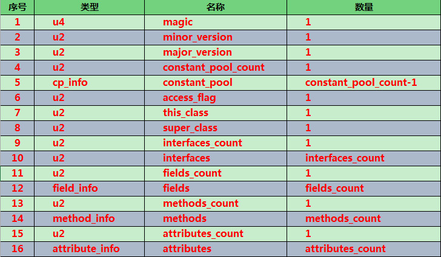

# 1、平台无关性

虚拟机并不关心Class的来源是什么语言，只要它符合一定的结构，就可以在Java中运行Java语言中的各种变量，关键字和运算符的语义最终都是由多条字节码命令组合而成的

# 2、类文件结构

## 2.1、Class文件是一组以8位字节为基础单位的二进制流

各个数据项目严格按照顺序紧凑地排列在 Class 文件中，中间没有添加任何分隔符，这使得整个 Class 文件中存储的内容几乎全部都是程序运行的必要数据；根据Java虚拟机规范的规定，Class 文件格式采用一种类似于C语言结构体的伪结构来存储，这种伪结构中只有两种数据类型：无符号数和表

- 无符号数：无符号数属于基本数据类型，以 u1、u2、u4、u8 来分别代表 1、2、4、8 个字节的无符号数；
- 表：由多个无符号数或其他表作为数据项构成的符合数据类型，所有的表都习惯性地以_info结尾_；

## 2.2.Class 文件格式



magic、minor_version、major_version、constant_pool_count、constant_pool、access_flag、this_class、super_clas、interfaces_count、interfaces、fields_count、fields、methods_count、methods、attributes_count、attributes；从图中可以看出当需要描述同一类型但数量不定的多个数据时，经常会在其前面使用一个前置的容量计数器来记录其数量，而便跟着若干个连续的数据项，称这一系列连续的某一类型的数据为某一类型的集合；Class 文件中各数据项是按照上表的顺序和数量被严格限定的，每个字节代表的含义、长度、先后顺序都不允许改变；

- （1）magic与version：
	- ①、每个Class文件的头4个字节称为魔数(magic)，唯一作用是判断该文件是否为一个能被虚拟机接受的 Class 文件，它的值固定：0xCAFEBAB()
	- ②、紧接着magic的4个字节存储的是 Class 文件的次版本号和主版本号，高版本的JDK能向下兼容低版本的Class文件但不能运行更高版本的Class文件(即向下兼容)

- （2）、constant_pool：major_version(主版本号)之后是常量池的入口，它是 Class 文件中与其他项目关联最多的数据类型，也是占用Class文件空间最大的数据项目之一
	- ①、常量池中主要存放两大类常量：字面量和符号引用
		- 字面量比较接近于Java层面的常量概念，如文本字符串、被声明为final的常量值等；
		- 符号引用总结起来则包括了下面三类常量：
			- 类和接口的全限定名（即带有包名的 Class 名，如：java.lang.Strin）<br>
			- 字段的名称和描述符（private，static 等描述符）；<br>
			- 方法的名称和描述符（private，static 等描述符）；<br>

		当虚拟机运行时，需要从常量池中获得对应的符号引用，再在类加载过程中的解析阶段将其替换为直接引用，并翻译到具体的内存地址中

	- ②、符号引用与直接引用的区别与关联：
		- 符号引用：符号引用是以一组符号来描述所引用的目标，符号可以是任何形式的字面量，只要使用时能无歧义的定位到目标即可，符号引用与虚拟机实现的内存布局无关，引用的目标并不一定已经加载到内存中;
		- 直接引用：直接引用可以是直接指向目标的指针，相对偏移量或者是一个能间接定位到目标的句柄；直接引用是与虚拟机实现的内存布局相关的，同一个符号引用在不同的虚拟机实例上翻译出来的直接引用一般不会相同;如果有了直接引用，那说明引用的目标必定已经存在于内存中了；
	- ③、常量池中的每一项常量都是一个表，共有11种(JDK1.7之前)结构各不相同的表结构数据，每种表开始的第一位是一个u1类型的标志位（1-12，缺少2），代表当前这个常量属于的常量类型，在JDK1.7之后，为了更好的支持动态语言调用，又额外的增加了3中

		|类型								|标志		|描述					|
		| --------------------------------- | ----------|---------------------- |
		|CONSTANT_Utf8_info					|1			|UTF-8编码的字符串		|
		|CONSTANT_Integer_info				|3			|整型字面量				|
		|CONSTANT_Float_info				|4			|浮点型字面量			|
		|CONSTANT_Long_info					|5			|长整型字面量			|
		|CONSTANT_Double_info				|6			|双精度浮点型字面量		|
		|CONSTANT_Class_info				|7			|类或接口的符号引用		|
		|CONSTANT_String_info				|8			|字符串类型字面量		|
		|CONSTANT_Fieldref_info				|9			|字段的符号引用 		|
		|CONSTANT_Methodref_info			|10			|类中方法的符号引用		|
		|CONSTANT_InterfaceMethodref_info	|11			|接口中方法的符号引用	|
		|CONSTANT_NameAndType_info			|12			|字段，方法的部分符号引用|
		|CONSTANT_Methodhandle_info			|15			|表示方法句柄			|
		|CONSTANT_MethodType_info			|16			|标识方法类型			|
		|CONSTANT_InvokeDynamic_info		|18			|表示一个动态方法调用点	|

- （3）access_flag：在常量池结束之后，紧接着的"2个字节"代表访问标志，这个标志用于识别一些类或接口层次的访问信息，包括：Class 是类还是接口，是否定义为 public 或 abstract 类型，如果是的话是否声明为 final。每种访问信息都由一个十六进制的标志值表示，如果同时具有多种访问信息，则得到的标志值为这几种访问信息的标志值的逻辑或；

- （4）this_class、super_class、interfaces
	- ①、this_class(类索引)，super_class(父类索引)都是一个 u2 类型的数据，而interfaces（接口索引集合）则是一组u2类型的数据集合，Class 文件中由这三项数据来确定这个类的继承关系;
	- ②、类索引，父类索引和接口索引集合都按照顺序排列在访问标志之后，类索引和父类索引两个 u2 类型的索引值表示：
		它们各自执行一个类型为 CONSTANT_Class_info 的类描述符常量，通过该常量中的索引值找到定义在CONSTANT_Utf8_info 类型的常量中的全限定名字符串；而接口索引集合就用来描述这个类实现了哪些接口，这些被实现的接口将按 implements{} 语句（如果这个类本身是个接口，则应当是 extends 语句）后的接口顺序从左到右排列在接口的索引集合中

- （5）fields：字段表用于描述接口或类中声明的变量;字段包括了类级变量或实例级变量，但不包含在方法内声明的变量；字段的名字、数据类型、修饰符等都是无法固定的，只能引用常量池中的常量来描述
	
	|类型			|名称				|数量		|
	|---------------|------------------|------------|
	|u2		|		access_flags	|	1   |
	|u2		|		name_index		|	1   |
	|u2		|		descriptor_index|	1   |
	|u2		|		attributes_count|	1   |
	|Attribute_info	|attributes_count|	attributes_count|

	- access_flags：与类中的 access_flag非常类似
	- name_index和descriptor_index都是对常量池的引用，分别代表字段的简单名称及字段和方法的描述符；注意：简单名称，描述符，全限定名：
		```
		==> 简单名称：指没有类型或参数修饰的方法或字段名称
			private final static int m 	==> m
			boolean get(int index)		==> get()
		==> 描述符：是用来描述字段的数据类型、方法的参数列表(包括数量、类型以及顺序等)和返回值的
			B -> byte
			C -> char
			S -> short							
			I -> int
			F -> float
			D -> double
			J -> long
			Z -> boolean
			V -> void
			L -> 对象类型，一般表示：()Ljava/lang/Object;
			int[] -> [I
			int[][] -> [[I
			String[] -> [Ljava/lang/String
		```
		用方法描述符描述方法时，按照先参数后返回值的顺序描述，参数要按照严格的顺序放在一组小括号内。字段表包含的固定数据项目到descriptor_index为止就结束了，但它之后还紧跟着一个属性表集合用于存储一些额外的信息<br>
		★ 注意：字段表集合中不会列出从父类或接口中继承而来的字段，但有可能列出原本Java代码中不存在的字段；比如：比如在内部类中为了保持对外部类的访问性，会自动添加指向外部类实例的字段；

- （6）methods：方法表的结构与属性表的结构相同;方法里的Java代码经过编译器编译程字节码指令后存放在方法属性表集合中一个名为"Code"的属性里；如果父类在子类中没有被覆盖，方法表集合中就不会出现来自父类的方法信息;但同样，有可能会出现由编译器自动添加的方法，最典型的便是类构造器"<clinit>"方法和实例构造器"<init>"方法重载的方法必须是拥有相同的简单名称和一个与原方法不同的特征签名，特征签名就是一个方法中各个参数在常量池中的字段符号引用的集合，也就是说返回值不会包含在特征签名内，因此方法重载跟方法返回值没有关系；

- （7）attributes：属性表，在 Class 文件、字段表、方法表中都可以携带自己的属性表集合。Java 虚拟机运行时会忽略掉他不认识的属性.Java 虚拟机规范中预定义了9项虚拟机应当能识别的属性（JDK1.5之后新增了部分属性），9个基本属性，对于每个属性，它的名称都需要从常量池中引用一个CONSTANT_Utf8_info类型的常量来表示，每个属性值的结构是完全可以自定义的，只需说明属性值所占用的位数长度即可，一个符合规则的属性表至少应具有"attribute_name_info"、"attribute_length"和至少一项信息属性；

	- Code 属性：方法表，Java 代码编译成的字节码指令：Java 程序方法体经过Javac编译后，生成的字节码指令便会储存在Code属性中，但并非所有的方法表都必须存在这个属性，比如接口或抽象类的方法不存在 Code 属性；Code 属性的结构：()	

	- ConstantVlue：字段表，final 关键字定义的常量值，通知虚拟机自动为静态变量赋值，只有被 static 修饰的变量才可以使用这项属性
		- ①、在Java中，对非 static 类型的变量(也就是实例变量)的赋值是在实例构造器<init>方法中进行的；而对于类变量(static 变量)，则有两种方式可以选择：在类构造其中赋值，或使用 ConstantValue 属性赋值

		- ②、目前 Sun Javac 编译器的选择是：如果同时使用 final 和 static 修饰一个变量(即全局变量)，并且这个变量的数据类型是基本类型或String的话，就生成ConstantValue属性来进行初始化，在类加载的准备阶段虚拟机便会根据ConstantValue为常量设置相应的值，如果该变量没有被 final 修饰，或者并非基本类型及字符串，则选择在<clinit>方法中进行初始化<br>
			==> 在实际的程序中，只有同时被 final 和 static 修饰的字段才有ConstantValue属性<br>
			==> 注意：简要说明下 final、static、static final 修饰的字段赋值的区别<br>
			★、final 修饰的字段在运行时才被初始化(可以直接赋值，也可以在实例构造器中赋值)，一旦赋值不可更改;<br>
			★、static 修饰的字段在类加载过程中的准备阶段被初始化 0 或 null 等默认值后，而后在初始化阶段（触发类构造器<clinit>)才会被赋予代码中指定的值，如果没有设定值，那么它的值就为默认值；br>
			★、static final 修饰的字段在 Javac 时生成 ConstantVlue 属性，在类加载准备阶段根据 ConstantVlue的值为该字段赋值，它没有默认值，必须显式的赋值，否则Javac会报错，可以理解为在编译期即把结果放入常量池；

	- Deprecated：类，方法表，字段表;被声明为 deprecated 的方法和字段该属性用于表示某个类、字段和方法，已经被程序作者定为不再推荐使用，它可以通过在代码中使用@Deprecated 注释进行设置；
	- Exceptions：方法表，方法抛出的异常，作用是列举出方法中可能抛出的受查异常，也就是方法描述时在 throws关键字后面列举的异常;结构很简单，只有attribute_name_index、attribute_length、number_of_exceptions、exception_index_table四项
	- InnerClass：类文件，内部类列表该属性用于记录内部类与宿主类之间的关联.如果一个类中定义了内部类，那么编译器将会为它及它所包含的内部类生成InnerClasses属性
	- LinerNumberTable：Code 属性，Java 源码的行号与字节码指令间的对应关系它用于描述Java源码行号与字节码行号之间的对应关系
	- LocalVariableTable：Code 属性，方法的局部变量描述用于描述栈帧中局部变量表中的变量与Java源码中定义的变量之间的对应关系
	- SourceFile：类文件，源文件名称它用于记录生成这个Class文件的源码文件名称
	- Synthetic：类，方法表，字段表;标示类，方法，字段等是编译器自动生成的；该属性代表此字段，方法并不是Java源代码直接生成的，而是由编译器自行添加的，如this和实例构造器、类构造器等