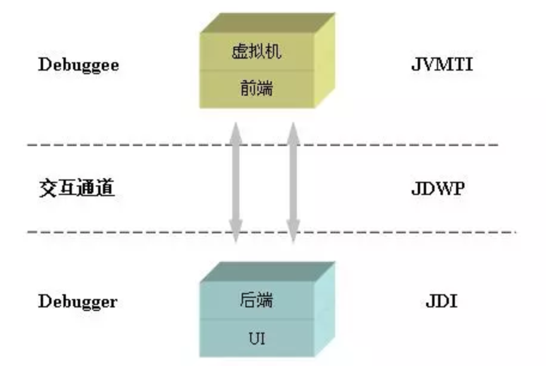

# 1、平台无关性

虚拟机并不关心Class的来源是什么语言，只要它符合一定的结构，就可以在Java中运行Java语言中的各种变量，关键字和运算符的语义最终都是由多条字节码命令组合而成的

# 2、类文件结构

- [Chapter 4. The class File Format](https://docs.oracle.com/javase/specs/jvms/se17/html/jvms-4.html)

查看Hello.java的class文件
```java
public class Hello {
    public static void main(String[] args) {
        System.out.println("Hello, World");
    }
}
```
在Liunx平台下：
```
[root@bluefish software]# xxd Hello.class 
0000000: cafe babe 0000 003d 001d 0a00 0200 0307  .......=........
0000010: 0004 0c00 0500 0601 0010 6a61 7661 2f6c  ..........java/l
0000020: 616e 672f 4f62 6a65 6374 0100 063c 696e  ang/Object...<in
0000030: 6974 3e01 0003 2829 5609 0008 0009 0700  it>...()V.......
0000040: 0a0c 000b 000c 0100 106a 6176 612f 6c61  .........java/la
0000050: 6e67 2f53 7973 7465 6d01 0003 6f75 7401  ng/System...out.
0000060: 0015 4c6a 6176 612f 696f 2f50 7269 6e74  ..Ljava/io/Print
0000070: 5374 7265 616d 3b08 000e 0100 0c48 656c  Stream;......Hel
0000080: 6c6f 2c20 576f 726c 640a 0010 0011 0700  lo, World.......
0000090: 120c 0013 0014 0100 136a 6176 612f 696f  .........java/io
00000a0: 2f50 7269 6e74 5374 7265 616d 0100 0770  /PrintStream...p
00000b0: 7269 6e74 6c6e 0100 1528 4c6a 6176 612f  rintln...(Ljava/
00000c0: 6c61 6e67 2f53 7472 696e 673b 2956 0700  lang/String;)V..
00000d0: 1601 0005 4865 6c6c 6f01 0004 436f 6465  ....Hello...Code
00000e0: 0100 0f4c 696e 654e 756d 6265 7254 6162  ...LineNumberTab
00000f0: 6c65 0100 046d 6169 6e01 0016 285b 4c6a  le...main...([Lj
0000100: 6176 612f 6c61 6e67 2f53 7472 696e 673b  ava/lang/String;
0000110: 2956 0100 0a53 6f75 7263 6546 696c 6501  )V...SourceFile.
0000120: 000a 4865 6c6c 6f2e 6a61 7661 0021 0015  ..Hello.java.!..
0000130: 0002 0000 0000 0002 0001 0005 0006 0001  ................
0000140: 0017 0000 001d 0001 0001 0000 0005 2ab7  ..............*.
0000150: 0001 b100 0000 0100 1800 0000 0600 0100  ................
0000160: 0000 0100 0900 1900 1a00 0100 1700 0000  ................
0000170: 2500 0200 0100 0000 09b2 0007 120d b600  %...............
0000180: 0fb1 0000 0001 0018 0000 000a 0002 0000  ................
0000190: 0003 0008 0004 0001 001b 0000 0002 001c  ................
```

反编译class文件后包含的完整内容如下：[字节码](../Java基础/Lambda-字节码.txt)

## 2.1、Class文件是一组以8位字节为基础单位的二进制流

各个数据项目严格按照顺序紧凑地排列在 Class 文件中，中间没有添加任何分隔符，这使得整个 Class 文件中存储的内容几乎全部都是程序运行的必要数据；根据Java虚拟机规范的规定，Class 文件格式采用一种类似于C语言结构体的伪结构来存储，这种伪结构中只有两种数据类型：无符号数和表

- 无符号数：无符号数属于基本数据类型，以 u1、u2、u4、u8 来分别代表 1、2、4、8 个字节的无符号数；
- 表：由多个无符号数或其他表作为数据项构成的符合数据类型，所有的表都习惯性地以_info结尾_；


## 2.2、Class 文件格式

```class
ClassFile {
    u4             magic;
    u2             minor_version;
    u2             major_version;
    u2             constant_pool_count;
    cp_info        constant_pool[constant_pool_count-1];
    u2             access_flags;
    u2             this_class;
    u2             super_class;
    u2             interfaces_count;
    u2             interfaces[interfaces_count];
    u2             fields_count;
    field_info     fields[fields_count];
    u2             methods_count;
    method_info    methods[methods_count];
    u2             attributes_count;
    attribute_info attributes[attributes_count];
}
```


magic、minor_version、major_version、constant_pool_count、constant_pool、access_flag、this_class、super_clas、interfaces_count、interfaces、fields_count、fields、methods_count、methods、attributes_count、attributes；从图中可以看出当需要描述同一类型但数量不定的多个数据时，经常会在其前面使用一个前置的容量计数器来记录其数量，而便跟着若干个连续的数据项，称这一系列连续的某一类型的数据为某一类型的集合；Class 文件中各数据项是按照上表的顺序和数量被严格限定的，每个字节代表的含义、长度、先后顺序都不允许改变；

### 2.2.1、magic与version

- ①、每个Class文件的头4个字节称为[魔数(magic)](../Java基础/Java-深入.md#八Java魔数)，唯一作用是判断该文件是否为一个能被虚拟机接受的 Class 文件，它的值固定：`0xCAFEBABE`；魔数放在文件开头，JVM可以根据文件的开头来判断这个文件是否可能是一个.class文件，如果是，才会继续进行之后的操作
- ②、紧接着magic的4个字节存储的是 Class 文件的次版本号（Minor Version）和主版本号（Major Version），高版本的JDK能向下兼容低版本的Class文件但不能运行更高版本的Class文件(即向下兼容)

### 2.2.2、constant_pool

major_version(主版本号)之后是常量池的入口，它是 Class 文件中与其他项目关联最多的数据类型，也是占用Class文件空间最大的数据项目之一

对于 JVM 字节码来说，如果操作数非常小或者很常用的数字 0 之类的，这些操作数是内嵌到字节码中的。如果是字符串常量和较大的整数等，class 文件是把这些操作数存储在一个叫常量池（Constant Pool）的地方，当使用这些操作数时，使用的是常量池数据中的索引位置

Java 虚拟机目前一共定义了 14 种常量类型，这些常量名都以 "CONSTANT" 开头，以 "info" 结尾，如下表所示：

|类型								|标志		|描述					|
| --------------------------------- | ----------|---------------------- |
|CONSTANT_Utf8_info					|1			|UTF-8编码的字符串		|
|CONSTANT_Integer_info				|3			|整型字面量				|
|CONSTANT_Float_info				|4			|浮点型字面量			|
|CONSTANT_Long_info					|5			|长整型字面量			|
|CONSTANT_Double_info				|6			|双精度浮点型字面量		|
|CONSTANT_Class_info				|7			|类或接口的符号引用		|
|CONSTANT_String_info				|8			|字符串类型字面量		|
|CONSTANT_Fieldref_info				|9			|字段的符号引用 		|
|CONSTANT_Methodref_info			|10			|类中方法的符号引用		|
|CONSTANT_InterfaceMethodref_info	|11			|接口中方法的符号引用	|
|CONSTANT_NameAndType_info			|12			|字段，方法的部分符号引用|
|CONSTANT_Methodhandle_info			|15			|表示方法句柄			|
|CONSTANT_MethodType_info			|16			|标识方法类型			|
|CONSTANT_InvokeDynamic_info		|18			|表示一个动态方法调用点	|

每个常量项都由两部分构成：表示类型的 tag 和表示内容的字节数组，如下所示：
```
cp_info {
    u1 tag;
    u1 info[];
}
```
常量池中主要存放两大类常量：字面量和符号引用
- 字面量比较接近于Java层面的常量概念，如文本字符串、被声明为final的常量值等；
- 符号引用总结起来则包括了下面三类常量：
    - 类和接口的全限定名（即带有包名的 Class 名，如：java.lang.String）
    - 字段的名称和描述符（private，static 等描述符）；
    - 方法的名称和描述符（private，static 等描述符）；

JVM是在加载Class文件的时候才进行的动态链接，也就是说这些字段和方法符号引用只有在运行期转换后才能获得真正的内存入口地址；当虚拟机运行时，需要从常量池中获得对应的符号引用，再在类加载过程中的解析阶段将其替换为直接引用，并翻译到具体的内存地址中

符号引用与直接引用的区别与关联：
- 符号引用：符号引用是以一组符号来描述所引用的目标，符号可以是任何形式的字面量，只要使用时能无歧义的定位到目标即可，符号引用与虚拟机实现的内存布局无关，引用的目标并不一定已经加载到内存中;
- 直接引用：直接引用可以是直接指向目标的指针，相对偏移量或者是一个能间接定位到目标的句柄；直接引用是与虚拟机实现的内存布局相关的，同一个符号引用在不同的虚拟机实例上翻译出来的直接引用一般不会相同;如果有了直接引用，那说明引用的目标必定已经存在于内存中了；

### 2.2.3、access_flag

在常量池结束之后，紧接着的"2个字节"代表访问标志，这个标志用于识别一些类或接口层次的访问信息，包括：Class 是类还是接口，是否定义为 public 或 abstract 类型，如果是的话是否声明为 final。每种访问信息都由一个十六进制的标志值表示，如果同时具有多种访问信息，则得到的标志值为这几种访问信息的标志值的逻辑或；

|标志名称				|标志值			 | 含义|
|----------------------|---------------|---------------------------------------|
|ACC_PUBLIC			   	|0x0001			|是否为public|
|ACC_FINAL				|0x0010			|是否被声明为final，只有类可以设置|
|ACC_SUPER				|0x0020			|是否允许使用invokespecial字节码指令的新语义|
|ACC_INTERFACE			|0x0200			|标识是一个接口|
|ACC_ABSTRACT			|0x0400			|是否为abstract类型，对于接口或者抽象类来说，此标志值为真，其他类型类型为假|
|ACC_SYNTHETIC			|0x1000			|标识这个类并未由用户代码产生的|
|ACC_ANNOTATION			|0x2000			|标识这是一个注解|
|ACC_ENUM				|0x4000			|标识是一个枚举|
|ACC_MODULE				|0x8000			|标识是一个模块|

### 2.2.4、this_class、super_class、interfaces

- ①、this_class(类索引)，super_class(父类索引)都是一个 u2 类型的数据，而interfaces（接口索引集合）则是一组u2类型的数据集合（描述了该类或父类实现的接口数量），Class 文件中由这三项数据来确定这个类的继承关系;
- ②、类索引，父类索引和接口索引集合都按照顺序排列在访问标志之后，类索引和父类索引两个 u2 类型的索引值表示：
	它们各自执行一个类型为 CONSTANT_Class_info 的类描述符常量，通过该常量中的索引值找到定义在CONSTANT_Utf8_info 类型的常量中的全限定名字符串；而接口索引集合就用来描述这个类实现了哪些接口，这些被实现的接口将按 implements{} 语句（如果这个类本身是个接口，则应当是 extends 语句）后的接口顺序从左到右排列在接口的索引集合中

### 2.2.5、fields

字段表用于描述接口或类中声明的变量；字段包括了类级变量或实例级变量，但不包含在方法内声明的变量；字段的名字、数据类型、修饰符等都是无法固定的，只能引用常量池中的常量来描述；字段表也分为两部分，第一部分为两个字节，描述字段个数；第二部分是每个字段的详细信息fields_info
	
|类型			|名称				|数量		|
|---------------|------------------|------------|
|u2		|		access_flags	|	1   |
|u2		|		name_index		|	1   |
|u2		|		descriptor_index|	1   |
|u2		|		attributes_count|	1   |
|Attribute_info	|attributes_count|	attributes_count|
```
field_info {
    u2             access_flags; 
    u2             name_index;
    u2             descriptor_index;
    u2             attributes_count;
    attribute_info attributes[attributes_count];
}
```
- access_flags：与类中的 access_flag非常类似
- name_index和descriptor_index都是对常量池的引用，分别代表（字段名的索引值，指向常量池的的字符串常量）和 （字段描述符的索引，指向常量池的字符串常量）；注意：简单名称，描述符，全限定名：
	```
	==> 简单名称：指没有类型或参数修饰的方法或字段名称
		private final static int m 	==> m
		boolean get(int index)		==> get()
	==> 描述符：是用来描述字段的数据类型、方法的参数列表(包括数量、类型以及顺序等)和返回值的
		B -> byte
		C -> char
		S -> short							
		I -> int
		F -> float
		D -> double
		J -> long
		Z -> boolean
		V -> void
		L -> 对象类型，一般表示：()Ljava/lang/Object;
		int[] -> [I
		int[][] -> [[I
		String[] -> [Ljava/lang/String
	```
	用方法描述符描述方法时，按照先参数后返回值的顺序描述，参数要按照严格的顺序放在一组小括号内。字段表包含的固定数据项目到descriptor_index为止就结束了，但它之后还紧跟着一个属性表集合用于存储一些额外的信息<br>
	★ 注意：字段表集合中不会列出从父类或接口中继承而来的字段，但有可能列出原本Java代码中不存在的字段；比如：比如在内部类中为了保持对外部类的访问性，会自动添加指向外部类实例的字段；
- attributes_count、attribute_info：表示属性的个数和属性集合。

### 2.2.6、methods

```java
public com.rhythm7.Main();
   descriptor: ()V
   flags: ACC_PUBLIC
   Code:
     stack=1, locals=1, args_size=1
        0: aload_0
        1: invokespecial #1                  // Method java/lang/Object."<init>":()V
        4: return
     LineNumberTable:
       line 3: 0
     LocalVariableTable:
       Start  Length  Slot  Name   Signature
           0       5     0  this   Lcom/blue/fish/Main;
```

方法表的结构与属性表的结构相同；方法里的Java代码经过编译器编译程字节码指令后存放在方法属性表集合中一个名为"Code"的属性里；如果父类在子类中没有被覆盖，方法表集合中就不会出现来自父类的方法信息；但同样，有可能会出现由编译器自动添加的方法，最典型的便是类构造器`<clinit>`方法和实例构造器`<init>`方法重载的方法必须是拥有相同的简单名称和一个与原方法不同的特征签名，特征签名就是一个方法中各个参数在常量池中的字段符号引用的集合，也就是说返回值不会包含在特征签名内，因此方法重载跟方法返回值没有关系；

code内的主要属性：
- **stack**: 最大操作数栈，JVM运行时会根据这个值来分配栈帧(Frame)中的操作栈深度,此处为1
- **locals**: 局部变量所需的存储空间，单位为Slot, Slot是虚拟机为局部变量分配内存时所使用的最小单位，为4个字节大小。方法参数(包括实例方法中的隐藏参数this)，显示异常处理器的参数(try catch中的catch块所定义的异常)，方法体中定义的局部变量都需要使用局部变量表来存放。值得一提的是，locals的大小并不一定等于所有局部变量所占的Slot之和，因为局部变量中的Slot是可以重用的。
- **args_size**: 方法参数的个数，这里是1，因为每个实例方法都会有一个隐藏参数this
- **attribute_info**: 方法体内容，0,1,4为字节码"行号"，该段代码的意思是将第一个引用类型本地变量推送至栈顶，然后执行该类型的实例方法，也就是常量池存放的第一个变量，也就是注释里的"java/lang/Object."")V", 然后执行返回语句，结束方法。
- **LineNumberTable**: 该属性的作用是描述源码行号与字节码行号(字节码偏移量)之间的对应关系。可以使用 `-g:none` 或`-g:lines`选项来取消或要求生成这项信息，如果选择不生成LineNumberTable，当程序运行异常时将无法获取到发生异常的源码行号，也无法按照源码的行数来调试程序。
- **LocalVariableTable**: 该属性的作用是描述帧栈中局部变量与源码中定义的变量之间的关系。可以使用 `-g:none` 或 `-g:vars`来取消或生成这项信息，如果没有生成这项信息，那么当别人引用这个方法时，将无法获取到参数名称，取而代之的是arg0, arg1这样的占位符。 start 表示该局部变量在哪一行开始可见，length表示可见行数，Slot代表所在帧栈位置，Name是变量名称，然后是类型签名。


### 2.2.7、attributes：属性表

在 Class 文件、字段表、方法表中都可以携带自己的属性表集合。Java 虚拟机运行时会忽略掉他不认识的属性.Java 虚拟机规范中预定义了9项虚拟机应当能识别的属性（JDK1.5之后新增了部分属性），9个基本属性，对于每个属性，它的名称都需要从常量池中引用一个CONSTANT_Utf8_info类型的常量来表示，每个属性值的结构是完全可以自定义的，只需说明属性值所占用的位数长度即可，一个符合规则的属性表至少应具有"attribute_name_info"、"attribute_length"和至少一项信息属性；

- Code 属性：方法表，Java 代码编译成的字节码指令：Java 程序方法体经过Javac编译后，生成的字节码指令便会储存在Code属性中，但并非所有的方法表都必须存在这个属性，比如接口或抽象类的方法不存在 Code 属性；Code 属性的结构：()	

- ConstantVlue：字段表，final 关键字定义的常量值，通知虚拟机自动为静态变量赋值，只有被 static 修饰的变量才可以使用这项属性
	- ①、在Java中，对非 static 类型的变量(也就是实例变量)的赋值是在实例构造器<init>方法中进行的；而对于类变量(static 变量)，则有两种方式可以选择：在类构造其中赋值，或使用 ConstantValue 属性赋值

	- ②、目前 Sun Javac 编译器的选择是：如果同时使用 final 和 static 修饰一个变量(即全局变量)，并且这个变量的数据类型是基本类型或String的话，就生成ConstantValue属性来进行初始化，在类加载的准备阶段虚拟机便会根据ConstantValue为常量设置相应的值，如果该变量没有被 final 修饰，或者并非基本类型及字符串，则选择在<clinit>方法中进行初始化<br>
		==> 在实际的程序中，只有同时被 final 和 static 修饰的字段才有ConstantValue属性<br>
		==> 注意：简要说明下 final、static、static final 修饰的字段赋值的区别<br>
		★、final 修饰的字段在运行时才被初始化(可以直接赋值，也可以在实例构造器中赋值)，一旦赋值不可更改;<br>
		★、static 修饰的字段在类加载过程中的准备阶段被初始化 0 或 null 等默认值后，而后在初始化阶段（触发类构造器<clinit>)才会被赋予代码中指定的值，如果没有设定值，那么它的值就为默认值；br>
		★、static final 修饰的字段在 Javac 时生成 ConstantVlue 属性，在类加载准备阶段根据 ConstantVlue的值为该字段赋值，它没有默认值，必须显式的赋值，否则Javac会报错，可以理解为在编译期即把结果放入常量池；

- Deprecated：类，方法表，字段表;被声明为 deprecated 的方法和字段该属性用于表示某个类、字段和方法，已经被程序作者定为不再推荐使用，它可以通过在代码中使用@Deprecated 注释进行设置；
- Exceptions：方法表，方法抛出的异常，作用是列举出方法中可能抛出的受查异常，也就是方法描述时在 throws关键字后面列举的异常;结构很简单，只有attribute_name_index、attribute_length、number_of_exceptions、exception_index_table四项
- InnerClass：类文件，内部类列表该属性用于记录内部类与宿主类之间的关联.如果一个类中定义了内部类，那么编译器将会为它及它所包含的内部类生成InnerClasses属性
- LinerNumberTable：Code 属性，Java 源码的行号与字节码指令间的对应关系它用于描述Java源码行号与字节码行号之间的对应关系
- LocalVariableTable：Code 属性，方法的局部变量描述用于描述栈帧中局部变量表中的变量与Java源码中定义的变量之间的对应关系
- SourceFile：类文件，源文件名称它用于记录生成这个Class文件的源码文件名称
- Synthetic：类，方法表，字段表;标示类，方法，字段等是编译器自动生成的；该属性代表此字段，方法并不是Java源代码直接生成的，而是由编译器自行添加的，如this和实例构造器、类构造器等

## 2.3、字节码操作集合

在方法列表图中中，Code区的红色编号0～17，就是`.java`中的方法源代码编译后让JVM真正执行的操作码。为了帮助人们理解，反编译后看到的是十六进制操作码所对应的助记符，十六进制值操作码与助记符的对应关系，以及每一个操作码的用处可以查看Oracle官方文档进行了解，在需要用到时进行查阅即可。比如上图中第一个助记符为iconst_2，对应到图2中的字节码为0x05，用处是将int值2压入操作数栈中。以此类推，对0~17的助记符理解后，就是完整的add()方法的实现；

## 2.4、操作数栈

JVM的指令集是基于栈而不是寄存器，基于栈可以具备很好的跨平台性（因为寄存器指令集往往和硬件挂钩），但缺点在于，要完成同样的操作，基于栈的实现需要更多指令才能完成（因为栈只是一个FILO结构，需要频繁压栈出栈）。另外，由于栈是在内存实现的，而寄存器是在CPU的高速缓存区，相较而言，基于栈的速度要慢很多，这也是为了跨平台性而做出的牺牲

执行每一条指令之前，Java 虚拟机要求该指令的操作数已被压入操作数栈中。在执行指令时，Java 虚拟机会将该指令所需的操作数弹出，并且将指令的结果重新压入栈中；

以加法指令 iadd 为例。假设在执行该指令前，栈顶的两个元素分别为 int 值 1 和 int 值 2，那么 iadd 指令将弹出这两个 int，并将求得的和 int 值 3 压入栈中；

Java 字节码中有好几条指令是直接作用在操作数栈上的。
- 最为常见的便是 dup： 复制栈顶元素；
- 以及 pop：舍弃栈顶元素。pop 指令则常用于舍弃调用指令的返回结果

dup 指令常用于复制 new 指令所生成的未经初始化的引用，例如在下面这段代码的 foo 方法中，当执行 new 指令时，Java 虚拟机将指向一块已分配的、未初始化的内存的引用压入操作数栈中：
```java
public void foo() {
Object o = new Object();
}
// 对应的字节码如下：
public void foo();
    0  new java.lang.Object [3]
    3  dup
    4  invokespecial java.lang.Object() [8]
    7  astore_1 [o]
    8  return
```
需要注意的是，上述两条指令只能处理非 long 或者非 double 类型的值，这是因为 long 类型或者 double 类型的值，需要占据两个栈单元。当遇到这些值时，我们需要同时复制栈顶两个单元的 dup2 指令，以及弹出栈顶两个单元的 pop2 指令

## 2.5、字节码指令

**invoke(调用）**
- invokespecial：call super(), private, init()
- invokedynamic
	- duck typing……：绕过检查、限制等
	- call lambda
	- 操作符+-*/
- invokestatic：call static method
- invokevirtual
	- 虚函数-可以重写的函数
	- 排除：static,private,final
- invokeinterface

**load（压栈）**
- local variable
	- stack
	- getxxxx
- store(存储）：ref -> local variable

**计算：**
	add/mul/div/sub……

**跳转：**
	jsr/jsr_w/return/goto……

## 2.6、查看class字节码

### 2.6.1、javap

javap 是 JDK 自带的反解析工具。它的作用是将 `.class` 字节码文件解析成可读的文件格式。在使用 javap 时我一般会添加 `-v` 参数，尽量多打印一些信息。同时，我也会使用 `-p` 参数，打印一些私有的字段和方法；

Java源文件：
```java
public class DecompileTest {
    public static String s = "@Hello";
    public String add(int a, int b){
        int d = (a + b) * 100;
        return d + s;
    }
    public static void main(String[] argv) {
    }
}
```
编译源文件为class文件：`javac DecompileTest`

反编译：`javap -c DecompileTest.class`，得到如下内容：

**JDK8反编译的字节码内容**
```java
Compiled from "DecompileTest.java"
public class jvm.DecompileTest {
  public static java.lang.String s;

  public jvm.DecompileTest();
    Code:
       0: aload_0
       1: invokespecial #1                  // Method java/lang/Object."<init>":()V
       4: return

  public java.lang.String add(int, int);
    Code:
       0: iload_1
       1: iload_2
       2: iadd
       3: bipush        100
       5: imul
       6: istore_3
       7: new           #2                  // class java/lang/StringBuilder
      10: dup
      11: invokespecial #3                  // Method java/lang/StringBuilder."<init>":()V
      14: iload_3
      15: invokevirtual #4                  // Method java/lang/StringBuilder.append:(I)Ljava/lang/StringBuilder;
      18: getstatic     #5                  // Field s:Ljava/lang/String;
      21: invokevirtual #6                  // Method java/lang/StringBuilder.append:(Ljava/lang/String;)Ljava/lang/StringBuilder;
      24: invokevirtual #7                  // Method java/lang/StringBuilder.toString:()Ljava/lang/String;
      27: areturn

  public static void main(java.lang.String[]);
    Code:
       0: return

  static {};
    Code:
       0: ldc           #8                  // String @Hello
       2: putstatic     #5                  // Field s:Ljava/lang/String;
       5: return
}
```
**JDK11反编译的内容：**
```java
Compiled from "DecompileTest.java"
public class jvm.DecompileTest {
  public static java.lang.String s;

  public jvm.DecompileTest();
    Code:
       0: aload_0
       1: invokespecial #1                  // Method java/lang/Object."<init>":()V
       4: return

  public java.lang.String add(int, int);
    Code:
       0: iload_1
       1: iload_2
       2: iadd
       3: bipush        100
       5: imul
       6: istore_3
       7: iload_3
       8: getstatic     #2                  // Field s:Ljava/lang/String;
      11: invokedynamic #3,  0              // InvokeDynamic #0:makeConcatWithConstants:(ILjava/lang/String;)Ljava/lang/String;
      16: areturn

  public static void main(java.lang.String[]);
    Code:
       0: return

  static {};
    Code:
       0: ldc           #4                  // String @Hello
       2: putstatic     #2                  // Field s:Ljava/lang/String;
       5: return
}
```
通过对比不同jdk版本的实现，可以发现，对于 通过 `+` 拼接在字节码实现上是不一样的，在jdk8使用的是 `StringBuilder.append` 方法来实现的，而在jdk11则是使用 invokedynamic 指令来实现的；因为invoke dynamic很快。比如传一个方法给thread，看接口定义需要用这个方法产生一个callable或者一个runnable。但是调用方法完全没有必要再生成一个object。所以编译器可以将方法调用处生成一条invoke dynamic指令；

### 2.6.2、jclasslib

idea的一个插件


# 3、字节码增强

字节码增强技术就是一类对现有字节码进行修改或者动态生成全新字节码文件的技术

- BCEL：apache
- ASM：轻量级的字节码操作框架，涉及到jvm底层的操作和指令
- CGLIB：基于asm实现（已不维护）
- ByteBuddy
- javaasist：性能比较差，使用简单
- [asmtools](https://wiki.openjdk.org/display/CodeTools/asmtools)，如何安装，参考文章：[asmtools-安装](https://wenjie.store/archives/ant-asmtools-awk)

## 3.1、ASM

- [ASM](https://asm.ow2.io/)
- [ASMSupport](https://gitee.com/chenlanqing/asmsupport)

## 3.2、Javassist

- [javassist](https://github.com/jboss-javassist/javassist)
- [基于 Javassist 和 Javaagent 实现动态切面](https://www.cnblogs.com/chiangchou/p/javassist.html)

```java
public class GenerateClass {
    public static byte[] genClass() throws CannotCompileException, IOException {
        ClassPool pool = ClassPool.getDefault();
        CtClass ctClass = pool.getOrNull("jvm.loader.Go");
        if (ctClass != null) {
            ctClass.defrost();
        }
        ctClass = pool.makeClass("jvm.loader.Go");
        CtMethod method = new CtMethod(CtClass.voidType, "greeting", new CtClass[]{}, ctClass);
        method.setModifiers(Modifier.PUBLIC);
        method.setBody("{System.out.println(\"Hello World\");}");
        ctClass.addMethod(method);
        return ctClass.toBytecode();
    }
}
```

# 4、运行时类的重载

如果我们在一个JVM中，先加载了一个类，然后又对其进行字节码增强并重新加载会发生什么呢？模拟这种情况，在增强前就先让JVM加载Base类，然后在执行到c.toClass()方法时会抛出错误，JVM是不允许在运行时动态重载一个类的：
```
Exception in thread "main" javassist.CannotCompileException: by java.lang.ClassFormatError: loader (instance of  sun/misc/Launcher$AppClassLoader): attempted  duplicate class definition for name: "com/blue/fish/example/bytecode/Base"
	at javassist.util.proxy.DefineClassHelper.toClass(DefineClassHelper.java:271)
	at javassist.ClassPool.toClass(ClassPool.java:1240)
	at javassist.ClassPool.toClass(ClassPool.java:1098)
	at javassist.ClassPool.toClass(ClassPool.java:1056)
	at javassist.CtClass.toClass(CtClass.java:1298)
	at com.blue.fish.example.bytecode.javassist.JavassistTest.main(JavassistTest.java:16)
Caused by: java.lang.ClassFormatError: loader (instance of  sun/misc/Launcher$AppClassLoader): attempted  duplicate class definition for name: "com/blue/fish/example/bytecode/Base"
	at javassist.util.proxy.DefineClassHelper$Java7.defineClass(DefineClassHelper.java:182)
	at javassist.util.proxy.DefineClassHelper.toClass(DefineClassHelper.java:260)
	... 5 more
```

那如何解决JVM不允许运行时重加载类信息的问题呢？比如，运行下列程序，需要在 AttachBase 运行过程中对 process 方法进行增强，在其前后加上start和end
```java
public class AttachBase {
    public static void main(String[] args) {
        String name = ManagementFactory.getRuntimeMXBean().getName();
        String s = name.split("@")[0];
        //打印当前Pid
        System.out.println("pid:"+s);
        while (true) {
            try {
                Thread.sleep(5000L);
            } catch (Exception e) {
                break;
            }
            process();
        }
    }
    public static void process() {
        System.out.println("process");
    }
}
```

## 4.1、instrument

instrument是JVM提供的一个可以修改已加载类的类库，专门为Java语言编写的插桩服务提供支持。它需要依赖JVMTI的Attach API机制实现。

在JDK 1.6以前，instrument只能在JVM刚启动开始加载类时生效，而在JDK 1.6之后，instrument支持了在运行时对类定义的修改。要使用instrument的类修改功能，我们需要实现它提供的ClassFileTransformer接口，定义一个类文件转换器。接口中的transform()方法会在类文件被加载时调用，而在transform方法里，我们可以利用上文中的ASM或Javassist对传入的字节码进行改写或替换，生成新的字节码数组后返回

我们定义一个实现了ClassFileTransformer接口的类TestTransformer，依然在其中利用Javassist对Base类中的process()方法进行增强，在前后分别打印“start”和“end”，代码如下：
```java
public class TestTransformer implements ClassFileTransformer {
    @Override
    public byte[] transform(ClassLoader loader, String className, Class<?> classBeingRedefined, ProtectionDomain protectionDomain, byte[] classfileBuffer) {
        System.out.println("Transforming " + className);
        try {
            ClassPool cp = ClassPool.getDefault();
            CtClass cc = cp.get("com.blue.fish.example.bytecode.jvmti.AttachBase");
            CtMethod m = cc.getDeclaredMethod("process");
            m.insertBefore("{ System.out.println(\"start\"); }");
            m.insertAfter("{ System.out.println(\"end\"); }");
            return cc.toBytecode();
        } catch (Exception e) {
            e.printStackTrace();
        }
        return null;
    }
}
```

有了Transformer，那么它要如何注入到正在运行的JVM呢？还需要定义一个Agent，借助Agent的能力将Instrument注入到JVM中。在JDK 1.6之后，Instrumentation可以做启动后的Instrument、本地代码（Native Code）的Instrument，以及动态改变Classpath等等。我们可以向Instrumentation中添加上文中定义的Transformer，并指定要被重加载的类，代码如下所示。这样，当Agent被Attach到一个JVM中时，就会执行类字节码替换并重载入JVM的操作
```java
public class TestAgent {
    public static void agentmain(String args, Instrumentation inst) {
        //指定我们自己定义的Transformer，在其中利用Javassist做字节码替换
        inst.addTransformer(new TestTransformer(), true);
        try {
            //重定义类并载入新的字节码
            inst.retransformClasses(AttachBase.class);
            System.out.println("Agent Load Done.");
        } catch (Exception e) {
            System.out.println("agent load failed!");
        }
    }
}
```

## 4.2、JVMTI & Agent & Attach API

如果JVM启动时开启了JPDA，那么类是允许被重新加载的。在这种情况下，已被加载的旧版本类信息可以被卸载，然后重新加载新版本的类。正如JDPA名称中的Debugger，JDPA其实是一套用于调试Java程序的标准，任何JDK都必须实现该标准。

JPDA定义了一整套完整的体系，它将调试体系分为三部分，并规定了三者之间的通信接口。三部分由低到高分别是Java 虚拟机工具接口（JVMTI），Java 调试协议（JDWP）以及 Java 调试接口（JDI），三者之间的关系如下图所示：



可以借助JVMTI的一部分能力，帮助动态重载类信息。JVM TI（JVM TOOL INTERFACE，JVM工具接口）是JVM提供的一套对JVM进行操作的工具接口。通过JVMTI，可以实现对JVM的多种操作，它通过接口注册各种事件勾子，在JVM事件触发时，同时触发预定义的勾子，以实现对各个JVM事件的响应，事件包括类文件加载、异常产生与捕获、线程启动和结束、进入和退出临界区、成员变量修改、GC开始和结束、方法调用进入和退出、临界区竞争与等待、VM启动与退出等等。

Agent就是JVMTI的一种实现，Agent有两种启动方式：
- 随Java进程启动而启动，经常见到的`java -agentlib`就是这种方式；
- 运行时载入，通过attach API，将模块（jar包）动态地Attach到指定进程id的Java进程内。

Attach API 的作用是提供JVM进程间通信的能力，比如说我们为了让另外一个JVM进程把线上服务的线程Dump出来，会运行jstack或jmap的进程，并传递pid的参数，告诉它要对哪个进程进行线程Dump，这就是Attach API做的事情。在下面，我们将通过Attach API的loadAgent()方法，将打包好的Agent jar包动态Attach到目标JVM上。

具体实现起来的步骤如下：
- 定义Agent，并在其中实现AgentMain方法，比如之前定义的TestAgent类；
- 然后将TestAgent类打成一个包含`MANIFEST.MF`的jar包，其中`MANIFEST.MF`文件中将Agent-Class属性指定为TestAgent的全限定名；
	```
	Manifest-Version: 1.0
	Agent-Class: com.blue.fish.example.bytecode.jvmti.TestAgent
	Created-By: QingFan
	Can-Redefine-Classes: true
	Can-Retransform-Classes: true
	Boot-Class-Path: javassist-3.27.0-GA.jar
	
	```
	如何打包成jar包，参考：[打包Java工程](../Java基础/Java基础知识.md#5.1打包Java工程)
- 最后利用Attach API，将我们打包好的jar包Attach到指定的JVM pid上，代码如下：
	```java
	public class TestAttach {
		public static void main(String[] args) throws Exception {
			// 传入目标 JVM pid
			VirtualMachine vm = VirtualMachine.attach("62480");
			// 上面打包好的jar
			vm.loadAgent("attacher.jar");
		}
	}
	```

由于在MANIFEST.MF中指定了Agent-Class，所以在Attach后，目标JVM在运行时会走到TestAgent类中定义的agentmain()方法，而在这个方法中，我们利用Instrumentation，将指定类的字节码通过定义的类转化器TestTransformer做了Base类的字节码替换（通过javassist），并完成了类的重新加载。由此，我们达成了“在JVM运行时，改变类的字节码并重新载入类信息”的目的

## 4.3、使用场景

节码增强技术的可使用范围就不再局限于JVM加载类前了。通过上述几个类库，我们可以在运行时对JVM中的类进行修改并重载了。通过这种手段，可以做的事情就变得很多了：
- 热部署：不部署服务而对线上服务做修改，可以做打点、增加日志等操作。[热部署-美团实践](https://mp.weixin.qq.com/s/dE-lneZE85SAfhZLyUeLZw)
- Mock：测试时候对某些服务做Mock。
- 性能诊断工具：比如bTrace就是利用Instrument，实现无侵入地跟踪一个正在运行的JVM，监控到类和方法级别的状态信息。

# 5、JavaAgent

* [字节码增强探索](https://tech.meituan.com/2019/09/05/java-bytecode-enhancement.html)
* [Java探针技术](https://www.cnblogs.com/aspirant/p/8796974.html)
* [Java Agent](https://www.jianshu.com/p/5bfe16c9ce4e)
* [Java Agent类隔离](https://mp.weixin.qq.com/s/6dyHV2yyccJxgTEOKBUgTA)


## 5.1、Java Instrumentation

Instrumentation是Java提供的一个来自JVM的接口，该接口提供了一系列查看和操作Java类定义的方法，例如修改类的字节码、向classLoader的classpath下加入jar文件等。使得开发者可以通过Java语言来操作和监控JVM内部的一些状态，进而实现Java程序的监控分析，甚至实现一些特殊功能（如AOP、热部署）。
 
Instrumentation的一些主要方法如下：
```java
public interface Instrumentation {
    /**
     * 注册一个Transformer，从此之后的类加载都会被Transformer拦截。
     * Transformer可以直接对类的字节码byte[]进行修改
     */
    void addTransformer(ClassFileTransformer transformer);
    /**
     * 对JVM已经加载的类重新触发类加载。使用的就是上面注册的Transformer。
     * retransformation可以修改方法体，但是不能变更方法签名、增加和删除方法/类的成员属性
     */
    void retransformClasses(Class<?>... classes) throws UnmodifiableClassException;
    /**
     * 获取一个对象的大小
     */
    long getObjectSize(Object objectToSize);
    /**
     * 将一个jar加入到bootstrap classloader的 classpath里
     */
    void appendToBootstrapClassLoaderSearch(JarFile jarfile);
    /**
     * 获取当前被JVM加载的所有类对象
     */
    Class[] getAllLoadedClasses();
}
```
其中最常用的方法就是`addTransformer(ClassFileTransformer transformer)`了，这个方法可以在类加载时做拦截，对输入的类的字节码进行修改，其参数是一个ClassFileTransformer接口，定义如下：
```java
/**
 * 传入参数表示一个即将被加载的类，包括了classloader，classname和字节码byte[]
 * 返回值为需要被修改后的字节码byte[]
 */
byte[]
transform(  ClassLoader         loader,
            String              className,
            Class<?>            classBeingRedefined,
            ProtectionDomain    protectionDomain,
            byte[]              classfileBuffer)  throws IllegalClassFormatException;
```
addTransformer方法配置之后，后续的类加载都会被Transformer拦截。对于已经加载过的类，可以执行retransformClasses来重新触发这个Transformer的拦截。类加载的字节码被修改后，除非再次被retransform，否则不会恢复。

主流的JVM都提供了Instrumentation的实现，但是鉴于Instrumentation的特殊功能，并不适合直接提供在JDK的runtime里，而更适合出现在Java程序的外层，以上帝视角在合适的时机出现。因此如果想使用Instrumentation功能，拿到Instrumentation实例，必须通过Java agent

## 5.2、Java agent

Java agent是一种特殊的Java程序（Jar文件），它是Instrumentation的客户端。与普通Java程序通过main方法启动不同，agent并不是一个可以单独启动的程序，而必须依附在一个Java应用程序（JVM）上，与它运行在同一个进程中，通过Instrumentation API与虚拟机交互。

Java agent与Instrumentation密不可分，二者也需要在一起使用。因为Instrumentation的实例会作为参数注入到Java agent的启动方法中。

JavaAgent 是运行在 main方法之前的拦截器，它内定的方法名叫 premain ，也就是说先执行 premain 方法然后再执行 main 方法
- 支持方法执行耗时范围抓取设置，根据耗时范围抓取系统运行时出现在设置耗时范围的代码运行轨迹。
- 支持抓取特定的代码配置，方便对配置的特定方法进行抓取，过滤出关系的代码执行耗时情况。
- 支持APP层入口方法过滤，配置入口运行前的方法进行监控，相当于监控特有的方法耗时，进行方法专题分析。
- 支持入口方法参数输出功能，方便跟踪耗时高的时候对应的入参数。
- 提供WEB页面展示接口耗时展示、代码调用关系图展示、方法耗时百分比展示、可疑方法凸显功能

Java agent以jar包的形式部署在JVM中，jar文件的manifest需要指定agent的类名。根据不同的启动时机，agent类需要实现不同的方法（二选一）:
```java
/**
 * 以vm参数的形式载入，在程序main方法执行之前执行
 * 其jar包的manifest需要配置属性Premain-Class
 */
public static void premain(String agentArgs, Instrumentation inst);
/**
 * 以Attach的方式载入，在Java程序启动后执行
 * 其jar包的manifest需要配置属性Agent-Class
 */
public static void agentmain(String agentArgs, Instrumentation inst);
```

**其原理：**
我们利用Java代理和ASM字节码技术，在JVM加载class二进制文件的时候，利用ASM动态的修改加载的class文件，在监控的方法前后添加计时器功能，用于计算监控方法耗时，同时将方法耗时及内部调用情况放入处理器，处理器利用栈先进后出的特点对方法调用先后顺序做处理，当一个请求处理结束后，将耗时方法轨迹和入参map输出到文件中，然后根据map中相应参数或耗时方法轨迹中的关键代码区分出我们要抓取的耗时业务。最后将相应耗时轨迹文件取下来，转化为xml格式并进行解析，通过浏览器将代码分层结构展示出来，方便耗时分析

## 5.3、手动编写java agent

在`META-INF`目录下创建`MANIFEST`文件
```
Manifest-Version: 1.0
Agent-Class: com.blue.fish.agent.AgentBoot
Premain-Class: com.blue.fish.agent.AgentBoot
Can-Redefine-Classes: true
Can-Retransform-Classes: true
```
如果不想手写该文件，可以使用maven来生成：
```xml
<plugin>
    <artifactId>maven-assembly-plugin</artifactId>
    <configuration>
        <archive>
            <manifestEntries>
                <Premain-Class>com.blue.fish.agent.AgentBoot</Premain-Class>
                <Agent-Class>com.blue.fish.agent.AgentBoot</Agent-Class>
                <Can-Redefine-Classes>true</Can-Redefine-Classes>
                <Can-Retransform-Classes>true</Can-Retransform-Classes>
            </manifestEntries>
        </archive>
    </configuration>
</plugin>
```
并在`MANIFEST`文件中指定Agent的启动类， 在加载Java Agent之后，会找到`Agent-Class`或者`Premain-Class`指定的类，并运行对应的agentmain或者premain方法
```java
/**
 * 以vm参数的方式载入，在Java程序的main方法执行之前执行
 */
public static void premain(String agentArgs, Instrumentation inst);
/**
 * 以Attach的方式载入，在Java程序启动后执行
 */
public static void agentmain(String agentArgs, Instrumentation inst);
```

## 5.4、如何加载


- （1）启动时加载Agent：将编写的Agent打成jar包后，就可以挂载到目标JVM上去了。如果选择在目标JVM启动时加载Agent，则可以使用 `-javaagent:`，具体的使用方法可以使用“Java -Help”来查看

- （2）运行时加载Agent：运行时挂载Agent到目标JVM，就需要做一些额外的开发；

    `com.sun.tools.attach.VirtualMachine` 这个类代表一个JVM抽象，可以通过这个类找到目标JVM，并且将Agent挂载到目标JVM上。下面是使用`com.sun.tools.attach.VirtualMachine`进行动态挂载Agent的一般实现：
    ```java
    private void attachAgentToTargetJVM() throws Exception {
        List<VirtualMachineDescriptor> virtualMachineDescriptors = VirtualMachine.list();
        VirtualMachineDescriptor targetVM = null;
        for (VirtualMachineDescriptor descriptor : virtualMachineDescriptors) {
            if (descriptor.id().equals(configure.getPid())) {
                targetVM = descriptor;
                break;
            }
        }
        if (targetVM == null) {
            throw new IllegalArgumentException("could not find the target jvm by process id:" + configure.getPid());
        }
        VirtualMachine virtualMachine = null;
        try {
            virtualMachine = VirtualMachine.attach(targetVM);
            virtualMachine.loadAgent("{agent}", "{params}");
        } catch (Exception e) {
            if (virtualMachine != null) {
                virtualMachine.detach();
            }
        }
    }
    ```
    首先通过指定的进程ID找到目标JVM，然后通过Attach挂载到目标JVM上，执行加载Agent操作。VirtualMachine的Attach方法就是用来将Agent挂载到目标JVM上去的，而Detach则是将Agent从目标JVM卸载；

agent加载时，Java agent的jar包先会被加入到system class path中，然后agent的类会被system class loader加载。没错，这个system class loader就是所在的Java程序的class loader，这样agent就可以很容易的获取到想要的class。
- 对于VM启动时加载的Java agent，其premain方法会在程序main方法执行之前被调用，此时大部分Java类都没有被加载（“大部分”是因为，agent类本身和它依赖的类还是无法避免的会先加载的），是一个对类加载埋点做手脚（addTransformer）的好机会。如果此时premain方法执行失败或抛出异常，那么JVM的启动会被终止。
- 对于VM启动后加载的Java agent，其agentmain方法会在加载之时立即执行。如果agentmain执行失败或抛出异常，JVM会忽略掉错误，不会影响到正在running的Java程序；

# 6、Attach API

Java agent可以在JVM启动后再加载，就是通过Attach API实现的。当然，Attach API可不仅仅是为了实现动态加载agent，Attach API其实是跨JVM进程通讯的工具，能够将某种指令从一个JVM进程发送给另一个JVM进程。

加载agent只是Attach API发送的各种指令中的一种， 诸如jstack打印线程栈、jps列出Java进程、jmap做内存dump等功能，都属于Attach API可以发送的指令

### 6.1、Attach API 用法

由于是进程间通讯，那代表着使用Attach API的程序需要是一个独立的Java程序，通过attach目标进程，与其进行通讯。下面的代码表示了向进程pid为1234的JVM发起通讯，加载一个名为agent.jar的Java agent。
```java
// VirtualMachine等相关Class位于JDK的tools.jar
VirtualMachine vm = VirtualMachine.attach("1234");  // 1234表示目标JVM进程pid
try {
    vm.loadAgent(".../agent.jar");    // 指定agent的jar包路径，发送给目标进程
} finally {
    vm.detach();
}
```
vm.loadAgent之后，相应的agent就会被目标JVM进程加载，并执行agentmain方法

### 6.2、Attach API 原理

以Hotspot虚拟机，Linux系统为例。当external process执行VirtualMachine.attach时，需要通过操作系统提供的进程通信方法，例如信号、socket，进行握手和通信。其具体内部实现流程如下所示：

# 7、编译java成汇编代码

编译java代码为汇编需要工具：hsdis 和 jitwatch

## 7.1、hsdis

要查看JIT生成的汇编代码，要先装一个反汇编器：hsdis。从名字来看，即HotSpot disassembler

实际就是一个动态链接库。网络上有已经编绎好的文件，直接下载即可

国内的：http://hllvm.group.iteye.com/

也可以自己编绎，只是编绎hsdis，还是比较快的。参考这里：http://www.chrisnewland.com/building-hsdis-on-linux-amd64-on-debian-369

官方的参考文档：https://wikis.oracle.com/display/HotSpotInternals/PrintAssembly

简而言之，安装只要把下载到，或者编绎好的so文件放到对应的Java安装路径下即可，或者配置环境变量
```sh
export LD_LIBRARY_PATH=/opt/tools/assembly/
```
验证hsdis是否安装成功：
```sh
java -XX:+UnlockDiagnosticVMOptions -XX:+PrintAssembly -version
```
如果输出包含如下结果，表示安装成功：
```
Java HotSpot(TM) 64-Bit Server VM warning: PrintAssembly is enabled; turning on DebugNonSafepoints to gain additional output
```

## 7.2、JITWatch

JITWatch，一个分析展现JIT日志等的图形界面工具，地址：https://github.com/AdoptOpenJDK/jitwatch

下载JITWatch之后，可以启动，新建一个 jitwatch.sh 的脚本，脚本内容如下：
```sh
JITWATCH_HOME="jitwatch-master/lib";
JITWATCH_JAR="jitwatch-1.0.0-SNAPSHOT.jar"
## jdk9之前的版本
java -cp $JAVA_HOME/lib/tools.jar:$JAVA_HOME/jre/lib/jfxrt.jar:$JITWATCH_JAR:$JITWATCH_HOME/hamcrest-core-1.3.jar:$JITWATCH_HOME/logback-classic-1.1.2.jar:$JITWATCH_HOME/logback-core-1.1.2.jar:$JITWATCH_HOME/slf4j-api-1.7.7.jar org.adoptopenjdk.jitwatch.launch.LaunchUI
```
新版本直接下载(https://github.com/AdoptOpenJDK/jitwatch)对应的包即可

[JITWatch介绍](http://www.chrisnewland.com/images/jitwatch/HotSpot_Profiling_Using_JITWatch.pdf)

对应的视频：https://skillsmatter.com/skillscasts/5243-chris-newland-hotspot-profiling-with-jit-watch

## 7.3、实践

比如需要验证 volatile 是如何实现的

**1、生成JIT log**

```java
java -server -Xcomp -XX:+UnlockDiagnosticVMOptions -XX:+TraceClassLoading -XX:+PrintAssembly -XX:+LogCompilation -XX:LogFile=jit.log Test
```
或者在idea中配置vm options：


**2、使用jitwatch分析日志**

- 打开jitwatch，点击`open log`，选择上述生成的`jit.log`文件；
- 配置对应的config：

	
- 点击 start，得到如下界面

	

- 点击右边的 add，可以找到 volatile 相关实现：lock 前缀指令
	```java
	0x000000011b0d81d4: movslq %eax,%r11
	0x000000011b0d81d7: add %r10,%r11
	0x000000011b0d81da: mov %r11,0x10(%rsi)
	0x000000011b0d81de: lock addl $0x0,-0x40(%rsp)  ;*putfield sum {reexecute=0 rethrow=0 return_oop=0}
													; - Test::add@12 (line 5)
	```
	

> 如果出现 Assembly not found. Was -XX:+PrintAssembly option used? ，需要将 hsdis-amd64.dylib 拷贝的`$JAVA_HOME`下的lib目录下

# 8、防止反编译

https://mp.weixin.qq.com/s/lPDhZgEys6lTR215aXqlxg

# 参考资料

* [javassist教程](http://www.javassist.org/tutorial/tutorial.html)
* [ASM](https://asm.ow2.io/index.html)
* [byte-buddy](https://github.com/raphw/byte-buddy*)
* [字节码开源库](https://java-source.net/open-source/bytecode-libraries)
* [A Guide to Java Bytecode](https://www.baeldung.com/java-asm)
* [JVM Tool Interface](https://docs.oracle.com/en/java/javase/17/docs/specs/jvmti.html)
* [JVM Instruction Set](https://docs.oracle.com/javase/specs/jvms/se7/html/jvms-6.html)
* [动态调试原理](https://tech.meituan.com/2019/11/07/java-dynamic-debugging-technology.html)
* [Java源文件生成框架](https://github.com/square/javapoet)
* [深入浅出JVM字节码](https://github.com/wujiuye/JVMByteCodeGitBook)
* [Introduction to Java Bytecode](https://dzone.com/articles/introduction-to-java-bytecode)
* [Java Bytecode and JVMTI Examples](https://github.com/chenlanqing/bytecode-examples)