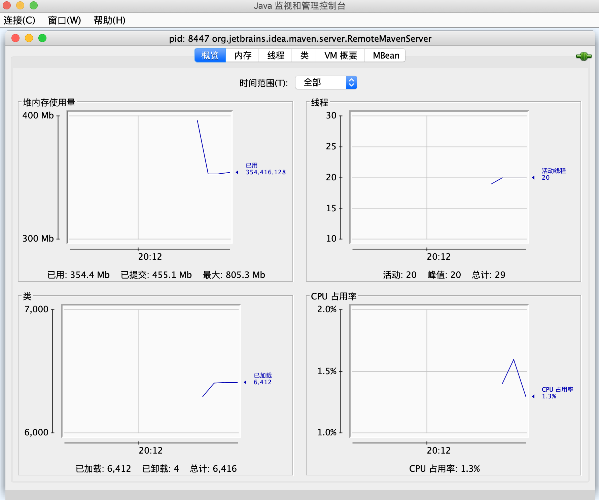

 ***说明：以下使用的 JDK 版本为 1.8***

- 当你排查线上问题，需要查看 GC 日志，发现没有打印 GC 的详细信息，可以通过 [jinfo](#五jinfo) 开启 JVM 参数 PrintGCDetails 来动态生效；
- 当你分析内存泄露风险时，可以通过 [jmap](#三jmap) 或 [jcmd](#八jcmd) 定期获取堆对象的统计信息，来发现持续增长的可疑对象；
- 当你遇到某一时刻所有服务都出现耗时较高的问题，可以通过 jstat 来观察 GC 回收状况，看看 GC 停顿耗时是否过高；
- 当你遇到 JVM 中某一个服务卡死或者停止处理时，可以通过 jstack 查看线程栈，看是否有多个线程处于 BLOCKED 状态产生了死锁；
- 当你的服务上线后发现性能达不到预期，可以使用 JMC 来分析 JVM 运行信息，看看有哪些热点方法可以优化，哪些线程争用可以避免；

# 一、jstat

jstatd

虚拟机统计信息监视工具(JVM Statistics Monitoring Tool)：
- 功能：用于监视虚拟机各种运行状态信息的命令行工具。它可以显示本地或者远程虚拟机进程中类装载、内存垃圾收集、JIT 编译等运行数据，在没有GUI图形界面，只提供了纯文本控制台环境的服务器上，是运行期定位虚拟机性能问题的首选工具；

- 用法：`jstat [option vmid [interval [s|ms] [count]]]`
   ```
   ➜ jstat -h
   Usage: jstat --help|-options
          jstat -<option> [-t] [-h<lines>] <vmid> [<interval> [<count>]]

   Definitions:
   <option>      指定参数，取值可用jstat -options查看
   <vmid>        VM标识，格式为<lvmid>[@<hostname>[:<port>]]
                  <lvmid>：如果lvmid是本地VM，那么用进程号即可; 
                  <hostname>：目标JVM的主机名;
                  <port>：目标主机的rmiregistry端口;
   -t            用来展示每次采样花费的时间
   <lines>       每抽样几次就列一个标题，默认0，显示数据第一行的列标题
   <interval>    抽样的周期，格式使用:<n>["ms"|"s"]，n是数字，ms/s是时间单位，默认是ms
   <count>       采样多少次停止
   -J<flag>      将<flag>传给运行时系统，例如：-J-Xms48m
   -? -h --help  Prints this help message.
   -help         Prints this help message.
   ```
   
   注意：如果是本地虚拟机进行，则 VMID 和 LVMID 是一致的，如果远程虚拟机进程，那 VMID 格式为：`[protocol：][//] lvmid[@hostname[：port]/servername]`
   
   参数  interval 和 count 代表查询间隔和次数，如果省略这两个参数，说明只差一次

   例子：`jstat -gc 2764 250 20`，表示需要每250ms查询一次进程2764的垃圾收集情况，一个查询20次；

- 参数：option 代表用户希望查询的虚拟机信息，主要分为3类：类装载、垃圾收集、运行期编译状况。
	- `-class` ： 监视类装载，卸载数量，总空间以及类状态所耗费的时间
	- `-gc`    ： 监视Java对状况，包括Eden区、两个 survivor区、老年代、永久代等的容量、已用空间、GC时间合计等
	- `-gccapacity`：监视内容与-gc基本相同，但输出主要关注Java堆各个区域使用到的最大、最小空间
	- `-gcutil`：监视内容与-gc基本相同，但输出主要关注已使用空间占总空间的百分比
	- `-gccause`：与-gcutil 功能一样，但是会输出导致上一次GC产生的原因
	- `-gcnew`：监视新生代GC状况
	- `-gcnewcapacity`：监视内容与-gcnew基本相同，但输出主要关注使用到的最大、最小空间
	- `-gcold`：监视老年代GC状态
	- `-gcoldcapacity`：监视内容与-gcold基本相同，输出主要关注使用到的最大、最小空间
	- `-gcpermcapacity`：输出永久代使用到的最大、最小空间
	- `-printcompilation`：输出已经被JIT编译的方法
   - `-gcmetacapacity`：统计元空间的数据

## 1、类加载统计

```
C:\Users\BlueFish>jstat -class 2120
Loaded  Bytes  Unloaded  Bytes     Time
	3043  2819.6        0     0.0      12.47 
```
- Loaded：加载class的数量
- Bytes：所占用空间大小（kb）
- Unloaded：未加载数量，卸载类的数量 
- Bytes：当前卸载的空间(单位KB) 
- Time：执行类加载/卸载操作所花费的时间

## 2、编译统计

```
C:\Users\BlueFish>jstat -compiler 2120
Compiled Failed Invalid   Time   FailedType FailedMethod
     536      0       0     0.45          0
```
- Compiled：执行了多少次编译任务
- Failed：多少次编译任务执行失败
- Invalid：无效的编译任务数
- Time：执行编译任务所花费的时间
- FailedType：上次失败的编译的编译类型
- FailedMethod：上次失败的编译的类名和方法

## 3、垃圾回收统计

```
C:\Users\BlueFish>jstat -gc 2120
 S0C    S1C    S0U    S1U      EC       EU        OC         OU       MC     MU    CCSC   CCSU   YGC     YGCT    FGC    FGCT     GCT
512.0  512.0   0.0   512.0   4480.0   1758.0   10944.0     5708.8   9728.0 9404.9  0.0    0.0       15    0.065   1      0.031    0.095
```
- S0C：新生代中Survivor space中S0当前容量的大小（KB）
- S1C：新生代中Survivor space中S1当前容量的大小（KB）
- S0U：新生代中Survivor space中S0容量使用的大小（KB）
- S1U：新生代中Survivor space中S1容量使用的大小（KB）
- EC：Eden space当前容量的大小（KB）
- EU：Eden space容量使用的大小（KB）
- OC：Old space当前容量的大小（KB）
- OU：Old space使用容量的大小（KB）
- MC：metaspace总量大小
- MU：metaspace使用大小
- CCSC：压缩类空间大小
- CCSU：压缩类空间使用大小
- PC：Permanent space当前容量的大小（KB），在JDK8已已经没有了
- PU：Permanent space使用容量的大小（KB），在JDK8已已经没有了
- YGC：从应用程序启动到采样时发生 Young GC 的次数
- YGCT：从应用程序启动到采样时 Young GC 所用的时间(秒)
- FGC：从应用程序启动到采样时发生 Full GC 的次数
- FGCT：从应用程序启动到采样时 Full GC 所用的时间(秒)
- GCT：从应用程序启动到采样时用于垃圾回收的总时间(单位秒)，它的值等于YGC+FGC


## 4、堆内存统计

```
C:\Users\BlueFish>jstat -gccapacity 2120
 NGCMN    NGCMX     NGC     S0C   S1C       EC      OGCMN      OGCMX       OGC         OC       MCMN     MCMX      MC     CCSMN    CCSMX     CCSC    YGC    FGC
  5440.0 262144.0   5504.0  512.0  512.0   4480.0    10944.0   524288.0    10944.0    10944.0      0.0  10624.0   9728.0      0.0      0.0      0.0     15     1
```
- NGCMN：新生代最小容量（KB）
- NGCMX：新生代最大容量（KB）
- NGC：当前新生代容量（KB）
- S0C：第一个Survivor space的大小（KB）
- S1C：第二个Survivor space的大小（KB）
- EC：Eden space 伊甸园区的大小（KB）
- OGCMN：老年代最小容量（KB）
- OGCMX：老年代最大容量（KB）
- OGC：当前老年代大小（KB）
- OC ：当前老年代大小（KB）
- MCMN：最小元数据容量（KB）
- MCMX：最大元数据容量（KB）
- MC ：当前元数据空间大小（KB）
- CCSMN：最小压缩类空间大小（KB）
- CCSMX：最大压缩类空间大小（KB）
- CCSC：当前压缩类空间大小（KB）
- YGCT：年轻代gc次数
- FGCT：Full GC次数

## 5、新生代回收统计

```
C:\Users\Administrator>jstat -gcnew 7172
 S0C    S1C    S0U    S1U   TT MTT  DSS       EC        EU     		YGC    YGCT
40960.0 40960.0 25443.1    0.0 15  15 20480.0 327680.0 222697.8     12    0.736
```
- S0C：第一个幸存区大小（KB）
- S1C：第二个幸存区的大小（KB）
- S0U：第一个幸存区的使用大小（KB）
- S1U：第二个幸存区的使用大小（KB）
- TT：对象在新生代存活的次数
- MTT：对象在新生代存活的最大次数
- DSS：期望的幸存区大小（KB）
- EC：伊甸园区的大小（KB）
- EU：伊甸园区的使用大小（KB）
- YGC：年轻代垃圾回收次数
- YGCT：年轻代垃圾回收消耗时间

## 6、新生代内存统计

```
C:\Users\Administrator>jstat -gcnewcapacity 7172
NGCMN      NGCMX       NGC      S0CMX     S0C     S1CMX     S1C       ECMX        EC      YGC   FGC
409600.0   409600.0   409600.0  40960.0  40960.0  40960.0  40960.0   327680.0   327680.0    12     0
```
- NGCMN：新生代最小容量（KB）
- NGCMX：新生代最大容量（KB）
- NGC：当前新生代容量（KB）
- S0CMX：最大幸存1区大小（KB）
- S0C：当前幸存1区大小（KB）
- S1CMX：最大幸存2区大小（KB）
- S1C：当前幸存2区大小（KB）
- ECMX：最大伊甸园区大小（KB）
- EC：当前伊甸园区大小（KB）
- YGC：年轻代垃圾回收次数
- FGC：Full GC回收次数

## 7、老年代垃圾回收统计

```
C:\Users\Administrator>jstat -gcold 7172
   MC       MU      CCSC     CCSU       OC          OU       YGC    FGC    FGCT     GCT
 33152.0  31720.8      0.0      0.0    638976.0    184173.0     12     0    0.000    0.736
```
- MC：方法区大小（KB）
- MU：方法区使用大小（KB）
- CCSC:压缩类空间大小（KB）
- CCSU:压缩类空间使用大小（KB）
- OC：老年代大小（KB）
- OU：老年代使用大小（KB）
- YGC：年轻代垃圾回收次数（KB）
- FGC：Full GC 垃圾回收次数（KB）
- FGCT：Full GC消耗时间（KB）
- GCT：垃圾回收消耗总时间（KB）

## 8、老年代内存统计

```
C:\Users\Administrator>jstat -gcoldcapacity 7172
OGCMN       OGCMX        OGC         OC       YGC   FGC    FGCT     GCT
638976.0    638976.0    638976.0    638976.0    12     0    0.000    0.736
```
- OGCMN：老年代最小容量（KB）
- OGCMX：老年代最大容量（KB）
- OGC：当前老年代大小（KB）
- OC：老年代大小（KB）
- YGC：年轻代垃圾回收次数
- FGC：Full GC次数
- FGCT：Full GC消耗时间
- GCT：垃圾回收消耗总时间

## 9、元数据空间统计

```
C:\Users\Administrator>jstat -gcmetacapacity 7172
MCMN       MCMX        MC       CCSMN      CCSMX       CCSC     YGC   FGC    FGCT     GCT
0.0    33152.0    33152.0        0.0        0.0        0.0    12     0    0.000    0.736
```
- MCMN:最小元数据容量（KB）
- MCMX：最大元数据容量（KB）
- MC：当前元数据空间大小（KB）
- CCSMN：最小压缩类空间大小（KB）
- CCSMX：最大压缩类空间大小（KB）
- CCSC：当前压缩类空间大小（KB）
- YGC：年轻代垃圾回收次数
- FGC：Full GC 次数
- FGCT：Full GC 消耗时间
- GCT：垃圾回收消耗总时间

## 10、总结垃圾回收统计

```
C:\Users\Administrator>jstat -gcutil 7172
  S0     S1     E      O      M     CCS    YGC     YGCT    FGC    FGCT     GCT
 62.12   0.00  81.36  28.82  95.68      -     12    0.736     0    0.000    0.736
```
- S0：幸存1区当前使用比例
- S1：幸存2区当前使用比例
- E：伊甸园区使用比例
- O：老年代使用比例
- M：元数据区使用比例
- CCS：压缩使用比例
- YGC：年轻代垃圾回收次数
- FGC：老年代垃圾回收次数
- FGCT：老年代垃圾回收消耗时间
- GCT：垃圾回收消耗总时间

## 11、JVM编译方法统计

```
C:\Users\Administrator>jstat -printcompilation 7172
Compiled  Size  Type Method
    4608     16    1 org/eclipse/emf/common/util/SegmentSequence$SegmentSequencePool$SegmentsAccessUnit reset
```
- Compiled：最近编译方法的数量
- Size：最近编译方法的字节码数量
- Type：最近编译方法的编译类型。
- Method：标识最近编译方法的类目和方法名，类目使用/代替点作为名称空间分隔符，方法名称是指定类中的方法，这两个字段的格式与HotSpot：`-XX:+PrintCompilation` 选项一致；

# 二、jstack

Java 堆栈跟踪工具(Stack Trace for Java)：
- 功能：用于生成虚拟机当前时刻的线程快照（一般称为 threaddump 或者 javacore 文件）线程快照就是当前虚拟机内每一条线程正在执行的方法堆栈的集合，生成线程快照的主要目的是定位线程出现长时间停顿的原因，如线程间死锁，死循环，请求外部资源导致的长时间等待.线程出现停顿的时候通过jstack来查看各个线程的调用堆栈，就可以知道没有响应的线程到底在后台做什么；

- 用法：jstack [option] vmid
	`-F`：当正常输出的请求不被响应时，强制输出线程堆栈<br>
	`-l`：除堆栈外，显示关于锁的附加信息<br>
	`-m`：如果调用本地方法的话，来可以显示 C/C++ 堆栈<br>

[线程堆栈分析](http://fastthread.io/)

## 1、使用jstack分析cpu消耗过高的问题

当linux出现cpu被java程序消耗过高时或者长时间线程等待时，可以使用如下步骤来进行问题排查
- （1）top查找出哪个进程消耗的cpu高
- （2）top中shift+h查找出哪个线程消耗的cpu高 

    先输入top -p [pid]，比如21125进程，然后再按shift+h。这里意思为只查看21125的进程，并且显示线程

- （3）jstack查找这个线程的信息 

    jstack [进程]|grep -A 10

    ``` 
    "http-8081-11" daemon prio=10 tid=0x00002aab049a1800 nid=0x52f1 in Object.wait() [0x0000000042c75000] 
   java.lang.Thread.State: WAITING (on object monitor)  
     at java.lang.Object.wait(Native Method)  
     at java.lang.Object.wait(Object.java:485)  
     at org.apache.tomcat.util.net.JIoEndpoint$Worker.await(JIoEndpoint.java:416)  
    ```

*注：*上述获取相应过程可以使用[vjtools](https://github.com/vipshop/vjtools)中的vjtop来实现 来实现

**备注：**JDK11没有该工具了

# 三、jmap

Java 内存映像工具(Memory Map for Java)
- 功能：用于生成堆转储快照（一般称为 heapdump 或 dump 文件）不使jmap命令也可以暴力获取堆转储快照，如使用 `-XX:+HeapDumpOnOutOfMemoryError`，可以让虚拟机在 OOM异常后自动生存 dump 文件jmap的作用不仅仅是为了获取 dump 文件，它还可以查询finalize执行队列、Java堆和永久代的详细信息，如空间使用率，当前用的哪种收集器等；

- jmap 命令在 windows平台下是受限的，除了生存dump文件的 -dump 选项和用于查看每个类的实例、空间占用统计的 -histo 选项在所有操作系统都提供之外，其余的选项只能在 Linux/Solaris 下使用：`jmap [option] vmid`

option选项含义：
- `-dump` ： 生成 Java 堆转储快照，格式为：`-dump:[live，] format=b, file=<filename>`，其中live子参数说明是否只dump出存活的对象
- `-finalizerinfo`：显示在F-Queue中等待Finalize 线程执行finalize 方法的对象，只能在 Linux/Solaris 下使用；
- `-heap`：显示 Java 堆的详细信息，如使用哪种回收器，参数配置，分代状况等，只能在 Linux/Solaris 下使用；
- `-histo[:live]`：显示堆中对象统计信息，包括类，实例数量，合计容量；如果指定了live子选项，则仅统计活动对象；
- `-permstat`：以ClassLoader 为统计口径显示永久代内存状态，只能在 Linux/Solaris 下使用；
- `-F`： 当虚拟机进程对 -dump 选项没有响应时，可以使用该选项强制生成dump快照，只能在 Linux/Solaris 下使用；

`jmap -dump` 命令是转储堆中的所有对象，而 `jmap -dump:live` 是转储堆中所有活着的对象。因为，`jmap -dump:live` 会触发一次 FullGC。

## 1、实例个数以及占用内存大小

```
C:\Users\Administrator>jmap -histo 4284  > d:/log.txt
```
打开log.txt文件
```
num     #instances         #bytes  class name
----------------------------------------------
   1:       1496092      127664200  [C
   2:        157665       46778984  [I
   3:        100289       25426744  [B
   4:        736941       17686584  java.util.HashMap$Node
   5:         74396       11077256  [Ljava.util.HashMap$Node;
   6:        192701       10228688  [J
   7:        564943        9039088  java.lang.String
   8:         83340        8667360  org.eclipse.jdt.internal.compiler.ast.MethodDeclaration
   9:        125450        7025200  org.eclipse.jdt.internal.compiler.ast.SingleNameReference
  10:        125867        6903952  [Ljava.lang.Object;
  11:         67093        6440928  org.eclipse.jdt.internal.compiler.ast.MessageSend
  12:        188979        6183520  [[C
  13:        116393        5586864  org.eclipse.jdt.internal.compiler.ast.QualifiedTypeReference
  14:         77426        5574672  org.eclipse.emf.ecore.util.EContentsEList$FeatureIteratorImpl
  15:         49078        5104112  org.eclipse.jdt.internal.compiler.lookup.MethodScope
  16:         90784        4357632  org.eclipse.jdt.internal.compiler.ast.SingleTypeReference
  17:         85628        3275744  [Ljava.lang.String;
  18:         49565        3172160  org.eclipse.jdt.internal.compiler.lookup.MethodBinding
  .......
```
- num：序号
- instances：实例数量
- bytes：占用空间大小
- class name：类名称

## 2、堆信息

```
C:\Users\Administrator>jmap -heap 4284
Attaching to process ID 4284, please wait...
Debugger attached successfully.
Client compiler detected.
JVM version is 25.0-b70

using parallel threads in the new generation.
using thread-local object allocation.
Concurrent Mark-Sweep GC

Heap Configuration:
   MinHeapFreeRatio         = 40
   MaxHeapFreeRatio         = 70
   MaxHeapSize              = 1073741824 (1024.0
   NewSize                  = 419430400 (400.0MB
   MaxNewSize               = 419430400 (400.0MB
   OldSize                  = 654311424 (624.0MB
   NewRatio                 = 2
   SurvivorRatio            = 8
   MetaspaceSize            = 104857600 (100.0MB
   CompressedClassSpaceSize = 52428800 (50.0MB)
   MaxMetaspaceSize         = 104857600 (100.0MB
   G1HeapRegionSize         = 0 (0.0MB)

Heap Usage:
New Generation (Eden + 1 Survivor Space):
   capacity = 377487360 (360.0MB)
   used     = 346767024 (330.7028045654297MB)
   free     = 30720336 (29.297195434570312MB)
   91.8618901570638% used
Eden Space:
   capacity = 335544320 (320.0MB)
   used     = 317925456 (303.1973419189453MB)
   free     = 17618864 (16.802658081054688MB)
   94.74916934967041% used
From Space:
   capacity = 41943040 (40.0MB)
   used     = 28841568 (27.505462646484375MB)
   free     = 13101472 (12.494537353515625MB)
   68.76365661621094% used
To Space:
   capacity = 41943040 (40.0MB)
   used     = 0 (0.0MB)
   free     = 41943040 (40.0MB)
   0.0% used
concurrent mark-sweep generation:
   capacity = 654311424 (624.0MB)
   used     = 190777600 (181.939697265625MB)
   free     = 463533824 (442.060302734375MB)
   29.157002766927082% used

32953 interned Strings occupying 2775672 bytes.
```

## 3、即将垃圾回收对象个数

```
C:\Users\Administrator>jmap -finalizerinfo 4284
Attaching to process ID 4284, please wait...
Debugger attached successfully.
Client compiler detected.
JVM version is 25.0-b70
Number of objects pending for finalization: 0
```

## 4、堆内存dump

```
C:\Users\Administrator>jmap -dump:format=b,file=D:/chu 4284
Dumping heap to D:\chu ...
Heap dump file created
```

## 5、可以通过jhat查看上述dump文件

```
C:\Users\Administrator>jhat -J-Xmx500m D:/chu
Reading from D:/haha...
Dump file created Thu May 28 09:46:36 CST 2015
Snapshot read, resolving...
Resolving 3915212 objects...
Chasing references, expect 783 dots.......................
..........................................................
..........................................................
..........................................................
..................
Eliminating duplicate references..........................
..........................................................
..........................................................
..........................................................
...............
Snapshot resolved.
Started HTTP server on port 7000
Server is ready.
```

## 6、获取Java堆Dump文件

要想获取Java堆Dump，除使用jmap外，还有以下方法：
- 使用`-XX:+HeapDumpOnOutOfMemoryError`，让虚拟机在OOM异常出现后自动生成堆Dump文件；
- 使用`-XX:+HeapDumpOnCtrlBreak`，可使用`[Ctrl]+[Break]`，让虚拟机生成堆Dump文件；
- 在Linux操作系统下，发送 kill -3 pid 命令；
- 对于Spring Boot应用，也可以使用Spring Boot Actuator提供的`/actuator/heapdump`实现堆Dump

# 四、jps

虚拟机进程状况工具（JVM Process Status Tool）
- 功能：列出正在运行的虚拟机进程，并显示虚拟机执行主类名称以及这些进程的本地虚拟机唯一ID(LVMID)对于本地虚拟机进程来说，LVMID 与操作系统的进程ID是一致的，使用 windows 任务管理和UNINX的ps命令也可以查询虚拟机进程的 LVMID，如果同时启动了多个虚拟机进程，无法根据进程名称定位时，只能依赖jps命令显示主类的功能才能区分；

- 用法：jps [option] [hostid]，执行样例：
```
C：\Users\BlueFish>jps -lm
2120 org.jetbrains.idea.maven.server.RemoteMavenServer
5736 sun.tools.jps.Jps -lm
1372
```
jps 可以通过RMI协议查询开启了RMI服务的远程虚拟机进程状态， hostid 为RMI注册表中注册的主机名

- 主要参数：
	- `-q`：只输出 LVMID，省略主类的名称 
	- `-m`：输出虚拟机进程启动时传递给主类 main() 函数的参数；
	- `-l`：输出主类的全名，如果进程执行的是 jar包，输出 jar 路径；
	- `-v`：输出虚拟机进程启动时的 JVM 参数
   - `-V`：禁止输出类名、JAR文件名和传递给main方法的参数，仅显示本地JVM标识符的列表

当然也可以通过linux系统中的命令来获取进程ID：`ps -ef | grep java`

**查看远程主机：**
hostid：想要查看的主机的标识符，格式为：`[protocol:][[//]hostname][:port][/servername]` ，其中：
- protocol：通信协议，默认rmi
- hostname：目标主机的主机名或IP地址
- port：通信端口，对于默认rmi协议，该参数用来指定 rmiregistry远程主机上的端口号。如省略该参数，并且该protocol指示rmi，则使用默认使用1099端口。
- servicename：服务名称，取值取决于实现方式，对于rmi协议，此参数代表远程主机上RMI远程对象的名称

```
# 查看remote.domain这台服务器中JVM进程的信息，使用rmi协议，端口1099
jps -l remote.domain
# 查看remote.domain这台服务器中JVM进程的信息，使用rmi协议，端口1231
jps -l rmi://remote.comain:1231
```

# 五、jinfo

Java 配置信息工具(Configuration Info for Java)
- 功能：实时的查看和调整虚拟机各项参数，使用 jps 命令的 -v 参数可以查看虚拟机启动时显式指定的参数列表<br>
	`jinfo [option] pid`

- 用法即参数
   ```
   ➜ jinfo -h
   Usage:
      jinfo <option> <pid>
         (to connect to a running process)

   where <option> is one of:
      -flag <name>         打印指定参数的值
      -flag [+|-]<name>    启用/关闭指定参数
      -flag <name>=<value> 将指定的参数设置为指定的值
      -flags               打印VM参数
      -sysprops            打印系统属性（笔者注：系统属性打印的是System.getProperties()的结果）
      <no option>          打印VM参数及系统属性
      -? | -h | --help | -help to print this help message
   ```

## 1、查看参数

- 打印42342这个进程的VM参数及Java系统属性：`jinfo 42342`

- 只查看Java系统属性：`jinfo -sysprops 42342`

- 只查看进程的VM参数：`jinfo -flags 42342`

- 只查看进程ConcGCThreads参数的值：`jinfo -flag ConcGCThreads 42342`

## 2、动态修改参数

- 将42342这个进程的`PrintClassHistogram`设置为false：`jinfo -flag -PrintClassHistogram 42342`

- 将42342这个进程的`MaxHeapFreeRatio`设置为80：`jinfo -flag MaxHeapFreeRatio=80 42342`

**注意：**

虽然可用jinfo动态修改VM参数，但并非所有参数都支持动态修改，如果操作了不支持的修改的参数，将会报类似如下的异常：`Exception in thread "main" com.sun.tools.attach.AttachOperationFailedException: flag 'xxx' cannot be changed`

使用如下命令显示出来的参数，基本上都是支持动态修改的：`java -XX:+PrintFlagsInitial | grep manageable`
```
java -XX:+PrintFlagsInitial | grep manageable
     intx CMSAbortablePrecleanWaitMillis            = 100                                 {manageable}
     intx CMSTriggerInterval                        = -1                                  {manageable}
     intx CMSWaitDuration                           = 2000                                {manageable}
     bool HeapDumpAfterFullGC                       = false                               {manageable}
     bool HeapDumpBeforeFullGC                      = false                               {manageable}
     bool HeapDumpOnOutOfMemoryError                = false                               {manageable}
    ccstr HeapDumpPath                              =                                     {manageable}
    uintx MaxHeapFreeRatio                          = 70                                  {manageable}
    uintx MinHeapFreeRatio                          = 40                                  {manageable}
     bool PrintClassHistogram                       = false                               {manageable}
     bool PrintClassHistogramAfterFullGC            = false                               {manageable}
     bool PrintClassHistogramBeforeFullGC           = false                               {manageable}
     bool PrintConcurrentLocks                      = false                               {manageable}
     bool PrintGC                                   = false                               {manageable}
     bool PrintGCDateStamps                         = false                               {manageable}
     bool PrintGCDetails                            = false                               {manageable}
     bool PrintGCID                                 = false                               {manageable}
     bool PrintGCTimeStamps                         = false                               {manageable}
```

# 六、jhat

jdk11已被废弃

## 1、用法概述

虚拟机堆转储快照分析工具(JVM Heap Analysis Tool)与jmap搭配使用，用来分析堆转储快照jhat 内置了一个微型的HTTP/HTML 服务器，生成的dump文件的分析结果后可以在浏览器查看

- 在实际工作中，一般不会直接用jhat命令分析dump文件：
	- 一般不会在部署应用的服务器上直接分析dump文件，即使可以这样做，也会尽量将dump文件复制到其他机器上进行分析因为分析工作是一个耗时而且消耗硬件资源的过程，既然要在其他机器上进行，就不必要受到命令行的限制

	- jhat的分析功能相对来说很简陋，有专门的分析dump文件的工具：Eclipse Memory Analyzer 等；

jhat idea.bin (这个文件为jamp生成的 dump 文件)

- 参数
	- `-stack false|true` 关闭对象分配调用栈跟踪(tracking object allocation call stack)。 如果分配位置信息在堆转储中不可用. 则必须将此标志设置为 false. 默认值为 true；
	- `-refs false|true` 关闭对象引用跟踪(tracking of references to objects)。 默认值为 true. 默认情况下, 返回的指针是指向其他特定对象的对象,如反向链接或输入引用(referrers or incoming references), 会统计/计算堆中的所有对象；
	- `-port port-number` 设置 jhat HTTP server 的端口号. 默认值 7000；
	- `-exclude exclude-file` 指定对象查询时需要排除的数据成员列表文件(a file that lists data members that should be excluded from the reachable objects query)。 例如, 如果文件列列出了 java.lang.String.value , 那么当从某个特定对象 Object o 计算可达的对象列表时, 引用路径涉及 java.lang.String.value 的都会被排除；
	- `-baseline exclude-file` 指定一个基准堆转储(baseline heap dump)。 在两个 heap dumps 中有相同 object ID 的对象会被标记为不是新的(marked as not being new). 其他对象被标记为新的(new). 在比较两个不同的堆转储时很有用；
	- `-debug int` 设置 debug 级别. 0 表示不输出调试信息。 值越大则表示输出更详细的 debug 信息；
	- `-version` 启动后只显示版本信息就退出；
	- `-J< flag >` 因为 jhat 命令实际上会启动一个JVM来执行, 通过 -J 可以在启动JVM时传入一些启动参数. 例如, -J-Xmx512m 则指定运行 jhat 的Java虚拟机使用的最大堆内存为 512 MB. 如果需要使用多个JVM启动参数,则传入多个 -Jxxxxxx

## 2、使用示例

- 分析1.hprof，并开启对象分配调用栈的分析：`jhat -stack true 1.hprof`

- 分析1.hprof，开启对象分配调用栈的分析，关闭对象引用的分析：`jhat -stack true -refs false 1.hprof`，等待片刻之后，访问`http://localhost:7000/`即可查看分析结果；

# 七、jconsole

[JConsole](https://docs.oracle.com/javase/7/docs/technotes/guides/management/jconsole.html)：

Java 监视与管理控制台(Java Monitoring and Management Console)：

用法：一种基于 JMX 的可视化监视\管理工具，它管理部分的功能是针对 JMX MBean 进行管理的

JMX是一种开放性的技术，它既可以用在虚拟机本身的管理上，也可以用于运行在虚拟机之上的软件中。目前很多软件都支持基于JMX进行管理与监控



# 八、jcmd

jcmd全称JVM Command，用于将诊断命令请求发送到正在运行的Java虚拟机，从JDK 7开始提供。

## 1、使用说明

```
➜ jcmd -h
Usage: jcmd <pid | main class> <command ...|PerfCounter.print|-f file>
   or: jcmd -l
   or: jcmd -h

  command must be a valid jcmd command for the selected jvm.
  Use the command "help" to see which commands are available.
  If the pid is 0, commands will be sent to all Java processes.
  The main class argument will be used to match (either partially
  or fully) the class used to start Java.
  If no options are given, lists Java processes (same as -p).

  PerfCounter.print display the counters exposed by this process
  -f  从文件读取并执行命令
  -l  列出本机上的所有JVM进程
  -h  this help
```

## 2、参数说明

- `pid`：接收诊断命令请求的进程ID。
- `main class` ：接收诊断命令请求的进程的main类。jcmd会将诊断命令请求发送给具有指定main class的所有Java进程。
- `command`：command必须是一个有效的jcmd命令，可使用 jcmd pid help 命令查看可用的命令列表。如果pid是0，那么command将会被发送给所有Java进程。main class会用来去匹配（局部匹配或全量匹配）。如果未指定任何选项，它将会列出正在运行的Java进程标识符以及用于启动该进程的main class和命令行参数（相当于使用了-l参数）
- `PerfCounter.print`：打印指定Java进程上可用的性能计数器。
- `-f filename`：从指定文件中读取命令并执行。在file中，每个命令必须写在单独的一行。以"#"开头的行会被忽略。当所有行的命令被调用完毕后，或者读取到含有stop关键字的命令，将会终止对file的处理。
- `-l`：查看所有的JVM进程。jcmd不使用参数与jcmd -l效果相同

## 3、使用示例

```bash
# 查看所有JVM进程
jcmd -l

# 打印指定进程上可用的性能计数器
jcmd 26089 PerfCounter.print

# 打印所有启动类为com.imooc.Application的应用上可用的性能计数器
jcmd com.imooc.Application PerfCounter.print

# 打印指定进程的代码缓存的布局和边界
jcmd 26089 Compiler.codecache
```

## 4、支持的命令

### 4.1、help

`help [options] [arguments]`
- 作用：查看指定命令的帮助信息
- arguments：想查看帮助的命令（STRING，无默认值）
- options：选项，必须使用key或者key=value的预发指定，可用的options如下
   - `-all：`（可选）查看所有命令的帮助信息（BOOLEAN，false）

使用示例：
```bash
# 获得指定进程可用的命令列表
jcmd <pid> help

# 获取指定进程、指定命令的帮助信息，如果参数包含空格，需用'或者"引起来
jcmd <pid> help <command>
```

### 4.2、Compiler.codecache

作用：打印code cache（代码缓存）的布局和边界

影响：低

所需权限： java.lang.management.ManagementPermission(monitor)

### 4.3、Compiler.codelist

作用：打印代码缓存中所有仍在运行的已编译方法

影响：中

所需权限： java.lang.management.ManagementPermission(monitor)

### 4.4、Compiler.queue

作用：打印排队等待编译的方法

影响：低

所需权限： java.lang.management.ManagementPermission(monitor)

### 4.5、Compiler.directives_add filename arguments

作用：从文件添加编译器指令

影响：低

所需权限： java.lang.management.ManagementPermission(monitor)

filename：指令文件的名称（STRING，无默认值）

### 4.6、Compiler.directives_clear

作用：删除所有编译器指令

影响：低

所需权限： java.lang.management.ManagementPermission(monitor)

### 4.7、Compiler.directives_print

作用：打印所有活动的编译器指令。

影响：低

所需权限： java.lang.management.ManagementPermission(monitor)

### 4.8、Compiler.directives_remove

作用：删除最新添加的编译器指令。

影响：低

所需权限： java.lang.management.ManagementPermission(monitor)

### 4.9、GC.class_histogram [options]

作用：提供有关Java堆使用情况的统计信息。

影响：高-取决于Java堆的大小和内容。

所需权限： java.lang.management.ManagementPermission(monitor)

options：选项，必须使用key或者key=value的预发指定，可用的options如下：

-all：（可选）检查所有对象，包括不可达的对象（BOOLEAN，false）

### 4.10、GC.class_stats [options] [arguments]

作用：展示有关Java类元数据的统计信息

影响：高-取决于Java堆的大小和内容。

options：选项，必须使用key或者key=value的预发指定，可用的options如下：
- `-all`：（可选）显示所有列（BOOLEAN，false）
- `-csv`：（可选）以CSV格式打印电子表格（BOOLEAN，false）
- `-help`：（可选）显示所有列的含义（BOOLEAN，false）
arguments：参数，可选参数如下：columns：（可选）要显示的列，以逗号分隔。如果不指定，则显示以下列：
- InstBytes
- KlassBytes
- CpAll
- annotations
- MethodCount
- Bytecodes
- MethodAll
- ROAll
- RWAll
- Total

使用示例：
```
# 展示指定进程类的元数据的所有统计信息
jcmd 48758 GC.class_stats -all

# InstBytes、KlassBytes等列的含义
jcmd 48758 GC.class_stats -help

# 显示InstBytes,KlassBytes这两列，并生成csv
jcmd 48758 GC.class_stats -csv  InstBytes,KlassBytes > t.csv
```
### 4.11、GC.finalizer_info

作用：展示有关Java finalization queue的信息。

影响：中

所需权限： java.lang.management.ManagementPermission(monitor)

### 4.12、GC.heap_dump [options] [arguments]

作用：生成Java堆Dump文件（HPROF格式）

影响：高-取决于Java堆的大小和内容。除非指定了 -all 选项，否则将会导致Full GC

所需权限： java.lang.management.ManagementPermission(monitor)

options：选项，必须使用key或者key=value的预发指定，可用的options如下：<br>
   -all：（可选）转储所有对象，包括不可达的对象（BOOLE AN，false）
arguments：参数，可用的参数如下：<br>
   filename：Dump文件的名称（STRING，无默认值）

使用示例：`jcmd 48758 GC.heap_dump -all 1.hprof`

### 4.13、GC.heap_info

作用：展示Java堆信息。

影响：中

所需权限： java.lang.management.ManagementPermission(monitor)

### 4.14、GC.run

作用：调用 java.lang.System.gc()

影响：中-取决于Java堆的大小和内容

### 4.15、GC.run_finalization

作用： java.lang.System.runFinalization()

影响：中-取决于Java内容。

### 4.16、JFR.check [options]

请参阅《Java Flight Recorder命令参考》中的JFR.check。

### 4.16、其他参数

**JFR.configure [options]**

请参阅《Java Flight Recorder命令参考》中的JFR.configure。

**JFR.dump [options]**

请参阅《Java Flight Recorder命令参考》中的JFR.dump。

**JFR.start [options]**

请参阅《Java Flight Recorder命令参考》中的JFR.start。

**JFR.stop [options]**

请参阅《Java Flight Recorder命令参考》中的JFR.stop。

**JVMTI.agent_load [arguments]**

- 作用：加载JVMTI本机代理。
- 影响：低
- 所需权限： java.lang.management.ManagementPermission(control)
- arguments：
   - library path：要加载的JVMTI代理的绝对路径（STRING，无默认值）
   - agent option：（可选）用于传递代理的选项字符串（STRING，无默认值）

**JVMTI.data_dump**
- 作用：通知JVM对JVMTI进行数据转储
- 影响：高
- 所需权限： java.lang.management.ManagementPermission(monitor)

**ManagementAgent.start [options]**
- 作用：启动远程管理代理
- 影响：低-无影响
- options：选项，必须使用key或者key=value的预发指定，可用的options如下：
   ```
   config.file：（可选）设置 com.sun.management.config.file（STRING，无默认值）
   jmxremote.host：（可选）设置com.sun.management.jmxremote.host（STRING，无默认值）
   jmxremote.port：（可选）设置com.sun.management.jmxremote.port（STRING，无默认值）
   jmxremote.rmi.port：（可选）设置com.sun.management.jmxremote.rmi.port（STRING，无默认值）
   jmxremote.ssl：（可选）设置com.sun.management.jmxremote.ssl（STRING，无默认值）
   jmxremote.registry.ssl：（可选）设置com.sun.management.jmxremote.registry.ssl（STRING，无默认值）
   jmxremote.authenticate：（可选）设置com.sun.management.jmxremote.authenticate（STRING，无默认值）
   jmxremote.password.file：（可选）设置com.sun.management.jmxremote.password.file（STRING，无默认值）
   jmxremote.access.file：（可选）设置com.sun.management.jmxremote.access.file（STRING，无默认值）
   jmxremote.login.config：（可选）设置com.sun.management.jmxremote.login.config（STRING，无默认值）
   jmxremote.ssl.enabled.cipher.suites：（可选）集com.sun.management。
   jmxremote.ssl.enabled.cipher.suite：（STRING，无默认值）
   jmxremote.ssl.enabled.protocols：（可选）设置com.sun.management.jmxremote.ssl.enabled.protocols（STRING，无默认值）
   jmxremote.ssl.need.client.auth：（可选）设置com.sun.management.jmxremote.need.client.auth（STRING，无默认值）
   jmxremote.ssl.config.file：（可选）设置com.sun.management.jmxremote.ssl_config_file（STRING，无默认值）
   jmxremote.autodiscovery：（可选）设置com.sun.management.jmxremote.autodiscovery（STRING，无默认值）
   jdp.port：（可选）设置com.sun.management.jdp.port（INT，无默认值）
   jdp.address：（可选）设置com.sun.management.jdp.address（STRING，无默认值）
   jdp.source_addr：（可选）设置 com.sun.management.jdp.source_addr（STRING，无默认值）
   jdp.ttl：（可选）设置com.sun.management.jdp.ttl（INT，无默认值）
   jdp.pause：（可选）设置com.sun.management.jdp.pause（INT，无默认值）
   jdp.name：（可选）设置com.sun.management.jdp.name（STRING，无默认值）
   ```
**ManagementAgent.start_local**
- 作用：启动本地管理代理
- 影响：低-无影响

**ManagementAgent.status**
- 作用：展示管理代理的状态
- 影响：低-无影响
- 所需权限： java.lang.management.ManagementPermission(monitor)

**ManagementAgent.stop**
- 作用：停止远程管理代理
- 影响：低-无影响

**Thread.print [options]**
- 作用：打印所有带有堆栈跟踪的线程。
- 影响：中-取决于线程数。
- 所需权限： java.lang.management.ManagementPermission(monitor)
- options：选项，必须使用key或者key=value的预发指定，可用的options如下：
   - `-l`：（可选）打印 java.util.concurrent 锁（BOOLEAN，false）

使用示例：`jcmd 48758 Thread.print -l`

**VM.check_commercial_features**
- 作用：显示商业特性的状态
- 影响：低-无影响

**VM.unlock_commercial_features**
- 作用：解锁商业功能
- 影响：低-无影响
- 所需权限： java.lang.management.ManagementPermission(control)

**VM.classloader_stats**
- 作用：打印所有ClassLoader的统计信息。
- 影响：低
- 所需权限： java.lang.management.ManagementPermission(monitor)

**VM.class_hierarchy [options] [arguments]**
- 作用：打印所有已加载类的列表，缩进以显示类层次结构。每个类的名称后跟其ClassLoader的ClassLoaderData* ，如果由bootstrap class loader加载，则为null
- 影响：中-取决于已加载类的数量。
- 所需权限： java.lang.management.ManagementPermission(monitor)
- options：选项，必须使用key或者key=value的预发指定，可用的options如下：
   - `-i`：（可选）打印继承的接口（BOOLEAN，false）
   - `-s`：（可选）如果指定了类名，则将打印子类。如果未指定类名，则仅打印超类（BOOLEAN，false）
- arguments：参数，可用项如下：
   - classname：（可选）打印指定类的层次结构，如果未指定，则将打印所有类层次结构（STRING，无默认值）

使用示例：`jcmd 48758 VM.class_hierarchy -i -s javax.servlet.GenericFilter`

**VM.command_line**
- 作用：打印用于启动此VM实例的命令行
- 影响：低
- 所需权限： java.lang.management.ManagementPermission(monitor)

**VM.dynlibs**
- 作用：打印加载的动态库
- 影响：低
- 允许： java.lang.management.ManagementPermission(monitor)

**VM.info**
- 作用：打印有关JVM环境和状态的信息
- 影响：低
- 允许： java.lang.management.ManagementPermission(monitor)

**VM.log [options]**
- 作用：列出当前日志配置，启用/禁用/配置日志输出，或轮换所有日志
- 影响：低
- 所需权限：java.lang.management.ManagementPermission(control)
- options：选项，必须使用key或者key=value的预发指定，可用的options如下：
   - `output`：（可选）要配置的输出的名称或索引。（STRING，无默认值）
   - `output_options`：（可选）输出的选项。（STRING，无默认值）
   - `what`：（可选）配置要记录的标签。（STRING，无默认值）
   - `decorators`：（可选）配置要使用的装饰器。使用’none’或空值删除所有内容。（STRING，无默认值）
   - `disable`：（可选）关闭所有日志记录并清除日志配置。（布尔值，无默认值）
   - `list`：（可选）列出当前的日志配置。（布尔值，无默认值）
   - `rotate`：（可选）轮换所有日志。（布尔值，无默认值）

使用示例：`jcmd 48758 VM.log output what`

**VM.flags [options]**
- 作用：打印VM标志及其当前值。
- 影响：低
- 所需权限： java.lang.management.ManagementPermission(monitor)
- options：选项，必须使用key或者key=value的语法指定，可用的options如下：
   - -all：（可选）打印VM支持的所有标志（BOOLEAN，false）

**VM.native_memory [options]**

该功能叫做“Native Memory Tracking (NMT)”，需开启如下参数，才可打开。

`-XX:NativeMemoryTracking=[off | summary | detail]`

打开后会带来5-10%的性能损耗。

也可用 -XX:+UnlockDiagnosticVMOptions -XX:+PrintNMTStatistics ，让JVM在退出时打印NMT报告。

- 作用：打印native内存使用情况
- 影响：中
- 允许： java.lang.management.ManagementPermission(monitor)
- options：选项，必须使用key或者key=value的预发指定，可用的options如下：
   ```
   summary：（可选）请求运行时报告当前内存摘要，包括所有保留和提交的内存以及每个子系统的内存使用情况摘要(BOOLEAN, false)
   detail：（可选）请求运行时报告每个调用站点(callsite) > = 1K的内存分配(BOOLEAN, false)
   baseline：（可选）请求运行时以当前内存使用情况为基准，以便以后进行比较(BOOLEAN, false)
   summary.diff：（可选）请求运行时报告与先前基准的内存摘要比较(BOOLEAN, false)
   detail.diff ：（可选）请求运行时报告与先前基准的内存详情比较，该基准显示了在不同调用站点(callsite)的内存分配活动(BOOLEAN, false)
   shutdown：（可选）请求运行时关闭自身并释放运行时使用的内存(BOOLEAN, false)
   statistics：（可选）打印跟踪器统计信息以进行调整(BOOLEAN, false)
   scale：（可选）以MB，MB或GB为单位的内存使用量(STRING, KB )
   ```

**VM.print_touched_methods**
- 作用：打印此JVM生命周期中曾经接触过的所有方法
- 影响：中-取决于Java内容

**VM.set_flag [arguments]**
- 作用：设置VM标志
- 影响：低
- 所需权限： java.lang.management.ManagementPermission(control)
- arguments：
   - 标志名称：您要设置的标志名称（STRING，无默认值）
   - 字符串值：（可选）要设置的值（STRING，无默认值）

**VM.stringtable [options]**
- 作用：转储字符串表(string table)
- 影响：中-取决于Java内容。
- 所需权限： java.lang.management.ManagementPermission(monitor)
- options：选项，必须使用key或者key=value的预发指定，可用的options如下：
   - `-verbose`：（可选）转储表中每个字符串的内容（BOOLEAN，false）

使用示例：`jcmd 48758 VM.stringtable -verbose`

**VM.symboltable [options]**

- 作用：转储符号表
- 影响：中-取决于Java内容
- 所需权限： java.lang.management.ManagementPermission(monitor)
- options：选项，必须使用key或者key=value的预发指定，可用的options如下：
   - -verbose ：（可选）转储表中每个符号的内容（BOOLEAN，false）

使用示例：`jcmd 48758 VM.symboltable -verbose`

**VM.systemdictionary**
- 作用：打印字典哈希表大小和存储桶长度的统计信息
- 影响：中
- 所需权限： java.lang.management.ManagementPermission(monitor)
- options：选项，必须使用key或者key=value的预发指定，可用的options如下：
   - -verbose ：（可选）为所有class loader转储每个词典条目的内容（BOOLEAN，false）。

使用示例：`jcmd 48758 VM.systemdictionary -verbose`

**VM.system_properties**
- 作用：打印系统属性
- 影响：低
- 所需权限： java.util.PropertyPermission(*, read)

**VM.uptime [options]**
- 作用：打印虚拟机的运行时间
- 影响：低
- options：选项，必须使用key或者key=value的预发指定，可用的options如下：
   - `-date` ：（可选）添加带有当前日期的前缀（BOOLEAN，false）

**VM.version**
- 作用：打印JVM版本信息
- 影响：低
- 所需权限： java.util.PropertyPermission(java.vm.version, read)

# 十、MAT

[内存管理工具](https://www.zybuluo.com/frank-shaw/note/206287)

# 十一、jprofiler

# 十二、Btrace

## 1、概述

BTrace 基于动态字节码修改技术来实现对运行时的 Java 程序进行跟踪和替换。也就是说可以在不重启 JVM 的情况下监控系统运行情况，获取 JVM 运行时的数据信息，比如方法参数、返回值、全局变量、堆栈信息等

BTrace 可以做什么：
- 可以对方法进行定位拦截，获取方法的入参、返回值、执行时间等信息
- 可以查看某类对象的创建情况
- 可以对内存使用情况进行统计，可以查看对象大小
- 可以查看同步块执行情况
- 可以查看异常抛出情况及导致异常的参数信息
- 能够支持定时执行检测任务
- 能够查看类加载的信息
- 能够进行死锁检测
- 可以打印线程栈信息
- 可以监控文件或网络的读写情况。

## 2、用法

## 3、使用注意点

那么，BTrace 不能做什么：
- BTrace 不能创建新的对象
- 不能抛出或捕获异常
- 不能使用循环，例如 for、while
- BTrace 脚本的属性和方法必须使用 static 修饰
- 不能使用 synchronized 的同步块或同步方法
- 不能调用实例方法或静态方法，只能使用 BTraceUtils 类中提供的方法。

**btrace注意事项**
- 默认只能本地运行，如果希望本地调试远程机器，需要修改源代码
- 生产环境下可以使用，但是被修改的字节码不会被还原，直到JVM重启之前，一旦需要在生产环境下使用，最好是在本地编译通过

# 十三、visualvm

- [visualvm查询SQL](https://blog.csdn.net/pange1991/article/details/82023771)

从JDK 6开始提供，是目前最强大的监控及故障处理程序之一

在jdk8之前是内置的，如果要使用，直接启动命令：`jvisualvm` 即可；对于JDK 9及更高版本，VisualVM默认不再内置，而是作为一个独立项目维护，因此需要手动下载。独立下载的VisualVM，最低支持JDK 8，[下载地址](https://visualvm.github.io/)

如果启动报版本错误，可以修改visualvm目录下的etc目录下 visualvm.conf 的 `visualvm_jdkhome="/Library/Java/JavaVirtualMachines/jdk-11.0.5.jdk/Contents/Home"`配置；

##  添加jmx连接

###  监控tomcat

需要修改catalina.sh，加入如下配置：
```
JAVA_OPTS="$JAVA_OPTS -Dcom.sun.management.jmxremote -Dcom.sun.management.jmxremote.port=9004 -Dcom.sun.management.jmxremote.authenticate=false -Dcom.sun.management.jmxremote.ssl=false -Djava.net.preferIP4Stack=true -Djava.rmi.server.hostname=127.0.0.1"
```
- `-Dcom.sun.management.jmxremote=true` 
- `-Dcom.sun.management.jmxremote.port=8099`（配置远程 connection 的端口号的） 
- `-Dcom.sun.management.jmxremote.ssl=false`(指定了 JMX 是否启用 ssl) 
- `-Dcom.sun.management.jmxremote.authenticate=false`（ 指定了JMX 是否启用鉴权（需要用户名，密码鉴权）） 
- `-Djava.rmi.server.hostname=192.168.0.1`（配置 server 的 IP）

### java应用

主要是jar包启动的，在jar启动的时添加跟tomcat一样的参数

对于性能优化来说，我们主要用到它的采样器。注意，由于抽样分析过程对程序运行性能有较大的影响，一般我们只在测试环境中使用此功能

# 十四、JMC：Java Mission Control

[JMC](http://www.oracle.com/technetwork/java/javaseproducts/mission-control/java-mission-control-1998576.html)：
	
Java Mission Control，不仅仅可以使用JMX进行普通的管理、监控任务，还可以配合[Java Flight Recorder](https://docs.oracle.com/javacomponents/jmc-5-4/jfr-runtime-guide/about.htm#JFRUH171)技术，以非常低的开销收集和分析JVM底层的Profiling和事件等信息；


# 十五、Native Memory Tracking

JMC和JConsole的内存管理页面，对堆外内存的统计有限，可以使用NMT特性对JVM堆外内存进行分析

- 准备工作
	- 开启NMT并选择summary模式：```-XX:NativeMemoryTracking=summary```
	- 为了方便获取和对比NMT输出，选择在应用退出时打印NMT统计信息：```-XX:+UnlockDiagnosticVMOptions -XX:+PrintNMTStatistics```

- 分析标准hello World程序：
	```
	java -XX:NativeMemoryTracking=summary -XX:+UnlockDiagnosticVMOptions -XX:+PrintNMTStatistics HelloWorld
	```
	得到如下输出：
	```
	Hello World
	Native Memory Tracking:
	Total: reserved=5706451KB, committed=462527KB
	-                 Java Heap (reserved=4194304KB, committed=262144KB)
								(mmap: reserved=4194304KB, committed=262144KB) 
	
	-                     Class (reserved=1066111KB, committed=14207KB)
								(classes #506)
								(malloc=9343KB #177) 
								(mmap: reserved=1056768KB, committed=4864KB) 
	
	-                    Thread (reserved=20597KB, committed=20597KB)
								(thread #20)
								(stack: reserved=20480KB, committed=20480KB)
								(malloc=60KB #110) 
								(arena=56KB #41)
	
	-                      Code (reserved=249637KB, committed=2573KB)
								(malloc=37KB #316) 
								(mmap: reserved=249600KB, committed=2536KB) 
	
	-                        GC (reserved=163627KB, committed=150831KB)
								(malloc=10383KB #131) 
								(mmap: reserved=153244KB, committed=140448KB) 
	
	-                  Compiler (reserved=133KB, committed=133KB)
								(malloc=2KB #28) 
								(arena=131KB #3)
	
	-                  Internal (reserved=9497KB, committed=9497KB)
								(malloc=9465KB #1628) 
								(mmap: reserved=32KB, committed=32KB) 
	
	-                    Symbol (reserved=1472KB, committed=1472KB)
								(malloc=952KB #158) 
								(arena=520KB #1)
	
	-    Native Memory Tracking (reserved=46KB, committed=46KB)
								(malloc=4KB #45) 
								(tracking overhead=42KB)
	
	-               Arena Chunk (reserved=1027KB, committed=1027KB)
								(malloc=1027KB) 
	```
	- 第一部分是Java堆，可以使用-Xmx -Xms等参数调整；
	- 第二部分是Class内存占用，它所统计的是java类元数据所占用的空间，JVM可以通过-XX:MaxMetaspaceSize=value来进行调整；
	- 第三部分是Thread，这里既包括Java线程也包括GC等本地线程，一个简单的程序，其线程数量也有20个，如何降低线程数量呢？JKD9的默认GC是G1，在较大堆场景有良好表现，但其本身会比传统的ParallelGC或者SerialGC之类复杂太多，所以要么降低并行线程数，要么直接切换GC类型；JIT编译默认开启TieredCompilation，将其关闭，JIT也变的简单，在上面命令的基础上增加参数```-XX:-TieredCompilation -XX:+UseParallelGC```；
	- 第四部分是Code统计信息，显然这是CodeCache相关内存，也就是JIT compiler存储编译热点方法等信息的地方，JVM提供了参数限制其初始值和最大值 ```-XX:InitialCodeCacheSize=value，-XX:ReservedCodeCacheSize=value```
	- GC部分；
	- Compiler部分：就是JIT的开销
	- Internal部分，其统计Direct buffer的直接内存，这其实是堆外内存OOM常发生的地方；如果怀疑直接内存区域有问题，可以通过类似instrument构造函数等手段，排查可能问题

# 十六、JFR

- [JFR进阶](https://zhuanlan.zhihu.com/c_1264859821121355776)

JFR 提供了深入到 JVM 内部去看运行时状态的能力，是一个非常强大的性能 Profile 工具，适合对程序进行调优和问题排查。JFR对JVM运行时产生的事件进行采集，可以通过指定采集的事件类型和频率来收集非常全面的数据信息：
- 内存信息，可以获取到 GC 的不同阶段及耗时情况、GC 的停顿时间、GC 的分代大小等配置信息，能够查看到对象分配，包括 TLAB 栈上分配情况，以及对象统计信息等等。
- 代码信息，可以分析出热点的类、热点的方法、热点的调用树、运行时的异常信息、编译情况包括 OSR 栈上替换等信息，以及类的加载与卸载情况。
- 线程信息部分，可以分析到：热点的线程、线程的争用情况、线程的等待时间、以及锁相关的信息。
- IO 信息部分，可以获得收集期间的磁盘 IO，也就是文件读写信息，以及网络 IO 等信息。
- 系统信息，可以获取到操作系统信息、进程相关信息以及环境变量等信息


# 十八、其他工具

## 1、pmap

## 2、gperftools

## 3、strace

## 4、gdb


# 参考资料

* [jstat命令使用](http://blog.csdn.net/maosijunzi/article/details/46049117)
* [visualvm](https://visualvm.github.io/documentation.html)
* [线程堆栈分析](http://fastthread.io/)
* [plumbr-JVM监测工具](https://plumbr.io/)
