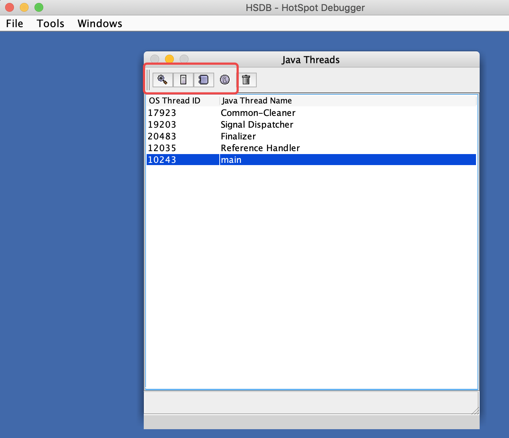

***说明：以下是以JDK11版本为主，跟JDK11相关的监控工具***

# 一、jhsdb

[jhsdb](https://docs.oracle.com/en/java/javase/11/tools/jhsdb.html)

## 1、概述

**Java 9才正式引入**

Jhsdb全称Java Hotspot Debugger，Hotspot进程调试器，可用于从崩溃的JVM附加到Java进程或核心转储。

jhsdb是一款基于Serviceability Agent（可维护性代理，简写为SA）的调试工具。Serviceability Agent是一个JDK组件，用于快照调试、性能分析以及深入了解Hotspot JVM / Hotspot JVM上执行的Java应用程序。

它的工作原理有点类似于Linux上的GDB或者Windows上的Windbg。但尽管诸如gdb的本机调试器可用于检查JVM，但这类本机调试器对Hotspot中的数据结构没有内在了解，因此无法对正在执行的Java应用程序进行深入了解。jhsdb了解JVM关键组件（例如Java堆，堆的代，region，代码缓存等）的位置和地址范围。

## 2、JDK8中使用

尽管JDK 8及更低版本不直接提供jhsdb命令，但依然其实也是可以使用jhsdb的，只需找到 `JAVA_HOME/lib` 目录下的`sa-jdi.jar`文件，然后启动即可。步骤如下：
```bash
# 修改环境变量JAVA_HOME（这里用export临时修改环境变量，当然也可永久修改）
export JAVA_HOME="/Library/Java/JavaVirtualMachines/jdk1.8.0_201.jdk/Contents/Home"

# 为sa-jdi.jar授予执行权限
sudo chmod +x $JAVA_HOME/lib/sa-jdi.jar

# 启动方式1：使用交互式命令行调试器（相当于jhsdb clhsdb）
java -cp $JAVA_HOME/lib/sa-jdi.jar sun.jvm.hotspot.CLHSDB

# 启动方式2：使用交互式GUI调试器启动jhsdb（相当于jhsdb hsdb）
java -cp $JAVA_HOME/lib/sa-jdi.jar sun.jvm.hotspot.HSDB
```

## 3、使用说明

```bash
# 启动交互式命令行调试器
jhsdb clhsdb [--pid pid | --exe executable --core coredump]

# 启动远程调试服务器
jhsdb debugd [options] (pid | executable coredump) [server-id]

# 启动交互式GUI调试器
jhsdb hsdb [--pid pid | --exe executable --core coredump]

# 打印堆栈并锁定信息
jhsdb jstack [--pid pid | --exe executable --core coredump] [options]

# 打印堆信息
jhsdb jmap [--pid pid | --exe executable --core coredump] [options]

# 打印基本的JVM信息
jhsdb jinfo [--pid pid | --exe executable --core coredump] [options]

# 打印性能计数器信息
jhsdb jsnap [options] [--pid pid | --exe executable --core coredump] 
```
- `pid`：进程号
- `server-id`：当多个调试服务器在同一远程主机上运行时使用的可选唯一id
- `executable`：从中生成核心转储的Java可执行文件，和pid选项二选一必填
- `coredump`：jhsdb工具连接到dump文件
- `options`：

## 4、clhsdb

进入clhsdb：`jhsdb clhsdb --pid 24426`，进入交互界面后，输入help，查看相关命令：
```
Attaching to process 24426, please wait...
Warning: Nashorn engine is planned to be removed from a future JDK release
javax.script.ScriptException: TypeError: sapkg.runtime.VM.getVM is not a function in sa.js at line number 54
javax.script.ScriptException: TypeError: sapkg.runtime.VM.getVM is not a function in sa.js at line number 54
Warning! JS Engine can't start, some commands will not be available.
hsdb> help
Available commands:
  assert true | false
  attach pid | exec core
  buildreplayjars [ all | app | boot ]  | [ prefix ]
  detach
  dis address [length]
  disassemble address
  dumpcfg { -a | id }
  dumpcodecache
  dumpideal { -a | id }
  dumpilt { -a | id }
  dumpreplaydata { <address > | -a | <thread_id> }
  echo [ true | false ]
  examine [ address/count ] | [ address,address]
  field [ type [ name fieldtype isStatic offset address ] ]
  findpc address
  flags [ flag | -nd ]
  g1regiondetails
  help [ command ]
  history
  inspect expression
  intConstant [ name [ value ] ]
  jdis address
  jhisto
  jstack [-v]
  livenmethods
  longConstant [ name [ value ] ]
  pmap
  print expression
  printall
  printas type expression
  printmdo [ -a | expression ]
  printstatics [ type ]
  pstack [-v]
  quit
  reattach
  revptrs address
  scanoops start end [ type ]
  search [ heap | perm | rawheap | codecache | threads ] value
  source filename
  symbol address
  symboldump
  symboltable name
  thread { -a | id }
  threads
  tokenize ...
  type [ type [ name super isOop isInteger isUnsigned size ] ]
  universe
  verbose true | false
  versioncheck [ true | false ]
  vmstructsdump
  where { -a | id }
```

## 5、hsdb子命令

图形化模式，和clhsdb对标：`jhsdb hsdb --pid 24426`，即可进入如下图像界面

### 5.1、Java Threads



进入后，可以看到如上所示的界面，其中：
- OS Thread ID：线程id
- Java Thread Name：线程名称

### 5.2、inspect thread

选择一个线程，点击该对话框中的第一个图标，即可弹出 inspector对话框，从中可看到对线程的诊断

其中展示了对现有和执行对象元数据的指针，里面包含了Java类型的名字、继承关系、实现接口关系，字段信息、方法信息、运行时常量池的指针、内嵌的方法续表（vtable）以及接口方法表等，其实都是Hotspot虚拟机记录线程的一些基本信息的C++对象内容；


### 5.3、StackMemory

选择一个线程，点击Java Thread对话框中的第二个图标，即可弹出 Stack Memory对话框，里面是线程栈的内存数据


其中
- 第一列：内存地址（虚拟地址，非物理内存地址）
- 第二列：该地址上存储的数据，以字宽为单位，比如在macos 64位上 jdk11跑的字段是64位（8字节）
- 第三列：定对数据的注释，竖线表示范围，横线或斜线连接范围与注释文字；

如果向查看某个对象的内容，可以如下操作：`window  ---> console`，在控制天输入：`inspect 想要查看对象的地址`

### 5.4、Stack Trace

选择一个线程，点击Java Thread对话框中的第三个图标，即可弹出 Show Java Stack Trace 对话框，里面是线程的线程栈


### 5.5、Show Thread Information

选择一个线程，点击Java Thread对话框中的第四个图标，即可弹出 Show Java Stack Trace 对话框，里面是线程的信息


### 5.6、Find Crashes

最后一个图标是可找到线程崩溃的原因。

### 5.7、工具之：Heap Parameters

可以查看到内存分配
```
Heap Parameters:
Gen 0:   eden [0x0000000123a00000,0x00000001240d4e50,0x0000000127e50000) space capacity = 71630848, 10.00054054923376 used
  from [0x0000000127e50000,0x0000000127e50000,0x00000001286d0000) space capacity = 8912896, 0.0 used
  to   [0x00000001286d0000,0x00000001286d0000,0x0000000128f50000) space capacity = 8912896, 0.0 usedInvocations: 0

Gen 1:   old  [0x0000000178f50000,0x0000000178f50000,0x0000000183a00000) space capacity = 178978816, 0.0 usedInvocations: 0
```

# 二、Arthas

- [Arthas官方文档](https://arthas.aliyun.com/doc/arthas-tutorials.html?language=cn)
- [Arthas原理](https://juejin.cn/post/6904280021632974856)
- [Arthas用户案例](https://github.com/alibaba/arthas/issues?q=label%3Auser-case)


## 1、Arthas介绍

## 2、Arthas使用

### 2.1、arthas排查死循环

## 3、Arthas原理


# 参考资料

* [jstat命令使用](http://blog.csdn.net/maosijunzi/article/details/46049117)
* [visualvm](https://visualvm.github.io/documentation.html)
* [线程堆栈分析](http://fastthread.io/)
* [plumbr-JVM监测工具](https://plumbr.io/)
* [Bistoury-java应用生产问题诊断工具](https://github.com/qunarcorp/bistoury)
