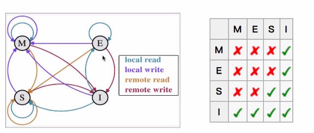
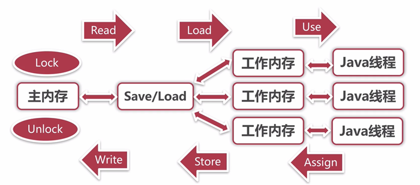
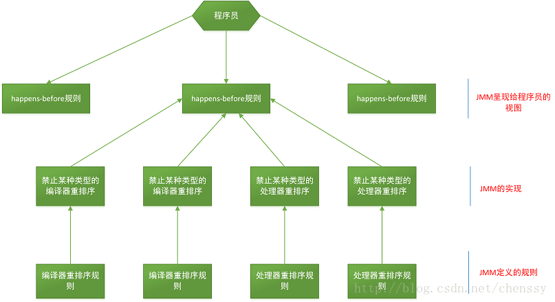

<!-- START doctoc generated TOC please keep comment here to allow auto update -->
<!-- DON'T EDIT THIS SECTION, INSTEAD RE-RUN doctoc TO UPDATE -->
**目录**

- [一、内存模型](#%e4%b8%80%e5%86%85%e5%ad%98%e6%a8%a1%e5%9e%8b)
	- [1、CPU多级缓存](#1cpu%e5%a4%9a%e7%ba%a7%e7%bc%93%e5%ad%98)
	- [2、缓存一致性](#2%e7%bc%93%e5%ad%98%e4%b8%80%e8%87%b4%e6%80%a7)
		- [2.1、cache写方式](#21cache%e5%86%99%e6%96%b9%e5%bc%8f)
		- [2.2、cache line](#22cache-line)
		- [2.3、状态介绍](#23%e7%8a%b6%e6%80%81%e4%bb%8b%e7%bb%8d)
		- [2.4、cache操作](#24cache%e6%93%8d%e4%bd%9c)
		- [2.5、状态转换和cache操作](#25%e7%8a%b6%e6%80%81%e8%bd%ac%e6%8d%a2%e5%92%8ccache%e6%93%8d%e4%bd%9c)
- [二、Java内存模型](#%e4%ba%8cjava%e5%86%85%e5%ad%98%e6%a8%a1%e5%9e%8b)
	- [1、并发编程模型分类](#1%e5%b9%b6%e5%8f%91%e7%bc%96%e7%a8%8b%e6%a8%a1%e5%9e%8b%e5%88%86%e7%b1%bb)
	- [2、定义](#2%e5%ae%9a%e4%b9%89)
		- [2.1、概述](#21%e6%a6%82%e8%bf%b0)
		- [2.2、易混淆概念：JVM内存结构、Java内存模型、Java对象模型](#22%e6%98%93%e6%b7%b7%e6%b7%86%e6%a6%82%e5%bf%b5jvm%e5%86%85%e5%ad%98%e7%bb%93%e6%9e%84java%e5%86%85%e5%ad%98%e6%a8%a1%e5%9e%8bjava%e5%af%b9%e8%b1%a1%e6%a8%a1%e5%9e%8b)
		- [2.3、为什么需要JMM](#23%e4%b8%ba%e4%bb%80%e4%b9%88%e9%9c%80%e8%a6%81jmm)
	- [3、指令重排序](#3%e6%8c%87%e4%bb%a4%e9%87%8d%e6%8e%92%e5%ba%8f)
		- [3.1、重排序分三种类型](#31%e9%87%8d%e6%8e%92%e5%ba%8f%e5%88%86%e4%b8%89%e7%a7%8d%e7%b1%bb%e5%9e%8b)
		- [3.2、重排序执行顺序](#32%e9%87%8d%e6%8e%92%e5%ba%8f%e6%89%a7%e8%a1%8c%e9%a1%ba%e5%ba%8f)
		- [3.3、处理器重排序与内存屏障指令（Memory Barrier）](#33%e5%a4%84%e7%90%86%e5%99%a8%e9%87%8d%e6%8e%92%e5%ba%8f%e4%b8%8e%e5%86%85%e5%ad%98%e5%b1%8f%e9%9a%9c%e6%8c%87%e4%bb%a4memory-barrier)
		- [3.4、JMM内存屏障](#34jmm%e5%86%85%e5%ad%98%e5%b1%8f%e9%9a%9c)
	- [4、JMM-顺序一致性](#4jmm-%e9%a1%ba%e5%ba%8f%e4%b8%80%e8%87%b4%e6%80%a7)
		- [4.1、数据竞争与顺序一致性保证](#41%e6%95%b0%e6%8d%ae%e7%ab%9e%e4%ba%89%e4%b8%8e%e9%a1%ba%e5%ba%8f%e4%b8%80%e8%87%b4%e6%80%a7%e4%bf%9d%e8%af%81)
		- [4.2、顺序一致性内存模型](#42%e9%a1%ba%e5%ba%8f%e4%b8%80%e8%87%b4%e6%80%a7%e5%86%85%e5%ad%98%e6%a8%a1%e5%9e%8b)
		- [4.3、同步程序的顺序一致性效果](#43%e5%90%8c%e6%ad%a5%e7%a8%8b%e5%ba%8f%e7%9a%84%e9%a1%ba%e5%ba%8f%e4%b8%80%e8%87%b4%e6%80%a7%e6%95%88%e6%9e%9c)
		- [4.4、未同步程序的执行特性](#44%e6%9c%aa%e5%90%8c%e6%ad%a5%e7%a8%8b%e5%ba%8f%e7%9a%84%e6%89%a7%e8%a1%8c%e7%89%b9%e6%80%a7)
	- [5、happens before 与 as-if-serial](#5happens-before-%e4%b8%8e-as-if-serial)
		- [5.1、happens-before](#51happens-before)
		- [5.2、happens-before规则](#52happens-before%e8%a7%84%e5%88%99)
		- [5.3、as-if-serial语义](#53as-if-serial%e8%af%ad%e4%b9%89)
- [三、volatile 的特性](#%e4%b8%89volatile-%e7%9a%84%e7%89%b9%e6%80%a7)
	- [1、volatile关键字的两层语义](#1volatile%e5%85%b3%e9%94%ae%e5%ad%97%e7%9a%84%e4%b8%a4%e5%b1%82%e8%af%ad%e4%b9%89)
	- [2、volatile写-读建立的happens before关系](#2volatile%e5%86%99-%e8%af%bb%e5%bb%ba%e7%ab%8b%e7%9a%84happens-before%e5%85%b3%e7%b3%bb)
		- [2.1、volatile写-读的内存语义](#21volatile%e5%86%99-%e8%af%bb%e7%9a%84%e5%86%85%e5%ad%98%e8%af%ad%e4%b9%89)
		- [2.2、volatile两层语义](#22volatile%e4%b8%a4%e5%b1%82%e8%af%ad%e4%b9%89)
			- [2.2.1、可见性](#221%e5%8f%af%e8%a7%81%e6%80%a7)
		- [2.3、volatile保证原子性吗？](#23volatile%e4%bf%9d%e8%af%81%e5%8e%9f%e5%ad%90%e6%80%a7%e5%90%97)
		- [2.4、volatile能保证有序性吗？](#24volatile%e8%83%bd%e4%bf%9d%e8%af%81%e6%9c%89%e5%ba%8f%e6%80%a7%e5%90%97)
		- [2.5、volatile的原理和实现机制](#25volatile%e7%9a%84%e5%8e%9f%e7%90%86%e5%92%8c%e5%ae%9e%e7%8e%b0%e6%9c%ba%e5%88%b6)
		- [2.6、使用volatile关键字的场景](#26%e4%bd%bf%e7%94%a8volatile%e5%85%b3%e9%94%ae%e5%ad%97%e7%9a%84%e5%9c%ba%e6%99%af)
	- [3、volatile内存语义的实现](#3volatile%e5%86%85%e5%ad%98%e8%af%ad%e4%b9%89%e7%9a%84%e5%ae%9e%e7%8e%b0)
	- [4、volatile 和 synchronized 的区别](#4volatile-%e5%92%8c-synchronized-%e7%9a%84%e5%8c%ba%e5%88%ab)
- [四、锁](#%e5%9b%9b%e9%94%81)
	- [1、锁的释放-获取建立的happens before 关系](#1%e9%94%81%e7%9a%84%e9%87%8a%e6%94%be-%e8%8e%b7%e5%8f%96%e5%bb%ba%e7%ab%8b%e7%9a%84happens-before-%e5%85%b3%e7%b3%bb)
	- [2、锁释放和获取的内存语义](#2%e9%94%81%e9%87%8a%e6%94%be%e5%92%8c%e8%8e%b7%e5%8f%96%e7%9a%84%e5%86%85%e5%ad%98%e8%af%ad%e4%b9%89)
	- [3、锁内存语义的实现](#3%e9%94%81%e5%86%85%e5%ad%98%e8%af%ad%e4%b9%89%e7%9a%84%e5%ae%9e%e7%8e%b0)
	- [4、java.util.concurrent包的实现](#4javautilconcurrent%e5%8c%85%e7%9a%84%e5%ae%9e%e7%8e%b0)
- [五、final](#%e4%ba%94final)
- [六、处理器内存模型](#%e5%85%ad%e5%a4%84%e7%90%86%e5%99%a8%e5%86%85%e5%ad%98%e6%a8%a1%e5%9e%8b)
- [参考文章](#%e5%8f%82%e8%80%83%e6%96%87%e7%ab%a0)

<!-- END doctoc generated TOC please keep comment here to allow auto update -->

# 一、内存模型

## 1、CPU多级缓存

- 为什么需要CPU cache：
	CPU的频率太快，快到主存跟不上，这样在处理器时钟周期内，CPU通常需要等待主存，浪费资源。所以cache的出现是为了缓解CPU和内存之间速度不匹配问题。

- CPU cache的意义：
	* 时间局部性：如果某个数据被访问，那么在不久的将来它很可能再次被访问；
	* 空间局部性：如果某个数据被访问，那么与它相邻的数据很快也可能被访问；

## 2、缓存一致性

缓存一致性：用于保证多个CPU cache之间的缓存共享数据一致.MESI-缓存一致协议

### 2.1、cache写方式

- write through(写通)：每次CPU修改了cache中的内容，立即更新到内存，意味着每次CPU写共享数据，都会导致总线事务，因此这种方式常常会引起总线事务的竞争，高一致性，但效率低

- write back(写回)：每次CPU修改了cache中的数据不会立即更新到内存中，而是等到cache line在某个必须或者合适的时机才会更新到内存中。

无论是写通还是写回，在多线程环境下都需要处理缓存cache一致性问题.为了保证缓存一致性，处理器提供了写失效和写更新两个操作来保证一致性.

* 写失效：当一个CPU修改数据，如果有其他CPU修改数据，则通知其为无效；
* 写更新：当一个CPU修改数据，如果有其他CPU有该数据，则通知其更新数据；

### 2.2、cache line

`cache line`是cache与内存数据交换的最小单位，根据操作系统一般是32byte或者64byte。在MESI协议中，状态可以是`M、E、S、I`；地址则是`cache line`中映射的内存地址，数据则是从内存读取的数据

### 2.3、状态介绍

MESI协议将cache line的状态分成 modify、exclusive、shared、invalid，分别是修改、独占、共享、失效.

- modify：当前CPU cache拥有最新数据，其他CPU拥有失效数据(cache line状态是invalid)。虽然当前CPU中的数据和主存不一致，但是以当前CPU的数据为准
- exclusive：只有当前CPU中有数据，其他CPU中没有改数据，当前CPU的数据和主存中的数据是一致的;
- shared：当前CPU和其他CPU有共同数据，并且和主存数据一致.
- invalid：当前CPU中的数据失效，数据应该从主存中获取，其他CPU可能有数据也可能没有数据，当前CPU的数据和主存被认为是不一致的。对于invalid而言，在MESI协议中采取的是写失效.

### 2.4、cache操作



在MESI中，每个cache的控制器不仅自己的操作(local read和local write)，通过监听也能其他CPU的cahce操作(remote read和remote write)。对于自己本地缓存有的数据，CPU仅需要发起local操作，否则发起remote操作，从主存中读取数据，cache通过总线监听，仅能够知道其他CPU发起的remote操作，但是如果local操作会导致数据不一致，cache控制器会通知其他CPU的cache控制修改状态

* local read(LR)：读取本地cache中的数据
* local write(LW)：将数据写到本地cache
* remote read(RR)：读取内存中的数据
* remote write(RW)：将数据写到主内存

### 2.5、状态转换和cache操作

* MESI协议中cache line数据状态有4种，引起数据状态转换的CPU cache操作也有4种，因此要理解MESI协议.就要将这16种状态转换的情况讨论清楚.

* 初始场景：在最初的时候，所有CPU中都没有数据，某一个CPU发生读操作，此时发生RR，数据从主存中读取到当前CPU的cache，状态为E（独占，只有当前CPU有数据，且和主存一致），此时如果有其他CPU也读取数据，则状态修改为S（共享，多个CPU之间拥有相同数据，并且和主存保持一致)，如果其中某一个CPU发生数据修改，那么该CPU中数据状态修改为M（拥有最新数据，和主存不一致，但是以当前CPU中的为准），并通知其他拥有该数据的CPU数据失效，其他CPU中的cache line状态修改为I（失效，和主存中的数据	被认为不一致，数据不可用应该重新获取）

**2.5.1、modify**

场景：当前CPU中数据的状态是modify，表示当前CPU中拥有最新数据，虽然主存中的数据和当前CPU中的数据不一致，但是以当前CPU中的数据为准

- LR：此时如果发生local read，即当前CPU读数据，直接从cache中获取数据，拥有最新数据，因此状态不变;
- LW：直接修改本次cache数据，修改后也是当前CPU用于最新数据，因此状态不变;
- RR：因为本地内存中有最新数据，因此当前CPU不会发生RR和RW.当本地cache控制器监听到总线上有RR发生时，必然是其他CPU发生了读主存操作，此时为了保证数据一致性，当前CPU应该将数据写回到主存，而随后的RR将会使得其他CPU和当前CPU用于共同数据，因此状态改为"S";
- RW：同RR，当cache控制器监听到总线发生RW，当前CPU会将数据写回主存，因为随后的RW将会导致主存数据修改，因此状态修改为"I"

**2.5.2、exclusive**

场景：当前CPU的数据状态为exclusive，表示当前CPU独占数据(其他CPU没有数据)，并且和主存的数据一致.

- LR：从背地cache中直接获取数据，状态不变.
- LW：修改本地cache中的数据，状态修改称为"M"（因为其他CPU并没有该数据，因此不存在共享问题，不需要通知其他CPU修改cache line状态为"I"）
- RR：因为本地cache中有最新数据，因此当前CPU cache操作不会发生RR和RW，当cache控制器监听到总线上发生RR的时候，必然是其他CPU发生了读取主存的操作，而RR操作不会导致数据修改，因此两个CPU中的数据和主存的数据一致，此时的cache line状态改为"S"
- RW：同RR，当cache控制器监听到总线上发生RW，发现其他CPU将最新数据写回到主存，此时为了保证缓存一致性，当前CPU的数据状态修改为"I"

**2.5.3、shared**

场景：当前CPU的数据状态是shared，表示当前CPU和其他CPU共享数据，且数据在多个CPU之间一致，多个CPU和主存的数据一致.

- LR：直接从cache中读取数据，状态不变;
- LW：发生本地写，并不会将数据立即写回主存，而是在稍后的一个时间再写回主存，因此为了保存缓存一致性，当前CPU的cache line的状态修改为"M"，并通知其他拥有该数据的CPU该数据失效，其他CPU将cache line状态修改为"I"
- RR：状态不变，因为多个CPU的数据和主存的数据一致
- RW：当监听到总线发生了RW，意味着其他CPU发生了写主存操作，此时本地cache中的数据既不是最新数据，和主存也不再一致，因此当前CPU的cache line状态修改为"I"

**2.5.4、invalid**

场景：当前CPU的数据状态是invalid，表示当前CPU是脏数据，不可用，其他CPU可能有数据、也可能没有数据.

- LR：因为当前CPU的cache line 数据不可用，因此会发生RR操作，此时情形如下：
	* 如果其他CPU中没有数据，则状态修为"E";
	* 如果其他CPU中有数据，且状态为"S"或"E"，则状态修改为"S";
	* 如果其他CPU中有数据且状态为"M"，那么其他CPU首先发生RW操作将"M"状态的数据写回主存，并修改状态为"S"，随后当前CPU读取主存数据，也将状态修改为"S"

- LW：因为当前CPU的cache line数据无效，因此发生LW直接操作本地cache，此时情形如下：
	* 如果其他CPU无数据，则将本地cache line的状态修改为"M";
	* 如果其他CPU有数据且状态为"S"或"E"，则修改为本地cache，通知其他CPU将数据修改为"I"，当前CPU中的cache line装填修改为"M";
	* 如果其他CPU中有数据且状态为"M"，则其他CPU首先将数据写回主存，并将状态改为"I"，当前CPU的cache line状态修改为"M"
- RR：监听到总线发生RR操作，表示有其他CPU从主存中读取数据，和本地cache无关，状态不变;
- RW：监听到总线发生RW操作，表示有其他CPU写主存，和本地cache无关，状态不变;

# 二、Java内存模型

## 1、并发编程模型分类

在并发编程中，需要处理两个关键问题：线程之间如何通信及线程之间如何同步

**1.1、通信：是指线程之间以何种机制来交换信息.在命令式编程中，线程之间的通信机制有两种：共享内存和消息传递**

- 在共享内存的并发模型里，线程之间共享程序的公共状态，线程之间通过写-读内存中的公共状态来隐式进行通信。
- 在消息传递的并发模型里，线程之间没有公共状态，线程之间必须通过明确的发送消息来显式进行通信；首先，线程A把本地内存A中更新过的共享变量刷新到主内存中去。然后，线程B到主内存中去读取线程A之前已更新过的共享变量。


**1.2、同步：是指程序用于控制不同线程之间操作发生相对顺序的机制**

- 在共享内存并发模型里，同步是显式进行的，必须显式指定某个方法或某段代码需要在线程之间互斥执行；
- 在消息传递的并发模型里，由于消息的发送必须在消息的接收之前，因此同步是隐式进行的；

**1.3、同步操作：**

- lock（锁定）：作用于主内存变量，把一个变量标识为一条线程独占状态;
- unlock（解锁）：作用于主内存的变量，把一个处于锁定状态的变量释放，释放后的变量才可以被其他线程锁定;
- read（读取）：作用于住内存变量，把一个变量值从主内存中传输到线程的工作内存中，以便随后的load动作使用;
- load（载入）：作用于工作内存变量，它把read操作从主内存中得到的变量值放入到工作内存的变量副本中;
- use（使用）：作用于工作内存变量，把工作内存中的一个变量值传递给执行引擎;
- assign（赋值）：作用工作内存的变量，它把一个从执行引擎接收到的值赋值给工作内存变量;
- store（存储）：作用于工作内存的变量，把工作内存中的一个变量值传递到主内存中，以便随后的write操作;
- write（写入）：作用于住内存变量它把store操作从工作内存中一个变量的值传送到主内存的变量中;

**1.4、同步规则：**



- 如果要把一个变量从主内存中复制到工作内存，就需要按顺序的执行read和load操作，如果把变量从工作内存同步回主内存中就要按顺序执行store和write操作.Java内存模型要求上述操作必须按顺序执行，而没有保证必须是连续执行;
- 不允许read和load、store和write操作之一单独出现
- 不允许一个线程丢弃它的最近assign的操作，即变量在工作内存中改变了之后必须同步到主内存中;
- 不允许一个线程无原因的把数据从工作内存同步回住内存中;
- 一个新的变量只能在主内存中诞生，不允许在工作内存中直接使用一个未被初始化(load和assign)的变量。即就是对要ige变量实施use和store操作之前，必须先执行过了assign和load操作;
- 一个变量在同一时刻只允许一条线程对其进行lock操作，但lock操作可以被同一条线程重复执行多次，变量才会被解锁.lock和unlock必须成对出现.
- 如果对一个变量执行lock操作，将回情况工作内存中此变量的值，在执行引擎使用这个变量前需要重新执行load或assign操作初始化变量的值;
- 如果一个变量实现没有被lock操作锁定，则不允许对它执行unlock操作;也不允许去unlock一个被其他线程锁定的变量;
- 对一个变量执行unlock操作之前，必须先把此变量同步到主内存中(执行store和write操作);

Java并发采用的是共享内存模型，Java 线程之间的通信总是隐式进行，整个通信过程对程序员完全透明

## 2、定义

### 2.1、概述

Java内存模型是一种规范，描述了在多线程代码中哪些行为是合法的，以及线程如何通过内存进行交互。它描述了"程序中的变量"和"从内存或者寄存器获取或存储它们的底层细节"之间的关系。Java内存模型通过使用各种各样的硬件和编译器的优化来正确实现以上事情：

- Java内存模型（Java Memory Model ,JMM）就是一种符合内存模型规范的，屏蔽了各种硬件和操作系统的访问差异的，保证了Java程序在各种平台下对内存的访问都能保证效果一致的机制及规范
- Java内存模型规定了：定义了程序中变量的访问规则，即定义了程序的执行次序。注意：为了获得较好的执行性能，Java内存模型并没有限制执行引擎使用处理器的寄存器或者高速缓存来提升指令执行速度，也没有限制编译器对指令进行重排序。也就是说，在java内存模型中，也会存在缓存一致性问题和指令重排序的问题；
- Java内存模型规定所有的变量都是存在主存当中(类似物理内存)，每个线程都有自己的工作内存(类似高速缓存)，线程对变量的所有操作都必须在工作内存中进行，而不能直接对主存进行操作，并且每个线程不能访问其他线程的工作内存；
- 所有实例域、静态域和数组元素存储在堆内存中，堆内存在线程之间共享;
- 局部变量(Local variables)，方法定义参数(java语言规范称之为formal method parameters)和异常处理器参数(exception handler parameters)不会在线程之间共享，它们不会有内存可见性问题，也不受内存模型的影响；
- Java 线程之间的通信由 Java 内存模型，JMM 决定一个线程对共享变量的写入何时对另一个线程可见从抽象的角度来看，JMM 定义了线程和主内存之间的抽象关系：线程之间的共享变量存储在主内存(main memory)中，每个线程都有一个私有的本地内存(local memory)，本地内存中存储了该线程以读/写共享变量的副本。本地内存是JMM的一个抽象概念，并不真实存在；
- JMM就作用于工作内存和主存之间数据同步过程。他规定了如何做数据同步以及什么时候做数据同步
- JMM是工具类和关键字的原理：volatile、synchronized、Lock等
- JMM三种特性：重排序、可见性、原子性；

### 2.2、易混淆概念：JVM内存结构、Java内存模型、Java对象模型

- JVM内存结构：由Java虚拟机规范定义。描述的是Java程序执行过程中，由JVM管理的不同数据区域。各个区域有其特定的功能；

- Java内存模型（JMM）：其并不像JVM内存结构一样是真实存在的，只是一个抽象的概念；JMM是和多线程相关的，他描述了一组规则或规范，这个规范定义了一个线程对共享变量的写入时对另一个线程是可见的；Java的多线程之间是通过共享内存进行通信的，而由于采用共享内存进行通信，在通信过程中会存在一系列如可见性、原子性、顺序性等问题，而JMM就是围绕着多线程通信以及与其相关的一系列特性而建立的模型。JMM定义了一些语法集，这些语法集映射到Java语言中就是volatile、synchronized等关键字；

- Java对象模型：关于Java对象自身的存储模型称之为Java对象模型，和Java对象在虚拟机中的表现形式有关，其存储模型是：OOP-Klass模型

### 2.3、为什么需要JMM

- 依赖处理器，不同的处理器结果是不一样的；
- 无法保证并发安全；
- 需要一个标准，让多线程运行的结果可预期；

## 3、指令重排序

在执行程序时为了提高性能，编译器和处理器常常会对指令做重排序

### 3.1、重排序分三种类型

- 编译器优化的重排序：编译器在不改变单线程程序语义的前提下，可以重新安排语句的执行顺序
- 指令级并行的重排序：现代处理器采用了指令级并行技术(Instruction-Level Parallelism，ILP)来将多条指令重叠执行。如果不存在数据依赖性，处理器可以改变语句对应机器指令的执行顺序
- 内存系统的重排序：由于处理器使用缓存和读/写缓冲区，这使得加载和存储操作看上去可能是在乱序执行

*指令重排序需要满足两个条件：*
- 在单线程环境下不能改变程序运行的结果；
- 存在数据依赖关系的不允许重排序

*无法通过happens-before原则推导出来的，JMM允许任意的排序。*

### 3.2、重排序执行顺序

从Java源代码到最终实际执行的指令序列，会分别经历下面三种重排序

源代码--> 1：编译器优化的重排序 --> 2：指令级并行的重排序 --> 3：内存系统的重排序-->最终执行的指令序列

- 上述 “1”属于编译器重排序，“2和3”属于处理器重排序，这些重排序都可能会导致多线程程序出现内存可见性问题；
- 对于编译器重排序，JMM 的编译器重排序规则会禁止特定类型的编译器重排序（不是所有的编译器重排序都要禁止）；
- 对于处理器重排序，JMM 的处理器重排序规则会要求java编译器在生成指令序列时，插入特定类型的	内存屏障（memory barriers，intel称之为memory fence）指令，通过内存屏障指令来禁止特定类型的处理器重排序（不是所有的处理器重排序都要禁止）；
- JMM 属于语言级的内存模型，它确保在不同的编译器和不同的处理器平台之上，通过禁止特定类型的编译器重排序和处理器重排序，为程序员提供一致的内存可见性保证

### 3.3、处理器重排序与内存屏障指令（Memory Barrier）

- 写缓冲区可以保证指令流水线持续运行，它可以避免由于处理器停顿下来等待向内存写入数据而产生的延迟每个处理器上的写缓冲区，仅仅对它所在的处理器可见处理器对内存的读/写操作的执行顺序，不一定与内存实际发生的读/写操作顺序一致！由于写缓冲区仅对自己的处理器可见，它会导致处理器执行内存操作的顺序可能会与内存实际的操作执行顺序不一致；
	
- 常见的处理器都允许 Store-Load重排序；常见的处理器都不允许对存在数据依赖的操作做重排序。sparc-TSO 和x86拥有相对较强的处理器内存模型，它们仅允许对写-读操作做重排序(因为它们都使用了写缓冲区)

### 3.4、JMM内存屏障

是一种屏障指令，它使CPU或编译器对屏障指令之前和之后发出的内存操作执行一个排序约束

- `LoadLoad Barriers`
	- 抽象示例：`Load1; LoadLoad; Load2` 
	- 描述：在Load2要读取的数据被访问前，保证Load1要读取的数据被读取完毕
- `StoreStore Barriers`
	- 抽象示例：`Store1; StoreStore; Store2`
	- 描述： 在Store2写入执行前，确保Store1数据对其他处理器可见(刷新到内存)
- `LoadStore Barriers`
	- 抽象示例：`Load1; LoadStore; Store2`
	- 描述：在Store2被写入前，保证Load1要读取的数据被读取完毕
- `StoreLoad Barriers`
	- 抽象示例：`Store1; StoreLoad; Load2`
	- 描述：在Load2读取操作执行前，保证Store1的写入对所有处理器可见。StoreLoad Barriers 会使该屏障之前的所有内存访问指令(存储和装载指令)完成之后。才执行该屏障之后的内存访问指令。StoreLoad Barriers 是一个“全能型”的屏障，它同时具有其他三个屏障的效果，同时也是开销最大的屏障

## 4、JMM-顺序一致性

### 4.1、数据竞争与顺序一致性保证

- 当程序未正确同步时，就会存在数据竞争。java内存模型规范对数据竞争的定义如下：在一个线程中写一个变量，在另一个线程读同一个变量， 而且写和读没有通过同步来排序；当代码中包含数据竞争时，程序的执行往往产生违反直觉的结果；

- JMM 对正确同步的多线程程序的内存一致性做了如下保证如果程序是正确同步的，程序的执行将具有顺序一致性（sequentially consistent）即程序的执行结果与该程序在顺序一致性内存模型中的执行结果相同；

### 4.2、顺序一致性内存模型

顺序一致性内存模型是一个理论参考模型，JMM和处理器内存模型在设计时通常会把顺序一致性内存模型作为参照

- **4.2.1、两大特征：**

- 一个线程中的所有操作必须按照程序的顺序来执行；
- （不管程序是否同步）所有线程都只能看到一个单一的操作执行顺序；在顺序一致性内存模型中，每个操作都必须原子执行且立刻对所有线程可见；

- **4.2.2、顺序一致性模型有一个单一的全局内存，这个内存通过一个左右摆动的开关可以连接到任意一个线程。同时，每一个线程必须按程序的顺序来执行内存读/写操作；**

### 4.3、同步程序的顺序一致性效果

在顺序一致性模型中，所有操作完全按程序的顺序串行执行。而在JMM中，临界区内的代码可以重排序（但JMM 不允许临界区内的代码“逸出”到临界区之外，那样会破坏监视器的语义）。JMM 会在退出监视器和进入监视器这两个关键时间点做一些特别处理，使得线程在这两个时间点具有与顺序一致性模型相同的内存视图;

### 4.4、未同步程序的执行特性

- 对于未同步或未正确同步的多线程程序，JMM只提供最小安全性：线程执行时读取到的值，要么是之前某个线程写入的值，要么是默认值(0，null，false)，JMM 保证线程读操作读取到的值不会无中生有的冒出来；

- JMM 不保证未同步程序的执行结果与该程序在顺序一致性模型中的执行结果一致：因为未同步程序在顺序一致性模型中执行时，整体上是无序的，其执行结果无法预知。保证未同步程序在两个模型中的执行结果一致毫无意义

- 未同步程序在这两个模型中的执行特性有下面几个差异：
	- ①、顺序一致性模型保证单线程内的操作会按程序的顺序执行，而 JMM 不保证单线程内的操作会按程序的顺序执行
	- ②、顺序一致性模型保证所有线程只能看到一致的操作执行顺序，而 JMM 不保证所有线程能看到一致的操作执行顺序

- JMM 不保证对64位的 long 型和 double 型变量的读/写操作具有原子性，而顺序一致性模型保证对所有的内存读/写操作都具有原子性

## 5、happens before 与 as-if-serial

### 5.1、happens-before

可见性：从JDK5开始，java使用新的`JSR-133`内存模型，`JSR-133`提出了`happens-before`的概念，通过这个概念来阐述操作之间的内存可见性如果一个操作执行的结果需要对另一个操作可见，那么这两个操作之间必须存在`happens-before`关系，这里提到的两个操作既可以是在一个线程之内，也可以是在不同线程之间。

Happens-Before 约束了编译器的优化行为，虽允许编译器优化，但是要求编译器优化后一定遵守`happens-before`规则

注意：两个操作之间具有`happens-before`关系，并不意味着前一个操作必须要在后一个操作之前执行！`happens-before`仅仅要求前一个操作(执行的结果)对后一个操作可见，且前一个操作按顺序排在第二个操作之前（the first is visible to and ordered before the second）；如果重排序之后的执行结果与按照happens-before关系来执行的结果一致，那么这种重排序并不非法

### 5.2、happens-before规则

- 程序顺序规则：一个线程内，按照代码顺序，书写在前面的操作先行发生于书写在后面的操作；
- 监视器锁规则：对一个监视器锁的解锁，`happens-before` 于随后对同一个监视器锁的加锁
- volatile变量规则：对一个`volatile`域的写，`happens-before` 于任意后续对这个`volatile`域的读
- 传递性：如果`A happens-before B`，且 `B happens-before C`，那么 `A happens-before C`
- 线程启动规则：Thread 对象的 start 方法 `happens-before` 于此线程的每一个动作;
- 线程终止规则：线程中的所有操作都先行发生于此线程的终止检测，可以通过 `Thread.join()`方法结束，`Thread.isAlive()`的返回值等手段检测到已终止执行;
- 线程中断规则：对线程的 interrupt 方法的调用先行发生于被中断线程的代码检测到中断事件的发生
- 对象终结规则：一个对象的初始化完成先行发生于它的` finalize()` 方法的开始

*一个happens-before规则通常对应于多个编译器重排序规则和处理器重排序规则，happens-before关系是存在这传递性的*

可以对他们进行推导出其他满足happens-before的规则：
- 将一个元素放入一个线程安全的队列的操作Happens-Before从队列中取出这个元素的操作；
- 将一个元素放入一个线程安全容器的操作Happens-Before从容器中取出这个元素的操作；
- 在CountDownLatch上的countdown操作`Happens-Before` `CountDownLatch#await()`操作；
- 释放Semaphore许可的操作Happens-Before获得许可操作；
- Future表示的任务的所有操作Happens-Before Future#get()操作；
- 向Executor提交一个Runnable或Callable的操作Happens-Before任务开始执行操作

	

### 5.3、as-if-serial语义

- 所有的操作均可以为了优化而被重排序，但是你必须要保证重排序后执行的结果不能被改变，编译器、runtime、处理器都必须遵守as-if-serial语义。注意as-if-serial只保证单线程环境，多线程环境下无效；
- 为了保证`as-if-serial`语义，Java异常处理机制对重排序做了一种特殊的处理：JIT在重排序时会在catch语句中插入错误代偿代码,这样做虽然会导致cathc里面的逻辑变得复杂，但是JIT优化原则是：尽可能地优化程序正常运行下的逻辑，哪怕以catch块逻辑变得复杂为代价

	例子：
	```java
	public class RecordExample1 {
		public static void main(String[] args){
			int a = 1;
			int b = 2;

			try {
				a = 3;           //A
				b = 1 / 0;       //B
			} catch (Exception e) {

			} finally {
				System.out.println("a = " + a);
			}
		}
	}
	```

# 三、volatile 的特性

## 1、volatile关键字的两层语义

一旦一个共享变量(类的成员变量、类的静态成员变量)被volatile修饰之后，那么就具备了两层语义：
- 保证了不同线程对这个变量进行操作时的可见性，即一个线程修改了某个变量的值，这新值对其他线程来说是立即可见的；
- 禁止进行指令重排序

示例代码：
```java
class VolatileFeaturesExample {
    volatile long vl = 0L;  //使用volatile声明64位的long型变量
    public void set(long l) {
        vl = l;   //单个volatile变量的写
    }
    public void getAndIncrement () {
        vl++;    //复合(多个)volatile变量的读/写
    }
    public long get() {
        return vl;   //单个volatile变量的读
    }
}
```
假设有多个线程分别调用上面程序的三个方法，这个程序在语意上和下面程序等价：
```java
class VolatileFeaturesExample {
	long vl = 0L;               // 64位的long型普通变量
	public synchronized void set(long l) {     //对单个的普通 变量的写用同一个监视器同步
		vl = l;
	}
	public void getAndIncrement () { //普通方法调用
		long temp = get();           //调用已同步的读方法
		temp += 1L;                  //普通写操作
		set(temp);                   //调用已同步的写方法
	}
	public synchronized long get() { 
		//对单个的普通变量的读用同一个监视器同步
		return vl;
	}
}
```
把对volatile变量的单个读/写，看成是使用同一个监视器锁对这些单个读/写操作做了同步

- 如上面示例程序所示，对一个volatile变量的单个读/写操作，与对一个普通变量的读/写操作使用同一个监视器锁来同步，它们之间的执行效果相同：volatile写和监视器的释放有相同的内存语义；volatile读与监视器的获取有相同的内存语义；

- 监视器锁的happens-before规则保证释放监视器和获取监视器的两个线程之间的内存可见性，这意味着对一个volatile变量的读，总是能看到(任意线程)对这个volatile变量最后的写入;

- 监视器锁的语义决定了临界区代码的执行具有原子性.这意味着即使是64位的 long 型和 double 型变量，只要它是volatile变量，对该变量的读写就将具有原子性.如果是多个volatile操作或类似于volatile++这种	复合操作，这些操作整体上不具有原子性;

## 2、volatile写-读建立的happens before关系

从JSR-133开始，volatile变量的写-读可以实现线程之间的通信

### 2.1、volatile写-读的内存语义

- volatile写的内存语义：当写一个volatile变量时，JMM 会把该线程对应的本地内存中的共享变量刷新到主内存;
- volatile读的内存语义：当读一个volatile变量时，JMM 会把该线程对应的本地内存置为无效.线程接下来将从主内存中读取共享变量;

	- 线程A写一个volatile变量，实质上是线程A向接下来将要读这个volatile变量的某个线程发出了(其对共享变量所在修改的)消息。
	- 线程B读一个volatile变量，实质上是线程B接收了之前某个线程发出的(在写这个volatile变量之前对共享变量所做修改的)消息。
	- 线程A写一个volatile变量，随后线程B读这个volatile变量，这个过程实质上是线程A通过主内存向线程B发送消息。

volatile关键字用于表示可以被多个线程异步修改的成员变量，强制从公共堆栈中取得变量的值，不是从私有线程获取

volatile 关键字在许多Java虚拟机中都没有实现。volatile的目标用途是为了确保所有线程所看到的指定变量的值都是相同的；Java语言中的volatile变量可以被看作是一种 “程度较轻的synchronized”；与 synchronized 块相比，volatile 变量所需的编码较少，并且运行时开销也较少，但是它所能实现的功能也仅是 synchronized 的一部分缓存一致性问题；

### 2.2、volatile两层语义

一旦一个共享变量(类的成员变量、类的静态成员变量)被volatile修饰之后，那么就具备了两层语义：

- 保证了不同线程对这个变量进行操作时的可见性，即一个线程修改了某个变量的值，这新值对其他线程来说是立即可见的;
- 禁止进行指令重排序
```java
//线程1
boolean stop = false;
while(!stop){
	doSomething();
}			 
//线程2
stop = true;
```
如果要线程1和线程2正确执行，用volatile修饰 stop 变量：>

* 第一：使用volatile关键字会强制将修改的值立即写入主存；>
* 第二：使用volatile关键字的话，当线程2进行修改时，会导致线程1的工作内存中缓存变量stop的缓存行无效（反映到硬件层的话，就是CPU的L1或者L2缓存中对应的缓存行无效）；
* 第三：由于线程1的工作内存中缓存变量stop的缓存行无效，所以线程1再次读取变量stop的值时会去主存读取。

#### 2.2.1、可见性

当一个共享变量被volatile修饰时，它会保证修改的值会立即被更新到主存，当有其他线程需要读取时，它会去内存中读取新值；另外：通过 synchronized 和 Lock 也能够保证可见性，synchronized 和Lock 能保证同一时刻只有一个线程获取锁然后执行同步代码，并且在释放锁之前会将对变量的修改刷新到主存当中。因此可以保证可见性

- 解决异步死循环：

	JVM 在设置 -server 时出现死循环：一个变量存在与公共堆栈中和线程的私有堆栈中。JVM 被设置了-server是为了线程运行的效率，线程一直在私有堆栈中获取变量的值，而调用 set 方法时虽然被执行了，但是更新的却是公共堆栈中的变量值；造成这样的原因就是私有堆栈中的值和公共堆栈的值不同步造成的；

- 为什么 volatile 有这样的特性？因为 Java 的 happens-before(先行发生)对于一个volatile变量的写操作先行发生于后面对这个变量的读操作可见性：基于CPU的内存屏障指令，被JSR-133抽象为happens-before原则

- 可见性问题根本原因：是因为多级缓存的存在，CPU和主存之间存在多级缓存，主内存和各个的本地内存存在通信；所有的共享变量存在主内存中，每个线程都有自己的本地内存，而且线程读写共享数据页通过本地内存交换的，所以才导致了可见性问题；

### 2.3、volatile保证原子性吗？

volatile也无法保证对变量的任何操作都是原子性的
- 原子性：一个或多个操作在CPU执行的过程中不被中断的特性，称为原子性。在Java中，对基本数据类型的变量的读取和赋值操作是原子性操作，即这些操作是不可被中断的，要么执行，要么不执行
	```java
	x = 10;         //语句1
	y = x;         //语句2
	x++;           //语句3
	x = x + 1;     //语句4
	```
	上述四句那些是原子操作?
	- ①、其实只有语句1是原子性操作，其他三个语句都不是原子性操作。
	- ②、语句1是直接将数值10赋值给x，也就是说线程执行这个语句的会直接将数值10写入到工作内存中
	- ③、语句2实际上包含2个操作，它先要去读取x的值，再将x的值写入工作内存，虽然读取x的值以及 将x的值写入工作内存这2个操作都是原子性操作，但是合起来就不是原子性操作了。
	- ④、同样的，x++和 x = x+1包括3个操作：读取x的值，进行加1操作，写入新的值。

	所以上面4个语句只有语句1的操作具备原子性；volatile是无法保证复合操作的原子性

- 自增操作不是原子性操作，而且volatile也无法保证对变量的任何操作都是原子性的。在java 1.5的 java.util.concurrent.atomic 包下提供了一些原子操作类，即对基本数据类型的自增(加1操作)，自减(减1操作)、以及加法操作(加一个数)，减法操作(减一个数)进行了封装，保证这些操作是原子性操作。atomic是利用 CAS 来实现原子性操作的(Compare And Swap)，CAS 实际上是利用处理器提供的 CMPXCHG 指令实现的，	而处理器执行 CMPXCHG 指令是一个原子性操作.
	
*不要将volatile用于getAndOperate操作(这种场合不原子，需要加锁)。仅set或者get适合volatile*

- 为什么volatile无法保证原子性，而atomic原子操作类能保证原子性。假设让一个volatile的Integer自增，要分成三步：

	* 读取volatile变量到local
	* 增加变量的值
	* 把local的值写回，让其他线程可见

	上面三步的jvm指令为：
	```
	mov    0xc(%r10)，%r8d ; Load
	inc    %r8d           ; Increment
	mov    %r8d，0xc(%r10) ; Store
	lock addl $0x0，(%rsp) ; StoreLoad Barrier (内存屏障)
	```
	从Load到store到内存屏障，一共4步，其中最后一步jvm让这个最新的变量的值在所有线程可见，也就是最后一步让所有的CPU内核都获得了最新的值，但中间的几步(从Load到Store)是不安全的，中间如果其他的CPU修改了值将会丢失。
	代码如下：
	```java
	public static void main(String[] args) {
		Thread t1 = new Thread(new LoopVolatile());
		t1.start();
		Thread t2 = new Thread(new LoopVolatile2());
		t2.start();
		while (t1.isAlive() || t2.isAlive()) {}
		System.out.println("final val is： " + _longval);
	}
	private static volatile long _longval = 0;
	private static class LoopVolatile implements Runnable {
		@Override
		public void run() {
			long val = 0;
			while (val < 10000000L) {
				_longval++;
				val++;
			}
		}
	}
	private static class LoopVolatile2 implements Runnable {
		@Override
		public void run() {
			long val = 0;
			while (val < 10000000L) {
				_longval++;
				val++;
			}
		}
	}
	```
	AtomicXXX 却能保证原子性：CAS指令，其实AtomicLong的源码里也用到了volatile，但只是用来读取或写入

- 原子操作：
	- 除long和double之外的基本类型的赋值操作；long和double在单个写入视为两个单独的写入，在32位机器上的JVM的long和double的操作不是原子的；
	- 所有的reference的赋值操作；
	- java.concurrent.Atomic.* 包中所有类的原子操作；

**两个原子操作组合起来不一定是原子操作；**

### 2.4、volatile能保证有序性吗？

volatile关键字能禁止指令重排序，所以volatile能在一定程度上保证有序性

- **有序性：在Java内存模型中，允许编译器和处理器对指令进行重排序，但是重排序过程不会影响到单线程程序的执行，却会影响到多线程并发执行的正确性**

- **volatile关键字禁止指令重排序有两层意思：**

	- 当程序执行到volatile变量的读操作或者写操作时，在其前面的操作的更改肯定全部已经进行，且结果已经对后面的操作可见；在其后面的操作肯定还没有进行；
	- 在进行指令优化时，不能将在对volatile变量访问的语句放在其后面执行，也不能把volatile变量后面的语句放到其前面执行

### 2.5、volatile的原理和实现机制

"观察加入volatile关键字和没有加入volatile关键字时所生成的汇编代码发现加入volatile关键字时，会多出一个lock前缀指令"lock前缀指令实际上相当于一个内存屏障(也成内存栅栏)内存屏障会提供3个功能：

- 它确保指令重排序时不会把其后面的指令排到内存屏障之前的位置，也不会把前面的指令排到内存屏障的后面；即在执行到内存屏障这句指令时，在它前面的操作已经全部完成；
- 它会强制将对缓存的修改操作立即写入主存；
- 如果是写操作，它会导致其他CPU中对应的缓存行无效。

### 2.6、使用volatile关键字的场景

通常来说，使用volatile必须具备以下2个条件
- 对变量的写操作不依赖于当前值，或者能够确保只有单一的线程修改变量的值
- 该变量没有包含在具有其他变量的不变式中;
- 在访问变量时不需要加锁
	
仅当 volatile 变量能简化代码的实现以及对同步策略的验证时，才应该使用。如果在验证正确性时需要对可见性进行复杂的判断，那么就不要使用 volatile 变量。

volatile 变量的正确使用：确保它们自身状态的可见性，确保它们所引用对象的状态的可见性，以及标识一些重要的程序生命周期事件的发生;

无状态对象：就是没有实例变量的对象，不能保存数据，是不变类，线程安全的

**volatile最适合使用的是一个线程写，其他线程读的场景**

## 3、volatile内存语义的实现

**3.1、为了实现volatile内存语义，JMM 会分别限制编译器重排序和处理器重排序这两种类型的重排序类型**

**3.2、JMM 针对编译器制定的volatile重排序规则表：**

- 当第二个操作是volatile写时，不管第一个操作是什么，都不能重排序。这个规则确保volatile写之前的操作不会被编译器重排序到volatile写之后
- 当第一个操作是volatile读时，不管第二个操作是什么，都不能重排序。这个规则确保volatile读之后的操作不会被编译器重排序到volatile读之前
- 当第一个操作是volatile写，第二个操作是volatile读时，不能重排序

**3.3、为了实现volatile的内存语义，编译器在生成字节码时，会在指令序列中插入内存屏障来禁止特定类型的处理器重排序：**

下面是基于保守策略的 JMM 内存屏障插入策略
- 在每个volatile写操作的前面插入一个StoreStore屏障：保证在volatile写之前，其前面的所有普通写操作已经对任意处理器可见了，因为StoreStore屏障将保障上面所有的普通写在volatile写之前刷新到主内存；
- 在每个volatile写操作的后面插入一个StoreLoad屏障：避免volatile写与后面可能有的volatile读/写操作重排序，因为编译器常常无法准确判断在一个volatile写的后面，是否需要插入一个 StoreLoad 屏障，为了保证能正确实现volatile的内存语义，JMM 在这里采取了保守策略：在每个volatile写的后面或在每个volatile读的前面插入一个 StoreLoad 屏障；
- 在每个volatile读操作的前面插入一个 LoadLoad 屏障：用来禁止处理器把上面的volatile读与下面的普通读重排序；
- 在每个volatile读操作的后面插入一个 LoadStore 屏障：用来禁止处理器把上面的volatile读与下面的普通写重排序；
在实际执行时，只要不改变volatile写-读的内存语义，编译器可以根据具体情况省略不必要的屏障

**3.4、JSR-133为什么要增强volatile的内存语义**

严格限制编译器和处理器对volatile变量与普通变量的重排序，确保volatile的写-读和监视器的释放-获取一样，具有相同的内存语义

**3.5、由于volatile仅仅保证对单个volatile变量的读/写具有原子性，而监视器锁的互斥执行的特性可以确保对整个临界区代码的执行具有原子性。**

在功能上，监视器锁比volatile更强大；在可伸缩性和执行性能上，volatile更有优势

## 4、volatile 和 synchronized 的区别

- volatile不会进行加锁操作，volatile变量是一种稍弱的同步机制在访问volatile变量时不会执行加锁机制，因此也就不会使执行线程阻塞，因此volatile变量是一种比 synchronized 关键字更轻量级的同步机制；
- volatile 本质是在告诉JVM当前变量在寄存器中的值是不确定的，需要从主存中读取；synchronized则是锁定当前变量，只是当前线程可以访问该变量，其他线程被阻塞; JDK1.6之后对 synchronized 进行了优化
- volatile 只能使用在变量上，synchronized 则可以使用在变量\方法\类级别上；
- volatile 只能保证可见性，不能保证原子性；synchronized 可以保证原子性和可见性；
- volatile 不会造成线程的阻塞；synchronized 可能会造成线程的阻塞；
- volatile 标记的变量不会被编译器优化；synchronized 标记的变量可以被编译器优化

# 四、锁

## 1、锁的释放-获取建立的happens before 关系

锁是java并发编程中最重要的同步机制.锁除了让临界区互斥执行外，还可以让释放锁的线程向获取同一个锁的线程发送消息

## 2、锁释放和获取的内存语义

- 当线程释放锁时，JMM 会把该线程对应的本地内存中的共享变量刷新到主内存中
- 当线程获取锁时，JMM 会把该线程对应的本地内存置为无效.从而使得被监视器保护的临界区代码必须要从主内存中去读取共享变量
- 锁释放与volatile写有相同的内存语义；锁获取与volatile读有相同的内存语义
- 下面对锁释放和锁获取的内存语义做个总结：
	- 线程A释放一个锁，实质上是线程A向接下来将要获取这个锁的某个线程发出了(线程A对共享变量所做修改的)消息。
	- 线程B获取一个锁，实质上是线程B接收了之前某个线程发出的(在释放这个锁之前对共享变量所做修改的)消息。
	- 线程A释放锁，随后线程B获取这个锁，这个过程实质上是线程A通过主内存向线程B发送消息

## 3、锁内存语义的实现

借助 ReentrantLock 的源代码，来分析锁内存语义的具体实现机制

**3.1、在 ReentrantLock 中，调用lock()方法获取锁；调用unlock()方法释放锁**

- ReentrantLock 的实现依赖于java同步器框架 AbstractQueuedSynchronizer(简称 AQS)，AQS 使用一个整型的volatile变量命名为state来维护同步状态，这个volatile变量是ReentrantLock内存语义实现的关键AQS 的本质上是一个同步器/阻塞锁的基础框架，其作用主要是提供加锁、释放锁，并在内部维护一个FIFO等待队列，用于存储由于锁竞争而阻塞的线程；

- ReentrantLock 分为公平锁和非公平锁，我们首先分析公平锁
	- ①、使用公平锁时，加锁方法lock()的方法调用轨迹如下：
		```
		ReentrantLock ： lock()
		FairSync ： lock()
		AbstractQueuedSynchronizer ： acquire(int arg)
		FairSync ： tryAcquire(int acquires) 真正开始加锁
			查看 tryAcquire 方法的实现，加锁方法首先读volatile变量state
		```
	- ②、在使用公平锁时，解锁方法unlock()的方法调用轨迹如下：
		```
		ReentrantLock ： unlock()
		AbstractQueuedSynchronizer ： release(int arg)
		Sync ： tryRelease(int releases) 真正开始释放锁
		查看 tryRelease 方法的实现，在释放锁的最后写volatile变量state
		```

	公平锁在释放锁的最后写volatile变量state;在获取锁时首先读这个volatile变量.根据volatile的happens-before规则，释放锁的线程在写volatile变量之前可见的共享变量，在获取锁的线程读取同一个volatile变量后将立即变的对获取锁的线程可见

- 非公平锁的内存语义的实现：非公平锁的释放和公平锁完全一样，所以这里仅仅分析非公平锁的获取使用非公平锁时，加锁方法lock()的方法调用轨迹如下：
	```
	ReentrantLock ： lock()
	NonfairSync ： lock()
	AbstractQueuedSynchronizer ： compareAndSetState(int expect， int update) 
	```
	该方法以原子操作的方式更新state变量，java的compareAndSet()方法调用简称为CAS。
	JDK 文档对该方法的说明如下：如果当前状态值等于预期值，则以原子方式将同步状态设置为给定的更新值。此操作具有 volatile 读和写的内存语义

- 对公平锁和非公平锁的内存语义做个总结：
	- ①、公平锁和非公平锁释放时，最后都要写一个volatile变量state;
	- ②、公平锁获取时，首先会去读这个volatile变量;
	- ③、非公平锁获取时，首先会用compareAndSet()更新这个volatile变量，这个操作同时具有volatile读和volatile写的内存语义

**3.2、锁释放-获取的内存语义的实现至少有下面两种方式：**

- 利用volatile变量的写-读所具有的内存语义
- 利用compareAndSet()所附带的volatile读和volatile写的内存语义

## 4、java.util.concurrent包的实现

**4.1、Java 线程之间的通信现在有了下面四种方式：**

- A线程写volatile变量，随后B线程读这个volatile变量。
- A线程写volatile变量，随后B线程用compareAndSet()更新这个volatile变量。
- A线程用compareAndSet()更新一个volatile变量，随后 B线程用 compareAndSet()更新这个volatile变量。
- A线程用compareAndSet()更新一个volatile变量，随后 B线程读这个volatile变量

**4.2、concurrent包的源代码实现通用化的实现模式：**

- 首先，声明共享变量为volatile；
- 然后，使用CAS的原子条件更新来实现线程之间的同步；
- 同时，配合以volatile的读/写和CAS所具有的volatile读和写的内存语义来实现线程之间的通信

**4.3、AbstractQueuedSynchronizer非阻塞数据结构和原子变量类(java.util.concurrent.atomic包中的类)，**

这些concurrent包中的基础类都是使用这种模式来实现的，而concurrent包中的高层类又是依赖于这些基础类来实现的

- （1）Lock 同步器、阻塞队列、执行器、并发容器
- （2）AbstractQueuedSynchronizer 非阻塞数据结构 	原子变量类
- （3）volatile变量的读写	compareAndSet()

（3）是底层实现，（2）是基于（3）来实现的，而（1）又是基于（2）来实现的

# 五、final

**1、对于final域，编译器和处理器要遵守两个重排序规则：**

- 在构造函数内对一个 final 域的写入，与随后把这个被构造对象的引用赋值给一个引用变量，这两个操作之间不能重排序
- 初次读一个包含 final 域的对象的引用，与随后初次读这个 final 域，这两个操作之间不能重排序

**2、写final域的重排序规则：禁止把final域的写重排序到构造函数之外**

- **2.1、这个规则的实现包含下面2个方面：**

	- JMM 禁止编译器把 final 域的写重排序到构造函数之外。
	- 编译器会在final域的写之后，构造函数return之前，插入一个StoreStore屏障。这个屏障禁止处理器把final域的写重排序到构造函数之外

- **2.2、写final域的重排序规则可以确保：**

在对象引用为任意线程可见之前，对象的 final 域已经被正确初始化过了，而普通域不具有这个保障

**3、读final域的重排序规则：**

- 规则：在一个线程中，初次读对象引用与初次读该对象包含的 final 域，JMM 禁止处理器重排序这两个操作（注意：这个规则仅仅针对处理器）。编译器会在读 final 域操作的前面插入一个 LoadLoad 屏障初次读对象引用与初次读该对象包含的 final 域，这两个操作之间存在间接依赖关系

- 读 final 域的重排序规则可以确保：在读一个对象的 final 域之前，一定会先读包含这个 final 域的对象的引用。在这个示例程序中，如果该引用不为 null，那么引用对象的 final 域一定已经被A线程初始化过了

**4、如果final域是引用类型：上述final域是针对基本数据类型，对于final域的引用类型有不同的效果：**

- 对于引用类型，写 final 域的重排序规则对编译器和处理器增加了如下约束：

	在构造函数内对一个 final 引用的对象的成员域的写入，与随后在构造函数外把这个被构造对象的引用赋值给一个引用变量，这两个操作之间不能重排序

- 为什么 final 引用不能从构造函数内“逸出”：
	- 写final域的重排序规则可以确保：在引用变量为任意线程可见之前，该引用变量指向的对象的final域已经在构造函数中被正确初始化过了。其实要得到这个效果，还需要一个保证：在构造函数内部，不能让这个被构造对象的引用为其他线程可见，也就是对象引用不能在构造函数中“逸出”

	- 在构造函数返回前，被构造对象的引用不能为其他线程可见，因为此时的final域可能还没有被初始化。在构造函数返回后，任意线程都将保证能看到final域正确初始化之后的值

**5、final语义在处理器中的实现：以 x86 处理器为例：**

由于x86处理器不会对写-写操作做重排序，所以在x86处理器中，写final域需要的StoreStore障屏会被省略掉。同样，由于x86处理器不会对存在间接依赖关系的操作做重排序，所以在x86处理器中，读final域需要的LoadLoad屏障也会被省略掉。也就是说在x86处理器中，final域的读/写不会插入任何内存屏障！

# 六、处理器内存模型

**1、处理器的内存模型：**

- 放松程序中写-读操作的顺序，由此产生了total store ordering内存模型(简称为TSO)。
- 在前面1的基础上，继续放松程序中写-写操作的顺序，由此产生了partial store order 内存模型(简称为PSO)。
- 在前面1和2的基础上，继续放松程序中读-写和读-读操作的顺序，由此产生了relaxed memory order内存模型(简称为RMO)和PowerPC内存模型

注意：这里处理器对读/写操作的放松，是以两个操作之间不存在数据依赖性为前提的（因为处理器要遵守as-if-serial语义，处理器不会对存在数据依赖性的两个内存操作做重排序）JMM屏蔽了不同处理器内存模型的差异，它在不同的处理器平台之上为java程序员呈现了一个一致的内存模型

**2、JMM，处理器内存模型与顺序一致性内存模型之间的关系**

JMM 是一个语言级的内存模型，处理器内存模型是硬件级的内存模型，顺序一致性内存模型是一个理论参考模型

**3、JMM把 happens- before要求禁止的重排序分为了下面两类：**

- 会改变程序执行结果的重排序。
- 不会改变程序执行结果的重排序。

JMM对这两种不同性质的重排序，采取了不同的策略：

- 对于会改变程序执行结果的重排序，JMM要求编译器和处理器必须禁止这种重排序。
- 对于不会改变程序执行结果的重排序，JMM对编译器和处理器不作要求（JMM允许这种重排序）

**4、旧的内存模型存在的问题：**

- 旧的存储模型在许多情况下，不允许JVM发生各种重排序行为
- 在旧的内存模型中，final 字段并没有同其他字段进行区别对待——这意味着同步是保证所有线程看到一个在构造方法中初始化的 final 字段的唯一方法
- 旧的内存模型允许volatile变量的写操作和非volaitle变量的读写操作一起进行重排序

# 参考文章

* [volatile关键字解析](http://www.cnblogs.com/dolphin0520/p/3920373.html)
* [深入理解Java内存模型](http://www.infoq.com/cn/articles/java-memory-model-1)
* [Java内存模型](http://ifeve.com/jmm-faq/)
* [CPU cache结构和缓存一致性](https://blog.csdn.net/reliveit/article/details/50450136)
* [Java内存模型](http://www.hollischuang.com/archives/2550)
* [Linux与JVM的内存关系](http://www.open-open.com/lib/view/open1420814127390.html)
* [Java内存模型之happens-before](http://cmsblogs.com/?p=2102)
* [深入理解Java内存模型](http://www.jiangxinlingdu.com/concurrent/2019/02/16/java-memory-model.html)
