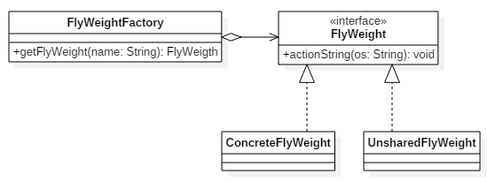

# 1、定义

它使用共享物件，用来尽可能减少内存使用量以及分享资讯给尽可能多的相似物件；它适合用于当大量物件只是重复因而导致无法令人接受的使用大量内存。通常物件中的部分状态是可以分享。常见做法是把它们放在外部数据结构，当需要使用时再将它们传递给享元；

又称轻量级模式，其实结构型模式

# 2、适用场景

当对象数量太多时，将导致对象创建及垃圾回收的代价过高，造成性能下降等问题。享元模式通过共享相同或者相似的细粒度对象解决了这一类问题；

# 3、状态

- 内部状态：是存储在享元对象内部，一般在构造时确定或通过setter设置，并且不会随环境改变而改变的状态，因此内部状态可以共享；
- 外部状态：是随环境改变而改变、不可以共享的状态。外部状态在需要使用时通过客户端传入享元对象。外部状态必须由客户端保存

# 4、UML类图

- FlyWeight：享元接口或者（抽象享元类），定义共享接口
- ConcreteFlyWeight：具体享元类，该类实例将实现共享
- UnSharedConcreteFlyWeight：非共享享元实现类
- FlyWeightFactory：享元工厂类，控制实例的创建和共享

# 5、优缺点

- 优点：
    - 享元模式的外部状态相对独立，使得对象可以在不同的环境中被复用（共享对象可以适应不同的外部环境）
    - 享元模式可共享相同或相似的细粒度对象，从而减少了内存消耗，同时降低了对象创建与垃圾回收的开销

- 缺点：
    - 外部状态由客户端保存，共享对象读取外部状态的开销可能比较大
    - 享元模式要求将内部状态与外部状态分离，这使得程序的逻辑复杂化，同时也增加了状态维护成本

# 6、JDK使用场景

- Integer中的IntegerCache
