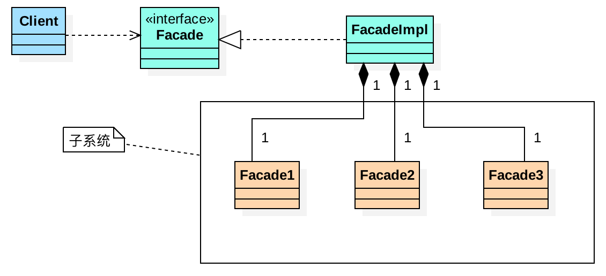

# 1、定义

又叫门面模式，提供了一个统一的接口，用来访问子系统中的一群接口；

外观模式定义了一个高层接口，让子系统更容易使用；其属于结构型设计模式

其实是优点类似我们的web架构：action -> service -> dao

# 2、适用场景

子系统越来越复杂，增加外观模式提供简单调用接口；

构建多层系统结构，利用外观对象作为每层的入口，简化层间调用；

# 3、优缺点

- 优点：
    - 简化了调用过程，无需廖俊杰深入子系统，防止带来风险；
    - 减少系统依赖，松散耦合
    - 符合迪米特法则；
- 缺点：
    - 不符合开闭原则

# 4、UML类图

# 5、使用场景

- Tomcat中有大量的Facade类：RequestFacade、ResponseFacade等