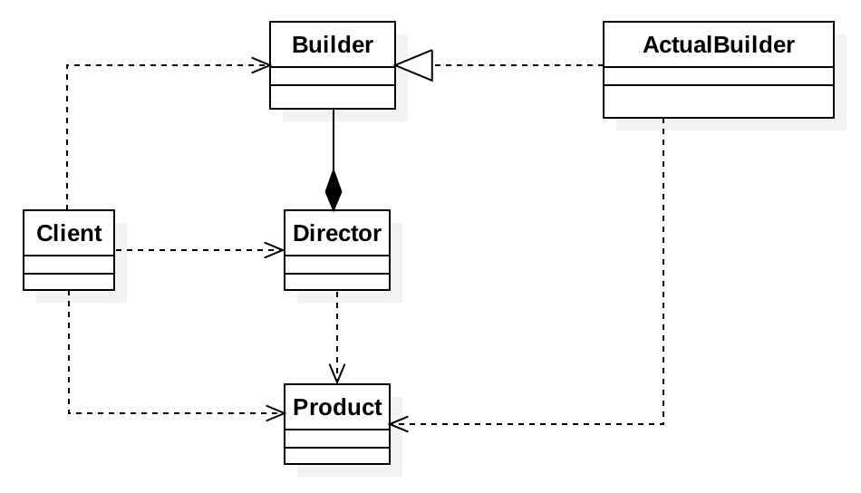

# 1、定义

将一个复杂的对象构建与它的表示分离，使得同样的构建过程可以创建不同的表示；

用户只需要指定需要见着的类型就可以得到他们，建造过程及细节不需要知道

# 2、适用场景

如果一个对象有非常复杂的内部结构，或者想把复杂的对象的创建和适用分离

# 3、优点


# 4、使用场景

- JDK：StringBuilder(StringBuffer)
- Guava：CacheBuilder
- Spring：BeanDefinitionBuilder
- Mybatis：SqlSessionFactoryBuilder

# 5、代码

```java
@Data
public class Computer {
    private String mainBoard;
    private String memory;
    private String hardDisk;
    private String cpu;
    private String power;
    public Computer(ComputerBuilder computerBuilder) {
        this.mainBoard = computerBuilder.mainBoard;
        this.memory = computerBuilder.memory;
        this.hardDisk = computerBuilder.hardDisk;
        this.cpu = computerBuilder.cpu;
        this.power = computerBuilder.power;
    }
    public static class ComputerBuilder{
        private String mainBoard;
        private String memory;
        private String hardDisk;
        private String cpu;
        private String power;

        public ComputerBuilder buildMainBoard(String mainBoard){
            this.mainBoard = mainBoard;
            return this;
        }
        public ComputerBuilder buildMemory(String memory) {
            this.memory = memory;
            return this;
        }
        public ComputerBuilder buildHardDisk(String hardDisk) {
            this.hardDisk = hardDisk;
            return this;
        }
        public ComputerBuilder buildCpu(String cpu) {
            this.cpu = cpu;
            return this;
        }
        public ComputerBuilder buildPower(String power) {
            this.power = power;
            return this;
        }
        public Computer assembleComputer(){
            return new Computer(this);
        }
    }
}

public class TestBuilderV2 {
    public static void main(String[] args) {
        Computer computer = new Computer.ComputerBuilder()
                .buildMainBoard("七彩虹")
                .buildCpu("因特尔")
                .buildHardDisk("希捷")
                .buildMemory("金士顿")
                .buildPower("金田")
                .assembleComputer();
        System.out.println(computer);
    }
}
```

# 6、UML类图



首先建造者接口（Builder）和具体的建造者（ActualBuilder）应该是要新建的，而指挥者（Director）、产品（Product）

