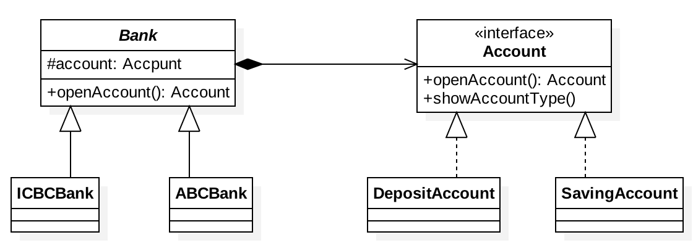

# 1、定义

将抽象部分与它的实现部分分离，使它们都可以独立地变化。是结构型

更容易理解的表述是：实现系统可从多种维度分类，桥接模式将各维度抽象出来，各维度独立变化，之后可通过聚合，将各维度组合起来，减少了各维度间的耦合；

将抽象和抽象的具体实现进行解耦，这样可以使得抽象和抽象的具体实现可以独立进行变化，通过组合的方式建立两个类之间的联系，而不是继承

# 2、适用场景

- 当一个对象有多个变化因素时，可以考虑使用桥接模式，通过抽象这些变化因素，将依赖具体实现修改为依赖抽象；
- 当我们期望一个对象的多个变化因素可以动态变化，而且不影响客户端的程序使用时；
- 如果使用继承的实现方案，会导致产生很多子类，任何一个变化因素都需要产生多个类来完成，就要考虑桥接模式

# 3、UML类图

上述类图中即不同的银行有不同账户体系

# 4、优缺点

- 优点：
    - 降低了沿着两个或多个维度扩展时的复杂度，防止类的过度膨胀；
    - 解除了两个或多个维度之间的耦合，使它们沿着各自方向变化而不互相影响；
    - 分离了抽象部分及其具体实现部分；
    - 提高了系统可用性；

# 5、JDK或者框架中使用场景

- 只要你用到面向接口编程，其实都是在用桥接模式，比如JDBC，Driver、Connection等