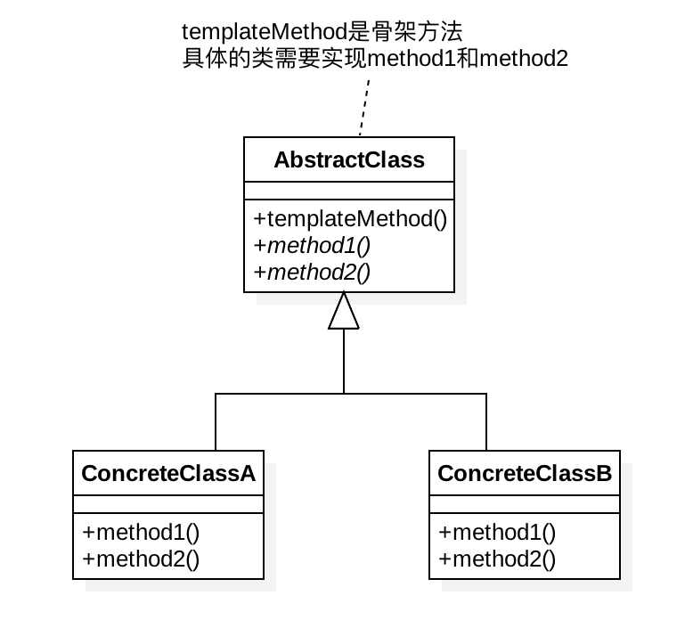

# 1、定义

定义一个操作中的算法的骨架，而将步骤延迟到子类中。模板方法使得子类可以不改变一个算法的结构即可重定义算法的某些特定步骤；
- 抽象类：实现了模板方法，定义了算法的骨架；
- 具体类：实现抽象类中的抽象方法，以完成完整的算法。

# 2、适用场景

- 在某些类的算法中，用了相同的方法，造成代码的重复；
- 控制子类扩展，子类必须遵守算法规则；

比如：员工入职到一家公司，刚入职的时候需要走入职流程，一般都有固定的流程，但是其中有些流程员工可以选择忽略，比如调档案、迁户口等员工可以选择的流程；

# 3、优缺点

- 优点：
    - 模板方法模式通过把不变的行为搬移到超类，去除了子类中的重复代码
    - 子类实现算法的某些细节，有助于算法的扩展；
    - 通过一个父类调用子类实现的操作，通过子类扩展增加新的行为，符合“开放-封闭原则”；
- 缺点：每个不同的实现都需要定义一个子类，这会导致类的个数的增加，设计更加抽象

# 4、UML类图

# 5、使用场景

- JDK中的集合，比如AbstractList、AbstractSet、AbstractMap；
- JDK中的：AbstractQueuedSynchronizer，其模板方式实现有些特殊，没有抽象类存在，取而代之的是需要子类去实现那些方法通过一个方法体;
- JDK中类加载过程，ClassLoader类就使用了模板模式，去保证类加载过程中的唯一性，类加载过程如下：
    - 首先看是否有已经加载好的类。
    - 如果父类加载器不为空，则首先从父类类加载器加载。
    - 如果父类加载器为空，则尝试从启动加载器加载。
    - 如果两者都失败，才尝试从findClass方法加载。

# 6、与其他设计模式

- 工厂方法模式是模板方法模式的一种特殊实现

