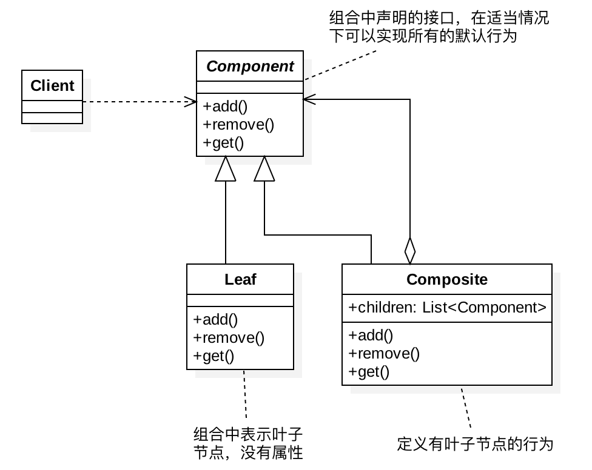

# 1、定义

将对象组合成树形结构以表示“部分整体”的层次结构。组合模式使得用户对单个对象和组合对象的使用具有一致性

组合模式用来表示部分与整体的层次结构（类似于树结构），而且也可以使用户对单个对象（叶子节点）以及组合对象（非叶子节点）的使用具有一致性，一致性的意思就是说，这些对象都拥有相同的接口

常见的场景有：公司、子公司以及部门；书的目录、文件系统、网站的菜单等，都是数结构

# 2、适用场景

- 如果你想表示“部分整体”的层次结构，可以使用组合模式；
- 如果你想让客户端可以忽略复杂的层次结构，使用统一的方式去操作层次结构中的所有对象，也可以使用组合模式

# 3、UML类图

# 4、优缺点

- 优点：
    - 使客户端调用简单，它可以一致使用组合结构或是其中单个对象，简化了客户端代码；
    - 容易在组合体内增加对象部件。客户端不必因加入了新的部件而更改代码。有利于功能的扩展；
- 缺点：
    - 需要抉择使用透明方式还是安全方式；
    - 透明方式违背了面向对象的单一职责原则；安全方式增加了客户需要端判定的负担
