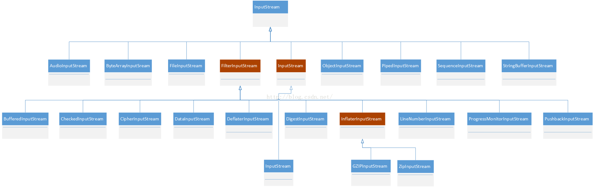

<!-- START doctoc generated TOC please keep comment here to allow auto update -->
<!-- DON'T EDIT THIS SECTION, INSTEAD RE-RUN doctoc TO UPDATE -->
*目录**

- [1、基本概念](#1%E5%9F%BA%E6%9C%AC%E6%A6%82%E5%BF%B5)
- [2、适用场景](#2%E9%80%82%E7%94%A8%E5%9C%BA%E6%99%AF)
- [3、优缺点](#3%E4%BC%98%E7%BC%BA%E7%82%B9)
- [4、装饰者模式与其他设计模式](#4%E8%A3%85%E9%A5%B0%E8%80%85%E6%A8%A1%E5%BC%8F%E4%B8%8E%E5%85%B6%E4%BB%96%E8%AE%BE%E8%AE%A1%E6%A8%A1%E5%BC%8F)
- [5、UML类图](#5uml%E7%B1%BB%E5%9B%BE)
- [6、一般实现](#6%E4%B8%80%E8%88%AC%E5%AE%9E%E7%8E%B0)
- [7、JDK中装饰器模式](#7jdk%E4%B8%AD%E8%A3%85%E9%A5%B0%E5%99%A8%E6%A8%A1%E5%BC%8F)
  - [7.1、深入剖析 InputStream 中的装饰模式](#71%E6%B7%B1%E5%85%A5%E5%89%96%E6%9E%90-inputstream-%E4%B8%AD%E7%9A%84%E8%A3%85%E9%A5%B0%E6%A8%A1%E5%BC%8F)
  - [7.2、深入剖析 OutputStream 中的装饰模式](#72%E6%B7%B1%E5%85%A5%E5%89%96%E6%9E%90-outputstream-%E4%B8%AD%E7%9A%84%E8%A3%85%E9%A5%B0%E6%A8%A1%E5%BC%8F)
  - [7.3、字符输入流](#73%E5%AD%97%E7%AC%A6%E8%BE%93%E5%85%A5%E6%B5%81)
  - [7.4、字符输出流](#74%E5%AD%97%E7%AC%A6%E8%BE%93%E5%87%BA%E6%B5%81)

<!-- END doctoc generated TOC please keep comment here to allow auto update -->

# 1、基本概念

装饰模式是在不必改变原类文件和使用继承的情况下，动态的扩展一个对象的功能。它是通过创建一个包装对象，也就是装饰来包裹真实的对象

注意几点
- 不改变原类文件
- 不使用继承
- 动态扩展

# 2、适用场景

- 扩展一个类的功能或者给一个类添加职责；
- 动态的给一个对象添加功能，这些功能是可以动态的撤销；

# 3、优缺点

- 继承的有力补充，比继承灵活，不改变原有对象的情况下给一个对象扩展功能；
- 符合开闭原则；

# 4、装饰者模式与其他设计模式

- 装饰者与代理模式

- 装饰者与适配器模式

# 5、UML类图

# 6、一般实现

# 7、JDK中装饰器模式

## 7.1、深入剖析 InputStream 中的装饰模式

从上图可以看出

- 抽象组件：InputStream，这是一个抽象类，为各种子类型提供统一的接口；
- 具体组件：ByteArrayInputStream、FileInputStream、PipedInputStream、StringBufferInputStream(JDK8 以后过期)等，它们实现了抽象组件所规定的接口；
- 抽象装饰者：FilterInputStream，它实现了 InputStream 所规定的接口；
- 具体装饰者：BufferedInputStream、DataInputStream 以及两个不常用到的类LineNumberInputStream（JDK8 以后过期）、PushbackInputStream 等；

**注意：**

- ①、InputStream 类型中的装饰模式是半透明的；
- ②、PushbackInputStream 是一个半透明的装饰类，这个装饰类提供了额外的方法unread()，换言之，它破坏了理想的装饰模式的要求如果客户端持有一个类型为InputStream对象的引用in的话，那么如果in的真实类型是 PushbackInputStream的话，只要客户端不需要使用unread()方法，那么客户端一般没有问题.但是如果客户端必须使用这个方法，就必须进行向下类型转换.将in的类型转换成为PushbackInputStream之后才可能调用这个方法.但是，这个类型转换意味着客户端必须知道它拿到的引用是指向一个类型为 PushbackInputStream 的对象。这就破坏了使用装饰模式的原始用意；

## 7.2、深入剖析 OutputStream 中的装饰模式

从图可以看出:
- 抽象组件：OutputStream，这是一个抽象类，为各种子类型提供统一的接口；
- 具体组件：ByteArrayOutputStream、FileOutputStream、ObjectOutputStream、PipedOutputStream等，它们实现了抽象组件所规定的接口；
- 抽象装饰者：FilterOutputStream，它实现了 OutputStream 所规定的接口；
- 具体装饰者：BufferedOutputStream、CheckedOutputStream、CipheOutputSteam、DataOutputStream 等，

## 7.3、字符输入流

- 抽象组件：Reader，这是一个抽象类，为各种子类型提供统一的接口；
- 具体组件：CharArayReader、FilterReader、InputStreamReader、PipedReader、StringReader 等，它们实现了抽象组件所规定的接口；
- 抽象装饰者：BufferedReader 、FilterReader、InputStreamReader，它实现了Reader所规定的接口；
- 具体装饰者：LineNumberReader、PushbackReader、FileReader 等；

## 7.4、字符输出流

- 抽象组件：Writer，这是一个抽象类，为各种子类型提供统一的接口；
- 具体组件：BufferedWriter、CharArrayWriter、FilterWriter、OutputStreamWriter、PipedWriter、PrintWriter、StringWriter等，它们实现了抽象组件所规定的接口；
- 抽象装饰者：OutputStreamWriter，它实现了 Writer 所规定的接口；
- 具体装饰者：FileWriter；

