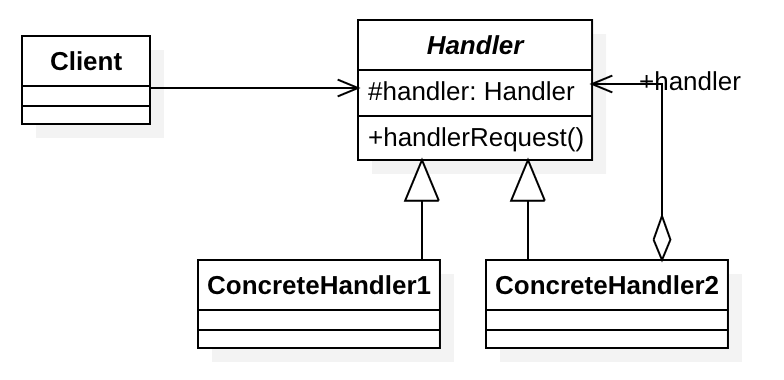

# 1、定义

通过把请求从一个对象传递到链条中下一个对象的方式来解除对象之间的耦合，直到请求被处理完毕。链中的对象是同一接口或抽象类的不同实现。

# 2、适用场景

# 3、实际应用

- Servlet中的Filter，FilterChain，我们实现的Filter就是责任，FilterChain是一个链条
- JS中事件的冒泡机制

# 4、UML类图

[代码参考](https://github.com/chenlanqing/java-code/tree/master/java-design/java-design-pattern/src/main/java/com/blue/fish/design/pattern/behavioral/chainofresponsibility)

# 5、注意事项