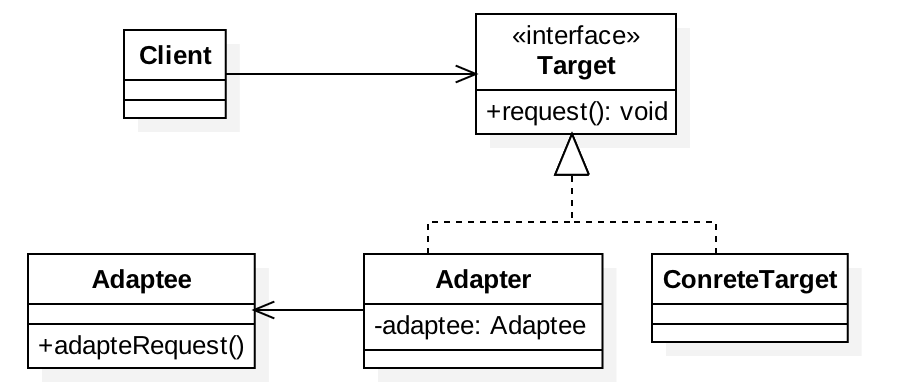

# 1、适配器模式

适配器模式将一个类的接口，转化成客户期望的另一个接口，适配器让原本接口不兼容的类可以并存合作。

从实现上可以分为类适配器和对象适配器，这两种的区别在于实现方式的不同：一种是采用继承，一种是采用组合的方式；

另外从使用目的上来说，也可以分为两种：特殊适配器和缺省适配器，这两种的区别在于使用目的上的不同，一种为了复用原有的代码并适配当前的接口，一种为了提供缺省的实现，避免子类需要实现不该实现的方法；

需要注意的是：适配器模式是补救措施，所以在系统设计过程中请忘掉这个设计模式，这个模式只是在你无可奈何时的补救方式

# 2、适用场景

场景通常情况下是，系统中有一套完整的类结构，而我们需要利用其中某一个类的功能（通俗点说可以说是方法），但是我们的客户端只认识另外一个和这个类结构不相关的接口，此时适配器就可以上场了，我们可以将这个现有的类与我们的目标接口进行适配，最终获得一个符合需要的接口并且包含待复用的类的功能的类

- 类适配器：一般是针对适配目标是接口的情况下使用；
- 对象适配器：一般是针对适配目标是类或者是需要复用的对象多于一个的时候使用；
- 缺省适配器：一般是为了弥补接口过大所犯下的过错；但由于JAVA语言规则的原因，实现一个接口必须实现它的全部方法，所以我们的子类不得不被迫写一堆空方法在那；这时候缺省适配器用上了；使用的时候只需要继承缺省的接口就可以

# 3、JDK与框架中使用适配器

- XmlAdapter
- AdvisorAdapter
- JpaVendorAdapter
- HandlerAdapter

# 4、UML类图



# 5、应用场景

- JDK中早期集合的都实现了一个elements()方法，其会返回一个Enumeration；JDK新的集合中开始使用Iterator（迭代器），和Enumeration接口很像，但是其支持删除元素能力，为了将枚举适配到迭代器，对应的集合中有个Enumerator，其实现了两个接口，比如HashTable中`private class Enumerator<T> implements Enumeration<T>, Iterator<T>`，因为枚举是个只读接口，适配器无法实现一个有实际功能的remove方法，只能抛出异常；
    - 将一个枚举适配为迭代器
        ```java
        /**
        * 将一个枚举适配成迭代器
        */
        public class EnumerationIteratorAdapter<T> implements Iterator<T> {
            private Enumeration<T> enumeration;
            @Override
            public boolean hasNext() {
                return enumeration.hasMoreElements();
            }
            @Override
            public T next() {
                return enumeration.nextElement();
            }
            // 这个remove方法可以不实现，因为该方法在Iterator接口中已经是默认方法了
            @Override
            public void remove() {
                throw new UnsupportedOperationException("remove");
            }
        }
        ```
    - 将一个迭代器适配为枚举
        ```java
        /**
        * 将一个迭代器适配为枚举
        */
        public class IteratorEnumerationAdapter<T> implements Enumeration<T> {
            private Iterator<T> iterator;
            @Override
            public boolean hasMoreElements() {
                return iterator.hasNext();
            }
            @Override
            public T nextElement() {
                return iterator.next();
            }
        }
        ```

# 6、相关设计模式

## 6.1、与装饰模式、外观模式比较

- 装饰模式：不改变接口，加入新的责任；
- 适配器模式：将一个接口转成另一个接口；
- 外观模式：提供给子系统的一个简化接口。


