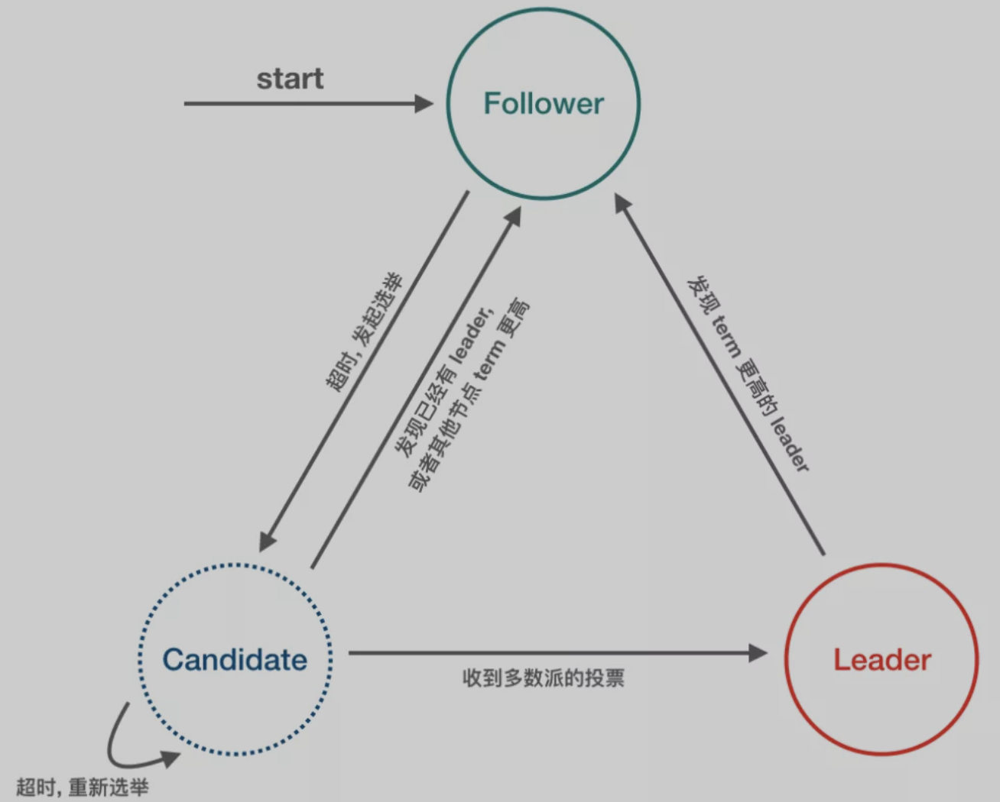
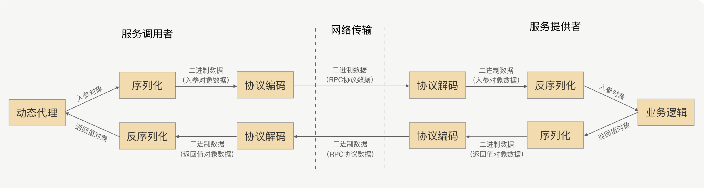
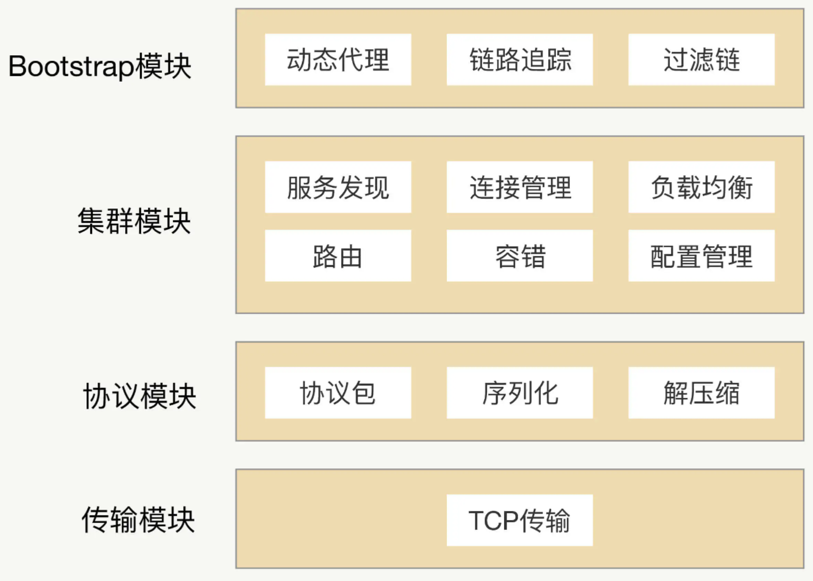
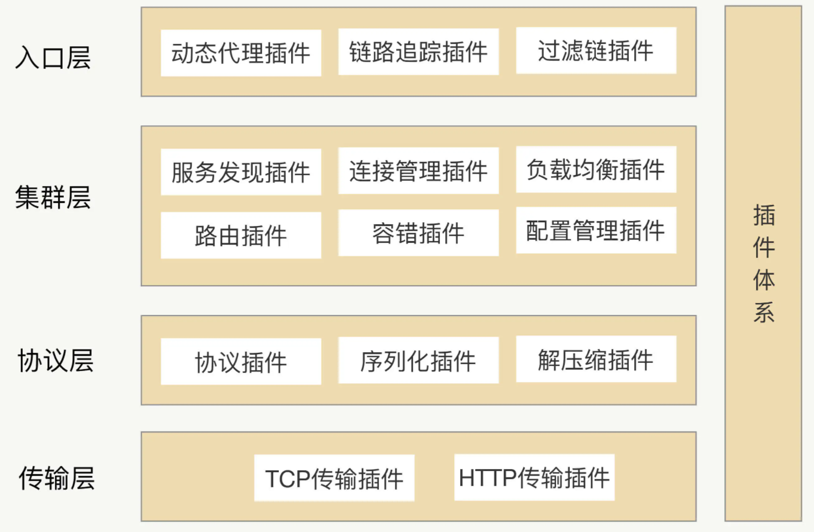
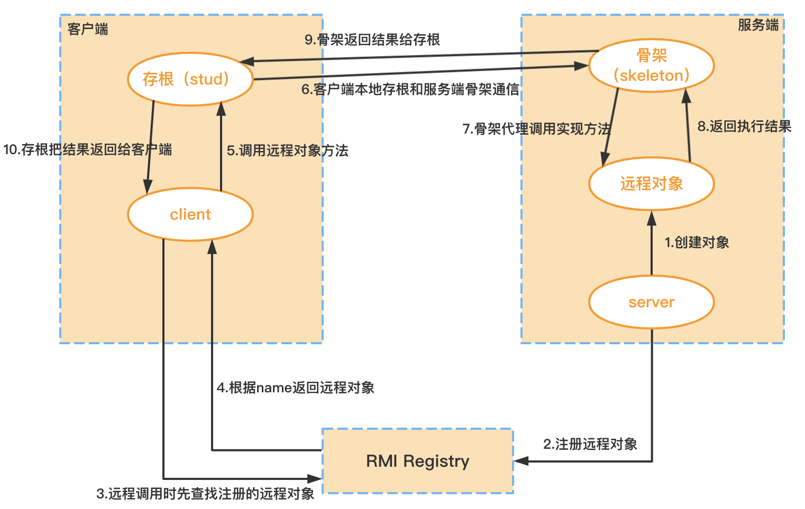

# 一、分布式系统

* [分布式知识体系结构](https://mp.weixin.qq.com/s/Di0wshxPpug13YvCcxEr5w)

## 1、集中式系统

- 一个主机带多个终端：终端没有数据处理能力；仅负责数据的录入和输出.而运算、存储等全部在主机上进行;
- 最大特点：部署简单，由于采用的是单机部署；很可能带来系统大而复杂；难于维护；发生单点故障灯；

## 2、分布式系统

由多个节点组成的系统；节点之前相互连通；把一个计算任务分解成若干个计算单元；并且分派到若干不同的计算机中去执行；然后汇总计算结果的过程

主要特点：

- 分布式：系统中的多台计算机之间没有主、从之分
- 透明性：系统资源被所有计算机共享
- 同一性：系统中的若干台计算机可以互相协作来完成一个共同的任务
- 通信：系统中任意两台计算机都可以通过通信来交换信息

## 3、为什么要用分布式系统

- 升级单机处理能力的性价比越来越低
- 单机处理能力存在瓶颈
- 出于稳定性和可用性考虑

## 4、常见的分布式方案

- 分布式应用和服务
- 分布式静态资源
- 分布式数据和存储
- 分布式计算

## 5、集群和分布式

- 集群是每台服务器都具有相同的功能；处理请求时调用哪台服务器都可以；主要是分流作用分布式是将不同的业务放到不同的服务器中；处理一个请求可能需要用到多台服务器.
- 集群主要有：静态资源集群和应用程序集群。<br>
	session同步是集群和分布式一个核心问题；<br>
	session同步有两种处理方式：一种是在 session 发生变化后自动同步到其他服务器；另一种就是用一个程序统一管理session。<br>
	tomcat 默认使用的是第一种.第二种需要安装高效的缓存程序来统一管理session.

## 6、分布式优缺点

### 6.1、优点

- 系统可用性提升：一个系统全年可用时间在 99.999%，5 个 9 的服务可用率在设计合理的分布式系统中并不是一个触不可及的数字
- 系统并发能力提升：水平扩展能力
- 系统容错能力提升：
- 低延迟：

### 6.2、缺点

- 通信异常
- 网络分区
- 三态：成功、失败、超时
- 节点故障
- 时钟不一致问题
- 拜占庭将军问题

## 7、设计原则

- 异步解耦；
- 幂等一致性：主要针对添加和修改
- 拆分原则；
- 融合分布式中间件；
- 容错高可用；

## 8、分布式时钟

NTP、逻辑时钟、向量时钟

http://yang.observer/2020/07/11/time-ntp/

## 9、分布式计算谬论

- [分布式计算下的 8 个谬论](https://en.wikipedia.org/wiki/Fallacies_of_distributed_computing)

分布式环境下存在的网络问题:
- The network is reliable;	网络是可靠的
- Latency is zero;	延迟为零。
- Bandwidth is infinite;	带宽是无限的。
- The network is secure;	网络是安全的。
- Topology doesn't change;	拓扑结构不会改变
- There is one administrator;	有一个管理员
- Transport cost is zero;	运输成本为零
- The network is homogeneous.	网络是同质的

# 二、分布式理论基础

- [The Log: What every software engineer should know about real-time data's unifying abstraction - Jay Kreps](https://www.kancloud.cn/kancloud/log-real-time-datas-unifying/58708)

## 1、CAP

### 1.1、什么是CAP

CAP理论：一个分布式系统不可能同时满足数据一致性（C：Consistency）、系统可用性（A：Availability）和网络分区容错性（P：Partition tolerance）这三个基本要求；最多只能满足其中两项

- 一致性（C）：在分布式环境中；是指数据在多个副本之间是否能够保持一致的特性。
	* 如果能做到针对一个数据项的更新操作执行成功后；所有的用户都可以读到其最新的值；具有强一致性；
	* 如果能容忍后续的部分或者全部访问不到，则是弱一致性；
	* 如果经过一段时间后要求能访问到更新后的数据；则是最终一致性；
- 可用性（A）：是指在系统提供的服务必须一直处于可用状态；且是在正常响应时间范围内；对于一个可用性的分布式系统；每一个非故障的节点必须对每一个请求作出响应
- 分区容错性（P）：即分布式系统在遇到某节点或网络分区故障的时候；仍然能够对外提供满足一致性和可用性的服务。

与MySQL的ACID的区别：事务前的状态 vs 分布式节点读取到的状态
- MySQL默认情况下是CA，如果P发生了（需要看具体需求）
	- CP：牺牲可用性（Partition后剩余部分数据完整），作为一个完整集群；
	- AP：牺牲一致性（Partition后两部分同时工作，允许数据冗余）
- Elasticsearch：
	- 一致性、可用性较高；
	- 低分区容错性的系统；
	- 至于需要CP还是AP，需要看具体需求；
- Redis：
	- 最终一致性，基于AP

### 1.2、CAP应用

三者之间的关系如图：


|选择|说明|
|------|--------|
|CA|放弃分区容错性，加强一致性和可用性，其实就是传统的单机数据库的选择；放弃P意味着放弃了系统的可扩展性，即单机应用；或者说只允许读写其中一部分|
|CP|放弃可用性；追求一致性和分区容错性；基本不会选择；网络问题会直接让整个系统不可用，适用于要求ACID的场景，或者保存少量数据的基础服务|
|AP|放弃一致性(这里说的一致性是强一致性；保留数据的最终一致性)；追求分区容错性和可用性；这是很多分布式系统设计时的选择，适合查询量大的场景|

* 需要注意的是对一个分布式系统而言；分区容错性是一个最基本的要求。因为既然是一个分布式系统，那么分布式系统中的组件必然需要被部署到不同的节点，否则也就无所谓分布式系统了。而对于分布式系统而言，网络问题又是一个必定会出现的异常情况；因此分区容错性也就成为了一个分布式系统必然需要面对和解决的问题；

* 一般分布式系统都是在一致性和可用性之间寻求平衡；

### 1.3、如何选择CAP

在分布式系统中，由于网络问题导致的网络分区是常态。也就是说出现网络分区时，根据 CAP 理论，需要在 A 和 C 中进行取舍，即要么保证系统的可用性，要么保证数据一致性；

这里需要要注意的一点是：上面说法的大前提，就是系统出现了网络分区，但实际情况是，在绝大多数时间里并不存在网络分区（网络不会经常出现问题）。那么还要进行三选二吗（CP 或者 AP）？

其实，不同的分布式系统要根据业务场景和业务需求在 CAP 三者中进行权衡。CAP 理论用于指导在系统设计时需要衡量的因素，而非进行绝对地选择

当网络没有出现分区时，CAP 理论并没有给出衡量 A 和 C 的因素，但如果你做过实际的分布式系统设计，一定会发现系统数据同步的时延（Latency），数据节点之间同步时间才是衡量 A 和 C 最重要的因素，此时就不会有绝对的 AP 模型还是 CP 模型了，而是源于对实际业务场景的综合考量；

### 1.4、PACELC

http://www.cs.umd.edu/~abadi/papers/abadi-pacelc.pdf

根据 PACELC 模型的定义，如果有网络分区产生，系统就必须在 A 和 C 之间取得平衡，否则（Else，即 PACELC 中的 E）当系统运行在无网络分区情况下，系统需要在 L（延迟）和 C 之间取得平衡

## 2、BASE理论

### 2.1、基本概念

- BASE是 Basically Available（基本可用）、Soft state（软状态）和 Eventually Consistent（最终一致性）三个短语的缩写；
- BASE理论是对CAP中一致性和可用性权衡的结果；BASE 理论是对 CAP 中一致性和可用性权衡的结果，它来源于对大规模互联网分布式系统实践的总结，是基于 CAP 定理逐步演化而来的。
- 核心思想是，如果不是必须的话，不推荐实现事务或强一致性，鼓励可用性和性能优先，根据业务的场景特点，来实现非常弹性的基本可用，以及实现数据的最终一致性

BASE 中的基本可用指的是保障核心功能的基本可用，其实是做了`可用性`方面的妥协，比如：
- 电商网站在双十一大促等访问压力较大的时候，关闭商品排行榜等次要功能的展示，从而保证商品交易主流程的可用性，这也是我们常说的服务降级；
- 为了错开双十一高峰期，电商网站会将预售商品的支付时间延后十到二十分钟，这就是流量削峰；
- 在你抢购商品的时候，往往会在队列中等待处理，这也是常用的延迟队列。

### 2.2、BASE理论三要素

#### 2.2.1、基本可用

指分布式系统在出现不可预知故障的时候；允许损失部分可用性；但绝不等价于系统不可用.
- 响应时间上的损失：正常情况下，一个在线搜索引擎需要在0.5秒之内返回给用户相应的查询结果，但由于出现故障，查询结果的响应时间增加了1~2秒
- 功能上的损失：正常情况下，消费者在电商网站购物时都能顺利完成订单，但是大促购物高峰情况下，为了保护购物系统的稳定性，可能部分消费者会被引导到降级页面

就拿 12306 订票系统基本可用的设计为例，这个订票系统在春运期间，因为开始售票后先到先得的缘故，会出现极其海量的请求峰值，如何处理这个问题呢？
可以在不同的时间，出售不同区域的票，将访问请求错开，削弱请求峰值。比如，在春运期间，深圳出发的火车票在 8 点开售，北京出发的火车票在 9 点开售。这就是我们常说的流量削峰。
另外，你可能已经发现了，在春运期间，自己提交的购票请求，往往会在队列中排队等待处理，可能几分钟或十几分钟后，系统才开始处理，然后响应处理结果，这就是你熟悉的延迟响应。 你看，12306 订票系统在出现超出系统处理能力的突发流量的情况下，会通过牺牲响应时间的可用性，保障核心功能的运行。而 12306 通过流量削峰和延迟响应，是不是就实现了基本的可用呢？现在它不会再像最初的时候那样，常常 404 了吧？

#### 2.2.2、弱状态（软状态）

允许系统中的数据存在中间状态；并认为该中间状态的存在不会影响系统的整体可用性。即允许系统在不同节点的数据副本之间进行数据同步的过程存在延时；

#### 2.2.3、最终一致性

最终一致性强调的是所有的数据副本，在经过一段时间的同步之后，最终都能够达到一个一致的状态。最终一致性的本质是需要系统保证最终数据能够达到一致，而不需要实时保证系统数据的强一致性。

***最终一致性有如下五种类型变种：***
- 因果一致性：如果A进程在更新之后向B进程通知更新的完成，那么B的访问操作将会返回更新的值。如果没有因果关系的C进程将会遵循最终一致性的规则；
- 读己所写一致性：因果一致性的特定形式.一个进程总可以读到自己更新的数据；
- 会话一致性：读己所写一致性的特定形式.进程在访问存储系统同一个会话内，系统保证该进程读己之所写；
- 单调读一致性：如果一个进程已经读取到一个特定值，那么该进程不会读取到该值以前的任何值；
- 单调写一致性：系统保证对同一个进程的写操作串行化；

如何实现最终一致性：
- 读时修复：在读取数据时，检测数据的不一致，进行修复；
- 写时修复：在写入数据，检测数据的不一致时，进行修复；
- 异步修复：这个是最常用的方式，通过定时对账检测副本数据的一致性，并修复；

### 2.3、BASE与ACID

BASE理论面向的是大型高可用可扩展的分布式系统；和传统的事物ACID特性是相反的；它完全不同于ACID的强一致性模型；而是通过牺牲强一致性来获得可用性；并允许数据在一段时间内是不一致的；但最终达到一致状态。但同时，在实际的分布式场景中，不同业务单元和组件对数据一致性的要求是不同的；因此在具体的分布式系统架构设计过程中；ACID特性和BASE理论往往又会结合在一起

## 3、一致性协议

数据一致性问题：分布式系统为了提升可用性和性能，会通过复制技术来进行数据同步。复制机制的目的是为了保证数据的一致性。但是数据复制面临的主要难题也是如何保证多个副本之间的数据一致性。在分布式系统引入复制机制后，不同的数据节点之间由于网络延时等原因很容易产生数据不一致的情况

### 3.1、二阶段提交-2PC：Two-Phase Commit

为了使基于分布式系统架构下的所有节点在进行事务提交时保持一致性而设计的一种算法（Algorithm）目前绝大部分关系型数据库都是采用二阶段提交协议来完成分布式事务处理的。

#### 3.1.1、算法思路

在此协议中，一个事务管理器（Transaction Manager，简称 TM，也被称之为“协调者”）协调 1 个或多个资源管理器（Resource Manager，简称 RM，也被称之为“参与者”）的活动，所有资源管理器（参与者）向事务管理器（协调者）汇报自身活动状态，由事务管理器（协调者）根据各资源管理器（协调者）汇报的状态（完成准备或准备失败）来决定各资源管理器（协调者）是“提交”事务还是进行“回滚”操作；

二阶段提交的算法思路可以概括为：参与者将操作成败通知协调者，再由协调者根据所有参与者的反馈情报决定各参与者是否要提交操作还是中止操作

#### 3.1.2、二阶段提交协议过程

二阶段提交协议是将事务的提交过程分为了两个阶段来处理，第一阶段：准备阶段（投票阶段）和 第二阶段：提交阶段（执行阶段）

##### 3.1.2.1、阶段一：提交事务请求

事务协调者(事务管理器)给每个参与者(资源管理器)发送Prepare消息；每个参与者要么直接返回失败（如权限验证失败）；要么在本地执行事务；写本地的redo和undo日志；但不提交
- 事务询问：协调者向所有参与者发送事务内容；询问是否可以执行事务提交操作；并开始等待各参与者的响应;
- 执行事务：各参与者节点执行事务操作；并将undo和redo信息记录事务日志中；
- 各参与者向协调者反馈事务询问的响应：如果参与者执行了事务操作；那么就反馈给协调者Yes响应；表示事务可以执行；如果参与者没有成功执行事务；反馈no；表示事务不可以执行；

二阶段提交协议的阶段一被称为"投票阶段"

##### 3.1.2.2、阶段二：执行事务提交

在阶段二中，协调者会根据各参与者反馈情况来决定最终是否可以进行事务提交操作。正常情况下；包括以下两种可能：
- 执行事务提交：假如协调者从所有参与者获得的反馈都是Yes响应；那么就会执行事务提交
	* 发送提交请求：协调者向所有参与者节点发送 commit 请求;
	* 事务提交：参与者接收到commit请求后；会正式执行事务提交操作；并在完成提交之后释放整个事务执行期间占用的事务资源；
	* 反馈事务提交结果：参与者在完成事务提交之后；向协调者发送Ack消息;
	* 完成事务：协调者接收到所有参与者反馈的ack消息后；完成事务;
- 中断事务：如果有任何一个参与者反馈了no响应；或者在等待超时之后；协调者无法接收到所有参与者的反馈响应；则中断事务
	* 发送回滚请求：协调者向所有参与者节点发送rollback请求;
	* 事务回滚：参与者接收到rollback请求后；会利用其在阶段一中记录的undo信息来执行事务回滚操作；并释放资源;
	* 反馈事务回滚结果：参与者在完成事务回滚之后；向协调者发送ack消息.
	* 中断事务：协调者在接收到参与者反馈的ack消息后；完成事务中断;

#### 3.1.3、优缺点

- 优点：原理简单；实现方便
- 缺点：
	- 单点故障：由于协调者的重要性，一旦协调者发生故障，参与者会一直阻塞，尤其是在第二阶段，协调者发生故障，那么所有的参与者都处于锁定事务资源的状态中，而无法继续完成事务操作。
	- 同步阻塞：由于所有节点在执行操作时都是同步阻塞的，当参与者占有公共资源时，其他第三方节点访问公共资源不得不处于阻塞状态。
	- 数据不一致：在第二阶段中，当协调者向参与者发送提交事务请求之后，发生了局部网络异常或者在发送提交事务请求过程中协调者发生了故障，这会导致只有一部分参与者接收到了提交事务请求。而在这部分参与者接到提交事务请求之后就会执行提交事务操作。但是其他部分未接收到提交事务请求的参与者则无法提交事务。从而导致分布式系统中的数据不一致；
	- 因为要加锁，会导致两阶段提交存在一系列问题，最严重的就是死锁问题，一旦发生故障，数据库就会阻塞，尤其在提交阶段，如果发生故障，数据都还处于资源锁定状态，将无法完成后续的事务提交操作；
	- 其次是性能问题，数据库（如 MySQL ）在执行过程中会对操作的数据行执行数据行锁，如果此时其他的事务刚好也要操作被锁定的数据行，那它们就只能阻塞等待，使分布式事务出现高延迟和性能低下；

### 3.2、三阶段提交-3PC：Three-phase Commit

是2PC的改进版；其将二阶段提交协议中的"提交事务请求"过程一分为二，形成了`CanCommit、PreCommit`和`doCommit`三个阶段来完成事务处理协议。

对应于2PC，3PC有两个改动点：
- 引入超时机制：同时在协调者和参与者中都引入超时机制。
：在两阶段提交的第一阶段与第二阶段之间插入了一个准备阶段，使得原先在两阶段提交中，参与者在投票之后，由于协调者发生崩溃或错误而导致参与者处于无法知晓是否提交或者中止的“不确定状态”所产生的可能相当长的延时的问题得以解决

#### 3.2.1、阶段一：CanCommit

- 事务询问：协调者向所有的参与者发送一个包含事务内容的canCommit请求，询问是否可以执行事务提交操作，并开始等待各参与者的响应;
- 各参与者向协调者反馈事务询问的响应：参与者在接收到来自协调者的canCommit请求后；正常情况下，如果其认为自身可以顺序执行事务，会反馈Yes响应，并进入预备状态；否则反馈no响应

#### 3.2.2、阶段二：PreCommit

在阶段二中；协调者会根据各参与者的反馈情况来决定时代可以进行事务的PreCommit操作。正常情况下；有两种可能：
- 执行事务预提交：假如协调者从参与者中获得的反馈都是Yes响应，那么执行事务预提交
	* 发送预提交请求：协调者向所有参与者节点发出PreCommit请求，并进入Prepared阶段;
	* 事务预提交：参与者收到PreCommit请求后，会执行事务操作，并将undo和redo信息记录到事务日志中;
	* 各参与者向协调者反馈事务执行的响应：如果参与者成功执行了事务操作，那么就会反馈给协调者ack响应，同时等到最终指令：提交或中止;

- 中断事务：假如任何一个参与者向协调者反馈了no响应，或者等待超时之后，协调者尚无法接收到所有参与者的反馈响应；那么就会中断事务
	* 发送中断请求：协调者向所有参与者节点发送abort请求;
	* 中断事务：无论是收到来自协调者的abort请求，或者是在等待协调者请求过程中出现超时，参与者都会中断事务;

#### 3.2.3、阶段三：doCommit

该阶段将进行真正的事务提交
- 执行提交
	* 发送提交请求：进入这一阶段；假设协调者处于正常工作状态，并且它收到了来自所有参与者的ack响应，那么它将从“预提交”状态转为“提交”状态；并向所有参与者发送doCommit请求;
	* 事务提交：参与者接收到doCommit请求后，会正式执行事务提交操作，并在完成提交之后释放占用的事务资源；
	* 反馈提交结果：参与者在完成事务提交后，向协调者发送ack消息；
	* 完成事务：协调者接收到所有参与者的ack消息后，完成事务；

- 中断事务：进入这一阶段，假设协调者处于正常工作状态，并且任意一个参与者向协调者反馈了no相应，或者在等待超时之后，那么就会中断事务
	* 发送中断请求
	* 事务回滚
	* 反馈事务回滚结果
	* 中断事务

*注意：一旦进入阶段三；可能出现如下故障：*
- 协调者出现问题
- 协调者与参与者之间的网络出现故障

#### 3.2.4、优缺点

- 优点：想较于二阶段提交协议，3PC主要解决的单点故障问题，并减少阻塞，因为一旦参与者无法及时收到来自协调者的消息之后，它会默认commit。
- 缺点：在去除阻塞的同时引入了新的问题：数据一致性问题，由于网络原因，协调者发送的abort响应没有被参与者及时收到，那么参与者在等待超时之后执行了commit操作，但其他参与者执行了事务回滚操作，这样导致了参与者之间数据不一致问题

### 3.3、总结

通过上述2PC和3PC，可以知道无论是二阶段还是三阶段提交协议，都无法彻底解决分布式的一致性问题。只有一种一致性算法，那就是Paxos。

## 4、Paxos算法

Paxos算法是基于消息传递且具有高度容错特性的一致性算法，是目前公认的解决分布式一致性问题最有效的算法之一

- [Paxos算法原理与推导](https://www.cnblogs.com/linbingdong/p/6253479.html)
- [带你一步步走入Paxos的世界](https://mp.weixin.qq.com/s/cQJjAOuDKYFnujNE_6OD0Q)

## 5、zab协议

被应用在 zookeeper 中，业界使用广泛，但没用抽象成通用 library

## 6、Raft协议

- [Raft协议](https://raft.github.io/)
- [Raft协议文档](一致性协议/Raft/raft.pdf)
- [阿里基于Raft的实现](https://github.com/sofastack/sofa-jraft)
- [Raft协议文档中文版](https://github.com/maemual/raft-zh_cn)
- [一文理解Raft](https://mp.weixin.qq.com/s/PxS0MLmwZZS5nMp3rBnZVQ)
- [Raft算法原理](https://www.tpvlog.com/article/66)

Raft协议是一种共识算法

### 6.1、特点

Strong Leader
- 系统中必须存在且同一时刻只能有一个 leader，只有 leader 可以接受 clients 发过来的请求；
- Leader 负责主动与所有 followers 通信，负责将“提案”发送给所有followers，同时收集多数派的 followers 应答；
- Leader 还需向所有 followers 主动发送心跳维持领导地位（保持存在感）；

> 另外，身为 leader 必须保持一直 heartbeat 的状态；

Raft 是 Multi Paxos 的一种实现，是通过一切以领导者为准的方式，实现一系列值的共识，然而不是所有节点都能当选 Leader 领导者，Raft 算法对于 Leader 领导者的选举是有限制的，只有最全的日志节点才可以当选

### 6.2、复制状态机

### 6.3、基本概念

Raft-node 的 3 种角色/状态



- Follower：完全被动，不能发送任何请求, 只接受并响应来自 leader 和 candidate 的 message, node启动后的初始状态必须是 follower；当等待Leader心跳信息超时的时候，就主动站出来，推荐自己当候选人（Candidate）；
- Leader：负责处理客户端请求，进行日志复制等操作，每一轮选举的目标就是选出一个领导者；领导者会不断地发送心跳信息，通知其他节点“我是领导者，我还活着，你们不要发起新的选举，不用找个新领导者来替代我。”
- Candidate：用来竞选一个新 leader (candidate 由 follower 触发超时而来)。向其他节点发送投票请求，通知其他节点来投票，如果赢得了大多数（N/2+1）选票，就晋升领导（Leader）

### 6.4、leader选举过程

- （1）在初始时，集群中所有的节点都是Follower状态，都被设定一个随机选举超时时间（一般150ms-300ms）；
- （2）如果Follower在规定的超时时间，都没有收到来自Leader的心跳，它就发起选举：将自己的状态切为 Candidate，增加自己的任期编号，然后向集群中的其它Follower节点发送请求，询问其是否选举自己成为Leader；
- （3）其他节点收到某个候选人（A）的请求投票消息后，如果在编号为1的这届任期内还没有进行过投票，那么它将把选票投给该节点（A），并增加自己的任期编号；
- （4）当收到来自集群中过半节点的接受投票后，该节点（A）即成为本届任期内 Leader，他将周期性地发送心跳消息，通知其他节点我是Leader，阻止Follower发起新的选举

## 7、拜占庭将军问题


## 8、脑裂问题

### 8.1、概述

在Elasticsearch、ZooKeeper这些集群环境中，有一个共同的特点，就是它们有一个“大脑”。比如，Elasticsearch集群中有Master节点，ZooKeeper集群中有Leader节点。

集群中的Master或Leader节点往往是通过选举产生的。在网络正常的情况下，可以顺利的选举出Leader（后续以Zookeeper命名为例）。但当两个机房之间的网络通信出现故障时，选举机制就有可能在不同的网络分区中选出两个Leader。当网络恢复时，这两个Leader该如何处理数据同步？又该听谁的？这也就出现了“脑裂”现象；

定义：在一个高可用系统中，当联系着的节点断开联系时，本来为一个整体的系统，分裂成两个独立节点，两个节点开始争抢共享资源造成系统混乱、数据损坏的现象，成为“脑裂”；

### 8.2、成因

主要原因: 心跳检测做准备切换时的“不确定性”

当网络原因，导致心跳检测超时，主备切换的情况下，此时slave已经开始提供服务。但是后续之前被判定“死”的master由于网络恢复重新“复活”，此时系统存在两个“主”，发生脑裂问题；

### 8.3、解决思路

- 设置仲裁机制；
- lease机制；
- 设置隔离机制

# 三、分布式事务

- [事务](分布式_事务.md)

# 四、分布式session

## 1、会话session

会话Session代表的是客户端与服务器的一次交互过程，这个过程可以是连续也可以是时断时续的

### 1.1、无状态会话

HTTP请求是无状态的，用户向服务端发起多个请求，服务端并不会知道这多次请求都是来自同一用户，这个就是无状态的。cookie的出现就是为了有状态的记录用户；

### 1.2、有状态会话

Tomcat中的会话，就是有状态的，一旦用户和服务端交互，就有会话，会话保存了用户的信息，这样用户就“有状态”了，服务端会和每个客户端都保持着这样的一层关系，这个由容器来管理（也就是tomcat），这个session会话是保存到内存空间里的，如此一来，当不同的用户访问服务端，那么就能通过会话知道谁是谁了。tomcat会话的出现也是为了让http请求变的有状态。如果用户不再和服务端交互，那么会话超时则消失，结束了他的生命周期。如此一来，每个用户其实都会有一个会话被维护，这就是有状态会话；

### 1.3、分布式session

## 2、实现方案

- 基于数据库的Session共享；
- 基于NFS共享文件系统；
- 基于memcached 的session，如何保证 memcached 本身的高可用性？
- 基于resin/tomcat web容器本身的session复制机制
- 基于TT/Redis 或 jbosscache 进行 session 共享。
- 基于cookie 进行session共享

## 3、Spring-Session

整合Spring-Session
```xml
<dependency>
	<groupId>org.springframework.session</groupId>
	<artifactId>spring-session-data-redis</artifactId>
</dependency>

<dependency>
	<groupId>org.springframework.boot</groupId>
	<artifactId>spring-boot-starter-security</artifactId>
</dependency>
```
配置存储类型
```
spring:
  session:
    store-type: redis
```
开启redis作为spring session
```
@EnableRedisHttpSession  // 开启使用redis作为spring session
```
去除安全自动装配
```
@SpringBootApplication(exclude = {SecurityAutoConfiguration.class})
```

# 五、分布式锁

[分布式锁](分布式_锁.md)

# 六、分布式缓存

[缓存](分布式_缓存.md)

# 七、分布式ID

[全局ID](分布式_ID.md)

# 八、熔断、降级、限流

[服务治理](./分布式_服务治理.md)

# 九、负载均衡

[分布式负载均衡](./分布式_负载均衡.md)

# 十、分布式链路追踪

参考：[ APM - Application Performance Management](../../运维/监控.md#二APM系统)

# 十一、RPC

- [RSocket](https://rsocket.io/)
- [RSocket-Broker](https://github.com/rsocket-broker)
- [轻量级RPC框架：XXL-RPC](https://github.com/xuxueli/XXL-RPC)

## 1、RPC-Remote Procedure Call

远程过程调用
- 一种通过网络从远程计算机程序上请求服务，不需要了解底层网络技术的协议；
- 在OSI网络通信模型中，RPC跨越了传输层和应用层；
- RPC 是一种技术思想而非一种规范或协议；
- 隐藏底层网络通信的复杂性，让我们更专注于业务逻辑；
- RPC 是解决应用间通信的一种方式

一个典型的RPC使用场景中，包含了服务发现、负载、容错、网络传输、序列化等组件

RPC 是一个远程调用，就需要通过网络来传输数据，并且 RPC 常用于业务系统之间的数据交互，需要保证其可靠性，所以 RPC 一般默认采用 TCP 来传输。我们常用的 HTTP 协议也是建立在 TCP 之上的



整体过程：
- 客户端 invoke 方法编写，使用 JDK 的动态代理技术，客户端调用远程服务方法时调用的是 InvocationHandler 的 invoke 方法。
- 客户端 Filter 方法编写，完善的 RPC 框架少不了监控、路由、降级、鉴权等功能。
- 创建 Socket，在 Filter 方法中实现 Client.write 方法，其逻辑为从连接池（ChannelPool）中获取连接，然后将数据写进 Channel。
- 实现数据序列化、压缩，目的减少网络传输的数据量，向服务端发送 request 数据，这里可以使用 Netty 异步通讯框架。
- 服务端收到客户端发过的消息后，从 Channel 中将消息读出来之前，也会先经反序列化解压。
- 请求就到了服务端 Filter 中。请求依次经过监控、鉴权方法。
- 根据客户端传递来的服务信息和参数，通过反射调用相应的业务服务并拿到业务处理结果。然后在 ResponseFilter 中将返回结果写入 Channel。
- 服务端序列化、压缩等，发送给客户端。
- 客户端收到消息后，经过客户端反序列化、解压缩，后交给 ResponseThreadPoolProcessor 线程池处理。
- ResponseThreadPoolProcessor 收到消息后，就将结果返回给之前的方法调用，整个调用请求就结束了

> 由服务提供者给出业务接口声明，在调用方的程序里面，RPC 框架根据调用的服务接口提前生成动态代理实现类，并通过依赖注入等技术注入到声明了该接口的相关业务逻辑里面。该代理实现类会拦截所有的方法调用，在提供的方法处理逻辑里面完成一整套的远程调用，并把远程调用结果返回给调用方，这样调用方在调用远程方法的时候就获得了像调用本地接口一样的体验

## 2、为什么要使用RPC

两个不同的服务器上的服务提供的方法不在一个内存空间，所以，需要通过网络编程才能传递方法调用所需要的参数。并且，方法调用的结果也需要通过网络编程来接收。但是，如果我们自己手动网络编程来实现这个调用过程的话工作量是非常大的，因为，我们需要考虑底层传输方式（TCP 还是 UDP）、序列化方式等等方面
- 可以做到分布式，现代化的微服务；
- 部署灵活， 解耦服务， 扩展性强；

## 3、工作原理

RPC 采用客户机/服务器模式。请求程序是一个客户机，而服务提供程序是一个服务器。
* 首先，客户机调用进程发送一个有进程参数的调用信息到服务进程，然后等待应答信息。
* 在服务端，进程保持睡眠状态直到调用信息到达为止。
* 当一个调用信息到达，服务端获得进程参数，计算结果，发送答复信息，然后等待下一个调用信息。
* 最后，客户端调用进程接收答复信息，获得进程结果，然后调用执行继续进行；


如果需要实现一个基本的RPC框架，涉及的知识点：
- TCP网络
- 动态代理：RPC 框架根据调用的服务接口提前生成动态代理实现类，并通过依赖注入等技术注入到声明了该接口的相关业务逻辑里面；
- 反射
- 序列化、反序列化
- 网络通信
- 编解码
- 服务发现和注册
- 心跳与链路检测

生产者端流程：
- 加载服务，并缓存
- 启动通讯服务器（Netty）
- 服务注册（把通讯地址放入zookeeper，也可以把加载到的服务也放进去）
- 反射，本地调用

消费者端流程：
- 代理服务接口
- 服务发现（连接zookeeper，拿到服务地址列表）
- 远程调用（轮询生产者服务列表，发送消息）

## 4、RPC注意问题

### 4.1、RPC框架解决问题

- 通信问题：即A与B之间通讯，建立TCP连接；
- 寻址问题：A通过RPC框架连接到B的服务器及特定端口和调用的方法名；
- 序列化：发起远程调用参数数值需要二进制化，服务接收到二进制参数后需要反序列化

### 4.2、RPC使用注意问题

- 服务注册服务发现，服务注册中心；
- 务治理，有多少服务？都是那些服务？谁调用谁？怎么下线服务？怎么修改服务分组？怎么修改服务别名？服务限流怎么控制？服务降级怎么控制？服务上下游信息？服务调用链信息？
- 服务监控，方法调用链监控？每个方法的监控，比如：TPS/调用量/可用率/以及各种汇总聚合信息，最小/最大/平均/各种TP分位统计，报警配置信息等等，这些东西一下就知道服务是否可用？在一个完整的调用链上那个服务比较慢？也可以统计服务的调用次数？对于分析排查问题，尤其是性能问题帮助非常大；
- 志查询平台，实时日志、现场日志、历史日志都能根据关键字界面化傻瓜式的查询出来，也能统计出日志里的报错信息关键字等。非常利于业务问题的排查，及时发现系统中的业务问题；
- 配置中心，可以调整日志级别、各种业务开关、服务分组别名信息，对于服务控制会非常灵活；

## 5、与HTTP服务相比

- HTTP服务：
    * HTTP服务主要基于HTTP协议；
    * RESTful风格的服务接口；
    * 主要是进行接口开发；
    * 3次握手，有网络开销；
- RPC服务:
    * RPC主要基于TCP/IP协议；
    * 一般都有注册中心，有丰富的监控管理；
    * 长连接；
	* 可以支持高性能化序列化协议

**为什么不用Http协议？**

相对于 HTTP 的用处，RPC 更多的是负责应用间的通信，所以性能要求相对更高，但HTTP 协议的数据包大小相对请求数据本身要大很多，又需要加入很多无用的内容，比如换行符号、回车符等；还有一个更重要的原因是，HTTP 协议属于无状态协议，客户端无法对请求和响应进行关联，每次请求都需要重新建立连接，响应完成后再关闭连接

关键点就是利用好 Header 中的扩展字段以及 Payload 中的扩展字段，通过扩展字段向后兼容

## 6、协议设计

协议一般可以设计为协议头（固定协议头、扩展协议头）、协议体

RPC实现响应和请求关联可以通过响应消息的id：返回的消息体中带出请求时传输的消息id

## 7、序列化

网络传输的数据必须是二进制数据，但调用方请求的出入参数都是对象。对象是不能直接在网络中传输的，所以我们需要提前把它转成可传输的二进制，并且要求转换算法是可逆的，这个过程我们一般叫做“序列化”。 这时，服务提供方就可以正确地从二进制数据中分割出不同的请求，同时根据请求类型和序列化类型，把二进制的消息体逆向还原成请求对象，这个过程我们称之为“反序列化”。

> 序列化就是将对象转换成二进制数据的过程，而反序列就是反过来将二进制转换为对象的过程。

实际上任何一种序列化框架，核心思想就是设计一种序列化协议，将对象的类型、属性类型、属性值一一按照固定的格式写到二进制字节流中来完成序列化，再按照固定的格式一一读出对象的类型、属性类型、属性值，通过这些信息重新创建出一个新的对象，来完成反序列化。

### 7.1、常见序列化

- JDK 原生序列化；
- JSON：典型的 Key-Value 方式，没有数据类型，是一种文本型序列化框架，需要注意的是：
	- JSON 进行序列化的额外空间开销比较大，对于大数据量服务这意味着需要巨大的内存和磁盘开销；
	- JSON 没有类型，但像 Java 这种强类型语言，需要通过反射统一解决，所以性能不会太好；
- Hessian：Hessian 是动态类型、二进制、紧凑的，并且可跨语言移植的一种序列化框架。Hessian 协议要比 JDK、JSON 更加紧凑，性能上要比 JDK、JSON 序列化高效很多，而且生成的字节数也更小；
	- Linked 系列，LinkedHashMap、LinkedHashSet 等，但是可以通过扩展 CollectionDeserializer 类修复；
	- Locale 类，可以通过扩展 ContextSerializerFactory 类修复；
	- Byte/Short 反序列化的时候变成 Integer；
- Protobuf：Protobuf 使用的时候需要定义 IDL（Interface description language），然后使用不同语言的 IDL 编译器，生成序列化工具类，它的优点是：
	- 序列化后体积相比 JSON、Hessian 小很多；
	- IDL 能清晰地描述语义，所以足以帮助并保证应用程序之间的类型不会丢失，无需类似 XML 解析器；
	- 序列化反序列化速度很快，不需要通过反射获取类型；
	- 消息格式升级和兼容性不错，可以做到向后兼容。

### 7.2、如何选择序列化

- 性能和效率：序列化与反序列化过程是 RPC 调用的一个必须过程，那么序列化与反序列化的性能和效率势必将直接关系到 RPC 框架整体的性能和效率；
- 空间开销：即序列化之后的二进制数据的体积大小。序列化后的字节数据体积越小，网络传输的数据量就越小，传输数据的速度也就越快，由于 RPC 是远程调用，那么网络传输的速度将直接关系到请求响应的耗时；
- 序列化协议的通用性和兼容性：比如某个类型为集合类的入参服务调用者不能解析了，服务提供方将入参类加一个属性之后服务调用方不能正常调用，升级了 RPC 版本后发起调用时报序列化异常了
- 安全性：应该放在第一位考虑的；
- 可读性

**总结：**在序列化的选择上，与序列化协议的效率、性能、序列化协议后的体积相比，其通用性和兼容性的优先级会更高，因为他是会直接关系到服务调用的稳定性和可用率的，对于服务的性能来说，服务的可靠性显然更加重要。我们更加看重这种序列化协议在版本升级后的兼容性是否很好，是否支持更多的对象类型，是否是跨平台、跨语言的，是否有很多人已经用过并且踩过了很多的坑，其次我们才会去考虑性能、效率和空间开销

对比上述几种序列化机制，首选的还是 Hessian 与 Protobuf，因为他们在性能、时间开销、空间开销、通用性、兼容性和安全性上，都满足了我们的要求。其中 Hessian 在使用上更加方便，在对象的兼容性上更好；Protobuf 则更加高效，通用性上更有优势

### 7.3、使用序列化协议注意问题

- 对象要尽量简单，没有太多的依赖关系，属性不要太多，尽量高内聚；
- 入参对象与返回值对象体积不要太大，更不要传太大的集合；
- 尽量使用简单的、常用的、开发语言原生的对象，尤其是集合类；
- 对象不要有复杂的继承关系，最好不要有父子类的情况。

## 8、网络通信

RPC 是解决进程间通信的一种方式。一次 RPC 调用，本质就是服务消费者与服务提供者间的一次网络信息交换的过程。服务调用者通过网络 IO 发送一条请求消息，服务提供者接收并解析，处理完相关的业务逻辑之后，再发送一条响应消息给服务调用者，服务调用者接收并解析响应消息，处理完相关的响应逻辑，一次 RPC 调用便结束了。可以说，网络通信是整个 RPC 调用流程的基础

相关网络IO模型参考：[IO模型](../Java基础/Java-IO.md#5五种IO模型)

**RPC倾向选择哪种网络IO模型呢？**
- RPC 调用在大多数的情况下，是一个高并发调用的场景，考虑到系统内核的支持、编程语言的支持以及 IO 模型本身的特点，在 RPC 框架的实现中，在网络通信的处理上，会选择 IO 多路复用的方式；
- 网络通信框架的选型上，最优的选择是于 Reactor 模式实现的框架

## 9、动态代理

RPC 会自动给接口生成一个代理类，在项目中注入接口的时候，运行过程中实际绑定的是这个接口生成的代理类。这样在接口方法被调用的时候，它实际上是被生成代理类拦截到了，这样就可以在生成的代理类里面，加入远程调用逻辑；

动态代理是一种具体的技术框架，那就会涉及到选型。可以从这样三个角度去考虑：
- 因为代理类是在运行中生成的，那么代理框架生成代理类的速度、生成代理类的字节码大小等等，都会影响到其性能——生成的字节码越小，运行所占资源就越小；
- 还有就是我们生成的代理类，是用于接口方法请求拦截的，所以每次调用接口方法的时候，都会执行生成的代理类，这时生成的代理类的执行效率就需要很高效；
- 最后一个是从使用角度出发的，希望选择一个使用起来很方便的代理类框架，比如可以考虑：API 设计是否好理解、社区活跃度、还有就是依赖复杂度等等。

## 10、RPC架构设计

基础架构：



为了支持扩展，使用了很多插件体系，那么其可插拔架构：



### 10.1、服务发现

服务发现的作用就是实时感知集群 IP 的变化，实现接口跟服务集群节点 IP 的映射：推拉结合，以拉为准
- 服务注册：在服务提供方启动的时候，将对外暴露的接口注册到注册中心之中，注册中心将这个服务节点的 IP 和接口保存下来。
- 服务订阅：在服务调用方启动的时候，去注册中心查找并订阅服务提供方的 IP，然后缓存到本地，并用于后续的远程调用。

**为什么不用DNS**：因为DNS无法解决如下问题
- 如果这个 IP 端口下线了，服务调用者能否及时摘除服务节点呢？
- 如果在之前已经上线了一部分服务节点，这时我突然对这个服务进行扩容，那么新上线的服务节点能否及时接收到流量呢？

如果使用VIP负载均衡也不能完全解决这个问题

主要服务发现方式有：（AP还是CP）
- zookeeper，主要问题当连接到 ZooKeeper 的节点数量特别多，对 ZooKeeper 读写特别频繁，且 ZooKeeper 存储的目录达到一定数量的时候，ZooKeeper 将不再稳定，CPU 持续升高，最终宕机。而宕机之后，由于各业务的节点还在持续发送读写请求，刚一启动，ZooKeeper 就因无法承受瞬间的读写压力，马上宕机
- etcd
- 消息总线：注册数据可以全量缓存在每个注册中心内存中，通过消息总线来同步数据。当有一个注册中心节点接收到服务节点注册时，会产生一个消息推送给消息总线，再通过消息总线通知给其它注册中心节点更新数据并进行服务下发，从而达到注册中心间数据最终一致性；
- nacos

### 10.2、健康检测

健康检测在 RPC 中的作用，简单来讲就是帮助调用方应用来管理所有服务提供方的连接，并动态维护每个连接的状态，方便服务调用方在每次发起请求的时候都可以拿到一个可用的连接

主要思路：调用方实时感知到节点的状态变化，基本实现就是心跳机制

健康检查这套逻辑需要业务和运维的配合实现，业务要提供heath check的endpoint，运维要调用这个endpoint来查看服务的情况，所以在进一步，一些通用的框架会自动集成health check的功能并可以通过配置打开，当新服务上线的时候，监控检查功能会自动提供；

可用率的计算方式是：`某一个时间窗口内接口调用成功次数的百分比（成功次数 / 总调用次数）`

### 10.3、路由策略

核心就是“如何根据不同的场景控制选择合适的目标机器”

灰度发布功能作为 RPC 路由功能的一个典型应用场景，可以通过路由功能完成像定点调用、黑白名单等一些高级服务治理功能。在 RPC 里面，不管是哪种路由策略，其核心思想都是一样的，就是让请求按照我们设定的规则发送到目标节点上，从而实现流量隔离的效果。

主要实现思路：
- 对注册中心进行二次定制开发：即通过服务发现的方式来隔离调用方请求，但注册中心在 RPC 里面的定位是用来存储数据并保证数据一致性的。如果把这种复杂的计算逻辑放到注册中心里面，当集群节点变多之后，就会导致注册中心压力很大；
- 调用方发起调用流程时从服务提供方节点集合里面选择一个合适的节点，在这个选择节点之前加上对应的筛选逻辑；

### 10.4、负载均衡

RPC框架的负载均衡一般是由RPC 框架本身实现的，服务调用者可以自主选择服务节点，发起服务调用，这样的好处：
- RPC 框架不再需要依赖专门的负载均衡设备，可以节约成本；
- 还减少了与负载均衡设备间额外的网络传输，提升了传输效率；并且均衡策略可配，便于服务治理

RPC 负载均衡策略常见一般包括随机权重、Hash、轮询。当然，这还是主要看 RPC 框架自身的实现

但是这种策略都是固定的，那如何根据服务提供方的能力动态选择呢？即自适用的负载均衡，一般可以按照如下步骤
- 添加服务指标收集器，并将其作为插件，默认有运行时状态指标收集器、请求耗时指标收集器；
- 运行时状态指标收集器收集服务节点 CPU 核数、CPU 负载以及内存等指标，在服务调用者与服务提供者的心跳数据中获取；
- 请求耗时指标收集器收集请求耗时数据，如平均耗时、TP99、TP999 等；
- 可以配置开启哪些指标收集器，并设置这些参考指标的指标权重，再根据指标数据和指标权重来综合打分；
- 通过服务节点的综合打分与节点的权重，最终计算出节点的最终权重，之后服务调用者会根据随机权重的策略，来选择服务节点；

如何设计自适应的负载均衡，其关键点就是调用端收集服务端每个节点的指标数据，再根据各方面的指标数据进行计算打分，最后根据每个节点的分数，将更多的流量打到分数较高的节点上。

### 10.5、异常重试

**什么是异常重试：**当调用端发起的请求失败时，RPC 框架自身可以进行重试，再重新发送请求，用户可以自行设置是否开启重试以及重试的次数

**什么时候发起重试：**调用端在发起 RPC 调用时，会经过负载均衡，选择一个节点，之后它会向这个节点发送请求信息。当消息发送失败或收到异常消息时，我们就可以捕获异常，根据异常触发重试，重新通过负载均衡选择一个节点发送请求消息，并且记录请求的重试次数，当重试次数达到用户配置的重试次数的时候，就返回给调用端动态代理一个失败异常，否则就一直重试下去；

核心逻辑：RPC 框架的重试机制就是调用端发现请求失败时捕获异常，之后触发重试，另外在使用 RPC 框架的时候，要确保被调用的服务的业务逻辑是幂等的，这样才能考虑根据事件情况开启 RPC 框架的异常重试功能；

在发起重试、负载均衡选择节点的时候，应该去掉重试之前出现过问题的那个节点，这样可以提高重试的成功率，并且允许用户配置可重试异常的白名单，这样可以让 RPC 框架的异常重试功能变得更加友好；

### 10.6、优雅启停

- [Java进程的优雅启停](../Java基础/Java扩展.md#1Java进程的优雅启停)

### 10.7、熔断限流

服务端主要是通过限流来进行自我保护，我们在实现限流时要考虑到应用和 IP 级别，方便我们在服务治理的时候，对部分访问量特别大的应用进行合理的限流；服务端的限流阈值配置都是作用于单机的，而在有些场景下，例如对整个服务设置限流阈值，服务进行扩容时，限流的配置并不方便，我们可以在注册中心或配置中心下发限流阈值配置的时候，将总服务节点数也下发给服务节点，让 RPC 框架自己去计算限流阈值；我们还可以让 RPC 框架的限流模块依赖一个专门的限流服务，对服务设置限流阈值进行精准地控制，但是这种方式依赖了限流服务，相比单机的限流方式，在性能和耗时上有劣势。

调用端可以通过熔断机制进行自我保护，防止调用下游服务出现异常，或者耗时过长影响调用端的业务逻辑，RPC 框架可以在动态代理的逻辑中去整合熔断器，实现 RPC 框架的熔断功能。

服务保护一般就是限流、熔断、降级：
- 限流的落地方式有：Guava RateLimiter、lua+Redis、Sentinel等；
- 熔断：Hystrix、Resilience4j；
- 降级：服务降级，就是对不怎么重要的服务进行低优先级的处理。说白了，就是尽可能的把系统资源让给优先级高的服务。资源有限，而请求是无限的。

## 7、基于TCP协议实现RPC

**6.1、原理**

- 基于Java的反射机制和Socket API实现；
- 方法的调用使用反射机制，消费者需要把调用的接口名称方法参数通过Socket通道传到服务端，服务端再通过反射机制
    调用对应的方法获取到值，再通过相同的方法把结果返回给消费者；

## 7、主流RPC框架

业界主流的 RPC 框架整体上分为三类：
- 支持多语言的 RPC 框架，比较成熟的有 Google 的 gRPC、Apache（Facebook）的 Thrift；
- 只支持特定语言的 RPC 框架，例如新浪微博的 Motan；
- 支持服务治理等服务化特性的分布式服务框架，其底层内核仍然是 RPC 框架, 例如阿里的 Dubbo

## 8、RMI

### 8.1、概述

RMI是JDK 自带的 RPC 通信框架，是纯 Java 网络分布式应用系统的核心解决方案

### 8.2、实现原理

RMI 远程代理对象是 RMI 中最核心的组件，除了对象本身所在的虚拟机，其它虚拟机也可以调用此对象的方法。而且这些虚拟机可以不在同一个主机上，通过远程代理对象，远程应用可以用网络协议与服务进行通信；



### 8.3、基本使用

- Java 默认序列化：RMI 的序列化采用的是 Java 默认的序列化方式，它的性能并不是很好，而且其它语言框架也暂时不支持 Java 序列化；
- TCP 短连接：由于 RMI 是基于 TCP 短连接实现，在高并发情况下，大量请求会带来大量连接的创建和销毁，这对于系统来说无疑是非常消耗性能的；
- 阻塞式网络 I/O：如果在 Socket 编程中使用传统的 I/O 模型，在高并发场景下基于短连接实现的网络通信就很容易产生 I/O 阻塞，性能将会大打折扣；

### 8.4、RMI 在高并发场景下的性能瓶颈

# 十二、分布式文件系统


# 十三、分布式其他问题

## 1、幂等性

- [幂等性-公共幂等组件实现](https://juejin.cn/post/6971613794871017486)
- [Pipeline+幂等性通用框架实现](https://mp.weixin.qq.com/s/bBZFDx6WwRfTnfQS08Mesg)

### 1.1、定义

**1.1.1、数学定义：在数学里,幂等主要有两种定义**

- 在某一个二元运算下；幂等元素是指被自己重复运算的结果等于它自己；例如乘法下唯一的两个幂等实数为0和1;
- 某一元运算为幂等时；其作用在任一元素两次后和其作用一次的结果都相同.例如高斯符号便是幂等：f(f(x))=f(x)

**1.1.2、HTTP规范定义：**

一个接口如果幂等，不管被调多少次，只要参数不变，结果也不变；幂等性是对于写操作来说的
- GET：是向服务器查询；不会对系统产生副作用；具有幂等性(不代表每次请求相同的结果)
- PUT：首先判断系统中是否有相关的记录，如果有记录则更新该记录，如果没有则新增记录
- DELETE：删除服务器上的相关记录
- POST: 对于新增操作（POST）一般是非幂等的

### 1.2、幂等性问题

幂等性问题都产生于增加和修改操作上；

业务开发中，经常会遇到重复提交的情况，无论是由于网络问题无法收到请求结果而重新发起请求，或是前端的操作抖动而造成重复提交情况。 在交易系统，支付系统这种重复提交造成的问题有尤其明显
- 用户在APP上连续点击了多次提交订单，后台应该只产生一个订单；
- 向支付宝发起支付请求，由于网络问题或系统BUG重发，支付宝应该只扣一次钱。很显然，声明幂等的服务认为，外部调用者会存在多次调用的情况，为了防止外部多次调用对系统数据状态的发生多次改变，将服务设计成幂等；

**什么原因会导致幂等性问题？**
- 底层网络阻塞和延迟的问题：高并发环境下，可能因为网络阻塞问题，导致客户端不能及时收到服务端响应；在消息队列组件中，客户端也有重试机制，如果投递失败/投递超时，则会重新投递。对于服务端来说，可能会收到重复投递的一份消息；
- 用户层面的重复操作：下单的按键在点按之后，在没有收到服务器请求之前，用户还可以被按

**需要幂等性的场景**

**幂等VS防重**

重复提交的情况，和服务幂等的初衷是不同的。重复提交是在第一次请求已经成功的情况下，人为的进行多次操作，导致不满足幂等要求的服务多次改变状态。而幂等更多使用的情况是第一次请求不知道结果（比如超时）或者失败的异常情况下，发起多次请求，目的是多次确认第一次请求成功，却不会因多次请求而出现多次的状态变化

### 1.3、幂等性解决方案

- MVCC方案：多版本并发控制，该策略主要使用update with condition（更新带条件来防止）来保证多次外部请求调用对系统的影响是一致的，在系统设计的过程中，合理的使用乐观锁，通过version或者updateTime（timestamp）等其他条件，来做乐观锁的判断条件；
- 去重表：在插入数据的时候，插入去重表，利用数据库的唯一索引特性，保证唯一的逻辑；
- 悲观锁：select for update，整个执行过程中锁定该订单对应的记录。注意：这种在DB读大于写的情况下尽量少用
- select + insert 
- 状态机幂等：在设计单据相关的业务，或者是任务相关的业务，肯定会涉及到状态机，就是业务单据上面有个状态，状态在不同的情况下会发生变更，一般情况下存在有限状态机；
- token机制，防止页面重复提交：

### 1.4、综合性解决方案

实际业务中，一般是结合前面的解决方案综合解决的：一锁二判三更新

何为“一锁二判三更新”？简单来说就是当任何一个并发请求过来的时候
- 先锁定单据
- 然后判断单据状态，是否之前已经更新过对应状态了
	- 如果之前并没有更新，则本次请求可以更新，并完成相关业务逻辑。
	- 如果之前已经有更新，则本次不能更新，也不能完成业务逻辑。

**主要核心步骤：**

（1）先加锁：高并发场景，建议是redis分布式锁，可以考虑引入锁的分段机制；

（2）幂等性判断：幂等性判断，就是 进行 数据检查。以基于状态机、流水表、唯一性索引等基础方案，进行重复操作的判断

（3）数据更新：如果通过了第二步的幂等性判断，说明之前没有执行过更新操作，进行数据的更新，将数据进行持久化。操作完成之后， 记得释放锁

# 参考文章

* [RPC框架原理及Netty实现RPC框架](https://juejin.im/post/5c6d7640f265da2de80f5e9c)
* [四层与七层负载均衡](https://www.jianshu.com/p/fa937b8e6712)
* [分布式系统中坑](https://mp.weixin.qq.com/s/HJyQLLS0HdET_w2EBGyhHg)
