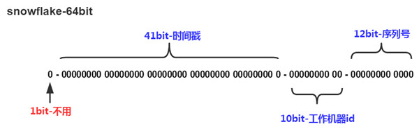
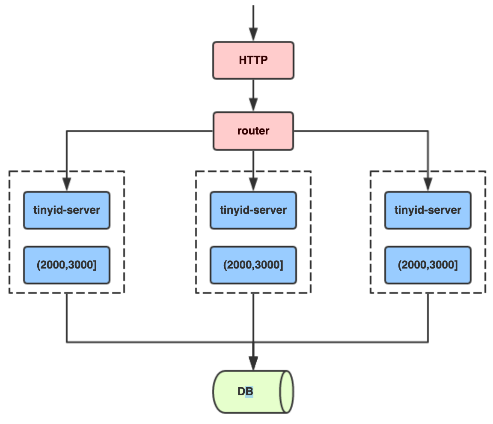

## 1、ID生成的核心需求

- （1）全局唯一：需要单独设置一个和业务无关的主键；专业术语叫做代理主键这也是为什么数据库设计范式；唯一主键是第一范式!

- （2）趋势有序：

	InnoDB引擎表是基于B+树的索引组织表(IOT)；每个表都需要有一个聚集索引；所有的行记录都存储在B+树的叶子节点（leaf pages of the tree）基于聚集索引的增、删、改、查的效率相对是最高的

	- 如果我们定义了主键(PRIMARY KEY)；那么InnoDB会选择其作为聚集索引;
	- 如果没有显式定义主键；则InnoDB会选择第一个不包含有 NULL。值的唯一索引作为主键索引
	- 如果也没有这样的唯一索引；则InnoDB会选择内置6字节长的ROWID作为隐含的聚集索引（ROWID随着行记录的写入而主键递增；这个ROWID不像ORACLE的ROWID那样可引用；是隐含的）
	- *如果InnoDB表的数据写入顺序能和B+树索引的叶子节点顺序一致的话；这时候存取效率是最高的；也就是下面几种情况效率最高：*
		- Ⅰ.使用自增列(INT/BIGINT类型)做主键，这时候写入顺序是自增的，和B+数叶子节点分裂顺序一致
		- Ⅱ.该表不指定自增列做主键；同时也没有可以被选为主键的唯一索引(上面的条件)；这时候InnoDB会选择内置的ROWID作为主键；写入顺序和ROWID增长顺序一致
		- Ⅲ.除此以外；如果一个InnoDB表又没有显示主键；又有可以被选择为主键的唯一索引；但该唯一索引可能不是递增关系时（例如字符串、UUID、多字段联合唯一索引的情况）；该表的存取效率就会比较差

- （3）单调递增：保证下一个ID一定大于上一个ID，例如事务版本号、IM增量消息、排序等特殊需求；
- （4）信息安全：如果ID是连续的，恶意用户的扒取工作就非常容易做了，直接按照顺序下载指定URL即可；如果是订单号就更危险了，竞对可以直接知道我们一天的单量。所以在一些应用场景下，会需要ID无规则、不规则；

上面3、4两点需求是互斥的，无法同时满足3和4点需求；

另外ID生成还需要做到平均延迟和TP延迟都要尽可能低、可用性到5个9、高QPS

## 2、数据库自增长序列或字段：

最常见的方式；利用数据库；全库唯一

### 2.1、优点

- 简单；代码方便；性能可以接受;
- 数字ID天然排序；对分页或者需要排序的结果很有帮助

### 2.2、缺点

- 不同数据库语法和实现不同；数据库迁移的时候或多数据库版本支持的时候需要处理;
- 在单个数据库或读写分离或一主多从的情况下；只有一个主库可以生成。有单点故障的风险
- 在性能达不到要求的情况下；比较难于扩展;
- 如果遇见多个系统需要合并或者涉及到数据迁移会相当痛苦；分表分库的时候会有麻烦

### 2.3、优化方案

针对主库单点；如果有多个Master库；则每个Master库设置的起始数字不一样；步长一样；可以是Master的个数.

## 3、UUID

### 3.1、优点

- 简单；代码方便
- 生成ID性能非常好；基本不会有性能问题。
- 全球唯一；在遇见数据迁移；系统数据合并；或者数据库变更等情况下；可以从容应对

### 3.2、缺点

- 没有排序；无法保证趋势递增;
- UUID往往是使用字符串存储；查询的效率比较低;
- 存储空间比较大；如果是海量数据库；就需要考虑存储量的问题;
- 传输数据量大\不可读；
- 不可读；
- 如果在时钟回拨的情况下，可能发生重复

### 3.3、为什么UUID会导致数据库性能变差

涉及到B+数索引的分裂：果我们的ID按递增的顺序来插入；比如陆续插入8，9，10；新的ID都只会插入到最后一个节点当中。当最后一个节点满了；会裂变出新的节点。这样的插入是性能比较高的插入；因为这样节点的分裂次数最少；而且充分利用了每一个节点的空间。但是；如果我们的插入完全无序；不但会导致一些中间节点产生分裂；也会白白创造出很多不饱和的节点；这样大大降低了数据库插入的性能

### 3.4、生成有序的UUID

可以使用`fasterxml.uuid`来生成有序的UUID，引入POM文件：
```xml
<!-- 顺序UUID -->
<dependency>
	<groupId>com.fasterxml.uuid</groupId>
	<artifactId>java-uuid-generator</artifactId>
	<version>3.1.4</version>
</dependency> 	
```
实现如下：
```java
public static String generatorUUID(){
	TimeBasedGenerator timeBasedGenerator = Generators.timeBasedGenerator(EthernetAddress.fromInterface());
	return timeBasedGenerator.generate().toString();
}
```

## 4、Redis生成ID

当使用数据库来生成ID性能不够要求的时候；可以尝试使用Redis来生成。主要依赖于Redis是单线程的；所以可以用于生成全局唯一ID。（使用Redis的原子操作incr 和 incrby 来实现）比较适合使用Redis来生成每天从0开始的流水号；

- **4.1.优点：**
	- 不依赖于数据库；灵活方便；且性能优于数据库;
	- 数字ID天然排序；对分页或者需要排序的结果很有帮助;

- **4.2.缺点：**
	- 如果系统中没有Redis；还需要引入新的组件；增加系统复杂度
	- 需要编码和配置的工作量比较大

## 5、Twitter-Snowflake

- [Seata改良版雪花算法](https://mp.weixin.qq.com/s/SaS1fDjilhpktN0m31eFug)

### 5.1、Snowflake算法组成

以划分命名空间的方式将 64-bit位分割成多个部分，每个部分代表不同的含义。而 Java中64bit的整数是Long类型，所以在 Java 中 SnowFlake 算法生成的 ID 就是 long 来存储的
- 占用1bit；其值始终是0；二进制中最高位为1的都是负数，但是我们生成的id一般都使用整数，所以这个最高位固定是0
- 41位的时间序列(精确到毫秒；41位的长度可以使用69年)
- 10位的机器标识(其中高位5bit是数据中心ID；低位5bit是工作节点；10位的长度最多支持部署1024个节点)
- 12位的计数顺序号(12位的计数顺序号支持每个节点每毫秒产生4096个ID序号)。最高位是符号位；始终为0

	算法示意图：

	

SnowFlake算法在同一毫秒内最多可以生成全局ID个数：1024 X 4096 =  4194304

### 5.2、优点

- 不依赖数据库等第三方系统；以服务的方式部署；稳定性更高；生成ID的性能也是非常高的;
- 按时间有序；毫秒数在高位；自增序列在低位；整个ID都是趋势递增的

### 5.3、缺点

- （1）强依赖机器时钟；如果机器上时钟回拨；会导致发号重复或者服务会处于不可用状态
- （2）从理论上来说，类似snowflake的方案由于时间位数的限制，存在于[2038](https://en.wikipedia.org/wiki/Year_2038_problem)问题相似的理论极限；

### 5.4、针对缺点解决方案

- 解决时间问题：可以关闭ntp的时间同步功能；或者当检测到ntp时间调整后；拒绝分配id；
- 从设计和编码角度来看，一个有效的措施是缓存历史时间戳，然后再序列生成之前校验，如果出现当前时间落后于历史时间的不合理情况，可以采取相应的动作，要么重试、等待时间重新一致，或者直接提示服务不可用。（NTP问题）

## 6、MongoDB的ObjectId

ObjectId使用12字节的存储空间；其生成方式如下：
```
|0|1|2|3|4|5|6|7|8|9|10|11|
|时间戳|机器ID|PID|计数器 |
```
前四个字节时间戳是从标准纪元开始的时间戳；单位为秒；有如下特性：
- 时间戳与后边5个字节一块；保证秒级别的唯一性;
- 保证插入顺序大致按时间排序
- 隐含了文档创建时间;
- 时间戳的实际值并不重要；不需要对服务器之间的时间进行同步
时间戳保证秒级唯一；机器ID保证设计时考虑分布式；避免时钟同步；PID保证同一台服务器运行；多个mongod实例时的唯一性；最后的计数器保证同一秒内的唯一性

## 7、Zookeepr

使用zookeeper分布式锁来实现，zookeeper了解其在高并发情况下的瓶颈；

zookeeper主要通过其znode数据版本来生成序列号，可以生成32位和64位的数据版本号，客户端可以使用这个版本号来作为唯一的序列号。
很少会使用zookeeper来生成唯一ID。主要是由于需要依赖zookeeper，并且是多步调用API，如果在竞争较大的情况下，需要考虑使用分布式锁。因此，性能在高并发的分布式环境下，也不甚理想

## 8、美团Leaf方案

https://github.com/Meituan-Dianping/Leaf

https://tech.meituan.com/2019/03/07/open-source-project-leaf.html

### 8.1、原理


## 9、百度uid-generator

[uid-generator](https://github.com/baidu/uid-generator)

可以解决时钟回拨问题，使用RingBuffer；UidGenerator是Java实现的, 基于Snowflake算法的唯一ID生成器。

依赖版本：Java8及以上版本, MySQL(内置WorkerID分配器, 启动阶段通过DB进行分配; 如自定义实现, 则DB非必选依赖）

### 9.1、基本原理

与原始的snowflake算法不同，uid-generator支持自定义时间戳、工作机器id和序列号等各部分的位数，以应用于不同场景。默认分配方式如下。
- `sign(1bit)`：固定1bit符号标识，即生成的UID为正数。

- `delta seconds (28 bits)`：当前时间，相对于时间基点"2016-05-20"的增量值，单位：秒，最多可支持约8.7年（注意：1. 这里的单位是秒，而不是毫秒！ 

	因为每秒最多生成8192个id，当1秒获取id数多于8192时，RingBuffer中的id很快消耗完毕，在填充RingBuffer时，生成的id的delta seconds 部分只能使用未来的时间

- `worker id (22 bits)`：机器id，最多可支持约420w次机器启动。内置实现为在启动时由数据库分配，默认分配策略为用后即弃，后续可提供复用策略。

- `sequence (13 bits)`：每秒下的并发序列，13 bits可支持每秒8192个并发。（注意下这个地方，默认支持qps最大为8192个）

### 9.2、DefaultUidGenerator

DefaultUidGenerator的产生id的方法与基本上就是常见的snowflake算法实现，仅有一些不同，如以秒为为单位而不是毫秒：
```java
protected synchronized long nextId() {
	long currentSecond = getCurrentSecond();
	// Clock moved backwards, refuse to generate uid
	if (currentSecond < lastSecond) {
		long refusedSeconds = lastSecond - currentSecond;
		throw new UidGenerateException("Clock moved backwards. Refusing for %d seconds", refusedSeconds);
	}
	// At the same second, increase sequence
	if (currentSecond == lastSecond) {
		sequence = (sequence + 1) & bitsAllocator.getMaxSequence();
		// Exceed the max sequence, we wait the next second to generate uid
		if (sequence == 0) {
			currentSecond = getNextSecond(lastSecond);
		}
	// At the different second, sequence restart from zero
	} else {
		sequence = 0L;
	}

	lastSecond = currentSecond;

	// Allocate bits for UID
	return bitsAllocator.allocate(currentSecond - epochSeconds, workerId, sequence);
}
```

### 9.3、CachedUidGenerator

在实现上, UidGenerator通过借用未来时间来解决sequence天然存在的并发限制; 采用RingBuffer来缓存已生成的UID, 并行化UID的生产和消费, 同时对CacheLine补齐，避免了由RingBuffer带来的硬件级「伪共享」问题。最终单机QPS可达600万；

RingBuffer环形数组，数组每个元素成为一个slot。RingBuffer容量，默认为Snowflake算法中sequence最大值，且为2^N。可通过boostPower配置进行扩容，以提高RingBuffer 读写吞吐量。

Tail指针、Cursor指针用于环形数组上读写slot：
- Tail指针：表示Producer生产的最大序号(此序号从0开始，持续递增)。Tail不能超过Cursor，即生产者不能覆盖未消费的slot。当Tail已赶上curosr，此时可通过rejectedPutBufferHandler指定PutRejectPolicy；
- Cursor指针：表示Consumer消费到的最小序号(序号序列与Producer序列相同)。Cursor不能超过Tail，即不能消费未生产的slot。当Cursor已赶上tail，此时可通过rejectedTakeBufferHandler指定TakeRejectPolicy；

使用 RingBuffer 缓存生成的id。RingBuffer是个环形数组，默认大小为8192个，里面缓存着生成的id

获取id：会从ringbuffer中拿一个id，支持并发获取

填充id：RingBuffer填充时机
- 程序启动时，将RingBuffer填充满，缓存着8192个id
- 在调用getUID()获取id时，检测到RingBuffer中的剩余id个数小于总个数的50%，将RingBuffer填充满，使其缓存8192个id
- 定时填充（可配置是否使用以及定时任务的周期）；

因为delta seconds部分是以秒为单位的，所以1个worker 1秒内最多生成的id书为8192个（2的13次方）

CachedUidGenerator采用了双RingBuffer，Uid-RingBuffer用于存储Uid、Flag-RingBuffer用于存储Uid状态(是否可填充、是否可消费)

由于数组元素在内存中是连续分配的，可最大程度利用CPU cache以提升性能。但同时会带来「伪共享」FalseSharing问题，为此在Tail、Cursor指针、Flag-RingBuffer中采用了CacheLine 补齐方式；

CachedUidGenerator的workerId实现继承自它的父类DefaultUidGenerator，即实例启动时往表WORKER_NODE插入数据后得到的自增ID值

**CachedUidGenerator初始化：**
- 根据boostPower的值确定RingBuffer的size；
- 构造RingBuffer，默认paddingFactor为50。这个值的意思是当RingBuffer中剩余可用ID数量少于50%的时候，就会触发一个异步线程往RingBuffer中填充新的唯一ID（调用BufferPaddingExecutor中的paddingBuffer()方法，这个线程中会有一个标志位running控制并发问题），直到填满为止；
- 判断是否配置了属性scheduleInterval，这是另外一种RingBuffer填充机制，在Schedule线程中，周期性检查填充。默认：不配置，即不使用Schedule线程。如需使用，请指定Schedule线程时间间隔，单位：秒
- 初始化Put操作拒绝策略，对应属性rejectedPutBufferHandler。即当RingBuffer已满，无法继续填充时的操作策略。默认无需指定，将丢弃Put操作，仅日志记录。如有特殊需求，请实现RejectedPutBufferHandler接口(支持Lambda表达式)；
- 初始化Take操作拒绝策，对应属性rejectedTakeBufferHandler。即当环已空，无法继续获取时的操作策略。默认无需指定，将记录日志，并抛出UidGenerateException异常。如有特殊需求，请实现RejectedTakeBufferHandler接口；
- 初始化填满RingBuffer中所有slot（即塞满唯一ID，这一步和第2步骤一样都是调用BufferPaddingExecutor中的paddingBuffer()方法）；
- 开启buffer补丁线程（前提是配置了属性scheduleInterval），原理就是利用ScheduledExecutorService的scheduleWithFixedDelay()方法

**说明：**第二步的异步线程实现非常重要，也是UidGenerator解决时钟回拨的关键：在满足填充新的唯一ID条件时，通过时间值递增得到新的时间值（lastSecond.incrementAndGet()），而不是System.currentTimeMillis()这种方式，而lastSecond是AtomicLong类型，所以能保证线程安全问题；

**取值：**

RingBuffer初始化有值后，接下来就是取值了。不过，由于分布式ID都保存在RingBuffer中，取值过程中就会有一些逻辑判断：
- 如果剩余可用ID百分比低于paddingFactor参数指定值，就会异步生成若干个ID集合，直到将RingBuffer填满；
- 如果获取值的位置追上了tail指针，就会执行Task操作的拒绝策略；
- 获取slot中的分布式ID；
- 将这个slot的标志位只为CANPUTFLAG；

### 9.4、总结

CachedUidGenerator方式主要通过采取如下一些措施和方案规避了时钟回拨问题和增强唯一性：
- 自增列：UidGenerator的workerId在实例每次重启时初始化，且就是数据库的自增ID，从而完美的实现每个实例获取到的workerId不会有任何冲突。
- RingBuffer：UidGenerator不再在每次取ID时都实时计算分布式ID，而是利用RingBuffer数据结构预先生成若干个分布式ID并保存。
- 时间递增：传统的雪花算法实现都是通过`System.currentTimeMillis()`来获取时间并与上一次时间进行比较，这样的实现严重依赖服务器的时间。而UidGenerator的时间类型是AtomicLong，且通过incrementAndGet()方法获取下一次的时间，从而脱离了对服务器时间的依赖，也就不会有时钟回拨的问题（这种做法也有一个小问题，即分布式ID中的时间信息可能并不是这个ID真正产生的时间点，例如：获取的某分布式ID的值为3200169789968523265，它的反解析结果为{"timestamp":"2019-05-02 23:26:39","workerId":"21","sequence":"1"}，但是这个ID可能并不是在"2019-05-02 23:26:39"这个时间产生的）；

## 10、滴滴Tinyid

[Tinyid](https://github.com/didi/tinyid)是一个ID生成器服务，它提供了REST API和Java客户端两种获取方式

### 10.1、使用

**单独部署应用：**

从github上下载Tinyid源代码，执行sql文件，tinyid依赖的sql脚本：`tinyid/tinyid-server/db.sql`，修改相应的配置，启动项目；

通过REST API获取分布式唯一ID，请求实例如下，bizType和token的值请参考tiny_id_token表，获取唯一ID：`http://localhost:9999/tinyid/id/nextId?bizType=test&token=0f673adf80504e2eaa552f5d791b644c`；

**Client集成：**

tinyid还支持Client集成模式，只需要引入如下Maven坐标：
```xml
<dependency>
    <groupId>com.xiaoju.uemc.tinyid</groupId>
    <artifactId>tinyid-client</artifactId>
    <version>${tinyid.version}</version>
</dependency>
```
然后在你的classpath路径下创建配置文件`tinyid_client.properties`，内容如下，这两个参数就是`IdGeneratorFactoryClient.java`中tinyid服务端请求地址`http://{0}/tinyid/id/nextSegmentIdSimple?token={1}&bizType=`的第一个和第二个参数：
```
tinyid.server=localhost:9999
tinyid.token=0f673adf80504e2eaa552f5d791b644c
```
`tinyid.server`还支持多个地址配置，多个地址之间以英文逗号隔开，例如：`tinyid.server=host1:9999,tinyid.server=host2:9999`；

通过调用tinyid封装的API获取分布式ID，实例代码如下，test就是bizType的值：
```java
// 单个分布式ID获取
Long id = TinyId.nextId("test");
// 多个分布式ID批量获取
List<Long> ids = TinyId.nextId("test", 10);
```
通过配置可知，`tinyid-client`本质上还是依赖`tinyid-server`，只不过它封装了对`tinyid-server`的HTTP请求，然后暴露最简单的API给用户使用而已。它对`tinyid-server`的HTTP请求封装在`TinyIdHttpUtils.java`中，依赖JDK原生的`HttpURLConnection`

### 10.2、原理

Tinyid的原理非常简单，通过数据库表中的数据基本是就能猜出个八九不离十，就是经典的segment模式；以同一个bizType为例，每个`tinyid-server`会分配到不同的segment，例如第一个`tinyid-server`分配到`(1000, 2000]`，第二个`tinyid-server`分配到`(2000, 3000]`，第3个`tinyid-server`分配到`(3000, 4000]`：



以第一个`tinyid-server`为例，当它的segment用了20%（核心源码：`segmentId.setLoadingId(segmentId.getCurrentId().get() + idInfo.getStep() * Constants.LOADING_PERCENT / 100);`，`LOADING_PERCENT`的值就是20），即设定`loadingId`为20%的阈值，例如当前id是10000，步长为10000，那么`loadingId=12000`。那么当请求分布式ID分配到12001时（或者重启后），即超过loadingId，就会返回一个特殊code：`new Result(ResultCode.LOADING, id);`tinyid-server根据`ResultCode.LOADING`这个响应码就会异步分配下一个`segment(4000, 5000]`，以此类推

## 11、其他方案

- 使用带业务含义的ID+UUID拼接来生成；

## 12、分布式唯一ID需要满足的条件

- 高可用：不能有单点故障
- 全局唯一性：不能出现重复的ID号；既然是唯一标识；这是最基本的要求;
- 趋势递增：在MySQL InnoDB引擎中使用的是聚集索引；在主键的选择上面我们应该尽量使用有序的主键保证写入性能
- 时间有序：以时间为序；或者ID里包含时间这样一是可以少一个索引；二是冷热数据容易分离;
- 分片支持：可以控制ShardingId
- 单调递增：保证下一个ID一定大于上一个ID；例如事务版本号、IM增量消息、排序等特殊需求;
- 长度适中：不要太长，最好64bit
- 信息安全：如果ID是连续的；恶意用户的扒取工作就非常容易做了；直接按照顺序下载指定URL即可;	

## 参考资料

* [分布式唯一ID](https://mp.weixin.qq.com/s/cqIK5Bv1U0mT97C7EOxmnA)
* [百度分布式ID生成器](https://github.com/baidu/uid-generator)
* [美团点评分布式ID生成系统](https://tech.meituan.com/MT_Leaf.html)
* [分布式ID生成方案](https://juejin.im/post/5d22972f6fb9a07edd2a34cc)