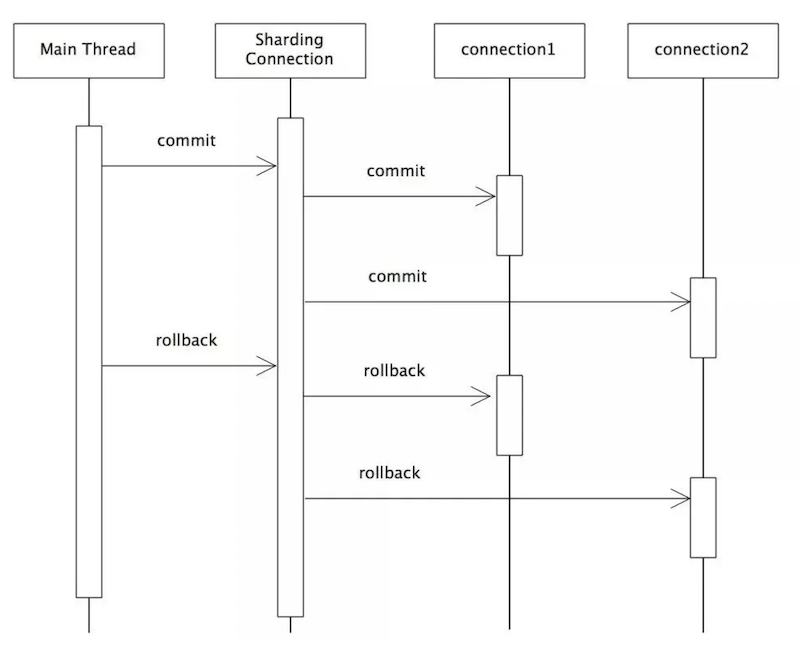
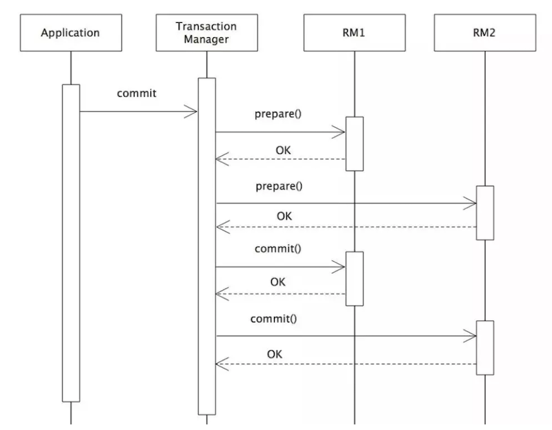

## 1、事务

事务：一般是指要做的或所做的事情；一个数据库事务通常包含对数据库进行读或写的一个操作序列；用来保证一组数组操作的完整性和一致性

事务应该具有4个属性：原子性、一致性、隔离性、持久性。这四个属性通常称为ACID特性。

事务的核心：锁与并发

### 1.1、事务类型

Java事务的类型有三种：JDBC事务、JTA(Java Transaction API)事务、容器事务
- JDBC事务：在JDBC中是通过Connection对象进行事务管理。在JDBC中，常用的和事务相关的方法是： setAutoCommit、commit、rollback；

	JDBC事务有一个局限：一个 JDBC 事务不能跨越多个数据库

- JTA事务：
	- 为什么需要JTA事务：由于JDBC无法实现分布式事务，而如今的分布式场景越来越多，所以，JTA事务就应运而生；
	- Java事务API（Java Transaction API，简称JTA ） 是一个Java企业版 的应用程序接口，在Java环境中，允许完成跨越多个XA资源的分布式事务
	- JTA和它的同胞Java事务服务(JTS；Java TransactionService)，为J2EE平台提供了分布式事务服务
	- 常见的JTA实现有以下几种：
		- J2EE容器所提供的JTA实现(JBoss)
		- 独立的JTA实现：如JOTM，Atomikos.这些实现可以应用在那些不使用J2EE应用服务器的环境里用以提供分布事事务保证。如Tomcat,Jetty以及普通的java应用。
	- JTA对DataSource、Connection和Resource 都是有要求的，只有符合XA规范，并且实现了XA规范的相关接口的类才能参与到JTA事务中来
	- 要想使用用 JTA 事务，那么就需要有一个实现 javax.sql.XADataSource 、 javax.sql.XAConnection 和 javax.sql.XAResource 接口的 JDBC 驱动程序。一个实现了这些接口的驱动程序将可以参与 JTA 事务。一个 XADataSource 对象就是一个 XAConnection 对象的工厂。XAConnection 是参与 JTA 事务的 JDBC 连接。要使用JTA事务，必须使用XADataSource来产生数据库连接，产生的连接为一个XA连接。XA连接（javax.sql.XAConnection）和非XA（java.sql.Connection）连接的区别在于：XA可以参与JTA的事务，而且不支持自动提交；
	- 提供了分布式事务的解决方案，严格的ACID；但是实现复杂，通常情况下，JTA UserTransaction需要从JNDI获取。这意味着，如果我们使用JTA，就需要同时使用JTA和JNDI；JTA本身就是个笨重的API；通常JTA只能在应用服务器环境下使用，因此使用JTA会限制代码的复用性

- 容器事务：常见的容器事务如Spring事务，容器事务主要是J2EE应用服务器提供的，容器事务大多是基于JTA完成，这是一个基于JNDI的，相当复杂的API实现

### 1.2、分布式事务

分布式事务：将多个节点的事务看成一个整体处理

## 2、全局事务

所谓全局事务，是指分布式事务处理环境中，多个数据库可能需要共同完成一个工作，这个工作即是一个全局事务，例如，一个事务中可能更新几个不同的数据库。对数据库的操作发生在系统的各处但必须全部被提交或回滚；即：`全局事务是由资源管理器管理和协调的事务`，标准的分布式事务；

全局事务是一个DTP模型的事务；所谓DTP模型指的是`X/Open DTP(X/Open Distributed Transaction Processing Reference Model)`，是X/Open 这个组织定义的一套分布式事务的标准，也就是了定义了规范和API接口，由这个厂商进行具体的实现

X/Open DTP 定义了三个组件：AP，TM，RM 和两个协议：XA、TX：
- AP(Application Program)：也就是应用程序，可以理解为使用DTP的程序，AP定义事务边界（定义事务开始和结束）并访问事务边界内的资源
- RM(Resource Manager)：资源管理器，这里可以理解为一个DBMS系统，或者消息服务器管理系统，应用程序通过资源管理器对资源进行控制。
- TM(Transaction Manager)：事务管理器，负责协调和管理事务，提供给AP应用程序编程接口以及管理资源管理器。负责管理全局事务，分配全局事务标识，监控事务的执行进度，并负责事务的提交、回滚、失败恢复等
- XA协议：应用或应用服务器与事务管理之间通信的接口
- TX协议：全局事务管理器与资源管理器之间通信的接口

事务管理器控制着全局事务，管理事务生命周期，并协调资源。资源管理器负责控制和管理实际资源

### 2.1、XA协议

- XA规范主要定义了(全局)事务管理器(TM)和(局部)资源管理器(RM)之间的接口。主流的关系型数据库产品都是实现了XA接口的；在XA规范中，数据库充当RM角色，应用需要充当TM的角色，即生成全局的txId，调用XAResource接口，把多个本地事务协调为全局统一的分布式事务

- XA接口是双向的系统接口，在事务管理器 (TM)以及一个或多个资源管理器(RM)之 间形成通信桥梁；

二阶段提交其实就是实现XA分布式事务的关键(确切地说：两阶段提交主要保证了分布式事务的原子性：即所有结点要么全做要么全不做)

mysql5.7及以上都支持XA协议

#### 2.1.1、一阶段提交：弱XA

弱XA通过去掉XA的Prepare阶段，以达到减少资源锁定范围而提升并发性能的效果。

典型的实现为在一个业务线程中，遍历所有的数据库连接，依次做commit或者rollback。弱XA同本地事务相比，性能损耗低，但在事务提交的执行过程中，若出现网络故障、数据库宕机等预期之外的异常，将会造成数据不一致，且无法进行回滚。基于弱XA的事务无需额外的实现成本

#### 2.1.2、二阶段提交：2PC

二阶段提交是XA的标准实现。它将分布式事务的提交拆分为2个阶段：`prepare`和`commit/rollback`；

开启XA全局事务后，所有子事务会按照本地默认的隔离级别锁定资源，并记录undo和redo日志，然后由TM发起prepare投票，询问所有的子事务是否可以进行提交：当所有子事务反馈的结果为“yes”时，TM再发起commit；若其中任何一个子事务反馈的结果为“no”，TM则发起rollback；如果在prepare阶段的反馈结果为yes，而commit的过程中出现宕机等异常时，则在节点服务重启后，可根据XA recover再次进行commit补偿，以保证数据的一致性；

2PC模型中，在prepare阶段需要等待所有参与子事务的反馈，因此可能造成数据库资源锁定时间过长，不适合并发高以及子事务生命周长较长的业务场景；

### 2.2、全局事务的实现

- JTA(Java Transaction API)：面向应用、应用服务器与资 源管理器的高层事务接口。
- JTS(Java Transaction Service)：JTA事务管理器的实现标 准，向上支持JTA，向下通过CORBA OTS实现跨事务域的互 操作性。
- EJB：基于组件的应用编程模型，通过声明式事务管理进一步 简化事务应用的编程。

### 2.3、优缺点

- 优点：严格的ACID，即强一致性；
- 缺点：效率非常低
	- 全局事务方式下，全局事务管理器(TM)通过XA接口使用二阶段提交协议( 2PC )与资源层(如数据 库)进行交互。使用全局事务，数据被Lock的时间跨整个事务，直到全局事务结束；
	- 2PC 是反可伸缩模式，在事务处理过程中，参与者需要一直持有资源直到整个分布式事务结束。这样， 当业务规模越来越大的情况下，2PC 的局限性就越来越明显，系统可伸缩性会变得很差；
	- 与本地事务相比，XA 协议的系统开销相当大，因而应当慎重考虑是否确实需要分布式事务。而且只有 支持 XA 协议的资源才能参与分布式事务；
	- 强依赖于数据库

## 3、柔性事务

柔性事务是对XA协议的妥协和补偿，它通过对强一致性要求的降低，以达到降低数据库资源锁定时间的效果；

柔性事务保证的事`基本可用，最终一致`。这其实就是基于BASE理论，保证数据的最终一致性。

虽然柔性事务并不像刚性事务那样完全遵循ACID，但是，也是部分遵循ACID的；关于ACID四个属性，柔性事务的支撑程度：

	原子性：严格遵循
	一致性：事务完成后的一致性严格遵循；事务中的一致性可适当放宽
	隔离性：并行事务间不可影响；事务中间结果可见性允许安全放宽
	持久性：严格遵循

关于柔性事务，最主要的有以下三种类型：异步确保型、补偿型、最大努力通知型。

以下柔性事务的模式

### 3.1、可查询操作

几乎是所有的分布式解决方案都需要的。在分布式事务执行过程中，如果某一个步骤执行出错，就需要明确的知道其他几个操作的处理情况，这就需要其他的服务都能够提供查询接口，保证可以通过查询来判断操作的处理情况。

为了保证操作的可查询，需要对于每一个服务的每一次调用都有一个全局唯一的标识，可以是业务单据号（如订单号）、也可以是系统分配的操作流水号（如支付记录流水号）。除此之外，操作的时间信息也要有完整的记录

### 3.2、幂等操作

其任意多次执行所产生的影响均与一次执行的影响相同；要保证数据的最终一致性，很多解决防范都会有很多重试的操作，如果一个方法不保证幂等，那么将无法被重试

幂等操作的实现方式有多种，如在系统中缓存所有的请求与处理结果、检测到重复操作后，直接返回上一次的处理结果等

### 3.3、可补偿操作

在分布式事务中，要想进行rollback，就需要提供可补偿操作。并且，补偿操作同时也需要满足幂等性。

### 3.4、TCC操作

TCC 即 Try-Confirm-Cancel。

- Try：尝试执行业务，完成所有业务检查(一致性) 预留必须业务资源(准隔离性)；
- Confirm：确认执行业务，真正执行业务，不作任何业务检查，只使用Try阶段预留的业务资源；因此，只要Try操作成功，Confirm必须能成功。另外，Confirm操作需满足幂等性，保证分布式事务有且只能成功一次
- Cancel：取消执行业务，释放Try阶段预留的业务资源；Cancel操作要满足幂等性

这种类型和可补偿操作类似，就是提供一种提交和回滚的机制。是一种典型的两阶段类型的操作。这里说的两阶段类型操作并不是指2PC，他和2PC还是有区别的：
- TCC位于业务服务层而非资源层；
- TCC没有单独的准备(Prepare)阶段
- Try操作兼备资源操作与准备能力
- Try操作可以灵活选择业务资源的锁定粒度(以业务定粒度) TCC有较高开发成本

## 4、柔性事务的解决方案

### 4.1、TCC事务补偿型方案

- [TCC事务](https://it-blog-cn.com/blogs/dis_transaction/tcc.html)
- [seata中关于TCC事务的实现](https://seata.io/zh-cn/blog/tcc-mode-design-principle.html)

TCC分布式事务模型相对于 XA 等传统模型，其特征在于它不依赖资源管理器（RM）对分布式事务的支持，而是通过对业务逻辑的分解来实现分布式事务

也属于两阶段型的一种实现，但区别于2PC协议的两阶段提交，TCC 其实就是采用的补偿机制，其核心思想是：针对每个操作，都要注册一个与其对应的确认和补偿（撤销）操作。它分为三个阶段：
- Try 阶段主要是对业务系统做检测及资源预留
- Confirm 阶段主要是对业务系统做确认提交，Try阶段执行成功并开始执行 Confirm阶段时，默认 Confirm阶段是不会出错的。即：只要Try成功，Confirm一定成功。
- Cancel 阶段主要是在业务执行错误，需要回滚的状态下执行的业务取消，预留资源释放。

**优点：** 跟2PC比起来，实现以及流程相对简单了一些，但数据的一致性比2PC也要差一些

**缺点：** 缺点还是比较明显的，在2、3步中都有可能失败。TCC属于应用层的一种补偿方式，所以需要程序员在实现的时候多写很多补偿的代码，在一些场景中，一些业务流程可能用TCC不太好定义及处理。
- **空回滚问题**：如果try失败了，那么二阶段回滚时；TCC 服务在未收到 Try 请求的情况下收到 Cancel 请求，这种场景被称为空回滚；空回滚在生产环境经常出现，用户在实现TCC服务时，应允许允许空回滚的执行，即收到空回滚时返回成功；**解决思路**： 关键是要识别出这个空回滚。思路很简单就是需要知道一阶段是否执行，如果执行了，那就是正常回滚；如果没执行，那就是空回滚。TM在发起全局事务时生成全局事务记录，全局事务ID贯穿整个分布式事务调用链条。再额外增加一张分支事务记录表，其中有全局事务 ID 和分支事务 ID，第一阶段 Try 方法里会插入一条记录，表示一阶段执行了。Cancel 接口里读取该记录，如果该记录存在，则正常回滚；如果该记录不存在，则是空回滚；
- **悬挂**：事务协调器在调用 TCC 服务的一阶段 Try 操作时，可能会出现因网络拥堵而导致的超时，此时事务管理器会触发二阶段回滚，调用 TCC 服务的 Cancel 操作，Cancel 调用未超时；在此之后，拥堵在网络上的一阶段 Try 数据包被 TCC 服务收到，出现了二阶段 Cancel 请求比一阶段 Try 请求先执行的情况，此 TCC 服务在执行晚到的 Try 之后，将永远不会再收到二阶段的 Confirm 或者 Cancel ，造成 TCC 服务悬挂；**解决方法**： 如果二阶段执行完成，那一阶段就不能再继续执行。在执行一阶段事务时判断在该全局事务下，“分支事务记录”表中是否已经有二阶段事务记录，如果有则不执行Try
- 幂等性问题：无论是网络数据包重传，还是异常事务的补偿执行，都会导致 TCC 服务的 Try、Confirm 或者 Cancel 操作被重复执行；用户在实现 TCC 服务时，需要考虑幂等控制，即 Try、Confirm、Cancel 执行一次和执行多次的业务结果是一样的

比较适合对数据一致性要求特别高的场景；

### 4.2、本地消息表

核心思想是将分布式事务拆分成本地事务进行处理，基本思路就是：
- 消息生产方，需要额外建一个消息表，并记录消息发送状态。**消息表和业务数据要在一个事务里提交**，也就是说他们要在一个数据库里面。然后消息会经过MQ发送到消息的消费方。如果消息发送失败，会进行重试发送。
- 消息消费方，需要处理这个消息，并完成自己的业务逻辑。此时如果本地事务处理成功，表明已经处理成功了，如果处理失败，那么就会重试执行。如果是业务上面的失败，可以给生产方发送一个业务补偿消息，通知生产方进行回滚等操作。
- 生产方和消费方定时扫描本地消息表，把还没处理完成的消息或者失败的消息再发送一遍。如果有靠谱的自动补偿逻辑，这种方案还是非常实用的。
- 设置一定的重试次数，重试间隔时间根据重试次数而指数或者线性增长，若达到最大重试次数后记录日志，我们可以根据记录的日志来通过邮件或短信来发送告警通知，接收到告警通知后及时介入人工处理即可；

这种方案遵循BASE理论，采用的是最终一致性，这几种方案里面比较适合实际业务场景的，即不会出现像2PC那样复杂的实现(当调用链很长的时候，2PC的可用性是非常低的)，也不会像TCC那样可能出现确认或者回滚不了的情况。

**优点：**一种非常经典的实现，避免了分布式事务，实现了最终一致性。

**缺点：**消息表会耦合到业务系统中，如果没有封装好的解决方案，会有很多杂活需要处理，比如重试时的幂等性操作；

### 4.3、可靠消息的一致性：异步确保型

其是基于MQ来实现的，比如RocketMQ，大致处理流程：
- 在系统A处理任务A前，首先向消息中间件发送一条Prepared消息，如果这个Prepare消息发送失败，那么就直接取消操作，后续的操作也都不再执行
- 消息中间件收到后将该条消息持久化，但并不投递。此时下游系统B仍然不知道该条消息的存在。
- 消息中间件持久化成功后，便向系统A返回一个确认应答；
- 系统A收到确认应答后，则可以开始处理任务A，执行自身的本地事务；
- 任务A处理完成后，向消息中间件发送Commit请求。该请求发送完成后，对系统A而言，该事务的处理过程就结束了，此时它可以处理别的任务了；如果处理失败了，则向消息中间件发送回滚操作；
- 但commit消息可能会在传输途中丢失，从而消息中间件并不会向系统B投递这条消息，从而系统就会出现不一致性。这个问题由消息中间件的事务回查机制完成。
- 消息中间件收到Commit指令后，便向系统B投递该消息，从而触发任务B的执行；
- 当任务B执行完成后，系统B向消息中间件返回一个确认应答，告诉消息中间件该消息已经成功消费，此时，这个分布式事务完成

系统A除了实现正常的业务流程外，还需提供一个事务询问的接口，供消息中间件调用。当消息中间件收到一条事务型消息后便开始计时，如果到了超时时间也没收到系统A发来的Commit或Rollback指令的话，就会主动调用系统A提供的事务询问接口询问该系统目前的状态。该接口会返回三种结果：
- 提交：若获得的状态是“提交”，则将该消息投递给系统B。
- 回滚：若获得的状态是“回滚”，则直接将条消息丢弃。
- 处理中：若获得的状态是“处理中”，则继续等待

消息中间件的超时询问机制能够防止上游系统因在传输过程中丢失Commit/Rollback指令而导致的系统不一致情况，而且能降低上游系统的阻塞时间，上游系统只要发出Commit/Rollback指令后便可以处理其他任务，无需等待确认应答。而Commit/Rollback指令丢失的情况通过超时询问机制来弥补，这样大大降低上游系统的阻塞时间，提升系统的并发度。

针对有可能MQ服务宕机的问题，系统A在发送消息前必须记录消息，还需要有定时任务，轮询未收到确认答复的消息，重新发送；

到底是先发消息还是先执行任务A：
- 先发消息：
	- 如果发送消息失败了，那么整个流程结束；
	- 如果发送消息成功，但是执行任务A失败，那么MQ没有收到消息的commit或者rollback，那么通过事务回查，发现回滚了，则丢弃消息；
- 先执行任务A：
	- 如果任务A执行失败，那么整个流程结束；
	- 如果任务A执行成功，但发生消息失败了，可以将任务与发送消息放在一个事务内；如果不在一个事务，那么也可以通过消息记录表来处理未发送的消息；

### 4.4、最大努力通知型方案

- 上游系统在完成任务后，向消息中间件同步地发送一条消息，确保消息中间件成功持久化这条消息，然后上游系统可以去做别的事情了；
- 消息中间件收到消息后负责将该消息同步投递给相应的下游系统，并触发下游系统的任务执行；
- 当下游系统处理成功后，向消息中间件反馈确认应答，消息中间件便可以将该条消息删除，从而该事务完成

上面过程在实际场景中可能存在下列意外情况：
- （1）消息中间件向下游系统投递消息失败
- （2）上游系统向消息中间件发送消息失败
- （3）MQ 自动应答机制导致的消息丢失

第一种情况：消息中间件具有重试机制。可以在消息中间件中设置消息的重试次数和重试时间间隔，对于网络不稳定导致的消息投递失败的情况，往往重试几次后消息便可以成功投递，如果超过了重试的上限仍然投递失败，那么消息中间件不再投递该消息，而是记录在失败消息表中，消息中间件需要提供失败消息的查询接口，下游系统会定期查询失败消息，并将其消费，这就是所谓的“定期校对”

第二种情况：对于第二种情况，需要在上游系统中建立消息重发机制。可以在上游系统建立一张本地消息表，并将 任务处理过程 和 向本地消息表中插入消息 这两个步骤放在一个本地事务中完成

第三种情况：比如RocketMQ、Kafka都有手动ack的机制，采取编程的方式手动发送应答，也就是消费成功后，MQ才能删除这条持久化消息；

适用于一些最终一致性时间敏感度低的业务，且被动方处理结果不影响主动方的处理结果。典型的使用场景：如支付通知、短信通知等

### 4.5、SAGA事务模型

Saga事务模型又叫做长时间运行的事务（Long-running-transaction）

该模型其核心思想就是拆分分布式系统中的长事务为多个短事务，或者叫多个本地事务，然后由 Sagas 工作流引擎负责协调，如果整个流程正常结束，那么就算是业务成功完成，如果在这过程中实现失败，那么Sagas工作流引擎就会以相反的顺序调用补偿操作，重新进行业务回滚；

分布式事务执行过程中，依次执行各参与者的正向操作，如果所有正向操作均执行成功，那么分布式事务提交。如果任何一个正向操作执行失败，那么分布式事务会去退回去执行前面各参与者的逆向回滚操作，回滚已提交的参与者，使分布式事务回到初始状态

Saga模式下分布式事务通常是由事件驱动的，各个参与者之间是异步执行的，Saga 模式是一种长事务解决方案，但是Saga模式不保证事务的隔离性；

Saga模式适用于业务流程长且需要保证事务最终一致性的业务系统，Saga模式一阶段就会提交本地事务，无锁、长流程情况下可以保证性能。事务参与者可能是其它公司的服务或者是遗留系统的服务，无法进行改造和提供TCC要求的接口，也可以使用Saga模式；

Saga模式所具备的优势有：一阶段提交本地数据库事务，无锁，高性能；参与者可以采用事务驱动异步执行，高吞吐；补偿服务即正向服务的“反向”，易于理解、易于实现；不过，Saga 模式由于一阶段已经提交本地数据库事务，且没有进行“预留”动作，所以不能保证隔离性；

## 5、分布式事务现有框架

### 5.1、框架

- [LCN](https://www.txlcn.org/)
- [EasyTransction](https://github.com/QNJR-GROUP/EasyTransaction)
- [seata](https://github.com/seata/seata)
- [tcc-transaction](https://github.com/changmingxie/tcc-transaction)
- mycat 在1.5之后的版本也支持分布式事务；
- sharding-jdbc支持分布式事务，默认开启了分布式事务

	其主要是通过事务拦截器：CompensableTransactionInterceptor、ResourceCoordinatorInterceptor来实现的
	- CompensableTransactionInterceptor主要功能：构建事务上下文、将事务区分为Root事务和分支事务、注册和清除事务管理器中的内容。

		其中Root事务的处理流程大概如下：
		* 1、开启全局事务
		* 2、持久化全局事务
		* 3、注册全局事务
		* 4、判断是confirm还是cancel
		* 5、清除事务
	- ResourceCoordinatorInterceptor主要是处理try阶段的工作、将所有资源封装完成并交给事务管理器，事务资源包括：
		- confirm上下文
		- cancel上下文；
		- 分支事务信息

### 5.1、Seata

- [官方文档](https://seata.io/zh-cn/)

Seata 的设计思路是将一个分布式事务可以理解成一个全局事务，下面挂了若干个分支事务，而一个分支事务是一个满足 ACID 的本地事务，因此我们可以操作分布式事务像操作本地事务一样

Seata 内部定义了 3个模块来处理全局事务和分支事务的关系和处理过程，分别是 TM（事务管理器）、RM（资源管理器） 和 TC（事务协调器）。其中 TM 和 RM 是作为 Seata 的客户端与业务系统集成在一起，TC 作为 Seata 的服务端独立部署。
- Transaction Coordinator（TC）：事务协调器，维护全局事务的运行状态，负责协调并驱动全局事务的提交或回滚。
- Transaction Manager（TM）：控制全局事务的边界，负责开启一个全局事务，并最终发起全局提交或全局回滚的决议。
- Resource Manager（RM）：控制分支事务，负责分支注册、状态汇报，并接收事务协调器的指令，驱动分支（本地）事务的提交和回滚

**整个事务的处理流程:**
- （1）TM 向 TC 申请开启一个全局事务，TC 创建全局事务后返回全局唯一的 XID，XID 会在全局事务的上下文中传播；
- （2）RM 向 TC 注册分支事务，该分支事务归属于拥有相同 XID 的全局事务；
- （3）TM 要求TC提交或回滚XID的相应全局事务。
- （4）TC 在XID的相应全局事务下驱动所有分支事务以完成分支提交或回滚。

Seata 会有 4 种分布式事务解决方案，分别是 AT 模式、TCC 模式、Saga 模式和 XA 模式

#### 5.1.1、Seata-AT模式

Seata 的事务提交方式跟 XA 协议的两段式提交在总体上来说基本是一致的，不同：
- XA 协议它依赖的是数据库层面来保障事务的一致性，也即是说 XA 的各个分支事务是在数据库层面上驱动的，由于 XA 的各个分支事务需要有 XA 的驱动程序，一方面会导致数据库与 XA 驱动耦合，另一方面它会导致各个分支的事务资源锁定周期长；
- 在使用 Seata 时，我们使用的数据源实际上用的是 Seata 自带的数据源代理 DataSourceProxy，Seata 在这层代理中加入了很多逻辑，主要是解析 SQL，把业务数据在更新前后的数据镜像组织成回滚日志，并将 undo log 日志插入 undo_log 表中，保证每条更新数据的业务 SQL都有对应的回滚日志存在；

	本地事务执行完可以立即释放本地事务锁定的资源，然后向 TC 上报分支状态。当 TM 决议全局提交时，就不需要同步协调处理了，TC 会异步调度各个 RM 分支事务删除对应的 undo log 日志即可，这个步骤非常快速地可以完成；当 TM 决议全局回滚时，RM 收到 TC 发送的回滚请求，RM 通过 XID 找到对应的 undo log 回滚日志，然后执行回滚日志完成回滚操作

AT模式如何做到对业务无侵入，又是如何执行提交和回滚的呢？

**一阶段**

Seata 的 JDBC 数据源代理通过对业务 SQL 的解析，把业务数据在更新前后的数据镜像组织成回滚日志（undo log），利用本地事务的 ACID 特性，将业务数据的更新和回滚日志的写入在同一个本地事务中提交。这样可以保证任何提交的业务数据的更新一定有相应的回滚日志存在，最后对分支事务状态向 TC 进行上报。基于这样的机制，分支的本地事务便可以在全局事务的第一阶段提交，马上释放本地事务锁定的资源

**第二阶段**

- 如果决议是全局提交，此时分支事务此时已经完成提交，不需要同步协调处理（只需要异步清理回滚日志），第二阶段可以非常快速地结束；
- 如果决议是全局回滚，RM收到协调器发来的回滚请求，通过XID和Branch ID找到相应的回滚日志记录，通过回滚记录生成反向的更新SQL并执行，以完成分支的回滚；

**写隔离**

Seata AT 模式引入全局锁机制来实现隔离。全局锁是由 Seata 的 TC 维护的，事务中涉及的数据的锁
- 第一阶段本地事务提交前，需要确保先拿到全局锁；
- 拿不到全局锁，不能提交本地事务；
- 拿全局锁的尝试被限制在一定范围内，超出范围将放弃，并回滚本地事务，释放本地锁；

以一个示例来说明。两个全局事务tx1和tx2，分别对a表的m字段进行更新操作，m的初始值1000。tx1先开始，开启本地事务拿到本地锁，更新操作 m = 1000 - 100 = 900。本地事务提交前，先拿到该记录的全局锁，本地提交释放本地锁。 tx2后开始，开启本地事务拿到本地锁，更新操作 m = 900 - 100 = 800。本地事务提交前，尝试拿该记录的全局锁，tx1全局提交前，该记录的全局锁被 tx1持有，tx2需要重试等待全局锁；

tx1 第二阶段全局提交，释放全局锁 。tx2拿到全局锁提交本地事务。如果tx1的第二阶段全局回滚，则tx1需要重新获取该数据的本地锁，进行反向补偿的更新操作，实现分支的回滚。此时如果tx2仍在等待该数据的全局锁，同时持有本地锁，则tx1的分支回滚会失败。分支的回滚会一直重试，直到tx2的全局锁等锁超时，放弃全局锁并回滚本地事务释放本地锁，tx1 的分支回滚最终成功。

**读隔离**

在数据库本地事务隔离级别为`读已提交`（READ COMMITTED）或以上的基础上，Seata（AT模式）的默认全局隔离级别是`读未提交`（READ UNCOMMITTED）。如果应用在特定场景下，必需要求全局的读已提交，目前Seata的方式是通过SELECT FOR UPDATE语句的代理；

SELECT FOR UPDATE语句的执行会申请全局锁 ，如果全局锁被其他事务持有，则释放本地锁（回滚SELECT FOR UPDATE语句的本地执行）并重试。这个过程中，查询是被阻塞 住的，直到全局锁拿到，即读取的相关数据是已提交的，才返回；

**总结**

全局锁是由 TC 也就是服务端来集中维护，而不是在数据库维护的。这样做有两点好处：一方面，锁的释放非常快，尤其是在全局提交的情况下收到全局提交的请求，锁马上就释放掉了，不需要与 RM 或数据库进行一轮交互；另外一方面，因为锁不是数据库维护的，从数据库层面看数据没有锁定。这也就是给极端情况下，业务降级提供了方便，事务协调器异常导致的一部分异常事务，不会阻塞后面业务的继续进行。

AT模式基于本地事务的特性，通过拦截并解析 SQL 的方式，记录自定义的回滚日志，从而打破 XA 协议阻塞性的制约，在一致性、性能、易用性三个方面取得一定的平衡：在达到确定一致性（非最终一致）的前提下，即保障一定的性能，又能完全不侵入业务。在很多应用场景下，Seata的AT模式都能很好地发挥作用，把应用的分布式事务支持成本降到极低的水平

#### 5.1.2、Seata-TCC

TCC分布式事务模型相对于 XA 等传统模型，其特征在于它不依赖资源管理器（RM）对分布式事务的支持，而是通过对业务逻辑的分解来实现分布式事务。

[TCC过程](#4.1TCC事务补偿型方案)

**TCC分布式事务模型包括三部分：**
- 主业务服务（Main Server）：主业务服务为整个业务活动的发起方、服务的编排者，负责发起并完成整个业务活动。
- 从业务服务（Service）：从业务服务是整个业务活动的参与方，负责提供TCC业务操作，实现Try、Confirm、Cancel三个接口，供主业务服务调用。
- 事务管理器（Transaction Manager）：事务管理器管理控制整个业务活动，包括记录维护TCC全局事务的事务状态和每个从业务服务的子事务状态，并在业务活动提交时调用所有从业务服务的Confirm操作，在业务活动取消时调用所有从业务服务的Cancel操作；

TCC模型中的主业务服务相当于DTP模型中AP，从业务服务相当于DTP模型中的RM，两者也都有一个事务管理器；TCC模型中从业务服务器所提供的`Try/Commit/Cancel`接口相当于DTP模型中RM提供的`Prepare/Commit/Rollback`接口；

所不同的是DTP模型中`Prepare/Commit/Rollback`都是由事务管理器调用，TCC模型中的`Try`接口是由主业务服务调用的，二阶段的`Commit/Cancel`才是由事务管理器调用。这就是TCC事务模型的二阶段异步化功能，从业务服务的第一阶段执行成功，主业务服务就可以提交完成，然后再由事务管理器框架异步的执行各从业务服务的第二阶段。这里牺牲了一定的隔离性和一致性的，但是提高了长事务的可用性；

**一个完整的TCC分布式事务流程：**
- 主业务服务首先开启本地事务。
- 主业务服务向事务管理器申请启动分布式事务主业务活动。
- 然后针对要调用的从业务服务，主业务活动先向事务管理器注册从业务活动，然后调用从业务服务的 Try 接口。
- 当所有从业务服务的 Try 接口调用成功，主业务服务提交本地事务；若调用失败，主业务服务回滚本地事务。
- 若主业务服务提交本地事务，则TCC模型分别调用所有从业务服务的Confirm接口；若主业务服务回滚本地事务，则分别调用 Cancel 接口；
- 所有从业务服务的Confirm或Cancel操作完成后，全局事务结束。

如果需要接入TCC，最重要的是考虑如何将自己的业务模型拆成两阶段来实现。以一个简答的例子来熟悉一下TCC的具体用法：以“扣钱”场景为例，在接入TCC前，对A账户的扣钱，只需一条更新账户余额的 SQL 便能完成；但是在接入TCC之后，用户就需要考虑如何将原来一步就能完成的扣钱操作拆成两阶段，实现成三个方法，并且保证Try成功Confirm一定能成功。
- 一阶段Try方法需要做资源的检查和预留。在扣钱场景下，Try要做的事情是就是检查账户余额是否充足，预留转账资金，预留的方式就是冻结A账户的转账资金。Try方法执行之后，账号A余额虽然还是100，但是其中30元已经被冻结了，不能被其他事务使用；
- 二阶段Confirm执行真正的扣钱操作。Confirm会使用Try阶段冻结的资金，执行账号扣款。Confirm执行之后，账号A在一阶段中冻结的30元已经被扣除，账号A余额变成 70 元；
- 如果二阶段是回滚的话，就需要在Cancel方法内释放一阶段Try冻结的30元，使账号A的回到初始状态，100元全部可用；

在TCC模型中，事务的隔离交给业务逻辑来实现。其隔离性思想就是通过业务的改造，在第一阶段结束之后，从底层数据库资源层面的加锁过渡为上层业务层面的加锁，从而释放底层数据库锁资源，放宽分布式事务锁协议，将锁的粒度降到最低，以最大限度提高业务并发性能；

**补偿性事务：**

TCC第一阶段的Try或者第二阶段的Confirm/Cancel在执行过程中，一般都会开启各自的本地事务，来保证方法内部业务逻辑的ACID特性。这里Confirm/Cancel执行的本地事务是补偿性事务；

TCC第二阶段Confirm/Cancel执行的补偿性事务用于取消Try阶段本地事务造成的影响。因为第一阶段Try只是预留资源，之后必须要明确的告诉服务提供者，这个资源到底要还需不需要

**TCC异常控制：**

在微服务架构下，很有可能出现网络超时、重发，机器宕机等一系列的异常情况。一旦遇到这些情况，就会导致我们的分布式事务执行过程出现异常，最常见的主要是空回滚、幂等、悬挂。因此，在TCC接口设计中还需要处理好这三个问题。

- Cancel接口设计时需要允许空回滚。在Try接口因为丢包时没有收到，事务管理器会触发回滚，这时会触发Cancel接口，这时Cancel执行时发现没有对应的事务 XID或主键时，需要返回回滚成功。让事务服务管理器认为已回滚，否则会不断重试，而Cancel又没有对应的业务数据可以进行回滚。

- 幂等性的意思是对同一个系统使用同样的条件，一次请求和重复的多次请求对系统资源的影响是一致的。因为网络抖动或拥堵可能会超时，事务管理器会对资源进行重试操作，所以很可能一个业务操作会被重复调用，为了不因为重复调用而多次占用资源，需要对服务设计时进行幂等控制，通常我们可以用事务XID或业务主键判重来控制。

- 悬挂的意思是Cancel比Try接口先执行，出现的原因是Try由于网络拥堵而超时，事务管理器生成回滚，触发Cancel接口，而最终又收到了Try接口调用，但是Cancel比Try先到。按照前面允许空回滚的逻辑，回滚会返回成功，事务管理器认为事务已回滚成功，则此时的Try接口不应该执行，否则会产生数据不一致，所以我们在Cancel空回滚返回成功之前先记录该条事务 XID或业务主键，标识这条记录已经回滚过，Try接口先检查这条事务XID或业务主键如果已经标记为回滚成功过，则不执行Try的业务操作；

**总结：**

XA两阶段提交是资源层面的，而TCC实际上把资源层面二阶段提交上提到了业务层面来实现，有效了的避免了XA两阶段提交占用资源锁时间过长导致的性能低下问题。TCC也没有AT模式中的全局行锁，所以性能也会比AT模式高很多。不过，TCC模式对业务代码有很大的侵入性，主业务服务和从业务服务都需要进行改造，从业务方改造成本更高

## 6、分布式事务下死锁问题

支付宝账号A向账号B转账500元，由于支付宝有几亿用户，账户的保存采用了分库分表的方案， 账号A和账号B分别被保存在不同的数据库实例中

在支付宝的场景中，A向B转账的500块的时候，B几乎同时向A转账1000块；在两笔交易几乎同时执行的时候， 当交易1执行了step1锁住A账号再去锁B账号的时候，交易2可能正执行step3锁住了B账号然后要请求A账号的资源。 这个时候死锁就出现了

## 7、设计分布式事务框架

要自己设计一个分布式事务框架，还需要考虑很多其它特性，在明确目标场景偏好后进行权衡取舍，这些特性包括但不限于以下：
- 业务侵入性（基于注解、XML，补偿逻辑）；
- 隔离性（写隔离/读隔离/读未提交，业务隔离/技术隔离）；
- TM/TC部署形态（单独部署、与应用部署一起）；
- 错误恢复（自动恢复、手动恢复）；
- 性能（回滚的概率、付出的代价,响应时间、吞吐）；
- 高可用（注册中心、数据库）；
- 持久化（数据库、文件、多副本一致算法）；
- 同步/异步（2PC执行方式）；
- 日志清理(自动、手动)；

## 8、消息队列的分布式事务

Kafka事务提交失败直接抛出异常，让用户自行处理；

在 RocketMQ 中的事务实现中，增加了事务反查的机制来解决事务消息提交失败的问题。如果 Producer 也就是订单系统，在提交或者回滚事务消息时发生网络异常，RocketMQ 的 Broker 没有收到提交或者回滚的请求，Broker 会定期去 Producer 上反查这个事务对应的本地事务的状态，然后根据反查结果决定提交或者回滚这个事务；

## 参考资料

* [分布式事务框架压测](http://springcloud.cn/view/374)
* [分布式事务](https://honeypps.com/architect/introduction-of-distributed-transaction/)
* [分布式事务](https://www.cnblogs.com/savorboard/p/distributed-system-transaction-consistency.html)
* [常见的分布式事务解决方案](https://juejin.im/post/5aa3c7736fb9a028bb189bca)
* [分布式服务系统一致性](https://blog.csdn.net/rickiyeat/article/details/70224722)
* [深入理解分布式事务](https://mp.weixin.qq.com/s/sXVSFqq2UZ6Pwwt7vx7vIA)
* [分布式事务：柔性事务](https://www.hollischuang.com/archives/2591)
* [分布式事务在Sharding-Sphere中的实现](https://www.itcodemonkey.com/article/6967.html)
