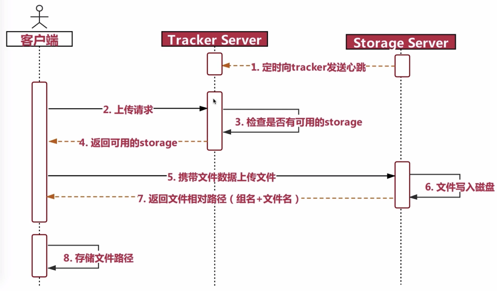

## 1、什么是分布式文件系统

- 随着文件数据的越来越多，通过tomcat或nginx虚拟化的静态资源文件在单一的一个服务器节点内是存不下的，如果用多个节点来存储也可以，但是不利于管理和维护，所以我们需要一个系统来管理多台计算机节点上的文件数据，这就是分布式文件系统。
- 分布式文件系统是一个允许文件通过网络在多台节点上分享的文件系统，多台计算机节点共同组成一个整体，为更多的用户提供分享文件和存储空间。比如常见的网盘，本质就是一个分布式的文件存储系统。虽然我们是一个分布式的文件系统，但是对用户来说是透明的，用户使用的时候，就像是访问本地磁盘一样。
- 分布式文件系统可以提供冗余备份，所以容错能力很高。 系统中有某些节点宕机，但是整体文件服务不会停止，还是能够为用户提供服务，整体还是运作的，数据也不会丢失。
- 分布式文件系统的可扩展性强，增加或减少节点都很简单，不会影响线上服务，增加完毕后会发布到线上，加入到集群中为用户提供服务。
- 分布式文件系统可以提供负载均衡能力，在读取文件副本的时候可以由多个节点共同提供服务，而且可以通过横向扩展来确保性能的提升与负载。

## 2、为什么要使用分布式文件系统

使用分布式文件系统可以解决如下几点问题：
- 海量文件数据存储
- 文件数据高可用(冗余备份)
- 读写性能和负载均衡

以上3点都是我们之前使用tomcat或nginx所不能够实现的，这也是我们为什么要使用分布式文件系统的原因

**FastDFS 与 HDFS**

说到分布式文件存储，肯定会有人想到HDFS，他们两者主要定位和应用场景是不一样的。
- Hadoop中的文件系统HDFS主要解决并行计算中分布式存储数据的问题。其单个数据文件通常很大，采用了分块（切分）存储的方式，所以是大数据大文件存储来使用的场景。
- FastDFS主要用于互联网网站，为文件上传和下载提供在线服务。所以在负载均衡、动态扩容等方面都支持得比较好，FastDFS不会对文件进行分快存储。FastDFS用于存储中小文件都是不错的，比如用户头像啊，一些较小的音视频文件啊等等都行

## 3、FastDFS

### 3.1、什么是FastDFS

- FastDFS是一个开源的轻量级分布式文件系统，它对文件进行管理，功能包括：文件存储、文件同步、文件访问（文件上传、文件下载）等，解决了大容量存储和负载均衡的问题。特别适合以文件为载体的在线服务，如相册网站、视频网站等等。
- FastDFS为互联网量身定制，充分考虑了冗余备份、负载均衡、线性扩容等机制，并注重高可用、高性能等指标，使用FastDFS很容易搭建一套高性能的文件服务器集群提供文件上传、下载等服务。
- FastDFS服务端有两个角色：跟踪器（tracker）和存储节点（storage）。跟踪器主要做调度工作，在访问上起负载均衡的作用。
- 存储节点存储文件，完成文件管理的所有功能：就是这样的存储、同步和提供存取接口，FastDFS同时对文件的metadata进行管理。所谓文件的meta data就是文件的相关属性，以键值对（key value）方式表示，如：width=1024，其中的key为width，value为1024。文件metadata是文件属性列表，可以包含多个键值对。
- 跟踪器和存储节点都可以由一台或多台服务器构成。跟踪器和存储节点中的服务器均可以随时增加或下线而不会影响线上服务。其中跟踪器中的所有服务器都是对等的，可以根据服务器的压力情况随时增加或减少。
- 为了支持大容量，存储节点（服务器）采用了分卷（或分组）的组织方式。存储系统由一个或多个卷组成，卷与卷之间的文件是相互独立的，所有卷的文件容量累加就是整个存储系统中的文件容量。一个卷可以由一台或多台存储服务器组成，一个卷下的存储服务器中的文件都是相同的，卷中的多台存储服务器起到了冗余备份和负载均衡的作用。
- 在卷中增加服务器时，同步已有的文件由系统自动完成，同步完成后，系统自动将新增服务器切换到线上提供服务。
- 当存储空间不足或即将耗尽时，可以动态添加卷。只需要增加一台或多台服务器，并将它们配置为一个新的卷，这样就扩大了存储系统的容量。
- FastDFS中的文件标识分为两个部分：卷名和文件名，二者缺一不可

### 3.2、常见术语

- tracker：追踪者服务器，主要用于协调调度，可以起到负载均衡的作用，记录storage的相关状态信息。选择合适的组合storage server ，tracker server 与 storage server之间也会用心跳机制来检测对方是否活着
- storage：存储服务器，用于保存文件以及文件的元数据信息。分成若干个组（group），实际traker就是管理的storage中的组，而组内机器中则存储数据，group可以隔离不同应用的数据，不同的应用的数据放在不同group里面
- group：组，同组节点提供冗余备份，不同组用于扩容。
- mata data：文件的元数据信息，比如长宽信息，图片后缀，视频的帧数等

### 3.3、上传与下载流程

**FastDFS上传过程：**



**FastDFS下载过程：**


### 3.4、安装

[官方安装方法](https://github.com/happyfish100/fastdfs/wiki)

**安装环境：**
- 两台centos7虚拟机
- 相应的安装包：
	- libfatscommon：FastDFS分离出的一些公用函数包
	- FastDFS：FastDFS本体
	- fastdfs-nginx-module：FastDFS和nginx的关联模块
	- nginx：发布访问服务

#### 3.4.1、基本安装

- 安装基础环境：
	```
	yum install -y gcc gcc-c++
	yum -y install libevent
	```
- 安装libfatscommon函数库：
	- 解压：`tar -zxvf libfastcommon-1.0.42.tar.gz`
	- 进入libfastcommon文件夹，编译并且安装：`./mask.sh`，`./make/sh install`
	- 进入到fastdfs目录，安装fastdfs：`./mask.sh`，`./make/sh install`
	- 安装完成后，有两目录：
		- `/usr/bin` 中包含了可执行文件；
		- `/etc/fdfs` 包含了配置文件，里面的配置文件都是sample
	- 需要将`fastdfs/conf`目录下配置拷贝到`/etc/fdfs`，比如：`cp /root/software/fastdfs-6.04/conf/* .`

#### 3.4.2、tracker配置

修改配置文件：`/etc/fdfs/tracker.conf`

- 配置base_path：`base_path=/usr/local/fastdfs/tracker`；
- 启动tracker服务：`/usr/bin/fdfs_trackerd /etc/fdfs/tracker.conf`
- 停止tracker：`/usr/bin/stop.sh /etc/fdfs/tracker.conf`

#### 3.4.3、storage配置

修改配置文件：`/etc/fdfs/storage.conf`
```conf
# 修改组名
group_name=imooc
# 修改storage的工作空间
base_path=/usr/local/fastdfs/storage
# 修改storage的存储空间
store_path0=/usr/local/fastdfs/storage
# 修改tracker的地址和端口号，用于心跳
tracker_server=192.168.89.150:22122
# 后续结合nginx的一个对外服务端口号
http.server_port=8888
```

启动storage（前提：必须首先启动tracker）：`/usr/bin/fdfs_storaged /etc/fdfs/storage.conf`

#### 3.4.4、测试上传

在storage服务器上修改`/etc/fdfs/client.conf`配置文件：
```conf
base_path=/usr/local/fastdfs/client
tracker_server=192.168.89.150:22122
```

上传文件命令：`./fdfs_test /etc/fdfs/client.conf upload /home/logo.png`，其中 `/home/logo.png` 表示需要上传的文件

#### 3.4.5、fdfs_nginx安装与配置

fastdfs安装好以后是无法通过http访问的，这个时候就需要借助nginx了，所以需要安装fastdfs的第三方模块到nginx中，就能使用了。

**注：nginx需要和storage在同一个节点**

- 解压nginx的fastdfs压缩包：`tar -zxvf fastdfs-nginx-module-1.22.tar.gz`
- 复制配置文件`mod_fastdfs.conf`到fdfs的配置目录下：`cp mod_fastdfs.conf /etc/fdfs`
- 修改`/fastdfs-nginx-module/src/config`文件，主要是修改路径，把`local`删除，因为fastdfs安装的时候我们没有修改路径，原路径是`/usr`：
	```
	ngx_module_incs="/usr/include"
	CORE_INCS="$CORE_INCS /usr/include"
	```
- 安装[nginx](Nginx.md#2.2tar包安装)依赖
- 配置configure目录：
	```
	./configure \
	--prefix=/usr/local/nginx \
	--pid-path=/var/run/nginx/nginx.pid \
	--lock-path=/var/lock/nginx.lock \
	--error-log-path=/var/log/nginx/error.log \
	--http-log-path=/var/log/nginx/access.log \
	--with-http_gzip_static_module \
	--http-client-body-temp-path=/var/temp/nginx/client \
	--http-proxy-temp-path=/var/temp/nginx/proxy \
	--http-fastcgi-temp-path=/var/temp/nginx/fastcgi \
	--http-uwsgi-temp-path=/var/temp/nginx/uwsgi \
	--http-scgi-temp-path=/var/temp/nginx/scgi \
	--add-module=/root/software/fastdfs-nginx-module-1.22/src
	```
	`--add-module` 主要是新增第三方模块依赖

- 执行nginx的安装
- 修改配置文件 `/etc/fdfs/mod_fastdfs.conf`：
	```conf
	base_path=/usr/local/fastdfs/tmp
	tracker_server=192.168.89.150:22122
	group_name=test
	url_have_group_name=true
	store_path0=/usr/local/fastdfs/storage
	```
- 配置`/usr/local/nginx/conf/nginx.conf`
	```conf
	 server {
        listen       8888; ## 该端口为storage.conf中的http.server_port相同
        server_name  localhost;
        location /test/M00{
                ngx_fastdfs_module;
        }
    }
	```
- 访问路径地址：`http://192.168.89.151:8888/test/M00/00/00/wKhZl14ZuKOAC8sLAAARM0HLM14304.png`

## 4、HDFS