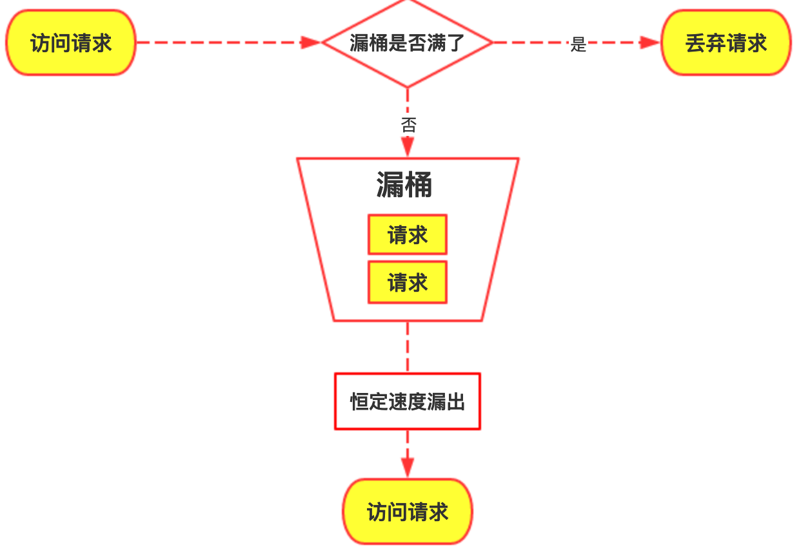
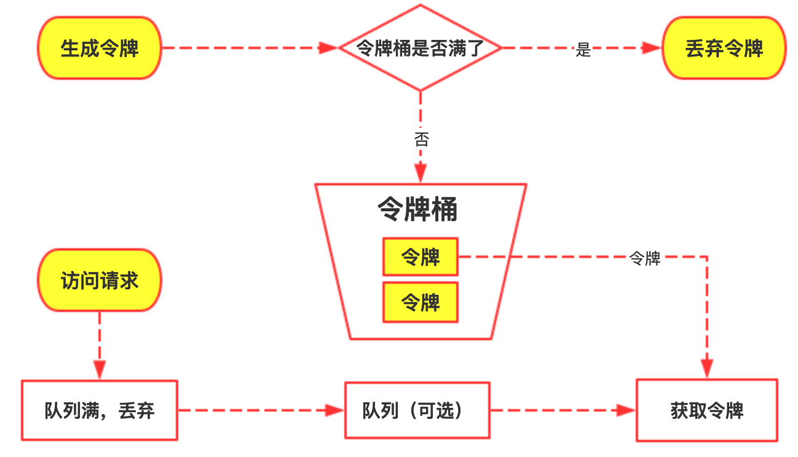
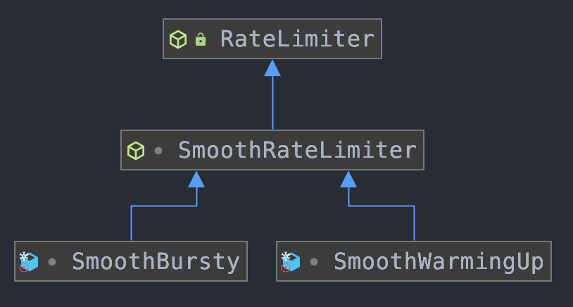

- [Akali-轻量级本地化热点检测/降级框架](https://akali.yomahub.com/)

## 1、熔断

熔断在`微服务架构`里面是指当微服务本身出现问题的时候，它会拒绝新的请求，直到微服务恢复；熔断可以给服务端恢复的机会。试想这么一个场景，CPU 使用率已经 100% 了，服务端因此触发了熔断。那么拒绝了新来的请求之后，服务端的 CPU 使用率就会在一段时间内降到 100% 以内；

- 怎么判断微服务出现了问题？
- 怎么知道微服务恢复了？

### 1.1、判定服务的健康状态

判断微服务是否出现了问题，本质上是要求根据自己的业务来选择一些指标，代表这个服务器的健康程度。比如说一般可以考虑使用响应时间、错误率；

不管选择什么指标，都要考虑两个因素：
- 一是阈值如何选择；
- 二是超过阈值之后，要不要持续一段时间才触发熔断；

比如把响应时间作为指标，那么响应时间超过多少应该触发熔断呢？这是根据业务来决定的。比如说如果业务对响应时间的要求是在 `1s` 以内，那么阈值就可以设定在 `1s`，或者稍高一点，留点容错的余地也可以；

那么是不是响应时间一旦超过了阈值就立刻熔断呢？一般也不是，而是要求响应时间超过一段时间之后才触发熔断。这主要是出于两个考虑，一个是响应时间可能是偶发性地突然增长；另外一个则是防止抖动。

那么这个“一段时间”究竟有多长，很大程度上就依赖个人经验了。如果时间过短，可能会频繁触发熔断，然后又恢复，再熔断，再恢复……反过来，如果时间过长，那就可能会导致该触发熔断的时候迟迟没有触发；

最简单的做法就是超过阈值就直接触发熔断，但是采取这种策略就要更加小心抖动问题；

### 1.2、服务恢复正常

一个服务熔断之后要考虑恢复，因此在触发熔断之后，就要考虑检测服务是否已经恢复正常；

一些微服务框架在，大多数情况下就是触发熔断之后保持一段时间，比如说一分钟，一分钟之后就认为服务已经恢复正常，继续处理新请求；

但是这里需要考虑**网络抖动**的问题，所谓抖动就是服务频繁地在`正常、熔断`两个状态之间切换；

引起抖动的原因是多样的：
- 比如说提到的一旦超过阈值就进入熔断状态；
- 或者这里说的恢复策略不当也会引起抖动。

再比如提到的“一分钟后就认为服务已经恢复正常，继续处理新请求”就容易引发抖动问题；

如果本身熔断是高并发引起的。那么在一分钟后，并发依旧很高，这时候一旦直接恢复正常，然后高并发的流量打过来，服务是不是又会触发熔断？

**要解决这个抖动问题**，就需要在恢复之后控制住流量。比如说按照`10%、20%、30%……`逐步递增，而不是立刻恢复 100% 的流量；

**也可以让客户端来控制这个流量**：简单来说就是服务端触发熔断之后，客户端就直接不再请求这个节点了，而是换一个节点。等到恢复了之后，客户端再逐步对这个节点放开流量；

## 2、降级

降级和熔断非常像。熔断关注的问题，降级也有关注：
- 如何判定服务健康，在降级中则是判定一个服务要不要降级；
- 降级之后怎么恢复，也是要考虑抖动的问题；

所以在一些场景下：既可以用熔断，也可以用降级。比如说在响应时间超过阈值之后，可以考虑选择熔断，完全不提供服务；也可以考虑降级，提供有损服务。

**原则上来说：**是应该优先考虑使用降级的。然而有些服务是无法降级的，尤其是写服务。例如从前端接收数据，然后写到数据库，这种场景是无法降级的。另外，如果希望系统负载尽快降低，那么熔断要优于降级；

### 2.1、如何降级

这个问题可以分为两类：
- **跨服务降级：**当资源不够的时候可以暂停某些服务，将腾出来的资源给其他更加重要、更加核心的服务使用。这里提到的大促暂停退款服务就是跨服务降级的例子。这种策略的要点是必须知道一个服务比另外一个服务更有业务价值，或者更加重要；
- **本服务提供有损服务：**比如各大 App 的首页都会有降级的策略。在没有触发降级的时候，App 首页是针对你个人用户画像的个性化推荐。而在触发了降级之后，则可能是使用榜单数据，或者使用一个运营提前配置好的静态页面。这种策略的要点是得知道服务调用者能够接受什么程度的有损；

跨服务降级的措施是很粗暴的，常见的做法有三个：
- **整个服务停掉：**例如前面提到的停掉退款服务。
- **停掉服务的部分节点**：例如十个节点，停掉其中五个节点，这五个节点被挪作他用；
- **停止访问某些资源**：例如日志中心压力很大的时候，发信号给某些不重要的服务，让它们停止上传日志，只在本地保存日志；

针对服务本身，也有一些常见的降级思路：
- 返回默认值，这算是最简单的一种状况。
- 禁用可观测性组件，正常来说在业务里面都充斥了各种各样的埋点。这些埋点本身其实是会带来消耗的，所以在性能达到瓶颈的时候，就可以考虑停用，或者降低采样率。
- 同步转异步，即正常情况下，服务收到请求之后会立刻处理。但是在降级的情况下，服务在收到请求之后只会返回一个代表“已接收”的响应。后续服务会异步地开启线程来处理，或者依赖于定时任务来处理。
- 简化流程，如果处理一个请求需要很多步骤，后续如果有一些步骤不关键的话，可以考虑不执行，或者异步执行。例如在内容生产平台，一般新内容要被推送到推荐系统里面。那么在降级的情况下你可以不推，而后可以考虑异步推送过去，也可以考虑等系统恢复之后再推送过去

### 2.2、方案1：读写服务降级写服务

基本思路：如果你的某个服务是同时提供了读服务和写服务，并且读服务明显比写服务更加重要，那么这时候你就可以考虑降级写服务；

假如说现在有一个针对商家的服务，商家调用这些 API 来录入一些数据，比如他们门店的基本信息，上传一些门店图片等。同时还有一个针对 C 端普通用户的服务，这个服务就是把商家录入的数据展示在商家门店的首页上。所以可以看到在这个场景下，读服务 QPS 更高，也更加重要；虽然整体来说写服务 QPS 占比很低，但是对于数据库来说，一次写请求对性能的压力要远比一次读请求大。所以暂停了写服务之后，数据库的负载能够减轻不少；

这个方案就是典型的跨服务降级。跨服务降级可以在大部分合并部署的服务里面使用，一般的原则就是：
- B、C 端合并部署降级 B 端；
- 付费服务和非付费服务降级非付费服务。

当然也可以根据自己的业务价值，将这些部署在同一个节点上的服务分成三六九等。而后在触发降级的时候从不重要的服务开始降级，将资源调配给重要服务；

**赚钱：判断一个服务的业务价值最简单的方法就是问产品经理**，产品经理自然是清楚什么东西带来了多少业务价值。又或者根据公司的主要营收来源确定服务的业务价值，越是能赚钱的就越重要。唯一的例外是跟合规相关的。比如说内容审核，它不仅不赚钱，还是一块巨大的成本支出。但是不管怎么降级，内容审核是绝对不敢降级的，不然就等着被请去喝茶交代问题吧；

不过这种跨服务降级都是只能降级处在同一个节点的不同服务。而如果服务本身就分布在不同节点上的话，是比较难设计这种降级方案的。比如说大促时关闭退款服务这种，就需要人手工介入；

### 2.3、方案2：快慢路径降级慢路径

正常来说，使用缓存基本上都是先从缓存里面读数据，如果缓存里面没有数据，就从数据库中读取；那么在触发降级的情况下，可以考虑只从缓存里面读取。如果缓存里面没有数据，那么就直接返回，而不会再去数据库里读取。这样可以保证在缓存里面有数据的那部分请求可以得到正常处理，也就是提供了有损服务；

这种降级方案背后的逻辑也很简单。如果完全不考虑从数据库里取数据，那么你的性能瓶颈就完全取决于缓存或者说 Redis，那么服务能够撑住的 QPS 会非常高；但是，如果缓存不命中的时候要去数据库取数据，那么服务的性能会衰退得非常快，即极少数缓存未命中的请求会占据大部分的系统资源；

如果一个服务可以分成`快路径`和`慢路径`两种逻辑，那么在降级之前就可以先走快路径，再走慢路径。而触发了降级之后，就只允许走快路径。在上面的例子里面，从缓存里加载数据就是快路径，从数据库里面加载数据就是慢路径。 

慢路径还可以是发起服务调用或者复杂计算。比如说一个服务快路径是直接查询缓存，而慢路径可能是发起很多微服务调用，拿到所有响应之后一起计算，算出来一个结果并缓存起来。那么在降级的时候，可以有效提高吞吐量。不过这种吞吐量是有损的，毕竟部分请求如果没有在缓存中找到数据，那么就会直接返回失败响应

## 3、限流

* [限流算法的实现](https://www.jianshu.com/p/76cc8ba5ca91)
* [OpenResty防刷、限流](http://openresty.org/cn/)

### 3.1、基本介绍

限流是通过限制住流量大小来保护系统，它尤其能够解决异常突发流量打崩系统的问题

限流的最终目的是保证后端服务、数据库不被压垮，因此流量从前台都数据库，应该是递减的

#### 3.1.1、概念

限制流量的访问
- 访问频率
- IP连接数
- 黑白名单
- 传输速率

#### 3.1.2、常见算法

- 静态算法包含令牌桶、漏桶、固定窗口和滑动窗口。这些算法就是要求研发人员提前设置好阈值。在算法运行期间它是不会管服务器的真实负载的。
- 动态算法也叫做自适应限流算法，典型的是 BBR 算法。这一类算法利用一系列指标来判定是否应该减少流量或者放大流量。动态算法和 TCP 的拥塞控制是非常接近的，只不过 TCP 控制的是报文流量，而微服务控制的是请求流量；

计数器：
- 信号量计数：信号量竞争是用来控制并发的一个常见手段，它的优点即在于简单可靠，但是只能在单机环境中使用；
- 线程池隔离：隔离舱技术中也大量使用了线程池隔离的方式来实现，通过限制使用的线程数来对流量进行限制，一般会用阻塞队列配合线程池来实现
- 固定窗口计数：限制接口总并发数
- 自然窗口计数
- 滑动窗口计数
- 令牌桶和漏桶算法计数

#### 3.1.3、计数器

- 算法思路：比如限流qps为100，思路就是从第一个请求进来开始计时，在接下去的1s内，每来一个请求，就把计数加1，如果累加的数字达到了100，那么后续的请求就会被全部拒绝。等到1s结束后，把计数恢复成0，重新开始计数；

- 具体的实现可以是这样的：对于每次服务调用，可以通过AtomicLong#incrementAndGet()方法来给计数器加1并返回最新值，通过这个最新值和阈值进行比较

- 弊端：如果我在单位时间1s内的前10ms，已经通过了100个请求，那后面的990ms，只能眼巴巴的把请求拒绝，我们把这种现象称为“突刺现象”

#### 3.1.4、漏桶算法

漏桶是指当请求以不均匀的速度到达服务器之后，限流器会以固定的速率转交给业务逻辑；

漏桶是将访问请求的数据包放到桶里，如果桶满了，那么后面新来的数据包将被丢弃



不管服务调用方多么不稳定，通过漏桶算法进行限流，每10毫秒处理一次请求，为处理的速度是固定的，请求进来的速度是未知的，可能突然进来很多请求，没来得及处理的请求就先放在桶里，既然是个桶，肯定是有容量上限，如果桶满了，那么新进来的请求就丢弃；漏桶算法能够强行限制数据的传输速率

**算法实现：**可以准备一个队列，用来保存请求，另外通过一个线程池（ScheduledExecutorService）来定期从队列中获取请求并执行，可以一次性获取多个并发执行；

**弊端：**无法应对短时间的突发流量；

对于漏桶算法限流丢弃请求，如果你觉得漏桶算法应对突发流量都还不够好，那就要更进一步，采取排队的方式来实现了，排队的方案其实就是一个更复杂的“漏桶”实现

#### 3.1.5、令牌桶算法

系统会以一个恒定的速率产生令牌，这些令牌会放到一个桶里面，每个请求只有拿到了令牌才会被执行

令牌桶算法是对漏桶算法的一种改进，桶算法能够限制请求调用的速率，而令牌桶算法能够在限制调用的平均速率的同时还允许一定程度的突发调用，它有以下两个关键角色：
- 令牌：获取到令牌的Request才会被处理，其他Requests要么排队要么被直接丢弃
- 桶：用来装令牌的地方，所有Request都从这个桶里面获取令牌

其基本过程：



- 在令牌桶算法中，存在一个桶，用来存放固定数量的令牌。算法中存在一种机制，以一定的速率往桶中放令牌。每次请求调用需要先获取令牌，只有拿到令牌，才有机会继续执行，否则选择选择等待可用的令牌、或者直接拒绝；
- 假设令牌桶的容量是b，如果令牌桶容量已经满了，则新的令牌将会被丢弃；
- 实现思路：
	- 生成令牌：可以准备一个队列，用来保存令牌，另外通过一个线程池定期生成令牌放到队列中，每来一个请求，就从队列中获取一个令牌，并继续执行。令牌生成的速度可以分成匀速和非匀速，这两种存在区别；
	- 获取令牌：每个访问请求到来后，必须获取到一个令牌才能执行后面的逻辑。假如令牌的数量少，而访问请求较多的情况下，一部分请求自然无法获取到令牌，那么这个时候我们可以设置一个“缓冲队列”来暂存这些多余的令牌；但是缓冲队列对于令牌桶算法的实现是可选项，不一定要实现

**漏桶 vs 令牌桶的区别：**
- 这两种算法都有一个“恒定”的速率和“不定”的速率。令牌桶是以恒定速率创建令牌，但是访问请求获取令牌的速率“不定”，反正有多少令牌发多少，令牌没了就干等。而漏桶是以“恒定”的速率处理请求，但是这些请求流入桶的速率是“不定”的；
- 漏桶的天然特性决定了它不会发生突发流量，就算每秒1000个请求到来，那么它对后台服务输出的访问速率永远恒定。而令牌桶则不同，其特性可以“预存”一定量的令牌，因此在应对突发流量的时候可以在短时间消耗所有令牌，其突发流量处理效率会比漏桶高，但是导向后台系统的压力也会相应增多；

漏桶算法非常均匀，但是令牌桶相比之下就没那么均匀。令牌桶本身允许积攒一部分令牌，所以如果有偶发的突发流量，那么这一部分请求也能得到正常处理。但是要小心令牌桶的容量，不能设置太大。不然积攒的令牌太多的话就起不到限流效果了。例如容量设置为 1000，那么要是积攒了 1000 个令牌之后真的突然来了 1000 个请求，它们都能拿到令牌，那么系统可能撑不住这突如其来的 1000 个请求

#### 3.1.6、固定时间窗口

固定窗口是指在一个固定时间段，只允许执行固定数量的请求。比如说在一秒钟之内只能执行 100 个请；。基于固定时间窗口的限流算法是非常简单的。首先需要选定一个时间起点，之后每次接口请求到来都累加计数器，如果在当前时间窗口内，根据限流规则（比如每秒钟最大允许 100 次接口请求），累加访问次数超过限流值，则限流熔断拒绝接口请求。当进入下一个时间窗口之后，计数器清零重新计数；

这种基于固定时间窗口的限流算法的缺点在于：限流策略过于粗略，无法应对两个时间窗口临界时间内的突发流量

#### 3.1.7、滑动时间窗口

滑动时间窗口算法是对固定时间窗口算法的一种改进，流量经过滑动时间窗口算法整形之后，可以保证任意时间窗口内，都不会超过最大允许的限流值，从流量曲线上来看会更加平滑，可以部分解决上面提到的临界突发流量问题。对比固定时间窗口限流算法，滑动时间窗口限流算法的时间窗口是持续滑动的，并且除了需要一个计数器来记录时间窗口内接口请求次数之外，还需要记录在时间窗口内每个接口请求到达的时间点，对内存的占用会比较多。滑动时间窗口的算法模型如下：

滑动窗口记录的时间点 list = (t_1, t_2, …t_k)，时间窗口大小为 1 秒，起点是 list 中最小的时间点。当 t_m 时刻新的请求到来时，我们通过以下步骤来更新滑动时间窗口并判断是否限流熔断：
- STEP 1: 检查接口请求的时间 t_m 是否在当前的时间窗口 [t_start, t_start+1 秒) 内。如果是，则跳转到 STEP 3，否则跳转到 STEP 2.
- STEP 2: 向后滑动时间窗口，将时间窗口的起点 t_start 更新为 list 中的第二小时间点，并将最小的时间点从 list 中删除。然后，跳转到 STEP 1。
- STEP 3: 判断当前时间窗口内的接口请求数是否小于最大允许的接口请求限流值，即判断: list.size < max_hits_limit，如果小于，则说明没有超过限流值，允许接口请求，并将此接口请求的访问时间放入到时间窗口内，否则直接执行限流熔断。

可以使用Redis实现滑动时间窗口

### 3.2、限流对象

从单机或者集群的角度看，可以分为单机限流或者集群限流。集群限流一般需要借助 Redis 之类的中间件来记录流量和阈值。换句话说，就是你需要用 Redis 等工具来实现前面提到的限流算法。当然如果是利用网关来实现集群限流，那么可以摆脱 Redis

- 客户端限流：主要手段有纯前端验证码、禁用按钮、调用限制和假排队；客户端限流的特点是不会真正的向服务端发起请求，而是由客户端进行自我控制i；
- 网关层限流：因为它是整个访问链路的源头，是所有流量途径的第一站，目前主流的网关层有以软件为代表的Nginx；
- 中间件限流：比如MQ、Redis；利用Redis过期时间特性，可以轻松设置限流的时间跨度，另外Redis还支持Lua脚本，结合Redis+Lua可以更好的支持限流
- 业务层限流：业务网关层，Spring Cloud中的Gateway和Zuul这类网关层组件

### 3.3、限流之后

- 同步阻塞等待一段时间：如果是偶发性地触发了限流，那么稍微阻塞等待一会儿，后面就有极大的概率能得到处理。比如说限流设置为一秒钟 100 个请求，恰好来了 101 个请求。多出来的一个请求只需要等一秒钟，下一秒钟就会被处理。但是要注意控制住超时，也就是说你不能让人无限期地等待下去；
- 同步转异步：指如果一个请求没被限流，那就直接同步处理；而如果被限流了，那么这个请求就会被存储起来，等到业务低峰期的时候再处理。这个其实跟降级差不多；
- 调整负载均衡算法：如果某个请求被限流了，那么就相当于告诉负载均衡器，应该尽可能少给这个节点发送请求。跟熔断稍微不一样，在熔断里面是负载均衡器后续不再发请求，而在限流这里还是会发送请求，只是会降低转发请求到该节点的概率。调整节点的权重就能达成这种效果；

### 3.4、计算阈值

总体上思路有四个：看服务的观测数据、压测、借鉴、手动计算。

**业务性能数据**：**比如说观察线上的数据，如果在业务高峰期整个集群的 QPS 都没超过 1000，那么就可以考虑将阈值设定在 1200，多出来的 200 就是余量；不过这种方式有一个要求，就是服务必须先上线，有了线上的观测数据才能确定阈值。并且，整个阈值很有可能是偏低的。因为业务巅峰并不意味着是集群性能的瓶颈。如果集群本身可以承受每秒 3000 个请求，但是因为业务量不够，每秒只有 1000 个请求，那么我这里预估出来的阈值是显著低于集群真实瓶颈 QPS 的；

**压测：**最好的方式应该是在线上执行全链路压测，测试出瓶颈。即便不能做全链路压测，也可以考虑模拟线上环境进行压测，再差也应该在测试环境做一个压力测试。

**借鉴：**比如说如果 A、B 服务是紧密相关的，也就是通常调用了 A 服务就会调用 B 服务，那么可以用 A 已经确定的阈值作为 B 的阈值。又或者 A 服务到 B 服务之间有一个转化关系。比如说创建订单到支付，会有一个转化率，假如说是 90%，如果创建订单的接口阈值是 100，那么支付的接口就可以设置为 90;

**手动计算：**就是沿着整条调用链路统计出现了多少次数据库查询、多少次微服务调用、多少次第三方中间件访问，如 Redis，Kafka 等。举一个最简单的例子，假如说一个非常简单的服务，整个链路只有一次数据库查询，这是一个会回表的数据库查询，根据公司的平均数据这一次查询会耗时 10ms，那么再增加 10 ms 作为 CPU 计算耗时。也就是说这一个接口预期的响应时间是 20ms。如果一个实例是 4 核，那么就可以简单用 1000ms÷20ms×4=200 得到阈值；手动计算准确度是很差的。比如说垃圾回收类型语言，还要刨除垃圾回收的开销，相当于 200 打个折扣。折扣多大又取决于你的垃圾回收频率和消耗。

### 3.3、Guava限流

#### 3.3.1、基本原理

Guava的 RateLimiter扩展了令牌桶算法，提供了：平滑突发限流(SmoothBursty)和平滑预热限流(SmoothWarmingUp)实现，其类结构：



RateLimiter 是个抽象类，它提供了两套工厂方法来创建出两个子类

- 平滑突发限流

	RateLimiter使用令牌桶算法，会进行令牌的累积，如果获取令牌的频率比较低，则不会导致等待，直接获取令牌， RateLimiter由于会累积令牌，所以可以应对突发流量

	**原理**

	RateLimiter的原理就是每次调用acquire时用当前时间和nextFreeTicketMicros进行比较，根据二者的间隔和添加单位令牌的时间间隔stableIntervalMicros来刷新存储令牌数storedPermits。然后acquire会进行休眠，直到nextFreeTicketMicros

- 平滑预热限流

	RateLimiter的SmoothWarmingUp是带有预热期的平滑限流，它启动后会有一段预热期，逐步将分发频率提升到配置的速率；

	**原理**

	SmoothWarmingUp实现预热缓冲的关键在于其分发令牌的速率会随时间和令牌数而改变，速率会先慢后快。表现形式如下图所示，令牌刷新的时间间隔由长逐渐变短。等存储令牌数从maxPermits到达thresholdPermits时，发放令牌的时间价格也由coldInterval降低到了正常的stableInterval。

	实现流量预热的类是SmoothWarmingUp，它是SmoothRateLimiter的一个内部类，重点关注doSetRate方法，它是计算横纵坐标系关键节点的方法，看一下SmoothRateLimiter这个父类中定义的方法：
	```java
	// permitsPerSecond表示每秒可以发放的令牌数量
	@Override
	final void doSetRate(double permitsPerSecond, long nowMicros) {
		resync(nowMicros);
		// 计算稳定间隔，使用1s除以令牌桶容量
		double stableIntervalMicros = SECONDS.toMicros(1L) / permitsPerSecond;
		this.stableIntervalMicros = stableIntervalMicros;
		
		// 调用SmoothWarmingUp类中重载的doSetRate方法
		doSetRate(permitsPerSecond, stableIntervalMicros);
	}
	```
	父类在这里的作用主要是计算出了稳定时间间隔（使用1s / 每秒放行数量的公式来计算得出），然后预热时间、三倍间隔等是在子类的doSetRate方法中实现的：
	```java
	@Override
	void doSetRate(double permitsPerSecond, double stableIntervalMicros) {
		double oldMaxPermits = maxPermits;
		// maxPermits表示令牌桶内最大容量，它由我们设置的预热时间除以稳定间隔获得
		// 打个比方，如果stableIntervalMicros=0.1s，而我们设置的预热时间是2s
		// 那么这时候maxPermits就是2除以0.1=20
		maxPermits = warmupPeriodMicros / stableIntervalMicros;
		// 这句不用解释了吧，halfPermits是最大容量的一半
		halfPermits = maxPermits / 2.0;
		// coldIntervalMicros就是我们前面写到的3倍间隔，通过稳定间隔*3计算得出
		// 稳定间隔是0.1，3倍间隔是0.2，那么平均间隔是0.2
		double coldIntervalMicros = stableIntervalMicros * 3.0;
		// slope的意思是斜率，也就是前面我们图中预热阶段中画出的斜线（速率从稳定间隔向3x间隔变化的斜线）
		// 它的计算过程就是一个简单的求斜率公式
		slope = (coldIntervalMicros - stableIntervalMicros) / halfPermits;
		// 计算目前令牌桶的令牌个数
		if (oldMaxPermits == Double.POSITIVE_INFINITY) {
			// 如果令牌桶最大容量是无穷大，则设置当前可用令牌数为0
			// 说实话这段逻辑没什么用
			storedPermits = 0.0;
		} else {
			 // 初始化的状态是3x间隔 
			storedPermits = (oldMaxPermits == 0.0) ? maxPermits : storedPermits * maxPermits / oldMaxPermits;
		}
	}
	```

#### 3.3.2、使用

RateLimiter其支持同步阻塞、非阻塞、非阻塞超时等限流方式；

#### 3.3.3、不足

RateLimiter只能用于单机的限流，如果想要集群限流

### 3.4、Nginx-分布式限流付

基于Nginx的限流方案是基于网关层的限流

```conf
# 根据IP地址限制速度
# 1） 第一个参数 $binary_remote_addr
#    binary_目的是缩写内存占用，remote_addr表示通过IP地址来限流
# 2） 第二个参数 zone=iplimit:20m
#    iplimit是一块内存区域（记录访问频率信息），20m是指这块内存区域的大小
# 3） 第三个参数 rate=1r/s
#    比如100r/m，标识访问的限流频率
limit_req_zone $binary_remote_addr zone=iplimit:20m rate=1r/s;

# 根据服务器级别做限流
limit_req_zone $server_name zone=serverlimit:10m rate=100r/s;

# 基于连接数的配置
limit_conn_zone $binary_remote_addr zone=perip:20m;
limit_conn_zone $server_name zone=perserver:20m;
    server {
        server_name www.bluefish.com;
        location /access-limit/ {
            proxy_pass http://127.0.0.1:10086/;

            # 基于IP地址的限制
            # 1） 第一个参数zone=iplimit => 引用limit_req_zone中的zone变量
            # 2） 第二个参数burst=2，设置一个大小为2的缓冲区域，当大量请求到来。
            #     请求数量超过限流频率时，将其放入缓冲区域
            # 3) 第三个参数nodelay=> 缓冲区满了以后，直接返回503异常
            limit_req zone=iplimit burst=2 nodelay;

            # 基于服务器级别的限制
            # 通常情况下，server级别的限流速率是最大的
            limit_req zone=serverlimit burst=100 nodelay;

            # 每个server最多保持100个连接
            limit_conn perserver 100;
            # 每个IP地址最多保持1个连接
            limit_conn perip 5;

            # 异常情况，返回504（默认是503）
            limit_req_status 504;
            limit_conn_status 504;
        }

        # 彩蛋
        location /download/ {
            limit_rate_after 100m;
            limit_rate 256k;
        }
    }

}
```

#### 3.4.1、基于IP限制的限流

正常情况下，一个用户在一秒钟内最多点击一次登录，所以针对每一个 IP，我限制它最多只能在一秒内提交 50 次登录请求。这个 50 充分考虑到了公共 IP 的问题，正常用户是不可能触发这个阈值的。这个限流虽然很简单，但是能够有效防范一些攻击。不过限流再怎么防范，还是会出现系统撑不住流量的情况

#### 3.4.2、基于连接数的限流

### 3.5、Redis+Lua分布式限流

中间件层限流，在业务层做限流，所有流量都会到对应的业务服务器上，在高并发流量下，对服务器压力考验很多

#### 3.5.1、为什么使用Redis+Lua

**使用Redis**
- 性能：Redis作为缓存组件，如果不采用持久化方案的话，Redis的大部分操作都是纯内存操作，性能十分优异；
- 线程安全：只用单线程承接网络请求（其他模块仍然多线程），天然具有线程安全的特性，而且对原子性操作的支持非常到位；

限流服务不仅需要承接超高QPS，还需要保证限流逻辑的执行层面具备线程安全的特性。利用Redis的这些天然特性做限流，既能保证线程安全，也能保持良好的性能

**Lua**

在使用Redis限流过程中，如果限流逻辑写在Java代码中，那么往往需要发起多个Redis查询和修改指令，比如获取令牌这样一步，这里面就涉及到查询令牌、发放令牌等等步骤，这些步骤会发起多个Redis的请求指令，造成更多的网络开销。不光如此，我们还要保证这些操作是线程安全的，如此一来，在程序中就会涉及到资源锁定等复杂操作

#### 3.5.2、使用Lua脚本实现滑动时间窗口

接收两个参数，一个Key、时间窗口函数；设置当前时间为当前时间，分数也为当前分数；返回当前时间窗口内的数据总数
```lua
local key = KEYS[1]
local window_size = tonumber(ARGV[1])
local current_time = tonumber(redis.call('TIME')[1])
local min_time = current_time - window_size

-- 删除超过时间窗口的数据
redis.call('ZREMRANGEBYSCORE', key, '-inf', min_time)

-- 添加当前时间点的数据
redis.call('ZADD', key, current_time, current_time)

-- 设置过期时间
redis.call('EXPIRE', key, window_size)

-- 获取当前时间窗口内的数据总数
local total_requests = redis.call('ZCARD', key)

return total_requests
```

### 3.6、Sentinel

* [Sentinel使用教程与原理分析](https://github.com/all4you/sentinel-tutorial)
* [Sentinel限流](https://github.com/alibaba/Sentinel)

Sentinel 滑动时间窗限流算法实现

Sentinel 是如何计算线上系统实时QPS的

https://javadoop.com/post/sentinel