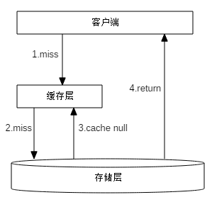
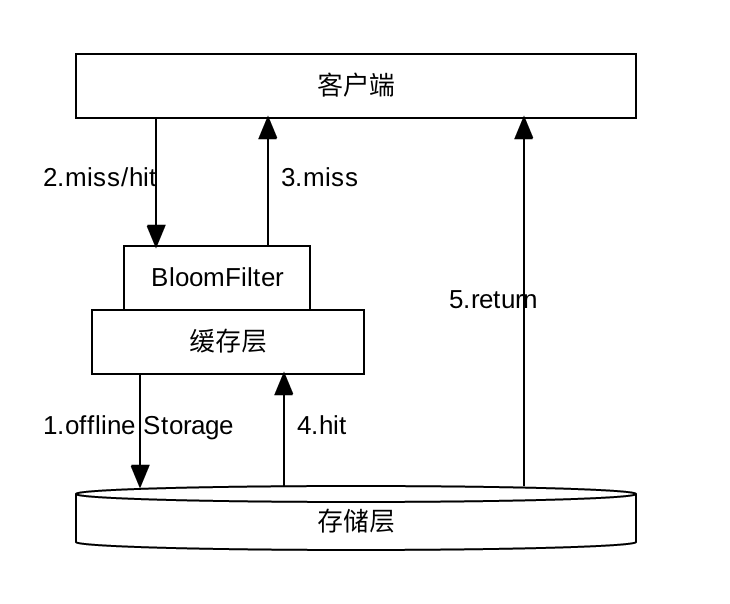

## 1、缓存

- 提升读取数据能力；
- 跨服器缓存；
- 内存式缓存

分类：
- 网络缓存
- 对象缓存
- 应用缓存

### 1.1、概述

缓存最初的含义，是指用于加速 CPU 数据交换的 RAM，即随机存取存储器，通常这种存储器使用更昂贵但快速的静态 RAM（SRAM）技术，用以对 DRAM进 行加速。这是一个狭义缓存的定义。

而广义缓存的定义则更宽泛，任何可以用于数据高速交换的存储介质都是缓存，可以是硬件也可以是软件

缓存存在的意义就是通过开辟一个新的数据交换缓冲区，来解决原始数据获取代价太大的问题，让数据得到更快的访问

读多写少、不要求一致性、时效要求越低、访问频率越高、对最终一致性和数据丢失有一定程度的容忍的场景才适合使用缓存

### 1.2、缓存的基本思想

缓存构建的基本思想是利用时间局限性原理，通过空间换时间来达到加速数据获取的目的，主要有三个关键点：
- 一是时间局限性原理
- 二是以空间换时间，因为原始数据获取太慢，所以我们开辟一块高速独立空间，提供高效访问，来达到数据获取加速的目的；
- 三是性能成本 Tradeoff，构建系统时希望系统的访问性能越高越好，访问延迟越低小越好；

### 1.3、缓存的优势

- 提升访问性能
- 降低网络拥堵
- 减轻服务负载
- 增强可扩展性

### 1.4、缓存的代价

- 服务系统中引入缓存，会增加系统的复杂度
- 由于缓存相比原始 DB 存储的成本更高，所以系统部署及运行的费用也会更高
- 由于一份数据同时存在缓存和 DB 中，甚至缓存内部也会有多个数据副本，多份数据就会存在一致性问题，同时缓存体系本身也会存在可用性问题和分区的问题；

### 1.5、分布式缓存架构


## 2、高并发环境下缓存场景问题


### 2.1、缓存失效

#### 2.1.1、问题描述

缓存里的数据存储基本上都是以 key 为索引进行存储和获取的。业务访问时，如果大量的 key 同时过期，很多缓存数据访问都会 miss，进而穿透到 DB，DB 的压力就会明显上升，由于 DB 的性能较差，只在缓存的 1%~2% 以下，这样请求的慢查率会明显上升

#### 2.1.2、原因

一般情况下，因为缓存数据是逐步写入的，所以也是逐步过期被淘汰的。但在某些场景，一大批数据会被系统主动或被动从 DB 批量加载，然后写入缓存。这些数据写入缓存时，由于使用相同的过期时间，在经历这个过期时间之后，这批数据就会一起到期，从而被缓存淘汰。此时，对这批数据的所有请求，都会出现缓存失效，从而都穿透到 DB，DB 由于查询量太大，就很容易压力大增，请求变慢

#### 2.1.3、业务场景

比如同一批火车票、飞机票，当可以售卖时，系统会一次性加载到缓存，如果缓存写入时，过期时间按照预先设置的过期值，那过期时间到期后，系统就会因缓存失效出现变慢的问题。类似的业务场景还有很多，比如微博业务，会有后台离线系统，持续计算热门微博，每当计算结束，会将这批热门微博批量写入对应的缓存；

#### 2.1.4、解决方法

设计缓存的过期时间时，使用公式：过期时间=bases时间+随机时间。即相同业务数据写缓存时，在基础过期时间之上，再加一个随机的过期时间，让数据在未来一段时间内慢慢过期，避免瞬时全部过期，对 DB 造成过大压力；

### 2.2、缓存雪崩

#### 2.2.1、缓存雪崩

- 设置缓存时采用了相同的过期时间，导致缓存在某一时刻同时失效，请求全部转发到DB，DB瞬时压力过重雪崩。由于原有缓存失效，新缓存未到期间所有原本应该访问缓存的请求都去查询数据库了，而对数据库CPU和内存造成巨大压力，严重的会造成数据库宕机；
- 有一些被大量访问数据（热点缓存）在某一时刻大面积失效，导致对应的请求直接落到了数据库上；

#### 2.2.2、原因

- 缓存不进行 rehash 时产生的雪崩，一般是由于较多缓存节点不可用，请求穿透导致 DB 也过载不可用，最终整个系统雪崩不可用的。而缓存支持 rehash 时产生的雪崩，则大多跟流量洪峰有关，流量洪峰到达，引发部分缓存节点过载 Crash，然后因 rehash 扩散到其他缓存节点，最终整个缓存体系异常；
- 在一个较短的时间内，缓存中较多的key集中过期，此周期内请求访问过期的数据，redis未命中，redis向数据库获取数据

#### 2.2.3、预防缓存雪崩问题

可以从如下三个方面着手
- 保证缓存层服务高可用性：缓存层设计成高可用的，即使个别节点，个别机器，甚至机房宕机，依然可以提供服务。在并发场景发生前，先手动触发请求，将缓存都存储起来，以减少后期请求对database的第一次查询的压力。数据过期时间设置尽量分散开来，不要让数据出现同一时间段出现缓存过期的情况；
- 依赖隔离组件为后端限流并降级：无论是缓存层还是存储层都会有出错的概率，可以将他们视同为资源。在实际项目中，我们需要对重要的资源(Redis，mysql)都进行隔离，让每种资源都单独运行在自己的线程池中
    * Hystrix 是解决依赖的利器，限流、降级等
- 提前演练：在项目上线前，演练缓存层宕机后，应用以及后端的负载情况以及可能出现的问题，在此基础上 做一些预案；
- 对业务 DB 的访问增加读写开关，当发现 DB 请求变慢、阻塞，慢请求超过阀值时，就会关闭读开关，部分或所有读 DB 的请求进行 failfast 立即返回，待 DB 恢复后再打开读开关；
- 对缓存增加多个副本，缓存异常或请求 miss 后，再读取其他缓存副本，而且多个缓存副本尽量部署在不同机架，从而确保在任何情况下，缓存系统都会正常对外提供服务；
- 多级缓存结合：结合redis + memcache
- 让缓存不主动过期。初始化缓存数据的时候设置缓存永不过期，然后启动一个后台线程 30 秒一次定时把所有数据更新到缓存，而且通过适当的休眠，控制从数据库更新数据的频率，降低数据库压力；
- 差异化缓存过期时间，不要让大量的 Key 在同一时间过期。比如，在初始化缓存的时候，设置缓存的过期时间是 30 秒 +10 秒以内的随机延迟（扰动值）。这样，这些 Key 不会集中在 30 秒这个时刻过期，而是会分散在 30~40 秒之间过期；

#### 2.2.4、解决缓存雪崩

缓存雪崩的事前事中事后的解决方案如下。
- 事前：redis 高可用，主从+哨兵，redis cluster，避免全盘崩溃。
- 事中：本地 ehcache 缓存 + hystrix 限流&降级，避免 MySQL 被打死。
- 事后：redis持久化，一旦重启，自动从磁盘上加载数据，快速恢复缓存数据

更新锁机制和后台更新机制
- 更新锁：对缓存更新进行加锁保护，保证只有一个线程能够更新缓存，未能获取更新锁的线程要么等待锁释放后重新读取缓存，要么返回空值或默认值；
- 后台更新：后台定时去更新，而不是由业务线程来更新；
- 发生缓存雪崩后，利用redis持久化机制，尽快回复缓存集群，一旦重启，自动从磁盘上加载数恢复内存中的数据；
- 双key策略：要缓存的key过期时间是t，key1没有过期时间。每次缓存读取不到key时就返回key1的内容，然后触发一个事件。这个事件会同时更新key和key1；
- 过期时间随机：基础时间 + 动态随机时间；
- 缓存预热

### 2.3、缓存穿透

#### 2.3.1、什么是缓存穿透

缓存穿透是指缓存没有发挥作用，业务系统虽然去缓存中查询数据，但缓存中没有数据，业务系统需要再次去存储系统查询数据；通常存在两种情况：
- 查询一个的数据确实不存在，缓存层和存储层都不会命中；
- 存储系统中存在数据，但缓存数据生成需要耗费大量的时间和资源，如果刚好在业务访问的时候缓存失效了，出现缓存未生效的情况；

缓存穿透，则意味着有特殊访客在查询一个不存在的key，导致每次查询都会穿透到DB，如果这个特殊访客再控制一批肉鸡机器，持续访问你系统里不存在的key，就会对DB产生很大的压力，从而影响正常服务

但是出于容错的考虑，如果从存储层查不到数据则不写入缓存层，整个过程分为如下 3 步：
- 缓存层不命中
- 存储层不命中，所以不将空结果写回缓存
- 返回空结果

#### 2.3.2、缓存穿透造成后果

可能会使后端存储负载加大，由于很多后端存储不具备高并发性，甚至可能造成后端存储宕掉；可能在程序中分别统计总调用数，缓存层命中数，存储层命中数，如果发现大量存储空命中，可能出现了缓存穿透现象。

#### 2.3.3、缓存穿透产生原因

缓存访问设计的正常路径，是先访问 cache，cache miss 后查 DB，DB 查询到结果后，缓存返回。这对于正常的 key 访问是没有问题的，但是如果用户访问的是一个不存在的 key，查 DB 返回空（即一个 NULL），那就不会把这个空写回cache。那以后不管查询多少次这个不存在的 key，都会 cache miss，都会查询 DB。整个系统就会退化成一个“前端+DB“的系统，由于 DB 的吞吐只在 cache 的 1%~2% 以下，如果有特殊访客，大量访问这些不存在的 key，就会导致系统的性能严重退化，影响正常用户的访问

#### 2.3.4、缓存穿透的解决方法

- 缓存空对象：当下列第二步存储层不命中后，仍然将空对象保留到缓存层中，之后再访问这个数据时将会从缓存中获取，保护后端数据源

    

    缓存空对象存在两个问题:
    * 空值做了缓存，意味着缓存层中存了更多的键，需要更多的内存空间。比较有效的方法是针对这类数据设置一个较短的过期时间，让其自动剔除；或者可以将空值放在其他的缓存空间，否则当空间不足时，缓存系统的LRU算法可能会先剔除正常值，再剔除空值。
    * 缓存层和存储层的数据会有一段时间窗口的不一致，可能会对业务有一定的影响。可以利用消息系统或者其他方式清除掉缓存层中的空对象。

    缓存空对象伪代码：
    ```java
    String get(String key){
        // 从缓存中获取数据
        String cacheValue = cache.get(key);
        if(StringUtils.isBlank(cacheValue)){
            // 从存储中获取数据
            String storageValue = storage.get(key);
            cache.set(key， storageValue);
            // 如果存储数据为空，需要设置一个过期时间
            if(storageValue == null){
                cache.expire(key， 60*5);
            }
            return storageValue;
        } else {
            // 缓存非空
            return cacheValue;
        }
    }
    ```
- 布隆过滤器拦截：如图所示，在访问缓存层很存储层之前，将存在的key 用布隆过滤器提前保存起来，做第一层拦截

    

    key值可以预先存储在布隆过滤器里面去，然后先在布隆过滤器里面进行过滤，如果发现布隆过滤器中有的话，就再去redis里面进行查询，如果redis中也没有数据的话，再去database查询。这样可以避免不存在的数据信息也去往存储库中进行查询情况；

    这种方法适用于数据命中不高，数据相对固定实时性低(通常是数据集较大)的应用场景，代码维护较为复杂，但是缓存空间占用少；

	在实际项目中会启动一个系统任务或者定时任务，来初始化布隆过滤器，将热点查询数据的id放进布隆过滤器里面，当用户再次请求的时候，使用布隆过滤器进行判断

	**问题点：**

	BloomFilter 要缓存全量的 key，这就要求全量的 key 数量不大，10亿 条数据以内最佳，因为 10亿 条数据大概要占用 1.2GB 的内存。也可以用 BloomFilter 缓存非法 key，每次发现一个 key 是不存在的非法 key，就记录到 BloomFilter 中，这种记录方案，会导致 BloomFilter 存储的 key 持续高速增长，为了避免记录 key 太多而导致误判率增大，需要定期清零处理

- 两中解决方案对比:

|解决缓存穿透|适用场景|维护成本|
|----------|-------|------|
|缓存空对象|数据命中不高; 数据频繁变化实时性高|代码维护简单; 需要过多的缓存空间; 数据不一致|
|布隆过滤器|数据命中不高; 数据相对固定实时性低|代码维护复杂; 缓存空间占用少|

#### 2.3.5、缓存击穿

在平常高并发的系统中，大量的请求同时查询一个 key 时，此时这个key正好失效了，就会导致大量的请求都打到数据库上面去。这种现象我们称为缓存击穿；

存在问题：会造成某一时刻数据库请求量过大，压力剧增；该数据没有人查询过 ，第一次就大并发的访问

多个线程同时去查询数据库的这条数据，那么我们可以在第一个查询数据的请求上使用一个：互斥锁来锁住它；

普遍的一种做法，即根据key获取value值为空时，锁上，从数据库中load数据后再释放锁。若其它线程获取锁失败，则等待一段时间后重试。这里要注意，分布式环境中要使用分布式锁，单机的话用普通的锁（synchronized、Lock）就够了；

还有一种思路是：热点 key 缓存不失效，对热点 key 可以设置永不过期。

还有可以不使用锁进行限制，而是使用类似 Semaphore 的工具限制并发数，比如限制为 10，这样既限制了回源并发数不至于太大，又能使得一定量的线程可以同时回源

解决方案：读写分离架构：canal数据异构方案

跟缓存穿透的区别：穿透可能压根数据库中就不存在对应的数据
- 缓存穿透是指，缓存没有起到压力缓冲的作用；
- 缓存击穿是指，缓存失效时瞬时的并发打到数据库。

### 2.4、缓存一致性

- [关于缓存一致性讨论](https://github.com/doocs/advanced-java/discussions/54)

- 更新数据库成功，更新缓存失败 -> 数据不一致
- 更新缓存成功，更是数据库失败 -> 数据不一致
- 更新数据库成功，淘汰缓存失败 -> 数据不一致
- 淘汰缓存成功，更新数据库失败 -> 查询缓存miss

#### 2.4.1、缓存一般使用流程


但是在更新缓存方面，对于更新完数据库，是更新缓存呢，还是删除缓存。又或者是先删除缓存，再更新数据库，其实没有一个确定的方案

#### 2.4.2、缓存与数据库双写一致性问题

从理论上来说，给缓存设置过期时间，是保证最终一致性的解决方案。这种方案下，我们可以对存入缓存的数据设置过期时间，所有的写操作以数据库为准，对缓存操作只是尽最大努力即可。也就是说如果数据库写成功，缓存更新失败，那么只要到达过期时间，则后面的读请求自然会从数据库中读取新值然后回填缓存；

缓存的三种更新策略：
- 先更新数据库，再更新缓存；
- 先删除缓存，再更新数据库；
- 先更新数据库，再删除缓存；

#### 2.4.3、先更新数据库，再更新缓存

这个方案存在比较大问题，原因：
- 从线程安全角度看：同时有请求A和请求B进行更新操作，那么会出现：
	- （1）线程A更新了数据库；
	- （2）线程B更新了数据库；
	- （3）线程B更新了缓存
	- （4）线程A更新了缓存

	**这就出现请求A更新缓存应该比请求B更新缓存早才对，但是因为网络等原因，B却比A更早更新了缓存。这就导致了脏数据**
- 从业务场景角度看：
	- 如果你是一个写数据库场景比较多，而读数据场景比较少的业务需求，采用这种方案就会导致，数据压根还没读到，缓存就被频繁的更新，浪费性能；
	- 如果你写入数据库的值，并不是直接写入缓存的，而是要经过一系列复杂的计算再写入缓存。那么，每次写入数据库后，都再次计算写入缓存的值，无疑是浪费性能的

显然，更新缓存在比较多的问题，删除缓存更为适合；并发更新数据库场景下，会将脏数据刷到缓存

#### 2.4.4、先删除缓存，再更新数据库

其会导致不一致的原因，同时有一个请求A进行更新操作，另一个请求B进行查询操作：
- （1）请求A进行写操作，删除缓存；
- （2）请求B查询发现缓存不存在
- （3）请求B去数据库查询得到旧值
- （4）请求B将旧值写入缓存
- （5）请求A将新值写入数据库

上述情况就会导致不一致的情形出现。而且，如果不采用给缓存设置过期时间策略，该数据永远都是脏数据；可以采用延时双删策略，伪代码如下：
```java
public void write(String key, Object data) {
	redis.delKey(key);
	db.update(data);
	Thread.sleep(1000);
	redis.delKey(key);
}
```
先淘汰缓存、再写数据库(这两步和原来一样)、休眠1秒，再次淘汰缓存这么做，可以将1秒内所造成的缓存脏数据，再次删除；

如果读写分离的架构，在这种情况下造成不一致的原因：一个请求A进行更新操作，另一个请求B进行查询操作
- （1）请求A进行写操作，删除缓存；
- （2）请求A将数据写入数据库了；
- （3）请求B查询缓存发现，缓存没有值；
- （4）请求B去从库查询，这时，还没有完成主从同步，因此查询到的是旧值；
- （5）请求B将旧值写入缓存；
- （6）数据库完成主从同步，从库变为新值上述情形，就是数据不一致的原因；

此时的解决办法就是如果是对 Redis 进行填充数据的查询数据库操作，那么就强制将其指向主库进行查询；

延时双删策略会存在第二次删除缓存失败，会再次造成缓存和数据库不一致的情况

#### 2.4.5、先更新数据库，再删除缓存

最经典的缓存+数据库读写的模式：`Cache Aside Pattern`
- 读的时候，先读缓存，缓存没有的话，就读数据库，然后取出数据后放入缓存，同时返回响应；
- 更新的时候，先更新数据库，然后再删除缓存；不能先删除缓存再更新数据库，因为可能会出现数据不一致的情况；假设某个用户的年龄是 20，请求 A 要更新用户年龄为 21，所以它会删除缓存中的内容。这时，另一个请求 B 要读取这个用户的年龄，它查询缓存发现未命中后，会从数据库中读取到年龄为 20，并且写入到缓存中，然后请求 A 继续更改数据库，将用户的年龄更新为 21，这就造成了缓存和数据库的不一致；

这种情况下也可能会发生并发问题，假设这会有两个请求，一个请求A做查询操作，一个请求B做更新操作，那么会有如下情形产生：
- （1）缓存刚好失效
- （2）请求A查询数据库，得一个旧值
- （3）请求B将新值写入数据库
- （4）请求B删除缓存
- （5）请求A将查到的旧值写入缓存

如果发生上述情况，确实是会发生脏数据；但是这种情况发生的概率很小，发生上述情况存在一个先天条件：就是`步骤（3）`的写数据库操作比`步骤（2）`的读操作耗时更短，才有可能使得步骤`步骤（4）`先于`步骤（5）`发生。但实际上数据库的读操作的速度远远快于写操作。

还会存在缓存删除失败的情况：
- 请求A更新了数据A；
- 请求A删除数据A的缓存失败；
- 请求B读到的数据A缓存的旧数据；

还有一种是MySQL是读写分离情况下不一致的情况：读写数据库网络延迟，导致binlog没有及时同步

解决方案：
- 设置缓存过期时间：
	- 优点：简单、易操作；
	- 缺点：会存在短时间的旧数据；如果数据量太多，缓存有效时间短，容易发生一段时间内缓存大量失效，此时的数据库压力突然剧增，引发缓存雪崩现象（缓存有效时间为随机值减少发生缓存雪崩的可能性）
- 消息队列步骤：
	- 更新数据库；
	- 删除缓存失败；
	- 将需要删除的Key发送到消息队列；
	- 隔断时间从消息队列中拉取要删除的key；
	- 继续删除，直至成功为止

	优点：不会引发缓存雪崩、只删除需要删除的缓存；

	缺点：引入了消息队列

> binlog的形式解决缓存在高并发场景下不一致的问题

Cache Aside 存在的最大的问题是当写入比较频繁时，缓存中的数据会被频繁地清理，这样会对缓存的命中率有一些影响。如果你的业务对缓存命中率有严格的要求，那么可以考虑两种解决方案：
- 一种做法是在更新数据时也更新缓存，只是在更新缓存前先加一个分布式锁，因为这样在同一时间只允许一个线程更新缓存，就不会产生并发问题了。当然这么做对于写入的性能会有一些影响；
- 另一种做法同样也是在更新数据时更新缓存，只是给缓存加一个较短的过期时间，这样即使出现缓存不一致的情况，缓存的数据也会很快过期，对业务的影响也是可以接受。

#### 2.4.6、最佳实践

针对缓存更新更推荐的方式是，缓存中的数据不由数据更新操作主动触发，统一在需要使用的时候按需加载，数据更新后及时删除缓存中的数据即可。

### 2.5、缓存并发

#### 2.5.1、产生原因

数据并发竞争，是指在高并发访问场景，一旦缓存访问没有找到数据，大量请求就会并发查询 DB，导致 DB 压力大增的现象

数据并发竞争，主要是由于多个进程/线程中，有大量并发请求获取相同的数据，而这个数据 key 因为正好过期、被剔除等各种原因在缓存中不存在，这些进程/线程之间没有任何协调，然后一起并发查询 DB，请求那个相同的 key，最终导致 DB 压力大增

#### 2.5.2、解决方案

- 使用全局锁：即当缓存请求 miss 后，先尝试加全局锁，只有加全局锁成功的线程，才可以到 DB 去加载数据。其他进程/线程在读取缓存数据 miss 时，如果发现这个 key 有全局锁，就进行等待，待之前的线程将数据从 DB 回种到缓存后，再从缓存获取；

- 双key：对缓存数据保持多个备份，即便其中一个备份中的数据过期或被剔除了，还可以访问其他备份，从而减少数据并发竞争的情况

### 2.6、bigkey

大 key，是指在缓存访问时，部分 Key 的 Value 过大，读写、加载易超时的现象；

在Redis中，一个字符串最大512MB，一个二级数据结构（例如hash、list、set、zset）可以存储大约40亿个(2^32-1)个元素，但实际上中如果下面两种情况，可以认为它是bigkey：
- 字符串类型：它的big体现在单个value值很大，一般认为超过10KB就是bigkey。
- 非字符串类型：哈希、列表、集合、有序集合，它们的big体现在元素个数太多

#### 2.6.1、危害

- 内存空间不均匀：这样会不利于集群对内存的统一管理，存在丢失数据的隐患；
- 超时阻塞：由于Redis单线程的特性，操作bigkey的通常比较耗时，也就意味着阻塞Redis可能性越大，这样会造成客户端阻塞或者引起故障切换，它们通常出现在慢查询中
- 网络拥塞：如果业务中这种大 key 很多，而这种 key 被大量访问，缓存组件的网卡、带宽很容易被打满，也会导致较多的大 key 慢查询。假设一个bigkey为1MB，客户端每秒访问量为1000，那么每秒产生1000MB的流量，对于普通的千兆网卡(按照字节算是128MB/s)的服务器来说简直是灭顶之灾，而且一般服务器会采用单机多实例的方式来部署，也就是说一个bigkey可能会对其他实例造成影响，其后果不堪设想；
- 如果这些大 key 占总体数据的比例很小，存 Mc，对应的 slab 较少，导致很容易被频繁剔除，DB 反复加载，从而导致查询较慢。
- 另外，如果大 key 缓存的字段较多，每个字段的变更都会引发对这个缓存数据的变更，同时这些 key 也会被频繁地读取，读写相互影响，也会导致慢查现象。
- 最后，大 key 一旦被缓存淘汰，DB 加载可能需要花费很多时间，这也会导致大 key 查询慢的问题

#### 2.6.2、产生原因

bigkey的产生都是由于程序设计不当，或者对于数据规模预料不清楚造成的，来看几个：
- 社交类：粉丝列表，如果某些明星或者大v不精心设计下，必是bigkey。
- 统计类：例如按天存储某项功能或者网站的用户集合，除非没几个人用，否则必是bigkey。
- 缓存类：将数据从数据库load出来序列化放到Redis里，这个方式非常常用，但有两个地方需要注意，第一，是不是有必要把所有字段都缓存，第二，有没有相关关联的数据

#### 2.6.3、如何发现bigkey

**redis-cli --bigkeys：**

redis-cli提供了--bigkeys来查找bigkey，例如下面就是一次执行结果：
```
-------- summary -------
Sampled 0 keys in the keyspace!
Total key length in bytes is 0 (avg len 0.00)

0 hashs with 0 fields (00.00% of keys, avg size 0.00)
0 lists with 0 items (00.00% of keys, avg size 0.00)
0 strings with 0 bytes (00.00% of keys, avg size 0.00)
0 streams with 0 entries (00.00% of keys, avg size 0.00)
0 sets with 0 members (00.00% of keys, avg size 0.00)
0 zsets with 0 members (00.00% of keys, avg size 0.00)
```
可以看到--bigkeys给出了每种数据结构的top 1 bigkey，同时给出了每种数据类型的键值个数以及平均大小。

`--bigkeys`对问题的排查非常方便，但是在使用它时候也有几点需要注意：
- 建议在从节点执行，因为 `--bigkeys`也是通过scan完成的；
- 建议在节点本机执行，可以减少网络开销；
- 如果没有从节点，可以使用 `--i` 参数，例如 `--i 0.1` 代表100毫秒执行一次；
- `--bigkeys`只能计算每种数据结构的top1，如果有些数据结构非常多的bigkeys，这个命令无法查询

**debug object**

Redis提供了`debug object ${key}`命令获取键值的相关信息：

#### 2.6.2、解决方案

- 第一种方案，如果数据存在 Mc 中，可以设计一个缓存阀值，当 value 的长度超过阀值，则对内容启用压缩，让 KV 尽量保持小的 size，其次评估大 key 所占的比例，在 Mc 启动之初，就立即预写足够数据的大 key，让 Mc 预先分配足够多的 trunk size 较大的 slab。确保后面系统运行时，大 key 有足够的空间来进行缓存；

- 第二种方案，如果数据存在 Redis 中，比如业务数据存 set 格式，大 key 对应的 set 结构有几千几万个元素，这种写入 Redis 时会消耗很长的时间，导致 Redis 卡顿。此时，可以扩展新的数据结构，同时让 client 在这些大 key 写缓存之前，进行序列化构建，然后通过 restore 一次性写入；

- 第三种方案时，将大 key 分拆为多个 key，尽量减少大 key 的存在。同时由于大 key 一旦穿透到 DB，加载耗时很大，所以可以对这些大 key 进行特殊照顾，比如设置较长的过期时间，比如缓存内部在淘汰 key 时，同等条件下，尽量不淘汰这些大 key

#### 2.6.3、最佳实践

- string类型控制在10KB以内，hash、list、set、zset元素个数不要超过5000；
- 非字符串的bigkey，不要使用del删除，使用hscan、sscan、zscan方式渐进式删除，同时要注意防止bigkey过期时间自动删除问题(例如一个200万的zset设置1小时过期，会触发del操作，造成阻塞，而且该操作不会出现在慢查询中(latency可查))

### 2.7、热点数据

#### 2.7.1、什么是热点数据

通常使用 "缓存 + 过期时间" 的策略来帮助加速接口的访问速度，减少了后端负载，同时保证数据的更新。但是如果同时出现两个问题，会对系统造成致命的危害：
- 当前key是一个热点key(例如热门的娱乐新闻)，并发量非常大;
- 缓存的构建\重建不能在短时间内完成，可能是一个复杂的计算，例如复杂的sql，多次IO，多个依赖等。于是就出现问题：在缓存失效的瞬间，需要大量线程来构建缓存，造成后端负载过大，甚至导致系统崩溃。
- 瞬间有几十万的请求去访问redis上某个固定的key，从而压垮缓存服务的情情况

发现热点key：`识别热点 -> 隔离热点（缓存预热、访问单元隔离、数据隔离、接口隔离） ->  性能优化（缓存、限流、降级熔断）`
- 根据实际经验，预估哪些是热点key，比较常见的就是电商系统中，会在做秒杀、抢购等业务开始前就能预测出热key。但是并非所有业务都能预估热点key；
- 在客户端进行收集：这个方式就是在操作redis之前，加入一行代码进行数据统计。那么这个数据统计的方式有很多种，也可以是给外部的通讯系统发送一个通知信息。缺点就是对客户端代码造成入侵；
- 还有一种热点数据的发现机制，那就是实时的做收集，比如在客户端、服务端或者在代理层，都可以对实时数据进行采集，然后进行统计汇总
- 在Proxy层做收集：
- 用redis自带命令：
    - monitor命令，该命令可以实时抓取出redis服务器接收到的命令，然后写代码统计出热key是啥。当然，也有现成的分析工具可以给你使用，比如`redis-faina`。但是该命令在高并发的条件下，有内存增暴增的隐患，还会降低redis的性能。
    - hotkeys参数，redis 4.0.3提供了redis-cli的热点key发现功能，执行redis-cli时加上–hotkeys选项即可。但是该参数在执行的时候，如果key比较多，执行起来比较慢；
- 抓包评估：Redis客户端使用TCP协议与服务端进行交互，通信协议采用的是RESP。自己写程序监听端口，按照RESP协议规则解析数据，进行分析。缺点就是开发成本高，维护困难，有丢包可能性

Hot key 引发缓存系统异常，主要是因为突发热门事件发生时，超大量的请求访问热点事件对应的 key

热点数据探测：[hotkey](https://gitee.com/jd-platform-opensource/hotkey)

#### 2.7.2、解决思路

- 减少缓存重建的次数；
- 数据尽可能一致；
- 减少的潜在的危险；

#### 2.7.3、解决方案

- **使用互斥锁**

	- 思路:只让一个线程构建缓存，其他线程等待构建缓存的线程执行完毕，重新从缓存获取数据即可。如果单机环境，可以synchronized 或者lock来操作，如果是分布式环境可以用分布式锁
	```java
	String get(String key) {  
	String value = redis.get(key);  
	if (value  == null) {  
		if (redis.setnx(key_mutex， "1")) {  
			// 3 min timeout to avoid mutex holder crash  
			redis.expire(key_mutex， 3 * 60)  
			value = db.get(key);  
			redis.set(key， value);  
			redis.delete(key_mutex);  
		} else {  
			//其他线程休息50毫秒后重试  
			Thread.sleep(50);  
			get(key);  
		}  
	}  
	}
	```
	- 优点：
		* 思路简单;
		* 保证一致性

	- 缺点：
		* 代码复杂度增大;
		* 存在死锁风险;
		* 存在线程池阻塞的风险

- **永远不过期**

	- 永不过期包含两层意思：
		* 从缓存层面来看，确实没有设置过期时间，所以不会出现热点key过期后产生的问题，也就是物理不过期；
		* 从功能层面来看，为每个value设置一个逻辑过期时间，当发现超过逻辑过期时间后，会使用单独的线程去构建缓存；
	- 实际来看，此方法杜绝了热点key产生的问题，但唯一不足的就是重构缓存期间，会出现数据不一致。
	- 优点：基本杜绝热点key问题
	- 缺点：
		* 不保证一致性
		* 逻辑过期时间增加代码维护成本和内存成本

**使用二级缓存**

使用本地缓存，比如HashMap、ehcache。在你发现热key以后，把热key加载到系统的JVM中。针对这种热key请求，会直接从jvm中取，而不会走到redis层

**备份热key**

不要让key走到同一台redis上不就行了

#### 2.7.4、热点数据隔离

### 2.8、缓存降级

缓存降级是指当访问量剧增、服务出现问题（如响应时间慢或不响应）或非核心服务影响到核心流程的性能时，即使是有损部分其他服务，仍然需要保证主服务可用。可以将其他次要服务的数据进行缓存降级，从而提升主服务的稳定性。降级的目的是保证核心服务可用，即使是有损的；

服务降级的目的，是为了防止 Redis 服务故障，导致数据库跟着一起发生雪崩问题。因此，对于不重要的缓存数据，可以采取服务降级策略，例如一个比较常见的做法就是，Redis 出现问题，不去数据库查询，而是直接返回默认值给用户

## 3、缓存设计

### 3.1、确认是否需要缓存

- CPU占用：如果你有某些应用需要消耗大量的cpu去计算，比如正则表达式，如果你使用正则表达式比较频繁，而其又占用了很多CPU的话，那你就应该使用缓存将正则表达式的结果给缓存下来；
- 数据库IO占用：如果你发现你的数据库连接池比较空闲，那么不应该用缓存。但是如果数据库连接池比较繁忙，甚至经常报出连接不够的报警，那么是时候应该考虑缓存了；

### 3.2、选择合适的缓存

缓存又分进程内缓存和分布式缓存两种

#### 3.2.1、进程内缓存

以下是比较常用的缓存比较

| 比较项       | ConcurrentMap   | LRUMap            | Ehcache                          | GuavCache                      | Caffeine         |
| ------------ | --------------- | ----------------- | -------------------------------- | ------------------------------ | ---------------- |
| 读写性能     | 很好，分段锁    | 一般，全局锁      | 好，                             | 好，需要做淘汰操作             | 很好             |
| 淘汰算法     | 无              | LRU，一般         | 支持多种淘汰算法：LRU、LFU、FIFO | LRU，一般                      | W-TinyLFU，很好  |
| 功能丰富成都 | 功能比较简单    | 功能包括单一      | 功能很丰富                       | 功能很丰富，支持刷新和虚引用等 | 与GuavaCache类似 |
| 工具大小     | jdk自带类，很小 | 基于LinkedHashMap | 很大                             | 是guava工具包中的一小部分      | 很小             |
| 是否持久化   | 否              | 否                | 是                               | 否                             | 否               |
| 是否支持集群 | 否              | 否                | 是                               | 否                             | 否               |

- 对于 ConcurrentMap，比较适合缓存比较固定不变的元素，且缓存的数量比较小，比如反射创建的类等；
- Encache：如果需要持久化和集群的一些功能；如果可以，可以使用分布式缓存来替代；

> 总结：如果不需要淘汰算法则选择ConcurrentHashMap，如果需要淘汰算法和一些丰富的API，推荐Caffeine

#### 3.2.2、分布式缓存

一般在Java冲常用的是Redis

### 3.3、缓存设计原则

- 用快速存取设备，使用内存；
- 将缓存推送到用户最近的对方；
- 脏缓存清理；

### 3.4、多级缓存

- redis缓存
- 热点数据内存本地缓存：guava cache中的Cache，其使用CacheBuilder
- nginx proxy cache缓存
- nginx lua缓存

## 4、缓存最佳实践

- 缓存系统主要消耗的是服务器的内存，因此，在使用缓存时必须先对应用需要缓存的数据大小进行评估，包括缓存的数据结构、缓存大小、缓存数量、缓存的失效时间，然后根据业务情况自行推算未来一段时间容量的使用情况，根据容量评估的结果来申请和分配缓存资源，否则会造成资源浪费或者缓存空间不够；
- 将使用缓存的业务进行分离，核心业务和非核心业务使用不同的缓存实例，从物理上进行隔离，如果有条件，则请对么个业务使用单独的实例或者集群，以减少应用之间互相影响的可能性。
- 根据缓存实例提供的内存大小推送应用需要使用的缓存实例数量；
- 缓存一般是用来加速数据库的读，一般先访问缓存后访问数据库，所以缓存的超时时间设置很重要。有可能缓存超时设置较长，从而拖垮服务的线程池，最终导致服务雪崩；
- 所有的缓存实例都需要添加监控，需要对慢查询，大对象，内存使用情况做可靠的监控；
- 如果多个业务共享一个缓存实例，需要通过规范来限制各个应用使用的key一定要有唯一的前缀，并进行隔离设计，避免缓存互相覆盖的问题产生；
- 任何缓存的key都必须设定缓存失效时间，且失效时间不能集中在某一点，否则会导致缓存占满内存或者缓存穿透。
- 低频访问的数据不要放在缓存中；
- 缓存的数据不易过大，尤其是redis，因为redi使用的是单线程模型，单个缓存key的数据过大时，会阻塞其他请求处理；
- 对于存储较多value的key，尽量不要使用HGETALL等集合操作，该操作会造成请求阻塞，影响其他应用的访问；
- 缓存一般用于交易系统中加速查询的场景，有大量的更新数据时，尤其是批量处理，请使用批量模式；
- 如果对性能要求不是非常高，尽量使用分布式缓存，不要使用本地缓存，因为本地缓存在服务的各个节点之间复制，在某一时刻副本之间的是不一致的；
- 写缓存时一定写入完全正确的数据，如果缓存数据一部分有效，一部分无效，则宁可放弃缓存，也不要把部分数据写入缓存，否则会造成空指针，程序异常等；
- 在通常情况下，读的顺序是先缓存、后数据库；写的顺序是先数据库、后缓存。
- 当使用本地缓存时，一定要严格控制缓存对象的个数和生命周期。由于JVM特性，过多的缓存对象会极大影响JVM性能，甚至导致内存溢出等问题出现。
- 在使用缓存时，一定有降级处理，尤其对关键业务环节，缓存有问题或者失效也要能回溯到数据库进行处理。

读缓存标准写法：
```
obj = getFromCache();
if (obj 为空) {
	obj = getFromDB();
	setCache(obj);
}
```
写缓存标准写法：
```
updateDb();
updateCache();
```

## 5、缓存实现

### 5.1、本地缓存：Guava

SpringBoot1.x的默认本地缓存

### 5.2、本地缓存：Caffeine

https://juejin.cn/post/6844903670014803981
https://zhuanlan.zhihu.com/p/109226599

SpringBoot2.x开始默认的缓存依赖，Caffeine是一个基于Java8开发的提供了近乎最佳命中率的高性能的缓存库。

缓存和ConcurrentMap有点相似，但还是有所区别。最根本的区别是ConcurrentMap将会持有所有加入到缓存当中的元素，直到它们被从缓存当中手动移除。但是，Caffeine的缓存Cache 通常会被配置成自动驱逐缓存中元素，以限制其内存占用。在某些场景下，LoadingCache和AsyncLoadingCache 因为其自动加载缓存的能力将会变得非常实用。

Caffeine提供了灵活的构造器去创建一个拥有下列特性的缓存：
- 自动加载元素到缓存当中，异步加载的方式也可供选择；
- 当达到最大容量的时候可以使用基于就近度和频率的算法进行基于容量的驱逐；
- 将根据缓存中的元素上一次访问或者被修改的时间进行基于过期时间的驱逐；
- 当向缓存中一个已经过时的元素进行访问的时候将会进行异步刷新；
- key将自动被弱引用所封装；
- value将自动被弱引用或者软引用所封装；
- 驱逐(或移除)缓存中的元素时将会进行通知；
- 写入传播到一个外部数据源当中；
- 持续计算缓存的访问统计指标；

#### 5.2.1、缓存淘汰策略

在caffeine所有的数据都在ConcurrentHashMap中，这个和guava cache不同，guava cache是自己实现了个类似ConcurrentHashMap的结构。在caffeine中有三个记录引用的LRU队列:
- Eden队列：在caffeine中规定只能为缓存容量的%1,如果size=100,那这个队列的有效大小就等于1。这个队列中记录的是新到的数据，防止突发流量由于之前没有访问频率，而导致被淘汰。比如有一部新剧上线，在最开始其实是没有访问频率的，防止上线之后被其他缓存淘汰出去，而加入这个区域。伊甸区，最舒服最安逸的区域，在这里很难被其他数据淘汰。
- Probation队列：叫做缓刑队列，在这个队列就代表你的数据相对比较冷，马上就要被淘汰了。这个有效大小为size减去eden减去protected。
- Protected队列：在这个队列中，可以稍微放心一下了，你暂时不会被淘汰，但是别急，如果Probation队列没有数据了或者Protected数据满了，也将会被面临淘汰的局面。当然想要变成这个队列，需要把Probation访问一次之后，就会提升为Protected队列。这个有效大小为：`(size减去eden) X 80% 如果size =100`，就会是79；

这三个队列之间的关系为：
- 所有的新数据都会进入Eden；
- Eden满了，淘汰进入Probation；
- 如果在Probation中访问了其中某个数据，则这个数据升级为Protected；
- 如果Protected满了又会继续降级为Probation；

## 6、多级缓存

- https://tech.youzan.com/tmc/
- [J2Cache](https://gitee.com/ld/J2Cache)
- [L2Cache 是一个基于 Caffeine + Redis 的二级缓存框架](https://github.com/ck-jesse/l2cache)
- [Layering-cache](https://github.com/xiaolyuh/layering-cache)
- [Redis+Caffeine两级缓存实战](https://mp.weixin.qq.com/s/4a-nIjS4Z55XzEdZQPl7tQ)

### 6.1、为啥需要进程内缓存

- Redis如果挂了或者使用老版本的Redis,其会进行全量同步，此时Redis是不可用的，这个时候我们只能访问数据库，很容易造成雪崩。
- 访问Redis会有一定的网络I/O以及序列化反序列化，虽然性能很高但是其终究没有本地方法快，可以将最热的数据存放在本地，以便进一步加快访问速度

适用场景：
- 数据量不是很大，数据更新频率较低；
- 如果数据量更新频繁，也想使用进程缓存的话，那么可以将其过期时间设置为较短，或者设置其较短的自动刷新的时间。这些对于Caffeine或者Guava Cache来说都是现成的API

### 6.2、多级缓存实现

一般来说我们选择一个进程缓存和一个分布式缓存来搭配做多级缓存，一般来说引入两个也足够了；

利用Caffeine做一级缓存，Redis作为二级缓存。
- 首先去Caffeine中查询数据，如果有直接返回。如果没有则进行第2步。
- 再去Redis中查询，如果查询到了返回数据并在Caffeine中填充此数据。如果没有查到则进行第3步。
- 最后去Mysql中查询，如果查询到了返回数据并在Redis，Caffeine中依次填充此数据。

对于Caffeine的缓存，如果有数据更新，只能删除更新数据的那台机器上的缓存，其他机器只能通过超时来过期缓存，超时设定可以有两种策略:
- 设置成写入后多少时间后过期
- 设置成写入后多少时间刷新

为了解决进程内缓存的问题，设计进一步优化：通过Redis的pub/sub，可以通知其他进程缓存对此缓存进行删除。如果Redis挂了或者订阅机制不靠谱，依靠超时设定，依然可以做兜底处理

## 7、堆外缓存

- [堆外缓存使用性能](https://juejin.cn/post/7312013991564001331)
- [OHC - An off-heap-cache](https://github.com/snazy/ohc)
- [如何使用堆外缓存](https://juejin.cn/post/7196868559125086264)
- [Java堆外缓存OHC在马蜂窝推荐引擎的应用](https://mp.weixin.qq.com/s/PEqWHct0K4LvzgeYJobWpA)

堆外缓存框架（Off-Heap Cache）是将缓存数据存储在 JVM 堆外的内存区域，而不是存储在 JVM 堆中。在 OHC（Off-Heap Cache）中，数据也是存储在堆外的内存区域。

具体来说，OHC 使用 DirectByteBuffer 来分配堆外内存，并将缓存数据存储在这些 DirectByteBuffer 中。
DirectByteBuffer 在 JVM 堆外的内存区域中分配一块连续的内存空间，缓存数据被存储在这个内存区域中。这使得 OHC 在处理大量数据时具有更高的性能和效率，因为它可以避免 JVM 堆的垃圾回收和堆内存限制。

OHC 核心OHCache接口提供了两种实现：
- OHCacheLinkedImpl： 实现为每个条目单独分配堆外内存，最适合中型和大型条目。
- OHCacheChunkedImpl：实现为每个散列段作为一个整体分配堆外内存，并且适用于小条目

## 参考资料

* [高性能网站设计之缓存更新的套路](http://blog.csdn.net/tTU1EvLDeLFq5btqiK/article/details/78693323)
* [缓存穿透、雪崩](https://segmentfault.com/a/1190000008931971)
* [缓存穿透、缓存并发、热点缓存之最佳招式](http://blog.didispace.com/chengchao-huancun-zuijiazhaoshi/)
* [分布式缓存击穿](http://www.cnblogs.com/rjzheng/p/8908073.html)
* [缓存那些事](https://tech.meituan.com/cache_about.html)
* [AutoLoadCache:高效的缓存管理解决方案](https://github.com/qiujiayu/AutoLoadCache)
* [缓存演进](https://www.infoq.cn/article/hh4iouiijhwb4x46vxeo)
* [关于缓存](https://xie.infoq.cn/article/29fda713567a7979fa318f7fe)
* [分布式内存数据库-Ignite](https://ignite.apache.org/)
* [分布式缓存-Layering-cache](https://github.com/xiaolyuh/layering-cache)
* [深入理解缓存原理与实战设计](https://juejin.cn/column/7140852038258147358)