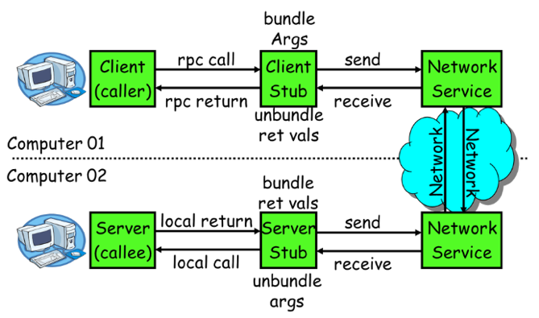
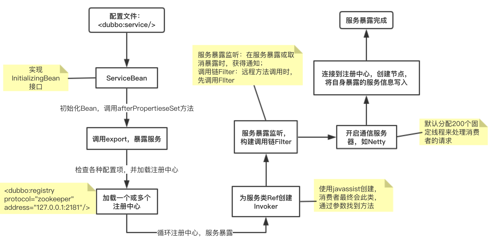

# 1、介绍

是一款高性能、轻量级的开源Java RPC框架，它提供了三大核心能力：Dubbo 提供了六大核心能力
- 面向接口代理的高性能 RPC 调用。
- 智能容错和负载均衡。
- 服务自动注册和发现。
- 高度可扩展能力。
- 运行期流量调度。
- 可视化的服务治理与运维。

dubbo是一个分布式框架，远程服务调用的分布式框架，其核心部分包含：
- 集群容错：提供基于接口方法的透明远程过程调用，包括多协议支持，以及软负载均衡，失败容错，地址路由，动态配置等集群支持。 
- 远程通讯： 提供对多种基于长连接的NIO框架抽象封装，包括多种线程模型，序列化，以及“请求-响应”模式的信息交换方式。 
- 自动发现：基于注册中心目录服务，使服务消费方能动态的查找服务提供方，使地址透明，使服务提供方可以平滑增加或减少机器；

- 服务调用默认是阻塞的，也可以异步调用；
- 默认使用 Hessian 序列化，还有 Duddo、FastJson、Java 自带序列化

## 1.1、基本概念


- 容器Container： 服务运行容器，负责加载、运行服务提供者。必须
- 服务提供者（Provider）：暴露服务的服务提供方，服务提供者在启动时，向注册中心注册自己提供的服务。
- 服务消费者（Consumer）: 调用远程服务的服务消费方，服务消费者在启动时，向注册中心订阅自己所需的服务，服务消费者，从提供者地址列表中，基于软负载均衡算法，选一台提供者进行调用，如果调用失败，再选另一台调用;
- 注册中心（Registry）：注册中心返回服务提供者地址列表给消费者，如果有变更，注册中心将基于长连接推送变更数据给消费者;
- 监控中心（Monitor）：服务消费者和提供者，在内存中累计调用次数和调用时间，定时每分钟发送一次统计数据到监控中心；

调用关系：
- 服务容器负责启动，加载，运行服务提供者。
- 服务提供者在启动时，向注册中心注册自己提供的服务。
- 服务消费者在启动时，向注册中心订阅自己所需的服务。
- 注册中心返回服务提供者地址列表给消费者，如果有变更，注册中心将基于长连接推送变更数据给消费者。
- 服务消费者，从提供者地址列表中，基于软负载均衡算法，选一台提供者进行调用，如果调用失败，再选另一台调用。
- 服务消费者和提供者，在内存中累计调用次数和调用时间，定时每分钟发送一次统计数据到监控中心

## 1.2、Dubbo设计理念

**Invoker**

Invoker 是 Dubbo 领域模型中非常重要的一个概念，简单来说，Invoker 就是 Dubbo 对远程调用的抽象，Invoker 实现了真正的远程服务调用；Invoker 分为
- 服务提供 Invoker
- 服务消费 Invoker

## 1.3、Dubbo常见使用架构


# 2、配置

## 2.1、配置原则

直连配置


- JVM启动：`-D`参数优先，这样可以使用户在部署和启动时进行参数重写，比如在启动时需改变协议的端口。
- XML 次之，如果在 XML 中有配置，则 dubbo.properties 中的相应配置项无效。
- Properties 最后，相当于缺省值，只有 XML 没有配置时，dubbo.properties 的相应配置项才会生效，通常用于共享公共配置，比如应用名。

## 2.2、启动检查

Dubbo 缺省会在启动时检查依赖的服务是否可用，不可用时会抛出异常，阻止 Spring 初始化完成，以便上线时，能及早发现问题，默认`check="true"`。可以通过`check="false"` 关闭检查，比如，测试时，有些服务不关心，或者出现了循环依赖，必须有一方先启动。

另外，如果你的 Spring 容器是懒加载的，或者通过 API 编程延迟引用服务，请关闭 check，否则服务临时不可用时，会抛出异常，拿到 null 引用，如果`check="false"`，总是会返回引用，当服务恢复时，能自动连上;

## 2.3、超时与配置覆盖

由于网络或服务端不可靠，会导致调用出现一种不确定的中间状态（超时）。为了避免超时导致客户端资源（线程）挂起耗尽，必须设置超时时间

- 消费端
    ```xml
    <!-- 全局超时配置 -->
    <dubbo:consumer timeout="5000" />
    <!-- 指定接口以及特定方法超时配置 -->
    <dubbo:reference interface="com.foo.BarService" timeout="2000">
        <dubbo:method name="sayHello" timeout="3000" />
    </dubbo:reference>
    ```

- 服务端
    ```xml
    <!-- 全局超时配置 -->
    <dubbo:provider timeout="5000" />
    <!-- 指定接口以及特定方法超时配置 -->
    <dubbo:provider interface="com.foo.BarService" timeout="2000">
        <dubbo:method name="sayHello" timeout="3000" />
    </dubbo:provider>
    ```

**dubbo推荐在Provider上尽量多配置Consumer端属性**
- 作服务的提供者，比服务使用方更清楚服务性能参数，如调用的超时时间，合理的重试次数，等等
- 在Provider配置后，Consumer不配置则会使用Provider的配置值，即Provider配置可以作为Consumer的缺省值。否则，Consumer会使用Consumer端的全局设置，这对于Provider不可控的，并且往往是不合理的；

**配置的覆盖规则**
- 方法级配置别优于接口级别，即小Scope优先；
- Consumer端配置 优于 Provider配置 优于 全局配置；
- 最后是Dubbo Hard Code的配置值（见配置文档）


## 2.4、重试次数

失败自动切换，当出现失败，重试其它服务器，但重试会带来更长延迟。可通过 retries="2" 来设置重试次数(不含第一次)
```xml
<dubbo:service retries="2" />
<!-- 或 -->
<dubbo:reference retries="2" />
<!-- 或 -->
<dubbo:reference>
    <dubbo:method name="findFoo" retries="2" />
</dubbo:reference>
```

## 2.5、多版本配置（灰度发布）

当一个接口实现，出现不兼容升级时，可以用版本号过渡，版本号不同的服务相互间不引用。可以按照以下的步骤进行版本迁移
- 在低压力时间段，先升级一半提供者为新版本
- 再将所有消费者升级为新版本
- 然后将剩下的一半提供者升级为新版本
```xml
<!-- 老版本服务提供者配置： -->
<dubbo:service interface="com.foo.BarService" version="1.0.0" />
<!-- 新版本服务提供者配置： -->
<dubbo:service interface="com.foo.BarService" version="2.0.0" />

<!-- 老版本服务消费者配置： -->
<dubbo:reference id="barService" interface="com.foo.BarService" version="1.0.0" />
<!-- 新版本服务消费者配置： -->
<dubbo:reference id="barService" interface="com.foo.BarService" version="2.0.0" />
<!-- 如果不需要区分版本，可以按照以下的方式配置： -->
<dubbo:reference id="barService" interface="com.foo.BarService" version="*" />
```

## 2.6、异步调用

基于 NIO 的非阻塞实现并行调用，客户端不需要启动多线程即可完成并行调用多个远程服务，相对多线程开销较小

consumer配置：
```xml
<dubbo:reference id="fooService" interface="com.alibaba.foo.FooService">
      <dubbo:method name="findFoo" async="true" />
</dubbo:reference>
<dubbo:reference id="barService" interface="com.alibaba.bar.BarService">
      <dubbo:method name="findBar" async="true" />
</dubbo:reference>
```

如何调用
```java
// 此调用会立即返回null
fooService.findFoo(fooId);
// 拿到调用的Future引用，当结果返回后，会被通知和设置到此Future
Future<Foo> fooFuture = RpcContext.getContext().getFuture(); 

// 此调用会立即返回null
barService.findBar(barId);
// 拿到调用的Future引用，当结果返回后，会被通知和设置到此Future
Future<Bar> barFuture = RpcContext.getContext().getFuture(); 

// 此时findFoo和findBar的请求同时在执行，客户端不需要启动多线程来支持并行，而是借助NIO的非阻塞完成

// 如果foo已返回，直接拿到返回值，否则线程wait住，等待foo返回后，线程会被notify唤醒
Foo foo = fooFuture.get(); 
// 同理等待bar返回
Bar bar = barFuture.get(); 

// 如果foo需要5秒返回，bar需要6秒返回，实际只需等6秒，即可获取到foo和bar，进行接下来的处理
```
如果你只是想异步，完全忽略返回值，可以配置 return="false"，以减少 Future 对象的创建和管理成本：
`<dubbo:method name="findFoo" async="true" return="false" />`

## 2.7、结果缓存

结果缓存：用于加速热门数据的访问速度，Dubbo 提供声明式缓存，以减少用户加缓存的工作量 

缓存类型：
- lru：基于最近最少使用原则删除多余缓存，保持最热的数据被缓存。
- threadlocal：当前线程缓存，比如一个页面渲染，用到很多 portal，每个 portal 都要去查用户信息，通过线程缓存，可以减少这种多余访问。
- jcache 与 JSR107 集成，可以桥接各种缓存实现

配置：
```xml
<dubbo:reference interface="com.foo.BarService" cache="lru" />
<!-- 或者 -->
<dubbo:reference interface="com.foo.BarService">
    <dubbo:method name="findBar" cache="lru" />
</dubbo:reference>
```
注解形式
```java
@Service(cache = "lru")
```

## 2.8、并发控制与连接控制

- 并发控制：限制服务器并发执行数
    ```xml
    <!-- 限制 com.foo.BarService 的每个方法，服务器端并发执行（或占用线程池线程数）不能超过 10 个：  -->
    <dubbo:service interface="com.foo.BarService" executes="10" />
    
    <!-- 限制 com.foo.BarService 的 sayHello 方法，服务器端并发执行（或占用线程池线程数）不能超过 10 个： -->
    <dubbo:service interface="com.foo.BarService">
        <dubbo:method name="sayHello" executes="10" />
    </dubbo:service>
    
    <!-- 限制 com.foo.BarService 的每个方法，每客户端并发执行（或占用连接的请求数）不能超过 10 个： -->
    <dubbo:service interface="com.foo.BarService" actives="10" />
    <dubbo:reference interface="com.foo.BarService" actives="10" />
    
    <!-- 限制 com.foo.BarService 的 sayHello 方法，每客户端并发执行（或占用连接的请求数）不能超过 10 个： -->
    <dubbo:service interface="com.foo.BarService">
        <dubbo:method name="sayHello" actives="10" />
    </dubbo:service>
    ```
    如果 `<dubbo:service>` 和 `<dubbo:reference>` 都配了actives，`<dubbo:reference>` 优先；

    配置服务的客户端的 loadbalance 属性为 leastactive，此 Loadbalance 会调用并发数最小的 Provider（Consumer端并发数）

- 连接控制：限制服务端或客户端的连接数；

## 2.9、服务分组、分组聚合

- 服务分组：当一个接口有多种实现时，可以用 group 区分
    ```xml
    <!-- 服务声明 -->
    <dubbo:service group="feedback" interface="com.xxx.IndexService" />
    <dubbo:service group="member" interface="com.xxx.IndexService" />
    
    <!-- 服务引用  -->
    <dubbo:reference id="feedbackIndexService" group="feedback" interface="com.xxx.IndexService" />
    <dubbo:reference id="memberIndexService" group="member" interface="com.xxx.IndexService" />
    
    <!-- 任意 -->
    <dubbo:reference id="barService" interface="com.foo.BarService" group="*" />
    ```
    可以用来区分正式与非正式环境

## 2.10、本地存根、本地伪装

- 本地存根

    远程服务后，客户端通常只剩下接口，而实现全在服务器端，但提供方有些时候想在客户端也执行部分逻辑，比如：做 ThreadLocal 缓存，提前验证参数，调用失败后伪造容错数据等等，此时就需要在 API 中带上 Stub，客户端生成 Proxy 实例，会把 Proxy 通过构造函数传给 Stub 1，然后把 Stub 暴露给用户，Stub 可以决定要不要去调 Proxy。类似静态代理

    

- 本地伪装

    本地伪装通常用于服务降级，比如某验权服务，当服务提供方全部挂掉后，客户端不抛出异常，而是通过 Mock 数据返回授权失败

Mock 是 Stub 的一个子集，便于服务提供方在客户端执行容错逻辑，因经常需要在出现 RpcException (比如网络失败，超时等)时进行容错，而在出现业务异常(比如登录用户名密码错误)时不需要容错，如果用 Stub，可能就需要捕获并依赖 RpcException 类，而用 Mock 就可以不依赖 RpcException，因为它的约定就是只有出现 RpcException 时才执行

## 2.11、隐式参数

可以通过 RpcContext 上的 setAttachment 和 getAttachment 在服务消费方和提供方之间进行参数的隐式传递。

注意：path、group、version、dubbo、token、timeout 几个 key 是保留字段，请使用其它值

## 2.12、线程模型

- 如果事件处理的逻辑能迅速完成，并且不会发起新的 IO 请求，比如只是在内存中记个标识，则直接在 IO 线程上处理更快，因为减少了线程池调度。

- 但如果事件处理逻辑较慢，或者需要发起新的 IO 请求，比如需要查询数据库，则必须派发到线程池，否则 IO 线程阻塞，将导致不能接收其它请求。

- 如果用 IO 线程处理事件，又在事件处理过程中发起新的 IO 请求，比如在连接事件中发起登录请求，会报“可能引发死锁”异常，但不会真死锁

需要通过不同的派发策略和不同的线程池配置的组合来应对不同的场景：
```xml
<dubbo:protocol name="dubbo" dispatcher="all" threadpool="fixed" threads="100" />
```

Dispatcher
- `all` 所有消息都派发到线程池，包括请求，响应，连接事件，断开事件，心跳等。
- `direct` 所有消息都不派发到线程池，全部在 IO 线程上直接执行。
- `message` 只有请求响应消息派发到线程池，其它连接断开事件，心跳等消息，直接在 IO 线程上执行。
- `execution` 只有请求消息派发到线程池，不含响应，响应和其它连接断开事件，心跳等消息，直接在 IO 线程上执行。
- `connection` 在 IO 线程上，将连接断开事件放入队列，有序逐个执行，其它消息派发到线程池。

ThreadPool
- `fixed` 固定大小线程池，启动时建立线程，不关闭，一直持有。(缺省)
- `cached` 缓存线程池，空闲一分钟自动删除，需要时重建。
- `limited` 可伸缩线程池，但池中的线程数只会增长不会收缩。只增长不收缩的目的是为了避免收缩时突然来了大流量引起的性能问题。
- `eager` 优先创建`Worker`线程池。在任务数量大于`corePoolSize`但是小于`maximumPoolSize`时，优先创建`Worker`来处理任务。当任务数量大于`maximumPoolSize`时，将任务放入阻塞队列中。阻塞队列充满时抛出`RejectedExecutionException`。(相比于`cached`:`cached`在任务数量超过`maximumPoolSize`时直接抛出异常而不是将任务放入阻塞队列)

# 3、高可用与服务治理

## 3.1、zookeeper宕机与dubbo直连

- 现象：zookeeper注册中心宕机，还可以消费dubbo暴露的服务

- 健壮性
    - 监控中心宕掉不影响使用，只是丢失部分采样数据；因为启动Dubbo时，消费者会从zk拉取注册的生产者的地址接口等数据缓存到本地
    - 数据库宕掉后，注册中心仍能通过缓存提供服务列表查询，但不能注册新服务
    - 注册中心对等集群，任意一台宕掉后，将自动切换到另一台
    - 注册中心全部宕掉后，服务提供者和服务消费者仍能通过本地缓存通讯
    - 服务提供者无状态，任意一台宕掉后，不影响使用
    - 服务提供者全部宕掉后，服务消费者应用将无法使用，并无限次重连等待服务提供者恢复

通过设计，减少系统不能提供服务的时间
- dubbo直连：直接在消费端上配置服务提供方的地址；
- 服务失效踢出基于 zookeeper 的临时节点原理

**Dubbo和Eureka中服务发现的不同：**
- Dubbo里的注册中心、Provider和Consumer三者之间都是长连接，借助于Zookeeper的高吞吐量，实现基于服务端的服务发现机制。因此Dubbo利用`Zookeeper+发布订阅模型`可以很快将服务节点的上线和下线同步到Consumer集群。如果服务提供者宕机，那么注册中心的长连接会立马感知到这个事件，并且立即推送通知到消费者。
- 在服务发现的做法上Dubbo和Eureka有很大的不同，Eureka使用客户端的服务发现机制，因此对服务列表的变动响应会稍慢，比如在某台机器下线以后，在一段时间内可能还会陆续有服务请求发过来，当然这些请求会收到Service Unavailable的异常，需要借助Ribbon或Hystrix实现重试或者降级措施。
- 对于注册中心宕机的情况，Dubbo和Eureka的处理方式相同，这两个框架的服务节点都在本地缓存了服务提供者的列表，因此仍然可以发起调用，但服务提供者列表无法被更新，因此可能导致本地缓存的服务状态与实际情况有别；

## 3.2、负载均衡

在集群负载均衡时，Dubbo 提供了多种均衡策略，`默认为随机调用`
- `RandomLoadBalance`：随机，按权重设置随机概率，在一个截面上碰撞的概率高，但调用量越大分布越均匀，而且按概率使用权重后也比较均匀，有利于动态调整提供者权重；
- `RoundRobinLoadBalance`：轮循，按公约后的权重设置轮循比率。存在慢的提供者累积请求的问题，比如：第二台机器很慢，但没挂，当请求调到第二台时就卡在那，久而久之，所有请求都卡在调到第二台上；
- `LeastActiveLoadBalance`：最少活跃调用数，相同活跃数的随机，活跃数指调用前后计数差。使慢的提供者收到更少请求，因为越慢的提供者的调用前后计数差会越大。
- `ConsistentHashLoadBalance`：一致性 Hash，相同参数的请求总是发到同一提供者。当某一台提供者挂时，原本发往该提供者的请求，基于虚拟节点，平摊到其它提供者，不会引起剧烈变动。[一致性Hash算法](http://en.wikipedia.org/wiki/Consistent_hashing)参见：缺省只对第一个参数 Hash，如果要修改，请配置 `<dubbo:parameter key="hash.arguments" value="0,1" />`；缺省用 `160` 份虚拟节点，如果要修改，请配置 `<dubbo:parameter key="hash.nodes" value="320" />`

负载配置有如下几种方式：
- 服务端服务级别：`<dubbo:service interface="..." loadbalance="roundrobin" />`
- 客户端服务级别：`<dubbo:reference interface="..." loadbalance="roundrobin" />`
- 服务端方法级别：
    ```xml
    <dubbo:service interface="...">
        <dubbo:method name="..." loadbalance="roundrobin"/>
    </dubbo:service>
    ```
- 客户端方法级别：
    ```xml
    <dubbo:reference interface="...">
        <dubbo:method name="..." loadbalance="roundrobin"/>
    </dubbo:reference>
    ```

负载均衡除还可以自行进行扩展，已有的扩展：
```
random=org.apache.dubbo.rpc.cluster.loadbalance.RandomLoadBalance
roundrobin=org.apache.dubbo.rpc.cluster.loadbalance.RoundRobinLoadBalance
leastactive=org.apache.dubbo.rpc.cluster.loadbalance.LeastActiveLoadBalance
consistenthash=org.apache.dubbo.rpc.cluster.loadbalance.ConsistentHashLoadBalance
```
扩展的接口：`org.apache.dubbo.rpc.cluster.LoadBalance`，扩展需要的工程目录：
```
src
 |-main
    |-java
        |-com
            |-xxx
                |-XxxLoadBalance.java (实现LoadBalance接口)
    |-resources
        |-META-INF
            |-dubbo
                |-org.apache.dubbo.rpc.cluster.LoadBalance (纯文本文件，内容为：xxx=com.xxx.XxxLoadBalance)
```

## 3.3、服务降级

> 2.2.0 以上版本支持

当服务器压力剧增的情况下，根据实际业务情况及流量，对一些服务和页面有策略的不处理或换种简单的方式处理，从而释放服务器资源以保证核心交易正常运作或高效运作。可以通过服务降级功能临时屏蔽某个出错的非关键服务，并定义降级后的返回策略

向注册中心写入动态配置覆盖规则：
```java
RegistryFactory registryFactory = ExtensionLoader.getExtensionLoader(RegistryFactory.class).getAdaptiveExtension();
Registry registry = registryFactory.getRegistry(URL.valueOf("zookeeper://10.20.153.10:2181"));
registry.register(URL.valueOf("override://0.0.0.0/com.foo.BarService?category=configurators&dynamic=false&application=foo&mock=force:return+null"));
```
- `mock=force:return+null` 表示消费方对该服务的方法调用都直接返回 null 值，不发起远程调用。用来屏蔽不重要服务不可用时对调用方的影响。
- 还可以改为 `mock=fail:return+null` 表示消费方对该服务的方法调用在失败后，再返回 null 值，不抛异常。用来容忍不重要服务不稳定时对调用方的影响

或者配置：
```java
@Reference(loadbalance = "roundrobin", timeout = 1000, check = false, mock = "fail:return null")
private OrderService orderService;

@Reference(loadbalance = "roundrobin", timeout = 1000, check = false, mock = "fail:return null")
private PayService payService;
```
原理：InvokerInvocationHandler中的invoker成员变量为MockClusterInvoker，它来处理服务降级的逻辑；

在MockClusterInvoker中，从no mock(正常情况),force:direct mock(屏蔽),fail-mock(容错)三种情况我们也可以看出,普通情况是直接调用,容错的情况是调用失败后,返回一个设置的值.而屏蔽就很暴力了,直接连调用都不调用,就直接返回一个之前设置的值.从下面的注释中可以看出，如果没有降级，会执行this.invoker.invoke(invocation)方法进行远程调动，默认类是FailoverClusterInvoker，它会执行集群模块的逻辑，主要是调用Directory#list方法获取所有该服务提供者的地址列表，然后将多个服务提供者聚合成一个Invoker， 并调用 Router 的 route 方法进行路由，过滤掉不符合路由规则的 Invoker。当 FailoverClusterInvoker 拿到 Directory 返回的 Invoker 列表后，它会通过 LoadBalance 从 Invoker 列表中选择一个 Invoker。最后 FailoverClusterInvoker 会将参数传给 LoadBalance 选择出的 Invoker 实例的 invoke 方法，进行真正的远程调用；

## 3.4、集群容错

在集群调用失败时，Dubbo 提供了多种容错方案，缺省为 failover 重试
- `Failover Cluster`：失败自动切换，当出现失败，重试其它服务器。通常用于读操作，但重试会带来更长延迟。可通过 retries="2" 来设置重试次数(不含第一次)。
    ```xml
    <!-- 重试次数配置如下： -->
    <dubbo:service retries="2" />
    <!-- 或 -->
    <dubbo:reference retries="2" />
    <!-- 或 -->
    <dubbo:reference>
        <dubbo:method name="findFoo" retries="2" />
    </dubbo:reference>
    ```
- `Failfast Cluster`：快速失败，只发起一次调用，失败立即报错。通常用于非幂等性的写操作，比如新增记录。
- `Failsafe Cluster`：失败安全，出现异常时，直接忽略。通常用于写入审计日志等操作。
- `Failback Cluster`：失败自动恢复，后台记录失败请求，定时重发。通常用于消息通知操作。
- `Forking Cluster`：并行调用多个服务器，只要一个成功即返回。通常用于实时性要求较高的读操作，但需要浪费更多服务资源。可通过 forks="2" 来设置最大并行数。
- `Broadcast Cluster`：广播调用所有提供者，逐个调用，任意一台报错则报错 [2]。通常用于通知所有提供者更新缓存或日志等本地资源信息。

集群模式配置，按照以下示例在服务提供方和消费方配置集群模式
```xml
<dubbo:service cluster="failsafe" />
<!-- 或 -->
<dubbo:reference cluster="failsafe" />
```
- 读操作建议使用 Failover 失败自动切换，默认重试两次其他服务器；
- 写操作建议使用 Failfast 快速失败，发一次调用失败就立即报错，确保幂等性；

## 3.5、整合Hystrix


## 3.6、服务治理

服务治理包括但不限于服务注册、服务发现、服务监控等

- 应用级别的服务治理
- 标签路由
- 条件路由
- 黑白名单
- 动态配置
- 权重调节
- 负载均衡

# 4、Dubbo原理

## 4.1、RPC原理



一次完整的RPC调用流程（同步调用，异步另说）如下： 
- （1）服务消费方（client）调用以本地调用方式调用服务； 
- （2）client stub接收到调用后负责将方法、参数等组装成能够进行网络传输的消息体； 
- （3）client stub找到服务地址，并将消息发送到服务端； 
- （4）server stub收到消息后进行解码； 
- （5）server stub根据解码结果调用本地的服务； 
- （6）本地服务执行并将结果返回给server stub； 
- （7）server stub将返回结果打包成消息并发送至消费方； 
- （8）client stub接收到消息，并进行解码； 
- （9）服务消费方得到最终结果。

RPC框架的目标就是要`2~8`这些步骤都封装起来，这些细节对用户来说是透明的，不可见的。

## 4.2、netty通信原理

Netty是一个异步事件驱动的网络应用程序框架， 用于快速开发可维护的高性能协议服务器和客户端。它极大地简化并简化了TCP和UDP套接字服务器等网络编程


## 4.3、Dubbo架构


- config 配置层：对外配置接口，以 `ServiceConfig, ReferenceConfig` 为中心，可以直接初始化配置类，也可以通过 spring 解析配置生成配置类
- proxy 服务代理层：服务接口透明代理，生成服务的客户端 Stub 和服务器端 `Skeleton`, 以 `ServiceProxy` 为中心，扩展接口为 `ProxyFactory`
- registry 注册中心层：封装服务地址的注册与发现，以服务 URL 为中心，扩展接口为 `RegistryFactory, Registry, RegistryService`
- cluster 路由层：封装多个提供者的路由及负载均衡，并桥接注册中心，以 Invoker 为中心，扩展接口为 `Cluster, Directory, Router, LoadBalance`
- monitor 监控层：RPC 调用次数和调用时间监控，以 Statistics 为中心，扩展接口为 `MonitorFactory, Monitor, MonitorService`
- protocol 远程调用层：封装 RPC 调用，以 Invocation, Result 为中心，扩展接口为 `Protocol, Invoker, Exporter`
- exchange 信息交换层：封装请求响应模式，同步转异步，以 Request, Response 为中心，扩展接口为 `Exchanger, ExchangeChannel, ExchangeClient, ExchangeServer`
- transport 网络传输层：抽象 mina 和 netty 为统一接口，以 Message 为中心，扩展接口为 `Channel, Transporter, Client, Server, Codec`
- serialize 数据序列化层：可复用的一些工具，扩展接口为 `Serialization, ObjectInput, ObjectOutput, ThreadPool`

## 4.4、dubbo初始化

- 解析配置文件：xml解析类：`com.alibaba.dubbo.config.spring.schema.DubboBeanDefinitionParser`
- 查找命名空间：大部分时候会走到parseCustomElement(ele); 它通过获取配置文件中的namespaceUri，来获得NamespaceHandler，然后调用其parse方法，完成对Bean的注册；

    dubbo的jar包下有个文件：META-INF/spring.handlers：
    ```
    http\://dubbo.apache.org/schema/dubbo=com.alibaba.dubbo.config.spring.schema.DubboNamespaceHandler
    http\://code.alibabatech.com/schema/dubbo=com.alibaba.dubbo.config.spring.schema.DubboNamespaceHandler
    ```
    namespaceUri为`http://dubbo.apache.org/schema/dubbo`就对应`com.alibaba.dubbo.config.spring.schema.DubboNamespaceHandler`处理类。Spring会通过反射，实例化DubboNamespaceHandler对象，调用其初始化方法init()

    ```java
    public class DubboNamespaceHandler extends NamespaceHandlerSupport {
        static {
            Version.checkDuplicate(DubboNamespaceHandler.class);
        }
        @Override
        public void init() {
            registerBeanDefinitionParser("application", new DubboBeanDefinitionParser(ApplicationConfig.class, true));
            registerBeanDefinitionParser("module", new DubboBeanDefinitionParser(ModuleConfig.class, true));
            registerBeanDefinitionParser("registry", new DubboBeanDefinitionParser(RegistryConfig.class, true));
            registerBeanDefinitionParser("monitor", new DubboBeanDefinitionParser(MonitorConfig.class, true));
            registerBeanDefinitionParser("provider", new DubboBeanDefinitionParser(ProviderConfig.class, true));
            registerBeanDefinitionParser("consumer", new DubboBeanDefinitionParser(ConsumerConfig.class, true));
            registerBeanDefinitionParser("protocol", new DubboBeanDefinitionParser(ProtocolConfig.class, true));
            registerBeanDefinitionParser("service", new DubboBeanDefinitionParser(ServiceBean.class, true));
            registerBeanDefinitionParser("reference", new DubboBeanDefinitionParser(ReferenceBean.class, false));
            registerBeanDefinitionParser("annotation", new AnnotationBeanDefinitionParser());
        }
    }
    ```

**Dubbo的初始化是随着Spring容器Bean的实例化而进行的**

## 4.5、dubbo服务暴露

Dubbo服务暴露流程：



时序图：


每个service方法的配置会解析成对应的 `com.alibaba.dubbo.config.spring.ServiceBean<T>` 类的实例。ServiceBean 实现`InitializingBean，DisposableBean`，实现对象初始化和销毁方法。对象实例化后对服务进行注册到注册中心、暴露服务。服务注册和暴露在方法afterPropertiesSet执行。组装好服务URL各种信息，最终委托对应协议暴露服务；

大概的过程：
- 首先 Provider 启动，通过 Proxy 组件根据具体的协议 Protocol 将需要暴露出去的接口封装成 Invoker，Invoker 是 Dubbo 一个很核心的组件，代表一个可执行体。
- 然后再通过 Exporter 包装一下，这是为了在注册中心暴露自己套的一层，然后将 Exporter 通过 Registry 注册到注册中心。 这就是整体服务暴露过程；

ServiceBean拿到Dubbo中的应用信息、注册信息、协议信息等，设置到变量中
```java
public void afterPropertiesSet() throws Exception {
	if (getProvider() == null) {
		//......
	}
	if (getApplication() == null
			&& (getProvider() == null || getProvider().getApplication() == null)) {
		//......
	}
	if (getModule() == null
			&& (getProvider() == null || getProvider().getModule() == null)) {
		//......
	}
	if ((getRegistries() == null || getRegistries().isEmpty())) {
		//......
	}
	if ((getProtocols() == null || getProtocols().isEmpty())
			&& (getProvider() == null || getProvider().getProtocols() == null || 
			getProvider().getProtocols().isEmpty())) {
		//......
	}
	if (getPath() == null || getPath().length() == 0) {
		if (beanName != null && beanName.length() > 0
				&& getInterface() != null && getInterface().length() > 0
				&& beanName.startsWith(getInterface())) {
			setPath(beanName);
		}
	}
	if (!isDelay()) {
		export();
	}
}
```
在Spring 上下文刷新事件后被调用到，它是服务暴露的入口方法
```java
public void onApplicationEvent(ContextRefreshedEvent event) {
	//是否有延迟暴露 && 是否已暴露 && 是不是已被取消暴露
	if (isDelay() && !isExported() && !isUnexported()) {
		if (logger.isInfoEnabled()) {
			logger.info("The service ready on spring started. service: " + getInterface());
		}
		//暴露服务
		export();
	}
}
```
Dubbo在暴露服务之前，要检查各种配置、设置参数信息，还要补充一些缺省的配置项，然后封装URL对象信息 。在这里，我们必须重视URL对象，Dubbo 使用 URL 作为配置载体，所有的拓展点都是通过 URL 获取配置

## 4.6、服务引用


## 4.7、服务调用

- 服务提供方发布服务到服务注册中心；
- 服务消费方从服务注册中心订阅服务；
- 服务消费方调用已经注册的可用服务


`<dubbo:reference interface="com.blue.fish.dubbo.service.UserService" id="userService"/>`，其中userService实例其实是代理工厂生产的代理对象；

- 首先消费者启动会向注册中心拉取服务提供者的元信息，然后调用流程从 Proxy 开始；
- Proxy 持有一个 Invoker 对象，调用 invoke 之后需要通过 Cluster 先从 Directory 获取所有可调用的远程服务的 Invoker 列表，如果配置了某些路由规则，比如某个接口只能调用某个节点的那就再过滤一遍 Invoker 列表。
- 剩下的 Invoker 再通过 LoadBalance 做负载均衡选取一个。然后再经过 Filter 做一些统计什么的，再通过 Client 做数据传输，比如用 Netty 来传输。
- 传输需要经过 Codec 接口做协议构造，再序列化。最终发往对应的服务提供者；
- 服务提供者接收到之后也会进行 Codec 协议处理，然后反序列化后将请求扔到线程池处理。某个线程会根据请求找到对应的 Exporter，而找到 Exporter 其实就是找到了 Invoker，但是还会有一层层 Filter，经过一层层过滤链之后最终调用实现类然后原路返回结果；

# 5、Dubbo的序列化协议与通信协议

## 5.1、Dubbo支持的序列化协议

Dubbo 支持多种序列化方式：JDK 自带的序列化、hessian2、JSON、Kryo、FST、Protostuff，ProtoBuf 等等。但是hessian是其默认的序列化协议

在Dubbo中也可以使用高效的Java序列化（[Kryo](https://www.cnkirito.moe/rpc-serialize-1/) 和 FST）

一般不会直接使用 JDK 自带的序列化方式。主要原因有两个：
- 不支持跨语言调用 : 如果调用的是其他语言开发的服务的时候就不支持了；
- 性能差：相比于其他序列化框架性能更低，主要原因是序列化之后的字节数组体积较大，导致传输成本加大；

另外JSON 序列化由于性能问题，我们一般也不会考虑使用

## 5.2、hessian序列化协议

Hessian是一种轻量、快速的web协议。Hessian的Web通讯协议中实际上包含了Hessian序列化的内容，但Hessian序列化协议又不仅可以用于Hessian通讯协议

- Hessian的对象有八种原始类型：
    ```
    原生二进制数据
    Boolean
    64位毫秒值的日期
    64位double
    32位int
    64位long
    null
    utf-8的string
    
    它有三种循环的类型：
    
    list for lists and arrays
    map for maps and dictionaries
    object for objects
    
    最后，他有一种特殊组成：共享和循环对象引用
    ```

## 5.3、Protobuf序列化协议

Protocol Buffers是一种轻便高效的结构化数据存储格式，可以用于结构化数据串行化，或者说序列化。它很适合做数据存储或数据交换格式。可用于通讯协议、数据存储等领域的语言无关、平台无关、可扩展的序列化结构数据格式

性能表现在：
- 它使用 proto 编译器，自动进行序列化和反序列化，速度非常快，解析速度非常快，比对应的XML快约20-100倍；
- 它的数据压缩效果好，序列化数据非常简洁，紧凑，与XML相比，其序列化之后的数据量约为1/3到1/10。因为体积小，传输起来带宽和速度上会有优化。
- 但是Protobuf 不适合用来对基于文本的标记文档

## 5.4、Dubbo通信协议

- `dubbo://`：使用基于 mina 1.1.7 和 hessian 3.2.1 的 tbremoting 交互
    - Dubbo 缺省协议，采用单一长连接和 NIO 异步通讯，适合于小数据量大并发的服务调用，以及服务消费者机器数远大于服务提供者机器数的情况；
    - Dubbo 缺省协议，不适合传送大数据量的服务，比如传文件，传视频等，除非请求量很低；

    特点：
    - 连接个数：单连接
    - 连接方式：长连接
    - 传输协议：TCP
    - 传输方式：NIO 异步传输
    - 序列化：Hessian 二进制序列化
    - 适用范围：传入传出参数数据包较小（建议小于100K），消费者比提供者个数多，单一消费者无法压满提供者，尽量不要用 dubbo 协议传输大文件或超大字符串。
    - 适用场景：常规远程服务方法调用

- `rmi://`：RMI 协议采用 JDK 标准的 java.rmi.* 实现，采用阻塞式短连接和 JDK 标准序列化方式。dubbo 不会依赖这个包，请排查自己的应用有没有使。使用java二进制序列化

- `hessian://`：Hessian协议用于集成 Hessian 的服务，Hessian 底层采用 Http 通讯，采用 Servlet 暴露服务，Dubbo 缺省内嵌 Jetty 作为服务器实现。

    Dubbo 的 Hessian 协议可以和原生 Hessian 服务互操作，即：
    - 提供者用 Dubbo 的 Hessian 协议暴露服务，消费者直接用标准 Hessian 接口调用
    - 或者提供方用标准 Hessian 暴露服务，消费方用 Dubbo 的 Hessian 协议调用

- `http://`：基于 HTTP 表单的远程调用协议，采用 Spring 的 HttpInvoker 实现。走json序列化

    如果使用 servlet 派发请求：
    - 协议的端口` <dubbo:protocol port="8080" />` 必须与 servlet 容器的端口相同，
    - 协议的上下文路径 `<dubbo:protocol contextpath="foo" />` 必须与 servlet 应用的上下文路径相同

- `webservice://`：基于 WebService 的远程调用协议，基于 Apache CXF的 frontend-simple 和 transports-http 实现。走SOAP文本序列化
    可以和原生 WebService 服务互操作，即：
    - 提供者用 Dubbo 的 WebService 协议暴露服务，消费者直接用标准 WebService 接口调用，
    - 或者提供方用标准 WebService 暴露服务，消费方用 Dubbo 的 WebService 协议调用

- `thrift://`：当前 dubbo 支持的 thrift 协议是对 thrift 原生协议的扩展，在原生协议的基础上添加了一些额外的头信息，比如 service name，magic number 等。
    使用 dubbo thrift 协议同样需要使用 thrift 的 idl compiler 编译生成相应的 java 代码，后续版本中会在这方面做一些增强

- `memcached://`：基于 memcached 实现的 RPC 协议。

- `redis://`：基于 Redis 实现的 RPC 协议。

- `rest://`：基于标准的Java REST API——JAX-RS 2.0（Java API for RESTful Web Services的简写）实现的REST调用支持

# 6、Dubbo扩展点加载机制

[Dubbo扩展点加载](../../源码分析/框架/Dubbo.md#2Dubbo扩展点加载机制)

# 7、Filter

Dubbo的Filter实现入口是在`ProtocolFilterWrapper`，因为`ProtocolFilterWrapper`是Protocol的包装类，所以会在加载的Extension的时候被自动包装进来
```java
@Override
public <T> Exporter<T> export(Invoker<T> invoker) throws RpcException {
    // 向注册中心引用服务的时候并不会进行filter调用链
    if (REGISTRY_PROTOCOL.equals(invoker.getUrl().getProtocol())) {
        return protocol.export(invoker);
    }
    return protocol.export(buildInvokerChain(invoker, SERVICE_FILTER_KEY, CommonConstants.PROVIDER));
}

@Override
public <T> Invoker<T> refer(Class<T> type, URL url) throws RpcException {
    if (REGISTRY_PROTOCOL.equals(url.getProtocol())) {
        return protocol.refer(type, url);
    }
    return buildInvokerChain(protocol.refer(type, url), REFERENCE_FILTER_KEY, CommonConstants.CONSUMER);
}
// 
private static <T> Invoker<T> buildInvokerChain(final Invoker<T> invoker, String key, String group) {
    Invoker<T> last = invoker;
    // 获得所有激活的Filter（已经排好序的）
    List<Filter> filters = ExtensionLoader.getExtensionLoader(Filter.class).getActivateExtension(invoker.getUrl(), key, group);
    if (!filters.isEmpty()) {
        for (int i = filters.size() - 1; i >= 0; i--) {
            final Filter filter = filters.get(i);
             //复制引用，构建filter调用链
            final Invoker<T> next = last;
            //这里只是构造一个最简化的Invoker作为调用链的载体Invoker
            last = new Invoker<T>() {
                @Override
                public Class<T> getInterface() {
                    return invoker.getInterface();
                }
                @Override
                public URL getUrl() {
                    return invoker.getUrl();
                }
                @Override
                public boolean isAvailable() {
                    return invoker.isAvailable();
                }
                @Override
                public Result invoke(Invocation invocation) throws RpcException {
                    Result result = filter.invoke(next, invocation);
                    if (result instanceof AsyncRpcResult) {
                        AsyncRpcResult asyncResult = (AsyncRpcResult) result;
                        asyncResult.thenApplyWithContext(r -> filter.onResponse(r, invoker, invocation));
                        return asyncResult;
                    } else {
                        return filter.onResponse(result, invoker, invocation);
                    }
                }
                @Override
                public void destroy() {
                    invoker.destroy();
                }
                @Override
                public String toString() {
                    return invoker.toString();
                }
            };
        }
    }
    return last;
}
```
通过获取所有可以被激活的Filter链，然后根据一定顺序构造出一个Filter的调用链，最后的调用链大致是这样子：Filter1->Filter2->Filter3->......->Invoker

- Dubbo安全机制：dubbo 通过 token 令牌防止用户绕过注册中心直连，然后在注册中心管理授权，dubbo 提供了黑白名单，控制服务所允许的调用方；主要是通过`TokenFilter`来实现的

# 8、Dubbo Monitor与Dubbo Admin

# 9、Dubbo使用注意点

## 9.1、父类与子类具有相同的属性

按照下列属性反序列化时会拿不到id属性
```java
@Data
public class BaseDTO implements Serializable {
    private Long id;
}

@Data
public class WordDTO extends BaseDTO {
    private Long id;
    private String uuid;
    private Long timestamp;
    private String word;
}
```
因为dubbo默认采用的是hessian序列化&反序列化方式，JavaDeserializer在获取fileds时，采用了Map去重。但是在读取值时，根据serializer的顺序，对于同名字段，子类的该字段值会被赋值两次，总是被父类的值覆盖，导致子类的字段值丢失；**建议父类与子类不要有同名属性；**

## 9.2、自定义异常被包装成RuntimeException

如果Provider中的api和自定义Exception定义都是在一个api.jar中，那么是不会有任何问题的。但是如果自定义Exception是在一个单独的比如common.jar包中就会出现这个问题（此时api和model在另一个api.jar中）
```java
try {
    String hello = demoService.saySomething(wordDTO);
    System.out.println(hello);
}catch (WrongArgumentException e){
    System.err.println("wrong argument 1: " + e.getMessage());
}catch (RuntimeException e){
    System.err.println("wrong argument 2: " + e.getMessage());
}
```
但是，调用的日志却是如下所示，通过日志我们可以发现，在Consumer中并没有捕获到自定义的WrongArgumentException异常，只能捕获到RuntimeException中的异常，且这个异常信息是封装自定义的WrongArgumentException异常：

因为dubbo Provider的ExceptionFilter.java对异常统一封装导致的。当碰到如下这些情况时，dubbo会直接抛出异常：

- 如果是checked异常（不是RuntimeException但是是Exception.java类型的异常），直接抛出；
- 在方法签名上有声明（例如String saySomething()throws MyException ），直接抛出；
- 异常类和接口类在同一jar包里，直接抛出；
- 是JDK自带的异常（全类名以java或者javax开头，例如java.lang.IllegalStateException），直接抛出；
- 是Dubbo本身的异常RpcException，直接抛出；

否则，Dubbo通过如下代码将异常包装成RuntimeException抛给客户端：
```return new RpcResult(new RuntimeException(StringUtils.toString(exception)));```

如果要让Provider抛出自定义异常，有如下几个解决办法：
- 将自定义异常和接口类放到一个包中即可（推荐）；
- 方法签名上申明自定义异常；
        
# 10、Dubbo中设计模式

## 10.1、模板模式

Dubbo的整个注册中心逻辑部分使用了模板模式，AbstractRegistry实现了 Registry接口的注册、订阅、查询、通知等方法，还实现了磁盘文件持久化注册信息这一通用方法。但是注册、订阅、查询、通知等方法只是简单的把URL加入到对应的集合，没有具体的注册或订阅逻辑；

FailbackRegistry 又继承了 AbstractRegistry，重写了父类的注册、订阅、查询、通知等方法，并且添加了重试机制，此外，还添加了四个未实现的抽象模板方法：
```java
public abstract void doRegister(URL url);
public abstract void doUnregister(URL url);
public abstract void doSubscribe(URL url, NotifyListener listener);
public abstract void doUnsubscribe(URL url, NotifyListener listener);
```

## 10.2、工厂模式

所有注册中心实现，都是通过对应的工厂创建的；

每种注册中心都有对应的工厂类，具体调用哪个工厂实现类，其答案在：RegistryFactory
```java
@SPI("dubbo")
public interface RegistryFactory {
    // 基于 adaptive注解实现具体调用的工厂类
    @Adaptive({"protocol"})
    Registry getRegistry(URL url);
}
```

# 参考资料

* [Dubbo文档](http://dubbo.apache.org/zh-cn/index.html)
* [Dubbo源码](https://github.com/apache/incubator-dubbo)