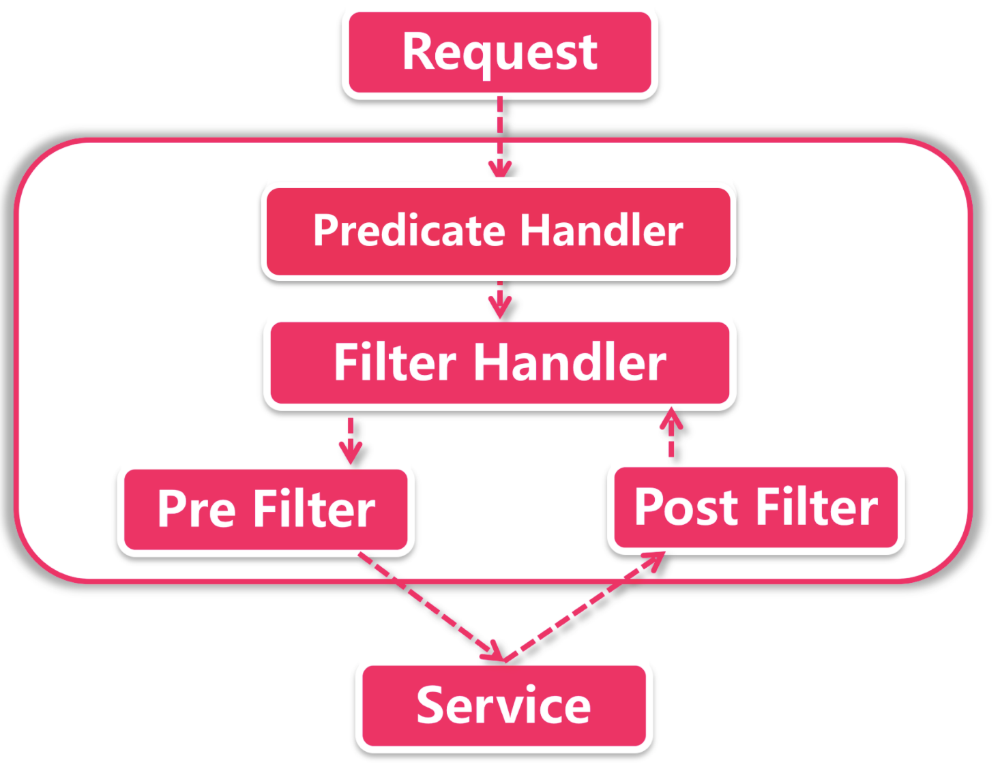

# 一、SpringCloud Gateway

- [一次Gateway调用过程](https://segmentfault.com/a/1190000040996359)
- [Gateway使用示例](https://github.com/chenlanqing/spring-gateway-tutorial)
- [Gateway Plugin](https://github.com/chenggangpro/spring-cloud-gateway-plugin)

## 1、概述

业务场景
- 路由寻址；
- 负载均衡（使用Ribbon或者LoadBalancer）；
- 限流
- 鉴权

与zuul对比：
- gateway是spring官方维护的，zuul是Netflix维护的；
- 性能：gateway底层使用的是netty；zuul同步阻塞的，性能慢；
- RPS：gateway大概是32000/s；zuul大概是20000左右；
- 长连接：gateway支持长连接；zuul不支持长连接；

Gateway 本身是一个 Spring Boot 应用，它处理请求是逻辑是根据配置的路由对请求进行预处理和转发。Gateway 有几个比较核心的概念：
- Route: 一个 Route 由路由 ID、转发 URI、多个 Predicates 以及多个 Filters 构成。Gateway 上可以配置多个 Routes。处理请求时会按优先级排序，找到第一个满足所有 Predicates 的 Route，并不是找到所有的；
- Predicate: 表示路由的匹配条件，可以用来匹配请求的各种属性，如请求路径、方法、header 等。一个 Route 可以包含多个子 Predicates，多个子 Predicates 最终会合并成一个。
- Filter: 过滤器包括了处理请求和响应的逻辑，可以分为 pre 和 post 两个阶段。多个 Filter 在 pre 阶段会按优先级高到低顺序执行，post 阶段则是反向执行。Gateway 包括两类 Filter  
    - 全局 Filter: 每种全局 Filter 全局只会有一个实例，会对所有的 Route 都生效。
    - 路由 Filter: 路由 Filter 是针对 Route 进行配置的，不同的 Route 可以使用不同的参数，因此会创建不同的实例

## 2、gateway体系架构

gateway的自动装配工厂：GatewayAutoConfiguration，可以看到其是使用netty的；netty在gateway中主要应用的地方：
- 发起服务调用：由 NettyRoutingFilter 过滤器实现，底层采用基于Netty的 HttpClient发起外部服务的调用；
- Response传输：由 NettyWriteResponseFilter 过滤器实现，网络请求结束后要将 Response 回传给调用者；
- Socket连接：具体由 ReactorNettyWebSocketClient 类承接，通过 Netty 的HTTPClient发起连接请求；

在gateway中发起request和回传response之类的步骤都是通过一系列过滤器完成的；

Client发起请求到服务网关之后，由NettyRoutingFilter底层的HttpClient（也是Netty组件）向服务发起调用，调用结束后的Response由NettyResponseFilter再回传给客户端。有了Netty的加持，网络请求效率大幅提升（Zuul 1.x还是使用Servlet，在2.x版本才移步到Netty）由此可见，Netty贯穿了从Request发起到Response结束的过程，承担了所有和网络调用相关的任务。

## 3、gateway自动装配

gateway在自动装配时需要加载如下资源：
- AutoConfig：作为核心自动装配主类，GatewayAutoConfiguration 负责初始化所有的Route路由规则，Predicate断言工厂和Filter（包括GlobalFilter 和 RouteFilter），用来完成路由功能。AutoConfig也会同时加载Netty配置；
- LoadBalancerClient 在 AutoConfig 完成之后由 GatewayLoadBalancerClientAutoConfiguration 负责加载，用来加载Ribbon和一系列负载均衡配置；
- ClassPathWarning 同样是在 AutoConfig完成之后触发（具体加载类为 GatewayClassPathWarningAutoConfiguration），由于Gateway底层依赖Spring Web Flux 的实现，所以会检查项目是否加载了正确配置；
- Redis在Gateway中Redis主要负责限流的功能；

另外还有两个不参与Gateway的核心功能，但是也提供了重要的支持功能：
- GatewayMetricsAutoConfiguration 负责做一些统计工作，比如对所谓的 short task 运行时长和调用次数统计；
- GatewayDiscoveryClientAutoConfiguration 服务发现客户端自动装配类；

> 注意点：如果发现gateway项目启动出错，需要查看下是否引入了错误的依赖，gateway是基于webflux实现的，因此其需要依赖 spring-boot-starter-webflux，假如不小心引入了 spring-boot-starter-web 导致的问题；

## 4、路由功能

gateway中可以定义很多个Route，一个Route就是一套包含完整转发规则的路由，主要由三部分组成：
- 断言集合：断言是路由处理的一个环节，它是路由的匹配规则，它决定了一个网络请求是否可以匹配给当前路由处理。可以一个路由添加多个断言，当每个断言都匹配成功以后才算过了路由；
- 过滤器集合：如果请求通过了前面的断言匹配，接下来的请求就要经过一系列的过滤器集合。
- URI：如果请求顺序通过过滤器的处理，接下来就到了最后一步，按就是转发请求。URI是统一资源标识符，它可以是一个网址，也可以是IP+端口的组合，或者是Eureka中注册的服务名称；

**关于负载：**

对于最后异步寻址来说，如果采用基于Eureka的服务发现机制，那么在gateway的转发过程中可以采用服务注册的方式调用，后台会借助ribbon实现负载，其配置方式如：`lb://FEIGN-SERVICE-PROVIDER/`，其中`lb`就是指代 Ribbon 作为 LoadBalancer

**路由的工作流程：**



- Predicate Handler 具体承接类是 RoutePredicateHandlerMapping。首先它获取所有的路由（配置的Routes全集），然后依次循环每个Route，把应用请求与Route中配置的所有断言进行匹配，如果当前Route所有断言都验证通过，PredicateHandler就选定当前的路由。这是典型的职责链；

- FilterHandler：在前面选中路由后，由FilteringWebHandler将请求交接过滤器，在具体处理过程中，不仅当前Route中定义的过滤器会生效，在项目中添加的全局过滤器（Global Filter）也会一同参与；

- 寻址：这一步是将请求转发到 URI 指定的地址，在发送请求之前，所有的Pre类型过滤器都将执行，而 Post 过滤器会在调用请求返回之后起作用；

## 5、断言功能

**Predicate**

Predicate是Java8中引入的一个新功能，Predicate接收一个判断条件，返回一个true或false的布尔值结果，告知调用方判断结果。可以通过 and（与）、or（或）、negative（非）三个操作符将多个 Predicate 串联在一块共同判断；

> 说白了 Predicate 就是一种路由规则，通过gateway中丰富的内置断言的组合，就能让一个请求找到对应的 Route 来处理

一个请求在抵达网关层后，首先就要进行断言匹配。在满足所有断言之后就会进入Filter阶段；

**常用断言介绍**

- 路径匹配：path断言是最常用的一个断言请求，几乎所有路由都要使用到它；
```java
.route(r -> r.path("/gateway/**")
             .uri("lb://FEIGN-SERVICE-PROVIDER/")
)
.route(r -> r.path("/baidu")
             .uri("http://baidu.com:80/")
)
```
在path断言上填上一段URL匹配规则，当实际请求的URL和断言中的规则相匹配的时候，就下发到该路由URI指定的地址，这个地址可以是一个具体的HTTP地址，也可以是eureka中注册的服务名称；

- method断言：这个断言是专门验证HTTP method的
    ```java
    .route(r -> r.path("/gateway/**")
                .and().method(HttpMethod.GET)
                .uri("lb://FEIGN-SERVICE-PROVIDER/")
    )
    ```

- RequestParam匹配：请求断言也是在业务中经常使用的，它会从 ServerHttpRequest中的 parameters 列表中查询指定的属性，有如下两种不同的使用方式：
    ```java
    .route(r -> r.path("/gateway/**")
                .and().method(HttpMethod.GET)
                .and().query("name", "test")
                .and().query("age")
                .uri("lb://FEIGN-SERVICE-PROVIDER/")
    )
    ```
    - 属性名验证：此时断言只会验证 QueryParameters 列表中是否包含具体的属性，并不会验证它的值；比如query("name", "test");
    - 属性值验证：`query("name","test");`它不仅会验证name属性是否存在，还会验证它的值是不是和断言相匹配，比如当前的断言会验证请求参数的中name属性值是不是test，第二个参数实际上是一个用作模式匹配的正则表达式；

- header断言：这个断言会检查header中是否包含了响应的属性，通常可以用来验证请求是否携带了访问令牌
    ```
    .route(r -> r.path("/gateway/**")
             .and().header("Authorization")
             .uri("lb://FEIGN-SERVICE-PROVIDER/")
    )
    ```
- cookie断言：cookie验证的是cookie中保存的信息，cookie断言和前面介绍的两种断言方式大同小异，唯一不同的是它必须连同属性值一同验证，不能单独只验证属性是否存在
    ```
    .route(r -> r.path("/gateway/**")
             .and().cookie("name", "test")
             .uri("lb://FEIGN-SERVICE-PROVIDER/")
    )
    ```
- 时间片匹配：时间匹配有三种模式，分别是 before、after、between，这些断言指定了在什么时间范围内路由才会生效；
    ```java
    .route(r -> r.path("/gateway/**")
             .and().before(ZonedDateTime.now().plusMinutes(1))
             .uri("lb://FEIGN-SERVICE-PROVIDER/")
    )
    ```
- 自定义断言：
    - 所有断言类都可以继承自 AbstractRoutePredicateFactory
    - 在路由配置时可以通过 predicate 或者 asyncPredicate 传入一个自定义断言；

> 如果配置文件和Java配置类都配置相同的断言，那么以Java配置中找到的第一个断言为路由；

## 6、过滤器

过滤器是通过一种类似职责链的方式，Gateway的过滤器经过优先级的排列，所有网关调用请求从最高优先级的过滤器开始，一路走到头，直到被最后一个过滤器处理；过滤器有两类
- 全局 Filter（对应接口：GlobalFilter）: 每种全局 Filter 全局只会有一个实例，会对所有的 Route 都生效；
- 路由 Filter（对应接口：GatewayFilter）: 路由 Filter 是针对 Route 进行配置的，不同的 Route 可以使用不同的参数，因此会创建不同的实例

### 6.1、GlobalFilter

- [Cache Request body](https://github.com/spring-cloud/spring-cloud-gateway/issues/1587)

GlobalFilter只需要实现并配置`@Component`，则gateway能够自动识别，其对所有Route都是生效的；
```java

```

### 6.2、GatewayFilter

在Gateway中实现一个过滤器非常简单只需要实现GatewayFilter接口的默认方法就好了；
```java
@Override
public Mono<Void> filter(ServerWebExchange exchange, GatewayFilterChain chain) {
    // 随意发挥
    return chain.filter(exchange);    
}
```
这里面有两个关键信息：
- ServerWebExchange：这是Spring封装的 HTTP request-response交互协议，从中我们可以获取 request 和 response 中的各种请求参数，也可以向其中添加内容；
- GatewayFilterChain：这是过滤器调用链，在方法结束的时候需要将exchange对象传入调用链中的下一个对象；

### 6.3、自定义GatewayFilter

**过滤器执行阶段：**

Gateway是通过 Filter 中的代码来实现类似 Pre 和 Post 的效果的，Pre和Post是指代当前过滤器的执行阶段，Pre是在下一个过滤器之前被执行，Post是在过滤器执行过后再执行。在Gateway Filter中也可以同时定义 Pre 和 Post执行逻辑
- Pre类型，比如`AddResponseHeaderGatewayFilterFactory`，它可以向 Response 中添加 Header信息：
```java
@Override
public GatewayFilter apply(NameValueConfig config) {
	return (exchange, chain) -> {
        exchange.getResponse().getHeaders().add(config.getName(), config.getValue());
        return chain.filter(exchange);
    };
}
```
这里的具体执行方法是定义在调用`chain.filter()`方法之前，也就是在转发到下级调用链路之前执行的；
- Post类型：比如`SetStatusGatewayFilterFactory`，它在过滤器执行完毕之后，将制定的HTTP status返回给调用方
```java
return chain.filter(exchange).then(Mono.fromRunnable(() -> {
		// 这里是业务逻辑
		}));
```
Gateway自带的过滤器基本实现都在包`org.springframework.cloud.gateway.filter.factory`

## 7、Gateway过滤器原理分析

- 路由处理：`org.springframework.cloud.gateway.handler.RoutePredicateHandlerMapping#getHandlerInternal`
- 过滤器核心处理：`org.springframework.cloud.gateway.handler.FilteringWebHandler#handle`

### 7.1、过滤器执行顺序

如果自定义的过滤器（全局和Gateway）没有实现Ordered接口，那么默认是先执行路由上配置的过滤器（GatewayFilter），然后在执行GlobalFilter；如果实现Ordered接口，会按照对应的order进行排序
```java
@Override
public Mono<Void> handle(ServerWebExchange exchange) {
    Route route = exchange.getRequiredAttribute(GATEWAY_ROUTE_ATTR);
    List<GatewayFilter> gatewayFilters = route.getFilters();

    List<GatewayFilter> combined = new ArrayList<>(this.globalFilters);
    combined.addAll(gatewayFilters);
    // TODO: needed or cached?
    AnnotationAwareOrderComparator.sort(combined);
    return new DefaultGatewayFilterChain(combined).filter(exchange);
}
```

## 8、统一异常处理

网关层的异常分为两种：
- 调用请求异常：通常是由调用请求直接抛出的异常；
- 网关层异常：由网关层触发的异常，比如gateway通过服务发现找不到可用节点，或者任何网关层的异常，这部分异常通常是在实际调用请求发起之前发生的；

实际场景中，网关层只应关注第二点，也就是自身的异常。对于业务调用中的异常情况，如果需要采用统一格式封装调用异常，那就交给每个具体的服务去定义结构；

### 8.1、调用异常


### 8.2、网关层异常

网关层异常主要处理类：
- 自动配置类：`org.springframework.boot.autoconfigure.web.reactive.error.ErrorWebFluxAutoConfiguration`
- 默认异常处理类：`org.springframework.boot.autoconfigure.web.reactive.error.DefaultErrorWebExceptionHandler`
- 默认异常属性：`org.springframework.boot.web.reactive.error.DefaultErrorAttributes`

所以针对自定义网关异常，可以通过如下方式处理：
- 自定义异常属性类：
```java
public class CommonErrorAttribute extends DefaultErrorAttributes {
    @Override
    public Map<String, Object> getErrorAttributes(ServerRequest request, ErrorAttributeOptions options) {
        Map<String, Object> errorAttributes = new LinkedHashMap<>();
        Throwable error = getError(request);
        MergedAnnotation<ResponseStatus> responseStatusAnnotation = MergedAnnotations
                .from(error.getClass(), MergedAnnotations.SearchStrategy.TYPE_HIERARCHY).get(ResponseStatus.class);
        HttpStatus errorStatus = getHttpStatus(error, responseStatusAnnotation);
        errorAttributes.put("status", errorStatus.value());
        errorAttributes.put("msg", errorStatus.getReasonPhrase());
        errorAttributes.put("error", errorStatus.getReasonPhrase());
        return errorAttributes;
    }

    private HttpStatus getHttpStatus(Throwable error, MergedAnnotation<ResponseStatus> responseStatusAnnotation) {
        if (error instanceof ResponseStatusException) {
            return ((ResponseStatusException) error).getStatus();
        }
        return responseStatusAnnotation.getValue("code", HttpStatus.class).orElse(HttpStatus.INTERNAL_SERVER_ERROR);
    }
}
```
- 自定义异常处理类：
```java
public class CustomExceptionHandler extends DefaultErrorWebExceptionHandler {

    public CustomExceptionHandler(ErrorAttributes errorAttributes, WebProperties.Resources resources, ErrorProperties errorProperties, ApplicationContext applicationContext) {
        super(errorAttributes, resources, errorProperties, applicationContext);
    }
    @Override
    protected Mono<ServerResponse> renderErrorResponse(ServerRequest request) {
        // 返回码
        int status = HttpStatus.OK.value();
        // 最终是用responseBodyMap来生成响应body的
        Map<String, Object> responseBodyMap = new HashMap<>();
        // 这里和父类的做法一样，取得DefaultErrorAttributes整理出来的所有异常信息
        Map<String, Object> error = getErrorAttributes(request, getErrorAttributeOptions(request, MediaType.ALL));
        // 原始的异常信息可以用getError方法取得
        Throwable throwable = getError(request);
        // 如果异常类是咱们定制的，就定制
        if (throwable instanceof RuntimeException) {
            RuntimeException exception = (RuntimeException) throwable;
            // http返回码、body的code字段、body的message字段，这三个信息都从CustomizeInfoException实例中获取
//            status = exception.getStatus().value();
//            responseBodyMap.put("code", exception.getCode());
            responseBodyMap.put("message", exception.getMessage());
            responseBodyMap.put("data", null);
        } else {
            // 如果不是咱们定制的异常，就维持和父类一样的逻辑
            status = getHttpStatus(error);
            // body内容
            responseBodyMap.putAll(error);
        }
        return ServerResponse
                // http返回码
                .status(status)
                // 类型和以前一样
                .contentType(MediaType.APPLICATION_JSON)
                // 响应body的内容
                .body(BodyInserters.fromValue(responseBodyMap));
    }
}
```
- 自对应配置类：
```java
@Configuration(proxyBeanMethods = false)
@ConditionalOnWebApplication(type = ConditionalOnWebApplication.Type.REACTIVE)
@ConditionalOnClass(WebFluxConfigurer.class)
@AutoConfigureBefore(WebFluxAutoConfiguration.class)
@EnableConfigurationProperties({ServerProperties.class, WebProperties.class})
public class CustomErrorAutoConfiguration {
    private final ServerProperties serverProperties;
    public CustomErrorAutoConfiguration(ServerProperties serverProperties) {
        this.serverProperties = serverProperties;
    }
    @Bean
    @ConditionalOnMissingBean(value = ErrorWebExceptionHandler.class, search = SearchStrategy.CURRENT)
    @Order(-1)
    public ErrorWebExceptionHandler errorWebExceptionHandler(ErrorAttributes errorAttributes,
                                                             WebProperties webProperties, ObjectProvider<ViewResolver> viewResolvers,
                                                             ServerCodecConfigurer serverCodecConfigurer, ApplicationContext applicationContext) {
        // 使用自定义的异常Handler
        DefaultErrorWebExceptionHandler exceptionHandler = new CustomExceptionHandler(errorAttributes,
                webProperties.getResources(), this.serverProperties.getError(), applicationContext);
        exceptionHandler.setViewResolvers(viewResolvers.orderedStream().collect(Collectors.toList()));
        exceptionHandler.setMessageWriters(serverCodecConfigurer.getWriters());
        exceptionHandler.setMessageReaders(serverCodecConfigurer.getReaders());
        return exceptionHandler;
    }
    @Bean
    @ConditionalOnMissingBean(value = ErrorAttributes.class, search = SearchStrategy.CURRENT)
    public DefaultErrorAttributes errorAttributes() {
        // 使用自定义的异常属性类
        return new CommonErrorAttribute();
    }
}
```

## 9、统一返回值

- [Gateway统一返回值](https://blog.csdn.net/qq_37958845/article/details/119208909)

统一返回值其实就是针对调用外部服务处理，调用外部有调用成功正常返回的，还有调用外部出现异常的，都可以生成统一的返回值，也就是响应的回写，需要关注的类：`NettyWriteResponseFilter`，该类的执行顺序是：-1，是排在最前面的，但是该类是最后执行的

实现实例：
```java
/**
 * <a href='https://blog.csdn.net/qq_37958845/article/details/119208909'>统一返回</a>
 */
@Slf4j
@Component
public class GlobalResponseWrite implements GlobalFilter, Ordered {
    @Override
    public int getOrder() {
        // 必须在 NettyWriteResponseFilter 之前执行
        return WRITE_RESPONSE_FILTER_ORDER - 2;
    }
    @Override
    public Mono<Void> filter(ServerWebExchange exchange, GatewayFilterChain chain) {
        // 这里可以增加一些业务判断条件，进行跳过处理
        ServerHttpResponse response = exchange.getResponse();
        DataBufferFactory bufferFactory = response.bufferFactory();
        // 响应装饰
        ServerHttpResponseDecorator decoratedResponse = new ServerHttpResponseDecorator(response) {
            @Override
            public Mono<Void> writeWith(Publisher<? extends DataBuffer> body) {
                URI url = exchange.getAttribute(ServerWebExchangeUtils.GATEWAY_REQUEST_URL_ATTR);
                MediaType contentType = response.getHeaders().getContentType();
		ContentDisposition contentDisposition = response.getHeaders().getContentDisposition();
                ServerHttpRequest request = exchange.getRequest();
                log.info("global filter HttpResponseBody, RequestPath: [{}],RequestMethod:[{}], Response status=[{}]",
                        url, request.getMethodValue(), getStatusCode());
                // 文件流 content-type 为空，并判断是否为文件流
                if (!contentDisposition.isAttachment() && contentType != null && body instanceof Flux) {
                    Flux<? extends DataBuffer> fluxBody = Flux.from(body);
                    return super.writeWith(fluxBody.buffer().map(dataBuffers -> {
                        // 如果响应过大，会进行截断，出现乱码，看api DefaultDataBufferFactory
                        // 有个join方法可以合并所有的流，乱码的问题解决
                        DataBufferFactory dataBufferFactory = new DefaultDataBufferFactory();
                        DataBuffer dataBuffer = dataBufferFactory.join(dataBuffers);
                        byte[] content = new byte[dataBuffer.readableByteCount()];
                        dataBuffer.read(content);
                        // 释放掉内存
                        DataBufferUtils.release(dataBuffer);
                        List<String> encodingList = exchange.getResponse().getHeaders().get(HttpHeaders.CONTENT_ENCODING);
                        boolean zip = encodingList != null && encodingList.contains("gzip");
                        // responseData就是response的值，就可查看修改了
                        String responseData = getResponseData(zip, content);
                        // 重置返回参数
                        String result = responseConversion(responseData);
                        // 编码
                        byte[] uppedContent = getUppedContent(zip, result);
                        response.getHeaders().setContentLength(uppedContent.length);
                        response.setStatusCode(getStatusCode());
                        return bufferFactory.wrap(uppedContent);
                    }));
                }
                // if body is not a flux. never got there.
                return super.writeWith(body);
            }
        };
        // replace response with decorator
        return chain.filter(exchange.mutate().response(decoratedResponse).build());
    }
    private String responseConversion(String result) {
        try {
            log.info("响应结果为：{}", result);
            JSONObject object = JSON.parseObject(result);
            if (object.containsKey("code") && object.containsKey("msg")) {
                return result;
            }
            return errorResponse(object);
        } catch (Exception e) {
            log.error("响应包装转换失败，异常信息为：", e);
            return result;
        }
    }
    /**
     * 处理调用远端接口的异常，比如远端接口不存在或者服务异常，并将其header返回状态设置为远端服务返回的状态
     */
    private String errorResponse(JSONObject object) {
        Map<String, Object> map = new LinkedHashMap<>();
        Integer status = object.getInteger("status");
        map.put("status", status);
        map.put("msg", object.get("error"));
        map.put("error", object.get("error"));
        return JSON.toJSONString(map);
    }
    private String getResponseData(boolean zip, byte[] content) {
        String responseData;
        if (zip) {
            responseData = GZIPUtils.uncompressToString(content);
        } else {
            responseData = new String(content, StandardCharsets.UTF_8);
        }
        return responseData;
    }
    private byte[] getUppedContent(boolean zip, String result) {
        byte[] uppedContent;
        if (zip) {
            uppedContent = GZIPUtils.compress(result);
        } else {
            uppedContent = result.getBytes(StandardCharsets.UTF_8);
        }
        return uppedContent;
    }
}
```

## 10、原理分析

### 10.1、请求路由原理

Gateway 使用了 Spring WebFlux 框架，该框架处理请求的入口在类 DispatcherHandler 。它会根据提供的 HandlerMapping 来获取处理请求的 Handler 方法。Gateway 应用对 HandlerMapping 的实现是 RoutePredicateHandlerMapping
- 进来的请求由 DispatcherHandler 处理。
- DispatcherHandler 根据 RoutePredicateHandlerMapping 获取 Handler 方法。
- RoutePredicateHandlerMapping 依赖 RouteLocator 获取所有路由配置并根据匹配条件打到请求匹配的路由。
- RoutePredicateHandlerMapping 把请求交给 FilteringWebHandler 处理。
- FilteringWebHandler 从请求匹配的路由获取对应的路由 Filter，并和全局 Filter 合并构造 GatewayFilterChain，请求最终由 GatewayFilterChain 里的 Filter 按顺序处理

## 11、动态路由配置

一般结合Nacos来做

## 12、负载均衡

可以结合spring-cloud-loadbanlacer

## 13、网关限流

# 参考资料

- [网关服务Shepherd的设计与实现](https://tech.meituan.com/2021/05/20/shepherd-api-gateway.html)
- [云原生网关-APISIX](https://apisix.apache.org/)