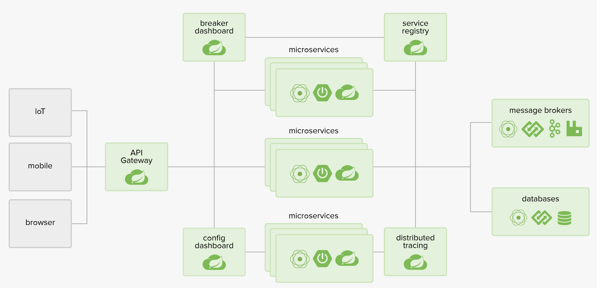
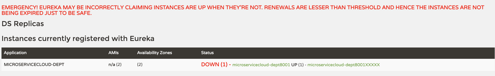
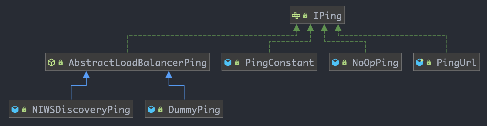
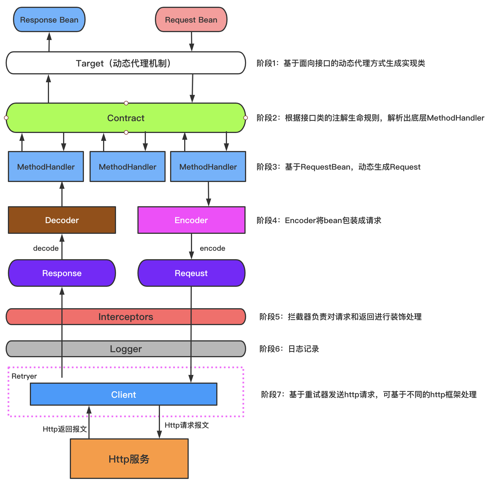
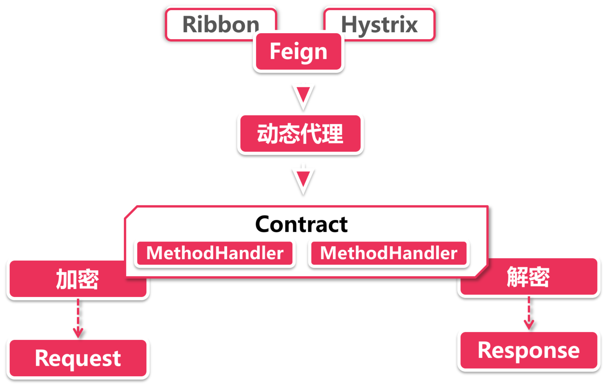
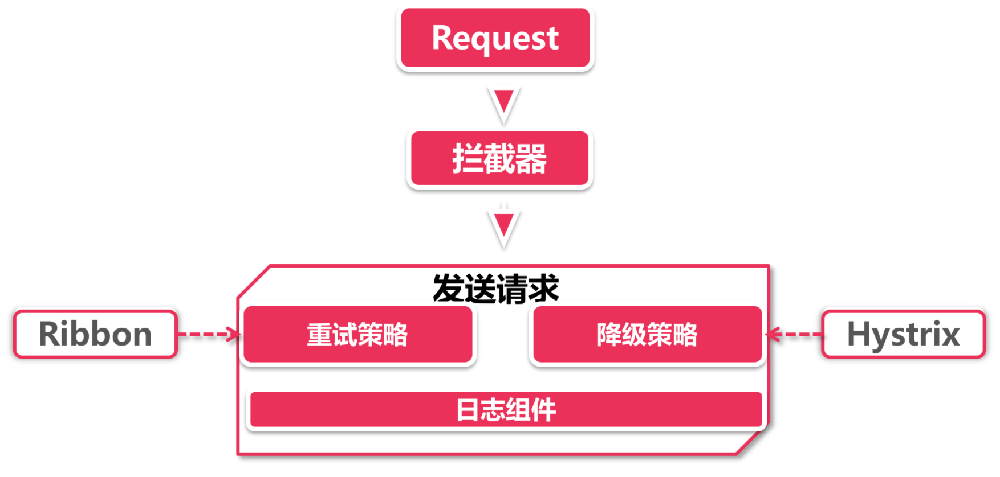
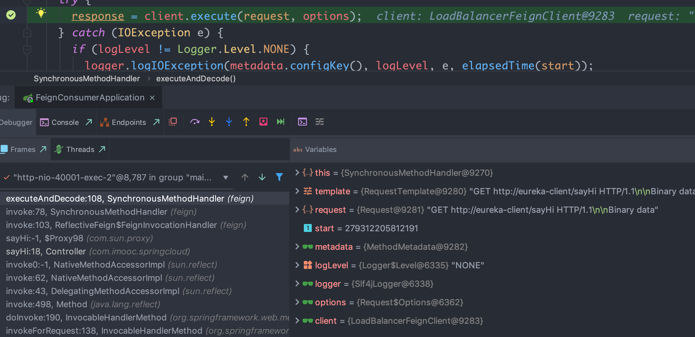
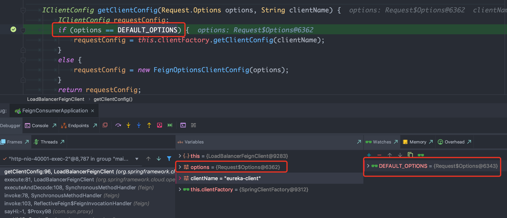
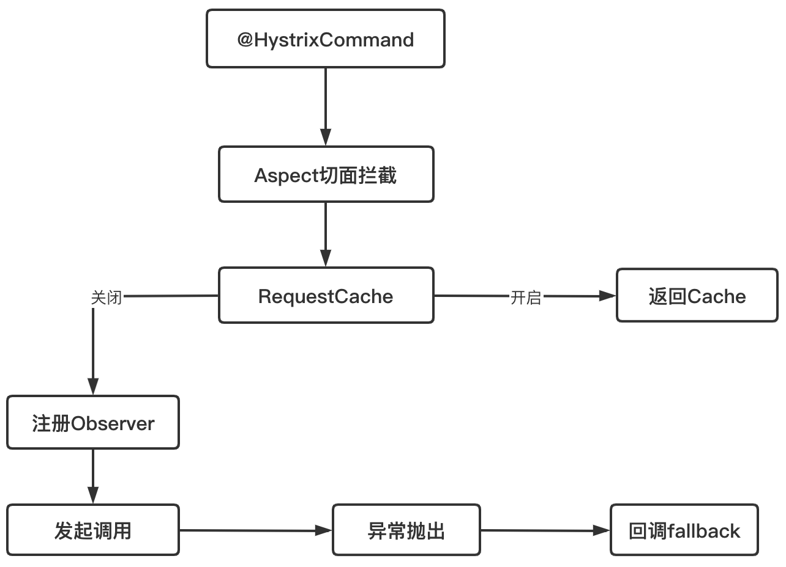
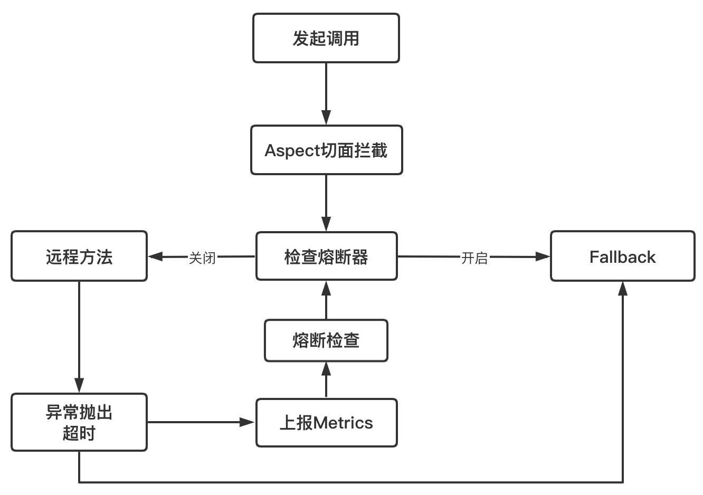

# 一、SpringClound简介

## 1、定义

基于SpringBoot提供了一套微服务解决方案，包括服务注册与发现、配置中心、全链路监控、服务网关、负载均衡、熔断器等组件，除了基于Netflix的开源组件做高度抽象封装之外，还有一些选项中立的开源组件；分布式微服务架构的一站式解决方案



## 2、与SpringBoot的关系

- SpringBoot专注于快速方便的开发单个个体微服务；
- SpringCloud是关注全局的微服务协调整理治理框架，它将SpringBoot开发的一个个单体微服务整合并管理起来，为各个微服务之间提供配置管理、服务发现、断路器、熔断器等等集成服务；
- SpringBoot可以离开SpringCloud独立使用开发项目，SpringCloud离不开SpringBoot，属于依赖的关系；
- Dubbo是 SOA 时代的产物，它的关注点主要在于服务的调用，流量分发、流量监控和熔断。而 Spring Cloud诞生于微服务架构时代，考虑的是微服务治理的方方面面，另外由于依托了 Spring、Spring Boot的优势之上，两个框架在开始目标就不一致，Dubbo 定位服务治理、Spirng Cloud 是一个生态；

[SpringBoot与SpringCloud版本对比](https://start.spring.io/actuator/info)

如果SpringBoot与SpringCloud的组件版本不一致，可能会导致启动问题；

## 3、与Dubbo对比


最大区别：Dubbo底层是使用Netty这样的NIO框架，是基于TCP协议传输的，配合以Hession序列化完成RPC通信。SpringCloud抛弃了Dubbo的RPC通信，采用的是基于HTTP的REST方式，从一定程度上，HTTP的REST方式牺牲了服务调用的性能，但也避免了原生RPC带来的问题。服务提供方和调用方的依赖只依靠一纸契约，不存在代码级别的强依赖；SpringCloud 是基于 Http 通信协议（短连接）和 Json 序列化实现的，在高并发场景下并没有优势

# 二、注册中心

主流的注册中心：
- Eureka：Netflix开源的，遵守AP原则，在架构上，Eureka集群采用的是去中心化结构。也就是说Eureka集群中的各个结点都是平等的，没有主从的概念。通过互相注册的方式来进行消息同步和保证高可用。并且一个Eureka Server结点挂掉了，还有其他同等的结点来提供服务，并不会引发服务的中断；Eureka还有一个自我保护机制，用来应对网络问题导致的服务不可用，从而能更进一步地保证可用性；
- Consul：SpringCloud推荐的注册中心，使用raft协议遵守CP原则；Consul是用Go语言编写的，所以无法像Eureka那样直接引入jar包就能集成，它还需要去服务器中进行额外的安装；除了注册中心的功能之外，Consul还能起到配置中心的作用；
- Nacos：可以分别满足AP 和 CP

| 对比项目        | Nacos                      | Eureka      | Consul            | CoreDNS    | Zookeeper  |
| --------------- | -------------------------- | ----------- | ----------------- | ---------- | ---------- |
| 一致性协议      | CP+AP                      | AP          | CP                | —          | CP         |
| 健康检查        | TCP/HTTP/MYSQL/Client Beat | Client Beat | TCP/HTTP/gRPC/Cmd | —          | Keep Alive |
| 负载均衡策略    | 权重/metadata/Selector     | Ribbon      | Fabio             | RoundRobin | —          |
| 雪崩保护        | 有                         | 有          | 无                | 无         | 无         |
| 自动注销实例    | 支持                       | 支持        | 不支持            | 不支持     | 支持       |
| 访问协议        | HTTP/DNS                   | HTTP        | HTTP/DNS          | DNS        | TCP        |
| 监听支持        | 支持                       | 支持        | 支持              | 不支持     | 支持       |
| 多数据中心      | 支持                       | 支持        | 支持              | 不支持     | 不支持     |
| 跨注册中心同步  | 支持                       | 不支持      | 支持              | 不支持     | 不支持     |
| SpringCloud集成 | 支持                       | 支持        | 支持              | 不支持     | 不支持     |
| Dubbo集成       | 支持                       | 不支持      | 不支持            | 不支持     | 支持       |
| K8S集成         | 支持                       | 不支持      | 支持              | 支持       | 不支持     |

## 1、Eureka服务注册与发现

Eureka是Netflix的一个子模块，也是核心模块之一。Eureka是一个基于REST的服务，用于定位服务，以实现云端中间层服务发现和故障转移。只需要使用服务的标识符，就可以访问到服务；

其在设计上遵守AP原则

### 1.1、原理

- 基本架构：
    - 采用了C-S的设计架构。Eureka Server作为服务注册功能的服务器。是服务注册中心；
    - 系统的其他微服务，使用Eureka的客户端连接到Eureka Server并维持心跳连接。SpringCloud的一些其他模块就可以通过Eureka Server来实现系统中的其他微服务，并执行相关逻辑。
- Eureka包含两个组件：
    - Eureka Server：提供服务注册；各个节点启动后，会在EurekaServer中进行注册，主要EurekaServer中的服务注册表将会存储所有可用的服务节点的信息。
    - Eureka Client：是一个Java客户端，用于简化EurekaServer的交互，客户端也同时具备一个内置的、使用轮询（round-robin）负载算法的负载均衡。在应用启动后，将会向EurekaServer发送心跳（默认周期是30秒）。如果EurekaServer在多个心跳周期内没有收到某个节点的心跳，EurekaServer将会从服务注册表中把这个服务节点移除（默认90秒）；

- 三大角色：
    - Eureka Server：提供服务注册和发现
    - Service Provider：服务提供方将自身服务注册到Eureka，从而使服务消费方能够进行消费；
    - Service Consumer：服务消费方从Eureka中获取注册列表，从而能消费服务；

### 1.2、接入Eureka

#### 1.2.1、Eureka服务端

- 增加依赖：
    ```xml
    <!--eureka-server服务端 -->
    <dependency>
        <groupId>org.springframework.cloud</groupId>
        <artifactId>spring-cloud-starter-eureka-server</artifactId>
    </dependency>
    ```
- 启动类增加`@EnableEurekaServer`注解
- 在配置文件（application.yml）增加如下配置：
    ```yml
    eureka:
    instance:
        hostname: localhost
    client:
        register-with-eureka: false    #false表示不向注册中心注册自己。
        fetch-registry: false     #false表示自己端就是注册中心，我的职责就是维护服务实例，并不需要去检索服务
        service-url:
        defaultZone: http://${eureka.instance.hostname}:${server.port}/eureka/       # 单机：设置与Eureka Server交互的地址查询服务和注册服务都需要依赖这个地址（单机）。
     #      defaultZone: http://eureka7002.com:7002/eureka/,http://eureka7003.com:7003/eureka/ # 配置集群的配置，多台机器
    ```

#### 1.2.1、Eureka客户端

- 增加POM依赖
    ```xml
    <!-- actuator监控信息完善 -->
    <dependency>
        <groupId>org.springframework.boot</groupId>
        <artifactId>spring-boot-starter-actuator</artifactId>
    </dependency>
    <!-- 将微服务provider侧注册进eureka -->
    <dependency>
        <groupId>org.springframework.cloud</groupId>
        <artifactId>spring-cloud-starter-eureka</artifactId>
    </dependency>
    <dependency>
        <groupId>org.springframework.cloud</groupId>
        <artifactId>spring-cloud-starter-config</artifactId>
    </dependency>
    ```
- 启动类增加注解：`@EnableEurekaClient`
- 在配置文件（application.yml）增加如下配置：
    ```yml
    eureka:
    client: #客户端注册进eureka服务列表内
        service-url:
        defaultZone: http://localhost:7001/eureka
        # defaultZone: http://eureka7001.com:7001/eureka/,http://eureka7002.com:7002/eureka/,http://eureka7003.com:7003/eureka/ # 集群配置
    instance:
        instance-id: microservicecloud-dept8001XXXXX
        prefer-ip-address: true     #访问路径可以显示IP地址
    
        # 监控信息
    info:
    app.name: bluefish-microservicecloud
    company.name: www.chenlanqing.com
    build.artifactId: $project.artifactId$
    build.version: $project.version$
    ```

### 1.3、Eureka自我保护



某时刻某一个微服务不可用了，eureka不会立刻清理，依旧会对该微服务的信息进行保存。

默认情况下，如果EurekaServer在一段时间内没有接收到某个微服务实例的心跳，EurekaServer将会注销该实例。但是在网络分区故障发生时，微服务与EurekaServer之间无法正常通通信，那么直接注销实例可能很危险，因为微服务本身其实是健康的，此时不应该注销这个服务。

Eureka通过自我保护模式来解决这个问题：当EurekaServer节点在短时间内丢失过多客户端时，那么这个节点就会进入自我保护模式。一旦进入该模式，EurekaServer就会保护服务注册表中的信息，不再删除服务注册表中的数据。当网络故障恢复之后，该EurekaServer节点会自动退出自我保护模式

在自我保护模式中，Eueka server会保护服务注册表中的信息，不在注销任何服务实例。当它收到的心跳次数重写恢复到阈值以上时，该Eureka Server节点就会自动退出自我保护模式。

设计思路：宁可保留错误的服务注册信息，也不盲目注销任何可能健康的服务实例。

自我保护模式是一种应对网络异常的安全保护措施。在SpringCloud中，可以使用`eureka.server.enable-self-preservation=false`禁用自我保护模式

### 1.4、Eureka服务发现

使用：DiscoveryClient，配合注解：`@EnableDiscoveryClient`
```java
@Target(ElementType.TYPE)
@Retention(RetentionPolicy.RUNTIME)
@Documented
@Inherited
@Import(EnableDiscoveryClientImportSelector.class)
public @interface EnableDiscoveryClient {
	boolean autoRegister() default true;
}
```

### 1.5、Eureka集群

集群需要增加修改如下配置，将defaultZone修改为多个地址

`defaultZone: http://eureka7002.com:7002/eureka/,http://eureka7003.com:7003/eureka/`

基于集群配置的eureka：
- 处于不同节点的eureka通过Replicate进行数据同步 
- Application Service为服务提供者 
- Application Client为服务消费者 
- Make Remote Call完成一次服务调用

### 1.6、与Zookeeper相比

- Eureka遵守AP，zookeeper遵守CP
    - Eureka：Eureka各个几点都是平等的，几个节点挂掉不会影响正常节点的工作，剩余的节点依然可以提供注册和查询服务
    - zookeeper：当master节点因为故障与其他节点失去联系时，剩余节点会重写进行leader选举。问题在于：选举leader的时间太长，30~120s，且选举期间整个zk集群是不可用的，就导致在选举期间注册服务瘫痪；

### 1.7、服务注册原理

服务启动后向Eureka注册，Eureka Server会将注册信息向其他Eureka Server进行同步，当服务消费者要调用服务提供者，则向服务注册中心获取服务提供者地址，然后会将服务提供者地址缓存在本地，下次再调用时，则直接从本地缓存中取，完成一次调用。

当服务注册中心Eureka Server检测到服务提供者因为宕机、网络原因不可用时，则在服务注册中心将服务置为DOWN状态，并把当前服务提供者状态向订阅者发布，订阅过的服务消费者更新本地缓存；

服务提供者在启动后，周期性（默认30秒）向Eureka Server发送心跳，以证明当前服务是可用状态。Eureka Server在一定的时间（默认90秒）未收到客户端的心跳，则认为服务宕机，注销该实例；

### 1.8、心跳检测与服务剔除

**心跳检测：**

在应用启动后，节点们将会向Eureka Server发送心跳,默认周期为30秒，如果Eureka Server在多个心跳周期内没有接收到某个节点的心跳，Eureka Server将会从服务注册表中把这个服务节点移除(默认90秒)

```
## 客户端指标
## 每隔多久向服务器发送一次心跳包
eureka.instance.lease-renewal-interval-in-seconds=10
## 如果在多长时间内没有发送心跳，那么表示客户端宕机了
eureka.instance.lease-expiration-duration-in-seconds=20
```

**服务剔除：**
- 启动定时任务：注册中心再启动的时候也会同步开启一个后台任务，默认每间隔60秒触发服务剔除任务；可以通过在服务端`eureka.server.eviction-interval-timer-in-ms=30000`，进行配置修改触发间隔。价面议不要设置的时间过短；
- 调用evict：通过 AbstractInstanceRegistry 的 eviction 方法直接运行；但是一旦开启了自我保护，注册中心会中断服务剔除操作；
- 遍历过期服务：注册中心会遍历所有服务节点，找出所有过期服务；如何判断服务过期，只要满足以下任意一点即可：
    - 已被标记为过期（evictionTimestamp > 0）;
    - `最后一次心跳时间 + 服务配置的心跳间隔时间 < 当前时间`;
- 计算可剔除的服务总个数：所有服务不是被全部剔除的，服务中心为了自身稳定性，设置一个系数（默认是0.85）；可剔除的服务数量不能大于已注册服务的总数量乘以这个系数；
- 乱序剔除服务；

### 1.9、服务续约

**续约与心跳的关系：**
- 将服务节点的状态同步到注册中心，通知注册中心服务的状态；这里需要借助客户端的心跳功能主动发送；
- 当心跳包到达注册中心的时候，注销中心有相应的判别机制来判定当前的续约心跳是否合理。并根据判断结果修改当前instance在注册中心记录的同步时间；

**发送Renew请求：**
- 服务续约请求：客户端有一个`DiscoverClient`类，是所有操作的门面入口；所以续约服务从该类的renew方法开始；
- 发送心跳：服务续约通过心跳来实现，有两个重要参数恩别是服务的状态（UP）和 lastDirtyTimeStamp
    - 如果续约成功，注册中心则返回200的HTTP Code；
    - 如果续约不成功，注册中心返回404；并不是表示没有找到注册中心地址，而是注册中心任务当前服务节点并不存在；
- 在重新注册之前，客户端会先做下面的两个操作，再主动调用服务注册流程：
    - 设置 lastDirtyTimeStamp，由于重新注册意味着服务节点和注册中心的信息不同步，需要将当前系统时间更新到 lastDirtyTimeStamp；
    - 标记自己为脏节点；
- 当注册成功的时候，清除脏节点标记，但是 lastDirtyTimeStamp 不会清除，这个属性会在后台的服务续约中作为参数发给注册中心，以便服务中心判断节点的同步状态；

**注册中心续约校验：**
注册中心开发了一系列HTTP接口，都放在 com.netflix.eureka.resources 包下
- 接受请求 InstanceResource 下的 renewLease 方法接收到服务节点的续约请求；
- 尝试续约：注册中心检查，如果没有通过，返回404
    - 之前是否有注册过；没有，续约失败；
    - 是否为unknown状态；需要重新注册；
- 脏数据校验：如果续约校验没有问题，需要进行脏数据校验，相对来说逻辑比较复杂；

### 1.9、Eureka基本工作流程

- Eureka Server 启动成功，等待服务端注册。在启动过程中如果配置了集群，集群之间定时通过 Replicate 同步注册表，每个 Eureka Server 都存在独立完整的服务注册表信息
- Eureka Client 启动时根据配置的 Eureka Server 地址去注册中心注册服务
- Eureka Client 会每 30s 向 Eureka Server 发送一次心跳请求，证明客户端服务正常
- 当 Eureka Server 90s 内没有收到 Eureka Client 的心跳，注册中心则认为该节点失效，会注销该实例
- 单位时间内 Eureka Server 统计到有大量的 Eureka Client 没有上送心跳，则认为可能为网络异常，进入自我保护机制，不再剔除没有上送心跳的客户端
- 当 Eureka Client 心跳请求恢复正常之后，Eureka Server 自动退出自我保护模式
- Eureka Client 定时全量或者增量从注册中心获取服务注册表，并且将获取到的信息缓存到本地
- 服务调用时，Eureka Client 会先从本地缓存找寻调取的服务。如果获取不到，先从注册中心刷新注册表，再同步到本地缓存
- Eureka Client 获取到目标服务器信息，发起服务调用
- Eureka Client 程序关闭时向 Eureka Server 发送取消请求，Eureka Server 将实例从注册表中删除

# 三、Ribbon负载均衡

* [Ribbon源码](https://github.com/Netflix/ribbon)

## 1、介绍

Spring Cloud Ribbon是基于Netflix Ribbon实现的客户端负载均衡的工具，其主要提供客户端的软件负载均衡算法。

简单说，就是在配置文件中列出Load Balancer后面所有的机器，Ribbon会自动的帮助你基于某种规则去连接这些机器。


## 2、配置

主要是在客户端进行操作的
- 加入依赖
    ```xml
    <!-- Ribbon相关 -->
    <dependency>
        <groupId>org.springframework.cloud</groupId>
        <artifactId>spring-cloud-starter-eureka</artifactId>
    </dependency>
    <dependency>
        <groupId>org.springframework.cloud</groupId>
        <artifactId>spring-cloud-starter-ribbon</artifactId>
    </dependency>
    <dependency>
        <groupId>org.springframework.cloud</groupId>
        <artifactId>spring-cloud-starter-config</artifactId>
    </dependency>
    ```
- 加入配置
    ```yml
    eureka:
        client:
            register-with-eureka: false
            service-url:
            defaultZone: http://eureka7001.com:7001/eureka/,http://eureka7002.com:7002/eureka/,http://eureka7003.com:7003/eureka/
    
    ```
- 调用接口增加注解，请求的服务需要改成响应的服务名称二而不是具体的接口
    ```java
    @Bean
    @LoadBalanced // 负载均衡注解
    public RestTemplate getRestTemplate() {
        return new RestTemplate();
    }
    ```

## 3、Ribbon体系架构

一个Http请求发过来，先被转发到Eureka上。此时Eureka通过服务发现获取所有了服务节点的物理地址，问题是其不知道调用哪一个，所以其会将请求转发到Ribbon上；
- IPing：是Ribbon中一套健康检查机制，即ping一下目标机器看是否还在线，一般情况下跑 iping 并不会主动向服务节点发起health check请求，Ribbon后台会静默处理返回true，默认表示所有服务节点都处于存活状态（和Eureka集成的时候会检查服务节点UP状态）；
- IRule：各种策略都继承自IRule接口，所有经过Ribbon的请求都会请示IRule，通过负载均衡策略选定目标及其，然后再把请求转发过去；

## 4、Ribbon七种策略

IRule：根据特定算法从服务列表中选取一个要访问的服务，默认存在如下七种算法：
- `RoundRobinRule`：轮询，默认策略，内部使用 自旋锁 + CAS 的同步操作；
- `RandomRule`：随机选择一台机器，内部使用的是 yield + 自旋的方式实现的；
- `RetryRule`：先按照`RoundRobinRule`的策略获取服务，如果获取服务失败则在指定时间内会进行重试，获取可用的服务；其是一个类似装饰器模式的Rule；
- `WeightedResponseTimeRule`：根据平均响应时间计算所有服务的权重，响应时间越快服务权重越大被选中的概率越高，权重的高低决定了机器被选中概率的高低；刚启动时如果统计信息不足，则使用`RoundRobinRule`策略，等统计信息组织，会切换到`WeightedResponseTimeRule`；其是继承自 `RoundRobinRule`；
- `BestAvailableRule`：会先过滤掉由于多次访问故障而处于断路器跳闸状态的服务，然后选择一个并发量最小的服务；如果统计结果尚未生成，则采用轮询的方式选定节点；
- `AvailabilityFilterLingRule`：会先过滤掉由于多次访问故障而出路断路器跳闸状态的服务，还有并发的连接数量超过阈值的服务，然后对剩余的服务列表按照轮询策略进行访问；
- `ZoneAvoidanceRule`：默认规则。符合判断Server所在区域的性能和server的可用性选择服务器；包含了组合过滤条件；

## 5、配置负载均衡策略

**配置方式1：**

配置类`@RibbonClient`注解：在启动该微服务时会去加载自定义的Ribbon配置类，从而使配置生效：
```java
@RibbonClient(name="MICRO-SERVICE-NAME", configuration=com.netflix.loadbalancer.RoundRobinRule.class)
@Configuration
public class MyRule{
    @Bean
    public IRule rule(){
        return new RandomRule();
    }
}
```

**配置方式2：**

配置文件的形式：
```
eureka-client.ribbon.NFLoadBalancerRuleClassName=com.netflix.loadbalancer.RoundRobinRule
```

配置优先级： `注解 > 配置`

## 6、负载均衡器LoadBalanced

Ribbon 通过RestTemplate来发起调用请求的，而RestTemplate是Spring下的包的，那么Ribbon是如何将自己加到RestTemplate的呢？

```java
@Bean
@LoadBalanced
public RestTemplate template() {
    return new RestTemplate();
}

```
如上代码，我们在配置Ribbon的时候，一般会配置一个RestTemplate，并给它加上 `@LoadBalanced` 注解，其会将RestTemplate放到Ribbon的自动装配类进行改造
- `@LoadBalanced`注解在 RestTemplate，另外一边在 LoadBalancerAutoConfiguration 类上；所有 RestTemplate 上只要有 LoadBalanced 注解，都会到 LoadBalancerAutoConfiguration 类上；LoadBalanced 借助 Qualifier 实现给 RestTemplate 打标签功能；
- LoadBalancerAutoConfiguration 将传过来的 RestTemplate 经过一定的装配，将一系列的 interceptor 添加到 RestTemplate 中。Ribbon 拦截器会拦截每个网络请求做相应的处理；

```java
// 
@Target({ ElementType.FIELD, ElementType.PARAMETER, ElementType.METHOD })
@Retention(RetentionPolicy.RUNTIME)
@Documented
@Inherited
@Qualifier
public @interface LoadBalanced {
}
// 
@Configuration
@ConditionalOnClass(RestTemplate.class)
@ConditionalOnBean(LoadBalancerClient.class)
@EnableConfigurationProperties(LoadBalancerRetryProperties.class)
public class LoadBalancerAutoConfiguration {
	@LoadBalanced
	@Autowired(required = false)
	private List<RestTemplate> restTemplates = Collections.emptyList();

	@Autowired(required = false)
	private List<LoadBalancerRequestTransformer> transformers = Collections.emptyList();

	@Bean
	public SmartInitializingSingleton loadBalancedRestTemplateInitializerDeprecated(
			final ObjectProvider<List<RestTemplateCustomizer>> restTemplateCustomizers) {
		return () -> restTemplateCustomizers.ifAvailable(customizers -> {
			for (RestTemplate restTemplate : LoadBalancerAutoConfiguration.this.restTemplates) {
				for (RestTemplateCustomizer customizer : customizers) {
					customizer.customize(restTemplate);
				}
			}
		});
	}
}
```

**总结：**Ribbon作用机制就是由LoadBalanced在RestTemplate上打标，Ribbon将带有负载均衡能力的拦截器注入标记好的RestTemplate 中，以此实现负载均衡；

## 7、IPing机制

IPing 是个主动机制，其主动判断服务节点的当前状态，决定是否可以作为目标节点，只有当前可用的节点才会作为负载均衡器的目标节点；主要有以下实现：
- DummyPing：默认返回true，即默认所有节点都可用，这是单独使用 Ribbon时的默认模式；
- NIWSDiscoveryPing：借助eureka的状态来判断，假如节点状态是UP，则认为是可用；
- PingUrl：构造URL请求，主动向服务节点发起一次HTTP调用，如果对方有响应则认为节点可用；

第三种模式在一些场景下不适用，因为其对每个服务节点都会请求不断，对应的节点在本身高访问量的调用情况下，这种方式必然会增加服务节点的访问压力的；

除非特殊指定，在和eureka搭配使用时候，采用的是 NIWSDiscoveryPing，通过过滤非UP状态的节点；



## 8、IRule

LoadBalancer加载IRule：RibbonClientConfiguration
```java
@Bean
@ConditionalOnMissingBean
public IRule ribbonRule(IClientConfig config) {
    if (this.propertiesFactory.isSet(IRule.class, name)) {
        return this.propertiesFactory.get(IRule.class, config, name);
    }
    ZoneAvoidanceRule rule = new ZoneAvoidanceRule();
    rule.initWithNiwsConfig(config);
    return rule;
}
@Bean
@ConditionalOnMissingBean
public ILoadBalancer ribbonLoadBalancer(IClientConfig config,
        ServerList<Server> serverList, ServerListFilter<Server> serverListFilter,
        IRule rule, IPing ping, ServerListUpdater serverListUpdater) {
    if (this.propertiesFactory.isSet(ILoadBalancer.class, name)) {
        return this.propertiesFactory.get(ILoadBalancer.class, config, name);
    }
    return new ZoneAwareLoadBalancer<>(config, rule, ping, serverList,
            serverListFilter, serverListUpdater);
}
```

## 9、自定义负载均衡策略

实现一致性Hash的负载均衡
- 实现IRule接口
- 实现方法
- 配置：`@RibbonClient(name = "eureka-client", configuration = MyRule.class)`

代码如下：
```java
@NoArgsConstructor
public class MyRule extends AbstractLoadBalancerRule implements IRule {
    @Override
    public void initWithNiwsConfig(IClientConfig iClientConfig) {
    }
    @Override
    public Server choose(Object key) {
        HttpServletRequest request = ((ServletRequestAttributes)
                RequestContextHolder.getRequestAttributes())
                .getRequest();

        String uri = request.getServletPath() + "?" + request.getQueryString();
        return route(uri.hashCode(), getLoadBalancer().getAllServers());
    }
    public Server route(int hashId, List<Server> addressList) {
        if (CollectionUtils.isEmpty(addressList)) {
            return null;
        }
        TreeMap<Long, Server> address = new TreeMap<>();
        addressList.stream().forEach(e -> {
            // 虚化若干个服务节点，到环上
            for (int i = 0; i < 8; i++) {
                long hash = hash(e.getId() + i);
                address.put(hash, e);
            }
        });
        long hash = hash(String.valueOf(hashId));
        SortedMap<Long, Server> last = address.tailMap(hash);
        // 当request URL的hash值大于任意一个服务器对应的hashKey，
        // 取address中的第一个节点
        if (last.isEmpty()) {
            address.firstEntry().getValue();
        }
        return last.get(last.firstKey());
    }
    public long hash(String key) {
        try {
            MessageDigest md5 = MessageDigest.getInstance("MD5");
            byte[] keyByte = key.getBytes("UTF-8");
            md5.update(keyByte);
            byte[] digest = md5.digest();

            long hashCode = ((long) (digest[2] & 0xFF << 16))
                    | ((long) (digest[1] & 0xFF << 8))
                    | ((long) (digest[0] & 0xFF));

            return hashCode & 0xffffffffL;
        } catch (NoSuchAlgorithmException | UnsupportedEncodingException e) {
            throw new RuntimeException(e);
        }
    }
}
```

***注意：***该自定义配置类不能放在@ComponentScan所扫描的当前包下以及子包下，否则自定义的这个配置类会被所有的Ribbon客户端所共享，达不到特殊化定制的目的

## 10、Ribbon加载问题

Ribbon默认是懒加载的，只有第一次调用的时候才会完成LoadBalancer的初始化；如果第一个方法请求比较耗时的话，且超时时间设置的较短，那么很大可能第一次http调用就会失败；

Ribbon完成初始化会打印如下日志：
```
INFO [main] com.netflix.loadbalancer.DynamicServerListLoadBalancer - DynamicServerListLoadBalancer for client eureka-consumer initialized
```
如何在调用之前就初始化LoadBalancer，增加如下两个配置：
```
ribbon.eager-load.enabled=true 
ribbon.eager-load.clients=ribbon-consumer
```
第一个参数开启了Ribbon的饥饿加载模式，第二个属性指定了需要应用饥饿加载的服务名称；

# 四、远程调用

## 1、Feign

- [Feign原理解析](https://www.cnblogs.com/duanxz/p/7519819.html)

### 1.1、简介

Feign是一个声明式WebService客户端。使用Feign能让编写WebService客户端更加简单。

它具有可插入注释支持，包括Feign注释和JAX-RS注释。Feign还支持可插拔编码器和解码器。Spring Cloud增加了对Spring MVC注释的支持，并使用Spring Web中默认使用的HttpMessageConverters。Spring Cloud集成Ribbon和Eureka以在使用Feign时提供负载均衡的http客户端。

一句话：声明一个代理接口，服务调用者通过调用这个代理接口的方式来调用远程服务，这样调用远程方法就如同调用本地接口一样方便的；

整体全流程图：



**构造请求：**


- Ribbon：利用负载均衡策略选定目标机器；
- Hystrix：根据断路器的开启状态，决定是否发起此次调用；
- 动态代理：Feign是通过一个代理接口进行远程调用，构造接口的动态代理对象，用来代理远程服务的真实调用，不需要像Ribbon或者Eureka那样在方法调用的地方提供服务名；在Feign中动态代理是通过Feign.build返回的构造器装配相关参数，然后调用RejectFeign的newInstance方法创建代理对象；
- Contract：协议，就像HTTP协议、RPC协议一样，Feign也有自己的一套协议的规范，其解析的是上面生成的动态代理类；通过解析动态代理接口 + build模式，Contract协议会构造复杂的元数据对象MethodMetadata，里面包含了动态代理接口定义的所有特征；然后根据这些元数据生成一系列的MethodHandler对象用来处理Request 和 Response 请求；Contract具有高度的扩展性，可以经由对Contract 的扩展，将Feign集成到其他开源组件之中；

**发送请求：**


- 拦截器：通过一系列的拦截器对Request和Response对象进行装饰，然后发起正式的调用；
- 发起请求：
    - 重试：Feign借助Ribbon配置重试策略实现重试的操作；
    - 降级：Feign接口在声明时可以指定Hystrix的降级策略实现类，如果达到了Hystrix的超时判定，或得到了异常结果，将执行指定的降级逻辑；

### 1.2、使用

**1、增加依赖**
```xml
<dependencies>
    <!-- Eureka的依赖 -->
    <dependency>
        <groupId>org.springframework.cloud</groupId>
        <artifactId>spring-cloud-starter-netflix-eureka-client</artifactId>
    </dependency>
    <dependency>
        <groupId>org.springframework.boot</groupId>
        <artifactId>spring-boot-starter-web</artifactId>
    </dependency>
    <dependency>
        <groupId>org.springframework.boot</groupId>
        <artifactId>spring-boot-starter-actuator</artifactId>
    </dependency>
    <!-- Feign的依赖 -->
    <dependency>
        <groupId>org.springframework.cloud</groupId>
        <artifactId>spring-cloud-starter-openfeign</artifactId>
    </dependency>
</dependencies>
```
**2、启动类配置相应的注解**
```java
@EnableDiscoveryClient // eureka
@SpringBootApplication
@EnableFeignClients // feign
public class FeignConsumerApplication {
    public static void main(String[] args) {
        new SpringApplicationBuilder(FeignConsumerApplication.class).web(WebApplicationType.SERVLET).run(args);
    }
}
```
**3、定义接口：**
```java
// 设置需要远程调用的应用
@FeignClient("eureka-client")
public interface IService {
    // eureka-client应用中的 
    @GetMapping("/sayHi")
    String sayHi();
}

// eureka-client 应用的controller
@RestController
public class Controller {
    @Value("${server.port}")
    private String port;

    @GetMapping("/sayHi")
    public String sayHi() {
        return "This is " + port;
    }
}
```
**4、配置文件**
```
spring.application.name=feign-consumer-advanced
server.port=40001
# spring cloud G版本允许多个注解重载
spring.main.allow-bean-definition-overriding=true
eureka.client.serviceUrl.defaultZone=http://localhost:20000/eureka/
```

### 1.3、EnableFeignClients底层原理

```java
@Retention(RetentionPolicy.RUNTIME)
@Target(ElementType.TYPE)
@Documented
@Import(FeignClientsRegistrar.class)
public @interface EnableFeignClients {
	String[] value() default {};
	String[] basePackages() default {};
	Class<?>[] basePackageClasses() default {};
	Class<?>[] defaultConfiguration() default {};
	Class<?>[] clients() default {};
}

class FeignClientsRegistrar implements ImportBeanDefinitionRegistrar, ResourceLoaderAware, EnvironmentAware {
    // 实现 ImportBeanDefinitionRegistrar 的方法注册bean对象
    @Override
	public void registerBeanDefinitions(AnnotationMetadata metadata, BeanDefinitionRegistry registry) {
		registerDefaultConfiguration(metadata, registry);
		registerFeignClients(metadata, registry);
	}
}
```

### 1.4、Feign的动态代理

```java
// org.springframework.cloud.openfeign.FeignClientFactoryBean
class FeignClientFactoryBean implements FactoryBean<Object>, InitializingBean, ApplicationContextAware {
    @Override
	public Object getObject() throws Exception {
		return getTarget();
	}
    <T> T getTarget() {
		FeignContext context = this.applicationContext.getBean(FeignContext.class);
		Feign.Builder builder = feign(context);
		if (!StringUtils.hasText(this.url)) {
			if (!this.name.startsWith("http")) {
				this.url = "http://" + this.name;
			} else {
				this.url = this.name;
			}
			this.url += cleanPath();
			return (T) loadBalance(builder, context,
					new HardCodedTarget<>(this.type, this.name, this.url));
		}
		if (StringUtils.hasText(this.url) && !this.url.startsWith("http")) {
			this.url = "http://" + this.url;
		}
		String url = this.url + cleanPath();
		Client client = getOptional(context, Client.class);
		if (client != null) {
			if (client instanceof LoadBalancerFeignClient) {
				// not load balancing because we have a url,
				// but ribbon is on the classpath, so unwrap
				client = ((LoadBalancerFeignClient) client).getDelegate();
			}
			builder.client(client);
		}
		Targeter targeter = get(context, Targeter.class);
		return (T) targeter.target(this, builder, context, new HardCodedTarget<>(this.type, this.name, url));
	}
}
// org.springframework.cloud.openfeign.FeignContext：Feign的上下文
```

**getObject：**
- FeignClientFactoryBean的getObject发起，为了获取一个可以发起远程调用的实体方法，getObject方法获取到的其实是一个代理对象；
- Feign实际上是调用了 @FeignClient 注解所修饰的接口，FeignClientFactoryBean 封装了这个接口所包含的配置信息，比如eureka服务名称、服务调用路径、降级逻辑的处理类等；

**创建代理对象：**
- 在getTarget最后一行，经由Targeter类转发，创建代理对象；
- Feign的所有代理对象实例均通过 RefelectiveFeign.newInstance 创建，将@FeignClient 接口的特征：方法名、参数等等一系列信息提取出来拼装成Java反射机制中通用的Method类；
- 偷天换日：整个代理机制的核心操作，在newInstance的创建过程中，Feign通过实现JDK的InvocationHandler接口，将自己的Handler和上一步组装的Method进行了关联，这样一来，所有对这个接口方法的调用，都将被Fegin自定义的InvocationHandler接管；

**拦截请求：**

SynchronousMethodHandler接管invoke方法，在构造Request请求的同时还会涉及一系列的参数拼装和加密等操作；

**发起调用：**

借助LoadBalanceFeignClient发起了真正的HTTP请求；

### 1.5、Feign超时机制

Feign配合Ribbon的超时配置：
```yml
# feign-service-provider 是服务名称
# 在所有HTTP Method进行重试，设置为true表示不管是get还是post都能重试。真实的生产环境往往只是get请求可以重试，或者实现了幂等性的其他类型请求
feign-service-provider.ribbon.OkToRetryOnAllOperations=true
# 连接超时，注意：这个不是服务的响应时间，而是本机和服务建立一个connection所花费的时间，如果连接超时则直接进行重试
feign-service-provider.ribbon.ConnectTimeout=1000
# 业务处理超时，服务响应时间；当连接建立好之后，如果对方服务没有在规定时间内返回，则直接进行重试；
feign-service-provider.ribbon.ReadTimeout=2000
# 每台机器最大重试次数，在首次调用超时后，会再次向同一个服务节点发起最多2次重试（总共向当前节点1+2=3次请求）
feign-service-provider.ribbon.MaxAutoRetries=2
# 可以再重试几台机器，在当前机器调用超时后，Feign将最多换N台机器发起调用；如果在新机器超时后，会继续重试 MaxAutoRetries + 1次；
feign-service-provider.ribbon.MaxAutoRetriesNextServer=2
```

如果按照上面的超时配置，最大超时时间是多少：27000ms，计算过程：
`(2000 + 1000) * (2 + 1) * (2 + 1) = 27000ms`

那么计算极值函数：
`MAX(Response time) = (ConnectionTimeout + ReadTimeout) * (MaxAutoRetries + 1) * (MaxAutoRetriesNextServer + 1)`

**属性注入：**
```java
@ConfigurationProperties("feign.client")
public class FeignClientProperties {
	private boolean defaultToProperties = true;
	private String defaultConfig = "default";
}
```

**问题：Ribbon配置的服务超时与Feign配置的服务超时优先级**

```yml
# Ribbon指定服务配置超时判定，优先级更高
user-service:
  ribbon:
    ConnectTimeout: 1000
    ReadTimeout: 3000
    MaxAutoRetries: 1
    MaxAutoRetriesNextServer: 2
    OkToRetryOnAllOperations: true
# Feign的超时判定，优先级高于Ribbon
feign:
  client:
    config:
      # 全局默认配置
      default:
        connectTimeout: 1000
        readTimeout: 5000
      # 优先级比上面的高
      user-service:
        connectTimeout: 1000
        readTimeout: 5000
```

**为什么Feign的优先级高于Ribbon？**

属性设置过程：org.springframework.cloud.openfeign.FeignClientFactoryBean#configureFeign
```java
protected void configureFeign(FeignContext context, Feign.Builder builder) {
    FeignClientProperties properties = this.applicationContext.getBean(FeignClientProperties.class);
    if (properties != null) {
        if (properties.isDefaultToProperties()) {
            // 配置Builder，设置相关属性：
            configureUsingConfiguration(context, builder);
            configureUsingProperties(properties.getConfig().get(properties.getDefaultConfig()),builder);
            configureUsingProperties(properties.getConfig().get(this.contextId),builder);
        } else {
            configureUsingProperties(properties.getConfig().get(properties.getDefaultConfig()),builder);
            configureUsingProperties(properties.getConfig().get(this.contextId), builder);
            configureUsingConfiguration(context, builder);
        }
    } else {
        configureUsingConfiguration(context, builder);
    }
}
// 配置FeignRibbon相关属性
protected void configureUsingConfiguration(FeignContext context, Feign.Builder builder) {
    // 忽略代码
    // 从上下文中获取 Options
    Request.Options options = getOptional(context, Request.Options.class);
    if (options != null) {
        builder.options(options);
    }
    // 忽略代码
}
// getOptional 获取  Request.Options ，通过 FeignRibbonClientAutoConfiguration 注入
@Bean
@ConditionalOnMissingBean
public Request.Options feignRequestOptions() {
    return LoadBalancerFeignClient.DEFAULT_OPTIONS;
}
// 设置feign.client相关配置属性
protected void configureUsingProperties(FeignClientProperties.FeignClientConfiguration config, Feign.Builder builder) {
    // 如果配置文件中有 feign.client.config.default.connectTimeout 或者 feign.client.config.default.readTimeout
    if (config.getConnectTimeout() != null && config.getReadTimeout() != null) {
        // 会覆盖掉前面的设置的options
        builder.options(new Request.Options(config.getConnectTimeout(), config.getReadTimeout()));
    }
」
```

属性使用过程：Feign方法调用实际执行时是在 SynchronousMethodHandler.invoke 方法
```java
private final Client client;
// SynchronousMethodHandler
public Object invoke(Object[] argv) throws Throwable {
    while (true) {
        try {
            return executeAndDecode(template);
        } catch (RetryableException e) {
            ...
        }
    }
}
// SynchronousMethodHandler
Object executeAndDecode(RequestTemplate template, Options options) throws Throwable {
    Request request = targetRequest(template);
    Response response;
    try {
        // 通过client执行，调用的是 LoadBalancerFeignClient.execute 方法
        response = client.execute(request, options);
    } catch (IOException e) {
    }
}
// LoadBalancerFeignClient 
public Response execute(Request request, Request.Options options) throws IOException {
    try {
        URI asUri = URI.create(request.url());
        String clientName = asUri.getHost();
        URI uriWithoutHost = cleanUrl(request.url(), clientName);
        FeignLoadBalancer.RibbonRequest ribbonRequest = new FeignLoadBalancer.RibbonRequest(this.delegate, request, uriWithoutHost);
        // 从Request.Options获取重试、超时配置等
        IClientConfig requestConfig = getClientConfig(options, clientName);
        return lbClient(clientName).executeWithLoadBalancer(ribbonRequest, requestConfig).toResponse();
    }
}
IClientConfig getClientConfig(Request.Options options, String clientName) {
    IClientConfig requestConfig;
    if (options == DEFAULT_OPTIONS) {
        // 这里如果没有配置 feign.client 配置，那么 options 就是 DEFAULT_OPTIONS
        requestConfig = this.clientFactory.getClientConfig(clientName);
    } else {
        // 这里feign.client 属性配置的超时属性
        requestConfig = new FeignOptionsClientConfig(options);
    }
    return requestConfig;
}
```





### 1.6、Feign协议解析过程

基于Http协议的服务，经常使用的框架：HttpURLConnection、Apache HttpComponnets、OkHttp3 、Netty

**Contract结构**

核心处理逻辑在 BaseContract.parseAndValidatateMetadata方法上:
- 不能有泛型
- 接口不能多继承；
- 所继承的接口不能再继承其他接口

### 1.7、Ribbon、Eureka、Feign如何协作

- 首先Ribbon会从 Eureka Client里获取到对应的服务注册表，也就知道了所有的服务都部署在了哪些机器上，在监听哪些端口号。
- 然后Ribbon就可以使用默认的Round Robin算法，从中选择一台机器
- Feign就会针对这台机器，构造并发起请求

**1、通过Eureka发起调用：**

在不使用Ribbon和Feign的情况下，如何在Eureka的服务之间发起调用：
```java
@RestController
public class Controller {
    @Autowired
    private LoadBalancerClient client;
    @Autowired
    private RestTemplate restTemplate;
    @GetMapping("/hello")
    public String hello() {
        // 通过 LoadBalancerClient 选择对应的服务实例
        ServiceInstance instance = client.choose("eureka-client");
        if (instance == null) {
            return "No available instances";
        }
        // 通过获取到的服务实例，获取到主机名和端口号，
        String target = String.format("http://%s:%s/sayHi", instance.getHost(), instance.getPort());
        log.info("url is {}", target);
        // 通过RestTemplate发起调用
        return restTemplate.getForObject(target, String.class);
    }

}
```

**2、通过Ribbon发起调用：**

在没有使用Feign的情况下，发起的服务调用：
```java
@RestController
public class Controller {
    @Autowired
    private RestTemplate restTemplate;

    @GetMapping("/sayHi")
    public String sayHi() {
        // 同http服务 eureka-client是服务名称
        return restTemplate.getForObject("http://eureka-client/sayHi", String.class);
    }
}
```

## 2、OpenFeign

- [Feign拦截器](http://www.oowoo.cn/detail.html?id=78&menuId=19)

OpenFeign 的全称是 Spring Cloud OpenFeign，它是 Spring 官方推出的一种声明式服务调用和负载均衡组件。它的出现就是为了替代已经进入停更维护状态的 Feign(Netflix Feign)的。也就是说 OpenFeign(Spring Cloud OpenFeign)是 Feign 的升级版

### 文件上传fegin调用

> 注意：openfeign请求时，如果使用的是表单形式提交，即：`consumes = MediaType.MULTIPART_FORM_DATA_VALUE` ，那么客户端请求时编码使用的是 SpringEncoder，该编码器只支持有限的几种对象类型，如String、byte[]，诸如Map等是无法编码的，其会报对应的错误：`java.util.HashMap is not a type supported by this encoder`

如果要通过feign接口上传文件，需要通过post表单的形式：配置 consumes
```java
@FeignClient
public interface OrderService {
    @RequestMapping(value = "/createOrder", method = RequestMethod.POST, consumes = MediaType.MULTIPART_FORM_DATA_VALUE)
    void createOrder(String order);
}
```

### feign日志

打印Feign的请求日志：
- 全部打印，增加如下配置：
    ```java
    @Configuration
    public class FeignConfig {
        @Bean
        public Logger.Level feignLoggerLevel() {
            return Logger.Level.FULL;
        }
    }
    ```
- 只针对单个Feign：比如有如下FeignClient
    ```java
    @FeignClient(name = "foo")
    public interface FooClient {
    ...
    }
    ```
    配置如下：
    ```yaml
    feign:
    client:
        config:
        foo:
            loggerLevel: full
    ```
    注意 `feign.client.config.<client_name>.loggerLevel` 中， `client_name` 需要与代码中的定义一致（上例中是 foo）。

Feign 支持四种日志级别：
- `none`：不打印日志；
- `basic`：打印请求方法、URL、响应码及响应时间；
- `headers`：同时打印请求和响应头的信息；
- `full`：同时打印请求和响应体信息，以及其它附加的元信息；

### 注意点

- feign如果是POST调用时，且指定了注解 @RequestBody，则对应的 content-type就不需要设置了，其会自动设置 content-type=application/json 的

# 五、Hystrix断路器

## 1、什么是Hystrix断路器

- 服务雪崩：当调用链路上某个微服务调用响应时间过长或者不可响应，对微服务的调用就会占用越来越多的系统资源，进而引起系统崩溃

Hystrix是一个用于处理分布式系统的延迟和容错的开源库，在分布式系统中，Hystrix能保证在一个依赖出问题的情况下，不会导致整体服务失败，避免级联故障，提高分布式系统的弹性；

“断路器”本身是一种开关装置，当某个服务单元发生故障之后，通过断路器的故障监控（类似熔断保险丝），向调用方返回一个符合预期的、可处理的备选响应，而不是长时间的等待或者抛出调用方法无法处理的异常，主要保证了服务调用方的线程不会被长时间、不必要的占用，从而在分布式系统蔓延，从而引起系统雪崩；

设计原则：
- 对依赖服务调用时出现的调用延迟和调用失败进行控制和容错保护。
- 在复杂的分布式系统中，阻止某一个依赖服务的故障在整个系统中蔓延。比如某一个服务故障了，导致其它服务也跟着故障。
- 提供 fail-fast（快速失败）和快速恢复的支持。
- 提供 fallback 优雅降级的支持。
- 支持近实时的监控、报警以及运维操作

## 2、服务降级

当服务器压力剧增的情况下，根据实际业务情况及流量，对一些服务和页面有策略的不处理或换种简单的方式处理，从而释放服务器资源以保证核心交易正常运作或高效运作

可以将一些`不重要`或`不紧急`的服务或任务进行服务的 延迟使用 或 暂停使用

服务降级可以分为：
- 超时降级：主要配置好超时时间和超时重试次数和机制，并使用异步机制探测恢复情况；
- 失败次数降级：主要是一些不稳定的API，当失败调用次数达到一定阀值自动降级，同样要使用异步机制探测回复情况；
- 故障降级：如要调用的远程服务挂掉了（网络故障、DNS故障、HTTP服务返回错误的状态码和RPC服务抛出异常），则可以直接降级；
- 限流降级：当触发了限流超额时，可以使用暂时屏蔽的方式来进行短暂的屏蔽；信号量或者线程池；

### 2.1、服务降级配置

```java
@HystrixCommand(fallbackMethod = "error")
public String error(){}
```
HystrixCommand注解指定了一个 fallbackMethod，就是降级逻辑所在的方法名。需要注意的是降级的方法签名（参数列表）要和原方法保持一致，也就是说，如果原方法声明了一个String参数，那么降级方法也要声明同样的参数，Hystrix会原封不动的把当前参数传递给降级方法；

当Hystrix和Feign共同使用的时候，还有一种配置方式，那局势在FeignClient注解中指定一个class，在这个calss中声明的所有方法的降级需求；
```java
@FeignClient(name = "feign-client", fallback = Fallback.class)
public interface MyService extends IService {
}
@Component
public class Fallback implements MyService {
    @Override
    @HystrixCommand(fallbackMethod = "fallback2")
    public String error() {
        log.info("Fallback: I'm not a black sheep any more");
        throw new RuntimeException("first fallback");
    }
}
```

### 2.2、服务降级原理

降级流程图：



- `@HystrixCommand`：标识该方法由Hystrix控制；
- AspectJ：运用Spring的切面能力，给带有 `@HystrixCommand` 注解的方法配置了切面点（`com.netflix.hystrix.contrib.javanica.aop.aspectj.HystrixCommandAspect`），在方法调用的时候，将首先执行切面的逻辑；
- Request Cache：
    - 如果处于开启装填，则尝试用CacheKey从本地缓存中获取数据，也就不用发起方法调用了；
    - 如果处于关闭状态，就继续往下走；
- 注册Observer：Observer是观察者模式，这个 Observer背后运用了RxJava注册了一堆异步回调函数，当方法正常执行时、异常抛出、结束或其他状态时，将会触发对应的回调函数的处理，而且回调函数里面还会嵌套回调函数；
- 发起调用：在发起调用之前，将会检查熔断状态，如果断路器当前处于开启状态，那么僵直接走向fallback流程；如果断路器处于关闭，则发起真正的调用；
- 异常：如果方法调用抛出异常，会触发签名注册的回调函数，然后直接转给了降级方法；

### 2.3、服务降级的方案

- 静默处理：什么也不干，在fallback逻辑中直接返回一个空值Null；
- 默认值：在不确定真实结果的情况下返回一个默认值；比如商品详情页计算优惠发生故障了，可以再fallback中返回商品原价；这种方式下接口返回值并不是真实的，因此不能应用在某些核心主链路，比如下单页面的核心主链路
- 想办法好好恢复：fallbakc会尝试用各种方法获取正确的返回值，有几个常用的场景：
    - 缓存异常：假如因为缓存故障无法获取数据，在fallback逻辑中可以转而访问底层数据库（这个方法不能用在热点数据上，否则可能把数据库打卦，从而引发更大范围的服务降级和熔断）。反过来数据库发生故障，也可以在fallback里访问缓存，需要注意数据一致性；
    - 切换备库：一般大型应用都会采用主从+备库的方式做灾备，如果主库发生了故障，可以人工将数据源切换到备份数据库；
    - 重试：Ribbon可以处理超时重试，但对于异常情况来说，比如当前资源被锁定，可以再fallback中尝试重新发起接口调用；
    - 人工干预：有些及其重要的接口，对异常不能容忍，这里可以借助fallback启动人工干预流程，比如做日志打点，通过监控组件触发报警，通知人工介入；
- 多次降级：多层降级机制；

**多级降级：**
```java
@Override
@HystrixCommand(fallbackMethod = "fallback2")
public String error() {
    log.info("Fallback: I'm not a black sheep any more");
    throw new RuntimeException("first fallback");
}
@HystrixCommand(fallbackMethod = "fallback3")
public String fallback2() {
    log.info("fallback again");
    throw new RuntimeException("fallback again");
}
public String fallback3() {
    log.info("fallback again and again");
    return "success";
}
```

### 2.4、RequestCache

Request Cache 并不是让在fallback里访问缓存，它是Hystrix一个特殊功能。可以通过 `@CacheResult` 和 `@CacheKey` 两个注解实现，配置如下：
```java
@CacheResult
@HystrixCommand(commandKey = "cacheKey")
public Friend requestCache(@CacheKey String name) {
    log.info("request cache " + name);
    Friend friend = new Friend();
    friend.setName(name);
    friend = service.sayHiPost(friend);
    log.info("after requesting cache " + name);
    return friend;
}
```
- `@CacheResult`：表示该方法的结果可以被 Hystrix缓存起来；
- `@CacheKey`：指定了这个缓存结果的业务ID是什么。

在一个 Hystrix上下文范围内，如果使用相同的参数对 `@CacheResult` 修饰的方法发起了多次调用，Hystrix 只会在首次调用时向服务节点发送请求，后面的几次调用实际上是从 Hystrix 的本地缓存里读取数据；
```java
@GetMapping("/cache")
public Friend cache(String name) {
    @Cleanup HystrixRequestContext context = HystrixRequestContext.initializeContext();
    Friend friend = requestCacheService.requestCache(name);
    friend = requestCacheService.requestCache(name);
    return friend;
}
```

Request Cache 并不是由调用异常或超时导致的，而是一种主动的可预知的降级手段，严格来说是一种性能优化；

### 2.5、超时配置的坑

Feign集成了Ribbon和Hystrix两套组件，它俩都各自有一套超时配置，那到底是哪个超时配置最终生效呢？

先看下Ribbon的超时时间计算公式：`最大超时时间=(连接超时时间 + 接口超时时间) * (当前节点重试次数 + 1) * (换节点重试次数 + 1)`

假设经过上述计算，Ribbon的超时时间是2000ms，Hystrix的超时时间应该设置成多少？

Hystrix的默认全局配置：`hystrix.command.default.execution.isolation.thread.timeoutInMilliseconds=1000`；这里Hystrix超时时间设置比Ribbon配置的时间短，那么不等Ribbon重试结束，Hystrix判定超时后就会直接指向熔断逻辑。

**因此，Hystrix 和Ribbon是一个共同作用的关系，谁先到达超时指标就会率先起作用**

通常来说，Hystrix的熔断时间要比Ribbon的最长超时时间设置的略长一些，这样可以让Ribbon的重试机制充分发挥作用；

Hystrix方法级别超时控制：
- 基于方法签名的超时配置：`hystrix.command.ClassName#methodName(Integer).execution.isolation.thread.timeoutInMilliseconds=1000`

    上面是基于方法签名生成的，其中ClassName#methodName(Integer)就是一串类名+方法名+方法参数的组合，可以使用Feign提供的工具：`Feign.configKey(MyService.class, MyService.class.getMethod("findFriend", Integer.class))`；

- 基于CommandKey的配置：

    在声明 @HystrixCommand的时候，可以给方法指导一个 CommandKey：`@HystrixCommand(commandKey = "myKey"，fallbackMethod = "fallback")`
    
    `hystrix.command.myKey.execution.isolation.thread.timeoutInMilliseconds=1000`

## 3、服务熔断

### 3.1、基本介绍

熔断机制是应对雪崩效应的一种微服务链路保护机制，降级的升级版

当扇出链路的某个微服务不可用时或者响应时间太长时，会进行服务降级，进而熔断该节点微服务的调用，快速返回“错误”的响应信息。当检测该节点微服务的调用响应正常后恢复调用链路。

Hystrix会监控微服务间调用状况，当失败的调用达到一定的阈值时，缺省是5秒内20次调用失败就会启动熔断机制。熔断机制的注解是：`@HystrixCommand`

对于熔断机制的实现，Hystrix设计了三种状态：
- `熔断关闭状态（Closed）`：服务没有故障时，熔断器所处的状态，对调用方的调用不做任何限制。
- `熔断开启状态（Open）`：在固定时间窗口内（Hystrix默认是10秒），接口调用出错比率达到一个阈值（Hystrix默认为50%），会进入熔断开启状态。进入熔断状态后，后续对该服务接口的调用不再经过网络，直接执行本地的fallback方法。对应配置：
    ```bash
    # 熔断的前提条件（请求的数量），在一定的时间窗口内，请求达到5个以后，才开始进行熔断判断
    hystrix.command.default.circuitBreaker.requestVolumeThreshold=5
    # 超过50%的失败请求，则熔断开关开启
    hystrix.command.default.circuitBreaker.errorThresholdPercentage=50
    # 当熔断开启以后，经过多少秒再进入半开状态
    hystrix.command.default.circuitBreaker.sleepWindowInMilliseconds=15000
    # 配置时间窗口
    hystrix.command.default.metrics.rollingStats.timeInMilliseconds=20000
    ```
- `半熔断状态（Half-Open）`：在进入熔断开启状态一段时间之后（Hystrix默认是5秒），熔断器会进入半熔断状态。所谓半熔断就是尝试恢复服务调用，允许有限的流量调用该服务，并监控调用成功率。如果成功率达到预期，则说明服务已恢复，进入熔断关闭状态；如果成功率仍旧很低，则重新进入熔断关闭状态。

### 3.2、服务熔断流程



我们只关注熔断过程
- 发起调用-切面拦截：由于熔断器是建立在服务降级的基础上，因此在前面的触发机制上和服务降级流程一模一样。在向 @HystrixCommand 注解修饰的方法发起调用时，将会触发由 Aspect的切面逻辑；
- 检查熔断器：当熔断器状态开启的时候，直接进入fallback，不发起远程调用；
- 发起远程调用-异常情况：当远程方法调用抛出异常或超时的时候，这个异常情况被对应的回调函数捕捉到；
- 计算Metrics：Metrics指的是衡量指标，在异常情况发生后，将会根据断路器的配置计算当前服务健康程度，如果达到熔断标准，则开启断路开关，后续的请求将直接进入fallback流程里；

**熔断半开启状态：**
- 熔断器open状态：在一定时间内不会发起外部调用，一律调用fallback；
- 熔断器half-open状态：可以尝试发起真实的服务调用，但是一切都在监控中；
- 熔断器closed：上一步的调用成功，那便关闭熔断；

**熔断器的判断阈值：**
- 在一定时间窗口内，发生异常的请求数量达到临界值；
- 在一定时间窗口内，发生异常的请求数量占请求总数量的一定比例

其中时间窗口的大小也是可以配置的，还可以指定half-open判定的时间间隔，比如熔断开启10秒以后进入half-open状态，此时就会让请求发起调用

## 4、HystrixDashboard

实时的调用监控结合Turbin

## 5、hystrix隔离策略

Hystrix实现资源隔离有两种技术：线程池、信号量，默认是线程池

**线程池**

线程池隔离把执行依赖代码的线程与请求线程(如：tomcat 线程)分离，请求线程可以自由控制离开的时间。通过线程池大小可以控制并发量，当线程池饱和时可以提前拒绝服务，防止依赖问题扩散；

优点：
- 使用线程池隔离可以完全隔离第三方应用，请求线程可以快速放回。 
- 请求线程可以继续接受新的请求，如果出现问题线程池隔离是独立的不会影响其他应用。 
- 当失败的应用再次变得可用时，线程池将清理并可立即恢复，而不需要一个长时间的恢复。 
- 独立的线程池提高了并发性。

缺点：线程池隔离的主要缺点是它们增加计算开销（CPU）。每个命令的执行涉及到排队、调度和上 下文切换都是在一个单独的线程上运行的。

**信号量**

使用一个原子计数器（或信号量）来记录当前有多少个线程在运行，当请求进来时先判断计数器的数值，若超过设置的最大线程个数则拒绝该请求，若不超过则通行，这时候计数器+1，请求返 回成功后计数器-1

当服务的并发数大于信号量阈值时将进入fallback。通过`withExecutionIsolationStrategy(ExecutionIsolationStrategy.SEMAPHORE)`配置为信号量隔离，通过`withExecutionIsolationSemaphoreMaxConcurrentRequests`配置执行并发数不能大于3，由于信号量隔离下无论调用哪种命令执行方法，hystrix都不会创建新线程执行`run()/construct()`，所以调用程序需要自己创建多个线程来模拟并发调用execute()，最后看到一旦并发线程>3，后续请求都进入fallback；

**应用场景：**

线程池隔离： 
- 第三方应用或者接口 
- 并发量大

信号量隔离： 
- 内部应用或者中间件（redis） 
- 并发需求不大

**参考配置：**

- `execution.isolation.strategy= THREAD|SEMAPHORE`
- `execution.isolation.thread.timeoutInMilliseconds`：hystrix.command.default.execution.isolation.thread.timeoutInMilliseconds 用来设置thread和semaphore两种隔离策略的超时时间，默认值是1000；
- `execution.isolation.semaphore.maxConcurrentRequests`：指的是1秒时间窗口内的事务/查询/请求；
- `execution.timeout.enabled`：是否开启超时，默认是true，开启。
- `execution.isolation.thread.interruptOnTimeout`：发生超时是是否中断线程，默认是true

## 6、Hystrix配置

添加依赖包
```xml
<dependency>
    <groupId>org.springframework.cloud</groupId>
    <artifactId>spring-cloud-starter-netflix-hystrix</artifactId>
    <version>2.0.0.RELEASE</version>
</dependency>
<dependency>
    <groupId>org.springframework.boot</groupId>
    <artifactId>spring-boot-starter-actuator</artifactId>
</dependency>
<dependency>
    <groupId>org.springframework.cloud</groupId>
    <artifactId>spring-cloud-starter-netflix-hystrix-dashboard</artifactId>
    <version>2.0.0.RELEASE</version>
</dependency>
```

添加开启注解
```java
@EnableHystrixDashboard
@EnableCircuitBreaker
@EnableHystrix
```
配置示例
```java
@HystrixCommand(
    commandKey = "loginFail", // 全局唯一的标识服务，默认函数名称
    groupKey = "password", // 全局服务分组，用于组织仪表盘，统计信息。默认：类名
    fallbackMethod = "loginFail", //同一个类里，public private都可以
    // 在列表中的exception，不会触发降级
//            ignoreExceptions = {IllegalArgumentException.class}
    // 线程有关的属性
    // 线程组, 多个服务可以共用一个线程组
    commandProperties = {
        // 设置隔离策略
        @HystrixProperty(name="execution.isolation.strategy", value = "THREAD"),
        @HystrixProperty(name = "execution.isolation.thread.timeoutInMilliseconds", value = "4000"),
        @HystrixProperty(name = "circuitBreaker.requestVolumeThreshold", value = "10"),
        @HystrixProperty(name = "circuitBreaker.errorThresholdPercentage", value = "50")
    },
    threadPoolKey = "threadPoolA",
    threadPoolProperties = {
            // 核心线程数
            @HystrixProperty(name = "coreSize", value = "10"),
            // size > 0, LinkedBlockingQueue -> 请求等待队列
            // 默认-1 , SynchronousQueue -> 不存储元素的阻塞队列（建议读源码，学CAS应用）
            @HystrixProperty(name = "maxQueueSize", value = "40"),
            // 在maxQueueSize=-1的时候无效，队列没有达到maxQueueSize依然拒绝
            @HystrixProperty(name = "queueSizeRejectionThreshold", value = "15"),
            // （线程池）统计窗口持续时间
            @HystrixProperty(name = "metrics.rollingStats.timeInMilliseconds", value = "2024"),
            // （线程池）窗口内桶子的数量
            @HystrixProperty(name = "metrics.rollingStats.numBuckets", value = "18"),
    }
//            ,
//            commandProperties = {
//                  // TODO 熔断降级相关属性，也可以放在这里
//            }
)
```

## 7、Hystrix工作原理


## 8、Turbine聚合信息

# 六、网关

## 1、zuul路由网关

### 1.1、什么是zuul网关

zuul网关是一个基于JVM路由和服务端的负载均衡器。Zuul做为网关层，自身也是一个微服务。zuul是一个网关和负载均衡器，在通过ribbon或者feign实现了客户端负载均衡之后，zuul在服务端实现负载均衡。zuul支持用任何JVM语言来编写规则和过滤条件

zuul包含了对请求的路由和过滤的两个最主要的功能；
- 路由功能负责将外部请求转发到具体的微服务实例上，是实现外部访问统一入口的基础，而过滤器功能则负责对请求的处理过程进行干预，是实现请求校验、服务聚合等功能的基础；
- zuul和eureka进行整合，将zuul自身注册为eureka服务治理下的应用，同时从eureka中获得其他微服务的消息，也即以后的访问微服务都是通过zuul跳转后获得；

**zuul服务最终都会注册到eureka中**

### 1.2、路由基本配置

- 添加依赖：
    ```xml
    <!-- zuul路由网关 -->
    <dependency>
        <groupId>org.springframework.cloud</groupId>
        <artifactId>spring-cloud-starter-zuul</artifactId>
    </dependency>
    <dependency>
        <groupId>org.springframework.cloud</groupId>
        <artifactId>spring-cloud-starter-eureka</artifactId>
    </dependency>
    ```
- 启动类增加注解：`@EnableZuulProxy`
- 增加配置：
    ```yml
    spring:
        application:
            name: microservicecloud-zuul-gateway
    
    eureka:
        client:
            service-url:
            defaultZone: http://eureka7001.com:7001/eureka,http://eureka7002.com:7002/eureka,http://eureka7003.com:7003/eureka
        instance:
            instance-id: gateway-9527.com
            prefer-ip-address: true
    
    ```

### 1.3、路由访问映射规则

在配置文件中增加配置：
```yml
zuul:
    #ignored-services: microservicecloud-dept # 单个应用，忽略通过应用访问
    prefix: /bluefish # 设置统一公共前缀
    ignored-services: "*" # 多个应用忽略
    routes: # 路由规格映射
        mydept.serviceId: microservicecloud-dept
        mydept.path: /mydept/**
```

## 2、Spring Cloud Gateway

### 2.1、与Zuul对比

- Zuul 基于 servlet 2.5（适用于 3.x）构建，使用阻塞 API。它不支持任何长期连接，例如 websocket。
- Spring Cloud Gateway 是 Spring Cloud 微服务平台的一个子项目，属于 Spring 开源社区
- Gateway 使用非阻塞 API 基于 Spring Framework 5、Project Reactor 和 Spring Boot 2 构建。支持 Websockets，并且由于它与 Spring 紧密集成，因此可以提供更好的开发人员体验。
- Spring Cloud Gateway 是 Spring Cloud 微服务平台的一个子项目，属于 Spring 开源社区

### 2.2、深入使用

- [Spring Cloud Gateway](./Gateway.md#一SpringCloudGateway)

# 七、配置中心

## 1、为什么要有配置中心

- 微服务意味着将单体应用中的业务拆分成一个个的自服务，每个服务的粒度相对较小，因此系统中会出现大量的服务。由于每个服务都需要必要的配置信息才能运行，所以一套集中式、动态的配置管理设施必不可少。springcloud提供了configserver来解决这个问题；

SpingCloud Config为微服务架构中的微服务提供集中化的外部配置支持，配置服务器为各个不同微服务应用的所有环节提供一个中心化的外部配置

SpringCloud Config分为客户端和服务端：
- 服务端：分布式配置中心，它是一个独立的微服务应用，用来连接配置服务器并未客户端提供获取配置信息，加密/解密信息等访问接口；
- 客户端：通过指定的配置中心来管理应用资源，以及业务相关的配置内容并在启动的时候从配置中心获取和加载配置信息，配置服务器默认采用的是git来存储配置信息，

# 九、Bus：消息总线


# 十、Spring Cloud Alibaba

- [Spring Cloud Alibaba 参考文档](https://spring-cloud-alibaba-group.github.io/github-pages/hoxton/zh-cn/index.html)


# 参考资料

* [SpringCloud中文网站](https://springcloud.cc/)
* [SpringCloud中国社区](http://springcloud.cn/)
* [SpringCloud具体文档](https://springcloud.cc/spring-cloud-dalston.html)
* [SpringCloud learning](https://blog.didispace.com/spring-cloud-learning/)
* [SpringCloud各个版本对应](https://start.spring.io/actuator/info)
