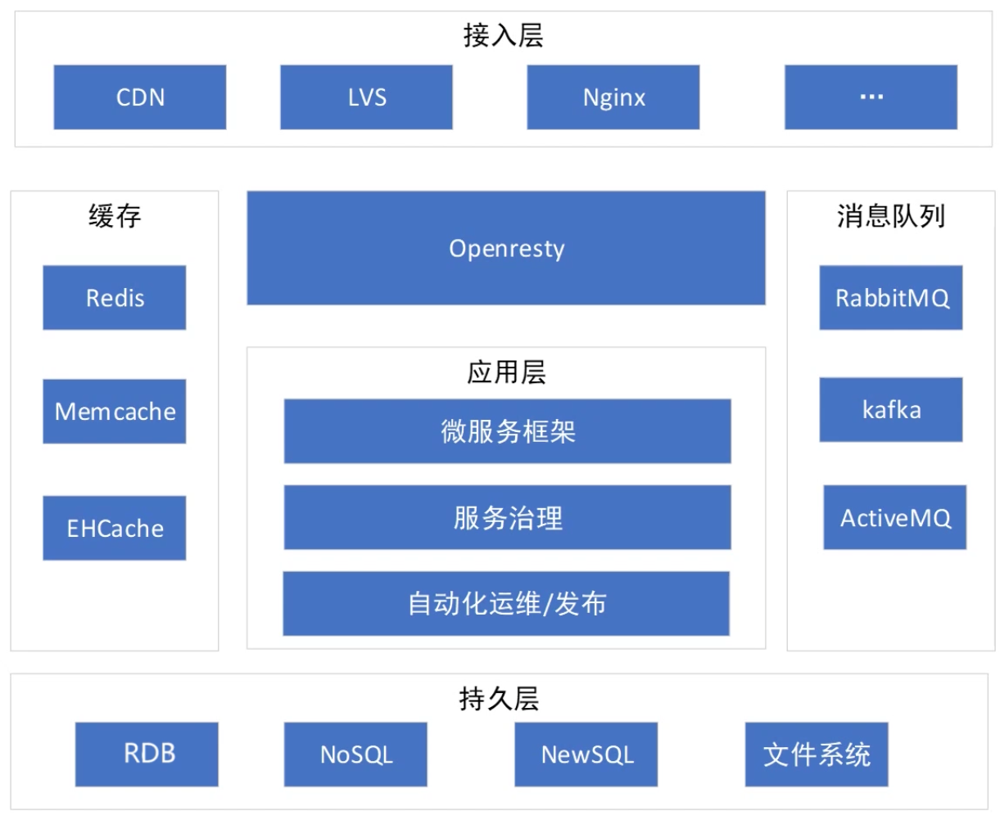
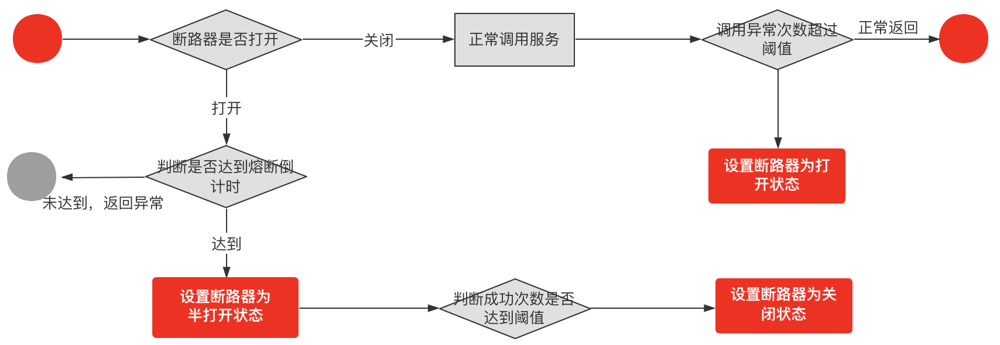

# 一、微服务

- [Microservices](https://martinfowler.com/articles/microservices.html)

## 1、微服务

### 1.1、微服务与SOA的关系

通过对比SOA 和微服务的一些具体做法：
- 服务粒度：SOA 的服务粒度要粗一些，而微服务的服务粒度要细一些
- 服务通信：SOA 采用了 ESB 作为服务间通信的关键组件，负责服务定义、服务路由、消息转换、消息传递，总体上是重量级的实现。微服务推荐使用统一的协议和格式，例如，RESTful 协议、RPC 协议，无须 ESB 这样的重量级实现；
- 服务交付：OA 对服务的交付并没有特殊要求，因为 SOA 更多考虑的是兼容已有的系统；微服务的架构理念要求“快速交付”；
- 应用场景：OA 更加适合于庞大、复杂、异构的企业级系统；微服务更加适合于快速、轻量级、基于 Web 的互联网系统，这类系统业务变化快，需要快速尝试、快速交付；

通过上面对比发现，SOA 和微服务本质上是两种不同的架构设计理念，只是在“服务”这个点上有交集而已，并不存在孰优孰劣，只是应用场景不同而已；

### 1.2、微服务与微服务架构

- 微服务：强调的是服务的大小，它关注的是某一个点，是具体解决某一个问题/提供落地对应服务的一个服务应用；
- 微服务架构：微服务架构一种架构模式或者说是一种架构风格，它提倡将单一应用程序划分成一组小的服务，每个服务运行在其独立的进程中，服务之间互相协调、互相配合，为用户提供最终价值。服务之间采用轻量级通信机制互相沟通，这些服务是围绕业务能力建立的，并且可以由完全自动化的部署机构独立部署。这些服务的集中管理只有最低限度，可以用不同的编程语言编写并使用不同的数据存储技术；

微服务的核心是远程通信和服务治理。远程通信提供了服务之间通信的桥梁，服务治理则提供了服务的后勤保障

### 1.3、微服务的陷阱

微服务具体有哪些坑： 

（1）服务划分过细，服务间关系复杂：服务划分过细，单个服务的复杂度确实下降了，但整个系统的复杂度却上升了，因为微服务将系统内的复杂度转移为系统间的复杂度了；从理论的角度来计算，n 个服务的复杂度是 n×(n-1)/2，整体系统的复杂度是随着微服务数量的增加呈指数级增加的；

（2）服务数量太多，团队效率急剧下降

（3）调用链太长，性能下降：由于微服务之间都是通过 HTTP 或者 RPC 调用的，每次调用必须经过网络

（4）调用链太长，问题定位困难：由于微服务数量较多，且故障存在扩散现象，快速定位到底是哪个微服务故障是一件复杂的事情

（5）没有自动化支撑，无法快速交付：如果没有相应的自动化系统进行支撑，都是靠人工去操作，那么微服务不但达不到快速交付的目的，甚至还不如一个大而全的系统效率高

（6）没有服务治理，微服务数量多了后管理混乱

### 1.4、微服务优缺点

优点：
- 每个服务足够内聚，足够小，代码容易理解，这样能够聚焦一个值得的业务功能；
- 开发简单，开发效率提高；
- 微服务能够被小团队独立开发；
- 微服务是松耦合的，可以独立部署；
- 微服务能够使用不同的语言开发；
- 易于与第三方集成；
- 微服务知识业务逻辑的代码，不会前端相关组件产生关系；

缺点：
- 分布式系统的复杂性；
- 多服务运维难度高；
- 系统部署依赖；
- 服务通信成本；
- 数据一致性；
- 系统集成测试；
- 性能监控；

### 1.5、微服务技术栈

- 服务开发：SpringBoot、Spring、SpringMVC
- 服务配置与管理：Netflix的Archaius、阿里的Diamond
- 服务注册：Eureka、Consul、Zookeeper等
- 服务调用：Rest、Rpc、Grpc
- 服务负载均衡：Ribbon、Nginx
- 服务监控：
- 服务熔断、降级：Hystrix、Envoy、Resilience4j
- 服务路由（网关）：Zuul、gateway
- 链路追踪：Slueth
- 消息队列：Kafka、RabbitMQ、ActiveMQ、Stream
- 服务配置中心：SpringCloudConfig
- 服务部署：Docker、K8S

## 2、如何实践

### 2.1、服务粒度

针对微服务拆分过细导致的问题，建议基于团队规模进行拆分，“三个火枪手”原则，即一个微服务三个人负责开发；
- 首先，从系统规模来讲，3 个人负责开发一个系统，系统的复杂度刚好达到每个人都能全面理解整个系统，又能够进行分工的粒度；
- 其次，从团队管理来说，3 个人可以形成一个稳定的备份，即使 1 个人休假或者调配到其他系统，剩余 2 个人还可以支撑；
- 最后，从技术提升的角度来讲，3 个人的技术小组既能够形成有效的讨论，又能够快速达成一致意见；

“三个火枪手”的原则主要应用于微服务设计和开发阶段，如果微服务经过一段时间发展后已经比较稳定，处于维护期了，无须太多的开发，那么平均 1 个人维护 1 个微服务甚至几个微服务都可以

### 2.2、拆分方法

- 为什么做架构拆分？通常最直接目的就是做系统之间解耦、子系统之间解耦，或模块之间的解耦。
- 为什么要做系统解耦？系统解耦后，使得原本错综复杂的调用逻辑能有序地分布到各个独立的系统中，从而使得拆封后的各个系统职责更单一，功能更为内聚。
- 为什么要做职责单一？因为职责单一的系统功能逻辑的迭代速度会更快，会提高研发团队响应业务需求的速度，也就是提高了团队的开发效率。
- 为什么要关注开发效率？研发迭代效率的提升是任何一家公司在业务发展期间都最为关注的问题，所以从某种程度上看，架构拆分是系统提效最直接的手段。

常见的拆分方式

（1）基于业务逻辑拆分：将系统中的业务模块按照职责范围识别出来，每个单独的业务模块拆分为一个独立的服务。

规模粗和规模细都没有问题，因为拆分基础都是业务逻辑，要判断拆分粒度，不能从业务逻辑角度，而要根据前面介绍的“三个火枪手”的原则，计算一下大概的服务数量范围，然后再确定合适的“职责范围”，否则就可能出现划分过粗或者过细的情况，而且大部分情况下会出现过细的情况。

（2）基于可扩展拆分：将系统中的业务模块按照稳定性排序，将已经成熟和改动不大的服务拆分为稳定服务，将经常变化和迭代的服务拆分为变动服务

这样拆分主要是为了提升项目快速迭代的效率，避免在开发的时候，不小心影响了已有的成熟功能导致线上问题。

（3）基于可靠性拆分：将系统中的业务模块按照优先级排序，将可靠性要求高的核心服务和可靠性要求低的非核心服务拆分开来，然后重点保证核心服务的高可用，这样拆分带来下面几个好处：
- 避免非核心服务故障影响核心服务
- 核心服务高可用方案可以更简单
- 能够降低高可用成本

（4）基于性能拆分：将性能要求高或者性能压力大的模块拆分出来，避免性能压力大的服务影响其他服务。常见的拆分方式和具体的性能瓶颈有关，可以拆分 Web 服务、数据库、缓存等

### 2.3、基础设施

微服务基础设施包含：
- 服务发现
- 服务路由
- 服务容错
- 服务监控
- 服务跟踪
- 服务安全
- API网关
- 接口框架
- 配置中心
- 自动化测试
- 自动化部署

如果微服务的数量并不是很多的话，并不是每个基础设施都是必须的。通常情况下，建议按照下面优先级来搭建基础设施：
- 服务发现、服务路由、服务容错：这是最基本的微服务基础设施。
- 接口框架、API 网关：主要是为了提升开发效率，接口框架是提升内部服务的开发效率，API 网关是为了提升与外部服务对接的效率。
- 自动化部署、自动化测试、配置中心：主要是为了提升测试和运维效率。
- 服务监控、服务跟踪、服务安全：主要是为了进一步提升运维效率。

后面两个重要性会随着微服务节点数量增加而越来越重要；

## 4、微服务选型

### 4.1、微服务选型依据

- 整体解决方案和框架成熟度
- 社区热度
- 可维护性
- 学习曲线

### 4.2、微服务框架对比

Dubbo、HSF、DubboX
- 功能定位
- 支持Rest
- 支持多语言
- 负载均衡
- 配置服务
- 服务调用链调用
- 高可用、容错

## 5、微服务设计原则

- API
- Service
- Dao/Repo

### 5.1、不同维度拆分微服务

- 压力模型：高频高并发流量（商品详情页、优惠计算）、低频突发流量（秒杀、批量上架）------> 服务隔离【热点数据、热点隔离】
- 主链路规划：搜索、详情、购物车、下单、支付  -----> 服务隔离、异常容错、流控、弹性
- 大中台：领域模型拆分（DDD）
- 用户群体拆分：2C、2B、用户端、运营、采购 ----> 相同领域、独有场景
- 前后台业务：商家后台、运营后台

### 5.2、微服务改造

- 抗压维度：低频瞬时流量场景（商品发布服务、库存发布）、高频匀速流量场景（商品详情页、商品搜索服务）
- 业务维度：定时任务（改价单、库存发布计划）、主链路 + 用户场景（商品详情页、商品搜索服务、营销优惠计算、领券、购物车、订单页商品信息、广告投放）、运营场景（商品编辑、类目编辑、营销规则设置、商品发布服务）
- 隔离业务场景、剥离高频接口

### 5.3、微服务的无状态化

有状态：上下文依赖，缺乏水平扩展，比如单机Session、单机缓存（Hash + 本地缓存的热点方案）

应用无状态、配置管理有状态

### 5.4、接口版本控制兼容

API Version 实现思路：
- RPC接口：可以指定具体的接口版本
- HTTP接口：通过path 或 header（在header中设置版本号） --> 业务网关

## 6、微服务问题

### 6.1、服务雪崩

### 6.2、服务熔断

#### 1、断路器原理

熔断，形象一点儿说：熔断机制参考了电路中保险丝的保护原理，当电路出现短路、过载时，保险丝就会自动熔断，保证整体电路的安全。

而在微服务架构中，服务的熔断机制是指：在服务 A 调用服务 B 时，如果 B 返回错误或超时的次数超过一定阈值，服务 A 的后续请求将不再调用服务 B。这种设计方式就是断路器模式；

在这种模式下，服务调用方为每一个调用的服务维护一个有限状态机，在这个状态机中存在关闭、半打开和打开三种状态：
- 关闭：正常调用远程服务。
- 半打开：尝试调用远程服务。
- 打开：直接返回错误，不调用远程服务

这三种状态之间切换的过程如下。
- `关闭`转换`打开`：当服务调用失败的次数累积到一定的阈值时，服务熔断状态，将从关闭态切换到打开态。
- `打开`转换`半打开`：当熔断处于打开状态时，我们会启动一个超时计时器，当计时器超时后，状态切换到半打开态。
- `半打开`转换`关闭`：在熔断处于半打开状态时，请求可以达到后端服务，如果累计一定的成功次数后，状态切换到关闭态

#### 2、如何实现断路器

- [resilience4j](https://github.com/resilience4j/resilience4j)

#### 3、服务熔断中需考虑的设计

- 异常处理
- 异常的类型
- 日志
- 手动重置
- 加快熔断器的熔断操作
- 重复失败请求

### 6.3、服务降级

**降级设计的原理：**

降级设计本质上是站在系统整体可用性的角度上考虑问题：当资源和访问量出现矛盾时，在有限的资源下，放弃部分非核心功能或者服务，保证整体的可用性。这是一种有损的系统容错方式；这样看来，熔断也是降级的一种手段（除此之外还有限流、兜底服务等）

**如何设计一个降级机制：**

从架构设计的角度出发，降级设计就是在做取舍，你要从服务降级和功能降级两方面来考虑

在实现上，服务降级可以分为读操作降级和写操作降级。
- 读操作降级：做数据兜底服务，比如将兜底数据提前存储在缓存中，当系统触发降级时，读操作直接降级到缓存，从缓存中读取兜底数据，如果此时缓存中也不存在查询数据，则返回默认值，不在请求数据库；
- 写操作降级：同样的，将之前直接同步调用写数据库的操作，降级为先写缓存，然后再异步写入数据库；

提炼一下这两种情况的设计原则。
- 读操作降级的设计原则，就是取舍非核心服务。
- 写操作降级的设计原则，就是取舍系统一致性：实现方式是把强一致性转换成最终一致性。比如，两个系统服务通过 RPC 来交互，在触发降级时，将同步 RPC 服务调用降级到异步 MQ 消息队列中，然后再由消费服务异步处理

**降级的方式：**
- 延迟服务：比如发表了评论，重要服务，比如在文章中显示正常，但是延迟给用户增加积分，只是放到一个缓存中，等服务平稳之后再执行；
- 在粒度范围内关闭服务（片段降级或服务功能降级）：比如关闭相关文章的推荐，直接关闭推荐区；
- 页面异步请求降级：比如商品详情页上有推荐信息/配送至等异步加载的请求，如果这些信息响应慢或者后端服务有问题，可以进行降级；
- 页面跳转（页面降级）：比如可以有相关文章推荐，但是更多的页面则直接跳转到某一个地址；
- 写降级：比如秒杀抢购，我们可以只进行Cache的更新，然后异步同步扣减库存到DB，保证最终一致性即可，此时可以将DB降级为Cache。 
- 读降级：比如多级缓存模式，如果后端服务有问题，可以降级为只读缓存，这种方式适用于对读一致性要求不高的场景

### 6.4、服务容错

### 6.5、线程隔离

### 6.6、接口版本兼容

### 6.7、流量整形

- 限流：令牌桶、漏斗
- 增强算法：预热模型（Guava）

### 6.8、服务治理

- [如何搭建服务治理平台](https://blog.51cto.com/u_13609606/3108217)

如何维护当前可用的服务列表：注册中心

（1）服务注册
（2）服务发现：基于client的服务发现，服务主动拉取
（3）发起调用
（4）服务续约/心跳
（5）服务剔除

### 6.9、主链路规划

用户流量漏斗模型：流量由多到少

确保主链路，提高转化率

比如下单链路场景：主搜导购 → 购物车 → 下单

主搜导购：
- 导流：站内、直播、直通车、分会场、类目渠道、抖音、聚划算等；
- 转化：SKU、库存信息、用户评论、图片空间、富文本信息、收藏夹、客服中心、热销排行、视频空间、营销计算、活动信息；

购物车：
- 添加购物车
- 商品列表信息
- 营销计算
- 商家信息模组
- 页面操作：修改数量、删除商品；
- 导购模组：掌柜热卖、最近浏览、画像推荐

下单：
- 创建订单
- 商品列表信息
- 营销计算
- 地址模块
- 支付系统对接

### 6.10、链路监控

离群点分析，在链路监控中，可以通过离群点分析来判断某个时间段或者时间点内业务发生异常；

## 7、EDA事件驱动

### 7.1、概述

### 7.2、适用场景

- 异步处理
- 跨平台/语言通信
- 应用解耦
- 可靠投递
- 最终一致性

# 二、微服务授权认证

- HTTP 基本认证
- 基于 Session 的认证：分布式Session
- 基于 Token 的认证
    - JWT
    - OAuth2.0

# 三、微服务治理

 ## 1、负载均衡

 参考：[分布式-负载均衡](../分布式.md#九负载均衡)

 ## 2、熔断

  参考：[分布式-熔断](../分布式.md#1熔断)

 ## 3、降级

 参考：[分布式-降级](../分布式.md#2降级)

 ## 4、限流

  参考：[分布式-限流](../分布式.md#3限流)

## 5、隔离

隔离是构建高可用和高性能的微服务架构中的一环，因为在出现故障的时候，隔离可以把影响限制在一个可以忍受的范围内。

使用隔离策略主要是为了达到 3 个目的：
- 提升可用性，也就是说防止被影响或防止影响别人。这部分也叫做故障隔离。
- 提升性能，这是隔离和熔断、降级、限流不同的地方，一些隔离方案能够提高系统性能，而且有时候甚至能做到数量级提升。
- 提升安全性，也就是为安全性比较高的系统提供单独的集群、使用更加严苛的权限控制、迎合当地的数据合规要求等。

一般的原则是**核心与核心隔离**，**核心与非核心隔离**

### 5.1、隔离措施

- **机房隔离：**就是把核心业务单独放进一个机房隔离，不会和其他不重要的服务混在一起。这个机房可能会有更加严格的变更流程、管理措施和权限控制，所以它的安全性会更高；

    机房隔离和多活看起来有点儿像，但是从概念上来说差异还是挺大的。这里的隔离指的是不同服务分散在不同的机房，而多活强调的是同一个服务在不同的城市、不同的机房里面有副本

- **实例隔离：**指某个服务独享某个实例的全部资源。当然这里指的是常规意义上的实例，比如说你在云厂商里面买了一个 4C8G 的机器，实例隔离就是指服务独享了这个实例，没有和其他组件共享；

- **分组隔离：**通常是指一起部署的服务上有多个接口或者方法，那么就可以利用分组机制来达成隔离的效果
    - B 端一个组，C 端一个组。
    - 普通用户一个组，VIP 用户一个组。
    - 读接口一个组，写接口一个组。这种也叫做读写隔离。比如说在生产内容的业务里面，没有实行制作库和线上库分离的话，那么就可以简单地把读取内容划分成一个组，编辑内容划分成另外一个组。
    - 快接口一个组，慢接口一个组。这个和前面的读写隔离可能会重叠，因为一般来说读接口就是比较快；

- **连接池隔离和线程池隔离：**一般的做法都是给核心服务单独的连接池和线程池。这么做对于性能的改进也是很有帮助的，尤其是连接池隔离；比如：慢任务隔离，一个线程池专门执行慢任务，一个是执行快任务。而当任务开始执行的时候，先在快任务线程池里执行一些简单的逻辑，确定任务规模，这一步也就是为了识别慢任务。比如说根据要处理的数据量的大小，分出慢任务。如果是快任务，就继续执行。否则，转交给慢任务线程池

- **第三方依赖隔离：**是指为核心服务或者热点专门提供数据库集群、消息队列集群等第三方依赖集群；

### 5.2、隔离缺点

**贵且浪费**

隔离本身并不是没有代价的：
- 一方面，隔离往往会带来资源浪费。例如为核心业务准备一个独立的 Redis 集群，它的效果确实很好，性能很好，可用性也很好。但是代价就是需要更多钱， Redis 本身需要钱，维护它也需要钱。
- 另外一方面，隔离还容易引起资源不均衡的问题。比如说在连接池隔离里面，可能两个连接池其中一个已经满负荷了，另外一个还是非常轻松。当然，公司有钱的话就没有什么缺点了；

## 6、超时控制

超时控制也是构建高可用系统的一环，因为它能够节省系统资源，提高资源的有效利用率。

### 6.1、概述

超时控制是一个非常简单的东西，它是指在规定的时间内完成操作，如果不能完成，那么就返回一个超时响应。

主要关注以下几个点：
- 超时控制的目标或者说好处。
- 超时控制的形态。
- 如何确定超时时间？
- 超时之后能不能中断业务？
- 谁来监听超时时间？

**超时控制目标：**
- 一是确保客户端能在预期的时间内拿到响应；
- 二是及时释放资源。这其中影响最大的是线程和连接两种资源；
    - 释放线程：在超时的情况下，客户端收到了超时响应之后就可以继续往后执行，等执行完毕，这个线程就可以被用于执行别的业务。而如果没有超时控制，那么这个线程就会被一直占有。而像 Go 这种语言，协程会被一直占有。
    - 释放连接：连接可以是 RPC 连接，也可以是数据库连接。类似的道理，如果没有拿到响应，客户端会一直占据这个连接

**超时控制形态：**
- 调用超时控制：比如说你在调用下游接口的时候，为这一次调用设置一个超时时间；
- 链路超时控制：是指整条调用链路被一个超时时间控制。比如说你的业务有一条链路是 A 调用 B，B 调用 C。如果链路超时时间是 1s，首先 A 调用 B 的超时时间是 1s，如果 B 收到请求的时候已经过去了 200ms，那么 B 调用 C 的超时时间就不能超过 800ms；

链路超时控制在微服务架构里面用得比较多，一般在核心服务或者非常看重响应时间的服务里面采用。

**确定超时时间：**
常见的 4 种确定超时时间的方式是：
- 根据用户体验来确定；
- 根据被调用接口的响应时间来确定
- 根据压测结果来确定；
- 根据代码来确定；

**根据用户体验：**

一般的做法就是根据用户体验来决定超时时间。比如说产品经理认为这个用户最多只能在这里等待 300ms，那么你的超时时间就最多设置为 300ms

**根据响应时间：**

在实践中，大多数时候都是根据被调用接口的响应时间来确定超时时间。一般情况下，你可以选择使用 99 线或者 999 线来作为超时时间。
- 所谓的 99 线是指 99% 的请求，响应时间都在这个值以内。比如说 99 线为 1s，那么意味着 99% 的请求响应时间都在 1s 以内。
- 999 线也是类似的含义。

**根据代码计算：**

假如说你现在有一个接口，里面有三次数据库操作，还有一次访问 Redis 的操作和一次发送消息的操作，那么你接口的响应时间就应该这样计算：

`接口的响应时间=数据库响应时间×3+Redis响应时间+发送消息的响应时间`

**超时中断业务：**

所谓的中断业务是指，当调用一个服务超时之后，这个服务还会继续执行吗？答案是基本上会继续执行，除非服务端自己主动检测一下本次收到的请求是否已经超时了；

**监听超时时间：**

一般都是微服务框架客户端来监听超时时间，当然一些框架也能在服务端监听超时时间：
- 框架客户端监听超时时间的情况下，如果在发起请求之前，就已经超时了，那么框架客户端根本不会发起请求，而是直接返回超时响应。这等于直接帮我们中断了业务的后续步骤；
- 如果框架客户端已经发出了请求，之后触发了超时时间，那么框架客户端就会直接返回一个超时错误给应用代码。后续服务端返回了响应，框架客户端会直接丢弃；
- 框架服务端监听超时的情况下，如果在收到请求的时候就已经超时了，那么框架服务端根本不会调用服务端应用代码，而是直接给框架客户端返回一个超时响应；
- 如果在等待业务响应的时候触发了超时，框架服务端会立刻释放连接，继续处理下一个请求。那么当应用返回响应的时候，它会直接丢弃，不会再回写响应；

### 6.2、相关面试题

- 如何提高系统可用性；
- 如何防止连接泄露、线程泄露；
- 为什么要使用超时？缺乏超时控制会有什么问题？
- 怎么确定超时时间；
- 超时时间过长有什么问题？过短又有什么问题；
- 超时控制应该在服务端还是客户端；

### 6.3、链路控制超时

链路超时控制和普通超时控制最大的区别：链路超时控制会作用于整条链路上的任何一环。

例如在 A 调用 B，B 调用 C 的链路中，如果 A 设置了超时时间 1s，那么 A 调用 B 不能超过 1s。然后当 B 收到请求之后，如果已经过去了 200ms，那么 B 调用 C 的超时时间就不能超过 800ms。因此链路超时的关键是在链路中传递超时时间；

大部分情况下，**链路超时时间在网络中传递是放在协议头的**。如果是 RPC 协议，那么就放在 RPC 协议头，比如说 Dubbo 的头部；如果是 HTTP 那么就是放在 HTTP 头部。比较特殊的是 gRPC 这种基于 HTTP 的 RPC 协议，它是利用 HTTP 头部作为 RPC 的头部，所以也是放在 HTTP 头部的。至于放的是什么东西，就取决于不同的协议是如何设计的了；

正常来说，在链路中传递的可以是**剩余超时时间**，也可以是**超时时间戳**；目前来说**剩余超时时间**用得比较多，一般是以毫秒作为单位传递一个数值。它的缺点是服务端收到请求之后需要减去网络传输时间，得到真正的超时时间；
- **剩余超时时间：**比如说剩余 1s，那么就用毫秒作为单位，数值是 1000。这种做法的缺陷就是服务端收到请求之后，要减去请求在网络中传输的时间。比如说 C 收到请求，剩余超时时间是 500ms，如果它知道 B 到 C 之间请求传输要花去 10ms，那么 C 应该用 500ms 减去 10 ms 作为真实的剩余超时时间。不过现实中比较难知道网络传输花了 10ms 这件事；
- **超时时间戳：**那么就会受到时钟同步影响。假如说此时此刻，A 的时钟是 00:00:00，而 B 的时钟是 00:00:01，也就是 A 的时钟比 B 的时钟慢了一秒。那么如果 A 传递的超时时间戳是 00:00:01，那么 B 一收到请求，就会认为这个请求已经超时了；

**计算网络传输时间**最好的方式就是使用性能测试。在模拟线上环境的情况下，让客户端发送平均大小的请求到服务端，采集传输时间，取一个平均值作为网络传输时间。另外一个方式就是不管。比如说正常情况下，A 调用 B，A 和 B 都在同一个机房，网络传输连 1ms 都不用。相比我们超时时间动辄设置为几百毫秒，这一点时间完全可以忽略不计。不过万一服务涉及到了跨机房，尤其是那种机房在两个城市的，城市还离得远的，这部分时间就要计算在内

# 四、微服务部署

## 1、蓝绿发布

## 2、滚动发布

## 3、灰度发布

- [nginx+lua+redis实现灰度发布](https://juejin.cn/post/7313446602440933414)

灰度发布， 也叫金丝雀发布。是指在黑与白之间，能够平滑过渡的一种发布方式。AB test就是一种灰度发布方式，让一部分用户继续用A，一部分用户开始用B，如果用户对B没有什么反对意见，那么逐步扩大范围，把所有用户都迁移到B上面来

## 4、A/B 测试

# 参考资料

* [理解微服务架构的核心](https://segmentfault.com/a/1190000014352312)
* [Dubbo面试题](https://mp.weixin.qq.com/s/Q_En263YPBsmuu5bBI6Rcw)
* [Dubbo服务暴露、调用过程](https://www.jianshu.com/p/1ff25f65587c)
* [Dubbo中SPI的使用](https://mp.weixin.qq.com/s/DdTw_4xBXU1NTv2Sm3xEZg)
* [Dubbo中SPI的实现原理](https://juejin.im/post/5c909949e51d450fae18deb8)
* [Dubbo中Filter原理](https://www.jianshu.com/p/c5ebe3e08161)
* [Hystrix工作原理](https://segmentfault.com/a/1190000012439580)
* [SpringCloud与Dubbo对比](http://youzhixueyuan.com/comparison-of-dubbo-and-springcloud-architecture-design.html)
* [Soul网关](https://github.com/Dromara/soul)
* [微服务架构设计](https://gudaoxuri.gitbook.io/microservices-architecture/)
* [服务探测](https://github.com/megaease/easeprobe)
