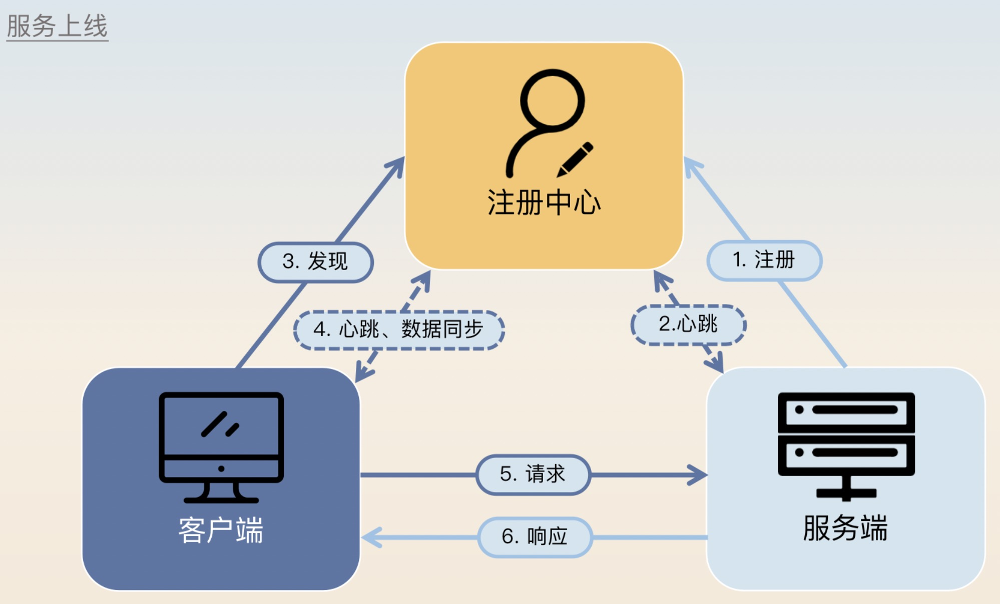
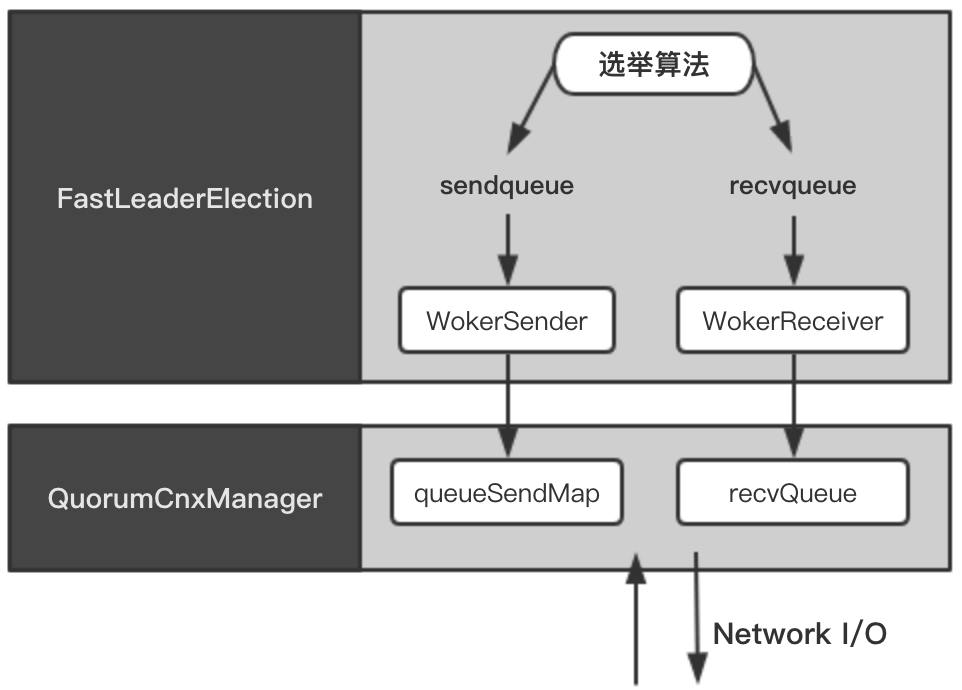
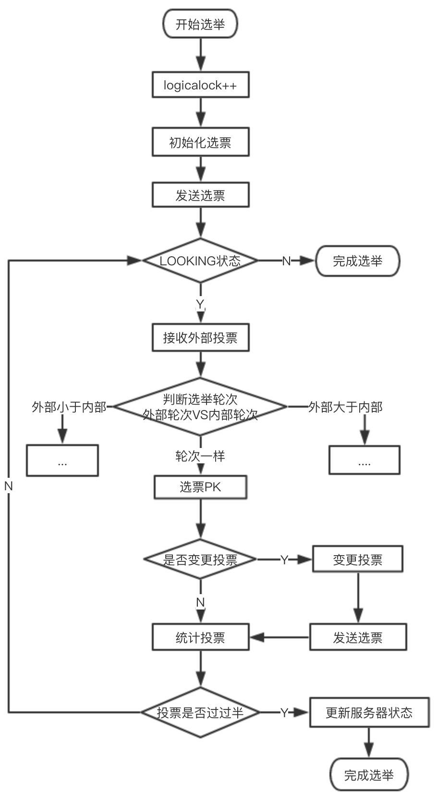
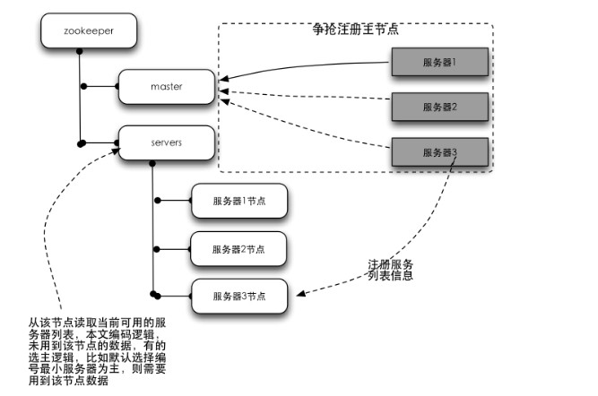

# 一、服务注册中心

- [微服务注册中心怎么选](https://mp.weixin.qq.com/s/ae7xyLMZoWdaEvkKgvNd6w)

## 1、服务注册中心模型



**服务注册过程：**
- 服务端启动的时候，需要往注册中心里注册自身的信息，主要是定位信息。
- 注册成功之后，注册中心和服务端要保持心跳。
- 客户端第一次发起对某个服务的调用之前，要先找注册中心获得所有可用服务节点列表，随后客户端会在本地缓存每个服务对应的可用节点列表。
- 客户端和注册中心要保持心跳和数据同步，后续服务端有任何变动，注册中心都会通知客户端，客户端会更新本地的可用节点列表。
- 客户端发送请求。
- 服务端返回响应。

**服务下线过程：**
- 服务端通知注册中心自己准备下线了。
- 注册中心通知客户端某个服务端下线了。
- 客户端收到通知之后，新来的请求就不会再给该服务端发过去。
- 服务端等待一段时间之后，暂停服务并下线；

需要注意的是，服务端必须要等待一段时间才能下线。因为从它通知注册中心自己要下线，到客户端收到通知，是有一段延时的，这段延时就是服务端要等待的最小时间

## 2、服务注册高可用

主要考虑以下几个点：注册服务端崩溃检测、客户端容错和注册中心选型

### 2.1、注册服务端崩溃检测

如果服务端宕机了，无法通知到注册中心；因此为了提高可用性，需要让注册中心尽快发现服务端已经崩溃了，而后通知客户端。所以问题的关键就在于注册中心怎么判断服务端已经崩溃了；

其实可以通过心跳来判断，但是可能因为偶发的网络抖动导致心跳失败，但此时服务端并没有宕机；

如何处理这种问题呢？
- 注册中心在和服务端进行心跳的时候失败了，就要立刻通知客户端该服务端已经不可用了，那么客户端就不会再发请求过来；
- 注册中心还要继续往服务端发心跳。如果只是偶发性的心跳失败，那么注册中心后面心跳是肯定能够连上的，这时候注册中心再通知客户端这个服务端是可用的

理论上来说，在心跳失败之后如果不进行重试就直接判定服务端崩溃，那么就难以处理偶发性网络不通的问题。而如果要重试，比如说在注册中心和服务端的模型里面，重试三次，而且重试间隔是十秒钟，那么注册中心确定服务端崩溃就需要三十秒。在这三十秒内，客户端估计有成千上万的请求尝试发到崩溃的服务端，结果都失败了；

所以比较好的策略是立刻重试几次，如果都失败了就再间隔一段时间继续重试。所有的重试机制实际上也是要谨慎考虑重试次数和重试间隔的，确保在业务可以接受的范围内重试成功。不过再怎么样，从服务端崩溃到客户端知道，中间总是存在一个时间误差的，这时候就需要客户端来做容错了


### 2.2、客户端容错

客户端容错是指尽量在注册中心或者服务端节点出现问题的时候，依旧保证请求能够发送到正确的服务端节点上；

一般的策略是客户端在发现调不通之后，应该尝试换另外一个节点进行重试。如果客户端上的服务发现组件或者负载均衡器能够根据调用结果来做一些容错的话，那么它们应该要尝试将这个节点挪出可用节点列表，在短时间内不要再使用这个节点了。后面再考虑将这个节点挪回去；

### 2.3、注册中心选型

注册中心选型类似于其他中间件选型，要考虑的因素非常多。比如说中间件成熟度、社区活跃度、性能等因素。相比之下，注册中心更加关注 CAP 中选 CP 还是选 AP 的问题；

P 分区容错性是肯定要选的，那么剩下的就是选 C（一致性） 还是选 A（可用性） 了。那么你要先理解在注册中心选型里面，一致性和可用性究竟哪个更加重要？标准答案是可用性，也就意味着 CP 和 AP 你应该选 AP；

在注册中心选型上，重要的是 CAP 原理中应该选择 AP，比如说 Eureka，又或者 Nacos 启用 AP 模式

# 二、Zookeeper

* [Zookeeper的数据发布与订阅模式](http://blog.csdn.net/zuoanyinxiang/article/details/50937892)
* [Zookeeper或者其他](https://mp.weixin.qq.com/s/dqUj7iWoLxE9dK7hjpMT7A)
* [Zookeeper概述](https://mp.weixin.qq.com/s/WNdovBpvJJanJArS2R1emg)
* [zk启动流程](https://juejin.im/post/5c7be87ce51d45721073e413)
* [zookeeper面试题](https://www.cnblogs.com/lanqiu5ge/p/9405601.html)
* 《从Paxos到Zookeeper分布式一致性原理与实践》

## 1、Zookeeper 是什么

源代码开放的分布式协调服务，是一个高性能的分布式数据一致性解决方案。那些复杂的、容易出错的分布式一致性服务封装起来，构成一个高效可靠的原语集，并提供一系列简单易用的接口给用户使用。Zookeeper 可以保证分布式一致性特征：
- 顺序一致性：从同一个客户端发起的事务请求，最终将会严格按照其发起顺序被应用到 Zookeeper 中去

	zookeeper采用了全局递增的事务Id来标识，所有的proposal（提议）都在被提出的时候加上了`ZXID`，`ZXID`实际上是一个64位的数字，高32位是epoch（时期; 纪元; 世; 新时代）用来标识leader是否发生改变，如果有新的leader产生出来，epoch会自增，低32位用来递增计数。当新产生proposal的时候，会依据数据库的两阶段过程，首先会向其他的server发出事务执行请求，如果超过半数的机器都能执行并且能够成功，那么就会开始执行

- 原子性：所有事务请求的处理结果在整个集群中所有的机器上的应用情况是一致的.也就是说要么整个集群所有机器都成功应用了某个事务，要么都没有应用.不会存在集群中部分机器应用了该事务，而其他没有应用的情况
- 单一视图：无论客户端连接的是哪个 Zookeeper 服务器，其看到的服务端数据模型都是一致的.
- 可靠性：一旦服务端成功应用了一个事务，并完成了对客户端的响应，那么该事务所引起的服务端状态变更便会一直保留下来.
- 实时性：一旦一个事务被成功应用，那么客户端能够立即从服务端上读取到这个事务变更后的最新数据状态

zookeeper提供了
- 文件系统：Zookeeper提供一个多层级的节点命名空间（节点称为znode）。与文件系统不同的是，这些节点都可以设置关联的数据，而文件系统中只有文件节点可以存放数据而目录节点不行。
Zookeeper为了保证高吞吐和低延迟，在内存中维护了这个树状的目录结构，这种特性使得Zookeeper不能用于存放大量的数据，每个节点的存放数据zab上限为1M
- 通知机制

## 2、典型应用场景

### 2.1、数据发布/订阅

- 通常数据订阅有两种方式：推模式和拉模式，推模式一般是服务器主动向客户端推送信息，拉模式是客户端主动去服务器获取数据(通常是采用定时轮询的方式);
- Zookeeper 采用两种方式相结合：

	发布者将数据发布到ZK集群节点上，订阅者通过一定的方法告诉服务器，对哪个节点的数据感兴趣，那服务器在这些节点的数据发生变化时，就通知客户端，客户端得到通知后可以去服务器获取数据信息.

### 2.2、负载均衡

- 首先DB在启动的时候先把自己在ZK上注册成一个临时节点，ZK 的节点后面我们会讲到有两种，一种是永久节点，一类是临时节点临时节点在服务器出现问题的时候，节点会自动的从ZK上删除，那么这样ZK上的服务器列表就是最新的可用的列表
- 客户端在需要读写数据库的时候首先它去ZooKeeper得到所有可用的DB的连接信息(一张列表)
- 客户端随机选择一个与之建立连接
- 当客户端发现连接不可用的时候可再次从ZK上获取可用的DB连接信息，当然也可以在刚获取的那个列表里移除掉不可用的连接后再随机选择一个DB与之连接

### 2.3、命名服务

就是提供名称的服务，例如数据库表格ID，一般用得比较多的有两种ID，一种是自动增长的ID，一种是UUID(9291d71a-0354-4d8e-acd8-64f7393c64ae)，两种ID各自都有缺陷：自动增长的ID局限在单库单表中使用，不能在分布式中使用；UUID 可以在分布式中使用但是由于ID没有规律难于理解。可以借用ZK来生成一个顺序增长的，可以在集群环境下使用的，命名易于理解的ID；

### 2.4、分布式协调/通知

心跳检测，在分布式系统中，我们常常需要知道某个机器是否可用。传统的开发中，可以通过Ping某个主机来实现，Ping 得通说明对方是可用的，相反是不可用的。ZK中我们让所有的机其都注册一个临时节点，我们判断一个机器是否可用，我们只需要判断这个节点在ZK中是否存在就可以了，不需要直接去连接需要检查的机器，降低系统的复杂度；

### 2.5、分布式锁

### 2.6、分布式队列


## 3、优势

- 其是源代码开放的;
- 高性能，易用稳定的工业级产品
- 有着广泛的应用

## 4、ZAB协议

ZAB协议是为分布式协调服务Zookeeper专门设计的一种支持崩溃恢复的原子广播协议。其包括两种基本的模式：崩溃恢复和消息广播。

当整个zookeeper集群刚刚启动或者Leader服务器宕机、重启或者网络故障导致不存在过半的服务器与Leader服务器保持正常通信时，所有进程（服务器）进入崩溃恢复模式，首先选举产生新的Leader服务器，然后集群中Follower服务器开始与新的Leader服务器进行数据同步，当集群中超过半数机器与该Leader服务器完成数据同步之后，退出恢复模式进入消息广播模式，Leader服务器开始接收客户端的事务请求生成事物提案来进行事务请求处理

**ZAB和Paxos算法的联系与区别**

- 相同点：
	- 两者都存在一个类似于Leader进程的角色，由其负责协调多个Follower进程的运行
	- Leader进程都会等待超过半数的Follower做出正确的反馈后，才会将一个提案进行提交
	- ZAB协议中，每个Proposal中都包含一个 epoch 值来代表当前的Leader周期，Paxos中名字为Ballot
- 不同点：ZAB用来构建高可用的分布式数据主备系统（Zookeeper），Paxos是用来构建分布式一致性状态机系统。

## 5、Zookeeper 下 Server工作状态

服务器具有四种状态，分别是`LOOKING、FOLLOWING、LEADING、OBSERVING`。
- `LOOKING`：寻找Leader状态。当服务器处于该状态时，它会认为当前集群中没有Leader，因此需要进入Leader选举状态。
- `FOLLOWING`：跟随者状态。表明当前服务器角色是Follower。
- `LEADING`：领导者状态。表明当前服务器角色是Leader。
- `OBSERVING`：观察者状态。表明当前服务器角色是Observer

## 6、基本概念

Zookeeper架构

### 6.1、集群角色

- Leader：服务器是整个Zookeeper集群工作机制中的核心，为客户端提供读和写服务。负责进行投票的发起和决议，更新系统状态，Leader 是由选举产生;
- Follower：用于接受客户端请求并向客户端返回结果，在选主过程中参与投票;
- Observer：服务器充当一个观察者的角色，不参与 Leader 的选举过程，也不参与写操作的"过半写成功"策略，因此 Observer 可以在不影响写性能的情况下提升集群的读性能.只提供非事务的操作；可以接受客户端连接，接受读写请求，写请求转发给 Leader，但 Observer 不参加投票过程，只同步 Leader 的状态，Observer 的目的是为了扩展系统，提高读取速度

### 6.2、会话

Zookeeper 对外的服务端口默认是 2181

指客户端和ZooKeeper服务器的连接，ZooKeeper 中的会话叫Session，客户端靠与服务器建立一个TCP的长连接来维持一个Session，客户端在启动的时候首先会与服务器建立一个TCP连接，通过这个连接，客户端能够通过心跳检测与服务器保持有效的会话，也能向ZK服务器发送请求并获得响应

### 6.3、数据节点

节点分两类

- 构成集群的机器，称为机器节点
- 数据模型中的数据单元，为数据节点(ZNode).Zookeeper 的将所有数据存储在内存中，数据模型是一个树，由斜杠进行分割的路径。ZNode分为持久节点和临时节点.
	- 持久节点：一旦被这个 ZNode 被创建了，除非主动进行 ZNode 的移出操作，否则这个 ZNode 将一直保存在 Zookeeper上；
	- 临时节点：与客户端的会话绑定，一旦客户端会话失效，那么该客户端创建的所有临时节点都会被移出；

一般分类：
- `PERSISTENT-持久化目录节点`：客户端与zookeeper断开连接后，该节点依旧存在 
- `PERSISTENT_SEQUENTIAL-持久化顺序编号目录节点`：客户端与zookeeper断开连接后，该节点依旧存在，只是Zookeeper给该节点名称进行顺序编号 
- `EPHEMERAL-临时目录节点`：客户端与zookeeper断开连接后，该节点被删除 
- `EPHEMERAL_SEQUENTIAL-临时顺序编号目录节点`：客户端与zookeeper断开连接后，该节点被删除，只是Zookeeper给该节点名称进行顺序编号

### 6.4、版本

版本类型说明version当前数据节点数据内容的版本号cversion当前数据节点子节点的版本号aversion当前数据节点ACL变更版本号

### 6.5、watcher-事件监听器

ZooKeeper 允许用户在指定节点上注册一些Watcher，当数据节点发生变化的时候，ZooKeeper 服务器会把这个变化的通知发送给感兴趣的客户端，然后客户端根据Watcher通知状态和事件类型做出业务上的改变。

#### 6.5.1、工作机制

- 客户端注册watcher
- 服务端处理watcher
- 客户端回调watcher

#### 6.5.2、Watcher特性总结

- 一次性：无论是服务端还是客户端，一旦一个Watcher被触发，Zookeeper都会将其从相应的存储中移除。这样的设计有效的减轻了服务端的压力，不然对于更新非常频繁的节点，服务端会不断的向客户端发送事件通知，无论对于网络还是服务端的压力都非常大。
- 客户端串行执行：客户端Watcher回调的过程是一个串行同步的过程。
- 轻量：
	- Watcher通知非常简单，只会告诉客户端发生了事件，而不会说明事件的具体内容。
	- 客户端向服务端注册Watcher的时候，并不会把客户端真实的Watcher对象实体传递到服务端，仅仅是在客户端请求中使用boolean类型属性进行了标记。
- watcher event异步发送watcher的通知事件从server发送到client是异步的，这就存在一个问题，不同的客户端和服务器之间通过socket进行通信，由于网络延迟或其他因素导致客户端在不通的时刻监听到事件，由于Zookeeper本身提供了ordering guarantee，即客户端监听事件后，才会感知它所监视znode发生了变化。所以我们使用Zookeeper不能期望能够监控到节点每次的变化。Zookeeper只能保证最终的一致性，而无法保证强一致性。
- 注册watcher getData、exists、getChildren
- 触发watcher create、delete、setData
- 当一个客户端连接到一个新的服务器上时，watch将会被以任意会话事件触发。当与一个服务器失去连接的时候，是无法接收到watch的。而当client重新连接时，如果需要的话，所有先前注册过的watch，都会被重新注册。通常这是完全透明的。只有在一个特殊情况下，watch可能会丢失：对于一个未创建的znode的exist watch，如果在客户端断开连接期间被创建了，并且随后在客户端连接上之前又删除了，这种情况下，这个watch事件可能会被丢失

### 6.6、ACL：Access Control Lists

ZooKeeper 采用ACL策略来进行权限控制

#### 6.6.1、权限模式（Scheme）

- IP：从IP地址粒度进行权限控制
- Digest：最常用，用类似于 username:password 的权限标识来进行权限配置，便于区分不同应用来进行权限控制
- World：最开放的权限控制方式，是一种特殊的digest模式，只有一个权限标识“world:anyone”
- Super：超级用户

#### 6.6.2、授权对象

授权对象指的是权限赋予的用户或一个指定实体，例如IP地址或是机器灯。

#### 6.6.3、权限 Permission

- CREATE：数据节点创建权限，允许授权对象在该Znode下创建子节点
- DELETE：子节点删除权限，允许授权对象删除该数据节点的子节点
- READ：数据节点的读取权限，允许授权对象访问该数据节点并读取其数据内容或子节点列表等
- WRITE：数据节点更新权限，允许授权对象对该数据节点进行更新操作
- ADMIN：数据节点管理权限，允许授权对象对该数据节点进行ACL相关设置操作

## 7、集群搭建

部署模式：单机模式、伪集群模式、集群模式。

### 7.1、集群环境

- JDK 环境
- 下载 zookeeper(一般放在 opt 目录下)

### 7.2、集群搭建

- 进入 `zookeeper/conf` 目录下，复制一份文件：`cp zoo_sample.cfg  zoo.cfg`
- 编辑：`zoo.cfg`，修改：`dataDir=/data/zkData`
- 配置输入三台集群的IP，端口等信息，一般格式是：`server.id=host:port:port`
	```
	server.1=192.168.89.135:2888:3888
	server.2=192.168.89.136:2888:3888
	server.3=192.168.89.137:2888:3888
	```
- 在上述 配置的`dataDir`中目录，如`zkdata`，下新建文件 myid，里面输入 `server.id` 中的 id
- 可以将 zookeeper 添加的环境变量中；
- 启动zookeeper：`bin/zkServer.sh start`
- 检查状态：`bin/zkServer.sh status`
	```
	telnet 192.168.139.129 2181 
	然后输入 stat 命令，如果出现如下，代表集群创建成功：
	[root@localhost bin]# telnet 192.168.89.156 2181
	Trying 192.168.139.129...
	Connected to 192.168.139.129.
	Escape character is '^]'.
	stat
	Zookeeper version： 3.4.10-39d3a4f269333c922ed3db283be479f9deacaa0f， built on 03/23/2017 10：13 GMT
	Clients：
		/192.168.139.129：49149[0](queued=0，recved=1，sent=0)
	Latency min/avg/max： 0/0/0
	Received： 1
	Sent： 0
	Connections： 1
	Outstanding： 0
	`ZXID`： 0x0
	Mode： follower
	Node count： 4
	Connection closed by foreign host
	```
	注意：可能存在防火墙的问题，CentOS 7.0默认使用的是firewall作为防火墙，这里改为iptables防火墙
	- 关闭并禁止firewall开机启动：systemctl stop firewalld.service
	- 禁止开机启动：systemctl disable firewalld.service
	- 安装iptables防火墙：yum install iptables-services 

### 7.3、单机集群

[](../../辅助资料/环境配置/Linux环境.md#1zookeeper单机安装)

### 7.4、伪集群搭建

## 8、客户端使用

### 8.1、zkCli.sh 使用

**8.1.1、使用方法**
```
./zkCli.sh -timeout 0 -r -server ip：port
(1).timeout 0： 表示超时时间，单位为毫秒
(2).-r： 只读，其是只读模式，如果一台机器与集群中的过半机器失去联系，如果需要其还能处理读服务，加上该选项
(3).-server ip：port 服务器的ip和端口
```

**8.1.2、常用命令：h 可以查看**
```
(1).stat path [watch]：path节点的状态信息
	cZXID = 0x100000016						--> 创建时的事务ID
	ctime = Sun Aug 06 09：47：58 CST 2017 	--> 创建时间
	mZXID = 0x10000002a						--> 最后一次更新是的事务ID
	mtime = Sat Sep 02 19：33：15 CST 2017	--> 修改时间
	pZXID = 0x10000001d						--> 子节点列表最后一次修改事务的ID：为当前节点添加子节点，或者删除子节点
	cversion = 4							--> 子节点版本号
	dataVersion = 2							-->	数据版本号
	aclVersion = 0							--> ACL权限版本好
	ephemeralOwner = 0x0					-->	创建临时节点的版本号，如果是持久节点，该值为0
	dataLength = 3							-->	当前节点存放数据的长度
	numChildren = 4							-->	当前节点的子节点长度
(2).set path data [version]：修改，version 版本号，每次修改，dataVersion 字段都增加1
	如果添加版本号，所添加的版本号需要跟上一次查询的结果出来的一致
(3).ls path [watch]：列出当前path下的节点个数
(4).delquota [-n|-b] path：删除配额信息
(5).ls2 path [watch]：列出当前path下节点个数和path节点的状态
(6).setAcl path acl
(7).setquota -n|-b val path：设置配额，如果超过限制，不会报错，会在日志文件 zookeeper.out 中打印
	-n 表示数据节点个数，表示包含当前节点的节点个数
	-b 节点数据长度限制;
	==> 超过配额日志提示：Quota exceeded： /node_4 count=4 limit=3
(8).history：查看客户端执行的历史命令
	[zk： 192.168.139.129：2181(CONNECTED) 33] history
	23 - delete /node_4
	24 - ls /
	25 - create /node_4 4
	26 - setquota -n 3 /node_4
	27 - create /node_4/node_4_1 41
	28 - create /node_4/node_4_2 41
	29 - create /node_4/node_4_2 41
	30 - create /node_4/node_4_3 41
	31 - ls /node_4
	32 - listquota /node_4
	33 - history
(9).redo cmdno：重复执行历史命令，cmdno 对应 history 命令的签名的数字，如23
(11).printwatches on|off
(12).delete path [version]：只能删除没有子节点的节点
(13).sync path
(14).listquota path：查看指定节点的配额信息
	count --> 表示节点个数， bytes --> 表示数据长度
	Output quota for /node_4 count=3，bytes=-1 -->配额信息， -1 表示没有限制
	Output stat for /node_4 count=4，bytes=7	--> 当前节点的状态
(15).rmr path：删除含有子节点的节点，递归删除所有子节点和当前节点
(16).get path [watch]：获取当前节点存储的内容和状态信息
(17).create [-s] [-e] path data acl
	==> -s 表示顺序节点; -e 表示是临时节点，只存在当前会话; data 数据的值
(18).addauth scheme auth
(19).quit 
(20).getAcl path
(21).close：关闭连接其他的 zookeeper 服务
(22).connect host：port --> 连接其他 zookeeper 服务
```

### 8.2、Java 中 zookeeper 的使用

**8.2.1、连接：**

ZooKeeper zookeeper = new ZooKeeper("192.168.139.129：2181"， 5000， new MyWatcher());

- 第一个参数：zookeeper服务器地址和端口;
- 第二个参数：表示超时时间
- Watcher：zookeeper的时间监听器，一般由Java端实现该接口；并实现方法：public void process(WatchedEvent event);

**8.2.2、创建节点：**
```
(1).同步创建节点：
	public String create(final String path， byte data[]， List<ACL> acl， CreateMode createMode)
	path --> 路径
	data --> 数据
	acl --> 对应路径的权限
	creatMode --> 创建模式，持久还是临时，异或是有序节点
(2). public void create(final String path， byte data[]， List<ACL> acl，
		CreateMode createMode，  StringCallback cb， Object ctx)
	path --> 路径
	data --> 数据
	acl --> 对应路径的权限
	creatMode --> 创建模式，持久还是临时，异或是有序节点
	cb --> 回调函数， 实现的是 interface StringCallback extends AsyncCallback{
		public void processResult(int rc， String path， Object ctx， String name);
	}
	ctx --> 回调函数的上下文，对应 StringCallback 中的 ctx
```
**8.2.3、修改节点：**
```
(1).同步修改：
	public Stat setData(final String path， byte data[]， int version)
	path --> 需要修改的路径
	data --> 修改的数据
	version --> 版本号
(2).异步修改：
	public void setData(final String path， byte data[]， int version， StatCallback cb， Object ctx)
	cb --> 回调函数 实现的是 interface StatCallback extends AsyncCallback {
		public void processResult(int rc， String path， Object ctx， Stat stat);
	}
	ctx --> 回调上下文数据
```
**8.2.4、删除节点：**

- 同步删除：public void delete(final String path， int version)
- 异步删除：public void delete(final String path， int version， VoidCallback cb， Object ctx)

**8.2.5、查询节点：**
```
2.5.1.查询子节点：
	(1).同步：
		public List<String> getChildren(String path， boolean watch)
		path --> 获取的路径
		watch --> 是否关注节点的变化
	(2).异步：
		public void getChildren(String path， boolean watch， Children2Callback cb， Object ctx)
```
**8.2.6、ACL 权限控制：**

- **8.2.6.1、权限模式：ip， digest**
- **8.2.6.2、授权对象：**

	ip权限模式：  具体的ip地址<br>
	digest权限模式： username：Base64(SHA-1(username：password))

- **8.2.6.3、权限(permission)：**

	CREATE(C)， DELETE(D)，READ(R)， WRITE(W)， ADMIN(A)

- **8.2.6.4、权限组合： scheme + ID + permission**

	- setAcl /node_4 ip：192.168.139.129：crdwa --> 给节点4设置所有权限
	- setAcl /node_4 digest：jike：qndFHmJXEbheIbz+nbBQIbL2/vA=：crdwa <br>
			jike：qndFHmJXEbheIbz+nbBQIbL2/vA= 由 DigestAuthenticationProvider.generateDigest("jike：123456")生成

- **8.2.6.5、Java 中设置权限：**
	```
	(1).通过 ACL 构造相应的构造器
		ACL aclIp = new ACL(Perms.READ，new Id("ip"，"192.168.1.105"));
		ACL aclDigest = new ACL(Perms.READ|Perms.WRITE，
			new Id("digest"，DigestAuthenticationProvider.generateDigest("jike：123456")));
		ArrayList<ACL> acls = new ArrayList<ACL>();
		acls.add(aclDigest);
		acls.add(aclIp);					
		String path = zookeeper.create("/node_4"， "123".getBytes()， acls， CreateMode.PERSISTENT);
	(2).通过 Ids(org.apache.zookeeper.ZooDefs.Ids)类
		OPEN_ACL_UNSAFE， READ_ACL_UNSAFE， CREATOR_ALL_ACL
		如果是 CREATOR_ALL_ACL， 需要按照如下方式写：
		zookeeper.addAuthInfo("digest"， "jike：123456".getBytes());			
		String path = zookeeper.create("/node_4"， "123".getBytes()， Ids.CREATOR_ALL_ACL， CreateMode.PERSISTENT);
	```

### 8.3、ZkClient 客户端的使用

ZkClient 是Github上一个开源的ZooKeeper客户端.ZkClient 在ZooKeeper原生API接口之上进行了包装，是一个更加易用的ZooKeeper客户端.同时，ZkClient 在内部实现了诸如Session超时重连、Watcher反复注册等功能

- 订阅节点变化：
```java
zkClient.subscribeChildChanges("/node_2"， new IZkChildListener() {
	public void handleChildChange(String parentPath， List<String> currentChilds)
			throws Exception {
		System.out.println(parentPath);
		System.out.println(currentChilds);
	}
});
```
- 订阅节点数据的变化：注意其序列化器使用：BytesPushThroughSerializer
```java
zkClient.subscribeDataChanges("/node_2"， new IZkDataListener() {
	public void handleDataDeleted(String dataPath) throws Exception {
		System.out.println(dataPath);
	}
	public void handleDataChange(String dataPath， Object data) throws Exception {
		System.out.println(dataPath + "：" + data.toString());
	}
});
```

## 9、zookeeper核心原理

### 9.1、工作原理

Zookeeper 的核心是原子广播，这个机制保证了各个Server之间的同步。实现这个机制的协议叫做Zab协议。Zab协议有两种模式，它们分别是恢复模式（选主）和广播模式（同步）。当服务启动或者在领导者崩溃后，Zab就进入了恢复模式，当领导者被选举出来，且大多数Server完成了和 leader的状态同步以后，恢复模式就结束了。状态同步保证了leader和Server具有相同的系统状态

### 9.2、系统模型


### 9.3、序列化与协议


### 9.4、会话


### 9.5、服务器启动


### 9.6、Leader选举

Leader选举是保证分布式数据一致性的关键所在。当Zookeeper集群中的一台服务器出现以下两种情况之一时，需要进入Leader选举
- 服务器初始化启动。
- 服务器运行期间无法和Leader保持连接。

#### 9.6.1、服务器启动时期的Leader选举

若进行Leader选举，则至少需要两台机器，这里选取3台机器组成的服务器集群为例。在集群初始化阶段，当有一台服务器Server1启动时，其单独无法进行和完成Leader选举，当第二台服务器Server2启动时，此时两台机器可以相互通信，每台机器都试图找到Leader，于是进入Leader选举过程。选举过程如下：

- （1）每个Server发出一个投票：由于是初始情况，Server1和Server2都会将自己作为Leader服务器来进行投票，每次投票会包含所推举的服务器的`myid`和`ZXID`，使用(`myid`, `ZXID`)来表示，此时Server1的投票为(1, 0)，Server2的投票为(2, 0)，然后各自将这个投票发给集群中其他机器。

- （2）接受来自各个服务器的投票：集群的每个服务器收到投票后，首先判断该投票的有效性，如检查是否是本轮投票、是否来自LOOKING状态的服务器。

- （3）处理投票：针对每一个投票，服务器都需要将别人的投票和自己的投票进行PK，PK规则如下
	- 优先检查`ZXID`。`ZXID`比较大的服务器优先作为Leader。
	- 如果`ZXID`相同，那么就比较`myid`。`myid`较大的服务器作为Leader服务器。

	对于Server1而言，它的投票是(1, 0)，接收Server2的投票为(2, 0)，首先会比较两者的`ZXID`，均为0，再比较`myid`，此时Server2的m`yid`最大，于是更新自己的投票为(2, 0)，然后重新投票，对于Server2而言，其无须更新自己的投票，只是再次向集群中所有机器发出上一次投票信息即可。

- （4）统计投票：每次投票后，服务器都会统计投票信息，判断是否已经有过半机器接受到相同的投票信息，对于Server1、Server2而言，都统计出集群中已经有两台机器接受了(2, 0)的投票信息，此时便认为已经选出了Leader。

- （5）改变服务器状态：一旦确定了Leader，每个服务器就会更新自己的状态，如果是Follower，那么就变更为FOLLOWING，如果是Leader，就变更为LEADING

#### 9.6.2、服务器运行时期的Leader选举

在Zookeeper运行期间，Leader与非Leader服务器各司其职，即便当有非Leader服务器宕机或新加入，此时也不会影响Leader，但是一旦Leader服务器挂了，那么整个集群将暂停对外服务，进入新一轮Leader选举，其过程和启动时期的Leader选举过程基本一致。假设正在运行的有Server1、Server2、Server3三台服务器，当前Leader是Server2，若某一时刻Leader挂了，此时便开始Leader选举。选举过程如下：

- （1）变更状态：Leader挂后，余下的非Observer服务器都会讲自己的服务器状态变更为LOOKING，然后开始进入Leader选举过程。

- （2）每个Server会发出一个投票：在运行期间，每个服务器上的`ZXID`可能不同，此时假定Server1的`ZXID`为123，Server3的`ZXID`为122；在第一轮投票中，Server1和Server3都会投自己，产生投票(1, 123)，(3, 122)，然后各自将投票发送给集群中所有机器。

- （3）接收来自各个服务器的投票：与启动时过程相同。

- （4）处理投票：与启动时过程相同，此时，Server1将会成为Leader。

- （5）统计投票：与启动时过程相同。

- （6）改变服务器的状态：与启动时过程相同；

#### 9.6.3、Leader选举算法分析

在zookeeper中，提供了三种Leader选举的算法，分别是`LeaderElection（纯UDP实现的）`、`UPD版本的FastLeaderElection`和`TCP版本的FastLeaderElection`，可以通过在配置文件zoo.cfg中使用`electionAlg`属性来指定，分别用数字0~3来表示。0-LeaderElection；1-UPD版本的FastLeaderElection，非授权模式；2-UPD版本的FastLeaderElection，授权模式的；3-TCP版本的FastLeaderElection；

从3.4.0版本开始，zookeeper只保留了`TCP版本的FastLeaderElection`算法。

##### 9.6.3.1、术语

- SID：服务器ID，用来唯一标识一台zookeeper集群中的机器，每台机器不能重复，和myid的值一致
- ZXID：事务ID，用来唯一标识一次服务器状态的变更，每台机器不能重复，和myid的值一致；
- Vote：投票
- Quorum：过半机器数，指的是zookeeper集群中过半的机器数，如果集群中总的机器数是n的话，可以通过`quorum=(n/2 + )`来计算 

##### 9.6.3.2、算法分析

**进入leader选举：**

当一台机器进入Leader选举时，当前集群可能会处于以下两种状态
- 集群中已经存在Leader
- 集群中不存在Leader

对于集群中已经存在Leader而言，此种情况一般都是某台机器启动得较晚，在其启动之前，集群已经在正常工作，对这种情况，该机器试图去选举Leader时，会被告知当前服务器的Leader信息，对于该机器而言，仅仅需要和Leader机器建立起连接，并进行状态同步即可。而在集群中不存在Leader情况下则会相对复杂，其步骤如下：

- **第一次投票**

	无论哪种导致进行Leader选举，集群的所有机器都处于试图选举出一个Leader的状态，即LOOKING状态，LOOKING机器会向所有其他机器发送消息，该消息称为投票。
	
	投票中包含了SID（服务器的唯一标识）和ZXID（事务ID），(SID, ZXID)形式来标识一次投票信息。假定Zookeeper由5台机器组成，SID分别为1、2、3、4、5，ZXID分别为9、9、9、8、8，并且此时SID为2的机器是Leader机器，某一时刻，1、2所在机器出现故障，因此集群开始进行Leader选举。在第一次投票时，每台机器都会将自己作为投票对象，于是SID为3、4、5的机器投票情况分别为(3, 9)，(4, 8)， (5, 8)。

- **变更投票**

	每台机器发出投票后，也会收到其他机器的投票，每台机器会根据一定规则来处理收到的其他机器的投票，并以此来决定是否需要变更自己的投票，这个规则也是整个Leader选举算法的核心所在，其中术语描述如下：
	- `vote_sid`：接收到的投票中所推举Leader服务器的SID。
	- `vote_zxid`：接收到的投票中所推举Leader服务器的ZXID。
	- `self_sid`：当前服务器自己的SID。
	- `self_zxid`：当前服务器自己的ZXID。

	每次对收到的投票的处理，都是对(vote_sid, vote_zxid)和(self_sid, self_zxid)对比的过程：
	- 规则一：如果vote_zxid大于self_zxid，就认可当前收到的投票，并再次将该投票发送出去。
	- 规则二：如果vote_zxid小于self_zxid，那么坚持自己的投票，不做任何变更。
	- 规则三：如果vote_zxid等于self_zxid，那么就对比两者的SID，如果vote_sid大于self_sid，那么就认可当前收到的投票，并再次将该投票发送出去。
	- 规则四：如果vote_zxid等于self_zxid，并且vote_sid小于self_sid，那么坚持自己的投票，不做任何变更。

	5台机器组成的zookeeper投票过程：


- **确定Leader**

	经过第二轮投票后，集群中的每台机器都会再次接收到其他机器的投票，然后开始统计投票，如果一台机器收到了超过半数的相同投票，那么这个投票对应的SID机器即为Leader。此时Server3将成为Leader。

由上面规则可知：**通常那台服务器上的数据越新（ZXID会越大），其成为Leader的可能性越大，也就越能够保证数据的恢复。如果ZXID相同，则SID越大机会越大**

##### 9.6.3.3、Leader选举实现细节

**服务器状态：**

服务器具有四种状态，分别是LOOKING、FOLLOWING、LEADING、OBSERVING。
- LOOKING：寻找Leader状态。当服务器处于该状态时，它会认为当前集群中没有Leader，因此需要进入Leader选举状态；
- FOLLOWING：跟随者状态。表明当前服务器角色是Follower；
- LEADING：领导者状态。表明当前服务器角色是Leader；
- OBSERVING：观察者状态。表明当前服务器角色是Observer；

**投票数据结构：**

每个投票中包含了两个最基本的信息，所推举服务器的SID和ZXID，投票（Vote）在Zookeeper中包含字段如下：
- id：被推举的Leader的SID。
- zxid：被推举的Leader事务ID。
- electionEpoch：逻辑时钟，用来判断多个投票是否在同一轮选举周期中，该值在服务端是一个自增序列，每次进入新一轮的投票后，都会对该值进行加1操作。
- peerEpoch：被推举的Leader的epoch。
- state：当前服务器的状态。

**QuorumCnxManager：网络I/O**

每台服务器在启动的过程中，会启动一个QuorumPeerManager，负责各台服务器之间的底层Leader选举过程中的网络通信

- **消息队列**。

	QuorumCnxManager内部维护了一系列的队列，用来保存接收到的、待发送的消息以及消息的发送器，除接收队列以外，其他队列都按照SID分组形成队列集合，如一个集群中除了自身还有3台机器，那么就会为这3台机器分别创建一个发送队列，互不干扰。
	- recvQueue：消息接收队列，用于存放那些从其他服务器接收到的消息。
	- queueSendMap：消息发送队列，用于保存那些待发送的消息，按照SID进行分组。
	- senderWorkerMap：发送器集合，每个SenderWorker消息发送器，都对应一台远程Zookeeper服务器，负责消息的发送，也按照SID进行分组。
	- lastMessageSent：最近发送过的消息，为每个SID保留最近发送过的一个消息；

- **建立连接**
	
	为了能够相互投票，Zookeeper集群中的所有机器都需要两两建立起网络连接。QuorumCnxManager在启动时会创建一个ServerSocket来监听Leader选举的通信端口(默认为3888)。开启监听后，Zookeeper能够不断地接收到来自其他服务器的创建连接请求，在接收到其他服务器的TCP连接请求时，会进行处理。为了避免两台机器之间重复地创建TCP连接，Zookeeper只允许SID大的服务器主动和其他机器建立连接，否则断开连接。在接收到创建连接请求后，服务器通过对比自己和远程服务器的SID值来判断是否接收连接请求，如果当前服务器发现自己的SID更大，那么会断开当前连接，然后自己主动和远程服务器建立连接。一旦连接建立，就会根据远程服务器的SID来创建相应的消息发送器SendWorker和消息接收器RecvWorker，并启动；

- **消息接收与发送**

	- 消息接收：由消息接收器RecvWorker负责，由于Zookeeper为每个远程服务器都分配一个单独的RecvWorker，因此，每个RecvWorker只需要不断地从这个TCP连接中读取消息，并将其保存到recvQueue队列中。
	- 消息发送：由于Zookeeper为每个远程服务器都分配一个单独的SendWorker，因此，每个SendWorker只需要不断地从对应的消息发送队列中获取出一个消息发送即可，同时将这个消息放入lastMessageSent中。在SendWorker中，一旦Zookeeper发现针对当前服务器的消息发送队列为空，那么此时需要从lastMessageSent中取出一个最近发送过的消息来进行再次发送，这是为了解决接收方在消息接收前或者接收到消息后服务器挂了，导致消息尚未被正确处理。同时，Zookeeper能够保证接收方在处理消息时，会对重复消息进行正确的处理

##### 9.6.3.4、FastLeaderElection算法核心

几个概念：
- 外部投票：特指其他服务器发来的投票。
- 内部投票：服务器自身当前的投票。
- 选举轮次：Zookeeper服务器Leader选举的轮次，即logicalclock
- PK：对内部投票和外部投票进行对比来确定是否需要变更内部投票。

**选票管理**

下图是选票管理过程中相关组件之间的协作关系：



- sendqueue：选票发送队列，用于保存待发送的选票。
- recvqueue：选票接收队列，用于保存接收到的外部投票。
-  WorkerReceiver：选票接收器。其会不断地从QuorumCnxManager中获取其他服务器发来的选举消息，并将其转换成一个选票，然后保存到recvqueue中，在选票接收过程中，如果发现该外部选票的选举轮次小于当前服务器的，那么忽略该外部投票，同时立即发送自己的内部投票。
- WorkerSender：选票发送器，不断地从sendqueue中获取待发送的选票，并将其传递到底层QuorumCnxManager中；

**算法核心**

上图展示了FastLeaderElection模块是如何与底层网络I/O进行交互的。Leader选举的基本流程如下：



- （1）自增选举轮次。Zookeeper规定所有有效的投票都必须在同一轮次中，在开始新一轮投票时，会首先对logicalclock进行自增操作。

- （2）初始化选票。在开始进行新一轮投票之前，每个服务器都会初始化自身的选票，并且在初始化阶段，每台服务器都会将自己推举为Leader。

- （3）发送初始化选票。完成选票的初始化后，服务器就会发起第一次投票。Zookeeper会将刚刚初始化好的选票放入sendqueue中，由发送器WorkerSender负责发送出去。

- （4）接收外部投票。每台服务器会不断地从recvqueue队列中获取外部选票。如果服务器发现无法获取到任何外部投票，那么就会立即确认自己是否和集群中其他服务器保持着有效的连接，如果没有连接，则马上建立连接，如果已经建立了连接，则再次发送自己当前的内部投票。

- （5）判断选举轮次。在发送完初始化选票之后，接着开始处理外部投票。在处理外部投票时，会根据选举轮次来进行不同的处理。
	- 外部投票的选举轮次大于内部投票。若服务器自身的选举轮次落后于该外部投票对应服务器的选举轮次，那么就会立即更新自己的选举轮次(logicalclock)，并且清空所有已经收到的投票，然后使用初始化的投票来进行PK以确定是否变更内部投票。最终再将内部投票发送出去。
	- 外部投票的选举轮次小于内部投票。若服务器接收的外选票的选举轮次落后于自身的选举轮次，那么Zookeeper就会直接忽略该外部投票，不做任何处理，并返回步骤4。
	- 外部投票的选举轮次等于内部投票。此时可以开始进行选票PK。

- （6）选票PK。在进行选票PK时，符合任意一个条件就需要变更投票。
	- 若外部投票中推举的Leader服务器的选举轮次大于内部投票，那么需要变更投票。
	- 若选举轮次一致，那么就对比两者的ZXID，若外部投票的ZXID大，那么需要变更投票。
	- 若两者的ZXID一致，那么就对比两者的SID，若外部投票的SID大，那么就需要变更投票。

- （7）变更投票。经过PK后，若确定了外部投票优于内部投票，那么就变更投票，即使用外部投票的选票信息来覆盖内部投票，变更完成后，再次将这个变更后的内部投票发送出去。

- （8）选票归档。无论是否变更了投票，都会将刚刚收到的那份外部投票放入选票集合recvset中进行归档。recvset用于记录当前服务器在本轮次的Leader选举中收到的所有外部投票（按照服务队的SID区别，如{(1, vote1), (2, vote2)...}）。

- （9）统计投票。完成选票归档后，就可以开始统计投票，统计投票是为了统计集群中是否已经有过半的服务器认可了当前的内部投票，如果确定已经有过半服务器认可了该投票，则终止投票。否则返回步骤4。

- （10）更新服务器状态。若已经确定可以终止投票，那么就开始更新服务器状态，服务器首选判断当前被过半服务器认可的投票所对应的Leader服务器是否是自己，若是自己，则将自己的服务器状态更新为LEADING，若不是，则根据具体情况来确定自己是FOLLOWING或是OBSERVING。

以上10个步骤就是FastLeaderElection的核心，其中步骤4-9会经过几轮循环，直到有Leader选举产生。

## 10、数据同步

整个集群完成Leader选举之后，Learner（Follower和Observer的统称）回向Leader服务器进行注册。当Learner服务器想Leader服务器完成注册后，进入数据同步环节。

数据同步流程：（均以消息传递的方式进行）
- （1）Leader等待server连接；
- （2）Follower连接leader，将最大的zxid发送给leader；
- （3）Leader根据follower的zxid确定同步点；
- （4）完成同步后通知follower 已经成为uptodate状态；
- （5）Follower收到uptodate消息后，又可以重新接受client的请求进行服务了

Zookeeper的数据同步通常分为四类：
- 直接差异化同步（DIFF同步）
- 先回滚再差异化同步（TRUNC+DIFF同步）
- 仅回滚同步（TRUNC同步）
- 全量同步（SNAP同步）

在进行数据同步前，Leader服务器会完成数据同步初始化：
- peerLastZxid：从learner服务器注册时发送的ACKEPOCH消息中提取lastZxid（该Learner服务器最后处理的ZXID）
- minCommittedLog：Leader服务器Proposal缓存队列committedLog中最小ZXID
- maxCommittedLog：Leader服务器Proposal缓存队列committedLog中最大ZXID

直接差异化同步（DIFF同步）：peerLastZxid介于minCommittedLog和maxCommittedLog之间；

先回滚再差异化同步（TRUNC+DIFF同步）：当新的Leader服务器发现某个Learner服务器包含了一条自己没有的事务记录，那么就需要让该Learner服务器进行事务回滚--回滚到Leader服务器上存在的，同时也是最接近于peerLastZxid的ZXID；

仅回滚同步（TRUNC同步）：peerLastZxid 大于 maxCommittedLog

全量同步（SNAP同步）：peerLastZxid 小于 minCommittedLog、Leader服务器上没有Proposal缓存队列且peerLastZxid不等于lastProcessZxid

## 11、应用场景

### 11.1、master 选举

**11.1.1、master 选举**

当主机异常，自动切换到备机继续提供服务，切换过程总选出下一个主机的过程就是master选举

**11.1.2、传统的解决方式：**

采用一个备用节点，这个备用节点定期给主节点发送 ping 包，主节点收到ping包后会向备用节点发送应答ack，当备用节点收到应答，认为主机正常，否则会认为主节点宕机了，备用节点将开始行使主节点职责；

*安全隐患：网络故障*

也就是说主节点没有宕机，只是备用节点在ping的过程中发生了网络故障，备用节点同样收不到应答，会认为主节点挂掉，然后备机会启动自己的master实例.导致系统中有两个主节点，双master。

**11.1.3、zookeeper 实现master选举：**



- 其架构图中显示左侧树状结果为zookeeper集群，右侧为程序服务器，所有服务器在启动的时候，都会订阅	zookeeper 中master节点的删除事件，以便在主服务器宕机时进行抢主操作.所有服务器同时会在server节点下注册一个临时节点，以便于应用程序读取当前可用服务器列表;

- 选举原理：zookeeper的节点有两种类型，持久节点跟临时节点。

	*临时节点有个特性：就是如果注册这个节点的机器失去连接(通常是宕机)，那么这个节点会被zookeeper删除*

	选主过程就是利用这个特性，在服务器启动的时候，去zookeeper特定的一个目录下注册一个临时节点（这个节点作为master，谁注册了这个节点谁就是master），注册的时候，如果发现该节点已经存在，则说明已经有别的服务器注册了（也就是有别的服务器已经抢主成功），那么当前服务器只能放弃抢主，作为从机存在。同时，抢主失败的当前服务器需要订阅该临时节点的删除事件，以便该节点删除时（也就是注册该节点的服务器宕机了或者网络断了之类的）进行再次抢主操作。从机具体需要去哪里注册服务器列表的临时节点，节点保存什么信息，根据具体的业务不同自行约定。选主的过程，其实就是简单的争抢在zookeeper注册临时节点的操作，谁注册了约定的临时节点，谁就是master

### 11.2、订阅发布

#### 11.2.1、基本概念

- 订阅发布可以看成一对多的关系：多个订阅者对象同时监听一个主题对象，这个主题对象在自身状态发生变化时，会通知所有的订阅者对象，使他们能够自动的更新自己的状态；

- 可以让发布方和订阅方，独立封装，独立改变，当一个对象的改变，需要同时改变其他的对象，而且它不知道有多少个对象需要改变时，可以使用发布订阅模式；

- 发布订阅一般由两种设计模式：push模式和pull模式。在push模式中，服务端主动将数据更新发送给所有订阅的客户端；而pull模式是由客户端主动发动请求来获取最新数据，一般是由客户端定时进行轮询拉取的方式。

	zookeeper是采用推拉结合的方式：客户端向服务端注册自己需要关注的节点，一旦节点数据发送变更，那么服务端就会向相应的客户端发送Watcher时间通知，客户端接收到这个消息通知后，需要主动到服务端获取最新的数据。

- 订阅发布在分布式系统中典型应用：配置管理和服务发现
	- 配置管理：是指如果集群中机器拥有某些相同的配置，并且这些配置信息需要动态的改变，我们可以使用发布订阅模式，对配置文件做统一的管理，让这些机器各自订阅配置文件的改变，当配置文件发生改变的时候这些机器就会得到通知，把自己的配置文件更新为最新的配置;
	- 服务发现：是指对集群中的服务上下线做统一的管理，每个工作服务器都可以作为数据的发布方，向集群注册自己的基本信息，而让模型机器作为订阅方，订阅工作服务器的基本信息，当工作服务器的基本信息发生改变时如上下线，服务器的角色和服务范围变更，监控服务器就会得到通知，并响应这些变化

### 11.3、负载均衡

**zookeeper负载均衡和nginx负载均衡区别**

zk的负载均衡是可以调控，nginx只是能调权重，其他需要可控的都需要自己写插件；但是nginx的吞吐量比zk大很多，应该说按业务选择用哪种方式。

### 11.4、分布式锁

[zookeeper分布式锁](#4Zookeeper分布式锁)

### 11.5、分布式队列

- 同步队列，当一个队列的成员都聚齐时，这个队列才可用，否则一直等待所有成员到达。

- 队列按照 FIFO 方式进行入队和出队操作。

第一类，在约定目录下创建临时目录节点，监听节点数目是否是我们要求的数目。

第二类，和分布式锁服务中的控制时序场景基本原理一致，入列有编号，出列按编号。在特定的目录下创建PERSISTENT_SEQUENTIAL节点，创建成功时Watcher通知等待的队列，队列删除序列号最小的节点用以消费。此场景下Zookeeper的znode用于消息存储，znode存储的数据就是消息队列中的消息内容，SEQUENTIAL序列号就是消息的编号，按序取出即可。由于创建的节点是持久化的，所以不必担心队列消息的丢失问题

### 11.6、命名服务


# 三、ETCD

* [服务注册etcd](https://blog.csdn.net/bbwangj/article/details/82584988)
* [ETCD:从Raft原理到实践](https://mp.weixin.qq.com/s/BQSMuTSAYK3pmuR3BD5kvw)
* [ETCD官方网站](https://etcd.io/)

## 1、概述

etcd作为一个受到ZooKeeper与doozer启发而催生的项目，除了拥有与之类似的功能外，更专注于以下四点：
- 简单：基于HTTP+JSON的API让你用curl就可以轻松使用；
- 安全：可选SSL客户认证机制；
- 快速：每个实例每秒支持一千次写操作；
- 可信：使用Raft算法充分实现了分布式

使用etcd的场景默认处理的数据都是控制数据，对于应用数据，只推荐数据量很小，但是更新访问频繁的情况

## 2、etcd与zookeeper

etcd能实现的功能，zookeeper都能实现，那这两者有什么区别呢？

相较之下，ZooKeeper有如下缺点：
- 复杂：ZooKeeper的部署维护复杂，管理员需要掌握一系列的知识和技能；而Paxos强一致性算法也是素来以复杂难懂而闻名于世；另外，ZooKeeper的使用也比较复杂，需要安装客户端，官方只提供了Java和C两种语言的接口；
- 发展缓慢

etcd作为一个后起之秀：
- 简单：使用Go语言编写部署简单；使用HTTP作为接口使用简单；使用Raft算法保证强一致性让用户易于理解；
- 数据持久化：etcd默认数据一更新就进行持久化；
- 安全：etcd支持SSL客户端安全认证

# 四、Nacos

* [Nacos实现原理详解](https://mp.weixin.qq.com/s/Qk-jBUOlw9nAz8V1bI-r6g)
* [Nacos 是如何同时实现AP与CP的](https://www.liaochuntao.cn/2019/06/01/java-web-41/)

- 一般来说，如果不需要存储服务级别的信息且服务实例是通过nacos-client注册，并能够保持心跳上报，那么就可以选择AP模式。当前主流的服务如Spring cloud和Dubbo服务 ,都适用于AP模式，AP模式为了服务的可用性而减弱了一致性，因此AP模式下只支持注册临时实例。
- 如果需要在服务级别编辑或者存储配置信息，那么CP是必须的，K8S服务和DNS服务则适用于CP模式；CP模式下则支持注册持久化实例，此时则是以Raft协议为集群运行模式，该模式下注册实例之前必须先注册服务，如果服务不存在，则会返回错误。

# 五、Eureka

参考[Eureka注册中心](微服务.md#21Eureka服务注册与发现)
