# 1、基本介绍

## 1.1、主要特点

Kafka是分布式发布-订阅消息系统。它最初由LinkedIn公司开发，之后成为Apache项目的一部分。Kafka是一个分布式的，可划分的，冗余备份的持久性的日志服务，它主要用于处理活跃的流式数据。一个多分区、多副本且基于 ZooKeeper 协调的分布式消息系统

> kafka2.8开始将依赖的外部zookeeper移除了，使用内置的

**主要特点：**
- 是基于pull的模式来处理消息消费，追求高吞吐量
- 同时为发布和订阅提供高吞吐量。据了解，Kafka每秒可以生产约25万消息（50 MB），每秒处理55万消息（110 MB）。同时kafka也支持点对点的消息投递，消费者都隶属于一个消费组，相当于点对点模型；
- 可进行持久化操作。将消息持久化到磁盘，因此可用于批量消费，例如ETL，以及实时应用程序。通过将数据持久化到硬盘以及replication防止数据丢失。
- 分布式系统，易于向外扩展。所有的producer、broker和consumer都会有多个，均为分布式的。无需停机即可扩展机器。
- 消息被处理的状态是在consumer端维护，而不是由server端维护。当失败时能自动平衡。
- 支持online和offline的场景。
- 支持分区，并支持跨平台、伸缩性、实时性；
- 基于二进制字节序列消息传输

**主要扮演角色：**
- 消息系统：Kafka和传统的消息系统（也称作消息中间件）都具备系统解耦、冗余存储、流量削峰、缓冲、异步通信、扩展性、可恢复性等功能。与此同时，Kafka 还提供了大多数消息系统难以实现的消息顺序性保障及回溯消费的功能。
- 存储系统： Kafka 把消息持久化到磁盘，相比于其他基于内存存储的系统而言，有效地降低了数据丢失的风险。也正是得益于 Kafka 的消息持久化功能和多副本机制，我们可以把 Kafka 作为长期的数据存储系统来使用，只需要把对应的数据保留策略设置为“永久”或启用主题的日志压缩功能即可。
- 流式处理平台：Kafka 不仅为每个流行的流式处理框架提供了可靠的数据来源，还提供了一个完整的流式处理类库，比如窗口、连接、变换和聚合等各类操作

## 1.2、kafka架构

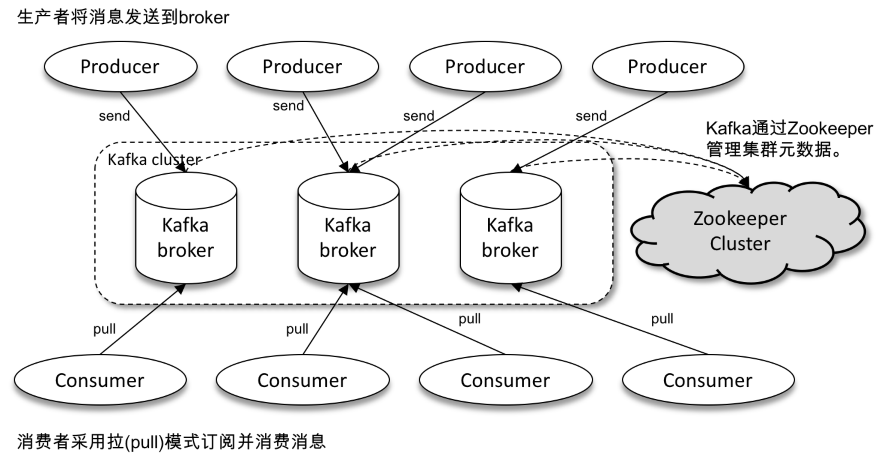

Kafka的整体架构非常简单，是显式分布式架构，producer、broker（kafka）和consumer都可以有多个。Producer，consumer实现Kafka注册的接口，数据从producer发送到broker，broker承担一个中间缓存和分发的作用。broker分发注册到系统中的consumer。broker的作用类似于缓存，即活跃的数据和离线处理系统之间的缓存。客户端和服务器端的通信，是基于简单，高性能，且与编程语言无关的TCP协议。

基本概念：
- `Message`：消息，是通信的基本单位，每个producer可以向一个topic（主题）发布一些消息。
- `Producer`：消息和数据生产者，向Kafka的一个topic发布消息的过程叫做producers。
- `Consumer`：消息和数据消费者，订阅topics并处理其发布的消息的过程叫做consumers。
- `Consumer Group (CG)`：消费者组，由多个 consumer 组成。消费者组内每个消费者负责消费不同分区的数据，一个分区只能由一个组内消费者消费；消费者组之间互不影响。所有的消费者都属于某个消费者组，即消费者组是逻辑上的一个订阅者
- `Broker`：缓存代理，Kafka集群中的一台或多台服务器统称为broker。一台 kafka 服务器就是一个 broker。一个集群由多个 broker 组成。一个 broker 可以容纳多个 topic；
- `Topic`：特指Kafka处理的消息源（feeds of messages）的不同分类，其是一个逻辑上的概念；
- `Partition`：Topic物理上的分组，一个topic可以分为多个partition，每个partition是一个有序的队列；同一主题下的不同分区包含的消息是不同的，分区在存储层面可以看作一个可追加的日志（Log）文件，消息在被追加到分区日志文件的时候都会分配一个特定的偏移量（offset，消息在分区中的唯一标识，Kafka 通过它来保证消息在分区内的顺序性）；在创建主题的时候可以通过指定的参数来设置分区的个数，当然也可以在主题创建完成之后去修改分区的数量，通过增加分区的数量可以实现水平扩展；分区的作用就是提供负载均衡的能力，或者说对数据进行分区的主要原因，就是为了实现系统的高伸缩性（Scalability）

    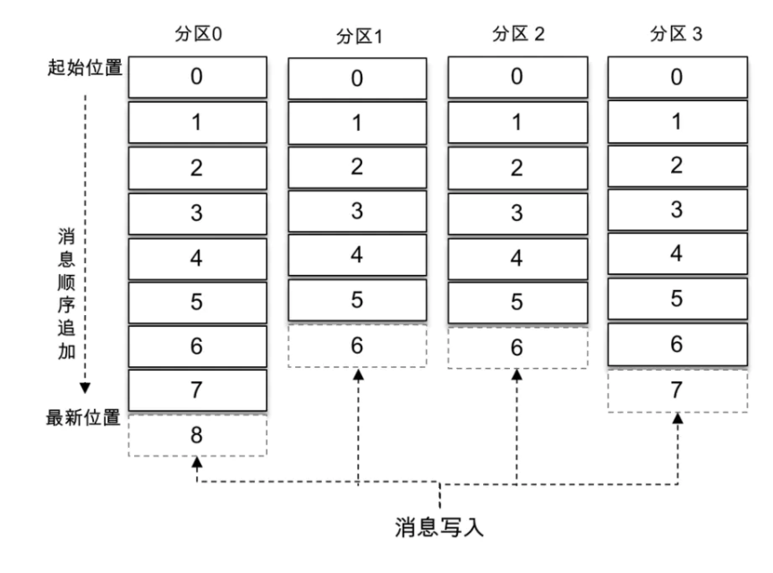

- `Replica副本`：为保证集群中的某个节点发生故障时，该节点上的 partition 数据不丢失，且 kafka 仍然能够继续工作，kafka 提供了副本机制，一个 topic 的每个分区都有若干个副本，副本之间是“一主多从”的关系，其中 leader 副本负责处理读写请求，follower 副本只负责与 leader 副本的消息同步。副本处于不同的 broker 中，当 leader 副本出现故障时，从 follower 副本中重新选举新的 leader 副本对外提供服务。Kafka 通过多副本机制实现了故障的自动转移，当 Kafka 集群中某个 broker 失效时仍然能保证服务可用，通过增加副本数量可以提升容灾能力；

**发送消息的流程：**
- Producer根据指定的partition方法（round-robin、hash等），将消息发布到指定topic的partition里面
- kafka集群接收到Producer发过来的消息后，将其持久化到硬盘，并保留消息指定时长（可配置），而不关注消息是否被消费。
- Consumer从kafka集群pull数据，并控制获取消息的offset

## 1.3、多副本机制

所谓副本（Replica），本质就是一个只能追加写消息的提交日志。根据 Kafka 副本机制的定义，同一个分区下的所有副本保存有相同的消息序列，这些副本分散保存在不同的 Broker 上，从而能够对抗部分 Broker 宕机带来的数据不可用;

Kafka是通过在不同节点上的多副本来解决数据可靠性问题，通过增加副本的数量提升kafka的容灾能力；

同一分区的不同副本中保存的是相同的消息（在同一时刻，副本之间并非完全一样），副本之间是`一主多从`的关系，其中 leader 副本负责处理读写请求，follower 副本只负责与 leader 副本的消息同步。副本处于不同的 broker 中，当 leader 副本出现故障时，从 follower 副本中重新选举新的 leader 副本对外提供服务。Kafka 通过多副本机制实现了故障的自动转移，当 Kafka 集群中某个 broker 失效时仍然能保证服务可用；

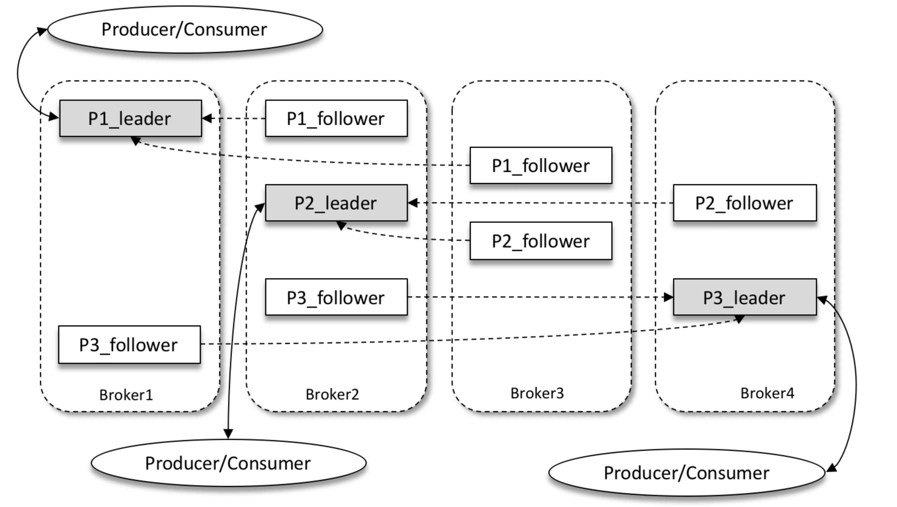

生产者和消费者只与 leader 副本进行交互，而 follower 副本只负责消息的同步，很多时候 follower 副本中的消息相对 leader 副本而言会有一定的滞后；

为什么只允许Leader副本提供服务：
- 方便实现“Read-your-writes”：当你使用生产者 API 向 Kafka 成功写入消息后，马上使用消费者 API 去读取刚才生产的消息；如果允许follow副本提供服务，可能存在延迟；
- 方便实现单调读（Monotonic Reads）：对于一个消费者用户而言，在多次消费消息时，它不会看到某条消息一会儿存在一会儿不存在；

Kafka在2.4版本的时候，推出了新特性，KIP-392: 允许消费者从最近的跟随者副本获取数据，给了读写分离的选择；kafka存在多个数据中心，而数据中心存在于不同机房，当其中一个数据中心需要向另一个数据中心同步数据的时候，如果只能从首领副本进行数据读取的话，需要跨机房来完成，而这些流量带宽又比较昂贵，而利用本地跟随者副本进行消息读取就成了比较明智的选择；

具体配置：
- 在broker端，需要配置参数 `replica.selector.class`，其默认配置为`LeaderSelector`，意思是：消费者从首领副本获取消息，改为`RackAwareReplicaSelector`，即消费者按照指定的rack id上的副本进行消费。还需要配置`broker.rack`参数，用来指定broker在哪个机房。
- 在consumer端，需要配置参数`client.rack`，且这个参数和broker端的哪个`broker.rack`匹配上，就会从哪个broker上去获取消息数据；


### 1.3.1、AR、ISR、OSR

- `AR`：分区中的所有副本统称为 `AR（Assigned Replicas）`；
- `ISR`：所有与 leader 副本保持一定程度同步的副本（包括 leader 副本在内）组成`ISR（In-Sync Replicas）`；`ISR 集合`是 `AR 集合`中的一个子集。消息会先发送到 leader 副本，然后 follower 副本才能从 leader 副本中拉取消息进行同步，同步期间内 follower 副本相对于 leader 副本而言会有一定程度的滞后（默认是不超过10秒）；参数：`replica.lag.time.max.ms`控制；
- `OSR`：与 leader 副本同步滞后过多（超过10秒）的副本（不包括 leader 副本）组成 `OSR（Out-of-Sync Replicas）`集合；

**综上：**`AR=ISR+OSR`。在正常情况下，所有的 follower 副本都应该与 leader 副本保持一定程度的同步，即 `AR=ISR，OSR 集合为空`；

### 1.3.2、如何维护AR、ISR、OSR三者之间的副本

- leader 副本负责维护和跟踪 ISR 集合中所有 follower 副本的滞后状态，当 follower 副本落后太多或失效时，leader 副本会把它从 ISR 集合中剔除；
- 如果 OSR 集合中有 follower 副本“追上”了 leader 副本，那么 leader 副本会把它从 OSR 集合转移至 ISR 集合。
- 默认情况下，当 leader 副本发生故障时，只有在 ISR 集合中的副本才有资格被选举为新的 leader，而在 OSR 集合中的副本则没有任何机会（不过这个原则也可以通过修改相应的参数配置来改变）

### 1.3.3、ISR与HW、LEO

HW 是 `High Watermark` 的缩写，俗称`高水位`，它标识了一个特定的消息偏移量（offset），消费者只能拉取到这个 offset 之前的消息；

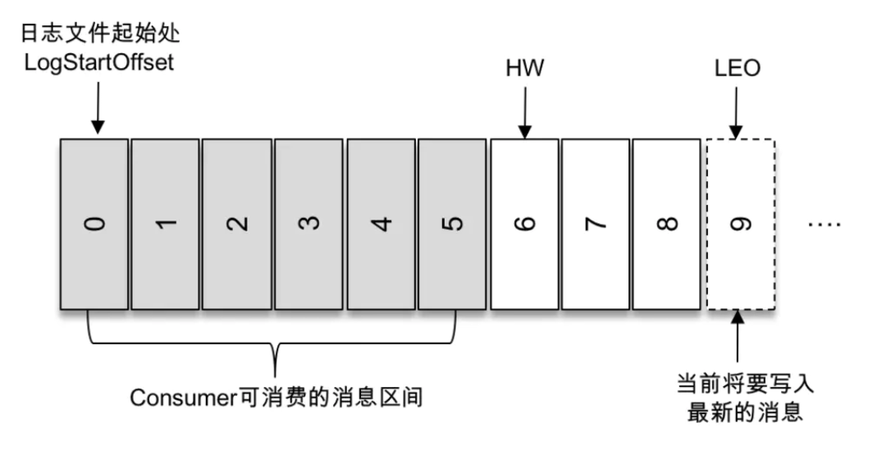

如上图所示，它代表一个日志文件，这个日志文件中有9条消息，第一条消息的 offset（LogStartOffset）为0，最后一条消息的 offset 为8，offset 为9的消息用虚线框表示，代表下一条待写入的消息。日志文件的 HW 为6，表示消费者只能拉取到 offset 在0至5之间的消息，而 offset 为6的消息对消费者而言是不可见的；

LEO 是 `Log End Offset` 的缩写，它标识当前日志文件中下一条待写入消息的 offset，上图中 offset 为9的位置即为当前日志文件的 LEO，LEO 的大小相当于当前日志分区中最后一条消息的 offset 值加1。分区 ISR 集合中的每个副本都会维护自身的 LEO，而 ISR 集合中最小的 LEO 即为分区的 HW，对消费者而言只能消费 HW 之前的消息；

Kafka 的复制机制既不是完全的同步复制，也不是单纯的异步复制。事实上，同步复制要求所有能工作的 follower 副本都复制完，这条消息才会被确认为已成功提交，这种复制方式极大地影响了性能。而在异步复制方式下，follower 副本异步地从 leader 副本中复制数据，数据只要被 leader 副本写入就被认为已经成功提交。在这种情况下，如果 follower 副本都还没有复制完而落后于 leader 副本，突然 leader 副本宕机，则会造成数据丢失；

> Kafka 使用的这种 ISR 的方式则有效地权衡了数据可靠性和性能之间的关系

### 1.3.4、HW更新机制

- [HW更新原理](https://www.cnblogs.com/koktlzz/p/14580109.html)

每一个副本都保存了其HW值和LEO值，即Leader HW（实际上也是Partition HW）、Leader LEO和Follower HW、Follower LEO。而Leader所在的Broker上还保存了其他Follower的LEO值，称为Remote LEO

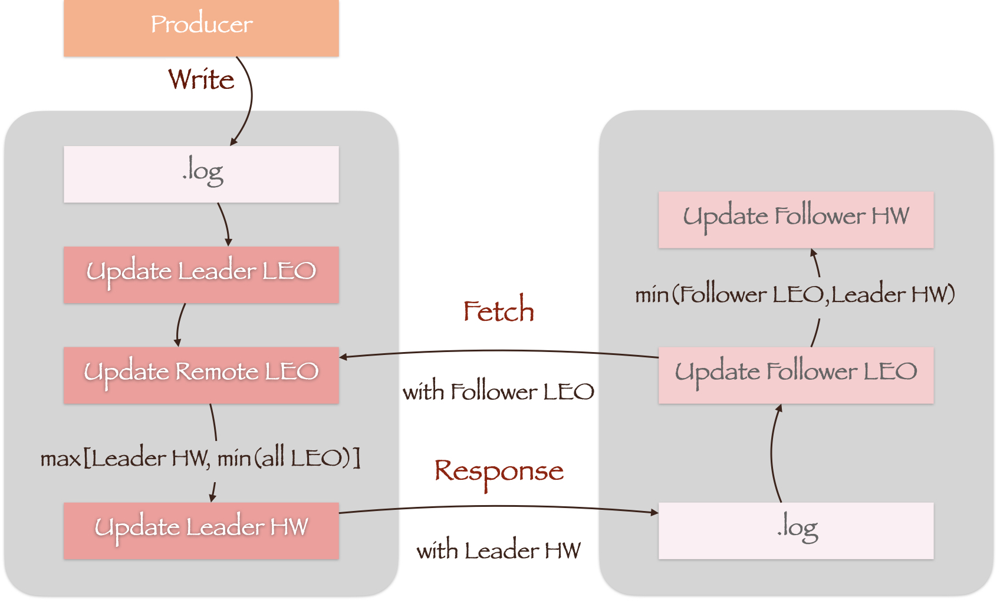

如图所示，当Producer向.log文件写入数据时，Leader LEO首先被更新。而Remote LEO要等到Follower向Leader发送同步请求（Fetch）时，才会根据请求携带的当前Follower LEO值更新。随后，Leader计算所有副本LEO的最小值，将其作为新的Leader HW。考虑到Leader HW只能单调递增，因此还增加了一个LEO最小值与当前Leader HW的比较，防止Leader HW值降低（max[Leader HW, min(All LEO)]）。

Follower在接收到Leader的响应（Response）后，首先将消息写入.log文件中，随后更新Follower LEO。由于Response中携带了新的Leader HW，Follower将其与刚刚更新过的Follower LEO相比较，取最小值作为Follower HW（min(Follower LEO, Leader HW)）；

如果一开始Leader和Follower中没有任何数据，即所有值均为0。那么当Prouder向Leader写入第一条消息，上述几个值的变化顺序如下：

| Leader LEO         | Remote LEO | Leader HW | Follower LEO | Follower HW |      |
| ------------------ | ---------- | --------- | ------------ | ----------- | ---- |
| Producer Write     | 1          | 0         | 0            | 0           | 0    |
| Follower Fetch     | 1          | 0         | 0            | 0           | 0    |
| Leader Update HW   | 1          | 0         | 0            | 0           | 0    |
| Leader Response    | 1          | 0         | 0            | 1           | 0    |
| Follower Update HW | 1          | 0         | 0            | 1           | 0    |
| Follower Fetch     | 1          | 1         | 0            | 1           | 0    |
| Leader Update HW   | 1          | 1         | 1            | 1           | 0    |
| Leader Response    | 1          | 1         | 1            | 1           | 0    |
| Follower Update HW | 1          | 1         | 1            | 1           | 1    |

**HW的问题：**

通过上面的表格我们发现，Follower往往需要进行两次Fetch请求才能成功更新HW。Follower HW在某一阶段内总是落后于Leader HW，因此副本在根据HW值截取数据时将有可能发生数据的丢失或不一致

## 1.4、高性能原因

### 1.4.1、利用 Partition 实现并行处理

每个 Topic 都包含一个或多个 Partition，不同 Partition 可位于不同节点；

一方面，由于不同 Partition 可位于不同机器，因此可以充分利用集群优势，实现机器间的并行处理。另一方面，由于 Partition 在物理上对应一个文件夹，即使多个 Partition 位于同一个节点，也可通过配置让同一节点上的不同 Partition 置于不同的磁盘上，从而实现磁盘间的并行处理，充分发挥多磁盘的优势；

### 1.4.2、顺序写磁盘

Kafka 中每个分区是一个有序的，不可变的消息序列，新的消息不断追加到 partition 的末尾，这个就是顺序写；

由于顺序写入的原因，所以 Kafka 采用各种删除策略删除数据的时候，并非通过使用“读 - 写”模式去修改文件，而是将 Partition 分为多个 Segment，每个 Segment 对应一个物理文件，通过删除整个文件的方式去删除 Partition 内的数据。这种方式清除旧数据的方式，也避免了对文件的随机写操作；

因为其内部是一个队列，支持追加写

### 1.4.3、充分利用 Page Cache

应用程序在写文件的时候，操作系统会先把数据写入到 PageCache 中，数据在成功写到 PageCache 之后，对于用户代码来说，写入就结束了；应用程序在读文件的时候，操作系统也是先尝试从 PageCache 中寻找数据，如果找到就直接返回数据，找不到会触发一个缺页中断，然后操作系统把数据从文件读取到 PageCache 中，再返回给应用程序

使用 Page Cache 的好处：是一个读写缓存
- **I/O Scheduler 会将连续的小块写组装成大块的物理写从而提高性能**
- **I/O Scheduler 会尝试将一些写操作重新按顺序排好，从而减少磁盘头的移动时间**
- **充分利用所有空闲内存（非 JVM 内存）。如果使用应用层 Cache（即 JVM 堆内存），会增加 GC 负担**
- **读操作可直接在 Page Cache 内进行。如果消费和生产速度相当，甚至不需要通过物理磁盘（直接通过 Page Cache）交换数据**
- **如果进程重启，JVM 内的 Cache 会失效，但 Page Cache 仍然可用**

Broker 收到数据后，写磁盘时只是将数据写入 Page Cache，并不保证数据一定完全写入磁盘；

Kafka 中大量使用了页缓存，这是 Kafka 实现高吞吐的重要因素之一。虽然消息都是先被写入页缓存，然后由操作系统负责具体的刷盘任务的，但在 Kafka 中同样提供了同步刷盘及间断性强制刷盘（fsync）的功能，这些功能可以通过 `log.flush.interval.messages`、`log.flush.interval.ms`等参数来控制

### 1.4.4、零拷贝技术

- [零拷贝](../../Java基础/Java-IO.md#四零拷贝)
- [DMA](../../../计算机基础/计算机组成.md#510DMA)

Kafka 的数据并不是实时的写入硬盘，它充分利用了现代操作系统分页存储来利用内存提高 I/O 效率；对于 kafka 来说，Producer 生产的数据存到 broker，这个过程读取到 socket buffer 的网络数据，其实可以直接在内核空间完成落盘。并没有必要将 socket buffer 的网络数据，读取到应用进程缓冲区；在这里应用进程缓冲区其实就是 broker，broker 收到生产者的数据，就是为了持久化。

### 1.4.5、网络模型

Kafka 自己实现了网络模型做 RPC。底层基于 Java NIO，采用和 Netty 一样的 Reactor 线程模型。

Kafka 即基于 Reactor 模型实现了多路复用和处理线程池。其设计如下：

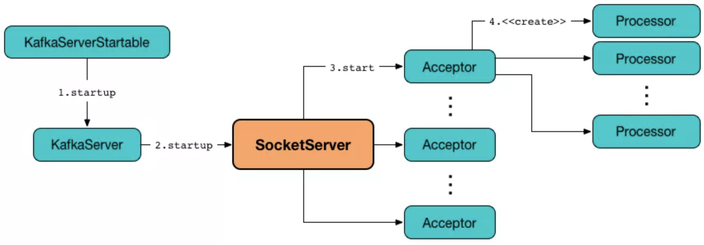

其中包含了一个Acceptor线程，用于处理新的连接，Acceptor 有 N 个 Processor 线程 select 和 read socket 请求，N 个 Handler 线程处理请求并相应，即处理业务逻辑

### 1.4.6、批量与压缩

Kafka Producer 向 Broker 发送消息不是一条消息一条消息的发送。Producer 有两个重要的参数：batch.size和linger.ms。这两个参数就和 Producer 的批量发送有关：Producer、Broker 和 Consumer 使用相同的压缩算法，在 producer 向 Broker 写入数据，Consumer 向 Broker 读取数据时甚至可以不用解压缩，最终在 Consumer Poll 到消息时才解压，这样节省了大量的网络和磁盘开销；

Kafka 支持多种压缩算法：lz4、snappy、gzip。Kafka 2.1.0 正式支持 ZStandard

## 1.5、kafka零拷贝

[零拷贝](../../Java基础/Java-IO.md#四零拷贝)

## 1.6、Kafka应用场景

- 异步化、服务解耦、削峰填谷
- 海量日志手机
- 数据同步应用
- 实时计算分析

## 1.7、zookeeper与kafka

Kafka 将 Broker、Topic 和 Partition 的元数据信息存储在 Zookeeper 上。通过在 Zookeeper 上建立相应的数据节点，并监听节点的变化，Kafka 使用 Zookeeper 完成以下功能：
- Kafka Controller 的 Leader 选举
- Kafka 集群成员管理
- Topic 配置管理
- 分区副本管理

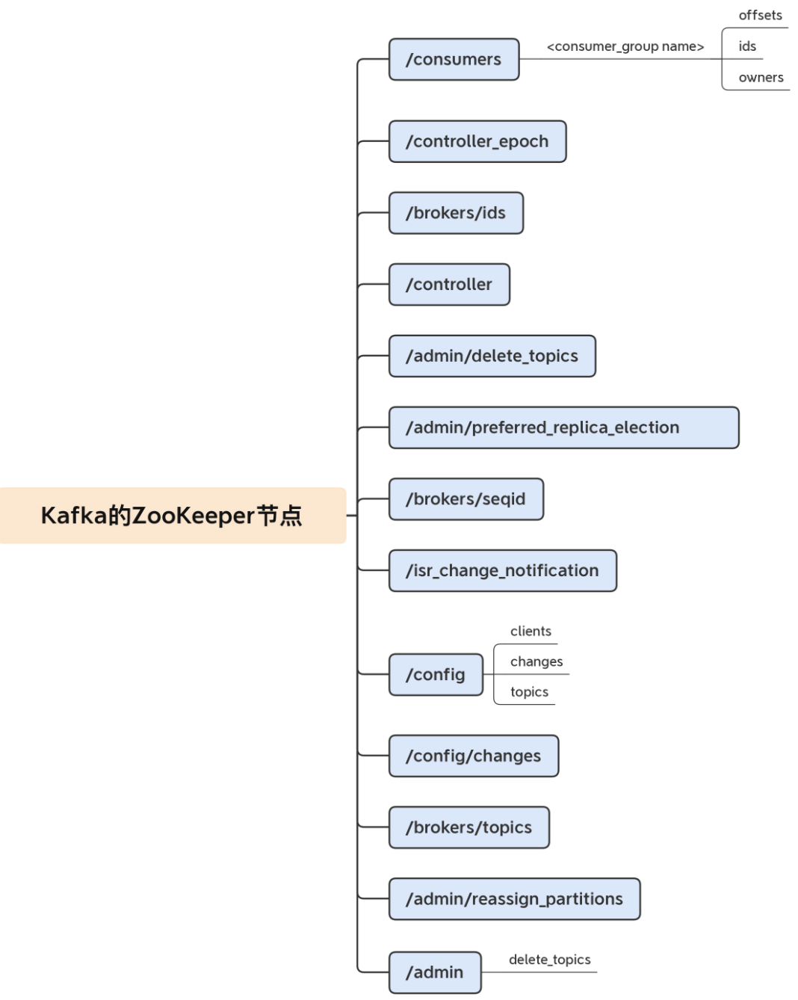

> 集群元数据持久化在ZooKeeper中，同时也缓存在每台Broker的内存中，因此不需要请求ZooKeeper

# 2、kafka安装与配置

- [Kafka UI](https://github.com/obsidiandynamics/kafdrop)

## 2.1、Kafka版本

- Apache Kafka，也称社区版 Kafka。优势在于迭代速度快，社区响应度高，使用它可以让你有更高的把控度；缺陷在于仅提供基础核心组件，缺失一些高级的特性。
- Confluent Kafka，Confluent 公司提供的 Kafka。优势在于集成了很多高级特性且由 Kafka 原班人马打造，质量上有保证；缺陷在于相关文档资料不全，普及率较低，没有太多可供参考的范例。
- CDH/HDP Kafka，大数据云公司提供的 Kafka，内嵌 Apache Kafka。优势在于操作简单，节省运维成本；缺陷在于把控度低，演进速度较慢

## 2.2、安装kafka

[](../../../辅助资料/环境配置/Linux环境.md#1Kafka单机安装)

## 2.3、基本使用

|功能	 |            启动命令	|备注|
|-------|---------------------|----|
|启动  ZK	        | `bin/zookeeper-server-start.sh -daemon config/zookeeper.properties`	|Kafka 安装包自带 ZK，可以单节点启动|
|启动Kafka服务器      | `bin/kafka-server-start.sh config/server.properties` || 	
|创建 Topic（test）	 | `bin/kafka-topics.sh --create --bootstrap-server kafka1:9092,kafka2:9092,kafka3:9092 --replication-factor 1 --partitions 1 --topic test`|	|
|Topic 列表	        | `bin/kafka-topics.sh --list --bootstrap-server kafka1:9092,kafka2:9092,kafka3:9092`	||
|启动 Producer	    | `bin/kafka-console-producer.sh --broker-list localhost:9092 --topic test`	||
|启动 Consumer	    | `bin/kafka-console-consumer.sh --bootstrap-server localhost:9092 --topic test --from-beginning`	||
|Topic相关信息（test) | `bin/kafka-topics.sh --describe --bootstrap-server kafka1:9092,kafka2:9092,kafka3:9092 --topic test` || 
|group信息查看|`bin/kafka-consumer-groups.sh --bootstrap-server localhost:9092 --describe --group spring-group`||

如果create topic出现如下问题：
```
Error while executing topic command : Replication factor: 2 larger than available brokers: 0.
[2021-03-28 20:26:59,369] ERROR org.apache.kafka.common.errors.InvalidReplicationFactorException: Replication factor: 2 larger than available brokers: 0.
```
可以尝试使用命令：`kafka-topics.sh --create --bootstrap-server kafka1:9092,kafka2:9092,kafka3:9092 --partitions 1 --replication-factor 1 --topic t1`

在Kafka2.2之后推荐使用 `--bootstrap-server localhost:9092` 替代`--zookeeper localhost:2181`，比如：
```
bin/kafka-topics.sh --list --bootstrap-server kafka1:9092,kafka2:9092,kafka3:9092

bin/kafka-topics.sh --create --bootstrap-server kafka1:9092,kafka2:9092,kafka3:9092 --replication-factor 3 --partitions 6 --topic topic-quickstart
```
如果指定了 `--bootstrap-server`，那么这条命令就会受到安全认证体系的约束，即对命令发起者进行权限验证，然后返回它能看到的主题。否则，如果指定 `--zookeeper` 参数，那么默认会返回集群中所有的主题详细数据

## 2.4、Kafka线上集群考量

- 操作系统：主要是操作系统的IO模型，一般建议部署在linux机器上，因为其使用的是epoll；
- 磁盘：磁盘的IO性能；因为Kafka是顺序写的，所以可以使用机械硬盘即可；不需要磁盘阵列；新增消息数、消息留存时间、平均消息大小、备份数、是否启用压缩
- 磁盘容量：根据消息条数、留存时间预估容量，一般建议预留20%~30%的磁盘空间；
- 带宽：根据实际带宽资源和业务

# 3、Kafka配置

- [Kafka官方文档各个配置](https://kafka.apache.org/documentation/#configuration)

## 3.1、broker端

### 3.1.1、静态配置

在 Kafka 安装目录的 config 路径下，有个 server.properties 文件。通常情况下，我们会指定这个文件的路径来启动 Broker；如果要设置 Broker 端的任何参数，我们必须在这个文件中显式地增加一行对应的配置，之后启动 Broker 进程，令参数生效；在Kafka运行过程中需要修改参数，需要重启Broker；server.properties的配置文件称为静态配置参数；

### 3.1.2、动态配置

所谓动态，就是指修改参数值后，无需重启 Broker 就能立即生效，而之前在 server.properties 中配置的参数则称为静态参数（Static Configs）

Kafka在1.1版本之后增加了动态参数配置，配置分为如下三种类型：
- `read-only`：被标记为 read-only 的参数和原来的参数行为一样，只有重启 Broker，才能令修改生效；
- `per-broker`：被标记为 per-broker 的参数属于动态参数，修改它之后，只会在对应的 Broker 上生效；
- `cluster-wide`：被标记为 cluster-wide 的参数也属于动态参数，修改它之后，会在整个集群范围内生效，也就是说，对所有 Broker 都生效。你也可以为具体的 Broker 修改 cluster-wide 参数；

**使用场景：**
- 动态调整 Broker 端各种线程池大小，实时应对突发流量；
- 动态调整 Broker 端连接信息或安全配置信息；
- 动态更新 SSL Keystore 有效期；
- 动态调整 Broker 端 Compact 操作性能；
- 实时变更 JMX 指标收集器 (JMX Metrics Reporter)

**如何保存：**

Kafka 将动态 Broker 参数保存在 ZooKeeper 中 `/config/brokers znode` 是保存动态 Broker 参数的地方。该 znode 下有两大类子节点:
- 第一类子节点就只有一个，它有个固定的名字叫 `<default>`，保存的是前面说过的 cluster-wide 范围的动态参数；
- 另一类则以 `broker.id` 为名，保存的是特定 Broker 的 per-broker 范围参数。由于是 per-broker 范围，因此这类子节点可能存在多个
```
[zk: localhost:2181(CONNECTED) 5] ls /config/brokers
[1, <default>]
[zk: localhost:2181(CONNECTED) 6] get /config/brokers/<default>
{"version":1,"config":{"unclean.leader.election.enable":"true"}}
[zk: localhost:2181(CONNECTED) 7] get /config/brokers/1
{"version":1,"config":{"unclean.leader.election.enable":"false"}}
```

**如何配置：**

设置动态参数的工具行命令只有一个，那就是 Kafka 自带的 kafka-configs 脚本
- 设置cluster-wide范围值：下面这条命令展示了如何在集群层面设置全局值；
```sh
[root@kafka1 kafka_2.12-2.7.0]# bin/kafka-configs.sh --bootstrap-server kafka1:9092,kafka2:9092,kafka3:9092 --entity-type brokers --entity-default --alter --add-config unclean.leader.election.enable=true
Completed updating default config for brokers in the cluster.
```
如果要设置 cluster-wide 范围的动态参数，需要显式指定 entity-default；查看命令是否设置成功：
```
$ bin/kafka-configs.sh --bootstrap-server kafka-host:port --entity-type brokers --entity-default --describe
Default config for brokers in the cluster are:
  unclean.leader.election.enable=true sensitive=false synonyms={DYNAMIC_DEFAULT_BROKER_CONFIG:unclean.leader.election.enable=true}
```

- 设置per-broker范围值：
    ```sh
    # 设置命令
    [root@kafka1 kafka_2.12-2.7.0]# bin/kafka-configs.sh --bootstrap-server kafka1:9092,kafka2:9092,kafka3:9092 --entity-type brokers --entity-name 1 --alter --add-config unclean.leader.election.enable=false
    Completed updating config for broker 1.
    # 查看命令
    [root@kafka1 kafka_2.12-2.7.0]# bin/kafka-configs.sh --bootstrap-server kafka1:9092,kafka2:9092,kafka3:9092 --entity-type brokers --entity-name 1 --describe
    Dynamic configs for broker 1 are:
    unclean.leader.election.enable=false sensitive=false synonyms={DYNAMIC_BROKER_CONFIG:unclean.leader.election.enable=false, DYNAMIC_DEFAULT_BROKER_CONFIG:unclean.leader.election.enable=true, DEFAULT_CONFIG:unclean.leader.election.enable=false}
    ```
    - 在 Broker 1 层面上，该参数被设置成了 false，这表明命令运行成功了；
    - 从倒数第二行可以看出，在全局层面上，该参数值依然是 true。这表明，我们之前设置的 cluster-wide 范围参数值依然有效；

删除动态配置：
```sh
# 删除cluster-wide范围参数
$ bin/kafka-configs.sh --bootstrap-server kafka-host:port --entity-type brokers --entity-default --alter --delete-config unclean.leader.election.enable
Completed updating default config for brokers in the cluster,
# 删除per-broker范围参数
$ bin/kafka-configs.sh --bootstrap-server kafka-host:port --entity-type brokers --entity-name 1 --alter --delete-config unclean.leader.election.enable
Completed updating config for broker: 1.
```

### 3.1.3、常见配置

**与存储相关的参数：**
- `log.dirs`和`log.dir`：只要设置`log.dirs`，即第一个参数就好了，不要设置`log.dir`。而且更重要的是，在线上生产环境中一定要为log.dirs配置多个路径，具体格式是一个 CSV 格式，也就是用逗号分隔的多个路径，比如`/home/kafka1,/home/kafka2,/home/kafka3`这样。如果有条件的话你最好保证这些目录挂载到不同的物理磁盘上；

**zookeeper相关参数：**
- `zookeeper.connect`：指定zk连接地址，如果是集群，则：`zk1:2181,zk2:2181,zk3:2181`；如果你有两套 Kafka 集群，假设分别叫它们 kafka1 和 kafka2，那么两套集群的`zookeeper.connect`参数可以这样指定：`zk1:2181,zk2:2181,zk3:2181/kafka1`和`zk1:2181,zk2:2181,zk3:2181/kafka2`。切记 chroot 只需要写一次，而且是加到最后的

**broker连接相关参数：**
- `listeners`和`advertised.listeners`，最好全部使用主机名，即 Broker 端和 Client 端应用配置中全部填写主机名

**关于topic管理的参数：**
- `auto.create.topics.enable`：是否允许自动创建 Topic，建议设置成false
- `unclean.leader.election.enable`：是否允许 Unclean Leader 选举；如果设置成 false，那么就坚持之前的原则，不能让那些落后太多的副本竞选 Leader；默认为false
- `auto.leader.rebalance.enable`：是否允许定期进行 Leader 选举；设置它的值为 true 表示允许 Kafka 定期地对一些 Topic 分区进行 Leader 重选举，它不是选 Leader，而是换 Leader；建议设置成false；

**数据留存参数：**
- `log.retention.{hours|minutes|ms}`：这是个“三兄弟”，都是控制一条消息数据被保存多长时间。从优先级上来说 ms 设置最高、minutes 次之、hours 最低。
- `log.retention.bytes`：这是指定 Broker 为消息保存的总磁盘容量大小，默认值是-1，表示在容量方面不会限制；这个参数真正发挥作用的场景其实是在云上构建多租户的 Kafka 集群
- `message.max.bytes`：控制 Broker 能够接收的最大消息大小，默认为1000012，太少了，还不到 1MB；

## 3.2、topic端

如果同时设置了 Topic 级别参数和全局 Broker 参数，就是 Topic 级别参数会覆盖全局 Broker 参数的值，而每个 Topic 都能设置自己的参数值，这就是所谓的 Topic 级别参数；

- `retention.ms`：规定了该 Topic 消息被保存的时长。默认是 7 天，即该 Topic 只保存最近 7 天的消息。一旦设置了这个值，它会覆盖掉 Broker 端的全局参数值。
- `retention.bytes`：规定了要为该 Topic 预留多大的磁盘空间。和全局参数作用相似，这个值通常在多租户的 Kafka 集群中会有用武之地。当前默认值是 -1，表示可以无限使用磁盘空间；
- `max.message.bytes`：它决定了 Kafka Broker 能够正常接收该 Topic 的最大消息大小

Topic 级别参数的设置就是这种情况，我们有两种方式可以设置：
- 创建 Topic 时进行设置：`bin/kafka-topics.sh --bootstrap-server localhost:9092 --create --topic transaction --partitions 1 --replication-factor 1 --config retention.ms=15552000000 --config max.message.bytes=5242880`
- 修改 Topic 时设置：`bin/kafka-configs.sh v --entity-type topics --entity-name transaction --alter --add-config max.message.bytes=10485760`

## 3.3、JVM参数

将你的 JVM 堆大小设置成 6GB 吧，这是目前业界比较公认的一个合理值；

可以通过`jinfo -flags pid` 查看kafka默认参数：
```
VM Flags:
-XX:CICompilerCount=4 -XX:ConcGCThreads=2 -XX:+ExplicitGCInvokesConcurrent -XX:G1ConcRefinementThreads=8 -XX:G1HeapRegionSize=1048576 -XX:GCDrainStackTargetSize=64 -XX:InitialHeapSize=1073741824 -XX:InitiatingHeapOccupancyPercent=35 -XX:+ManagementServer -XX:MarkStackSize=4194304 -XX:MaxGCPauseMillis=20 -XX:MaxHeapSize=1073741824 -XX:MaxNewSize=643825664 -XX:MinHeapDeltaBytes=1048576 -XX:NonNMethodCodeHeapSize=5836300 -XX:NonProfiledCodeHeapSize=122910970 -XX:ProfiledCodeHeapSize=122910970 -XX:ReservedCodeCacheSize=251658240 -XX:+SegmentedCodeCache -XX:+UseCompressedClassPointers -XX:+UseCompressedOops -XX:+UseG1GC
```
如何对kafka参数进行设置：只需要设置下面这两个环境变量即可：
- `KAFKA_HEAP_OPTS`：指定堆大小。
- `KAFKA_JVM_PERFORMANCE_OPTS`：指定 GC 参数。

比如你可以这样启动 Kafka Broker，即在启动 Kafka Broker 之前，先设置上这两个环境变量：
```bash
$> export KAFKA_HEAP_OPTS='-Xms6g  -Xmx6g'
$> export KAFKA_JVM_PERFORMANCE_OPTS='-server -XX:+UseG1GC -XX:MaxGCPauseMillis=20 -XX:InitiatingHeapOccupancyPercent=35 -XX:+ExplicitGCInvokesConcurrent -Djava.awt.headless=true'
$> bin/kafka-server-start.sh config/server.properties
```

# 4、Kafka生产者

## 4.1、生产者API

### 4.1.1、ProducerConfig

主要封装了一些Kafka需要的配置常量，防止用户在添加配置的时候，将配置名称写错了：
```java
public class ProducerConfig extends AbstractConfig {
    private static final ConfigDef CONFIG;
    public static final String BOOTSTRAP_SERVERS_CONFIG = CommonClientConfigs.BOOTSTRAP_SERVERS_CONFIG;
    public static final String CLIENT_DNS_LOOKUP_CONFIG = CommonClientConfigs.CLIENT_DNS_LOOKUP_CONFIG;
    public static final String METADATA_MAX_AGE_CONFIG = CommonClientConfigs.METADATA_MAX_AGE_CONFIG;
    private static final String METADATA_MAX_AGE_DOC = CommonClientConfigs.METADATA_MAX_AGE_DOC;
    ...
}
```

### 4.1.2、KafkaProducer

KafkaProducer 是线程安全的，可以在多个线程中共享单个 KafkaProducer 实例，也可以将 KafkaProducer 实例进行池化来供其他线程调用；

KafkaProducer 中有多个构造方法，比如在创建 KafkaProducer 实例时并没有设定 key.serializer 和 value.serializer 这两个配置参数，那么就需要在构造方法中添加对应的序列化器；

**KafkaProducer的异常类型**

KafkaProducer 中一般会发生两种类型的异常：`可重试的异常`和`不可重试的异常`。
- 常见的可重试异常有：NetworkException、LeaderNotAvailableException、UnknownTopicOrPartitionException、NotEnoughReplicasException、NotCoordinatorException 等。比如 NetworkException 表示网络异常，这个有可能是由于网络瞬时故障而导致的异常，可以通过重试解决；又比如 LeaderNotAvailableException 表示分区的 leader 副本不可用，这个异常通常发生在 leader 副本下线而新的 leader 副本选举完成之前，重试之后可以重新恢复；

    对于可重试的异常，如果配置了 retries 参数，那么只要在规定的重试次数内自行恢复了，就不会抛出异常。retries 参数的默认值为0，配置方式参考如下：
    ```
    props.put(ProducerConfig.RETRIES_CONFIG, 10);
    ```
- 不可重试的异常，比如 RecordTooLargeException 异常，暗示了所发送的消息太大，KafkaProducer 对此不会进行任何重试，直接抛出异常；

**发送消息主要有三种模式：**
- 发后即忘（fire-and-forget）：它只管往 Kafka 中发送消息而并不关心消息是否正确到达；在某些时候（比如发生不可重试异常时）会造成消息的丢失。这种发送方式的性能最高，可靠性也最差
- 同步（sync）：实现同步的发送方式，可以利用返回的 Future 对象实现；同步发送的方式可靠性高，要么消息被发送成功，要么发生异常。如果发生异常，则可以捕获并进行相应的处理，而不会像“发后即忘”的方式直接造成消息的丢失
    ```java
    // 线程安全的
    KafkaProducer<String, String> producer = new KafkaProducer<String, String>(properties);
    for (int i = 0; i < 10; i++) {
        User user = new User("00" + i, "张三");
        ProducerRecord<String, String> record = new ProducerRecord<>(TopicConstants.TOPIC_QUICKSTART, JSON.toJSONString(user));
        System.out.println("send " + i);
        // 本质上是异步的，消息发送后自动创建topic
        Future<RecordMetadata> future = producer.send(record);
        RecordMetadata metadata = future.get();
    }
    ```
- 异步（async）：一般是在 send() 方法里指定一个 Callback 的回调函数，Kafka 在返回响应时调用该函数来实现异步的发送确认
    ```java
     producer.send(record, new Callback() {
        @Override
        public void onCompletion(RecordMetadata metadata, Exception exception) {
            // onCompletion() 方法的两个参数是互斥的，消息发送成功时，metadata 不为 null 而 exception 为 null；消息发送异常时，metadata 为 null 而 exception 不为 null
        }
    })
    ```

send() 方法本身就是异步的，send() 方法返回的 Future 对象可以使调用方稍后获得发送的结果，可以通过Future可以获取一个 RecordMetadata 对象，在 RecordMetadata 对象里包含了消息的一些元数据信息，比如当前消息的主题、分区号、分区中的偏移量（offset）、时间戳等；

Future 表示一个任务的生命周期，并提供了相应的方法来判断任务是否已经完成或取消，以及获取任务的结果和取消任务等；

### 4.1.3、ProducerRecord

```java
public class ProducerRecord<K, V> {
    private final String topic; //主题
    private final Integer partition; //分区号
    private final Headers headers; //消息头部
    // key 是用来指定消息的键，key 可以让消息再进行二次归类，同一个 key 的消息会被划分到同一个分区中；有 key 的消息还可以支持日志压缩的功能
    private final K key; //键
    private final V value; //值
    // timestamp 是指消息的时间戳，它有 CreateTime 和 LogAppendTime 两种类型，前者表示消息创建的时间，后者表示消息追加到日志文件的时间
    private final Long timestamp; //消息的时间戳
    //省略其他成员方法和构造方法
}
```

## 4.2、kafka生产者参数

> 生产者的所有参数都可以在 org.apache.kafka.clients.producer.ProducerConfig 中找到，对应的参数的默认值也都在该类中的静态代码块中有相应的处理；

### 4.2.1、必要参数

- `bootstrap.servers`：该参数用来指定生产者客户端连接 Kafka 集群所需的 broker 地址清单，具体的内容格式为 host1:port1,host2:port2，可以设置一个或多个地址，中间以逗号隔开，此参数的默认值为“”；建议至少要设置两个以上的 broker 地址信息，当其中任意一个宕机时，生产者仍然可以连接到 Kafka 集群上；

- `key.serializer` 和 `value.serializer`：broker 端接收的消息必须以字节数组（byte[]）的形式存在

### 4.2.2、重要参数

- `acks`：指用来指定分区中必须要有多少个副本收到这条消息，之后生产者才会认为这条消息是成功写入的，默认为1；acks 是生产者客户端中一个非常重要的参数，它涉及消息的可靠性和吞吐量之间的权衡；*注意：*acks 参数配置的值是一个字符串类型，而不是整数类型
    - `acks=1`：默认值，生产者发送消息之后，只要分区的 leader 副本成功写入消息，那么它就会收到来自服务端的成功响应；如果消息无法写入 leader 副本，比如在 leader 副本崩溃、重新选举新的 leader 副本的过程中，那么生产者就会收到一个错误的响应，为了避免消息丢失，生产者可以选择重发消息。如果消息写入 leader 副本并返回成功响应给生产者，且在被其他 follower 副本拉取之前 leader 副本崩溃，那么此时消息还是会丢失，因为新选举的 leader 副本中并没有这条对应的消息。acks 设置为1，是消息可靠性和吞吐量之间的折中方案；
    - `acks=0`：生产者发送消息之后不需要等待任何服务端的响应。如果在消息从发送到写入 Kafka 的过程中出现某些异常，导致 Kafka 并没有收到这条消息，那么生产者也无从得知，消息也就丢失了。在其他配置环境相同的情况下，acks 设置为0可以达到最大的吞吐量；
    - `acks=-1, acks=all`：生产者在消息发送之后，需要等待 ISR 中的所有副本都成功写入消息之后才能够收到来自服务端的成功响应。在其他配置环境相同的情况下，acks 设置为 -1（all） 可以达到最强的可靠性；但这并不意味着消息就一定可靠，因为ISR中可能只有 leader 副本，这样就退化成了 acks=1 的情况。要获得更高的消息可靠性需要配合 `min.insync.replicas` 等参数的联动

- `max.request.size`：该参数用来限制生产者客户端能发送的消息的最大值；默认值为`1048576B`，即1MB。一般情况下，这个默认值就可以满足大多数的应用场景了；不建议盲目地增大这个参数的配置值；因为这个参数还涉及一些其他参数的联动，比如 broker 端的 `message.max.bytes` 参数，如果配置错误可能会引起一些不必要的异常。比如将 broker 端的 `message.max.bytes` 参数配置为10，而 `max.request.size` 参数配置为20，那么当我们发送一条大小为15B的消息时，生产者客户端就会报出如下的异常：`org.apache.kafka.common.errors.RecordTooLargeException: The request included a message larger than the max message size the server will accept.`

- `retries 和 retry.backoff.msretries`：重试次数（默认是0）即在发生异常的时候不进行任何重试动作；重试间隔（默认是100ms）；

- `compression.type`：用来指定的消息的压缩方式，默认值为`none`，可选配置：`gzip`、`snappy`、`lz4`；对消息进行压缩可以极大地减少网络传输量、降低网络I/O，从而提高整体的性能。消息压缩是一种使用时间换空间的优化方式，如果对时延有一定的要求，则不推荐对消息进行压缩。

- `connections.max.idle.ms`：用来指定在多久之后关闭限制的连接，默认是 54000ms，即9分钟；

- `linger.ms`：用来指定生产者发送 ProducerBatch 之前等待更多的消息（ProducerRecord）加入 ProducerBatch的时间，默认是0；

- `batch.size`：累计多少条消息，则一次进行批量发送；只要满足 linger.ms 和 batch.size 一个，都会发生的；

- `buffer.memory`：缓存提示性能参数，默认值为 33554432B，即32MB

- `receive.buffer.bytes`：用来设置Socket接收消息缓冲区（SO_RECBUF）的大小，默认是32k；如果设置为-1，则使用操作系统的默认值。如果 Producer 与 Kafka 处于不同的机房，则可以适地调大这个参数值

- `send.buffer.bytes`：用来设置socket发送消息缓冲区（SO_SNDBUF）的大小，默认是128k；与 `receive.buffer.bytes` 参数一样，如果设置为-1，则使用操作系统的默认值

- `request.timeout.ms`：用来配置Producer等待请求响应的最长时间，默认是 30000ms

## 4.3、序列化

生产者需要用序列化器（Serializer）把对象转换成字节数组才能通过网络发送给 Kafka。而在对侧，消费者需要用反序列化器（Deserializer）把从 Kafka 中收到的字节数组转换成相应的对象：
```java
properties.put(ProducerConfig.KEY_SERIALIZER_CLASS_CONFIG, StringSerializer.class.getName());
properties.put(ProducerConfig.VALUE_SERIALIZER_CLASS_CONFIG, StringSerializer.class.getName());
```
除了用于 String 类型的序列化器，还有 ByteArray、ByteBuffer、Bytes、Double、Integer、Long 这几种类型，它们都实现了 `org.apache.kafka.common.serialization.Serializer` 接口，该接口如下：
```java
public interface Serializer<T> extends Closeable {
    default void configure(Map<String, ?> configs, boolean isKey) {
        // configure() 方法用来配置当前类，在创建 KafkaProducer 的时候创建的；
    }
    // serialize() 方法用来执行序列化操作
    byte[] serialize(String topic, T data);
    default byte[] serialize(String topic, Headers headers, T data) {
        return serialize(topic, data);
    }
    // 而 close() 方法用来关闭当前的序列化器，一般情况下 close() 是一个空方法，如果实现了此方法，则必须确保此方法的幂等性，因为这个方法很可能会被 KafkaProducer 调用多次
    default void close() {
    }
}
```
生产者使用的序列化器和消费者使用的反序列化器是需要一一对应的，如果生产者使用了某种序列化器，比如 StringSerializer，而消费者使用了另一种序列化器，比如 IntegerSerializer，那么是无法解析出想要的数据的；

如果 Kafka 客户端提供的几种序列化器都无法满足应用需求，则可以选择使用如 Avro、JSON、Thrift、ProtoBuf 和 Protostuff 等通用的序列化工具来实现，或者使用自定义类型的序列化器来实现：
```java
//  User 包含两个字段：id和name
public class UserSerializer implements Serializer<User> {
    @Override
    public void configure(Map<String, ?> configs, boolean isKey) {
    }

    @Override
    public byte[] serialize(String topic, User user) {
        if (user == null) {
            return null;
        }
        byte[] idBytes, nameBytes;
        String id = user.getId();
        String name = user.getName();
        if (id != null) {
            idBytes = id.getBytes(StandardCharsets.UTF_8);
        } else {
            idBytes = new byte[0];
        }
        if (name != null) {
            nameBytes = name.getBytes(StandardCharsets.UTF_8);
        } else {
            nameBytes = new byte[0];
        }
        // 定义buffer格式：4字节（id的真实长度） + id数据 + 4字节（name的真实长度） + name数据
        ByteBuffer buffer = ByteBuffer.allocate(4 + 4 + idBytes.length + nameBytes.length);
        //	4个字节 也就是一个 int类型 : putInt 盛放 idBytes的实际真实长度
        buffer.putInt(idBytes.length);
        //	put bytes[] 实际盛放的是idBytes真实的字节数组，也就是内容
        buffer.put(idBytes);
        buffer.putInt(nameBytes.length);
        buffer.put(nameBytes);
        return buffer.array();
    }
    @Override
    public void close() {

    }
}
```

## 4.4、分区器

消息在通过 send() 方法发往 broker 的过程中，有可能需要经过拦截器（Interceptor）、序列化器（Serializer）和分区器（Partitioner）的一系列作用之后才能被真正地发往 broker；消息经过序列化之后就需要确定它发往的分区，但如果消息 ProducerRecord 中指定了 partition 字段，那么就不需要分区器的作用，因为 partition 代表的就是所要发往的分区号；

如果消息 ProducerRecord 中没有指定 partition 字段，那么就需要依赖分区器，根据 key 这个字段来计算 partition 的值。分区器的作用就是为消息分配分区，Kafka默认的分区器是`org.apache.kafka.clients.producer.internals.DefaultPartitioner`，它实现了 `org.apache.kafka.clients.producer.Partitioner` 接口，该接口定义：
```java
public interface Partitioner extends Configurable, Closeable {
    //  partition() 方法用来计算分区号，返回值为 int 类型。partition() 方法中的参数分别表示主题、键、序列化后的键、值、序列化后的值，以及集群的元数据信息，通过这些信息可以实现功能丰富的分区器
    public int partition(String topic, Object key, byte[] keyBytes, Object value, byte[] valueBytes, Cluster cluster);
    ...
}
```
在默认分区器 DefaultPartitioner 的实现中，close() 是空方法，而在 partition() 方法中定义了主要的分区分配逻辑：
- 如果消息指定了分区，则使用指定的分区；
- 如果没有指定分区，但是 key 不为 null，那么默认的分区器会对 key 进行哈希（采用 MurmurHash2 算法，具备高运算性能及低碰撞率），最终根据得到的哈希值来计算分区号，拥有相同 key 的消息会被写入同一个分区；
- 既没有指定分区也没有对应的key，即key 为 null，那么消息将会以轮询的方式发往主题内的各个可用分区：
```java
public class DefaultPartitioner implements Partitioner {
    private final ConcurrentMap<String, AtomicInteger> topicCounterMap = new ConcurrentHashMap<>();
    public int partition(String topic, Object key, byte[] keyBytes, Object value, byte[] valueBytes, Cluster cluster) {
        List<PartitionInfo> partitions = cluster.partitionsForTopic(topic);
        int numPartitions = partitions.size();
        if (keyBytes == null) {
            int nextValue = nextValue(topic);
            List<PartitionInfo> availablePartitions = cluster.availablePartitionsForTopic(topic);
            if (availablePartitions.size() > 0) {
                int part = Utils.toPositive(nextValue) % availablePartitions.size();
                return availablePartitions.get(part).partition();
            } else {
                // no partitions are available, give a non-available partition
                return Utils.toPositive(nextValue) % numPartitions;
            }
        } else {
            // hash the keyBytes to choose a partition
            return Utils.toPositive(Utils.murmur2(keyBytes)) % numPartitions;
        }
    }
    private int nextValue(String topic) {
        AtomicInteger counter = topicCounterMap.get(topic);
        if (null == counter) {
            counter = new AtomicInteger(ThreadLocalRandom.current().nextInt());
            AtomicInteger currentCounter = topicCounterMap.putIfAbsent(topic, counter);
            if (currentCounter != null) {
                counter = currentCounter;
            }
        }
        return counter.getAndIncrement();
    }
}
```
除了使用 Kafka 提供的默认分区器进行分区分配，还可以使用自定义的分区器，只需同 DefaultPartitioner 一样实现 Partitioner 接口即可。默认的分区器在 key 为 null 时不会选择非可用的分区，我们可以通过自定义的分区器 DemoPartitioner 来打破这一限制。指定自定义分区器：`props.put(ProducerConfig.PARTITIONER_CLASS_CONFIG,DemoPartitioner.class.getName());`

默认分区器是在 ProducerConfig 类中的静态代码块中初始化的：
```java
// ProducerConfig
static {
    CONFIG = new ConfigDef().define(PARTITIONER_CLASS_CONFIG,
            Type.CLASS,
            DefaultPartitioner.class,
            Importance.MEDIUM, PARTITIONER_CLASS_DOC)
}
```

> 如果要保证全局有序或者说因果关系，只能使用单分区；

消费者出现reblance的情况，key的有序性可能出现问题，这样可以通过设置`partition.assignment.strategy=Sticky`，因为Sticky算法会最大化保证消费分区方案的不变更。假设你的因果消息都有相同的key，那么结合Sticky算法有可能保证即使出现rebalance，要消费的分区依然有原来的consumer负责

## 4.5、拦截器

生产者拦截器的使用也很方便，主要是自定义实现 `org.apache.kafka.clients.producer.ProducerInterceptor` 接口，ProducerInterceptor 接口中包含3个方法：
```java
public interface ProducerInterceptor<K, V> extends Configurable {
    // KafkaProducer 在将消息序列化和计算分区之前会调用生产者拦截器的 onSend() 方法来对消息进行相应的定制化操作
    public ProducerRecord<K, V> onSend(ProducerRecord<K, V> record);
    // KafkaProducer 会在消息被应答（Acknowledgement）之前或消息发送失败时调用生产者拦截器的 onAcknowledgement() 方法，优先于用户设定的 Callback 之前执行；这个方法运行在 Producer 的I/O线程中，所以这个方法中实现的代码逻辑越简单越好，否则会影响消息的发送速度
    public void onAcknowledgement(RecordMetadata metadata, Exception exception);
    ...
}
```
在 KafkaProducer 的配置参数 interceptor.classes 中指定拦截器：`properties.put(ProducerConfig.INTERCEPTOR_CLASSES_CONFIG, CustomProducerInterceptor.class.getName());`；

KafkaProducer 中不仅可以指定一个拦截器，还可以指定多个拦截器以形成拦截链。`拦截链`会按照 `interceptor.classes 参数配置的拦截器的顺序来一一执行`（配置的时候，各个拦截器之间使用逗号隔开）；或者是集合也可以
```java
String interceptors = CustomProducerInterceptor.class.getName() + "," + CustomProducerInterceptor2.class.getName();
// 添加拦截器属性，可以配置多个
properties.put(ProducerConfig.INTERCEPTOR_CLASSES_CONFIG, interceptors);
```
如果拦截链中的某个拦截器的执行需要依赖于前一个拦截器的输出，那么就有可能产生“副作用”。设想一下，如果前一个拦截器由于异常而执行失败，那么这个拦截器也就跟着无法继续执行。在拦截链中，如果某个拦截器执行失败，那么下一个拦截器会接着从上一个执行成功的拦截器继续执行；

Kafka 拦截器可以应用于包括客户端监控、端到端系统性能检测、消息审计等多种功能在内的场景

## 4.6、消息压缩

目前 Kafka 共有两大类消息格式，社区分别称之为 V1 版本和 V2 版本。V2 版本是 Kafka 0.11.0.0 中正式引入的

Kafka 的消息层次都分为两层：消息集合（message set）以及消息（message）。一个消息集合中包含若干条日志项（record item），而日志项才是真正封装消息的地方。Kafka 底层的消息日志由一系列消息集合日志项组成。Kafka 通常不会直接操作具体的一条条消息，它总是在消息集合这个层面上进行写入操作；

在 V1 版本中，每条消息都需要执行 CRC 校验，但有些情况下消息的 CRC 值是会发生变化的；再对每条消息都执行 CRC 校验就有点没必要了，不仅浪费空间还耽误 CPU 时间，因此在 V2 版本中，消息的 CRC 校验工作就被移到了消息集合这一层

**何时压缩：**压缩可能发生在两个地方：生产者端和 Broker 端。
- 生产者程序中配置 `compression.type` 参数即表示启用指定类型的压缩算法，默认是none，可用的算法：`'gzip', 'snappy', 'lz4', 'zstd'`；
- broker端如何压缩：大部分情况下 Broker 从 Producer 端接收到消息后仅仅是原封不动地保存而不会对其进行任何修改，有两种情况Broker 重新压缩消息：
    - Broker 端指定了和 Producer 端不同的压缩算法，Broker 端也有一个参数叫 `compression.type`，但是这个参数的默认值是 producer，这表示 Broker 端会“尊重”Producer 端使用的压缩算法。可一旦你在 Broker 端设置了不同的 compression.type 值，就一定要小心了，因为可能会发生预料之外的压缩/解压缩操作，通常表现为 Broker 端 CPU 使用率飙升；
    - Broker 端发生了消息格式转换：所谓的消息格式转换主要是为了兼容老版本的消费者程序，为了兼容老版本的格式，Broker 端会对新版本消息执行向老版本格式的转换。这个过程中会涉及消息的解压缩和重新压缩。一般情况下这种消息格式转换对性能是有很大影响的，除了这里的压缩之外，它还让 Kafka 丧失了引以为豪的 Zero Copy 特性；

**何时解压缩：**Producer 发送压缩消息到 Broker 后，Broker 照单全收并原样保存起来。当 Consumer 程序请求这部分消息时，Broker 依然原样发送出去，当消息到达 Consumer 端后，由 Consumer 自行解压缩还原成之前的消息；Kafka 会将启用了哪种压缩算法封装进消息集合中，这样当 Consumer 读取到消息集合时，它自然就知道了这些消息使用的是哪种压缩算法：`Producer 端压缩、Broker 端保持、Consumer 端解压缩`

## 4.7、生产者客户端原理

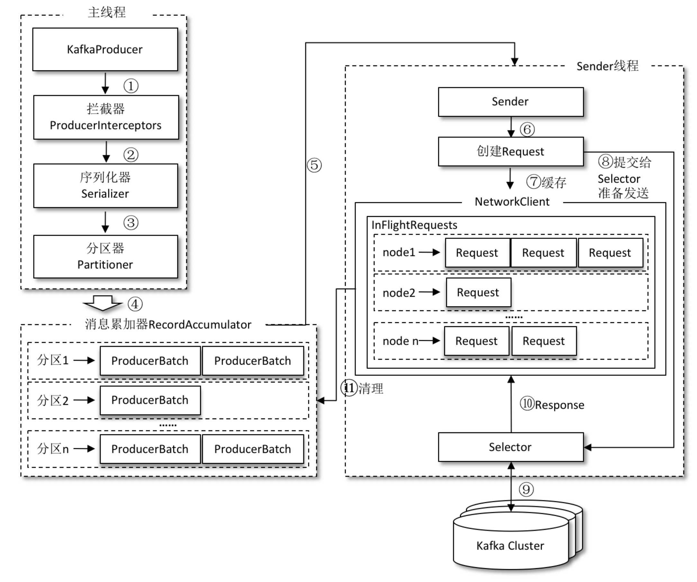

整个生产者客户端由两个线程协调运行，这两个线程分别为`主线程`和 `Sender 线程（发送线程）`。在主线程中由 KafkaProducer 创建消息，然后通过可能的`拦截器、序列化器和分区器`的作用之后缓存到消息累加器（RecordAccumulator，也称为消息收集器）中。`Sender 线程负责从 RecordAccumulator 中获取消息并将其发送到 Kafka 中`；

Sender线程在构建KafkaProducer的过程中就启动了：
```java
KafkaProducer(Map<String, Object> configs, Serializer<K> keySerializer, Serializer<V> valueSerializer, ProducerMetadata metadata,  KafkaClient kafkaClient, ProducerInterceptors interceptors, Time time) {
    try {
        // 各种参数设置....
        // 构建 Sender，sender是Runnable实例
        this.sender = newSender(logContext, kafkaClient, this.metadata);
        String ioThreadName = NETWORK_THREAD_PREFIX + " | " + clientId;
        // KafkaThread继承Thread类
        this.ioThread = new KafkaThread(ioThreadName, this.sender, true);
        // 真正运行的 Sender 类的 run 方法
        this.ioThread.start();
        config.logUnused();
        AppInfoParser.registerAppInfo(JMX_PREFIX, clientId, metrics, time.milliseconds());
        log.debug("Kafka producer started");
    } catch (Throwable t) {
        // call close methods if internal objects are already constructed this is to prevent resource leak. see KAFKA-2121
        close(Duration.ofMillis(0), true);
        // now propagate the exception
        throw new KafkaException("Failed to construct kafka producer", t);
    }
}
// 其中KafkaThread构造函数中 runnable 参数其实是 Sender的实例
public KafkaThread(final String name, Runnable runnable, boolean daemon) {
    super(runnable, name);
    configureThread(name, daemon);
}
```

### 4.7.1、连接建立

在创建 KafkaProducer 实例时，生产者应用会在后台创建并启动一个名为 Sender 的线程，该 Sender 线程开始运行时首先会创建与 Broker 的连接，会与`bootstrap.servers` 配置的broker地址连接；如果你为这个参数指定了 1000 个 Broker 连接信息，那么很遗憾，你的 Producer 启动时会首先创建与这 1000 个 Broker 的 TCP 连接；

TCP 连接还可能在两个地方被创建：一个是在更新元数据后，另一个是在消息发送时：
- 场景一：当 Producer 尝试给一个不存在的主题发送消息时，Broker 会告诉 Producer 说这个主题不存在。此时 Producer 会发送 METADATA 请求给 Kafka 集群，去尝试获取最新的元数据信息。
- 场景二：Producer 通过 `metadata.max.age.ms` 参数定期地去更新元数据信息。该参数的默认值是 300000，即 5 分钟，也就是说不管集群那边是否有变化，Producer 每 5 分钟都会强制刷新一次元数据以保证它是最及时的数据；

### 4.7.2、发送消息过程

主线程中发送过来的消息都会被追加到 RecordAccumulator 的某个双端队列（Deque）中，在 RecordAccumulator 的内部为每个分区都维护了一个双端队列，队列中的内容就是 ProducerBatch，即 Deque。消息写入缓存时，追加到双端队列的尾部；Sender 读取消息时，从双端队列的头部读取。注意 ProducerBatch 不是 ProducerRecord，ProducerBatch 中可以包含一至多个 ProducerRecord。通俗地说，ProducerRecord 是生产者中创建的消息，而 ProducerBatch 是指一个消息批次，ProducerRecord 会被包含在 ProducerBatch 中，这样可以使字节的使用更加紧凑。与此同时，将较小的 ProducerRecord 拼凑成一个较大的 ProducerBatch，也可以减少网络请求的次数以提升整体的吞吐量。ProducerBatch 和消息的具体格式有关，如果生产者客户端需要向很多分区发送消息，则可以将 buffer.memory 参数适当调大以增加整体的吞吐量。

消息在网络上都是以字节（Byte）的形式传输的，在发送之前需要创建一块内存区域来保存对应的消息。在 Kafka 生产者客户端中，通过 `java.io.ByteBuffer` 实现消息内存的创建和释放。不过频繁的创建和释放是比较耗费资源的，在 RecordAccumulator 的内部还有一个 BufferPool，它主要用来实现 ByteBuffer 的复用，以实现缓存的高效利用。不过 BufferPool 只针对特定大小的 ByteBuffer 进行管理，而其他大小的 ByteBuffer 不会缓存进 BufferPool 中，这个特定的大小由 `batch.size` 参数来指定，默认值为16384B，即16KB。可以适当地调大 `batch.size` 参数以便多缓存一些消息。

当一条消息（ProducerRecord）流入 RecordAccumulator 时，会先寻找与消息分区所对应的双端队列（如果没有则新建），再从这个双端队列的尾部获取一个 ProducerBatch（如果没有则新建），查看 ProducerBatch 中是否还可以写入这个 ProducerRecord，如果可以则写入，如果不可以则需要创建一个新的 ProducerBatch。在新建 ProducerBatch 时评估这条消息的大小是否超过 `batch.size` 参数的大小，如果不超过，那么就以 `batch.size` 参数的大小来创建 ProducerBatch，这样在使用完这段内存区域之后，可以通过 BufferPool 的管理来进行复用；如果超过，那么就以评估的大小来创建 ProducerBatch，这段内存区域不会被复用。

Sender 从 RecordAccumulator 中获取缓存的消息之后，会进一步将原本`<分区, Deque< ProducerBatch>>` 的保存形式转变成 `<Node, List< ProducerBatch>` 的形式，其中 Node 表示 Kafka 集群的 broker 节点。对于网络连接来说，生产者客户端是与具体的 broker 节点建立的连接，也就是向具体的 broker 节点发送消息，而并不关心消息属于哪一个分区；而对于 KafkaProducer 的应用逻辑而言，我们只关注向哪个分区中发送哪些消息，所以在这里需要做一个应用逻辑层面到网络I/O层面的转换。

在转换成 `<Node, List>` 的形式之后，Sender 还会进一步封装成 `<Node, Request>` 的形式，这样就可以将 Request 请求发往各个 Node 了，这里的 Request 是指 Kafka 的各种协议请求，对于消息发送而言就是指具体的 ProduceRequest。

请求在从 Sender 线程发往 Kafka 之前还会保存到 InFlightRequests 中，InFlightRequests 保存对象的具体形式为 `Map<NodeId, Deque>`，它的主要作用是缓存了已经发出去但还没有收到响应的请求（NodeId 是一个 String 类型，表示节点的 id 编号）。与此同时，InFlightRequests 还提供了许多管理类的方法，并且通过配置参数还可以限制每个连接（也就是客户端与 Node 之间的连接）最多缓存的请求数。这个配置参数为 max.in.flight.requests. per. connection，默认值为5，即每个连接最多只能缓存5个未响应的请求，超过该数值之后就不能再向这个连接发送更多的请求了，除非有缓存的请求收到了响应（Response）。通过比较 Deque 的 size 与这个参数的大小来判断对应的 Node 中是否已经堆积了很多未响应的消息，如果真是如此，那么说明这个 Node 节点负载较大或网络连接有问题，再继续向其发送请求会增大请求超时的可能；

### 4.7.3、关闭连接

- 调用 producer.close() 方法；
- Kafka 帮你关闭，这与 Producer 端参数 connections.max.idle.ms 的值有关。默认情况下该参数值是 9 分钟，即如果在 9 分钟内没有任何请求“流过”某个 TCP 连接，那么 Kafka 会主动帮你把该 TCP 连接关闭。用户可以在 Producer 端设置 connections.max.idle.ms=-1 禁掉这种机制。一旦被设置成 -1，TCP 连接将成为永久长连接。当然这只是软件层面的“长连接”机制，由于 Kafka 创建的这些 Socket 连接都开启了 keepalive，因此 keepalive 探活机制还是会遵守的；

### 4.7.4、关于KafkaProducer线程安全

KafkaProducer 实例创建的线程和前面提到的 Sender 线程共享的可变数据结构只有 RecordAccumulator 类，故维护了 RecordAccumulator 类的线程安全，也就实现了 KafkaProducer 类的线程安全；

从上面可以知道，在创建KafkaProducer的过程中创建了 Sender线程，并启动它

> 在对象构造器中启动线程会造成 this 指针的逃逸。理论上，Sender 线程完全能够观测到一个尚未构造完成的 KafkaProducer 实例；当然，在构造对象时创建线程没有任何问题，但最好是不要同时启动它

# 5、Kafka消费者

与生产者对应的是消费者，应用程序可以通过 KafkaConsumer 来订阅主题，并从订阅的主题中拉取消息

## 5.1、消费者与消费组

消费者（Consumer）负责订阅 Kafka 中的主题（Topic），并且从订阅的主题上拉取消息。与其他一些消息中间件不同的是：在 Kafka 的消费理念中还有一层消费组（Consumer Group）的概念，每个消费者都有一个对应的消费组。当消息发布到主题后，只会被投递给订阅它的`每个消费组`中的`一个消费者`；

> Consumer Group 是 Kafka 提供的可扩展且具有容错性的消费者机制

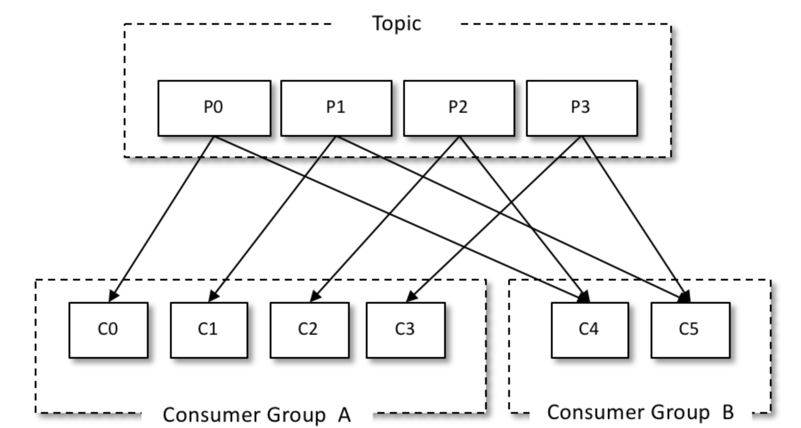

如上图所示，某个主题中共有4个分区（Partition）：P0、P1、P2、P3。有两个消费组A和B都订阅了这个主题，消费组A中有4个消费者（C0、C1、C2和C3），消费组B中有2个消费者（C4和C5）。按照 Kafka 默认的规则，最后的分配结果是消费组A中的每一个消费者分配到1个分区，消费组B中的每一个消费者分配到2个分区，两个消费组之间互不影响。每个消费者只能消费所分配到的分区中的消息。换言之，`每一个分区只能被一个消费组中的一个消费者所消费；`

消费者与消费组这种模型可以让整体的消费能力具备横向伸缩性，我们可以增加（或减少）消费者的个数来提高（或降低）整体的消费能力。对于分区数固定的情况，一味地增加消费者并不会让消费能力一直得到提升，如果消费者过多，出现了消费者的个数大于分区个数的情况，就会有消费者分配不到任何分区；

分配逻辑都是基于默认的`分区分配策略`进行分析的，可以通过消费者客户端参数 `partition.assignment.strategy` 来设置消费者与订阅主题之间的分区分配策略

查看消费组信息：`bin/kafka-consumer-groups.sh --bootstrap-server localhost:9092 --describe --group <groupName>`，比如消费组 quickstart-group，通过命令得到如下数据：

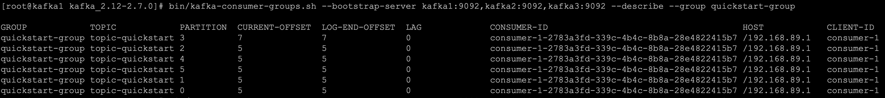

- LAG: 表示消息堆积的

每个 consumer 会定期将自己消费分区的 offset 提交给 kafka 内部 topic：`__consumer_offsets`，提交过去的时候，key 是 `consumerGroupId+topic+分区号`，value 就是当前 offset 的值，kafka 会定期清理 topic 里的消息，最后就保留最新的那条数据，因为__consumer_offsets 可能会接收高并发的请求，kafka 默认给其分配 50 个分区 (可以通过 `offsets.topic.num.partitions` 设置)，这样可以通过加机器的方式抗大并发

## 5.2、点对点与发布/订阅模式

对于消息中间件而言，一般有两种消息投递模式：点对点（P2P，Point-to-Point）模式和发布/订阅（Pub/Sub）模式。
- 点对点模式是基于队列的，消息生产者发送消息到队列，消息消费者从队列中接收消息。
- 发布订阅模式定义了如何向一个内容节点发布和订阅消息，这个内容节点称为主题（Topic），主题可以认为是消息传递的中介，消息发布者将消息发布到某个主题，而消息订阅者从主题中订阅消息。主题使得消息的订阅者和发布者互相保持独立，不需要进行接触即可保证消息的传递，发布/订阅模式在消息的一对多广播时采用

Kafka 同时支持两种消息投递模式，得益于消费者与消费组模型的契合：
- 如果所有的消费者都隶属于同一个消费组，那么所有的消息都会被均衡地投递给每一个消费者，即每条消息只会被一个消费者处理，这就相当于点对点模式的应用；
- 如果所有的消费者都隶属于不同的消费组，那么所有的消息都会被广播给所有的消费者，即每条消息会被所有的消费者处理，这就相当于发布/订阅模式的应用；

每一个消费组都会有一个固定的名称，消费者在进行消费前需要指定其所属消费组的名称，这个可以通过消费者客户端参数 group.id 来配置，默认值为空字符串

## 5.3、消费者步骤

一个正常的消费逻辑需要具备以下几个步骤：
- 配置消费者客户端参数及创建相应的消费者实例；
- 订阅主题；
- 拉取消息并消费；
- 提交消费位移；
- 关闭消费者实例；

```java
public class QuickstartConsumer {
    public static void main(String[] args) {
        Properties properties = new Properties();
        properties.put(ConsumerConfig.BOOTSTRAP_SERVERS_CONFIG, KafkaConstants.BOOTSTRAP_SERVER);
        properties.put(ConsumerConfig.KEY_DESERIALIZER_CLASS_CONFIG, StringDeserializer.class.getName());
        properties.put(ConsumerConfig.VALUE_DESERIALIZER_CLASS_CONFIG, StringDeserializer.class.getName());
        // 与消费订阅组相关
        properties.put(ConsumerConfig.GROUP_ID_CONFIG, "quickstart-group");
        // 消费者提交offset：自动提交&手动提交，默认自动提交
        properties.put(ConsumerConfig.ENABLE_AUTO_COMMIT_CONFIG, true);
        properties.put(ConsumerConfig.AUTO_COMMIT_INTERVAL_MS_CONFIG, 5000);
        KafkaConsumer<String, String> consumer = new KafkaConsumer<String, String>(properties);
        consumer.subscribe(Collections.singletonList(TopicConstants.TOPIC_QUICKSTART));
        // 采取拉取消息的方式消费数据
        while (true) {
            // 拉取一个topic里所有的消息，topic 和 partition是一堆多的
            ConsumerRecords<String, String> records = consumer.poll(Duration.ofMillis(1000));
            // 消息时在partition中存储的，需要遍历 partition 集合
            records.partitions().forEach(topicPartition -> {
                // 通过 TopicPartition 获取指定的数据集合，获取到的是当前 TopicPartition 下面所有的消息
                List<ConsumerRecord<String, String>> consumerRecords = records.records(topicPartition);
                String topic = topicPartition.topic();
                int size = consumerRecords.size();
                System.out.println(String.format("----获取topic： %s, 分区位置：%s, 消息总数: %s", topic, topicPartition.partition(), size));
                for (int i = 0; i < size; i++) {
                    ConsumerRecord<String, String> record = consumerRecords.get(i);
                    // 实际的数据内容
                    String value = record.value();
                    // 当前获取的消息偏移量
                    long offset = record.offset();
                    // 下一次从什么位置拉取消息
                    long commitOffset = offset + 1;
                    System.out.println(String.format("----获取实际消息： %s, 消息offset：%s, 提交的offset: %s", value, offset, commitOffset));
                }
            });
        }
    }
}
```

## 5.4、kafka消费者参数

### 5.4.1、必要参数

- `bootstrap.servers`：该参数用来指定生产者客户端连接 Kafka 集群所需的 broker 地址清单，具体的内容格式为 host1:port1,host2:port2，可以设置一个或多个地址，中间以逗号隔开，此参数的默认值为“”；建议至少要设置两个以上的 broker 地址信息，当其中任意一个宕机时，生产者仍然可以连接到 Kafka 集群上；

- `group.id`：消费者隶属的消费组的名称，默认值为“”。如果设置为空，且设置`enable.auto.commit`为true，则会报出异常：`Exception in thread "main" org.apache.kafka.common.errors.InvalidGroupIdException: The configured groupId is invalid`。一般而言，这个参数需要设置成具有一定的业务意义的名称；

- `key.serializer` 和 `value.serializer`：broker 端接收的消息必须以字节数组（byte[]）的形式存在

### 5.4.2、重要参数

- `fetch.min.bytes`：一次拉取最小数据量，默认为1B；Kafka在收到Consumer的拉取请求时，如果返回给Consumer 的数据量小于这个参数所配置的值，那么它就需要进行等待，直到数据量满足这个参数的配置大小；
- `fetch.max.bytes`：一次拉取最大数据量，与 `fetch.min.bytes` 参数对应，默认为50M；如果这个参数设置的值比任何一条写入 Kafka 中的消息要小，那么会不会造成无法消费呢？该参数设定的不是绝对的最大值，如果在第一个非空分区中拉取的第一条消息大于该值，那么该消息将仍然返回，以确保消费者继续工作；与此相关，Kafka中所能接收的最大消息的大小通过服务端参数： `message.max.bytes`来设置；
- `max.partition.fetch.bytes`：一次fetch请求，从一个parition中获得的records最大大小，默认为1M；这个参数`fetch.min.bytes`参数相似，`max.partition.fetch.bytes` 用来限制一次拉取中每个分区的消息大小，`fetch.min.bytes` 是用来限制一次拉取中整体消息的大小；
- `fetch.max.wait.ms`：如果kafka仅仅参考 fetch.min.bytes 参数的要求，那么有可能一直阻塞等待而无法发送响应给Consumer，显然这是不合理的。`fetch.max.wait.ms` 参数用于指定 Kafka 的等待时间，默认值为500ms。如果Kafka中没有足够多的消息而满足不了 `fetch.min.bytes` 参数的要求，那么最终会等待500ms；
- `max.poll.records`：Consumer每次调用 poll() 时渠道的records的最大数，默认为500条；如果消息的大小都比较小，则可以适当调大这个参数值来提升一定的消费速度；
- `connections.max.idle.ms`：用来指定指定在多久之后关闭闲置的连接，默认540000（ms），即9分钟；
- `exclude.internal.topics`：kafka中有两个内部的主题：`__consumer_offsets` 和 `__transaction_state`。`exclude.internal.topics` 用来指定Kafka中的内部主题是否可以向消费者公开，默认值为true；如果设置为true，那么只能使用 subscribe(Collection) 的方式，而不能使用 subscribe(Pattern)的方式来订阅内部主题，设置为false，则没有这个限制；
- `receive.buffer.bytes`：这个参数来设置 socket 接收消息缓冲区（SO_RECBUF）的大小，默认值为65536（B），即64KB；如果设置为 -1，则使用操作系统的默认值。如果Consumer 和 Kafka处于不同的机房，则可以适当调大这个参数值；
- `send.buffer.bytes`：这个参数用来设置 socket 发送消息缓冲区（SO_SNDBUF）的大小，默认值为 131072（B），即128KB。与`receive.buffer.byte`参数意义，如果设置为 -1，则使用操作系统的默认值；
- `request.timeout.ms`：这个参数用来配置 consumer 等待请求响应的最长时间，默认追为 30000（ms）

## 5.5、订阅主题与分区

主题作为消息的归类，可以再细分为一个或多个分区，分区也可以看作对消息的二次归类

创建消费者：
```java
KafkaConsumer<String, String> consumer = new KafkaConsumer<>(props);
```

### 5.5.1、subscribe

一个消费者可以订阅一个或多个主题，可以使用 subscribe() 方法订阅了一个主题，对于这个方法而言，既可以以集合的形式订阅多个主题，也可以以正则表达式的形式订阅特定模式的主题，其几个重载方法如下：
```java
public class KafkaConsumer<K, V> implements Consumer<K, V> {
    public void subscribe(Collection<String> topics, ConsumerRebalanceListener listener)
    public void subscribe(Collection<String> topics)
    public void subscribe(Pattern pattern, ConsumerRebalanceListener listener)
    public void subscribe(Pattern pattern)
}
```

**集合方式：**

对于消费者使用集合的方式（subscribe(Collection)）来订阅主题而言，订阅了什么主题就消费什么主题中的消息。如果前后两次订阅了不同的主题，那么消费者以最后一次的为准；
```java
consumer.subscribe(Arrays.asList(topic1));
consumer.subscribe(Arrays.asList(topic2));
```
上面的示例中，最终消费者订阅的是 topic2，而不是 topic1，也不是 topic1 和 topic2 的并集；

**正则表达式方法：**

如果消费者采用的是正则表达式的方式（subscribe(Pattern)）订阅，在之后的过程中，如果有人又创建了新的主题，并且主题的名字与正则表达式相匹配，那么这个消费者就可以消费到新添加的主题中的消息。如果应用程序需要消费多个主题，并且可以处理不同的类型，那么这种订阅方式就很有效：`consumer.subscribe(Pattern.compile("topic-.*"));`

subscribe 的重载方法中有一个参数类型是 ConsumerRebalance-Listener，这个是用来设置相应的再均衡监听器的

### 5.5.2、assign

消费者不仅可以通过 KafkaConsumer.subscribe() 方法订阅主题，还可以直接订阅某些主题的特定分区，在 KafkaConsumer 中还提供了一个 assign() 方法来实现这些功能
```java
public class KafkaConsumer<K, V> implements Consumer<K, V> {
    public void assign(Collection<TopicPartition> partitions)
}
```
这个方法只接受一个参数 partitions，用来指定需要订阅的分区集合，其中 TopicPartition 表示分区，其只有两个字段：
```java
public final class TopicPartition implements Serializable {
    private int hash = 0;
    private final int partition; // 分区自身编号
    private final String topic; //  分区所属主题
}
```

**如何知道某个主题的下的分区信息？**

KafkaConsumer 中的 partitionsFor() 方法可以用来查询指定主题的元数据信息：
```java
public List<PartitionInfo> partitionsFor(String topic){}
```
其中 PartitionInfo 类型即为主题的分区元数据信息，此类的主要结构如下：
```java
public class PartitionInfo {
    private final String topic; // 主题名称
    private final int partition; // 分区编号
    private final Node leader; // 分区的 leader 副本所在的位置
    private final Node[] replicas; // 分区的 AR 集合
    private final Node[] inSyncReplicas; // 分区的 ISR 集合
    private final Node[] offlineReplicas; // 分区的 OSR 集合
}
```

### 5.5.3、unsubscribe

既然有订阅，那么就有取消订阅，可以使用 KafkaConsumer 中的 unsubscribe() 方法来取消主题的订阅。这个方法既可以取消通过 subscribe(Collection) 方式实现的订阅，也可以取消通过 subscribe(Pattern) 方式实现的订阅，还可以取消通过 assign(Collection) 方式实现的订阅；

如果将 subscribe(Collection) 或 assign(Collection) 中的集合参数设置为空集合，那么作用等同于 unsubscribe() 方法，下面示例中的三行代码的效果相同：
```java
consumer.unsubscribe();
consumer.subscribe(new ArrayList<String>());
consumer.assign(new ArrayList<TopicPartition>());
```

如果没有订阅任何主题或分区，那么再继续执行消费程序的时候会报出 IllegalStateException 异常：
```
java.lang.IllegalStateException: Consumer is not subscribed to any topics or assigned any partitions
```

集合订阅的方式 subscribe(Collection)、正则表达式订阅的方式 subscribe(Pattern) 和指定分区的订阅方式 assign(Collection) 分表代表了三种不同的订阅状态：AUTO_TOPICS、AUTO_PATTERN 和 USER_ASSIGNED（如果没有订阅，那么订阅状态为 NONE）。然而这三种状态是互斥的，在一个消费者中只能使用其中的一种，否则会报出 IllegalStateException 异常：`java.lang.IllegalStateException: Subscription to topics, partitions and pattern are mutually exclusive.`

通过 subscribe() 方法订阅主题具有消费者自动再均衡的功能，在多个消费者的情况下可以根据分区分配策略来自动分配各个消费者与分区的关系。当消费组内的消费者增加或减少时，分区分配关系会自动调整，以实现消费负载均衡及故障自动转移。而通过 assign() 方法订阅分区时，是不具备消费者自动均衡的功能的；从 assign() 方法的参数中就可以看出端倪，两种类型的 subscribe() 都有 ConsumerRebalanceListener 类型参数的方法，而 assign() 方法却没有；

## 5.6、反序列化

 KafkaProducer 对应的序列化器，那么与此对应的 KafkaConsumer 就会有反序列化器；

 Kafka 所提供的反序列化器有 ByteBufferDeserializer、ByteArrayDeserializer、BytesDeserializer、DoubleDeserializer、FloatDeserializer、IntegerDeserializer、LongDeserializer、ShortDeserializer、StringDeserializer，它们分别用于 ByteBuffer、ByteArray、Bytes、Double、Float、Integer、Long、Short 及 String 类型的反序列化，这些序列化器也都实现了 Deserializer 接口
 ```java
public interface Deserializer<T> extends Closeable {
    default void configure(Map<String, ?> configs, boolean isKey) {
        // 用来配置当前类。
    }
    T deserialize(String topic, byte[] data);// 来执行反序列化。如果 data 为 null，那么处理的时候直接返回 null 而不是抛出一个异常
    default T deserialize(String topic, Headers headers, byte[] data) {
        return deserialize(topic, data);
    }
    @Override
    default void close() {
        // 用来关闭当前序列化器。
    }
}
 ```

**注意**：不建议使用自定义的序列化器或反序列化器，因为这样会增加生产者与消费者之间的耦合度，在系统升级换代的时候很容易出错。自定义的类型有一个不得不面对的问题就是 KafkaProducer 和 KafkaConsumer 之间的序列化和反序列化的兼容性

## 5.7、消息消费

Kafka 中的消费是基于`拉模式`的。消息的消费一般有两种模式：推模式和拉模式。推模式是服务端主动将消息推送给消费者，而拉模式是消费者主动向服务端发起请求来拉取消息；

Kafka 中的消息消费是一个不断轮询的过程，消费者所要做的就是重复地调用 poll() 方法，而 poll() 方法返回的是所订阅的主题（分区）上的一组消息；对于 poll() 方法而言，如果某些分区中没有可供消费的消息，那么此分区对应的消息拉取的结果就为空；如果订阅的所有分区中都没有可供消费的消息，那么 poll() 方法返回为空的消息集合：
```java
public ConsumerRecords<K, V> poll(final Duration timeout)
```
poll() 方法里还有一个超时时间参数 timeout，用来控制 poll() 方法的阻塞时间，在消费者的缓冲区里没有可用数据时会发生阻塞；

timeout 的设置取决于应用程序对响应速度的要求，比如需要在多长时间内将控制权移交给执行轮询的应用线程。可以直接将 timeout 设置为0，这样 poll() 方法会立刻返回，而不管是否已经拉取到了消息。如果应用线程唯一的工作就是从 Kafka 中拉取并消费消息，则可以将这个参数设置为最大值 Long.MAX_VALUE；

消费者消费到的每条消息的类型为 `ConsumerRecord`（注意与 `ConsumerRecords` 的区别），这个和生产者发送的消息类型 ProducerRecord 相对应
```java
public class ConsumerRecord<K, V> {
    private final String topic;
    private final int partition;
    private final long offset;
    private final long timestamp;
    private final TimestampType timestampType;
    private final int serializedKeySize;
    private final int serializedValueSize;
    private final Headers headers;
    private final K key;
    private final V value;
    private final Optional<Integer> leaderEpoch;

    private volatile Long checksum;
}
```

poll() 方法的返回值类型是 `ConsumerRecords`，它用来表示一次拉取操作所获得的消息集，内部包含了若干 ConsumerRecord，它提供了一个 iterator() 方法来循环遍历消息集内部的消息

ConsumerRecords 类提供了一个 records(TopicPartition) 方法来获取消息集中指定分区的消息，此方法的定义如下：
```java
public List<ConsumerRecord<K, V>> records(TopicPartition partition)
```

假如一个消息集合里有10条消息，并且被压缩，但是消费端配置每次只poll 5条消息。这种情况下，消费端怎么解压缩？
java consumer的设计是一次取出一批，缓存在客户端内存中，然后再过滤出`max.poll.records`条消息返给你，下次可以直接从缓存中取，不用再发请求了

## 5.8、位移提交

在 Kafka 中，每个主题分区下的每条消息都被赋予了一个唯一的 ID 数值，用于标识它在分区中的位置。这个 ID 数值，就被称为位移，或者叫偏移量。一旦消息被写入到分区日志，它的位移值将不能被修改

### 5.8.1、提交方式

Kafka 中的分区而言，它的每条消息都有唯一的 offset，用来表示消息在分区中对应的位置。对于消费者而言，它也有一个 offset 的概念，消费者使用 offset 来表示消费到分区中某个消息所在的位置；对于消息在分区中的位置，我们将 offset 称为`“偏移量”`；对于消费者消费到的位置，将 offset 称为`“位移”`，对于一条消息而言，它的偏移量和消费者消费它时的消费位移是相等的；

在消费者客户端中，消费位移存储在 Kafka 内部的主题`__consumer_offsets`中。这里把将消费位移存储起来（持久化）的动作称为“提交”，消费者在消费完消息之后需要执行`消费位移的提交`；在消费者中还有一个 `committed offset` 的概念，它表示已经提交过的消费位移。

KafkaConsumer 类提供了 position(TopicPartition) 和 committed(TopicPartition) 两个方法来分别获取 position 和 committed offset 的值；对于位移提交的具体时机的把握也很有讲究，有可能会造成重复消费和消息丢失的现象；如果拉取到消息之后就进行了位移提交，比如提交到了X，但是之前正在处理的消息发生了异常，在故障恢复之后，我们重新拉取的消息是从X开始的，也就是X之前的未被消费数据丢失了；

在 Kafka 中默认的消费位移的提交方式是自动提交，这个由消费者客户端参数 `enable.auto.commit` 配置，默认值为 true；当然这个默认的自动提交不是每消费一条消息就提交一次，而是定期提交，这个定期的周期时间由客户端参数 `auto.commit.interval.ms` 配置，默认值为5秒，此参数生效的前提是 `enable.auto.commit` 参数为 true；

在默认的方式下，消费者每隔5秒会将拉取到的每个分区中最大的消息位移进行提交。自动位移提交的动作是在 poll() 方法的逻辑里完成的，在每次真正向服务端发起拉取请求之前会检查是否可以进行位移提交，如果可以，那么就会提交上一次轮询的位移；

**自动提交消费位移存在的问题**

重复消费和消息丢失的问题，假设刚刚提交完一次消费位移，然后拉取一批消息进行消费，在下一次自动提交消费位移之前，消费者崩溃了，那么又得从上一次位移提交的地方重新开始消费，这样便发生了重复消费的现象（对于再均衡的情况同样适用）。我们可以通过减小位移提交的时间间隔来减小重复消息的窗口大小，但这样并不能避免重复消费的发送，而且也会使位移提交更加频繁；

**手动提交：**

手动的提交方式可以让开发人员根据程序的逻辑在合适的地方进行位移提交。开启手动提交功能的前提是消费者客户端参数 `enable.auto.commit` 配置为 false；

手动提交可以细分为`同步提交`和`异步提交`，对应于 KafkaConsumer 中的 `commitSync()` 和 `commitAsync()` 两种类型的方法
```java
// 同步提交：调用 commitSync() 时，Consumer 程序会处于阻塞状态，直到远端的 Broker 返回提交结果，这个状态才会结束
public void commitSync(final Map<TopicPartition, OffsetAndMetadata> offsets, final Duration timeout) {
    acquireAndEnsureOpen();
    try {
        maybeThrowInvalidGroupIdException();
        offsets.forEach(this::updateLastSeenEpochIfNewer);
        if (!coordinator.commitOffsetsSync(new HashMap<>(offsets), time.timer(timeout))) {
            throw new TimeoutException("Timeout of " + timeout.toMillis() + "ms expired before successfully " +
                    "committing offsets " + offsets);
        }
    } finally {
        release();
    }
}
// 异步提交：异步提交的方式（commitAsync()）在执行的时候消费者线程不会被阻塞,由于它是异步的，Kafka 提供了回调函数（callback），供你实现提交之后的逻辑，比如记录日志或处理异常等
public void commitAsync(final Map<TopicPartition, OffsetAndMetadata> offsets, OffsetCommitCallback callback) {
    acquireAndEnsureOpen();
    try {
        maybeThrowInvalidGroupIdException();
        log.debug("Committing offsets: {}", offsets);
        offsets.forEach(this::updateLastSeenEpochIfNewer);
        coordinator.commitOffsetsAsync(new HashMap<>(offsets), callback);
    } finally {
        release();
    }
}
```
commitAsync 是否能够替代 commitSync 呢？答案是不能。commitAsync 的问题在于，出现问题时它不会自动重试。因为它是异步操作，倘若提交失败后自动重试，那么它重试时提交的位移值可能早已经“过期”或不是最新值了。因此，异步提交的重试其实没有意义，所以 commitAsync 是不会重试的；

如果是手动提交，我们需要将 commitSync 和 commitAsync 组合使用才能达到最理想的效果，原因有两个：
- 可以利用 commitSync 的自动重试来规避那些瞬时错误，比如网络的瞬时抖动，Broker 端 GC 等。因为这些问题都是短暂的，自动重试通常都会成功，因此，不想自己重试，而是希望 Kafka Consumer 来做这件事
- 不希望程序总处于阻塞状态，影响 TPS
```java
try {
    while(true) {
        ConsumerRecords<String, String> records = consumer.poll(Duration.ofSeconds(1));
        process(records); // 处理消息
        commitAysnc(); // 使用异步提交规避阻塞
    }
} catch(Exception e) {
            handle(e); // 处理异常
} finally {
    try {
        consumer.commitSync(); // 最后一次提交使用同步阻塞式提交
    } finally {
       consumer.close();
    }
}
```
更细粒度手动提交：Kafka Consumer API 为手动提交提供了这样的方法：`commitSync(Map)` 和 `commitAsync(Map)`。它们的参数是一个 Map 对象，键就是 TopicPartition，即消费的分区，而值是一个 OffsetAndMetadata 对象，保存的主要是位移数据；

### 5.8.2、CommitFailedException

CommitFailedException：是 Consumer 客户端在提交位移时出现了错误或异常，而且还是那种不可恢复的严重异常。如果异常是可恢复的瞬时错误，提交位移的 API 自己就能规避它们了，因为很多提交位移的 API 方法是支持自动错误重试的，比如commitSync 方法

常见发生该异常的场景：当消息处理的总时间超过预设的 `max.poll.interval.ms` 参数值时，Kafka Consumer 端会抛出 CommitFailedException 异常
```java
…
Properties props = new Properties();
…
props.put("max.poll.interval.ms", 5000); // 最大拉取间隔时间
consumer.subscribe(Arrays.asList("test-topic"));
while (true) {
    ConsumerRecords<String, String> records = 
    consumer.poll(Duration.ofSeconds(1));
    // 使用Thread.sleep模拟真实的消息处理逻辑，消息实际处理时间
    Thread.sleep(6000L);
    consumer.commitSync();
}
```
为了防止上述异常的发生，有4中解决办法：
- 缩短单条消息处理的时间。比如，之前下游系统消费一条消息的时间是 100 毫秒，优化之后成功地下降到 50 毫秒，那么此时 Consumer 端的 TPS 就提升了一倍；
- 增加 Consumer 端允许下游系统消费一批消息的最大时长：取决于 Consumer 端参数 `max.poll.interval.ms` 的值，该参数的默认值是 5 分钟。如果你的消费逻辑不能简化，那么提高该参数值是一个不错的办法；
- 减少下游系统一次性消费的消息总数：取决于 Consumer 端参数 `max.poll.records` 的值。当前该参数的默认值是 500 条，表明调用一次 KafkaConsumer.poll 方法，最多返回 500 条消息。可以说，该参数规定了单次 poll 方法能够返回的消息总数的上限；
- 下游系统使用多线程来加速消费；

还有另外一种场景：如果你的应用中同时出现了设置相同 group.id 值的消费者组程序和独立消费者程序，那么当独立消费者程序手动提交位移时，Kafka 就会立即抛出 CommitFailedException 异常，因为 Kafka 无法识别这个具有相同 group.id 的消费者实例，于是就向它返回一个错误，表明它不是消费者组内合法的成员；

## 5.9、控制或关闭消费

KafkaConsumer 提供了对消费速度进行控制的方法，在有些应用场景下我们可能需要暂停某些分区的消费而先消费其他分区，当达到一定条件时再恢复这些分区的消费。KafkaConsumer 中使用 pause() 和 resume() 方法来分别实现暂停某些分区在拉取操作时返回数据给客户端和恢复某些分区向客户端返回数据的操作：
```java
public void pause(Collection<TopicPartition> partitions)
public void resume(Collection<TopicPartition> partitions)
```
KafkaConsumer 还提供了一个无参的 paused() 方法来返回被暂停的分区集合，此方法的具体定义如下：
```java
public Set<TopicPartition> paused()
```

wakeup() 方法是 KafkaConsumer 中唯一可以从其他线程里安全调用的方法（KafkaConsumer 是非线程安全的），调用 wakeup() 方法后可以退出 poll() 的逻辑，并抛出 WakeupException 的异常，我们也不需要处理 WakeupException 的异常，它只是一种跳出循环的方式

## 5.11、指定位移消费

当一个新的消费组建立的时候，它根本没有可以查找的消费位移。或者消费组内的一个新消费者订阅了一个新的主题，它也没有可以查找的消费位移。当 `__consumer_offsets` 主题中有关这个消费组的位移信息过期而被删除后，它也没有可以查找的消费位移；

KafkaProducer 是线程安全的，但是KafkaConsumer却是非线程安全的；KafkaConsumer中定义了一个 acquire 方法用来检测是否只有一个线程在操作，如果有其他线程在操作会抛出 ConcurrentModifactionException；KafkaConsumer 在执行所有动作时都会执行 acquire 方法检测是否线程安全；

- 在 Kafka 中每当消费者查找不到所记录的消费位移时，就会根据消费者客户端参数 `auto.offset.reset` 的配置来决定从何处开始进行消费，这个参数的默认值为`“latest”`，表示从分区末尾开始消费消息；
- 如果将 `auto.offset.reset` 参数配置为`“earliest”`，那么消费者会从起始处，也就是0开始消费；
- `auto.offset.reset` 参数还有一个可配置的值—“none”，配置为此值就意味着出现查到不到消费位移的时候，既不从最新的消息位置处开始消费，也不从最早的消息位置处开始消费，此时会报出 NoOffsetForPartitionException 异常：`org.apache.kafka.clients.consumer.NoOffsetForPartitionException: Undefined offset with no reset policy for partitions: [topic-demo-3, topic-demo-0, topic-demo-2, topic-demo-1].`

如果能够找到消费位移，那么配置为“none”不会出现任何异常。如果配置的不是`latest 、 earliest 和 none`，则会报出 ConfigException 异常

在 auto.offset.reset 参数默认的配置下，用一个新的消费组来消费主题 topic-demo 时，客户端会报出重置位移的提示信息，参考如下：
```
[2018-08-18 18:13:16,029] INFO [Consumer clientId=consumer-1, groupId=group.demo] Resetting offset for partition topic-demo-3 to offset 100. 
[2018-08-18 18:13:16,030] INFO [Consumer clientId=consumer-1, groupId=group.demo] Resetting offset for partition topic-demo-0 to offset 100. 
[2018-08-18 18:13:16,030] INFO [Consumer clientId=consumer-1, groupId=group.demo] Resetting offset for partition topic-demo-2 to offset 100. 
[2018-08-18 18:13:16,031] INFO [Consumer clientId=consumer-1, groupId=group.demo] Resetting offset for partition topic-demo-1 to offset 100. 
```
除了查找不到消费位移，位移越界也会触发 `auto.offset.reset` 参数的执行；

如果需要一种更细粒度的掌控，可以让我们从特定的位移处开始拉取消息，而 KafkaConsumer 中的 seek() 方法正好提供了这个功能，让我们得以追前消费或回溯消费：
```java
//  partition 表示分区，而 offset 参数用来指定从分区的哪个位置开始消费
void seek(TopicPartition partition, long offset)
void seek(TopicPartition partition, OffsetAndMetadata offsetAndMetadata);
void seekToBeginning(Collection<TopicPartition> partitions);
void seekToEnd(Collection<TopicPartition> partitions);
```
seek() 方法只能`重置消费者分配到的分区的消费位置`，而分区的分配是在 poll() 方法的调用过程中实现的，也就是说在执行 seek() 方法之前需要先执行一次 poll() 方法，等到分配到分区之后才可以重置消费位置：
```java
KafkaConsumer<String, String> consumer = new KafkaConsumer<>(props);
consumer.subscribe(Arrays.asList(topic));
consumer.poll(Duration.ofMillis(10000));                      
Set<TopicPartition> assignment = consumer.assignment(); // 用来获取消费者所分配到的分区信息的
for (TopicPartition tp : assignment) {
    consumer.seek(tp, 10);   	                               
}
while (true) {
    ConsumerRecords<String, String> records = consumer.poll(Duration.ofMillis(1000));
    //consume the record.
}
```
当 poll() 方法中的参数为0时，此方法立刻返回，那么 poll() 方法内部进行分区分配的逻辑就会来不及实施，那么 seek() 方法并未有任何作用；如果对未分配到的分区执行 seek() 方法，那么会报出 IllegalStateException 的异常；

如果消费组内的消费者在启动的时候能够找到消费位移，除非发生位移越界，否则 `auto.offset.reset`参数并不会奏效，此时如果想指定从开头或末尾开始消费，就需要 seek() 方法的帮助了；

有时候并不知道特定的消费位置，却知道一个相关的时间点，比如我们想要消费昨天8点之后的消息，这个需求更符合正常的思维逻辑。此时我们无法直接使用 seek() 方法来追溯到相应的位置。KafkaConsumer 同样考虑到了这种情况，它提供了一个 `offsetsForTimes()` 方法，通过 timestamp 来查询与此对应的分区位置：
```java
// timestampsToSearch 是一个 Map 类型，key 为待查询的分区，而 value 为待查询的时间戳，该方法会返回时间戳大于等于待查询时间的第一条消息对应的位置和时间戳，对应于 OffsetAndTimestamp 中的 offset 和 timestamp 字段
public Map<TopicPartition, OffsetAndTimestamp> offsetsForTimes(Map<TopicPartition, Long> timestampsToSearch)
public Map<TopicPartition, OffsetAndTimestamp> offsetsForTimes(Map<TopicPartition, Long> timestampsToSearch, Duration timeout)
```

## 5.12、消费者协调器和组协调器

三个问题：
- 如果消费者客户端中配置了两个分配策略，那么以哪个为准呢？
- 如果有多个消费者，彼此所配置的分配策略并不完全相同，那么以哪个为准？
- 多个消费者之间的分区分配是需要协同的，那么这个协同的过程又是怎样的呢？

上面三个问题处理都是交由消费者协调器（ConsumerCoordinator）和组协调器（GroupCoordinator）来完成的，它们之间使用一套组协调协议进行交互；在老版本客户端是使用 ZooKeeper 的监听器（Watcher）来实现这些功能的；

### 5.12.1、旧版客户端问题

每个消费组（`<group>`）在 ZooKeeper 中都维护了一个 `/consumers/<group>/ids` 路径，在此路径下使用临时节点记录隶属于此消费组的消费者的唯一标识（consumerIdString），consumerIdString 由消费者启动时创建。消费者的唯一标识由 `consumer.id+主机名+时间戳+UUID` 的部分信息构成，其中 consumer.id 是旧版消费者客户端中的配置，相当于新版客户端中的 client.id；

每个消费者在启动时都会在 `/consumers/<group>/ids` 和 /brokers/ids 路径上注册一个监听器。当 `/consumers/<group>/ids` 路径下的子节点发生变化时，表示消费组中的消费者发生了变化；当 /brokers/ids 路径下的子节点发生变化时，表示 broker 出现了增减。这样通过 ZooKeeper 所提供的 Watcher，每个消费者就可以监听消费组和 Kafka 集群的状态了;

这种方式下每个消费者对 ZooKeeper 的相关路径分别进行监听，当触发再均衡操作时，一个消费组下的所有消费者会同时进行再均衡操作，而消费者之间并不知道彼此操作的结果，这样可能导致 Kafka 工作在一个不正确的状态;

## 5.12、Rebalance

### 5.13.1、什么是Rebalance

`Rebalance`是指分区的所属权从一个消费者转移到另一消费者的行为，它为消费组具备高可用性和伸缩性提供保障，使我们可以既方便又安全地删除消费组内的消费者或往消费组内添加消费者；不过在再均衡发生期间，消费组内的消费者是无法读取消息的。也就是说，在再均衡发生期间的这一小段时间内，消费组会变得不可用；Rebalance 本质上是一种协议，规定了一个 Consumer Group 下的所有 Consumer 如何达成一致，来分配订阅 Topic 的每个分区

另外，当一个分区被重新分配给另一个消费者时，消费者当前的状态也会丢失。比如消费者消费完某个分区中的一部分消息时还没有来得及提交消费位移就发生了再均衡操作，之后这个分区又被分配给了消费组内的另一个消费者，原来被消费完的那部分消息又被重新消费一遍，也就是发生了重复消费；

再均衡监听器 `ConsumerRebalanceListener`，用来设定发生再均衡动作前后的一些准备或收尾的动作。ConsumerRebalanceListener 是一个接口，包含2个方法，具体的释义如下：
```java
public interface ConsumerRebalanceListener {
    // 方法会在 再均衡 开始之前和消费者 停止读取消息之后被调用。可以通过这个回调方法来处理消费位移的提交，以此来避免一些不必要的重复消费现象的发生。参数 partitions 表示再均衡前所分配到的分区
    void onPartitionsRevoked(Collection<TopicPartition> partitions);
    // 方法会在重新分配分区之后和消费者开始读取消费之前被调用。参数 partitions 表示再均衡后所分配到的分区
    void onPartitionsAssigned(Collection<TopicPartition> partitions);
}
```
Rebalance 的触发条件有 3 个：
- 组成员数发生变更：比如有新的 Consumer 实例加入组或者离开组，抑或是有 Consumer 实例崩溃被“踢出”组；（这是常见的Rebalance发生的情况）
- 订阅主题数发生变更：Consumer Group 可以使用正则表达式的方式订阅主题，比如 consumer.subscribe(Pattern.compile("t.*c")) 就表明该 Group 订阅所有以字母 t 开头、字母 c 结尾的主题。在 Consumer Group 的运行过程中，你新创建了一个满足这样条件的主题，那么该 Group 就会发生 Rebalance；
- 订阅主题的分区数发生变更：Kafka 当前只能允许增加一个主题的分区数，当分区数增加时，就会触发订阅该主题的所有 Group 开启 Rebalance；

Rebalance 发生时，Group 下所有的 Consumer 实例都会协调在一起共同参与

Rebalance存在问题：
- Rebalance 过程对 Consumer Group 消费过程有极大的影响，也就是说，在再均衡发生期间的这一小段时间内，消费组会变得不可用；
- 其次，目前 Rebalance 的设计是所有 Consumer 实例共同参与，全部重新分配所有分区。其实更高效的做法是尽量减少分配方案的变动；这样的话，实例 A 连接这些分区所在 Broker 的 TCP 连接就可以继续用，不用重新创建连接其他 Broker 的 Socket 资源
- Rebalance 过程很慢；

### 5.13.2、消费者 Rebalance 分区分配策略

分配策略接口：PartitionAssignor，策略有`range、round-robin、sticky`，Kafka 提供了消费者客户端参数 `partition.assignment.strategy` 来设置消费者与订阅主题之间的分区分配策略；默认情况为 range 分配策略，假设一个主题有 10 个分区 (0-9)，现在有三个 consumer 消费：
- `range 策略`：按照分区序号排序，假设 `n＝分区数／消费者数量=3`，`m＝分区数%消费者数量 = 1`，那么前 m 个消费者每个分配 n+1 个分区，后面的（消费者数量－m）个消费者每个分配 n 个分区。比如分区 0-3 给一个 consumer，分区 4-6 给一个 consumer，分区 7-9 给一个 consumer。
- `round-robin 策略`：轮询分配，比如分区 0、3、6、9 给一个 consumer，分区 1、4、7 给一个 consumer，分区 2、5、8 给一个 consumer
- `sticky 策略`：在 rebalance 的时候，需要保证如下两个原则；
    - 分区的分配要尽可能均匀；
    - 分区的分配尽可能与上次分配的保持相同；

sticky 策略当两者发生冲突时，第一个目标优先于第二个目标。
这样可以最大程度维持原来的分区分配的策略。比如对于第一种 range 情况的分配，如果第三个 consumer 挂了，那么重新用 sticky 策略分配的结果如下：
- consumer1 除了原有的 0~3，会再分配一个 7
- consumer2 除了原有的 4~6，会再分配 8 和 9

### 5.13.3、如何避免Rebalance

- 避免组成员发生变化
- 避免订阅主题数量发生变化、订阅主题的分区数发生变化
- 合理设置消费者参数，避免consumer实例数量发生变化：
    - 未能及时发送心跳而Rebalance
    ```
    session.timeout.ms     一次session的连接超时时间，如果同一个group 的不同consumer 设置的session.timeout.ms 的不一样，取最大的
    heartbeat.interval.ms  心跳时间，一般为超时时间的1/3，Consumer在被判定为死亡之前，能够发送至少 3 轮的心跳请求
    ```
    - Consumer消费超时而Rebalance：
    ```
    max.poll.interval.ms ：每隔多长时间去拉取消息。合理设置预期值，尽量但间隔时间消费者处理完业务逻辑，否则就会被coordinator判定为死亡，踢出Consumer Group，进行Rebalance
    max.poll.records ：一次从拉取出来的数据条数。根据消费业务处理耗费时长合理设置，如果每次max.poll.interval.ms 设置的时间较短，可以max.poll.records设置小点儿，少拉取些，这样不会超时
    ```
- 可能是consumer端的GC，因为 GC 设置不合理导致程序频发 Full GC 而引发的非预期 Rebalance 了；
- 使用 Standalone Consumer，可以避免Rebalance，大数据框架(Spark/Flink)的kafka connector并不使用group机制，而是使用standalone consumer
- 代码升级过程中，consumer要重启，是会导致Rebalance的，但是2.4引入了静态consumer group成员，可以一定成都上避免该问题

### 5.13.4、消费者组状态机

Kafka 设计了一套消费者组状态机（State Machine），来帮助协调者完成整个重平衡流程，Kafka 为消费者组定义了 5 种状态，它们分别是：Empty、Dead、PreparingRebalance、CompletingRebalance 和 Stable
- Empty：组内没有任何成员，但消费者组可能存在已提交的位移数据，而且这些位移尚未过期；
- Dead：组内没有任何成员，但组内的数据已经在协调者被删除；但协调者组件保存着当前向它注册过的所有组信息，所谓的元数据信息就类似于这个注册信息；
- PreparingRebalance：消费者组准备开启Rebalance，此时所有成员都要重新加入消费者组；
- CompletingRebalance：消费者组下所有成员已经加入，各个成员正在等待分配方案；
- Stable：消费者组的稳定装填，该状态表明了Rebalance已经完成，组内各成员能够正常消费数据了；

状态的流转过程：

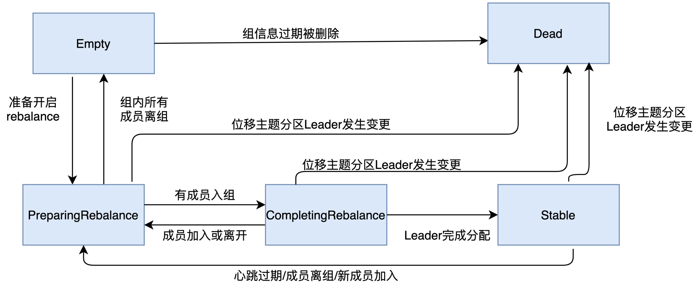

一个消费者组最开始是 Empty 状态，当重平衡过程开启后，它会被置于 PreparingRebalance 状态等待成员加入，之后变更到 CompletingRebalance 状态等待分配方案，最后流转到 Stable 状态完成重平衡。

当有新成员加入或已有成员退出时，消费者组的状态从 Stable 直接跳到 PreparingRebalance 状态，此时，所有现存成员就必须重新申请加入组。当所有成员都退出组后，消费者组状态变更为 Empty。Kafka 定期自动删除过期位移的条件就是，组要处于 Empty 状态。因此，如果你的消费者组停掉了很长时间（超过 7 天），那么 Kafka 很可能就把该组的位移数据删除了；

> 只有 Empty 状态下的组，才会执行过期位移删除的操作

### 5.13.5、Rebalance原理

新版本客户端将全部消费组分成多个子集，每个消费组的子集在服务端对应一个 GroupCoordinator 对其进行管理，GroupCoordinator 是 Kafka 服务端中用于管理消费组的组件。而消费者客户端中的 ConsumerCoordinator 组件负责与 GroupCoordinator 进行交互；

ConsumerCoordinator 与 GroupCoordinator 之间最重要的职责就是负责执行消费者Rebalance的操作，包括前面提及的分区分配的工作也是在Rebalance期间完成的；

所有 Broker 都有各自的 Coordinator 组件；

当有消费者加入消费组时，消费者、消费组及组协调器之间会经历一下几个阶段

#### 5.13.5.1、第一阶段：FIND_COORDINATOR

消费者需要确定它所属的消费组对应的 GroupCoordinator 所在的 broker，并创建与该 broker 相互通信的网络连接，目前，Kafka 为某个 Consumer Group 确定 Coordinator 所在的 Broker 的算法有 2 个步骤：
- 第 1 步：确定由位移主题的哪个分区来保存该 Group 数据：`partitionId=Math.abs(groupId.hashCode() % offsetsTopicPartitionCount)`；
- 第 2 步：找出该分区 Leader 副本所在的 Broker，该 Broker 即为对应的 Coordinator；

Kafka 在收到 FindCoordinatorRequest 请求之后，会根据 coordinator_key（也就是 groupId）查找对应的 GroupCoordinator 节点，如果找到对应的 GroupCoordinator 则会返回其相对应的 node_id、host 和 port信息

#### 5.13.5.2、第二阶段：JOIN_GROUP

当组内成员加入组时，它会向协调者发送 JoinGroup 请求。在该请求中，每个成员都要将自己订阅的主题上报，这样协调者就能收集到所有成员的订阅信息。一旦收集了全部成员的 JoinGroupRequest 请求后，协调者会从这些成员中选择一个担任这个消费者组的领导者；

JoinGroupRequest 的结构包含多个域：
- group_id：就是消费组的 id，通常也表示为 groupId。
- session_timout：对应消费端参数 session.timeout.ms，默认值为10000，即10秒。GroupCoordinator 超过 session_timeout 指定的时间内没有收到心跳报文则认为此消费者已经下线。
- rebalance_timeout：对应消费端参数 max.poll.interval.ms，默认值为300000，即5分钟。表示当消费组再平衡的时候，GroupCoordinator 等待各个消费者重新加入的最长等待时间。
- member_id：表示 GroupCoordinator 分配给消费者的id标识。消费者第一次发送 JoinGroupRequest 请求的时候此字段设置为 null。
- protocol_type：表示消费组实现的协议，对于消费者而言此字段值为“consumer”
- group_protocols：分配策略

如果是原有的消费者重新加入消费组，那么在真正发送 JoinGroupRequest 请求之前还要执行一些准备工作：
- 如果消费端参数 enable.auto.commit 设置为 true（默认值也为 true），即开启自动提交位移功能，那么在请求加入消费组之前需要向 GroupCoordinator 提交消费位移。这个过程是阻塞执行的，要么成功提交消费位移，要么超时。
- 如果消费者添加了自定义的再均衡监听器（ConsumerRebalanceListener），那么此时会调用 onPartitionsRevoked() 方法在重新加入消费组之前实施自定义的规则逻辑，比如清除一些状态，或者提交消费位移等。
- 因为是重新加入消费组，之前与 GroupCoordinator 节点之间的心跳检测也就不需要了，所以在成功地重新加入消费组之前需要禁止心跳检测的运作

GroupCoordinator 收到 JoinGroupRequest 请求之后，会做如下一些事情：
- 选举消费组的leader
- 选举分区分配策略

**选举消费组的leader：**

选举消费者的leader分两种情况：
- 如果消费组内还没有 leader，那么第一个加入消费组的消费者即为消费组的 leader；
- 如果某一时刻 leader 消费者由于某些原因退出了消费组，那么会重新选举一个新的 leader，新的选举代码：
    ```scala
    private val members = new mutable.HashMap[String, MemberMetadata]
    if (isLeader(memberId))
        leaderId = members.keys.headOption
    ```
    在 GroupCoordinator 中消费者的信息是以 HashMap 的形式存储的，其中 key 为消费者的 member_id，而 value 是消费者相关的元数据信息。leaderId 表示 leader 消费者的 member_id，它的取值为 HashMap 中的第一个键值对的 key

**选举分配策略：**

每个消费者都可以设置自己的分区分配策略，对消费组而言需要从各个消费者呈报上来的各个分配策略中选举一个彼此都“信服”的策略来进行整体上的分区分配。这个分区分配的选举并非由 leader 消费者决定，而是根据消费组内的各个消费者投票来决定的；

选举过程如下：
- 收集各个消费者支持的所有分配策略，组成候选集 candidates；
- 每个消费者从候选集 candidates 中找出第一个自身支持的策略，为这个策略投上一票；
- 计算候选集中各个策略的选票数，选票数最多的策略即为当前消费组的分配策略；

如果有消费者并不支持选出的分配策略，那么就会报出异常：Exception in thread "main" org.apache.kafka.common.errors.InconsistentGroupProtocolException: The group member's supported protocols are incompatible with those of existing members or first group member tried to join with empty protocol type or empty protocol list

> 这里所说的“消费者所支持的分配策略”是指 `partition.assignment.strategy` 参数配置的策略，如果这个参数值只配置了 RangeAssignor，那么这个消费者客户端只支持 RangeAssignor 分配策略，而不是消费者客户端代码中实现的3种分配策略及可能的自定义分配策略

Kafka 发送给普通消费者的 JoinGroupResponse 中的 members 内容为空，而只有 leader 消费者的 JoinGroupResponse 中的 members 包含有效数据。members 为数组类型，其中包含各个成员信息

***总结***：JoinGroup 请求的主要作用是将组成员订阅信息发送给领导者消费者，待领导者制定好分配方案后，重平衡流程进入到 SyncGroup 请求阶段。

#### 5.13.5.3、第三阶段（SYNC_GROUP）

leader 消费者根据在第二阶段中选举出来的分区分配策略来实施具体的分区分配，在此之后需要将分配的方案同步给各个消费者，此时 leader 消费者并不是直接和其余的普通消费者同步分配方案，而是通过 GroupCoordinator 这个“中间人”来负责转发同步分配方案的；在第三阶段，也就是同步阶段，各个消费者会向 GroupCoordinator 发送 SyncGroupRequest 请求来同步分配方案；

SyncGroupRequest 中的 group_id、generation_id 和 member_id 都有包含。只有 leader 消费者发送的 SyncGroupRequest 请求中才包含具体的分区分配方案，这个分配方案保存在 group_assignment 中，而其余消费者发送的 SyncGroupRequest 请求中的 group_assignment 为空；

服务端在收到消费者发送的 SyncGroupRequest 请求之后会交由 GroupCoordinator 来负责具体的逻辑处理，将从 leader 消费者发送过来的分配方案提取出来，连同整个消费组的元数据信息一起存入 Kafka 的 __consumer_offsets 主题中，最后发送响应给各个消费者以提供给各个消费者各自所属的分配方案；

当消费者收到所属的分配方案之后会调用 PartitionAssignor 中的 onAssignment() 方法。随后再调用 ConsumerRebalanceListener 中的 OnPartitionAssigned() 方法。之后开启心跳任务，消费者定期向服务端的 GroupCoordinator 发送 HeartbeatRequest 来确定彼此在线；

#### 5.13.5.4、第四阶段（HEARTBEAT）

进入这个阶段之后，消费组中的所有消费者就会处于正常工作状态。在正式消费之前，消费者还需要确定拉取消息的起始位置。假设之前已经将最后的消费位移提交到了 GroupCoordinator，并且 GroupCoordinator 将其保存到了 Kafka 内部的 __consumer_offsets 主题中，此时消费者可以通过 OffsetFetchRequest 请求获取上次提交的消费位移并从此处继续消费；

消费者的心跳间隔时间由参数 `heartbeat.interval.ms` 指定，默认值为3000，即3秒，这个参数必须比 session.timeout.ms 参数设定的值要小，一般情况下 `heartbeat.interval.ms` 的配置值不能超过 `session.timeout.ms` 配置值的1/3。这个参数可以调整得更低，以控制正常重新平衡的预期时间；

如果一个消费者发生崩溃，并停止读取消息，那么 GroupCoordinator 会等待一小段时间，确认这个消费者死亡之后才会触发再均衡。在这一小段时间内，死掉的消费者并不会读取分区里的消息。这个一小段时间由 `session.timeout.ms` 参数控制，该参数的配置值必须在broker端参数 `group.min.session.timeout.ms`（默认值为6000，即6秒）和 `group.max.session.timeout.ms`（默认值为300000，即5分钟）允许的范围内

#### 总结

正常情况下，每个组内成员都会定期汇报位移给协调者。当重平衡开启时，协调者会给予成员一段缓冲时间，要求每个成员必须在这段时间内快速地上报自己的位移信息，然后再开启正常的 JoinGroup/SyncGroup 请求发送

## 5.14、消费者拦截器

消费者拦截器需要自定义实现 `org.apache.kafka.clients.consumer.ConsumerInterceptor`接口，该接口包含三个方法：
```java
public interface ConsumerInterceptor<K, V> extends Configurable, AutoCloseable {
    // 会在 poll() 方法返回之前调用拦截器的 onConsume() 方法来对消息进行相应的定制化操作，比如修改返回的消息内容、按照某种规则过滤消息；如果 onConsume() 方法中抛出异常，那么会被捕获并记录到日志中，但是异常不会再向上传递
    public ConsumerRecords<K, V> onConsume(ConsumerRecords<K, V> records);
    // KafkaConsumer 会在提交完消费位移之后调用拦截器的 onCommit() 方法，可以使用这个方法来记录跟踪所提交的位移信息，比如当消费者使用 commitSync 的无参方法时，我们不知道提交的消费位移的具体细节，而使用拦截器的 onCommit() 方法却可以做到这一点
    public void onCommit(Map<TopicPartition, OffsetAndMetadata> offsets);
    public void close();
}
```
配置拦截器：`properties.put(ConsumerConfig.INTERCEPTOR_CLASSES_CONFIG, CustomConsumerInterceptor.class.getName());`

在某些业务场景中会对消息设置一个有效期的属性，如果某条消息在既定的时间窗口内无法到达，那么就会被视为无效，它也就不需要再被继续处理了。可以使用消费者拦截器来实现一个简单的消息 TTL（Time to Live，即过期时间）的功能：
```java
public class ConsumerInterceptorTTL implements ConsumerInterceptor<String, String> {
    private static final long EXPIRE_INTERVAL = 10 * 1000;
    @Override
    public ConsumerRecords<String, String> onConsume(ConsumerRecords<String, String> records) {
        long now = System.currentTimeMillis();
        Map<TopicPartition, List<ConsumerRecord<String, String>>> newRecords = new HashMap<>();
        for (TopicPartition tp : records.partitions()) {
            List<ConsumerRecord<String, String>> tpRecords = records.records(tp);
            List<ConsumerRecord<String, String>> newTpRecords = new ArrayList<>();
            for (ConsumerRecord<String, String> record : tpRecords) {
                if (now - record.timestamp() < EXPIRE_INTERVAL) {
                    newTpRecords.add(record);
                }
            }
            if (!newTpRecords.isEmpty()) {
                newRecords.put(tp, newTpRecords);
            }
        }
        return new ConsumerRecords<>(newRecords);
    }

    @Override
    public void onCommit(Map<TopicPartition, OffsetAndMetadata> offsets) {
        offsets.forEach((tp, offset) -> System.out.println(tp + ":" + offset.offset()));
    }
    @Override
    public void close() {}

    @Override
    public void configure(Map<String, ?> configs) {}
}
```

在消费者中也有拦截链的概念，和生产者的拦截链一样，也是按照 `interceptor.classes` 参数配置的拦截器的顺序来一一执行的（配置的时候，各个拦截器之间使用逗号隔开）。同样也要提防“副作用”的发生。如果在拦截链中某个拦截器执行失败，那么下一个拦截器会接着从上一个执行成功的拦截器继续执行；

## 5.15、消费者多线程实现

KafkaProducer 是线程安全的，然而 KafkaConsumer 却是非线程安全的。KafkaConsumer 中定义了一个 acquire() 方法，用来检测当前是否只有一个线程在操作，若有其他线程正在操作则会抛出 ConcurrentModifcationException 异常：
```java
java.util.ConcurrentModificationException: KafkaConsumer is not safe for multi-threaded access.
```
KafkaConsumer 中的每个公用方法在执行所要执行的动作之前都会调用这个 acquire() 方法，只有 wakeup() 方法是个例外；acquire () 方法的具体定义如下：
```java
private final AtomicLong currentThread = new AtomicLong(NO_CURRENT_THREAD);
// refcount is used to allow reentrant access by the thread who has acquired currentThread
private final AtomicInteger refcount = new AtomicInteger(0);
private void acquire() {
    long threadId = Thread.currentThread().getId();
    if (threadId != currentThread.get() && !currentThread.compareAndSet(NO_CURRENT_THREAD, threadId))
        throw new ConcurrentModificationException("KafkaConsumer is not safe for multi-threaded access");
    refcount.incrementAndGet();
}
```
acquire() 方法与锁（synchronized、Lock 等）不同，它不会造成阻塞等待，可以将其看作一个轻量级锁，它仅通过线程操作计数标记的方式来检测线程是否发生了并发操作，以此保证只有一个线程在操作。acquire() 方法和 release() 方法成对出现，表示相应的加锁和解锁操作；

可以通过多线程的方式来实现消息消费，多线程的目的就是为了提高整体的消费能力。多线程的实现方式有哪些呢？可以参考Flink Kafka Connector源码的多线程实现

- [Kafka多线程消费](https://www.cnblogs.com/huxi2b/p/7089854.html)

### 5.15.1、线程封闭

第一种也是最常见的方式：线程封闭，即为每个线程实例化一个 KafkaConsumer 对象

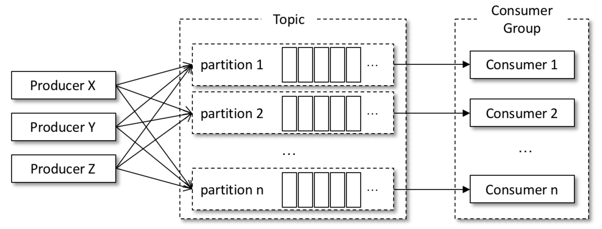

一个线程对应一个 KafkaConsumer 实例，我们可以称之为消费线程。一个消费线程可以消费一个或多个分区中的消息，所有的消费线程都隶属于同一个消费组。这种实现方式的并发度受限于分区的实际个数，当消费线程的个数大于分区数时，就有部分消费线程一直处于空闲的状态；

### 5.15.2、多个消费线程同时消费同一个分区

与此对应的第二种方式是多个消费线程同时消费同一个分区，这个通过 assign()、seek() 等方法实现，这样可以打破原有的消费线程的个数不能超过分区数的限制，进一步提高了消费的能力；

不过这种实现方式对于位移提交和顺序控制的处理就会变得非常复杂，实际应用中使用得极少。一般而言，分区是消费线程的最小划分单位；

## 5.16、消费者连接管理

消费者端主要的程序入口是 KafkaConsumer 类。和生产者不同的是，**构建 KafkaConsumer 实例时是不会创建任何 TCP 连接的**，也就是说，当你执行完 new KafkaConsumer(properties) 语句后，没有 Socket 连接被创建出来；

TCP 连接是在调用 KafkaConsumer.poll 方法时被创建的。再细粒度地说，在 poll 方法内部有 3 个时机可以创建 TCP 连接：
- **发起 FindCoordinator 请求时**：当消费者程序首次启动调用 poll 方法时，它需要向 Kafka 集群发送一个名为 FindCoordinator 的请求，希望 Kafka 集群告诉它哪个 Broker 是管理它的协调者；消费者程序会向集群中当前负载最小的那台 Broker 发送请求；

- **连接协调者时**：Broker 处理完上一步发送的 FindCoordinator 请求之后，会返还对应的响应结果（Response），显式地告诉消费者哪个 Broker 是真正的协调者，因此在这一步，消费者知晓了真正的协调者后，会创建连向该 Broker 的 Socket 连接。只有成功连入协调者，协调者才能开启正常的组协调操作，比如加入组、等待组分配方案、心跳请求处理、位移获取、位移提交等；

- **消费数据时**：消费者会为每个要消费的分区创建与该分区领导者副本所在 Broker 连接的 TCP；举个例子，假设消费者要消费 5 个分区的数据，这 5 个分区各自的领导者副本分布在 4 台 Broker 上，那么该消费者在消费时会创建与这 4 台 Broker 的 Socket 连接；

**通常来说，消费者程序会创建 3 类 TCP 连接：**
- （1）确定协调者和获取集群元数据；
- （2）连接协调者，令其执行组成员管理操作；
- （3）执行实际的消息获取；

**何时关闭TCP连接：**
- kafka自动关闭是由消费者端参数 `connection.max.idle.ms` 控制的；该参数现在的默认值是 9 分钟，即如果某个 Socket 连接上连续 9 分钟都没有任何请求“过境”的话，那么消费者会强行“杀掉”这个 Socket 连接
- 手动调用 KafkaConsumer.close() 方法，或者是执行 Kill 命令；

当上面第（3）个TCP 连接成功创建后，消费者程序就会废弃第一类 TCP 连接，之后在定期请求元数据时，它会改为使用第三类 TCP 连接。也就是说，最终你会发现，第一类 TCP 连接会在后台被默默地关闭掉。对一个运行了一段时间的消费者程序来说，只会有后面两类 TCP 连接存在。

## 5.17、过期时间

通过消息的 timestamp 字段和 ConsumerInterceptor 接口的 onConsume() 方法来实现消息的 TTL 功能

如果要实现自定义每条消息TTL的功能：可以沿用消息的 timestamp 字段和拦截器 ConsumerInterceptor 接口的 onConsume() 方法，还需要消息中的 headers 字段来做配合。我们可以将消息的 TTL 的设定值以键值对的形式保存在消息的 headers 字段中，这样消费者消费到这条消息的时候可以在拦截器中根据 headers 字段设定的超时时间来判断此条消息是否超时，而不是根据原先固定的 `EXPIRE_INTERVAL` 值来判断；

可以以直接使用 Kafka 提供的实现类 org.apache.kafka.common.header.internals.RecordHeaders 和 org.apache.kafka.common.header.internals.RecordHeader。这里只需使用一个 Header，key 可以固定为`ttl`，而 value 用来表示超时的秒数，超时时间一般用 Long 类型表示，但是 RecordHeader 中的构造方法 RecordHeader(String key, byte[] value) 和 value() 方法的返回值对应的 value 都是 byte[] 类型

# 6、主题、分区与副本

主题和分区是 Kafka 的两个核心概念，主题作为消息的归类，可以再细分为一个或多个分区，分区也可以看作对消息的二次归类。分区的划分不仅为 Kafka 提供了可伸缩性、水平扩展的功能，还通过多副本机制来为 Kafka 提供数据冗余以提高数据可靠性；

## 6.1、主题管理

主题的管理包括创建主题、查看主题信息、修改主题和删除主题等操作。可以通过 Kafka 提供的 kafka-topics.sh 脚本来执行这些操作，这个脚本位于`$KAFKA_HOME/bin/`目录下，其核心代码仅有一行，具体如下：`exec $(dirname $0)/kafka-run-class.sh kafka.admin.TopicCommand "$@"`

可以看到其实质上是调用了 `kafka.admin.TopicCommand` 类来执行主题管理的操作；主题的管理除了使用 kafka-topics.sh 脚本这一种方式，还可以通过 KafkaAdminClient 的方式实现（这种方式实质上是通过发送 CreateTopicsRequest、DeleteTopicsRequest 等请求来实现的），甚至我们还可以通过直接操纵日志文件和 ZooKeeper 节点来实现；

### 6.1.1、创建主题

如果 broker 端配置参数 `auto.create.topics.enable` 设置为 true（默认值就是 true），那么当生产者向一个尚未创建的主题发送消息时，会自动创建一个分区数为 n`um.partitions`（默认值为1）、副本因子为 `default.replication.factor`（默认值为1）的主题。除此之外，当一个消费者开始从未知主题中读取消息时，或者当任意一个客户端向未知主题发送元数据请求时，都会按照配置参数 `num.partitions` 和 `default.replication.factor` 的值来创建一个相应的主题；除非有特殊应用需求，否则不建议将 `auto.create.topics.enable` 参数设置为 true，这个参数会增加主题的管理与维护的难度；

通用的方式是通过 kafka-topics.sh 脚本来创建主题
```sh
# 创建了一个分区数为4、副本因子为2的主题 topic-demo
[root@node1 kafka_2.11-2.0.0]# bin/kafka-topics.sh --bootstrap-server kafka1:9092,kafka2:9092,kafka3:9092 --create --topic topic-create --partitions 4 --replication-factor 2
Created topic "topic-create". #此为控制台执行的输出结果
```
在执行完脚本之后，Kafka 会在 log.dir 或 log.dirs 参数所配置的目录下创建相应的主题分区，默认情况下这个目录为/tmp/kafka-logs/，这里配置的是kafka目录下的log目录：

节点1中创建的主题分区
```
[root@kafka1 kafka_2.12-2.7.0]# ls -al log | grep topic-create
drwxr-xr-x.  2 root root  141 8月  21 14:33 topic-create-0
drwxr-xr-x.  2 root root  141 8月  21 14:33 topic-create-1
drwxr-xr-x.  2 root root  141 8月  21 14:33 topic-create-3
```
可以看到 node1 节点中创建了3个文件夹 topic-create-0、topic-create-1、topic-create-3，对应主题 topic-create 的3个分区编号为0、1、3的分区，命名方式可以概括为`<topic>-<partition>`；

```
[root@kafka2 kafka_2.12-2.7.0]# ls -al log | grep topic-create
drwxr-xr-x.  2 root root  141 8月  21 14:33 topic-create-1
drwxr-xr-x.  2 root root  141 8月  21 14:33 topic-create-2
drwxr-xr-x.  2 root root  141 8月  21 14:33 topic-create-3

[root@kafka3 kafka_2.12-2.7.0]# ls -al log | grep topic-create
drwxr-xr-x.  2 root root  141 8月  21 14:33 topic-create-0
drwxr-xr-x.  2 root root  141 8月  21 14:33 topic-create-2
```

三个 broker 节点一共创建了8个文件夹，这个数字8实质上是分区数4与副本因子2的乘积。每个副本（或者更确切地说应该是日志，副本与日志一一对应）才真正对应了一个命名形式如`<topic>-<partition>`的文件夹

**Topic、Partition、Replication、Log 之间的关系**

主题、分区、副本和 Log（日志）的关系如下图所示，主题和分区都是提供给上层用户的抽象，而在副本层面或更加确切地说是 Log 层面才有实际物理上的存在

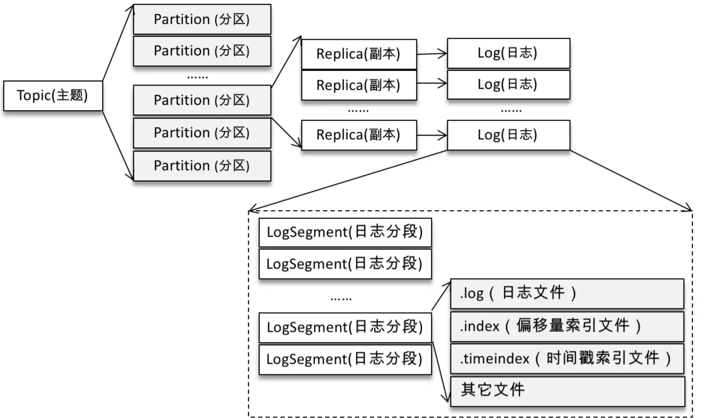

同一个分区中的多个副本必须分布在不同的 broker 中，这样才能提供有效的数据冗余。对于示例中的分区数为4、副本因子为2、broker 数为3的情况下，按照2、3、3的分区副本个数分配给各个 broker 是最优的选择。再比如在分区数为3、副本因子为3，并且 broker 数同样为3的情况下，分配3、3、3的分区副本个数给各个 broker 是最优的选择，也就是每个 broker 中都拥有所有分区的一个副本

不仅可以通过日志文件的根目录来查看集群中各个 broker 的分区副本的分配情况，还可以通过 ZooKeeper 客户端来获取。当创建一个主题时会在 ZooKeeper 的/brokers/topics/目录下创建一个同名的实节点，该节点中记录了该主题的分区副本分配方案
```
[zk: localhost:2181(CONNECTED) 0] get /brokers/topics/topic-create
{"version":2,"partitions":{"2":[3,2],"1":[2,1],"0":[1,3],"3":[1,2]},"adding_replicas":{},"removing_replicas":{}}
```
示例数据中的`"3":[1,2]`表示分区3分配了2个副本，分别在 brokerId 为1和2的 broker 节点中

通过 describe 指令类型来查看分区副本的分配细节，示例如下：
```
[root@kafka1 kafka_2.12-2.7.0]# bin/kafka-topics.sh --describe --bootstrap-server kafka1:9092,kafka2:9092,kafka3:9092 --topic topic-create
Topic: topic-create     PartitionCount: 4       ReplicationFactor: 2    Configs: 
        Topic: topic-create     Partition: 0    Leader: 1       Replicas: 1,3   Isr: 1,3
        Topic: topic-create     Partition: 1    Leader: 2       Replicas: 2,1   Isr: 2,1
        Topic: topic-create     Partition: 2    Leader: 3       Replicas: 3,2   Isr: 3,2
        Topic: topic-create     Partition: 3    Leader: 1       Replicas: 1,2   Isr: 1,2
```
示例中的 Topic 和 Partition 分别表示主题名称和分区号。PartitionCount 表示主题中分区的个数，ReplicationFactor 表示副本因子，而 Configs 表示创建或修改主题时指定的参数配置。Leader 表示分区的 leader 副本所对应的 brokerId，Isr 表示分区的 ISR 集合，Replicas 表示分区的所有的副本分配情况，即AR集合，其中的数字都表示的是 brokerId

使用kafka-topic.sh创建主题的命令：
`kafka-topics.sh -–zookeeper <String: hosts> –create –-topic [String: topic] -–partitions <Integer: # of partitions> –replication-factor <Integer: replication factor>`，这个创建主题时的分区副本都是按照既定的内部逻辑来进行分配的；kafka-topics.sh 脚本中还提供了一个 replica-assignment 参数来手动指定分区副本的分配方案。replica-assignment 参数的用法归纳如下：`--replica-assignment <String: broker_id_for_part1_replica1:broker_id_for_ part1_replica2, broker_id_for_part2_replica1:broker_id_for_part2_replica2, …>`

这种方式根据分区号的数值大小按照从小到大的顺序进行排列，分区与分区之间用逗号“,”隔开，分区内多个副本用冒号“:”隔开。并且在使用 replica-assignment 参数创建主题时不需要原本必备的 partitions 和 replication-factor 这两个参数

我们可以通过 replica-assignment 参数来创建一个与主题 topic-create 相同的分配方案的主题 topic-create-same 和不同的分配方案的主题 topic-create-diff，示例如下：
```
bin/kafka-topics.sh --bootstrap-server kafka1:9092,kafka2:9092,kafka3:9092 --create --topic topic-create-same --replica-assignment 2:0,0:1,1:2,2:1
```
注意同一个分区内的副本不能有重复，比如指定了0:0,1:1这种，就会报出 AdminCommand- FailedException 异常，示例如下：
```
[root@kafka1 kafka_2.12-2.7.0]# bin/kafka-topics.sh --bootstrap-server kafka1:9092,kafka2:9092,kafka3:9092 --create --topic topic-create-same-1 --replica-assignment 0:0,0:1,1:2,2:1
Error while executing topic command : Partition replica lists may not contain duplicate entries: 0
[2021-08-21 14:57:36,956] ERROR kafka.common.AdminCommandFailedException: Partition replica lists may not contain duplicate entries: 0
        at kafka.admin.TopicCommand$.$anonfun$parseReplicaAssignment$1(TopicCommand.scala:581)
        at kafka.admin.TopicCommand$.parseReplicaAssignment(TopicCommand.scala:577)
        at kafka.admin.TopicCommand$TopicCommandOptions.replicaAssignment(TopicCommand.scala:712)
        at kafka.admin.TopicCommand$CommandTopicPartition.<init>(TopicCommand.scala:98)
        at kafka.admin.TopicCommand$TopicService.createTopic(TopicCommand.scala:208)
        at kafka.admin.TopicCommand$TopicService.createTopic$(TopicCommand.scala:207)
        at kafka.admin.TopicCommand$ZookeeperTopicService.createTopic(TopicCommand.scala:380)
        at kafka.admin.TopicCommand$.main(TopicCommand.scala:64)
        at kafka.admin.TopicCommand.main(TopicCommand.scala)
 (kafka.admin.TopicCommand$)
```

### 6.1.2、修改主题

当一个主题被创建之后，依然允许我们对其做一定的修改，比如修改分区个数、修改配置等，这个修改的功能就是由 kafka-topics.sh 脚本中的 alter 指令提供的，目前 Kafka 只支持增加分区数而不支持减少分区数；

```sh
# 修改主题分区
bin/kafka-topics.sh --bootstrap-server broker_host:port --alter --topic <topic_name> --partitions <新分区数>
# 修改主题参数
bin/kafka-configs.sh --zookeeper zookeeper_host:port --entity-type topics --entity-name <topic_name> --alter --add-config max.message.bytes=10485760
```

**为什么不支持减少分区？** 按照 Kafka 现有的代码逻辑，此功能完全可以实现，不过也会使代码的复杂度急剧增大。实现此功能需要考虑的因素很多，比如删除的分区中的消息该如何处理？如果随着分区一起消失则消息的可靠性得不到保障；如果需要保留则又需要考虑如何保留。直接存储到现有分区的尾部，消息的时间戳就不会递增，如此对于 Spark、Flink 这类需要消息时间戳（事件时间）的组件将会受到影响；如果分散插入现有的分区，那么在消息量很大的时候，内部的数据复制会占用很大的资源，而且在复制期间，此主题的可用性又如何得到保障？与此同时，顺序性问题、事务性问题，以及分区和副本的状态机切换问题都是不得不面对的。反观这个功能的收益点却是很低的，如果真的需要实现此类功能，则完全可以重新创建一个分区数较小的主题，然后将现有主题中的消息按照既定的逻辑复制过去即可

### 6.1.3、删除主题

如果确定不再使用一个主题，那么最好的方式是将其删除，这样可以释放一些资源，比如磁盘、文件句柄等。kafka-topics.sh 脚本中的 delete 指令就可以用来删除主题
```
bin/kafka-topics.sh --bootstrap-server kafka1:9092,kafka2:9092,kafka3:9092 --delete --topic topic-delete
```
可以看到在执行完删除命令之后会有相关的提示信息，这个提示信息和 broker 端配置参数 `delete.topic.enable` 有关。必须将 `delete.topic.enable` 参数配置为 true 才能够删除主题，这个参数的默认值就是 true，如果配置为 false，那么删除主题的操作将会被忽略。在实际生产环境中，建议将这个参数的值设置为 true；如果要删除的主题是 Kafka 的内部主题，那么删除时就会报错；尝试删除一个不存在的主题也会报错；可以通过 if-exists 参数来忽略异常，参考如下：
```
[root@node1 kafka_2.11-2.0.0]# bin/kafka-topics.sh --bootstrap-server kafka1:9092,kafka2:9092,kafka3:9092 --delete --topic topic-unknown --if-exists
```
使用 kafka-topics.sh 脚本删除主题的行为本质上只是在 ZooKeeper 中的/admin/delete_topics路径下创建一个与待删除主题同名的节点，以此标记该主题为待删除的状态。与创建主题相同的是，真正删除主题的动作也是由 Kafka 的控制器负责完成的；

造成主题删除失败的原因有很多，最常见的原因有两个：
- 副本所在的 Broker 宕机了；
- 待删除主题的部分分区依然在执行迁移过程；

可以直接通过 ZooKeeper 的客户端来删除主题。下面示例中使用 ZooKeeper 客户端 zkCli.sh 来删除主题 topic-delete：

可以通过手动的方式来删除主题：主题中的元数据存储在 ZooKeeper 中的/brokers/topics和/config/topics路径下，主题中的消息数据存储在 log.dir 或 log.dirs 配置的路径下，我们只需要手动删除这些地方的内容即可。下面的示例中演示了如何删除主题 topic-delete，总共分3个步骤，第一步和第二步的顺序可以互换：
- 删除 ZooKeeper 中的节点/config/topics/topic-delete
    ```
    [zk: localhost:2181/kafka (CONNECTED) 7] delete /config/topics/topic-delete
    ```
- 第二步，删除 ZooKeeper 中的节点/brokers/topics/topic-delete 及其子节点，（高版本zookeeper使用 deleteall）
    ```
    [zk: localhost:2181/kafka (CONNECTED) 8] rmr /brokers/topics/topic-delete
    ```
- 第三步，删除集群中所有与主题 topic-delete 有关的文件
    ```sh
    # 集群中的各个broker节点中执行rm -rf /tmp/kafka-logs/topic-delete*命令来删除与主题topic-delete有关的文件
    [root@node1 kafka_2.11-2.0.0]# rm -rf /tmp/kafka-logs/topic-delete*
    [root@node2 kafka_2.11-2.0.0]# rm -rf /tmp/kafka-logs/topic-delete*
    [root@node3 kafka_2.11-2.0.0]# rm -rf /tmp/kafka-logs/topic-delete*
    ```
> 注意，删除主题是一个不可逆的操作。一旦删除之后，与其相关的所有消息数据会被全部删除，所以在执行这一操作的时候也要三思而后行

### 6.1.4、总结

通过执行无任何参数的 kafka-topics.sh 脚本，或者执行 kafka-topics.sh –help 来查看帮助信息。

<table>
    <thead>
        <tr>
            <th>参 数 名 称</th>
            <th>释 义</th>
        </tr>
    </thead>
    <tbody>
        <tr>
            <td>alter</td>
            <td>用于修改主题，包括分区数及主题的配置</td>
        </tr>
        <tr>
            <td>config &lt;键值对&gt;</td>
            <td>创建或修改主题时，用于设置主题级别的参数</td>
        </tr>
        <tr>
            <td>create</td>
            <td>创建主题</td>
        </tr>
        <tr>
            <td>delete</td>
            <td>删除主题</td>
        </tr>
        <tr>
            <td>delete-config &lt;配置名称&gt;</td>
            <td>删除主题级别被覆盖的配置</td>
        </tr>
        <tr>
            <td>describe</td>
            <td>查看主题的详细信息</td>
        </tr>
        <tr>
            <td>disable-rack-aware</td>
            <td>创建主题时不考虑机架信息</td>
        </tr>
        <tr>
            <td>help</td>
            <td>打印帮助信息</td>
        </tr>
        <tr>
            <td>if-exists</td>
            <td>修改或删除主题时使用，只有当主题存在时才会执行动作</td>
        </tr>
        <tr>
            <td>if-not-exists</td>
            <td>创建主题时使用，只有主题不存在时才会执行动作</td>
        </tr>
        <tr>
            <td>list</td>
            <td>列出所有可用的主题</td>
        </tr>
        <tr>
            <td>partitions &lt;分区数&gt;</td>
            <td>创建主题或增加分区时指定分区数</td>
        </tr>
        <tr>
            <td>replica-assignment &lt;分配方案&gt;</td>
            <td>手工指定分区副本分配方案</td>
        </tr>
        <tr>
            <td>replication-factor &lt;副本数&gt;</td>
            <td>创建主题时指定副本因子</td>
        </tr>
        <tr>
            <td>topic &lt;主题名称&gt;</td>
            <td>指定主题名称</td>
        </tr>
        <tr>
            <td>topics-with-overrides</td>
            <td>使用 describe 查看主题信息时，只展示包含覆盖配置的主题</td>
        </tr>
        <tr>
            <td>unavailable-partitions</td>
            <td>使用 describe 查看主题信息时，只展示包含没有 leader 副本的分区</td>
        </tr>
        <tr>
            <td>under-replicated-partitions</td>
            <td>使用 describe 查看主题信息时，只展示包含失效副本的分区</td>
        </tr>
        <tr>
            <td>zookeeper</td>
            <td>指定连接的 ZooKeeper 地址信息（必填项）</td>
        </tr>
    </tbody>
</table>

## 6.2、KafkaAdminClient

### 6.2.1、基本概述

一般情况下，习惯使用 kafka-topics.sh 脚本来管理主题，但有些时候我们希望将主题管理类的功能集成到公司内部的系统中，打造集管理、监控、运维、告警为一体的生态平台，那么就需要以程序调用 API 的方式去实现

在 Kafka 0.11.0.0 版本之前，我们可以通过 kafka-core 包（Kafka 服务端代码）下的 kafka.admin.AdminClient 和 kafka.admin.AdminUtils 来实现部分 Kafka 的管理功能，但它们都已经过时了，在未来的版本中会被删除。从0.11.0.0版本开始，Kafka 提供了另一个工具类 `org.apache.kafka.clients.admin.KafkaAdminClient` 来作为替代方案。KafkaAdminClient 不仅可以用来管理 broker、配置和 ACL（Access Control List），还可以用来管理主题

KafkaAdminClient 继承了 `org.apache.kafka.clients.admin.AdminClient` 抽象类
- 创建主题：CreateTopicsResult createTopics(Collection newTopics)。
- 删除主题：DeleteTopicsResult deleteTopics(Collection topics)。
- 列出所有可用的主题：ListTopicsResult listTopics()。
- 查看主题的信息：DescribeTopicsResult describeTopics(Collection topicNames)。
- 查询配置信息：DescribeConfigsResult describeConfigs(Collection resources)。
- 修改配置信息：AlterConfigsResult alterConfigs(Map<ConfigResource, Config> configs)。
- 增加分区：CreatePartitionsResult createPartitions(Map<String, NewPartitions> newPartitions)

### 6.2.2、主题合法性验证

一般情况下，Kafka 生产环境中的 auto.create.topics.enable 参数会被设置为 false，即自动创建主题这条路会被堵住；

普通用户在创建主题的时候，有可能由于误操作或其他原因而创建了不符合运维规范的主题，比如命名不规范，副本因子数太低等，这些都会影响后期的系统运维。如果创建主题的操作封装在资源申请、审核系统中，那么在前端就可以根据规则过滤不符合规范的申请操作；

Kafka broker 端有一个这样的参数：`create.topic.policy.class.name`，默认值为 null，它提供了一个入口用来验证主题创建的合法性；

使用方式很简单，只需要自定义实现 `org.apache.kafka.server.policy.CreateTopicPolicy` 接口，比如下面示例中的 PolicyDemo。然后在 broker 端的配置文件 config/server.properties 中配置参数 `create.topic.policy.class.name` 的值为 org.apache.kafka.server.policy.PolicyDemo，最后启动服务

### 6.2.3、原理

从设计上来看，AdminClient 是一个双线程的设计：前端主线程和后端 I/O 线程：
- 前端线程负责将用户要执行的操作转换成对应的请求，然后再将请求发送到后端 I/O 线程的队列中；
- 后端 I/O 线程从队列中读取相应的请求，然后发送到对应的 Broker 节点上，之后把执行结果保存起来，以便等待前端线程的获取；后端 I/O 线程名字的前缀是 kafka-admin-client-thread

### 6.2.4、使用

以創建topic為例
```java
public static void main(String[] args) {
    String brokerList =  "kafka1:9092,kafka2:9092,kafka3:9092";
    String topic = "topic-admin";
    Properties props = new Properties();
    props.put(AdminClientConfig.BOOTSTRAP_SERVERS_CONFIG, brokerList);
    props.put(AdminClientConfig.REQUEST_TIMEOUT_MS_CONFIG, 30000);
    AdminClient client = AdminClient.create(props);
    NewTopic newTopic = new NewTopic(topic, 4, (short) 1);
    CreateTopicsResult result = client.createTopics(Collections.singleton(newTopic));
    try {
        result.all().get();
    } catch (InterruptedException | ExecutionException e) {
        e.printStackTrace();
    }
    client.close();
}
```

## 6.3、优先副本选举

分区使用多副本机制来提升可靠性，但只有 leader 副本对外提供读写服务，而 follower 副本只负责在内部进行消息的同步；如果一个分区的 leader 副本不可用，那么就意味着整个分区变得不可用，此时就需要 Kafka 从剩余的 follower 副本中挑选一个新的 leader 副本来继续对外提供服务。虽然不够严谨，但从某种程度上说，broker 节点中 leader 副本个数的多少决定了这个节点负载的高低；

针对同一个分区而言，同一个 broker 节点中不可能出现它的多个副本，即 Kafka 集群的一个 broker 中最多只能有它的一个副本，我们可以将 leader 副本所在的 broker 节点叫作分区的 leader 节点，而 follower 副本所在的 broker 节点叫作分区的 follower 节点。

随着时间的更替，Kafka 集群的 broker 节点不可避免地会遇到宕机或崩溃的问题，当分区的 leader 节点发生故障时，其中一个 follower 节点就会成为新的 leader 节点，这样就会导致集群的负载不均衡，从而影响整体的健壮性和稳定性。当原来的 leader 节点恢复之后重新加入集群时，它只能成为一个新的 follower 节点而不再对外提供服务

**优先副本（preferred replica）：**

为了能够有效地治理负载失衡的情况，Kafka 引入了`优先副本（preferred replica）`的概念，谓的优先副本是指在AR集合列表中的第一个副本
```
[root@kafka1 kafka_2.12-2.7.0]# bin/kafka-topics.sh --bootstrap-server kafka1:9092,kafka2:9092,kafka3:9092 --describe --topic topic-partitions
Topic: topic-partitions PartitionCount: 3       ReplicationFactor: 3    Configs: 
        Topic: topic-partitions Partition: 0    Leader: 2       Replicas: 2,3,1 Isr: 2,3,1
        Topic: topic-partitions Partition: 1    Leader: 3       Replicas: 3,1,2 Isr: 3,1,2
        Topic: topic-partitions Partition: 2    Leader: 1       Replicas: 1,2,3 Isr: 1,2,3
```
将 brokerId 为2 的机器停止服务，然后在重启服务，
```
[root@kafka1 kafka_2.12-2.7.0]# bin/kafka-topics.sh --bootstrap-server kafka1:9092,kafka2:9092,kafka3:9092 --describe --topic topic-partitions
Topic: topic-partitions PartitionCount: 3       ReplicationFactor: 3    Configs: 
        Topic: topic-partitions Partition: 0    Leader: 3       Replicas: 2,3,1 Isr: 3,1,2
        Topic: topic-partitions Partition: 1    Leader: 3       Replicas: 3,1,2 Isr: 3,1,2
        Topic: topic-partitions Partition: 2    Leader: 1       Replicas: 1,2,3 Isr: 1,3,2
```
可以看到原本分区0的 leader 节点为2，现在变成了3，如此一来原本均衡的负载变成了失衡：节点3的负载最高，而节点2的负载最低

比如上面主题 topic-create 中分区0的AR集合列表（Replicas）为[2,3,1]，那么分区0的优先副本即为1；理想情况下，优先副本就是该分区的leader 副本，所以也可以称之为 preferred leader。Kafka 要确保所有主题的优先副本在 Kafka 集群中均匀分布，这样就保证了所有分区的 leader 均衡分布。如果 leader 分布过于集中，就会造成集群负载不均衡；

**优先副本的选举：**

所谓的优先副本的选举是指通过一定的方式促使优先副本选举为 leader 副本，以此来促进集群的负载均衡，这一行为也可以称为`分区平衡`；

在 Kafka 中可以提供分区自动平衡的功能，与此对应的 broker 端参数是 `auto.leader. rebalance.enable`，此参数的默认值为 true，即默认情况下此功能是开启的。如果开启分区自动平衡的功能，则 Kafka 的控制器会启动一个定时任务，这个定时任务会轮询所有的 broker 节点，计算每个 broker 节点的分区不平衡率（broker 中的不平衡率=非优先副本的 leader 个数/分区总数）是否超过 `leader.imbalance.per.broker.percentage` 参数配置的比值，默认值为10%，如果超过设定的比值则会自动执行优先副本的选举动作以求分区平衡。执行周期由参数 `leader.imbalance.check.interval.seconds` 控制，默认值为300秒，即5分钟；

不过在生产环境中不建议将 `auto.leader.rebalance.enable` 设置为默认的 true，因为这可能引起负面的性能问题，也有可能引起客户端一定时间的阻塞。因为执行的时间无法自主掌控，如果在关键时期（比如电商大促波峰期）执行关键任务的关卡上执行优先副本的自动选举操作，势必会有业务阻塞、频繁超时之类的风险。前面也分析过，分区及副本的均衡也不能完全确保集群整体的均衡，并且集群中一定程度上的不均衡也是可以忍受的，为防止出现关键时期“掉链子”的行为；

Kafka 中 kafka-perferred-replica-election.sh 脚本提供了对分区 leader 副本进行重新平衡的功能；优先副本的选举过程是一个安全的过程，Kafka 客户端可以自动感知分区 leader 副本的变更
```
bin/kafka-preferred-replica-election.sh --bootstrap-server kafka1:9092,kafka2:9092,kafka3:9092
[root@kafka1 kafka_2.12-2.7.0]# bin/kafka-topics.sh --bootstrap-server kafka1:9092,kafka2:9092,kafka3:9092 --describe --topic topic-partitions
Topic: topic-partitions PartitionCount: 3       ReplicationFactor: 3    Configs: 
        Topic: topic-partitions Partition: 0    Leader: 2       Replicas: 2,3,1 Isr: 3,1,2
        Topic: topic-partitions Partition: 1    Leader: 3       Replicas: 3,1,2 Isr: 3,1,2
        Topic: topic-partitions Partition: 2    Leader: 1       Replicas: 1,2,3 Isr: 1,3,2
```
可以看到在脚本执行之后，主题 topic-partitions 中的所有 leader 副本的分布已经和刚创建时的一样了，所有的优先副本都成为 leader 副本；

leader 副本的转移也是一项高成本的工作，如果要执行的分区数很多，那么必然会对客户端造成一定的影响。如果集群中包含大量的分区，那么上面的这种使用方式有可能会失效；

优先副本的选举过程中，具体的元数据信息会被存入 ZooKeeper 的/admin/preferred_replica_election 节点，如果这些数据超过了 ZooKeeper 节点所允许的大小，那么选举就会失败。默认情况下 ZooKeeper 所允许的节点数据大小为1MB；

kafka-perferred-replica-election.sh 脚本中还提供了 path-to-json-file 参数来小批量地对部分分区执行优先副本的选举操作。通过 path-to-json-file 参数来指定一个 JSON 文件，这个 JSON 文件里保存需要执行优先副本选举的分区清单；
```json
{
    "partitions":[
        {
            "partition":0,
            "topic":"topic-partitions"
        },
        {
            "partition":1,
            "topic":"topic-partitions"
        },
        {
            "partition":2,
            "topic":"topic-partitions"
        }
    ]
}
```
然后通过 kafka-perferred-replica-election.sh 脚本配合 path-to-json-file 参数来对主题 topic-partitions 执行优先副本的选举操作，具体示例如下：
```
bin/kafka-preferred-replica-election.sh --bootstrap-server kafka1:9092,kafka2:9092,kafka3:9092 --path-to-json-file election.json
```
在实际生产环境中，一般使用 path-to-json-file 参数来分批、手动地执行优先副本的选举操作。尤其是在应对大规模的 Kafka 集群时，理应杜绝采用非 path-to-json-file 参数的选举操作方式。同时，优先副本的选举操作也要注意避开业务高峰期，以免带来性能方面的负面影响；

## 6.4、分区重分配

当要对集群中的一个节点进行有计划的下线操作时，为了保证分区及副本的合理分配，我们也希望通过某种方式能够将该节点上的分区副本迁移到其他的可用节点上。

当集群中新增 broker 节点时，只有新创建的主题分区才有可能被分配到这个节点上，而之前的主题分区并不会自动分配到新加入的节点中，因为在它们被创建时还没有这个新节点，这样新节点的负载和原先节点的负载之间严重不均衡；

为了解决上述问题，需要让分区副本再次进行合理的分配，也就是所谓的分区重分配。Kafka 提供了 kafka-reassign-partitions.sh 脚本来执行分区重分配的工作，它可以在集群扩容、broker 节点失效的场景下对分区进行迁移。 kafka-reassign-partitions.sh 脚本的使用分为3个步骤：首先创建需要一个包含主题清单的 JSON 文件，其次根据主题清单和 broker 节点清单生成一份重分配方案，最后根据这份方案执行具体的重分配动作；

kafka-reassign-partitions.sh 脚本的用法。首先在一个由3个节点（broker 0、broker 1、broker 2）组成的集群中创建一个主题 topic-reassign，主题中包含4个分区和2个副本：
```
bin/kafka-topics.sh --bootstrap-server kafka1:9092,kafka2:9092,kafka3:9092 --create --topic topic-reassign --replication-factor 2 --partitions 4
[root@kafka1 kafka_2.12-2.7.0]# bin/kafka-topics.sh ---bootstrap-server kafka1:9092,kafka2:9092,kafka3:9092 --describe --topic topic-reassign
Topic: topic-reassign   PartitionCount: 4       ReplicationFactor: 2    Configs: 
        Topic: topic-reassign   Partition: 0    Leader: 1       Replicas: 1,2   Isr: 1,2
        Topic: topic-reassign   Partition: 1    Leader: 2       Replicas: 2,3   Isr: 2,3
        Topic: topic-reassign   Partition: 2    Leader: 3       Replicas: 3,1   Isr: 3,1
        Topic: topic-reassign   Partition: 3    Leader: 1       Replicas: 1,3   Isr: 1,3
```
主题 topic-reassign 在3个节点中都有相应的分区副本分布，由于某种原因，我们想要下线 brokerId 为1的 broker 节点，在此之前，我们要做的就是将其上的分区副本迁移出去，迁移过程过程：
- 创建一个 JSON 文件（文件的名称假定为 reassign.json），文件内容为要进行分区重分配的主题清单
    ```json
    {
        "topics":[
            {
                "topic":"topic-reassign"
            }
        ],
        "version":1
    }
    ```
- 根据这个 JSON 文件和指定所要分配的 broker 节点列表来生成一份候选的重分配方案
    ```sh
    [root@kafka2 kafka_2.12-2.7.0]# bin/kafka-reassign-partitions.sh --bootstrap-server kafka1:9092,kafka2:9092,kafka3:9092 --generate --topics-to-move-json-file reassign.json --broker-list 2,3
    Warning: --zookeeper is deprecated, and will be removed in a future version of Kafka.
    Current partition replica assignment
    {"version":1,"partitions":[{"topic":"topic-reassign","partition":0,"replicas":[1,2],"log_dirs":["any","any"]},{"topic":"topic-reassign","partition":1,"replicas":[2,3],"log_dirs":["any","any"]},{"topic":"topic-reassign","partition":2,"replicas":[3,1],"log_dirs":["any","any"]},{"topic":"topic-reassign","partition":3,"replicas":[1,3],"log_dirs":["any","any"]}]}
    
    Proposed partition reassignment configuration
    {"version":1,"partitions":[{"topic":"topic-reassign","partition":0,"replicas":[3,2],"log_dirs":["any","any"]},{"topic":"topic-reassign","partition":1,"replicas":[2,3],"log_dirs":["any","any"]},{"topic":"topic-reassign","partition":2,"replicas":[3,2],"log_dirs":["any","any"]},{"topic":"topic-reassign","partition":3,"replicas":[2,3],"log_dirs":["any","any"]}]}
    ```
    generate 是 kafka-reassign-partitions.sh 脚本中指令类型的参数，可以类比于 kafka-topics.sh 脚本中的 create、list 等，它用来生成一个重分配的候选方案。topic-to-move-json 用来指定分区重分配对应的主题清单文件的路径，该清单文件的具体的格式可以归纳为`{"topics": [{"topic": "foo"},{"topic": "foo1"}],"version": 1}`，broker-list 用来指定所要分配的 broker 节点列表，比如示例中的“2,3”；

    第二个“Proposed partition reassignment configuration”所对应的 JSON 内容为重分配的候选方案，注意这里只是生成一份可行性的方案，并没有真正执行重分配的动作
- 执行具体的重分配动作
    ```sh
    [root@kafka2 kafka_2.12-2.7.0]# bin/kafka-reassign-partitions.sh --bootstrap-server kafka1:9092,kafka2:9092,kafka3:9092 --execute --reassignment-json-file project.json
    Warning: --zookeeper is deprecated, and will be removed in a future version of Kafka.
    Current partition replica assignment
    
    {"version":1,"partitions":[{"topic":"topic-reassign","partition":0,"replicas":[1,2],"log_dirs":["any","any"]},{"topic":"topic-reassign","partition":1,"replicas":[2,3],"log_dirs":["any","any"]},{"topic":"topic-reassign","partition":2,"replicas":[3,1],"log_dirs":["any","any"]},{"topic":"topic-reassign","partition":3,"replicas":[1,3],"log_dirs":["any","any"]}]}
    
    Save this to use as the --reassignment-json-file option during rollback
    Successfully started partition reassignments for topic-reassign-0,topic-reassign-1,topic-reassign-2,topic-reassign-3
    ```
    执行完上述命令之后，可以看到 topic-reassign 的所有分区副本都只在2和3的 broker 节点上分布了；
```
[root@kafka2 kafka_2.12-2.7.0]# bin/kafka-topics.sh --bootstrap-server kafka1:9092,kafka2:9092,kafka3:9092 --describe --topic topic-reassign
Topic: topic-reassign   PartitionCount: 4       ReplicationFactor: 2    Configs: 
        Topic: topic-reassign   Partition: 0    Leader: 3       Replicas: 3,2   Isr: 2,3
        Topic: topic-reassign   Partition: 1    Leader: 2       Replicas: 2,3   Isr: 2,3
        Topic: topic-reassign   Partition: 2    Leader: 3       Replicas: 3,2   Isr: 3,2
        Topic: topic-reassign   Partition: 3    Leader: 2       Replicas: 2,3   Isr: 3,2
```
**分区重分配的基本原理：** 是先通过控制器为每个分区添加新副本（增加副本因子），新的副本将从分区的 leader 副本那里复制所有的数据。根据分区的大小不同，复制过程可能需要花一些时间，因为数据是通过网络复制到新副本上的。在复制完成之后，控制器将旧副本从副本清单里移除（恢复为原先的副本因子数）。注意在重分配的过程中要确保有足够的空间；

分区重分配对集群的性能有很大的影响，需要占用额外的资源，比如网络和磁盘。在实际操作中，我们将降低重分配的粒度，分成多个小批次来执行，以此来将负面的影响降到最低，这一点和优先副本的选举有异曲同工之妙；

## 6.5、选择合适的分区数

从某些角度来做具体的分析，最终还是要根据实际的业务场景、软件条件、硬件条件、负载情况等来做具体的考量

### 6.5.1、性能测试工具

在实际生产环境中，我们需要了解一套硬件所对应的性能指标之后才能分配其合适的应用和负荷，所以性能测试工具必不可少；

Kafka 本身提供了用于生产者性能测试的 `kafka-producer-perf-test.sh` 和用于消费者性能测试的 `kafka-consumer-perf-test.sh`

**kafka-producer-perf-test.sh** 使用示例：
```
[root@kafka1 kafka_2.12-2.7.0]# bin/kafka-producer-perf-test.sh --topic topic-1 --num-records 1000000 --record-size 1024 --throughput -1 --producer-props bootstrap.servers=kafka1:9092,kafka2:9092,kafka3:9092 acks=1
19621 records sent, 3921.8 records/sec (3.83 MB/sec), 1691.6 ms avg latency, 2621.0 ms max latency.
78963 records sent, 15698.4 records/sec (15.33 MB/sec), 1598.7 ms avg latency, 4728.0 ms max latency.
79027 records sent, 15805.4 records/sec (15.43 MB/sec), 1904.0 ms avg latency, 5398.0 ms max latency.
105000 records sent, 20962.3 records/sec (20.47 MB/sec), 1686.5 ms avg latency, 4978.0 ms max latency.
135510 records sent, 27102.0 records/sec (26.47 MB/sec), 1228.3 ms avg latency, 3607.0 ms max latency.
131550 records sent, 26304.7 records/sec (25.69 MB/sec), 1142.1 ms avg latency, 3137.0 ms max latency.
181170 records sent, 36219.5 records/sec (35.37 MB/sec), 964.2 ms avg latency, 3244.0 ms max latency.
182077 records sent, 36415.4 records/sec (35.56 MB/sec), 837.8 ms avg latency, 2768.0 ms max latency.
1000000 records sent, 23970.468383 records/sec (23.41 MB/sec), 1192.10 ms avg latency, 5398.00 ms max latency, 218 ms 50th, 4279 ms 95th, 4758 ms 99th, 5239 ms 99.9th.
```
示例中在使用 `kafka-producer-perf-test.sh` 脚本时用了多一个参数，其中 topic 用来指定生产者发送消息的目标主题；`num-records` 用来指定发送消息的总条数；`record-size` 用来设置每条消息的字节数；`producer-props` 参数用来指定生产者的配置，可同时指定多组配置，各组配置之间以空格分隔，与 producer-props 参数对应的还有一个 `producer.config` 参数，它用来指定生产者的配置文件；`throughput` 用来进行限流控制，当设定的值小于0时不限流，当设定的值大于0时，当发送的吞吐量大于该值时就会被阻塞一段时间；

kafka-producer-perf-test.sh 脚本中还有一个有意思的参数 print-metrics，指定了这个参数时会在测试完成之后打印很多指标信息，对很多测试任务而言具有一定的参考价值。示例参考如下：
```
[root@kafka1 kafka_2.12-2.7.0]# bin/kafka-producer-perf-test.sh --topic topic-1 --num-records 1000000 --record-size 1024 --throughput -1 --print-metrics --producer-props bootstrap.servers=kafka1:9092,kafka2:9092,kafka3:9092 acks=1 
68416 records sent, 13683.2 records/sec (13.36 MB/sec), 1454.3 ms avg latency, 2598.0 ms max latency.
164270 records sent, 32854.0 records/sec (32.08 MB/sec), 821.3 ms avg latency, 2430.0 ms max latency.
200657 records sent, 40131.4 records/sec (39.19 MB/sec), 827.3 ms avg latency, 2435.0 ms max latency.
344563 records sent, 68912.6 records/sec (67.30 MB/sec), 465.8 ms avg latency, 1731.0 ms max latency.
1000000 records sent, 42527.855746 records/sec (41.53 MB/sec), 676.88 ms avg latency, 2598.00 ms max latency, 66 ms 50th, 2268 ms 95th, 2396 ms 99th, 2518 ms 99.9th.

Metric Name                                                                         Value
app-info:commit-id:{client-id=producer-1}                                         : 448719dc99a19793
app-info:start-time-ms:{client-id=producer-1}                                     : 1629630461418
app-info:version:{client-id=producer-1}                                           : 2.7.0
kafka-metrics-count:count:{client-id=producer-1}                                  : 126.000
....
```
kafka-producer-perf-test.sh 脚本的输出信息，以下面的一行内容为例：
```
1000000 records sent, 23970.468383 records/sec (23.41 MB/sec), 1192.10 ms avg latency, 5398.00 ms max latency, 218 ms 50th, 4279 ms 95th, 4758 ms 99th, 5239 ms 99.9th.
```
`records sent` 表示测试时发送的消息总数；`records/sec` 表示以每秒发送的消息数来统计吞吐量，括号中的 MB/sec 表示以每秒发送的消息大小来统计吞吐量，注意这两者的维度；`avg latency` 表示消息处理的平均耗时；`max latency` 表示消息处理的最大耗时；50th、95th、99th 和 99.9th 分别表示 50%、95%、99% 和 99.9% 的消息处理耗时;

**kafka-consumer-perf-test.sh**使用示例：
```
[root@kafka1 kafka_2.12-2.7.0]# bin/kafka-consumer-perf-test.sh --topic topic-1 --messages 1000000 --broker-list kafka1:9092,kafka2:9092,kafka3:9092
start.time, end.time, data.consumed.in.MB, MB.sec, data.consumed.in.nMsg, nMsg.sec, rebalance.time.ms, fetch.time.ms, fetch.MB.sec, fetch.nMsg.sec
2021-08-22 19:10:54:813, 2021-08-22 19:11:02:949, 977.0049, 120.0842, 1000453, 122966.1996, 1629630655630, -1629630647494, -0.0000, -0.0006
```
输出结果中包含了多项信息，分别对应起始运行时间（start.time）、结束运行时间（end.time）、消费的消息总量（data.consumed.in.MB，单位为MB）、按字节大小计算的消费吞吐量（MB.sec，单位为MB/s）、消费的消息总数（data.consumed.in.nMsg）、按消息个数计算的吞吐量（nMsg.sec）、再平衡的时间（rebalance.time.ms，单位为ms）、拉取消息的持续时间（fetch.time.ms，单位为ms）、每秒拉取消息的字节大小（fetch.MB.sec，单位为MB/s）、每秒拉取消息的个数（fetch.nMsg.sec）。其中 fetch.time.ms = end.time – start.time – rebalance.time.ms

### 6.5.2、分区数越高吞吐量就越高吗？

分区是 Kafka 中最小的并行操作单元，对生产者而言，每一个分区的数据写入是完全可以并行化的；对消费者而言，Kafka 只允许单个分区中的消息被一个消费者线程消费，一个消费组的消费并行度完全依赖于所消费的分区数；

测试过程：
```
1、首先分别创建分区数为1、20、50、100、200、500、1000的主题，对应的主题名称分别为topic-1、topic-20、topic-50、topic-100、topic-200、topic-500、topic-1000，所有主题的副本因子都设置为1；
2、在相同的机器上使用 kafka-producer-perf-test.sh 命令测试
```

**生产者：**看到分区数为1时吞吐量最低，随着分区数的增长，相应的吞吐量也跟着上涨。一旦分区数超过了某个阈值之后，整体的吞吐量是不升反降的。也就是说，并不是分区数越多吞吐量也越大。这里的分区数临界阈值针对不同的测试环境也会表现出不同的结果，实际应用中可以通过类似的测试案例（比如复制生产流量以便进行测试回放）来找到一个合理的临界值区间

**消费者：**随着分区数的增加，相应的吞吐量也会有所增长。一旦分区数超过了某个阈值之后，整体的吞吐量也是不升反降的，同样说明了分区数越多并不会使吞吐量一直增长

### 6.5.3、分区数的上限

一味地增加分区数并不能使吞吐量一直得到提升，并且分区数也并不能一直增加，如果超过默认的配置值，还会引起 Kafka 进程的崩溃；比如在一台普通的 Linux 机器上创建包含10000个分区的主题，比如在下面示例中创建一个主题 topic-bomb：
```
bin/kafka-topics.sh --bootstrap-server kafka1:9092,kafka2:9092,kafka3:9092 --create --topic topic-bomb --replication-factor 1 --partitions 10000
```
执行完成后可以检查 Kafka 的进程是否还存在（比如通过 jps 命令或 ps -aux|grep kafka 命令）。一般情况下，会发现原本运行完好的 Kafka 服务已经崩溃；

打开 Kafka 的服务日志文件（$KAFKA_HOME/logs/server.log）来一探究竟，会发现服务日志中出现大量的异常：
```
[2021-08-13 18:36:40,019] ERROR Error while creating log for topic-bomb-xxx in dir /tmp/kafka-logs (kafka.server.LogDirFailureChannel)
java.io.IOException: Too many open files 
     at java.io.UnixFileSystem.createFileExclusively(Native Method)
     at java.io.File.createNewFile(File.java:1012)
     at kafka.log.AbstractIndex.<init>(AbstractIndex.scala:54)
     at kafka.log.OffsetIndex.<init>(OffsetIndex.scala:53)
     at kafka.log.LogSegment$.open(LogSegment.scala:634)
     at kafka.log.Log.loadSegments(Log.scala:503)
     at kafka.log.Log.<init>(Log.scala:237)
```
异常中最关键的信息是“Too many open flies”，这是一种常见的 Linux 系统错误，通常意味着文件描述符不足，它一般发生在创建线程、创建 Socket、打开文件这些场景下
在 Linux 系统的默认设置下，这个文件描述符的个数不是很多，通过 ulimit 命令可以查看：
```
[root@kafka3 log]# ulimit -n 
1024
[root@kafka3 log]# ulimit -Sn
1024
[root@kafka3 log]# ulimit -Hn
4096
```
ulimit 是在系统允许的情况下，提供对特定 shell 可利用的资源的控制。-H 和 -S 选项指定资源的硬限制和软限制。硬限制设定之后不能再添加，而软限制则可以增加到硬限制规定的值。如果 -H 和 -S 选项都没有指定，则软限制和硬限制同时设定。限制值可以是指定资源的数值或 hard、soft、unlimited 这些特殊值，其中 hard 代表当前硬限制，soft 代表当前软件限制，unlimited 代表不限制。如果不指定限制值，则打印指定资源的软限制值，除非指定了 -H 选项。硬限制可以在任何时候、任何进程中设置，但硬限制只能由超级用户设置。软限制是内核实际执行的限制，任何进程都可以将软限制设置为任意小于等于硬限制的值

查看当前 Kafka 进程所占用的文件描述符的个数，注意这个值并不是Kafka第一次启动时就需要占用的文件描述符的个数，示例中的 Kafka 环境下已经存在了若干主题）：
```
[root@kafka1 log]# ls /proc/2931/fd | wc -l
3529
```
如何避免这种 Too many open files 异常情况？对于一个高并发、高性能的应用来说，1024或4096的文件描述符限制未免太少，可以适当调大这个参数。比如使用 ulimit -n 65535命令将上限提高到65535，这样足以应对大多数的应用情况，再高也完全没有必要了
```
[root@kafka1 log]# ulimit -n 65535
#可以再次查看相应的软硬限制数
[root@kafka1 log]# ulimit -Hn
65535
[root@kafka1 log]# ulimit -Sn
65535
```
也可以在`/etc/security/limits.conf` 文件中设置，参考如下：
```
#nofile - max number of open file descriptors
root soft nofile 65535
root hard nofile 65535
```

### 6.5.4、考量因素

- 从吞吐量方面考虑，增加合适的分区数可以在一定程度上提升整体吞吐量，但超过对应的阈值之后吞吐量不升反降。如果应用对吞吐量有一定程度上的要求，则建议在投入生产环境之前对同款硬件资源做一个完备的吞吐量相关的测试，以找到合适的分区数阈值区间；

- 在创建主题时，最好能确定好分区数，这样也可以省去后期增加分区所带来的多余操作。尤其对于与 key 高关联的应用，在创建主题时可以适当地多创建一些分区，以满足未来的需求；

- 有些应用场景会要求主题中的消息都能保证顺序性，这种情况下在创建主题时可以设定分区数为1，通过分区有序性的这一特性来达到主题有序性的目的；每个分区内,每条消息都有offset,所以只能在同一分区内有序；

- 分区数的多少还会影响系统的可用性；

- 分区数越多也会让 Kafka 的正常启动和关闭的耗时变得越长，与此同时，主题的分区数越多不仅会增加日志清理的耗时，而且在被删除时也会耗费更多的时间；

> 如果一定要给一个准则，则建议将分区数设定为集群中 broker 的倍数，即假定集群中有3个 broker 节点，可以设定分区数为3、6、9等，至于倍数的选定可以参考预估的吞吐量。不过，如果集群中的 broker 节点数有很多，比如大几十或上百、上千，那么这种准则也不太适用，在选定分区数时进一步可以引入机架等参考因素；

# 7、Kafka内部主题

```scala
object OffsetConfig {
  val DefaultMaxMetadataSize = 4096
  val DefaultLoadBufferSize = 5*1024*1024
  val DefaultOffsetRetentionMs = 24*60*60*1000L
  val DefaultOffsetsRetentionCheckIntervalMs = 600000L
  // 默认的分区数量
  val DefaultOffsetsTopicNumPartitions = 50
  val DefaultOffsetsTopicSegmentBytes = 100*1024*1024
  // 默认的部分因子
  val DefaultOffsetsTopicReplicationFactor = 3.toShort
  val DefaultOffsetsTopicCompressionCodec = NoCompressionCodec
  val DefaultOffsetCommitTimeoutMs = 5000
  val DefaultOffsetCommitRequiredAcks = (-1).toShort
}
```

## 7.1、__consumer_offsets

### 7.1.2、概述

`__consumer_offsets` 在 Kafka 源码中有个更为正式的名字，叫位移主题，即 Offsets Topic

老版本 Consumer 的位移管理是依托于 Apache ZooKeeper 的，它会自动或手动地将位移数据提交到 ZooKeeper 中保存。当 Consumer 重启后，它能自动从 ZooKeeper 中读取位移数据，从而在上次消费截止的地方继续消费。这种设计使得 Kafka Broker 不需要保存位移数据，减少了 Broker 端需要持有的状态空间，因而有利于实现高伸缩性；

新版本 Consumer 的位移管理机制其实也很简单，就是将 Consumer 的位移数据作为一条条普通的Kafka消息，提交到`__consumer_offsets`中。可以这么说，`__consumer_offsets` 的主要作用是保存 Kafka 消费者的位移信息；其内部格式是Kafka定义好了，不能随便向这个主题写消息；消息格式，简单地理解为是一个 KV 对，Key 和 Value 分别表示消息的键值和消息体，在 Kafka 中它们就是字节数组而已；

`__consumer_offsets`中的key主要保存三部分内容：`<Group ID，主题名，分区号 >`

> tombstone 消息，即墓碑消息，主要特点是它的消息体是 null，即空消息体，一旦某个 Consumer Group 下的所有 Consumer 实例都停止了，而且它们的位移数据都已被删除时，Kafka 会向位移主题的对应分区写入 tombstone 消息，表明要彻底删除这个 Group 的信息；

### 7.1.2、创建时机

当 Kafka 集群中的第一个 Consumer 程序启动时，Kafka 会自动创建位移主题，其也是一个普通的topic，对应的分区数取配置：`offsets.topic.num.partitions`，它的默认值是 50，取自上面代码中`DefaultOffsetsTopicNumPartitions`；副本因子是`offsets.topic.replication.factor`，默认值为3，取自代码：`DefaultOffsetsTopicReplicationFactor`

在Kafka-client中 `org.apache.kafka.common.internals.Topic`
```java
public class Topic {
    public static final String GROUP_METADATA_TOPIC_NAME = "__consumer_offsets";
    ....
}
```
真正创建该topic的类为：`kafka.server.KafkaApis#createTopic`
```scala
private def createInternalTopic(topic: String): MetadataResponse.TopicMetadata = {
    if (topic == null)
        throw new IllegalArgumentException("topic must not be null")
    val aliveBrokers = metadataCache.getAliveBrokers
    topic match {
        // Topic.GROUP_METADATA_TOPIC_NAME
        case GROUP_METADATA_TOPIC_NAME =>
            if (aliveBrokers.size < config.offsetsTopicReplicationFactor) {
               .....
            new MetadataResponse.TopicMetadata(Errors.COORDINATOR_NOT_AVAILABLE, topic, true, util.Collections.emptyList())
            } else {
                // 创建 __consumer_offsets
                createTopic(topic, config.offsetsTopicPartitions, config.offsetsTopicReplicationFactor.toInt,groupCoordinator.offsetsTopicConfigs)
            }
        ...
    }
  }
```

### 7.1.3、如何查看内容

通过 `kafka-console-consumer.sh` 脚本来查看 `__consumer_offsets` 中的内容，不过要设定 formatter 参数为 `kafka.coordinator.group.GroupMetadataManager$OffsetsMessageFormatter`

假设我们需要查看消费组：`quickstart-group`：
- 通过如下公式计算分区信息：`Math.abs("quickstart-group".hashCode()) % 50`，得到分区：21
- 启动 quickstart-group 消费组的消费实例；
- 通过`kafka-console-consumer.sh`查看，然后向对应的topic中发生消息，可以发现有如下内容变化
```
/opt/env/kafka_2.12-2.4.1 $ bin/kafka-console-consumer.sh --bootstrap-server localhost:9092 \
 --topic '__consumer_offsets' --partition 21 \
 --formatter 'kafka.coordinator.group.GroupMetadataManager$OffsetsMessageFormatter'
[quickstart-group,topic-quickstart,0]::OffsetAndMetadata(offset=19, leaderEpoch=Optional.empty, metadata=, commitTimestamp=1639397013680, expireTimestamp=None)
[quickstart-group,topic-quickstart,0]::OffsetAndMetadata(offset=19, leaderEpoch=Optional.empty, metadata=, commitTimestamp=1639397018669, expireTimestamp=None)
[quickstart-group,topic-quickstart,0]::OffsetAndMetadata(offset=20, leaderEpoch=Optional[0], metadata=, commitTimestamp=1639397023671, expireTimestamp=None)
[quickstart-group,topic-quickstart,0]::OffsetAndMetadata(offset=20, leaderEpoch=Optional[0], metadata=, commitTimestamp=1639397028674, expireTimestamp=None)
[quickstart-group,topic-quickstart,0]::OffsetAndMetadata(offset=20, leaderEpoch=Optional[0], metadata=, commitTimestamp=1639397033677, expireTimestamp=None)
[quickstart-group,topic-quickstart,0]::OffsetAndMetadata(offset=20, leaderEpoch=Optional[0], metadata=, commitTimestamp=1639397038677, expireTimestamp=None)
```

### 7.1.4、删除过期消息

Kafka通过Compaction策略删除 __consumer_offsets 主题过期的消息；

Compact 策略：对于同一个 Key 的两条消息 M1 和 M2，如果 M1 的发送时间早于 M2，那么 M1 就是过期消息；Compact 的过程就是扫描日志的所有消息，剔除那些过期的消息，然后把剩下的消息整理在一起；

Kafka 提供了专门的后台线程定期地巡检待 Compact 的主题，看看是否存在满足条件的可删除数据。这个后台线程叫 Log Cleaner。很多实际生产环境中都出现过位移主题无限膨胀占用过多磁盘空间的问题，如果你的环境中也有这个问题，建议去检查一下 Log Cleaner 线程的状态，通常都是这个线程挂掉了导致的；

### 7.1.5、问题

**__consumer_offsets 占用太多的磁盘？**

一旦你发现这个主题消耗了过多的磁盘空间，那么，你一定要显式地用 jstack 命令查看一下 `kafka-log-cleaner-thread` 前缀的线程状态。通常情况下，这都是因为该线程挂掉了，无法及时清理此内部主题

## 7.2、__transaction_state

# 8、核心原理

## 8.1、Controller

Controller 是从 Broker 中选举出来的，负责分区 Leader 和 Follower 的管理。当某个分区的 leader 副本发生故障时，由 Controller 负责为该分区选举新的 leader 副本。当检测到某个分区的 ISR(In-Sync Replica)集合发生变化时，由控制器负责通知所有 broker 更新其元数据信息。当使用kafka-topics.sh脚本为某个 topic 增加分区数量时，同样还是由控制器负责分区的重新分配；

Kafka 中 Controller 的选举的工作依赖于 Zookeeper，成功竞选为控制器的 broker 会在 Zookeeper 中创建/controller这个临时（EPHEMERAL）节点

> **在任意时刻，集群中有且仅有一个控制器**

### 8.1.1、选举过程

Kafka 中的控制器选举工作依赖于 ZooKeeper，成功竞选为控制器的 broker 会在 ZooKeeper 中创建 /controller 这个临时（EPHEMERAL）节点，此临时节点的内容参考如下：
```
[zk: localhost:2181(CONNECTED) 3] get /controller
{"version":1,"brokerid":1,"timestamp":"1639617239290"}
```
其中 version 在目前版本中固定为1，brokerid 表示成为控制器的 broker 的 id 编号，timestamp 表示竞选成为控制器时的时间戳

Broker 在启动时，会尝试去 ZooKeeper 中创建 `/controller` 节点。Kafka 当前选举控制器的规则是：第一个成功创建 `/controller` 节点的 Broker 会被指定为控制器；

详细过程：Broker 启动的时候尝试去读取`/controller`节点的brokerid的值，如果brokerid的值不等于-1，则表明已经有其他的 Broker 成功成为 Controller 节点，当前 Broker 主动放弃竞选；如果不存在/controller节点，或者 brokerid 数值异常，当前 Broker 尝试去创建/controller这个节点，此时也有可能其他 broker 同时去尝试创建这个节点，只有创建成功的那个 broker 才会成为控制器，而创建失败的 broker 则表示竞选失败。每个 broker 都会在内存中保存当前控制器的 brokerid 值，这个值可以标识为 activeControllerId:

ZooKeeper 中还有一个与控制器有关的 /controller_epoch 节点，这个节点是持久（PERSISTENT）节点，节点中存放的是一个整型的 controller_epoch 值。controller_epoch 用于记录控制器发生变更的次数，即记录当前的控制器是第几代控制器，我们也可以称之为“控制器的纪元”

controller_epoch 的初始值为1，即集群中第一个控制器的纪元为1，当控制器发生变更时，每选出一个新的控制器就将该字段值加1；Kafka 通过 controller_epoch 来保证控制器的唯一性，进而保证相关操作的一致性

### 8.1.2、控制器职责

Controller 被选举出来，作为整个 Broker 集群的管理者，管理所有的集群信息和元数据信息。它的职责包括下面几部分：
- 监听分区相关的变化：为 ZooKeeper 中的 `/admin/reassign_partitions`节点注册 PartitionReassignmentHandler，用来处理分区重分配的动作。为 ZooKeeper 中的 `/isr_change_notification` 节点注册 IsrChangeNotificetionHandler，用来处理 ISR 集合变更的动作。为 ZooKeeper 中的 `/admin/preferred-replica-election` 节点添加 PreferredReplicaElectionHandler，用来处理优先副本的选举动作；
- 监听主题相关的变化：为 ZooKeeper 中的 `/brokers/topics` 节点添加 TopicChangeHandler，用来处理主题增减的变化；为 ZooKeeper中 的 `/admin/delete_topics` 节点添加 TopicDeletionHandler，用来处理删除主题的动作。
- 监听 broker 相关的变化：为 ZooKeeper 中的 `/brokers/ids` 节点添加 BrokerChangeHandler，用来处理 broker 增减的变化。
- 从 ZooKeeper 中读取获取当前所有与主题、分区及broker有关的信息并进行相应的管理：对所有主题对应的ZooKeeper中的`/brokers/topics/<topic>` 节点添加 PartitionModificationsHandler，用来监听主题中的分区分配变化。
- 启动并管理分区状态机和副本状态机；
- 更新集群的元数据信息；
- 如果参数 `auto.leader.rebalance.enable` 设置为 true，则还会开启一个名为“auto-leader-rebalance-task”的定时任务来负责维护分区的优先副本的均衡；

控制器在选举成功之后会读取 ZooKeeper 中各个节点的数据来初始化上下文信息（ControllerContext），并且需要管理这些上下文信息

### 8.1.3、存储的数据

- 获取某个broker上的所有分区；
- 某组broker上的所有副本；
- 某个topic的所有副本；
- 某个topic的所有分区；
- 当前存活的所以副本；
- 正在进行重分配的分区列表；
- 某组分区下的所有副本；
- 当前存活broker列表；
- 正在关闭中的broker列表；
- 正在进行 preferred leader 选举的分区；
- 分配给每个分区的副本列表；
- topic列表；
- 每个分区的leader和ISR信息；
- 移除某个topic的所有信息

比较重要的数据有：
- 所有主题信息：包括具体的分区信息，比如领导者副本是谁，ISR 集合中有哪些副本等；
- 所有 Broker 信息：包括当前都有哪些运行中的 Broker，哪些正在关闭中的 Broker 等；
- 所有涉及运维任务的分区：包括当前正在进行 Preferred 领导者选举以及分区重分配的分区列表；

### 8.1.4、故障转移

在 Kafka 集群运行过程中，只能有一台 Broker 充当控制器的角色，那么这就存在单点失效（Single Point of Failure）的风险；

故障转移指的是，当运行中的控制器突然宕机或意外终止时，Kafka 能够快速地感知到，并立即启用备用控制器来代替之前失败的控制器。这个过程就被称为 Failover，该过程是自动完成的，无需手动干预；

假设有四台broker：broker0、1、2、3，当前broker0是控制器；当 Broker 0 宕机后，ZooKeeper 通过 Watch 机制感知到并删除了 `/controller` 临时节点。之后，所有存活的 Broker 开始竞选新的控制器身份。Broker 3 最终赢得了选举，成功地在 ZooKeeper 上重建了 `/controller` 节点。之后，Broker 3 会从 ZooKeeper 中读取集群元数据信息，并初始化到自己的缓存中。至此，控制器的 Failover 完成，可以行使正常的工作职责了；

### 8.1.5、控制器设计原理

早期控制器是多线程的设计，会在内部创建很多个线程。比如，控制器需要为每个 Broker 都创建一个对应的 Socket 连接，然后再创建一个专属的线程，用于向这些 Broker 发送特定请求。如果集群中的 Broker 数量很多，那么控制器端需要创建的线程就会很多。另外，控制器连接 ZooKeeper 的会话，也会创建单独的线程来处理 Watch 机制的通知回调。除了以上这些线程，控制器还会为主题删除创建额外的 I/O 线程；这些线程还会访问共享的控制器缓存数据。我们都知道，多线程访问共享可变数据是维持线程安全最大的难题。为了保护数据安全性，控制器不得不在代码中大量使用 ReentrantLock 同步机制；

在0.11版本开始，把多线程的方案改成了单线程加事件队列的方案；Kafka引入了一个事件处理线程，统一处理各种控制器事件，然后控制器将原来执行的操作全部建模成一个个独立的事件，发送到专属的事件队列中，供此线程消费。这就是所谓的单线程 + 队列的实现方式；

将之前同步操作 ZooKeeper 全部改为异步操作，当有大量主题分区发生变更时，ZooKeeper 容易成为系统的瓶颈；

Kafka 将控制器发送的请求与普通数据类请求分开，实现了控制器请求单独处理的逻辑

## 8.2、分区与副本状态

### 8.2.1、分区状态

PartitionStateMachine,管理 Topic 的分区，它有以下 4 种状态：
- NonExistentPartition：该状态表示分区没有被创建过或创建后被删除了。
- NewPartition：分区刚创建后，处于这个状态。此状态下分区已经分配了副本，但是还没有选举 leader，也没有 ISR 列表。
- OnlinePartition：一旦这个分区的 leader 被选举出来，将处于这个状态。
- OfflinePartition：当分区的 leader 宕机，转移到这个状态。

状态变化过程：

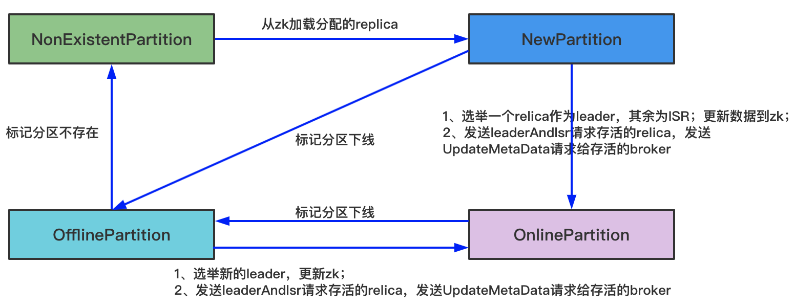

### 8.2.2、副本状态

ReplicaStateMachine，副本状态，管理分区副本信息，它也有 4 种状态：
- NewReplica: 创建 topic 和分区分配后创建 replicas，此时，replica 只能获取到成为 follower 状态变化请求。
- OnlineReplica: 当replica成为partition的assingned replicas 时，其状态变为OnlineReplica,即一个有效的OnlineReplica。
- OfflineReplica: 当一个 replica 下线，进入此状态，这一般发生在 broker 宕机的情况下；
- NonExistentReplica: Replica 成功删除后，replica 进入 NonExistentReplica 状态。
- ReplicaDeletionStarted：副本被删除时所处的状态
- ReplicaDeletionSuccessful：副本被成功删除后所处的状态
- ReplicaDeletionIneligible：开启副本删除，但副本暂时无法被删除时所处的状态

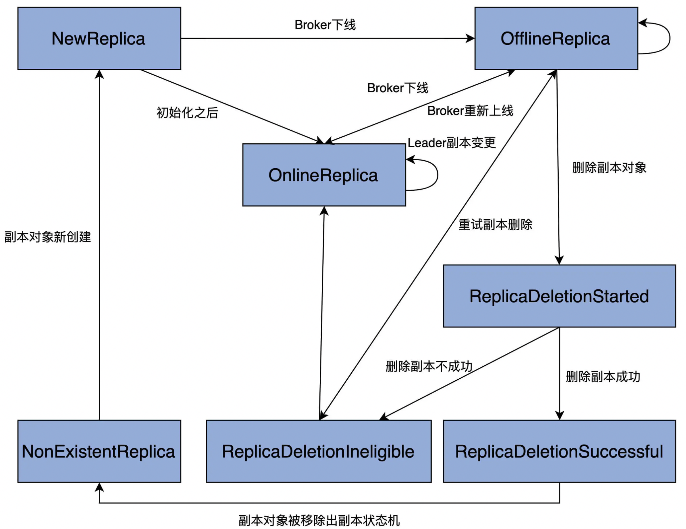

图中的单向箭头表示只允许单向状态转换，双向箭头则表示转换方向可以是双向的。比如，OnlineReplica 和 OfflineReplica 之间有一根双向箭头，这就说明，副本可以在 OnlineReplica 和 OfflineReplica 状态之间随意切换

## 8.3、Broker端处理请求流程

### 8.3.1、处理过程

前面高性能提到[Kafka的网络模型](#145网络模型)是基于[Reactor模型](../../Java基础/Java-IO.md#61Reactor)的，Kafka 的 Broker 端有个 SocketServer 组件，类似于 Reactor 模式中的 Dispatcher，它也有对应的 Acceptor 线程和一个工作线程池，Kafka 提供了 Broker 端参数 
`num.network.threads`，用于调整该网络线程池的线程数；其默认值是 3，表示每台 Broker 启动时会创建 3 个网络线程，专门处理客户端发送的请求；

> Kafka 网络通信组件主要由两大部分构成：SocketServer 和 KafkaRequestHandlerPool

Acceptor 线程采用轮询的方式将入站请求公平地发到所有网络线程中


客户端发来的请求会被Broker端的Acceptor线程分发到任一网络线程处理，处理过程：

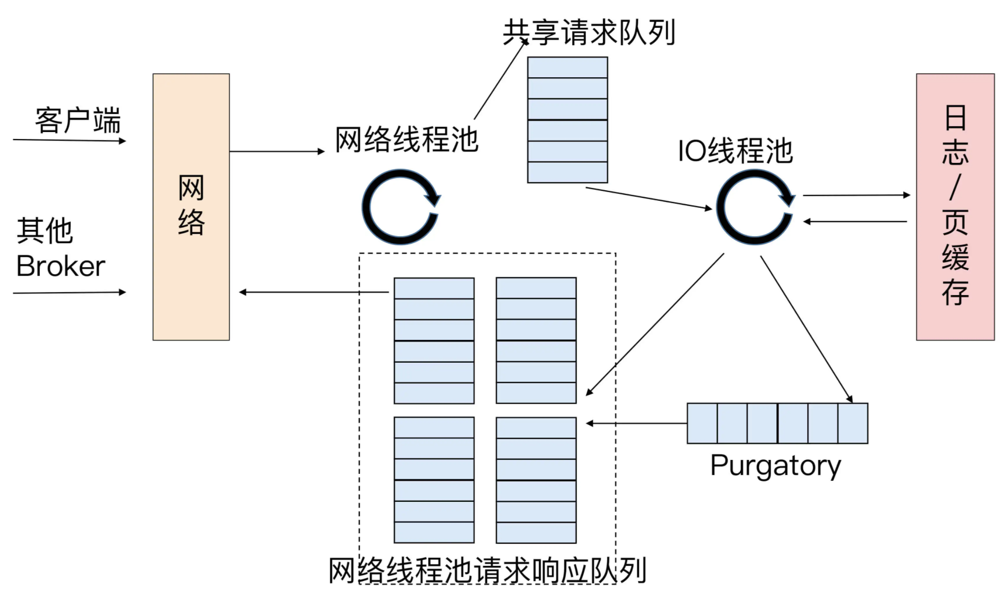

（1） 当网络线程拿到请求后，将请求放入到一个共享的请求队列中；

（2）Broker端还有一个IO线程池，负责从该共享的请求队列（共享队列大小由`queued.max.requests`配置，默认是500）中取出请求，执行真正的处理；
- 如果是 PRODUCE 生产请求，则将消息写入到底层的磁盘日志；
- 如果是 FETCH 请求，则从磁盘或页缓存中读取小心；

IO线程池是由Broker端的参数`num.io.threads`来控制的，目前该参数默认值是 8，表示每台 Broker 启动后自动创建 8 个 IO 线程处理请求。你可以根据实际硬件条件设置此线程池的个数

（3）当 IO 线程处理完请求后，会将生成的响应发送到网络线程池的响应队列中，然后由对应的网络线程负责将 Response 返还给客户端

> 求队列是所有网络线程共享的，而响应队列则是每个网络线程专属的。这么设计的原因就在于，Dispatcher 只是用于请求分发而不负责响应回传，因此只能让每个网络线程自己发送 Response 给客户端，所以这些 Response 也就没必要放在一个公共的地方;

（4）Purgatory 的组件：它是用来缓存延时请求（Delayed Request）的。所谓延时请求，就是那些一时未满足条件不能立刻处理的请求。比如设置了 acks=all 的 PRODUCE 请求，一旦设置了 acks=all，那么该请求就必须等待 ISR 中所有副本都接收了消息后才能返回，此时处理该请求的 IO 线程就必须等待其他 Broker 的写入结果。当请求不能立刻处理时，它就会暂存在 Purgatory 中。稍后一旦满足了完成条件，IO 线程会继续处理该请求，并将 Response 放入对应网络线程的响应队列中

### 8.3.2、数据类请求和控制类请求

在 Kafka 内部，除了客户端发送的 PRODUCE 请求和 FETCH 请求之外，还有很多执行其他操作的请求类型，比如负责更新 Leader 副本、Follower 副本以及 ISR 集合的 LeaderAndIsr 请求，负责勒令副本下线的 StopReplica 请求等。与 PRODUCE 和 FETCH 请求相比，这些请求有个明显的不同：它们不是数据类的请求，而是控制类的请求。也就是说，它们并不是操作消息数据的，而是用来执行特定的 Kafka 内部动作的；

> 控制类请求有这样一种能力：它可以直接令数据类请求失效！

社区采取的是两套Listener，即数据类型一个listener，控制类一个listener；对应的就是的网络通信模型，在kafka中有两套！kafka通过两套监听变相的实现了请求优先级，毕竟数据类型请求肯定很多，控制类肯定少，这样看来控制类肯定比大部分数据类型先被处理；

控制类的和数据类区别就在于，就一个Porcessor线程，并且请求队列写死的长度为20；

SocketServer.scala
```scala
// data-plane
// 处理数据类型请求的 Processors 线程池
private val dataPlaneProcessors = new ConcurrentHashMap[Int, Processor]()
// 处理数据类请求的 Acceptor 线程池，每套监听器对应一个 Acceptor 线程
private[network] val dataPlaneAcceptors = new ConcurrentHashMap[EndPoint, Acceptor]()
// 处理数据类型请求的 RequestChannel对象
val dataPlaneRequestChannel = new RequestChannel(maxQueuedRequests, DataPlaneMetricPrefix, time, apiVersionManager.newRequestMetrics)
// control-plane
// 处理控制类型请求的 Processors，就一个线程
private var controlPlaneProcessorOpt : Option[Processor] = None
// 处理控制类请求的 Acceptor 线程，就一个线程
private[network] var controlPlaneAcceptorOpt : Option[Acceptor] = None
// 处理控制类型请求的 RequestChannel对象
val controlPlaneRequestChannelOpt: Option[RequestChannel] = config.controlPlaneListenerName.map(_ => 
new RequestChannel(20, ControlPlaneMetricPrefix, time, apiVersionManager.newRequestMetrics))
```

## 8.4、日志存储

### 8.4.1、日志布局

如果一个分区只有一份副本，那么一个分区对应一个日志（Log），为了防止 Log 过大，Kafka 又引入了日志分段（LogSegment）的概念，将 Log 切分为多个 LogSegment，相当于一个巨型文件被平均分配为多个相对较小的文件；

Log 和 LogSegment 也不是纯粹物理意义上的概念，Log 在物理上只以文件夹的形式存储，而每个 LogSegment 对应于磁盘上的一个日志文件和两个索引文件，以及可能的其他文件（比如以“.txnindex”为后缀的事务索引文件）


前面[创建主题](#611创建主题)的时提到，主题创建后的日志目录结构；

向 Log 中追加消息时是顺序写入的，只有最后一个 LogSegment 才能执行写入操作，在此之前所有的 LogSegment 都不能写入数据。为了方便描述，我们将最后一个 LogSegment 称为“activeSegment”，即表示当前活跃的日志分段。随着消息的不断写入，当 activeSegment 满足一定的条件时，就需要创建新的 activeSegment，之后追加的消息将写入新的 activeSegment；

为了便于消息的检索，每个 LogSegment 中的日志文件（以`.log`为文件后缀）都有对应的两个索引文件：偏移量索引文件（以`.index`为文件后缀）和时间戳索引文件（以`.timeindex`为文件后缀）；每个 LogSegment 都有一个基准偏移量 baseOffset，用来表示当前 LogSegment 中第一条消息的 offset。偏移量是一个64位的长整型数，日志文件和两个索引文件都是根据基准偏移量（baseOffset）命名的，名称固定为20位数字，没有达到的位数则用0填充。比如第一个 LogSegment 的基准偏移量为0，对应的日志文件为`00000000000000000000.log`

> 注意每个 LogSegment 中不只包含`.log`、`.index`、`.timeindex`这3种文件，还可能包含`.deleted`、`.cleaned`、`.swap`等临时文件，以及可能的`.snapshot`、`.txnindex`、`leader-epoch-checkpoint`等文件

消费者提交的位移是保存在 Kafka 内部的主题__consumer_offsets中的，初始情况下这个主题并不存在，当第一次有消费者消费消息时会自动创建这个主题

### 8.4.2、日志格式

- Kafka 消息格式的第一个版本通常称为v0版本，在 Kafka 0.10.0之前都采用的这个消息格式；
- Kafka 从0.10.0版本开始到0.11.0版本之前所使用的消息格式版本为 v1，比 v0 版本就多了一个 timestamp 字段，表示消息的时间戳；
- Kafka 从0.11.0版本开始所使用的消息格式版本为 v2，这个版本的消息相比 v0 和 v1 的版本而言改动很大，同时还参考了 Protocol Buffer 而引入了变长整型（Varints）和 ZigZag 编码；

### 8.4.3、日志索引

前面提到每个日志分段文件都对应了两个索引文件，主要用来提高查找消息的效率：
- 偏移量索引文件用来建立消息偏移量（offset）到物理地址之间的映射关系，方便快速定位消息所在的物理文件位置；
- 时间戳索引文件则根据指定的时间戳（timestamp）来查找对应的偏移量信息；

Kafka 中的索引文件以稀疏索引（sparse index）的方式构造消息的索引，每当写入一定量（由 broker 端参数 `log.index.interval.bytes` 指定，默认值为4096，即 4KB）的消息时，偏移量索引文件和时间戳索引文件分别增加一个偏移量索引项和时间戳索引项，增大或减小 `log.index.interval.bytes` 的值，对应地可以增加或缩小索引项的密度；稀疏索引通过 MappedByteBuffer 将索引文件映射到内存中，以加快索引的查询速度；；

两个索引文件的查询：
- 偏移量索引文件中的偏移量是单调递增的，查询指定偏移量时，使用二分查找法来快速定位偏移量的位置，如果指定的偏移量不在索引文件中，则会返回小于指定偏移量的最大偏移量；
- 时间戳索引文件中的时间戳也保持严格的单调递增，查询指定时间戳时，也根据二分查找法来查找不大于该时间戳的最大偏移量，至于要找到对应的物理文件位置还需要根据偏移量索引文件来进行再次定位；

日志分段文件达到一定的条件时需要进行切分，那么其对应的索引文件也需要进行切分。日志分段文件切分包含以下几个条件，满足其一即可：
- 当前日志分段文件的大小超过了 broker 端参数 `log.segment.bytes` 配置的值。`log.segment.bytes` 参数的默认值为1073741824，即1GB；
- 当前日志分段中消息的最大时间戳与当前系统的时间戳的差值大于 `log.roll.ms` 或 `log.roll.hours` 参数配置的值。如果同时配置了 `log.roll.ms` 和 `log.roll.hours` 参数，那么 `log.roll.ms` 的优先级高。默认情况下，只配置了 `log.roll.hours` 参数，其值为168，即7天；
- 偏移量索引文件或时间戳索引文件的大小达到 broker 端参数 `log.index.size.max.bytes`配置的值。`log.index.size.max.bytes` 的默认值为10485760，即10MB；
- 追加的消息的偏移量与当前日志分段的偏移量之间的差值大于 `Integer.MAX_VALUE`，即要追加的消息的偏移量不能转变为相对偏移量`（offset - baseOffset > Integer.MAX_VALUE）`

对非当前活跃的日志分段而言，其对应的索引文件内容已经固定而不需要再写入索引项，所以会被设定为只读。而对当前活跃的日志分段（activeSegment）而言，索引文件还会追加更多的索引项，所以被设定为可读写；

在索引文件切分的时候，Kafka 会关闭当前正在写入的索引文件并置为只读模式，同时以可读写的模式创建新的索引文件，索引文件的大小由 broker 端参数 `log.index.size.max.bytes` 配置。Kafka 在创建索引文件的时候会为其预分配 `log.index.size.max.bytes` 大小的空间，注意这一点与日志分段文件不同，只有当索引文件进行切分的时候，Kafka 才会把该索引文件裁剪到实际的数据大小。也就是说，与当前活跃的日志分段对应的索引文件的大小固定为 `log.index.size.max.bytes`，而其余日志分段对应的索引文件的大小为实际的占用空间

为了避免在某一时刻大面积日志段同时间切分，导致瞬时打满磁盘 I/O 带宽，可以通过设置 Broker 端参数 `log.roll.jitter.ms` 值大于 0，即通过给日志段切分执行时间加一个扰动值的方式，来避免大量日志段在同一时刻执行切分动作，从而显著降低磁盘 I/O

**偏移量索引：**

偏移量索引项的格式包含两个字段，每个索引项占用8个字节，分为两个部分：
- relativeOffset：相对偏移量，表示消息相对于 baseOffset 的偏移量，占用4个字节，当前索引文件的文件名即为 baseOffset 的值。
- position：物理地址，也就是消息在日志分段文件中对应的物理位置，占用4个字节

消息的偏移量（offset）占用8个字节，也可以称为绝对偏移量。索引项中没有直接使用绝对偏移量而改为只占用4个字节的相对偏移量（`relativeOffset = offset - baseOffset`），这样可以减小索引文件占用的空间。举个例子，一个日志分段的 baseOffset 为32，那么其文件名就是`00000000000000000032.log`，offset 为35的消息在索引文件中的 relativeOffset 的值为35-32=3；

前面日志分段文件切分的第4个条件：追加的消息的偏移量与当前日志分段的偏移量之间的差值大于 Integer.MAX_VALUE。如果彼此的差值超过了 Integer.MAX_VALUE，那么 relativeOffset 就不能用4个字节表示了，进而不能享受这个索引项的设计所带来的便利了

以topic-quickstart-0 目录下的 00000000000000000000.index 为例来进行具体分析，截取 00000000000000000000.index 部分内容如下：
```
[root@bigdata kafka_2.7.0]# bin/kafka-dump-log.sh --files /data/log/kafka_log/topic-quickstart-0/00000000000000000000.index 
Dumping /data/log/kafka_log/topic-quickstart-0/00000000000000000000.index
offset: 199 position: 4531
```
> Kafka 强制要求索引文件大小必须是索引项大小的整数倍，对偏移量索引文件而言，必须为8的整数倍。如果 broker 端参数 `log.index.size.max.bytes` 配置为67，那么 Kafka 在内部会将其转换为64，即不大于67，并且满足为8的整数倍的条件

**时间戳索引：**

时间戳索引项的格式包含两个字段，每个索引项占用12个字节，分为两个部分。
- timestamp：当前日志分段最大的时间戳。占8个字节
- relativeOffset：时间戳所对应的消息的相对偏移量，占4个字节；

时间戳索引文件中包含若干时间戳索引项，每个追加的时间戳索引项中的 timestamp 必须大于之前追加的索引项的 timestamp，否则不予追加；如果 broker 端参数 `log.message.timestamp.type` 设置为 LogAppendTime，那么消息的时间戳必定能够保持单调递增；相反，如果是 CreateTime 类型则无法保证。生产者可以使用类似 ProducerRecord(String topic, Integer partition, Long timestamp, K key, V value) 的方法来指定时间戳的值。即使生产者客户端采用自动插入的时间戳也无法保证时间戳能够单调递增，如果两个不同时钟的生产者同时往一个分区中插入消息，那么也会造成当前分区的时间戳乱序:

与偏移量索引文件相似，时间戳索引文件大小必须是索引项大小（12B）的整数倍，如果不满足条件也会进行裁剪。同样假设 broker 端参数 `log.index.size.max.bytes` 配置为67，那么对应于时间戳索引文件，Kafka 在内部会将其转换为60；

每当写入一定量的消息时，就会在偏移量索引文件和时间戳索引文件中分别增加一个偏移量索引项和时间戳索引项。两个文件增加索引项的操作是同时进行的，但并不意味着偏移量索引中的 relativeOffset 和时间戳索引项中的 relativeOffset 是同一个值；

## 8.5、日志清理

Kafka 中每一个分区副本都对应一个 Log，而 Log 又可以分为多个日志分段，这样也便于日志的清理操作。Kafka 提供了两种日志清理策略：
- 日志删除（Log Retention）：按照一定的保留策略直接删除不符合条件的日志分段。
- 日志压缩（Log Compaction）：针对每个消息的 key 进行整合，对于有相同 key 的不同 value 值，只保留最后一个版本

通过 broker 端参数 `log.cleanup.policy` 来设置日志清理策略，此参数的默认值为`delete`，即采用日志删除的清理策略。如果要采用日志压缩的清理策略，就需要将 `log.cleanup.policy` 设置为`compact`，并且还需要将 `log.cleaner.enable `（默认值为 true）设定为 true。通过将 `log.cleanup.policy` 参数设置为`delete,compact`，还可以同时支持日志删除和日志压缩两种策略；

日志清理的粒度可以控制到主题级别，比如与 `log.cleanup.policy` 对应的主题级别的参数为 `cleanup.policy`

> 日志删除是指清除整个日志分段，而日志压缩是针对相同 key 的消息的合并清理

### 8.5.1、Log Retention

在 Kafka 的日志管理器中会有一个专门的日志删除任务来周期性地检测和删除不符合保留条件的日志分段文件，这个周期可以通过 broker 端参数 `log.retention.check.interval.ms` 来配置，默认值为300000，即5分钟。当前日志分段的保留策略有3种：
- 基于时间的保留策略；
- 基于日志大小的保留策略
- 基于日志起始偏移量的保留策略

**1、基于时间**

日志删除任务会检查当前日志文件中是否有保留时间超过设定的阈值（retentionMs）来寻找可删除的日志分段文件集合（deletableSegments）

retentionMs 可以通过 broker 端参数 `log.retention.hours、log.retention.minutes 和 log.retention.ms` 来配置，其中 log.retention.ms 的优先级最高，log.retention.minutes 次之，log.retention.hours 最低。默认情况下只配置了 `log.retention.hours` 参数，其值为168，故默认情况下日志分段文件的保留时间为7天；

查找过期的日志分段文件，是根据日志分段中最大的时间戳 largestTimeStamp 来计算的；

删除日志分段时，首先会从 Log 对象中所维护日志分段的跳跃表中移除待删除的日志分段，以保证没有线程对这些日志分段进行读取操作。然后将日志分段所对应的所有文件添加上`.deleted`的后缀（当然也包括对应的索引文件）。最后交由一个以`delete-file`命名的延迟任务来删除这些以“.deleted”为后缀的文件，这个任务的延迟执行时间可以通过 `file.delete.delay.ms` 参数来调配，此参数的默认值为60000，即1分钟；

**2、基于日志大小**

日志删除任务会检查当前日志的大小是否超过设定的阈值（retentionSize）来寻找可删除的日志分段的文件集合（deletableSegments）；

retentionSize 可以通过 broker 端参数 log.retention.bytes 来配置，默认值为-1，表示无穷大。注意 `log.retention.bytes` 配置的是 Log 中所有日志文件的总大小，而不是单个日志分段（确切地说应该为 .log 日志文件）的大小。单个日志分段的大小由 broker 端参数 `log.segment.bytes` 来限制，默认值为1073741824，即 1GB；

基于日志大小的保留策略与基于时间的保留策略类似，首先计算日志文件的总大小 size 和 retentionSize 的差值 diff，即计算需要删除的日志总大小，然后从日志文件中的第一个日志分段开始进行查找可删除的日志分段的文件集合 deletableSegments。查找出 deletableSegments 之后就执行删除操作，这个删除操作和基于时间的保留策略的删除操作相同；

**3、基于日志起始偏移量**

一般情况下，日志文件的起始偏移量 logStartOffset 等于第一个日志分段的 baseOffset，但这并不是绝对的，logStartOffset 的值可以通过 DeleteRecordsRequest 请求（比如使用 KafkaAdminClient 的 deleteRecords() 方法、使用 kafka-delete-records.sh 脚本）、日志的清理和截断等操作进行修改；

基于日志起始偏移量的保留策略的判断依据：是某日志分段的下一个日志分段的起始偏移量 baseOffset 是否小于等于 logStartOffset，若是，则可以删除此日志分段

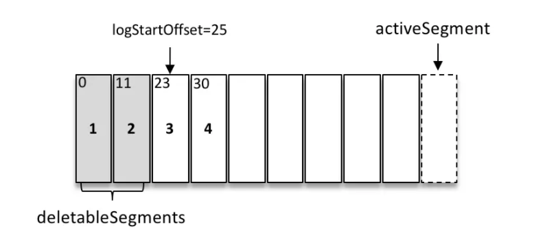

如上图所示，假设 logStartOffset 等于25，日志分段1的起始偏移量为0，日志分段2的起始偏移量为11，日志分段3的起始偏移量为23，通过如下动作收集可删除的日志分段的文件集合 deletableSegments：
- 从头开始遍历每个日志分段，日志分段1的下一个日志分段的起始偏移量为11，小于 logStartOffset 的大小，将日志分段1加入 deletableSegments；
- 日志分段2的下一个日志偏移量的起始偏移量为23，也小于 logStartOffset 的大小，将日志分段2加入 deletableSegments；
- 日志分段3的下一个日志偏移量在 logStartOffset 的右侧，故从日志分段3开始的所有日志分段都不会加入 deletableSegmens；

收集完可删除的日志分段的文件集合之后的删除操作同基于日志大小的保留策略和基于时间的保留策略相同

### 8.5.2、Log Compaction

Kafka 中的 Log Compaction 是指在默认的日志删除（Log Retention）规则之外提供的一种清理过时数据的方式；Log Compaction 对于有相同 key 的不同 value 值，只保留最后一个版本。如果应用只关心 key 对应的最新 value 值，则可以开启 Kafka 的日志清理功能，Kafka 会定期将相同 key 的消息进行合并，只保留最新的 value 值；

Log Compaction 执行前后，日志分段中的每条消息的偏移量和写入时的偏移量保持一致。Log Compaction 会生成新的日志分段文件，日志分段中每条消息的物理位置会重新按照新文件来组织。Log Compaction 执行过后的偏移量不再是连续的，不过这并不影响日志的查询；

Kafka 中的 Log Compaction 可以类比于 Redis 中的 RDB 的持久化模式；每一个日志目录下都有一个名为“cleaner-offset-checkpoint”的文件，这个文件就是清理检查点文件，用来记录每个主题的每个分区中已清理的偏移量；

通过配置 `log.dir` 或 `log.dirs` 参数来设置 Kafka 日志的存放目录，而每一个日志目录下都有一个名为`cleaner-offset-checkpoint`的文件，这个文件就是清理检查点文件，用来记录每个主题的每个分区中已清理的偏移量；

通过清理检查点文件可以将 Log 分成两个部分，如下图所示。通过检查点 cleaner checkpoint 来划分出一个已经清理过的 clean 部分和一个还未清理过的 dirty 部分。在日志清理的同时，客户端也可以读取日志中的消息。dirty 部分的消息偏移量是逐一递增的，而 clean 部分的消息偏移量是断续的，如果客户端总能赶上 dirty 部分，那么它就能读取日志的所有消息，反之就不可能读到全部的消息

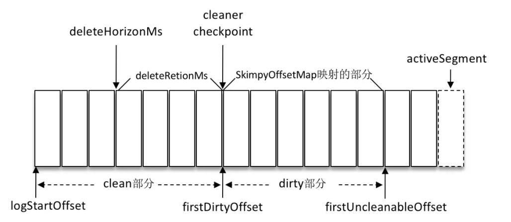

上图中的 firstDirtyOffset（与 cleaner checkpoint 相等）表示 dirty 部分的起始偏移量，而 firstUncleanableOffset 为 dirty 部分的截止偏移量，整个 dirty 部分的偏移量范围为[firstDirtyOffset, firstUncleanableOffset），注意这里是左闭右开区间；为了避免当前活跃的日志分段 activeSegment 成为热点文件，activeSegment 不会参与 Log Compaction 的执行。同时 Kafka 支持通过参数 `log.cleaner.min.compaction.lag.ms` （默认值为0）来配置消息在被清理前的最小保留时间，默认情况下 firstUncleanableOffset 等于 activeSegment 的 baseOffset

Kafka 中用于保存消费者消费位移的主题 `__consumer_offsets` 使用的就是 Log Compaction 策略

Kafka 中的每个日志清理线程会使用一个名为`SkimpyOffsetMap`的对象来构建 key 与 offset 的映射关系的哈希表。日志清理需要遍历两次日志文件，第一次遍历把每个 key 的哈希值和最后出现的 offset 都保存在 SkimpyOffsetMap 中。第二次遍历会检查每个消息是否符合保留条件，如果符合就保留下来，否则就会被清理。假设一条消息的 offset 为 O1，这条消息的 key 在 SkimpyOffsetMap 中对应的 offset 为 O2，如果 O1 大于等于 O2 即满足保留条件；

默认情况下，SkimpyOffsetMap 使用 MD5 来计算 key 的哈希值，占用空间大小为16B，根据这个哈希值来从 SkimpyOffsetMap 中找到对应的槽位，如果发生冲突则用线性探测法处理。为了防止哈希冲突过于频繁，也可以通过 broker 端参数 log.cleaner.io.buffer.load.factor （默认值为0.9）来调整负载因子；

偏移量占用空间大小为8B，故一个映射项占用大小为24B。每个日志清理线程的 SkimpyOffsetMap 的内存占用大小为 `log.cleaner.dedupe.buffer.size / log.cleaner.thread`，默认值为 = 128MB/1 = 128MB。所以默认情况下 SkimpyOffsetMap 可以保存128MB × 0.9 /24B ≈ 5033164个key的记录。假设每条消息的大小为1KB，那么这个 SkimpyOffsetMap 可以用来映射 4.8GB 的日志文件，如果有重复的 key，那么这个数值还会增大，整体上来说，SkimpyOffsetMap 极大地节省了内存空间且非常高效；

Log Compaction 会保留 key 相应的最新 value 值，那么当需要删除一个 key 时怎么办？Kafka 提供了一个墓碑消息（tombstone）的概念，如果一条消息的 key 不为 null，但是其 value 为 null，那么此消息就是墓碑消息。日志清理线程发现墓碑消息时会先进行常规的清理，并保留墓碑消息一段时间；

Log Compaction 执行过后的日志分段的大小会比原先的日志分段的要小，为了防止出现太多的小文件，Kafka 在实际清理过程中并不对单个的日志分段进行单独清理，而是将日志文件中 offset 从0至 firstUncleanableOffset 的所有日志分段进行分组，每个日志分段只属于一组，分组策略为：按照日志分段的顺序遍历，每组中日志分段的占用空间大小之和不超过 segmentSize（可以通过 broker 端参数 log.segment.bytes 设置，默认值为 1GB），且对应的索引文件占用大小之和不超过 maxIndexSize（可以通过 broker 端参数 log.index.interval.bytes 设置，默认值为 10MB）。同一个组的多个日志分段清理过后，只会生成一个新的日志分段；

Log Compaction 过程中会将每个日志分组中需要保留的消息复制到一个以`.clean`为后缀的临时文件中，此临时文件以当前日志分组中第一个日志分段的文件名命名，例如 `00000000000000000000.log.clean`。Log Compaction 过后将`.clean`的文件修改为`.swap`后缀的文件，例如：`00000000000000000000.log.swap`。然后删除原本的日志文件，最后才把文件的`.swap`后缀去掉。整个过程中的索引文件的变换也是如此，至此一个完整 Log Compaction 操作才算完成；

## 8.6、幂等性

- [Kafka幂等性](http://matt33.com/2018/10/24/kafka-idempotent/)

可靠消息：
- 最多一次（at most once）：消息可能会丢失，但绝不会被重复发送；
- 至少一次（at least once）：消息不会丢失，但有可能被重复发送；
- 精确一次（exactly once）：消息不会丢失，也不会被重复发送；

Producer 的幂等性指的是当发送同一条消息时，数据在 Server 端只会被持久化一次，数据不丟不重，但是这里的幂等性是有条件的：
- 只能保证 Producer 在单个会话内不丟不重，如果 Producer 出现意外挂掉再重启是无法保证的（幂等性情况下，是无法获取之前的状态信息，因此是无法做到跨会话级别的不丢不重）;
- 幂等性不能跨多个 Topic-Partition，只能保证单个 partition 内的幂等性，当涉及多个 Topic-Partition 时，这中间的状态并没有同步；

如果需要跨会话、跨多个 topic-partition 的情况，需要使用 Kafka 的事务性来实现；

producer如何使用使用幂等性：与正常情况下 Producer 使用相比变化不大，只需要把 Producer 的配置 `enable.idempotence` 设置为 true 即可，如下所示：
```java
Properties props = new Properties();
props.put(ProducerConfig.ENABLE_IDEMPOTENCE_CONFIG, "true");
props.put("acks", "all"); // 当 enable.idempotence 为 true，这里默认为 all
...
KafkaProducer producer = new KafkaProducer(props);
```
还需要确保生产者客户端的 retries、acks、max.in.flight.requests.per.connection 这几个参数不被配置错；
- 如果用户显式地指定了 retries 参数，那么这个参数的值必须大于0，否则会报出 ConfigException；
- 如果用户没有显式地指定 retries 参数，那么 KafkaProducer 会将它置为 `Integer.MAX_VALUE`。同时还需要保证 `max.in.flight.requests.per.connection` 参数的值不能大于5；要求 `max.in.flight.requests.per.connection` 小于等于 5 的主要原因是：Server 端的 ProducerStateManager 实例会缓存每个 PID 在每个 Topic-Partition 上发送的最近 5 个batch 数据；如果超过 5，ProducerStateManager 就会将最旧的 batch 数据清除
- 如果用户还显式地指定了 acks 参数，那么还需要保证这个参数的值为 -1（all），如果不为 -1（这个参数的值默认为1）那么也会报出 ConfigException

幂等性主要是解决数据重复的问题，数据重复问题，通用的解决方案就是加唯一id，然后根据 id 判断数据是否重复，Producer 的幂等性也是这样实现的

### 8.6.1、Producer幂等性实现原理

幂等性要解决的问题是：Producer 设置 at least once 时，由于异常触发重试机制导致数据重复，幂等性的目的就是为了解决这个数据重复的问题，简单来说就是：`at least once + 幂等 = exactly once`；

Kafka Producer 在实现时有以下两个重要机制：
- `PID（Producer ID）`，用来标识每个 producer client；每个 Producer 在初始化时都会被分配一个唯一的 PID，这个 PID 对应用是透明的，完全没有暴露给用户。对于一个给定的 PID，sequence number 将会从0开始自增，每个 Topic-Partition 都会有一个独立的 sequence number。Producer 在发送数据时，将会给每条 msg 标识一个 sequence number，Server 也就是通过这个来验证数据是否重复。这里的 PID 是全局唯一的，Producer 故障后重新启动后会被分配一个新的 PID，这也是幂等性无法做到跨会话的一个原因；Server 在给一个 client 初始化 PID 时，实际上是通过 ProducerIdManager 的 generateProducerId() 方法产生一个 PID；

- `sequence numbers`，client 发送的每条消息都会带相应的 sequence number，Server 端就是根据这个值来判断数据是否重复；在 PID + Topic-Partition 级别上添加一个 sequence numbers 信息，就可以实现 Producer 的幂等性了；

broker 端会在内存中为每一对 `<PID，分区>` 维护一个序列号。对于收到的每一条消息，只有当它的序列号的值（SN_new）比 broker 端中维护的对应的序列号的值（SN_old）大1（即 `SN_new = SN_old + 1`）时，broker 才会接收它。如果 `SN_new< SN_old + 1`，那么说明消息被重复写入，broker 可以直接将其丢弃。如果 `SN_new> SN_old + 1`，那么说明中间有数据尚未写入，出现了乱序，暗示可能有消息丢失，对应的生产者会抛出 OutOfOrderSequenceException，这个异常是一个严重的异常，后续的诸如 send()、beginTransaction()、commitTransaction() 等方法的调用都会抛出 IllegalStateException 的异常

```java
ProducerRecord<String, String> record = new ProducerRecord<>(topic, "key", "msg");
producer.send(record);
producer.send(record);
```
注意，上面示例中发送了两条相同的消息，不过这仅仅是指消息内容相同，但对 Kafka 而言是两条不同的消息，因为会为这两条消息分配不同的序列号。Kafka 并不会保证消息内容的幂等

## 8.7、Kafka事务

- [Kafka Exactly-Once 之事务性实现](http://matt33.com/2018/11/04/kafka-transaction/)

### 8.7.1、介绍

事务型 Producer 能够保证将消息原子性地写入到多个分区中。这批消息要么全部写入成功，要么全部失败。另外，事务型 Producer 也不惧进程的重启。Producer 重启回来后，Kafka 依然保证它们发送消息的精确一次处理；设置事务型 Producer 的方法也很简单，满足两个要求即可：
- 和幂等性 Producer 一样，开启 `enable.idempotence = true`；
- 设置 Producer 端参数 `transactional.id`。最好为其设置一个有意义的名字；如果使用同一个 transactionalId 开启两个生产者，那么前一个开启的生产者会报出如下的错误：`Producer attempted an operation with an old epoch. Either there is a newer producer with the same transactionalId, or the producer's transaction has been expired by the broker.`

事务要求生产者开启幂等特性，因此通过将 `transactional.id` 参数设置为非空从而开启事务特性的同时需要将 enable.idempotence 设置为 true（如果未显式设置，则 KafkaProducer 默认会将它的值设置为 true），如果用户显式地将 enable.idempotence 设置为 false，则会报出 ConfigException

Kafka事务从Producer角度来看：
- 跨会话的幂等性写入：即使中间故障，恢复后依然可以保持幂等性；表示具有相同 transactionalId 的新生产者实例被创建且工作的时候，旧的且拥有相同 transactionalId 的生产者实例将不再工作；
- 跨会话的事务恢复：当某个生产者实例宕机后，新的生产者实例可以保证任何未完成的旧事务要么被提交（Commit），要么被中止（Abort），如此可以使新的生产者实例从一个正常的状态开始工作
- 跨多个 Topic-Partition 的幂等性写入，Kafka 可以保证跨多个 Topic-Partition 的数据要么全部写入成功，要么全部失败，不会出现中间状态；

Consumer端很难保证一个已经 commit 的事务的所有 msg 都会被消费，有以下几个原因：
- 对于 compacted topic，在一个事务中写入的数据可能会被新的值覆盖（相同key的消息，后写入的消息会覆盖前面写入的消息）
- 一个事务内的数据，可能会跨多个 log segment，如果旧的 segmeng 数据由于过期而被清除，那么这个事务的一部分数据就无法被消费到了；
- Consumer 在消费时可以通过 seek 机制，随机从一个位置开始消费，这也会导致一个事务内的部分数据无法消费；
- Consumer 可能没有订阅这个事务涉及的全部 Partition

Producer 代码中做一些调整，如这段代码所示：
```java
// --------Producer端代码
Properties props = new Properties();
...
// 配置幂等性
properties.put(ProducerConfig.ENABLE_IDEMPOTENCE_CONFIG, true);
// 配置事务id
properties.put(ProducerConfig.TRANSACTIONAL_ID_CONFIG, "TransactionProducer");
KafkaProducer producer = new KafkaProducer(props);
// initTransactions() 方法用来初始化事务，这个方法能够执行的前提是配置了 transactionalId，如果没有则会报出 IllegalStateException：
producer.initTransactions();
try {
    String msg = "matt test";
    // 用来开启事务
    producer.beginTransaction();
    // sendOffsetsToTransaction() 方法为消费者提供在事务内的位移提交的操作
    producer.send(new ProducerRecord(topic, "0", msg.toString()));
    producer.send(new ProducerRecord(topic, "1", msg.toString()));
    producer.send(new ProducerRecord(topic, "2", msg.toString()));
    producer.commitTransaction();
} catch (KafkaException e2) {
    producer.abortTransaction();
}
producer.close();
```
这段代码能够保证 Record1 和 Record2 被当作一个事务统一提交到 Kafka，要么它们全部提交成功，要么全部写入失败。实际上即使写入失败，Kafka 也会把它们写入到底层的日志中，也就是说 Consumer 还是会看到这些消息。因此在 Consumer 端，读取事务型 Producer 发送的消息也是需要一些变更的，需要设置 `isolation.level` 参数的值即可。当前这个参数有两个取值：
- `read_uncommitted`：这是默认值，表明 Consumer 能够读取到 Kafka 写入的任何消息，不论事务型 Producer 提交事务还是终止事务，其写入的消息都可以读取。很显然，如果你用了事务型 Producer，那么对应的 Consumer 就不要使用这个值;
- `read_committed`：表明 Consumer 只会读取事务型 Producer 成功提交事务写入的消息。当然了，它也能看到非事务型 Producer 写入的所有消息

> 如果事务型消息abortTransaction，那么实际上消息还是有可能写入到Kafka中的；

日志文件中除了普通的消息，还有一种消息专门用来标志一个事务的结束，它就是控制消息（ControlBatch）。控制消息一共有两种类型：COMMIT 和 ABORT，分别用来表征事务已经成功提交或已经被成功中止

### 8.7.2、实现原理

为了实现事务的功能，Kafka 还引入了事务协调器（TransactionCoordinator）来负责处理事务，这一点可以类比一下组协调器（GroupCoordinator）。每一个生产者都会被指派一个特定的 TransactionCoordinator，所有的事务逻辑包括分派 PID 等都是由 TransactionCoordinator 来负责实施的。TransactionCoordinator 会将事务状态持久化到内部主题 `__transaction_state` 中

**1、查找TransactionCoordinator**

通过transaction_id找到TransactionCoordinator，具体算法是`Utils.abs(transaction_id.hashCode %transactionTopicPartitionCount)`，获取到partition，再找到该partition的leader，即为TransactionCoordinator；

其中 transactionTopicPartitionCount 为主题 `__transaction_state` 中的分区个数，这个可以通过 broker 端参数 transaction.state.log.num.partitions 来配置，默认值为50

**2、获取PID**

在找到 TransactionCoordinator 节点之后，就需要为当前生产者分配一个 PID 了。凡是开启了幂等性功能的生产者都必须执行这个操作，不需要考虑该生产者是否还开启了事务。生产者获取 PID 的操作是通过 InitProducerIdRequest 请求来实现的

> 注意，如果未开启事务特性而只开启幂等特性，那么 InitProducerIdRequest 请求可以发送给任意的 broker

当 TransactionCoordinator 第一次收到包含该 transactionalId 的 InitProducerIdRequest 请求时，它会把 transactionalId 和对应的 PID 以消息的形式保存到主题 `__transaction_state` 中，这样可以保证 `<transaction_Id, PID>` 的对应关系被持久化，从而保证即使 TransactionCoordinator 宕机该对应关系也不会丢失；

事务状态：包含 Empty(0)、Ongoing(1)、PrepareCommit(2)、PrepareAbort(3)、CompleteCommit(4)、CompleteAbort(5)、Dead(6) 这几种状态；

InitProducerIdResponse 除了返回 PID之外，InitProducerIdRequest 还会触发执行以下任务：
- 增加该 PID 对应的 producer_epoch。具有相同 PID 但 producer_epoch 小于该 producer_epoch 的其他生产者新开启的事务将被拒绝；
- 恢复（Commit）或中止（Abort）之前的生产者未完成的事务；

**3、开启事务**

通过 KafkaProducer 的 beginTransaction() 方法可以开启一个事务，调用该方法后，生产者本地会标记已经开启了一个新的事务，只有在生产者发送第一条消息之后 TransactionCoordinator 才会认为该事务已经开启

**4、 Consume-Transform-Produce**

这个阶段囊括了整个事务的数据处理过程，其中还涉及多种请求
- *（1）AddPartitionsToTxnRequest*：当生产者给一个新的分区（TopicPartition）发送数据前，它需要先向 TransactionCoordinator 发送 AddPartitionsToTxnRequest 请求，这个请求会让 TransactionCoordinator 将 `<transactionId, TopicPartition>` 的对应关系存储在主题 `__transaction_state` 中，有了这个对照关系之后，我们就可以在后续的步骤中为每个分区设置 COMMIT 或 ABORT 标记；如果该分区是对应事务中的第一个分区，那么此时TransactionCoordinator还会启动对该事务的计时

- *（2）ProduceRequest*：生产者通过 ProduceRequest 请求发送消息（ProducerBatch）到用户自定义主题中，这一点和发送普通消息时相同；和普通的消息不同的是，ProducerBatch 中会包含实质的 PID、producer_epoch 和 sequence number；

- *（3）AddOffsetsToTxnRequest*：通过 KafkaProducer 的 sendOffsetsToTransaction() 方法可以在一个事务批次里处理消息的消费和发送，方法中包含2个参数：`Map<TopicPartition, OffsetAndMetadata>` offsets 和 groupId。这个方法会向 TransactionCoordinator 节点发送 AddOffsetsToTxnRequest 请求，TransactionCoordinator 收到这个请求之后会通过 groupId 来推导出在 `__consumer_offsets` 中的分区，之后 TransactionCoordinator 会将这个分区保存在 `__transaction_state` 中；

- *（4）TxnOffsetCommitRequest*：这个请求也是 sendOffsetsToTransaction() 方法中的一部分，在处理完 AddOffsetsToTxnRequest 之后，生产者还会发送 TxnOffsetCommitRequest 请求给 GroupCoordinator，从而将本次事务中包含的消费位移信息 offsets 存储到主题 `__consumer_offsets` 中

**5、提交或者中止事务**

一旦数据被写入成功，我们就可以调用 KafkaProducer 的 commitTransaction() 方法或 abortTransaction() 方法来结束当前的事务
- *（1）EndTxnRequest*：无论调用 commitTransaction() 方法还是 abortTransaction() 方法，生产者都会向 TransactionCoordinator 发送 EndTxnRequest 请求，以此来通知它提交（Commit）事务还是中止（Abort）事务，TransactionCoordinator 在收到 EndTxnRequest 请求后会执行如下操作：
    - 将 PREPARE_COMMIT 或 PREPARE_ABORT 消息写入主题 `__transaction_state`，如事务流程图步骤5.1所示。
    - 通过 WriteTxnMarkersRequest 请求将 COMMIT 或 ABORT 信息写入用户所使用的普通主题和 __consumer_offsets，如事务流程图步骤5.2所示。
    - 将 COMPLETE_COMMIT 或 COMPLETE_ABORT 信息写入内部主题 `__transaction_state`，如事务流程图步骤5.3所示

- *（2）WriteTxnMarkersRequest*：WriteTxnMarkersRequest 请求是由 TransactionCoordinator 发向事务中各个分区的 leader 节点的，当节点收到这个请求之后，会在相应的分区中写入控制消息（ControlBatch）。控制消息用来标识事务的终结，它和普通的消息一样存储在日志文件中，前面章节中提及了控制消息，RecordBatch 中 attributes 字段的第6位用来标识当前消息是否是控制消息。如果是控制消息，那么这一位会置为1，否则会置为0

- *（3）写入最终的COMPLETE_COMMIT或COMPLETE_ABORT*：TransactionCoordinator 将最终的 COMPLETE_COMMIT 或 COMPLETE_ABORT 信息写入主题 `__transaction_state` 以表明当前事务已经结束，此时可以删除主题 `__transaction_state` 中所有关于该事务的消息。由于主题 `__transaction_state` 采用的日志清理策略为日志压缩，所以这里的删除只需将相应的消息设置为墓碑消息即可

## 8.8、副本

从生产者发出的一条消息首先会被写入分区的 leader 副本，不过还需要等待 ISR 集合中的所有 follower 副本都同步完之后才能被认为已经提交，之后才会更新分区的 HW，进而消费者可以消费到这条消息

### 8.8.1、失效副本

在 ISR 集合之外，也就是处于同步失效或功能失效（比如副本处于非存活状态）的副本统称为失效副本，失效副本对应的分区也就称为同步失效分区，即 under-replicated 分区；（处于同步失效状态的副本也可以看作失效副本）

正常情况下，我们通过 kafka-topics.sh 脚本的 under-replicated-partitions 参数来显示主题中包含失效副本的分区时结果会返回空。比如我们来查看一下主题 topic-partitions 的相关信息：
```
[root@node1 kafka_2.11-2.0.0]# bin/kafka-topics.sh --zookeeper localhost:2181 --describe --topic topic-partitions --under-replicated-partitions
```
当 ISR 集合中的一个 follower 副本滞后 leader 副本的时间超过参数`replica.lag.time.max.ms`指定的值时则判定为同步失败，需要将此 follower 副本剔除出 ISR 集合；

**实现：**当 follower 副本将 leader 副本 LEO（LogEndOffset）之前的日志全部同步时，则认为该 follower 副本已经追赶上 leader 副本，此时更新该副本的 lastCaughtUpTimeMs 标识。Kafka 的副本管理器会启动一个副本过期检测的定时任务，而这个定时任务会定时检查当前时间与副本的 lastCaughtUpTimeMs 差值是否大于参数 replica.lag.time.max.ms 指定的值；

一般有两种情况会导致副本失效：
- follower 副本进程卡住，在一段时间内根本没有向 leader 副本发起同步请求，比如频繁的 Full GC；
- follower 副本进程同步过慢，在一段时间内都无法追赶上 leader 副本，比如 I/O 开销过大；

> 如果通过工具增加了副本因子，那么新增加的副本在赶上 leader 副本之前也都是处于失效状态的。如果一个 follower 副本由于某些原因（比如宕机）而下线，之后又上线，在追赶上 leader 副本之前也处于失效状态；

### 8.8.2、ISR的伸缩

Kafka 在启动的时候会开启两个与ISR相关的定时任务，名称分别为`isr-expiration`和`isr-change-propagation`

**isr-expiration**任务 会周期性地检测每个分区是否需要缩减其 ISR 集合；这个周期和 `replica.lag.time.max.ms` 参数有关，大小是这个参数值的一半，默认值为 5000ms；当检测到 ISR 集合中有失效副本时，就会收缩 ISR 集合
```scala
scheduler.schedule("isr-expiration", maybeShrinkIsr _, period = config.replicaLagTimeMaxMs / 2, unit = TimeUnit.MILLISECONDS)
```
如果某个分区的 ISR 集合发生变更，则会将变更后的数据记录到 ZooKeeper 对应的 `/brokers/topics/<topic>/partition/<parititon>/state` 节点中，节点的数据：
```
[zk: localhost:2181(CONNECTED) 4] get /brokers/topics/topic-quickstart/partitions/0/state
{"controller_epoch":9,"leader":0,"version":1,"leader_epoch":0,"isr":[0]}
```
其中 controller_epoch 表示当前 Kafka 控制器的 epoch，leader 表示当前分区的 leader 副本所在的 broker 的 id 编号，version 表示版本号（当前版本固定为1），leader_epoch 表示当前分区的 leader 纪元，isr 表示变更后的 ISR 列表；当 ISR 集合发生变更时还会将变更后的记录缓存到 isrChangeSet 中

**isr-change-propagation**任务 会周期性（固定值为 2500ms）地检查 isrChangeSet，如果发现 isrChangeSet 中有 ISR 集合的变更记录，那么它会在 ZooKeeper 的 `/isr_change_notification` 路径下创建一个以 isr_change_ 开头的持久顺序节点（比如 `/isr_change_notification/isr_change_0000000000`），并将 isrChangeSet 中的信息保存到这个节点中；
```scala
override def start(): Unit = {
    scheduler.schedule("isr-change-propagation", maybePropagateIsrChanges _,
      period = isrChangeNotificationConfig.checkIntervalMs, unit = TimeUnit.MILLISECONDS)
  }
```
Kafka 控制器为 `/isr_change_notification` 添加了一个 Watcher，当这个节点中有子节点发生变化时会触发 Watcher 的动作，以此通知控制器更新相关元数据信息并向它管理的 broker 节点发送更新元数据的请求，最后删除 `/isr_change_notification` 路径下已经处理过的节点

当检测到分区的 ISR 集合发生变化时，还需要检查以下两个条件，满足以下两个条件之一才可以将 ISR 集合的变化写入目标节点
- 上一次 ISR 集合发生变化距离现在已经超过5s；
- 上一次写入 ZooKeeper 的时间距离现在已经超过60s；

追赶上 leader 副本的判定准则是此副本的 LEO 是否不小于 leader 副本的 HW。ISR 扩充之后同样会更新 ZooKeeper 中的 `/brokers/topics/<topic>/partition/<parititon>/state` 节点和 isrChangeSet，之后的步骤就和 ISR 收缩时的相同；

当 ISR 集合发生增减时，或者 ISR 集合中任一副本的 LEO 发生变化时，都可能会影响整个分区的 HW；

比如一个分区有三个副本，leader 副本的 LEO 为9，follower1 副本的 LEO 为7，而 follower2 副本的 LEO 为6，如果判定这3个副本都处于 ISR 集合中，那么这个分区的 HW 为6；如果 follower3 已经被判定为失效副本被剥离出 ISR 集合，那么此时分区的 HW 为 leader 副本和 follower1 副本中 LEO 的最小值，即为7；

### 8.8.3、LEO与HW

- [HW更新](#134HW更新机制)

对于副本而言，还有两个概念：`本地副本（Local Replica）`和`远程副本（Remote Replica）`，本地副本是指对应的 Log分配在当前的 broker 节点上，远程副本是指对应的Log分配在其他的 broker 节点上。在 Kafka 中，同一个分区的信息会存在多个 broker 节点上，并被其上的副本管理器所管理，这样在逻辑层面每个 broker 节点上的分区就有了多个副本，但是只有本地副本才有对应的日志；

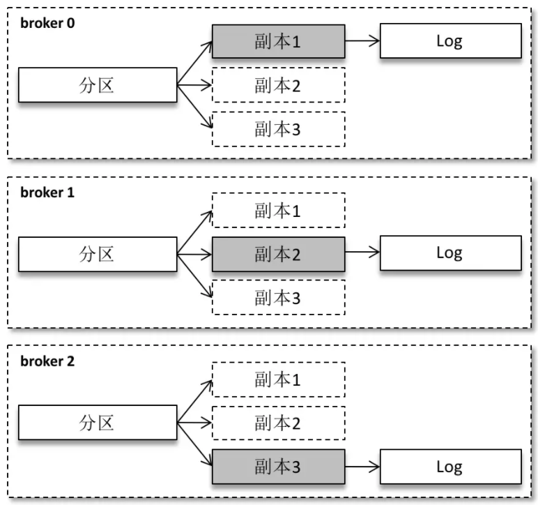

某个分区有3个副本分别位于 broker0、broker1 和 broker2 节点中，其中带阴影的方框表示本地副本。假设 broker0 上的副本1为当前分区的 leader 副本，那么副本2和副本3就是 follower 副本，整个消息追加的过程可以概括如下：

1. 生产者客户端发送消息至 leader 副本（副本1）中。
2. 消息被追加到 leader 副本的本地日志，并且会更新日志的偏移量。
3. follower 副本（副本2和副本3）向 leader 副本请求同步数据。
4. leader 副本所在的服务器读取本地日志，并更新对应拉取的 follower 副本的信息。
5. leader 副本所在的服务器将拉取结果返回给 follower 副本。
6. follower 副本收到 leader 副本返回的拉取结果，将消息追加到本地日志中，并更新日志的偏移量信息

> 在一个分区中，leader 副本所在的节点会记录所有副本的 LEO，而 follower 副本所在的节点只会记录自身的 LEO，而不会记录其他副本的 LEO。对 HW 而言，各个副本所在的节点都只记录它自身的 HW，而Leader所在的Broker上还保存了其他Follower的LEO值，称为Remote LEO

leader 副本中带有其他 follower 副本的 LEO，那么它们是什么时候更新的呢？leader 副本收到 follower 副本的 FetchRequest 请求之后，它首先会从自己的日志文件中读取数据，然后在返回给 follower 副本数据前先更新 follower 副本的 LEO；

### 8.8.4、Leader Epoch

在 0.11.0.0 版本之前，Kafka 使用的是基于 HW 的同步机制，但这样有可能出现数据丢失或 leader 副本和 follower 副本数据不一致的问题

**数据丢失问题：**

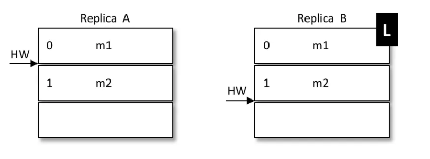

如上图所示，Replica B 是当前的 leader 副本（用 L 标记），Replica A 是 follower 副本。参照前面的同步过程来进行分析：
- 在某一时刻，B 中有2条消息 m1 和 m2，A 从 B 中同步了这两条消息，此时 A 和 B 的 LEO 都为2，同时 HW 都为1；
- 之后 A 再向 B 中发送请求以拉取消息，FetchRequest 请求中带上了 A 的 LEO 信息，B 在收到请求之后更新了自己的 HW 为2；
- B 中虽然没有更多的消息，但还是在延时一段时间之后返回 FetchResponse，并在其中包含了 HW 信息；
- 最后 A 根据 FetchResponse 中的 HW 信息更新自己的 HW 为2

可以看到整个过程中两者之间的 HW 同步有一个间隙：在 A 写入消息 m2 之后（LEO 更新为2）需要再一轮的 FetchRequest/FetchResponse 才能更新自身的 HW 为2。假如如果在这个时候 A 宕机了，那么在 A 重启之后会根据之前HW位置（这个值会存入本地的复制点文件 `replication-offset-checkpoint`）进行日志截断，这样便会将 m2 这条消息删除，此时 A 只剩下 m1 这一条消息，之后 A 再向 B 发送 FetchRequest 请求拉取消息；

此时若 B 再宕机，那么 A 就会被选举为新的 leader，如上图所示。B 恢复之后会成为 follower，由于 follower 副本 HW 不能比 leader 副本的 HW 高，所以还会做一次日志截断，以此将 HW 调整为1。这样一来 m2 这条消息就丢失了（就算B不能恢复，这条消息也同样丢失）

**数据不一致的问题**

假设当前 leader 副本为 A，follower 副本为 B，A 中有2条消息 m1 和 m2，并且 HW 和 LEO 都为2，B 中有1条消息 m1，并且 HW 和 LEO 都为1。假设 A 和 B 同时“挂掉”，然后 B 第一个恢复过来并成为 leader；

之后 B 写入消息 m3，并将 LEO 和 HW 更新至2（假设所有场景中的 min.insync.replicas 参数配置为1）。此时 A 也恢复过来了，根据前面数据丢失场景中的介绍可知它会被赋予 follower 的角色，并且需要根据 HW 截断日志及发送 FetchRequest 至 B，不过此时 A 的 HW 正好也为2，那么就可以不做任何调整了

如此一来 A 中保留了 m2 而 B 中没有，B 中新增了 m3 而 A 也同步不到，这样 A 和 B 就出现了数据不一致的情形

**Leader Epoch**

为了解决上面数据丢失和数据不一致的问题，Kafka引入Leader Epoch后，Follower就不再参考HW，而是根据Leader Epoch信息来截断Leader中不存在的消息。这种机制可以弥补基于HW的副本同步机制的不足，Leader Epoch由两部分组成：
- Epoch：一个单调增加的版本号。每当Leader副本发生变更时，都会增加该版本号。Epoch值较小的Leader被认为是过期Leader，不能再行使Leader的权力；
- 起始位移（Start Offset）：Leader副本在该Epoch值上写入首条消息的Offset

对应上面数据丢失的场景：同样A发生重启，之后A不是先忙着截断日志而是先发送OffsetsForLeaderEpochRequest请求给B（OffsetsForLeaderEpochRequest请求体中包含A当前的LeaderEpoch值），B作为目前的leader在收到请求之后会返回当前的LEO；如果 A 中的 LeaderEpoch（假设为 LE_A）和 B 中的不相同，那么 B 此时会查找 LeaderEpoch 为 `LE_A+1` 对应的 StartOffset 并返回给 A，也就是 LE_A 对应的 LEO，所以我们可以将 OffsetsForLeaderEpochRequest 的请求看作用来查找 follower 副本当前 LeaderEpoch 的 LEO；A 在收到2之后发现和目前的 LEO 相同，也就不需要截断日志了。之后 B 发生了宕机，A 成为新的 leader，那么对应的 LE=0 也变成了 LE=1，对应的消息 m2 此时就得到了保留

# 9、Kafka监控

## 9.1、Kafka常用监控工具

- [一站式Apache Kafka集群指标监控与运维管控平台](https://github.com/didi/LogiKM)
- kafka manager，改为[CMAK](https://github.com/yahoo/CMAK)了，CMAK报JDK版本不对，启动是可以指定版本：`bin/cmak -java-home /usr/java/jdk-11.0.13`
- kafka eagle
- JMXTrans + InfluxDB + Grafana
- CDH

## 9.2、Kafka监控什么

### 9.2.1、主机监控

所谓主机监控，指的是监控 Kafka 集群 Broker 所在的节点机器的性能，常见的主机监控指标包括但不限于以下几种：
- 机器负载（Load）
- CPU 使用
- 率内存使用率，包括空闲内存（Free Memory）和已使用内存（Used Memory）
- 磁盘 I/O 使用率，包括读使用率和写使用率
- 网络 I/O 使用率
- TCP 连接数
- 打开文件数
- inode 使用情况

### 9.2.2、JVM 监控

Kafka Broker 进程是一个普通的 Java 进程，所有关于 JVM 的监控手段在这里都是适用的
- Full GC 发生频率和时长：这个指标帮助你评估 Full GC 对 Broker 进程的影响。长时间的停顿会令 Broker 端抛出各种超时异常；
- 活跃对象大小：这个指标是你设定堆大小的重要依据，同时它还能帮助你细粒度地调优 JVM 各个代的堆大小；
- 应用线程总数：这个指标帮助你了解 Broker 进程对 CPU 的使用情况

社区将默认的 GC 收集器设置为 G1，而 G1 中的 Full GC 是由单线程执行的，速度非常慢。因此，一定要监控 Broker GC 日志，即以 `kafkaServer-gc.log` 开头的文件。注意不要出现 Full GC 的字样。一旦你发现 Broker 进程频繁 Full GC，可以开启 G1 的 -XX:+PrintAdaptiveSizePolicy 开关，让 JVM 告诉你到底是谁引发了 Full GC

### 9.2.3、集群监控

- 查看 Broker 进程是否启动，端口是否建立；
- 查看 Broker 端关键日志：主要涉及Broker 端服务器日志 server.log，控制器日志 controller.log 以及主题分区状态变更日志 state-change.log；
- 查看 Broker 端关键线程的运行状态：在实际生产环境中，监控这两类线程的运行情况是非常有必要的；
    - Log Compaction 线程，这类线程是以 `kafka-log-cleaner-thread` 开头的。就像前面提到的，此线程是做日志 Compaction 的。一旦它挂掉了，所有 Compaction 操作都会中断，但用户对此通常是无感知的；
    - 副本拉取消息的线程，通常以 `ReplicaFetcherThread` 开头。这类线程执行 Follower 副本向 Leader 副本拉取消息的逻辑。如果它们挂掉了，系统会表现为对应的 Follower 副本不再从 Leader 副本拉取消息，因而 Follower 副本的 Lag 会越来越大；
- 查看 Broker 端的关键 JMX 指标：
    - BytesIn/BytesOut：即 Broker 端每秒入站和出站字节数。你要确保这组值不要接近你的网络带宽，否则这通常都表示网卡已被“打满”，很容易出现网络丢包的情形；
    - NetworkProcessorAvgIdlePercent：即网络线程池线程平均的空闲比例。通常来说，你应该确保这个 JMX 值长期大于 30%。如果小于这个值，就表明你的网络线程池非常繁忙；
    - RequestHandlerAvgIdlePercent：即 I/O 线程池线程平均的空闲比例。同样地，如果该值长期小于 30%，你需要调整 I/O 线程池的数量，或者减少 Broker 端的负载；
    - UnderReplicatedPartitions：即未充分备份的分区数。所谓未充分备份，是指并非所有的 Follower 副本都和 Leader 副本保持同步。一旦出现了这种情况，通常都表明该分区有可能会出现数据丢失。因此，这是一个非常重要的 JMX 指标；
    - ISRShrink/ISRExpand：即 ISR 收缩和扩容的频次指标。如果你的环境中出现 ISR 中副本频繁进出的情形，那么这组值一定是很高的。这时，你要诊断下副本频繁进出 ISR 的原因，并采取适当的措施；
    - ActiveControllerCount：即当前处于激活状态的控制器的数量。正常情况下，Controller 所在 Broker 上的这个 JMX 指标值应该是 1，其他 Broker 上的这个值是 0。如果你发现存在多台 Broker 上该值都是 1 的情况，一定要赶快处理，处理方式主要是查看网络连通性；
- 监控 Kafka 客户端：

## 9.1、消费者消费进度监控

对于 Kafka 消费者来说，最重要的事情就是监控它们的消费进度了，或者说是监控它们消费的滞后程度。这个滞后程度有个专门的名称：消费者 Lag 或 Consumer Lag；

所谓滞后程度，就是指消费者当前落后于生产者的程度。比方说，Kafka 生产者向某主题成功生产了 100 万条消息，你的消费者当前消费了 80 万条消息，那么我们就说你的消费者滞后了 20 万条消息，即 Lag 等于 20 万；

Kafka 监控 Lag 的层级是在分区上的。如果要计算主题级别的，你需要手动汇总所有主题分区的 Lag，将它们累加起来，合并成最终的 Lag 值

# 10、性能调优

对 Kafka 而言，性能一般是指吞吐量和延时：高吞吐量、低延时是我们调优 Kafka 集群的主要目标
- 吞吐量，也就是 TPS，是指 Broker 端进程或 Client 端应用程序每秒能处理的字节数或消息数，这个值自然是越大越好；
- 延时，它表示从 Producer 端发送消息到 Broker 端持久化完成之间的时间间隔。这个指标也可以代表端到端的延时（End-to-End，E2E），也就是从 Producer 发送消息到 Consumer 成功消费该消息的总时长。和 TPS 相反，通常希望延时越短越好；

## 10.1、优化漏斗

优化漏斗是一个调优过程中的分层漏斗，我们可以在每一层上执行相应的优化调整。总体来说，层级越靠上，其调优的效果越明显，整体优化效果是自上而下衰减的

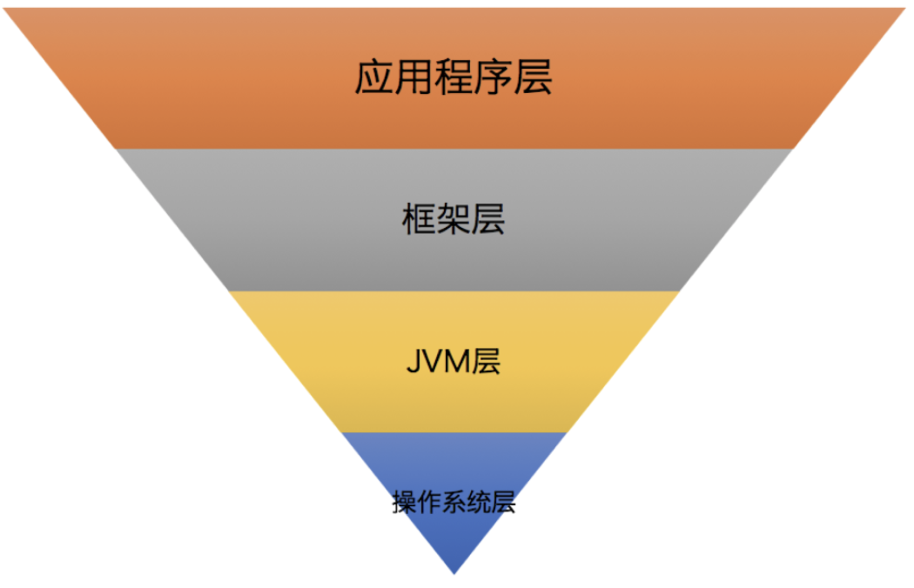

- 第1层-应用程序层：它是指优化 Kafka 客户端应用程序代码，比如使用合理的数据结构、缓存计算开销大的运算结果，抑或是复用构造成本高的对象实例等。这一层的优化效果最为明显，通常也是比较简单的；
- 第2层-框架层：它指的是合理设置 Kafka 集群的各种参数，毕竟，直接修改 Kafka 源码进行调优并不容易，但根据实际场景恰当地配置关键参数的值；
- 第3层-JVM层：Kafka Broker 进程是普通的 JVM 进程，各种对 JVM 的优化在这里也是适用的。优化这一层的效果虽然比不上前两层，但有时也能带来巨大的改善效果；
- 第4层-操作系统层：对操作系统层的优化很重要，但效果往往不如想象得那么好。与应用程序层的优化效果相比，它是有很大差距的

### 10.1.1、操作系统优化

- 在操作系统层面，你最好在挂载（Mount）文件系统时禁掉 atime 更新；atime 的全称是 access time，记录的是文件最后被访问的时间。记录 atime 需要操作系统访问 inode 资源，而禁掉 atime 可以避免 inode 访问时间的写入操作，减少文件系统的写操作数；
- 文件系统：选择 ext4 或 XFS，或者ZFS 文件系统
- swap 空间的设置：将 swappiness 设置成一个很小的值，比如 1～10 之间，以防止 Linux 的 OOM Killer 开启随意杀掉进程；
- ulimit -n 和 vm.max_map_count；
- 操作系统页缓存大小：Broker 端参数 log.segment.bytes 的值。该参数的默认值是 1GB；预留出一个日志段大小，至少能保证 Kafka 可以将整个日志段全部放入页缓存；

### 10.1.2、JVM 层调优

- 设置堆大小：将你的 JVM 堆大小设置成 6～8GB；可以查看 GC log，特别是关注 Full GC 之后堆上存活对象的总大小，然后把堆大小设置为该值的 1.5～2 倍；如果你发现 Full GC 没有被执行过，手动运行 `jmap -histo:live <pid>` 就能人为触发 Full GC；

- GC 收集器的选择：建议使用 G1 收集器，主要原因是方便省事，至少比 CMS 收集器的优化难度小得多；如果你的 Kafka 环境中经常出现 Full GC，你可以配置 JVM 参数 -XX:+PrintAdaptiveSizePolicy，来探查一下到底是谁导致的 Full GC；大对象问题，反映在 GC 上的错误，就是“too many humongous allocations”；默认情况下，如果一个对象超过了 N/2，就会被视为大对象，从而直接被分配在大对象区。如果你的 Kafka 环境中的消息体都特别大，就很容易出现这种大对象分配的问题

### 10.1.3、Broker 端调优

即尽力保持客户端版本和 Broker 端版本一致

### 10.1.4、应用层调优

- 不要频繁地创建 Producer 和 Consumer 对象实例；
- 用完及时关闭。这些对象底层会创建很多物理资源，如 Socket 连接、ByteBuffer 缓冲区等。不及时关闭的话，势必造成资源泄露；
- 合理利用多线程来改善性能。Kafka 的 Java Producer 是线程安全的，你可以放心地在多个线程中共享同一个实例；

## 10.2、性能指标调优

### 10.2.1、调优吞吐量

**Broker端：**
- 适当增加`num.replica.fetchers`参数值，但不超过CPU核数，该参数表示的是 Follower 副本用多少个线程来拉取消息，默认使用 1 个线程。如果你的 Broker 端 CPU 资源很充足，不妨适当调大该参数值，加快 Follower 副本的同步速度。因为在实际生产环境中，配置了 acks=all 的 Producer 程序吞吐量被拖累的首要因素，就是副本同步性能；
- 避免经常性的 Full GC。目前不论是 CMS 收集器还是 G1 收集器，其 Full GC 采用的是 Stop The World 的单线程收集策略，非常慢，因此一定要避免；

**Producer端：**
- 要改善吞吐量，通常的标配是增加消息批次的大小以及批次缓存时间，即 `batch.size` 和 `linger.ms`，目前它们的默认值都偏小，特别是默认的 16KB 的消息批次大小一般都不适用于生产环境；`batch.size`可以适当增加到512KB或者1MB；`linger.ms`可以调整为10~100；
- 压缩算法配置好，以减少网络 I/O 传输量，从而间接提升吞吐量。当前，和 Kafka 适配最好的两个压缩算法是 LZ4 和 zstd；
- 如果优化目标是吞吐量，最好不要设置 acks=all 以及开启重试。前者引入的副本同步时间通常都是吞吐量的瓶颈，而后者在执行过程中也会拉低 Producer 应用的吞吐量；
- 如果你在多个线程中共享一个 Producer 实例，就可能会碰到缓冲区不够用的情形。倘若频繁地遭遇 TimeoutException：Failed to allocate memory within the configured max blocking time 这样的异常，那么你就必须显式地增加 buffer.memory 参数值，确保缓冲区总是有空间可以申请的

**Consumer端：**
- 利用多线程方案增加整体吞吐量；
- 增加 fetch.min.bytes 参数值。默认是 1 字节，表示只要 Kafka Broker 端积攒了 1 字节的数据，就可以返回给 Consumer 端，这实在是太小了

### 10.2.2、调优延时

**Broker端：**
- 增加 num.replica.fetchers 值以加快 Follower 副本的拉取速度，减少整个消息处理的延时

**Producer端：**
- 希望消息尽快地被发送出去，必须设置 linger.ms=0；
- 不要启用压缩。因为压缩操作本身要消耗 CPU 时间，会增加消息发送的延时；
- 最好不要设置 acks=all

**Consumer端：**
- 保持 fetch.min.bytes=1 即可，也就是说，只要 Broker 端有能返回的数据，立即令其返回给 Consumer，缩短 Consumer 消费延时

# 11、Kafka协议

- [Kafka协议官方文档](https://kafka.apache.org/protocol.html#protocol_api_keys)

Kafka 自定义了一组基于 TCP 的二进制协议，只要遵守这组协议的格式，就可以向 Kafka 发送消息，也可以从 Kafka 中拉取消息，或者做一些其他的事情，比如提交消费位移等

# 12、Kafka与Zookeeper

Kafka为什么要放弃Zookeeper？Kakfa 官方研发 Kraft 的这样的一个架构来取代 Zookeeper

## 12.1、Zookeeper 使用中的问题

**（1）ZooKeeper 的 CP 属性决定写操作延时过高。**

分布式有一个 CAP 理论,任何一个分布式的系统都不能同时满足 CAP 三个属性，只能同时满足最多两个属性。 AP 或者是CP，而ZooKeeper 其实就是一个 CP 的一个分布式的系统，这种属性其实就是仅仅是满足了分区种错性和一致性，但是它牺牲了高可用性。这种属性就决定了写的操作延时是比较高的，因为它要满足一致性就必须要多做一些工作，这个时候可能就会对于写不就不是很友好，它的延迟时间就比较高

**（2）元数据过多会延长新 Controller 节点的启动时间，从而造成堵塞**

Controller 这个角色主要是一个总控节点来负责整个集群的管理，比如 做partition 的选主的工作。 但是并不能保证 Controller 它一直是存活的，肯定要有一个故障转移的机制。然后如果 Controller 挂了的话，新的 Controller 要起来，这个时候新的 controller 节点要从 zookeeper 复制元数据，如果元数据过多的话，就会延长新的 Controller 节点的一个启动时间啊

**（3）主题分区发生变化时，可能会产生大量的 Zookeeper 的写操作，这样也会引起一些阻塞**

**（4）zookeeper 增加了运维的成本**

# 13、kafka学习资料

- [官方文档](https://kafka.apache.org/documentation/)，重点关注Configuration 篇、Operations 篇以及 Security 篇，特别是 Configuration 中的参数部分
- Confluent 公司自己维护的[官方文档](https://docs.confluent.io/home/overview.html)，重点学习 Confluent 官网上关于Security 配置和Kafka Streams 组件的文档；
- [Kafka 的Jira 列表](https://issues.apache.org/jira/projects/KAFKA/issues/KAFKA-17462?filter=allopenissues)
- StackOverflow 的[Kafka 专区](https://stackoverflow.com/questions/tagged/apache-kafka?sort=newest&pageSize=15)
- [Confluent 博客](https://www.confluent.io/blog/)
- [社区维护的Confluence 文档](https://cwiki.apache.org/confluence/display/KAFKA/Index)
- Google Docs：一篇是 [Kafka 事务的详细设计文档](https://docs.google.com/document/d/11Jqy_GjUGtdXJK94XGsEIK7CP1SnQGdp2eF0wSw9ra8/edit)，另一篇是[Controller 重设计文档](https://docs.google.com/document/d/1rLDmzDOGQQeSiMANP0rC2RYp_L7nUGHzFD9MQISgXYM/edit)
- [OrcHome-问答社区](https://www.orchome.com/kafka/issues)


# 参考资料

* [Kafka深入理解核心原理](https://juejin.cn/book/6844733792683458573?enter_from=course_center&utm_source=course_center)
* [Kafka高性能原因](https://mp.weixin.qq.com/s/XhJl90DnprNsI8KxFfdyVw)
* [Kafka架构调优最常见的5个问题](https://heapdump.cn/article/3802138)
* [Kafka: a Distributed Messaging System for Log Processing](https://notes.stephenholiday.com/Kafka.pdf)
* [Kafka 架构、核心机制和场景解读](https://juejin.cn/post/7176576097205616700)
* [Kafka系列教程](https://www.baeldung.com/apache-kafka-series)