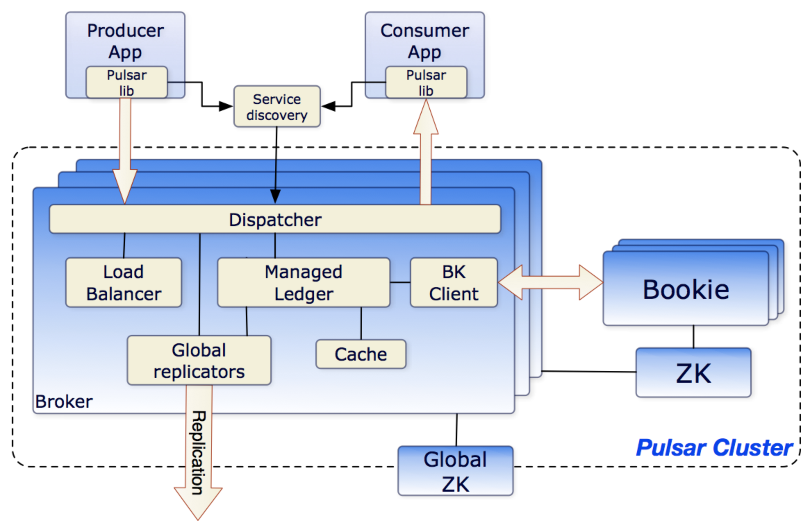

# 1、 Pulsar简介

## 1.1、pulsar概述

Pulsar 非常灵活，可以像Kafka 一样作为分布式日志系统，也可以作为类似RabbitMQ 这类简单的消息系统。

Pulsar 有多种订阅类型、传递保障、保存策略

Pulsar 采用存储和计算分离的设计

## 1.2、特点

- 内置多租户：不同的团队可以使用同一个集群，互相隔离。支持隔离、认证授权、配额；
- 多层架构：
    - Pulsar 使用特定的数据层来存储 topic 数据，使用了 Apache BookKeeper 作为存储数据。Broker 与存储分离。
    - 使用分隔机制可以解决集群的扩展、再平衡、维护等问题。也提升了可用性，不会丢失数据。
    - 因为使用了多层架构，对于 topic 数量没有限制，topic 与存储是分离的，也可以创建非持久化的 topic；
- 多层存储：Kafka中存储是很昂贵的，所以很少存储冷数据。Pulsar 使用了多层存储，可以自动把旧数据移动到专门的存储设备；
- Functions：Pulsar Function 是一种部署简单，轻量级计算、对开发人员友好的 API，无需像 Kafka 那样运行自己的流处理引擎；
- 安全：内置了代理、多租户安全机制、可插入的身份验证等功能；
- 快速再平衡：partition 被分为了小块儿，所以再平衡时非常快

## 1.3、Pulsar与Kafka

- 流式处理和队列的合体：Pulsar 不仅可以像 Kafka 那样处理高速率的实时场景，还支持标准的消息队列模式，Pulsar 具备传统消息队列（如 RabbitMQ）的功能；
- 支持分区：Kafka通过分区进而划分到不同的 broker，单个主题的处理速率可以得到大幅提升。但如果某些主题不需要太高的处理速率；Pulsar 就可以做到。如果只需要一个主题，可以使用一个主题而无需使用分区。如果需要保持多个消费者实例的处理速率，也不需要使用分区，Pulsar 的共享订阅可以达到这一目的；
- 无状态：
    - Kafka 不是无状态的，每个 broker 都包含了分区的所有日志，如果一个 broker 宕机，不是所有 broker 都可以接替它的工作。如果工作负载太高，也不能随意添加新的 broker 来分担，而是必须与持有其分区副本的 broker 进行状态同步；
    - 在 Pulsar 架构中，broker 是无状态的。但是完全无状态的系统无法持久化消息，所以 Pulsar 不是依靠 broker 来实现消息持久化的。在 Pulsar 架构中，数据的分发和保存是相互独立的。broker 从生产者接收数据，然后将数据发送给消费者，但数据保存在 BookKeeper 中。Pulsar 的 broker 是无状态的，所以如果工作负载很高，可以直接添加新的 broker，快速接管工作负载；
- 简单的跨域复制

**Kafka的缺点：**
- 存储计算没有分离, 难以扩容和缩容
- 没有 IO 隔离, 写高了读不动, 读高了写不动
- 没有多租户IO 
- 模型过于简单, 面对大量 topic 时性能下降严重
- 消费模型有限, 无法利用部分业务可以接受消息无序的特点

## 1.4、为什么选择Pulsar

- 使用比较多的是 Kafka，主要场景是大数据日志处理，较少用于金融场景；
- RocketMQ 对 Topic 运营不太友好，特别是不支持按 Topic 删除失效消息，以及不具备宕机 Failover 能力；
- 选 Pulsar 是因为其原生的高一致性，基于 BookKeeper 提供高可用存储服务，采用了存储和服务分离架构方便扩容，同时还支持多种消费模式和多域部署模式

## 1.5、Pulsar架构

无论是 RocketMQ、RabbitMQ 还是 Kafka，消息都是存储在 Broker 的磁盘或者内存中。客户端在访问某个主题分区之前，必须先找到这个分区所在 Broker，然后连接到这个 Broker 上进行生产和消费；每一个 Broker 存储的消息数据是不一样的，或者说，每个节点上都存储了状态（数据）。这种节点称为“有状态的节点（Stateful Node）”

Pulsar 与其他消息队列在架构上，最大的不同在于，它的 Broker 是无状态的（Stateless）。也就是说，在 Pulsar 的 Broker 中既不保存元数据，也不存储消息；

其架构图：

在 Pulsar 中，ZooKeeper 集群的作用和在 Kafka 中是一样的，都是被用来存储元数据。BookKeeper 集群则被用来存储消息数据；

BookKeeper 的存储单元是 Ledger，其实 Ledger 就是一段 WAL（Write Ahead Log），或者你可以简单地理解为某个主题队列的一段，它包含了连续的若干条消息，消息在 Ledger 中称为 Entry。为了保证 Ledger 中的 Entry 的严格顺序，Pulsar 为 Ledger 增加一次性的写入限制，Broker 创建一个 Ledger 后，只有这个 Broker 可以往 Ledger 中写入 Entry，一旦 Ledger 关闭后，无论是 Broker 主动关闭，还是因为 Broker 宕机异常关闭，这个 Ledger 就永远只能读取不能写入了。如果需要继续写入 Entry，只能新建另外一个 Ledger；

消息数据由 BookKeeper 集群负责存储，元数据由 ZooKeeper 集群负责存储，Pulsar 的 Broker 上就不需要存储任何数据了，这样 Broker 就成为了无状态的节点

Pulsar 的客户端要读写某个主题分区上的数据之前，依然要在元数据中找到分区当前所在的那个 Broker，这一点是和其他消息队列的实现是一样的。不一样的地方是，其他的消息队列，分区与 Broker 的对应关系是相对稳定的，只要不发生故障，这个关系是不会变的。而在 Pulsar 中，这个对应关系是动态的，它可以根据 Broker 的负载情况进行动态调整，而且由于 Broker 是无状态的，分区可以调整到集群中任意一个 Broker 上，这个负载均衡策略就可以做得非常简单并且灵活。如果某一个 Broker 发生故障，可以立即用任何一个 Broker 来替代它；

客户端在收发消息之前，需要先连接 Service Discovery 模块，获取当前主题分区与 Broker 的对应关系，然后再连接到相应 Broker 上进行消息收发。客户端收发消息的整体流程，和其他的消息队列是差不多的。比较显著的一个区别就是，消息是保存在 BookKeeper 集群中的，而不是本机上。数据的可靠性保证也是 BookKeeper 集群提供的，所以 Broker 就不需要再往其他的 Broker 上复制消息了；

BookKeeper 依然要解决数据一致性、节点故障转移、选举、数据复制等等这些问题

# 参考资料

- [官方文档](http://pulsar.apache.org/)
- [理解Pulsar工作原理](https://blog.csdn.net/u010869257/article/details/83211152)
- [理解Pulsar工作原理-原文](https://jack-vanlightly.com/blog/2018/10/2/understanding-how-apache-pulsar-works)
- [Pulsar架构与核心概念](https://zhuanlan.zhihu.com/p/88618994)
- [Pulsar与Kafka对比](https://www.infoq.cn/article/1uaxfkwuhukty1t_5gpq)
- [Pulsar知识点](https://mp.weixin.qq.com/s/ypnHNCVqygfj-Wla-FsRrQ)