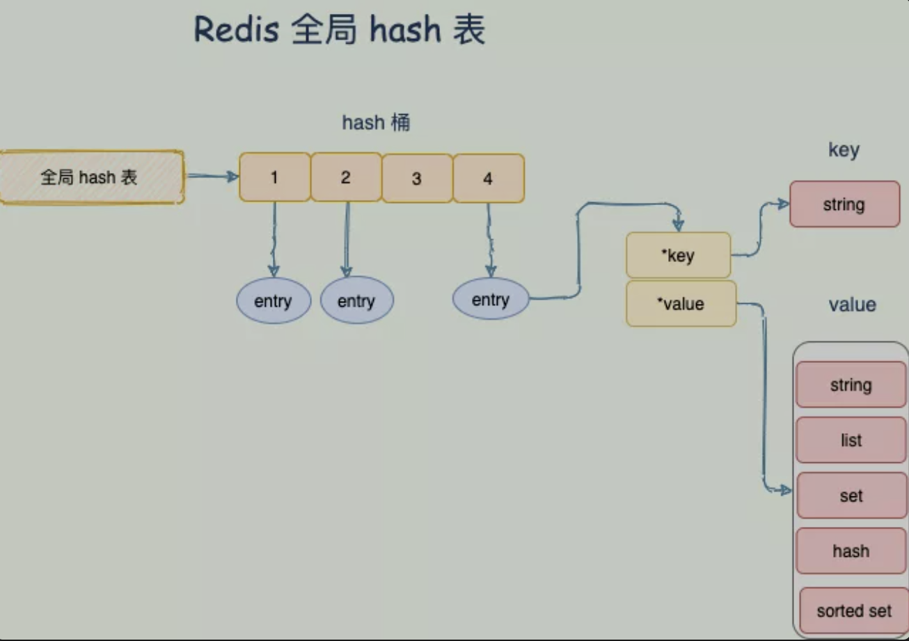
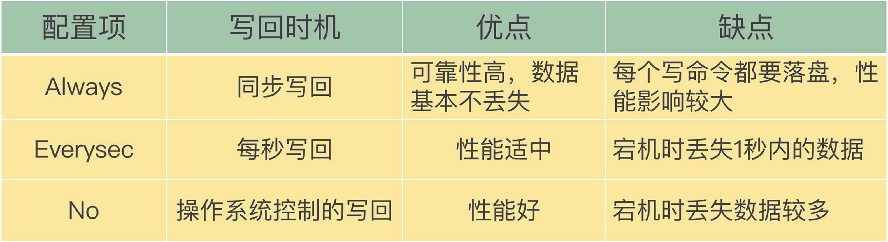
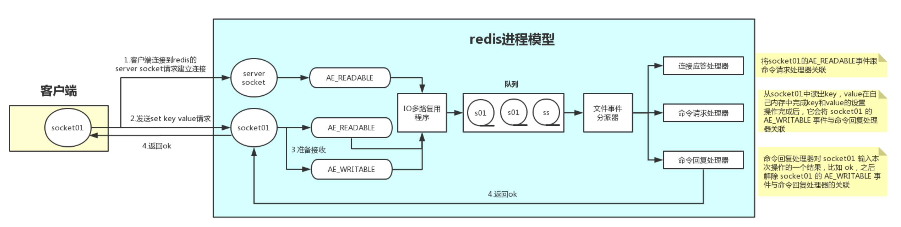
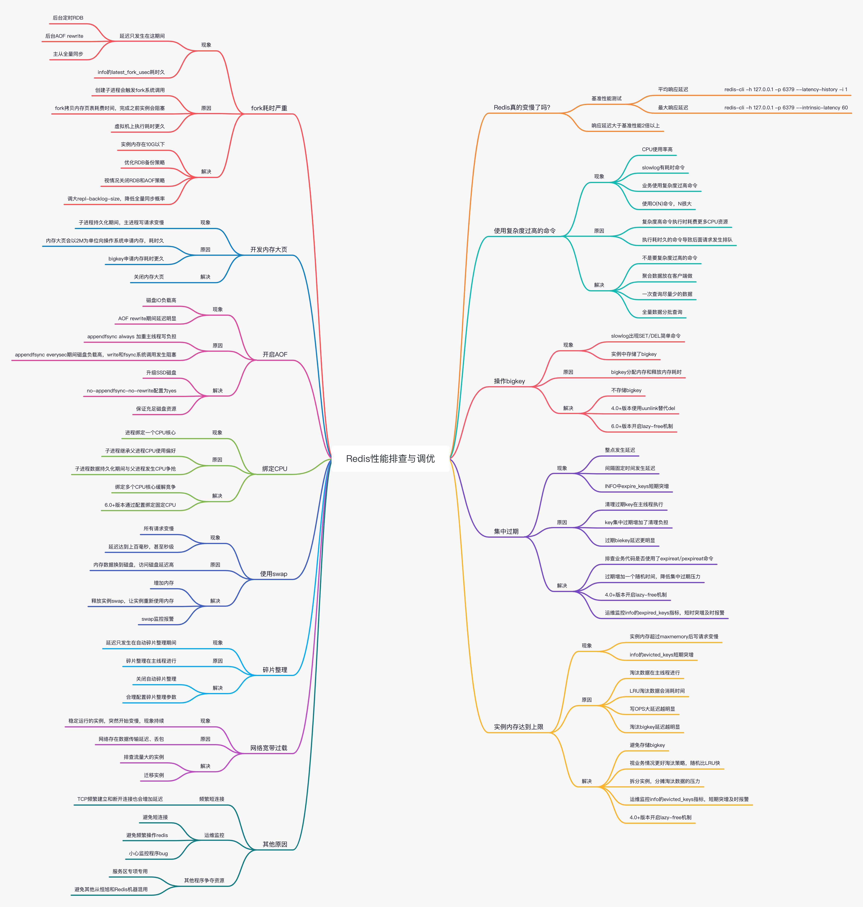

# 一、Redis 基本知识

## 1、Redis

是一个开源，先进的key-value存储，并用于构建高性能，可扩展的Web应用程序的完美解决方案数据结构服务器，支持不同类型的值，高级键值（key-value）缓存 （cache）和存储 （store）系统为了高性能采用内存（in-memory）数据集（dataset）

redis为了达到最快的读写速度，将数据都读到内存中，并通过异步的方式将数据写入磁盘。如果不将数据放在内存中，磁盘IO速度会严重影响redis的性能

Redis是基于CAP的

### 1.1、特点

- Redis 数据库完全在内存中，使用磁盘仅用于数据持久化；
- 相比许多键值数据存储，Redis 拥有一套较为丰富的数据类型；
- Redis 可以将数据复制到任意数量的从服务器；

### 1.2、优点

- 异常快速：Redis的速度非常快，每秒能执行约11万集合，每秒约81000+条记录
- 支持丰富的数据类型：Redis 支持最大多数开发人员已经知道像列表，集合，有序集合，散列数据类型
- 操作都是原子性：所有 Redis 操作是原子的，这保证了如果两个客户端同时访问的 Redis 服务器将获得更新后的值；
- 多功能实用工具：Redis 是一个多实用的工具，可以在多个用例如缓存，消息，队列使用(Redis 原生支持发布/订阅)，任何短暂的数据，应用程序，如Web应用程序会话，网页命中计数等

### 1.3、启动

redis-server redis.conf
```
运行：redis-cli
	127.0.0.1：6379> 127.0.0.1是本机的IP地址，6379为Redis服务器运行的端口
redis 127.0.0.1：6379> ping
PONG > 表示成功地安装Redis在您的机器上
```

停止redis：`src/redis-cli shutdown`，或者可以如此：`src/redis-cli -h 192.168.89.135 -p 6378 shutdown`

## 2、Redis的数据类型-支持五种数据类型

### 2.1、字符串：是字节序列

- Redis 字符串是二进制安全的，这意味着他们有一个已知的长度没有任何特殊字符终止，所以你可以存储任何东西，`512M`为上限，如一张图片等；
- 使用场景：
	- ①、使用 `INC`R 命令族（INCR，DECR，INCRBY），将字符串作为原子计数器
	- ②、使用 `APPEND` 命令追加字符串
	- ③、使用 `GETRANGE` 和 `SETRANGE` 命令，使字符串作为随机访问向量（vectors）
	- ④、编码大量数据到很小的空间，或者使用 `GETBIT` 和 `SETBIT` 命令，创建一个基于 Redis 的布隆 (Bloom) 过滤器

**常用命令：**
- `get/set/del`：查询/设置/删除
- `set rekey data`：设置已经存在的key，会覆盖
- `setnx rekey data`：设置已经存在的key，不会覆盖
- `set key value ex time`：设置带过期时间的数据
- `expire key`：设置过期时间
- `ttl`：查看剩余时间，-1永不过期，-2过期
- `append key`：合并字符串
- `strlen key`：字符串长度
- `incr key`：累加1
- `decr key`：类减1
- `incrby key num`：累加给定数值
- `decrby key num`：累减给定数值
- `getrange key start end`：截取数据，end=-1 代表到最后
- `setrange key start newdata`：从start位置开始替换数据
- `mset`：连续设值
- `mget`：连续取值
- `msetnx`：连续设置，如果存在则不设置
- `select index`：切换数据库，总共默认16个
- `flushdb`：删除当前下边db中的数据（不建议使用）
- `flushall`：删除所有db中的数据（不建议使用）

- 例子：
```
127.0.0.1：6379> set name "coco"
OK
127.0.0.1：6379> get name
"coco"
```
实战场景：

- **缓存**： 经典使用场景，把常用信息，字符串，图片或者视频等信息放到redis中，redis作为缓存层，mysql做持久化层，降低mysql的读写压力。
- **计数器**：redis是单线程模型，一个命令执行完才会执行下一个，同时数据可以一步落地到其他的数据源。
- **session**：常见方案spring session + redis实现session共享，

### 2.2、哈希/散列-hashes

- Redis 的哈希是键值对的集合。Redis 的哈希值是字符串字段和字符串值之间的映射，因此它们被用来表示对象
- 例子
```
127.0.0.1：6379> hmset user：1000 username bluefish password 123 port 8080
OK
127.0.0.1：6379> hgetall user：1
1) "username"
2) "coco"
3) "password"
4) "coco"
5) "points"
6) "200"
```
- 使用场景：由于哈希主要用来表示对象，对象能存储很多元素，能直观，相比string更节省空间，的维护缓存信息，如用户信息，视频信息、购物车信息等；
- 散列表（是说散列表里面存储的数少）使用的内存非常小，所以应该尽可能的将数据模型抽象到一个散列表里面；
- 每个哈希可以存储多达 `2^32-1` 个字段值对 (field-value pair)(多于 40 亿个)；

**常用命令：**
- `hset key property value`：`hset user name test` 创建一个user对象，这个对象中包含name属性，name值为test

- `hget user name`：获得用户对象中name的值

- `hmset`：设置对象中的多个键值对
	- `hset user age 18 phone 139123123`
	- `hmsetnx`：设置对象中的多个键值对，存在则不添加
	- `hset user age 18 phone 139123123`

- `hmget`：获得对象中的多个属性, `hmget user age phone`

- `hgetall user`：获得整个对象的内容
	```
	127.0.0.1:6379> hgetall user
	1) "name"
	2) "test"
	3) "age"
	4) "18"
	5) "sex"
	6) "gender"
	7) "phone"
	8) "18955555555"
	```
- `hincrby user age 2`：累加属性
- `hincrbyfloat user age 2.2`：累加属性
- `hlen user`：有多少个属性
- `hexists user field`：判断某个属性是否存在
- `hkeys user`：获得所有属性
- `hvals user`：获得所有值
- `hdel user field`：删除对象的属性，可以删除多个或者一个

### 2.3、列表-lists

- Redis 的列表是简单的字符串列表，是`按照插入顺序排序`的字符串列表，您可以添加元素到 Redis 的列表的头部或尾部，表的最大长度为 `2^32 - 1` 元素（4294967295，每个列表中可容纳超过四十亿的元素）

- 例子：
```
127.0.0.1：6379> lpush tutorial redis
(integer) 1
127.0.0.1：6379> lpush tutorial mongodb
(integer) 2
127.0.0.1：6379> lpush tutorial rabitmq
(integer) 3
127.0.0.1：6379> lrange tutorial 0 10
1) "rabitmq"
2) "mongodb"
3) "redis"
```
- `LPUSH` 命令插入一个新元素到列表头部，而 `RPUSH` 命令插入一个新元素到列表的尾部，当这两个命令操作在一个不存在的键时，将会创建一个新的列表
- 从时间复杂度的角度来看，Redis 列表主要特性就是`支持时间常数的插入和靠近头尾部元素的删除`，即使是需要插入上百万的条目访问列表两端的元素是非常快的，但如果你试着访问一个非常大的列表的中间元素仍然是十分慢的；
- 使用场景：
	- ①、为社交网络时间轴 (timeline) 建模，使用 `LPUSH` 命令往用户时间轴插入元素，使用 LRANGE 命令获得最近事项；
	- ②、使用 `LPUSH` 和 LTRIM 命令创建一个不会超出给定数量元素的列表，只存储最近的 N 个元素；
	- ③、列表可以用作消息传递原语，例如，众所周知的用于创建后台任务的 Ruby 库 Resque；
	- ④、你可以用列表做更多的事情，这种数据类型支持很多的命令，包括阻塞命令，如 BLPOP

**常用命令：**
- `lpush userList 1 2 3 4 5`：构建一个list，从左边开始存入数据
- `rpush userList 1 2 3 4 5`：构建一个list，从右边开始存入数据
- `lrange list start end`：获得数据
- `lpop`：从左侧开始拿出一个数据
- `rpop`：从右侧开始拿出一个数据
- `llen list`：list长度
- `lindex list index`：获取list下标的值
- `lset list index value`：把某个下标的值替换
- `linsert list before/after value`：插入一个新的值
- `lrem list num value`：删除几个相同数据
- `ltrim list start end`：截取值，替换原来的list

### 2.4、集合-Sets

- Redis 的集合是字符串的无序集合。在Redis您可以添加，删除和测试文件是否存在，在成员 O(1)的时间复杂度；Set是一个特殊的value为空的Hash

- 一个集合最多可以包含 2^32-1个元素（4294967295，每个集合超过40亿个元素）
```
127.0.0.1：6379> sadd tutoriallist redis
(integer) 1
127.0.0.1：6379> sadd tutoriallist mongodb
(integer) 1
127.0.0.1：6379> sadd tutoriallist rabitmq
(integer) 1
127.0.0.1：6379> sadd tutoriallist rabitmq
(integer) 0
127.0.0.1：6379> smembers tutoriallist
1) "rabitmq"
2) "mongodb"
3) "redis"
```
- 使用场景：
	- ①、你可以使用 Redis 集合追踪唯一性的事情，访问某篇博客文章的所有唯一 IP
	- ②、用户标签、点赞、收藏、踩等等；
	- ③、你可以使用 `SPOP` 或 `SRANDMEMBER` 命令来从集合中随机抽取元素；
- `sdiff set1 set2`：存在于set1中但是不存在set2中的数据，差集；
- `SINTERSTORE` 将结果保存到 destination 集合，而不是简单地返回结果集
- `sinter set1 set2`：两个set的交集；
- `sunion set1 set2`：两个集合的并集；

### 2.5、有序集合

- Redis 的有序集合类似于 Redis 的集合，字符串不重复的集合；不同的是，一个有序集合的每个成员用分数，以便采取有序set命令，从最小的到最大的成员分数有关
- 使用有序集合，你可以非常快地(O(log(N)))完成添加，删除和更新元素的操作由于元素是有序的而无需事后排序，你可以通过分数或者排名 (位置) 很快地来获取一个范围内的元素；
- 使用场景：
	- ①、获取排行：例如多人在线游戏排行榜，每次提交一个新的分数，你就使用 ZADD 命令更新
	- ②、有序集合常用来索引存储在 Redis 内的数据
	- ③、有序集合或许是最高级的 Redis 数据类型

**常用命令：**
- `zadd zset 10 value1 20 value2 30 value3`：设置member和对应的分数
- `zrange zset 0 -1`：查看所有zset中的内容；
- `zrange zset 0 -1 withscores`：带有分数
- `zrank zset value`：获得对应的下标
- `zscore zset value`：获得对应的分数
- `zcard zset`：统计个数
- `zcount zset` 分数1 分数2：统计个数
- `zrangebyscore zset` 分数1 分数2：查询分数之间的member(包含分数1 分数2)
- `zrangebyscore zset (分数1 (分数2`：查询分数之间的member（不包含分数1 和 分数2）
- `zrangebyscore zset 分数1 分数2 limit start end`：查询分数之间的member(包含分数1 分数2)，获得的结果集再次根据下标区间做查询
- `zrem zset value`：删除member

总结：
- 默认升序排列，即通过命令`ZRANGE`实现；如果要按照降序排列，需要通过命令`ZREVRANGE`实现；
- 当score即得分一样时，按照字典顺序对member进行排序，字典排序用的是二进制，它比较的是字符串的字节数组，所以实际上是比较ASCII码；

Sorted Set默认情况下只能根据一个因子score进行排序。如此一来，局限性就很大，举个栗子：热门排行榜需要按照下载量&最近更新时间排序，即类似数据库中的ORDER BY download_count, update_time DESC。那这样的需求如果用Redis的Sorted Set实现呢？事实上很简单，思路就是将涉及排序的多个维度的列通过一定的方式转换成一个特殊的列，即result = function(x, y, z)，即x，y，z是三个排序因子，例如下载量、时间等，通过自定义函数function()计算得到result，将result作为Sorted Set中的score的值，就能实现任意维度的排序需求了；

### 2.6、位图-bitmap

通过一个bit位来表示某个元素对应的值或者状态，其中的key就是对应元素本身；本身不是一种数据结构，实际上它就是字符串（key 对应的 value 就是上图中最后的一串二进制），但是它可以对字符串的位进行操作；可以把 Bitmaps 想象成一个以 位 为单位的数组，数组的每个单元只能存储 0 和 1，数组的下标在Bitmaps中叫做偏移量

其提供了SETBIT、GETBIT、BITCOUNT、BITTOP四个命令用于操作二进制位数组

#### 2.6.1、SETBIT

语法：`SETBIT key offset value`

说明：
- 对 key 所储存的字符串值，设置或清除指定偏移量上的位(bit)；
- 位的设置或清除取决于 value 参数，可以是 0 也可以是 1；
- 当 key 不存在时，自动生成一个新的字符串值；
- 字符串会进行伸展(grown)以确保它可以将 value 保存在指定的偏移量上。当字符串值进行伸展时，空白位置以 0 填充；
- offset 参数必须大于或等于 0 ，小于`2^32 (bit 映射被限制在 512 MB 之内)`

返回值：字符串值指定偏移量上原来储存的位(bit)

示例：
```bash
127.0.0.1:6379> SETBIT testBit 125 1
(integer) 0
127.0.0.1:6379> SETBIT testBit 125 0
(integer) 1
127.0.0.1:6379> SETBIT testBit 125 1
(integer) 0
```

#### 2.6.2、GETBIT

语法：`GETBIT key offset`

说明：
- 对 key 所储存的字符串值，获取指定偏移量上的位(bit)。
- 当 offset 比字符串值的长度大，或者 key 不存在时，返回 0；

返回值：字符串值指定偏移量上的位(bit)

示例：
```
127.0.0.1:6379> SETBIT testBit 125 1
(integer) 1
127.0.0.1:6379> GETBIT testBit 125
(integer) 1
127.0.0.1:6379> GETBIT testBit 126
(integer) 0
```

#### 2.6.3、获取Bitmaps 指定范围值为 1 的位个数

语法：`BITCOUNT key start`

说明：
- 计算给定字符串中，被设置为 1 的比特位的数量；
- 一般情况下，给定的整个字符串都会被进行计数，通过指定额外的 start 或 end 参数，可以让计数只在特定的位上进行；
- start 和 end 参数的设置和 GETRANGE 命令类似，都可以使用负数值： 比如 -1 表示最后一个字节， -2表示倒数第二个字节，以此类推；
- 不存在的 key 被当成是空字符串来处理，因此对一个不存在的 key 进行 BITCOUNT 操作，结果为 0；

返回值：被设置为 1 的位的数量

示例：
```
127.0.0.1:6379> SETBIT testBit 125 1
(integer) 1
127.0.0.1:6379> GETBIT testBit 125
(integer) 1
127.0.0.1:6379> BITCOUNT testBit
(integer) 1
127.0.0.1:6379> SETBIT testBit 126 1
(integer) 0
127.0.0.1:6379> BITCOUNT testBit
(integer) 2
127.0.0.1:6379> SETBIT testBit 127 1
(integer) 0
127.0.0.1:6379> BITCOUNT testBit
(integer) 3
127.0.0.1:6379> BITCOUNT testBit 10 125
(integer) 3
```

#### 2.6.4、多个 Bitmaps 运算

语法：`BITOP operation destkey key [key ...]`

说明：
- 对一个或多个保存二进制位的字符串 key 进行位元操作，并将结果保存到 destkey 上；
- operation 可以是 AND 、 OR 、 NOT 、 XOR 这四种操作中的任意一种：
	- `BITOP AND destkey key [key ...]` ，对一个或多个 key 求逻辑并，并将结果保存到 destkey 。
	- `BITOP OR destkey key [key ...]` ，对一个或多个 key 求逻辑或，并将结果保存到 destkey 。
	- `BITOP XOR destkey key [key ...]` ，对一个或多个 key 求逻辑异或，并将结果保存到 destkey。
	- `BITOP NOT destkey key` ，对给定 key 求逻辑非，并将结果保存到 destkey 。
- 除了 NOT 操作之外，其他操作都可以接受一个或多个 key 作为输入

处理不同长度的字符串：
- 当 BITOP 处理不同长度的字符串时，较短的那个字符串所缺少的部分会被看作 0 。
- 空的 key 也被看作是包含 0 的字符串序列；

返回值：保存到 destkey 的字符串的长度，和输入 key 中最长的字符串长度相等。

示例：
```sql
127.0.0.1:6379> SETBIT bits-1 0 1
(integer) 0
127.0.0.1:6379> SETBIT bits-1 3 1
(integer) 0
## bit-1    1001
127.0.0.1:6379> SETBIT bits-2 0 1
(integer) 0
127.0.0.1:6379> SETBIT bits-2 1 1
(integer) 0
127.0.0.1:6379> SETBIT bits-2 3 1
(integer) 0
## bit-2    1101

## bit-1 和 bit-2 做逻辑并运算
127.0.0.1:6379> BITOP AND and-result bits-1 bits-2
(integer) 1
127.0.0.1:6379> GETBIT and-result 0
(integer) 1
127.0.0.1:6379> GETBIT and-result 1
(integer) 0
127.0.0.1:6379> GETBIT and-result 2
(integer) 0
127.0.0.1:6379> GETBIT and-result 3
(integer) 1
# and-result   1001

## bit-1 和 bit-2 做逻辑或操作
127.0.0.1:6379> BITOP OR or-result bits-1 bits-2
(integer) 1
127.0.0.1:6379> GETBIT or-result 0
(integer) 1
127.0.0.1:6379> GETBIT or-result 1
(integer) 1
127.0.0.1:6379> GETBIT or-result 2
(integer) 0
127.0.0.1:6379> GETBIT or-result 3
(integer) 1
# or-result   1101

# not运算，只能有一个 key
127.0.0.1:6379> BITOP NOT not-result bits-1 bits-2
(error) ERR BITOP NOT must be called with a single source key.
127.0.0.1:6379> BITOP NOT not-result bits-1
(integer) 1
127.0.0.1:6379> GETBIT not-result 0
(integer) 0
127.0.0.1:6379> GETBIT not-result 1
(integer) 1
127.0.0.1:6379> GETBIT not-result 2
(integer) 1
127.0.0.1:6379> GETBIT not-result 3
(integer) 0
# not-result   0110

# 异或运算
127.0.0.1:6379> BITOP XOR xor-result bits-1 bits-2
(integer) 1
127.0.0.1:6379> GETBIT xor-result 0
(integer) 0
127.0.0.1:6379> GETBIT xor-result 1
(integer) 1
127.0.0.1:6379> GETBIT xor-result 2
(integer) 0
127.0.0.1:6379> GETBIT xor-result 3
(integer) 0
# xor-result   0100
```

注意：BITOP 的复杂度为 O(N) ，当处理大型矩阵(matrix)或者进行大数据量的统计时，最好将任务指派到附属节点(slave)进行，避免阻塞主节点；

#### 2.6.5、计算Bitmaps中第一个值为 bit 的偏移量

**BITPOS**

语法：`BITPOS key bit [start][end]`

说明：
- 返回字符串里面第一个被设置为 1 或者 0 的bit位；
- 返回一个位置，把字符串当做一个从左到右的字节数组；
- 默认情况下整个字符串都会被检索一次，只有在指定 start 和 end 参数(指定start和end位是可行的)，该范围被解释为一个字节的范围，而不是一系列的位。所以start=0 并且 end=2是指前三个字节范围内查找；
- 不存在的key将会被当做空字符串来处理

返回值：
- 命令返回字符串里面第一个被设置为 1 或者 0 的 bit 位
- 如果我们在空字符串或者 0 字节的字符串里面查找 bit 为1的内容，那么结果将返回-1；
- 如果你用指定 start 和 end 范围进行查找指定值时，如果该范围内没有对应值，结果将返回 -1；

示例：
```
127.0.0.1:6379> SETBIT bits 3 1
(integer) 0
127.0.0.1:6379> BITPOS bits 1
(integer) 3
127.0.0.1:6379> BITPOS bits 0
(integer) 0
```

**BITFIELD**

语法：`BITFIELD key [GET type offset][SET type offset value][INCRBY type offset increment][OVERFLOW WRAP|SAT|FAIL]`

说明：
- BITFIELD 命令可以在一次调用中同时对多个位范围进行操作：它接受一系列待执行的操作作为参数， 并返回一个数组作为回复， 数组中的每个元素就是对应操作的执行结果

#### 2.6.7、存储空间计算

比如有100亿的数据，那么它需要的字节数组：`1000000000÷8÷1024÷1024≈119.21MB`

也就是存储10亿的数据只需要119MB左右的内存空间，这对于现在16G、32G集群版的redis，完全没有问题。

需要注意的是，如果你的数据量不大，那就不要把起始偏移量搞的很大，这样也是占空间的，比如我们只需要存储几百条数据，但是其中的偏移量却很大，这就会造成了很大的内存空间浪费

#### 2.6.8、使用场景

**用户签到**：每天的日期字符串作为一个key，用户Id作为offset，统计每天用户的签到情况，总的用户签到数

**统计活跃用户数**：用户日活、月活、留存率等均可以用redis位数组来存储，还是以每天的日期作为key，用户活跃了就写入offset为用户id的位值1

**用户是否在线以及总在线人数统计**：同样是使用一个位数组，用户的id映射偏移量，在线标识为1，下线标识为0。即可实现用户上下线查询和总在线人数的统计

**APP内用户的全局消息提示小红点**：现在大多数的APP里都有站内信的功能，当有消息的时候，则提示一个小红点，代表用户有新的消息

#### 2.6.9、注意事项

Redis BitMap 的底层数据结构实际上是 String 类型，Redis 对于 String 类型有最大值限制不得超过 512M，即 `2^32 次方 byte`；

所以如果 offset 偏移量超过了 `2^32` 次方，会报错`ERR bit offset is not an integer or out of range`

### 2.7、HyperLogLog

- [hyperloglog结构的实现原理](https://www.zhihu.com/question/53416615)
- [HyperLogLog维基百科](https://en.wikipedia.org/wiki/HyperLogLog)

Redis 的 hyperLogLog 是用来做基数统计的数据类型，当输入巨大数量的元素做统计时，只需要很小的内存即可完成。HyperLogLog 不保存元数据，只记录待统计元素的估算数量，这个估算数量是一个带有 0.81% 标准差的近似值，在大多数业务场景，对海量数据，不足 1% 的误差是可以接受的

每个 HyperLogLog 最多只需要花费 12KB 内存就可以计算 2 的 64 次方个元素的基数；Redis 对 HyperLogLog 的存储进行了优化，在计数比较小的时候，存储空间采用系数矩阵，占用空间很小。只有在计数很大，稀疏矩阵占用的空间超过了阈值才会转变成稠密矩阵，占用 12KB 空间；

主要操作命令：
```bash
# 将访问页面的每个用户 ID 添加到 HyperLogLog 中
PFADD page1:uv userId1 userId2 userId3
# 利用 PFCOUNT 获取 「page1」页面的 UV值
PFCOUNT page1:uv
```
PFMERGE 使用场景：
- HyperLogLog 除了上面的 PFADD 和 PFCOIUNT 外，还提供了 PFMERGE ，将多个 HyperLogLog  合并在一起形成一个新的 HyperLogLog 值，基本语法：`PFMERGE destkey sourcekey [sourcekey ...]`
- 主要使用是在需要对页面UV需要合并统计时，也就是同样的用户访问这两个页面则只算做一次
```
PFADD page1 user1 user2 user3
PFADD page2 user1 user2 user4
PFMERGE page page1 page2
PFCOUNT page // 返回值 = 4
```

### 2.8、GEO地理类型

[GEO](https://juejin.cn/post/6982466335670272036)

一般使用场景是附近的人，其核心思想如下：
- 以 “我” 为中心，搜索附近的 Ta；
- 以 “我” 当前的地理位置为准，计算出别人和 “我” 之间的距离；
- 按 “我” 与别人距离的远近排序，筛选出离我最近的用户；

GEO常用命令：
- `GEOADD 命令`：用于把一组经纬度信息和相对应的一个 ID 记录到 GEO 类型集合中；
- `GEORADIUS 命令`：会根据输入的经纬度位置，查找以这个经纬度为中心的一定范围内的其他元素。当然，我们可以自己定义这个范围

### 2.9、总结

Redis在互联网公司一般有以下应用：
- String：缓存、限流、计数器、分布式锁、分布式Session
- Hash：存储用户信息、用户主页访问量、组合查询
- List：微博关注人时间轴列表、简单队列
- Set：赞、踩、标签、好友关系
- Zset：排行榜

## 3、Redis-keys

用于在Redis的管理键，二进制安全的，可以用任何二进制序列作为key值

**3.1、Redis keys命令使用语法如下所示：**

```
127.0.0.1：6379> COMMAND KEY_NAME
```
**3.2、关于key的几条规则：**

- 太长的键值不是个好主意，例如1024字节的键值就不是个好主意，不仅因为消耗内存，而且在数据中查找这类键值的计算成本很高。

- 太短的键值通常也不是好主意，如果你要用"u:1000:pwd"来代替"user:1000:password"，这没有什么问题，但后者更易阅读，并且由此增加的空间消耗相对于key object和value object本身来说很小。

- 最好坚持一种模式，例如："object-type:id:field"就是个不错的注意，像这样"user:1000:password"，或者"comment:1234:reply.to"

- 键值最大值为 512MB

## 4、Redis Strings：在Redis的管理字符串值

- 最简单Redis类型，如果你只用这种类型，Redis 就像一个可以持久化的memcached服务器（memcache的数据仅保存在内存中，服务器重启后，数据将丢失）

	127.0.0.1：6379> COMMAND KEY_NAME

- 字符串是Redis的基本值类型，仍然能通过它完成一些有趣的操作：
```
127.0.0.1：6379> set counter 100
OK
127.0.0.1：6379> incr counter
(integer) 101
127.0.0.1：6379> incr counter
(integer) 102
127.0.0.1：6379> incrby counter 50
(integer) 152
127.0.0.1：6379>
```
> INCR 命令将字符串值解析成整型，将其加一，最后将结果保存为新的字符串值，类似的命令有 INCRBY， DECR 和 DECRBY<br>
> INCR 是原子操作意味着即使多个客户端对同一个key发出 INCR 命令，也决不会导致竞争的情况<br>
> GETSET：为key设置新值并且返回原值<br>
> 为减少等待时间，也可以一次存储或获取多个key对应的值，使用 MSET 和 MGET 命令，MGET 命令返回由值组成的数组<br>
```
127.0.0.1：6379> mset a 10 b 20 c 30
OK
127.0.0.1：6379> mget a b c 
1) "10"
2) "20"
3) "30"
127.0.0.1：6379> 
```
- 如果键值已经存在，则执行失败：

	SET mykey newval nx

Redis 中的普通 string 采用 raw encoding 即原始编码方式，该编码方式会动态扩容，并通过提前预分配冗余空间，来减少内存频繁分配的开销。在字符串长度小于 1MB 时，按所需长度的 2 倍来分配，超过 1MB，则按照每次额外增加 1MB 的容量来预分配

## 5、改变和查询键值空间

- 有一些命令并不定义在特定的类型上，但是对键空间的交互很有用，因此他们能作用在任意键上

- `EXISTS 命令返回 1(存在) 或 0(不存在)`，来表示键在数据库是否存在；DEL 命令删除键极其关联的值，无论值是什么，删除成功返回 1，失败返回 0
```
127.0.0.1：6379> EXISTS name
(integer) 1
127.0.0.1：6379> DEL name
(integer) 1
127.0.0.1：6379> EXISTS name
(integer) 0
127.0.0.1：6379> DEL user：1
(integer) 1
127.0.0.1：6379> EXISTS user：1
(integer) 0
127.0.0.1：6379> DEL name
(integer) 0
```
- TYPE 命令返回某个键的值的类型
```
127.0.0.1：6379> set name chenlanqing
OK
127.0.0.1：6379> type name
string
127.0.0.1：6379> del name
(integer) 1
127.0.0.1：6379> type name
none
```

## 6、Redis过期（expires）-有限生存时间的键

- Redis 过期：给键设置超时，也就是一个有限的生存时间.当生存时间到了，键就会自动被销毁，就像用户调用 DEL 命令一样。

- 特点：
	- ①、过期时间可以设置为秒或者毫秒精度；
	- ②、过期时间分辨率总是 1 毫秒；
	- ③、过期信息被复制和持久化到磁盘，当 Redis 停止时时间仍然在计算（也就是说 Redis 保存了过期时间）

- 使用：也可以为一个已经设置过期时间的键设置不同的过期时间，就像 PERSIST 命令可以删除过期时间使键永远存在也可以直接设置过期时间：set name coco ex 10 
```
127.0.0.1：6379> set name coco
OK		
127.0.0.1：6379> expire name 5
(integer) 1
127.0.0.1：6379> get name
"coco"
127.0.0.1：6379> get name (5s后)
(nil)
```
- EXPIRE 命令设置过期时间，单位：秒；PEXPIRE 命令设置过期时间，单位：毫秒

- TTL 命令检查键的生存剩余时间，单位是：秒； PTTL 命令检查键的生存剩余时间，单位是：毫秒

	ttl key
	pttl key

## 7、Redis 列表

**7.1、使用链表实现，如果链表中有上百万个元素，增加一个元素到列表的头部或者尾部的操作都是在常量时间完成**

Redis 的 list 列表，是一个快速双向链表，存储了一系列的 string 类型的字串值

**7.2、为什么使用链表实现列表？**

- 对于数据库系统来说，快速插入一个元素到一个很长的列表非常重要
- Redis 列表能在常数时间内获得常数长度
- 访问拥有大量数据的集合数据结构，使用另外称为 `有序集合` 的数据结果

**7.3、列表相关命令：**

- LPUSH 命令从左边(头部)添加一个元素到列表，RPUSH 命令从右边(尾部)添加一个元素的列表；这两个命令都是可变参数命令，一个命令调用中自由的添加多个元素到列表
- LRANGE 命令从列表中提取一个范围内的元素，LRANGE 命令使用两个索引下标，分别是返回的范围的开始和结束元素；两个索引坐标可以是负数，表示从后往前数，所以： -1 表示最后一个元素，-2 表示倒数第二个元素；
- 弹出元素：指的是从列表中检索元素，并同时将其从列表中清除的操作从左边或者右边弹出元素，类似于你可以从列表的两端添加元素<br>
	LPOP：命令从左边(头部)弹出一个元素到列表<br>
	RPOP：命令从右边(尾部)弹出一个元素的列表；<br>
	如果列表已经没有元素了，Redis 返回一个 NULL 值来表明列表中没有元素了

**7.4、通用场景：具有代表性的场景：**

- 记住社交网络中用户最近提交的更新
- 使用生产者消费者模式来进程间通信，生产者添加项(item)到列表，消费者(通常是 worker)消费项并执行任务

**7.5、上限列表(Capped Lists)：**

- Redis 允许使用列表作为一个上限集合，使用 LTRIM 命令仅仅只记住最新的 N 项，丢弃掉所有老的项
- LTRIM 命令类似于 LRANGE，但是不同于展示指定范围的元素，而是将其作为列表新值存储，所有范围外的元素都被删了；
```
127.0.0.1：6379> rpush mlist 1 2 3 4 5
(integer) 5
127.0.0.1：6379> ltrim mlist 0 2
OK
127.0.0.1：6379> lrange mlist 0 -1
1) "1"
2) "2"
3) "3"
```
LTRIM 和 LPUSH 组合使用实现一个添加操作和一个修剪操作一起，实现新增一个元素抛弃超出元素

**7.6、列表的阻塞操作(blocking)：列表有一个特别的特性使得其适合实现队列，通常作为进程间通信系统的积木：阻塞操作**

- 案例：假设你想往一个进程的列表中添加项，用另一个进程来处理这些项，这就是通常的生产者消费者模式，可以使用如下方式：
	- ①、生产者调用 LPUSH 添加项到列表中；
	- ②、消费者调用 RPOP 从列表提取/处理项；有时候列表是空的，没有需要处理的，RPOP 就返回 NULL，所以消费者被强制等待一段时间并重试 RPOP 命令。这称为轮询(polling)
- 上述方式不适用的情况：
	- ①、强制 Redis 和客户端处理无用的命令 (当列表为空时的所有请求都没有执行实际的工作，只会返回 NULL).
	- ②、由于工作者受到一个 NULL 后会等待一段时间，这会延迟对项的处理。
- 针对上述情况，Redis 实现了 BRPOP 和 BLPOP 两个命令，它们是当列表为空时 RPOP 和 LPOP 的会阻塞版本：仅当一个新元素被添加到列表时，或者到达了用户的指定超时时间，才返回给调用者：
	```
	127.0.0.1：6379> brpop tasks 5 // 等待 tasks 列表中的元素，如果 5 秒后还没有可用元素就返回
	1) "tasks"
	2) "do_something"
	```
	注意：你可以使用 0 作为超时让其一直等待元素，你也可以指定多个列表而不仅仅只是一个，同时等待多个列表，当第一个列表收到元素后就能得到通知。

- 关于 BRPOP 的一些注意事项：
	- ①、客户端按顺序服务：第一个被阻塞等待列表的客户端，将第一个收到其他客户端添加的元素，等等
	- ②、与 RPOP 的返回值不同：返回的是一个数组，其中包括键的名字，因为 BRPOP 和 BLPOP 可以阻塞等待多个列表的元素
	- ③、如果超时时间到达，返回 NULL

- 更多列表和阻塞选项：

	使用 RPOLPUSH 构建更安全的队列和旋转队列。BRPOPLPUSH 命令是其阻塞变种命令

- 自动创建和删除键
	- 当列表为空时 Redis 将删除该键，当向一个不存在的列表键(如使用 LPUSH)添加一个元素时，将创建一个空的列表；
	- 基本规则：
		- ①、当我们向聚合(aggregate)数据类型添加一个元素，如果目标键不存在，添加元素前将创建一个空的聚合数据类型。
		- ②、当我们从聚合数据类型删除一个元素，如果值为空，则键也会被销毁。
		- ③、调用一个像 LLEN 的只读命令(返回列表的长度)，或者一个写命令从空键删除元素，总是产生和操作一个持有空聚合类型值的键一样的结果

## 8、Redis 哈希/散列 (Hashes)

哈希就是字段值对(fields-values pairs)的集合

**8.1、HMSET 命令为哈希设置多个字段，HGET 检索一个单独的字段.HMGET 类似于 HGET，但是返回值的数组：**
```
127.0.0.1：6379>hmget user：1000 username birthyear no-such-field
1) "antirez"
2) "1977"
3) (nil)
```
**8.2、HINCRBY：针对单个字段进行操作：**
```
127.0.0.1：6379> hget user：1 birthday
"1989"
127.0.0.1：6379> hincrby user：1 birthday 10
(integer) 1999
```

**8.3、小的哈希 (少量元素，不太大的值) 在内存中以一种特殊的方式编码以高效利用内存**

**8.4、hash冲突如何解决**

Redis 通过链式哈希解决冲突：也就是同一个 桶里面的元素使用链表保存。但是当链表过长就会导致查找性能变差可能，所以 Redis 为了追求快，使用了两个全局哈希表。用于 rehash 操作，增加现有的哈希桶数量，减少哈希冲突。

开始默认使用 「hash 表 1 」保存键值对数据，「hash 表 2」 此刻没有分配空间。当数据越来越多触发 rehash 操作，则执行以下操作： 
- 给 「hash 表 2 」分配更大的空间；
- 将 「hash 表 1 」的数据重新映射拷贝到 「hash 表 2」 中；
- 释放 「hash 表 1」 的空间。 

值得注意的是，将 hash 表 1 的数据重新映射到 hash 表 2 的过程中并不是一次性的，这样会造成 Redis 阻塞，无法提供服务。 而是采用了渐进式 rehash，每次处理客户端请求的时候，先从「 hash 表 1」 中第一个索引开始，将这个位置的 所有数据拷贝到 「hash 表 2」 中，就这样将 rehash 分散到多次请求过程中，避免耗时阻塞；在 rehash 被触发后，即使没有收到新请求，Redis 也会定时执行一次 rehash 操作，而且，每次执行时长不会超过 1ms，以免对其他任务造成影响。

## 9、Redis集合Sets-是无序的字符串集合

**9.1、SADD 命令添加元素到集合：**

SADD myset 1 2 3 ==> 添加三个元素到myset中<br>
SMEMBERS myset ==> 返回 sets 中所有元素

**9.2、SMEMBERS 命令获取集合的所有元素**

**9.3、SISMEMBER 命令判断集合中是否存在某个元素，如果存在则返回 1，否则返回 0**

SISMEMBER myset 3

**9.4、集合适用于表达对象间关系。例如，我们可以很容易的实现标签。对这个问题的最简单建模，就是有一个为每个需要标记的对象的集合。集合中保存着与对象相关的标记的 ID。**

假设，我们想标记新闻。如果我们的 ID 为 1000 的新闻，被标签 1，2，5 和 77 标记，我们可以有一个这篇新闻被关联标记 ID 的集合：

	SADD news：1000：tags 1 2 5 77

**9.5、SINTER 命令实现对不同的集合执行交集：**

SINTER tag：1：news tag：2：news tag：10：news tag：27：news<br>
也可以执行并集，差集，随机抽取元素操作等等

**9.6、SPOP 命令随机删除一个元素，如扑克牌游戏**

**9.7、SUNIONSTORE 命令对多个集合执行交集，然后把结果存储在另一个集合中，对单个集合求交集就是其自身即拷贝**

**9.8、集合的基数(集合的势)：**

	对应的 Redis 命令：SCARD；当你只需要获得随机元素而不需要从集合中删除，SRANDMEMBER 命令则适合你完成任务。它具有返回重复的和非重复的元素的能力

## 10、Redis有序集合-Sorted sets

**10.1、有序集合类似于集合和哈希的混合体的一种数据类型；有序集合由唯一的，不重复的字符串元素组成，在某种意义上，有序集合也就是集合**

- 集合中的每个元素是无序的，但有序集合中的每个元素都关联了一个浮点值，称为分数（score，这就是为什么该类型也类似于哈希，因为每一个元素都映射到一个值）；

- 有序集合中的元素是按序存储的，不是请求时才排序的，顺序是依赖于表示有序集合的数据结构，按如下规则排序：
	- ①、如果 A 和 B 是拥有不同分数的元素，A.score > B.score，则 A > B
	- ②、如果 A 和 B 是有相同的分数的元素，如果按字典顺序 A 大于 B，则 A > B.A 和 B 不能相同，因为排序集合只能有唯一元素

**10.2、ZADD 命令添加一个或多个元素到有序集合，也可以是可变参数的**

ZADD key score member

注意：有序集合是通过双端(dual-ported)数据结构实现的，包括跳跃表(skiplist)和哈希表(Hashtable)，每次添加元素时 Redis 执行 O(log(N)) 的操作，请求有序元素时，Redis 根本不需要做什么工作；

**10.3、ZRANGE 命令正序获取有序集合的元素；**

ZREVRANGE 命令按相反的顺序获取有序集合的元素；也可以同时返回分数，使用 WITHSCORES 参数：ZRANGE hackers 0 -1 WITHSCORES

**10.4、范围操作：可以在范围上操作(Page 43)**

使用 ZRANGEBYSCORE 命令

## 11、Redis配置文件-redis.conf常用配置介绍

- `daemonize no`：Redis 默认不是以守护进程的方式运行，可以通过该配置项修改，使用yes启用守护进程

- `pidfile /var/run/redis.pid`：当Redis以守护进程方式运行时，Redis默认会把pid写入`/var/run/redis.pid`文件，可以通过pidfile指定

- `port 6379`：指定Redis监听端口，默认端口为6379，作者在自己的一篇博文中解释了为什么选用6379作为默认端口，因为6379在手机按键上MERZ对应的号码，而MERZ取自意大利歌女Alessia Merz的名字

- `bind 127.0.0.1`：绑定的主机地址

- `timeout 300`：当客户端闲置多长时间后关闭连接，如果指定为0，表示关闭该功能

- `loglevel verbose`：指定日志记录级别，Redis总共支持四个级别：debug、verbose、notice、warning，默认为verbose

- `logfile stdout`：日志记录方式，默认为标准输出，如果配置Redis为守护进程方式运行，而这里又配置为日志记录方式为标准输出，则日志将会发送给/dev/null

- `databases 16`：设置数据库的数量，默认数据库为0，可以使用`SELECT <dbid>`命令在连接上指定数据库id

- `save <seconds> <changes>`	
	指定在多长时间内，有多少次更新操作，就将数据同步到数据文件，可以多个条件配合；Redis默认配置文件中提供了三个条件：<br>
	`save 900 1`<br>
	`save 300 10`<br>
	`save 60 10000`<br>
	分别表示900秒（15分钟）内有1个更改，300秒（5分钟）内有10个更改以及60秒内有10000个更改。

- `rdbcompression yes`：指定存储至本地数据库时是否压缩数据，默认为yes，Redis采用LZF压缩，如果为了节省CPU时间，可以关闭该选项，但会导致数据库文件变的巨大

- `dbfilename dump.rdb`：指定本地数据库文件名，默认值为dump.rdb

- `dir ./`：指定本地数据库存放目录

- `slaveof <masterip> <masterport>`：设置当本机为slav服务时，设置master服务的IP地址及端口，在Redis启动时，它会自动从master进行数据同步

- `masterauth <master-password>`：当master服务设置了密码保护时，slav服务连接master的密码

- `requirepass foobared`：设置Redis连接密码，如果配置了连接密码，客户端在连接Redis时需要通过`AUTH <password>`命令提供密码，默认关闭

- `maxclients 128`：设置同一时间最大客户端连接数，默认无限制，Redis可以同时打开的客户端连接数为Redis进程可以打开的最大文件描述符数，如果设置 maxclients 0，表示不作限制。当客户端连接数到达限制时，Redis会关闭新的连接并向客户端返回max number of clients reached错误信息

- `maxmemory <bytes>`：指定Redis最大内存限制，Redis在启动时会把数据加载到内存中，达到最大内存后，Redis会先尝试清除已到期或即将到期的Key，当此方法处理 后，仍然到达最大内存设置，将无法再进行写入操作，但仍然可以进行读取操作。Redis新的vm机制，会把Key存放内存，Value会存放在swap区
	```
	(1)volatile-lru：使用LRU算法移除key，只对设置了过期时间的键
	(2)allkeys-lru：使用LRU算法移除key
	(3)volatile-random：在过期集合中移除随机的key，只对设置了过期时间的键
	(4)allkeys-random：移除随机的key
	(5)volatile-ttl：移除那些TTL值最小的key，即那些最近要过期的key
	(6)noeviction：不进行移除。针对写操作，只是返回错误信息
	```

- `appendonly no`：指定是否在每次更新操作后进行日志记录，Redis在默认情况下是异步的把数据写入磁盘，如果不开启，可能会在断电时导致一段时间内的数据丢失。因为 redis本身同步数据文件是按上面save条件来同步的，所以有的数据会在一段时间内只存在于内存中。默认为no，开启AOF持久化

- `appendfilename appendonly.aof`：指定更新日志文件名，默认为`appendonly.aof`

- `appendfsync everysec`	<br>
	指定更新日志条件，共有3个可选值： <br>
	no：表示等操作系统进行数据缓存同步到磁盘（快）<br> 
	always：表示每次更新操作后手动调用fsync()将数据写到磁盘（慢，安全） <br>
	everysec：表示每秒同步一次（折衷，默认值）<br>

- `vm-enabled no`：指定是否启用虚拟内存机制，默认值为no，简单的介绍一下，VM机制将数据分页存放，由Redis将访问量较少的页即冷数据swap到磁盘上，访问多的页面由磁盘自动换出到内存中（在后面的文章我会仔细分析Redis的VM机制）

- `vm-swap-file /tmp/redis.swap`：虚拟内存文件路径，默认值为`/tmp/redis.swap`，不可多个Redis实例共享

- `vm-max-memory 0`：将所有大于vm-max-memory的数据存入虚拟内存，无论vm-max-memory设置多小，所有索引数据都是内存存储的（Redis的索引数据 就是keys），也就是说，当vm-max-memory设置为0的时候，其实是所有value都存在于磁盘。默认值为0
	
- `vm-page-size 32`：Redis swap文件分成了很多的page，一个对象可以保存在多个page上面，但一个page上不能被多个对象共享，vm-page-size是要根据存储的 数据大小来设定的，作者建议如果存储很多小对象，page大小最好设置为32或者64bytes；如果存储很大大对象，则可以使用更大的page，如果不 确定，就使用默认值

- `vm-pages 134217728`：设置swap文件中的page数量，由于页表（一种表示页面空闲或使用的bitmap）是在放在内存中的，，在磁盘上每8个pages将消耗1byte的内存。

- `vm-max-threads 4`：设置访问swap文件的线程数，最好不要超过机器的核数，如果设置为0，那么所有对swap文件的操作都是串行的，可能会造成比较长时间的延迟。默认值为4

- `glueoutputbuf yes`：设置在向客户端应答时，是否把较小的包合并为一个包发送，默认为开启

- `hash-max-zipmap-entries 64、hash-max-zipmap-value 512`：指定在超过一定的数量或者最大的元素超过某一临界值时，采用一种特殊的哈希算法

- `activerehashing yes`：指定是否激活重置哈希，默认为开启（后面在介绍Redis的哈希算法时具体介绍）

- `include /path/to/local.conf`：指定包含其它的配置文件，可以在同一主机上多个Redis实例之间使用同一份配置文件，而同时各个实例又拥有自己的特定配置文件
	
# 二、Redis内部数据结构

- [Redis数据结构](https://pdai.tech/md/db/nosql-redis/db-redis-x-redis-ds.html)
- [Redis高级数据结构](https://mp.weixin.qq.com/s/GLqZf-0sLQ7nnJ8Xb9oVZQ)

Redis 整体就是一个 哈希表来保存所有的键值对，无论数据类型是 5 种的任意一种。哈希表，本质就是一个数组，每个元素被叫做哈希桶，不管什么数据类型，每个桶里面的 entry 保存着实际具体值的指针；而哈希表的时间复杂度是 O(1)，只需要计算每个键的哈希值，便知道对应的哈希桶位置，定位桶里面的 entry 找到对应数据；Redis 使用对象（redisObject）来表示数据库中的键值，当我们在 Redis 中创建一个键值对时，至少创建两个对象，一个对象是用做键值对的键对象，另一个是键值对的值对象。也就是每个 entry 保存着 「键值对」的 redisObject 对象，通过 redisObject 的指针找到对应数据。



底层数据结构一共有 6 种，分别是简单动态字符串、双向链表、压缩列表、哈希表、跳表和整数数组；

为了实现从键到值的快速访问，Redis 使用了一个哈希表来保存所有键值对；Redis 使用对象（redisObject）来表示数据库中的键值，当我们在 Redis 中创建一个键值对时，至少创建两个对象，一个对象是用做键值对的键对象，另一个是键值对的值对象。也就是每个 entry 保存着 「键值对」的 redisObject 对象，通过 redisObject 的指针找到对应数据

## 1、字符串处理-SDS

Redis自己构建了一种名叫`Simple dynamic string(SDS)`的数据结构，它是一种二进制安全的，在大多数的情况下redis中的字符串都用SDS来存储
```c
struct sdshdr{
	//记录buf数组中已使用字节的数量
	//等于 SDS 保存字符串的长度
	int len;
	//记录 buf 数组中未使用字节的数量
	int free;
	//字节数组，用于保存字符串
	char buf[];
}
```

其优点：
- 时间复杂度为O(1)；
- 开发者不用担心字符串变更造成的内存溢出问题。
- 常数时间复杂度获取字符串长度len字段。
- 空间预分配free字段，会默认留够一定的空间防止多次重分配内存

Redis中的Bitsmap就是采用该数据结构来存储的

## 2、链表

Redis的链表在双向链表上扩展了头、尾节点、元素数等属性
```c
typedef  struct listNode{
	//前置节点
	struct listNode *prev;
	//后置节点
	struct listNode *next;
	//节点的值
	void *value;  
}
typedef struct list{
	//表头节点
	listNode *head;
	//表尾节点
	listNode *tail;
	//链表所包含的节点数量
	unsigned long len;
	//节点值复制函数
	void (*free) (void *ptr);
	//节点值释放函数
	void (*free) (void *ptr);
	//节点值对比函数
	int (*match) (void *ptr,void *key);
}list;
```

Redis的链表有这几个特点：
- 可以直接获得头、尾节点。
- 常数时间复杂度得到链表长度。
- 是双向链表

## 3、字典(Hash)

Redis的Hash，就是在数组+链表的基础上，进行了一些rehash优化等

- Reids的Hash采用链地址法来处理冲突，然后它没有使用红黑树优化。
- 哈希表节点采用单链表结构。
- rehash优化；

Hash变慢可能就是：
- 哈希表的冲突问题
- rehash 可能带来的操作阻塞；

## 4、跳表

### 4.1、特性

为了实现sorted set这种对外的数据结构，Redis里面使用skiplist。跳跃表在redis中用在有序集合键、集群节点内部数据结构

### 4.2、实现

分为几个概念：
- 层（level）：层，也就是level[]字段，层的数量越多，访问节点速度越快。(因为它相当于是索引，层数越多，它索引就越细，就能很快找到索引值)
- 前进指针(forward)：层中有一个forward字段，用于从表头向表尾方向访问；
- 跨度(span)：用于记录两个节点之间的距离
- 后退指针(backward)：用于从表尾向表头方向访问。

### 4.3、Redis为什么用skiplist而不用平衡树？

- 从内存占用上来说，skiplist比平衡树更灵活一些。一般来说，平衡树每个节点包含2个指针（分别指向左右子树），而skiplist每个节点包含的指针数目平均为1/(1-p)，具体取决于参数p的大小。如果像Redis里的实现一样，取p=1/4，那么平均每个节点包含1.33个指针，比平衡树更有优势；
- 对范围查找的支持：在做范围查找的时候，平衡树比skiplist操作要复杂；只需要在找到小值之后，对第1层链表进行若干步的遍历就可以实现
- 更容易实现：平衡树的插入和删除操作可能引发子树的调整，逻辑复杂，而skiplist的插入和删除只需要修改相邻节点的指针，操作简单又快速；
- 从算法实现难度上来比较，skiplist比平衡树要简单得多

## 5、整数集合(intset)

Reids对整数存储专门作了优化，intset就是redis用于保存整数值的集合数据结构。当一个结合中只包含整数元素，redis就会用这个来存储

## 6、压缩列表(ziplist)

ziplist是redis为了节约内存而开发的顺序型数据结构。它被用在列表键和哈希键中。一般用于小数据存储；List，Hash，Sorted Set三种对外结构，在特殊情况下的内部编码都是ziplist，当一个列表只有少量数据的时候，并且每个列表项要么就是小整数值，要么就是长度比较短的字符串，那么 Redis 就会使用压缩列表来做列表键的底层实现；

以Hash为例，我们首先看一下什么条件下它的内部编码是ziplist：
- 当哈希类型元素个数小于hash-max-ziplist-entries配置（默认512个）；
- 所有值都小于hash-max-ziplist-value配置（默认64个字节）；

如果是sorted set的话，同样需要满足两个条件：
- 元素个数小于zset-max-ziplist-entries配置，默认128；
- 所有值都小于zset-max-ziplist-value配置，默认64。

一个普通的双向链表，链表中每一项都占用独立的一块内存，各项之间用地址指针（或引用）连接起来。这种方式会带来大量的内存碎片，而且地址指针也会占用额外的内存。而ziplist却是将表中每一项存放在前后连续的地址空间内，一个ziplist整体占用一大块内存。它是一个表（list），但其实不是一个链表（linked list）

## 7、快速列表(quicklist)

一个由ziplist组成的双向链表。但是一个quicklist可以有多个quicklist节点，它很像B树的存储方式。是在redis3.2版本中新加的数据结构，用在列表的底层实现

# 三、Redis 持久化

redis为什么需要持久化？故障恢复

## 1、RDB（Redis Datbase）

### 1.1、什么是RDB

RDB：在指定的时间间隔内将内存中的数据集快照写入磁盘，也就是Snapshot快照，它恢复时是将快照文件直接读到内存里；其保存的默认文件名是 `dump.rdb`

RDB采用的是内存快照的方式，它记录的是某一时刻的数据，而不是操作，所以采用RDB方法做故障恢复时只需要直接把RDB文件读入内存即可，实现快速恢复；

其原理是有两个核心函数：rdbSave（生成RDB文件） 和 rdbLoad（从文件加载到内存）

**主要原理：**

Redis会单独创建(fork)一个子进程来进行持久化，会先将数据写入到一个临时文件中，待持久化过程都结束了，再用这个临时文件替换上次持久化好的文件。整个过程中，主进程是不进行任何IO操作的，这就确保了极高的性能如果需要进行大规模数据的恢复，且对于数据恢复的完整性不是非常敏感，那RDB方式要比AOF方式更加的高效。

RDB的缺点：最后一次持久化后的数据可能丢失；

> Redis 会使用 bgsave 对当前内存中的所有数据做快照，这个操作是子进程在后台完成的，这就允许主线程同时可以修改数据

### 1.2、关于 fork

Fork 的作用是复制一个与当前进程一样的进程。新进程的所有数据(变量、环境变量、程序计数器等)数值都和原进程一致，但是是一个全新的进程，并作为原进程的子进程。copy-on-write技术，在fork出子进程后，与父进程共享内存空间，两者只是虚拟空间不同，但是其对应的物理空间是同一个

Redis 会借助操作系统提供的写时复制技术（Copy-On-Write, COW），在执行快照的同时，正常处理写操作；当主线程执行写指令修改数据的时候，这个数据就会复制一份副本，bgsave 子进程读取这个副本数据写到 RDB 文件，所以主线程就可以直接修改原来的数据；也就是说子进程只有在父进程发生写动作时，才真正去分配物理空间，并复制内存数据；

### 1.3、配置

快照持久化是 Redis 默认采用的持久化方式，在 Redis.conf 配置文件中默认有此下配置：
```conf
save 900 1           #在900秒(15分钟)之后，如果至少有1个key发生变化，Redis就会自动触发BGSAVE命令创建快照。
save 300 10          #在300秒(5分钟)之后，如果至少有10个key发生变化，Redis就会自动触发BGSAVE命令创建快照。
save 60 10000        #在60秒(1分钟)之后，如果至少有10000个key发生变化，Redis就会自动触发BGSAVE命令创建快照。
```

### 1.4、触发RDB快照

- 配置文件中默认的快照配置
- Redis 提供了两个命令来生成 RDB 快照文件，分别是：命令 `save` 或者 `bgsave`：
	- `save`：会阻塞当前Redis服务器，直到持久化完成，线上应该禁止使用；
	- `bgsave`：该触发方式会调用 glibc 的函数fork一个子进程，由子进程负责持久化过程，因此阻塞只会发生在fork子进程的时候，这是Redis RDB 的默认配置

RDB 使用bgsave做快照的时候是可以修改的；那Redis是怎么解决在bgsave做快照的时候允许数据修改呢？这里主要是利用 bgsave的子线程实现的，具体操作如下：
- 如果主线程执行读操作，则主线程和 bgsave 子进程互相不影响；
- 如果主线程执行写操作，则数据会复制一份副本，主线程在这个数据副本上进行修改；同时，bgsave 子进程可以继续把原来的数据写入 RDB 文件；

**自动触发场景：**
- 根据我们的 `save m n` 配置规则自动触发；
- `从节点`全量复制时，`主节点`发送rdb文件给`从节点`完成复制操作，主节点会触发 bgsave；
- 执行 `debug reload` 时；
- 执行 shutdown 时，如果没有开启aof，也会触发。
- 执行 flushall 命令，也会产生 `dump.rdb` 文件，但里面是空的

### 1.5、如何恢复

将备份文件移动到 redis 安装目录并启动服务即可

config get dir 获取当前rdb文件存放的目录；

### 1.6、优势与劣势

- 优势：
	- 适合大规模的数据恢复，对数据完整性和一致性要求不高的；RDB 采用二进制 + 数据压缩的方式写磁盘，文件体积小，数据恢复速度快；
	- 相对于AOF持久化机制来说，直接基于RDB数据文件来重启和恢复redis进程，更加快速
- 劣势：
	- 在一定时间间隔做一次，如果redis意外宕机，就会丢失最后一次快照后的所有修改。fork 的时候，内存中的数据被克隆了一份，大致2倍的膨胀性需要考虑；
	- RDB容易造成数据的丢失。假设每5分钟保存一次快照，如果Redis因为某些原因不能正常工作，那么从上次产生快照到Redis出现问题这段时间的数据就会丢失了。
	- RDB使用fork()产生子进程进行数据的持久化，如果数据比较大的话可能就会花费点时间，造成Redis停止服务几毫秒。如果数据量很大且CPU性能不是很好的时候，停止服务的时间甚至会到1秒。

### 1.7、停止RBD保存

动态停止RDB保存规则的方法：`config set save ""`

## 2、AOF-Append Only File

### 2.1、AOF 是什么

以日志的形式记录每个操作，将 Redis 执行过的所有`写指令`记录下来(`读操作不记录`)，只许追加但不可以改写文件，redis启动之初会读取该文件重新构建数据，换言之，redis重启的话会根据日志文件的内容将写指令从前到后执行一次以完成数据的恢复工作；

默认情况下 Redis 没有开启 AOF（append only file）方式的持久化，可以通过 appendonly 参数开启：

**为什么是先执行命令，再把数据写入日志呢？**

由于Redis在写入日志之前，不对命令进行语法检查，所以只记录执行成功的命令，避免出现记录错误命令的情况，而且在命令执行后再写日志不会阻塞当前的写操作；

**后写日志主要有两个风险可能会发生：**
- 数据可能会丢失：如果 Redis 刚执行完命令，此时发生故障宕机，会导致这条命令存在丢失的风险。
- 可能阻塞其他操作：AOF 日志其实也是在主线程中执行，所以当 Redis 把日志文件写入磁盘的时候，还是会阻塞后续的操作无法执行

### 2.2、对应配置

```
appendonly					是否开启aof持久化，默认为 no
appendfilename				aof持久化名称，默认是："appendonly.aof"			
appendfsync 				持久化的时间，有三种模式
		always：同步持久化，写指令执行完毕立马将 aof_buf缓冲区中的内容刷写到 AOF 文件，性能较差但数据完整性比较好
		everysec：写指令执行完，日志只会写到 AOF 文件缓冲区，每隔一秒就把缓冲区内容同步到磁盘
		no：操作系统控制，写执行执行完毕，把日志写到 AOF 文件内存缓冲区，由操作系统决定何时刷写到磁盘；
no-appendfsync-on-rewrite	重写时是否可以运用 Appendfsync，用默认no即可，保证数据安全性。
auto-aof-rewrite-min-size	设置重写的基准值，aof重写的最小值，默认是64M
auto-aof-rewrite-percentage	设置重写的基准值，上次重写的比例，默认100
```

### 2.3、AOF流程

#### 2.3.1、启动

- 启动：设置 appendonly yes，将有数据的aof文件拷贝一份备份到对应目录；
- 恢复：重启redis时然后重新加载；

#### 2.3.2、文件检查

备份被写坏的文件，运行 `redis-check-aof --fix` 进行修复；重启redis将重新加载；

#### 2.3.3、AOF原理

AOF需要记录Redis的每个写命令，步骤为：命令追加（append）、文件写入（write）和文件同步（sync）

**命令追加**：开启AOF持久化功能后，服务器每执行一个写命令，都会把该命令以协议格式先追加到`aof_buf缓存区`的末尾，而不是直接写入文件，避免每次有命令都直接写入硬盘，减少硬盘IO次数；

**文件写入(write)和文件同步(sync)**

对于何时把`aof_buf缓冲区`的内容写入保存在AOF文件中，Redis提供了多种策略
- `appendfsync always`：将`aof_buf缓冲区`的所有内容写入并同步到AOF文件，每个写命令同步写入磁盘；
- `appendfsync everysec`：将`aof_buf缓存区`的内容写入AOF文件，每秒同步一次，该操作由一个线程专门负责；
- `appendfsync no`：将`aof_buf缓存区`的内容写入AOF文件，什么时候同步由操作系统来决定；

`appendfsync`选项的默认配置为`everysec`，即每秒执行一次同步；

写入的数据，操作系统并不一定会马上同步到磁盘，所以Redis才提供了`appendfsync`的选项配置。
- 当该选项时为always时，数据安全性是最高的，但是会对磁盘进行大量的写入，Redis处理命令的速度会受到磁盘性能的限制；
- `appendfsync everysec`选项则兼顾了数据安全和写入性能，以每秒一次的频率同步AOF文件，即便出现系统崩溃，最多只会丢失一秒内产生的数据；
- 如果是`appendfsync no`选项，Redis不会对AOF文件执行同步操作，而是有操作系统决定何时同步，不会对Redis的性能带来影响，但假如系统崩溃，可能会丢失不定数量的数据



> 总结：想要获得高性能，就选择 No 策略；如果想要得到高可靠性保证，就选择 Always 策略；如果允许数据有一点丢失，又希望性能别受太大影响的话，那么就选择 Everysec 策略

### 2.4、Rewrite：重写机制

AOF 文件过大带来的性能问题：
- 文件系统本身对文件大小有限制，无法保存过大的文件；
- 如果文件太大，之后再往里面追加命令记录的话，效率也会变低；
- 如果发生宕机，AOF 中记录的命令要一个个被重新执行，用于故障恢复，如果日志文件太大，整个恢复过程就会非常缓慢，这就会影响到 Redis 的正常使用；

**什么是重写**：AOF采用文件追加方式，文件会越来越大为避免出现此种情况，新增了重写机制，当AOF文件的大小超过所设定的阈值时，Redis 就会启动AOF文件的内容压缩，只保留可以恢复数据的最小指令集。AOF文件中通常会有一些冗余命令，比如：过期数据的命令、无效的命令（重复设置、删除）、多个命令可合并为一个命令（批处理命令）

**重写原理**：AOF文件持续增长而过大时，会fork出一条新进程来将文件重写(也是先写临时文件最后再rename)，遍历新进程的内存中数据，每条记录有一条的Set语句。重写aof文件的操作，并没有读取旧的aof文件，而是将整个内存中的数据库内容用命令的方式重写了一个新的aof文件，这点和快照有点类似；在重写期间，服务器进程继续处理命令请求，如果有写入的命令，追加到aof_buf的同时，还会追加到`aof_rewrite_buf AOF`重写缓冲区；当子进程完成重写之后，会给父进程一个信号，然后父进程会把AOF重写缓冲区的内容写进新的AOF临时文件中，再对新的AOF文件改名完成替换，这样可以保证新的AOF文件与当前数据库数据的一致性

**触发：**
- 自动触发：Redis 会记录上次重写时的AOF大小，默认配置是当AOF文件大小是上次 rewrite 后大小的一倍且文件大于64M时触发；配置：`auto-aof-rewrite-min-size 64M`
	```
	no-appendfsync-on-rewrite no
	auto-aof-rewrite-percentage 100
	auto-aof-rewrite-min-size 64mb
	```
- 手动触发：可以使用命令 `bgrewriteaof`；fork一个子进程做具体的工作

**总结：**Redis 会将重写过程中的接收到的「写」指令操作同时记录到旧的 AOF 缓冲区和 AOF 重写缓冲区，这样重写日志也保存最新的操作。等到拷贝数据的所有操作记录重写完成后，重写缓冲区记录的最新操作也会写到新的 AOF 文件中；每次 AOF 重写时，Redis 会先执行一个内存拷贝，用于遍历数据生成重写记录；使用两个日志保证在重写过程中，新写入的数据不会丢失，并且保持数据一致性
	
### 2.5、优势与劣势

**2.5.1、优势：**

- 使用AOF Redis更持久：可以使用不同的fsync策略：完全不使用fsync，每秒使用fsync，每次查询时使用fsync。使用fsync的默认策略，每秒写操作的性能仍然很好(fsync是使用后台线程执行的，当没有fsync执行时，主线程会努力执行写操作)，但是只会损失一秒的写操作。
- AOF日志只是一个附加日志，所以如果出现断电，也不会有查找或损坏问题。即使日志以半写的命令结束，出于某种原因(磁盘已满或其他原因)，redis-check-aof工具也可以轻松修复它。
- 当AOF变得太大时，Redis能够在后台自动重写它。重写是完全安全、复述、继续追加到旧文件，产生一个全新的最小集合操作需要创建当前数据集，而一旦准备复述，开关的两个和第二个文件附加到新的一个开始。
- AOF以一种易于理解和解析的格式，包含所有操作的一个接一个的日志。您甚至可以轻松导出AOF文件。例如，即使您使用FLUSHALL命令清除了所有的错误，如果在此期间没有重写日志，您仍然可以保存您的数据集，只需停止服务器，删除最新的命令，并重新启动Redis。

**2.5.2、劣势：**

- 相同数据集的数据而言aof文件要远大于rdb文件，恢复速度慢于rdb。Aof 运行效率要慢于rdb，每秒同步策略效率较好，不同步效率和rdb相同
- 根据精确的fsync策略，AOF可能比RDB慢。一般来说，将fsync设置为每秒一次，性能仍然非常高，禁用fsync后，即使在高负载情况下，其速度也应该与RDB一样快。即使在写负载很大的情况下，RDB仍然能够提供关于最大延迟的更多保证。
- 在特定的命令中(例如，有一个涉及到阻塞命令，如`BRPOPLPUSH`)，导致生成的AOF在重新加载时不能完全复制相同的数据集；

## 3、关于持久化方案选择

- RDB 持久化方式能够在指定的时间间隔能对你的数据进行快照存储；
- AOF 持久化方式记录每次对服务器写的操作，当服务器重启的时候会重新执行这些 命令来恢复原始的数据，AOF命令以redis协议追加保存每次写的操作到文件末尾，Redis还能对AOF文件进行后台重写，使得AOF文件的体积不至于过大；
- 只做缓存：如果你只希望你的数据在服务器运行的时候存在，你也可以不使用任何持久化方式。
- 同时开启RDB和AOF：

	在这种情况下，当redis重启的时候会优先载入AOF文件来恢复原始的数据，因为在通常情况下AOF文件保存的数据集要比RDB文件保存的数据集要完整。

	*RDB 的数据不实时，同时使用两者时服务器重启也只会找AOF文件。那要不要只使用AOF呢？*

	作者建议不要，因为RDB更适合用于备份数据库(AOF在不断变化不好备份)，快速重启，而且不会有AOF可能潜在的bug，留着作为一个万一的手段。

Redis4.0开始支持RDB和AOF的混合持久化（可以通过配置项 aof-use-rdb-preamble 开启）
- 如果是redis进程挂掉，那么重启redis进程即可，直接基于AOF日志文件恢复数据
- 如果是redis进程所在机器挂掉，那么重启机器后，尝试重启redis进程，尝试直接基于AOF日志文件进行数据恢复，如果AOF文件破损，那么用redis-check-aof fix命令修复
- 如果没有AOF文件，会去加载RDB文件
- 如果redis当前最新的AOF和RDB文件出现了丢失/损坏，那么可以尝试基于该机器上当前的某个最新的RDB数据副本进行数据恢复；

> Redis 支持同时开启开启两种持久化方式，我们可以综合使用 AOF 和 RDB 两种持久化机 制，用 AOF 来保证数据不丢失，作为数据恢复的第一选择; 用 RDB 来做不同程度的冷备， 在 AOF 文件都丢失或损坏不可用的时候，还可以使用 RDB 来进行快速的数据恢复；在 Redis 重启的时候，可以先加载 rdb 的内容，然后再重放增量 AOF 日志就可以完全替代之前的 AOF 全量文件重放，重启效率因此大幅得到提升

## 4、性能建议

- 因为RDB文件只用作后备用途，建议只在Slave上持久化RDB文件，而且只要15分钟备份一次就够了，只保留`save 900 1`这条规则。
- 如果Enalbe AOF，好处是在最恶劣情况下也只会丢失不超过两秒数据，启动脚本较简单只load自己的AOF文件就可以了。代价一是带来了持续的IO，二是AOF rewrite的最后将rewrite过程中产生的新数据写到新文件造成的阻塞几乎是不可避免的。只要硬盘许可，应该尽量减少AOF rewrite的频率，AOF重写的基础大小默认值64M太小了，可以设到5G以上。默认超过原大小100%大小时重写可以改到适当的数值。
- 如果不Enable AOF ，仅靠Master-Slave Replication 实现高可用性也可以.能省掉一大笔IO也减少了rewrite时带来的系统波动。代价是如果Master/Slave同时倒掉，会丢失十几分钟的数据，启动脚本也要比较两个Master/Slave中的RDB文件，载入较新的那个。新浪微博就选用了这种架构

## 5、Redis从持久化中恢复数据

启动时会先检查AOF文件是否存在，如果不存在就尝试加载RDB。那么为什么会优先加载AOF呢？因为AOF保存的数据更完整，通过上面的分析我们知道AOF基本上最多损失1s的数据
 		
# 四、Redis 事务

## 1、事务

可以一次执行多个命令，本质是一组命令的集合，一个事务中的所有命令都会序列化，按顺序地串行执行而不会被其他命令插入，不允许加塞。所以可以任务事务是部分支持事务的。

Redis事务没有像MySQL等关系型数据库事务隔离概念，Redis 是不支持 roll back 的，因而不满足原子性的（而且不满足持久性）

事务执行流程：
- 开始事务（Multi）
- 命令入队；
- 执行事务（Exec）、撤销事务（Discard）

事务实现的主要命令：
- `Multi`：事务开始的命令，执行该命令后，后面执行的redis操作都会按照顺序放入队列中，等待exec命令后才会被执行；
- `Discard`：放弃执行队列中的命令，并且将当前状态从事务状态变为非事务状态；
- `Exec`：执行事务中的commands队列，恢复连接状态。如果`WATCH`在之前被调用，只有监测中的Keys没有被修改，命令才会被执行，否则停止执行；
- `Watch key`：将给出的Keys标记为监测态，作为事务执行的条件；该命令只能在`multi`命令执行之前执行；如果被监视的key被其他客户端修改，exec会放弃执行命令队列中的命令；
- `UNWATCH`：清除事务中Keys的监测态，如果调用了`EXEC or DISCARD`，则没有必要再手动调用UNWATCH；

## 2、如何使用

### 2.1、case1-正常执行

```
127.0.0.1：6379[1]> MULTI ==> 标记一个事务块的开始
OK
127.0.0.1：6379[1]> set balance 80
QUEUED    ==> 入队成功
127.0.0.1：6379[1]> set debt 20
QUEUED
127.0.0.1：6379[1]> EXEC 	==> 执行所有事务块内的命令
```

### 2.2、放弃事务

```
127.0.0.1：6379[1]> MULTI
OK
127.0.0.1：6379[1]> set balance 80
QUEUED
127.0.0.1：6379[1]> set debt 20
QUEUED
127.0.0.1：6379[1]> DISCARD  ==> 取消事务，放弃执行事务块内的所有命令
```

### 2.3、全体连坐：命令存在语法错误

如果中间有一个命令发生错误，都不执行。这种情况下就是在`命令中发生了(error)`。类似于Java的非运行异常，需要在编译阶段捕获的异常信息，如 IOException；比如存在语法错误的命令
```
127.0.0.1：6379[1]> MULTI
OK
127.0.0.1：6379[1]> set k1 v1
QUEUED
127.0.0.1：6379[1]> set k2 v2
QUEUED
127.0.0.1：6379[1]> set 3
(error) ERR wrong number of arguments for 'set' command
127.0.0.1：6379[1]> set k4 4
QUEUED
127.0.0.1：6379[1]> EXEC
(error) EXECABORT Transaction discarded because of previous errors.
```

### 2.4、冤头债主：即正确的命令执行，错误的抛出

类似于Java的运行时异常，在运行阶段抛出来的，如：int i = 10 / 0；比如使用不同类型的操作命令操作不同数据类型会出现运行时错误，这种情况Redis在不执行命令的情况下，是无法发现的；
```
127.0.0.1：6379[1]> MULTI
OK
127.0.0.1：6379[1]> INCR k1
QUEUED
127.0.0.1：6379[1]> INCR k2
QUEUED
127.0.0.1：6379[1]> INCRBY k3 5
QUEUED
127.0.0.1：6379[1]> exec
1) (error) ERR value is not an integer or out of range ==> 错误命令抛出响应的错误信息
2) (integer) 23
3) (integer) 38
127.0.0.1：6379[1]> 
```

### 2.5、watch 监控

- 乐观锁与悲观锁/CAS

	- 乐观锁：每次操作数据都认为别人不会修改，所以不会加锁，但是每次更新的时候会判断在此期间有没有人去更新该数据，可以使用版本号的机制.乐观锁适用于多读的应用类型，这样可以提高吞吐量。乐观锁策略： 提交的版本号必须大于记录当前版本才能更新.
	- 悲观锁：每次操作数据的时候都认为别人会修改数据，所以每次都会加锁，这样其他的只能阻塞。传统的关系型数据库用到了很多悲观锁的机制：如行锁、表锁、读锁、写锁等.

- 使用watch监控某个key或者多个key时，如果在事务还没提交时，有外部对这些key进行了写操作，那么整个事务队列不会执行。即 exec 命令执行的事务将被放弃，同时返回 null multi-bulk 应答通知调用者事务执行失败

- unwatch：取消watch命令对所有key的监视

### 2.6、三阶段：总的来说事务可以概括为3个阶段

- （1）开启事务：以 multi 开始一个事务；
- （2）入队：将多个命令进入到事务的队列，接到这些命令并不会立即执行，而是放到等到执行的事务队列里.
- （3）执行：有exec触发事务执行

### 2.7、事务的三个特性

- 单独的隔离操作：事务中的所有命令都会序列化、按顺序地执行。事务在执行的过程中，不会被其他客户端发送来的命令请求所打断；
- 没有隔离级别的概念：队列中的命令没有提交之前都不会实际的被执行，因为事务提交前任何指令都不会被实际执行，也就不存在"事务内的查询要看到事务里的更新，在事务外查询不能看到"这个让人万分头痛的问题
- 不保证原子性：redis同一个事务中如果有一条命令执行失败，其后的命令仍然会被执行，没有回滚；

# 五、Redis高可用架构

高可用、高性能：
- 数据尽量少丢失；（AOF 和 RDB 保证）
- 服务尽量少中断；

## 1、Redis 的复制

- 主要是主从复制，主节点数据更新后根据配置和策略，自动同步到从节点的 master/slaver机制，Master 以写为主，Slave 以读为主；
- 如果采用了主从架构，那么建议必须开启master的持久化，保证在master宕机的情况下，恢复时数据不被清空。
- 不建议用`slave node`作为`master node`的数据热备，因为那样的话，如果你关掉master的持久化，可能在master宕机重启的时候数据是空的，然后可能一经过复制，salve node数据也丢了

## 2、主从复制

读写分离、容灾恢复

`redis replication -> 主从架构 -> 读写分离 -> 水平扩容支撑读高并发`

***缺点***：由于所有的写操作都是先在Master上操作，然后同步更新到Slave上，所以从Master同步到Slave机器有一定的延迟，当系统很繁忙的时候，延迟问题会更加严重，slave 机器数量的增加也会使这个问题更加严重；

## 3、主从的配置

可以通过 replicaof（Redis 5.0 之前使用 slaveof）命令形成主库和从库的关系，主要有3种实现方式：
- 配置文件：在从服务器的配置文件中加入 `replicaof <masterip> <masterport>`
- 启动命令：redis-server 启动命令后面加入 `--replicaof <masterip> <masterport>`：`src/redis-server --replicaof 192.168.89.135 6379`
- 客户端命令：启动多个 Redis 实例后，直接通过客户端执行命令：`replicaof <masterip> <masterport>`，则该 Redis 实例成为从节点

[Redis主从配置](../../辅助资料/环境配置/Linux环境.md#3Redis主从配置)

## 4、常用的主从模式

### 4.1、一主二仆：即配置一台主库，两台从库

**4.1.1、主从显示的信息**

- 未配置主从时，显示如下：
```
127.0.0.1：6379> info replication
# Replication
role：master
connected_slaves：0
master_repl_offset：0
repl_backlog_active：0
repl_backlog_size：1048576
repl_backlog_first_byte_offset：0
repl_backlog_histlen：0
```

- 配置主库后，主库显示如：
```
127.0.0.1：6380> info replication
# Replication
role：master 														==> 当前库的角色
connected_slaves：1
slave0：ip=127.0.0.1，port=6379，state=online，offset=15，lag=0			==> 从库的信息
master_repl_offset：15
repl_backlog_active：1
repl_backlog_size：1048576
repl_backlog_first_byte_offset：2
repl_backlog_histlen：14
```

- 配置从库后，从库显示如：
```
127.0.0.1：6379> info replication
# Replication
role：slave 															==> 当前库的角色
master_host：127.0.0.1
master_port：6380
master_link_status：up
master_last_io_seconds_ago：6
master_sync_in_progress：0
slave_repl_offset：1
slave_priority：100
slave_read_only：1
connected_slaves：0
master_repl_offset：0
repl_backlog_active：0
repl_backlog_size：1048576
repl_backlog_first_byte_offset：0
repl_backlog_histlen：0
```

**4.1.2、一主二仆问题：**

- 切入点问题：slave1、slave2是从头开始复制还是从切入点开始复制？ 比如从k4进来，那之前的123是否也可以复制每次连接都都是全量复制数据
- 从机是否可以写？set可否？从库不能写，主库写，从库读
- 主机shutdown后情况如何？从机是上位还是原地待命？主机shutdown之后，从库原地待命，等到主机响应，"master_link_status：up"这个会变成："master_link_status：down"
- 主机又回来了后，主机新增记录，从机还能否顺利复制？从库还是能顺利复制的.
- 其中一台从机down后情况如何？依照原有它能跟上大部队吗？从库宕机之后，与主库断开连接，如果从库在重启后，需要重新连接主库，除非有在redis.conf的配置

### 4.2、薪火相传

上一个Slave可以是下一个slave的Master，Slave 同样可以接收其他 slaves的连接和同步请求，那么该slave作为了链条中下一个的master，可以有效减轻master的写压力
中途变更转向：会清除之前的数据，重新建立拷贝最新的 slaveof 新主库IP 新主库端口

### 4.3、反客为主

slaveof no one

使当前数据库停止与其他数据库的同步，转成主数据库

## 5、复制的流程

- [Redis主从复制过程](https://juejin.cn/post/6973928120332058654)

### 5.1、复制的原理

- slave启动成功连接到master后会发送一个`psync`命令，redis 2.8开始，slave node会周期性地确认自己每次复制的数据量；

	- 如果这是`slave node`重新连接`master node`，那么`master node`仅仅会复制给`slave`部分缺少的数据; 否则如果是`slave node`第一次连接`master node`，那么会触发一次`full resynchronization`；
	
	- 开始`full resynchronization`的时候，`master`会启动一个后台线程，开始生成一份RDB快照文件，同时还会将从客户端收到的所有写命令缓存在内存中。RDB文件生成完毕之后，master会将这个RDB发送给slave，slave会先写入本地磁盘，然后再从本地磁盘加载到内存中。然后master会将内存中缓存的写命令发送给slave，slave也会同步这些数据；
	
	- `slave node`如果跟`master node`有网络故障，断开了连接，会自动重连。`master`如果发现有多个`slave node`都来重新连接，仅仅会启动一个`rdb save`操作，用一份数据服务所有slave node；

- 主从复制的断点续传：从redis 2.8开始，就支持主从复制的断点续传，如果主从复制过程中，网络连接断掉了，那么可以接着上次复制的地方，继续复制下去，而不是从头开始复制一份。`master node`会在内存中常见一个`backlog`，master和slave都会保存一个`replica offset`还有一个`master id`，offset就是保存在backlog中的。如果master和slave网络连接断掉了，slave会让master从上次的`replica offset`开始继续复制；但是如果没有找到对应的offset，那么就会执行一次`resynchronization`；

- 过期key：slave不会过期key，只会等待master过期key。如果master过期了一个key，或者通过LRU淘汰了一个key，那么会模拟一条del命令发送给slave。

### 5.2、复制的完整流程

- （1）`slave node`启动，仅仅保存`master node`的信息，包括`master node`的host和ip，但是复制流程没开始；`master host`和`ip`是从`redis.conf`里面的`slaveof`获取；
- （2）`slave node`内部有个定时任务，每秒检查是否有新的`master node`要连接和复制，如果发现，就跟`master node`建立socket网络连接
- （3）`slave node`发送`ping`命令给`master node`
- （4）口令认证，如果`master`设置了`requirepass`，那么salve node必须发送masterauth的口令过去进行认证
- （5）`master node`第一次执行全量复制，将所有数据发给slave node
- （6）`master node`后续持续将写命令，异步复制给slave node

### 5.3、数据同步相关的核心机制

指的就是第一次slave连接msater的时候，执行的全量复制
- （1）`master和slave都会维护一个offset`：master会在自身不断累加offset，slave也会在自身不断累加offset；slave每秒都会上报自己的offset给master，同时master也会保存每个slave的offset；是master和slave都要知道各自的数据的offset，才能知道互相之间的数据不一致的情况；

- （2）`backlog`：master node有一个backlog，默认是1MB大小；master node给slave node复制数据时，也会将数据在backlog中同步写一份；backlog主要是用来做全量复制中断候的增量复制的

- （3）`master run id`：info server，可以看到master run id；如果根据host+ip定位master node，是不靠谱的，如果master node重启或者数据出现了变化，那么slave node应该根据不同的run id区分，run id不同就做全量复制；如果需要不更改run id重启redis，可以使用`redis-cli debug reload`命令

- （4）`psync`：从节点使用psync从master node进行复制，`psync runid offset`；master node会根据自身的情况返回响应信息，可能是`FULLRESYNC runid offset`触发全量复制，可能是`CONTINUE`触发增量复制；

**replication buffer**：一个在 master 端上创建的缓冲区，存放的数据是下面三个时间内所有的 master 数据写操作：
- master 执行 bgsave 产生 RDB 的期间的写操作；
- master 发送 rdb 到 slave 网络传输期间的写操作；
- slave load rdb 文件把数据恢复到内存的期间的写操作；

Redis 和客户端通信也好，和从库通信也好，Redis 都分配一个内存 buffer 进行数据交互，客户端就是一个 client，从库也是一个 client，我们每个 client 连上 Redis 后，Redis 都会分配一个专有 client buffer，所有数据交互都是通过这个 buffer 进行的。

Master 先把数据写到这个 buffer 中，然后再通过网络发送出去，这样就完成了数据交互

replication buffer 太小会引发的问题：replication buffer 由 client-output-buffer-limit slave 设置，当这个值太小会导致主从复制连接断开。
- 当 master-slave 复制连接断开，master 会释放连接相关的数据。replication buffer 中的数据也就丢失了，此时主从之间重新开始复制过程。
- 主从复制连接断开，导致主从上出现重新执行 bgsave 和 rdb 重传操作无限循环

这种情况可能引起全量复制 -> replication buffer 溢出导致连接中断 -> 重连 -> 全量复制 -> replication buffer 缓冲区溢出导致连接中断……的循环

配置replication buffer为512M
```
默认是：client-output-buffer-limit replica 256mb 64mb 60
config set client-output-buffer-limit "slave 536870912 536870912 0"
```

### 5.4、全量复制

全量复制的过程：
- （1）master执行bgsave，在本地生成一份rdb快照文件
- （2）master node将rdb快照文件发送给salve node，如果rdb复制时间超过60秒（repl-timeout），那么slave node就会认为复制失败，可以适当调节大这个参数
- （3）对于千兆网卡的机器，一般每秒传输100MB，6G文件，很可能超过60s
- （4）master node在生成rdb时，会将所有新的写命令缓存在内存中，在salve node保存了rdb之后，再将新的写命令复制给salve node
- （5）`client-output-buffer-limit slave 256MB 64MB 60`，如果在复制期间，内存缓冲区持续消耗超过64MB，或者一次性超过256MB，那么停止复制，复制失败
- （6）slave node接收到rdb之后，清空自己的旧数据，然后重新加载rdb到自己的内存中，同时基于旧的数据版本对外提供服务
- （7）如果slave node开启了AOF，那么会立即执行`BGREWRITEAOF`，重写AOF

rdb生成、rdb通过网络拷贝、slave旧数据的清理、slave aof rewrite，很耗费时间

### 5.5、增量复制

- （1）如果全量复制过程中，master-slave网络连接断掉，那么salve重新连接master时，会触发增量复制
- （2）master直接从自己的backlog中获取部分丢失的数据，发送给slave node，默认backlog就是1MB
- （3）msater就是根据slave发送的psync中的offset来从backlog中获取数据的

### 5.6、heartbeat

主从节点互相都会发送heartbeat信息；master默认每隔10秒发送一次heartbeat，salve node每隔1秒发送一个heartbeat

- 主从都有心跳检测机制，各自模拟成对方的客户端进行通信，通过 client list 命令查看复制相关客户端信息，主节点的连接状态为 flags = M，从节点的连接状态是 flags = S。
- 主节点默认每隔 10 秒对从节点发送 ping 命令，可修改配置 repl-ping-slave-period 控制发送频率。
- 从节点在主线程每隔一秒发送 `replconf ack{offset}` 命令，给主节点上报自身当前的复制偏移量。
- 主节点收到 replconf 信息后，判断从节点超时时间，如果超过 repl-timeout 60 秒，则判断节点下线。

### 5.7、异步复制	

主节点不但负责数据读写，还负责把写命令同步给从节点，写命令的发送过程是异步完成，也就是说主节点处理完写命令后立即返回客户端，并不等待从节点复制完成

### 5.8、无磁盘化复制

通常来讲，一个完全重新同步需要在磁盘上创建一个RDB文件，然后加载这个文件以便为从服务器发送数据。

如果使用比较低速的磁盘，这种操作会给主服务器带来较大的压力。Redis从2.8.18版本开始尝试支持无磁盘的复制。使用这种设置时，子进程直接将RDB通过网络发送给从服务器，不使用磁盘作为中间存储。

该功能是通过配置文件配置的，主要涉及到以下两个参数：
- `repl-diskless-sync`：无磁盘同步 默认为 no（关闭状态）
- `repl-diskless-sync-delay`：等待一定时长再开始复制，因为要等更多 slave 重新连接过来

## 6、哨兵模式-sentinel

- [哨兵模式](http://www.redis.cn/topics/sentinel.html)
- [哨兵模式-EN](https://redis.io/topics/sentinel)

主从复制架构面临一个严峻问题，主库挂了，无法执行`写操作`，无法自动选择一个 Slave 切换为 Master，也就是无法故障自动切换；

### 6.1、什么是哨兵模式

在 Redis 主从集群中，哨兵机制是实现主从库自动切换的关键机制，它有效地解决了主从复制模式下故障转移的这三个问题

由一个或多个`Sentinel`实例组成的，`Sentinel` 系统可以监视任意多个主服务器，以及这些主服务器属下的所有从服务器，并在被监视的主服务器进入下线状态时，自动将下线主服务器下的某个从服务器升级为新的主服务器；主要功能：
- （1）主从监控：负责监控`redis master`和`slave`进程是否正常工作；
- （2）消息通知：如果某个redis实例有故障，那么哨兵负责发送消息作为报警通知给管理员；
- （3）故障转移：如果`master node`挂掉了，会自动转移到`slave node`上；
- （4）配置中心：如果故障转移发生了，通知client客户端新的master地址；

哨兵主要负责的就是三个任务：监控、选主（选择主库）和通知
- 监控：是指哨兵进程在运行时，周期性地给所有的主从库发送 PING 命令，检测它们是否仍然在线运行。如果从库没有在规定时间内响应哨兵的 PING 命令，哨兵就会把它标记为“下线状态”；同样，如果主库也没有在规定时间内响应哨兵的 PING 命令，哨兵就会判定主库下线，然后开始自动切换主库的流程;
- 选主：主库挂了以后，哨兵就需要从很多个从库里，按照一定的规则选择一个从库实例，把它作为新的主库。这一步完成后，现在的集群里就有了新主库；
- 通知：在执行通知任务时，哨兵会把新主库的连接信息发给其他从库，让它们执行 replicaof 命令，和新主库建立连接，并进行数据复制。同时，哨兵会把新主库的连接信息通知给客户端，让它们把请求操作发到新主库上；

从本质上说，哨兵就是一个运行在特定模式下的 Redis 实例，只不过它并不服务请求操作，只是完成监控、选主和通知的任务。所以，每个哨兵实例也提供 pub/sub 机制，客户端可以从哨兵订阅消息。哨兵提供的消息订阅频道有很多，不同频道包含了主从库切换过程中的不同关键事件

### 6.2、使用步骤

- 在相应的目录下新建：`sentinel.conf`文件，名字绝不能错；
- 配置：
	```bash
	port 26379
	pidfile "/usr/local/redis/sentinel/redis-sentinel.pid"
	dir "/usr/local/redis/sentinel"
	daemonize yes
	protected-mode no
	logfile "/usr/local/redis/sentinel/redis-sentinel.log"
	```
- 在 `sentinel.conf` 增加如下配置：
	```bash
	# 配置哨兵 mymaster 表示给master数据库定义了一个名字，后面的是master的ip和端口，1表示至少需要一个Sentinel进程同意才能将master判断为失效，如果不满足这个条件，则自动故障转移（failover）不会执行
	sentinel monitor mymaster 127.0.0.1 6379 1
	# 密码
	sentinel auth-pass <master-name> <password>
	# master被sentinel认定为失效的间隔时间
	sentinel down-after-milliseconds mymaster 30000
	# 剩余的slaves重新和新的master做同步的并行个数
	sentinel parallel-syncs mymaster 1
	# 主备切换的超时时间，哨兵要去做故障转移，这个时候哨兵也是一个进程，如果他没有去执行，超过这个时间后，会由其他的哨兵来处理
	sentinel failover-timeout mymaster 180000
	```
	`sentinel monitor 被监控数据库名字(自己起名字) 127.0.0.1 6379 1`，最后一个数字1，表示主机挂掉后salve投票看让谁接替成为主机，得票数多少后成为主机；
- 启动哨兵：`redis-sentinel sentinel.conf`
- 原有的master挂了，投票新选，重新主从继续开工，`info replication`查查看

### 6.3、哨兵核心点

- 哨兵至少需要3个实例，来保证自己的健壮性；
- `哨兵 + redis主从`的部署架构，是不会保证数据零丢失的，只能保证redis集群的高可用性；

#### 6.3.1、为什么redis哨兵至少需要3个实例

**为什么redis哨兵集群只有2个节点无法正常工作？**
```
+----+         +----+
| M1 |---------| R1 |
| S1 |         | S2 |
+----+         +----+
```
如果哨兵集群仅仅部署了个2个哨兵实例，`quorum=1`；如果master宕机，s1和s2中只要有1个哨兵认为master宕机就可以还行切换，同时s1和s2中会选举出一个哨兵来执行故障转移；

同时这个时候，需要`majority`，也就是大多数哨兵都是运行的，2个哨兵的`majority`就是2（2的majority=2，3的majority=2，5的majority=3，4的majority=2），2个哨兵都运行着，就可以允许执行故障转移；

但是如果整个M1和S1运行的机器宕机了，那么哨兵只有1个了，此时就没有`majority`来允许执行故障转移，虽然另外一台机器还有一个R1，但是故障转移不会执行

**经典的3节点哨兵集群**
```
       +----+
       | M1 |
       | S1 |
       +----+
          |
+----+    |    +----+
| R2 |----+----| R3 |
| S2 |         | S3 |
+----+         +----+
```
Configuration: `quorum = 2，majority`

如果M1所在机器宕机了，那么三个哨兵还剩下2个，S2和S3可以一致认为master宕机，然后选举出一个来执行故障转移；同时3个哨兵的`majority`是2，所以还剩下的2个哨兵运行着，就可以允许执行故障转移；

#### 6.3.2、节点通信

`Sentinel` 节点连接一个 `Redis` 实例的时候，会创建 `cmd` 和 `pub/sub` 两个 **连接**。`Sentinel` 通过 `cmd` 连接给 `Redis` 发送命令，通过 `pub/sub` 连接到 `Redis` 实例上的其他 `Sentinel` 实例

`Sentinel` 与 `Redis` **主节点** 和 **从节点** 交互的命令，主要包括：

| 命令      | 作 用                                                        |
| --------- | ------------------------------------------------------------ |
| PING      | `Sentinel` 向 `Redis` 节点发送 `PING` 命令，检查节点的状态   |
| INFO      | `Sentinel` 向 `Redis` 节点发送 `INFO` 命令，获取它的 **从节点信息** |
| PUBLISH   | `Sentinel` 向其监控的 `Redis` 节点 `__sentinel__:hello` 这个 `channel` 发布 **自己的信息** 及 **主节点** 相关的配置 |
| SUBSCRIBE | `Sentinel` 通过订阅 `Redis` **主节点** 和 **从节点** 的 `__sentinel__:hello` 这个 `channnel`，获取正在监控相同服务的其他 `Sentinel` 节点 |

`Sentinel` 与 `Sentinel` 交互的命令，主要包括：

| 命令                            | 作 用                                                        |
| ------------------------------- | ------------------------------------------------------------ |
| PING                            | `Sentinel` 向其他 `Sentinel` 节点发送 `PING` 命令，检查节点的状态 |
| SENTINEL:is-master-down-by-addr | 和其他 `Sentinel` 协商 **主节点** 的状态，如果 **主节点** 处于 `SDOWN` 状态，则投票自动选出新的 **主节点** |

### 6.4、数据丢失及解决方案

#### 6.4.1、两种数据丢失情况

主备切换的过程，可能会导致数据丢失
- 异步复制导致的数据丢失：因为`master -> slave`的复制是异步的，所以可能有部分数据还没复制到slave，master就宕机了，此时这些部分数据就丢失了；

- 脑裂导致的数据丢失：某个master所在机器突然脱离了正常的网络，跟其他slave机器不能连接，但是实际上master还运行着。此时哨兵可能就会认为master宕机了，然后开启选举，将其他slave切换成了master这个时候，集群里就会有两个master，也就是所谓的脑裂；

	此时虽然某个slave被切换成了master，但是可能client还没来得及切换到新的master，还继续写向旧master的数据可能也丢失了。因此旧master再次恢复的时候，会被作为一个slave挂到新的master上去，自己的数据会清空，重新从新的master复制数据；

#### 6.4.2、解决方案

`redis.confg`存在两个配置：
```conf
min-slaves-to-write 1  # 要求至少有1个slave，数据复制和同步的延迟不能超过10秒
min-slaves-max-lag 10  # 如果说一旦所有的slave，数据复制和同步的延迟都超过了10秒钟，那么这个时候，master就不会再接收任何请求了
```
上面两个配置可以减少异步复制和脑裂导致的数据丢失
- 减少异步复制的数据丢失：有了`min-slaves-max-lag`这个配置，就可以确保说，一旦slave复制数据和ack延时太长，就认为可能master宕机后损失的数据太多了，那么就拒绝写请求，这样可以把master宕机时由于部分数据未同步到slave导致的数据丢失降低的可控范围内；

- 减少脑裂的数据丢失：如果一个master出现了脑裂，跟其他slave丢了连接，那么上面两个配置可以确保说，如果不能继续给指定数量的slave发送数据，而且slave超过10秒没有给自己ack消息，那么就直接拒绝客户端的写请求；

	这样脑裂后的旧master就不会接受client的新数据，也就避免了数据丢失，上面的配置就确保了，如果跟任何一个slave丢了连接，在10秒后发现没有slave给自己ack，那么就拒绝新的写请求，因此在脑裂场景下，最多就丢失10秒的数据；

### 6.5、哨兵失败状态转换机制

`sdown`和`odown`转换机制：`sdown`和`odown`两种失败状态
- `sdown`是主观下线，就一个哨兵如果自己觉得一个master下线了，那么就是主观下线；
- `odown`是客观下线，如果quorum数量的哨兵都觉得一个master宕机了，那么就是客观下线；减少误判的概率，也能避免误判带来的无谓的主从库切换

`sdown`达成的条件很简单，如果一个哨兵ping一个master，超过了`is-master-down-after-milliseconds`指定的毫秒数之后，就主观认为master下线，主观下线并不会里面发生选主，还会有一个哨兵集群的决策过程；

`sdown`到`odown`转换的条件很简单，如果一个哨兵在指定时间内，收到了quorum指定数量的其他哨兵也认为那个master是sdown了，那么就认为是odown了，客观认为master宕机；

**master在宕机之后，如果恢复之后存在不同步问题：**

有可能是从节点配置了master auth，这是用于同步master的数据，但是主节点一开始是master是不受影响的，当master转变为slave后，由于他没有设置masterauth，所以他不能从新的master同步数据，随之导致`info replication`的时候，同步状态为down，所以只需要修改redis.conf中的masterauth统一即可；

一般master数据无法同步给slave的方案检查为如下：
- 网络通信问题，要保证互相ping通，内网互通。
- 关闭防火墙，对应的端口开发（虚拟机中建议永久关闭防火墙，云服务器的话需要保证内网互通）。
- 统一所有的密码，不要漏了某个节点没有设置；

### 6.6、哨兵集群的自动发现机制

哨兵互相之间的发现，是通过redis的`pub/sub`系统实现的，每个哨兵都会往`__sentinel__:hello`这个channel里发送一个消息，这时候所有其他哨兵都可以消费到这个消息，并感知到其他的哨兵的存在；

每隔两秒钟，每个哨兵都会往自己监控的某个`master+slaves`对应的`__sentinel__:hello channel`里发送一个消息，内容是自己的`host、ip`和`runid`还有对这个master的监控配置

每个哨兵也会去监听自己监控的每个`master+slaves`对应的`__sentinel__:hello channel`，然后去感知到同样在监听这个`master+slaves`的其他哨兵的存在

每个哨兵还会跟其他哨兵交换对master的监控配置，互相进行监控配置的同步；

**哨兵如何跟slave联系的**
- 利用 master 来实现，哨兵向 master 发送 INFO 命令， master 是知道所有的 salve。所以 master 接收到命令后，便将 slave 列表告诉哨兵；
- 哨兵根据 master 响应的 slave 名单信息与每一个 salve 建立连接，并且根据这个连接持续监控哨兵；
- 

### 6.7、slave配置的自动纠正

哨兵会负责自动纠正slave的一些配置，比如slave如果要成为潜在的master候选人，哨兵会确保slave在复制现有master的数据; 如果slave连接到了一个错误的master上，比如故障转移之后，那么哨兵会确保它们连接到正确的master上；

### 6.8、slave->master选举过程

如果一个master被认为odown了，而且`majority`哨兵都允许了主备切换，那么某个哨兵就会执行主备切换操作，此时首先要选举一个slave来，会考虑slave的一些信息
- （1）跟master断开连接的时长
- （2）slave优先级
- （3）复制offset
- （4）run id

如果一个slave跟master断开连接已经超过了`down-after-milliseconds`的10倍，外加master宕机的时长，那么slave就被认为不适合选举为master：`(down-after-milliseconds * 10) + milliseconds_since_master_is_in_SDOWN_state`

接下来会对slave进行排序：
- （1）按照slave优先级进行排序，`slave-priority`越低，优先级就越高；
- （2）如果`slave-priority`相同，那么看`replica offset`，哪个slave复制了越多的数据，offset越靠后，优先级就越高；
- （3）如果上面两个条件都相同，那么选择一个`run id`比较小的那个slave；

> 首先，哨兵会按照在线状态、网络状态，筛选过滤掉一部分不符合要求的从库，然后，依次按照优先级、复制进度、ID 号大小再对剩余的从库进行打分，只要有得分最高的从库出现，就把它选为新主库

### 6.9、quorum和majority

每次一个哨兵要做主备切换，首先需要quorum数量的哨兵认为odown（客观宕机），然后选举出一个哨兵来做切换，这个哨兵还得得到majority数量哨兵的授权，才能正式执行切换；

如果`quorum < majority`，比如5个哨兵，majority就是3，quorum设置为2，那么就3个哨兵授权就可以执行切换

但是如果`quorum >= majority`，那么必须quorum数量的哨兵都授权，比如5个哨兵，quorum是5，那么必须5个哨兵都同意授权，才能执行切换；

### 6.10、configuration epoch

哨兵会对一套redis master+slave进行监控，有相应的监控的配置

执行切换的那个哨兵，会从要切换到的新master（salve->master）那里得到一个`configuration epoch`，这就是一个version号，每次切换的version号都必须是唯一的

如果第一个选举出的哨兵切换失败了，那么其他哨兵，会等待`failover-timeout`时间，然后接替继续执行切换，此时会重新获取一个新的`configuration epoch`，作为新的version号

### 6.11、configuraiton传播

哨兵完成切换之后，会在自己本地更新生成最新的master配置，然后同步给其他的哨兵，就是通过之前说的pub/sub消息机制

这里之前的version号就很重要了，因为各种消息都是通过一个channel去发布和监听的，所以一个哨兵完成一次新的切换之后，新的master配置是跟着新的version号的

其他的哨兵都是根据版本号的大小来更新自己的master配置的

### 6.12、哨兵配置实战

```conf
# 哨兵sentinel实例运行的端口，默认26379  
port 26379
# 哨兵sentinel的工作目录
dir ./

# 哨兵sentinel监控的redis主节点的 
## ip：主机ip地址
## port：哨兵端口号
## master-name：可以自己命名的主节点名字（只能由字母A-z、数字0-9 、这三个字符".-_"组成。）
## quorum：当这些quorum个数sentinel哨兵认为master主节点失联 那么这时 客观上认为主节点失联了  
# sentinel monitor <master-name> <ip> <redis-port> <quorum>  
sentinel monitor mymaster 127.0.0.1 6379 2

# 当在Redis实例中开启了requirepass <foobared>，所有连接Redis实例的客户端都要提供密码。
# sentinel auth-pass <master-name> <password>  
sentinel auth-pass mymaster 123456  

# 指定主节点应答哨兵sentinel的最大时间间隔，超过这个时间，哨兵主观上认为主节点下线，默认30秒  
# sentinel down-after-milliseconds <master-name> <milliseconds>
sentinel down-after-milliseconds mymaster 30000  

# 指定了在发生failover主备切换时，最多可以有多少个slave同时对新的master进行同步。这个数字越小，完成failover所需的时间就越长；反之，但是如果这个数字越大，就意味着越多的slave因为replication而不可用。可以通过将这个值设为1，来保证每次只有一个slave，处于不能处理命令请求的状态。
# sentinel parallel-syncs <master-name> <numslaves>
sentinel parallel-syncs mymaster 1  

# 故障转移的超时时间failover-timeout，默认三分钟，可以用在以下这些方面：
## 1. 同一个sentinel对同一个master两次failover之间的间隔时间。  
## 2. 当一个slave从一个错误的master那里同步数据时开始，直到slave被纠正为从正确的master那里同步数据时结束。  
## 3. 当想要取消一个正在进行的failover时所需要的时间。
## 4.当进行failover时，配置所有slaves指向新的master所需的最大时间。不过，即使过了这个超时，slaves依然会被正确配置为指向master，但是就不按parallel-syncs所配置的规则来同步数据了
# sentinel failover-timeout <master-name> <milliseconds>  
sentinel failover-timeout mymaster 180000

# 当sentinel有任何警告级别的事件发生时（比如说redis实例的主观失效和客观失效等等），将会去调用这个脚本。一个脚本的最大执行时间为60s，如果超过这个时间，脚本将会被一个SIGKILL信号终止，之后重新执行。
# 对于脚本的运行结果有以下规则：  
## 1. 若脚本执行后返回1，那么该脚本稍后将会被再次执行，重复次数目前默认为10。
## 2. 若脚本执行后返回2，或者比2更高的一个返回值，脚本将不会重复执行。  
## 3. 如果脚本在执行过程中由于收到系统中断信号被终止了，则同返回值为1时的行为相同。
# sentinel notification-script <master-name> <script-path>  
sentinel notification-script mymaster /var/redis/notify.sh

# 这个脚本应该是通用的，能被多次调用，不是针对性的。
# sentinel client-reconfig-script <master-name> <script-path>
sentinel client-reconfig-script mymaster /var/redis/reconfig.sh
```

## 7、Redis Cluster

核心思路：通过消息的交互（Gossip）实现去中心化(指的是集群自身的实现，不是指数据)，通过Hash槽分配，实现集群线性可拓展；

哨兵模式归根节点还是主从模式，在主从模式下我们可以通过增加slave节点来扩展读并发能力，但是没办法扩展写能力和存储能力，存储能力只能是master节点能够承载的上限。所以为了扩展写能力和存储能力，我们就需要引入集群模式；

你就可以理解为n个主从架构组合在一起对外服务。Redis Cluster要求至少需要3个master才能组成一个集群，同时每个master至少需要有一个slave节点；

Redis Cluster集群节点最小配置6个节点以上（3主3从），其中主节点提供读写操作，从节点作为备用节点，不提供请求，只作为故障转移使用

### 7.1、Redis集群

是一个提供在多个Redis间节点间共享数据的程序集；Redis集群并不支持处理多个keys的命令，因为这需要在不同的节点间移动数据，从而达不到像Redis那样的性能，在高负载的情况下可能会导致不可预料的错误，另外Redis集群不支持数据库选择，默认在 0 数据库；

Redis 集群通过分区来提供一定程度的可用性，在实际环境中当某个节点宕机或者不可达的情况下继续处理命令。Redis 集群的优势：
- 自动分割数据到不同的节点上。
- 整个集群的部分节点失败或者不可达的情况下能够继续处理命令，集群节点挂掉会自动故障转移；
- 节点与节点之间通过二进制协议进行通信；
- 客户端直连：客户端与 Redis 节点直连，不需要中间 Proxy 层，客户端不需要连接集群所有节点，连接集群中任何一个可用节点即可；

redis cluster（多master + 读写分离 + 高可用）

主要运用于：海量数据+高并发+高可用的场景

### 7.2、分片算法与槽（Slot）

Redis集群没有使用hash算法和一致性hash的算法，使用的是hash槽（hash slot）算法

redis cluster有固定的`16384个hash slot`，对每个key计算`CRC16`值，然后对16384取模，可以获取key对应的hash slot；redis cluster中每个master都会持有部分slot。hash slot让node的增加和移除很简单，增加一个master，就将其他master的hash slot移动部分过去，减少一个master，就将它的hash slot移动到其他master上去；移动hash slot的成本是非常低的

Slots属性是一个二进制位数组（bit array），这个数组的长度为`16384/8=2048个字节`，共包含16384个二进制位。Master节点用bit来标识对于某个槽自己是否拥有。

**所以Redis集群的最大节点个数是：16384个，因为其slot槽只有16384个**

**为什么RedisCluster会设计成16384个槽呢？**

- 如果槽位为`65536`，发送心跳信息的消息头达`8k`，发送的心跳包过于庞大：在消息头中，最占空间的是 `myslots[CLUSTER_SLOTS/8]`。当槽位为65536时，这块的大小是: `65536÷8÷1024=8kb因为每秒钟`，redis节点需要发送一定数量的ping消息作为心跳包，如果槽位为65536，这个ping消息的消息头太大了，浪费带宽；
- redis的集群主节点数量基本不可能超过1000个：集群节点越多，心跳包的消息体内携带的数据越多。如果节点过1000个，也会导致网络拥堵；
- 槽位越小，节点少的情况下，压缩率高：Redis主节点的配置信息中，`它所负责的哈希槽是通过一张bitmap的形式来保存的`，在传输过程中，会对bitmap进行压缩，但是如果bitmap的填充率`slots / N很高的话(N表示节点数)`，bitmap的压缩率就很低。如果节点数很少，而哈希槽数量很多的话，bitmap的压缩率就很低；

**Redis Cluster 请求路由方式**

客户端直连 Redis 服务，进行读写操作时，Key 对应的 Slot 可能并不在当前直连的节点上，经过“重定向”才能转发到正确的节点；

如下所示，直接连接`192.168.89.135:6379`进行 Set 操作，当 Key 对应的 Slot 不在当前节点时（如 key-test)，客户端会报错并返回正确节点的 IP 和端口。Set 成功则返回 OK
```
[root@kafka1 redis-5.0.10]# src/redis-cli -h 192.168.89.135 -p 6379
192.168.89.135:6379> set key-test value-test
(error) MOVED 11804 192.168.89.137:6378
192.168.89.135:6379> 
```
以集群模式登录`192.168.89.135:6379`客户端（注意命令的差别：-c 表示集群模式)，则可以清楚的看到“重定向”的信息，并且客户端也发生了切换：“6379” -> “6378”
```
[root@kafka1 redis-5.0.10]# src/redis-cli -c -h 192.168.89.135 -p 6379
192.168.89.135:6379> set key-test value-test
-> Redirected to slot [11804] located at 192.168.89.137:6378
OK
```
和普通的查询路由相比，Redis Cluster 借助客户端实现的请求路由是一种混合形式的查询路由，它并非从一个 Redis 节点到另外一个 Redis，而是借助客户端转发到正确的节点；

实际应用中，可以在客户端缓存 Slot 与 Redis 节点的映射关系，当接收到 MOVED 响应时修改缓存中的映射关系。如此，基于保存的映射关系，请求时会直接发送到正确的节点上，从而减少一次交互，提升效率；

### 7.3、Redis集群通信机制

#### 7.3.1、基础通信原理

redis cluster 节点间采取 `gossip` 协议进行通信，跟集中式（集中式是将集群元数据（节点信息、故障等等）几种存储在某个节点上）不同，不是将集群元数据（节点信息，故障，等等）集中存储在某个节点上，而是互相之间不断通信，保持整个集群所有节点的数据是完整的；

10000端口：每个节点都有一个专门用于节点间通信的端口，就是自己提供服务的`端口号+10000，比如7001`，那么用于节点间通信的就是`17001`端口；每个节点每隔一段时间都会往另外几个节点发送`ping`消息，同时其他节点点接收到`ping`之后返回`pong`

#### 7.3.2、gossip协议

所有节点都持有一份元数据，不同的节点如果出现了元数据的变更，就不断将元数据发送给其它的节点，让其它节点也进行元数据的变更

gossip协议包含多种消息，包括`ping，pong，meet，fail`，等等
- meet：某个节点发送meet给新加入的节点，让新节点加入集群中，然后新节点就会开始与其他节点进行通信；`redis-trib.rb add-node` 其实内部就是发送了一个gossip meet消息，给新加入的节点，通知那个节点去加入我们的集群
- ping：每个节点都会频繁给其他节点发送ping，其中包含自己的状态还有自己维护的集群元数据，互相通过ping交换元数据；
- pong：返回ping和meet，包含自己的状态和其他信息，也可以用于信息广播和更新；
- fail：某个节点判断另一个节点fail之后，就发送fail给其他节点，通知其他节点，指定的节点宕机了；

Gossip 不要求节点知道所有其它节点，因此又具有去中心化的特点，节点之间完全对等，不需要任何的中心节点。实际上 Gossip 可以用于众多能接受“最终一致性”的领域：失败检测、路由同步、Pub/Sub、动态负载均衡。

但 Gossip 的缺点也很明显，冗余通信会对网路带宽、CUP 资源造成很大的负载，而这些负载又受限于通信频率，该频率又影响着算法收敛的速度

#### 7.3.3、ping消息深入

每个节点每秒会执行10次ping，每次会选择5个最久没有通信的其他节点；如果发现某个节点通信延时达到了`cluster_node_timeout / 2`，那么立即发送ping，避免数据交换延时过长，落后的时间太长了；

每次 ping，会带上自己节点的信息，还有就是带上 1/10 其它节点的信息，发送出去，进行交换。至少包含 3 个其它节点的信息，最多包含 `总节点数减 2 个其它节点`的信息；

### 7.4、集群容错

#### 7.4.1、请求重定向

由于每个节点只负责部分slot，以及slot可能从一个节点迁移到另一节点，造成客户端有可能会向错误的节点发起请求。因此需要有一种机制来对其进行发现和修正，这就是请求重定向；哈希槽与实例之间的映射关系由于新增实例或者负载均衡重新分配导致改变了，客户端将请求发送到实例上，这个实例没有相应的数据，该 Redis 实例会告诉客户端将请求发送到其他的实例上

有两种不同的重定向场景：
- MOVED错误：请求的key对应的槽不在该节点上，节点将查看自身内部所保存的哈希槽到节点ID的映射记录，节点回复一个MOVED错误；需要客户端进行再次重试；同时，客户端还会更新本地缓存，将该 slot 与 Redis 实例对应关系更新正确
- ASK错误：请求的key对应的槽目前的状态属于`MIGRATING状`态，并且当前节点找不到这个key了，节点回复ASK错误。ASK会把对应槽的IMPORTING节点返回给你，告诉你去IMPORTING的节点尝试找找。客户端进行重试首先发送ASKING命令，节点将为客户端设置一个一次性的标志（flag），使得客户端可以执行一次针对IMPORTING状态的槽的命令请求，然后再发送真正的命令请求

#### 7.4.2、集群失效检测 

集群不可用情况：
- 集群任意 master 挂掉，并且当前 master 没有 slave，集群不可用；比如有 A，B，C 三个节点的集群，在没有复制模型的情况下，如果节点 B 失败了，那么整个集群就会以为缺少 5501-11000 这个范围的槽而不可用；
- 集群超过半数以上 master 挂掉，无论是否有 slave，集群不可用；

当某个Master或者Slave不能被大多数Nodes可达时，用于故障迁移并将合适Slave提升为Master。当Slave提升未能成功，集群不能正常工作。即集群不能处理Client的命令的请求，当Client发出命令请求时，集群节点都将返回错误内容的respone

#### 7.4.3、节点失效检测 

节点定时向其他节点发送ping命令，它会随机选择存储的其他集群节点的其中三个进行信息“广播”；当节点收到其他节点广播的信息，它会记录被其他节点标记为失效的节点。举个例子，如果节点被某个节点标记为PFAIL，集群中大部份其他主节点也认为该节点进入了失效状态，那么该节点的状态会被标志为FAIL。当节点被标志为FAIL，这个节点已失效的信息会被广播至整个集群，所有集群中的节点都会将失效的节点标志为FAIL；

### 7.5、集群扩展

如果集群新增一个节点，在给该节点分配槽时，这些槽所属的源节点和该节点会进行一次 key 的迁移，并且迁移过程中不阻塞集群服务。如果移除一个节点，同理，我们需要将待移除的节点的 key 迁移到另一个节点上

**那集群是如何做到 key 迁移不阻塞集群服务的呢？**

key 迁移过程中，涉及到 `CLUSTER SETSLOT slot8 MIGRATING node` 命令和 `CLUSTER SETSLOT slot8 IMPORTING node` 命令，前者用于将给定节点 node 中的槽 slot8 迁移出节点，而后者用于将给定槽 slot8 导入到节点 node ：
- 如果一个槽被设置为 `MIGRATING` 状态时，原本持有该槽的节点会继续接受关于这个槽的命令请求，但只有当键存在于该节点时，节点才会处理这个请求。如果命令所使用的键不存在于该节点，那么节点将向客户端返回一个 ASK 转向（redirection）错误，告知客户端，要将命令请求发送到槽的迁移目标节点；
- 如果一个槽被设置为 `IMPORTING` 状态时，节点仅在接收到 ASKING 命令之后，才会接受关于这个槽的命令请求。如果客户端向节点发送该槽的数据请求，命令为非 ASKING 时，那么节点会使用 MOVED 转向错误将命令请求转向至真正负责处理这个槽的节点

**移动 key 的操作是原子性的，也就是一个 key 如果从 A 移动到 B，那么移动时，都不会出现 key 在 A 和 B 中同时出现**

### 7.6、脑裂

- [Redis脑裂问题](https://www.xhyonline.com/?p=1171)

所谓的脑裂，就是指在主从集群中，同时有两个主节点，它们都能接收写请求。而脑裂最直接的影响，就是客户端不知道应该往哪个主节点写入数据，结果就是不同的客户端会往不同的主节点上写入数据。而且，严重的话，脑裂会进一步导致数据丢失；

**为什么会发生脑裂？**

在主从集群中发生数据丢失，最常见的原因就是主库的数据还没有同步到从库，结果主库发生了故障，等从库升级为主库后，未同步的数据就丢失了；

脑裂为什么会发生数据丢失：主从切换后，从库一旦升级为新主库，哨兵就会让原主库执行 slave of 命令，和新主库重新进行全量同步。而在全量同步执行的最后阶段，原主库需要清空本地的数据，加载新主库发送的 RDB 文件，这样一来，原主库在主从切换期间保存的新写数据就丢失了

Redis 已经提供了两个配置项来限制主库的请求处理，分别是 `min-slaves-to-write` 和 `min-slaves-max-lag`。
- `min-slaves-to-write`：这个配置项设置了主库能进行数据同步的最少从库数量；
- `min-slaves-max-lag`：这个配置项设置了主从库间进行数据复制时，从库给主库发送 ACK 消息的最大延迟（以秒为单位）。

穿插使用 CAP 理论来分析一下课程的内容：
- redis 集群允许脑裂存在，其实是一种可用性高的特征，但不保证数据一致
- redis 通过设置两个参数，一定程度上其实是在降低可用性，以提供数据一致性。
- 为什么愿意降低可用性？因为那部分的数据会因为主从切换而丢失，所以宁愿不可用。

Redis本身不支持强一致性，因为保证强一致性的代价太大，从CAP角度看，就是放弃C，选择AP。

min-slaves-to-write 和 min-slaves-max-lag的设置，是为了避免主从数据不一致程度加重。两个参数起作用时，相当于对主库做降级，放弃了A，选择C和P。

### 7.7、总结

集群的处理流程：
- 检查 key 所在 Slot 是否属于当前节点？
- 若不属于，则响应 MOVED 错误重定向客户端；
- 若属于且 Key 存在，则直接操作，返回结果给客户端
- 若 Key 不存在，检查该 Slot 是否迁出中？(clusterState.migrating_slots_to)
- 若 Slot 迁出中，返回 ASK 错误重定向客户端到迁移的目的服务器上；
- 若 Slot 未迁出，检查 Slot 是否导入中？(clusterState.importing_slots_from)；
- 若 Slot 导入中且请求有 ASKING 标记，则直接操作；
- 否则响应 MOVED 错误重定向客户端；

## 8、Redis Cluster 与 主从复制

- 如果你的数据量很少，主要是承载高并发高性能的场景，比如你的缓存一般就几个G，单机足够了；
- replication，一个mater，多个slave，要几个slave跟你的要求的读吞吐量有关系，然后自己搭建一个sentinal集群，去保证redis主从架构的高可用性，就可以了；
- redis cluster，主要是针对海量数据+高并发+高可用的场景，海量数据，如果你的数据量很大，那么建议就用redis cluster；

# 六、Redis内存

## 1、Redis内存统计

在redis-cli客户端中通过命令`info memory`可以查看内存使用情况
```
127.0.0.1:6379> info memory
# Memory
used_memory:902686
used_memory_human:881.53K
used_memory_rss:2437120
used_memory_rss_human:2.32M
used_memory_peak:902686
used_memory_peak_human:881.53K
used_memory_peak_perc:100.01%
used_memory_overhead:902148
used_memory_startup:852518
used_memory_dataset:538
used_memory_dataset_perc:1.07%
total_system_memory:1027514368
total_system_memory_human:979.91M
used_memory_lua:37888
used_memory_lua_human:37.00K
maxmemory:0
maxmemory_human:0B
maxmemory_policy:noeviction
mem_fragmentation_ratio:2.70
mem_allocator:libc
active_defrag_running:0
lazyfree_pending_objects:0
```
- `used_memory`：Redis分配器分配的内存总量（单位是字节），包括使用的虚拟内存（即swap）；`used_memory_human`只是显示更友好；
- `used_memory_rss`：Redis进程占据操作系统的内存（单位是字节），与top及ps命令看到的值是一致的；除了分配器分配的内存之外，`used_memory_rss`还包括进程运行本身需要的内存、内存碎片等，但是不包括虚拟内存；

	`used_memory`和`used_memory_rss`，前者是从Redis角度得到的量，后者是从操作系统角度得到的量。二者之所以有所不同，一方面是因为内存碎片和Redis进程运行需要占用内存，使得前者可能比后者小，另一方面虚拟内存的存在，使得前者可能比后者大；

	由于在实际应用中，Redis的数据量会比较大，此时进程运行占用的内存与Redis数据量和内存碎片相比，都会小得多；因此`used_memory_rss`和`used_memory`的比例，便成了衡量Redis内存碎片率的参数；这个参数就是`mem_fragmentation_ratio`；

- `mem_fragmentation_ratio`：内存碎片比率，该值是`used_memory_rss / used_memory`的比值；

	`mem_fragmentation_ratio`一般大于1，且该值越大，内存碎片比例越大。`mem_fragmentation_ratio< 1`，说明Redis使用了虚拟内存，由于虚拟内存的媒介是磁盘，比内存速度要慢很多，当这种情况出现时，应该及时排查，如果内存不足应该及时处理，如增加Redis节点、增加Redis服务器的内存、优化应用等。

	一般来说，`mem_fragmentation_ratio`在1.03左右是比较健康的状态（对于jemalloc来说）；上面截图中的`mem_fragmentation_ratio`值很大，是因为还没有向Redis中存入数据，Redis进程本身运行的内存使得`used_memory_rss` 比`used_memory`大得多

- `mem_allocator:Redis`使用的内存分配器，在编译时指定；可以是 `libc 、jemalloc或者tcmalloc`，默认是`jemalloc`；

## 2、Redis单线程、高性能

### 2.1、Redis单线程

- 单线程指的是 Redis 键值对读写指令的执行是单线程
- 为什么采用单线程：Redis是基于内存的操作，CPU不是Redis的瓶颈，Redis的瓶颈最有可能是机器内存的大小或者网络带宽。既然单线程容易实现，而且CPU不会成为瓶颈，那就顺理成章地采用单线程的方案了；
- 单线程多进程集群方案：多个redis实例
- 采用单线程，避免了不必要的上下文切换和竞争条件，也不存在多进程或者多线程导致的切换而消耗 CPU

Redis单线程的优劣势：
- 优势：
	- 代码更清晰，处理逻辑更简单
	- 不用去考虑各种锁的问题，不存在加锁释放锁操作，没有因为可能出现死锁而导致的性能消耗；
	- 不存在多进程或者多线程导致的切换而消耗CPU；
	- 单线程天然支持原子操作；
- 劣势：
	- 无法发挥多核CPU性能，不过可以通过在单机开多个Redis实例来完善；
	- 如果删除的键过大（比如Set类型中有上百万个对象），会导致服务端阻塞好几秒；
	- QPS难再提高；

> Redis 是单线程，主要是指 Redis 的网络 IO 和键值对读写是由一个线程来完成的，这也是 Redis 对外提供键值存储服务的主要流程

### 2.4、Redis线程模型

Redis 采用 I/O 多路复用技术，并发处理连接。采用了 epoll + 自己实现的简单的事件框架
- Redis 基于 Reactor 模式来设计开发了自己的一套高效的事件处理模型 （Netty 的线程模型也基于 Reactor 模式，Reactor 模式不愧是高性能 IO 的基石），这套事件处理模型对应的是 Redis 中的文件事件处理器（file event handler）。由于文件事件处理器（file event handler）是单线程方式运行的，所以我们一般都说 Redis 是单线程模型；
- 它采用 IO 多路复用机制同时监听多个 socket，根据 socket 上的事件来选择对应的事件处理器进行处理；

**文件事件：**
- Redis 基于 Reactor 模式开发了自己的网络事件处理器：这个处理器被称为文件事件处理器（file event handler）。文件事件处理器使用 I/O 多路复用（multiplexing）程序来同时监听多个套接字，并根据套接字目前执行的任务来为套接字关联不同的事件处理器。
- 当被监听的套接字准备好执行连接应答（accept）、读取（read）、写入（write）、关 闭（close）等操作时，与操作相对应的文件事件就会产生，这时文件事件处理器就会调用套接字之前关联好的事件处理器来处理这些事件。
- 虽然文件事件处理器以单线程方式运行，但通过使用 I/O 多路复用程序来监听多个套接字，文件事件处理器既实现了高性能的网络通信模型，又可以很好地与 Redis 服务器中其他同样以单线程方式运行的模块进行对接，这保持了 Redis 内部单线程设计的简单性；

文件事件处理器的结构包含 4 个部分:
- 多个 socket；
- IO 多路复用程序；
- 文件事件分派器；
- 事件处理器(连接应答处理器、命令请求处理器、命令回复处理器)；



Redis请求流程：
- 客户端 socket01 向 redis 的 server socket 请求建立连接，此时 server socket 会产生一个 AE_READABLE 事件，IO 多路复用程序监听到 server socket 产生的事件后，将该事件压入队列中。文件事件分派器从队列中获取该事件，交给连接应答处理器。连接应答处理器会创建一个能与客户端通信的 socket01，并将该 socket01 的 AE_READABLE 事件与命令请求处理器关联。

- 假设此时客户端发送了一个 set key value 请求，此时 redis 中的 socket01 会产生 AE_READABLE 事件，IO 多路复用程序将事件压入队列，此时事件分派器从队列中获取到该事件，由于前面 socket01 的 AE_READABLE 事件已经与命令请求处理器关联，因此事件分派器将事件交给命令请求处理器来处理。命令请求处理器读取 socket01 的 key value 并在自己内存中完成 key value 的设置。操作完成后，它会将 socket01 的 AE_WRITABLE 事件与命令回复处理器关联。

- 如果此时客户端准备好接收返回结果了，那么 redis 中的 socket01 会产生一个 AE_WRITABLE 事件，同样压入队列中，事件分派器找到相关联的命令回复处理器，由命令回复处理器对 socket01 输入本次操作的一个结果，比如 ok，之后解除 socket01 的 AE_WRITABLE 事件与命令回复处理器的关联

Redis 还会 fork 一个子进程，来进行重负荷任务的处理。Redis fork 子进程主要有 3 种场景。
- 收到 bgrewriteaof 命令时，Redis 调用 fork，构建一个子进程，子进程往临时 AOF文件中，写入重建数据库状态的所有命令，当写入完毕，子进程则通知父进程，父进程把新增的写操作也追加到临时 AOF 文件，然后将临时文件替换老的 AOF 文件，并重命名。
- 收到 bgsave 命令时，Redis 构建子进程，子进程将内存中的所有数据通过快照做一次持久化落地，写入到 RDB 中。
- 当需要进行全量复制时，master 也会启动一个子进程，子进程将数据库快照保存到 RDB 文件，在写完 RDB 快照文件后，master 就会把 RDB 发给 slave，同时将后续新的写指令都同步给 slave

### 2.3、高性能

* [Redis基准测试](https://redis.io/topics/benchmarks)

- redis是基于内存的，内存的读写速度非常快；避免磁盘IO
- 数据结构简单；
- redis是单线程的，省去了很多上下文切换线程的时间；redis执行客户端命令的请求从:  获取 (socket 读)→解析→执行→内容返回 (socket 写) 等等都是由一个线程处理，所有操作是一个个挨着串行执行的 (主线程)，这就是称redis是单线程的原因
- redis使用多路复用技术，可以处理并发的连接。非阻塞IO 内部实现采用epoll，采用了epoll+自己实现的简单的事件框架。epoll中的读、写、关闭、连接都转化成了事件，然后利用epoll的多路复用特性，绝不在IO上浪费一点时间；I/O 多路复用技术的使用让 Redis 不需要额外创建多余的线程来监听客户端的大量连接，降低了资源的消耗

## 3、Redis6的多线程

### 3.1、引入多线程的背景

从Redis自身角度来说，因为读写网络的read/write系统调用占用了Redis执行期间大部分CPU时间，瓶颈主要在于网络的 IO 消耗, 优化主要有两个方向:
- 提高网络 IO 性能，典型的实现比如使用 DPDK 来替代内核网络栈的方式；
- 使用多线程充分利用多核，典型的实现比如 Memcached；
- Redis6.0 引入了多线程，但是 Redis 的多线程只是在网络数据的读写和协议解析这类耗时操作上使用了，执行命令仍然是单线程顺序执行

Redis的性能瓶颈并不在CPU上，而是在内存和网络上。因此6.0发布的多线程并未将事件处理改成多线程，而是在I/O上，此外，如果把事件处理改成多线程，不但会导致锁竞争，而且会有频繁的上下文切换，即使用分段锁来减少竞争，对Redis内核也会有较大改动，性能也不一定有明显提升；

协议栈优化的这种方式跟 Redis 关系不大，支持多线程是一种最有效最便捷的操作方式。所以总结起来，redis支持多线程主要就是两个原因：
- 可以充分利用服务器 CPU 资源，目前主线程只能利用一个核；
- 多线程任务可以分摊 Redis 同步 IO 读写负荷；

### 3.2、多线程配置

Redis6.0 的多线程默认是禁用的，只使用主线程。如需开启需要修改 redis 配置文件 redis.conf ：
```conf
io-threads-do-reads yes
```
开启多线程后，还需要设置线程数，否则是不生效的。同样需要修改 redis 配置文件 redis.conf :
```conf
io-threads 4 # 官网建议4核的机器建议设置为2或3个线程，8核的建议设置为6个线程；
```
关于线程数的设置，官方有一个建议：4 核的机器建议设置为 2 或 3 个线程，8核的建议设置为 6 个线程，线程数一定要小于机器核数

# 七、Redis应用

## 1、使用场景

[Redis使用场景一览](https://juejin.cn/post/6989108481018036232)
- 缓存：将热点数据放到内存中
- 消息队列：List类型是双向链表，很适合用于消息队列；
- 计数器：Redis支持计数器频繁的读写操作
- 好友关系：使用 Set 类型的交集操作很容易就可以知道两个用户的共同好友
- 分布式锁：
- 分布式全局唯一ID：
- 点赞排行

## 2、Redis数据淘汰策略

可以设置内存最大使用量，当内存使用量超过时施行淘汰策略，具体有 6 种淘汰策略：

| 策略 | 描述 |
| -- | -- |
| volatile-lru | 从已设置过期时间的数据集中挑选最近最少使用的数据淘汰 |
| volatile-ttl | 从已设置过期时间的数据集中挑选将要过期的数据淘汰 |
| volatile-random | 从已设置过期时间的数据集中任意选择数据淘汰 |
| allkeys-lru | 从所有数据集中挑选最近最少使用的数据淘汰 |
| allkeys-random | 从所有数据集中任意选择数据进行淘汰 |
| noeviction | 禁止淘汰数据（默认策略） |

4.0 版本后增加以下两种：
- `volatile-lfu（least frequently used）`：从已设置过期时间的数据集（server.db[i].expires）中挑选最不经常使用的数据淘汰
- `allkeys-lfu（least frequently used）`：当内存不足以容纳新写入数据时，在键空间中，移除最不经常使用的 key

设置淘汰策略，在配置文件中添加配置：`maxmemory-policy noeviction`

如果使用 Redis 来缓存数据时，要保证所有数据都是热点数据，可以将内存最大使用量设置为热点数据占用的内存量，然后启用 allkeys-lru 淘汰策略，将最近最少使用的数据淘汰。作为内存数据库，出于对性能和内存消耗的考虑，Redis 的淘汰算法(LRU、TTL)实际实现上并非针对所有 key，而是抽样一小部分 key 从中选出被淘汰 key。抽样数量可通过 `maxmemory-samples（默认是5个）` 配置。

比较推荐的是两种lru策略，根据自己的业务需求：
- 如果你使用Redis只是作为缓存，不作为DB持久化，那推荐选择allkeys-lru；
- 如果你使用Redis同时用于缓存和数据持久化，那推荐选择`volatile-lru`

比如问题：MySQL 里有 2000w 数据，Redis 中只存 20w 的数据，如何保证 Redis 中的数据都是热点数据？可以通过Redis数据淘汰策略

## 3、Redis数据过期

### 3.1、Redis数据过期策略

- 定期删除：redis 会将每个设置了过期时间的 key 放入到一个独立的字典中，以后会定期遍历这个字典来删除到期的 key；Redis 默认会每秒进行十次过期扫描（100ms一次），过期扫描不会遍历过期字典中所有的 key，而是采用了一种简单的贪心策略
	- 从过期字典中随机 20 个 key；
	- 删除这 20 个 key 中已经过期的 key；
	- 如果过期的 key 比率超过 1/4，那就重复步骤 1；

	定期删除对应的配置：
	```
	hz 10
	```

- 惰性删除：是在客户端访问这个 key 的时候，redis 对 key 的过期时间进行检查，如果过期了就立即删除，不会给你返回任何东西。

**定期删除是集中处理，惰性删除是零散处理**。

***为什么要采用定期删除+惰性删除2种策略呢？***
- 如果过期就删除。假设redis里放了10万个key，都设置了过期时间，你每隔几百毫秒，就检查10万个key，那redis基本上就死了，cpu负载会很高的，消耗在你的检查过期key上了；
- 定期删除可能会导致很多过期key到了时间并没有被删除掉，那么惰性删除就派上用场了；在你获取某个key的时候，redis会检查一下 ，这个key如果设置了过期时间那么是否过期了？如果过期了此时就会删除，不会给你返回任何东西；并不是key到时间就被删除掉，而是你查询这个key的时候，redis再懒惰的检查一下；
- 仅仅通过给 key 设置过期时间还是有问题的。因为还是可能存在定期删除和惰性删除漏掉了很多过期 key 的情况。这样就导致大量过期 key 堆积在内存里，然后就 Out of memory 了，可以通过Redis 内存淘汰机制。

### 3.2、Redis如何判断数据过期的

Redis 通过一个叫做过期字典（可以看作是 hash 表）来保存数据过期的时间。过期字典的键指向 Redis 数据库中的某个 key(键)，过期字典的值是一个 long 类型的整数，这个整数保存了 key 所指向的数据库键的过期时间（毫秒精度的 UNIX 时间戳）

过期字典是存储在 redisDb 这个结构里的：
```c++
typedef struct redisDb {
    dict *dict;                 // 数据库键空间,保存着数据库中所有键值对
    dict *expires;              // 过期字典,保存着键的过期时间
    dict *blocking_keys;        /* Keys with clients waiting for data (BLPOP)*/
    dict *ready_keys;           /* Blocked keys that received a PUSH */
    dict *watched_keys;         /* WATCHED keys for MULTI/EXEC CAS */
    int id;                     /* Database ID */
    long long avg_ttl;          /* Average TTL, just for stats */
    unsigned long expires_cursor; /* Cursor of the active expire cycle. */
    list *defrag_later;         /* List of key names to attempt to defrag one by one, gradually. */
} redisDb;
```

## 4、Redis变慢的原因

- [Redis变慢](http://kaito-kidd.com/2021/01/23/redis-slow-latency-analysis/)



## 5、Lazy-Free

redis 4.0新加了4个参数，用来控制这种lazy free的行为
- `lazyfree-lazy-eviction`：是否异步驱逐key，当内存达到上限，分配失败后；
- `lazyfree-lazy-expire`：是否异步进行key过期事件的处理；
- `lazyfree-lazy-server-del`：del命令是否异步执行删除操作，类似unlink；
- `replica-lazy-flush`：replica client做全同步的时候，是否异步flush本地db；

# 八、Redis安全

Redis安全防范

## 1、禁止一些高危命令

修改 redis.conf 文件，禁用远程修改 DB 文件地址，禁止一些高危的命令，
```
rename-command FLUSHALL ""
rename-command CONFIG ""
rename-command EVAL ""
```

## 2、以低权限运行 Redis 服务

为 Redis 服务创建单独的用户和家目录，并且配置禁止登陆
```
groupadd -r redis && useradd -r -g redis redis
```

## 3、为 Redis 添加密码验证

修改 redis.conf 文件，添加：`requirepass mypassword`；（注意redis不要用-a参数，明文输入密码，连接后使用auth认证）

## 4、禁止外网访问 Redis

修改 redis.conf 文件，添加或修改，使得 Redis 服务只在当前主机可用
```
bind 127.0.0.1
```

在redis3.2之后，redis增加了protected-mode，在这个模式下，非绑定IP或者没有配置密码访问时都会报错

## 5、修改默认端口

修改配置文件redis.conf文件
```
port 6379
```
默认端口是6379，可以改变成其他端口（不要冲突就好）

## 6、保证 authorized_keys 文件的安全

为了保证安全，您应该阻止其他用户添加新的公钥。

将 `authorized_keys` 的权限设置为对拥有者只读，其他用户没有任何权限：

`chmod 400 ~/.ssh/authorized_keys`

为保证 authorized_keys 的权限不会被改掉，您还需要设置该文件的 immutable 位权限:

`chattr +i ~/.ssh/authorized_keys`

然而，用户还可以重命名 `~/.ssh`，然后新建新的 `~/.ssh` 目录和 authorized_keys 文件。要避免这种情况，需要设置 ~./ssh 的 immutable 权限：

`chattr +i ~/.ssh`

# 九、Redis管道pipeline

## 1、单条命令的执行步骤

- 客户端把命令发送到服务器，然后阻塞客户端，等待着从socket读取服务器的返回结果；
- 服务器处理命令并将结果返回给客户端；

`每个命令的执行时间` =` 客户端发送时间+服务器处理和返回时间` + `一个网络来回的时间`；其中一个网络来回的时间是不固定的，它的决定因素有很多

## 2、Redis管道技术

管道的基本含义是，客户端可以向服务器发送多个请求，而不必等待回复，并最终在一个步骤中读取回复；

redis本身是基于request/response模式，每一个命令都需要等待上一个命令响应后进行处理，中间需要经过RTT（Round Time Trip，往返延时，表示发送端从发送数据开始，到发送端收到来自接收端的确认，所需要的时间。），并且需要频繁调用系统IO

客户端可以一次发送多条命令，不用逐条等待命令的返回值，而是到最后一起读取返回结果，这样只需要一次网络开销，速度就会得到明显的提升；

在Redis中，如果客户端使用管道发送了多条命令，那么服务器就会将多条命令放入一个队列中，这一操作会消耗一定的内存，所以管道中命令的数量并不是越大越好（太大容易撑爆内存），而是应该有一个合理的值；

对于管道的大部分应用场景而言，使用Redis脚本（Redis2.6及以后的版本）会使服务器端有更好的表现。使用脚本最大的好处就是可以以最小的延迟读写数据
- 使用管道技术可以显著提升Redis处理命令的速度，其原理就是将多条命令打包，只需要一次网络开销，在服务器端和客户端各一次read()和write()系统调用，以此来节约时间。
- 管道中的命令数量要适当，并不是越多越好。
- Redis2.6版本以后，脚本在大部分场景中的表现要优于管道

## 3、pipeline 用法

### 3.1、jedis客户端

```java
Pipeline pipelined = jedis.pipelined();
String key = "key";
for (int i = 0; i < 10; i++) {
	pipelined.set(key + ":" + i, String.valueOf((i + 1)));
}
pipelined.close();
```

### 3.2、Lettuce客户端

```java
RedisURI uri = RedisURI.create(RedisConstant.redis_host, RedisConstant.port);
RedisClient client = RedisClient.create(uri);
StatefulRedisConnection<String, String> connect = client.connect();
RedisAsyncCommands<String, String> commands = connect.async();
// disable auto-flushing
commands.setAutoFlushCommands(false);
List<RedisFuture<?>> futures = Lists.newArrayList();
for (int i = 0; i < 10; i++) {
	futures.add(commands.set("key-" + i, "value-" + i));
}
// write all commands to the transport layer
commands.flushCommands();
// synchronization example: Wait until all futures complete
LettuceFutures.awaitAll(5, TimeUnit.SECONDS, futures.toArray(new RedisFuture[futures.size()]));
connect.close();
```

## 3、mget与pipeline

- mget和mset命令也是为了减少网络连接和传输时间所设置的，其本质和pipeline的应用区别不大，但是在特定场景下只能用pipeline实现，例如：
	```
	get a
	set b ‘1’
	incr b
	```
	pipeline适合执行这种连续，且无相关性的命令；

- pipeline应用场景：多个命令需要被及时提交，且这些命令的响应结果没有相互依赖；但是需要注意以下几点：
	- 不要和常规命令client共用一个链接，因为pipeline是独占连接的，如果管道内命令太多，可能会造成请求超时；
	- 可发送命令数量受到客户端缓冲区大小限制，如超过限制，则flush到redis
	- redis server存在query buffer限制，默认是1GB，如果超过这个值，客户端会被强制断掉；
	- redis server存在output buffer限制，受到maxmemory配置限制；
	- 要实现pipeline，同时需要服务器端和客户端的支持
	- redis cluster不建议使用pipeline，容易产生max redirect错误
	- twem proxy可以支持pipeline

	局限性：当某个命令的执行需要依赖前一个命令的返回结果时，无法使用pipeline。

# 十、Redis与Java

## 1、Jedis

Redis的Java实现的客户端，其API提供了比较全面的Redis命令的支持，Jedis简单使用阻塞的I/O和redis交互

## 2、Redission

Redission通过Netty支持非阻塞I/O

## 3、Lettuce

### 3.1、介绍

Lettuce是一个高性能基于Java编写的Redis驱动框架，底层集成了Project Reactor提供天然的反应式编程，通信框架集成了Netty使用了非阻塞IO，5.x版本之后融合了JDK1.8的异步编程特性，在保证高性能的同时提供了十分丰富易用的API，5.1版本的新特性如下：
- 支持Redis的新增命令ZPOPMIN, ZPOPMAX, BZPOPMIN, BZPOPMAX。
- 支持通过Brave模块跟踪Redis命令执行。
- 支持Redis Streams。
- 支持异步的主从连接。
- 支持异步连接池。
- 新增命令最多执行一次模式（禁止自动重连）。
- 全局命令超时设置（对异步和反应式命令也有效）

**Redis的版本至少需要2.6**

- [Lettuce介绍](https://mp.weixin.qq.com/s/1O9qT3rPDHGlNV9D-64bow)
- [Lettuce使用](https://juejin.im/post/5d8eb73ff265da5ba5329c66#heading-21)

### 3.2、

# 十一、Redis监控

## 1、Redis监控指标

主要从一下几个方面考虑：
- 性能指标：Performance
- 内存指标: Memory
- 基本活动指标：Basic activity
- 持久性指标: Persistence
- 错误指标：Error

### 1.1、性能指标：Performance

- `latency`：Redis响应一个请求的时间
- `instantaneous_ops_per_sec`：平均每秒处理请求总数
- `hi rate(calculated)`：缓存命中率（计算出来的）

### 1.2、内存指标: Memory

- `used_memory`：已使用内存
- `mem_fragmentation_ratio`：内存碎片率
- `evicted_keys`：由于最大内存限制被移除的key的数量
- `blocked_clients`：由于BLPOP,BRPOP,or BRPOPLPUSH而备阻塞的客户端

### 1.3、基本活动指标：Basic activity

- `connected_clients`：客户端连接数
- `conected_laves`：slave数量
- `master_last_io_seconds_ago`：最近一次主从交互之后的秒数
- `keyspace`：数据库中的key值总数；

### 1.4、持久性指标: Persistence

- `rdb_last_save_time`：最后一次持久化保存磁盘的时间戳；
- `rdb_changes_sice_last_save`：自最后一次持久化以来数据库的更改数；

### 1.5、错误指标：Error

- `rejected_connections`：由于达到maxclient限制而被拒绝的连接数
- `keyspace_misses`：key值查找失败(没有命中)次数
- `master_link_down_since_seconds`：主从断开的持续时间（以秒为单位)

## 2、监控方式

- redis-benchmark
- redis-stat
- redis-faina
- redislive
- redis-cli
- monitor
- showlog
```
slowlog-log-slower-than 1000 # 设置慢查询的时间下线，单位：微秒
slowlog-max-len 100 # 设置慢查询命令对应的日志显示长度，单位：命令数
```

### 2.1、redis-benchmark

redis性能测试命令：`./redis-benchmark -c 100 -n 5000`，100个连接，5000次请求对应的性能；

### 2.2、redis-cli

info（可以一次性获取所有的信息，也可以按块获取信息），命令使用：
```
./redis-cli info 按块获取信息 | grep 需要过滤的参数
./redis-cli info stats | grep ops
```
交互式：
```
 #./redis-cli 
> info server
```

**内存监控：**
```bash
[root@CombCloud-2020110836 src]# ./redis-cli info | grep used | grep human       
used_memory_human:2.99M  # 内存分配器从操作系统分配的内存总量
used_memory_rss_human:8.04M  #操作系统看到的内存占用，top命令看到的内存
used_memory_peak_human:7.77M # redis内存消耗的峰值
used_memory_lua_human:37.00K   # lua脚本引擎占用的内存大小
```
...

# 十二、Redis6.0

Redis6.0主要特性如下：
- 多线程处理网络 IO；
- 客户端缓存；
- 细粒度权限控制（ACL）；
- RESP3 协议的使用；
- 用于复制的 RDB 文件不在有用，将立刻被删除；
- RDB 文件加载速度更快；

# 十三、Redis模块

## 1、RedisJSON

RedisJSON是一个Redis模块，实现了ECMA-404 JSON数据交换标准作为本地数据类型。它允许存储，更新和获取JSON值从Redis键(文档)

# 十四、Redis踩坑

## 1、命令的坑


## 2、


# 十五、Memcached

## 1、原理

Memcached 是一个开源的、高性能的分布式 key/value 内存缓存系统。它以 key/value 键值对的方式存储数据，是一个键值类型的 NoSQL 组件

其是一个典型的内存型缓存组件，这就意味着，Mc 一旦重启就会丢失所有的数据；

Mc 组件之间相互不通信，完全由 client 对 key 进行 Hash 后分布和协同。Mc 采用多线程处理请求，由一个主线程和任意多个工作线程协作，从而充分利用多核，提升 IO 效率

## 2、

# 十六、Lua

## 1、Lua介绍

嵌入式开发、插件开发、Redis集成了lua编译器

## 2、Lua基本语法

## 3、Redis中使用Lua


# 参考资料

- [Redis官方资料-命令](https://redis.io/commands)
- [Redis持久化](https://redis.io/topics/persistence)
- [Redis集群规范](https://redis.io/topics/cluster-spec)
- [Redis官方命令参考手册](https://redis.io/commands/)
- [Redis命令参考手册-中文版](http://redisdoc.com/)
- [Redis内存模型](https://www.cnblogs.com/kismetv/p/8654978.html)
- [Redis未授权访问详解](http://www.freebuf.com/column/158065.html)
- [Redis架构](https://mp.weixin.qq.com/s/Fx9_aCp7DwfVXhtUU9dU0Q)
- [Redis数据结构](https://mp.weixin.qq.com/s/69xl2yU4B97aQIn1k_Lwqw)
- [Redis数据结构-SkipList](https://juejin.im/post/57fa935b0e3dd90057c50fbc)
- [Redis Cluster](http://www.redis.cn/topics/cluster-tutorial.html)
- [Redis内存数据结构](https://mp.weixin.qq.com/s/DpNzFRUMwtz0-YY0gdQGgA)
- [面试之Redis持久化](https://mp.weixin.qq.com/s/vfooUVhLSrpDLYdm3GDhRg)
- [Redis基本数据类型与底层原理](https://mp.weixin.qq.com/s/ipP35Zho9STAgu_lFT79rQ)
- [Redis位图操作](https://juejin.im/post/6844903561839525902)
- [Redis容量估算](http://www.redis.cn/redis_memory/)
