# 一、分布式系统

* [分布式知识体系结构](https://mp.weixin.qq.com/s/Di0wshxPpug13YvCcxEr5w)

## 1、集中式系统

- 一个主机带多个终端：终端没有数据处理能力；仅负责数据的录入和输出.而运算、存储等全部在主机上进行;
- 最大特点：部署简单，由于采用的是单机部署；很可能带来系统大而复杂；难于维护；发生单点故障灯；

## 2、分布式系统

由多个节点组成的系统；节点之前相互连通；把一个计算任务分解成若干个计算单元；并且分派到若干不同的计算机中去执行；然后汇总计算结果的过程

主要特点：

- 分布式：系统中的多台计算机之间没有主、从之分
- 透明性：系统资源被所有计算机共享
- 同一性：系统中的若干台计算机可以互相协作来完成一个共同的任务
- 通信：系统中任意两台计算机都可以通过通信来交换信息

## 3、为什么要用分布式系统

- 升级单机处理能力的性价比越来越低
- 单机处理能力存在瓶颈
- 出于稳定性和可用性考虑

## 4、常见的分布式方案

- 分布式应用和服务
- 分布式静态资源
- 分布式数据和存储
- 分布式计算

## 5、集群和分布式

- 集群是每台服务器都具有相同的功能；处理请求时调用哪台服务器都可以；主要是分流作用分布式是将不同的业务放到不同的服务器中；处理一个请求可能需要用到多台服务器.
- 集群主要有：静态资源集群和应用程序集群。<br>
	session同步是集群和分布式一个核心问题；<br>
	session同步有两种处理方式：一种是在 session 发生变化后自动同步到其他服务器；另一种就是用一个程序统一管理session。<br>
	tomcat 默认使用的是第一种.第二种需要安装高效的缓存程序来统一管理session.

## 6、分布式优缺点

### 6.1、优点

- 系统可用性提升：一个系统全年可用时间在 99.999%，5 个 9 的服务可用率在设计合理的分布式系统中并不是一个触不可及的数字
- 系统并发能力提升：水平扩展能力
- 系统容错能力提升：
- 低延迟：

### 6.2、缺点

- 通信异常
- 网络分区
- 三态：成功、失败、超时
- 节点故障
- 时钟不一致问题
- 拜占庭将军问题

## 7、设计原则

- 异步解耦；
- 幂等一致性：主要针对添加和修改
- 拆分原则；
- 融合分布式中间件；
- 容错高可用；

## 8、分布式时钟

NTP、逻辑时钟、向量时钟

http://yang.observer/2020/07/11/time-ntp/

# 二、分布式理论基础

## 1、CAP

### 1.1、什么是CAP

CAP理论：一个分布式系统不可能同时满足数据一致性（C：Consistency）、系统可用性（A：Availability）和网络分区容错性（P：Partition tolerance）这三个基本要求；最多只能满足其中两项

- 一致性（C）：在分布式环境中；是指数据在多个副本之间是否能够保持一致的特性。
	* 如果能做到针对一个数据项的更新操作执行成功后；所有的用户都可以读到其最新的值；具有强一致性；
	* 如果能容忍后续的部分或者全部访问不到，则是弱一致性；
	* 如果经过一段时间后要求能访问到更新后的数据；则是最终一致性；
- 可用性（A）：是指在系统提供的服务必须一直处于可用状态；且是在正常响应时间范围内；对于一个可用性的分布式系统；每一个非故障的节点必须对每一个请求作出响应
- 分区容错性（P）：即分布式系统在遇到某节点或网络分区故障的时候；仍然能够对外提供满足一致性和可用性的服务。

与MySQL的ACID的区别：事务前的状态 vs 分布式节点读取到的状态
- MySQL默认情况下是CA，如果P发生了（需要看具体需求）
	- CP：牺牲可用性（Partition后剩余部分数据完整），作为一个完整集群；
	- AP：牺牲一致性（Partition后两部分同时工作，允许数据冗余）
- Elasticsearch：
	- 一致性、可用性较高；
	- 低分区容错性的系统；
	- 至于需要CP还是AP，需要看具体需求；
- Redis：
	- 最终一致性，基于AP

### 1.2、CAP应用

三者之间的关系如图：

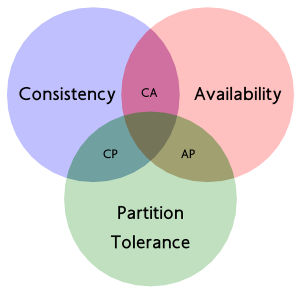

|选择|说明|
|------|--------|
|CA|放弃分区容错性，加强一致性和可用性，其实就是传统的单机数据库的选择；放弃P意味着放弃了系统的可扩展性，即单机应用；或者说只允许读写其中一部分|
|CP|放弃可用性；追求一致性和分区容错性；基本不会选择；网络问题会直接让整个系统不可用|
|AP|放弃一致性(这里说的一致性是强一致性；保留数据的最终一致性)；追求分区容错性和可用性；这是很多分布式系统设计时的选择|

* 需要注意的是对一个分布式系统而言；分区容错性是一个最基本的要求。因为既然是一个分布式系统，那么分布式系统中的组件必然需要被部署到不同的节点，否则也就无所谓分布式系统了。而对于分布式系统而言，网络问题又是一个必定会出现的异常情况；因此分区容错性也就成为了一个分布式系统必然需要面对和解决的问题；

* 一般分布式系统都是在一致性和可用性之间寻求平衡；

### 1.3、如何选择CAP

在分布式系统中，由于网络问题导致的网络分区是常态。也就是说出现网络分区时，根据 CAP 理论，需要在 A 和 C 中进行取舍，即要么保证系统的可用性，要么保证数据一致性；

这里需要要注意的一点是：上面说法的大前提，就是系统出现了网络分区，但实际情况是，在绝大多数时间里并不存在网络分区（网络不会经常出现问题）。那么还要进行三选二吗（CP 或者 AP）？

其实，不同的分布式系统要根据业务场景和业务需求在 CAP 三者中进行权衡。CAP 理论用于指导在系统设计时需要衡量的因素，而非进行绝对地选择

当网络没有出现分区时，CAP 理论并没有给出衡量 A 和 C 的因素，但如果你做过实际的分布式系统设计，一定会发现系统数据同步的时延（Latency），数据节点之间同步时间才是衡量 A 和 C 最重要的因素，此时就不会有绝对的 AP 模型还是 CP 模型了，而是源于对实际业务场景的综合考量；

### 1.4、PACELC

http://www.cs.umd.edu/~abadi/papers/abadi-pacelc.pdf

根据 PACELC 模型的定义，如果有网络分区产生，系统就必须在 A 和 C 之间取得平衡，否则（Else，即 PACELC 中的 E）当系统运行在无网络分区情况下，系统需要在 L（延迟）和 C 之间取得平衡

## 2、BASE理论

### 2.1、基本概念

- BASE是 Basically Available（基本可用）、Soft state（软状态）和 Eventually Consistent（最终一致性）三个短语的缩写；
- BASE理论是对CAP中一致性和可用性权衡的结果；
- 核心思想：即使无法做到强一致性，但每个应用都可以根据自身业务特点，采用适当的方式来使系统达到最终一致性；

BASE 中的基本可用指的是保障核心功能的基本可用，其实是做了`可用性`方面的妥协，比如：
- 电商网站在双十一大促等访问压力较大的时候，关闭商品排行榜等次要功能的展示，从而保证商品交易主流程的可用性，这也是我们常说的服务降级；
- 为了错开双十一高峰期，电商网站会将预售商品的支付时间延后十到二十分钟，这就是流量削峰；
- 在你抢购商品的时候，往往会在队列中等待处理，这也是常用的延迟队列。

### 2.2、BASE理论三要素

#### 2.2.1、基本可用

指分布式系统在出现不可预知故障的时候；允许损失部分可用性；但绝不等价于系统不可用.
- 响应时间上的损失：正常情况下，一个在线搜索引擎需要在0.5秒之内返回给用户相应的查询结果，但由于出现故障，查询结果的响应时间增加了1~2秒
- 功能上的损失：正常情况下，消费者在电商网站购物时都能顺利完成订单，但是大促购物高峰情况下，为了保护购物系统的稳定性，可能部分消费者会被引导到降级页面

#### 2.2.2、弱状态（软状态）

允许系统中的数据存在中间状态；并认为该中间状态的存在不会影响系统的整体可用性。即允许系统在不同节点的数据副本之间进行数据同步的过程存在延时；

#### 2.2.3、最终一致性

最终一致性强调的是所有的数据副本，在经过一段时间的同步之后，最终都能够达到一个一致的状态。最终一致性的本质是需要系统保证最终数据能够达到一致，而不需要实时保证系统数据的强一致性。

***最终一致性有如下五种类型变种：***
- 因果一致性：如果A进程在更新之后向B进程通知更新的完成，那么B的访问操作将会返回更新的值。如果没有因果关系的C进程将会遵循最终一致性的规则；
- 读己所写一致性：因果一致性的特定形式.一个进程总可以读到自己更新的数据；
- 会话一致性：读己所写一致性的特定形式.进程在访问存储系统同一个会话内，系统保证该进程读己之所写；
- 单调读一致性：如果一个进程已经读取到一个特定值，那么该进程不会读取到该值以前的任何值；
- 单调写一致性：系统保证对同一个进程的写操作串行化；

### 2.3、BASE与ACID

BASE理论面向的是大型高可用可扩展的分布式系统；和传统的事物ACID特性是相反的；它完全不同于ACID的强一致性模型；而是通过牺牲强一致性来获得可用性；并允许数据在一段时间内是不一致的；但最终达到一致状态。但同时，在实际的分布式场景中，不同业务单元和组件对数据一致性的要求是不同的；因此在具体的分布式系统架构设计过程中；ACID特性和BASE理论往往又会结合在一起

## 3、一致性协议

数据一致性问题：分布式系统为了提升可用性和性能，会通过复制技术来进行数据同步。复制机制的目的是为了保证数据的一致性。但是数据复制面临的主要难题也是如何保证多个副本之间的数据一致性。在分布式系统引入复制机制后，不同的数据节点之间由于网络延时等原因很容易产生数据不一致的情况

### 3.1、二阶段提交-2PC：Two-Phase Commit

为了使基于分布式系统架构下的所有节点在进行事务提交时保持一致性而设计的一种算法（Algorithm）目前绝大部分关系型数据库都是采用二阶段提交协议来完成分布式事务处理的。

#### 3.1.1、算法思路

在此协议中，一个事务管理器（Transaction Manager，简称 TM，也被称之为“协调者”）协调 1 个或多个资源管理器（Resource Manager，简称 RM，也被称之为“参与者”）的活动，所有资源管理器（参与者）向事务管理器（协调者）汇报自身活动状态，由事务管理器（协调者）根据各资源管理器（协调者）汇报的状态（完成准备或准备失败）来决定各资源管理器（协调者）是“提交”事务还是进行“回滚”操作；

二阶段提交的算法思路可以概括为：参与者将操作成败通知协调者，再由协调者根据所有参与者的反馈情报决定各参与者是否要提交操作还是中止操作

#### 3.1.2、二阶段提交协议过程

二阶段提交协议是将事务的提交过程分为了两个阶段来处理，第一阶段：准备阶段（投票阶段）和 第二阶段：提交阶段（执行阶段）

##### 3.1.2.1、阶段一：提交事务请求

事务协调者(事务管理器)给每个参与者(资源管理器)发送Prepare消息；每个参与者要么直接返回失败（如权限验证失败）；要么在本地执行事务；写本地的redo和undo日志；但不提交
- 事务询问：协调者向所有参与者发送事务内容；询问是否可以执行事务提交操作；并开始等待各参与者的响应;
- 执行事务：各参与者节点执行事务操作；并将undo和redo信息记录事务日志中；
- 各参与者向协调者反馈事务询问的响应：如果参与者执行了事务操作；那么就反馈给协调者Yes响应；表示事务可以执行；如果参与者没有成功执行事务；反馈no；表示事务不可以执行；

二阶段提交协议的阶段一被称为"投票阶段"

##### 3.1.2.2、阶段二：执行事务提交

在阶段二中，协调者会根据各参与者反馈情况来决定最终是否可以进行事务提交操作。正常情况下；包括以下两种可能：
- 执行事务提交：假如协调者从所有参与者获得的反馈都是Yes响应；那么就会执行事务提交
	* 发送提交请求：协调者向所有参与者节点发送 commit 请求;
	* 事务提交：参与者接收到commit请求后；会正式执行事务提交操作；并在完成提交之后释放整个事务执行期间占用的事务资源；
	* 反馈事务提交结果：参与者在完成事务提交之后；向协调者发送Ack消息;
	* 完成事务：协调者接收到所有参与者反馈的ack消息后；完成事务;
- 中断事务：如果有任何一个参与者反馈了no响应；或者在等待超时之后；协调者无法接收到所有参与者的反馈响应；则中断事务
	* 发送回滚请求：协调者向所有参与者节点发送rollback请求;
	* 事务回滚：参与者接收到rollback请求后；会利用其在阶段一中记录的undo信息来执行事务回滚操作；并释放资源;
	* 反馈事务回滚结果：参与者在完成事务回滚之后；向协调者发送ack消息.
	* 中断事务：协调者在接收到参与者反馈的ack消息后；完成事务中断;

#### 3.1.3、优缺点

- 优点：原理简单；实现方便
- 缺点：
	- 单点故障：由于协调者的重要性，一旦协调者发生故障，参与者会一直阻塞，尤其是在第二阶段，协调者发生故障，那么所有的参与者都处于锁定事务资源的状态中，而无法继续完成事务操作。
	- 同步阻塞：由于所有节点在执行操作时都是同步阻塞的，当参与者占有公共资源时，其他第三方节点访问公共资源不得不处于阻塞状态。
	- 数据不一致：在第二阶段中，当协调者向参与者发送提交事务请求之后，发生了局部网络异常或者在发送提交事务请求过程中协调者发生了故障，这会导致只有一部分参与者接收到了提交事务请求。而在这部分参与者接到提交事务请求之后就会执行提交事务操作。但是其他部分未接收到提交事务请求的参与者则无法提交事务。从而导致分布式系统中的数据不一致；
	- 因为要加锁，会导致两阶段提交存在一系列问题，最严重的就是死锁问题，一旦发生故障，数据库就会阻塞，尤其在提交阶段，如果发生故障，数据都还处于资源锁定状态，将无法完成后续的事务提交操作；
	- 其次是性能问题，数据库（如 MySQL ）在执行过程中会对操作的数据行执行数据行锁，如果此时其他的事务刚好也要操作被锁定的数据行，那它们就只能阻塞等待，使分布式事务出现高延迟和性能低下；

### 3.2、三阶段提交-3PC：Three-phase Commit

是2PC的改进版；其将二阶段提交协议中的"提交事务请求"过程一分为二，形成了`CanCommit、PreCommit`和`doCommit`三个阶段来完成事务处理协议。

对应于2PC，3PC有两个改动点：
- 引入超时机制：同时在协调者和参与者中都引入超时机制。
：在两阶段提交的第一阶段与第二阶段之间插入了一个准备阶段，使得原先在两阶段提交中，参与者在投票之后，由于协调者发生崩溃或错误而导致参与者处于无法知晓是否提交或者中止的“不确定状态”所产生的可能相当长的延时的问题得以解决

#### 3.2.1、阶段一：CanCommit

- 事务询问：协调者向所有的参与者发送一个包含事务内容的canCommit请求，询问是否可以执行事务提交操作，并开始等待各参与者的响应;
- 各参与者向协调者反馈事务询问的响应：参与者在接收到来自协调者的canCommit请求后；正常情况下，如果其认为自身可以顺序执行事务，会反馈Yes响应，并进入预备状态；否则反馈no响应

#### 3.2.2、阶段二：PreCommit

在阶段二中；协调者会根据各参与者的反馈情况来决定时代可以进行事务的PreCommit操作。正常情况下；有两种可能：
- 执行事务预提交：假如协调者从参与者中获得的反馈都是Yes响应，那么执行事务预提交
	* 发送预提交请求：协调者向所有参与者节点发出PreCommit请求，并进入Prepared阶段;
	* 事务预提交：参与者收到PreCommit请求后，会执行事务操作，并将undo和redo信息记录到事务日志中;
	* 各参与者向协调者反馈事务执行的响应：如果参与者成功执行了事务操作，那么就会反馈给协调者ack响应，同时等到最终指令：提交或中止;

- 中断事务：假如任何一个参与者向协调者反馈了no响应，或者等待超时之后，协调者尚无法接收到所有参与者的反馈响应；那么就会中断事务
	* 发送中断请求：协调者向所有参与者节点发送abort请求;
	* 中断事务：无论是收到来自协调者的abort请求，或者是在等待协调者请求过程中出现超时，参与者都会中断事务;

#### 3.2.3、阶段三：doCommit

该阶段将进行真正的事务提交
- 执行提交
	* 发送提交请求：进入这一阶段；假设协调者处于正常工作状态，并且它收到了来自所有参与者的ack响应，那么它将从“预提交”状态转为“提交”状态；并向所有参与者发送doCommit请求;
	* 事务提交：参与者接收到doCommit请求后，会正式执行事务提交操作，并在完成提交之后释放占用的事务资源；
	* 反馈提交结果：参与者在完成事务提交后，向协调者发送ack消息；
	* 完成事务：协调者接收到所有参与者的ack消息后，完成事务；

- 中断事务：进入这一阶段，假设协调者处于正常工作状态，并且任意一个参与者向协调者反馈了no相应，或者在等待超时之后，那么就会中断事务
	* 发送中断请求
	* 事务回滚
	* 反馈事务回滚结果
	* 中断事务

*注意：一旦进入阶段三；可能出现如下故障：*
- 协调者出现问题
- 协调者与参与者之间的网络出现故障

#### 3.2.4、优缺点

- 优点：想较于二阶段提交协议，3PC主要解决的单点故障问题，并减少阻塞，因为一旦参与者无法及时收到来自协调者的消息之后，它会默认commit。
- 缺点：在去除阻塞的同时引入了新的问题：数据一致性问题，由于网络原因，协调者发送的abort响应没有被参与者及时收到，那么参与者在等待超时之后执行了commit操作，但其他参与者执行了事务回滚操作，这样导致了参与者之间数据不一致问题

### 3.3、总结

通过上述2PC和3PC，可以知道无论是二阶段还是三阶段提交协议，都无法彻底解决分布式的一致性问题。只有一种一致性算法，那就是Paxos。

## 4、Paxos算法

Paxos算法是基于消息传递且具有高度容错特性的一致性算法，是目前公认的解决分布式一致性问题最有效的算法之一

- [Paxos算法原理与推导](https://www.cnblogs.com/linbingdong/p/6253479.html)
- [带你一步步走入Paxos的世界](https://mp.weixin.qq.com/s/cQJjAOuDKYFnujNE_6OD0Q)

## 5、zab协议

被应用在 zookeeper 中，业界使用广泛，但没用抽象成通用 library

## 6、Raft协议

- [Raft协议](https://raft.github.io/)
- [Raft协议文档](分布式协议/Raft/raft.pdf)
- [阿里基于Raft的实现](https://github.com/sofastack/sofa-jraft)
- [Raft协议文档中文版](https://github.com/maemual/raft-zh_cn)
- [一文理解Raft](https://mp.weixin.qq.com/s/PxS0MLmwZZS5nMp3rBnZVQ)

Raft协议是一种共识算法

### 6.1、特点

Strong Leader
- 系统中必须存在且同一时刻只能有一个 leader，只有 leader 可以接受 clients 发过来的请求；
- Leader 负责主动与所有 followers 通信，负责将“提案”发送给所有followers，同时收集多数派的 followers 应答；
- Leader 还需向所有 followers 主动发送心跳维持领导地位（保持存在感）；

> 另外，身为 leader 必须保持一直 heartbeat 的状态；

Raft 是 Multi Paxos 的一种实现，是通过一切以领导者为准的方式，实现一系列值的共识，然而不是所有节点都能当选 Leader 领导者，Raft 算法对于 Leader 领导者的选举是有限制的，只有最全的日志节点才可以当选

### 6.2、复制状态机

### 6.3、基本概念

Raft-node 的 3 种角色/状态

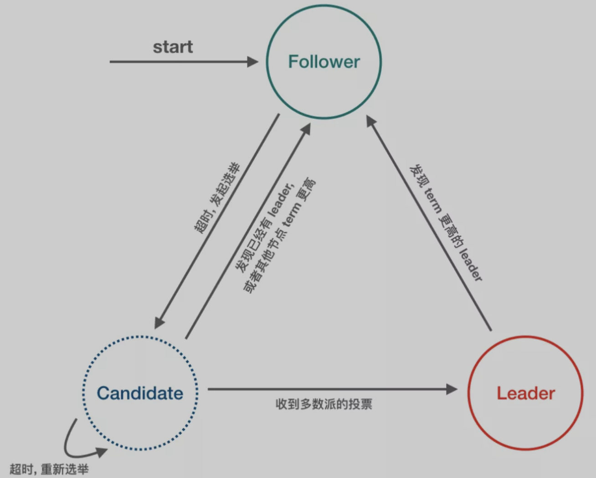

- Follower：完全被动，不能发送任何请求, 只接受并响应来自 leader 和 candidate 的 message, node启动后的初始状态必须是 follower。
- Leader：处理所有来自客户端的请求，以及复制 log 到所有 followers。
- Candidate：用来竞选一个新 leader (candidate 由 follower 触发超时而来)。

## 7、拜占庭将军问题

https://github.com/XChainLab/documentation/blob/master/consensus/consensus.byzantine.generals.md

拜占庭帝国，即中世纪的东罗马帝国，拥有巨大的财富，周围10个邻邦垂诞已久。但拜占庭高墙耸立，固若金汤，没有一个单独的邻邦能够成功入侵。任何单个邻邦入侵都会失败，同时也有可能自身被其他9个邻邦入侵。拜占庭帝国防御能力如此之强，至少要有十个邻邦中的一半以上同时进攻，才有可能攻破。然而，如果其中的一个或者几个邻邦事先答应好一起进攻，但实际过程出现背叛，那么入侵者可能都会被歼灭。于是每一方都小心行事，不敢轻易相信邻国。这就是拜占庭将军问题；

在这个问题里，各邻国最重要的事情是：所有将军如何能够达成共识去攻打拜占庭帝国。这些将军需要实现某一个统一的目标，一致进攻或者一致撤退，但是单独行动却又可能面临失败，所以必须达成共识，一致合作。由于叛徒的存在，将军们缺乏达成一致的有效途径。这里的“一致性”才是拜占庭将军问题需要探讨的内容，假如本来叛徒数量就已经多到了问题无解的地步，那么这个就是“反叛”的问题了。同时我们的目标是忠诚的将军能够达成一致，对于这些忠诚的将军来说，进攻或者撤退都是可以的，只要他们能够达成一致就可以

## 8、脑裂问题

### 8.1、概述

在Elasticsearch、ZooKeeper这些集群环境中，有一个共同的特点，就是它们有一个“大脑”。比如，Elasticsearch集群中有Master节点，ZooKeeper集群中有Leader节点。

集群中的Master或Leader节点往往是通过选举产生的。在网络正常的情况下，可以顺利的选举出Leader（后续以Zookeeper命名为例）。但当两个机房之间的网络通信出现故障时，选举机制就有可能在不同的网络分区中选出两个Leader。当网络恢复时，这两个Leader该如何处理数据同步？又该听谁的？这也就出现了“脑裂”现象；

定义：在一个高可用系统中，当联系着的节点断开联系时，本来为一个整体的系统，分裂成两个独立节点，两个节点开始争抢共享资源造成系统混乱、数据损坏的现象，成为“脑裂”；

### 8.2、成因

主要原因: 心跳检测做准备切换时的“不确定性”

当网络原因，导致心跳检测超时，主备切换的情况下，此时slave已经开始提供服务。但是后续之前被判定“死”的master由于网络恢复重新“复活”，此时系统存在两个“主”，发生脑裂问题；

### 8.3、解决思路

- 设置仲裁机制；
- lease机制；
- 设置隔离机制

# 三、分布式事务

* [分布式事务框架压测](http://springcloud.cn/view/374)
* [分布式事务](https://honeypps.com/architect/introduction-of-distributed-transaction/)
* [分布式事务](https://www.cnblogs.com/savorboard/p/distributed-system-transaction-consistency.html)
* [常见的分布式事务解决方案](https://juejin.im/post/5aa3c7736fb9a028bb189bca)
* [分布式服务系统一致性](https://blog.csdn.net/rickiyeat/article/details/70224722)
* [深入理解分布式事务](http://www.codeceo.com/article/distributed-transaction.html)
* [分布式事务：柔性事务](https://www.hollischuang.com/archives/2591)
* [分布式事务在Sharding-Sphere中的实现](https://www.itcodemonkey.com/article/6967.html)

## 1、事务

事务：一般是指要做的或所做的事情；一个数据库事务通常包含对数据库进行读或写的一个操作序列；用来保证一组数组操作的完整性和一致性

事务应该具有4个属性：原子性、一致性、隔离性、持久性。这四个属性通常称为ACID特性。

事务的核心：锁与并发

### 1.1、事务类型

Java事务的类型有三种：JDBC事务、JTA(Java Transaction API)事务、容器事务
- JDBC事务：在JDBC中是通过Connection对象进行事务管理。在JDBC中，常用的和事务相关的方法是： setAutoCommit、commit、rollback；

	JDBC事务有一个局限：一个 JDBC 事务不能跨越多个数据库

- JTA事务：
	- 为什么需要JTA事务：由于JDBC无法实现分布式事务，而如今的分布式场景越来越多，所以，JTA事务就应运而生；
	- Java事务API（Java Transaction API，简称JTA ） 是一个Java企业版 的应用程序接口，在Java环境中，允许完成跨越多个XA资源的分布式事务
	- JTA和它的同胞Java事务服务(JTS；Java TransactionService)，为J2EE平台提供了分布式事务服务
	- 常见的JTA实现有以下几种：
		- J2EE容器所提供的JTA实现(JBoss)
		- 独立的JTA实现：如JOTM，Atomikos.这些实现可以应用在那些不使用J2EE应用服务器的环境里用以提供分布事事务保证。如Tomcat,Jetty以及普通的java应用。
	- JTA对DataSource、Connection和Resource 都是有要求的，只有符合XA规范，并且实现了XA规范的相关接口的类才能参与到JTA事务中来
	- 要想使用用 JTA 事务，那么就需要有一个实现 javax.sql.XADataSource 、 javax.sql.XAConnection 和 javax.sql.XAResource 接口的 JDBC 驱动程序。一个实现了这些接口的驱动程序将可以参与 JTA 事务。一个 XADataSource 对象就是一个 XAConnection 对象的工厂。XAConnection 是参与 JTA 事务的 JDBC 连接。要使用JTA事务，必须使用XADataSource来产生数据库连接，产生的连接为一个XA连接。XA连接（javax.sql.XAConnection）和非XA（java.sql.Connection）连接的区别在于：XA可以参与JTA的事务，而且不支持自动提交；
	- 提供了分布式事务的解决方案，严格的ACID；但是实现复杂，通常情况下，JTA UserTransaction需要从JNDI获取。这意味着，如果我们使用JTA，就需要同时使用JTA和JNDI；JTA本身就是个笨重的API；通常JTA只能在应用服务器环境下使用，因此使用JTA会限制代码的复用性

- 容器事务：常见的容器事务如Spring事务，容器事务主要是J2EE应用服务器提供的，容器事务大多是基于JTA完成，这是一个基于JNDI的，相当复杂的API实现

### 1.2、分布式事务

分布式事务：将多个节点的事务看成一个整体处理

## 2、全局事务

所谓全局事务，是指分布式事务处理环境中，多个数据库可能需要共同完成一个工作，这个工作即是一个全局事务，例如，一个事务中可能更新几个不同的数据库。对数据库的操作发生在系统的各处但必须全部被提交或回滚；即：`全局事务是由资源管理器管理和协调的事务`，标准的分布式事务；

全局事务是一个DTP模型的事务；所谓DTP模型指的是`X/Open DTP(X/Open Distributed Transaction Processing Reference Model)`，是X/Open 这个组织定义的一套分布式事务的标准，也就是了定义了规范和API接口，由这个厂商进行具体的实现

X/Open DTP 定义了三个组件：AP，TM，RM 和两个协议：XA、TX：
- AP(Application Program)：也就是应用程序，可以理解为使用DTP的程序，AP定义事务边界（定义事务开始和结束）并访问事务边界内的资源
- RM(Resource Manager)：资源管理器，这里可以理解为一个DBMS系统，或者消息服务器管理系统，应用程序通过资源管理器对资源进行控制。
- TM(Transaction Manager)：事务管理器，负责协调和管理事务，提供给AP应用程序编程接口以及管理资源管理器。负责管理全局事务，分配全局事务标识，监控事务的执行进度，并负责事务的提交、回滚、失败恢复等
- XA协议：应用或应用服务器与事务管理之间通信的接口
- TX协议：全局事务管理器与资源管理器之间通信的接口

事务管理器控制着全局事务，管理事务生命周期，并协调资源。资源管理器负责控制和管理实际资源

### 2.1、XA协议

- XA规范主要定义了(全局)事务管理器(TM)和(局部)资源管理器(RM)之间的接口。主流的关系型数据库产品都是实现了XA接口的；在XA规范中，数据库充当RM角色，应用需要充当TM的角色，即生成全局的txId，调用XAResource接口，把多个本地事务协调为全局统一的分布式事务

- XA接口是双向的系统接口，在事务管理器 (TM)以及一个或多个资源管理器(RM)之 间形成通信桥梁；

二阶段提交其实就是实现XA分布式事务的关键(确切地说：两阶段提交主要保证了分布式事务的原子性：即所有结点要么全做要么全不做)

mysql5.7及以上都支持XA协议

#### 2.1.1、一阶段提交：弱XA


弱XA通过去掉XA的Prepare阶段，以达到减少资源锁定范围而提升并发性能的效果。

典型的实现为在一个业务线程中，遍历所有的数据库连接，依次做commit或者rollback。弱XA同本地事务相比，性能损耗低，但在事务提交的执行过程中，若出现网络故障、数据库宕机等预期之外的异常，将会造成数据不一致，且无法进行回滚。基于弱XA的事务无需额外的实现成本

#### 2.1.2、二阶段提交：2PC

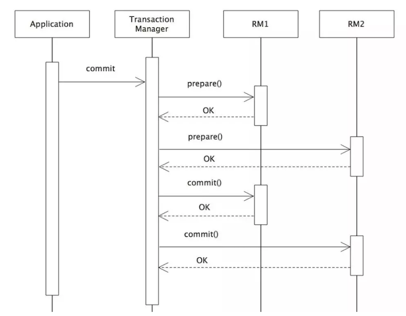

二阶段提交是XA的标准实现。它将分布式事务的提交拆分为2个阶段：`prepare`和`commit/rollback`；

开启XA全局事务后，所有子事务会按照本地默认的隔离级别锁定资源，并记录undo和redo日志，然后由TM发起prepare投票，询问所有的子事务是否可以进行提交：当所有子事务反馈的结果为“yes”时，TM再发起commit；若其中任何一个子事务反馈的结果为“no”，TM则发起rollback；如果在prepare阶段的反馈结果为yes，而commit的过程中出现宕机等异常时，则在节点服务重启后，可根据XA recover再次进行commit补偿，以保证数据的一致性；

2PC模型中，在prepare阶段需要等待所有参与子事务的反馈，因此可能造成数据库资源锁定时间过长，不适合并发高以及子事务生命周长较长的业务场景；

### 2.2、全局事务的实现

- JTA(Java Transaction API)：面向应用、应用服务器与资 源管理器的高层事务接口。
- JTS(Java Transaction Service)：JTA事务管理器的实现标 准，向上支持JTA，向下通过CORBA OTS实现跨事务域的互 操作性。
- EJB：基于组件的应用编程模型，通过声明式事务管理进一步 简化事务应用的编程。

### 2.3、优缺点

- 优点：严格的ACID，即强一致性；
- 缺点：效率非常低
	- 全局事务方式下，全局事务管理器(TM)通过XA接口使用二阶段提交协议( 2PC )与资源层(如数据 库)进行交互。使用全局事务，数据被Lock的时间跨整个事务，直到全局事务结束；
	- 2PC 是反可伸缩模式，在事务处理过程中，参与者需要一直持有资源直到整个分布式事务结束。这样， 当业务规模越来越大的情况下，2PC 的局限性就越来越明显，系统可伸缩性会变得很差；
	- 与本地事务相比，XA 协议的系统开销相当大，因而应当慎重考虑是否确实需要分布式事务。而且只有 支持 XA 协议的资源才能参与分布式事务；
	- 强依赖于数据库

## 3、柔性事务

柔性事务是对XA协议的妥协和补偿，它通过对强一致性要求的降低，以达到降低数据库资源锁定时间的效果；

柔性事务保证的事`基本可用，最终一致`。这其实就是基于BASE理论，保证数据的最终一致性。

虽然柔性事务并不像刚性事务那样完全遵循ACID，但是，也是部分遵循ACID的；关于ACID四个属性，柔性事务的支撑程度：

	原子性：严格遵循
	一致性：事务完成后的一致性严格遵循；事务中的一致性可适当放宽
	隔离性：并行事务间不可影响；事务中间结果可见性允许安全放宽
	持久性：严格遵循

关于柔性事务，最主要的有以下三种类型：异步确保型、补偿型、最大努力通知型。

以下柔性事务的模式

### 3.1、可查询操作

几乎是所有的分布式解决方案都需要的。在分布式事务执行过程中，如果某一个步骤执行出错，就需要明确的知道其他几个操作的处理情况，这就需要其他的服务都能够提供查询接口，保证可以通过查询来判断操作的处理情况。

为了保证操作的可查询，需要对于每一个服务的每一次调用都有一个全局唯一的标识，可以是业务单据号（如订单号）、也可以是系统分配的操作流水号（如支付记录流水号）。除此之外，操作的时间信息也要有完整的记录

### 3.2、幂等操作

其任意多次执行所产生的影响均与一次执行的影响相同；要保证数据的最终一致性，很多解决防范都会有很多重试的操作，如果一个方法不保证幂等，那么将无法被重试

幂等操作的实现方式有多种，如在系统中缓存所有的请求与处理结果、检测到重复操作后，直接返回上一次的处理结果等

### 3.3、可补偿操作

在分布式事务中，要想进行rollback，就需要提供可补偿操作。并且，补偿操作同时也需要满足幂等性。

### 3.4、TCC操作

TCC 即 Try-Confirm-Cancel。

- Try：尝试执行业务，完成所有业务检查(一致性) 预留必须业务资源(准隔离性)；
- Confirm：确认执行业务，真正执行业务，不作任何业务检查，只使用Try阶段预留的业务资源；因此，只要Try操作成功，Confirm必须能成功。另外，Confirm操作需满足幂等性，保证分布式事务有且只能成功一次
- Cancel：取消执行业务，释放Try阶段预留的业务资源；Cancel操作要满足幂等性

这种类型和可补偿操作类似，就是提供一种提交和回滚的机制。是一种典型的两阶段类型的操作。这里说的两阶段类型操作并不是指2PC，他和2PC还是有区别的：
- TCC位于业务服务层而非资源层；
- TCC没有单独的准备(Prepare)阶段
- Try操作兼备资源操作与准备能力
- Try操作可以灵活选择业务资源的锁定粒度(以业务定粒度) TCC有较高开发成本

## 4、柔性事务的解决方案

### 4.1、TCC事务补偿型方案

TCC分布式事务模型相对于 XA 等传统模型，其特征在于它不依赖资源管理器（RM）对分布式事务的支持，而是通过对业务逻辑的分解来实现分布式事务

也属于两阶段型的一种实现，但区别于2PC协议的两阶段提交，TCC 其实就是采用的补偿机制，其核心思想是：针对每个操作，都要注册一个与其对应的确认和补偿（撤销）操作。它分为三个阶段：
- Try 阶段主要是对业务系统做检测及资源预留
- Confirm 阶段主要是对业务系统做确认提交，Try阶段执行成功并开始执行 Confirm阶段时，默认 Confirm阶段是不会出错的。即：只要Try成功，Confirm一定成功。
- Cancel 阶段主要是在业务执行错误，需要回滚的状态下执行的业务取消，预留资源释放。

**优点：** 跟2PC比起来，实现以及流程相对简单了一些，但数据的一致性比2PC也要差一些

**缺点：** 缺点还是比较明显的，在2、3步中都有可能失败。TCC属于应用层的一种补偿方式，所以需要程序员在实现的时候多写很多补偿的代码，在一些场景中，一些业务流程可能用TCC不太好定义及处理。
- 空回滚问题：如果try失败了，那么二阶段回滚时；
- 悬挂：一阶段产生网络拥堵，二阶段回滚；
- 幂等性问题：

比较适合对数据一致性要求特别高的场景；

### 4.2、本地消息表

核心思想是将分布式事务拆分成本地事务进行处理，基本思路就是：
- 消息生产方，需要额外建一个消息表，并记录消息发送状态。**消息表和业务数据要在一个事务里提交**，也就是说他们要在一个数据库里面。然后消息会经过MQ发送到消息的消费方。如果消息发送失败，会进行重试发送。
- 消息消费方，需要处理这个消息，并完成自己的业务逻辑。此时如果本地事务处理成功，表明已经处理成功了，如果处理失败，那么就会重试执行。如果是业务上面的失败，可以给生产方发送一个业务补偿消息，通知生产方进行回滚等操作。
- 生产方和消费方定时扫描本地消息表，把还没处理完成的消息或者失败的消息再发送一遍。如果有靠谱的自动补偿逻辑，这种方案还是非常实用的。
- 设置一定的重试次数，重试间隔时间根据重试次数而指数或者线性增长，若达到最大重试次数后记录日志，我们可以根据记录的日志来通过邮件或短信来发送告警通知，接收到告警通知后及时介入人工处理即可；

这种方案遵循BASE理论，采用的是最终一致性，这几种方案里面比较适合实际业务场景的，即不会出现像2PC那样复杂的实现(当调用链很长的时候，2PC的可用性是非常低的)，也不会像TCC那样可能出现确认或者回滚不了的情况。

**优点：**一种非常经典的实现，避免了分布式事务，实现了最终一致性。

**缺点：**消息表会耦合到业务系统中，如果没有封装好的解决方案，会有很多杂活需要处理，比如重试时的幂等性操作；

### 4.3、可靠消息的一致性：异步确保型

其是基于MQ来实现的，比如RocketMQ，大致处理流程：
- 在系统A处理任务A前，首先向消息中间件发送一条Prepared消息，如果这个Prepare消息发送失败，那么就直接取消操作，后续的操作也都不再执行
- 消息中间件收到后将该条消息持久化，但并不投递。此时下游系统B仍然不知道该条消息的存在。
- 消息中间件持久化成功后，便向系统A返回一个确认应答；
- 系统A收到确认应答后，则可以开始处理任务A，执行自身的本地事务；
- 任务A处理完成后，向消息中间件发送Commit请求。该请求发送完成后，对系统A而言，该事务的处理过程就结束了，此时它可以处理别的任务了；如果处理失败了，则向消息中间件发送回滚操作；
- 但commit消息可能会在传输途中丢失，从而消息中间件并不会向系统B投递这条消息，从而系统就会出现不一致性。这个问题由消息中间件的事务回查机制完成。
- 消息中间件收到Commit指令后，便向系统B投递该消息，从而触发任务B的执行；
- 当任务B执行完成后，系统B向消息中间件返回一个确认应答，告诉消息中间件该消息已经成功消费，此时，这个分布式事务完成

系统A除了实现正常的业务流程外，还需提供一个事务询问的接口，供消息中间件调用。当消息中间件收到一条事务型消息后便开始计时，如果到了超时时间也没收到系统A发来的Commit或Rollback指令的话，就会主动调用系统A提供的事务询问接口询问该系统目前的状态。该接口会返回三种结果：
- 提交：若获得的状态是“提交”，则将该消息投递给系统B。
- 回滚：若获得的状态是“回滚”，则直接将条消息丢弃。
- 处理中：若获得的状态是“处理中”，则继续等待

消息中间件的超时询问机制能够防止上游系统因在传输过程中丢失Commit/Rollback指令而导致的系统不一致情况，而且能降低上游系统的阻塞时间，上游系统只要发出Commit/Rollback指令后便可以处理其他任务，无需等待确认应答。而Commit/Rollback指令丢失的情况通过超时询问机制来弥补，这样大大降低上游系统的阻塞时间，提升系统的并发度。

针对有可能MQ服务宕机的问题，系统A在发送消息前必须记录消息，还需要有定时任务，轮询未收到确认答复的消息，重新发送；

到底是先发消息还是先执行任务A：
- 先发消息：
	- 如果发送消息失败了，那么整个流程结束；
	- 如果发送消息成功，但是执行任务A失败，那么MQ没有收到消息的commit或者rollback，那么通过事务回查，发现回滚了，则丢弃消息；
- 先执行任务A：
	- 如果任务A执行失败，那么整个流程结束；
	- 如果任务A执行成功，但发生消息失败了，可以将任务与发送消息放在一个事务内；如果不在一个事务，那么也可以通过消息记录表来处理未发送的消息；

### 4.4、最大努力通知型方案

- 上游系统在完成任务后，向消息中间件同步地发送一条消息，确保消息中间件成功持久化这条消息，然后上游系统可以去做别的事情了；
- 消息中间件收到消息后负责将该消息同步投递给相应的下游系统，并触发下游系统的任务执行；
- 当下游系统处理成功后，向消息中间件反馈确认应答，消息中间件便可以将该条消息删除，从而该事务完成

上面过程在实际场景中可能存在下列意外情况：
- （1）消息中间件向下游系统投递消息失败
- （2）上游系统向消息中间件发送消息失败
- （3）MQ 自动应答机制导致的消息丢失

第一种情况：消息中间件具有重试机制。可以在消息中间件中设置消息的重试次数和重试时间间隔，对于网络不稳定导致的消息投递失败的情况，往往重试几次后消息便可以成功投递，如果超过了重试的上限仍然投递失败，那么消息中间件不再投递该消息，而是记录在失败消息表中，消息中间件需要提供失败消息的查询接口，下游系统会定期查询失败消息，并将其消费，这就是所谓的“定期校对”

第二种情况：对于第二种情况，需要在上游系统中建立消息重发机制。可以在上游系统建立一张本地消息表，并将 任务处理过程 和 向本地消息表中插入消息 这两个步骤放在一个本地事务中完成

第三种情况：比如RocketMQ、Kafka都有手动ack的机制，采取编程的方式手动发送应答，也就是消费成功后，MQ才能删除这条持久化消息；

适用于一些最终一致性时间敏感度低的业务，且被动方处理结果不影响主动方的处理结果。典型的使用场景：如支付通知、短信通知等

### 4.5、SAGA事务模型

Saga事务模型又叫做长时间运行的事务（Long-running-transaction）

该模型其核心思想就是拆分分布式系统中的长事务为多个短事务，或者叫多个本地事务，然后由 Sagas 工作流引擎负责协调，如果整个流程正常结束，那么就算是业务成功完成，如果在这过程中实现失败，那么Sagas工作流引擎就会以相反的顺序调用补偿操作，重新进行业务回滚；

分布式事务执行过程中，依次执行各参与者的正向操作，如果所有正向操作均执行成功，那么分布式事务提交。如果任何一个正向操作执行失败，那么分布式事务会去退回去执行前面各参与者的逆向回滚操作，回滚已提交的参与者，使分布式事务回到初始状态

Saga模式下分布式事务通常是由事件驱动的，各个参与者之间是异步执行的，Saga 模式是一种长事务解决方案，但是Saga模式不保证事务的隔离性；

Saga模式适用于业务流程长且需要保证事务最终一致性的业务系统，Saga模式一阶段就会提交本地事务，无锁、长流程情况下可以保证性能。事务参与者可能是其它公司的服务或者是遗留系统的服务，无法进行改造和提供TCC要求的接口，也可以使用Saga模式；

Saga模式所具备的优势有：一阶段提交本地数据库事务，无锁，高性能；参与者可以采用事务驱动异步执行，高吞吐；补偿服务即正向服务的“反向”，易于理解、易于实现；不过，Saga 模式由于一阶段已经提交本地数据库事务，且没有进行“预留”动作，所以不能保证隔离性；

## 5、分布式事务现有框架

### 5.1、框架

- [LCN](https://www.txlcn.org/)
- [EasyTransction](https://github.com/QNJR-GROUP/EasyTransaction)
- [seata](https://github.com/seata/seata)
- [tcc-transaction](https://github.com/changmingxie/tcc-transaction)
- mycat 在1.5之后的版本也支持分布式事务；
- sharding-jdbc支持分布式事务，默认开启了分布式事务

	其主要是通过事务拦截器：CompensableTransactionInterceptor、ResourceCoordinatorInterceptor来实现的
	- CompensableTransactionInterceptor主要功能：构建事务上下文、将事务区分为Root事务和分支事务、注册和清除事务管理器中的内容。

		其中Root事务的处理流程大概如下：
		* 1、开启全局事务
		* 2、持久化全局事务
		* 3、注册全局事务
		* 4、判断是confirm还是cancel
		* 5、清除事务
	- ResourceCoordinatorInterceptor主要是处理try阶段的工作、将所有资源封装完成并交给事务管理器，事务资源包括：
		- confirm上下文
		- cancel上下文；
		- 分支事务信息

### 5.1、Seata

- [官方文档](https://seata.io/zh-cn/)

Seata 的设计思路是将一个分布式事务可以理解成一个全局事务，下面挂了若干个分支事务，而一个分支事务是一个满足 ACID 的本地事务，因此我们可以操作分布式事务像操作本地事务一样

Seata 内部定义了 3个模块来处理全局事务和分支事务的关系和处理过程，分别是 TM（事务管理器）、RM（资源管理器） 和 TC（事务协调器）。其中 TM 和 RM 是作为 Seata 的客户端与业务系统集成在一起，TC 作为 Seata 的服务端独立部署。
- Transaction Coordinator（TC）：事务协调器，维护全局事务的运行状态，负责协调并驱动全局事务的提交或回滚。
- Transaction Manager（TM）：控制全局事务的边界，负责开启一个全局事务，并最终发起全局提交或全局回滚的决议。
- Resource Manager（RM）：控制分支事务，负责分支注册、状态汇报，并接收事务协调器的指令，驱动分支（本地）事务的提交和回滚

**整个事务的处理流程:**
- （1）TM 向 TC 申请开启一个全局事务，TC 创建全局事务后返回全局唯一的 XID，XID 会在全局事务的上下文中传播；
- （2）RM 向 TC 注册分支事务，该分支事务归属于拥有相同 XID 的全局事务；
- （3）TM 要求TC提交或回滚XID的相应全局事务。
- （4）TC 在XID的相应全局事务下驱动所有分支事务以完成分支提交或回滚。

Seata 会有 4 种分布式事务解决方案，分别是 AT 模式、TCC 模式、Saga 模式和 XA 模式

#### 5.1.1、Seata-AT模式

Seata 的事务提交方式跟 XA 协议的两段式提交在总体上来说基本是一致的，不同：
- XA 协议它依赖的是数据库层面来保障事务的一致性，也即是说 XA 的各个分支事务是在数据库层面上驱动的，由于 XA 的各个分支事务需要有 XA 的驱动程序，一方面会导致数据库与 XA 驱动耦合，另一方面它会导致各个分支的事务资源锁定周期长；
- 在使用 Seata 时，我们使用的数据源实际上用的是 Seata 自带的数据源代理 DataSourceProxy，Seata 在这层代理中加入了很多逻辑，主要是解析 SQL，把业务数据在更新前后的数据镜像组织成回滚日志，并将 undo log 日志插入 undo_log 表中，保证每条更新数据的业务 SQL都有对应的回滚日志存在；

	本地事务执行完可以立即释放本地事务锁定的资源，然后向 TC 上报分支状态。当 TM 决议全局提交时，就不需要同步协调处理了，TC 会异步调度各个 RM 分支事务删除对应的 undo log 日志即可，这个步骤非常快速地可以完成；当 TM 决议全局回滚时，RM 收到 TC 发送的回滚请求，RM 通过 XID 找到对应的 undo log 回滚日志，然后执行回滚日志完成回滚操作

AT模式如何做到对业务无侵入，又是如何执行提交和回滚的呢？

**一阶段**

Seata 的 JDBC 数据源代理通过对业务 SQL 的解析，把业务数据在更新前后的数据镜像组织成回滚日志（undo log），利用本地事务的 ACID 特性，将业务数据的更新和回滚日志的写入在同一个本地事务中提交。这样可以保证任何提交的业务数据的更新一定有相应的回滚日志存在，最后对分支事务状态向 TC 进行上报。基于这样的机制，分支的本地事务便可以在全局事务的第一阶段提交，马上释放本地事务锁定的资源

**第二阶段**

- 如果决议是全局提交，此时分支事务此时已经完成提交，不需要同步协调处理（只需要异步清理回滚日志），第二阶段可以非常快速地结束；
- 如果决议是全局回滚，RM收到协调器发来的回滚请求，通过XID和Branch ID找到相应的回滚日志记录，通过回滚记录生成反向的更新SQL并执行，以完成分支的回滚；

**写隔离**

Seata AT 模式引入全局锁机制来实现隔离。全局锁是由 Seata 的 TC 维护的，事务中涉及的数据的锁
- 第一阶段本地事务提交前，需要确保先拿到全局锁；
- 拿不到全局锁，不能提交本地事务；
- 拿全局锁的尝试被限制在一定范围内，超出范围将放弃，并回滚本地事务，释放本地锁；

以一个示例来说明。两个全局事务tx1和tx2，分别对a表的m字段进行更新操作，m的初始值1000。tx1先开始，开启本地事务拿到本地锁，更新操作 m = 1000 - 100 = 900。本地事务提交前，先拿到该记录的全局锁，本地提交释放本地锁。 tx2后开始，开启本地事务拿到本地锁，更新操作 m = 900 - 100 = 800。本地事务提交前，尝试拿该记录的全局锁，tx1全局提交前，该记录的全局锁被 tx1持有，tx2需要重试等待全局锁；

tx1 第二阶段全局提交，释放全局锁 。tx2拿到全局锁提交本地事务。如果tx1的第二阶段全局回滚，则tx1需要重新获取该数据的本地锁，进行反向补偿的更新操作，实现分支的回滚。此时如果tx2仍在等待该数据的全局锁，同时持有本地锁，则tx1的分支回滚会失败。分支的回滚会一直重试，直到tx2的全局锁等锁超时，放弃全局锁并回滚本地事务释放本地锁，tx1 的分支回滚最终成功。

**读隔离**

在数据库本地事务隔离级别为`读已提交`（READ COMMITTED）或以上的基础上，Seata（AT模式）的默认全局隔离级别是`读未提交`（READ UNCOMMITTED）。如果应用在特定场景下，必需要求全局的读已提交，目前Seata的方式是通过SELECT FOR UPDATE语句的代理；

SELECT FOR UPDATE语句的执行会申请全局锁 ，如果全局锁被其他事务持有，则释放本地锁（回滚SELECT FOR UPDATE语句的本地执行）并重试。这个过程中，查询是被阻塞 住的，直到全局锁拿到，即读取的相关数据是已提交的，才返回；

**总结**

全局锁是由 TC 也就是服务端来集中维护，而不是在数据库维护的。这样做有两点好处：一方面，锁的释放非常快，尤其是在全局提交的情况下收到全局提交的请求，锁马上就释放掉了，不需要与 RM 或数据库进行一轮交互；另外一方面，因为锁不是数据库维护的，从数据库层面看数据没有锁定。这也就是给极端情况下，业务降级提供了方便，事务协调器异常导致的一部分异常事务，不会阻塞后面业务的继续进行。

AT模式基于本地事务的特性，通过拦截并解析 SQL 的方式，记录自定义的回滚日志，从而打破 XA 协议阻塞性的制约，在一致性、性能、易用性三个方面取得一定的平衡：在达到确定一致性（非最终一致）的前提下，即保障一定的性能，又能完全不侵入业务。在很多应用场景下，Seata的AT模式都能很好地发挥作用，把应用的分布式事务支持成本降到极低的水平

#### 5.1.2、Seata-TCC

TCC分布式事务模型相对于 XA 等传统模型，其特征在于它不依赖资源管理器（RM）对分布式事务的支持，而是通过对业务逻辑的分解来实现分布式事务。

[TCC过程](#4.1TCC事务补偿型方案)

**TCC分布式事务模型包括三部分：**
- 主业务服务（Main Server）：主业务服务为整个业务活动的发起方、服务的编排者，负责发起并完成整个业务活动。
- 从业务服务（Service）：从业务服务是整个业务活动的参与方，负责提供TCC业务操作，实现Try、Confirm、Cancel三个接口，供主业务服务调用。
- 事务管理器（Transaction Manager）：事务管理器管理控制整个业务活动，包括记录维护TCC全局事务的事务状态和每个从业务服务的子事务状态，并在业务活动提交时调用所有从业务服务的Confirm操作，在业务活动取消时调用所有从业务服务的Cancel操作；

TCC模型中的主业务服务相当于DTP模型中AP，从业务服务相当于DTP模型中的RM，两者也都有一个事务管理器；TCC模型中从业务服务器所提供的`Try/Commit/Cancel`接口相当于DTP模型中RM提供的`Prepare/Commit/Rollback`接口；

所不同的是DTP模型中`Prepare/Commit/Rollback`都是由事务管理器调用，TCC模型中的`Try`接口是由主业务服务调用的，二阶段的`Commit/Cancel`才是由事务管理器调用。这就是TCC事务模型的二阶段异步化功能，从业务服务的第一阶段执行成功，主业务服务就可以提交完成，然后再由事务管理器框架异步的执行各从业务服务的第二阶段。这里牺牲了一定的隔离性和一致性的，但是提高了长事务的可用性；

**一个完整的TCC分布式事务流程：**
- 主业务服务首先开启本地事务。
- 主业务服务向事务管理器申请启动分布式事务主业务活动。
- 然后针对要调用的从业务服务，主业务活动先向事务管理器注册从业务活动，然后调用从业务服务的 Try 接口。
- 当所有从业务服务的 Try 接口调用成功，主业务服务提交本地事务；若调用失败，主业务服务回滚本地事务。
- 若主业务服务提交本地事务，则TCC模型分别调用所有从业务服务的Confirm接口；若主业务服务回滚本地事务，则分别调用 Cancel 接口；
- 所有从业务服务的Confirm或Cancel操作完成后，全局事务结束。

如果需要接入TCC，最重要的是考虑如何将自己的业务模型拆成两阶段来实现。以一个简答的例子来熟悉一下TCC的具体用法：以“扣钱”场景为例，在接入TCC前，对A账户的扣钱，只需一条更新账户余额的 SQL 便能完成；但是在接入TCC之后，用户就需要考虑如何将原来一步就能完成的扣钱操作拆成两阶段，实现成三个方法，并且保证Try成功Confirm一定能成功。
- 一阶段Try方法需要做资源的检查和预留。在扣钱场景下，Try要做的事情是就是检查账户余额是否充足，预留转账资金，预留的方式就是冻结A账户的转账资金。Try方法执行之后，账号A余额虽然还是100，但是其中30元已经被冻结了，不能被其他事务使用；
- 二阶段Confirm执行真正的扣钱操作。Confirm会使用Try阶段冻结的资金，执行账号扣款。Confirm执行之后，账号A在一阶段中冻结的30元已经被扣除，账号A余额变成 70 元；
- 如果二阶段是回滚的话，就需要在Cancel方法内释放一阶段Try冻结的30元，使账号A的回到初始状态，100元全部可用；

在TCC模型中，事务的隔离交给业务逻辑来实现。其隔离性思想就是通过业务的改造，在第一阶段结束之后，从底层数据库资源层面的加锁过渡为上层业务层面的加锁，从而释放底层数据库锁资源，放宽分布式事务锁协议，将锁的粒度降到最低，以最大限度提高业务并发性能；

**补偿性事务：**

TCC第一阶段的Try或者第二阶段的Confirm/Cancel在执行过程中，一般都会开启各自的本地事务，来保证方法内部业务逻辑的ACID特性。这里Confirm/Cancel执行的本地事务是补偿性事务；

TCC第二阶段Confirm/Cancel执行的补偿性事务用于取消Try阶段本地事务造成的影响。因为第一阶段Try只是预留资源，之后必须要明确的告诉服务提供者，这个资源到底要还需不需要

**TCC异常控制：**

在微服务架构下，很有可能出现网络超时、重发，机器宕机等一系列的异常情况。一旦遇到这些情况，就会导致我们的分布式事务执行过程出现异常，最常见的主要是空回滚、幂等、悬挂。因此，在TCC接口设计中还需要处理好这三个问题。

- Cancel接口设计时需要允许空回滚。在Try接口因为丢包时没有收到，事务管理器会触发回滚，这时会触发Cancel接口，这时Cancel执行时发现没有对应的事务 XID或主键时，需要返回回滚成功。让事务服务管理器认为已回滚，否则会不断重试，而Cancel又没有对应的业务数据可以进行回滚。

- 幂等性的意思是对同一个系统使用同样的条件，一次请求和重复的多次请求对系统资源的影响是一致的。因为网络抖动或拥堵可能会超时，事务管理器会对资源进行重试操作，所以很可能一个业务操作会被重复调用，为了不因为重复调用而多次占用资源，需要对服务设计时进行幂等控制，通常我们可以用事务XID或业务主键判重来控制。

- 悬挂的意思是Cancel比Try接口先执行，出现的原因是Try由于网络拥堵而超时，事务管理器生成回滚，触发Cancel接口，而最终又收到了Try接口调用，但是Cancel比Try先到。按照前面允许空回滚的逻辑，回滚会返回成功，事务管理器认为事务已回滚成功，则此时的Try接口不应该执行，否则会产生数据不一致，所以我们在Cancel空回滚返回成功之前先记录该条事务 XID或业务主键，标识这条记录已经回滚过，Try接口先检查这条事务XID或业务主键如果已经标记为回滚成功过，则不执行Try的业务操作；

**总结：**

XA两阶段提交是资源层面的，而TCC实际上把资源层面二阶段提交上提到了业务层面来实现，有效了的避免了XA两阶段提交占用资源锁时间过长导致的性能低下问题。TCC也没有AT模式中的全局行锁，所以性能也会比AT模式高很多。不过，TCC模式对业务代码有很大的侵入性，主业务服务和从业务服务都需要进行改造，从业务方改造成本更高

## 6、分布式事务下死锁问题

支付宝账号A向账号B转账500元，由于支付宝有几亿用户，账户的保存采用了分库分表的方案， 账号A和账号B分别被保存在不同的数据库实例中

在支付宝的场景中，A向B转账的500块的时候，B几乎同时向A转账1000块；在两笔交易几乎同时执行的时候， 当交易1执行了step1锁住A账号再去锁B账号的时候，交易2可能正执行step3锁住了B账号然后要请求A账号的资源。 这个时候死锁就出现了

## 7、设计分布式事务框架

要自己设计一个分布式事务框架，还需要考虑很多其它特性，在明确目标场景偏好后进行权衡取舍，这些特性包括但不限于以下：
- 业务侵入性（基于注解、XML，补偿逻辑）；
- 隔离性（写隔离/读隔离/读未提交，业务隔离/技术隔离）；
- TM/TC部署形态（单独部署、与应用部署一起）；
- 错误恢复（自动恢复、手动恢复）；
- 性能（回滚的概率、付出的代价,响应时间、吞吐）；
- 高可用（注册中心、数据库）；
- 持久化（数据库、文件、多副本一致算法）；
- 同步/异步（2PC执行方式）；
- 日志清理(自动、手动)；

## 8、消息队列的分布式事务

Kafka事务提交失败直接抛出异常，让用户自行处理；

在 RocketMQ 中的事务实现中，增加了事务反查的机制来解决事务消息提交失败的问题。如果 Producer 也就是订单系统，在提交或者回滚事务消息时发生网络异常，RocketMQ 的 Broker 没有收到提交或者回滚的请求，Broker 会定期去 Producer 上反查这个事务对应的本地事务的状态，然后根据反查结果决定提交或者回滚这个事务；

# 四、分布式session

## 1、会话session

会话Session代表的是客户端与服务器的一次交互过程，这个过程可以是连续也可以是时断时续的

### 1.1、无状态会话

HTTP请求是无状态的，用户向服务端发起多个请求，服务端并不会知道这多次请求都是来自同一用户，这个就是无状态的。cookie的出现就是为了有状态的记录用户；

### 1.2、有状态会话

Tomcat中的会话，就是有状态的，一旦用户和服务端交互，就有会话，会话保存了用户的信息，这样用户就“有状态”了，服务端会和每个客户端都保持着这样的一层关系，这个由容器来管理（也就是tomcat），这个session会话是保存到内存空间里的，如此一来，当不同的用户访问服务端，那么就能通过会话知道谁是谁了。tomcat会话的出现也是为了让http请求变的有状态。如果用户不再和服务端交互，那么会话超时则消失，结束了他的生命周期。如此一来，每个用户其实都会有一个会话被维护，这就是有状态会话；

### 1.3、分布式session

## 2、实现方案

- 基于数据库的Session共享；
- 基于NFS共享文件系统；
- 基于memcached 的session，如何保证 memcached 本身的高可用性？
- 基于resin/tomcat web容器本身的session复制机制
- 基于TT/Redis 或 jbosscache 进行 session 共享。
- 基于cookie 进行session共享

## 3、Spring-Session

整合Spring-Session
```xml
<dependency>
	<groupId>org.springframework.session</groupId>
	<artifactId>spring-session-data-redis</artifactId>
</dependency>

<dependency>
	<groupId>org.springframework.boot</groupId>
	<artifactId>spring-boot-starter-security</artifactId>
</dependency>
```
配置存储类型
```
spring:
  session:
    store-type: redis
```
开启redis作为spring session
```
@EnableRedisHttpSession  // 开启使用redis作为spring session
```
去除安全自动装配
```
@SpringBootApplication(exclude = {SecurityAutoConfiguration.class})
```

# 五、分布式锁

* [分布式锁的几种实现方式](http://www.hollischuang.com/archives/1716)
* [分布式RedLock](https://mp.weixin.qq.com/s/M-1MB7AleL-WRSxrCfwrqQ)
* [基于zookeeper分布式锁](https://juejin.im/post/5c6e2615518825629d07674b)
* [程序员小灰：分布式锁](https://mp.weixin.qq.com/s?__biz=MzIxMjE5MTE1Nw==&mid=2653194065&idx=1&sn=1baa162e40d48ce9b44ea5c4b2c71ad7&chksm=8c99f58bbbee7c9d5b5725da5ee38fe0f89d7a816f3414806785aea0fe5ae766769600d3e982&scene=21#wechat_redirect)
* [Redisson实现Redis分布式锁](https://mp.weixin.qq.com/s/iaZcc7QGbGHkZkfLeYp1yg)

## 1、分布式锁

在分布式环境下；保证一个方法在同一时间只有一个线程能调用一个方法；或者多个客户端同时对一个服务请求时；需要使用分布式锁

分布式锁经常出现哪些问题，以及如何解决：
- 可用问题：无论何时都要保证锁服务的可用性（这是系统正常执行锁操作的基础）；
- 死锁问题：客户端一定可以获得锁，即使锁住某个资源的客户端在释放锁之前崩溃或者网络不可达（这是避免死锁的设计原则）。
- 脑裂问题：集群同步时产生的数据不一致，导致新的进程有可能拿到锁，但之前的进程以为自己还有锁，那么就出现两个进程拿到了同一个锁的问题

### 1.1、分布式锁应该是怎样的

* 在分布式系统环境下，一个方法在同一时间只能被一个机器的一个线程执行；
* 高可用的获取锁与释放锁；
* 高性能的获取锁与释放锁；
* 具备可重入特性；
* 具备锁失效机制；防止死锁；
* 具备非阻塞锁特性，即没有获取到锁将直接返回获取锁失败。

### 1.2、分布式锁的实现方案

* 基于数据库实现分布式锁
* 基于缓存(redis；tair)等
* 基于zookeeper实现分布式锁

## 2、数据库分布式锁

### 2.1、基于数据库表

#### 2.1.1、实现方式

要实现分布式锁，最简单的方式可能就是直接创建一张锁表；然后通过操作该表中的数据来实现。当要锁住某个方法或者资源时；就在该表中增加一条记录；如果要释放锁就删除该记录
```sql
-- 创建表
CREATE TABLE `methodLock` (
  `id` int(11) NOT NULL AUTO_INCREMENT COMMENT '主键'；
  `method_name` varchar(64) NOT NULL DEFAULT '' COMMENT '锁定的方法名'；
  `desc` varchar(1024) NOT NULL DEFAULT '备注信息'；
  `update_time` timestamp NOT NULL DEFAULT CURRENT_TIMESTAMP ON UPDATE CURRENT_TIMESTAMP COMMENT '保存数据时间，自动生成'；
  PRIMARY KEY (`id`)；
  UNIQUE KEY `uidx_method_name` (`method_name `) USING BTREE
) ENGINE=InnoDB DEFAULT CHARSET=utf8 COMMENT='锁定中的方法';
-- 获取锁
insert into methodLock(method_name；desc) values (‘method_name’；‘desc’);
-- 释放锁
delete from methodLock where method_name ='method_name';
```

#### 2.1.2、上述实现存在问题

- 该锁强依赖数据库的可用性：数据库是一个单点的；一旦数据库挂掉；会导致业务系统不可用；
- 该锁没有失效时间：一旦解锁失败；就会导致数据记录一直在数据库中；其他线程无法再获取得到锁；
- 该锁只能是非阻塞的：因为数据库的insert操作一旦插入失败就会直接报错；没有获得锁的线程并不会进入排队队列；要想再次获取锁就得再次出发获得锁操作；
- 该锁是非重入的：同一个线程在没有释放锁之前无法再次获得该锁；因为数据库中数据已存在；

#### 2.1.3、上述问题的解决方式

- 数据库单点：可以有两个数据库；数据之前是双向同步。一旦挂掉快速切换到备库上；
- 失效时间：定义定时任务；每隔一定时间把数据库中超时的数据清理一遍；
- 非阻塞：使用while循环；直到insert成功再返回成功；
- 非重入：在数据库表中加入字段；记录当前获得锁的机器主机信息和线程信息；那么下次再获取锁的时候先查询数据库；如果当前机器的主机信息和线程信息在数据库中可以查到；直接把锁分配给该线程即可；

### 2.2、基于数据库排他锁

借助数据库自带的锁来实现分布式锁

#### 2.2.1、实现

通过数据库排他锁来实现分布式锁；基于mysql的Innodb引擎.可以使用如下方法来实现：
```java
public boolean lock(){
	connection.setAutoCommit(false);
	while(true){
		try{
			result = "select * from methodLock where method_name=xxx for update";
			if(result == null){
				return true;
			}
		} catch(Exception e){
		}
		sleep(1000);
	}
	return false;
}
public void unlock(){
	connection.commit();
}
```
- 在查询语句后面增加for update；数据库会在查询过程中给数据库表增加排它锁【注意：innodb引擎在加锁的时候；只有通过索引进行检索的时候才会使用行级锁；否则会使用表级锁;该索引一旦要创建成唯一索引；否则会出现多个重载方法之间无法被同时访问的问题】;

- 通过connection.commit()来释放锁

如果是通过Spring来管理事务，需要注意事务提交自动提交；

#### 2.2.2、解决问题与存在的问题

- 可以有效的解决无法释放锁和阻塞锁的问题
	* for update语句会在执行成功后立即返回；在执行失败时一直处于阻塞状态；直到成功；
	* 使用这种方式；服务宕机后数据库会自己把锁释放掉；
- 无法解决数据库单点和可冲入问题；
- mysql会对查询进行优化；即便在条件中使用了索引字段；但是否使用索引来检索数据时mysql通过判断不同执行计划代价来决定的；如果mysql认为全表扫描效率高；这种情况下innodb使用表级锁而不是行级锁；
- 如果使用排它锁来进行分布式锁的lock；那么一个排他锁长时间不提交；就会占用数据库连接，一旦类似连接变多；可能把数据库连接池撑爆；

### 2.3、总结

- 数据库分布式锁的优点：直接借助数据库；容易理解
- 数据库分布式锁的缺点：
	* 会有各种各样的问题；在解决问题的过程中会使整个方案变的越来越复杂;
	* 操作数据库需要一定的开销；性能问题需要考虑;
	* 使用数据库的行级锁并不一定靠谱；尤其是当表不大的时候;

## 3、基于Redis实现分布式锁

### 3.1、使用Redis原因

- Redis有很高的性能;
- Redis命令对此支持很好；实现起来比较方便

### 3.2、Redis实现分布式锁涉及命令

- setnx：setnx key val：当且仅当key不存在时，set一个key为val的字符串，返回1；若key存在，则什么都不做，返回0；
- expire：expire key timeout：为key设置一个超时时间；单位为second；超过这个时间锁会自动是否；避免死锁；
- delete：delele key：删除key

### 3.3、基本思路

- 获取锁的时候，使用setnx加锁，并使用expire命令为锁添加一个超时时间；超过该时间则自动释放锁；锁的value值为一个随机的UUID；通过此在释放锁的时候进行判断；
- 获取锁的时候还设置一个超时时间，若超过这个时间则放弃获取锁；
- 释放锁的时候，通过UUID判断是不是该锁；若是该锁，则执行delete释放锁；

### 3.4、简单实现

[RedisDistributeLock](https://github.com/chenlanqing/java-code/blob/master/java-se/java-se-thread/src/main/java/com/blue/fish/se/thread/lock/distribute/redis/RedisDistributeLock.java)

### 3.5、上述实现存在的问题

上述实现中存在几个问题：
- setnx和expire的非原子性
- del 导致误删
- 出现并发的可能性
- 不合理设置超时时间

#### 3.5.1、setnx和expire的非原子性

设想一个极端场景：当某线程执行setnx，成功得到了锁，setnx刚执行成功，还未来得及执行expire指令，获取锁的节点 Duang的一声挂掉了。这样一来，这把锁就没有设置过期时间，变得“长生不老”，别的线程再也无法获得锁了；setnx指令本身是不支持传入超时时间的，在redis2.6.12版本后为set指令增加了可选参数：`set(key，1，30，NX)`，这样就可以取代setnx指令

#### 3.5.2、不合理设置超时时间导致误删

不合理设置超时时间：
- 超时时间过短：假如某线程成功得到了锁，并且设置的超时时间是30秒；如果某些原因导致线程A执行的很慢很慢，过了30秒都没执行完，这时候锁过期自动释放，线程B得到了锁；随后，线程A执行完了任务，线程A接着执行del指令来释放锁。但这时候线程B还没执行完，线程A实际上删除的是线程B加的锁；怎么避免这种情况呢？可以在del释放锁之前做一个判断，验证当前的锁是不是自己加的锁；可以在加锁的时候把当前的线程ID当做value，并在删除之前验证key对应的value是不是自己线程的ID。但是，这样做又隐含了一个新的问题，判断和释放锁是两个独立操作，不是原子性，可以通过lua脚本处理；

那么如何合理设置超时时间呢？可以基于续约的方式设置超时时间：先给锁设置一个超时时间，然后启动一个守护线程，让守护线程在一段时间后，重新设置这个锁的超时时间。实现方式就是：写一个守护线程，然后去判断锁的情况，当锁快失效的时候，再次进行续约加锁，当主线程执行完成后，销毁续约锁即可

#### 3.5.3、出现并发的可能性

还是刚才上述所描述的场景，虽然我们避免了线程A误删掉key的情况，但是同一时间有A，B两个线程在访问代码块，仍然是不完美的。怎么办呢？我们可以让获得锁的线程开启一个守护线程，用来给快要过期的锁“续航”。

使用Redisson可以解决问题：redisson中获取锁成功就会开启一个定时任务，也就是watchdog，定时任务会定期检查去续期`renewExpirationAsync(threadId)`；这里使用的是netty中的HashedWheelTimer；该定时调度每次调用的时间差是`internalLockLeaseTime / 3`，也就10秒；

默认情况下，加锁的时间是30秒。如果加锁的业务没有执行完，那么到 `30-10 = 20`秒的时候，就会进行一次续期，把锁重置成30秒（watchDogs）；业务的机器万一宕机了呢？宕机了定时任务跑不了,就续不了期，那自然30秒之后锁就解开；

#### 3.5.4、Redis哨兵问题

一般使用 setnx 方法，通过 Redis 实现锁和超时时间来控制锁的失效时间。但是在极端的情况下，当 Redis 主节点挂掉，但锁还没有同步到从节点时，根据哨兵机制，从就变成了主，继续提供服务。这时，另外的线程可以再来请求锁，此时就会出现两个线程拿到了锁的情况；

如何解决呢？Redis 官方已经设计了一个分布式锁算法 Redlock 解决了这个问题，解决思路：为了避免 Redis 实例故障导致锁无法工作的问题，Redis 的开发者 Antirez 设计了分布式锁算法 Redlock。Redlock 算法的基本思路，是让客户端和多个独立的 Redis 实例依次请求申请加锁，如果客户端能够和半数以上的实例成功地完成加锁操作，那么我们就认为，客户端成功地获得分布式锁，否则加锁失败；这样一来，即使有某个 Redis 实例发生故障，因为锁的数据在其他实例上也有保存，所以客户端仍然可以正常地进行锁操作，锁的数据也不会丢失

> 根据对 CAP 理论的理解，Redis 的设计模型是 AP 模型，而分布式锁是一个 CP 场景，那么很明显，将 Redis 这种 AP 模型的架构应用于 CP 的场景，在底层的技术选型上就是错误的；

### 3.6、使用Redisson实现

[Redisson](https://github.com/redisson/redisson) 封装了锁的实现，其继承了`java.util.concurrent.locks.Lock`的接口，可以向操作本地Lock一样去操作Redisson的Lock；Redisson不仅提供了Java自带的一些方法(lock,tryLock)，还提供了异步加锁，对于异步编程更加方便

- [基于Redisson锁](https://blog.csdn.net/caiguoxiong0101/article/details/104730973)

#### 3.6.1、tryLock方法

- （1）尝试加锁：首先会尝试进行加锁，由于需要兼容老版本的Redis，所以不能直接使用`ex、nx`原子操作的API，那么就只能使用lua脚本
	```java
	return commandExecutor.evalWriteAsync(getName(), LongCodec.INSTANCE, command,
		"if (redis.call('exists', KEYS[1]) == 0) then " +
						"redis.call('hset', KEYS[1], ARGV[2], 1); " +
						"redis.call('pexpire', KEYS[1], ARGV[1]); " +
						"return nil; " +
		"end; " +
		"if (redis.call('hexists', KEYS[1], ARGV[2]) == 1) then " +
						"redis.call('hincrby', KEYS[1], ARGV[2], 1); " +
						"redis.call('pexpire', KEYS[1], ARGV[1]); " +
						"return nil; " +
		"end; " +
		"return redis.call('pttl', KEYS[1]);",
		Collections.<Object>singletonList(getName()), internalLockLeaseTime, getLockName(threadId));
	```
	其并没有使用我们的`setNx`来进行操作，而是使用的`hash`结构，我们的每一个需要锁定的资源都可以看做是一个`HashMap`，锁定资源的节点信息是Key，锁定次数是value。通过这种方式可以很好的实现可重入的效果，只需要对value进行加1操作，就能进行可重入锁；
- （2）如果尝试加锁失败，判断是否超时，如果超时则返回`false`；
- （3）如果加锁失败之后，没有超时，那么需要在名字为`redisson_lock__channel+lockName`的channel上进行订阅，用于订阅解锁消息，然后一直阻塞直到超时，或者有解锁消息；
- （4）重试步骤1，2，3，直到最后获取到锁，或者某一步获取锁超时

#### 3.6.2、unlock()

unlock方法比较简单也是通过lua脚本进行解锁，如果是可重入锁，只是减1。如果是非加锁线程解锁，那么解锁失败
```java
return commandExecutor.evalWriteAsync(getName(), LongCodec.INSTANCE, RedisCommands.EVAL_BOOLEAN,
"if (redis.call('exists', KEYS[1]) == 0) then " +
				"redis.call('publish', KEYS[2], ARGV[1]); " +
				"return 1; " +
"end;" +
"if (redis.call('hexists', KEYS[1], ARGV[3]) == 0) then " +
				"return nil;" +
"end; " +
"local counter = redis.call('hincrby', KEYS[1], ARGV[3], -1); " +
"if (counter > 0) then " +
				"redis.call('pexpire', KEYS[1], ARGV[2]); " +
				"return 0; " +
"else " +
				"redis.call('del', KEYS[1]); " +
				"redis.call('publish', KEYS[2], ARGV[1]); " +
				"return 1; "+
"end; " +
"return nil;",
Arrays.<Object>asList(getName(), getChannelName()), LockPubSub.unlockMessage, internalLockLeaseTime, getLockName(threadId));
```

#### 3.6.3、公平锁

Redisson还有公平锁的实现，对于公平锁其利用了list结构和hashset结构分别用来保存我们排队的节点，和我们节点的过期时间，用这两个数据结构帮助我们实现公平锁

#### 3.6.4、使用


### 3.7、RedLock

有如下场景：当机器A申请到一把锁之后，如果Redis主节点宕机了，这个时候从节点并没有同步到这一把锁，那么机器B再次申请的时候就会再次申请到这把锁；

为了解决上述问题提出了`RedLock红锁`的算法，在Redisson中也对RedLock进行了实现；可以需要实现多个Redis集群，然后进行红锁的加锁，解锁；具体步骤：
```java
RLock lock1 = RedissonInstance1.getLock("lock1");
RLock lock2 = RedissonInstance2.getLock("lock2");
RLock lock3 = RedissonInstance3.getLock("lock3");
RedissonRedLock lock = new RedissonRedLock(lock1, lock2, lock3);
lock.lock();
...
lock.unlock();
```
- （1）首先生成多个Redis集群的Rlock，并将其构造成RedLock；
- （2）依次循环对三个集群进行加锁，加锁的过程和使用Redisson加锁一致；
- （3）如果循环加锁的过程中加锁失败，那么需要判断加锁失败的次数是否超出了最大值，这里的最大值是根据集群的个数，比如三个那么只允许失败一个，五个的话只允许失败两个，要保证多数成功；
- （4）加锁的过程中需要判断是否加锁超时，有可能我们设置加锁只能用3ms，第一个集群加锁已经消耗了3ms了。那么也算加锁失败；
- （5）上面3，4步里面加锁失败的话，那么就会进行解锁操作，解锁会对所有的集群在请求一次解锁

RedLock基本原理是利用多个Redis集群，用多数的集群加锁成功，减少Redis某个集群出故障，造成分布式锁出现问题的概率

## 4、Zookeeper分布式锁

* [ZooKeeper分布式锁的实现原理](https://mp.weixin.qq.com/s/MuWafD3PP9czRgNFUdwYAw)

基于zookeeper临时有序节点可以实现分布式锁

### 4.1、实现逻辑

每个客户端对某个方法加锁时；在zookeeper上的与该方法对应指定节点的目录下；生成一个唯一的瞬时有序节点。

判断是否获取锁的方式很简单：只需要判断有序节点中序号最小的一个。当释放锁的时候；只需要将这个瞬时节点删除即可。同时可以避免服务宕机导致的锁无法释放而产生的死锁问题

基本思路
- 1、加锁，申请创建临时节点。
- 2、创建成功，则加锁成功；完成自己的业务逻辑后，删除此节点，释放锁。
- 3、创建失败，则证明节点已存在，当前锁被别人持有；注册watcher，监听最小数据节点的变化；
- 4、监听到数据节点被删除后，证明锁已被释放。重复步骤1，再次尝试加锁；

上述实现存在问题：惊群效应。惊群问题是计算机科学中，当许多进程等待一个事件，事件发生后这些进程被唤醒，但只有一个进程能获得CPU执行权，其他进程又得被阻塞，这造成了严重的系统上下文切换代价。改进思路：
- 1、加锁，在`/lock`锁节点下创建临时顺序节点并返回，比如：test0000000235；
- 2、获取`/lock`节点下全部子节点，并排序；
- 3、判断当前线程创建的节点，是否在全部子节点中顺序最小；
- 4、如果是，则代表获取锁成功；完成自己的业务逻辑后释放锁；
- 5、如果不是最小，找到比自己小一位的节点，比如test0000000234；对它进行监听；
- 6、当上一个节点删除后，证明前面的客户端已释放锁；然后尝试去加锁，重复以上步骤；

### 4.2、实现

- 使用zookeeper原生客户端实现

[SimpleDistributedLockMutex](https://github.com/chenlanqing/java-code/blob/master/java-se/java-se-thread/src/main/java/com/blue/fish/se/thread/lock/distribute/zookeeper/SimpleDistributedLockMutex.java)

- 使用curator封装的锁来实现


### 4.3、如何解决前面数据库分布式锁中存在的问题

- 锁无法释放：使用zookeeper可以有效的解决锁无法释放的问题；因为在创建锁的时候；客户端会在ZK中创建一个临时节点；一旦获取到之后突然挂掉；那么这个临时节点就会自动删除.其他客户端可以再次获取锁；

- 非阻塞锁：使用zookeeper实现阻塞的锁；客户端可以通过在ZK中创建顺序节点；并且在节点上绑定监听器；一旦节点有变化；zookeeper会通知客户端；客户端可以检查自己创建的节点是不是当前所有节点中序号最小的；如果是；那么自己将获取到锁；

- 不可重入：客户端在创建节点的时候；把当前客户端的主机信息和线程信息直接写入节点中；下次想要获取锁时直接和当前最小的节点数据对比.如果是一样的；那么可以直接获取到锁；如果不一样；就再创建一个临时有序节点；参与排队；

- 单点问题：ZK是集群部署的；只要集群中半数以上的机器存活；就可以对外提供服务

### 4.4、存在问题

- zookeeper实现的分布式锁在性能上可能没有缓冲服务那么高；因为每次在创建锁和释放锁的过程中吗；都要动态创建和销毁瞬时节点来实现锁功能
- 可能带来并发问题：考虑这样的情况，由于网络抖动，客户端和ZK集群的session连接断了，那么zk以为客户端挂了，就会删除临时节点，这时候其他客户端就可以获取到分布式锁了。就可能产生并发问题。这个问题不常见是因为zk有重试机制，一旦zk集群检测不到客户端的心跳，就会重试，Curator客户端支持多种重试策略。多次重试之后还不行的话才会删除临时节点。（所以，选择一个合适的重试策略也比较重要，要在锁的粒度和并发之间找一个平衡。）

## 5、Consul实现分布式锁

基于Consul的分布式锁主要利用Key/Value存储API中的acquire和release操作来实现。acquire和release操作是类似Check-And-Set的操作：
- acquire操作只有当锁不存在持有者时才会返回true，并且set设置的Value值，同时执行操作的session会持有对该Key的锁，否则就返回false；
- release操作则是使用指定的session来释放某个Key的锁，如果指定的session无效，那么会返回false，否则就会set设置Value值，并返回true

https://www.consul.io/

## 6、方案比较

- 从理解难以程度角度（从低到高）： 数据库 > 缓存 > zookeeper
- 从实现的复杂性解读（从低到高）：zookeeper >= 缓存 > 数据库
- 从性能角度（从高到低）：缓存 > zookeeper >= 数据库
- 从可靠性角度：zookeeper > 缓存 > 数据库

## 7、分布式安全问题

### 7.1、长时间的GC pause

在GC的时候会发生STW(stop-the-world)，例如CMS垃圾回收器，他会有两个阶段进行STW防止引用继续进行变化，client1获取了锁并且设置了锁的超时时间，但是client1之后出现了STW，这个STW时间比较长，导致分布式锁进行了释放，client2获取到了锁，这个时候client1恢复了锁，那么就会出现client1，2同时获取到锁，这个时候分布式锁不安全问题就出现了。这个其实不仅仅局限于RedLock,对于我们的ZK,Mysql一样的有同样的问题

### 7.2、时钟发生跳跃

对于Redis服务器如果其时间发生了时钟跳跃，那么肯定会影响我们锁的过期时间，那么我们的锁过期时间就不是我们预期的了，也会出现client1和client2获取到同一把锁，那么也会出现不安全，这个对于Mysql也会出现。但是ZK由于没有设置过期时间，那么发生跳跃也不会受影响

### 7.3、长时间的网络I/O

获取了锁之后我们进行网络调用，其调用时间由可能比我们锁的过期时间都还长，那么也会出现不安全的问题，这个Mysql也会有，ZK也不会出现这个问题

Chubby

## 8、分布式锁优化

### 8.1、分段锁

比如在电商下单的环节中，有个扣库存的步骤，为了防止超卖的情况，会使用分布式锁，但是在高并发环境下，怎么会优化这个分布式锁呢？

可以使用分段加锁的方法，假如你现在iphone有1000个库存，那么你完全可以给拆成20个库存段，要是你愿意，可以在数据库的表里建20个库存字段，比如stock_01，stock_02，类似这样的，也可以在redis之类的地方放20个库存key；

总之，就是把你的1000件库存给他拆开，每个库存段是50件库存，比如stock_01对应50件库存，stock_02对应50件库存。接着，每秒1000个请求过来了，好！此时其实可以是自己写一个简单的随机算法，每个请求都是随机在20个分段库存里，选择一个进行加锁

一旦对某个数据做了分段处理之后，有一个点大家一定要注意：就是如果某个下单请求，咔嚓加锁，然后发现这个分段库存里的库存不足了，此时咋办？

这时你得自动释放锁，然后立马换下一个分段库存，再次尝试加锁后尝试处理。这个过程一定要实现；

**分段锁的存在不足：**
- 首先，你得对一个数据分段存储，一个库存字段本来好好的，现在要分为20个分段库存字段；
- 其次，你在每次处理库存的时候，还得自己写随机算法，随机挑选一个分段来处理；
- 最后，如果某个分段中的数据不足了，你还得自动切换到下一个分段数据去处理；

### 8.2、细粒度

### 8.3、前置限流

# 六、分布式缓存

* [高性能网站设计之缓存更新的套路](http://blog.csdn.net/tTU1EvLDeLFq5btqiK/article/details/78693323)
* [缓存穿透、雪崩](https://segmentfault.com/a/1190000008931971)
* [缓存穿透、缓存并发、热点缓存之最佳招式](http://blog.didispace.com/chengchao-huancun-zuijiazhaoshi/)
* [分布式缓存击穿](http://www.cnblogs.com/rjzheng/p/8908073.html)
* [缓存那些事](https://tech.meituan.com/cache_about.html)
* [AutoLoadCache:高效的缓存管理解决方案](https://github.com/qiujiayu/AutoLoadCache)
* [缓存演进](https://www.infoq.cn/article/hh4iouiijhwb4x46vxeo)

## 1、缓存

- 提升读取数据能力；
- 跨服器缓存；
- 内存式缓存

分类：
- 网络缓存
- 对象缓存
- 应用缓存

### 1.1、概述

缓存最初的含义，是指用于加速 CPU 数据交换的 RAM，即随机存取存储器，通常这种存储器使用更昂贵但快速的静态 RAM（SRAM）技术，用以对 DRAM进 行加速。这是一个狭义缓存的定义。

而广义缓存的定义则更宽泛，任何可以用于数据高速交换的存储介质都是缓存，可以是硬件也可以是软件

缓存存在的意义就是通过开辟一个新的数据交换缓冲区，来解决原始数据获取代价太大的问题，让数据得到更快的访问

### 1.2、缓存的基本思想

缓存构建的基本思想是利用时间局限性原理，通过空间换时间来达到加速数据获取的目的，主要有三个关键点：
- 一是时间局限性原理
- 二是以空间换时间，因为原始数据获取太慢，所以我们开辟一块高速独立空间，提供高效访问，来达到数据获取加速的目的；
- 三是性能成本 Tradeoff，构建系统时希望系统的访问性能越高越好，访问延迟越低小越好；

### 1.3、缓存的优势

- 提升访问性能
- 降低网络拥堵
- 减轻服务负载
- 增强可扩展性

### 1.4、缓存的代价

- 服务系统中引入缓存，会增加系统的复杂度
- 由于缓存相比原始 DB 存储的成本更高，所以系统部署及运行的费用也会更高
- 由于一份数据同时存在缓存和 DB 中，甚至缓存内部也会有多个数据副本，多份数据就会存在一致性问题，同时缓存体系本身也会存在可用性问题和分区的问题；

### 1.5、分布式缓存架构

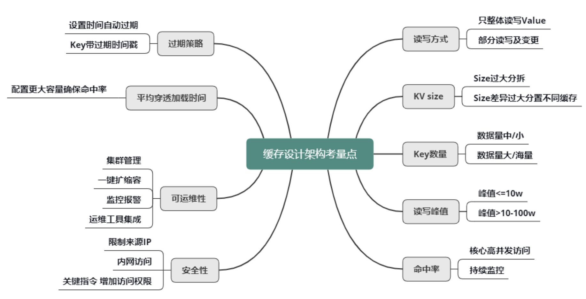

## 2、高并发环境下缓存场景问题

### 2.1、缓存失效

#### 2.1.1、问题描述

缓存里的数据存储基本上都是以 key 为索引进行存储和获取的。业务访问时，如果大量的 key 同时过期，很多缓存数据访问都会 miss，进而穿透到 DB，DB 的压力就会明显上升，由于 DB 的性能较差，只在缓存的 1%~2% 以下，这样请求的慢查率会明显上升

#### 2.1.2、原因

一般情况下，因为缓存数据是逐步写入的，所以也是逐步过期被淘汰的。但在某些场景，一大批数据会被系统主动或被动从 DB 批量加载，然后写入缓存。这些数据写入缓存时，由于使用相同的过期时间，在经历这个过期时间之后，这批数据就会一起到期，从而被缓存淘汰。此时，对这批数据的所有请求，都会出现缓存失效，从而都穿透到 DB，DB 由于查询量太大，就很容易压力大增，请求变慢

#### 2.1.3、业务场景

比如同一批火车票、飞机票，当可以售卖时，系统会一次性加载到缓存，如果缓存写入时，过期时间按照预先设置的过期值，那过期时间到期后，系统就会因缓存失效出现变慢的问题。类似的业务场景还有很多，比如微博业务，会有后台离线系统，持续计算热门微博，每当计算结束，会将这批热门微博批量写入对应的缓存；

#### 2.1.4、解决方法

设计缓存的过期时间时，使用公式：过期时间=bases时间+随机时间。即相同业务数据写缓存时，在基础过期时间之上，再加一个随机的过期时间，让数据在未来一段时间内慢慢过期，避免瞬时全部过期，对 DB 造成过大压力；

### 2.2、缓存雪崩

#### 2.2.1、缓存雪崩

- 设置缓存时采用了相同的过期时间，导致缓存在某一时刻同时失效，请求全部转发到DB，DB瞬时压力过重雪崩。由于原有缓存失效，新缓存未到期间所有原本应该访问缓存的请求都去查询数据库了，而对数据库CPU和内存造成巨大压力，严重的会造成数据库宕机；
- 有一些被大量访问数据（热点缓存）在某一时刻大面积失效，导致对应的请求直接落到了数据库上；

#### 2.2.2、原因

- 缓存不进行 rehash 时产生的雪崩，一般是由于较多缓存节点不可用，请求穿透导致 DB 也过载不可用，最终整个系统雪崩不可用的。而缓存支持 rehash 时产生的雪崩，则大多跟流量洪峰有关，流量洪峰到达，引发部分缓存节点过载 Crash，然后因 rehash 扩散到其他缓存节点，最终整个缓存体系异常；
- 在一个较短的时间内，缓存中较多的key集中过期，此周期内请求访问过期的数据，redis未命中，redis向数据库获取数据

#### 2.2.3、预防缓存雪崩问题

可以从如下三个方面着手
- 保证缓存层服务高可用性： 缓存层设计成高可用的，即使个别节点，个别机器，甚至机房宕机，依然可以提供服务。在并发场景发生前，先手动触发请求，将缓存都存储起来，以减少后期请求对database的第一次查询的压力。数据过期时间设置尽量分散开来，不要让数据出现同一时间段出现缓存过期的情况；
- 依赖隔离组件为后端限流并降级：无论是缓存层还是存储层都会有出错的概率，可以将他们视同为资源。在实际项目中，我们需要对重要的资源(Redis，mysql)都进行隔离，让每种资源都单独运行在自己的线程池中
    * Hystrix 是解决依赖的利器，限流、降级等
- 提前演练：在项目上线前，演练缓存层宕机后，应用以及后端的负载情况以及可能出现的问题，在此基础上 做一些预案；
- 对业务 DB 的访问增加读写开关，当发现 DB 请求变慢、阻塞，慢请求超过阀值时，就会关闭读开关，部分或所有读 DB 的请求进行 failfast 立即返回，待 DB 恢复后再打开读开关，如下图；
- 对缓存增加多个副本，缓存异常或请求 miss 后，再读取其他缓存副本，而且多个缓存副本尽量部署在不同机架，从而确保在任何情况下，缓存系统都会正常对外提供服务；
- 多级缓存结合：结合redis + memcache
- 缓存永不过期；
- 缓存过期时间在统一时间的基础上增加随机值，使得大量缓存不会在某个时间点同时过期；

#### 2.2.4、解决缓存雪崩

缓存雪崩的事前事中事后的解决方案如下。
- 事前：redis 高可用，主从+哨兵，redis cluster，避免全盘崩溃。
- 事中：本地 ehcache 缓存 + hystrix 限流&降级，避免 MySQL 被打死。
- 事后：redis持久化，一旦重启，自动从磁盘上加载数据，快速恢复缓存数据

更新锁机制和后台更新机制
- 更新锁：对缓存更新进行加锁保护，保证只有一个线程能够更新缓存，未能获取更新锁的线程要么等待锁释放后重新读取缓存，要么返回空值或默认值；
- 后台更新：后台定时去更新，而不是由业务线程来更新；
- 发生缓存雪崩后，利用redis持久化机制，尽快回复缓存集群，一旦重启，自动从磁盘上加载数恢复内存中的数据；
- 双key策略：要缓存的key过期时间是t，key1没有过期时间。每次缓存读取不到key时就返回key1的内容，然后触发一个事件。这个事件会同时更新key和key1；
- 过期时间随机：基础时间 + 动态随机时间；
- 缓存预热

### 2.3、缓存穿透

#### 2.3.1、什么是缓存穿透

缓存穿透是指缓存没有发挥作用，业务系统虽然去缓存中查询数据，但缓存中没有数据，业务系统需要再次去存储系统查询数据；通常存在两种情况：
- 查询一个的数据确实不存在，缓存层和存储层都不会命中；
- 存储系统中存在数据，但缓存数据生成需要耗费大量的时间和资源，如果刚好在业务访问的时候缓存失效了，出现缓存未生效的情况；

缓存穿透，则意味着有特殊访客在查询一个不存在的key，导致每次查询都会穿透到DB，如果这个特殊访客再控制一批肉鸡机器，持续访问你系统里不存在的key，就会对DB产生很大的压力，从而影响正常服务

但是出于容错的考虑，如果从存储层查不到数据则不写入缓存层，整个过程分为如下 3 步：
- 缓存层不命中
- 存储层不命中，所以不将空结果写回缓存
- 返回空结果

#### 2.3.2、缓存穿透造成后果

可能会使后端存储负载加大，由于很多后端存储不具备高并发性，甚至可能造成后端存储宕掉；可能在程序中分别统计总调用数，缓存层命中数，存储层命中数，如果发现大量存储空命中，可能出现了缓存穿透现象。

#### 2.3.3、缓存穿透产生原因

缓存访问设计的正常路径，是先访问 cache，cache miss 后查 DB，DB 查询到结果后，缓存返回。这对于正常的 key 访问是没有问题的，但是如果用户访问的是一个不存在的 key，查 DB 返回空（即一个 NULL），那就不会把这个空写回cache。那以后不管查询多少次这个不存在的 key，都会 cache miss，都会查询 DB。整个系统就会退化成一个“前端+DB“的系统，由于 DB 的吞吐只在 cache 的 1%~2% 以下，如果有特殊访客，大量访问这些不存在的 key，就会导致系统的性能严重退化，影响正常用户的访问

#### 2.3.4、缓存穿透的解决方法

- 缓存空对象：当下列第二步存储层不命中后，仍然将空对象保留到缓存层中，之后再访问这个数据时将会从缓存中获取，保护后端数据源

    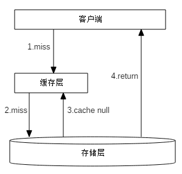

    缓存空对象存在两个问题:
    * 空值做了缓存，意味着缓存层中存了更多的键，需要更多的内存空间。比较有效的方法是针对这类数据设置一个较短的过期时间，让其自动剔除；或者可以将空值放在其他的缓存空间，否则当空间不足时，缓存系统的LRU算法可能会先剔除正常值，再剔除空值。
    * 缓存层和存储层的数据会有一段时间窗口的不一致，可能会对业务有一定的影响。可以利用消息系统或者其他方式清除掉缓存层中的空对象。

    缓存空对象伪代码：
    ```java
    String get(String key){
        // 从缓存中获取数据
        String cacheValue = cache.get(key);
        if(StringUtils.isBlank(cacheValue)){
            // 从存储中获取数据
            String storageValue = storage.get(key);
            cache.set(key， storageValue);
            // 如果存储数据为空，需要设置一个过期时间
            if(storageValue == null){
                cache.expire(key， 60*5);
            }
            return storageValue;
        } else {
            // 缓存非空
            return cacheValue;
        }
    }
    ```
- 布隆过滤器拦截：如图所示，在访问缓存层很存储层之前，将存在的key 用布隆过滤器提前保存起来，做第一层拦截

    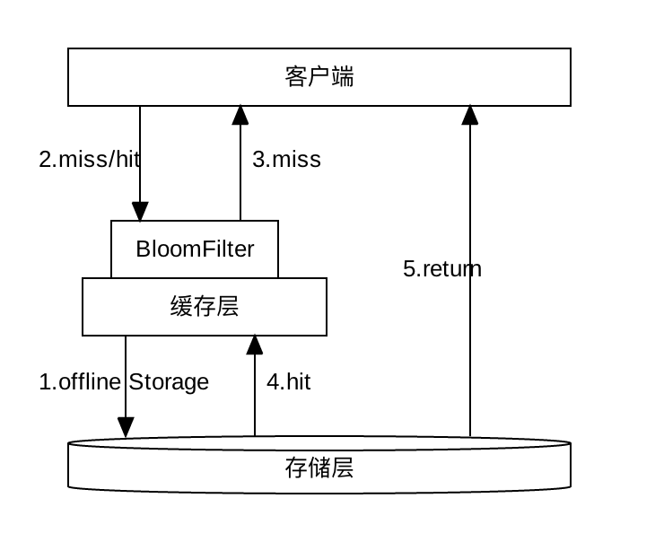

    key值可以预先存储在布隆过滤器里面去，然后先在布隆过滤器里面进行过滤，如果发现布隆过滤器中有的话，就再去redis里面进行查询，如果redis中也没有数据的话，再去database查询。这样可以避免不存在的数据信息也去往存储库中进行查询情况；

    这种方法适用于数据命中不高，数据相对固定实时性低(通常是数据集较大)的应用场景，代码维护较为复杂，但是缓存空间占用少；

	在实际项目中会启动一个系统任务或者定时任务，来初始化布隆过滤器，将热点查询数据的id放进布隆过滤器里面，当用户再次请求的时候，使用布隆过滤器进行判断

	**问题点：**

	BloomFilter 要缓存全量的 key，这就要求全量的 key 数量不大，10亿 条数据以内最佳，因为 10亿 条数据大概要占用 1.2GB 的内存。也可以用 BloomFilter 缓存非法 key，每次发现一个 key 是不存在的非法 key，就记录到 BloomFilter 中，这种记录方案，会导致 BloomFilter 存储的 key 持续高速增长，为了避免记录 key 太多而导致误判率增大，需要定期清零处理

- 两中解决方案对比:

|解决缓存穿透|适用场景|维护成本|
|----------|-------|------|
|缓存空对象|数据命中不高; 数据频繁变化实时性高|代码维护简单; 需要过多的缓存空间; 数据不一致|
|布隆过滤器|数据命中不高; 数据相对固定实时性低|代码维护复杂; 缓存空间占用少|

#### 2.3.5、缓存击穿

在平常高并发的系统中，大量的请求同时查询一个 key 时，此时这个key正好失效了，就会导致大量的请求都打到数据库上面去。这种现象我们称为缓存击穿；

存在问题：会造成某一时刻数据库请求量过大，压力剧增；该数据没有人查询过 ，第一次就大并发的访问

多个线程同时去查询数据库的这条数据，那么我们可以在第一个查询数据的请求上使用一个：互斥锁来锁住它；

普遍的一种做法，即根据key获取value值为空时，锁上，从数据库中load数据后再释放锁。若其它线程获取锁失败，则等待一段时间后重试。这里要注意，分布式环境中要使用分布式锁，单机的话用普通的锁（synchronized、Lock）就够了

解决方案：读写分离架构：canal数据异构方案

### 2.4、缓存一致性

- [关于缓存一致性讨论](https://github.com/doocs/advanced-java/discussions/54)

- 更新数据库成功，更新缓存失败 -> 数据不一致
- 更新缓存成功，更是数据库失败 -> 数据不一致
- 更新数据库成功，淘汰缓存失败 -> 数据不一致
- 淘汰缓存成功，更新数据库失败 -> 查询缓存miss

#### 2.4.1、缓存一般使用流程

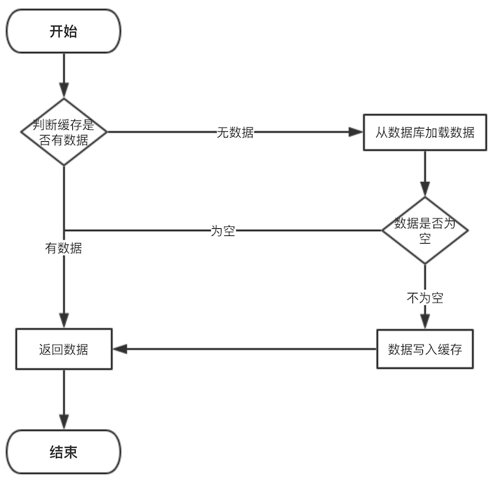

但是在更新缓存方面，对于更新完数据库，是更新缓存呢，还是删除缓存。又或者是先删除缓存，再更新数据库，其实没有一个确定的方案

#### 2.4.2、缓存与数据库双写一致性问题

从理论上来说，给缓存设置过期时间，是保证最终一致性的解决方案。这种方案下，我们可以对存入缓存的数据设置过期时间，所有的写操作以数据库为准，对缓存操作只是尽最大努力即可。也就是说如果数据库写成功，缓存更新失败，那么只要到达过期时间，则后面的读请求自然会从数据库中读取新值然后回填缓存；

缓存的三种更新策略：
- 先更新数据库，再更新缓存；
- 先删除缓存，再更新数据库；
- 先更新数据库，再删除缓存；

#### 2.4.3、先更新数据库，再更新缓存

这个方案存在比较大问题，原因：
- 从线程安全角度看：同时有请求A和请求B进行更新操作，那么会出现：
	- （1）线程A更新了数据库；
	- （2）线程B更新了数据库；
	- （3）线程B更新了缓存
	- （4）线程A更新了缓存

	**这就出现请求A更新缓存应该比请求B更新缓存早才对，但是因为网络等原因，B却比A更早更新了缓存。这就导致了脏数据**
- 从业务场景角度看：
	- 如果你是一个写数据库场景比较多，而读数据场景比较少的业务需求，采用这种方案就会导致，数据压根还没读到，缓存就被频繁的更新，浪费性能；
	- 如果你写入数据库的值，并不是直接写入缓存的，而是要经过一系列复杂的计算再写入缓存。那么，每次写入数据库后，都再次计算写入缓存的值，无疑是浪费性能的

显然，更新缓存在比较多的问题，删除缓存更为适合；并发更新数据库场景下，会将脏数据刷到缓存

#### 2.4.4、先删除缓存，再更新数据库

其会导致不一致的原因，同时有一个请求A进行更新操作，另一个请求B进行查询操作：
- （1）请求A进行写操作，删除缓存；
- （2）请求B查询发现缓存不存在
- （3）请求B去数据库查询得到旧值
- （4）请求B将旧值写入缓存
- （5）请求A将新值写入数据库

上述情况就会导致不一致的情形出现。而且，如果不采用给缓存设置过期时间策略，该数据永远都是脏数据；可以采用延时双删策略，伪代码如下：
```java
public void write(String key, Object data) {
	redis.delKey(key);
	db.update(data);
	Thread.sleep(1000);
	redis.delKey(key);
}
```
先淘汰缓存、再写数据库(这两步和原来一样)、休眠1秒，再次淘汰缓存这么做，可以将1秒内所造成的缓存脏数据，再次删除；

如果读写分离的架构，在这种情况下造成不一致的原因：一个请求A进行更新操作，另一个请求B进行查询操作
- （1）请求A进行写操作，删除缓存；
- （2）请求A将数据写入数据库了；
- （3）请求B查询缓存发现，缓存没有值；
- （4）请求B去从库查询，这时，还没有完成主从同步，因此查询到的是旧值；
- （5）请求B将旧值写入缓存；
- （6）数据库完成主从同步，从库变为新值上述情形，就是数据不一致的原因；

此时的解决办法就是如果是对 Redis 进行填充数据的查询数据库操作，那么就强制将其指向主库进行查询；

延时双删策略会存在第二次删除缓存失败，会再次造成缓存和数据库不一致的情况

#### 2.4.5、先更新数据库，再删除缓存

最经典的缓存+数据库读写的模式：`Cache Aside Pattern`
- 读的时候，先读缓存，缓存没有的话，就读数据库，然后取出数据后放入缓存，同时返回响应。
- 更新的时候，先更新数据库，然后再删除缓存。

这种情况下也可能会发生并发问题，假设这会有两个请求，一个请求A做查询操作，一个请求B做更新操作，那么会有如下情形产生：
- （1）缓存刚好失效
- （2）请求A查询数据库，得一个旧值
- （3）请求B将新值写入数据库
- （4）请求B删除缓存
- （5）请求A将查到的旧值写入缓存

如果发生上述情况，确实是会发生脏数据；但是这种情况发生的概率很小，发生上述情况存在一个先天条件：就是`步骤（3）`的写数据库操作比`步骤（2）`的读操作耗时更短，才有可能使得步骤`步骤（4）`先于`步骤（5）`发生。但实际上数据库的读操作的速度远远快于写操作。

还会存在缓存删除失败的情况：
- 请求A更新了数据A；
- 请求A删除数据A的缓存失败；
- 请求B读到的数据A缓存的旧数据；

解决方案：
- 设置缓存过期时间：
	- 优点：简单、易操作；
	- 缺点：会存在短时间的旧数据；如果数据量太多，缓存有效时间短，容易发生一段时间内缓存大量失效，此时的数据库压力突然剧增，引发缓存雪崩现象（缓存有效时间为随机值减少发生缓存雪崩的可能性）
- 消息队列步骤：
	- 更新数据库；
	- 删除缓存失败；
	- 将需要删除的Key发送到消息队列；
	- 隔断时间从消息队列中拉取要删除的key；
	- 继续删除，直至成功为止

	优点：不会引发缓存雪崩、只删除需要删除的缓存；

	缺点：引入了消息队列

binlog的形式解决缓存在高并发场景下不一致的问题

### 2.5、缓存并发

#### 2.5.1、产生原因

数据并发竞争，是指在高并发访问场景，一旦缓存访问没有找到数据，大量请求就会并发查询 DB，导致 DB 压力大增的现象

数据并发竞争，主要是由于多个进程/线程中，有大量并发请求获取相同的数据，而这个数据 key 因为正好过期、被剔除等各种原因在缓存中不存在，这些进程/线程之间没有任何协调，然后一起并发查询 DB，请求那个相同的 key，最终导致 DB 压力大增

#### 2.5.2、解决方案

- 使用全局锁：即当缓存请求 miss 后，先尝试加全局锁，只有加全局锁成功的线程，才可以到 DB 去加载数据。其他进程/线程在读取缓存数据 miss 时，如果发现这个 key 有全局锁，就进行等待，待之前的线程将数据从 DB 回种到缓存后，再从缓存获取；

- 双key：对缓存数据保持多个备份，即便其中一个备份中的数据过期或被剔除了，还可以访问其他备份，从而减少数据并发竞争的情况

### 2.6、bigkey

大 key，是指在缓存访问时，部分 Key 的 Value 过大，读写、加载易超时的现象；

在Redis中，一个字符串最大512MB，一个二级数据结构（例如hash、list、set、zset）可以存储大约40亿个(2^32-1)个元素，但实际上中如果下面两种情况，可以认为它是bigkey：
- 字符串类型：它的big体现在单个value值很大，一般认为超过10KB就是bigkey。
- 非字符串类型：哈希、列表、集合、有序集合，它们的big体现在元素个数太多

#### 2.6.1、危害

- 内存空间不均匀：这样会不利于集群对内存的统一管理，存在丢失数据的隐患；
- 超时阻塞：由于Redis单线程的特性，操作bigkey的通常比较耗时，也就意味着阻塞Redis可能性越大，这样会造成客户端阻塞或者引起故障切换，它们通常出现在慢查询中
- 网络拥塞：如果业务中这种大 key 很多，而这种 key 被大量访问，缓存组件的网卡、带宽很容易被打满，也会导致较多的大 key 慢查询。假设一个bigkey为1MB，客户端每秒访问量为1000，那么每秒产生1000MB的流量，对于普通的千兆网卡(按照字节算是128MB/s)的服务器来说简直是灭顶之灾，而且一般服务器会采用单机多实例的方式来部署，也就是说一个bigkey可能会对其他实例造成影响，其后果不堪设想；
- 如果这些大 key 占总体数据的比例很小，存 Mc，对应的 slab 较少，导致很容易被频繁剔除，DB 反复加载，从而导致查询较慢。
- 另外，如果大 key 缓存的字段较多，每个字段的变更都会引发对这个缓存数据的变更，同时这些 key 也会被频繁地读取，读写相互影响，也会导致慢查现象。
- 最后，大 key 一旦被缓存淘汰，DB 加载可能需要花费很多时间，这也会导致大 key 查询慢的问题

#### 2.6.2、产生原因

bigkey的产生都是由于程序设计不当，或者对于数据规模预料不清楚造成的，来看几个：
- 社交类：粉丝列表，如果某些明星或者大v不精心设计下，必是bigkey。
- 统计类：例如按天存储某项功能或者网站的用户集合，除非没几个人用，否则必是bigkey。
- 缓存类：将数据从数据库load出来序列化放到Redis里，这个方式非常常用，但有两个地方需要注意，第一，是不是有必要把所有字段都缓存，第二，有没有相关关联的数据

#### 2.6.3、如何发现bigkey

**redis-cli --bigkeys：**

redis-cli提供了--bigkeys来查找bigkey，例如下面就是一次执行结果：
```
-------- summary -------
Sampled 0 keys in the keyspace!
Total key length in bytes is 0 (avg len 0.00)

0 hashs with 0 fields (00.00% of keys, avg size 0.00)
0 lists with 0 items (00.00% of keys, avg size 0.00)
0 strings with 0 bytes (00.00% of keys, avg size 0.00)
0 streams with 0 entries (00.00% of keys, avg size 0.00)
0 sets with 0 members (00.00% of keys, avg size 0.00)
0 zsets with 0 members (00.00% of keys, avg size 0.00)
```
可以看到--bigkeys给出了每种数据结构的top 1 bigkey，同时给出了每种数据类型的键值个数以及平均大小。

`--bigkeys`对问题的排查非常方便，但是在使用它时候也有几点需要注意：
- 建议在从节点执行，因为 `--bigkeys`也是通过scan完成的；
- 建议在节点本机执行，可以减少网络开销；
- 如果没有从节点，可以使用 `--i` 参数，例如 `--i 0.1` 代表100毫秒执行一次；
- `--bigkeys`只能计算每种数据结构的top1，如果有些数据结构非常多的bigkeys，这个命令无法查询

**debug object**

Redis提供了`debug object ${key}`命令获取键值的相关信息：

#### 2.6.2、解决方案

- 第一种方案，如果数据存在 Mc 中，可以设计一个缓存阀值，当 value 的长度超过阀值，则对内容启用压缩，让 KV 尽量保持小的 size，其次评估大 key 所占的比例，在 Mc 启动之初，就立即预写足够数据的大 key，让 Mc 预先分配足够多的 trunk size 较大的 slab。确保后面系统运行时，大 key 有足够的空间来进行缓存；

- 第二种方案，如果数据存在 Redis 中，比如业务数据存 set 格式，大 key 对应的 set 结构有几千几万个元素，这种写入 Redis 时会消耗很长的时间，导致 Redis 卡顿。此时，可以扩展新的数据结构，同时让 client 在这些大 key 写缓存之前，进行序列化构建，然后通过 restore 一次性写入；

- 第三种方案时，将大 key 分拆为多个 key，尽量减少大 key 的存在。同时由于大 key 一旦穿透到 DB，加载耗时很大，所以可以对这些大 key 进行特殊照顾，比如设置较长的过期时间，比如缓存内部在淘汰 key 时，同等条件下，尽量不淘汰这些大 key

#### 2.6.3、最佳实践

- string类型控制在10KB以内，hash、list、set、zset元素个数不要超过5000；
- 非字符串的bigkey，不要使用del删除，使用hscan、sscan、zscan方式渐进式删除，同时要注意防止bigkey过期时间自动删除问题(例如一个200万的zset设置1小时过期，会触发del操作，造成阻塞，而且该操作不会出现在慢查询中(latency可查))

### 2.7、热点数据

#### 2.7.1、什么是热点数据

通常使用 "缓存 + 过期时间" 的策略来帮助加速接口的访问速度，减少了后端负载，同时保证数据的更新。但是如果同时出现两个问题，会对系统造成致命的危害：
- 当前key是一个热点key(例如热门的娱乐新闻)，并发量非常大;
- 缓存的构建\重建不能在短时间内完成，可能是一个复杂的计算，例如复杂的sql，多次IO，多个依赖等。于是就出现问题：在缓存失效的瞬间，需要大量线程来构建缓存，造成后端负载过大，甚至导致系统崩溃。
- 瞬间有几十万的请求去访问redis上某个固定的key，从而压垮缓存服务的情情况

发现热点key：`识别热点 -> 隔离热点（缓存预热、访问单元隔离、数据隔离、接口隔离） ->  性能优化（缓存、限流、降级熔断）`
- 根据实际经验，预估哪些是热点key，比较常见的就是电商系统中，会在做秒杀、抢购等业务开始前就能预测出热key。但是并非所有业务都能预估热点key；
- 在客户端进行收集：这个方式就是在操作redis之前，加入一行代码进行数据统计。那么这个数据统计的方式有很多种，也可以是给外部的通讯系统发送一个通知信息。缺点就是对客户端代码造成入侵；
- 还有一种热点数据的发现机制，那就是实时的做收集，比如在客户端、服务端或者在代理层，都可以对实时数据进行采集，然后进行统计汇总
- 在Proxy层做收集：
- 用redis自带命令：
    - monitor命令，该命令可以实时抓取出redis服务器接收到的命令，然后写代码统计出热key是啥。当然，也有现成的分析工具可以给你使用，比如`redis-faina`。但是该命令在高并发的条件下，有内存增暴增的隐患，还会降低redis的性能。
    - hotkeys参数，redis 4.0.3提供了redis-cli的热点key发现功能，执行redis-cli时加上–hotkeys选项即可。但是该参数在执行的时候，如果key比较多，执行起来比较慢；
- 抓包评估：Redis客户端使用TCP协议与服务端进行交互，通信协议采用的是RESP。自己写程序监听端口，按照RESP协议规则解析数据，进行分析。缺点就是开发成本高，维护困难，有丢包可能性

Hot key 引发缓存系统异常，主要是因为突发热门事件发生时，超大量的请求访问热点事件对应的 key

#### 2.7.2、解决思路

- 减少缓存重建的次数；
- 数据尽可能一致；
- 减少的潜在的危险；

#### 2.7.3、解决方案

- **使用互斥锁**

	- 思路:只让一个线程构建缓存，其他线程等待构建缓存的线程执行完毕，重新从缓存获取数据即可。如果单机环境，可以synchronized 或者lock来操作，如果是分布式环境可以用分布式锁
	```java
	String get(String key) {  
	String value = redis.get(key);  
	if (value  == null) {  
		if (redis.setnx(key_mutex， "1")) {  
			// 3 min timeout to avoid mutex holder crash  
			redis.expire(key_mutex， 3 * 60)  
			value = db.get(key);  
			redis.set(key， value);  
			redis.delete(key_mutex);  
		} else {  
			//其他线程休息50毫秒后重试  
			Thread.sleep(50);  
			get(key);  
		}  
	}  
	}
	```
	- 优点：
		* 思路简单;
		* 保证一致性

	- 缺点：
		* 代码复杂度增大;
		* 存在死锁风险;
		* 存在线程池阻塞的风险

- **永远不过期**

	- 永不过期包含两层意思：
		* 从缓存层面来看，确实没有设置过期时间，所以不会出现热点key过期后产生的问题，也就是物理不过期；
		* 从功能层面来看，为每个value设置一个逻辑过期时间，当发现超过逻辑过期时间后，会使用单独的线程去构建缓存；
	- 实际来看，此方法杜绝了热点key产生的问题，但唯一不足的就是重构缓存期间，会出现数据不一致。
	- 优点：基本杜绝热点key问题
	- 缺点：
		* 不保证一致性
		* 逻辑过期时间增加代码维护成本和内存成本

**使用二级缓存**

使用本地缓存，比如HashMap、ehcache。在你发现热key以后，把热key加载到系统的JVM中。针对这种热key请求，会直接从jvm中取，而不会走到redis层

**备份热key**

不要让key走到同一台redis上不就行了

#### 2.7.4、热点数据隔离

## 3、缓存设计

### 3.1、确认是否需要缓存

- CPU占用：如果你有某些应用需要消耗大量的cpu去计算，比如正则表达式，如果你使用正则表达式比较频繁，而其又占用了很多CPU的话，那你就应该使用缓存将正则表达式的结果给缓存下来；
- 数据库IO占用：如果你发现你的数据库连接池比较空闲，那么不应该用缓存。但是如果数据库连接池比较繁忙，甚至经常报出连接不够的报警，那么是时候应该考虑缓存了；

### 3.2、选择合适的缓存

缓存又分进程内缓存和分布式缓存两种

#### 3.2.1、进程内缓存

以下是比较常用的缓存比较

| 比较项       | ConcurrentMap   | LRUMap            | Ehcache                          | GuavCache                      | Caffeine         |
| ------------ | --------------- | ----------------- | -------------------------------- | ------------------------------ | ---------------- |
| 读写性能     | 很好，分段锁    | 一般，全局锁      | 好，                             | 好，需要做淘汰操作             | 很好             |
| 淘汰算法     | 无              | LRU，一般         | 支持多种淘汰算法：LRU、LFU、FIFO | LRU，一般                      | W-TinyLFU，很好  |
| 功能丰富成都 | 功能比较简单    | 功能包括单一      | 功能很丰富                       | 功能很丰富，支持刷新和虚引用等 | 与GuavaCache类似 |
| 工具大小     | jdk自带类，很小 | 基于LinkedHashMap | 很大                             | 是guava工具包中的一小部分      | 很小             |
| 是否持久化   | 否              | 否                | 是                               | 否                             | 否               |
| 是否支持集群 | 否              | 否                | 是                               | 否                             | 否               |

- 对于 ConcurrentMap，比较适合缓存比较固定不变的元素，且缓存的数量比较小，比如反射创建的类等；
- Encache：如果需要持久化和集群的一些功能；如果可以，可以使用分布式缓存来替代；

> 总结：如果不需要淘汰算法则选择ConcurrentHashMap，如果需要淘汰算法和一些丰富的API，推荐Caffeine

#### 3.2.2、分布式缓存

一般在Java冲常用的是Redis

### 3.3、缓存设计原则

- 用快速存取设备，使用内存；
- 将缓存推送到用户最近的对方；
- 脏缓存清理；

### 3.4、多级缓存

- redis缓存
- 热点数据内存本地缓存：guava cache中的Cache，其使用CacheBuilder
- nginx proxy cache缓存
- nginx lua缓存

## 4、缓存最佳实践

- 缓存系统主要消耗的是服务器的内存，因此，在使用缓存时必须先对应用需要缓存的数据大小进行评估，包括缓存的数据结构、缓存大小、缓存数量、缓存的失效时间，然后根据业务情况自行推算未来一段时间容量的使用情况，根据容量评估的结果来申请和分配缓存资源，否则会造成资源浪费或者缓存空间不够；
- 将使用缓存的业务进行分离，核心业务和非核心业务使用不同的缓存实例，从物理上进行隔离，如果有条件，则请对么个业务使用单独的实例或者集群，以减少应用之间互相影响的可能性。
- 根据缓存实例提供的内存大小推送应用需要使用的缓存实例数量；
- 缓存一般是用来加速数据库的读，一般先访问缓存后访问数据库，所以缓存的超时时间设置很重要。有可能缓存超时设置较长，从而拖垮服务的线程池，最终导致服务雪崩；
- 所有的缓存实例都需要添加监控，需要对慢查询，大对象，内存使用情况做可靠的监控；
- 如果多个业务共享一个缓存实例，需要通过规范来限制各个应用使用的key一定要有唯一的前缀，并进行隔离设计，避免缓存互相覆盖的问题产生；
- 任何缓存的key都必须设定缓存失效时间，且失效时间不能集中在某一点，否则会导致缓存占满内存或者缓存穿透。
- 低频访问的数据不要放在缓存中；
- 缓存的数据不易过大，尤其是redis，因为redi使用的是单线程模型，单个缓存key的数据过大时，会阻塞其他请求处理；
- 对于存储较多value的key，尽量不要使用HGETALL等集合操作，该操作会造成请求阻塞，影响其他应用的访问；
- 缓存一般用于交易系统中加速查询的场景，有大量的更新数据时，尤其是批量处理，请使用批量模式；
- 如果对性能要求不是非常高，尽量使用分布式缓存，不要使用本地缓存，因为本地缓存在服务的各个节点之间复制，在某一时刻副本之间的是不一致的；
- 写缓存时一定写入完全正确的数据，如果缓存数据一部分有效，一部分无效，则宁可放弃缓存，也不要把部分数据写入缓存，否则会造成空指针，程序异常等；
- 在通常情况下，读的顺序是先缓存、后数据库；写的顺序是先数据库、后缓存。
- 当使用本地缓存时，一定要严格控制缓存对象的个数和生命周期。由于JVM特性，过多的缓存对象会极大影响JVM性能，甚至导致内存溢出等问题出现。
- 在使用缓存时，一定有降级处理，尤其对关键业务环节，缓存有问题或者失效也要能回溯到数据库进行处理。

读缓存标准写法：
```
obj = getFromCache();
if (obj 为空) {
	obj = getFromDB();
	setCache(obj);
}
```
写缓存标准写法：
```
updateDb();
updateCache();
```

## 5、缓存实现

### 5.1、本地缓存：Guava

SpringBoot1.x的默认本地缓存

### 5.2、本地缓存：Caffeine

https://juejin.cn/post/6844903670014803981
https://zhuanlan.zhihu.com/p/109226599

SpringBoot2.x开始默认的缓存依赖，Caffeine是一个基于Java8开发的提供了近乎最佳命中率的高性能的缓存库。

缓存和ConcurrentMap有点相似，但还是有所区别。最根本的区别是ConcurrentMap将会持有所有加入到缓存当中的元素，直到它们被从缓存当中手动移除。但是，Caffeine的缓存Cache 通常会被配置成自动驱逐缓存中元素，以限制其内存占用。在某些场景下，LoadingCache和AsyncLoadingCache 因为其自动加载缓存的能力将会变得非常实用。

Caffeine提供了灵活的构造器去创建一个拥有下列特性的缓存：
- 自动加载元素到缓存当中，异步加载的方式也可供选择；
- 当达到最大容量的时候可以使用基于就近度和频率的算法进行基于容量的驱逐；
- 将根据缓存中的元素上一次访问或者被修改的时间进行基于过期时间的驱逐；
- 当向缓存中一个已经过时的元素进行访问的时候将会进行异步刷新；
- key将自动被弱引用所封装；
- value将自动被弱引用或者软引用所封装；
- 驱逐(或移除)缓存中的元素时将会进行通知；
- 写入传播到一个外部数据源当中；
- 持续计算缓存的访问统计指标；

#### 5.2.1、缓存淘汰策略

在caffeine所有的数据都在ConcurrentHashMap中，这个和guava cache不同，guava cache是自己实现了个类似ConcurrentHashMap的结构。在caffeine中有三个记录引用的LRU队列:
- Eden队列：在caffeine中规定只能为缓存容量的%1,如果size=100,那这个队列的有效大小就等于1。这个队列中记录的是新到的数据，防止突发流量由于之前没有访问频率，而导致被淘汰。比如有一部新剧上线，在最开始其实是没有访问频率的，防止上线之后被其他缓存淘汰出去，而加入这个区域。伊甸区，最舒服最安逸的区域，在这里很难被其他数据淘汰。
- Probation队列：叫做缓刑队列，在这个队列就代表你的数据相对比较冷，马上就要被淘汰了。这个有效大小为size减去eden减去protected。
- Protected队列：在这个队列中，可以稍微放心一下了，你暂时不会被淘汰，但是别急，如果Probation队列没有数据了或者Protected数据满了，也将会被面临淘汰的局面。当然想要变成这个队列，需要把Probation访问一次之后，就会提升为Protected队列。这个有效大小为：`(size减去eden) X 80% 如果size =100`，就会是79；

这三个队列之间的关系为：
- 所有的新数据都会进入Eden；
- Eden满了，淘汰进入Probation；
- 如果在Probation中访问了其中某个数据，则这个数据升级为Protected；
- 如果Protected满了又会继续降级为Probation；

## 6、多级缓存

- https://tech.youzan.com/tmc/
- [J2Cache](https://gitee.com/ld/J2Cache)
- [Layering-cache](https://github.com/xiaolyuh/layering-cache)

### 6.1、为啥需要进程内缓存

- Redis如果挂了或者使用老版本的Redis,其会进行全量同步，此时Redis是不可用的，这个时候我们只能访问数据库，很容易造成雪崩。
- 访问Redis会有一定的网络I/O以及序列化反序列化，虽然性能很高但是其终究没有本地方法快，可以将最热的数据存放在本地，以便进一步加快访问速度

适用场景：
- 数据量不是很大，数据更新频率较低；
- 如果数据量更新频繁，也想使用进程缓存的话，那么可以将其过期时间设置为较短，或者设置其较短的自动刷新的时间。这些对于Caffeine或者Guava Cache来说都是现成的API

### 6.2、多级缓存实现

一般来说我们选择一个进程缓存和一个分布式缓存来搭配做多级缓存，一般来说引入两个也足够了；

利用Caffeine做一级缓存，Redis作为二级缓存。
- 首先去Caffeine中查询数据，如果有直接返回。如果没有则进行第2步。
- 再去Redis中查询，如果查询到了返回数据并在Caffeine中填充此数据。如果没有查到则进行第3步。
- 最后去Mysql中查询，如果查询到了返回数据并在Redis，Caffeine中依次填充此数据。

对于Caffeine的缓存，如果有数据更新，只能删除更新数据的那台机器上的缓存，其他机器只能通过超时来过期缓存，超时设定可以有两种策略:
- 设置成写入后多少时间后过期
- 设置成写入后多少时间刷新

为了解决进程内缓存的问题，设计进一步优化：通过Redis的pub/sub，可以通知其他进程缓存对此缓存进行删除。如果Redis挂了或者订阅机制不靠谱，依靠超时设定，依然可以做兜底处理

## 7、缓存分区

# 七、分布式ID

* [分布式唯一ID](https://mp.weixin.qq.com/s/cqIK5Bv1U0mT97C7EOxmnA)
* [百度分布式ID生成器](https://github.com/baidu/uid-generator)
* [美团点评分布式ID生成系统](https://tech.meituan.com/MT_Leaf.html)
* [分布式ID生成方案](https://juejin.im/post/5d22972f6fb9a07edd2a34cc)

## 1、ID生成的核心需求

- （1）全局唯一：需要单独设置一个和业务无关的主键；专业术语叫做代理主键这也是为什么数据库设计范式；唯一主键是第一范式!

- （2）趋势有序：

	InnoDB引擎表是基于B+树的索引组织表(IOT)；每个表都需要有一个聚集索引；所有的行记录都存储在B+树的叶子节点（leaf pages of the tree）基于聚集索引的增、删、改、查的效率相对是最高的

	- 如果我们定义了主键(PRIMARY KEY)；那么InnoDB会选择其作为聚集索引;
	- 如果没有显式定义主键；则InnoDB会选择第一个不包含有 NULL。值的唯一索引作为主键索引
	- 如果也没有这样的唯一索引；则InnoDB会选择内置6字节长的ROWID作为隐含的聚集索引（ROWID随着行记录的写入而主键递增；这个ROWID不像ORACLE的ROWID那样可引用；是隐含的）
	- *如果InnoDB表的数据写入顺序能和B+树索引的叶子节点顺序一致的话；这时候存取效率是最高的；也就是下面几种情况效率最高：*
		- Ⅰ.使用自增列(INT/BIGINT类型)做主键，这时候写入顺序是自增的，和B+数叶子节点分裂顺序一致
		- Ⅱ.该表不指定自增列做主键；同时也没有可以被选为主键的唯一索引(上面的条件)；这时候InnoDB会选择内置的ROWID作为主键；写入顺序和ROWID增长顺序一致
		- Ⅲ.除此以外；如果一个InnoDB表又没有显示主键；又有可以被选择为主键的唯一索引；但该唯一索引可能不是递增关系时（例如字符串、UUID、多字段联合唯一索引的情况）；该表的存取效率就会比较差

- （3）单调递增：保证下一个ID一定大于上一个ID，例如事务版本号、IM增量消息、排序等特殊需求；
- （4）信息安全：如果ID是连续的，恶意用户的扒取工作就非常容易做了，直接按照顺序下载指定URL即可；如果是订单号就更危险了，竞对可以直接知道我们一天的单量。所以在一些应用场景下，会需要ID无规则、不规则；

上面3、4两点需求是互斥的，无法同时满足3和4点需求；

另外ID生成还需要做到平均延迟和TP延迟都要尽可能低、可用性到5个9、高QPS

## 2、数据库自增长序列或字段：

最常见的方式；利用数据库；全库唯一

### 2.1、优点

- 简单；代码方便；性能可以接受;
- 数字ID天然排序；对分页或者需要排序的结果很有帮助

### 2.2、缺点

- 不同数据库语法和实现不同；数据库迁移的时候或多数据库版本支持的时候需要处理;
- 在单个数据库或读写分离或一主多从的情况下；只有一个主库可以生成。有单点故障的风险
- 在性能达不到要求的情况下；比较难于扩展;
- 如果遇见多个系统需要合并或者涉及到数据迁移会相当痛苦；分表分库的时候会有麻烦

### 2.3、优化方案

针对主库单点；如果有多个Master库；则每个Master库设置的起始数字不一样；步长一样；可以是Master的个数.

## 3、UUID

### 3.1、优点

- 简单；代码方便
- 生成ID性能非常好；基本不会有性能问题。
- 全球唯一；在遇见数据迁移；系统数据合并；或者数据库变更等情况下；可以从容应对

### 3.2、缺点

- 没有排序；无法保证趋势递增;
- UUID往往是使用字符串存储；查询的效率比较低;
- 存储空间比较大；如果是海量数据库；就需要考虑存储量的问题;
- 传输数据量大\不可读；
- 不可读；

### 3.3、为什么UUID会导致数据库性能变差

涉及到B+数索引的分裂：果我们的ID按递增的顺序来插入；比如陆续插入8，9，10；新的ID都只会插入到最后一个节点当中。当最后一个节点满了；会裂变出新的节点。这样的插入是性能比较高的插入；因为这样节点的分裂次数最少；而且充分利用了每一个节点的空间。但是；如果我们的插入完全无序；不但会导致一些中间节点产生分裂；也会白白创造出很多不饱和的节点；这样大大降低了数据库插入的性能

### 3.4、生成有序的UUID

可以使用`fasterxml.uuid`来生成有序的UUID，引入POM文件：
```xml
<!-- 顺序UUID -->
<dependency>
	<groupId>com.fasterxml.uuid</groupId>
	<artifactId>java-uuid-generator</artifactId>
	<version>3.1.4</version>
</dependency> 	
```
实现如下：
```java
public static String generatorUUID(){
	TimeBasedGenerator timeBasedGenerator = Generators.timeBasedGenerator(EthernetAddress.fromInterface());
	return timeBasedGenerator.generate().toString();
}
```

## 4、Redis生成ID

当使用数据库来生成ID性能不够要求的时候；可以尝试使用Redis来生成。主要依赖于Redis是单线程的；所以可以用于生成全局唯一ID。（使用Redis的原子操作incr 和 incrby 来实现）比较适合使用Redis来生成每天从0开始的流水号；

- **4.1.优点：**
	- 不依赖于数据库；灵活方便；且性能优于数据库;
	- 数字ID天然排序；对分页或者需要排序的结果很有帮助;

- **4.2.缺点：**
	- 如果系统中没有Redis；还需要引入新的组件；增加系统复杂度
	- 需要编码和配置的工作量比较大

## 5、Twitter-Snowflake

### 5.1、Snowflake算法组成

以划分命名空间的方式将 64-bit位分割成多个部分，每个部分代表不同的含义。而 Java中64bit的整数是Long类型，所以在 Java 中 SnowFlake 算法生成的 ID 就是 long 来存储的
- 占用1bit；其值始终是0；二进制中最高位为1的都是负数，但是我们生成的id一般都使用整数，所以这个最高位固定是0
- 41位的时间序列(精确到毫秒；41位的长度可以使用69年)
- 10位的机器标识(其中高位5bit是数据中心ID；低位5bit是工作节点；10位的长度最多支持部署1024个节点)
- 12位的计数顺序号(12位的计数顺序号支持每个节点每毫秒产生4096个ID序号)。最高位是符号位；始终为0

	算法示意图：

	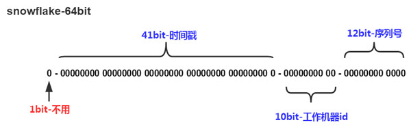

SnowFlake算法在同一毫秒内最多可以生成全局ID个数：1024 X 4096 =  4194304

### 5.2、优点

- 不依赖数据库等第三方系统；以服务的方式部署；稳定性更高；生成ID的性能也是非常高的;
- 按时间有序；毫秒数在高位；自增序列在低位；整个ID都是趋势递增的

### 5.3、缺点

- （1）强依赖机器时钟；如果机器上时钟回拨；会导致发号重复或者服务会处于不可用状态
- （2）从理论上来说，类似snowflake的方案由于时间位数的限制，存在于[2038](https://en.wikipedia.org/wiki/Year_2038_problem)问题相似的理论极限；

### 5.4、针对缺点解决方案

- 解决时间问题：可以关闭ntp的时间同步功能；或者当检测到ntp时间调整后；拒绝分配id；
- 从设计和编码角度来看，一个有效的措施是缓存历史时间戳，然后再序列生成之前校验，如果出现当前时间落后于历史时间的不合理情况，可以采取相应的动作，要么重试、等待时间重新一致，或者直接提示服务不可用。（NTP问题）

## 6、MongoDB的ObjectId

ObjectId使用12字节的存储空间；其生成方式如下：
```
|0|1|2|3|4|5|6|7|8|9|10|11|
|时间戳|机器ID|PID|计数器 |
```
前四个字节时间戳是从标准纪元开始的时间戳；单位为秒；有如下特性：
- 时间戳与后边5个字节一块；保证秒级别的唯一性;
- 保证插入顺序大致按时间排序
- 隐含了文档创建时间;
- 时间戳的实际值并不重要；不需要对服务器之间的时间进行同步
时间戳保证秒级唯一；机器ID保证设计时考虑分布式；避免时钟同步；PID保证同一台服务器运行；多个mongod实例时的唯一性；最后的计数器保证同一秒内的唯一性

## 7、Zookeepr

使用zookeeper分布式锁来实现，zookeeper了解其在高并发情况下的瓶颈；

zookeeper主要通过其znode数据版本来生成序列号，可以生成32位和64位的数据版本号，客户端可以使用这个版本号来作为唯一的序列号。
很少会使用zookeeper来生成唯一ID。主要是由于需要依赖zookeeper，并且是多步调用API，如果在竞争较大的情况下，需要考虑使用分布式锁。因此，性能在高并发的分布式环境下，也不甚理想

## 8、美团Leaf方案

https://github.com/Meituan-Dianping/Leaf

https://tech.meituan.com/2019/03/07/open-source-project-leaf.html

### 8.1、原理


## 9、百度uid-generator

[uid-generator](https://github.com/baidu/uid-generator)

可以解决时钟回拨问题，使用RingBuffer；UidGenerator是Java实现的, 基于Snowflake算法的唯一ID生成器。

依赖版本：Java8及以上版本, MySQL(内置WorkerID分配器, 启动阶段通过DB进行分配; 如自定义实现, 则DB非必选依赖）

### 9.1、基本原理

与原始的snowflake算法不同，uid-generator支持自定义时间戳、工作机器id和序列号等各部分的位数，以应用于不同场景。默认分配方式如下。
- `sign(1bit)`：固定1bit符号标识，即生成的UID为正数。

- `delta seconds (28 bits)`：当前时间，相对于时间基点"2016-05-20"的增量值，单位：秒，最多可支持约8.7年（注意：1. 这里的单位是秒，而不是毫秒！ 

	因为每秒最多生成8192个id，当1秒获取id数多于8192时，RingBuffer中的id很快消耗完毕，在填充RingBuffer时，生成的id的delta seconds 部分只能使用未来的时间

- `worker id (22 bits)`：机器id，最多可支持约420w次机器启动。内置实现为在启动时由数据库分配，默认分配策略为用后即弃，后续可提供复用策略。

- `sequence (13 bits)`：每秒下的并发序列，13 bits可支持每秒8192个并发。（注意下这个地方，默认支持qps最大为8192个）

### 9.2、DefaultUidGenerator

DefaultUidGenerator的产生id的方法与基本上就是常见的snowflake算法实现，仅有一些不同，如以秒为为单位而不是毫秒：
```java
protected synchronized long nextId() {
	long currentSecond = getCurrentSecond();
	// Clock moved backwards, refuse to generate uid
	if (currentSecond < lastSecond) {
		long refusedSeconds = lastSecond - currentSecond;
		throw new UidGenerateException("Clock moved backwards. Refusing for %d seconds", refusedSeconds);
	}
	// At the same second, increase sequence
	if (currentSecond == lastSecond) {
		sequence = (sequence + 1) & bitsAllocator.getMaxSequence();
		// Exceed the max sequence, we wait the next second to generate uid
		if (sequence == 0) {
			currentSecond = getNextSecond(lastSecond);
		}
	// At the different second, sequence restart from zero
	} else {
		sequence = 0L;
	}

	lastSecond = currentSecond;

	// Allocate bits for UID
	return bitsAllocator.allocate(currentSecond - epochSeconds, workerId, sequence);
}
```

### 9.3、CachedUidGenerator

在实现上, UidGenerator通过借用未来时间来解决sequence天然存在的并发限制; 采用RingBuffer来缓存已生成的UID, 并行化UID的生产和消费, 同时对CacheLine补齐，避免了由RingBuffer带来的硬件级「伪共享」问题。最终单机QPS可达600万；

RingBuffer环形数组，数组每个元素成为一个slot。RingBuffer容量，默认为Snowflake算法中sequence最大值，且为2^N。可通过boostPower配置进行扩容，以提高RingBuffer 读写吞吐量。

Tail指针、Cursor指针用于环形数组上读写slot：
- Tail指针：表示Producer生产的最大序号(此序号从0开始，持续递增)。Tail不能超过Cursor，即生产者不能覆盖未消费的slot。当Tail已赶上curosr，此时可通过rejectedPutBufferHandler指定PutRejectPolicy；
- Cursor指针：表示Consumer消费到的最小序号(序号序列与Producer序列相同)。Cursor不能超过Tail，即不能消费未生产的slot。当Cursor已赶上tail，此时可通过rejectedTakeBufferHandler指定TakeRejectPolicy；

使用 RingBuffer 缓存生成的id。RingBuffer是个环形数组，默认大小为8192个，里面缓存着生成的id

获取id：会从ringbuffer中拿一个id，支持并发获取

填充id：RingBuffer填充时机
- 程序启动时，将RingBuffer填充满，缓存着8192个id
- 在调用getUID()获取id时，检测到RingBuffer中的剩余id个数小于总个数的50%，将RingBuffer填充满，使其缓存8192个id
- 定时填充（可配置是否使用以及定时任务的周期）；

因为delta seconds部分是以秒为单位的，所以1个worker 1秒内最多生成的id书为8192个（2的13次方）

CachedUidGenerator采用了双RingBuffer，Uid-RingBuffer用于存储Uid、Flag-RingBuffer用于存储Uid状态(是否可填充、是否可消费)

由于数组元素在内存中是连续分配的，可最大程度利用CPU cache以提升性能。但同时会带来「伪共享」FalseSharing问题，为此在Tail、Cursor指针、Flag-RingBuffer中采用了CacheLine 补齐方式；

CachedUidGenerator的workerId实现继承自它的父类DefaultUidGenerator，即实例启动时往表WORKER_NODE插入数据后得到的自增ID值

**CachedUidGenerator初始化：**
- 根据boostPower的值确定RingBuffer的size；
- 构造RingBuffer，默认paddingFactor为50。这个值的意思是当RingBuffer中剩余可用ID数量少于50%的时候，就会触发一个异步线程往RingBuffer中填充新的唯一ID（调用BufferPaddingExecutor中的paddingBuffer()方法，这个线程中会有一个标志位running控制并发问题），直到填满为止；
- 判断是否配置了属性scheduleInterval，这是另外一种RingBuffer填充机制，在Schedule线程中，周期性检查填充。默认：不配置，即不使用Schedule线程。如需使用，请指定Schedule线程时间间隔，单位：秒
- 初始化Put操作拒绝策略，对应属性rejectedPutBufferHandler。即当RingBuffer已满，无法继续填充时的操作策略。默认无需指定，将丢弃Put操作，仅日志记录。如有特殊需求，请实现RejectedPutBufferHandler接口(支持Lambda表达式)；
- 初始化Take操作拒绝策，对应属性rejectedTakeBufferHandler。即当环已空，无法继续获取时的操作策略。默认无需指定，将记录日志，并抛出UidGenerateException异常。如有特殊需求，请实现RejectedTakeBufferHandler接口；
- 初始化填满RingBuffer中所有slot（即塞满唯一ID，这一步和第2步骤一样都是调用BufferPaddingExecutor中的paddingBuffer()方法）；
- 开启buffer补丁线程（前提是配置了属性scheduleInterval），原理就是利用ScheduledExecutorService的scheduleWithFixedDelay()方法

**说明：**第二步的异步线程实现非常重要，也是UidGenerator解决时钟回拨的关键：在满足填充新的唯一ID条件时，通过时间值递增得到新的时间值（lastSecond.incrementAndGet()），而不是System.currentTimeMillis()这种方式，而lastSecond是AtomicLong类型，所以能保证线程安全问题；

**取值：**

RingBuffer初始化有值后，接下来就是取值了。不过，由于分布式ID都保存在RingBuffer中，取值过程中就会有一些逻辑判断：
- 如果剩余可用ID百分比低于paddingFactor参数指定值，就会异步生成若干个ID集合，直到将RingBuffer填满；
- 如果获取值的位置追上了tail指针，就会执行Task操作的拒绝策略；
- 获取slot中的分布式ID；
- 将这个slot的标志位只为CANPUTFLAG；

### 9.4、总结

CachedUidGenerator方式主要通过采取如下一些措施和方案规避了时钟回拨问题和增强唯一性：
- 自增列：UidGenerator的workerId在实例每次重启时初始化，且就是数据库的自增ID，从而完美的实现每个实例获取到的workerId不会有任何冲突。
- RingBuffer：UidGenerator不再在每次取ID时都实时计算分布式ID，而是利用RingBuffer数据结构预先生成若干个分布式ID并保存。
- 时间递增：传统的雪花算法实现都是通过`System.currentTimeMillis()`来获取时间并与上一次时间进行比较，这样的实现严重依赖服务器的时间。而UidGenerator的时间类型是AtomicLong，且通过incrementAndGet()方法获取下一次的时间，从而脱离了对服务器时间的依赖，也就不会有时钟回拨的问题（这种做法也有一个小问题，即分布式ID中的时间信息可能并不是这个ID真正产生的时间点，例如：获取的某分布式ID的值为3200169789968523265，它的反解析结果为{"timestamp":"2019-05-02 23:26:39","workerId":"21","sequence":"1"}，但是这个ID可能并不是在"2019-05-02 23:26:39"这个时间产生的）；

## 10、滴滴Tinyid

[Tinyid](https://github.com/didi/tinyid)是一个ID生成器服务，它提供了REST API和Java客户端两种获取方式

### 10.1、使用

**单独部署应用：**

从github上下载Tinyid源代码，执行sql文件，tinyid依赖的sql脚本：`tinyid/tinyid-server/db.sql`，修改相应的配置，启动项目；

通过REST API获取分布式唯一ID，请求实例如下，bizType和token的值请参考tiny_id_token表，获取唯一ID：`http://localhost:9999/tinyid/id/nextId?bizType=test&token=0f673adf80504e2eaa552f5d791b644c`；

**Client集成：**

tinyid还支持Client集成模式，只需要引入如下Maven坐标：
```xml
<dependency>
    <groupId>com.xiaoju.uemc.tinyid</groupId>
    <artifactId>tinyid-client</artifactId>
    <version>${tinyid.version}</version>
</dependency>
```
然后在你的classpath路径下创建配置文件`tinyid_client.properties`，内容如下，这两个参数就是`IdGeneratorFactoryClient.java`中tinyid服务端请求地址`http://{0}/tinyid/id/nextSegmentIdSimple?token={1}&bizType=`的第一个和第二个参数：
```
tinyid.server=localhost:9999
tinyid.token=0f673adf80504e2eaa552f5d791b644c
```
`tinyid.server`还支持多个地址配置，多个地址之间以英文逗号隔开，例如：`tinyid.server=host1:9999,tinyid.server=host2:9999`；

通过调用tinyid封装的API获取分布式ID，实例代码如下，test就是bizType的值：
```java
// 单个分布式ID获取
Long id = TinyId.nextId("test");
// 多个分布式ID批量获取
List<Long> ids = TinyId.nextId("test", 10);
```
通过配置可知，`tinyid-client`本质上还是依赖`tinyid-server`，只不过它封装了对`tinyid-server`的HTTP请求，然后暴露最简单的API给用户使用而已。它对`tinyid-server`的HTTP请求封装在`TinyIdHttpUtils.java`中，依赖JDK原生的`HttpURLConnection`

### 10.2、原理

Tinyid的原理非常简单，通过数据库表中的数据基本是就能猜出个八九不离十，就是经典的segment模式；以同一个bizType为例，每个`tinyid-server`会分配到不同的segment，例如第一个`tinyid-server`分配到`(1000, 2000]`，第二个`tinyid-server`分配到`(2000, 3000]`，第3个`tinyid-server`分配到`(3000, 4000]`：

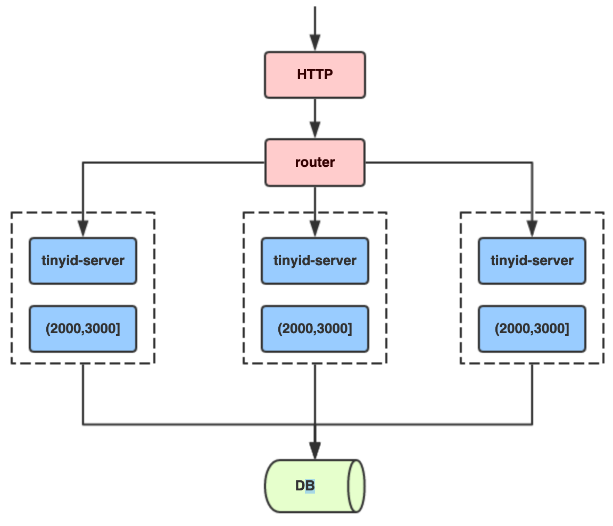

以第一个`tinyid-server`为例，当它的segment用了20%（核心源码：`segmentId.setLoadingId(segmentId.getCurrentId().get() + idInfo.getStep() * Constants.LOADING_PERCENT / 100);`，`LOADING_PERCENT`的值就是20），即设定`loadingId`为20%的阈值，例如当前id是10000，步长为10000，那么`loadingId=12000`。那么当请求分布式ID分配到12001时（或者重启后），即超过loadingId，就会返回一个特殊code：`new Result(ResultCode.LOADING, id);`tinyid-server根据`ResultCode.LOADING`这个响应码就会异步分配下一个`segment(4000, 5000]`，以此类推

## 11、其他方案

- 使用带业务含义的ID+UUID拼接来生成；

## 12、分布式唯一ID需要满足的条件

- 高可用：不能有单点故障
- 全局唯一性：不能出现重复的ID号；既然是唯一标识；这是最基本的要求;
- 趋势递增：在MySQL InnoDB引擎中使用的是聚集索引；在主键的选择上面我们应该尽量使用有序的主键保证写入性能
- 时间有序：以时间为序；或者ID里包含时间这样一是可以少一个索引；二是冷热数据容易分离;
- 分片支持：可以控制ShardingId
- 单调递增：保证下一个ID一定大于上一个ID；例如事务版本号、IM增量消息、排序等特殊需求;
- 长度适中：不要太长，最好64bit
- 信息安全：如果ID是连续的；恶意用户的扒取工作就非常容易做了；直接按照顺序下载指定URL即可;	

# 八、限流

* [限流算法的实现](https://www.jianshu.com/p/76cc8ba5ca91)
* [OpenResty防刷、限流](http://openresty.org/cn/)
* [微服务下限流算法](http://www.jiangxinlingdu.com/redis/2019/02/02/limit.html)

## 1、基本介绍

### 1.1、概念

限制流量的访问
- 访问频率
- IP连接数
- 黑白名单
- 传输速率

### 1.2、常见的思路

- 信号量计数：信号量竞争是用来控制并发的一个常见手段，它的优点即在于简单可靠，但是只能在单机环境中使用；
- 线程池隔离：隔离舱技术中也大量使用了线程池隔离的方式来实现，通过限制使用的线程数来对流量进行限制，一般会用阻塞队列配合线程池来实现
- 固定窗口计数：限制接口总并发数
- 自然窗口计数
- 滑动窗口计数
- 令牌桶和漏桶算法计数

### 1.3、计数器

- 算法思路：比如限流qps为100，思路就是从第一个请求进来开始计时，在接下去的1s内，每来一个请求，就把计数加1，如果累加的数字达到了100，那么后续的请求就会被全部拒绝。等到1s结束后，把计数恢复成0，重新开始计数；

- 具体的实现可以是这样的：对于每次服务调用，可以通过AtomicLong#incrementAndGet()方法来给计数器加1并返回最新值，通过这个最新值和阈值进行比较

- 弊端：如果我在单位时间1s内的前10ms，已经通过了100个请求，那后面的990ms，只能眼巴巴的把请求拒绝，我们把这种现象称为“突刺现象”

### 1.4、漏桶算法

漏桶是将访问请求的数据包放到桶里，如果桶满了，那么后面新来的数据包将被丢弃

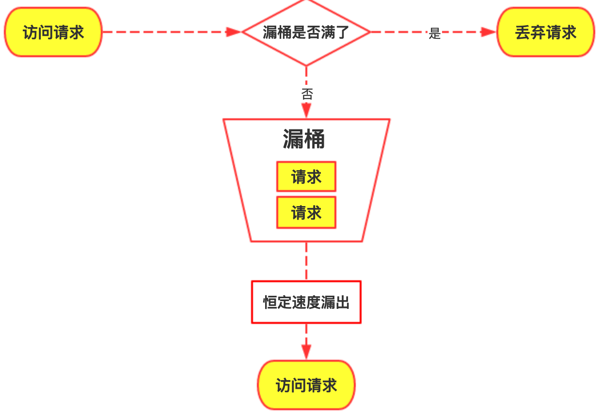

不管服务调用方多么不稳定，通过漏桶算法进行限流，每10毫秒处理一次请求，为处理的速度是固定的，请求进来的速度是未知的，可能突然进来很多请求，没来得及处理的请求就先放在桶里，既然是个桶，肯定是有容量上限，如果桶满了，那么新进来的请求就丢弃；漏桶算法能够强行限制数据的传输速率

**算法实现：**可以准备一个队列，用来保存请求，另外通过一个线程池（ScheduledExecutorService）来定期从队列中获取请求并执行，可以一次性获取多个并发执行；

**弊端：**无法应对短时间的突发流量；

对于漏桶算法限流丢弃请求，如果你觉得漏桶算法应对突发流量都还不够好，那就要更进一步，采取排队的方式来实现了，排队的方案其实就是一个更复杂的“漏桶”实现

### 1.5、令牌桶算法

令牌桶算法是对漏桶算法的一种改进，桶算法能够限制请求调用的速率，而令牌桶算法能够在限制调用的平均速率的同时还允许一定程度的突发调用，它有以下两个关键角色：
- 令牌：获取到令牌的Request才会被处理，其他Requests要么排队要么被直接丢弃
- 桶：用来装令牌的地方，所有Request都从这个桶里面获取令牌

其基本过程：

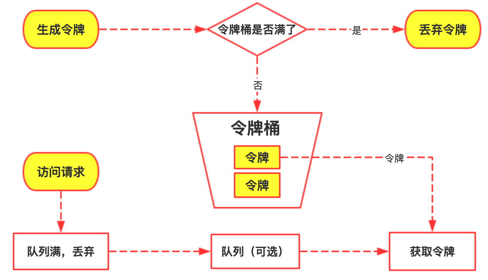

- 在令牌桶算法中，存在一个桶，用来存放固定数量的令牌。算法中存在一种机制，以一定的速率往桶中放令牌。每次请求调用需要先获取令牌，只有拿到令牌，才有机会继续执行，否则选择选择等待可用的令牌、或者直接拒绝；
- 假设令牌桶的容量是b，如果令牌桶容量已经满了，则新的令牌将会被丢弃；
- 实现思路：
	- 生成令牌：可以准备一个队列，用来保存令牌，另外通过一个线程池定期生成令牌放到队列中，每来一个请求，就从队列中获取一个令牌，并继续执行。令牌生成的速度可以分成匀速和非匀速，这两种存在区别；
	- 获取令牌：每个访问请求到来后，必须获取到一个令牌才能执行后面的逻辑。假如令牌的数量少，而访问请求较多的情况下，一部分请求自然无法获取到令牌，那么这个时候我们可以设置一个“缓冲队列”来暂存这些多余的令牌；但是缓冲队列对于令牌桶算法的实现是可选项，不一定要实现

**漏桶 vs 令牌桶的区别：**
- 这两种算法都有一个“恒定”的速率和“不定”的速率。令牌桶是以恒定速率创建令牌，但是访问请求获取令牌的速率“不定”，反正有多少令牌发多少，令牌没了就干等。而漏桶是以“恒定”的速率处理请求，但是这些请求流入桶的速率是“不定”的；
- 漏桶的天然特性决定了它不会发生突发流量，就算每秒1000个请求到来，那么它对后台服务输出的访问速率永远恒定。而令牌桶则不同，其特性可以“预存”一定量的令牌，因此在应对突发流量的时候可以在短时间消耗所有令牌，其突发流量处理效率会比漏桶高，但是导向后台系统的压力也会相应增多；

### 1.6、集群限流

可以使用redisson的RateLimiter、或者阿里的 sentinel

### 1.7、固定时间窗口

基于固定时间窗口的限流算法是非常简单的。首先需要选定一个时间起点，之后每次接口请求到来都累加计数器，如果在当前时间窗口内，根据限流规则（比如每秒钟最大允许 100 次接口请求），累加访问次数超过限流值，则限流熔断拒绝接口请求。当进入下一个时间窗口之后，计数器清零重新计数；

这种基于固定时间窗口的限流算法的缺点在于：限流策略过于粗略，无法应对两个时间窗口临界时间内的突发流量

### 1.8、滑动时间窗口

滑动时间窗口算法是对固定时间窗口算法的一种改进，流量经过滑动时间窗口算法整形之后，可以保证任意时间窗口内，都不会超过最大允许的限流值，从流量曲线上来看会更加平滑，可以部分解决上面提到的临界突发流量问题。对比固定时间窗口限流算法，滑动时间窗口限流算法的时间窗口是持续滑动的，并且除了需要一个计数器来记录时间窗口内接口请求次数之外，还需要记录在时间窗口内每个接口请求到达的时间点，对内存的占用会比较多。滑动时间窗口的算法模型如下：

滑动窗口记录的时间点 list = (t_1, t_2, …t_k)，时间窗口大小为 1 秒，起点是 list 中最小的时间点。当 t_m 时刻新的请求到来时，我们通过以下步骤来更新滑动时间窗口并判断是否限流熔断：
- STEP 1: 检查接口请求的时间 t_m 是否在当前的时间窗口 [t_start, t_start+1 秒) 内。如果是，则跳转到 STEP 3，否则跳转到 STEP 2.
- STEP 2: 向后滑动时间窗口，将时间窗口的起点 t_start 更新为 list 中的第二小时间点，并将最小的时间点从 list 中删除。然后，跳转到 STEP 1。
- STEP 3: 判断当前时间窗口内的接口请求数是否小于最大允许的接口请求限流值，即判断: list.size < max_hits_limit，如果小于，则说明没有超过限流值，允许接口请求，并将此接口请求的访问时间放入到时间窗口内，否则直接执行限流熔断。

## 2、常见限流方案

- Guava
- 网关层限流：因为它是整个访问链路的源头，是所有流量途径的第一站，目前主流的网关层有以软件为代表的Nginx；
- 中间件限流：比如MQ、Redis；利用Redis过期时间特性，可以轻松设置限流的时间跨度，另外Redis还支持Lua脚本，结合Redis+Lua可以更好的支持限流
- 业务层限流：业务网关层，Spring Cloud中的Gateway和Zuul这类网关层组件

## 3、Guava限流

### 3.1、基本原理

Guava的 RateLimiter扩展了令牌桶算法，提供了：平滑突发限流(SmoothBursty)和平滑预热限流(SmoothWarmingUp)实现，其类结构：

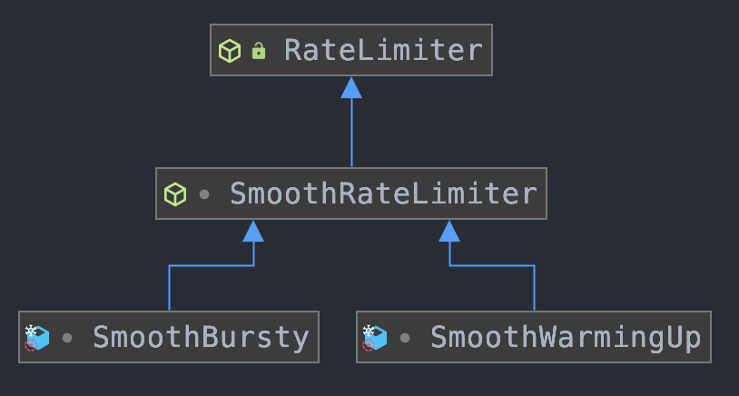

RateLimiter 是个抽象类，它提供了两套工厂方法来创建出两个子类

- 平滑突发限流

	RateLimiter使用令牌桶算法，会进行令牌的累积，如果获取令牌的频率比较低，则不会导致等待，直接获取令牌， RateLimiter由于会累积令牌，所以可以应对突发流量

	**原理**

	RateLimiter的原理就是每次调用acquire时用当前时间和nextFreeTicketMicros进行比较，根据二者的间隔和添加单位令牌的时间间隔stableIntervalMicros来刷新存储令牌数storedPermits。然后acquire会进行休眠，直到nextFreeTicketMicros

- 平滑预热限流

	RateLimiter的SmoothWarmingUp是带有预热期的平滑限流，它启动后会有一段预热期，逐步将分发频率提升到配置的速率；

	**原理**

	SmoothWarmingUp实现预热缓冲的关键在于其分发令牌的速率会随时间和令牌数而改变，速率会先慢后快。表现形式如下图所示，令牌刷新的时间间隔由长逐渐变短。等存储令牌数从maxPermits到达thresholdPermits时，发放令牌的时间价格也由coldInterval降低到了正常的stableInterval。

	实现流量预热的类是SmoothWarmingUp，它是SmoothRateLimiter的一个内部类，重点关注doSetRate方法，它是计算横纵坐标系关键节点的方法，看一下SmoothRateLimiter这个父类中定义的方法：
	```java
	// permitsPerSecond表示每秒可以发放的令牌数量
	@Override
	final void doSetRate(double permitsPerSecond, long nowMicros) {
		resync(nowMicros);
		// 计算稳定间隔，使用1s除以令牌桶容量
		double stableIntervalMicros = SECONDS.toMicros(1L) / permitsPerSecond;
		this.stableIntervalMicros = stableIntervalMicros;
		
		// 调用SmoothWarmingUp类中重载的doSetRate方法
		doSetRate(permitsPerSecond, stableIntervalMicros);
	}
	```
	父类在这里的作用主要是计算出了稳定时间间隔（使用1s / 每秒放行数量的公式来计算得出），然后预热时间、三倍间隔等是在子类的doSetRate方法中实现的：
	```java
	@Override
	void doSetRate(double permitsPerSecond, double stableIntervalMicros) {
		double oldMaxPermits = maxPermits;
		// maxPermits表示令牌桶内最大容量，它由我们设置的预热时间除以稳定间隔获得
		// 打个比方，如果stableIntervalMicros=0.1s，而我们设置的预热时间是2s
		// 那么这时候maxPermits就是2除以0.1=20
		maxPermits = warmupPeriodMicros / stableIntervalMicros;
		// 这句不用解释了吧，halfPermits是最大容量的一半
		halfPermits = maxPermits / 2.0;
		// coldIntervalMicros就是我们前面写到的3倍间隔，通过稳定间隔*3计算得出
		// 稳定间隔是0.1，3倍间隔是0.2，那么平均间隔是0.2
		double coldIntervalMicros = stableIntervalMicros * 3.0;
		// slope的意思是斜率，也就是前面我们图中预热阶段中画出的斜线（速率从稳定间隔向3x间隔变化的斜线）
		// 它的计算过程就是一个简单的求斜率公式
		slope = (coldIntervalMicros - stableIntervalMicros) / halfPermits;
		// 计算目前令牌桶的令牌个数
		if (oldMaxPermits == Double.POSITIVE_INFINITY) {
			// 如果令牌桶最大容量是无穷大，则设置当前可用令牌数为0
			// 说实话这段逻辑没什么用
			storedPermits = 0.0;
		} else {
			 // 初始化的状态是3x间隔 
			storedPermits = (oldMaxPermits == 0.0) ? maxPermits : storedPermits * maxPermits / oldMaxPermits;
		}
	}
	```

### 3.2、使用

RateLimiter其支持同步阻塞、非阻塞、非阻塞超时等限流方式；

### 3.3、不足

RateLimiter只能用于单机的限流，如果想要集群限流

## 4、Nginx-分布式限流

基于Nginx的限流方案是基于网关层的限流

```conf
# 根据IP地址限制速度
# 1） 第一个参数 $binary_remote_addr
#    binary_目的是缩写内存占用，remote_addr表示通过IP地址来限流
# 2） 第二个参数 zone=iplimit:20m
#    iplimit是一块内存区域（记录访问频率信息），20m是指这块内存区域的大小
# 3） 第三个参数 rate=1r/s
#    比如100r/m，标识访问的限流频率
limit_req_zone $binary_remote_addr zone=iplimit:20m rate=1r/s;

# 根据服务器级别做限流
limit_req_zone $server_name zone=serverlimit:10m rate=100r/s;

# 基于连接数的配置
limit_conn_zone $binary_remote_addr zone=perip:20m;
limit_conn_zone $server_name zone=perserver:20m;
    server {
        server_name www.bluefish.com;
        location /access-limit/ {
            proxy_pass http://127.0.0.1:10086/;

            # 基于IP地址的限制
            # 1） 第一个参数zone=iplimit => 引用limit_req_zone中的zone变量
            # 2） 第二个参数burst=2，设置一个大小为2的缓冲区域，当大量请求到来。
            #     请求数量超过限流频率时，将其放入缓冲区域
            # 3) 第三个参数nodelay=> 缓冲区满了以后，直接返回503异常
            limit_req zone=iplimit burst=2 nodelay;

            # 基于服务器级别的限制
            # 通常情况下，server级别的限流速率是最大的
            limit_req zone=serverlimit burst=100 nodelay;

            # 每个server最多保持100个连接
            limit_conn perserver 100;
            # 每个IP地址最多保持1个连接
            limit_conn perip 5;

            # 异常情况，返回504（默认是503）
            limit_req_status 504;
            limit_conn_status 504;
        }

        # 彩蛋
        location /download/ {
            limit_rate_after 100m;
            limit_rate 256k;
        }
    }

}
```

### 4.1、基于IP限制的限流

### 4.2、基于连接数的限流

## 5、Redis+Lua分布式限流

中间件层限流，在业务层做限流，所有流量都会到对应的业务服务器上，在高并发流量下，对服务器压力考验很多

### 5.1、为什么使用Redis+Lua

**使用Redis**
- 性能：Redis作为缓存组件，如果不采用持久化方案的话，Redis的大部分操作都是纯内存操作，性能十分优异；
- 线程安全：只用单线程承接网络请求（其他模块仍然多线程），天然具有线程安全的特性，而且对原子性操作的支持非常到位；

限流服务不仅需要承接超高QPS，还需要保证限流逻辑的执行层面具备线程安全的特性。利用Redis的这些天然特性做限流，既能保证线程安全，也能保持良好的性能

**Lua**

在使用Redis限流过程中，如果限流逻辑写在Java代码中，那么往往需要发起多个Redis查询和修改指令，比如获取令牌这样一步，这里面就涉及到查询令牌、发放令牌等等步骤，这些步骤会发起多个Redis的请求指令，造成更多的网络开销。不光如此，我们还要保证这些操作是线程安全的，如此一来，在程序中就会涉及到资源锁定等复杂操作

## 6、Sentinel

* [Sentinel使用教程与原理分析](https://github.com/all4you/sentinel-tutorial)
* [Sentinel限流](https://github.com/alibaba/Sentinel)

Sentinel 滑动时间窗限流算法实现

Sentinel 是如何计算线上系统实时QPS的

https://javadoop.com/post/sentinel

# 九、负载均衡

- 分布式系统如何负载均衡？如何确定访问的资源在哪个服务器上？
- 设计一个分布式负载均衡缓冲系统，如何快速定位到是那个服务

由一个独立的统一入口来收敛流量，再做二次分发的过程就是负载均衡

负载均衡有两方面的含义：
- 首先，大量的并发访问或数据流量分担到多台节点设备上分别处理，减少用户等待响应的时间；
- 其次，单个重负载的运算分担到多台节点设备上做并行处理，每个节点设备处理结束后，将结果汇总，返回给用户，系统处理能力得到大幅度提高

## 1、四层、七层、DNS负载均衡

所谓四层就是基于IP+端口的负载均衡；七层就是基于URL等应用层信息的负载均衡；同理，还有基于MAC地址的二层负载均衡和基于IP地址的三层负载均衡。 换句换说，二层负载均衡会通过一个虚拟MAC地址接收请求，然后再分配到真实的MAC地址；三层负载均衡会通过一个虚拟IP地址接收请求，然后再分配到真实的IP地址；四层通过虚拟IP+端口接收请求，然后再分配到真实的服务器；七层通过虚拟的URL或主机名接收请求，然后再分配到真实的服务器

### 1.1、四层负载均衡

- **概念：**基于传输层，主要针对TCP和UDP；通过虚拟IP+端口接收请求，然后再分配到真实的服务器
- **原理：**通过发布三层的IP地址，然后加四层的端口号，来决定哪些流量需要做负载均衡，对需要处理的流量进行NAT处理，转发至后台服务器，并记录下这个TCP或者UDP的流量是由哪台服务器处理的，后续这个连接的所有流量都同样转发到同一台服务器处理
- **常见**

Nginx1.9版本后又新的模块支持四层负载均衡

### 1.2、七层负载均衡

七层的负载均衡，就是在四层的基础上（没有四层是绝对不可能有七层的），再考虑应用层的特征，比如同一个Web服务器的负载均衡，除了根据VIP加80端口辨别是否需要处理的流量，还可根据七层的URL、浏览器类别、语言来决定是否要进行负载均衡。举个例子，如果你的Web服务器分成两组，一组是中文语言的，一组是英文语言的，那么七层负载均衡就可以当用户来访问你的域名时，自动辨别用户语言，然后选择对应的语言服务器组进行负载均衡处理

### 1.3、四层、七层负载均衡区别

**技术原理上的区别：**

- 所谓四层负载均衡，也就是主要通过报文中的目标地址和端口，再加上负载均衡设备设置的服务器选择方式，决定最终选择的内部服务器。

	以常见的TCP为例，负载均衡设备在接收到第一个来自客户端的SYN 请求时，即通过上述方式选择一个最佳的服务器，并对报文中目标IP地址进行修改(改为后端服务器IP），直接转发给该服务器。TCP的连接建立，即三次握手是客户端和服务器直接建立的，负载均衡设备只是起到一个类似路由器的转发动作。在某些部署情况下，为保证服务器回包可以正确返回给负载均衡设备，在转发报文的同时可能还会对报文原来的源地址进行修改；

- 所谓七层负载均衡，也称为“内容交换”，也就是主要通过报文中的真正有意义的应用层内容，再加上负载均衡设备设置的服务器选择方式，决定最终选择的内部服务器。

	以常见的TCP为例，负载均衡设备如果要根据真正的应用层内容再选择服务器，只能先代理最终的服务器和客户端建立连接(三次握手)后，才可能接受到客户端发送的真正应用层内容的报文，然后再根据该报文中的特定字段，再加上负载均衡设备设置的服务器选择方式，决定最终选择的内部服务器。负载均衡设备在这种情况下，更类似于一个代理服务器。负载均衡和前端的客户端以及后端的服务器会分别建立TCP连接。所以从这个技术原理上来看，七层负载均衡明显的对负载均衡设备的要求更高，处理七层的能力也必然会低于四层模式的部署方式

**应用场景的需求：**

- 七层应用负载的好处，是使得整个网络更”智能化
- 安全性角度：从技术原理上也可以看出，四层模式下这些SYN Flood攻击都会被转发到后端的服务器上；而七层模式下这些SYN攻击自然在负载均衡设备上就截止，不会影响后台服务器的正常运营
- 现在的7层负载均衡，主要还是着重于应用HTTP协议，所以其应用范围主要是众多的网站或者内部信息平台等基于B/S开发的系统。 4层负载均衡则对应其他TCP应用；

**七层应用需要考虑的问题：**

- 是否真的必要：七层应用的确可以提高流量智能化，同时必不可免的带来设备配置复杂，负载均衡压力增高以及故障排查上的复杂性等问题；
- 是否真的可以提高安全性：例如SYN Flood攻击，七层模式的确将这些流量从服务器屏蔽，但负载均衡设备本身要有强大的抗DDoS能力，否则即使服务器正常而作为中枢调度的负载均衡设备故障也会导致整个应用的崩溃；
- 是否有足够的灵活度：七层应用的优势是可以让整个应用的流量智能化，但是负载均衡设备需要提供完善的七层功能，满足客户根据不同情况的基于应用的调度。最简单的一个考核就是能否取代后台Nginx或者Apache等服务器上的调度功能。能够提供一个七层应用开发接口的负载均衡设备，可以让客户根据需求任意设定功能，才真正有可能提供强大的灵活性和智能性

### 1.4、DNS负载均衡

## 2、软件负载均衡

软件负载均衡解决方案是指在一台或多台服务器相应的操作系统上安装一个或多个附加软件来实现负载均衡，如DNS Load Balance，CheckPoint Firewall-1 ConnectControl等，它的优点是基于特定环境，配置简单，使用灵活，成本低廉，可以满足一般的负载均衡需求；

软件解决方案缺点也较多，因为每台服务器上安装额外的软件运行会消耗系统不定量的资源，越是功能强大的模块，消耗得越多，所以当连接请求特别大的时候，软件本身会成为服务器工作成败的一个关键；软件可扩展性并不是很好，受到操作系统的限制；由于操作系统本身的Bug，往往会引起安全问题

常见的有：
- Nginx
- LVS
- HAProxy

如果是中小型的Web应用，比如日PV小于1000万，用Nginx就完全可以了；如果机器不少，可以用DNS轮询，LVS所耗费的机器还是比较多的；大型网站或重要的服务，且服务器比较多时，可以考虑用LVS

### 2.1、Nginx

**优点：**

- 工作在网络的7层之上，可以针对http应用做一些分流的策略，比如针对域名、目录结构，它的正则规则比HAProxy更为强大和灵活，这也是它目前广泛流行的主要原因之一，Nginx单凭这点可利用的场合就远多于LVS了。其在1.9版本之后也支持四层负载均衡了；
- Nginx对网络稳定性的依赖非常小，理论上能ping通就就能进行负载功能，这个也是它的优势之一；相反LVS对网络稳定性依赖比较大；
- Nginx安装和配置比较简单，测试起来比较方便，它基本能把错误用日志打印出来。LVS的配置、测试就要花比较长的时间了，LVS对网络依赖比较大；
- 可以承担高负载压力且稳定，在硬件不差的情况下一般能支撑几万次的并发量，负载度比LVS相对小些；
- Nginx可以通过端口检测到服务器内部的故障，比如根据服务器处理网页返回的状态码、超时等等，并且会把返回错误的请求重新提交到另一个节点，不过其中缺点就是不支持url来检测；LVS就直接断掉了，如果是上传一个很大的文件或者很重要的文件的话，用户可能会因此而不满；
- Nginx不仅仅是一款优秀的负载均衡器/反向代理软件，它同时也是功能强大的Web应用服务器；
- Nginx现在作为Web反向加速缓存越来越成熟了，速度比传统的Squid服务器更快，可以考虑用其作为反向代理加速器；
- Nginx可作为中层反向代理使用；
- Nginx也可作为静态网页和图片服务器；

**缺点：**

- Nginx仅能支持http、https和Email协议；
- 对后端服务器的健康检查，只支持通过端口来检测，不支持通过url来检测。不支持Session的直接保持，但能通过ip_hash来解决；

### 2.2、LVS

使用Linux内核集群实现一个高性能、高可用的负载均衡服务器，它具有很好的可伸缩性（Scalability)、可靠性（Reliability)和可管理性（Manageability)

**优点：**

- 抗负载能力强、是工作在网络4层之上仅作分发之用，没有流量的产生，这个特点也决定了它在负载均衡软件里的性能最强的，对内存和cpu资源消耗比较低；
- 配置性比较低，这是一个缺点也是一个优点，因为没有可太多配置的东西，所以并不需要太多接触，大大减少了人为出错的几率；
- 工作稳定，因为其本身抗负载能力很强，自身有完整的双机热备方案，如LVS+Keepalived；
- 无流量，LVS只分发请求，而流量并不从它本身出去，这点保证了均衡器IO的性能不会受到大流量的影响；
- 应用范围比较广，因为LVS工作在4层，所以它几乎可以对所有应用做负载均衡，包括http、数据库、在线聊天室等等；

**缺点：**

- 软件本身不支持正则表达式处理，不能做动静分离；而现在许多网站在这方面都有较强的需求，这个是Nginx/HAProxy+Keepalived的优势所在；
- 如果是网站应用比较庞大的话，LVS/DR+Keepalived实施起来就比较复杂了，特别后面有 Windows Server的机器的话，如果实施及配置还有维护过程就比较复杂了，相对而言，Nginx/HAProxy+Keepalived就简单多了

### 2.3、HAProxy

- HAProxy也是支持虚拟主机的；
- HAProxy的优点能够补充Nginx的一些缺点，比如支持Session的保持，Cookie的引导；同时支持通过获取指定的url来检测后端服务器的状态；
- HAProxy跟LVS类似，本身就只是一款负载均衡软件；单纯从效率上来讲HAProxy会比Nginx有更出色的负载均衡速度，在并发处理上也是优于Nginx的；
- HAProxy支持TCP协议的负载均衡转发，可以对MySQL读进行负载均衡，对后端的MySQL节点进行检测和负载均衡，大家可以用LVS+Keepalived对MySQL主从做负载均衡

HAProxy负载均衡策略非常多，HAProxy的负载均衡算法现在具体有如下8种：
- ① roundrobin，表示简单的轮询，这个不多说，这个是负载均衡基本都具备的；
- ② static-rr，表示根据权重，建议关注；
- ③ leastconn，表示最少连接者先处理，建议关注；
- ④ source，表示根据请求源IP，这个跟Nginx的IP_hash机制类似，我们用其作为解决session问题的一种方法，建议关注；
- ⑤ ri，表示根据请求的URI；
- ⑥ rl_param，表示根据请求的URl参数’balance url_param’ requires an URL parameter name；
- ⑦ hdr(name)，表示根据HTTP请求头来锁定每一次HTTP请求；
- ⑧ rdp-cookie(name)，表示根据据cookie(name)来锁定并哈希每一次TCP请求

### 2.4、软件负载均衡架构选择

第一阶段：利用Nginx或HAProxy进行单点的负载均衡，这一阶段服务器规模刚脱离开单服务器、单数据库的模式，需要一定的负载均衡，但是仍然规模较小没有专业的维护团队来进行维护，也没有需要进行大规模的网站部署。这样利用Nginx或HAproxy就是第一选择，此时这些东西上手快， 配置容易，在七层之上利用HTTP协议就可以。这时是第一选择。

第二阶段：随着网络服务进一步扩大，这时单点的Nginx已经不能满足，这时使用LVS或者商用Array就是首要选择，Nginx此时就作为LVS或者Array的节点来使用，具体LVS或Array的是选择是根据公司规模和预算来选择，Array的应用交付功能非常强大，本人在某项目中使用过，性价比也远高于F5，商用首选，但是一般来说这阶段相关人才跟不上业务的提升，所以购买商业负载均衡已经成为了必经之路。

第三阶段：这时网络服务已经成为主流产品，此时随着公司知名度也进一步扩展，相关人才的能力以及数量也随之提升，这时无论从开发适合自身产品的定制，以及降低成本来讲开源的LVS，已经成为首选，这时LVS会成为主流。

最终形成比较理想的基本架构为：Array/LVS — Nginx/Haproxy — Squid/Varnish — AppServer。

## 3、硬件负载均衡

硬件负载均衡解决方案是直接在服务器和外部网络间安装负载均衡设备，这种设备我们通常称之为负载均衡器，由于专门的设备完成专门的任务，独立于操作系统，整体性能得到大量提高，加上多样化的负载均衡策略，智能化的流量管理，可达到最佳的负载均衡需求；

一般而言，硬件负载均衡在功能、性能上优于软件方式，不过成本昂贵

常见的有：
- F5
- Array

## 4、负载均衡策略

### 4.1、轮询-默认的负载策略

每一次来自网络的请求轮流分配给内部中的服务器，从1至N然后重新开始。此种均衡算法适合于服务器组中的所有服务器都有相同的软硬件配置并且平均服务请求相对均衡的情况

### 4.2、加权轮询

在轮询的基础上，增加了一个权重的概念。权重是一个泛化后的概念，可以用任意方式来体现，本质上是一个能者多劳思想。此种均衡算法能确保高性能的服务器得到更多的使用率，避免低性能的服务器负载过重；

### 4.3、随机

把来自网络的请求随机分配给内部中的多个服务器

### 4.4、加权随机

此种均衡算法类似于权重轮循算法，不过在处理请求分担时是个随机选择的过程

### 4.5、最快响应

负载均衡设备对内部各服务器发出一个探测请求（例如Ping），然后根据内部中各服务器对探测请求的最快响应时间来决定哪一台服务器来响应客户端的服务请求。此种均衡算法能较好的反映服务器的当前运行状态，但这最快响应时间仅仅指的是负载均衡设备与服务器间的最快响应时间，而不是客户端与服务器间的最快响应时间

### 4.6、最少连接数

这是一种根据实时的负载情况，进行动态负载均衡的方式。维护好活动中的连接数量，然后取最小的返回即可。最少连接数均衡算法对内部中需负载的每一台服务器都有一个数据记录，记录当前该服务器正在处理的连接数量，当有新的服务连接请求时，将把当前请求分配给连接数最少的服务器，使均衡更加符合实际情况，负载更加均衡。此种均衡算法适合长时处理的请求服务，如FTP

### 4.7、Hash法

hash法的负载均衡与之前的几种不同在于，它的结果是由客户端决定的。通过客户端带来的某个标识经过一个标准化的散列函数进行打散分摊
- ip_hash：

### 4.8、负载均衡策略比较

策略 | 优点 | 缺点 | 适用场景
----|-----|------|-------
顺序轮询|静态、稳定|不关系服务端负载，服务端处理能力的波动可能产生堵塞|服务端处理能力相同且稳定性高
加权轮询|静态、稳定、允许服务端性能差异|不关系服务端负载，服务端处理能力的波动可能产生堵塞|服务端处理能力符合预期且稳定性高
最少连接|动态、实时变化|复杂度提升，每次开关连接时需要计数|服务端处理能力有波动
最快响应|动态、实时变化，支持到请求级别比最少连接更灵敏|复杂度提升，需要计算请求的响应时间|服务端处理能力有波动
Hash|算法稳定|由客户端决定分布，可能导致分布不均|同一个客户端和服务端反复通信

## 5、客户端负载与服务端负载

**客户端负载**

需要将服务端的地址列表保存在客户端，客户端通过负载均衡策略调用具体的机器；

**服务端负载**

客户端访问负载均衡（Nginx、F5等）组件，负载均衡组件选择具体的服务，客户端并不知道具体调用的是哪台机器；

**区别：**
- 客户端负载开发团队能够灵活修改；服务端的负载一般是由运维来管理的；
- 客户端运维成本低；服务端负载运维成本高；
- 客户端强依赖注册中心；服务端通常不依赖注册中心；
- 客户端一般在微服务架构；服务端tomcat等传统应用：F5等；

## 6、健康探测机制

- HTTP探测

- TCP探测

- UDP探测

# 十、分布式链路追踪

## 1、Jaeger


## 2、skyWalking

- [SkyWalking](https://github.com/apache/incubator-skywalking)
- [SkyWalking-Agent 插件体系](http://www.iocoder.cn/SkyWalking/agent-plugin-system/)
- [SkyWalking中文文档](http://www.itmuch.com/books/skywalking/)

### 2.1、基本概念

### 2.2、使用

#### 2.2.2.1、单机版SkyWalking

- 环境要求：JDK8+，如使用 ElasticSearch7 的版本，那么需要 JDK 11+；
- 确保如下端口可用：
	- 11800：和Skywalking通信的gRPC端口
	- 12800：和Skywalking通信的HTTP端口
	- 8080：UI所占用的端口
- 下载[Skywalking](https://skywalking.apache.org/)
- 解压，并到bin目录：`cd apache-skywalking-apm-bin/bin`，执行启动命令：`sh startup.sh`
- 页面访问：`http://localhost:8080`，页面：
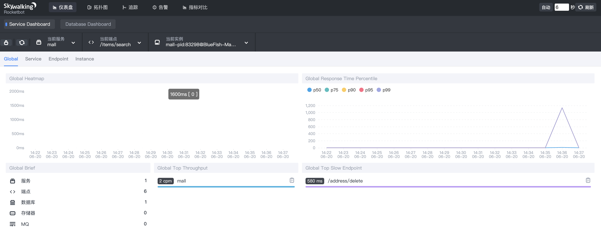

### 2.3、Skywalking架构

### 2.4、Skywalking使用

Skywalking有多种使用方式，目前最流行(也是最强大)的使用方式是基于Java agent的。Java agent支持的框架、中间件等，[具体列表](https://github.com/apache/skywalking/blob/v6.6.0/docs/en/setup/service-agent/java-agent/Supported-list.md)

**配置agent**

skywalking的agent目录结构：
```
+-- agent
    +-- activations
         apm-toolkit-log4j-1.x-activation.jar
         apm-toolkit-log4j-2.x-activation.jar
         apm-toolkit-logback-1.x-activation.jar
         ...
    +-- config
         agent.config  
    +-- plugins
         apm-dubbo-plugin.jar
         apm-feign-default-http-9.x.jar
         apm-httpClient-4.x-plugin.jar
         .....
    skywalking-agent.jar
```
- 将 agent 目录拷贝到任意位置，避免污染源agent；
- 配置 config/agent.config ：如果Skywalking和微服务部署在不同的服务器，还需修改 collector.backend_service 的值，该配置用来指定微服务和Skywalking通信的地址，默认是 127.0.0.1:11800 ，按需修改即可。当然 agent.config 文件里面有很多的配置，本文下面的表格有详细讲解

**启动应用**

- `java -jar` 启动的应用：`java -javaagent:/opt/agent/skywalking-agent.jar -Dskywalking.agent.service_name=mall -jar spring-boot.jar`
- Tomcat应用：修改 `${TOMCAT_HOME}/bin/catalina.sh` 的第一行：`CATALINA_OPTS="$CATALINA_OPTS -javaagent:/opt/agent/skywalking-agent.jar"; export CATALINA_OPTS`

### 2.5、Java agent插件

[Java Agent](../Java虚拟机/JVM-字节码.md#5字节码运用-JavaAgent) 是插件化、可插拔的，Skywalking的插件分为三种：
- 内置插件：在agent的 `plugins` 目录下；
- 引导插件：在agent的 `bootstrap-plugins` 目录下；
- 可选插件：在agent的 `optional-plugins` 目录下；

Java Agent只会启用 plugins 目录下的所有插件，bootstrap-plugins 目录以及 optional-plugins 目录下的插件不会启用。如需启用引导插件或可选插件，只需将JAR包移到 plugins 目录下，如需禁用某款插件，只需从 plugins 目录中移除即可；

插件扩展：Skywalking生态还有一些插件扩展，例如Oracle、Resin插件等。这部分插件主要是由于许可证不兼容/限制，Skywalking无法将这部分插件直接打包到Skywalking安装包内，于是托管在这个[地址](https://github.com/SkyAPM/java-plugin-extensions)，如果需要使用的话，直接下载放到plugins目录下即可

**Java agent配置：**

详细Java agent配置参考：https://github.com/apache/skywalking/blob/v6.6.0/docs/en/setup/service-agent/java-agent/README.md

**配置方式：**

agent的配置方式有很多种：
- agent config方法：在agent/config目录下，有个agent.config配置文件，可以直接在里面配置，比如：`agent.service_name=mall`

- 系统属性(-D)：使用 `-Dskywalking. + agent.config`配置文件中的key 即可；例如：`agent.config` 文件中有一个属性名为 `agent.service_name`，那么如果使用系统属性的方式，则可以写成：`java -javaagent:/opt/agent/skywalking-agent.jar -Dskywalking.agent.service_name=你想设置的值 -jar spring-boot.jar`

- 代理选项：在JVM参数中的代理路径之后添加属性即可。格式：`-javaagent:/path/to/skywalking-agent.jar=[option1]=[value1],[option2]=[value2]`；例如：`java -javaagent:/opt/agent/skywalking-agent.jar=agent.service_name=你想设置的值 -jar somr-spring-boot.jar`；

- 系统环境变量：agent.config 文件中默认的大写值，都可以作为环境变量引用。例如，agent.config 中有如下内容：`agent.service_name=${SW_AGENT_NAME:Your_ApplicationName}`；这说明Skywalking会读取名为 SW_AGENT_NAME 的环境变量。

配置优先级：`代理选项 > 系统属性（-D） > 系统环境变量 > 配置文件`

### 2.6、配置监听任意方法

在 Skywalking中有个插件 `apm-customize-enhance-plugin.jar`，可以自定义增强任意类里的方法，从而实现对任意类里任意方法的监控;

举个例子，有一个类，定义如下：
```java
package com.blue.fish.demo.service;
public class TestService1 {
    public static void staticMethod(String str0, int count, Map m, List l, Object[] os) {
      // 业务逻辑
    }
  ...
}
```
那么，想要对该方法进行监控，则可如下操作：
- 移动jar包：将 `optional-plugins/apm-customize-enhance-plugin-6.5.0.jar` 移动到`plugins` 目录；
- 编写增强规则，编写一个文件，名为例如 customize_enhance.xml ，内容如下：
	```xml
	<?xml version="1.0" encoding="UTF-8"?>
	<enhanced>
		<class class_name="com.blue.fish.demo.service.TestService1">
			<method method="staticMethod(java.lang.String,int.class,java.util.Map,java.util.List,[Ljava.lang.Object;)" operation_name="/is_static_method_args" static="true">
				<operation_name_suffix>arg[0]</operation_name_suffix>
				<operation_name_suffix>arg[1]</operation_name_suffix>
				<operation_name_suffix>arg[3].[0]</operation_name_suffix>
				<tag key="tag_1">arg[2].['k1']</tag>
				<tag key="tag_2">arg[4].[1]</tag>
				<log key="log_1">arg[4].[2]</log>
			</method>
		</class>
	</enhanced>
	```
	配置说明：
	|配置	|说明|
	|------|----|
	|class_name	|要被增强的类|
	|method | 类的拦截器方法，方法参数：基本类型.class、引用类型是全类名（java.lang.String）、如果是数组的话可以写个方法打印出来即可|
	|operation_name |	如果进行了配置，将用它替代默认的operation_name|
	|operation_name_suffix|	表示在operation_name后添加动态数据|
	|static	|方法是否为静态方法|
	|tag	|将在local span中添加一个tag。key的值需要在XML节点上表示。|
	|log	|将在local span中添加一个log。key的值需要在XML节点上表示。|
	|`arg[x]`	|表示输入的参数值。比如args[0]表示第一个参数。|
	|`.[x]`	|当正在被解析的对象是Array或List，你可以用这个表达式得到对应index上的对象。|
	|`.[‘key’]`	|当正在被解析的对象是Map, 你可以用这个表达式得到map的key。|
- 配置：agent.config中添加配置：`plugin.customize.enhance_file=customize_enhance.xml的绝对路径`

### 2.7、配置忽略endpoint

插件 `apm-trace-ignore-plugin`，过滤掉希望被忽略的endpoint，可以设置多个URL路径模式。匹配到的endpoint将会不会被追踪，当前的匹配规则遵循Ant Path匹配样式，比如/path/*，/path/**，/path/?；

将`apm-trace-ignore-plugin-x.jar`复制到`agent/plugins`，重启agent，插件将会生效；

有两种方式配置要忽略的endpoint的模式。通过系统环境变量配置有更高的优先级：
- 通过设置系统环境变量配置。增加 skywalking.trace.ignore_path 到系统环境变量中，值是要忽略的路径。多个路径之间用，分隔；
- 将`/agent/optional-plugins/apm-trace-ignore-plugin/apm-trace-ignore-plugin.config` 复制到 `/agent/config/` 目录下, 增加过滤规则：`trace.ignore_path=/your/path/1/**,/your/path/2/**`

### 2.8、编写Skywalking插件

- [Skywalking插件开发指南](http://www.itmuch.com/books/skywalking/guides/Java-Plugin-Development-Guide.html)
- [SkyWalking apm-sniffer原理学习与插件编写](https://skywalking.apache.org/zh/blog/2018-12-21-SkyWalking-apm-sniffer-beginning.html)

**前置知识：**
- Java Agent
- [byte-buddy](https://github.com/raphw/byte-buddy)：动态操作二进制码的库

**术语：**
- Span：可理解为一次方法调用，一个程序块的调用，或一次RPC/数据库访问。只要是一个具有完整时间周期的程序访问，都可以被认为是一个span。SkyWalking Span 对象中的重要属性
	- component：组件，详见:ComponentsDefine.Class
	- tag：标签，k-v结构，关键标签，key详见：Tags.Class
	- peer：对端资源，用于拓扑图，若DB组件，需记录集群信息；
	- operationName：操作名称，若span=0，operationName将会搜索的下拉列表；
	- layer：显示，在链路页显示，详见SpanLayer.Class。
- Trace：调用链，通过归属于其的Span来隐性的定义。一条Trace可被认为是一个由多个Span组成的有向无环图（DAG图），在SkyWalking链路模块你可以看到，Trace又由多个归属于其的trace segment组成。
- Trace segment：Segment是SkyWalking中的一个概念，它应该包括单个OS进程中每个请求的所有范围，通常是基于语言的单线程。由多个归属于本线程操作的Span组成

具体可以参考：[SkyWalking Plugin](https://gitee.com/chenlanqing/java-component/blob/master/monitor/skywalking-plugin/README.md)

### 2.9、告警配置

Skywalking的告警由规则来定义，规则存放在 skywalking根目录`/config/alarm-settings.yml`中，该文件结构大致如下：
```yml
rules:
  endpoint_percent_rule:
    metrics-name: endpoint_percent
    include-names:
      - dubbox-provider
    exclude-names:
      - dubbox-consumer
    threshold: 75
    op: <
    period: 10
    count: 3
    silence-period: 10
    message: Successful rate of endpoint {name} is lower than 75%
webhooks:
  - http://127.0.0.1/notify/
  - http://127.0.0.1/go-wechat/
```
**规则定义：**

规则的key的含义如下：
- endpoint_percent_rule：规则名称，将会在告警消息体中展示，必须唯一，且以 _rule 结尾；
- metrics-name：度量名称，取值可在 skywalking根目录/config/official_analysis.oal 中找到，填写其中的key即可，对OAL感兴趣的，可前往 https://github.com/apache/skywalking/blob/v6.6.0/docs/en/concepts-and-designs/oal.md 阅读其定义；
- include-names：将此规则作用于匹配的实体名称上，实体名称可以是服务名称或端点名称等
- exclude-names：将此规则作用于不匹配的实体名称上，实体名称可以是服务名称或端点名称等
- threshold：阈值
- op：操作符，目前支持 >、<、=
- period：多久检测一次告警规则，即检测规则是否满足的时间窗口，与后端开发环境匹配
- count：在一个period窗口中，如果实际值超过该数值将触发告警
- silence-period：触发告警后，在silence-period这个时间窗口中不告警，该值默认和period相同。例如，在时间T这个瞬间触发了某告警，那么在(T+10)这个时间段，不会再次触发相同告警
- message：告警消息体，{name} 会解析成规则名称；

**默认规则：**

Skywalking默认提供的 alarm-settings.yml ，定义的告警规则如下：
```
过去3分钟内服务平均响应时间超过1秒
服务成功率在过去2分钟内低于80%
服务90%响应时间在过去3分钟内高于1000毫秒
服务实例在过去2分钟内的平均响应时间超过1秒
端点平均响应时间过去2分钟超过1秒
```

**Webhook：**

Webhook表达的意思是，当告警发生时，将会请求的地址URL（用POST方法）。警报消息将会以 application/json 格式发送出去。消息例如：
```json
[
    {
        "scopeId":1,
        "scope":"SERVICE",
        "name":"serviceA",
        "id0":12,
        "id1":0,
        "ruleName":"service_resp_time_rule",
        "alarmMessage":"alarmMessage xxxx",
        "startTime":1560524171000
    }
]
```
- scopeId、scope：作用域，[取值范围](https://github.com/apache/skywalking/blob/v6.6.0/oap-server/server-core/src/main/java/org/apache/skywalking/oap/server/core/source/DefaultScopeDefine.java)
- name：目标作用域下的实体名称；
- id0：作用域下实体的ID，与名称匹配；
- id1：暂不使用；
- ruleName： alarm-settings.yml 中配置的规则名称；
- alarmMessage：告警消息体；
- startTime：告警时间（毫秒），时间戳形式

根据如上消息体，可定义入参对象如下：
```java
public class SkyWalkingAlarm {
    private Integer scopeId;
    private String scope;
    private String name;
    private Integer id0;
    private Integer id1;
    private String ruleName;
    private String alarmMessage;
    private Long startTime;
    // getters and setters...
}
```
Controller编写如下即可：
```java
public class SkyWalkingAlarmController {
    @PostMapping("/alarm")
    public IMOOCJSONResult alarm(@RequestBody List<SkyWalkingAlarm> alarms) {
        // 接收到告警后的业务处理
        // 根据服务发现组件上面的服务名称，找到对应的/actuator/info
        // 如果配置了相关的info属性，可以从中获取到对应的info属性，比如邮件等信息；
        return IMOOCJSONResult.ok();
    }
}
```

### 2.10、动态配置

从Skywalking 6.5.0开始，部分Skywalking配置项支持“动态配置”，这样修改完配置后，就无需重启Skywalking啦

### 2.11、skywalking+istio

基于skywalking+istio 构建 APM、链路追踪

## 3、zipkin

https://juejin.im/post/5a7a9e0af265da4e914b46f1
https://juejin.im/post/5c3604abe51d45522a41f4b0

## 4、Pinpoint


## 4、Spring Cloud Sleuth


## 5、MDC：Mapped Diagnostic Context，映射调试上下文

# 十一、RPC

## 1、RPC-Remote Procedure Call

远程过程调用
- 一种通过网络从远程计算机程序上请求服务，不需要了解底层网络技术的协议；
- 在OSI网络通信模型中，RPC跨越了传输层和应用层；
- RPC 是一种技术思想而非一种规范或协议；
- 隐藏底层网络通信的复杂性，让我们更专注于业务逻辑；

一个典型的RPC使用场景中，包含了服务发现、负载、容错、网络传输、序列化等组件

RPC 是一个远程调用，就需要通过网络来传输数据，并且 RPC 常用于业务系统之间的数据交互，需要保证其可靠性，所以 RPC 一般默认采用 TCP 来传输。我们常用的 HTTP 协议也是建立在 TCP 之上的

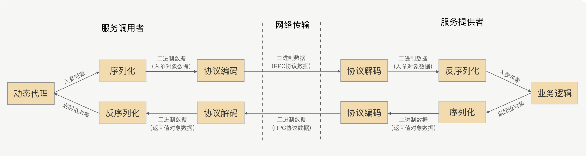

整体过程：
- 客户端 invoke 方法编写，使用 JDK 的动态代理技术，客户端调用远程服务方法时调用的是 InvocationHandler 的 invoke 方法。
- 客户端 Filter 方法编写，完善的 RPC 框架少不了监控、路由、降级、鉴权等功能。
- 创建 Socket，在 Filter 方法中实现 Client.write 方法，其逻辑为从连接池（ChannelPool）中获取连接，然后将数据写进 Channel。
- 实现数据序列化、压缩，目的减少网络传输的数据量，向服务端发送 request 数据，这里可以使用 Netty 异步通讯框架。
- 服务端收到客户端发过的消息后，从 Channel 中将消息读出来之前，也会先经反序列化解压。
- 请求就到了服务端 Filter 中。请求依次经过监控、鉴权方法。
- 根据客户端传递来的服务信息和参数，通过反射调用相应的业务服务并拿到业务处理结果。然后在 ResponseFilter 中将返回结果写入 Channel。
- 服务端序列化、压缩等，发送给客户端。
- 客户端收到消息后，经过客户端反序列化、解压缩，后交给 ResponseThreadPoolProcessor 线程池处理。
- ResponseThreadPoolProcessor 收到消息后，就将结果返回给之前的方法调用，整个调用请求就结束了

## 2、为什么要使用RPC

两个不同的服务器上的服务提供的方法不在一个内存空间，所以，需要通过网络编程才能传递方法调用所需要的参数。并且，方法调用的结果也需要通过网络编程来接收。但是，如果我们自己手动网络编程来实现这个调用过程的话工作量是非常大的，因为，我们需要考虑底层传输方式（TCP 还是 UDP）、序列化方式等等方面
- 可以做到分布式，现代化的微服务；
- 部署灵活， 解耦服务， 扩展性强；

## 3、工作原理

RPC 采用客户机/服务器模式。请求程序是一个客户机，而服务提供程序是一个服务器。
* 首先，客户机调用进程发送一个有进程参数的调用信息到服务进程，然后等待应答信息。
* 在服务端，进程保持睡眠状态直到调用信息到达为止。
* 当一个调用信息到达，服务端获得进程参数，计算结果，发送答复信息，然后等待下一个调用信息。
* 最后，客户端调用进程接收答复信息，获得进程结果，然后调用执行继续进行；

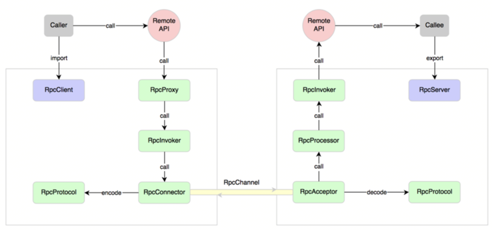

如果需要实现一个基本的RPC框架，涉及的知识点：
- TCP网络
- 动态代理：RPC 框架根据调用的服务接口提前生成动态代理实现类，并通过依赖注入等技术注入到声明了该接口的相关业务逻辑里面；
- 反射
- 序列化、反序列化
- 网络通信
- 编解码
- 服务发现和注册
- 心跳与链路检测

生产者端流程：
- 加载服务，并缓存
- 启动通讯服务器（Netty）
- 服务注册（把通讯地址放入zookeeper，也可以把加载到的服务也放进去）
- 反射，本地调用

消费者端流程：
- 代理服务接口
- 服务发现（连接zookeeper，拿到服务地址列表）
- 远程调用（轮询生产者服务列表，发送消息）

## 4、RPC框架解决的问题

- 通信问题：即A与B之间通讯，建立TCP连接；
- 寻址问题：A通过RPC框架连接到B的服务器及特定端口和调用的方法名；
- 序列化：发起远程调用参数数值需要二进制化，服务接收到二进制参数后需要反序列化

## 5、与HTTP服务相比

- HTTP服务：
    * HTTP服务主要基于HTTP协议；
    * RESTful风格的服务接口；
    * 主要是进行接口开发；
    * 3次握手，有网络开销；
- RPC服务:
    * RPC主要基于TCP/IP协议；
    * 一般都有注册中心，有丰富的监控管理；
    * 长连接；
	* 可以支持高性能化序列化协议

**为什么不用Http协议？**

相对于 HTTP 的用处，RPC 更多的是负责应用间的通信，所以性能要求相对更高，但HTTP 协议的数据包大小相对请求数据本身要大很多，又需要加入很多无用的内容，比如换行符号、回车符等；还有一个更重要的原因是，HTTP 协议属于无状态协议，客户端无法对请求和响应进行关联，每次请求都需要重新建立连接，响应完成后再关闭连接

关键点就是利用好 Header 中的扩展字段以及 Payload 中的扩展字段，通过扩展字段向后兼容

## 6、序列化

### 6.1、

## 6、基于TCP协议实现RPC

**6.1、原理**

- 基于Java的反射机制和Socket API实现；
- 方法的调用使用反射机制，消费者需要把调用的接口名称方法参数通过Socket通道传到服务端，服务端再通过反射机制
    调用对应的方法获取到值，再通过相同的方法把结果返回给消费者；

## 7、主流RPC框架

业界主流的 RPC 框架整体上分为三类：
- 支持多语言的 RPC 框架，比较成熟的有 Google 的 gRPC、Apache（Facebook）的 Thrift；
- 只支持特定语言的 RPC 框架，例如新浪微博的 Motan；
- 支持服务治理等服务化特性的分布式服务框架，其底层内核仍然是 RPC 框架, 例如阿里的 Dubbo

# 十二、分布式文件系统

## 1、什么是分布式文件系统

- 随着文件数据的越来越多，通过tomcat或nginx虚拟化的静态资源文件在单一的一个服务器节点内是存不下的，如果用多个节点来存储也可以，但是不利于管理和维护，所以我们需要一个系统来管理多台计算机节点上的文件数据，这就是分布式文件系统。
- 分布式文件系统是一个允许文件通过网络在多台节点上分享的文件系统，多台计算机节点共同组成一个整体，为更多的用户提供分享文件和存储空间。比如常见的网盘，本质就是一个分布式的文件存储系统。虽然我们是一个分布式的文件系统，但是对用户来说是透明的，用户使用的时候，就像是访问本地磁盘一样。
- 分布式文件系统可以提供冗余备份，所以容错能力很高。 系统中有某些节点宕机，但是整体文件服务不会停止，还是能够为用户提供服务，整体还是运作的，数据也不会丢失。
- 分布式文件系统的可扩展性强，增加或减少节点都很简单，不会影响线上服务，增加完毕后会发布到线上，加入到集群中为用户提供服务。
- 分布式文件系统可以提供负载均衡能力，在读取文件副本的时候可以由多个节点共同提供服务，而且可以通过横向扩展来确保性能的提升与负载。

## 2、为什么要使用分布式文件系统

使用分布式文件系统可以解决如下几点问题：
- 海量文件数据存储
- 文件数据高可用(冗余备份)
- 读写性能和负载均衡

以上3点都是我们之前使用tomcat或nginx所不能够实现的，这也是我们为什么要使用分布式文件系统的原因

**FastDFS 与 HDFS**

说到分布式文件存储，肯定会有人想到HDFS，他们两者主要定位和应用场景是不一样的。
- Hadoop中的文件系统HDFS主要解决并行计算中分布式存储数据的问题。其单个数据文件通常很大，采用了分块（切分）存储的方式，所以是大数据大文件存储来使用的场景。
- FastDFS主要用于互联网网站，为文件上传和下载提供在线服务。所以在负载均衡、动态扩容等方面都支持得比较好，FastDFS不会对文件进行分快存储。FastDFS用于存储中小文件都是不错的，比如用户头像啊，一些较小的音视频文件啊等等都行

## 3、FastDFS

### 3.1、什么是FastDFS

- FastDFS是一个开源的轻量级分布式文件系统，它对文件进行管理，功能包括：文件存储、文件同步、文件访问（文件上传、文件下载）等，解决了大容量存储和负载均衡的问题。特别适合以文件为载体的在线服务，如相册网站、视频网站等等。
- FastDFS为互联网量身定制，充分考虑了冗余备份、负载均衡、线性扩容等机制，并注重高可用、高性能等指标，使用FastDFS很容易搭建一套高性能的文件服务器集群提供文件上传、下载等服务。
- FastDFS服务端有两个角色：跟踪器（tracker）和存储节点（storage）。跟踪器主要做调度工作，在访问上起负载均衡的作用。
- 存储节点存储文件，完成文件管理的所有功能：就是这样的存储、同步和提供存取接口，FastDFS同时对文件的metadata进行管理。所谓文件的meta data就是文件的相关属性，以键值对（key value）方式表示，如：width=1024，其中的key为width，value为1024。文件metadata是文件属性列表，可以包含多个键值对。
- 跟踪器和存储节点都可以由一台或多台服务器构成。跟踪器和存储节点中的服务器均可以随时增加或下线而不会影响线上服务。其中跟踪器中的所有服务器都是对等的，可以根据服务器的压力情况随时增加或减少。
- 为了支持大容量，存储节点（服务器）采用了分卷（或分组）的组织方式。存储系统由一个或多个卷组成，卷与卷之间的文件是相互独立的，所有卷的文件容量累加就是整个存储系统中的文件容量。一个卷可以由一台或多台存储服务器组成，一个卷下的存储服务器中的文件都是相同的，卷中的多台存储服务器起到了冗余备份和负载均衡的作用。
- 在卷中增加服务器时，同步已有的文件由系统自动完成，同步完成后，系统自动将新增服务器切换到线上提供服务。
- 当存储空间不足或即将耗尽时，可以动态添加卷。只需要增加一台或多台服务器，并将它们配置为一个新的卷，这样就扩大了存储系统的容量。
- FastDFS中的文件标识分为两个部分：卷名和文件名，二者缺一不可

### 3.2、常见术语

- tracker：追踪者服务器，主要用于协调调度，可以起到负载均衡的作用，记录storage的相关状态信息。选择合适的组合storage server ，tracker server 与 storage server之间也会用心跳机制来检测对方是否活着
- storage：存储服务器，用于保存文件以及文件的元数据信息。分成若干个组（group），实际traker就是管理的storage中的组，而组内机器中则存储数据，group可以隔离不同应用的数据，不同的应用的数据放在不同group里面
- group：组，同组节点提供冗余备份，不同组用于扩容。
- mata data：文件的元数据信息，比如长宽信息，图片后缀，视频的帧数等

### 3.3、上传与下载流程

**FastDFS上传过程：**

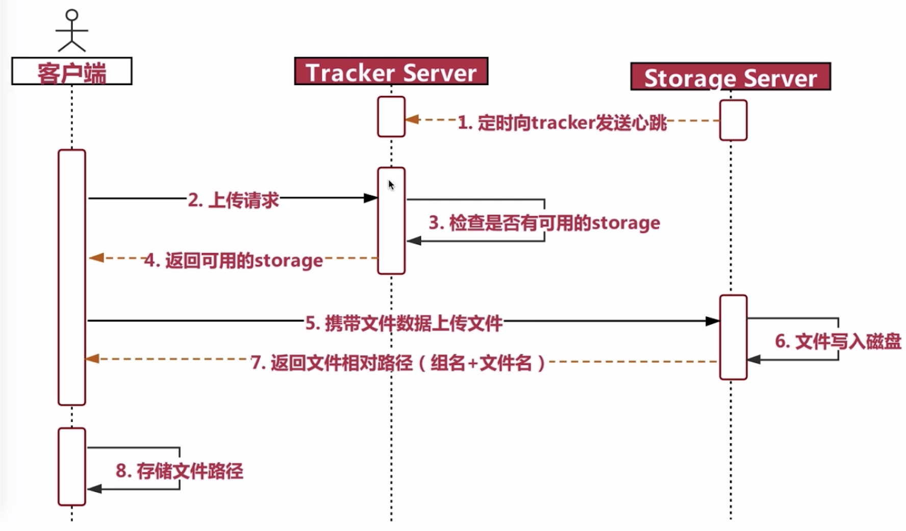

**FastDFS下载过程：**

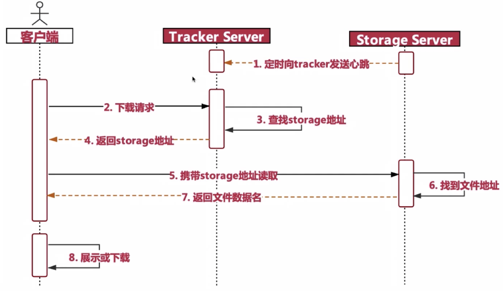

### 3.4、安装

[官方安装方法](https://github.com/happyfish100/fastdfs/wiki)

**安装环境：**
- 两台centos7虚拟机
- 相应的安装包：
	- libfatscommon：FastDFS分离出的一些公用函数包
	- FastDFS：FastDFS本体
	- fastdfs-nginx-module：FastDFS和nginx的关联模块
	- nginx：发布访问服务

#### 3.4.1、基本安装

- 安装基础环境：
	```
	yum install -y gcc gcc-c++
	yum -y install libevent
	```
- 安装libfatscommon函数库：
	- 解压：`tar -zxvf libfastcommon-1.0.42.tar.gz`
	- 进入libfastcommon文件夹，编译并且安装：`./mask.sh`，`./make/sh install`
	- 进入到fastdfs目录，安装fastdfs：`./mask.sh`，`./make/sh install`
	- 安装完成后，有两目录：
		- `/usr/bin` 中包含了可执行文件；
		- `/etc/fdfs` 包含了配置文件，里面的配置文件都是sample
	- 需要将`fastdfs/conf`目录下配置拷贝到`/etc/fdfs`，比如：`cp /root/software/fastdfs-6.04/conf/* .`

#### 3.4.2、tracker配置

修改配置文件：`/etc/fdfs/tracker.conf`

- 配置base_path：`base_path=/usr/local/fastdfs/tracker`；
- 启动tracker服务：`/usr/bin/fdfs_trackerd /etc/fdfs/tracker.conf`
- 停止tracker：`/usr/bin/stop.sh /etc/fdfs/tracker.conf`

#### 3.4.3、storage配置

修改配置文件：`/etc/fdfs/storage.conf`
```conf
# 修改组名
group_name=imooc
# 修改storage的工作空间
base_path=/usr/local/fastdfs/storage
# 修改storage的存储空间
store_path0=/usr/local/fastdfs/storage
# 修改tracker的地址和端口号，用于心跳
tracker_server=192.168.89.150:22122
# 后续结合nginx的一个对外服务端口号
http.server_port=8888
```

启动storage（前提：必须首先启动tracker）：`/usr/bin/fdfs_storaged /etc/fdfs/storage.conf`

#### 3.4.4、测试上传

在storage服务器上修改`/etc/fdfs/client.conf`配置文件：
```conf
base_path=/usr/local/fastdfs/client
tracker_server=192.168.89.150:22122
```

上传文件命令：`./fdfs_test /etc/fdfs/client.conf upload /home/logo.png`，其中 `/home/logo.png` 表示需要上传的文件

#### 3.4.5、fdfs_nginx安装与配置

fastdfs安装好以后是无法通过http访问的，这个时候就需要借助nginx了，所以需要安装fastdfs的第三方模块到nginx中，就能使用了。

**注：nginx需要和storage在同一个节点**

- 解压nginx的fastdfs压缩包：`tar -zxvf fastdfs-nginx-module-1.22.tar.gz`
- 复制配置文件`mod_fastdfs.conf`到fdfs的配置目录下：`cp mod_fastdfs.conf /etc/fdfs`
- 修改`/fastdfs-nginx-module/src/config`文件，主要是修改路径，把`local`删除，因为fastdfs安装的时候我们没有修改路径，原路径是`/usr`：
	```
	ngx_module_incs="/usr/include"
	CORE_INCS="$CORE_INCS /usr/include"
	```
- 安装[nginx](Nginx.md#2.2tar包安装)依赖
- 配置configure目录：
	```
	./configure \
	--prefix=/usr/local/nginx \
	--pid-path=/var/run/nginx/nginx.pid \
	--lock-path=/var/lock/nginx.lock \
	--error-log-path=/var/log/nginx/error.log \
	--http-log-path=/var/log/nginx/access.log \
	--with-http_gzip_static_module \
	--http-client-body-temp-path=/var/temp/nginx/client \
	--http-proxy-temp-path=/var/temp/nginx/proxy \
	--http-fastcgi-temp-path=/var/temp/nginx/fastcgi \
	--http-uwsgi-temp-path=/var/temp/nginx/uwsgi \
	--http-scgi-temp-path=/var/temp/nginx/scgi \
	--add-module=/root/software/fastdfs-nginx-module-1.22/src
	```
	`--add-module` 主要是新增第三方模块依赖

- 执行nginx的安装
- 修改配置文件 `/etc/fdfs/mod_fastdfs.conf`：
	```conf
	base_path=/usr/local/fastdfs/tmp
	tracker_server=192.168.89.150:22122
	group_name=test
	url_have_group_name=true
	store_path0=/usr/local/fastdfs/storage
	```
- 配置`/usr/local/nginx/conf/nginx.conf`
	```conf
	 server {
        listen       8888; ## 该端口为storage.conf中的http.server_port相同
        server_name  localhost;
        location /test/M00{
                ngx_fastdfs_module;
        }
    }
	```
- 访问路径地址：`http://192.168.89.151:8888/test/M00/00/00/wKhZl14ZuKOAC8sLAAARM0HLM14304.png`

## 4、HDFS

# 十三、分布式其他问题

## 1、幂等性

https://juejin.cn/post/6971613794871017486

### 1.1、定义

- **1.1.1、数学定义：在数学里；幂等主要有两种定义**

	- 在某一个二元运算下；幂等元素是指被自己重复运算的结果等于它自己；例如乘法下唯一的两个幂等实数为0和1;
	- 某一元运算为幂等时；其作用在任一元素两次后和其作用一次的结果都相同.例如高斯符号便是幂等：f(f(x))=f(x)

- **1.1.2、HTTP规范定义：**

	HTTP幂等性指的是一次或者多次请求某一个资源应该具有相同的副作用。如果通过PUT解决将数据的status置为1。无论是第一次执行还是多次执行；获取到的结果应该是相同的；即执行完成之后Status =1

### 1.2、何种接口提供幂等性

- **1.2.1、在HTTP规范中定义GET；PUT和DELETE方法应该具有幂等性：**

	- GET：是向服务器查询；不会对系统产生副作用；具有幂等性(不代表每次请求相同的结果)
	- PUT：首先判断系统中是否有相关的记录，如果有记录则更新该记录，如果没有则新增记录
	- DELETE：删除服务器上的相关记录

	对于新增操作（POST）一般是非幂等的

### 1.3、幂等性问题

幂等性问题都产生于增加和修改操作上；

业务开发中，经常会遇到重复提交的情况，无论是由于网络问题无法收到请求结果而重新发起请求，或是前端的操作抖动而造成重复提交情况。 在交易系统，支付系统这种重复提交造成的问题有尤其明显
- 用户在APP上连续点击了多次提交订单，后台应该只产生一个订单；
- 向支付宝发起支付请求，由于网络问题或系统BUG重发，支付宝应该只扣一次钱。 很显然，声明幂等的服务认为，外部调用者会存在多次调用的情况，为了防止外部多次调用对系统数据状态的发生多次改变，将服务设计成幂等；

**幂等VS防重**

重复提交的情况，和服务幂等的初衷是不同的。重复提交是在第一次请求已经成功的情况下，人为的进行多次操作，导致不满足幂等要求的服务多次改变状态。而幂等更多使用的情况是第一次请求不知道结果（比如超时）或者失败的异常情况下，发起多次请求，目的是多次确认第一次请求成功，却不会因多次请求而出现多次的状态变化

### 1.4、幂等性解决方案

- MVCC方案：多版本并发控制，该策略主要使用update with condition（更新带条件来防止）来保证多次外部请求调用对系统的影响是一致的，在系统设计的过程中，合理的使用乐观锁，通过version或者updateTime（timestamp）等其他条件，来做乐观锁的判断条件；
- 去重表：在插入数据的时候，插入去重表，利用数据库的唯一索引特性，保证唯一的逻辑；
- 悲观锁：select for update，整个执行过程中锁定该订单对应的记录。注意：这种在DB读大于写的情况下尽量少用
- select + insert 
- 状态机幂等：在设计单据相关的业务，或者是任务相关的业务，肯定会涉及到状态机，就是业务单据上面有个状态，状态在不同的情况下会发生变更，一般情况下存在有限状态机；
- token机制，防止页面重复提交：

**对外提供接口的api如何保证幂等？**

# 十四、分布式任务调度

* [分布式调度框架](https://my.oschina.net/vivotech/blog/3190348)
* [分布式任务调度与计算框架-PowerJob](https://gitee.com/KFCFans/PowerJob)
* [PowerJob-快速开始文档](https://www.yuque.com/powerjob/guidence/nyio9g)
* [如何设计分布式调度系统](https://mp.weixin.qq.com/s/UOyIpxvfjmbb2D76AHnfFw)

## 与主流调度框架比较

常用：elasticJob、powerJob

|产品|Quartz|Elastic-Job|XXL-JOB|ApacheAirflow|SchedulerX|PowerJobX|
|:----|:----|:-----|:--------|:-----|:-------|:-----|
|产品|Quartz|Elastic-Job|XXL-JOB|ApacheAirflow|SchedulerX|PowerJobX|
|定时调度|Cron|Cron|Cron|Cron|CronFixedrateSeconddelayOpenAPI|CronFixedrateSeconddelayOpenAPI|
|工作流|无|无|无|DAG，通过python语言编排。|有，图形化配置，任务间可数据传递。|有，图形化配置，任务间可数据传递。|
|分布式任务|无|静态分片|静态分片|无|静态分片，MapReduce动态分片。|MapReduce动态/静态分片|
|任务治理|无|执行记录：无运行大盘：有运行日志：有原地重跑：无重刷数据：无|执行记录：有运行大盘：有运行日志：有原地重跑：无重刷数据：无|执行记录：有运行大盘：有运行日志：有原地重跑：有重刷数据：有|执行记录：有运行大盘：开发中运行日志：有原地重跑：有重刷数据：有|执行记录：有运行大盘：开发中运行日志：开发中原地重跑：有重刷数据：有|
|任务类型|Java|JavaShell|JavaShellPythonPHPNode.js|可通过Operator自定义，自带的主要是大数据和Shell，无Java。|JavaShellPythonGoHTTPNode.js自定义|JavaNode|
|报警监控|无|无|无|无|无|企业微信|
|使用成本|DB多个Server人工运维成本|DB至少3个ZooKeeper2个Console多个Server人工运维成本|DB1个调度中心多个执行器人工运维成本|DB2个Masternode多个WorkernodeMQ人工运维成本|按照调度量和计算量收费，无机器和人工运维成本。|DB8C16G*2POD人工运维成本|

# 十五、全链路压测

- [全链路压测自动化实践](https://tech.meituan.com/2019/02/14/full-link-pressure-test-automation.html)
- [压测分析](https://testerhome.com/articles/20911)

## 1、如何压测

### 1.1、压测目标

- 挖掘系统瓶颈点，优化系统性能：尤其对新系统上线，缺乏性能基线数据，此时压测一般没有明确的qps/rt等指标，而是通过不断施压，不断逼近系统的极限，从而暴露问题，修复问题；

- 建立性能基线：主要是为了收集系统当前的最大性能指标，一般会根据业务特点，先确定对rt和错误率的容忍度，然后通过压测推算出能够支持的最大qps, 并发量等；

- 性能回归：对于已上线系统，或者性能需求明确的系统，可以根据线上实际的运行情况，确定系统需要支撑的qps/rt, 然后在涉及性能影响前做回归校验，确保性能满足预期；

- 系统稳定性：

- 网络/线路延迟稳定性等

### 1.2、压测对象

- 后端
- 单api
- 单业务逻辑场景
- 前端
- 单request
- 单操作
- 单页
- 整体页面平均情况

### 1.3、压测指标

**客户端：**

最重要的三个指标：
- qps
- rt
- 成功率

其他的：
- 页面平均响应时间 （重要）。
- 并发量（其实没那么重要，主要还是qps）。
- 最大用户同时在线数 （用户登录系统，一般不需要额外压测，除非业务场景特殊）。
- 网络质量（延迟，波动等）

**服务端：**

主要是监控数据：
- cpu usage
- load
- mem
- jvm/fullGC
- 连接数(netstat)
- disk io (iostat / iotop)

其他需要考量的：
- 缓存对[数据库](https://cloud.tencent.com/solution/database?from=10680)的影响
- 是否需要压到db层，要考虑压测场景。
- 是否需要创造海量的随机压测数据 （比如针对单用户的缓存优化场景，单一用户的性能不能用来推送多用户并发的场景）。
- 同步接口异步接口的压测 （staragent）
- 主要考验后台任务处理能力（异步任务提交即时返回了）。
- 系统不同层次的限流设置对API的影响
- 比如有业务层的限流如Sentinel, Nginx层的限流如X5, 或者其他基于LVS的限流等。
- 消息通信，尤其是广播消息。
- 数据库，尤其是写一致性。
- 复杂场景的长链路调用。
- Nginx/Tomcat的配置对请求的影响。
- 容易忽视的对象序列化/反序列化对性能的影响。
- 热点数据

### 1.4、压测结果分析

一般是随着压力的增加（并发请求的增加）探究qps/rt/成功率三者的关系，从而找到系统的平衡点

### 1.5、压测工具

- jmeter

# 参考文章

* [幂等性](http://blog.brucefeng.info/post/api-idempotent)
* [RPC简单实现](https://www.jianshu.com/p/8876c9f3cd7f)
* [RPC框架原理及Netty实现RPC框架](https://juejin.im/post/5c6d7640f265da2de80f5e9c)
* [四层与七层负载均衡](https://www.jianshu.com/p/fa937b8e6712)
* [分布式系统中坑](https://mp.weixin.qq.com/s/HJyQLLS0HdET_w2EBGyhHg)
