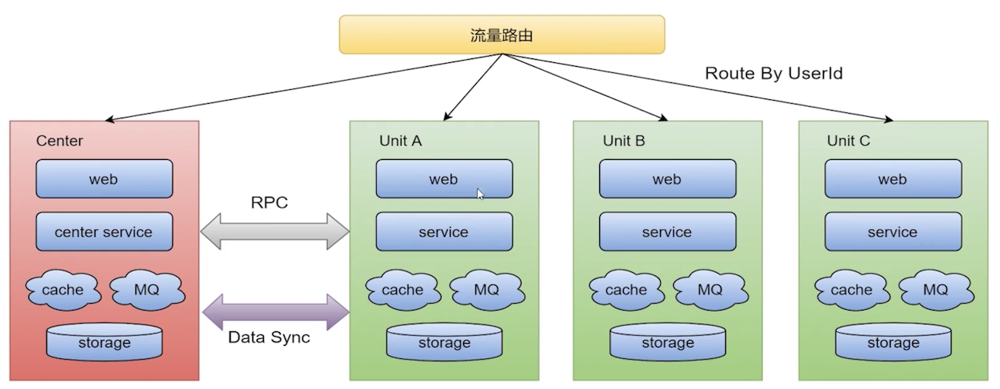

<!-- START doctoc generated TOC please keep comment here to allow auto update -->
<!-- DON'T EDIT THIS SECTION, INSTEAD RE-RUN doctoc TO UPDATE -->
**目录**

- [一、架构基础](#%E4%B8%80%E6%9E%B6%E6%9E%84%E5%9F%BA%E7%A1%80)
  - [1、基本概念](#1%E5%9F%BA%E6%9C%AC%E6%A6%82%E5%BF%B5)
  - [2、大型系统架构](#2%E5%A4%A7%E5%9E%8B%E7%B3%BB%E7%BB%9F%E6%9E%B6%E6%9E%84)
    - [2.1、提升网站性能及并发量](#21%E6%8F%90%E5%8D%87%E7%BD%91%E7%AB%99%E6%80%A7%E8%83%BD%E5%8F%8A%E5%B9%B6%E5%8F%91%E9%87%8F)
    - [2.2、设计高可用](#22%E8%AE%BE%E8%AE%A1%E9%AB%98%E5%8F%AF%E7%94%A8)
  - [3、SET化架构](#3set%E5%8C%96%E6%9E%B6%E6%9E%84)
    - [3.1、架构设计衍变](#31%E6%9E%B6%E6%9E%84%E8%AE%BE%E8%AE%A1%E8%A1%8D%E5%8F%98)
    - [3.2、部分架构思路](#32%E9%83%A8%E5%88%86%E6%9E%B6%E6%9E%84%E6%80%9D%E8%B7%AF)
    - [3.3、SET化架构](#33set%E5%8C%96%E6%9E%B6%E6%9E%84)
- [二、高可用架构](#%E4%BA%8C%E9%AB%98%E5%8F%AF%E7%94%A8%E6%9E%B6%E6%9E%84)
  - [1、服务降级](#1%E6%9C%8D%E5%8A%A1%E9%99%8D%E7%BA%A7)
  - [2、限流](#2%E9%99%90%E6%B5%81)
    - [2.1、概念](#21%E6%A6%82%E5%BF%B5)
    - [2.2、常见的限流手段](#22%E5%B8%B8%E8%A7%81%E7%9A%84%E9%99%90%E6%B5%81%E6%89%8B%E6%AE%B5)
    - [2.3、限流算法实现](#23%E9%99%90%E6%B5%81%E7%AE%97%E6%B3%95%E5%AE%9E%E7%8E%B0)
    - [2.4、集群限流](#24%E9%9B%86%E7%BE%A4%E9%99%90%E6%B5%81)
  - [4、超时和重试机制](#4%E8%B6%85%E6%97%B6%E5%92%8C%E9%87%8D%E8%AF%95%E6%9C%BA%E5%88%B6)
  - [5、回滚机制](#5%E5%9B%9E%E6%BB%9A%E6%9C%BA%E5%88%B6)
- [容器化](#%E5%AE%B9%E5%99%A8%E5%8C%96)
  - [1、容器](#1%E5%AE%B9%E5%99%A8)
  - [2、Docker](#2docker)
  - [3、容器面试题](#3%E5%AE%B9%E5%99%A8%E9%9D%A2%E8%AF%95%E9%A2%98)
- [数据库中间件](#%E6%95%B0%E6%8D%AE%E5%BA%93%E4%B8%AD%E9%97%B4%E4%BB%B6)
  - [1、Sharding Sphere](#1sharding-sphere)
    - [1.1、数据分片](#11%E6%95%B0%E6%8D%AE%E5%88%86%E7%89%87)
- [模块化](#%E6%A8%A1%E5%9D%97%E5%8C%96)
  - [参考资料](#%E5%8F%82%E8%80%83%E8%B5%84%E6%96%99)

<!-- END doctoc generated TOC please keep comment here to allow auto update -->

# 一、架构基础

## 1、基本概念

- 系统与子系统

    - 系统：泛指由一群有关联的个体组成，根据某种规则运作，能完成个别原件不能单独完成的工作的群体。它的意思是“总体”、“整体”或联盟
    - 子系统：由一群有关联的个体所组成的系统，多半会是更大系统中的一部分；

其实子系统的定义和系统的定义是一样的，只是观察的角度有差异，一个系统可能是另外一个更大系统的子系统；

- 模块与组件
    - 模块：是一套一致而互相有紧密关联的软件组装。它分别包含了程序和数据结构两部分。现代软件开发往往利用模块作为合成单位。
    - 组件：定义为自包含的、可编程的、可重用的、与语言无关的软件单元，软件组件可以很容易的被用于组装应用程序中。

模块和组件都是系统的组成部分，知识从不同的角度拆分系统而已；从逻辑角度来拆分系统，得到的单元就是“模块”；从物理的角度来拆分系统后，得到的单元就是“组件”。划分模块的主要目的是职责分离；划分组件的主要目的是复用；

- 框架与架构

    - 软件框架通常指的是为了实现某个业界标准或完成特定基本任务的软件组件规范，也指为了实现某个软件组件规范时，提供规范所要求之基础功能的软件产品； 
        关键点：
        - （1）框架是组件规范，例如MVC；
        - （2）框架提供基础功能产品，例如SpringMVC是MVC开发框架；
    - 软件架构是指软件系统的基础架构，创造这些基础结构的准则，以及对这些结构的描述；

框架和架构的区别还是比较明显的，框架关注的是“规范”，架构关注的是“结构”

## 2、大型系统架构

### 2.1、提升网站性能及并发量

- 提高硬件能力；
- 使用缓存：本地缓存、Redis等；
- 消息队列：解耦、削峰、异步
- 分布式部署开发；
- 分库分表：读写分离、水平分表、垂直分表；
- 集群
- CDN加速
- 浏览器缓存
- 合理使用线程池
- 适当使用多线程技术

### 2.2、设计高可用

- 服务降级
- 限流
- 缓存
- 超时和重试机制
- 回滚机制

### 2.3、系统架构的演进

- 1、单体应用架构
- 2、应用服务器与数据库服务器分离
- 3、应用服务器做集群：负载均衡（Nginx）
- 4、数据库读写分离
- 5、使用搜索引擎（ES）缓解数据库压力；
- 6、引入缓存缓解热点数据的压力；
- 7、数据库垂直/水平切分；
- 8、应用拆分，服务化；

## 3、SET化架构

### 3.1、架构设计衍变

对于大型分布式集群，会存在如下问题：
- 容灾问题：核心业务挂掉，会影响全网所有用户，导致业务不可用
- 资源扩展问题：单IDC资源；数据库主库单点
- 大集群拆分问题：分布式集群扩展，带来的问题；

### 3.2、部分架构思路

#### 3.2.1、同城“双活”

- “双活”：在业务层面上已经做到真正的双活，分别承担部分流量；
- 存储层面比如定时任务、缓存、持久层、数据分析等都是主从架构，会有跨机房写；
- 一个数据中心故障，可以手动切换流量，部分组件可以自动切换；

#### 2.3、两地三中心

使用灾备的思想，在同城双活的基础上，在异地部署一套灾备数据中心，每个中心都具有完备的数据处理能力，只有当主节点故障需要容灾的时候才会紧急启动备用数据中心；

存在问题：
- 冷备中心不公正，关键时刻不敢切换；
- 冷备中心不公正，成本存在严重浪费；
- 本质上数据仍然是单点写，数据瓶颈无法解决；
- 资源、容灾、扩展仍然未得到解决；

### 3.3、SET化架构

#### 3.3.1、SET化优化目标

- 业务：解决业务遇到的扩展性和容灾等需求，支撑业务的高速发展；
- 通用性：架构侧形成统一通用的解决方案，方便各业务线接入使用；

#### 3.3.2、SET化架构设计

- 流量路由：按照特殊的key（通常是userId）进行路由，判断某次请求该路由到中心集群还是单元化集群；
- 中心集群：未进行单元化改造的服务，通常是不在核心交易里链路，称为中心集群，跟当前架构保持一致；
- 单元化集群：每个单元化集群只负责本单元内的流量处理，以实现流量拆分以及故障隔离；每个单元化集群前期只存储本单元产生的交易数据，后续做双向数据同步，实现容灾切换需求；
- 中间件：RPC、KV、MQ等
- 数据同步：全局数据部署在中心集群，其他单元化集群同步全局数据到本单元化内；

#### 3.3.3、SET化路由策略及其能力

- 异地容灾：通过SET化架构的流量调度能力，将SET分别部署在不同地区的数据中心，实现跨地区容灾支持；
- 高效的本地化服务：路由到本地的最近SET，提高最高效的本地化服务；
- 集装箱式扩展：SET封装性支持更灵活的部署扩展性，比如SET一键创建、一键发布；

#### 3.3.4、SET化架构设计原则

- 对业务透明：SET化架构的实现对业务代码透明，业务代码层面不需要关系SET化规则、SET的部署等问题‘’
- 切换规则：理论上，切分规则由业务层面按需定制；实现上，建议优先选最大的业务维度进行切分；
- 部署规范原则：一个SET并不一定只限制在一个机房，也可以跨机房或者跨地区部署；

# 二、高可用架构

高可用本质上是通过“冗余”来实现的

## 1、服务降级

## 2、限流

## 3、超时和重试机制

## 4、回滚机制

# 三、容器化

## 1、容器

Linux 容器不是模拟一个完整的操作系统，而是对进程进行隔离。有了容器，就可以将软件运行所需的所有资源打包到一个隔离的容器中。容器与虚拟机不同，不需要捆绑一整套操作系统，只需要软件工作所需的库资源和设置。系统因此而变得高效轻量并保证部署在任何环境中的软件都能始终如一地运行；

比较了容器化技术和传统虚拟化方式的不同之处：
* 传统虚拟机技术是虚拟出一套硬件后，在其上运行一个完整操作系统，在该系统上再运行所需应用进程；
* 而容器内的应用进程直接运行于宿主的内核，容器内没有自己的内核，而且也没有进行硬件虚拟。因此容器要比传统虚拟机更为轻便。
* 每个容器之间互相隔离，每个容器有自己的文件系统 ，容器之间进程不会相互影响，能区分计算资源

## 2、Docker

## 3、容器面试题

#### 3.1、Java程序运行在Docket等容器环境存在什么问题？

对于Java来说，Docker是一个新的环境，如其内存、CPU等资源限制都是通过CGroup（Control Group）实现的，早期的JDK版本并不能识别这些限制，进而导致一些基础问题：
- 如果未配置合适的JVM堆和元数据区、直接内存等参数，Java就有可能试图使用超过容器限制的内存，最终被容器OOM Kill，或者自身发生OOM；
- 错误判断了可获取的CPU资源，例如，Docker限制了CPU核数，JVM就可能设置不合适的GC并行线程数等；

#### 3.2、为什么类似Docker这种容器环境，会有点欺负JAVA？从JVM内部机制来讲，问题出现在哪里？

##### 3.2.1、出现问题的原因

- Docker与虚拟机非常相似，但是Docker并不是一种完全的虚拟机化技术，而更是一种轻量级的隔离技术；基于namespace，Docket为每个容器提供了单独的命名空间，对网络、PID、用户、IPC通信、文件系统挂载等实现了隔离，对于CPU、内存、磁盘IO等计算资源，则是用过CGroup进行管理。
- 容器虽然省略了虚拟操作系统的开销，实现了轻量级的目标，但也带来了额外的复杂性，它限制对于应用不是透明的，需要用户理解Docker的新行为；
- 对于Java平台来说，未隐藏的底层信息带来了意外，主要体现在：
    - 容器环境对于计算机资源的管理方式是全新的，CGroup作为相对比较新的技术，历史版本的Java显然并不能自然理解相应的资源限制；
    - namespace对于容器内的应用细节增量一些微妙差异

- 从JVM运行角度，这些为什么会导致OOM等问题？
    
    这就是所谓的Ergonomics机制
    - JVM会大概根据检测到的内存大小，设置最初启动时的堆大小为系统内存的1/64；并将堆最大值设置为系统内存的1/4；
    - 而JVM检测到系统的CPU核数，则直接影响到了ParallelGC并行线程数目和JIT compiler线程数目，设置是应用中ForkJoinPool等机制的并行登记；

    这些是默认参数，是根据通用场景选择的初始值，但是由于容器环境的差异，Java的判断很可能是基于错误信息而做出的，更加严重的是JVM的一些原有诊断或备用机制也会受到影响

##### 3.2.2、如何解决
- 首先，如果能够升级到最新的JDK版本，问题就解决了；
- 如果只用老版本JDK，需要注意以下几点：
    - 明确设置堆大小、元数据等内存区域大小，保证Java进程的总大小可控；
    - 明确配置GC和JIT并行线程数目，以避免二者占用过多计算资源

# 四、数据库中间件

# 模块化

(OSGI)[http://www.osgi.com.cn/article/7289520]

## 参考资料

* [Sharding Sphere官方文档](https://shardingsphere.apache.org/)
* [架构的演进](https://www.cnblogs.com/hafiz/p/9222973.html)
* [如何画架构图](https://developer.aliyun.com/article/765140?spm=a2c6h.12873639.0.0.75482c6dlmkDa6)
* [分布式系统](https://developer.aliyun.com/article/721007?spm=a2c6h.12873639.0.0.75482c6dlmkDa6)
