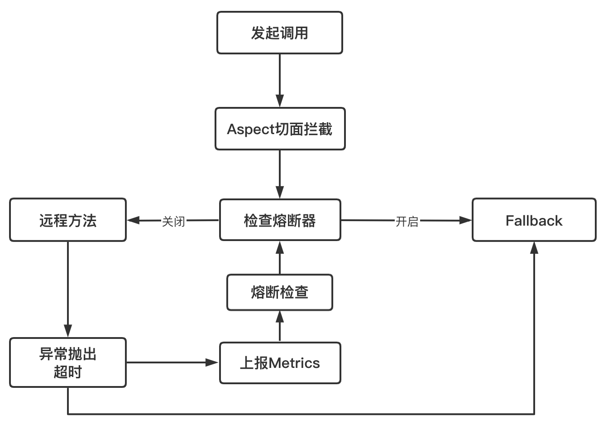
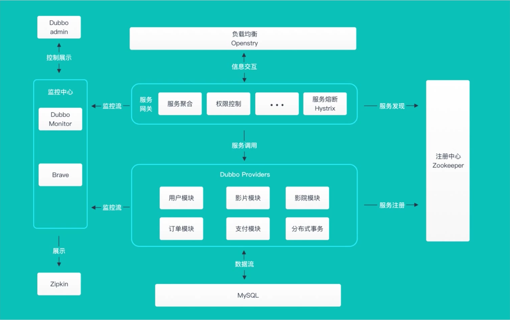
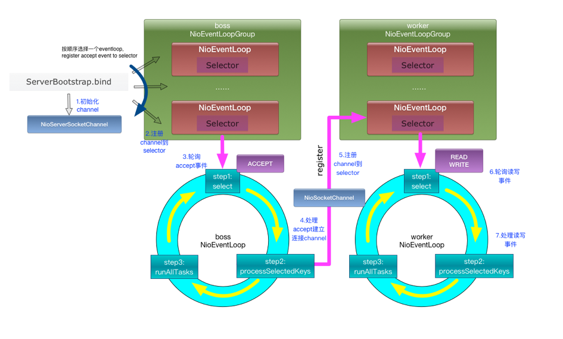
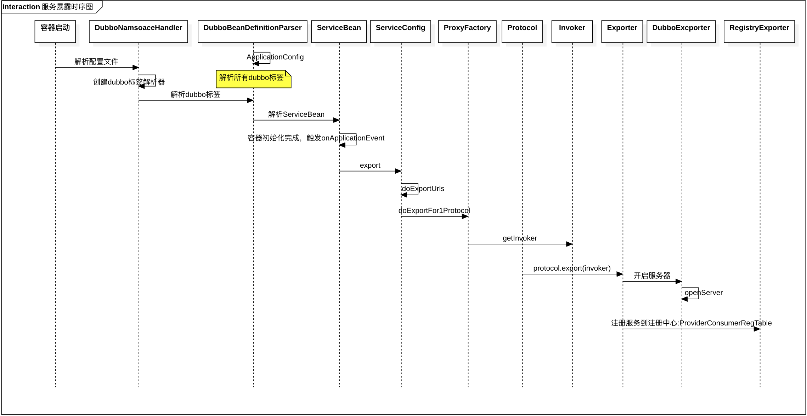

# 一、微服务

## 1、微服务与微服务架构

- 微服务：强调的是服务的大小，它关注的是某一个点，是具体解决某一个问题/提供落地对应服务的一个服务应用；
- 微服务架构：微服务架构一种架构模式或者说是一种架构风格，它提倡将单一应用程序划分成一组小的服务，每个服务运行在其独立的进程中，服务之间互相协调、互相配合，为用户提供最终价值。服务之间采用轻量级通信机制互相沟通，这些服务是围绕业务能力建立的，并且可以由完全自动化的部署机构独立部署。这些服务的集中管理只有最低限度，可以用不同的编程语言编写并使用不同的数据存储技术；

微服务化的核心就是根据业务拆分成一个一个的服务，彻底去耦合

## 2、微服务优缺点

- 优点：
    - 每个服务足够内聚，足够小，代码容易理解，这样能够聚焦一个值得的业务功能；
    - 开发简单，开发效率提高；
    - 微服务能够被小团队独立开发；
    - 微服务是松耦合的，可以独立部署；
    - 微服务能够使用不同的语言开发；
    - 易于与第三方集成；
    - 微服务知识业务逻辑的代码，不会前端相关组件产生关系；

- 缺点：
    - 分布式系统的复杂性；
    - 多服务运维难度高；
    - 系统部署依赖；
    - 服务通信成本；
    - 数据一致性；
    - 系统集成测试；
    - 性能监控；

## 3、微服务技术栈

- 服务开发：SpringBoot、Spring、SpringMVC
- 服务配置与管理：Netflix的Archaius、阿里的Diamond
- 服务注册：Eureka、Consul、Zookeeper等
- 服务调用：Rest、Rpc、Grpc
- 服务负载均衡：Ribbon、Nginx
- 服务监控：
- 服务熔断、降级：Hystrix、Envoy
- 服务路由（网关）:Zuul
- 消息队列：Kafka、RabbitMQ、ActiveMQ
- 服务配置中心：SpringCloudConfig
- 服务部署：Docker
。。。

## 4、微服务选型

### 4.1、微服务选型依据

- 整体解决方案和框架成熟度
- 社区热度
- 可维护性
- 学习曲线

### 4.2、微服务框架对比

Dubbo、HSF、DubboX
- 功能定位
- 支持Rest
- 支持多语言
- 负载均衡
- 配置服务
- 服务调用链调用
- 高可用、容错

## 5、微服务设计原则


- API
- Service
- Dao/Repo

### 5.1、不同维度拆分微服务

- 压力模型：高频高并发流量（商品详情页、优惠计算）、低频突发流量（秒杀、批量上架）------> 服务隔离【热点数据、热点隔离】
- 主链路规划：搜索、详情、购物车、下单、支付  -----> 服务隔离、异常容错、流控、弹性
- 大中台：领域模型拆分（DDD）
- 用户群体拆分：2C、2B、用户端、运营、采购 ----> 相同领域、独有场景
- 前后台业务：商家后台、运营后台

### 5.2、微服务改造

- 抗压维度：低频瞬时流量场景（商品发布服务、库存发布）、高频匀速流量场景（商品详情页、商品搜索服务）
- 业务维度：定时任务（改价单、库存发布计划）、主链路 + 用户场景（商品详情页、商品搜索服务、营销优惠计算、领券、购物车、订单页商品信息、广告投放）、运营场景（商品编辑、类目编辑、营销规则设置、商品发布服务）
- 隔离业务场景、剥离高频接口

### 5.3、微服务的无状态化

有状态：上下文依赖，缺乏水平扩展，比如单机Session、单机缓存（Hash + 本地缓存的热点方案）

应用无状态、配置管理有状态

### 5.4、接口版本控制兼容

API Version 实现思路：
- RPC接口：可以指定具体的接口版本
- HTTP接口：通过path 或 header（在header中设置版本号） --> 业务网关

## 6、微服务问题

### 6.1、服务雪崩

### 6.2、服务熔断

### 6.3、服务降级

### 6.4、服务容错

### 6.5、线程隔离

### 6.6、接口版本兼容

### 6.7、流量整形

- 限流：令牌桶、漏斗
- 增强算法：预热模型（Guava）

### 6.8、服务治理

如何维护当前可用的服务列表：注册中心

（1）服务注册
（2）服务发现：基于client的服务发现，服务主动拉取
（3）发起调用
（4）服务续约/心跳
（5）服务剔除

### 6.9、主链路规划

用户流量漏斗模型：流量由多到少

确保主链路，提高转化率

比如下单链路场景：主搜导购 → 购物车 → 下单

主搜导购：
- 导流：站内、直播、直通车、分会场、类目渠道、抖音、聚划算等；
- 转化：SKU、库存信息、用户评论、图片空间、富文本信息、收藏夹、客服中心、热销排行、视频空间、营销计算、活动信息；

购物车：
- 添加购物车
- 商品列表信息
- 营销计算
- 商家信息模组
- 页面操作：修改数量、删除商品；
- 导购模组：掌柜热卖、最近浏览、画像推荐

下单：
- 创建订单
- 商品列表信息
- 营销计算
- 地址模块
- 支付系统对接

### 6.10、链路监控

离群点分析，在链路监控中，可以通过离群点分析来判断某个时间段或者时间点内业务发生异常；

## 7、EDA事件驱动

### 7.1、概述

### 7.2、适用场景

- 异步处理
- 跨平台/语言通信
- 应用解耦
- 可靠投递
- 最终一致性

# 二、SpringCloud

* [SpringCloud中文网站](https://springcloud.cc/)
* [SpringCloud中国社区](http://springcloud.cn/)
* [SpringCloud具体文档](https://springcloud.cc/spring-cloud-dalston.html)

## 1、简介

### 1.1、定义

基于SpringBoot提供了一套微服务解决方案，包括服务注册与发现、配置中心、全链路监控、服务网关、负载均衡、熔断器等组件，除了基于Netflix的开源组件做高度抽象封装之外，还有一些选项中立的开源组件；分布式微服务架构的一站式解决方案


### 1.2、与SpringBoot的关系

- Springboot专注于快速方便的开发单个个体微服务；
- SpringCloud是关注全局的微服务协调整理治理框架，它将SpringBoot开发的一个个单体微服务整合并管理起来，为各个微服务之间提供配置管理、服务发现、断路器、熔断器等等集成服务；
- SpringBoot可以离开SPringCloud独立使用开发项目，SpringCloud离不开SpringBoot，属于依赖的关系；
- Dubbo是 SOA 时代的产物，它的关注点主要在于服务的调用，流量分发、流量监控和熔断。而 Spring Cloud诞生于微服务架构时代，考虑的是微服务治理的方方面面，另外由于依托了 Spirng、Spring Boot的优势之上，两个框架在开始目标就不一致，Dubbo 定位服务治理、Spirng Cloud 是一个生态；

[SpringBoot与SpringCloud版本对比](https://start.spring.io/actuator/info)

如果SpringBoot与SpringCloud的组件版本不一致，可能会导致启动问题；

### 1.3、与Dubbo对比


**最大区别：Dubbo底层是使用Netty这样的NIO框架，是基于TCP协议传输的，配合以Hession序列化完成RPC通信。SpringCloud抛弃了Dubbo的RPC通信，采用的是基于HTTP的REST方式，从一定程度上，HTTP的REST方式牺牲了服务调用的性能，但也避免了原生RPC带来的问题。服务提供方和调用方的依赖只依靠一纸契约，不存在代码级别的强依赖**

## 2、Eureka服务注册与发现

Eureka是Netflix的一个子模块，也是核心模块之一。Eureka是一个基于REST的服务，用于定位服务，以实现云端中间层服务发现和故障转移。只需要使用服务的标识符，就可以访问到服务；

其在设计上遵守AP原则

### 2.1、原理

- 基本架构：
    - 采用了C-S的设计架构。Eureka Server作为服务注册功能的服务器。是服务注册中心；
    - 系统的其他微服务，使用Eureka的客户端连接到Eureka Server并维持心跳连接。SpringCloud的一些其他模块就可以通过Eureka Server来实现系统中的其他微服务，并执行相关逻辑。
- Eureka包含两个组件：
    - Eureka Server：提供服务注册；各个节点启动后，会在EurekaServer中进行注册，主要EurekaServer中的服务注册表将会存储所有可用的服务节点的信息。
    - Eureka Client：是一个Jvava客户端，用于简化EurekaServer的交互，客户端也同时具备一个内置的、使用轮询（round-robin）负载算法的负载均衡。在应用启动后，将会向EurekaServer发送心跳（默认周期是30秒）。如果EurekaServer在多个心跳周期内没有收到某个节点的心跳，EurekaServer将会从服务注册表中把这个服务节点移除（默认90秒）；

- 三大角色：
    - Eureka Server：提供服务注册和发现
    - Service Provider：服务提供方将自身服务注册到Eureka，从而使服务消费方能够进行消费；
    - Service Consumer：服务消费方从Eureka中获取注册列表，从而能消费服务；

### 2.2、接入Eureka

#### 2.2.1、Eureka服务端

- 增加依赖：
    ```xml
    <!--eureka-server服务端 -->
    <dependency>
        <groupId>org.springframework.cloud</groupId>
        <artifactId>spring-cloud-starter-eureka-server</artifactId>
    </dependency>
    ```
- 启动类增加`@EnableEurekaServer`注解
- 在配置文件（application.yml）增加如下配置：
    ```yml
    eureka:
    instance:
        hostname: localhost
    client:
        register-with-eureka: false    #false表示不向注册中心注册自己。
        fetch-registry: false     #false表示自己端就是注册中心，我的职责就是维护服务实例，并不需要去检索服务
        service-url:
        defaultZone: http://${eureka.instance.hostname}:${server.port}/eureka/       # 单机：设置与Eureka Server交互的地址查询服务和注册服务都需要依赖这个地址（单机）。
     #      defaultZone: http://eureka7002.com:7002/eureka/,http://eureka7003.com:7003/eureka/ # 配置集群的配置，多台机器
    ```

#### 2.2.1、Eureka客户端

- 增加POM依赖
    ```xml
    <!-- actuator监控信息完善 -->
    <dependency>
        <groupId>org.springframework.boot</groupId>
        <artifactId>spring-boot-starter-actuator</artifactId>
    </dependency>
    <!-- 将微服务provider侧注册进eureka -->
    <dependency>
        <groupId>org.springframework.cloud</groupId>
        <artifactId>spring-cloud-starter-eureka</artifactId>
    </dependency>
    <dependency>
        <groupId>org.springframework.cloud</groupId>
        <artifactId>spring-cloud-starter-config</artifactId>
    </dependency>
    ```
- 启动类增加注解：`@EnableEurekaClient`
- 在配置文件（application.yml）增加如下配置：
    ```yml
    eureka:
    client: #客户端注册进eureka服务列表内
        service-url:
        defaultZone: http://localhost:7001/eureka
        # defaultZone: http://eureka7001.com:7001/eureka/,http://eureka7002.com:7002/eureka/,http://eureka7003.com:7003/eureka/ # 集群配置
    instance:
        instance-id: microservicecloud-dept8001XXXXX
        prefer-ip-address: true     #访问路径可以显示IP地址

        # 监控信息
    info:
    app.name: bluefish-microservicecloud
    company.name: www.chenlanqing.com
    build.artifactId: $project.artifactId$
    build.version: $project.version$
    ```

### 2.3、Eureka自我保护


某时刻某一个微服务不可用了，eureka不会立刻清理，依旧会对该微服务的信息进行保存。

默认情况下，如果EurekaServer在一段时间内没有接收到某个微服务实例的心跳，EurekaServer将会注销该实例。但是在网络分区故障发生时，微服务与EurekaServer之间无法正常通通信，那么直接注销实例可能很危险，因为微服务本身其实是健康的，此时不应该注销这个服务。

Eureka通过自我保护模式来解决这个问题：当EurekaServer节点在短时间内丢失过多客户端时，那么这个节点就会进入自我保护模式。一旦进入该模式，EurekaServer就会保护服务注册表中的信息，不再删除服务注册表中的数据。当网络故障恢复之后，该EurekaServer节点会自动退出自我保护模式

在自我保护模式中，Eueka server会保护服务注册表中的信息，不在注销任何服务实例。当它收到的心跳次数重写恢复到阈值以上时，该Eureka Server节点就会自动退出自我保护模式。

设计思路：宁可保留错误的服务注册信息，也不盲目注销任何可能健康的服务实例。

自我保护模式是一种应对网络异常的安全保护措施。在SpringCloud中，可以使用`eureka.server.enable-self-preservation=false`禁用自我保护模式

### 2.4、Eureka服务发现

使用：DiscoveryClient，配合注解：`@EnableDiscoveryClient`
```java
@Target(ElementType.TYPE)
@Retention(RetentionPolicy.RUNTIME)
@Documented
@Inherited
@Import(EnableDiscoveryClientImportSelector.class)
public @interface EnableDiscoveryClient {
	boolean autoRegister() default true;
}
```

### 2.5、Eureka集群

集群需要增加修改如下配置，将defaultZone修改为多个地址

`defaultZone: http://eureka7002.com:7002/eureka/,http://eureka7003.com:7003/eureka/`

基于集群配置的eureka：
- 处于不同节点的eureka通过Replicate进行数据同步 
- Application Service为服务提供者 
- Application Client为服务消费者 
- Make Remote Call完成一次服务调用

### 2.6、与Zookeeper相比

- Eureka遵守AP，zookeeper遵守CP
    - Eureka：Eureka各个几点都是平等的，几个节点挂掉不会影响正常节点的工作，剩余的节点依然可以提供注册和查询服务
    - zookeeper：当master节点因为故障与其他节点失去联系时，剩余节点会重写进行leader选举。问题在于：选举leader的时间太长，30~120s，且选举期间整个zk集群是不可用的，就导致在选举期间注册服务瘫痪；

### 2.7、服务注册原理

服务启动后向Eureka注册，Eureka Server会将注册信息向其他Eureka Server进行同步，当服务消费者要调用服务提供者，则向服务注册中心获取服务提供者地址，然后会将服务提供者地址缓存在本地，下次再调用时，则直接从本地缓存中取，完成一次调用。

当服务注册中心Eureka Server检测到服务提供者因为宕机、网络原因不可用时，则在服务注册中心将服务置为DOWN状态，并把当前服务提供者状态向订阅者发布，订阅过的服务消费者更新本地缓存；

服务提供者在启动后，周期性（默认30秒）向Eureka Server发送心跳，以证明当前服务是可用状态。Eureka Server在一定的时间（默认90秒）未收到客户端的心跳，则认为服务宕机，注销该实例；

### 2.8、心跳检测与服务剔除

**心跳检测：**

在应用启动后，节点们将会向Eureka Server发送心跳,默认周期为30秒，如果Eureka Server在多个心跳周期内没有接收到某个节点的心跳，Eureka Server将会从服务注册表中把这个服务节点移除(默认90秒)

```
## 客户端指标
## 每隔多久向服务器发送一次心跳包
eureka.instance.lease-renewal-interval-in-seconds=10
## 如果在多长时间内没有发送心跳，那么表示客户端宕机了
eureka.instance.lease-expiration-duration-in-seconds=20
```

**服务剔除：**
- 启动定时任务：注册中心再启动的时候也会同步开启一个后台任务，默认每间隔60秒触发服务剔除任务；可以通过在服务端`eureka.server.eviction-interval-timer-in-ms=30000`，进行配置修改触发间隔。价面议不要设置的时间过短；
- 调用evict：通过 AbstractInstanceRegistry 的 eviction 方法直接运行；但是一旦开启了自我保护，注册中心会中断服务剔除操作；
- 遍历过期服务：注册中心会遍历所有服务节点，找出所有过期服务；如何判断服务过期，只要满足以下任意一点即可：
    - 已被标记为过期（evictionTimestamp > 0）;
    - `最后一次心跳时间 + 服务配置的心跳间隔时间 < 当前时间`;
- 计算可剔除的服务总个数：所有服务不是被全部剔除的，服务中心为了自身稳定性，设置一个系数（默认是0.85）；可剔除的服务数量不能大于已注册服务的总数量乘以这个系数；
- 乱序剔除服务；

### 2.9、服务续约

**续约与心跳的关系：**
- 将服务节点的状态同步到注册中心，通知注册中心服务的状态；这里需要借助客户端的心跳功能主动发送；
- 当心跳包到达注册中心的时候，注销中心有相应的判别机制来判定当前的续约心跳是否合理。并根据判断结果修改当前instance在注册中心记录的同步时间；

**发送Renew请求：**
- 服务续约请求：客户端有一个`DiscoverClient`类，是所有操作的门面入口；所以续约服务从该类的renew方法开始；
- 发送心跳：服务续约通过心跳来实现，有两个重要参数恩别是服务的状态（UP）和 lastDirtyTimeStamp
    - 如果续约成功，注册中心则返回200的HTTP Code；
    - 如果续约不成功，注册中心返回404；并不是表示没有找到注册中心地址，而是注册中心任务当前服务节点并不存在；
- 在重新注册之前，客户端会先做下面的两个操作，再主动调用服务注册流程：
    - 设置 lastDirtyTimeStamp，由于重新注册意味着服务节点和注册中心的信息不同步，需要将当前系统时间更新到 lastDirtyTimeStamp；
    - 标记自己为脏节点；
- 当注册成功的时候，清除脏节点标记，但是 lastDirtyTimeStamp 不会清除，这个属性会在后台的服务续约中作为参数发给注册中心，以便服务中心判断节点的同步状态；

**注册中心续约校验：**
注册中心开发了一系列HTTP接口，都放在 com.netflix.eureka.resources 包下
- 接受请求 InstanceResource 下的 renewLease 方法接收到服务节点的续约请求；
- 尝试续约：注册中心检查，如果没有通过，返回404
    - 之前是否有注册过；没有，续约失败；
    - 是否为unknown状态；需要重新注册；
- 脏数据校验：如果续约校验没有问题，需要进行脏数据校验，相对来说逻辑比较复杂；

### 2.9、Eureka基本工作流程

- Eureka Server 启动成功，等待服务端注册。在启动过程中如果配置了集群，集群之间定时通过 Replicate 同步注册表，每个 Eureka Server 都存在独立完整的服务注册表信息
- Eureka Client 启动时根据配置的 Eureka Server 地址去注册中心注册服务
- Eureka Client 会每 30s 向 Eureka Server 发送一次心跳请求，证明客户端服务正常
- 当 Eureka Server 90s 内没有收到 Eureka Client 的心跳，注册中心则认为该节点失效，会注销该实例
- 单位时间内 Eureka Server 统计到有大量的 Eureka Client 没有上送心跳，则认为可能为网络异常，进入自我保护机制，不再剔除没有上送心跳的客户端
- 当 Eureka Client 心跳请求恢复正常之后，Eureka Server 自动退出自我保护模式
- Eureka Client 定时全量或者增量从注册中心获取服务注册表，并且将获取到的信息缓存到本地
- 服务调用时，Eureka Client 会先从本地缓存找寻调取的服务。如果获取不到，先从注册中心刷新注册表，再同步到本地缓存
- Eureka Client 获取到目标服务器信息，发起服务调用
- Eureka Client 程序关闭时向 Eureka Server 发送取消请求，Eureka Server 将实例从注册表中删除

## 3、Ribbon负载均衡

* [Ribbon源码](https://github.com/Netflix/ribbon)

### 3.1、介绍

Spring Cloud Ribbon是基于Netflix Ribbon实现的客户端负载均衡的工具，其主要提供客户端的软件负载均衡算法。

简单说，就是在配置文件中列出Load Balancer后面所有的机器，Ribbon会自动的帮助你基于某种规则去连接这些机器。


### 3.2、配置

主要是在客户端进行操作的
- 加入依赖
    ```xml
    <!-- Ribbon相关 -->
    <dependency>
        <groupId>org.springframework.cloud</groupId>
        <artifactId>spring-cloud-starter-eureka</artifactId>
    </dependency>
    <dependency>
        <groupId>org.springframework.cloud</groupId>
        <artifactId>spring-cloud-starter-ribbon</artifactId>
    </dependency>
    <dependency>
        <groupId>org.springframework.cloud</groupId>
        <artifactId>spring-cloud-starter-config</artifactId>
    </dependency>
    ```
- 加入配置
    ```yml
    eureka:
        client:
            register-with-eureka: false
            service-url:
            defaultZone: http://eureka7001.com:7001/eureka/,http://eureka7002.com:7002/eureka/,http://eureka7003.com:7003/eureka/

    ```
- 调用接口增加注解，请求的服务需要改成响应的服务名称二而不是具体的接口
    ```java
    @Bean
    @LoadBalanced // 负载均衡注解
    public RestTemplate getRestTemplate() {
        return new RestTemplate();
    }
    ```

### 3.3、Ribbon体系架构

一个Http请求发过来，先被转发到Eureka上。此时Eureka通过服务发现获取所有了服务节点的物理地址，问题是其不知道调用哪一个，所以其会将请求转发到Ribbon上；
- IPing：是Ribbon中一套健康检查机制，即ping一下目标机器看是否还在线，一般情况下跑iping并不会主动向服务节点发起healthcheck请求，Ribbon后台会静默处理返回true，默认表示所有服务节点都处于存活状态（和Eureka集成的时候会检查服务节点UP状态）；
- IRule：各种策略都继承自IRule接口，所有经过Ribbon的请求都会请示IRule，通过负载均衡策略选定目标及其，然后再把请求转发过去；

### 3.4、Ribbon七种策略

IRule：根据特定算法从服务列表中选取一个要访问的服务，默认存在如下七种算法：
- `RoundRobinRule`：轮询，默认策略，内部使用 自旋锁 + CAS 的同步操作；
- `RndomRule`：随机选择一台机器，内部使用的是 yield + 自旋的方式实现的；
- `RetryRule`：先按照`RoundRobinRule`的策略获取服务，如果获取服务失败则在指定时间内会进行重试，获取可用的服务；其是一个类似装饰器模式的Rule；
- `WeightedResponseTimeRule`：根据平均响应时间计算所有服务的权重，响应时间越快服务权重越大被选中的概率越高，权重的高低决定了机器被选中概率的高低；刚启动时如果统计信息不足，则使用`RoundRobinRule`策略，等统计信息组织，会切换到`WeightedResponseTimeRule`；其是继承自 `RoundRobinRule`；
- `BestAvailableRule`：会先过滤掉由于多次访问故障而处于断路器跳闸状态的服务，然后选择一个并发量最小的服务；如果统计结果尚未生成，则采用轮询的方式选定节点；
- `AvailiabilityFilterlingRule`：会先过滤掉由于多次访问故障而出路断路器跳闸状态的服务，还有并发的连接数量超过阈值的服务，然后对剩余的服务列表按照轮询策略进行访问；
- `ZoneAvoidanceRule`：默认规则。符合判断Server所在区域的性能和server的可用性选择服务器；包含了组合过滤条件；

### 3.5、配置负载均衡策略

**配置方式1：**

配置类`@RibbonClient`注解：在启动该微服务时会去加载自定义的Ribbon配置类，从而使配置生效：
```java
@RibbonClient(name="MICRO-SERVICE-NAME", configuration=com.netflix.loadbalancer.RoundRobinRule.class)
@Configuration
public class MyRule{
    @Bean
    public IRule rule(){
        return new RandomRule();
    }
}
```

**配置方式2：**

配置文件的形式：
```
eureka-client.ribbon.NFLoadBalancerRuleClassName=com.netflix.loadbalancer.RoundRobinRule
```

配置优先级： `注解 > 配置`

### 3.6、负载均衡器LoadBalanced

Ribbon 通过RestTemplate来发起调用请求的，而RestTemplate是Spring下的包的，那么Ribbon是如何将自己加到RestTemplate的呢？

```java
@Bean
@LoadBalanced
public RestTemplate template() {
    return new RestTemplate();
}

```
如上代码，我们在配置Ribbon的时候，一般会配置一个RestTemplate，并给它加上 `@LoadBalanced` 注解，其会将RestTemplate放到Ribbon的自动装配类进行改造
- `@LoadBalanced`注解在 RestTemplate，另外一边在 LoadBalancerAutoConfiguration 类上；所有 RestTemplate 上只要有 LoadBalanced 注解，都会到 LoadBalancerAutoConfiguration 类上；LoadBalanced 借助 Qualifier 实现给 RestTemplate 打标签功能；
- LoadBalancerAutoConfiguration 将传过来的 RestTemplate 经过一定的装配，将一系列的 interceptor 添加到 RestTemplate 中。Ribbon 拦截器会拦截每个网络请求做相应的处理；

```java
// 
@Target({ ElementType.FIELD, ElementType.PARAMETER, ElementType.METHOD })
@Retention(RetentionPolicy.RUNTIME)
@Documented
@Inherited
@Qualifier
public @interface LoadBalanced {
}
// 
@Configuration
@ConditionalOnClass(RestTemplate.class)
@ConditionalOnBean(LoadBalancerClient.class)
@EnableConfigurationProperties(LoadBalancerRetryProperties.class)
public class LoadBalancerAutoConfiguration {
	@LoadBalanced
	@Autowired(required = false)
	private List<RestTemplate> restTemplates = Collections.emptyList();

	@Autowired(required = false)
	private List<LoadBalancerRequestTransformer> transformers = Collections.emptyList();

	@Bean
	public SmartInitializingSingleton loadBalancedRestTemplateInitializerDeprecated(
			final ObjectProvider<List<RestTemplateCustomizer>> restTemplateCustomizers) {
		return () -> restTemplateCustomizers.ifAvailable(customizers -> {
			for (RestTemplate restTemplate : LoadBalancerAutoConfiguration.this.restTemplates) {
				for (RestTemplateCustomizer customizer : customizers) {
					customizer.customize(restTemplate);
				}
			}
		});
	}
}
```

**总结：**Ribbon作用机制就是由LoadBalanced在RestTemplate上打标，Ribbon将带有负载均衡能力的拦截器注入标记好的RestTemplate 中，以此实现负载均衡；

### 3.7、IPing机制

IPing 是个主动机制，其主动判断服务节点的当前状态，决定是否可以作为目标节点，只有当前可用的节点才会作为负载均衡器的目标节点；主要有以下实现：
- DummyPing：默认返回true，即默认所有节点都可用，这是单独使用 Ribbon时的默认模式；
- NIWSDiscoveryPing：借助eureka的状态来判断，假如节点状态是UP，则认为是可用；
- PingUrl：构造URL请求，主动向服务节点发起一次HTTP调用，如果对方有响应则认为节点可用；

第三种模式在一些场景下不适用，因为其对每个服务节点都会请求不断，对应的节点在本身高访问量的调用情况下，这种方式必然会增加服务节点的访问压力的；

除非特殊指定，在和eureka搭配使用时候，采用的是 NIWSDiscoveryPing，通过过滤非UP状态的节点；


### 3.8、IRule

LoadBalancer加载IRule：RibbonClientConfiguration
```java
@Bean
@ConditionalOnMissingBean
public IRule ribbonRule(IClientConfig config) {
    if (this.propertiesFactory.isSet(IRule.class, name)) {
        return this.propertiesFactory.get(IRule.class, config, name);
    }
    ZoneAvoidanceRule rule = new ZoneAvoidanceRule();
    rule.initWithNiwsConfig(config);
    return rule;
}
@Bean
@ConditionalOnMissingBean
public ILoadBalancer ribbonLoadBalancer(IClientConfig config,
        ServerList<Server> serverList, ServerListFilter<Server> serverListFilter,
        IRule rule, IPing ping, ServerListUpdater serverListUpdater) {
    if (this.propertiesFactory.isSet(ILoadBalancer.class, name)) {
        return this.propertiesFactory.get(ILoadBalancer.class, config, name);
    }
    return new ZoneAwareLoadBalancer<>(config, rule, ping, serverList,
            serverListFilter, serverListUpdater);
}
```

### 3.9、自定义负载均衡策略

实现一致性Hash的负载均衡
- 实现IRule接口
- 实现方法
- 配置：`@RibbonClient(name = "eureka-client", configuration = MyRule.class)`

代码如下：
```java
@NoArgsConstructor
public class MyRule extends AbstractLoadBalancerRule implements IRule {
    @Override
    public void initWithNiwsConfig(IClientConfig iClientConfig) {
    }
    @Override
    public Server choose(Object key) {
        HttpServletRequest request = ((ServletRequestAttributes)
                RequestContextHolder.getRequestAttributes())
                .getRequest();

        String uri = request.getServletPath() + "?" + request.getQueryString();
        return route(uri.hashCode(), getLoadBalancer().getAllServers());
    }
    public Server route(int hashId, List<Server> addressList) {
        if (CollectionUtils.isEmpty(addressList)) {
            return null;
        }
        TreeMap<Long, Server> address = new TreeMap<>();
        addressList.stream().forEach(e -> {
            // 虚化若干个服务节点，到环上
            for (int i = 0; i < 8; i++) {
                long hash = hash(e.getId() + i);
                address.put(hash, e);
            }
        });
        long hash = hash(String.valueOf(hashId));
        SortedMap<Long, Server> last = address.tailMap(hash);
        // 当request URL的hash值大于任意一个服务器对应的hashKey，
        // 取address中的第一个节点
        if (last.isEmpty()) {
            address.firstEntry().getValue();
        }
        return last.get(last.firstKey());
    }
    public long hash(String key) {
        try {
            MessageDigest md5 = MessageDigest.getInstance("MD5");
            byte[] keyByte = key.getBytes("UTF-8");
            md5.update(keyByte);
            byte[] digest = md5.digest();

            long hashCode = ((long) (digest[2] & 0xFF << 16))
                    | ((long) (digest[1] & 0xFF << 8))
                    | ((long) (digest[0] & 0xFF));

            return hashCode & 0xffffffffL;
        } catch (NoSuchAlgorithmException | UnsupportedEncodingException e) {
            throw new RuntimeException(e);
        }
    }
}
```

***注意：***该自定义配置类不能放在@ComponentScan所扫描的当前包下以及子包下，否则自定义的这个配置类会被所有的Ribbon客户端所共享，达不到特殊化定制的目的

### 3.10、Ribbon加载问题

Ribbon默认是懒加载的，只有第一次调用的时候才会完成LoadBalancer的初始化；如果第一个方法请求比较耗时的话，且超时时间设置的较短，那么很大可能第一次http调用就会失败；

Ribbon完成初始化会打印如下日志：
```
INFO [main] com.netflix.loadbalancer.DynamicServerListLoadBalancer - DynamicServerListLoadBalancer for client eureka-consumer initialized
```

如何在调用之前就初始化LoadBalancer，增加如下两个配置：
```
ribbon.eager-load.enabled=true 
ribbon.eager-load.clients=ribbon-consumer
```
第一个参数开启了Ribbon的饥饿加载模式，第二个属性指定了需要应用饥饿加载的服务名称；

## 4、Feign

- [Feign原理解析](https://www.cnblogs.com/duanxz/p/7519819.html)

### 4.1、简介

Feign是一个声明式WebService客户端。使用Feign能让编写WebService客户端更加简单。

它具有可插入注释支持，包括Feign注释和JAX-RS注释。Feign还支持可插拔编码器和解码器。Spring Cloud增加了对Spring MVC注释的支持，并使用Spring Web中默认使用的HttpMessageConverters。Spring Cloud集成Ribbon和Eureka以在使用Feign时提供负载均衡的http客户端。

一句话：声明一个代理接口，服务调用者通过调用这个代理接口的方式来调用远程服务，这样调用远程方法就如同调用本地接口一样方便的；

整体全流程图：


**构造请求：**


- Ribbon：利用负载均衡策略选定目标机器；
- Hystrix：根据断路器的开启状态，决定是否发起此次调用；
- 动态代理：Feign是通过一个代理接口进行远程调用，构造接口的动态代理对象，用来代理远程服务的真实调用，不需要像Ribbon或者Eureka那样在方法调用的地方提供服务名；在Feign中动态代理是通过Feign.build返回的构造器装配相关参数，然后调用RelectFeign的newInstance方法创建代理对象；
- Contract：协议，就像HTTP协议、RPC协议一样，Feign也有自己的一套协议的规范，其解析的是上面生成的动态代理类；通过解析动态代理接口 + build模式，Contract协议会构造复杂的元数据对象MethodMetadata，里面包含了动态代理接口定义的所有特征；然后根据这些元数据生成一系列的MethodHandler对象用来处理Request 和 Response 请求；Contract具有高度的扩展性，可以经由对Contract 的扩展，将Feign集成到其他开源组件之中；

**发送请求：**


- 拦截器：通过一系列的拦截器对Request和Response对象进行装饰，然后发起正式的调用；
- 发起请求：
    - 重试：Feign借助Ribbon配置重试策略实现重试的操作；
    - 降级：Feign接口在声明时可以指定Hystrix的降级策略实现类，如果达到了Hystrix的超时判定，或得到了异常结果，将执行指定的降级逻辑；

### 4.2、使用

**1、增加依赖**
```xml
<dependencies>
    <!-- Eureka的依赖 -->
    <dependency>
        <groupId>org.springframework.cloud</groupId>
        <artifactId>spring-cloud-starter-netflix-eureka-client</artifactId>
    </dependency>
    <dependency>
        <groupId>org.springframework.boot</groupId>
        <artifactId>spring-boot-starter-web</artifactId>
    </dependency>
    <dependency>
        <groupId>org.springframework.boot</groupId>
        <artifactId>spring-boot-starter-actuator</artifactId>
    </dependency>
    <!-- Feign的依赖 -->
    <dependency>
        <groupId>org.springframework.cloud</groupId>
        <artifactId>spring-cloud-starter-openfeign</artifactId>
    </dependency>
</dependencies>
```
**2、启动类配置相应的注解**
```java
@EnableDiscoveryClient // eureka
@SpringBootApplication
@EnableFeignClients // feign
public class FeignConsumerApplication {
    public static void main(String[] args) {
        new SpringApplicationBuilder(FeignConsumerApplication.class).web(WebApplicationType.SERVLET).run(args);
    }
}
```
**3、定义接口：**
```java
// 设置需要远程调用的应用
@FeignClient("eureka-client")
public interface IService {
    // eureka-client应用中的 
    @GetMapping("/sayHi")
    String sayHi();
}

// eureka-client 应用的controller
@RestController
public class Controller {
    @Value("${server.port}")
    private String port;

    @GetMapping("/sayHi")
    public String sayHi() {
        return "This is " + port;
    }
}
```
**4、配置文件**
```
spring.application.name=feign-consumer-advanced
server.port=40001
# spring cloud G版本允许多个注解重载
spring.main.allow-bean-definition-overriding=true
eureka.client.serviceUrl.defaultZone=http://localhost:20000/eureka/
```

### 4.3、EnableFeignClients底层原理

```java
@Retention(RetentionPolicy.RUNTIME)
@Target(ElementType.TYPE)
@Documented
@Import(FeignClientsRegistrar.class)
public @interface EnableFeignClients {
	String[] value() default {};
	String[] basePackages() default {};
	Class<?>[] basePackageClasses() default {};
	Class<?>[] defaultConfiguration() default {};
	Class<?>[] clients() default {};
}

class FeignClientsRegistrar implements ImportBeanDefinitionRegistrar, ResourceLoaderAware, EnvironmentAware {
    // 实现 ImportBeanDefinitionRegistrar 的方法注册bean对象
    @Override
	public void registerBeanDefinitions(AnnotationMetadata metadata, BeanDefinitionRegistry registry) {
		registerDefaultConfiguration(metadata, registry);
		registerFeignClients(metadata, registry);
	}
}
```

### 4.4、Feign的动态代理

```java
// org.springframework.cloud.openfeign.FeignClientFactoryBean
class FeignClientFactoryBean implements FactoryBean<Object>, InitializingBean, ApplicationContextAware {
    @Override
	public Object getObject() throws Exception {
		return getTarget();
	}
    <T> T getTarget() {
		FeignContext context = this.applicationContext.getBean(FeignContext.class);
		Feign.Builder builder = feign(context);
		if (!StringUtils.hasText(this.url)) {
			if (!this.name.startsWith("http")) {
				this.url = "http://" + this.name;
			} else {
				this.url = this.name;
			}
			this.url += cleanPath();
			return (T) loadBalance(builder, context,
					new HardCodedTarget<>(this.type, this.name, this.url));
		}
		if (StringUtils.hasText(this.url) && !this.url.startsWith("http")) {
			this.url = "http://" + this.url;
		}
		String url = this.url + cleanPath();
		Client client = getOptional(context, Client.class);
		if (client != null) {
			if (client instanceof LoadBalancerFeignClient) {
				// not load balancing because we have a url,
				// but ribbon is on the classpath, so unwrap
				client = ((LoadBalancerFeignClient) client).getDelegate();
			}
			builder.client(client);
		}
		Targeter targeter = get(context, Targeter.class);
		return (T) targeter.target(this, builder, context, new HardCodedTarget<>(this.type, this.name, url));
	}
}
// org.springframework.cloud.openfeign.FeignContext：Feign的上下文
```

**getObject：**
- FeignClientFactoryBean的getObject发起，为了获取一个可以发起远程调用的实体方法，getObject方法获取到的其实是一个代理对象；
- Feign实际上是调用了 @FeignClient 注解所修饰的接口，FeignClientFactoryBean 封装了这个接口所包含的配置信息，比如eureka服务名称、服务调用路径、降级逻辑的处理类等；

**创建代理对象：**
- 在getTarget最后一行，经由Targeter类转发，创建代理对象；
- Feign的所有代理对象实例均通过 RefelectiveFeign.newInstance 创建，将@FeignClient 接口的特征：方法名、参数等等一系列信息提取出来拼装成Java反射机制中通用的Method类；
- 偷天换日：整个代理机制的核心操作，在newInstance的创建过程中，Feign通过实现JDK的InvocationHandler接口，将自己的Handler和上一步组装的Method进行了关联，这样一来，所有对这个接口方法的调用，都将被Fegin自定义的InvocationHandler接管；

**拦截请求：**

SynchronousMethodHandler接管invoke方法，在构造Request请求的同时还会涉及一系列的参数拼装和加密等操作；

**发起调用：**

借助LoadBalanceFeignClient发起了真正的HTTP请求；

### 4.5、Feign超时机制

Feign配合Ribbon的超时配置：
```yml
# feign-service-provider 是服务名称
# 在所有HTTP Method进行重试，设置为true表示不管是get还是post都能重试。真实的生产环境往往只是get请求可以重试，或者实现了幂等性的其他类型请求
feign-service-provider.ribbon.OkToRetryOnAllOperations=true
# 连接超时，注意：这个不是服务的响应时间，而是本机和服务建立一个connection所花费的时间，如果连接超时则直接进行重试
feign-service-provider.ribbon.ConnectTimeout=1000
# 业务处理超时，服务响应时间；当连接建立好之后，如果对方服务没有在规定时间内返回，则直接进行重试；
feign-service-provider.ribbon.ReadTimeout=2000
# 每台机器最大重试次数，在首次调用超时后，会再次向同一个服务节点发起最多2次重试（总共向当前节点1+2=3次请求）
feign-service-provider.ribbon.MaxAutoRetries=2
# 可以再重试几台机器，在当前机器调用超时后，Feign将最多换N台机器发起调用；如果在新机器超时后，会继续重试 MaxAutoRetries + 1次；
feign-service-provider.ribbon.MaxAutoRetriesNextServer=2
```

如果按照上面的超时配置，最大超时时间是多少：27000ms，计算过程：
`(2000 + 1000) * (2 + 1) * (2 + 1) = 27000ms`

那么计算极值函数：
`MAX(Response time) = (ConnectionTimeout + ReadTimeout) * (MaxAutoRetries + 1) * (MaxAutoRetriesNextServer + 1)`

**属性注入：**
```java
@ConfigurationProperties("feign.client")
public class FeignClientProperties {
	private boolean defaultToProperties = true;
	private String defaultConfig = "default";
}
```

**问题：Ribbon配置的服务超时与Feign配置的服务超时优先级**

```yml
# Ribbon指定服务配置超时判定，优先级更高
user-service:
  ribbon:
    ConnectTimeout: 1000
    ReadTimeout: 3000
    MaxAutoRetries: 1
    MaxAutoRetriesNextServer: 2
    OkToRetryOnAllOperations: true
# Feign的超时判定，优先级高于Ribbon
feign:
  client:
    config:
      # 全局默认配置
      default:
        connectTimeout: 1000
        readTimeout: 5000
      # 优先级比上面的高
      user-service:
        connectTimeout: 1000
        readTimeout: 5000
```

**为什么Feign的优先级高于Ribbon？**

属性设置过程：org.springframework.cloud.openfeign.FeignClientFactoryBean#configureFeign
```java
protected void configureFeign(FeignContext context, Feign.Builder builder) {
    FeignClientProperties properties = this.applicationContext.getBean(FeignClientProperties.class);
    if (properties != null) {
        if (properties.isDefaultToProperties()) {
            // 配置Builder，设置相关属性：
            configureUsingConfiguration(context, builder);
            configureUsingProperties(properties.getConfig().get(properties.getDefaultConfig()),builder);
            configureUsingProperties(properties.getConfig().get(this.contextId),builder);
        } else {
            configureUsingProperties(properties.getConfig().get(properties.getDefaultConfig()),builder);
            configureUsingProperties(properties.getConfig().get(this.contextId), builder);
            configureUsingConfiguration(context, builder);
        }
    } else {
        configureUsingConfiguration(context, builder);
    }
}
// 配置FeignRibbon相关属性
protected void configureUsingConfiguration(FeignContext context, Feign.Builder builder) {
    // 忽略代码
    // 从上下文中获取 Options
    Request.Options options = getOptional(context, Request.Options.class);
    if (options != null) {
        builder.options(options);
    }
    // 忽略代码
}
// getOptional 获取  Request.Options ，通过 FeignRibbonClientAutoConfiguration 注入
@Bean
@ConditionalOnMissingBean
public Request.Options feignRequestOptions() {
    return LoadBalancerFeignClient.DEFAULT_OPTIONS;
}
// 设置feign.client相关配置属性
protected void configureUsingProperties(FeignClientProperties.FeignClientConfiguration config, Feign.Builder builder) {
    // 如果配置文件中有 feign.client.config.default.connectTimeout 或者 feign.client.config.default.readTimeout
    if (config.getConnectTimeout() != null && config.getReadTimeout() != null) {
        // 会覆盖掉前面的设置的options
        builder.options(new Request.Options(config.getConnectTimeout(), config.getReadTimeout()));
    }
」
```

属性使用过程：Feign方法调用实际执行时是在 SynchronousMethodHandler.invoke 方法
```java
private final Client client;
// SynchronousMethodHandler
public Object invoke(Object[] argv) throws Throwable {
    while (true) {
        try {
            return executeAndDecode(template);
        } catch (RetryableException e) {
            ...
        }
    }
}
// SynchronousMethodHandler
Object executeAndDecode(RequestTemplate template, Options options) throws Throwable {
    Request request = targetRequest(template);
    Response response;
    try {
        // 通过client执行，调用的是 LoadBalancerFeignClient.execute 方法
        response = client.execute(request, options);
    } catch (IOException e) {
    }
}
// LoadBalancerFeignClient 
public Response execute(Request request, Request.Options options) throws IOException {
    try {
        URI asUri = URI.create(request.url());
        String clientName = asUri.getHost();
        URI uriWithoutHost = cleanUrl(request.url(), clientName);
        FeignLoadBalancer.RibbonRequest ribbonRequest = new FeignLoadBalancer.RibbonRequest(this.delegate, request, uriWithoutHost);
        // 从Request.Options获取重试、超时配置等
        IClientConfig requestConfig = getClientConfig(options, clientName);
        return lbClient(clientName).executeWithLoadBalancer(ribbonRequest, requestConfig).toResponse();
    }
}
IClientConfig getClientConfig(Request.Options options, String clientName) {
    IClientConfig requestConfig;
    if (options == DEFAULT_OPTIONS) {
        // 这里如果没有配置 feign.client 配置，那么 options 就是 DEFAULT_OPTIONS
        requestConfig = this.clientFactory.getClientConfig(clientName);
    } else {
        // 这里feign.client 属性配置的超时属性
        requestConfig = new FeignOptionsClientConfig(options);
    }
    return requestConfig;
}
```


### 4.6、Feign协议解析过程

基于Http协议的服务，经常使用的框架：HttpURLConnection、Apache HttpComponnets、OkHttp3 、Netty

**Contract结构**


核心处理逻辑在 BaseContract.parseAndValidatateMetadata方法上:
- 不能有泛型
- 接口不能多继承；
- 所继承的接口不能再继承其他接口

### 4.7、Ribbon、Eureka、Feign如何协作

- 首先Ribbon会从 Eureka Client里获取到对应的服务注册表，也就知道了所有的服务都部署在了哪些机器上，在监听哪些端口号。
- 然后Ribbon就可以使用默认的Round Robin算法，从中选择一台机器
- Feign就会针对这台机器，构造并发起请求

**1、通过Eureka发起调用：**

在不使用Ribbon和Feign的情况下，如何在Eureka的服务之间发起调用：
```java
@RestController
public class Controller {
    @Autowired
    private LoadBalancerClient client;
    @Autowired
    private RestTemplate restTemplate;
    @GetMapping("/hello")
    public String hello() {
        // 通过 LoadBalancerClient 选择对应的服务实例
        ServiceInstance instance = client.choose("eureka-client");
        if (instance == null) {
            return "No available instances";
        }
        // 通过获取到的服务实例，获取到主机名和端口号，
        String target = String.format("http://%s:%s/sayHi", instance.getHost(), instance.getPort());
        log.info("url is {}", target);
        // 通过RestTemplate发起调用
        return restTemplate.getForObject(target, String.class);
    }

}
```

**2、通过Ribbon发起调用：**

在没有使用Feign的情况下，发起的服务调用：
```java
@RestController
public class Controller {
    @Autowired
    private RestTemplate restTemplate;

    @GetMapping("/sayHi")
    public String sayHi() {
        // 同http服务 eureka-client是服务名称
        return restTemplate.getForObject("http://eureka-client/sayHi", String.class);
    }
}
```

### 4.8、注意

## 5、Hystrix断路器

### 5.1、什么是Hystrix断路器

- 服务雪崩：当调用链路上某个微服务调用响应时间过长或者不可响应，对微服务的调用就会占用越来越多的系统资源，进而引起系统崩溃

Hystrix是一个用于处理分布式系统的延迟和容错的开源库，在分布式系统中，Hystrix能保证在一个依赖出问题的情况下，不会导致整体服务失败，避免级联故障，提高分布式系统的弹性；

“断路器”本身是一种开关装置，当某个服务单元发生故障之后，通过断路器的故障监控（类似熔断保险丝），向调用方返回一个符合预期的、可处理的备选响应，而不是长时间的等待或者抛出调用方法无法处理的异常，主要保证了服务调用方的线程不会被长时间、不必要的占用，从而在分布式系统蔓延，从而引起系统雪崩；

设计原则：
- 对依赖服务调用时出现的调用延迟和调用失败进行控制和容错保护。
- 在复杂的分布式系统中，阻止某一个依赖服务的故障在整个系统中蔓延。比如某一个服务故障了，导致其它服务也跟着故障。
- 提供 fail-fast（快速失败）和快速恢复的支持。
- 提供 fallback 优雅降级的支持。
- 支持近实时的监控、报警以及运维操作

### 5.2、服务降级

当服务器压力剧增的情况下，根据实际业务情况及流量，对一些服务和页面有策略的不处理或换种简单的方式处理，从而释放服务器资源以保证核心交易正常运作或高效运作

可以将一些`不重要`或`不紧急`的服务或任务进行服务的 延迟使用 或 暂停使用

服务降级可以分为：
- 超时降级：主要配置好超时时间和超时重试次数和机制，并使用异步机制探测恢复情况；
- 失败次数降级：主要是一些不稳定的API，当失败调用次数达到一定阀值自动降级，同样要使用异步机制探测回复情况；
- 故障降级：如要调用的远程服务挂掉了（网络故障、DNS故障、HTTP服务返回错误的状态码和RPC服务抛出异常），则可以直接降级；
- 限流降级：当触发了限流超额时，可以使用暂时屏蔽的方式来进行短暂的屏蔽；信号量或者线程池；

#### 5.2.1、服务降级配置

```java
@HystrixCommand(fallbackMethod = "error")
public String error(){}
```
HystrixCommand注解指定了一个 fallbackMethod，就是降级逻辑所在的方法名。需要注意的是降级的方法签名（参数列表）要和原方法保持一致，也就是说，如果原方法声明了一个String参数，那么降级方法也要声明同样的参数，Hystrix会原封不动的把当前参数传递给降级方法；

当Hystrix和Feign共同使用的时候，还有一种配置方式，那局势在FeignClient注解中指定一个class，在这个calss中声明的所有方法的降级需求；
```java
@FeignClient(name = "feign-client", fallback = Fallback.class)
public interface MyService extends IService {
}
@Component
public class Fallback implements MyService {
    @Override
    @HystrixCommand(fallbackMethod = "fallback2")
    public String error() {
        log.info("Fallback: I'm not a black sheep any more");
        throw new RuntimeException("first fallback");
    }
}
```

#### 5.2.2、服务降级原理

降级流程图：


- `@HystrixCommand`：标识该方法由Hystrix控制；
- AspectJ：运用Spring的切面能力，给带有 `@HystrixCommand` 注解的方法配置了切面点（`com.netflix.hystrix.contrib.javanica.aop.aspectj.HystrixCommandAspect`），在方法调用的时候，将首先执行切面的逻辑；
- Request Cache：
    - 如果处于开启装填，则尝试用CacheKey从本地缓存中获取数据，也就不用发起方法调用了；
    - 如果处于关闭状态，就继续往下走；
- 注册Observer：Observer是观察者模式，这个 Observer背后运用了RxJava注册了一堆异步回调函数，当方法正常执行时、异常抛出、结束或其他状态时，将会触发对应的回调函数的处理，而且回调函数里面还会嵌套回调函数；
- 发起调用：在发起调用之前，将会检查熔断状态，如果断路器当前处于开启状态，那么僵直接走向fallback流程；如果断路器处于关闭，则发起真正的调用；
- 异常：如果方法调用抛出异常，会触发签名注册的回调函数，然后直接转给了降级方法；

#### 5.2.3、服务降级的方案

- 静默处理：什么也不干，在fallback逻辑中直接返回一个空值Null；
- 默认值：在不确定真实结果的情况下返回一个默认值；比如商品详情页计算优惠发生故障了，可以再fallback中返回商品原价；这种方式下接口返回值并不是真实的，因此不能应用在某些核心主链路，比如下单页面的核心主链路
- 想办法好好恢复：fallbakc会尝试用各种方法获取正确的返回值，有几个常用的场景：
    - 缓存异常：假如因为缓存故障无法获取数据，在fallback逻辑中可以转而访问底层数据库（这个方法不能用在热点数据上，否则可能把数据库打卦，从而引发更大范围的服务降级和熔断）。反过来数据库发生故障，也可以在fallback里访问缓存，需要注意数据一致性；
    - 切换备库：一般大型应用都会采用主从+备库的方式做灾备，如果主库发生了故障，可以人工将数据源切换到备份数据库；
    - 重试：Ribbon可以处理超时重试，但对于异常情况来说，比如当前资源被锁定，可以再fallback中尝试重新发起接口调用；
    - 人工干预：有些及其重要的接口，对异常不能容忍，这里可以借助fallback启动人工干预流程，比如做日志打点，通过监控组件触发报警，通知人工介入；
- 多次降级：多层降级机制；

**多级降级：**
```java
@Override
@HystrixCommand(fallbackMethod = "fallback2")
public String error() {
    log.info("Fallback: I'm not a black sheep any more");
    throw new RuntimeException("first fallback");
}
@HystrixCommand(fallbackMethod = "fallback3")
public String fallback2() {
    log.info("fallback again");
    throw new RuntimeException("fallback again");
}
public String fallback3() {
    log.info("fallback again and again");
    return "success";
}
```

#### 5.2.4、RequestCache

Request Cache 并不是让在fallback里访问缓存，它是Hystrix一个特殊功能。可以通过 `@CacheResult` 和 `@CacheKey` 两个注解实现，配置如下：
```java
@CacheResult
@HystrixCommand(commandKey = "cacheKey")
public Friend requestCache(@CacheKey String name) {
    log.info("request cache " + name);
    Friend friend = new Friend();
    friend.setName(name);
    friend = service.sayHiPost(friend);
    log.info("after requesting cache " + name);
    return friend;
}
```
- `@CacheResult`：表示该方法的结果可以被 Hystrix缓存起来；
- `@CacheKey`：指定了这个缓存结果的业务ID是什么。

在一个 Hystrix上下文范围内，如果使用相同的参数对 `@CacheResult` 修饰的方法发起了多次调用，Hystrix 只会在首次调用时向服务节点发送请求，后面的几次调用实际上是从 Hystrix 的本地缓存里读取数据；
```java
@GetMapping("/cache")
public Friend cache(String name) {
    @Cleanup HystrixRequestContext context = HystrixRequestContext.initializeContext();
    Friend friend = requestCacheService.requestCache(name);
    friend = requestCacheService.requestCache(name);
    return friend;
}
```

Request Cache 并不是由调用异常或超时导致的，而是一种主动的可预知的降级手段，严格来说是一种性能优化；

#### 5.2.5、超时配置的坑

Feign集成了Ribbon和Hystrix两套组件，它俩都各自有一套超时配置，那到底是哪个超时配置最终生效呢？

先看下Ribbon的超时时间计算公式：`最大超时时间=(连接超时时间 + 接口超时时间) * (当前节点重试次数 + 1) * (换节点重试次数 + 1)`

假设经过上述计算，Ribbon的超时时间是2000ms，Hystrix的超时时间应该设置成多少？

Hystrix的默认全局配置：`hystrix.command.default.execution.isolation.thread.timeoutInMilliseconds=1000`；这里Hystrix超时时间设置比Ribbon配置的时间短，那么不等Ribbon重试结束，Hystrix判定超时后就会直接指向熔断逻辑。

**因此，Hystrix 和Ribbon是一个共同作用的关系，谁先到达超时指标就会率先起作用**

通常来说，Hystrix的熔断时间要比Ribbon的最长超时时间设置的略长一些，这样可以让Ribbon的重试机制充分发挥作用；

Hystrix方法级别超时控制：
- 基于方法签名的超时配置：`hystrix.command.ClassName#methodName(Integer).execution.isolation.thread.timeoutInMilliseconds=1000`

    上面是基于方法签名生成的，其中ClassName#methodName(Integer)就是一串类名+方法名+方法参数的组合，可以使用Feign提供的工具：`Feign.configKey(MyService.class, MyService.class.getMethod("findFriend", Integer.class))`；

- 基于CommandKey的配置：

    在声明 @HystrixCommand的时候，可以给方法指导一个 CommandKey：`@HystrixCommand(commandKey = "myKey"，fallbackMethod = "fallback")`
    
    `hystrix.command.myKey.execution.isolation.thread.timeoutInMilliseconds=1000`

### 5.3、服务熔断

#### 5.3.1、基本介绍

熔断机制是应对雪崩效应的一种微服务链路保护机制，降级的升级版

当扇出链路的某个微服务不可用时或者响应时间太长时，会进行服务降级，进而熔断该节点微服务的调用，快速返回“错误”的响应信息。当检测该节点微服务的调用响应正常后恢复调用链路。

Hystrix会监控微服务间调用状况，当失败的调用达到一定的阈值时，缺省是5秒内20次调用失败就会启动熔断机制。熔断机制的注解是：`@HystrixCommand`

对于熔断机制的实现，Hystrix设计了三种状态：
- `熔断关闭状态（Closed）`：服务没有故障时，熔断器所处的状态，对调用方的调用不做任何限制。
- `熔断开启状态（Open）`：在固定时间窗口内（Hystrix默认是10秒），接口调用出错比率达到一个阈值（Hystrix默认为50%），会进入熔断开启状态。进入熔断状态后，后续对该服务接口的调用不再经过网络，直接执行本地的fallback方法。对应配置：
    ```bash
    # 熔断的前提条件（请求的数量），在一定的时间窗口内，请求达到5个以后，才开始进行熔断判断
    hystrix.command.default.circuitBreaker.requestVolumeThreshold=5
    # 超过50%的失败请求，则熔断开关开启
    hystrix.command.default.circuitBreaker.errorThresholdPercentage=50
    # 当熔断开启以后，经过多少秒再进入半开状态
    hystrix.command.default.circuitBreaker.sleepWindowInMilliseconds=15000
    # 配置时间窗口
    hystrix.command.default.metrics.rollingStats.timeInMilliseconds=20000
    ```
- `半熔断状态（Half-Open）`：在进入熔断开启状态一段时间之后（Hystrix默认是5秒），熔断器会进入半熔断状态。所谓半熔断就是尝试恢复服务调用，允许有限的流量调用该服务，并监控调用成功率。如果成功率达到预期，则说明服务已恢复，进入熔断关闭状态；如果成功率仍旧很低，则重新进入熔断关闭状态。

#### 5.3.2、服务熔断流程



我们只关注熔断过程
- 发起调用-切面拦截：由于熔断器是建立在服务降级的基础上，因此在前面的触发机制上和服务降级流程一模一样。在向 @HystrixCommand 注解修饰的方法发起调用时，将会触发由 Aspect的切面逻辑；
- 检查熔断器：当熔断器状态开启的时候，直接进入fallback，不发起远程调用；
- 发起远程调用-异常情况：当远程方法调用抛出异常或超时的时候，这个异常情况被对应的回调函数捕捉到；
- 计算Metrics：Metrics指的是衡量指标，在异常情况发生后，将会根据断路器的配置计算当前服务健康程度，如果达到熔断标准，则开启断路开关，后续的请求将直接进入fallback流程里；

**熔断半开启状态：**
- 熔断器open状态：在一定时间内不会发起外部调用，一律调用fallback；
- 熔断器half-open状态：可以尝试发起真实的服务调用，但是一切都在监控中；
- 熔断器closed：上一步的调用成功，那便关闭熔断；

**熔断器的判断阈值：**
- 在一定时间窗口内，发生异常的请求数量达到临界值；
- 在一定时间窗口内，发生异常的请求数量占请求总数量的一定比例

其中时间窗口的大小也是可以配置的，还可以指定half-open判定的时间间隔，比如熔断开启10秒以后进入half-open状态，此时就会让请求发起调用

### 5.4、HystrixDashboard

实时的调用监控结合Turbin

### 5.5、hystrix隔离策略

Hystrix实现资源隔离有两种技术：线程池、信号量，默认是线程池

**线程池**

线程池隔离把执行依赖代码的线程与请求线程(如：tomcat 线程)分离，请求线程可以自由控制离开的时间。通过线程池大小可以控制并发量，当线程池饱和时可以提前拒绝服务，防止依赖问题扩散；

优点：
- 使用线程池隔离可以完全隔离第三方应用，请求线程可以快速放回。 
- 请求线程可以继续接受新的请求，如果出现问题线程池隔离是独立的不会影响其他应用。 
- 当失败的应用再次变得可用时，线程池将清理并可立即恢复，而不需要一个长时间的恢复。 
- 独立的线程池提高了并发性。

缺点：线程池隔离的主要缺点是它们增加计算开销（CPU）。每个命令的执行涉及到排队、调度和上 下文切换都是在一个单独的线程上运行的。

**信号量**

使用一个原子计数器（或信号量）来记录当前有多少个线程在运行，当请求进来时先判断计数器的数值，若超过设置的最大线程个数则拒绝该请求，若不超过则通行，这时候计数器+1，请求返 回成功后计数器-1

当服务的并发数大于信号量阈值时将进入fallback。通过`withExecutionIsolationStrategy(ExecutionIsolationStrategy.SEMAPHORE)`配置为信号量隔离，通过`withExecutionIsolationSemaphoreMaxConcurrentRequests`配置执行并发数不能大于3，由于信号量隔离下无论调用哪种命令执行方法，hystrix都不会创建新线程执行`run()/construct()`，所以调用程序需要自己创建多个线程来模拟并发调用execute()，最后看到一旦并发线程>3，后续请求都进入fallback；

**应用场景：**

线程池隔离： 
- 第三方应用或者接口 
- 并发量大

信号量隔离： 
- 内部应用或者中间件（redis） 
- 并发需求不大

**参考配置：**

- `execution.isolation.strategy= THREAD|SEMAPHORE`
- `execution.isolation.thread.timeoutInMilliseconds`：hystrix.command.default.execution.isolation.thread.timeoutInMilliseconds 用来设置thread和semaphore两种隔离策略的超时时间，默认值是1000；
- `execution.isolation.semaphore.maxConcurrentRequests`：指的是1秒时间窗口内的事务/查询/请求；
- `execution.timeout.enabled`：是否开启超时，默认是true，开启。
- `execution.isolation.thread.interruptOnTimeout`：发生超时是是否中断线程，默认是true

### 5.6、Hystrix配置

添加依赖包
```xml
<dependency>
    <groupId>org.springframework.cloud</groupId>
    <artifactId>spring-cloud-starter-netflix-hystrix</artifactId>
    <version>2.0.0.RELEASE</version>
</dependency>
<dependency>
    <groupId>org.springframework.boot</groupId>
    <artifactId>spring-boot-starter-actuator</artifactId>
</dependency>
<dependency>
    <groupId>org.springframework.cloud</groupId>
    <artifactId>spring-cloud-starter-netflix-hystrix-dashboard</artifactId>
    <version>2.0.0.RELEASE</version>
</dependency>
```

添加开启注解
```java
@EnableHystrixDashboard
@EnableCircuitBreaker
@EnableHystrix
```
配置示例
```java
@HystrixCommand(
    commandKey = "loginFail", // 全局唯一的标识服务，默认函数名称
    groupKey = "password", // 全局服务分组，用于组织仪表盘，统计信息。默认：类名
    fallbackMethod = "loginFail", //同一个类里，public private都可以
    // 在列表中的exception，不会触发降级
//            ignoreExceptions = {IllegalArgumentException.class}
    // 线程有关的属性
    // 线程组, 多个服务可以共用一个线程组
    commandProperties = {
        // 设置隔离策略
        @HystrixProperty(name="execution.isolation.strategy", value = "THREAD"),
        @HystrixProperty(name = "execution.isolation.thread.timeoutInMilliseconds", value = "4000"),
        @HystrixProperty(name = "circuitBreaker.requestVolumeThreshold", value = "10"),
        @HystrixProperty(name = "circuitBreaker.errorThresholdPercentage", value = "50")
    },
    threadPoolKey = "threadPoolA",
    threadPoolProperties = {
            // 核心线程数
            @HystrixProperty(name = "coreSize", value = "10"),
            // size > 0, LinkedBlockingQueue -> 请求等待队列
            // 默认-1 , SynchronousQueue -> 不存储元素的阻塞队列（建议读源码，学CAS应用）
            @HystrixProperty(name = "maxQueueSize", value = "40"),
            // 在maxQueueSize=-1的时候无效，队列没有达到maxQueueSize依然拒绝
            @HystrixProperty(name = "queueSizeRejectionThreshold", value = "15"),
            // （线程池）统计窗口持续时间
            @HystrixProperty(name = "metrics.rollingStats.timeInMilliseconds", value = "2024"),
            // （线程池）窗口内桶子的数量
            @HystrixProperty(name = "metrics.rollingStats.numBuckets", value = "18"),
    }
//            ,
//            commandProperties = {
//                  // TODO 熔断降级相关属性，也可以放在这里
//            }
)
```

### 5.7、Hystrix工作原理


### 5.8、Turbine聚合信息

## 6、zuul路由网关

### 6.1、什么是zuul网关

zuul网关是一个基于JVM路由和服务端的负载均衡器。Zuul做为网关层，自身也是一个微服务。zuul是一个网关和负载均衡器,在通过ribbon或者feign实现了客户端负载均衡之后,zuul在服务端实现负载均衡。zuul支持用任何JVM语言来编写规则和过滤条件

zuul包含了对请求的路由和过滤的两个最主要的功能；
- 路由功能负责将外部请求转发到具体的微服务实例上，是实现外部访问统一入口的基础而过滤器功能则负责对请求的处理过程进行干预，是实现请求校验、服务聚合等功能的基础；
- zuul和eureka进行整合，将zuul自身注册为eureka服务治理下的应用，同时从eureka中获得其他微服务的消息，也即以后的访问微服务都是通过zuul跳转后获得；

**zuul服务最终都会注册到eureka中**

### 6.2、路由基本配置

- 添加依赖：
    ```xml
    <!-- zuul路由网关 -->
    <dependency>
        <groupId>org.springframework.cloud</groupId>
        <artifactId>spring-cloud-starter-zuul</artifactId>
    </dependency>
    <dependency>
        <groupId>org.springframework.cloud</groupId>
        <artifactId>spring-cloud-starter-eureka</artifactId>
    </dependency>
    ```
- 启动类增加注解：`@EnableZuulProxy`
- 增加配置：
    ```yml
    spring:
        application:
            name: microservicecloud-zuul-gateway

    eureka:
        client:
            service-url:
            defaultZone: http://eureka7001.com:7001/eureka,http://eureka7002.com:7002/eureka,http://eureka7003.com:7003/eureka
        instance:
            instance-id: gateway-9527.com
            prefer-ip-address: true

    ```

### 6.3、路由访问映射规则

在配置文件中增加配置：
```yml
zuul:
    #ignored-services: microservicecloud-dept # 单个应用，忽略通过应用访问
    prefix: /bluefish # 设置统一公共前缀
    ignored-services: "*" # 多个应用忽略
    routes: # 路由规格映射
        mydept.serviceId: microservicecloud-dept
        mydept.path: /mydept/**
```

## 7、分布式配置中心

### 7.1、为什么要有配置中心

- 微服务意味着将单体应用中的业务拆分成一个个的自服务，每个服务的粒度相对较小，因此系统中会出现大量的服务。由于每个服务都需要必要的配置信息才能运行，所以一套集中式、动态的配置管理设施必不可少。springcloud提供了configserver来解决这个问题；

SpingCloud Config为微服务架构中的微服务提供集中化的外部配置支持，配置服务器为各个不同微服务应用的所有环节提供一个中心化的外部配置

SpringCloud Config分为客户端和服务端：
- 服务端：分布式配置中心，它是一个独立的微服务应用，用来连接配置服务器并未客户端提供获取配置信息，加密/解密信息等访问接口；
- 客户端：通过指定的配置中心来管理应用资源，以及业务相关的配置内容并在启动的时候从配置中心获取和加载配置信息，配置服务器默认采用的是git来存储配置信息，

## 8、Bus：消息总线

# 三、Dubbo

* [Dubbo文档](http://dubbo.apache.org/zh-cn/index.html)
* [Dubbo源码](https://github.com/apache/incubator-dubbo)

## 1、介绍

是一款高性能、轻量级的开源Java RPC框架，它提供了三大核心能力：面向接口的远程方法调用，智能容错和负载均衡，以及服务自动注册和发现

dubbo是一个分布式框架，远程服务调用的分布式框架，其核心部分包含： 集群容错：提供基于接口方法的透明远程过程调用，包括多协议支持，以及软负载均衡，失败容错，地址路由，动态配置等集群支持。 远程通讯： 提供对多种基于长连接的NIO框架抽象封装，包括多种线程模型，序列化，以及“请求-响应”模式的信息交换方式。 自动发现：基于注册中心目录服务，使服务消费方能动态的查找服务提供方，使地址透明，使服务提供方可以平滑增加或减少机器；

- 服务调用默认是阻塞的，也可以异步调用；
- 默认使用 Hessian 序列化，还有 Duddo、FastJson、Java 自带序列化

### 1.1、基本概念


- 服务提供者（Provider）：暴露服务的服务提供方，服务提供者在启动时，向注册中心注册自己提供的服务。
- 服务消费者（Consumer）: 调用远程服务的服务消费方，服务消费者在启动时，向注册中心订阅自己所需的服务，服务消费者，从提供者地址列表中，基于软负载均衡算法，选一台提供者进行调用，如果调用失败，再选另一台调用;
- 注册中心（Registry）：注册中心返回服务提供者地址列表给消费者，如果有变更，注册中心将基于长连接推送变更数据给消费者;
- 监控中心（Monitor）：服务消费者和提供者，在内存中累计调用次数和调用时间，定时每分钟发送一次统计数据到监控中心；

调用关系：
- 服务容器负责启动，加载，运行服务提供者。
- 服务提供者在启动时，向注册中心注册自己提供的服务。
- 服务消费者在启动时，向注册中心订阅自己所需的服务。
- 注册中心返回服务提供者地址列表给消费者，如果有变更，注册中心将基于长连接推送变更数据给消费者。
- 服务消费者，从提供者地址列表中，基于软负载均衡算法，选一台提供者进行调用，如果调用失败，再选另一台调用。
- 服务消费者和提供者，在内存中累计调用次数和调用时间，定时每分钟发送一次统计数据到监控中心

### 1.2、Dubbo设计理念

### 1.3、Dubbo常见使用架构



## 2、配置

### 2.1、配置原则

直连配置


- JVM启动：`-D`参数优先，这样可以使用户在部署和启动时进行参数重写，比如在启动时需改变协议的端口。
- XML 次之，如果在 XML 中有配置，则 dubbo.properties 中的相应配置项无效。
- Properties 最后，相当于缺省值，只有 XML 没有配置时，dubbo.properties 的相应配置项才会生效，通常用于共享公共配置，比如应用名。

### 2.2、启动检查

Dubbo 缺省会在启动时检查依赖的服务是否可用，不可用时会抛出异常，阻止 Spring 初始化完成，以便上线时，能及早发现问题，默认`check="true"`。可以通过 `check="false"` 关闭检查，比如，测试时，有些服务不关心，或者出现了循环依赖，必须有一方先启动。

另外，如果你的 Spring 容器是懒加载的，或者通过 API 编程延迟引用服务，请关闭 check，否则服务临时不可用时，会抛出异常，拿到 null 引用，如果`check="false"`，总是会返回引用，当服务恢复时，能自动连上;

### 2.3、超时与配置覆盖

由于网络或服务端不可靠，会导致调用出现一种不确定的中间状态（超时）。为了避免超时导致客户端资源（线程）挂起耗尽，必须设置超时时间

- 消费端
    ```xml
    <!-- 全局超时配置 -->
    <dubbo:consumer timeout="5000" />
    <!-- 指定接口以及特定方法超时配置 -->
    <dubbo:reference interface="com.foo.BarService" timeout="2000">
        <dubbo:method name="sayHello" timeout="3000" />
    </dubbo:reference>
    ```

- 服务端
    ```xml
    <!-- 全局超时配置 -->
    <dubbo:provider timeout="5000" />
    <!-- 指定接口以及特定方法超时配置 -->
    <dubbo:provider interface="com.foo.BarService" timeout="2000">
        <dubbo:method name="sayHello" timeout="3000" />
    </dubbo:provider>
    ```

**dubbo推荐在Provider上尽量多配置Consumer端属性**
- 作服务的提供者，比服务使用方更清楚服务性能参数，如调用的超时时间，合理的重试次数，等等
- 在Provider配置后，Consumer不配置则会使用Provider的配置值，即Provider配置可以作为Consumer的缺省值。否则，Consumer会使用Consumer端的全局设置，这对于Provider不可控的，并且往往是不合理的；

**配置的覆盖规则**
- 方法级配置别优于接口级别，即小Scope优先；
- Consumer端配置 优于 Provider配置 优于 全局配置；
- 最后是Dubbo Hard Code的配置值（见配置文档）


### 2.4、重试次数

失败自动切换，当出现失败，重试其它服务器，但重试会带来更长延迟。可通过 retries="2" 来设置重试次数(不含第一次)
```xml
<dubbo:service retries="2" />
<!-- 或 -->
<dubbo:reference retries="2" />
<!-- 或 -->
<dubbo:reference>
    <dubbo:method name="findFoo" retries="2" />
</dubbo:reference>
```

### 2.5、多版本配置（灰度发布）

当一个接口实现，出现不兼容升级时，可以用版本号过渡，版本号不同的服务相互间不引用。可以按照以下的步骤进行版本迁移
- 在低压力时间段，先升级一半提供者为新版本
- 再将所有消费者升级为新版本
- 然后将剩下的一半提供者升级为新版本

```xml
<!-- 老版本服务提供者配置： -->
<dubbo:service interface="com.foo.BarService" version="1.0.0" />
<!-- 新版本服务提供者配置： -->
<dubbo:service interface="com.foo.BarService" version="2.0.0" />
<!-- 老版本服务消费者配置： -->
<dubbo:reference id="barService" interface="com.foo.BarService" version="1.0.0" />
<!-- 新版本服务消费者配置： -->
<dubbo:reference id="barService" interface="com.foo.BarService" version="2.0.0" />
<!-- 如果不需要区分版本，可以按照以下的方式配置： -->
<dubbo:reference id="barService" interface="com.foo.BarService" version="*" />
```

### 2.6、异步调用

基于 NIO 的非阻塞实现并行调用，客户端不需要启动多线程即可完成并行调用多个远程服务，相对多线程开销较小

consumer配置：
```xml
<dubbo:reference id="fooService" interface="com.alibaba.foo.FooService">
      <dubbo:method name="findFoo" async="true" />
</dubbo:reference>
<dubbo:reference id="barService" interface="com.alibaba.bar.BarService">
      <dubbo:method name="findBar" async="true" />
</dubbo:reference>
```

如何调用
```java
// 此调用会立即返回null
fooService.findFoo(fooId);
// 拿到调用的Future引用，当结果返回后，会被通知和设置到此Future
Future<Foo> fooFuture = RpcContext.getContext().getFuture(); 

// 此调用会立即返回null
barService.findBar(barId);
// 拿到调用的Future引用，当结果返回后，会被通知和设置到此Future
Future<Bar> barFuture = RpcContext.getContext().getFuture(); 

// 此时findFoo和findBar的请求同时在执行，客户端不需要启动多线程来支持并行，而是借助NIO的非阻塞完成

// 如果foo已返回，直接拿到返回值，否则线程wait住，等待foo返回后，线程会被notify唤醒
Foo foo = fooFuture.get(); 
// 同理等待bar返回
Bar bar = barFuture.get(); 

// 如果foo需要5秒返回，bar需要6秒返回，实际只需等6秒，即可获取到foo和bar，进行接下来的处理
```

如果你只是想异步，完全忽略返回值，可以配置 return="false"，以减少 Future 对象的创建和管理成本：
`<dubbo:method name="findFoo" async="true" return="false" />`

### 2.7、结果缓存

结果缓存：用于加速热门数据的访问速度，Dubbo 提供声明式缓存，以减少用户加缓存的工作量 

缓存类型：
- lru：基于最近最少使用原则删除多余缓存，保持最热的数据被缓存。
- threadlocal：当前线程缓存，比如一个页面渲染，用到很多 portal，每个 portal 都要去查用户信息，通过线程缓存，可以减少这种多余访问。
- jcache 与 JSR107 集成，可以桥接各种缓存实现

配置：
```xml
<dubbo:reference interface="com.foo.BarService" cache="lru" />
<!-- 或者 -->
<dubbo:reference interface="com.foo.BarService">
    <dubbo:method name="findBar" cache="lru" />
</dubbo:reference>
```

### 2.8、并发控制与连接控制

- 并发控制：限制服务器并发执行数
    ```xml
    <!-- 限制 com.foo.BarService 的每个方法，服务器端并发执行（或占用线程池线程数）不能超过 10 个：  -->
    <dubbo:service interface="com.foo.BarService" executes="10" />

    <!-- 限制 com.foo.BarService 的 sayHello 方法，服务器端并发执行（或占用线程池线程数）不能超过 10 个： -->
    <dubbo:service interface="com.foo.BarService">
        <dubbo:method name="sayHello" executes="10" />
    </dubbo:service>

    <!-- 限制 com.foo.BarService 的每个方法，每客户端并发执行（或占用连接的请求数）不能超过 10 个： -->
    <dubbo:service interface="com.foo.BarService" actives="10" />
    <dubbo:reference interface="com.foo.BarService" actives="10" />

    <!-- 限制 com.foo.BarService 的 sayHello 方法，每客户端并发执行（或占用连接的请求数）不能超过 10 个： -->
    <dubbo:service interface="com.foo.BarService">
        <dubbo:method name="sayHello" actives="10" />
    </dubbo:service>
    ```
    如果 `<dubbo:service>` 和 `<dubbo:reference>` 都配了actives，`<dubbo:reference>` 优先；

    配置服务的客户端的 loadbalance 属性为 leastactive，此 Loadbalance 会调用并发数最小的 Provider（Consumer端并发数）

- 连接控制：限制服务端或客户端的连接数；

### 2.9、服务分组、分组聚合

- 服务分组：当一个接口有多种实现时，可以用 group 区分
    ```xml
    <!-- 服务声明 -->
    <dubbo:service group="feedback" interface="com.xxx.IndexService" />
    <dubbo:service group="member" interface="com.xxx.IndexService" />

    <!-- 服务引用  -->
    <dubbo:reference id="feedbackIndexService" group="feedback" interface="com.xxx.IndexService" />
    <dubbo:reference id="memberIndexService" group="member" interface="com.xxx.IndexService" />

    <!-- 任意 -->
    <dubbo:reference id="barService" interface="com.foo.BarService" group="*" />
    ```
    可以用来区分正式与非正式环境

### 2.10、本地存根、本地伪装

- 本地存根

    远程服务后，客户端通常只剩下接口，而实现全在服务器端，但提供方有些时候想在客户端也执行部分逻辑，比如：做 ThreadLocal 缓存，提前验证参数，调用失败后伪造容错数据等等，此时就需要在 API 中带上 Stub，客户端生成 Proxy 实例，会把 Proxy 通过构造函数传给 Stub 1，然后把 Stub 暴露给用户，Stub 可以决定要不要去调 Proxy。类似静态代理

    

- 本地伪装

    本地伪装通常用于服务降级，比如某验权服务，当服务提供方全部挂掉后，客户端不抛出异常，而是通过 Mock 数据返回授权失败

Mock 是 Stub 的一个子集，便于服务提供方在客户端执行容错逻辑，因经常需要在出现 RpcException (比如网络失败，超时等)时进行容错，而在出现业务异常(比如登录用户名密码错误)时不需要容错，如果用 Stub，可能就需要捕获并依赖 RpcException 类，而用 Mock 就可以不依赖 RpcException，因为它的约定就是只有出现 RpcException 时才执行

### 2.11、隐式参数

可以通过 RpcContext 上的 setAttachment 和 getAttachment 在服务消费方和提供方之间进行参数的隐式传递。

注意：path、group、version、dubbo、token、timeout 几个 key 是保留字段，请使用其它值

## 3、高可用与服务治理

### 3.1、zookeeper宕机与dubbo直连

- 现象：zookeeper注册中心宕机，还可以消费dubbo暴露的服务

- 健壮性
    - 监控中心宕掉不影响使用，只是丢失部分采样数据；因为启动Dubbo时，消费者会从zk拉取注册的生产者的地址接口等数据缓存到本地
    - 数据库宕掉后，注册中心仍能通过缓存提供服务列表查询，但不能注册新服务
    - 注册中心对等集群，任意一台宕掉后，将自动切换到另一台
    - 注册中心全部宕掉后，服务提供者和服务消费者仍能通过本地缓存通讯
    - 服务提供者无状态，任意一台宕掉后，不影响使用
    - 服务提供者全部宕掉后，服务消费者应用将无法使用，并无限次重连等待服务提供者恢复

通过设计，减少系统不能提供服务的时间
- dubbo直连：直接在消费端上配置服务提供方的地址；
- 服务失效踢出基于 zookeeper 的临时节点原理

**Dubbo和Eureka中服务发现的不同：**
- Dubbo里的注册中心、Provider和Consumer三者之间都是长连接，借助于Zookeeper的高吞吐量，实现基于服务端的服务发现机制。因此Dubbo利用`Zookeeper+发布订阅模型`可以很快将服务节点的上线和下线同步到Consumer集群。如果服务提供者宕机，那么注册中心的长连接会立马感知到这个事件，并且立即推送通知到消费者。
- 在服务发现的做法上Dubbo和Eureka有很大的不同，Eureka使用客户端的服务发现机制，因此对服务列表的变动响应会稍慢，比如在某台机器下线以后，在一段时间内可能还会陆续有服务请求发过来，当然这些请求会收到Service Unavailable的异常，需要借助Ribbon或Hystrix实现重试或者降级措施。
- 对于注册中心宕机的情况，Dubbo和Eureka的处理方式相同，这两个框架的服务节点都在本地缓存了服务提供者的列表，因此仍然可以发起调用，但服务提供者列表无法被更新，因此可能导致本地缓存的服务状态与实际情况有别；

### 3.2、集群下dubbo负载均衡

在集群负载均衡时，Dubbo 提供了多种均衡策略，`默认为随机调用`
- `RandomLoadBalance`：随机，按权重设置随机概率。在一个截面上碰撞的概率高，但调用量越大分布越均匀，而且按概率使用权重后也比较均匀，有利于动态调整提供者权重；
- `RoundRobinLoadBalance`：轮循，按公约后的权重设置轮循比率。存在慢的提供者累积请求的问题，比如：第二台机器很慢，但没挂，当请求调到第二台时就卡在那，久而久之，所有请求都卡在调到第二台上；
- `LeastActiveLoadBalance`：最少活跃调用数，相同活跃数的随机，活跃数指调用前后计数差。使慢的提供者收到更少请求，因为越慢的提供者的调用前后计数差会越大。
- `ConsistentHashLoadBalance`：一致性 Hash，相同参数的请求总是发到同一提供者。当某一台提供者挂时，原本发往该提供者的请求，基于虚拟节点，平摊到其它提供者，不会引起剧烈变动。[一致性Hash算法](http://en.wikipedia.org/wiki/Consistent_hashing)参见：缺省只对第一个参数 Hash，如果要修改，请配置 `<dubbo:parameter key="hash.arguments" value="0,1" />`；缺省用 160 份虚拟节点，如果要修改，请配置 `<dubbo:parameter key="hash.nodes" value="320" />`

负载配置有如下几种方式：
- 服务端服务级别：`<dubbo:service interface="..." loadbalance="roundrobin" />`
- 客户端服务级别：`<dubbo:reference interface="..." loadbalance="roundrobin" />`
- 服务端方法级别：
    ```xml
    <dubbo:service interface="...">
        <dubbo:method name="..." loadbalance="roundrobin"/>
    </dubbo:service>
    ```
- 客户端方法级别：
    ```xml
    <dubbo:reference interface="...">
        <dubbo:method name="..." loadbalance="roundrobin"/>
    </dubbo:reference>
    ```

负载均衡除还可以自行进行扩展，已有的扩展：
```
random=org.apache.dubbo.rpc.cluster.loadbalance.RandomLoadBalance
roundrobin=org.apache.dubbo.rpc.cluster.loadbalance.RoundRobinLoadBalance
leastactive=org.apache.dubbo.rpc.cluster.loadbalance.LeastActiveLoadBalance
consistenthash=org.apache.dubbo.rpc.cluster.loadbalance.ConsistentHashLoadBalance
```
扩展的接口：`org.apache.dubbo.rpc.cluster.LoadBalance`，扩展需要的工程目录：
```
src
 |-main
    |-java
        |-com
            |-xxx
                |-XxxLoadBalance.java (实现LoadBalance接口)
    |-resources
        |-META-INF
            |-dubbo
                |-org.apache.dubbo.rpc.cluster.LoadBalance (纯文本文件，内容为：xxx=com.xxx.XxxLoadBalance)
```

### 3.3、服务降级

当服务器压力剧增的情况下，根据实际业务情况及流量，对一些服务和页面有策略的不处理或换种简单的方式处理，从而释放服务器资源以保证核心交易正常运作或高效运作。可以通过服务降级功能临时屏蔽某个出错的非关键服务，并定义降级后的返回策略

向注册中心写入动态配置覆盖规则：
```java
RegistryFactory registryFactory = ExtensionLoader.getExtensionLoader(RegistryFactory.class).getAdaptiveExtension();
Registry registry = registryFactory.getRegistry(URL.valueOf("zookeeper://10.20.153.10:2181"));
registry.register(URL.valueOf("override://0.0.0.0/com.foo.BarService?category=configurators&dynamic=false&application=foo&mock=force:return+null"));
```
- mock=force:return+null 表示消费方对该服务的方法调用都直接返回 null 值，不发起远程调用。用来屏蔽不重要服务不可用时对调用方的影响。
- 还可以改为 mock=fail:return+null 表示消费方对该服务的方法调用在失败后，再返回 null 值，不抛异常。用来容忍不重要服务不稳定时对调用方的影响

### 3.4、集群容错

在集群调用失败时，Dubbo 提供了多种容错方案，缺省为 failover 重试
- Failover Cluster：失败自动切换，当出现失败，重试其它服务器。通常用于读操作，但重试会带来更长延迟。可通过 retries="2" 来设置重试次数(不含第一次)。
    ```xml
    <!-- 重试次数配置如下： -->
    <dubbo:service retries="2" />
    <!-- 或 -->
    <dubbo:reference retries="2" />
    <!-- 或 -->
    <dubbo:reference>
        <dubbo:method name="findFoo" retries="2" />
    </dubbo:reference>
    ```

- Failfast Cluster：快速失败，只发起一次调用，失败立即报错。通常用于非幂等性的写操作，比如新增记录。
- Failsafe Cluster：失败安全，出现异常时，直接忽略。通常用于写入审计日志等操作。
- Failback Cluster：失败自动恢复，后台记录失败请求，定时重发。通常用于消息通知操作。
- Forking Cluster：并行调用多个服务器，只要一个成功即返回。通常用于实时性要求较高的读操作，但需要浪费更多服务资源。可通过 forks="2" 来设置最大并行数。
- Broadcast Cluster：广播调用所有提供者，逐个调用，任意一台报错则报错 [2]。通常用于通知所有提供者更新缓存或日志等本地资源信息。

集群模式配置，按照以下示例在服务提供方和消费方配置集群模式
```xml
<dubbo:service cluster="failsafe" />
<!-- 或 -->
<dubbo:reference cluster="failsafe" />
```

### 3.5、整合Hystrix


### 3.6、服务治理

服务治理包括但不限于服务注册、服务发现、服务监控等

- 应用级别的服务治理
- 标签路由
- 条件路由
- 黑白名单
- 动态配置
- 权重调节
- 负载均衡

## 4、Dubbo原理

### 4.1、RPC原理


一次完整的RPC调用流程（同步调用，异步另说）如下： 
- （1）服务消费方（client）调用以本地调用方式调用服务； 
- （2）client stub接收到调用后负责将方法、参数等组装成能够进行网络传输的消息体； 
- （3）client stub找到服务地址，并将消息发送到服务端； 
- （4）server stub收到消息后进行解码； 
- （5）server stub根据解码结果调用本地的服务； 
- （6）本地服务执行并将结果返回给server stub； 
- （7）server stub将返回结果打包成消息并发送至消费方； 
- （8）client stub接收到消息，并进行解码； 
- （9）服务消费方得到最终结果。

RPC框架的目标就是要`2~8`这些步骤都封装起来，这些细节对用户来说是透明的，不可见的。

### 4.2、netty通信原理

Netty是一个异步事件驱动的网络应用程序框架， 用于快速开发可维护的高性能协议服务器和客户端。它极大地简化并简化了TCP和UDP套接字服务器等网络编程



### 4.3、Dubbo架构


- config 配置层：对外配置接口，以 `ServiceConfig, ReferenceConfig` 为中心，可以直接初始化配置类，也可以通过 spring 解析配置生成配置类
- proxy 服务代理层：服务接口透明代理，生成服务的客户端 Stub 和服务器端 `Skeleton`, 以 `ServiceProxy` 为中心，扩展接口为 `ProxyFactory`
- registry 注册中心层：封装服务地址的注册与发现，以服务 URL 为中心，扩展接口为 `RegistryFactory, Registry, RegistryService`
- cluster 路由层：封装多个提供者的路由及负载均衡，并桥接注册中心，以 Invoker 为中心，扩展接口为 `Cluster, Directory, Router, LoadBalance`
- monitor 监控层：RPC 调用次数和调用时间监控，以 Statistics 为中心，扩展接口为 `MonitorFactory, Monitor, MonitorService`
- protocol 远程调用层：封装 RPC 调用，以 Invocation, Result 为中心，扩展接口为 `Protocol, Invoker, Exporter`
- exchange 信息交换层：封装请求响应模式，同步转异步，以 Request, Response 为中心，扩展接口为 `Exchanger, ExchangeChannel, ExchangeClient, ExchangeServer`
- transport 网络传输层：抽象 mina 和 netty 为统一接口，以 Message 为中心，扩展接口为 `Channel, Transporter, Client, Server, Codec`
- serialize 数据序列化层：可复用的一些工具，扩展接口为 `Serialization, ObjectInput, ObjectOutput, ThreadPool`

### 4.4、dubbo初始化

- 解析配置文件：xml解析类：`com.alibaba.dubbo.config.spring.schema.DubboBeanDefinitionParser`
- 查找命名空间：大部分时候会走到parseCustomElement(ele); 它通过获取配置文件中的namespaceUri，来获得NamespaceHandler，然后调用其parse方法，完成对Bean的注册；

    dubbo的jar包下有个文件：META-INF/spring.handlers：
    ```
    http\://dubbo.apache.org/schema/dubbo=com.alibaba.dubbo.config.spring.schema.DubboNamespaceHandler
    http\://code.alibabatech.com/schema/dubbo=com.alibaba.dubbo.config.spring.schema.DubboNamespaceHandler
    ```
    namespaceUri为`http://dubbo.apache.org/schema/dubbo`就对应`com.alibaba.dubbo.config.spring.schema.DubboNamespaceHandler`处理类。Spring会通过反射，实例化DubboNamespaceHandler对象，调用其初始化方法init()

    ```java
    public class DubboNamespaceHandler extends NamespaceHandlerSupport {
        static {
            Version.checkDuplicate(DubboNamespaceHandler.class);
        }
        @Override
        public void init() {
            registerBeanDefinitionParser("application", new DubboBeanDefinitionParser(ApplicationConfig.class, true));
            registerBeanDefinitionParser("module", new DubboBeanDefinitionParser(ModuleConfig.class, true));
            registerBeanDefinitionParser("registry", new DubboBeanDefinitionParser(RegistryConfig.class, true));
            registerBeanDefinitionParser("monitor", new DubboBeanDefinitionParser(MonitorConfig.class, true));
            registerBeanDefinitionParser("provider", new DubboBeanDefinitionParser(ProviderConfig.class, true));
            registerBeanDefinitionParser("consumer", new DubboBeanDefinitionParser(ConsumerConfig.class, true));
            registerBeanDefinitionParser("protocol", new DubboBeanDefinitionParser(ProtocolConfig.class, true));
            registerBeanDefinitionParser("service", new DubboBeanDefinitionParser(ServiceBean.class, true));
            registerBeanDefinitionParser("reference", new DubboBeanDefinitionParser(ReferenceBean.class, false));
            registerBeanDefinitionParser("annotation", new AnnotationBeanDefinitionParser());
        }
    }
    ```

**Dubbo的初始化是随着Spring容器Bean的实例化而进行的**

### 4.5、dubbo服务暴露

Dubbo服务暴露流程：


时序图：



每个service方法的配置会解析成对应的 `com.alibaba.dubbo.config.spring.ServiceBean<T>` 类的实例。ServiceBean 实现`InitializingBean，DisposableBean`，实现对象初始化和销毁方法。对象实例化后对服务进行注册到注册中心、暴露服务。服务注册和暴露在方法afterPropertiesSet执行。组装好服务URL各种信息，最终委托对应协议暴露服务；

大概的过程：
- 首先 Provider 启动，通过 Proxy 组件根据具体的协议 Protocol 将需要暴露出去的接口封装成 Invoker，Invoker 是 Dubbo 一个很核心的组件，代表一个可执行体。
- 然后再通过 Exporter 包装一下，这是为了在注册中心暴露自己套的一层，然后将 Exporter 通过 Registry 注册到注册中心。 这就是整体服务暴露过程；

ServiceBean拿到Dubbo中的应用信息、注册信息、协议信息等，设置到变量中
```java
public void afterPropertiesSet() throws Exception {
	if (getProvider() == null) {
		//......
	}
	if (getApplication() == null
			&& (getProvider() == null || getProvider().getApplication() == null)) {
		//......
	}
	if (getModule() == null
			&& (getProvider() == null || getProvider().getModule() == null)) {
		//......
	}
	if ((getRegistries() == null || getRegistries().isEmpty())) {
		//......
	}
	if ((getProtocols() == null || getProtocols().isEmpty())
			&& (getProvider() == null || getProvider().getProtocols() == null || 
			getProvider().getProtocols().isEmpty())) {
		//......
	}
	if (getPath() == null || getPath().length() == 0) {
		if (beanName != null && beanName.length() > 0
				&& getInterface() != null && getInterface().length() > 0
				&& beanName.startsWith(getInterface())) {
			setPath(beanName);
		}
	}
	if (!isDelay()) {
		export();
	}
}
```
在Spring 上下文刷新事件后被调用到，它是服务暴露的入口方法
```java
public void onApplicationEvent(ContextRefreshedEvent event) {
	//是否有延迟暴露 && 是否已暴露 && 是不是已被取消暴露
	if (isDelay() && !isExported() && !isUnexported()) {
		if (logger.isInfoEnabled()) {
			logger.info("The service ready on spring started. service: " + getInterface());
		}
		//暴露服务
		export();
	}
}
```
Dubbo在暴露服务之前，要检查各种配置、设置参数信息，还要补充一些缺省的配置项，然后封装URL对象信息 。在这里，我们必须重视URL对象，Dubbo 使用 URL 作为配置载体，所有的拓展点都是通过 URL 获取配置

### 4.6、服务引用


### 4.7、服务调用

- 服务提供方发布服务到服务注册中心；
- 服务消费方从服务注册中心订阅服务；
- 服务消费方调用已经注册的可用服务


`<dubbo:reference interface="com.blue.fish.dubbo.service.UserService" id="userService"/>`，其中userService实例其实是代理工厂生产的代理对象；

- 首先消费者启动会向注册中心拉取服务提供者的元信息，然后调用流程从 Proxy 开始；
- Proxy 持有一个 Invoker 对象，调用 invoke 之后需要通过 Cluster 先从 Directory 获取所有可调用的远程服务的 Invoker 列表，如果配置了某些路由规则，比如某个接口只能调用某个节点的那就再过滤一遍 Invoker 列表。
- 剩下的 Invoker 再通过 LoadBalance 做负载均衡选取一个。然后再经过 Filter 做一些统计什么的，再通过 Client 做数据传输，比如用 Netty 来传输。
- 传输需要经过 Codec 接口做协议构造，再序列化。最终发往对应的服务提供者；
- 服务提供者接收到之后也会进行 Codec 协议处理，然后反序列化后将请求扔到线程池处理。某个线程会根据请求找到对应的 Exporter ，而找到 Exporter 其实就是找到了 Invoker，但是还会有一层层 Filter，经过一层层过滤链之后最终调用实现类然后原路返回结果；

## 5、Dubbo的序列化协议与通信协议

### 5.1、Dubbo支持的序列化协议

支持hessian、java二进制序列化、json、SOAP文本序列化多种序列化协议。但是hessian是其默认的序列化协议

在Dubbo中也可以使用高效的Java序列化（Kryo和FST）

### 5.2、hessian序列化协议

Hessian是一种轻量、快速的web协议。Hessian的Web通讯协议中实际上包含了Hessian序列化的内容，但Hessian序列化协议又不仅可以用于Hessian通讯协议

- Hessian的对象有八种原始类型：
    ```
    原生二进制数据
    Boolean
    64位毫秒值的日期
    64位double
    32位int
    64位long
    null
    utf-8的string

    它有三种循环的类型：

    list for lists and arrays
    map for maps and dictionaries
    object for objects

    最后，他有一种特殊组成：共享和循环对象引用
    ```

### 5.3、Protobuf序列化协议

Protocol Buffers是一种轻便高效的结构化数据存储格式，可以用于结构化数据串行化，或者说序列化。它很适合做数据存储或数据交换格式。可用于通讯协议、数据存储等领域的语言无关、平台无关、可扩展的序列化结构数据格式

性能表现在：
- 它使用 proto 编译器，自动进行序列化和反序列化，速度非常快，解析速度非常快，比对应的XML快约20-100倍；
- 它的数据压缩效果好，序列化数据非常简洁，紧凑，与XML相比，其序列化之后的数据量约为1/3到1/10。因为体积小，传输起来带宽和速度上会有优化。
- 但是Protobuf 不适合用来对基于文本的标记文档


### 5.4、Dubbo通信协议

- `dubbo://`：使用基于 mina 1.1.7 和 hessian 3.2.1 的 tbremoting 交互
    - Dubbo 缺省协议，采用单一长连接和 NIO 异步通讯，适合于小数据量大并发的服务调用，以及服务消费者机器数远大于服务提供者机器数的情况；
    - Dubbo 缺省协议，不适合传送大数据量的服务，比如传文件，传视频等，除非请求量很低；

    特点：
    - 连接个数：单连接
    - 连接方式：长连接
    - 传输协议：TCP
    - 传输方式：NIO 异步传输
    - 序列化：Hessian 二进制序列化
    - 适用范围：传入传出参数数据包较小（建议小于100K），消费者比提供者个数多，单一消费者无法压满提供者，尽量不要用 dubbo 协议传输大文件或超大字符串。
    - 适用场景：常规远程服务方法调用

- `rmi://`：RMI 协议采用 JDK 标准的 java.rmi.* 实现，采用阻塞式短连接和 JDK 标准序列化方式。dubbo 不会依赖这个包，请排查自己的应用有没有使。使用java二进制序列化

- `hessian://`：Hessian协议用于集成 Hessian 的服务，Hessian 底层采用 Http 通讯，采用 Servlet 暴露服务，Dubbo 缺省内嵌 Jetty 作为服务器实现。

    Dubbo 的 Hessian 协议可以和原生 Hessian 服务互操作，即：
    - 提供者用 Dubbo 的 Hessian 协议暴露服务，消费者直接用标准 Hessian 接口调用
    - 或者提供方用标准 Hessian 暴露服务，消费方用 Dubbo 的 Hessian 协议调用

- `http://`：基于 HTTP 表单的远程调用协议，采用 Spring 的 HttpInvoker 实现。走json序列化

    如果使用 servlet 派发请求：
    - 协议的端口` <dubbo:protocol port="8080" />` 必须与 servlet 容器的端口相同，
    - 协议的上下文路径 `<dubbo:protocol contextpath="foo" />` 必须与 servlet 应用的上下文路径相同

- `webservice://`：基于 WebService 的远程调用协议，基于 Apache CXF的 frontend-simple 和 transports-http 实现。走SOAP文本序列化
    可以和原生 WebService 服务互操作，即：
    - 提供者用 Dubbo 的 WebService 协议暴露服务，消费者直接用标准 WebService 接口调用，
    - 或者提供方用标准 WebService 暴露服务，消费方用 Dubbo 的 WebService 协议调用

- `thrift://`：当前 dubbo 支持的 thrift 协议是对 thrift 原生协议的扩展，在原生协议的基础上添加了一些额外的头信息，比如 service name，magic number 等。
    使用 dubbo thrift 协议同样需要使用 thrift 的 idl compiler 编译生成相应的 java 代码，后续版本中会在这方面做一些增强

- `memcached://`：基于 memcached 实现的 RPC 协议。

- `redis://`：基于 Redis 实现的 RPC 协议。

- `rest://`：基于标准的Java REST API——JAX-RS 2.0（Java API for RESTful Web Services的简写）实现的REST调用支持

## 6、Dubbo扩展点加载机制

[Dubbo扩展点加载](../源码分析/框架/Dubbo.md#2Dubbo扩展点加载机制)

## 7、Filter

Dubbo的Filter实现入口是在`ProtocolFilterWrapper`，因为`ProtocolFilterWrapper`是Protocol的包装类，所以会在加载的Extension的时候被自动包装进来
```java
@Override
public <T> Exporter<T> export(Invoker<T> invoker) throws RpcException {
    // 向注册中心引用服务的时候并不会进行filter调用链
    if (REGISTRY_PROTOCOL.equals(invoker.getUrl().getProtocol())) {
        return protocol.export(invoker);
    }
    return protocol.export(buildInvokerChain(invoker, SERVICE_FILTER_KEY, CommonConstants.PROVIDER));
}

@Override
public <T> Invoker<T> refer(Class<T> type, URL url) throws RpcException {
    if (REGISTRY_PROTOCOL.equals(url.getProtocol())) {
        return protocol.refer(type, url);
    }
    return buildInvokerChain(protocol.refer(type, url), REFERENCE_FILTER_KEY, CommonConstants.CONSUMER);
}
// 
private static <T> Invoker<T> buildInvokerChain(final Invoker<T> invoker, String key, String group) {
    Invoker<T> last = invoker;
    // 获得所有激活的Filter（已经排好序的）
    List<Filter> filters = ExtensionLoader.getExtensionLoader(Filter.class).getActivateExtension(invoker.getUrl(), key, group);
    if (!filters.isEmpty()) {
        for (int i = filters.size() - 1; i >= 0; i--) {
            final Filter filter = filters.get(i);
             //复制引用，构建filter调用链
            final Invoker<T> next = last;
            //这里只是构造一个最简化的Invoker作为调用链的载体Invoker
            last = new Invoker<T>() {
                @Override
                public Class<T> getInterface() {
                    return invoker.getInterface();
                }
                @Override
                public URL getUrl() {
                    return invoker.getUrl();
                }
                @Override
                public boolean isAvailable() {
                    return invoker.isAvailable();
                }
                @Override
                public Result invoke(Invocation invocation) throws RpcException {
                    Result result = filter.invoke(next, invocation);
                    if (result instanceof AsyncRpcResult) {
                        AsyncRpcResult asyncResult = (AsyncRpcResult) result;
                        asyncResult.thenApplyWithContext(r -> filter.onResponse(r, invoker, invocation));
                        return asyncResult;
                    } else {
                        return filter.onResponse(result, invoker, invocation);
                    }
                }
                @Override
                public void destroy() {
                    invoker.destroy();
                }
                @Override
                public String toString() {
                    return invoker.toString();
                }
            };
        }
    }
    return last;
}
```
通过获取所有可以被激活的Filter链，然后根据一定顺序构造出一个Filter的调用链，最后的调用链大致是这样子：Filter1->Filter2->Filter3->......->Invoker

- Dubbo安全机制：dubbo 通过 token 令牌防止用户绕过注册中心直连，然后在注册中心管理授权，dubbo 提供了黑白名单，控制服务所允许的调用方；主要是通过`TokenFilter`来实现的

## 8、Dubbo Monitor与Dubbo Admin

## 9、Dubbo使用注意点

### 9.1、父类与子类具有相同的属性

按照下列属性反序列化时会拿不到id属性
```java
@Data
public class BaseDTO implements Serializable {
    private Long id;
}

@Data
public class WordDTO extends BaseDTO {
    private Long id;
    private String uuid;
    private Long timestamp;
    private String word;
}
```
因为dubbo默认采用的是hessian序列化&反序列化方式，JavaDeserializer在获取fileds时，采用了Map去重。但是在读取值时，根据serializer的顺序，对于同名字段，子类的该字段值会被赋值两次，总是被父类的值覆盖，导致子类的字段值丢失；**建议父类与子类不要有同名属性；**

### 9.2、自定义异常被包装成RuntimeException

如果Provider中的api和自定义Exception定义都是在一个api.jar中，那么是不会有任何问题的。但是如果自定义Exception是在一个单独的比如common.jar包中就会出现这个问题（此时api和model在另一个api.jar中）
```java
try {
    String hello = demoService.saySomething(wordDTO);
    System.out.println(hello);
}catch (WrongArgumentException e){
    System.err.println("wrong argument 1: " + e.getMessage());
}catch (RuntimeException e){
    System.err.println("wrong argument 2: " + e.getMessage());
}
```
但是，调用的日志却是如下所示，通过日志我们可以发现，在Consumer中并没有捕获到自定义的WrongArgumentException异常，只能捕获到RuntimeException中的异常，且这个异常信息是封装自定义的WrongArgumentException异常：

因为dubbo Provider的ExceptionFilter.java对异常统一封装导致的。当碰到如下这些情况时，dubbo会直接抛出异常：

- 如果是checked异常（不是RuntimeException但是是Exception.java类型的异常），直接抛出；
- 在方法签名上有声明（例如String saySomething()throws MyException ），直接抛出；
- 异常类和接口类在同一jar包里，直接抛出；
- 是JDK自带的异常（全类名以java或者javax开头，例如java.lang.IllegalStateException），直接抛出；
- 是Dubbo本身的异常RpcException，直接抛出；

否则，Dubbo通过如下代码将异常包装成RuntimeException抛给客户端：
```return new RpcResult(new RuntimeException(StringUtils.toString(exception)));```

如果要让Provider抛出自定义异常，有如下几个解决办法：
- 将自定义异常和接口类放到一个包中即可（推荐）；
- 方法签名上申明自定义异常；
        
## 10、Dubbo中设计模式

### 10.1、模板模式

Dubbo的整个注册中心逻辑部分使用了模板模式，AbstractRegistry实现了 Registry接口的注册、订阅、查询、通知等方法，还实现了磁盘文件持久化注册信息这一通用方法。但是注册、订阅、查询、通知等方法只是简单的把URL加入到对应的集合，没有具体的注册或订阅逻辑；

FailbackRegistry 又继承了 AbstractRegistry，重写了父类的注册、订阅、查询、通知等方法，并且添加了重试机制，此外，还添加了四个未实现的抽象模板方法：
```java
public abstract void doRegister(URL url);
public abstract void doUnregister(URL url);
public abstract void doSubscribe(URL url, NotifyListener listener);
public abstract void doUnsubscribe(URL url, NotifyListener listener);
```

### 10.2、工厂模式

所有注册中心实现，都是通过对应的工厂创建的；

每种注册中心都有对应的工厂类，具体调用哪个工厂实现类，其答案在：RegistryFactory
```java
@SPI("dubbo")
public interface RegistryFactory {
    // 基于 adaptive注解实现具体调用的工厂类
    @Adaptive({"protocol"})
    Registry getRegistry(URL url);
}
```

# 四、gRPC

- [gRpc学习文档](https://skyao.gitbooks.io/learning-grpc/)
- [gRpc-Java](https://github.com/grpc/grpc-java)

## 1、概述

gRPC 是一个高性能、开源和通用的 RPC 框架，面向服务端和移动端，基于 HTTP/2 设计

gRPC 是由 Google 开发并开源的一种语言中立的 RPC 框架，当前支持 C、Java 和 Go 语言，其中 C 版本支持 C、C++、Node.js、C# 等

主要特点：
- 语言中立，支持多种语言；
- 基于 IDL 文件定义服务，通过 proto3 工具生成指定语言的数据结构、服务端接口以及客户端 Stub；
- 通信协议基于标准的 HTTP/2 设计，支持双向流、消息头压缩、单 TCP 的多路复用、服务端推送等特性，这些特性使得 gRPC 在移动端设备上更加省电和节省网络流量；
- 序列化支持 PB（Protocol Buffer）和 JSON，PB 是一种语言无关的高性能序列化框架，基于 HTTP/2 + PB, 保障了 RPC 调用的高性能

## 2、gRpc服务端创建

### 2.1、服务端业务代码

服务定义如下（helloworld.proto）：
```proto
service Greeter {
  rpc SayHello (HelloRequest) returns (HelloReply) {}
}
message HelloRequest {
  string name = 1;
}
message HelloReply {
  string message = 1;
}
```
服务端创建代码如下（HelloWorldServer 类）：
```java

private void start() throws IOException {
    /* The port on which the server should run */
    int port = 50051;
    server = ServerBuilder.forPort(port)
        .addService(new GreeterImpl())
        .build()
        .start();
...
}
// 其中，服务端接口实现类（GreeterImpl）如下所示：
static class GreeterImpl extends GreeterGrpc.GreeterImplBase {
    @Override
    public void sayHello(HelloRequest req, StreamObserver<HelloReply> responseObserver) {
      HelloReply reply = HelloReply.newBuilder().setMessage("Hello " + req.getName()).build();
      responseObserver.onNext(reply);
      responseObserver.onCompleted();
    }
}
```

### 2.3、服务端创建流程

gRPC 服务端创建采用 Build 模式，对底层服务绑定、transportServer 和 NettyServer 的创建和实例化做了封装和屏蔽，整体上分为三个过程：
- 创建 Netty HTTP/2 服务端；
- 将需要调用的服务端接口实现类注册到内部的 Registry 中，RPC 调用时，可以根据 RPC 请求消息中的服务定义信息查询到服务接口实现类；
- 创建 gRPC Server，它是 gRPC 服务端的抽象，聚合了各种 Listener，用于 RPC 消息的统一调度和处理


## Dubbo与gRpc

gRPC 与其它一些 RPC 框架的差异点是服务接口实现类的调用并不是通过动态代理和反射机制，而是通过 proto 工具生成代码，在服务端启动时，将服务接口实现类实例注册到 gRPC 内部的服务注册中心上。请求消息接入之后，可以根据服务名和方法名，直接调用启动时注册的服务实例，而不需要通过反射的方式进行调用，性能更优

# 五、API网关

https://tech.meituan.com/2021/05/20/shepherd-api-gateway.html

# 参考资料

* [理解微服务架构的核心](https://segmentfault.com/a/1190000014352312)
* [Dubbo面试题](https://mp.weixin.qq.com/s/Q_En263YPBsmuu5bBI6Rcw)
* [Dubbo服务暴露、调用过程](https://www.jianshu.com/p/1ff25f65587c)
* [Dubbo中SPI的使用](https://mp.weixin.qq.com/s/DdTw_4xBXU1NTv2Sm3xEZg)
* [Dubbo中SPI的实现原理](https://juejin.im/post/5c909949e51d450fae18deb8)
* [Dubbo中Filter原理](https://www.jianshu.com/p/c5ebe3e08161)
* [Hystrix工作原理](https://segmentfault.com/a/1190000012439580)
* [SpringCloud与Dubbo对比](http://youzhixueyuan.com/comparison-of-dubbo-and-springcloud-architecture-design.html)
* [Soul网关](https://github.com/Dromara/soul)
* [微服务架构设计](https://gudaoxuri.gitbook.io/microservices-architecture/)
