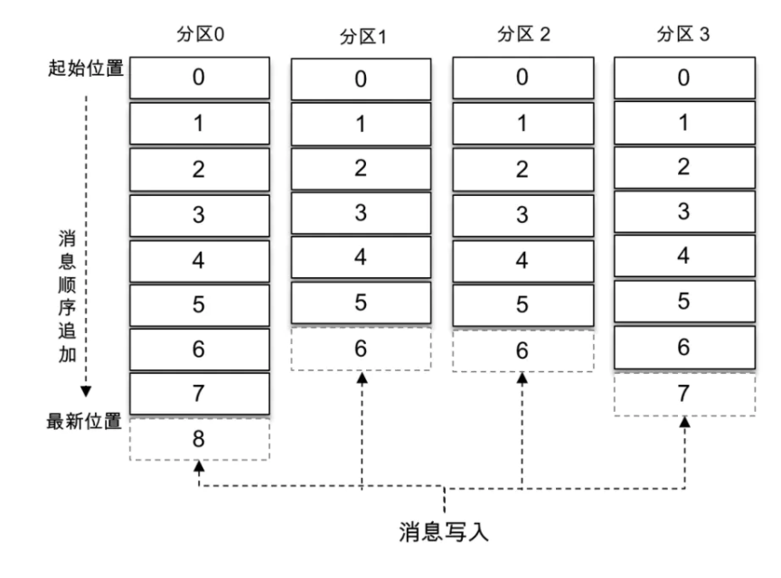
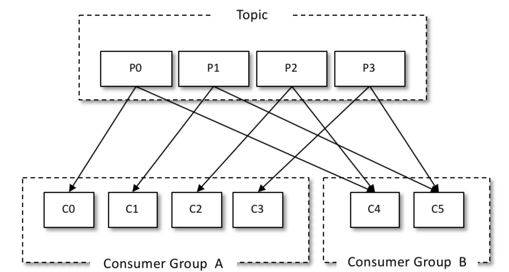
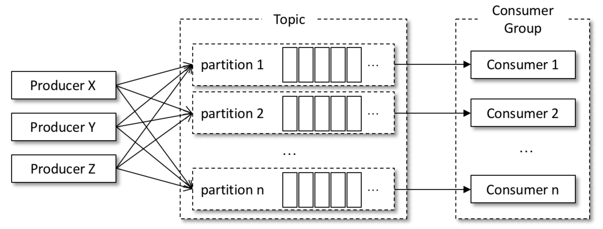

# 1、核心概念

## 1.1、主要特点

Kafka是分布式发布-订阅消息系统。它最初由LinkedIn公司开发，之后成为Apache项目的一部分。Kafka是一个分布式的，可划分的，冗余备份的持久性的日志服务，它主要用于处理活跃的流式数据。一个多分区、多副本且基于 ZooKeeper 协调的分布式消息系统

**主要特点：**
- 是基于pull的模式来处理消息消费，追求高吞吐量
- 同时为发布和订阅提供高吞吐量。据了解，Kafka每秒可以生产约25万消息（50 MB），每秒处理55万消息（110 MB）。同时kafka也支持点对点的消息投递，消费者都隶属于一个消费组，相当于点对点模型；
- 可进行持久化操作。将消息持久化到磁盘，因此可用于批量消费，例如ETL，以及实时应用程序。通过将数据持久化到硬盘以及replication防止数据丢失。
- 分布式系统，易于向外扩展。所有的producer、broker和consumer都会有多个，均为分布式的。无需停机即可扩展机器。
- 消息被处理的状态是在consumer端维护，而不是由server端维护。当失败时能自动平衡。
- 支持online和offline的场景。
- 支持分区，并支持跨平台、伸缩性、实时性；

**主要扮演角色：**
- 消息系统： Kafka 和传统的消息系统（也称作消息中间件）都具备系统解耦、冗余存储、流量削峰、缓冲、异步通信、扩展性、可恢复性等功能。与此同时，Kafka 还提供了大多数消息系统难以实现的消息顺序性保障及回溯消费的功能。
- 存储系统： Kafka 把消息持久化到磁盘，相比于其他基于内存存储的系统而言，有效地降低了数据丢失的风险。也正是得益于 Kafka 的消息持久化功能和多副本机制，我们可以把 Kafka 作为长期的数据存储系统来使用，只需要把对应的数据保留策略设置为“永久”或启用主题的日志压缩功能即可。
- 流式处理平台： Kafka 不仅为每个流行的流式处理框架提供了可靠的数据来源，还提供了一个完整的流式处理类库，比如窗口、连接、变换和聚合等各类操作

## 1.2、kafka架构


Kafka的整体架构非常简单，是显式分布式架构，producer、broker（kafka）和consumer都可以有多个。Producer，consumer实现Kafka注册的接口，数据从producer发送到broker，broker承担一个中间缓存和分发的作用。broker分发注册到系统中的consumer。broker的作用类似于缓存，即活跃的数据和离线处理系统之间的缓存。客户端和服务器端的通信，是基于简单，高性能，且与编程语言无关的TCP协议。

基本概念：
- `Message`：消息，是通信的基本单位，每个producer可以向一个topic（主题）发布一些消息。

- `Producer`：消息和数据生产者，向Kafka的一个topic发布消息的过程叫做producers。

- `Consumer`：消息和数据消费者，订阅topics并处理其发布的消息的过程叫做consumers。

- `Consumer Group (CG)`：消费者组，由多个 consumer 组成。消费者组内每个消费者负 责消费不同分区的数据，一个分区只能由一个组内消费者消费;消费者组之间互不影响。所有的消费者都属于某个消费者组，即消费者组是逻辑上的一个订阅者

- `Broker`：缓存代理，Kafka集群中的一台或多台服务器统称为broker。一台 kafka 服务器就是一个 broker。一个集群由多个 broker 组成。一个 broker 可以容纳多个 topic；

- `Topic`：特指Kafka处理的消息源（feeds of messages）的不同分类，其是一个逻辑上的概念；

- `Partition`：Topic物理上的分组，一个topic可以分为多个partition，每个partition是一个有序的队列。；同一主题下的不同分区包含的消息是不同的，分区在存储层面可以看作一个可追加的日志（Log）文件，消息在被追加到分区日志文件的时候都会分配一个特定的偏移量（offset，消息在分区中的唯一标识，Kafka 通过它来保证消息在分区内的顺序性）；在创建主题的时候可以通过指定的参数来设置分区的个数，当然也可以在主题创建完成之后去修改分区的数量，通过增加分区的数量可以实现水平扩展；

    

- `Replica副本`，为保证集群中的某个节点发生故障时，该节点上的 partition 数据不丢失，且 kafka 仍然能够继续工作，kafka 提供了副本机制，一个 topic 的每个分区都有若干个副本， 副本之间是“一主多从”的关系，其中 leader 副本负责处理读写请求，follower 副本只负责与 leader 副本的消息同步。副本处于不同的 broker 中，当 leader 副本出现故障时，从 follower 副本中重新选举新的 leader 副本对外提供服务。Kafka 通过多副本机制实现了故障的自动转移，当 Kafka 集群中某个 broker 失效时仍然能保证服务可用，通过增加副本数量可以提升容灾能力；

**发送消息的流程：**
- Producer根据指定的partition方法（round-robin、hash等），将消息发布到指定topic的partition里面
- kafka集群接收到Producer发过来的消息后，将其持久化到硬盘，并保留消息指定时长（可配置），而不关注消息是否被消费。
- Consumer从kafka集群pull数据，并控制获取消息的offset

## 1.3、多副本机制

通过增加副本的数量提升kafka的容灾能力；

同一分区的不同副本中保存的是相同的消息（在同一时刻，副本之间并非完全一样），副本之间是`一主多从`的关系，其中 leader 副本负责处理读写请求，follower 副本只负责与 leader 副本的消息同步。副本处于不同的 broker 中，当 leader 副本出现故障时，从 follower 副本中重新选举新的 leader 副本对外提供服务。Kafka 通过多副本机制实现了故障的自动转移，当 Kafka 集群中某个 broker 失效时仍然能保证服务可用；


生产者和消费者只与 leader 副本进行交互，而 follower 副本只负责消息的同步，很多时候 follower 副本中的消息相对 leader 副本而言会有一定的滞后。

### 1.3.1、AR、ISR、OSR
- `AR`：分区中的所有副本统称为 `AR（Assigned Replicas）`；
- `ISR`：所有与 leader 副本保持一定程度同步的副本（包括 leader 副本在内）组成`ISR（In-Sync Replicas）`；`ISR 集合`是 `AR 集合`中的一个子集。消息会先发送到 leader 副本，然后 follower 副本才能从 leader 副本中拉取消息进行同步，同步期间内 follower 副本相对于 leader 副本而言会有一定程度的滞后；
- `OSR`：与 leader 副本同步滞后过多的副本（不包括 leader 副本）组成 `OSR（Out-of-Sync Replicas）`集合；

**综上：**`AR=ISR+OSR`。在正常情况下，所有的 follower 副本都应该与 leader 副本保持一定程度的同步，即 `AR=ISR，OSR 集合为空`；

### 1.3.2、如何维护AR、ISR、OSR三者之间的副本

- leader 副本负责维护和跟踪 ISR 集合中所有 follower 副本的滞后状态，当 follower 副本落后太多或失效时，leader 副本会把它从 ISR 集合中剔除；
- 如果 OSR 集合中有 follower 副本“追上”了 leader 副本，那么 leader 副本会把它从 OSR 集合转移至 ISR 集合。
- 默认情况下，当 leader 副本发生故障时，只有在 ISR 集合中的副本才有资格被选举为新的 leader，而在 OSR 集合中的副本则没有任何机会（不过这个原则也可以通过修改相应的参数配置来改变）

### 1.3.3、ISR与HW、LEO

HW 是 `High Watermark` 的缩写，俗称`高水位`，它标识了一个特定的消息偏移量（offset），消费者只能拉取到这个 offset 之前的消息；


如上图所示，它代表一个日志文件，这个日志文件中有9条消息，第一条消息的 offset（LogStartOffset）为0，最后一条消息的 offset 为8，offset 为9的消息用虚线框表示，代表下一条待写入的消息。日志文件的 HW 为6，表示消费者只能拉取到 offset 在0至5之间的消息，而 offset 为6的消息对消费者而言是不可见的；

LEO 是 `Log End Offset` 的缩写，它标识当前日志文件中下一条待写入消息的 offset，上图中 offset 为9的位置即为当前日志文件的 LEO，LEO 的大小相当于当前日志分区中最后一条消息的 offset 值加1。分区 ISR 集合中的每个副本都会维护自身的 LEO，而 ISR 集合中最小的 LEO 即为分区的 HW，对消费者而言只能消费 HW 之前的消息；

Kafka 的复制机制既不是完全的同步复制，也不是单纯的异步复制。事实上，同步复制要求所有能工作的 follower 副本都复制完，这条消息才会被确认为已成功提交，这种复制方式极大地影响了性能。而在异步复制方式下，follower 副本异步地从 leader 副本中复制数据，数据只要被 leader 副本写入就被认为已经成功提交。在这种情况下，如果 follower 副本都还没有复制完而落后于 leader 副本，突然 leader 副本宕机，则会造成数据丢失；

## 1.4、高性能原因

- 顺序写，PageCache空中接力，高效读写，避免了随机写；
- 后台异步、主动Flush；
- 高性能、高吞吐;
- 预读策略；

## 1.5、kafka零拷贝

[零拷贝](../../Java基础/Java-IO.md#四零拷贝)

## 1.6、Kafka应用场景

- 异步化、服务解耦、削峰填谷
- 海量日志手机
- 数据同步应用
- 实时计算分析

# 2、kafka配置安装

|功能	 |            启动命令	|备注|
|-------|---------------------|----|
|启动  ZK	        | `bin/zookeeper-server-start.sh -daemon config/zookeeper.properties`	|Kafka 安装包自带 ZK，可以单节点启动|
|启动Kafka服务器      | `bin/kafka-server-start.sh config/server.properties` || 	
|创建 Topic（test）	 | `bin/kafka-topics.sh --create --zookeeper localhost:2181 --replication-factor 1 --partitions 1 --topic test`|	|
|Topic 列表	        | `bin/kafka-topics.sh --list --zookeeper localhost:2181`	||
|启动 Producer	    | `bin/kafka-console-producer.sh --broker-list localhost:9092 --topic test`	||
|启动 Consumer	    | `bin/kafka-console-consumer.sh --bootstrap-server localhost:9092 --topic test --from-beginning`	||
|Topic相关信息（test) | `bin/kafka-topics.sh --describe --zookeeper localhost:2181 --topic test` || 

# 3、Kafka入门


# 4、Kafka生产者

## 4.1、生产者API

### 4.1.1、ProducerConfig

主要封装了一些Kafka需要的配置常量，防止用户在添加配置的时候，将配置名称写错了：
```java
public class ProducerConfig extends AbstractConfig {
    private static final ConfigDef CONFIG;
    public static final String BOOTSTRAP_SERVERS_CONFIG = CommonClientConfigs.BOOTSTRAP_SERVERS_CONFIG;
    public static final String CLIENT_DNS_LOOKUP_CONFIG = CommonClientConfigs.CLIENT_DNS_LOOKUP_CONFIG;
    public static final String METADATA_MAX_AGE_CONFIG = CommonClientConfigs.METADATA_MAX_AGE_CONFIG;
    private static final String METADATA_MAX_AGE_DOC = CommonClientConfigs.METADATA_MAX_AGE_DOC;
    ...
}
```

### 4.1.2、KafkaProducer

KafkaProducer 是线程安全的，可以在多个线程中共享单个 KafkaProducer 实例，也可以将 KafkaProducer 实例进行池化来供其他线程调用；

KafkaProducer 中有多个构造方法，比如在创建 KafkaProducer 实例时并没有设定 key.serializer 和 value.serializer 这两个配置参数，那么就需要在构造方法中添加对应的序列化器；

**KafkaProducer的异常类型**

KafkaProducer 中一般会发生两种类型的异常：`可重试的异常`和`不可重试的异常`。
- 常见的可重试异常有：NetworkException、LeaderNotAvailableException、UnknownTopicOrPartitionException、NotEnoughReplicasException、NotCoordinatorException 等。比如 NetworkException 表示网络异常，这个有可能是由于网络瞬时故障而导致的异常，可以通过重试解决；又比如 LeaderNotAvailableException 表示分区的 leader 副本不可用，这个异常通常发生在 leader 副本下线而新的 leader 副本选举完成之前，重试之后可以重新恢复；

    对于可重试的异常，如果配置了 retries 参数，那么只要在规定的重试次数内自行恢复了，就不会抛出异常。retries 参数的默认值为0，配置方式参考如下：
    ```
    props.put(ProducerConfig.RETRIES_CONFIG, 10);
    ```
- 不可重试的异常，比如 RecordTooLargeException 异常，暗示了所发送的消息太大，KafkaProducer 对此不会进行任何重试，直接抛出异常；

**发送消息主要有三种模式：**
- 发后即忘（fire-and-forget）：它只管往 Kafka 中发送消息而并不关心消息是否正确到达；在某些时候（比如发生不可重试异常时）会造成消息的丢失。这种发送方式的性能最高，可靠性也最差
- 同步（sync）：实现同步的发送方式，可以利用返回的 Future 对象实现；同步发送的方式可靠性高，要么消息被发送成功，要么发生异常。如果发生异常，则可以捕获并进行相应的处理，而不会像“发后即忘”的方式直接造成消息的丢失
    ```java
    // 线程安全的
    KafkaProducer<String, String> producer = new KafkaProducer<String, String>(properties);
    for (int i = 0; i < 10; i++) {
        User user = new User("00" + i, "张三");
        ProducerRecord<String, String> record = new ProducerRecord<>(TopicConstants.TOPIC_QUICKSTART, JSON.toJSONString(user));
        System.out.println("send " + i);
        // 本质上是异步的，消息发送后自动创建topic
        Future<RecordMetadata> future = producer.send(record);
        RecordMetadata metadata = future.get();
    }
    ```
- 异步（async）：一般是在 send() 方法里指定一个 Callback 的回调函数，Kafka 在返回响应时调用该函数来实现异步的发送确认
    ```java
     producer.send(record, new Callback() {
        @Override
        public void onCompletion(RecordMetadata metadata, Exception exception) {
            // onCompletion() 方法的两个参数是互斥的，消息发送成功时，metadata 不为 null 而 exception 为 null；消息发送异常时，metadata 为 null 而 exception 不为 null
        }
    })
    ```

send() 方法本身就是异步的，send() 方法返回的 Future 对象可以使调用方稍后获得发送的结果，可以通过Future可以获取一个 RecordMetadata 对象，在 RecordMetadata 对象里包含了消息的一些元数据信息，比如当前消息的主题、分区号、分区中的偏移量（offset）、时间戳等；

Future 表示一个任务的生命周期，并提供了相应的方法来判断任务是否已经完成或取消，以及获取任务的结果和取消任务等；

### 4.1.3、ProducerRecord

```java
public class ProducerRecord<K, V> {
    private final String topic; //主题
    private final Integer partition; //分区号
    private final Headers headers; //消息头部
    // key 是用来指定消息的键，key 可以让消息再进行二次归类，同一个 key 的消息会被划分到同一个分区中；有 key 的消息还可以支持日志压缩的功能
    private final K key; //键
    private final V value; //值
    // timestamp 是指消息的时间戳，它有 CreateTime 和 LogAppendTime 两种类型，前者表示消息创建的时间，后者表示消息追加到日志文件的时间
    private final Long timestamp; //消息的时间戳
    //省略其他成员方法和构造方法
}
```

## 4.2、kafka生产者参数

### 4.2.1、必要参数

- `bootstrap.servers`：该参数用来指定生产者客户端连接 Kafka 集群所需的 broker 地址清单，具体的内容格式为 host1:port1,host2:port2，可以设置一个或多个地址，中间以逗号隔开，此参数的默认值为“”；建议至少要设置两个以上的 broker 地址信息，当其中任意一个宕机时，生产者仍然可以连接到 Kafka 集群上；

- `key.serializer` 和 `value.serializer`：broker 端接收的消息必须以字节数组（byte[]）的形式存在

### 4.2.2、重要参数

- `acks`：指用来指定分区中必须要有多少个副本收到这条消息，之后生产者才会认为这条消息是成功写入的，默认为1；acks 是生产者客户端中一个非常重要的参数，它涉及消息的可靠性和吞吐量之间的权衡；*注意：*acks 参数配置的值是一个字符串类型，而不是整数类型
    - `acks1`：默认值，生产者发送消息之后，只要分区的 leader 副本成功写入消息，那么它就会收到来自服务端的成功响应；如果消息无法写入 leader 副本，比如在 leader 副本崩溃、重新选举新的 leader 副本的过程中，那么生产者就会收到一个错误的响应，为了避免消息丢失，生产者可以选择重发消息。如果消息写入 leader 副本并返回成功响应给生产者，且在被其他 follower 副本拉取之前 leader 副本崩溃，那么此时消息还是会丢失，因为新选举的 leader 副本中并没有这条对应的消息。acks 设置为1，是消息可靠性和吞吐量之间的折中方案；
    - `acks=0`：生产者发送消息之后不需要等待任何服务端的响应。如果在消息从发送到写入 Kafka 的过程中出现某些异常，导致 Kafka 并没有收到这条消息，那么生产者也无从得知，消息也就丢失了。在其他配置环境相同的情况下，acks 设置为0可以达到最大的吞吐量；
    - `acks=-1, acks=all`：生产者在消息发送之后，需要等待 ISR 中的所有副本都成功写入消息之后才能够收到来自服务端的成功响应。在其他配置环境相同的情况下，acks 设置为 -1（all） 可以达到最强的可靠性；但这并不意味着消息就一定可靠，因为ISR中可能只有 leader 副本，这样就退化成了 acks=1 的情况。要获得更高的消息可靠性需要配合 min.insync.replicas 等参数的联动

- `max.request.size`：该参数用来限制生产者客户端能发送的消息的最大值；默认值为`1048576B`，即1MB。一般情况下，这个默认值就可以满足大多数的应用场景了；不建议盲目地增大这个参数的配置值；因为这个参数还涉及一些其他参数的联动，比如 broker 端的 `message.max.bytes` 参数，如果配置错误可能会引起一些不必要的异常。比如将 broker 端的 `message.max.bytes` 参数配置为10，而 `max.request.size` 参数配置为20，那么当我们发送一条大小为15B的消息时，生产者客户端就会报出如下的异常：`org.apache.kafka.common.errors.RecordTooLargeException: The request included a message larger than the max message size the server will accept.`

- `retries 和 retry.backoff.msretries`：重试次数（默认是0）即在发生异常的时候不进行任何重试动作；重试间隔（默认是100ms）；

- `compression.type`：用来指定的消息的压缩方式，默认值为`none`，可选配置：`gzip`、`snappy`、`lz4`；对消息进行压缩可以极大地减少网络传输量、降低网络I/O，从而提高整体的性能。消息压缩是一种使用时间换空间的优化方式，如果对时延有一定的要求，则不推荐对消息进行压缩。

- `connections.max.idle.ms`：用来指定在多久之后关闭限制的连接，默认是 54000ms，即9分钟；

- `linger.ms`：用来指定生产者发送 ProducerBatch 之前等待更多的消息（ProducerRecord）加入 ProducerBatch的时间，默认是0；

- `batch.size`：累计多少条消息，则一次进行批量发送；只要满足 linger.ms 和 batch.size 一个，都会发生的；

- `buffer.memory`：缓存提示性能参数，默认值为 33554432B，即32MB

- `receive.buffer.bytes`：用来设置Socket接收消息缓冲区（SO_RECBUF）的大小，默认是32k；如果设置为-1，则使用操作系统的默认值。如果 Producer 与 Kafka 处于不同的机房，则可以适地调大这个参数值

- `send.buffer.bytes`：用来设置socket发送消息缓冲区（SO_SNDBUF）的大小，默认是128k；与 `receive.buffer.bytes` 参数一样，如果设置为-1，则使用操作系统的默认值

- `request.timeout.ms`：用来配置Producer等待请求响应的最长时间，默认是 30000ms

## 4.3、序列化

生产者需要用序列化器（Serializer）把对象转换成字节数组才能通过网络发送给 Kafka。而在对侧，消费者需要用反序列化器（Deserializer）把从 Kafka 中收到的字节数组转换成相应的对象：
```java
properties.put(ProducerConfig.KEY_SERIALIZER_CLASS_CONFIG, StringSerializer.class.getName());
properties.put(ProducerConfig.VALUE_SERIALIZER_CLASS_CONFIG, StringSerializer.class.getName());
```
除了用于 String 类型的序列化器，还有 ByteArray、ByteBuffer、Bytes、Double、Integer、Long 这几种类型，它们都实现了 `org.apache.kafka.common.serialization.Serializer` 接口，该接口如下：
```java
public interface Serializer<T> extends Closeable {
    default void configure(Map<String, ?> configs, boolean isKey) {
        // configure() 方法用来配置当前类，在创建 KafkaProducer 的时候创建的；
    }
    // serialize() 方法用来执行序列化操作
    byte[] serialize(String topic, T data);
    default byte[] serialize(String topic, Headers headers, T data) {
        return serialize(topic, data);
    }
    // 而 close() 方法用来关闭当前的序列化器，一般情况下 close() 是一个空方法，如果实现了此方法，则必须确保此方法的幂等性，因为这个方法很可能会被 KafkaProducer 调用多次
    default void close() {
    }
}
```
生产者使用的序列化器和消费者使用的反序列化器是需要一一对应的，如果生产者使用了某种序列化器，比如 StringSerializer，而消费者使用了另一种序列化器，比如 IntegerSerializer，那么是无法解析出想要的数据的；

如果 Kafka 客户端提供的几种序列化器都无法满足应用需求，则可以选择使用如 Avro、JSON、Thrift、ProtoBuf 和 Protostuff 等通用的序列化工具来实现，或者使用自定义类型的序列化器来实现：
```java
//  User 包含两个字段：id和name
public class UserSerializer implements Serializer<User> {
    @Override
    public void configure(Map<String, ?> configs, boolean isKey) {
    }

    @Override
    public byte[] serialize(String topic, User user) {
        if (user == null) {
            return null;
        }
        byte[] idBytes, nameBytes;
        String id = user.getId();
        String name = user.getName();
        if (id != null) {
            idBytes = id.getBytes(StandardCharsets.UTF_8);
        } else {
            idBytes = new byte[0];
        }
        if (name != null) {
            nameBytes = name.getBytes(StandardCharsets.UTF_8);
        } else {
            nameBytes = new byte[0];
        }
        // 定义buffer格式：4字节（id的真实长度） + id数据 + 4字节（name的真实长度） + name数据
        ByteBuffer buffer = ByteBuffer.allocate(4 + 4 + idBytes.length + nameBytes.length);
        //	4个字节 也就是一个 int类型 : putInt 盛放 idBytes的实际真实长度
        buffer.putInt(idBytes.length);
        //	put bytes[] 实际盛放的是idBytes真实的字节数组，也就是内容
        buffer.put(idBytes);
        buffer.putInt(nameBytes.length);
        buffer.put(nameBytes);
        return buffer.array();
    }
    @Override
    public void close() {

    }
}
```

## 4.4、分区器

消息在通过 send() 方法发往 broker 的过程中，有可能需要经过拦截器（Interceptor）、序列化器（Serializer）和分区器（Partitioner）的一系列作用之后才能被真正地发往 broker；消息经过序列化之后就需要确定它发往的分区，但如果消息 ProducerRecord 中指定了 partition 字段，那么就不需要分区器的作用，因为 partition 代表的就是所要发往的分区号；

如果消息 ProducerRecord 中没有指定 partition 字段，那么就需要依赖分区器，根据 key 这个字段来计算 partition 的值。分区器的作用就是为消息分配分区，Kafka默认的分区器是`org.apache.kafka.clients.producer.internals.DefaultPartitioner`，它实现了 `org.apache.kafka.clients.producer.Partitioner` 接口，该接口定义：
```java
public interface Partitioner extends Configurable, Closeable {
    //  partition() 方法用来计算分区号，返回值为 int 类型。partition() 方法中的参数分别表示主题、键、序列化后的键、值、序列化后的值，以及集群的元数据信息，通过这些信息可以实现功能丰富的分区器
    public int partition(String topic, Object key, byte[] keyBytes, Object value, byte[] valueBytes, Cluster cluster);
    ...
}
```

在默认分区器 DefaultPartitioner 的实现中，close() 是空方法，而在 partition() 方法中定义了主要的分区分配逻辑。如果 key 不为 null，那么默认的分区器会对 key 进行哈希（采用 MurmurHash2 算法，具备高运算性能及低碰撞率），最终根据得到的哈希值来计算分区号，拥有相同 key 的消息会被写入同一个分区。如果 key 为 null，那么消息将会以轮询的方式发往主题内的各个可用分区：
```java
public class DefaultPartitioner implements Partitioner {
    private final ConcurrentMap<String, AtomicInteger> topicCounterMap = new ConcurrentHashMap<>();
    public int partition(String topic, Object key, byte[] keyBytes, Object value, byte[] valueBytes, Cluster cluster) {
        List<PartitionInfo> partitions = cluster.partitionsForTopic(topic);
        int numPartitions = partitions.size();
        if (keyBytes == null) {
            int nextValue = nextValue(topic);
            List<PartitionInfo> availablePartitions = cluster.availablePartitionsForTopic(topic);
            if (availablePartitions.size() > 0) {
                int part = Utils.toPositive(nextValue) % availablePartitions.size();
                return availablePartitions.get(part).partition();
            } else {
                // no partitions are available, give a non-available partition
                return Utils.toPositive(nextValue) % numPartitions;
            }
        } else {
            // hash the keyBytes to choose a partition
            return Utils.toPositive(Utils.murmur2(keyBytes)) % numPartitions;
        }
    }
    private int nextValue(String topic) {
        AtomicInteger counter = topicCounterMap.get(topic);
        if (null == counter) {
            counter = new AtomicInteger(ThreadLocalRandom.current().nextInt());
            AtomicInteger currentCounter = topicCounterMap.putIfAbsent(topic, counter);
            if (currentCounter != null) {
                counter = currentCounter;
            }
        }
        return counter.getAndIncrement();
    }
}
```
除了使用 Kafka 提供的默认分区器进行分区分配，还可以使用自定义的分区器，只需同 DefaultPartitioner 一样实现 Partitioner 接口即可。默认的分区器在 key 为 null 时不会选择非可用的分区，我们可以通过自定义的分区器 DemoPartitioner 来打破这一限制。指定自定义分区器：`props.put(ProducerConfig.PARTITIONER_CLASS_CONFIG,DemoPartitioner.class.getName());`

## 4.5、拦截器

生产者拦截器的使用也很方便，主要是自定义实现 `org.apache.kafka.clients.producer.ProducerInterceptor` 接口，ProducerInterceptor 接口中包含3个方法：
```java
public interface ProducerInterceptor<K, V> extends Configurable {
    // KafkaProducer 在将消息序列化和计算分区之前会调用生产者拦截器的 onSend() 方法来对消息进行相应的定制化操作
    public ProducerRecord<K, V> onSend(ProducerRecord<K, V> record);
    // KafkaProducer 会在消息被应答（Acknowledgement）之前或消息发送失败时调用生产者拦截器的 onAcknowledgement() 方法，优先于用户设定的 Callback 之前执行；这个方法运行在 Producer 的I/O线程中，所以这个方法中实现的代码逻辑越简单越好，否则会影响消息的发送速度
    public void onAcknowledgement(RecordMetadata metadata, Exception exception);
    ...
}
```
在 KafkaProducer 的配置参数 interceptor.classes 中指定拦截器：`properties.put(ProducerConfig.INTERCEPTOR_CLASSES_CONFIG, CustomProducerInterceptor.class.getName());`；

KafkaProducer 中不仅可以指定一个拦截器，还可以指定多个拦截器以形成拦截链。`拦截链`会按照 `interceptor.classes 参数配置的拦截器的顺序来一一执行`（配置的时候，各个拦截器之间使用逗号隔开）；

如果拦截链中的某个拦截器的执行需要依赖于前一个拦截器的输出，那么就有可能产生“副作用”。设想一下，如果前一个拦截器由于异常而执行失败，那么这个拦截器也就跟着无法继续执行。在拦截链中，如果某个拦截器执行失败，那么下一个拦截器会接着从上一个执行成功的拦截器继续执行；

## 4.6、生产者客户端原理


整个生产者客户端由两个线程协调运行，这两个线程分别为`主线程`和 `Sender 线程（发送线程）`。在主线程中由 KafkaProducer 创建消息，然后通过可能的`拦截器、序列化器和分区器`的作用之后缓存到消息累加器（RecordAccumulator，也称为消息收集器）中。`Sender 线程负责从 RecordAccumulator 中获取消息并将其发送到 Kafka 中`；

Sender线程在构建KafkaProducer的过程中就启动了：
```java
KafkaProducer(Map<String, Object> configs, Serializer<K> keySerializer, Serializer<V> valueSerializer, ProducerMetadata metadata,  KafkaClient kafkaClient, ProducerInterceptors interceptors, Time time) {
    try {
        // 各种参数设置....
        // 构建 Sender，sender是Runnable实例
        this.sender = newSender(logContext, kafkaClient, this.metadata);
        String ioThreadName = NETWORK_THREAD_PREFIX + " | " + clientId;
        // KafkaThread继承Thread类
        this.ioThread = new KafkaThread(ioThreadName, this.sender, true);
        // 真正运行的 Sender 类的 run 方法
        this.ioThread.start();
        config.logUnused();
        AppInfoParser.registerAppInfo(JMX_PREFIX, clientId, metrics, time.milliseconds());
        log.debug("Kafka producer started");
    } catch (Throwable t) {
        // call close methods if internal objects are already constructed this is to prevent resource leak. see KAFKA-2121
        close(Duration.ofMillis(0), true);
        // now propagate the exception
        throw new KafkaException("Failed to construct kafka producer", t);
    }
}
// 其中KafkaThread构造函数中 runnable 参数其实是 Sender的实例
public KafkaThread(final String name, Runnable runnable, boolean daemon) {
    super(runnable, name);
    configureThread(name, daemon);
}
```

主线程中发送过来的消息都会被追加到 RecordAccumulator 的某个双端队列（Deque）中，在 RecordAccumulator 的内部为每个分区都维护了一个双端队列，队列中的内容就是 ProducerBatch，即 Deque。消息写入缓存时，追加到双端队列的尾部；Sender 读取消息时，从双端队列的头部读取。注意 ProducerBatch 不是 ProducerRecord，ProducerBatch 中可以包含一至多个 ProducerRecord。通俗地说，ProducerRecord 是生产者中创建的消息，而 ProducerBatch 是指一个消息批次，ProducerRecord 会被包含在 ProducerBatch 中，这样可以使字节的使用更加紧凑。与此同时，将较小的 ProducerRecord 拼凑成一个较大的 ProducerBatch，也可以减少网络请求的次数以提升整体的吞吐量。ProducerBatch 和消息的具体格式有关，如果生产者客户端需要向很多分区发送消息，则可以将 buffer.memory 参数适当调大以增加整体的吞吐量。

消息在网络上都是以字节（Byte）的形式传输的，在发送之前需要创建一块内存区域来保存对应的消息。在 Kafka 生产者客户端中，通过 `java.io.ByteBuffer` 实现消息内存的创建和释放。不过频繁的创建和释放是比较耗费资源的，在 RecordAccumulator 的内部还有一个 BufferPool，它主要用来实现 ByteBuffer 的复用，以实现缓存的高效利用。不过 BufferPool 只针对特定大小的 ByteBuffer 进行管理，而其他大小的 ByteBuffer 不会缓存进 BufferPool 中，这个特定的大小由 `batch.size` 参数来指定，默认值为16384B，即16KB。可以适当地调大 `batch.size` 参数以便多缓存一些消息。

当一条消息（ProducerRecord）流入 RecordAccumulator 时，会先寻找与消息分区所对应的双端队列（如果没有则新建），再从这个双端队列的尾部获取一个 ProducerBatch（如果没有则新建），查看 ProducerBatch 中是否还可以写入这个 ProducerRecord，如果可以则写入，如果不可以则需要创建一个新的 ProducerBatch。在新建 ProducerBatch 时评估这条消息的大小是否超过 `batch.size` 参数的大小，如果不超过，那么就以 `batch.size` 参数的大小来创建 ProducerBatch，这样在使用完这段内存区域之后，可以通过 BufferPool 的管理来进行复用；如果超过，那么就以评估的大小来创建 ProducerBatch，这段内存区域不会被复用。

Sender 从 RecordAccumulator 中获取缓存的消息之后，会进一步将原本`<分区, Deque< ProducerBatch>>` 的保存形式转变成 `<Node, List< ProducerBatch>` 的形式，其中 Node 表示 Kafka 集群的 broker 节点。对于网络连接来说，生产者客户端是与具体的 broker 节点建立的连接，也就是向具体的 broker 节点发送消息，而并不关心消息属于哪一个分区；而对于 KafkaProducer 的应用逻辑而言，我们只关注向哪个分区中发送哪些消息，所以在这里需要做一个应用逻辑层面到网络I/O层面的转换。

在转换成 `<Node, List>` 的形式之后，Sender 还会进一步封装成 `<Node, Request>` 的形式，这样就可以将 Request 请求发往各个 Node 了，这里的 Request 是指 Kafka 的各种协议请求，对于消息发送而言就是指具体的 ProduceRequest。

请求在从 Sender 线程发往 Kafka 之前还会保存到 InFlightRequests 中，InFlightRequests 保存对象的具体形式为 `Map<NodeId, Deque>`，它的主要作用是缓存了已经发出去但还没有收到响应的请求（NodeId 是一个 String 类型，表示节点的 id 编号）。与此同时，InFlightRequests 还提供了许多管理类的方法，并且通过配置参数还可以限制每个连接（也就是客户端与 Node 之间的连接）最多缓存的请求数。这个配置参数为 max.in.flight.requests. per. connection，默认值为5，即每个连接最多只能缓存5个未响应的请求，超过该数值之后就不能再向这个连接发送更多的请求了，除非有缓存的请求收到了响应（Response）。通过比较 Deque 的 size 与这个参数的大小来判断对应的 Node 中是否已经堆积了很多未响应的消息，如果真是如此，那么说明这个 Node 节点负载较大或网络连接有问题，再继续向其发送请求会增大请求超时的可能；

# 5、Kafka消费者

与生产者对应的是消费者，应用程序可以通过 KafkaConsumer 来订阅主题，并从订阅的主题中拉取消息

## 5.1、消费者与消费组

消费者（Consumer）负责订阅 Kafka 中的主题（Topic），并且从订阅的主题上拉取消息。与其他一些消息中间件不同的是：在 Kafka 的消费理念中还有一层消费组（Consumer Group）的概念，每个消费者都有一个对应的消费组。当消息发布到主题后，只会被投递给订阅它的`每个消费组`中的`一个消费者`；



如上图所示，某个主题中共有4个分区（Partition）：P0、P1、P2、P3。有两个消费组A和B都订阅了这个主题，消费组A中有4个消费者（C0、C1、C2和C3），消费组B中有2个消费者（C4和C5）。按照 Kafka 默认的规则，最后的分配结果是消费组A中的每一个消费者分配到1个分区，消费组B中的每一个消费者分配到2个分区，两个消费组之间互不影响。每个消费者只能消费所分配到的分区中的消息。换言之，每一个分区只能被一个消费组中的一个消费者所消费；

消费者与消费组这种模型可以让整体的消费能力具备横向伸缩性，我们可以增加（或减少）消费者的个数来提高（或降低）整体的消费能力。对于分区数固定的情况，一味地增加消费者并不会让消费能力一直得到提升，如果消费者过多，出现了消费者的个数大于分区个数的情况，就会有消费者分配不到任何分区；

分配逻辑都是基于默认的`分区分配策略`进行分析的，可以通过消费者客户端参数 `partition.assignment.strategy` 来设置消费者与订阅主题之间的分区分配策略

## 5.2、点对点与发布/订阅模式

对于消息中间件而言，一般有两种消息投递模式：点对点（P2P，Point-to-Point）模式和发布/订阅（Pub/Sub）模式。
- 点对点模式是基于队列的，消息生产者发送消息到队列，消息消费者从队列中接收消息。
- 发布订阅模式定义了如何向一个内容节点发布和订阅消息，这个内容节点称为主题（Topic），主题可以认为是消息传递的中介，消息发布者将消息发布到某个主题，而消息订阅者从主题中订阅消息。主题使得消息的订阅者和发布者互相保持独立，不需要进行接触即可保证消息的传递，发布/订阅模式在消息的一对多广播时采用

Kafka 同时支持两种消息投递模式，得益于消费者与消费组模型的契合：
- 如果所有的消费者都隶属于同一个消费组，那么所有的消息都会被均衡地投递给每一个消费者，即每条消息只会被一个消费者处理，这就相当于点对点模式的应用；
- 如果所有的消费者都隶属于不同的消费组，那么所有的消息都会被广播给所有的消费者，即每条消息会被所有的消费者处理，这就相当于发布/订阅模式的应用；

每一个消费组都会有一个固定的名称，消费者在进行消费前需要指定其所属消费组的名称，这个可以通过消费者客户端参数 group.id 来配置，默认值为空字符串

## 5.3、消费者步骤

一个正常的消费逻辑需要具备以下几个步骤：
- 配置消费者客户端参数及创建相应的消费者实例；
- 订阅主题；
- 拉取消息并消费；
- 提交消费位移；
- 关闭消费者实例；

```java
public class QuickstartConsumer {
    public static void main(String[] args) {
        Properties properties = new Properties();
        properties.put(ConsumerConfig.BOOTSTRAP_SERVERS_CONFIG, KafkaConstants.BOOTSTRAP_SERVER);
        properties.put(ConsumerConfig.KEY_DESERIALIZER_CLASS_CONFIG, StringDeserializer.class.getName());
        properties.put(ConsumerConfig.VALUE_DESERIALIZER_CLASS_CONFIG, StringDeserializer.class.getName());
        // 与消费订阅组相关
        properties.put(ConsumerConfig.GROUP_ID_CONFIG, "quickstart-group");
        // 消费者提交offset：自动提交&手动提交，默认自动提交
        properties.put(ConsumerConfig.ENABLE_AUTO_COMMIT_CONFIG, true);
        properties.put(ConsumerConfig.AUTO_COMMIT_INTERVAL_MS_CONFIG, 5000);
        KafkaConsumer<String, String> consumer = new KafkaConsumer<String, String>(properties);
        consumer.subscribe(Collections.singletonList(TopicConstants.TOPIC_QUICKSTART));
        // 采取拉取消息的方式消费数据
        while (true) {
            // 拉取一个topic里所有的消息，topic 和 partition是一堆多的
            ConsumerRecords<String, String> records = consumer.poll(Duration.ofMillis(1000));
            // 消息时在partition中存储的，需要遍历 partition 集合
            records.partitions().forEach(topicPartition -> {
                // 通过 TopicPartition 获取指定的数据集合，获取到的是当前 TopicPartition 下面所有的消息
                List<ConsumerRecord<String, String>> consumerRecords = records.records(topicPartition);
                String topic = topicPartition.topic();
                int size = consumerRecords.size();
                System.out.println(String.format("----获取topic： %s, 分区位置：%s, 消息总数: %s", topic, topicPartition.partition(), size));
                for (int i = 0; i < size; i++) {
                    ConsumerRecord<String, String> record = consumerRecords.get(i);
                    // 实际的数据内容
                    String value = record.value();
                    // 当前获取的消息偏移量
                    long offset = record.offset();
                    // 下一次从什么位置拉取消息
                    long commitOffset = offset + 1;
                    System.out.println(String.format("----获取实际消息： %s, 消息offset：%s, 提交的offset: %s", value, offset, commitOffset));
                }
            });
        }
    }
}
```

## 5.4、kafka消费者参数

### 5.4.1、必要参数

- `bootstrap.servers`：该参数用来指定生产者客户端连接 Kafka 集群所需的 broker 地址清单，具体的内容格式为 host1:port1,host2:port2，可以设置一个或多个地址，中间以逗号隔开，此参数的默认值为“”；建议至少要设置两个以上的 broker 地址信息，当其中任意一个宕机时，生产者仍然可以连接到 Kafka 集群上；

- `group.id`：消费者隶属的消费组的名称，默认值为“”。如果设置为空，则会报出异常：`Exception in thread "main" org.apache.kafka.common.errors.InvalidGroupIdException: The configured groupId is invalid`。一般而言，这个参数需要设置成具有一定的业务意义的名称；

- `key.serializer` 和 `value.serializer`：broker 端接收的消息必须以字节数组（byte[]）的形式存在

### 5.4.2、重要参数

- `fetch.min.bytes`：一次拉取最小数据量，默认为1B；
- `fetch.max.bytes`：一次拉取最大数据量，默认为50M；如果这个参数设置的值比任何一条写入 Kafka 中的消息要小，那么会不会造成无法消费呢？该参数设定的不是绝对的最大值，如果在第一个非空分区中拉取的第一条消息大于该值，那么该消息将仍然返回，以确保消费者继续工作；
- `max.partition.fetch.bytes`：一次fetch请求，从一个parition中获得的records最大大小，默认为1M
- `fetch.max.wait.ms`：Fetch请求发给broker后，在broker中可能会被阻塞的时长，默认为500ms；
- `max.poll.records`：Consumer每次调用 poll() 时渠道的records的最大数，默认为500条；

## 5.5、订阅主题与分区

创建消费者：
```java
KafkaConsumer<String, String> consumer = new KafkaConsumer<>(props);
```

### 5.5.1、subscribe

一个消费者可以订阅一个或多个主题，可以使用 subscribe() 方法订阅了一个主题，对于这个方法而言，既可以以集合的形式订阅多个主题，也可以以正则表达式的形式订阅特定模式的主题，其几个重载方法如下：
```java
public class KafkaConsumer<K, V> implements Consumer<K, V> {
    public void subscribe(Collection<String> topics, ConsumerRebalanceListener listener)
    public void subscribe(Collection<String> topics)
    public void subscribe(Pattern pattern, ConsumerRebalanceListener listener)
    public void subscribe(Pattern pattern)
}
```

**集合方式：**

对于消费者使用集合的方式（subscribe(Collection)）来订阅主题而言，订阅了什么主题就消费什么主题中的消息。如果前后两次订阅了不同的主题，那么消费者以最后一次的为准；
```java
consumer.subscribe(Arrays.asList(topic1));
consumer.subscribe(Arrays.asList(topic2));
```
上面的示例中，最终消费者订阅的是 topic2，而不是 topic1，也不是 topic1 和 topic2 的并集；

**正则表达式方法：**

如果消费者采用的是正则表达式的方式（subscribe(Pattern)）订阅，在之后的过程中，如果有人又创建了新的主题，并且主题的名字与正则表达式相匹配，那么这个消费者就可以消费到新添加的主题中的消息。如果应用程序需要消费多个主题，并且可以处理不同的类型，那么这种订阅方式就很有效：`consumer.subscribe(Pattern.compile("topic-.*"));`

subscribe 的重载方法中有一个参数类型是 ConsumerRebalance- Listener，这个是用来设置相应的再均衡监听器的

### 5.5.2、assign

消费者不仅可以通过 KafkaConsumer.subscribe() 方法订阅主题，还可以直接订阅某些主题的特定分区，在 KafkaConsumer 中还提供了一个 assign() 方法来实现这些功能
```java
public class KafkaConsumer<K, V> implements Consumer<K, V> {
    public void assign(Collection<TopicPartition> partitions)
}
```
这个方法只接受一个参数 partitions，用来指定需要订阅的分区集合，其中 TopicPartition 表示分区，其只有两个字段：
```java
public final class TopicPartition implements Serializable {
    private int hash = 0;
    private final int partition; // 分区自身编号
    private final String topic; //  分区所属主题
}
```

**如何知道某个主题的下的分区信息？**

KafkaConsumer 中的 partitionsFor() 方法可以用来查询指定主题的元数据信息：
```java
public List<PartitionInfo> partitionsFor(String topic){}
```
其中 PartitionInfo 类型即为主题的分区元数据信息，此类的主要结构如下：
```java
public class PartitionInfo {
    private final String topic; // 主题名称
    private final int partition; // 分区编号
    private final Node leader; // 分区的 leader 副本所在的位置
    private final Node[] replicas; // 分区的 AR 集合
    private final Node[] inSyncReplicas; // 分区的 ISR 集合
    private final Node[] offlineReplicas; // 分区的 OSR 集合
}
```

### 5.5.3、unsubscribe

既然有订阅，那么就有取消订阅，可以使用 KafkaConsumer 中的 unsubscribe() 方法来取消主题的订阅。这个方法既可以取消通过 subscribe(Collection) 方式实现的订阅，也可以取消通过 subscribe(Pattern) 方式实现的订阅，还可以取消通过 assign(Collection) 方式实现的订阅；

如果将 subscribe(Collection) 或 assign(Collection) 中的集合参数设置为空集合，那么作用等同于 unsubscribe() 方法，下面示例中的三行代码的效果相同：
```java
consumer.unsubscribe();
consumer.subscribe(new ArrayList<String>());
consumer.assign(new ArrayList<TopicPartition>());
```

如果没有订阅任何主题或分区，那么再继续执行消费程序的时候会报出 IllegalStateException 异常：
```
java.lang.IllegalStateException: Consumer is not subscribed to any topics or assigned any partitions
```

集合订阅的方式 subscribe(Collection)、正则表达式订阅的方式 subscribe(Pattern) 和指定分区的订阅方式 assign(Collection) 分表代表了三种不同的订阅状态：AUTO_TOPICS、AUTO_PATTERN 和 USER_ASSIGNED（如果没有订阅，那么订阅状态为 NONE）。然而这三种状态是互斥的，在一个消费者中只能使用其中的一种，否则会报出 IllegalStateException 异常：`java.lang.IllegalStateException: Subscription to topics, partitions and pattern are mutually exclusive.`

通过 subscribe() 方法订阅主题具有消费者自动再均衡的功能，在多个消费者的情况下可以根据分区分配策略来自动分配各个消费者与分区的关系。当消费组内的消费者增加或减少时，分区分配关系会自动调整，以实现消费负载均衡及故障自动转移。而通过 assign() 方法订阅分区时，是不具备消费者自动均衡的功能的；从 assign() 方法的参数中就可以看出端倪，两种类型的 subscribe() 都有 ConsumerRebalanceListener 类型参数的方法，而 assign() 方法却没有；

## 5.6、反序列化

 KafkaProducer 对应的序列化器，那么与此对应的 KafkaConsumer 就会有反序列化器；

 Kafka 所提供的反序列化器有 ByteBufferDeserializer、ByteArrayDeserializer、BytesDeserializer、DoubleDeserializer、FloatDeserializer、IntegerDeserializer、LongDeserializer、ShortDeserializer、StringDeserializer，它们分别用于 ByteBuffer、ByteArray、Bytes、Double、Float、Integer、Long、Short 及 String 类型的反序列化，这些序列化器也都实现了 Deserializer 接口
 ```java
public interface Deserializer<T> extends Closeable {
    default void configure(Map<String, ?> configs, boolean isKey) {
        // 用来配置当前类。
    }
    T deserialize(String topic, byte[] data);// 来执行反序列化。如果 data 为 null，那么处理的时候直接返回 null 而不是抛出一个异常
    default T deserialize(String topic, Headers headers, byte[] data) {
        return deserialize(topic, data);
    }
    @Override
    default void close() {
        // 用来关闭当前序列化器。
    }
}
```

**注意**：不建议使用自定义的序列化器或反序列化器，因为这样会增加生产者与消费者之间的耦合度，在系统升级换代的时候很容易出错。自定义的类型有一个不得不面对的问题就是 KafkaProducer 和 KafkaConsumer 之间的序列化和反序列化的兼容性

## 5.7、消息消费

Kafka 中的消费是基于`拉模式`的。消息的消费一般有两种模式：推模式和拉模式。推模式是服务端主动将消息推送给消费者，而拉模式是消费者主动向服务端发起请求来拉取消息；

Kafka 中的消息消费是一个不断轮询的过程，消费者所要做的就是重复地调用 poll() 方法，而 poll() 方法返回的是所订阅的主题（分区）上的一组消息；对于 poll() 方法而言，如果某些分区中没有可供消费的消息，那么此分区对应的消息拉取的结果就为空；如果订阅的所有分区中都没有可供消费的消息，那么 poll() 方法返回为空的消息集合：
```java
public ConsumerRecords<K, V> poll(final Duration timeout)
```
poll() 方法里还有一个超时时间参数 timeout，用来控制 poll() 方法的阻塞时间，在消费者的缓冲区里没有可用数据时会发生阻塞；

timeout 的设置取决于应用程序对响应速度的要求，比如需要在多长时间内将控制权移交给执行轮询的应用线程。可以直接将 timeout 设置为0，这样 poll() 方法会立刻返回，而不管是否已经拉取到了消息。如果应用线程唯一的工作就是从 Kafka 中拉取并消费消息，则可以将这个参数设置为最大值 Long.MAX_VALUE；

消费者消费到的每条消息的类型为 `ConsumerRecord`（注意与 `ConsumerRecords` 的区别），这个和生产者发送的消息类型 ProducerRecord 相对应
```java
public class ConsumerRecord<K, V> {
    private final String topic;
    private final int partition;
    private final long offset;
    private final long timestamp;
    private final TimestampType timestampType;
    private final int serializedKeySize;
    private final int serializedValueSize;
    private final Headers headers;
    private final K key;
    private final V value;
    private final Optional<Integer> leaderEpoch;

    private volatile Long checksum;
}
```

poll() 方法的返回值类型是 `ConsumerRecords`，它用来表示一次拉取操作所获得的消息集，内部包含了若干 ConsumerRecord，它提供了一个 iterator() 方法来循环遍历消息集内部的消息

ConsumerRecords 类提供了一个 records(TopicPartition) 方法来获取消息集中指定分区的消息，此方法的定义如下：
```java
public List<ConsumerRecord<K, V>> records(TopicPartition partition)
```

## 5.8、位移提交

Kafka 中的分区而言，它的每条消息都有唯一的 offset，用来表示消息在分区中对应的位置。对于消费者而言，它也有一个 offset 的概念，消费者使用 offset 来表示消费到分区中某个消息所在的位置；对于消息在分区中的位置，我们将 offset 称为`“偏移量”`；对于消费者消费到的位置，将 offset 称为`“位移”`，对于一条消息而言，它的偏移量和消费者消费它时的消费位移是相等的；

在消费者客户端中，消费位移存储在 Kafka 内部的主题`__consumer_offsets`中。这里把将消费位移存储起来（持久化）的动作称为“提交”，消费者在消费完消息之后需要执行`消费位移的提交`；在消费者中还有一个 `committed offset` 的概念，它表示已经提交过的消费位移。

KafkaConsumer 类提供了 position(TopicPartition) 和 committed(TopicPartition) 两个方法来分别获取 position 和 committed offset 的值；

在 Kafka 中默认的消费位移的提交方式是自动提交，这个由消费者客户端参数 `enable.auto.commit` 配置，默认值为 true；当然这个默认的自动提交不是每消费一条消息就提交一次，而是定期提交，这个定期的周期时间由客户端参数 `auto.commit.interval.ms` 配置，默认值为5秒，此参数生效的前提是 `enable.auto.commit` 参数为 true；

在默认的方式下，消费者每隔5秒会将拉取到的每个分区中最大的消息位移进行提交。自动位移提交的动作是在 poll() 方法的逻辑里完成的，在每次真正向服务端发起拉取请求之前会检查是否可以进行位移提交，如果可以，那么就会提交上一次轮询的位移；

**自动提交消费位移存在的问题**

重复消费和消息丢失的问题，假设刚刚提交完一次消费位移，然后拉取一批消息进行消费，在下一次自动提交消费位移之前，消费者崩溃了，那么又得从上一次位移提交的地方重新开始消费，这样便发生了重复消费的现象（对于再均衡的情况同样适用）。我们可以通过减小位移提交的时间间隔来减小重复消息的窗口大小，但这样并不能避免重复消费的发送，而且也会使位移提交更加频繁；

**手动提交：**

手动的提交方式可以让开发人员根据程序的逻辑在合适的地方进行位移提交。开启手动提交功能的前提是消费者客户端参数 `enable.auto.commit` 配置为 false；

手动提交可以细分为`同步提交`和`异步提交`，对应于 KafkaConsumer 中的 `commitSync()` 和 `commitAsync()` 两种类型的方法
```java
// 同步提交
public void commitSync(final Map<TopicPartition, OffsetAndMetadata> offsets, final Duration timeout) {
    acquireAndEnsureOpen();
    try {
        maybeThrowInvalidGroupIdException();
        offsets.forEach(this::updateLastSeenEpochIfNewer);
        if (!coordinator.commitOffsetsSync(new HashMap<>(offsets), time.timer(timeout))) {
            throw new TimeoutException("Timeout of " + timeout.toMillis() + "ms expired before successfully " +
                    "committing offsets " + offsets);
        }
    } finally {
        release();
    }
}
// 异步提交：异步提交的方式（commitAsync()）在执行的时候消费者线程不会被阻塞
public void commitAsync(final Map<TopicPartition, OffsetAndMetadata> offsets, OffsetCommitCallback callback) {
    acquireAndEnsureOpen();
    try {
        maybeThrowInvalidGroupIdException();
        log.debug("Committing offsets: {}", offsets);
        offsets.forEach(this::updateLastSeenEpochIfNewer);
        coordinator.commitOffsetsAsync(new HashMap<>(offsets), callback);
    } finally {
        release();
    }
}
```

### 5.9、控制或关闭消费

KafkaConsumer 提供了对消费速度进行控制的方法，在有些应用场景下我们可能需要暂停某些分区的消费而先消费其他分区，当达到一定条件时再恢复这些分区的消费。KafkaConsumer 中使用 pause() 和 resume() 方法来分别实现暂停某些分区在拉取操作时返回数据给客户端和恢复某些分区向客户端返回数据的操作：
```java
public void pause(Collection<TopicPartition> partitions)
public void resume(Collection<TopicPartition> partitions)
```
KafkaConsumer 还提供了一个无参的 paused() 方法来返回被暂停的分区集合，此方法的具体定义如下：
```java
public Set<TopicPartition> paused()
```

wakeup() 方法是 KafkaConsumer 中唯一可以从其他线程里安全调用的方法（KafkaConsumer 是非线程安全的），调用 wakeup() 方法后可以退出 poll() 的逻辑，并抛出 WakeupException 的异常，我们也不需要处理 WakeupException 的异常，它只是一种跳出循环的方式

## 5.11、指定位移消费

当一个新的消费组建立的时候，它根本没有可以查找的消费位移。或者消费组内的一个新消费者订阅了一个新的主题，它也没有可以查找的消费位移。当 `__consumer_offsets` 主题中有关这个消费组的位移信息过期而被删除后，它也没有可以查找的消费位移；

KafkaProducer 是线程安全的，但是KafkaConsumer却是非线程安全的；KafkaConsumer中定义了一个 acquire 方法用来检测是否只有一个线程在操作，如果有其他线程在操作会抛出 ConcurrentModifactionException；KafkaConsumer 在执行所有动作时都会执行 acquire 方法检测是否线程安全；

- 在 Kafka 中每当消费者查找不到所记录的消费位移时，就会根据消费者客户端参数 `auto.offset.reset` 的配置来决定从何处开始进行消费，这个参数的默认值为`“latest”`，表示从分区末尾开始消费消息；
- 如果将 `auto.offset.reset` 参数配置为`“earliest”`，那么消费者会从起始处，也就是0开始消费；
- `auto.offset.reset` 参数还有一个可配置的值—“none”，配置为此值就意味着出现查到不到消费位移的时候，既不从最新的消息位置处开始消费，也不从最早的消息位置处开始消费，此时会报出 NoOffsetForPartitionException 异常：`org.apache.kafka.clients.consumer.NoOffsetForPartitionException: Undefined offset with no reset policy for partitions: [topic-demo-3, topic-demo-0, topic-demo-2, topic-demo-1].`

如果能够找到消费位移，那么配置为“none”不会出现任何异常。如果配置的不是`“latest”、“earliest”和“none”`，则会报出 ConfigException 异常

在 auto.offset.reset 参数默认的配置下，用一个新的消费组来消费主题 topic-demo 时，客户端会报出重置位移的提示信息，参考如下：
```
[2018-08-18 18:13:16,029] INFO [Consumer clientId=consumer-1, groupId=group.demo] Resetting offset for partition topic-demo-3 to offset 100. 
[2018-08-18 18:13:16,030] INFO [Consumer clientId=consumer-1, groupId=group.demo] Resetting offset for partition topic-demo-0 to offset 100. 
[2018-08-18 18:13:16,030] INFO [Consumer clientId=consumer-1, groupId=group.demo] Resetting offset for partition topic-demo-2 to offset 100. 
[2018-08-18 18:13:16,031] INFO [Consumer clientId=consumer-1, groupId=group.demo] Resetting offset for partition topic-demo-1 to offset 100. 
```
除了查找不到消费位移，位移越界也会触发 `auto.offset.reset` 参数的执行；

如果需要一种更细粒度的掌控，可以让我们从特定的位移处开始拉取消息，而 KafkaConsumer 中的 seek() 方法正好提供了这个功能，让我们得以追前消费或回溯消费：
```java
//  partition 表示分区，而 offset 参数用来指定从分区的哪个位置开始消费
public void seek(TopicPartition partition, long offset)
```
seek() 方法只能`重置消费者分配到的分区的消费位置`，而分区的分配是在 poll() 方法的调用过程中实现的，也就是说在执行 seek() 方法之前需要先执行一次 poll() 方法，等到分配到分区之后才可以重置消费位置：
```java
KafkaConsumer<String, String> consumer = new KafkaConsumer<>(props);
consumer.subscribe(Arrays.asList(topic));
consumer.poll(Duration.ofMillis(10000));                      
Set<TopicPartition> assignment = consumer.assignment(); // 用来获取消费者所分配到的分区信息的
for (TopicPartition tp : assignment) {
    consumer.seek(tp, 10);   	                               
}
while (true) {
    ConsumerRecords<String, String> records = consumer.poll(Duration.ofMillis(1000));
    //consume the record.
}
```
当 poll() 方法中的参数为0时，此方法立刻返回，那么 poll() 方法内部进行分区分配的逻辑就会来不及实施，那么 seek() 方法并未有任何作用；如果对未分配到的分区执行 seek() 方法，那么会报出 IllegalStateException 的异常；

如果消费组内的消费者在启动的时候能够找到消费位移，除非发生位移越界，否则 `auto.offset.reset`参数并不会奏效，此时如果想指定从开头或末尾开始消费，就需要 seek() 方法的帮助了；

有时候我们并不知道特定的消费位置，却知道一个相关的时间点，比如我们想要消费昨天8点之后的消息，这个需求更符合正常的思维逻辑。此时我们无法直接使用 seek() 方法来追溯到相应的位置。KafkaConsumer 同样考虑到了这种情况，它提供了一个 `offsetsForTimes()` 方法，通过 timestamp 来查询与此对应的分区位置：
```java
// timestampsToSearch 是一个 Map 类型，key 为待查询的分区，而 value 为待查询的时间戳，该方法会返回时间戳大于等于待查询时间的第一条消息对应的位置和时间戳，对应于 OffsetAndTimestamp 中的 offset 和 timestamp 字段
public Map<TopicPartition, OffsetAndTimestamp> offsetsForTimes(Map<TopicPartition, Long> timestampsToSearch)
public Map<TopicPartition, OffsetAndTimestamp> offsetsForTimes(Map<TopicPartition, Long> timestampsToSearch, Duration timeout)
```

## 5.12、再均衡

`再均衡`是指分区的所属权从一个消费者转移到另一消费者的行为，它为消费组具备高可用性和伸缩性提供保障，使我们可以既方便又安全地删除消费组内的消费者或往消费组内添加消费者；不过在再均衡发生期间，消费组内的消费者是无法读取消息的。也就是说，在再均衡发生期间的这一小段时间内，消费组会变得不可用；

另外，当一个分区被重新分配给另一个消费者时，消费者当前的状态也会丢失。比如消费者消费完某个分区中的一部分消息时还没有来得及提交消费位移就发生了再均衡操作，之后这个分区又被分配给了消费组内的另一个消费者，原来被消费完的那部分消息又被重新消费一遍，也就是发生了重复消费；

再均衡监听器 `ConsumerRebalanceListener`，用来设定发生再均衡动作前后的一些准备或收尾的动作。ConsumerRebalanceListener 是一个接口，包含2个方法，具体的释义如下：
```java
public interface ConsumerRebalanceListener {
    // 方法会在 再均衡 开始之前和消费者 停止读取消息之后被调用。可以通过这个回调方法来处理消费位移的提交，以此来避免一些不必要的重复消费现象的发生。参数 partitions 表示再均衡前所分配到的分区
    void onPartitionsRevoked(Collection<TopicPartition> partitions);
    // 方法会在重新分配分区之后和消费者开始读取消费之前被调用。参数 partitions 表示再均衡后所分配到的分区
    void onPartitionsAssigned(Collection<TopicPartition> partitions);
}
```

## 5.13、消费者拦截器

消费者拦截器需要自定义实现 `org.apache.kafka.clients.consumer. ConsumerInterceptor `接口，该接口包含三个方法：
```java
public interface ConsumerInterceptor<K, V> extends Configurable, AutoCloseable {
    // 会在 poll() 方法返回之前调用拦截器的 onConsume() 方法来对消息进行相应的定制化操作，比如修改返回的消息内容、按照某种规则过滤消息；如果 onConsume() 方法中抛出异常，那么会被捕获并记录到日志中，但是异常不会再向上传递
    public ConsumerRecords<K, V> onConsume(ConsumerRecords<K, V> records);
    // KafkaConsumer 会在提交完消费位移之后调用拦截器的 onCommit() 方法，可以使用这个方法来记录跟踪所提交的位移信息，比如当消费者使用 commitSync 的无参方法时，我们不知道提交的消费位移的具体细节，而使用拦截器的 onCommit() 方法却可以做到这一点
    public void onCommit(Map<TopicPartition, OffsetAndMetadata> offsets);
    public void close();
}
```

配置拦截器：`properties.put(ConsumerConfig.INTERCEPTOR_CLASSES_CONFIG, CustomConsumerInterceptor.class.getName());`

在某些业务场景中会对消息设置一个有效期的属性，如果某条消息在既定的时间窗口内无法到达，那么就会被视为无效，它也就不需要再被继续处理了。可以使用消费者拦截器来实现一个简单的消息 TTL（Time to Live，即过期时间）的功能：
```java
public class ConsumerInterceptorTTL implements ConsumerInterceptor<String, String> {
    private static final long EXPIRE_INTERVAL = 10 * 1000;
    @Override
    public ConsumerRecords<String, String> onConsume(ConsumerRecords<String, String> records) {
        long now = System.currentTimeMillis();
        Map<TopicPartition, List<ConsumerRecord<String, String>>> newRecords = new HashMap<>();
        for (TopicPartition tp : records.partitions()) {
            List<ConsumerRecord<String, String>> tpRecords = records.records(tp);
            List<ConsumerRecord<String, String>> newTpRecords = new ArrayList<>();
            for (ConsumerRecord<String, String> record : tpRecords) {
                if (now - record.timestamp() < EXPIRE_INTERVAL) {
                    newTpRecords.add(record);
                }
            }
            if (!newTpRecords.isEmpty()) {
                newRecords.put(tp, newTpRecords);
            }
        }
        return new ConsumerRecords<>(newRecords);
    }

    @Override
    public void onCommit(Map<TopicPartition, OffsetAndMetadata> offsets) {
        offsets.forEach((tp, offset) -> System.out.println(tp + ":" + offset.offset()));
    }
    @Override
    public void close() {}

    @Override
    public void configure(Map<String, ?> configs) {}
}
```

在消费者中也有拦截链的概念，和生产者的拦截链一样，也是按照 `interceptor.classes` 参数配置的拦截器的顺序来一一执行的（配置的时候，各个拦截器之间使用逗号隔开）。同样也要提防“副作用”的发生。如果在拦截链中某个拦截器执行失败，那么下一个拦截器会接着从上一个执行成功的拦截器继续执行；

## 5.14、消费者多线程实现

KafkaProducer 是线程安全的，然而 KafkaConsumer 却是非线程安全的。KafkaConsumer 中定义了一个 acquire() 方法，用来检测当前是否只有一个线程在操作，若有其他线程正在操作则会抛出 ConcurrentModifcationException 异常：
```java
java.util.ConcurrentModificationException: KafkaConsumer is not safe for multi-threaded access.
```

KafkaConsumer 中的每个公用方法在执行所要执行的动作之前都会调用这个 acquire() 方法，只有 wakeup() 方法是个例外；acquire () 方法的具体定义如下：
```java
private final AtomicLong currentThread = new AtomicLong(NO_CURRENT_THREAD);
// refcount is used to allow reentrant access by the thread who has acquired currentThread
private final AtomicInteger refcount = new AtomicInteger(0);
private void acquire() {
    long threadId = Thread.currentThread().getId();
    if (threadId != currentThread.get() && !currentThread.compareAndSet(NO_CURRENT_THREAD, threadId))
        throw new ConcurrentModificationException("KafkaConsumer is not safe for multi-threaded access");
    refcount.incrementAndGet();
}
```
acquire() 方法与锁（synchronized、Lock 等）不同，它不会造成阻塞等待，可以将其看作一个轻量级锁，它仅通过线程操作计数标记的方式来检测线程是否发生了并发操作，以此保证只有一个线程在操作。acquire() 方法和 release() 方法成对出现，表示相应的加锁和解锁操作；

可以通过多线程的方式来实现消息消费，多线程的目的就是为了提高整体的消费能力。多线程的实现方式有哪些呢？

### 5.14.1、线程封闭

第一种也是最常见的方式：线程封闭，即为每个线程实例化一个 KafkaConsumer 对象



一个线程对应一个 KafkaConsumer 实例，我们可以称之为消费线程。一个消费线程可以消费一个或多个分区中的消息，所有的消费线程都隶属于同一个消费组。这种实现方式的并发度受限于分区的实际个数，当消费线程的个数大于分区数时，就有部分消费线程一直处于空闲的状态；

### 5.14.2、多个消费线程同时消费同一个分区

与此对应的第二种方式是多个消费线程同时消费同一个分区，这个通过 assign()、seek() 等方法实现，这样可以打破原有的消费线程的个数不能超过分区数的限制，进一步提高了消费的能力；

不过这种实现方式对于位移提交和顺序控制的处理就会变得非常复杂，实际应用中使用得极少

# 参考资料

* [Kafka详解](https://mp.weixin.qq.com/s/d9KIz0xvp5I9rqnDAlZvXw)
* [Kafka入门](https://blog.csdn.net/hmsiwtv/article/details/46960053)
* [Kafka面试题](https://juejin.im/post/6844903837614997518)
* [Kafka进阶面试题](https://mp.weixin.qq.com/s/CFzd7rwMFWtqc8xzCQ8vVw)
* [Kafka进阶面试题2](https://mp.weixin.qq.com/s/2QA_UIE_ciTJDQ4kbUkl-A)
* [Kafka与RocketMQ](https://mp.weixin.qq.com/s/WwHnyrOnw_io7G3uviim3Q)
* [Kafka高性能原因](https://mp.weixin.qq.com/s/XhJl90DnprNsI8KxFfdyVw)