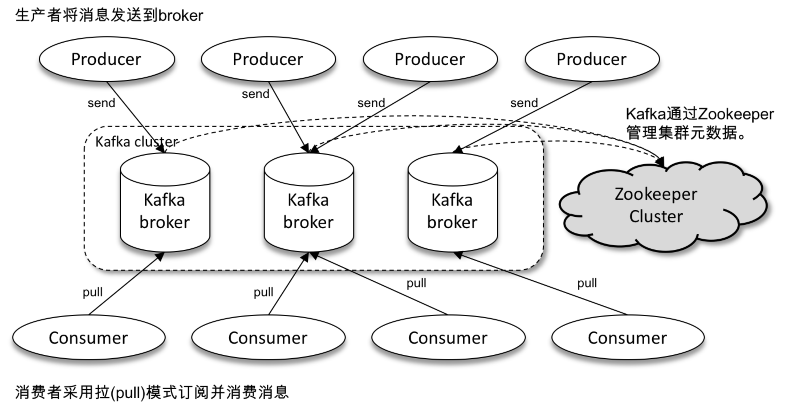
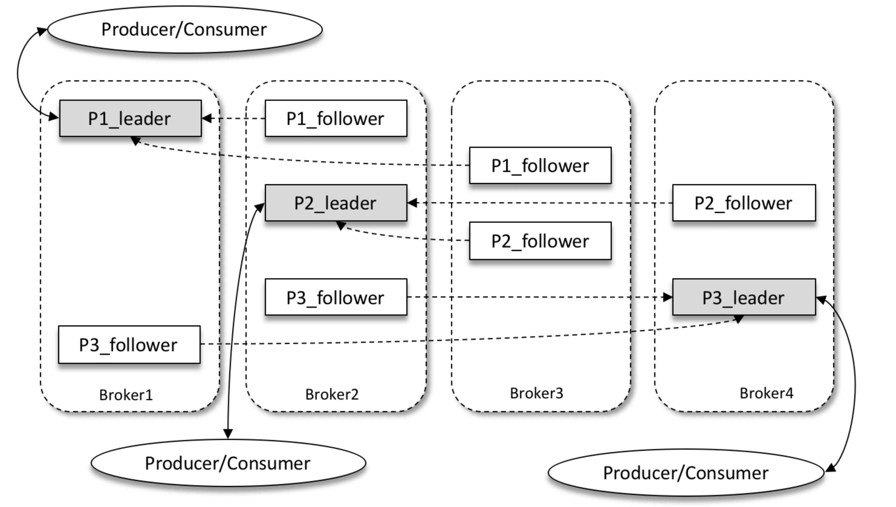
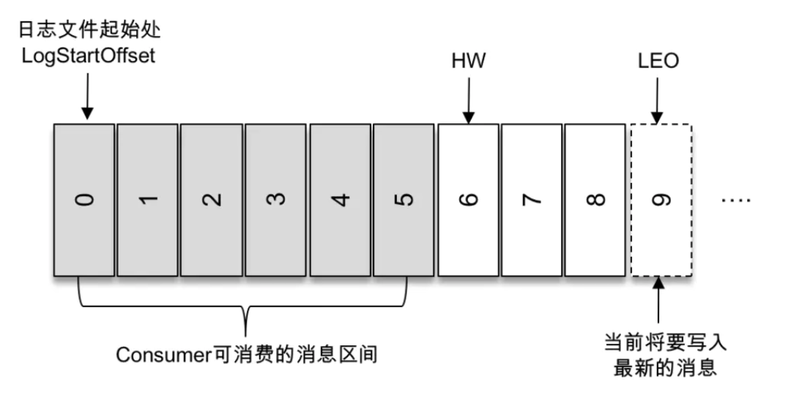

# 1、核心概念

## 1.1、主要特点

Kafka是分布式发布-订阅消息系统。它最初由LinkedIn公司开发，之后成为Apache项目的一部分。Kafka是一个分布式的，可划分的，冗余备份的持久性的日志服务，它主要用于处理活跃的流式数据。一个多分区、多副本且基于 ZooKeeper 协调的分布式消息系统

**主要特点：**
- 是基于pull的模式来处理消息消费，追求高吞吐量
- 同时为发布和订阅提供高吞吐量。据了解，Kafka每秒可以生产约25万消息（50 MB），每秒处理55万消息（110 MB）。同时kafka也支持点对点的消息投递，消费者都隶属于一个消费组，相当于点对点模型；
- 可进行持久化操作。将消息持久化到磁盘，因此可用于批量消费，例如ETL，以及实时应用程序。通过将数据持久化到硬盘以及replication防止数据丢失。
- 分布式系统，易于向外扩展。所有的producer、broker和consumer都会有多个，均为分布式的。无需停机即可扩展机器。
- 消息被处理的状态是在consumer端维护，而不是由server端维护。当失败时能自动平衡。
- 支持online和offline的场景。
- 支持分区，并支持跨平台、伸缩性、实时性；

**主要扮演角色：**
- 消息系统： Kafka 和传统的消息系统（也称作消息中间件）都具备系统解耦、冗余存储、流量削峰、缓冲、异步通信、扩展性、可恢复性等功能。与此同时，Kafka 还提供了大多数消息系统难以实现的消息顺序性保障及回溯消费的功能。
- 存储系统： Kafka 把消息持久化到磁盘，相比于其他基于内存存储的系统而言，有效地降低了数据丢失的风险。也正是得益于 Kafka 的消息持久化功能和多副本机制，我们可以把 Kafka 作为长期的数据存储系统来使用，只需要把对应的数据保留策略设置为“永久”或启用主题的日志压缩功能即可。
- 流式处理平台： Kafka 不仅为每个流行的流式处理框架提供了可靠的数据来源，还提供了一个完整的流式处理类库，比如窗口、连接、变换和聚合等各类操作

## 1.2、kafka架构



Kafka的整体架构非常简单，是显式分布式架构，producer、broker（kafka）和consumer都可以有多个。Producer，consumer实现Kafka注册的接口，数据从producer发送到broker，broker承担一个中间缓存和分发的作用。broker分发注册到系统中的consumer。broker的作用类似于缓存，即活跃的数据和离线处理系统之间的缓存。客户端和服务器端的通信，是基于简单，高性能，且与编程语言无关的TCP协议。

基本概念：
- `Message`：消息，是通信的基本单位，每个producer可以向一个topic（主题）发布一些消息。

- `Producer`：消息和数据生产者，向Kafka的一个topic发布消息的过程叫做producers。

- `Consumer`：消息和数据消费者，订阅topics并处理其发布的消息的过程叫做consumers。

- `Consumer Group (CG)`：消费者组，由多个 consumer 组成。消费者组内每个消费者负 责消费不同分区的数据，一个分区只能由一个组内消费者消费;消费者组之间互不影响。所有的消费者都属于某个消费者组，即消费者组是逻辑上的一个订阅者

- `Broker`：缓存代理，Kafka集群中的一台或多台服务器统称为broker。一台 kafka 服务器就是一个 broker。一个集群由多个 broker 组成。一个 broker 可以容纳多个 topic；

- `Topic`：特指Kafka处理的消息源（feeds of messages）的不同分类，其是一个逻辑上的概念；

- `Partition`：Topic物理上的分组，一个topic可以分为多个partition，每个partition是一个有序的队列。；同一主题下的不同分区包含的消息是不同的，分区在存储层面可以看作一个可追加的日志（Log）文件，消息在被追加到分区日志文件的时候都会分配一个特定的偏移量（offset，消息在分区中的唯一标识，Kafka 通过它来保证消息在分区内的顺序性）；在创建主题的时候可以通过指定的参数来设置分区的个数，当然也可以在主题创建完成之后去修改分区的数量，通过增加分区的数量可以实现水平扩展；

-` Replica副本`，为保证集群中的某个节点发生故障时，该节点上的 partition 数据不丢失，且 kafka 仍然能够继续工作，kafka 提供了副本机制，一个 topic 的每个分区都有若干个副本， 副本之间是“一主多从”的关系，其中 leader 副本负责处理读写请求，follower 副本只负责与 leader 副本的消息同步。副本处于不同的 broker 中，当 leader 副本出现故障时，从 follower 副本中重新选举新的 leader 副本对外提供服务。Kafka 通过多副本机制实现了故障的自动转移，当 Kafka 集群中某个 broker 失效时仍然能保证服务可用，通过增加副本数量可以提升容灾能力；

**发送消息的流程：**
- Producer根据指定的partition方法（round-robin、hash等），将消息发布到指定topic的partition里面
- kafka集群接收到Producer发过来的消息后，将其持久化到硬盘，并保留消息指定时长（可配置），而不关注消息是否被消费。
- Consumer从kafka集群pull数据，并控制获取消息的offset

## 1.3、多副本机制

通过增加副本的数量提升kafka的容灾能力；

同一分区的不同副本中保存的是相同的消息（在同一时刻，副本之间并非完全一样），副本之间是`一主多从`的关系，其中 leader 副本负责处理读写请求，follower 副本只负责与 leader 副本的消息同步。副本处于不同的 broker 中，当 leader 副本出现故障时，从 follower 副本中重新选举新的 leader 副本对外提供服务。Kafka 通过多副本机制实现了故障的自动转移，当 Kafka 集群中某个 broker 失效时仍然能保证服务可用；



生产者和消费者只与 leader 副本进行交互，而 follower 副本只负责消息的同步，很多时候 follower 副本中的消息相对 leader 副本而言会有一定的滞后。

### 1.3.1、AR、ISR、OSR
- `AR`：分区中的所有副本统称为 `AR（Assigned Replicas）`；
- `ISR`：所有与 leader 副本保持一定程度同步的副本（包括 leader 副本在内）组成ISR（In-Sync Replicas）；`ISR 集合`是 `AR 集合`中的一个子集。消息会先发送到 leader 副本，然后 follower 副本才能从 leader 副本中拉取消息进行同步，同步期间内 follower 副本相对于 leader 副本而言会有一定程度的滞后；
- `OSR`：与 leader 副本同步滞后过多的副本（不包括 leader 副本）组成 OSR（Out-of-Sync Replicas）；

**综上：**`AR=ISR+OSR`。在正常情况下，所有的 follower 副本都应该与 leader 副本保持一定程度的同步，即 AR=ISR，OSR 集合为空；

### 1.3.2、如何AR、ISR、OSR三者之间的副本
- leader 副本负责维护和跟踪 ISR 集合中所有 follower 副本的滞后状态，当 follower 副本落后太多或失效时，leader 副本会把它从 ISR 集合中剔除；
- 如果 OSR 集合中有 follower 副本“追上”了 leader 副本，那么 leader 副本会把它从 OSR 集合转移至 ISR 集合。
- 默认情况下，当 leader 副本发生故障时，只有在 ISR 集合中的副本才有资格被选举为新的 leader，而在 OSR 集合中的副本则没有任何机会（不过这个原则也可以通过修改相应的参数配置来改变）

### 1.3.3、ISR与HW、LEO

HW 是 `High Watermark` 的缩写，俗称高水位，它标识了一个特定的消息偏移量（offset），消费者只能拉取到这个 offset 之前的消息；



如上图所示，它代表一个日志文件，这个日志文件中有9条消息，第一条消息的 offset（LogStartOffset）为0，最后一条消息的 offset 为8，offset 为9的消息用虚线框表示，代表下一条待写入的消息。日志文件的 HW 为6，表示消费者只能拉取到 offset 在0至5之间的消息，而 offset 为6的消息对消费者而言是不可见的；

LEO 是 `Log End Offset` 的缩写，它标识当前日志文件中下一条待写入消息的 offset，上图中 offset 为9的位置即为当前日志文件的 LEO，LEO 的大小相当于当前日志分区中最后一条消息的 offset 值加1。分区 ISR 集合中的每个副本都会维护自身的 LEO，而 ISR 集合中最小的 LEO 即为分区的 HW，对消费者而言只能消费 HW 之前的消息；

Kafka 的复制机制既不是完全的同步复制，也不是单纯的异步复制。事实上，同步复制要求所有能工作的 follower 副本都复制完，这条消息才会被确认为已成功提交，这种复制方式极大地影响了性能。而在异步复制方式下，follower 副本异步地从 leader 副本中复制数据，数据只要被 leader 副本写入就被认为已经成功提交。在这种情况下，如果 follower 副本都还没有复制完而落后于 leader 副本，突然 leader 副本宕机，则会造成数据丢失；

## 1.4、高性能原因

- 顺序写，PageCache空中接力，高效读写，避免了随机写；
- 后台异步、主动Flush；
- 高性能、高吞吐;
- 预读策略；

## 1.5、kafka零拷贝

[零拷贝](../../Java框架/NIO-Netty.md#14.1零拷贝Zero-Copy技术)

## 1.6、Kafka应用场景

- 异步化、服务解耦、削峰填谷
- 海量日志手机
- 数据同步应用
- 实时计算分析

# 2、kafka配置安装

|功能	 |            启动命令	|备注|
|-------|---------------------|----|
|启动  ZK	        | `bin/zookeeper-server-start.sh -daemon config/zookeeper.properties`	|Kafka 安装包自带 ZK，可以单节点启动|
|启动Kafka服务器      | `bin/kafka-server-start.sh config/server.properties` || 	
|创建 Topic（test）	 | `bin/kafka-topics.sh --create --zookeeper localhost:2181 --replication-factor 1 --partitions 1 --topic test`|	|
|Topic 列表	        | `bin/kafka-topics.sh --list --zookeeper localhost:2181`	||
|启动 Producer	    | `bin/kafka-console-producer.sh --broker-list localhost:9092 --topic test`	||
|启动 Consumer	    | `bin/kafka-console-consumer.sh --bootstrap-server localhost:9092 --topic test --from-beginning`	||
|Topic相关信息（test) | `bin/kafka-topics.sh --describe --zookeeper localhost:2181 --topic test` || 

# 3、Kafka入门


# 4、Kafka生产者客户端

## 4.1、生产者API

### 4.1.1、ProducerConfig

主要封装了一些Kafka需要的配置常量，防止用户在添加配置的时候，将配置名称写错了：
```java
public class ProducerConfig extends AbstractConfig {
    private static final ConfigDef CONFIG;
    public static final String BOOTSTRAP_SERVERS_CONFIG = CommonClientConfigs.BOOTSTRAP_SERVERS_CONFIG;
    public static final String CLIENT_DNS_LOOKUP_CONFIG = CommonClientConfigs.CLIENT_DNS_LOOKUP_CONFIG;
    public static final String METADATA_MAX_AGE_CONFIG = CommonClientConfigs.METADATA_MAX_AGE_CONFIG;
    private static final String METADATA_MAX_AGE_DOC = CommonClientConfigs.METADATA_MAX_AGE_DOC;
    ...
}
```

### 4.1.2、KafkaProducer

KafkaProducer 是线程安全的，可以在多个线程中共享单个 KafkaProducer 实例，也可以将 KafkaProducer 实例进行池化来供其他线程调用；

KafkaProducer 中有多个构造方法，比如在创建 KafkaProducer 实例时并没有设定 key.serializer 和 value.serializer 这两个配置参数，那么就需要在构造方法中添加对应的序列化器；

**KafkaProducer的异常类型**

KafkaProducer 中一般会发生两种类型的异常：`可重试的异常`和`不可重试的异常`。
- 常见的可重试异常有：NetworkException、LeaderNotAvailableException、UnknownTopicOrPartitionException、NotEnoughReplicasException、NotCoordinatorException 等。比如 NetworkException 表示网络异常，这个有可能是由于网络瞬时故障而导致的异常，可以通过重试解决；又比如 LeaderNotAvailableException 表示分区的 leader 副本不可用，这个异常通常发生在 leader 副本下线而新的 leader 副本选举完成之前，重试之后可以重新恢复；

    对于可重试的异常，如果配置了 retries 参数，那么只要在规定的重试次数内自行恢复了，就不会抛出异常。retries 参数的默认值为0，配置方式参考如下：
    ```
    props.put(ProducerConfig.RETRIES_CONFIG, 10);
    ```
- 不可重试的异常，比如 RecordTooLargeException 异常，暗示了所发送的消息太大，KafkaProducer 对此不会进行任何重试，直接抛出异常；

**发送消息主要有三种模式：**
- 发后即忘（fire-and-forget）：它只管往 Kafka 中发送消息而并不关心消息是否正确到达；在某些时候（比如发生不可重试异常时）会造成消息的丢失。这种发送方式的性能最高，可靠性也最差
- 同步（sync）：实现同步的发送方式，可以利用返回的 Future 对象实现；同步发送的方式可靠性高，要么消息被发送成功，要么发生异常。如果发生异常，则可以捕获并进行相应的处理，而不会像“发后即忘”的方式直接造成消息的丢失
    ```java
    // 线程安全的
    KafkaProducer<String, String> producer = new KafkaProducer<String, String>(properties);
    for (int i = 0; i < 10; i++) {
        User user = new User("00" + i, "张三");
        ProducerRecord<String, String> record = new ProducerRecord<>(TopicConstants.TOPIC_QUICKSTART, JSON.toJSONString(user));
        System.out.println("send " + i);
        // 本质上是异步的，消息发送后自动创建topic
        Future<RecordMetadata> future = producer.send(record);
        RecordMetadata metadata = future.get();
    }
    ```
- 异步（async）：一般是在 send() 方法里指定一个 Callback 的回调函数，Kafka 在返回响应时调用该函数来实现异步的发送确认
    ```java
     producer.send(record, new Callback() {
        @Override
        public void onCompletion(RecordMetadata metadata, Exception exception) {
            // onCompletion() 方法的两个参数是互斥的，消息发送成功时，metadata 不为 null 而 exception 为 null；消息发送异常时，metadata 为 null 而 exception 不为 null
        }
    })
    ```

send() 方法本身就是异步的，send() 方法返回的 Future 对象可以使调用方稍后获得发送的结果，可以通过Future可以获取一个 RecordMetadata 对象，在 RecordMetadata 对象里包含了消息的一些元数据信息，比如当前消息的主题、分区号、分区中的偏移量（offset）、时间戳等；

Future 表示一个任务的生命周期，并提供了相应的方法来判断任务是否已经完成或取消，以及获取任务的结果和取消任务等；

### 4.1.3、ProducerRecord

```java
public class ProducerRecord<K, V> {
    private final String topic; //主题
    private final Integer partition; //分区号
    private final Headers headers; //消息头部
    // key 是用来指定消息的键，key 可以让消息再进行二次归类，同一个 key 的消息会被划分到同一个分区中；有 key 的消息还可以支持日志压缩的功能
    private final K key; //键
    private final V value; //值
    // timestamp 是指消息的时间戳，它有 CreateTime 和 LogAppendTime 两种类型，前者表示消息创建的时间，后者表示消息追加到日志文件的时间
    private final Long timestamp; //消息的时间戳
    //省略其他成员方法和构造方法
}
```

## 4.2、kafka生产者参数

### 4.2.1、必要参数

- `bootstrap.servers`：该参数用来指定生产者客户端连接 Kafka 集群所需的 broker 地址清单，具体的内容格式为 host1:port1,host2:port2，可以设置一个或多个地址，中间以逗号隔开，此参数的默认值为“”；建议至少要设置两个以上的 broker 地址信息，当其中任意一个宕机时，生产者仍然可以连接到 Kafka 集群上；

- `key.serializer` 和 `value.serializer`：broker 端接收的消息必须以字节数组（byte[]）的形式存在

### 4.2.2、重要参数

- `acks`：指用来指定分区中必须要有多少个副本收到这条消息，之后生产者才会认为这条消息是成功写入的，默认为1；acks 是生产者客户端中一个非常重要的参数，它涉及消息的可靠性和吞吐量之间的权衡；*注意：*acks 参数配置的值是一个字符串类型，而不是整数类型
    - `acks1`：默认值，生产者发送消息之后，只要分区的 leader 副本成功写入消息，那么它就会收到来自服务端的成功响应；如果消息无法写入 leader 副本，比如在 leader 副本崩溃、重新选举新的 leader 副本的过程中，那么生产者就会收到一个错误的响应，为了避免消息丢失，生产者可以选择重发消息。如果消息写入 leader 副本并返回成功响应给生产者，且在被其他 follower 副本拉取之前 leader 副本崩溃，那么此时消息还是会丢失，因为新选举的 leader 副本中并没有这条对应的消息。acks 设置为1，是消息可靠性和吞吐量之间的折中方案；
    - `acks=0`：生产者发送消息之后不需要等待任何服务端的响应。如果在消息从发送到写入 Kafka 的过程中出现某些异常，导致 Kafka 并没有收到这条消息，那么生产者也无从得知，消息也就丢失了。在其他配置环境相同的情况下，acks 设置为0可以达到最大的吞吐量；
    - `acks=-1, acks=all`：生产者在消息发送之后，需要等待 ISR 中的所有副本都成功写入消息之后才能够收到来自服务端的成功响应。在其他配置环境相同的情况下，acks 设置为 -1（all） 可以达到最强的可靠性；但这并不意味着消息就一定可靠，因为ISR中可能只有 leader 副本，这样就退化成了 acks=1 的情况。要获得更高的消息可靠性需要配合 min.insync.replicas 等参数的联动

- `max.request.size`：该参数用来限制生产者客户端能发送的消息的最大值；默认值为`1048576B`，即1MB。一般情况下，这个默认值就可以满足大多数的应用场景了；不建议盲目地增大这个参数的配置值；因为这个参数还涉及一些其他参数的联动，比如 broker 端的 `message.max.bytes` 参数，如果配置错误可能会引起一些不必要的异常。比如将 broker 端的 `message.max.bytes` 参数配置为10，而 `max.request.size` 参数配置为20，那么当我们发送一条大小为15B的消息时，生产者客户端就会报出如下的异常：`org.apache.kafka.common.errors.RecordTooLargeException: The request included a message larger than the max message size the server will accept.`

- `retries 和 retry.backoff.msretries`：重试次数（默认是0）即在发生异常的时候不进行任何重试动作；重试间隔（默认是100ms）；

- `compression.type`：用来指定的消息的压缩方式，默认值为`none`，可选配置：`gzip`、`snappy`、`lz4`；对消息进行压缩可以极大地减少网络传输量、降低网络I/O，从而提高整体的性能。消息压缩是一种使用时间换空间的优化方式，如果对时延有一定的要求，则不推荐对消息进行压缩。

- `connections.max.idle.ms`：用来指定在多久之后关闭限制的连接，默认是 54000ms，即9分钟；

- `linger.ms`：用来指定生产者发送 ProducerBatch 之前等待更多的消息（ProducerRecord）加入 ProducerBatch的时间，默认是0；

- `batch.size`：累计多少条消息，则一次进行批量发送；只要满足 linger.ms 和 batch.size 一个，都会发生的；

- `buffer.memory`：缓存提示性能参数，默认值为 33554432B，即32MB

- `receive.buffer.bytes`：用来设置Socket接收消息缓冲区（SO_RECBUF）的大小，默认是32k；如果设置为-1，则使用操作系统的默认值。如果 Producer 与 Kafka 处于不同的机房，则可以适地调大这个参数值

- `send.buffer.bytes`：用来设置socket发送消息缓冲区（SO_SNDBUF）的大小，默认是128k；与 `receive.buffer.bytes` 参数一样，如果设置为-1，则使用操作系统的默认值

- `request.timeout.ms`：用来配置Producer等待请求响应的最长时间，默认是 30000ms

## 4.3、kafka序列化

生产者需要用序列化器（Serializer）把对象转换成字节数组才能通过网络发送给 Kafka。而在对侧，消费者需要用反序列化器（Deserializer）把从 Kafka 中收到的字节数组转换成相应的对象：
```java
properties.put(ProducerConfig.KEY_SERIALIZER_CLASS_CONFIG, StringSerializer.class.getName());
properties.put(ProducerConfig.VALUE_SERIALIZER_CLASS_CONFIG, StringSerializer.class.getName());
```
除了用于 String 类型的序列化器，还有 ByteArray、ByteBuffer、Bytes、Double、Integer、Long 这几种类型，它们都实现了 `org.apache.kafka.common.serialization.Serializer` 接口，该接口如下：
```java
public interface Serializer<T> extends Closeable {
    default void configure(Map<String, ?> configs, boolean isKey) {
        // configure() 方法用来配置当前类，在创建 KafkaProducer 的时候创建的；
    }
    // serialize() 方法用来执行序列化操作
    byte[] serialize(String topic, T data);
    default byte[] serialize(String topic, Headers headers, T data) {
        return serialize(topic, data);
    }
    // 而 close() 方法用来关闭当前的序列化器，一般情况下 close() 是一个空方法，如果实现了此方法，则必须确保此方法的幂等性，因为这个方法很可能会被 KafkaProducer 调用多次
    default void close() {
    }
}
```
生产者使用的序列化器和消费者使用的反序列化器是需要一一对应的，如果生产者使用了某种序列化器，比如 StringSerializer，而消费者使用了另一种序列化器，比如 IntegerSerializer，那么是无法解析出想要的数据的；

如果 Kafka 客户端提供的几种序列化器都无法满足应用需求，则可以选择使用如 Avro、JSON、Thrift、ProtoBuf 和 Protostuff 等通用的序列化工具来实现，或者使用自定义类型的序列化器来实现：
```java
//  User 包含两个字段：id和name
public class UserSerializer implements Serializer<User> {
    @Override
    public void configure(Map<String, ?> configs, boolean isKey) {
    }

    @Override
    public byte[] serialize(String topic, User user) {
        if (user == null) {
            return null;
        }
        byte[] idBytes, nameBytes;
        String id = user.getId();
        String name = user.getName();
        if (id != null) {
            idBytes = id.getBytes(StandardCharsets.UTF_8);
        } else {
            idBytes = new byte[0];
        }
        if (name != null) {
            nameBytes = name.getBytes(StandardCharsets.UTF_8);
        } else {
            nameBytes = new byte[0];
        }
        // 定义buffer格式：4字节（id的真实长度） + id数据 + 4字节（name的真实长度） + name数据
        ByteBuffer buffer = ByteBuffer.allocate(4 + 4 + idBytes.length + nameBytes.length);
        //	4个字节 也就是一个 int类型 : putInt 盛放 idBytes的实际真实长度
        buffer.putInt(idBytes.length);
        //	put bytes[] 实际盛放的是idBytes真实的字节数组，也就是内容
        buffer.put(idBytes);
        buffer.putInt(nameBytes.length);
        buffer.put(nameBytes);
        return buffer.array();
    }
    @Override
    public void close() {

    }
}
```

## 4.4、分区器

消息在通过 send() 方法发往 broker 的过程中，有可能需要经过拦截器（Interceptor）、序列化器（Serializer）和分区器（Partitioner）的一系列作用之后才能被真正地发往 broker；消息经过序列化之后就需要确定它发往的分区，但如果消息 ProducerRecord 中指定了 partition 字段，那么就不需要分区器的作用，因为 partition 代表的就是所要发往的分区号；

如果消息 ProducerRecord 中没有指定 partition 字段，那么就需要依赖分区器，根据 key 这个字段来计算 partition 的值。分区器的作用就是为消息分配分区，Kafka默认的分区器是`org.apache.kafka.clients.producer.internals.DefaultPartitioner`，它实现了 `org.apache.kafka.clients.producer.Partitioner` 接口，该接口定义：
```java
public interface Partitioner extends Configurable, Closeable {
    //  partition() 方法用来计算分区号，返回值为 int 类型。partition() 方法中的参数分别表示主题、键、序列化后的键、值、序列化后的值，以及集群的元数据信息，通过这些信息可以实现功能丰富的分区器
    public int partition(String topic, Object key, byte[] keyBytes, Object value, byte[] valueBytes, Cluster cluster);
    ...
}
```

在默认分区器 DefaultPartitioner 的实现中，close() 是空方法，而在 partition() 方法中定义了主要的分区分配逻辑。如果 key 不为 null，那么默认的分区器会对 key 进行哈希（采用 MurmurHash2 算法，具备高运算性能及低碰撞率），最终根据得到的哈希值来计算分区号，拥有相同 key 的消息会被写入同一个分区。如果 key 为 null，那么消息将会以轮询的方式发往主题内的各个可用分区：
```java
public class DefaultPartitioner implements Partitioner {
    private final ConcurrentMap<String, AtomicInteger> topicCounterMap = new ConcurrentHashMap<>();
    public int partition(String topic, Object key, byte[] keyBytes, Object value, byte[] valueBytes, Cluster cluster) {
        List<PartitionInfo> partitions = cluster.partitionsForTopic(topic);
        int numPartitions = partitions.size();
        if (keyBytes == null) {
            int nextValue = nextValue(topic);
            List<PartitionInfo> availablePartitions = cluster.availablePartitionsForTopic(topic);
            if (availablePartitions.size() > 0) {
                int part = Utils.toPositive(nextValue) % availablePartitions.size();
                return availablePartitions.get(part).partition();
            } else {
                // no partitions are available, give a non-available partition
                return Utils.toPositive(nextValue) % numPartitions;
            }
        } else {
            // hash the keyBytes to choose a partition
            return Utils.toPositive(Utils.murmur2(keyBytes)) % numPartitions;
        }
    }
    private int nextValue(String topic) {
        AtomicInteger counter = topicCounterMap.get(topic);
        if (null == counter) {
            counter = new AtomicInteger(ThreadLocalRandom.current().nextInt());
            AtomicInteger currentCounter = topicCounterMap.putIfAbsent(topic, counter);
            if (currentCounter != null) {
                counter = currentCounter;
            }
        }
        return counter.getAndIncrement();
    }
}
```
除了使用 Kafka 提供的默认分区器进行分区分配，还可以使用自定义的分区器，只需同 DefaultPartitioner 一样实现 Partitioner 接口即可。默认的分区器在 key 为 null 时不会选择非可用的分区，我们可以通过自定义的分区器 DemoPartitioner 来打破这一限制。指定自定义分区器：`props.put(ProducerConfig.PARTITIONER_CLASS_CONFIG,DemoPartitioner.class.getName());`

## 4.5、拦截器

生产者拦截器的使用也很方便，主要是自定义实现 `org.apache.kafka.clients.producer.ProducerInterceptor` 接口，ProducerInterceptor 接口中包含3个方法：
```java
public interface ProducerInterceptor<K, V> extends Configurable {
    // KafkaProducer 在将消息序列化和计算分区之前会调用生产者拦截器的 onSend() 方法来对消息进行相应的定制化操作
    public ProducerRecord<K, V> onSend(ProducerRecord<K, V> record);
    // KafkaProducer 会在消息被应答（Acknowledgement）之前或消息发送失败时调用生产者拦截器的 onAcknowledgement() 方法，优先于用户设定的 Callback 之前执行；这个方法运行在 Producer 的I/O线程中，所以这个方法中实现的代码逻辑越简单越好，否则会影响消息的发送速度
    public void onAcknowledgement(RecordMetadata metadata, Exception exception);
    ...
}
```
在 KafkaProducer 的配置参数 interceptor.classes 中指定拦截器：`properties.put(ProducerConfig.INTERCEPTOR_CLASSES_CONFIG, CustomProducerInterceptor.class.getName());`；

KafkaProducer 中不仅可以指定一个拦截器，还可以指定多个拦截器以形成拦截链。`拦截链`会按照 `interceptor.classes 参数配置的拦截器的顺序来一一执行`（配置的时候，各个拦截器之间使用逗号隔开）；

如果拦截链中的某个拦截器的执行需要依赖于前一个拦截器的输出，那么就有可能产生“副作用”。设想一下，如果前一个拦截器由于异常而执行失败，那么这个拦截器也就跟着无法继续执行。在拦截链中，如果某个拦截器执行失败，那么下一个拦截器会接着从上一个执行成功的拦截器继续执行；

## 4.6、生产者客户端原理


整个生产者客户端由两个线程协调运行，这两个线程分别为`主线程`和 `Sender 线程（发送线程）`。在主线程中由 KafkaProducer 创建消息，然后通过可能的`拦截器、序列化器和分区器`的作用之后缓存到消息累加器（RecordAccumulator，也称为消息收集器）中。`Sender 线程负责从 RecordAccumulator 中获取消息并将其发送到 Kafka 中`；

Sender线程在构建KafkaProducer的过程中就启动了：
```java
KafkaProducer(Map<String, Object> configs, Serializer<K> keySerializer, Serializer<V> valueSerializer, ProducerMetadata metadata,  KafkaClient kafkaClient, ProducerInterceptors interceptors, Time time) {
    try {
        // 各种参数设置....
        // 构建 Sender，sender是Runnable实例
        this.sender = newSender(logContext, kafkaClient, this.metadata);
        String ioThreadName = NETWORK_THREAD_PREFIX + " | " + clientId;
        // KafkaThread继承Thread类
        this.ioThread = new KafkaThread(ioThreadName, this.sender, true);
        // 真正运行的 Sender 类的 run 方法
        this.ioThread.start();
        config.logUnused();
        AppInfoParser.registerAppInfo(JMX_PREFIX, clientId, metrics, time.milliseconds());
        log.debug("Kafka producer started");
    } catch (Throwable t) {
        // call close methods if internal objects are already constructed this is to prevent resource leak. see KAFKA-2121
        close(Duration.ofMillis(0), true);
        // now propagate the exception
        throw new KafkaException("Failed to construct kafka producer", t);
    }
}
// 其中KafkaThread构造函数中 runnable 参数其实是 Sender的实例
public KafkaThread(final String name, Runnable runnable, boolean daemon) {
    super(runnable, name);
    configureThread(name, daemon);
}
```

主线程中发送过来的消息都会被追加到 RecordAccumulator 的某个双端队列（Deque）中，在 RecordAccumulator 的内部为每个分区都维护了一个双端队列，队列中的内容就是 ProducerBatch，即 Deque。消息写入缓存时，追加到双端队列的尾部；Sender 读取消息时，从双端队列的头部读取。注意 ProducerBatch 不是 ProducerRecord，ProducerBatch 中可以包含一至多个 ProducerRecord。通俗地说，ProducerRecord 是生产者中创建的消息，而 ProducerBatch 是指一个消息批次，ProducerRecord 会被包含在 ProducerBatch 中，这样可以使字节的使用更加紧凑。与此同时，将较小的 ProducerRecord 拼凑成一个较大的 ProducerBatch，也可以减少网络请求的次数以提升整体的吞吐量。ProducerBatch 和消息的具体格式有关，如果生产者客户端需要向很多分区发送消息，则可以将 buffer.memory 参数适当调大以增加整体的吞吐量。

消息在网络上都是以字节（Byte）的形式传输的，在发送之前需要创建一块内存区域来保存对应的消息。在 Kafka 生产者客户端中，通过 `java.io.ByteBuffer` 实现消息内存的创建和释放。不过频繁的创建和释放是比较耗费资源的，在 RecordAccumulator 的内部还有一个 BufferPool，它主要用来实现 ByteBuffer 的复用，以实现缓存的高效利用。不过 BufferPool 只针对特定大小的 ByteBuffer 进行管理，而其他大小的 ByteBuffer 不会缓存进 BufferPool 中，这个特定的大小由 `batch.size` 参数来指定，默认值为16384B，即16KB。可以适当地调大 `batch.size` 参数以便多缓存一些消息。

当一条消息（ProducerRecord）流入 RecordAccumulator 时，会先寻找与消息分区所对应的双端队列（如果没有则新建），再从这个双端队列的尾部获取一个 ProducerBatch（如果没有则新建），查看 ProducerBatch 中是否还可以写入这个 ProducerRecord，如果可以则写入，如果不可以则需要创建一个新的 ProducerBatch。在新建 ProducerBatch 时评估这条消息的大小是否超过 `batch.size` 参数的大小，如果不超过，那么就以 `batch.size` 参数的大小来创建 ProducerBatch，这样在使用完这段内存区域之后，可以通过 BufferPool 的管理来进行复用；如果超过，那么就以评估的大小来创建 ProducerBatch，这段内存区域不会被复用。

Sender 从 RecordAccumulator 中获取缓存的消息之后，会进一步将原本`<分区, Deque< ProducerBatch>>` 的保存形式转变成 `<Node, List< ProducerBatch>` 的形式，其中 Node 表示 Kafka 集群的 broker 节点。对于网络连接来说，生产者客户端是与具体的 broker 节点建立的连接，也就是向具体的 broker 节点发送消息，而并不关心消息属于哪一个分区；而对于 KafkaProducer 的应用逻辑而言，我们只关注向哪个分区中发送哪些消息，所以在这里需要做一个应用逻辑层面到网络I/O层面的转换。

在转换成 `<Node, List>` 的形式之后，Sender 还会进一步封装成 `<Node, Request>` 的形式，这样就可以将 Request 请求发往各个 Node 了，这里的 Request 是指 Kafka 的各种协议请求，对于消息发送而言就是指具体的 ProduceRequest。

请求在从 Sender 线程发往 Kafka 之前还会保存到 InFlightRequests 中，InFlightRequests 保存对象的具体形式为 `Map<NodeId, Deque>`，它的主要作用是缓存了已经发出去但还没有收到响应的请求（NodeId 是一个 String 类型，表示节点的 id 编号）。与此同时，InFlightRequests 还提供了许多管理类的方法，并且通过配置参数还可以限制每个连接（也就是客户端与 Node 之间的连接）最多缓存的请求数。这个配置参数为 max.in.flight.requests. per. connection，默认值为5，即每个连接最多只能缓存5个未响应的请求，超过该数值之后就不能再向这个连接发送更多的请求了，除非有缓存的请求收到了响应（Response）。通过比较 Deque 的 size 与这个参数的大小来判断对应的 Node 中是否已经堆积了很多未响应的消息，如果真是如此，那么说明这个 Node 节点负载较大或网络连接有问题，再继续向其发送请求会增大请求超时的可能；

# 5、Kafka消费者与消费者组

## 5.1、点对点与发布/订阅模式


## 5.2、kafka消费者参数

### 5.2.1、必要参数

### 5.2.2、重要参数

- `fetch.min.bytes`：一次拉取最小数据量，默认为1B；
- `fetch.max.bytes`：一次拉取最大数据量，默认为50M；
- `max.partition.fetch.bytes`：一次fetch请求，从一个parition中获得的records最大大小，默认为1M
- `fetch.max.wait.ms`：Fetch请求发给broker后，在broker中可能会被阻塞的时长，默认为500ms；
- `max.poll.records`：Consumer每次调用 poll() 时渠道的records的最大数，默认为500条；

## 5.3、消费者提交位移


## 5.4、消费者多线程模型

KafkaProducer 是线程安全的，但是KafkaConsumer却是非线程安全的；KafkaConsumer中定义了一个 acquire 方法用来检测是否只有一个线程在操作，如果有其他线程在操作会抛出 ConcurrentModifactionException；KafkaConsumer 在执行所有动作时都会执行 acquire 方法检测是否线程安全；


## 5.6、消费者拦截器

生产者拦截器既可以用来在消息发送前做一些准备工作，比如按照某个规则过滤不符合要求的消息、修改消息的内容等，也可以用来在发送回调逻辑前做一些定制化的需求

- 消费者实现接口：ConsumerInterceptor

    `properties.put(ConsumerConfig.INTERCEPTOR_CLASSES_CONFIG, CustomConsumerInterceptor.class.getName());`

# 参考资料

* [Kafka详解](https://mp.weixin.qq.com/s/d9KIz0xvp5I9rqnDAlZvXw)
* [Kafka入门](https://blog.csdn.net/hmsiwtv/article/details/46960053)
* [Kafka面试题](https://juejin.im/post/6844903837614997518)
* [Kafka进阶面试题](https://mp.weixin.qq.com/s/CFzd7rwMFWtqc8xzCQ8vVw)
* [Kafka进阶面试题2](https://mp.weixin.qq.com/s/2QA_UIE_ciTJDQ4kbUkl-A)
* [Kafka与RocketMQ](https://mp.weixin.qq.com/s/WwHnyrOnw_io7G3uviim3Q)
* [Kafka高性能原因](https://mp.weixin.qq.com/s/XhJl90DnprNsI8KxFfdyVw)