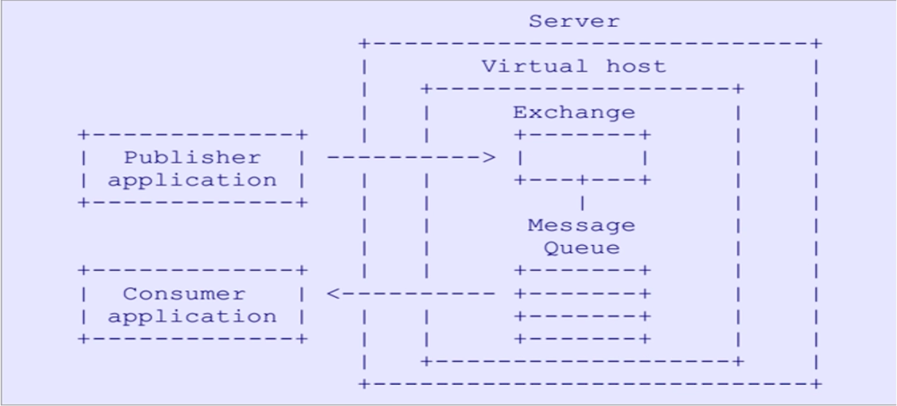
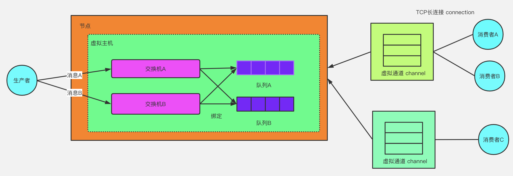
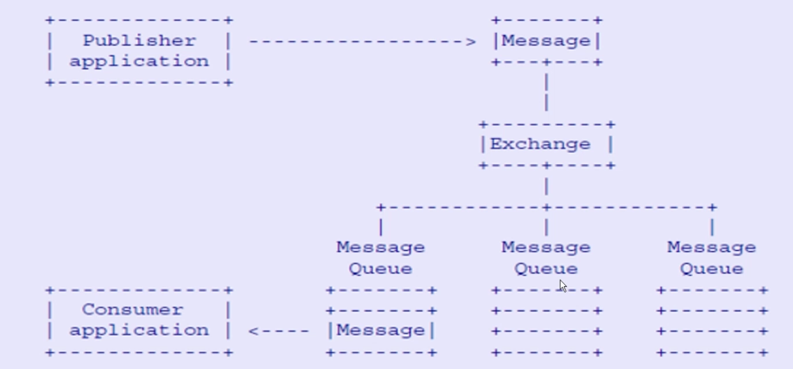
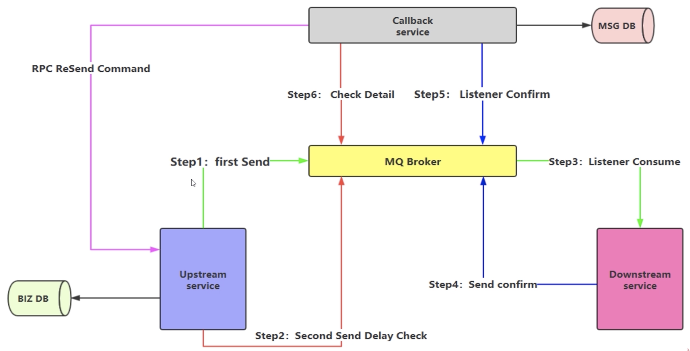

# 一、RabbitMQ

## 1、概述

### 1.1、定义

RabbitMQ是一个开源的消息代理和队列服务器器，RabbitMQ是使用Erlang语言来编写的，并且RabbitMQ是AMQP协议；

### 1.2、具有以下特点

- 采用Erlang语言作为底层实现：Erlang有着和原生Socket一样的延迟
- 开源、性能优秀，稳定性保障
- 提供可靠性消息投递模式（confirm）、返回模式（ return ）
- 与SpringAMQP完美的整合、API丰富
- 集群模式丰富，表达式配置，HA模式，镜像队列模型
- 保证数据不丢失的前提做到高可靠性、可用性

### 1.3、高性能原因

- Erlang语言最初在于交换机领域的架构模式，使得RabbitMQ在broker之间进行数据交互性能是非常优秀的；
- Erlang特点：有着和原生socket一样的延迟；

### 1.4、RabbitMQ的整体架构


### 1.5、RabbitMQ消息流转

### 1.6、AMQP：高级消息队列协议

是二进制协议，为面向消息的中间件设计。是一个进程间传递异步消息的网络协议，是应用层协议的一个开放标准，为面向消息的中间件设计；

**AMQP架构图：**



**AMQP核心概念：**
- Server：又称Broker，接收客户端的连接，实现AMQP实体服务；
- Connection：连接，应用程序与Broker进行连接；
- Channel：几乎所有的操作都是在Channel中进行的，Channel是进行消息读写的通道。客户端可建立多个Channel，每个Channel表示一个会话任务；
- Message：消息，服务器和应用程序之间传送的数据，由Properties和Body组成。Properties可以对消息进行修饰，比如消息的优先级、延迟等高级特性；Body则就是消息体的内容；
- Virtual Host：虚拟地址，用于进行逻辑隔离，最上层的消息路由。一个Vitual Host里面可以有若干个Exchange和Queue，同一个Vitual Host不能有相同名称的Exchange和Queue；
- Exchange：交换机，接收消息，根据路由键转发消息到绑定的队列；
- Binding：Exchange和Queue之间的虚拟连接；binding中可以包含routing key；
- Routing key：一个路由规格，虚拟机库用它来确定如何路由一个特点的消息；
- Queue：消息队列，保存消息并将它们转发给消费者；

**工作过程：**

发布者（Publisher）发布消息（Message），经由交换机（Exchange）；交换机根据路由规则将收到的消息分发给与该交换机绑定的队列（Queue）；最后 AMQP 代理会将消息投递给订阅了此队列的消费者，或者消费者按照需求自行获取；

### 1.7、RabbitMQ安装

准备：
`yum install build-essential openssl openssl-devel unixODBC unixODBC-devel make gcc gcc-c++ kernel-devel m4 ncurses-devel tk tc xz`

下载：
```
wget www.rabbitmq.com/releases/erlang/erlang-18.3-1.el7.centos.x86_64.rpm
wget http://repo.iotti.biz/CentOS/7/x86_64/socat-1.7.3.2-5.el7.lux.x86_64.rpm
wget www.rabbitmq.com/releases/rabbitmq-server/v3.6.5/rabbitmq-server-3.6.5-1.noarch.rpm
```

配置文件：
```
vim /usr/lib/rabbitmq/lib/rabbitmq_server-3.6.5/ebin/rabbit.app
```
比如修改密码、配置等等，例如：loopback_users 中的 <<"guest">>,只保留guest
服务启动和停止：
- 启动 rabbitmq-server start &
- 停止 rabbitmqctl app_stop

管理插件：rabbitmq-plugins enable rabbitmq_management

访问地址：http://192.168.11.76:15672/

## 2、RabbitMQ整体架构

### 2.1、整体架构



### 2.2、消息流转



## 3、Exchange交换机

接收消息，并根据路由键转发消息所绑定的队列

### 3.1、属性

- Name：交换名称
- Type：交换机类型direct、topic、fanout、headers；
- Durability：是否需要持久化，true为持久化；
- Auto Delete：当最后一个绑定到Exchange上队列删除后，自动删除该Exchange；
- Iternal：当前exchange是否用于RabbitMQ内部使用，默认为false；
- Arguments：扩展参数，用于扩展AMQP协议自制定化使用

### 3.2、交换机类型

- Direct Exchange

  所有发生到Direct Exchange的消息被转到到RoutingKey中指定的Queue；

  *注意：*Driect模式可以使用RabbitMQ自带的Exchange：default Exchange，所以不需要讲Exchange进行任何绑定操作，消息传递时，RouteKey必须完全匹配才会被队列接受，否则该消息会被抛弃；

- Topic Exchange

  所有发送到Topic Exchange的消息被转发到所有关心RouteKey中指定的Topic的Queue上；Exchange将RouteKey和某Topic进行模糊匹配，此时队列需要绑定一个Topic；
  
  可以使用通配符进行模糊匹配。模糊匹配规则：

  - “#” 匹配一个或多个词，“log.#” 能匹配到log.info.oa
  - “*” 匹配到不多不少一个词，“log.*” 只会匹配到 log.eorror

- Fanout Exchange

  不处理路由键，只需要简单的将队列绑定到交换机上；发送到交换机的消息都会被转发到与该交换机绑定的所有队列上，Fanout交换机转发消息是最快的

## 4、其他概念

- Binding-绑定
  - Exchange和Exchange、Queue之间的连接关系
  - Binding中可以包含RoutingKey或者参数；

- Queue-消息队列
  - 消息队列，实际存储消息数据
  - Durability：是否持久化，Durable：是，Transient：否
  - Auto Delete：如选yes，代表当最后一个监听被移除之后，该Queue不会自动被删除；

- Message-消息
  - 服务器和应用程序指定件传送的数据
  - 本质上是一段数据，有Properties何Payload（Body）组成
  - 常用属性：delivery mode、headers（自定义属性）
  - content_type, content_encoding, priority
  - correlation_id, reply_to, expiration, message_id
  - timestamp, type, user_id, app_id, cluster_id

- Virtual host-虚拟主机
  - 虚拟地址，用于进行逻辑隔离，最上层的消息路由；

## 5、消息如何保障100%投递成功

### 5.1、生产端的可靠性消息投递

- 如何保障消息可靠性投递
  - 保障消息成功发出；
  - 保障MQ节点的成功接收
  - 发送端收到 MQ节点（Broker）确认应答
  - 完善的消息进行补偿机制

- 生产端可靠性投递解决方案
    - 消息落库，对消息进行状态打标；在高并发场景下，可能存在大量的数据库操作
    - 消息的延迟投递，做二次确认，回调检查，回调检查是补偿机制

    

    - 订单服务生产者再投递消息之前，先把消息持久化到Redis或DB中，建议Redis，高性能。消息的状态为发送中。
    - confirm机制监听消息是否发送成功？如ack成功消息，删除Redis中此消息。
    - 如果nack不成功的消息，这个可以根据自身的业务选择是否重发此消息。也可以删除此消息，由自己的业务决定。
    - 这边加了个定时任务，来拉取隔一定时间了，消息状态还是为发送中的，这个状态就表明，订单服务是没有收到ack成功消息。
    - 定时任务会作补偿性的投递消息。这个时候如果MQ回调ack成功接收了，再把Redis中此消息删除

### 5.2、消费端幂等性保障

*在海量订单产生的业务高峰期，如何避免消息的重复消费问题*

消费端实现幂等性，意味着消息永远不可能被消费多次，即使收到了多条一样的消息

消费端幂等性解决方案：
- 唯一ID + 指纹码机制，利用数据库主键去重；
  - 实现简单；
  - 高并发下有数据库写入的性能瓶颈；
  - 解决方案：跟进ID进行分库分表进行算法路由

- 利用redis的原子性实现

  需要注意的问题：
  - 是否需要对数据进行落库，如果落库的话，关键解决的问题是数据库和缓存如何做到原子性；
  - 如果不进行落库，那么都存到缓存中，如何设置定时同步策略；

## 6、Confirm确认消息

### 6.1、概述

- 消息的确认，是指生产者投递消息后，如果broker收到消息，则会给生产者一个应答；
- 生产者进行接收应答，用来确定这条消息是否正常的发送到Broker，这种方式也是消息的可靠性投递的核心保障；

### 6.2、如何实现Confirm确认消息

- （1）在channel上开启确认模式：channel.confirmSelect();
- （2）在channel上添加监听：addConfirmListner，监听成功和失败的返回结果，根据具体的结果对消息进行重新发送，或记录日志等待后续处理；

comfirm机制其实是一个异步监听的机制 ，是为了保证系统的高吞吐量 ，这样就导致了还是不能够100%保障消息不丢失

## 7、Return消息机制

- Return Listener 用于处理一些不可路由的消息；
- 消息生产者通过指定一个Exchange和RoutingKey，把消息送达到某一个队列中取，然后由消费者监听队列，进行消费处理操作；
- 在某些情况下，如果在消息发送的实际，当前的Exchange不存在或者指定的路由key路由不到，此时如果需要监听这种不可达的消息，就要使用Return Listener
- 关键参数：Mandatory，如果为true，则监听器会接收到路由不可达的消息，然后进行后续处理，如果为false，那么broker端会自动删除该消息

## 8、消费端自定义监听

继承DefaultConsumer

## 9、消费端限流

- 巨量的消息瞬间全部推送到消费端，但是单个客户端无法同时处理这么多的数据；
- RabbitMQ提供了一种QOS（服务质量保证）功能，即在非自动确认消息的前提下，如果一定数据的消息（通过基于consume或者channel设置的qos的值）未被确认前，不进行消费新的消息
- void basicQos(int prefetchSize, int prefetchCount, boolean global)

  **注意：** prefetchSize和global这两个选型，rabbitmq没有实现，暂且不研究prefetch_count在no_ack=false的情况下生效，即在自动应答的情况下这两个值是不生效的

## 10、消费端ACK与重回队列

### 10.1、消费端的手工ACK和NACK

- 消费端进行消费的时候，如果由于业务异常可以进行日志的尽量，然后进行补偿；
- 如果由于服务器宕机等严重问题，那就需要手工进行ACK保障消费端消费成功；

### 10.2、消费端重回队列

- 消费端重回队列是为了对没有处理成功的消息，把消息重新会传递给broker；
- 一般在实际的应用中，都会关闭重回队列，也就是这种为false；

## 11、TTL-Time To Live，生存时间

- RabbitMQ 支持消息的过期时间，在消息发送时可以进行指定；
- RabbitMQ 支付队列的过期时间，从消息入队列开始计算，只要超过了队列的超时时间配置，那么消息会自动的清除；

## 12、死信队列-Dead Letter Exchane

- 利用DLX，当消息在一个队列中变成死信时，它能被重新publish到另一个Exchange，这个Exchange就是DLX；

### 12.1、消息变成死信的情况

- 消息被拒绝（basic.rejec/basic.nack），并且requeue=fals；
- 消息TTL过去
- 队列达到最大长度

### 12.2、死信队列

- DLX也是正常的Exchange，和一般的Exchange没有区别，它能在任何的队列上被指定，实际上就是设置某个队列的属性；
- 当这个队列中有死信时，RabbitMQ就会自动的将这个消息重新发布到设置的Exchange上，进而被路由到另一个队列；
- 可以监听这个队列中消息做相应的处理，这个特性可以弥补RabbitMQ3.0以前致辞的immediate参数的功能；

# 二、RabbitMQ与Spring整合

## 1、RabbitMQ整合Spring AMQP

### 1.1、RabbitAdmin

其可以很好的操作RabbitMQ，在Spring直接注入即可；

autoStartup必须设置为true，否则Spring不会加载RabbitAdmin类；
```java
@Bean
public ConnectionFactory connectionFactory() {
    å connectionFactory = new CachingConnectionFactory();
    connectionFactory.setAddresses("192.168.56.101:5672");
    connectionFactory.setUsername("guest");
    connectionFactory.setPassword("guest");
    connectionFactory.setVirtualHost("/");
    return connectionFactory;
}

@Bean
public RabbitAdmin rabbitAdmin(ConnectionFactory connectionFactory) {
    RabbitAdmin rabbitAdmin = new RabbitAdmin(connectionFactory);
    rabbitAdmin.setAutoStartup(true);
    return rabbitAdmin;
}
```

### 1.2、Spring AMQP声明
```java
/**
  * 针对消费者配置
  * 1. 设置交换机类型
  * 2. 将队列绑定到交换机
  * FanoutExchange: 将消息分发到所有的绑定队列，无routingkey的概念
  * HeadersExchange ：通过添加属性key-value匹配
  * DirectExchange:按照routingkey分发到指定队列
  * TopicExchange:多关键字匹配
  */
@Bean
public TopicExchange exchange001() {
    TopicExchange topicExchange = new TopicExchange("topic001", true, false);
    return topicExchange;
}
@Bean
public Queue queue001() {
    Queue queue = new Queue("queue001", true);
    return queue;
}
@Bean
public Binding binding001() {
    return BindingBuilder.bind(queue001()).to(exchange001()).with("spring.*");
}
@Bean
public TopicExchange exchange002() {
    TopicExchange topicExchange = new TopicExchange("topic002", true, false);
    return topicExchange;
}
@Bean
public Queue queue002() {
    Queue queue = new Queue("queue002", true);
    return queue;
}
@Bean
public Binding binding002() {
    return BindingBuilder.bind(queue002()).to(exchange002()).with("rabbit.*");
}
@Bean
public Queue queue003() {
    return new Queue("queue003", true);
}
@Bean
public Binding binding003() {
    return BindingBuilder.bind(queue003()).to(exchange001()).with("mq.*");
}
@Bean
public Queue queue_image() {
    return new Queue("image_queue", true);
}
@Bean
public Queue queue_pdf() {
    return new Queue("pdf_queue", true);
}
```
rabbitAdmin类在初始化时会从Spring容器中抓取上面@Bean声明的交换机、队列和绑定关系，在初始化时会直接注册到rabbitMQ上

### 1.3、RabbitTemplate-消息模板

- 与SpringAMQP整合时进行发送消息的关键类；
- 提供了丰富的消息发送方法，包括可靠性投递、回调监听消息接口ConfirmCallback、返回值确认接口ReturnCallback等，同样可以注入的Spring的容器中，然后直接使用；
```java
@Bean
public RabbitTemplate rabbitTemplate(ConnectionFactory connectionFactory) {
    RabbitTemplate rabbitTemplate = new RabbitTemplate(connectionFactory);
    return rabbitTemplate;
}
```

### 1.4、SimpleMessageListenerContainer-简单消息监听器

- 监听队列，自动启用、自动声明；
- 设置事务特性、事务管理器、事务属性、事务容量、是否开启事务、回滚消息等；
- 设置消费数量、最小最大数量、批量消费；
- 设置消息确认和自动确认模式、是否重回队列、异常捕获handler函数；
- 设置消费者标签生成策略、是否独占模式、消费者属性等；
- 设置具体的监听器、消息转换器等
- SimpleMessageListenerContainer可以进行动态设置，比如在运行中的应用都可以动态的修改消费者数量的大小、接收消息的模式等；

？*SimpleMessageListenerContainer为什么可以动态感知配置变更*

### 1.5、MessageListenerAdapter-消息监听适配器

- 默认监听方法名称-defaultListenerMethod，用于设置监听方法名称；
- Delegate委托对象：实际真实的委托对象，用于处理消息
- queueOrTagMethodName，队列标识与方法名称组成的集合，可以与一一进行队列与方法名称的匹配，队列与方法名称绑定，即指定队列里的消息会被绑定的方法所接受处理；

### 1.6、MessageConverter-消息转换器

- 在进行发送消息的时候，正常清理下消息体为二进制的数据方式进行传输，如果希望内部帮我们进行转换，或者指定自定义的转换器，就需要用到MessageConverter；
- 自定义常用转换器，一般来说需要实现接口：MessageConverter，主要实现两个方法：toMessage和fromMessage；
- 主要有json转换器（Jackson2JsonMessageConverter）、DefaultJackson2JavaTypeMapper映射器，可以进行java对象的映射关系；
- 自定义二进制转换器：比如图片类型、PDF、PPT、流媒体等

# 三、RabbitMQ集群架构

## 1、集群架构模式

- 主备模式：实现RabbitMQ的高可用集群，一般在并发和数据量不高的情况下，这种模型非常好用且简单。主备模式也称之为Warren模式。主节点如果挂了，从节点提供服务而已，和activemq利用zookeeper做主备一样。主要利用好HaProxy来进行配置
    ```bash
    #HaProxy配置
    listen rabbimq-cluster
    bind 0.0.0.0:5672 # 配置TCP模式
    mode tcp # 简单的轮询
    balance roundrobin # 主节点
    server bhz76 192.168.11.76:5672 check inter 5000 rise 2 fall 2
    server bhz77 192.168.11.77:5672 backup check inter 5000 rise 2 fall 2 # 备用节点
    ```
    备注：rabbitmq集群节点配置`#inter` 每个5秒对mq集群做健康检查，2次正确证明服务器可用，2次失败证明服务器不可用，并且配置主备机制

- 远程模式：可以实现双活的一种模式，简称shovel模式，所谓shovel就是可以把消息进行不同数据中心的复制工作，可以跨地域的让两个mq集群互联；
    
    需要首先启动rabbitmq插件：
    ```
    rabbitmq-plugins enable amqp_client
    rabbitmq-plugins enable rabbitmq_shovel
    ```

- 镜像模式：保证100%数据不丢失，目的是为了保证RabbitMQ数据的高可靠性解决方案，主要是实现数据的同步；无法横向扩容（一般三个节点即可） 

- 多活模式：实现异地数据复制的主流模式，一般采用双中心（多中心）模式，其依赖rabbitmq的federation插件，可以实现持续的可靠地AMQP数据通信；


# 四、RabbitMQ-SET化架构实现

使用RabbitMQ的通信插件：Federation


# 参考资料

* [RabbitMQ官方文档](http://www.rabbitmq.com/documentation.html)
* [RabbitMQ命令操作](https://blog.csdn.net/noonebirdyou/article/details/54645755)
* [RabbitMQ可靠消息投递方案](https://www.test.com/article/49814)
* [AMQP协议](http://rabbitmq.mr-ping.com/AMQP/amqp-0-9-1-quickref.html)