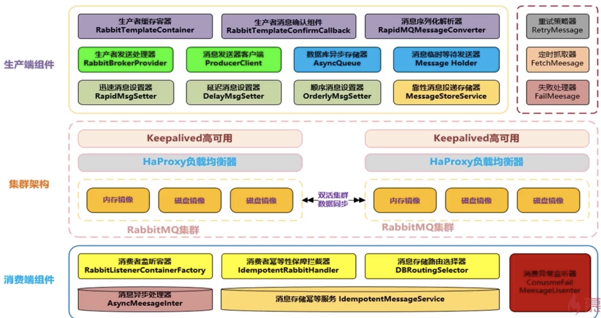
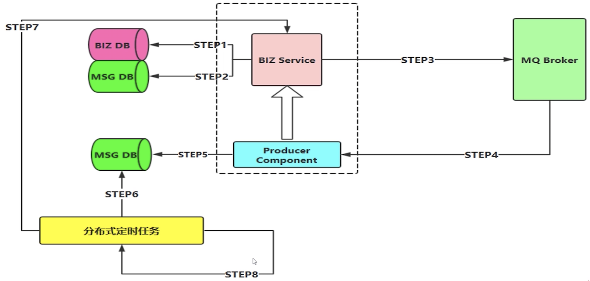
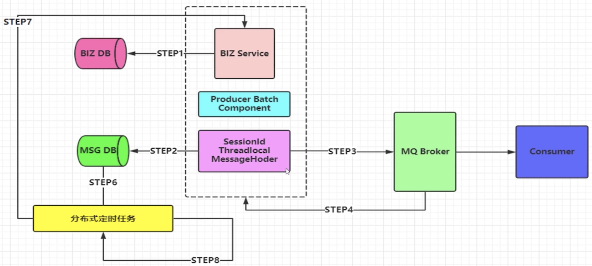
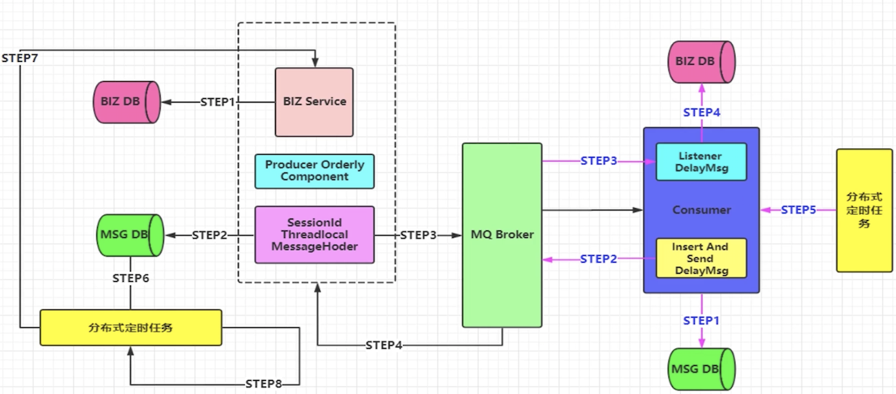
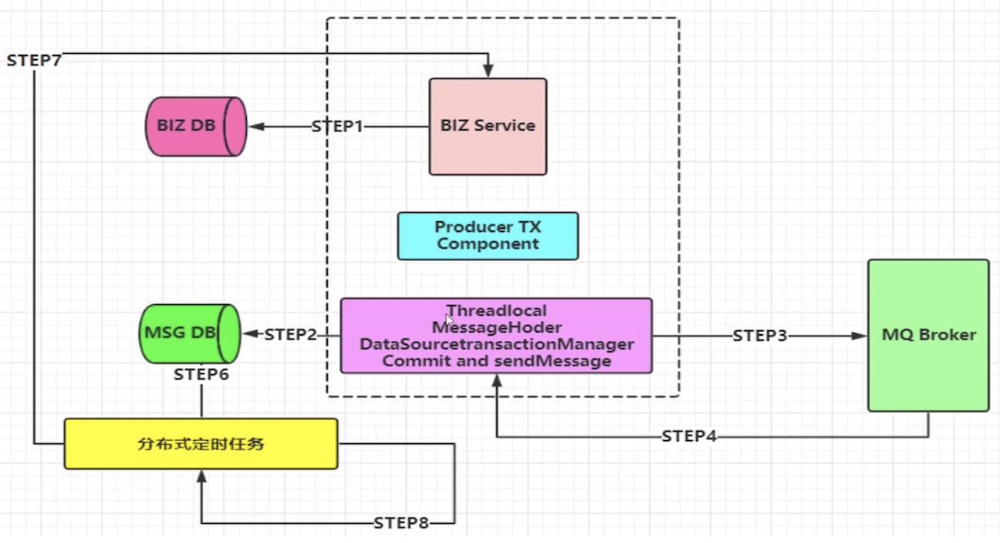
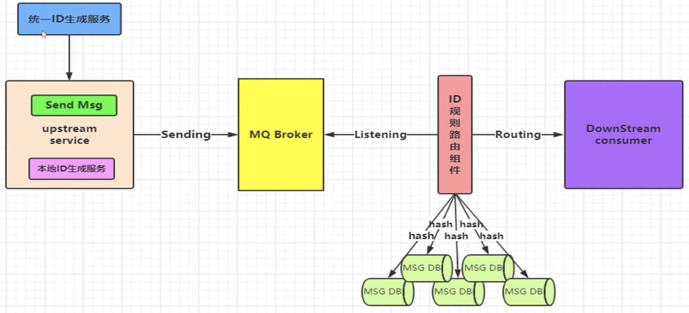

# 一、消息中间件

MQ的衡量指标：服务性能、数据存储、集群架构

消息队列的本质在于消息的发送、存储和接收

消息中间件选型考虑点：高可用、低延迟、可靠性、堆积能力、扩展性等；

可靠性、消息堆积能力、吞吐量

队列和主题的区别对应两种模型：队列模型和发布-订阅模型；RabbitMQ 采用的是队列模型，但是它一样可以实现发布-订阅的功能，RocketMQ 和 Kafka 采用的是发布 - 订阅模型，并且二者的消息模型是基本一致的

## 1、主流中间件介绍

### 1.1、ActiveMQ

- 概述：
	
### 1.2、Kafka

Kafka 异步批量的设计带来的问题是，它的同步收发消息的响应时延比较高，因为当客户端发送一条消息的时候，Kafka 并不会立即发送出去，而是要等一会儿攒一批再发送，在它的 Broker 中，很多地方都会使用这种“先攒一波再一起处理”的设计。当你的业务场景中，每秒钟消息数量没有那么多的时候，Kafka 的时延反而会比较高。所以，Kafka 不太适合在线业务场景。

### 1.3、RocketMQ

### 1.4、RabbitMQ

RabbitMQ存在的问题：
- RabbitMQ 对消息堆积的支持并不好，在它的设计理念里面，消息队列是一个管道，大量的消息积压是一种不正常的情况，应当尽量去避免。当大量消息积压的时候，会导致 RabbitMQ 的性能急剧下降；
- RabbitMQ 的性能是这几个消息队列中最差的，根据官方给出的测试数据综合我们日常使用的经验，依据硬件配置的不同，它大概每秒钟可以处理几万到十几万条消息。其实，这个性能也足够支撑绝大多数的应用场景了，不过，如果你的应用对消息队列的性能要求非常高，那不要选择 RabbitMQ；
- RabbitMQ 使用的编程语言 Erlang，这个编程语言不仅是非常小众的语言，更麻烦的是，这个语言的学习曲线非常陡峭；

### 1.5、Pulsar

Pulsar 采用存储和计算分离的设计

## 2、主流中间件对比

主要针对：Kafka、RabbitMQ、ZeroMQ、RocketMQ、ActiveMQ、Pulsar

### 2.1、支持的协议

## 3、消息队列

### 3.1、优点

- 异步处理：减少等待，自然实现了步骤之间的并发，提升系统总体的性能；
- 解耦
- 削峰，即流量控制：

主要解决应用耦合，异步消息，流量削锋等问题。可实现高性能，高可用，可伸缩和最终一致性架构，是大型分布式系统不可缺少的中间件。

主要应用场景：应用解耦、异步处理、流量削峰、消息通讯、日志处理

解耦：将消息写入消息队列，需要消息的系统自己从消息队列中订阅，从而上游系统不需要做任何修改。有了消息队列之后，从主动调用的方式，变成了消息的订阅发布( 或者说，事件的发布和监听 )，从而解耦；

### 3.2、缺点

- 系统可用性降低：系统引入的外部依赖越多，越容易挂掉
- 系统复杂性提高：保证消息没有重复消费？怎么处理消息丢失的情况？怎么保证消息传递的顺序性？
- 数据一致性问题：如果我们在使用 MQ 时，一定要达到数据的最终一致性

## 4、消息队列的角色组成

- 生产者（Producer）：负责产生消息。
- 消费者（Consumer）：负责消费消息
- 消息代理（Message Broker）：负责存储消息和转发消息两件事情。其中，转发消息分为推送和拉取两种方式。
    - 拉取（Pull），是指 Consumer 主动从 Message Broker 获取消息
    - 推送（Push），是指 Message Broker 主动将 Consumer 感兴趣的消息推送给 Consumer 

## 5、消息队列投递方式

push
- 优点，就是及时性。
- 缺点，就是受限于消费者的消费能力，可能造成消息的堆积，Broker 会不断给消费者发送不能处理的消息。

pull
- 优点，就是主动权掌握在消费方，可以根据自己的消息速度进行消息拉取。
- 缺点，就是消费方不知道什么时候可以获取的最新的消息，会有消息延迟和忙等。

目前的消息队列，基于 push + pull 模式结合的方式，Broker 仅仅告诉 Consumer 有新的消息，具体的消息拉取，还是 Consumer 自己主动拉取

## 6、消费者消费消息的幂等性

如果要达到消费者的消费消息的幂等性，就需要消息仅被消费一次，且每条消息从 Producer 保证被送达，并且被 Consumer 仅消费一次。

消费者实现幂等性，有两种方式：
- 框架层统一封装：

    首先，需要有一个消息排重的唯一标识，该编号只能由 Producer 生成，例如说使用 uuid、或者其它唯一编号的算法；

    然后，就需要有一个排重的存储器，例如说：

- 业务层自己实现：

正常情况下，出现重复消息的概率其实很小，如果由框架层统一封装来实现的话，肯定会对消息系统的吞吐量和高可用有影响，所以最好还是由业务层自己实现处理消息重复的问题

## 7、消息堆积问题

## 8、消息过期问题

## 9、消息队列的存储方式

- 分布式KV存储：这类 MQ 一般会采用诸如 LevelDB 、RocksDB 和 Redis 来作为消息持久化的方式。由于分布式缓存的读写能力要优于 DB ，所以在对消息的读写能力要求都不是比较高的情况下，采用这种方式倒也不失为一种可以替代的设计方案。消息存储于分布式 KV 需要解决的问题在于如何保证 MQ 整体的可靠性；

- 文件系统：目前业界较为常用的几款产品（RocketMQ / Kafka / RabbitMQ）均采用的是消息刷盘至所部署虚拟机/物理机的文件系统来做持久化（刷盘一般可以分为异步刷盘和同步刷盘两种模式）

- 关系型数据库 DB：

## 10、高可用

# 二、MQ组件实现思路

## 1、MQ组件实现功能

- 支持消息高性能的序列化转换、异步化发送消息；
- 支持消息生成实例与消费实例的链接池化缓存化，提升性能；
- 支持可靠性投递消息，保障消息的100%不丢失；
- 支持消费端的幂等操作，避免消费端重复消费的问题；

## 2、迅速消息发送

- 迅速消息是指消息不进行落库存储，不做可靠性保障；直接发送消息即可
- 在一些非核心消息、日志数据、或者统计分析等场景下比较适合；
- 迅速消息的优点是性能最高、吞吐量最大；

## 3、确认消息发送

## 4、批量消息发送

批量消息是指我们把消息放到一个集合里统一进行提交，这种方案设计思路是期望消息在一个会话里，然后拥有相同的会话ID，并且带有这次提交的消息SIZE等相关属性；最重要的一点是要把这一批消息进行合并；

这种方式也是希望消费端在消费的时候，可以进行批量化的消费，针对某一个院子业务的操作去处理，但是不保障可靠性，需要进行补偿机制；

## 5、延迟消息发送

在Message封装的时候添加delayTime属性即可，使得我们的消息可以进行延迟发送；

比如订单多长时间失效、自动超时作为的场景

## 6、顺序消息发送

需要保障以下几点：
- 发送的顺序消息，必须保障消息投递到同一个队列，且这个消费者只能有一个（独占模式）
- 需要统一提交（可能是合并成一个大消息，也可能是拆分为多个消息），并且所有消息的会话ID一致；
- 添加消息属性：顺序标记的序号、和本次顺序消息的SIZE属性，进行落库操作；
- 并行进行发送给自身的延迟消息（注意带上关键属性：会话ID、SIZE）进行后续进行消费；
- 当收到延迟消息后，根据会话ID、SIZE抽取数据库数据进行处理即可；
- 定时轮询补偿机制：比如生产端消息没有完全投递成功、或者消费端落库异常；

## 7、事务消息发送

采用类似可靠性投递的机制，也就是补偿机制；在业务操作数据库和消息记录数据库使用同一个数据源，就是在本地事务提交的时候发送消息

## 8、消息幂等性保障

可能导致消息出现非幂等性的原因：
- 可靠性消息投递机制；
- MQ Broker服务与消费端传输消息的过程中的网络抖动；
- 消费端故障或异常；

# 参考资料
- [中间件对比](https://mp.weixin.qq.com/s/gb4DmxhpdKlY_1wgj5ng2g)