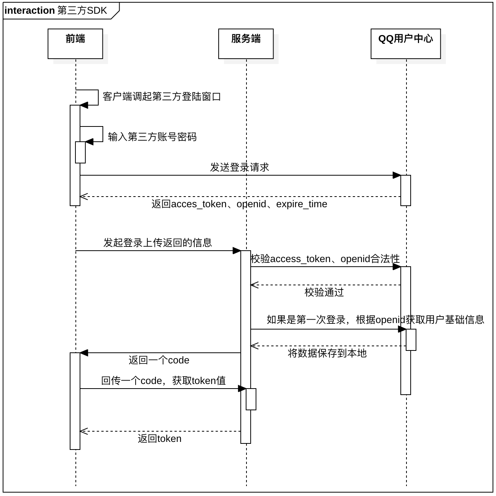

<!-- START doctoc generated TOC please keep comment here to allow auto update -->
<!-- DON'T EDIT THIS SECTION， INSTEAD RE-RUN doctoc TO UPDATE -->
**目录**

- [一.单系统登录限制：](#%E4%B8%80%E5%8D%95%E7%B3%BB%E7%BB%9F%E7%99%BB%E5%BD%95%E9%99%90%E5%88%B6)
- [二.多系统登录：](#%E4%BA%8C%E5%A4%9A%E7%B3%BB%E7%BB%9F%E7%99%BB%E5%BD%95)
- [三.单点登录：(Single Sign On：SSO)](#%E4%B8%89%E5%8D%95%E7%82%B9%E7%99%BB%E5%BD%95single-sign-onsso)

<!-- END doctoc generated TOC please keep comment here to allow auto update -->

# 一、单系统登录限制

## 1、http无状态协议

web应用采用browser/server架构，http作为通信协议，http是无状态协议，浏览器的每一次请求，服务器会独立处理，不与之前或之后的请求产生关联。既然http协议无状态，那就让服务器和浏览器共同维护一个状态吧!这就是会话机制

## 2、会话机制

- 浏览器第一次请求服务器，服务器创建一个会话，并将会话的id作为响应的一部分发送给浏览器，浏览器存储会话id，并在后续第二次和第三次请求中带上会话id，服务器取得请求中的会话id就知道是不是同一个用户了
- cookie是浏览器用来存储少量数据的一种机制，数据以"key/value"形式存储，浏览器发送http请求时自动附带cookie信息；

## 3、登录状态

浏览器第一次请求服务器需要输入用户名与密码验证身份，服务器拿到用户名密码去数据库比对，正确的话说明当前持有这个会话的用户是合法用户，应该将这个会话标记为“已授权”或者“已登录”等等之类的状态；如 Tomcat 第一次登录的时候设置登录状态，下一次登录的时候判断登录状态

# 二、多系统登录

单系统登录解决方案的核心是cookie，cookie携带会话id在浏览器与服务器之间维护会话状态，但cookie是有限制的，这个限制就是cookie的域(通常对应网站的域名)浏览器发送http请求时会自动携带与该域匹配的cookie而不是所有cookie；

为什么不将web应用群中所有子系统的域名统一在一个顶级域名下？共享cookie的方式存在众多局限
- 应用群域名得统一;
- 其次，应用群各系统使用的技术(至少是web服务器)要相同，不然cookie的key值(tomcat为JSESSIONID)不同，无法维持会话，共享cookie的方式是无法实现跨语言技术平台登录的
- cookie本身不安全

# 三、单点登录(Single Sign On：SSO)

## 1、概述
是指在多系统应用群中登录一个系统，便可在其他所有系统中得到授权而无需再次登录，包括单点登录与单点注销两部分

## 2、登录

- sso需要一个独立的认证中心，只有认证中心能接受用户的用户名密码等安全信息，其他系统不提供登录入口，只接受认证中心的间接授权，间接授权通过令牌实现，sso认证中心验证用户的用户名密码没问题，创建授权令牌，在接下来的跳转过程中，授权令牌作为参数发送给各个子系统，子系统拿到令牌，即得到了授权，可以借此创建局部会话，局部会话登录方式与单系统的登录方式相同；
- 用户登录成功之后，会与sso认证中心及各个子系统建立会话，用户与sso认证中心建立的会话称为全局会话，用户与各个子系统建立的会话称为局部会话，局部会话建立之后，用户访问子系统受保护资源将不再通过sso认证中心.全局会话与局部会话有如下约束关系：
	- A、局部会话存在，全局会话一定存在;
	- B、全局会话存在，局部会话不一定存在;
	- C、全局会话销毁，局部会话必须销毁;

## 3、注销

单点登录自然也要单点注销，在一个子系统中注销，所有子系统的会话都将被销毁

## 4、整个单点登录过程实质是sso客户端与服务端通信的过程

    
# 四、扫码登录

# 五、短信验证码登录

- 首先输入手机号，然后发送到服务端，服务端将手机号记录在我们数据库中，然后生成随机验证码，并将手机号和验证码绑定到一个redis里面，然后记录过期时间，这个过期时间一般是10分钟左右，这就是我们一般手机验证码的有效期。

- 手机接收到手机短信后，那么就在界面填写验证码发送服务端，服务端收到验证码后就会在redis里面查询到这个手机号对应的验证码，失败就返回错误码。

- 成功后就进行登录操作。

这里看起来没有明确的注册登录操作，其实在发送手机号码就可以认为是一个常规的注册，然后后面的验证码输入就是一个登陆操作。如果需要用户密码的话，后续使用密码补录功能即可；

# 六、第三方SDK登录

以QQ-SDK的登录逻辑：

## 1、实现思路

- 客户端自己调起登录的界面，进行输入用户名、密码，这里的是第三方的用户名，密码，登录成功后，会返回access_token openid expire_in,这过程会使用到oauth2.0，不过在sdk里面进行内置回调获取了，后面我们会说明我们自身实现的oauth2.0

- 客户端拿到access_token、openid、login_type（qq、wechat...）请求应用服务器，应用服务器拿到这些数据后就会根据对应的login_type去对应的用户中心进行access_token和openid进行校验。

**校验不通过则返回对应错误码**

- 校验通过后就会判断本地是否有这个login_type和openid是否存在，不存在则进行获取远程的用户名、头像等基础信息来作为本地基础数据，并且返回code值
- 如果已经存在，那就是进行登录操作，返回code值。
- 客户端拿到code值后进行token值的换取，这个完全遵照oauth2.0的协议来走的，后续每次请求必须带上token，token值在服务端的时间比较久，因为我们想要做的是那种永不下线的操作，所以每次请求我们都将token过期时间进行累加。

## 2、数据库设计

**用户基础表（users）**

字段 | 备注
----|-----
user_id|用户id
token|用户登录的token
expire_in |token过期时间
try_times | 登录次数

**用户验证关联表（user_auth_rel）**

字段 | 备注
----|-----
id | 自增id
user_id|用户id
auth_id | 验证表id
auth_type | 验证类型（local、third）

**本地用户表（user_local_auth）**

字段 | 备注
----|-----
auth_id| 认证id、自增id
user_name | 用户密码
password | 密码
mobile | 电话

**第三方用户表（user_third_auth）**

字段 | 备注
----|-----
auth_id | 用户id
openid|第三方用户唯一标识
login_type | 第三方平台标识
access_token| 第三方获取的access_token

整个设计理念就是将自建用户与第三方在存储上区分，这在架构演进上也是合乎情理的，开始用户体系大多自建，而后才是对外接入

# 、七、邮箱注册

# 八、其他

## 1、关于用户注册与登录

前端将用户名、密码发送到服务器，服务器进行常规的判断，判断用户名、密码长度是否满足，用户名是否重复等条件，条件不通过直接返回对应错误码给到前端，这里密码字段，为了防止传输过程中被截胡，建议加密再上传，我们的传输密码默认都是会进行一个md5加密，然后记录到数据库再进行一层加密

# 参考资料

* [单点登录](http：//www.cnblogs.com/ywlaker/p/6113927.html)  
* [登录逻辑](https://www.uisdc.com/login-registration-process)