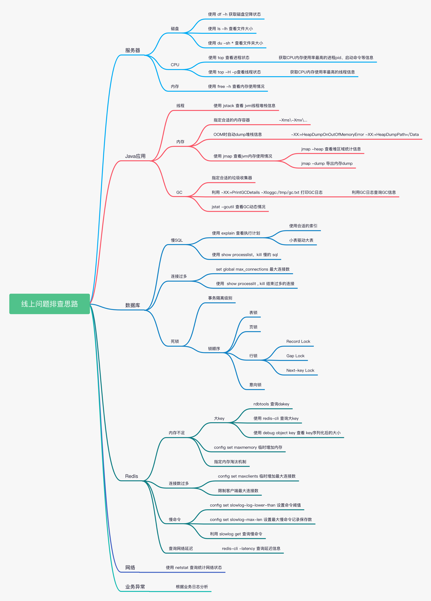
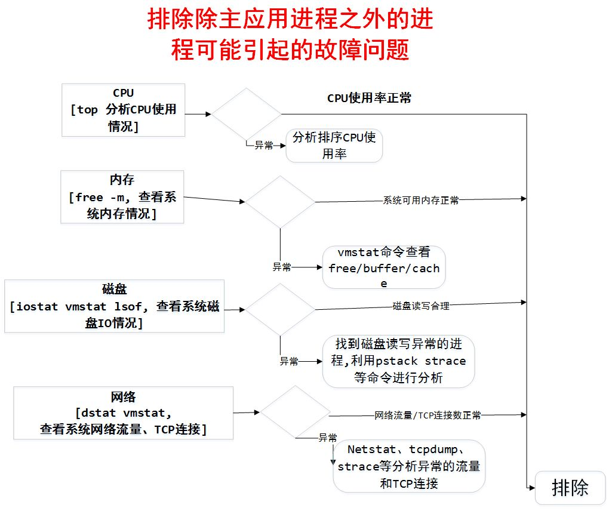
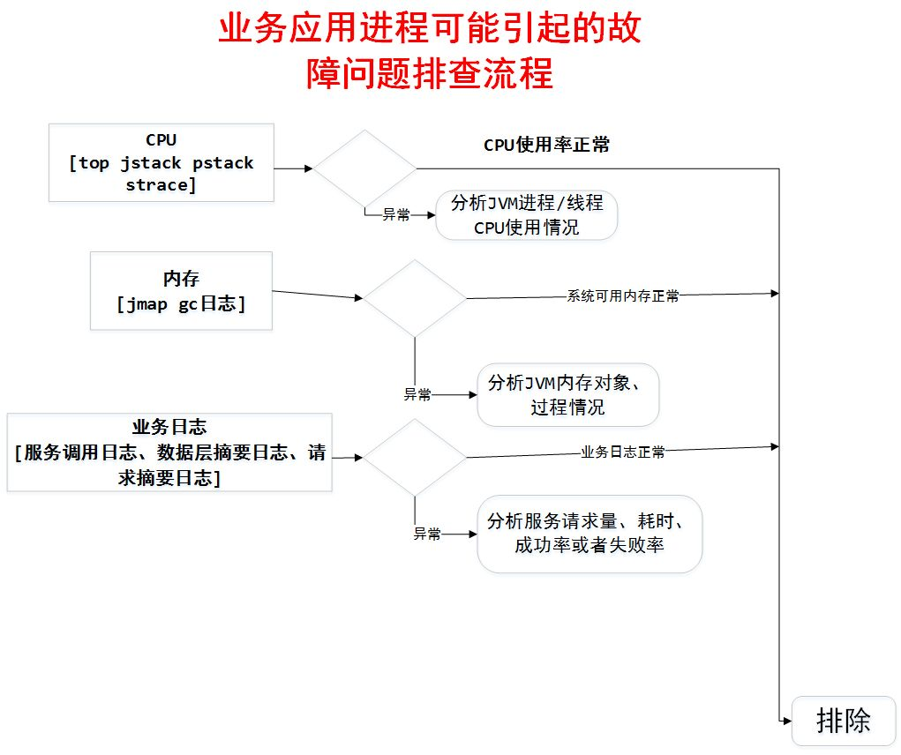
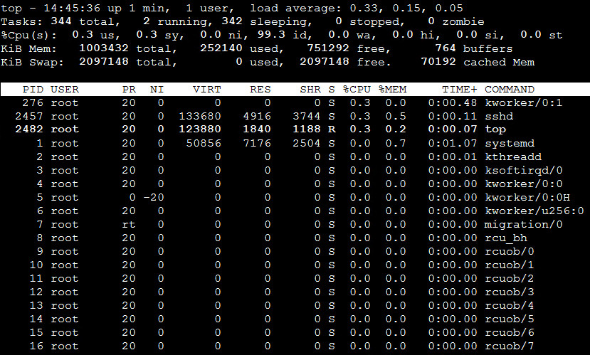

# 一、线程栈（thread dump）

## 1、概念

线程栈是某个时间点，JVM所有线程的活动状态的一个汇总；通过线程栈，可以查看某个时间点，各个线程正在做什么，通常使用线程栈来定位软件运行时的各种问题，例如 CPU 使用率特别高，或者是响应很慢，性能大幅度下滑

## 2、线程栈信息

线程栈包含了多个线程的活动信息，一个线程的活动信息通常看起来如下所示
```
"main" prio=10 tid=0x00007faac0008800 nid=0x9f0 waiting on condition [0x00007faac6068000]
   java.lang.Thread.State: TIMED_WAITING (sleeping)
        at java.lang.Thread.sleep(Native Method)
        at ThreadDump.main(ThreadDump.java:4)
```
- `线程的名字`：其中 main 就是线程的名字，需要注意的是，当使用 Thread 类来创建一条线程，并且没有指定线程的名字时，这条线程的命名规则为 Thread-i，i 代表数字。如果使用 ThreadFactory 来创建线程，则线程的命名规则为 **pool-i-thread-j**，i 和 j 分别代表数字；
- `线程的优先级`：prio=10 代表线程的优先级为 10
- `线程 id`：tid=0x00007faac0008800 代表线程 id 为 0x00007faac0008800，而** nid=0x9f0** 代表该线程对应的操作系统级别的线程 id。所谓的 nid，换种说法就是 native id。在操作系统中，分为内核级线程和用户级线程，JVM 的线程是用户态线程，内核不知情，但每一条 JVM 的线程都会映射到操作系统一条具体的线程；
- `线程的状态`：java.lang.Thread.State: TIMED_WAITING (sleeping) 以及 waiting on condition 代表线程当前的状态；
- `线程占用的内存地址`：`[0x00007faac6068000]` 代表当前线程占用的内存地址；
- `线程的调用栈`：at java.lang.Thread.sleep(Native Method)* 以及它之后的相类似的信息，代表线程的调用栈

## 3、线程状态

代码1：
```java
public static void main(String[] args) throws InterruptedException {
    int sum = 0;
    while (true) {
        int i = 0;
        int j = 1;
        sum = i + j;
    }
}
```
main 线程对应的线程栈就是，其线程状态是：runnable
```java
"main" prio=10 tid=0x00007fe1b4008800 nid=0x1292 runnable [0x00007fe1bd88f000]
java.lang.Thread.State: RUNNABLE
        at ThreadDump.main(ThreadDump.java:7)
```

**线程竞争：** 如果是以下代码，两个线程会竞争同一个锁，其中只有一个线程能获得锁，然后进行 sleep(time)，从而进入 TIMED_WAITING 状态，另外一个线程由于等待锁，会进入 BLOCKED 状态
```java
public static void main(String[] args) throws InterruptedException {
    Thread t1 = new Thread(new Runnable() {
        @Override
        public void run() {
            try {
                fun1();
            } catch (InterruptedException e) {
                e.printStackTrace();
            }
        }
    });
    t1.setDaemon(false);
    t1.setName("MyThread1");
    Thread t2 = new Thread(new Runnable() {
        @Override
        public void run() {
            try {
                fun2();
            } catch (InterruptedException e) {
                e.printStackTrace();
            }
        }
    });
    t2.setDaemon(false);
    t2.setName("MyThread2");
    t1.start();
    t2.start();
    */
    
}
private static synchronized void fun1() throws InterruptedException {
    System.out.println("t1 acquire");
    Thread.sleep(Integer.MAX_VALUE);
}
private static synchronized void fun2() throws InterruptedException {
    System.out.println("t2 acquire");
    Thread.sleep(Integer.MAX_VALUE);
}
```
对应的线程栈为：
```
"MyThread2" prio=10 tid=0x00007ff1e40b1000 nid=0x12eb waiting for monitor entry [0x00007ff1e07f6000]
java.lang.Thread.State: BLOCKED (on object monitor)
        at ThreadDump.fun2(ThreadDump.java:45)
        - waiting to lock <0x00000000eb8602f8> (a java.lang.Class for ThreadDump)
        at ThreadDump.access$100(ThreadDump.java:1)
        at ThreadDump$2.run(ThreadDump.java:25)
        at java.lang.Thread.run(Thread.java:745)

"MyThread1" prio=10 tid=0x00007ff1e40af000 nid=0x12ea waiting on condition [0x00007ff1e08f7000]
java.lang.Thread.State: TIMED_WAITING (sleeping)
        at java.lang.Thread.sleep(Native Method)
        at ThreadDump.fun1(ThreadDump.java:41)
        - locked <0x00000000eb8602f8> (a java.lang.Class for ThreadDump)
        at ThreadDump.access$000(ThreadDump.java:1)
        at ThreadDump$1.run(ThreadDump.java:10)
        at java.lang.Thread.run(Thread.java:745)
```
可以看到，t1 线程的调用栈里有这么一句 ** - locked <0x00000000eb8602f8> (a java.lang.Class for ThreadDump)**，说明它获得了锁，并且进行 sleep(sometime)操作，因此状态为 TIMED_WAITING。而 t2 线程由于获取不到锁，所以在它的调用栈里能看到 - waiting to lock <0x00000000eb8602f8> (a java.lang.Class for ThreadDump)，说明它正在等待锁，因此进入 BLOCKED 状态

**对于 WAITING 状态的线程栈**
```java
private static final Object lock = new Object();
    public static void main(String[] args) throws InterruptedException {
        synchronized (lock) {
            lock.wait();
        }
    }
```
得到的线程栈为：
```
"main" prio=10 tid=0x00007f1fdc008800 nid=0x13fe in Object.wait() [0x00007f1fe1fec000]
java.lang.Thread.State: WAITING (on object monitor)
    at java.lang.Object.wait(Native Method)
    - waiting on <0x00000000eb860640> (a java.lang.Object)
    at java.lang.Object.wait(Object.java:503)
    at ThreadDump.main(ThreadDump.java:7)
    - locked <0x00000000eb860640> (a java.lang.Object)
```

## 3、如何输出线程栈

由于线程栈反映的是 JVM 在某个时间点的线程状态，因此分析线程栈时，为避免偶然性，有必要多输出几份进行分析

（1）获得JVM进程ID
- jps 命令：
```
[root@localhost ~]# jps
5163 ThreadDump
5173 Jps
```
- ps -ef | grep java
```
[root@localhost ~]# ps -ef | grep java
root       5163   2479  0 01:18 pts/0    00:00:00 java ThreadDump
root       5185   2553  0 01:18 pts/1    00:00:00 grep --color=auto java
```

（2）获取线程栈信息：jstack命令：JDK自带
```
[root@localhost ~]# jstack 5163
```
详细日志查看：[threadump](https://github.com/chenlanqing/learningNote/blob/master/Java/log/threadump.md)

`kill -3 [pid]`：Java虚拟机提供了线程转储(Thread dump)的后门， 通过这个后门， 可以将线程堆栈打印出来，这个后门就是通过向Java进程发送一个QUIT信号， Java虚拟机收到该信号之后，将系统当前的JAVA线程调用堆栈打印出来；

## 4、如何使用线程栈定位问题

### 4.1、发现死锁

当两个或多个线程正在等待被对方占有的锁，死锁就会发生。死锁会导致两个线程无法继续运行，被永远挂起

下列代码发生死锁：
```java
ublic class ThreadDump {    
    public static void main(String[] args) throws InterruptedException {
        Object lock1 = new Object();
        Object lock2 = new Object();        
        new Thread1(lock1, lock2).start();
        new Thread2(lock1, lock2).start();
    }
    private static class Thread1 extends Thread {
        Object lock1 = null;
        Object lock2 = null;        
        public Thread1(Object lock1, Object lock2) {
            this.lock1 = lock1;
            this.lock2 = lock2;
            this.setName(getClass().getSimpleName());
        }        
        public void run() {
            synchronized (lock1) {
                try {
                    Thread.sleep(2);
                } catch(Exception e) {
                    e.printStackTrace();
                }                
                synchronized (lock2) {                    
                }
            }
        }
    }
    private static class Thread2 extends Thread {
        Object lock1 = null;
        Object lock2 = null;        
        public Thread2(Object lock1, Object lock2) {
            this.lock1 = lock1;
            this.lock2 = lock2;
            this.setName(getClass().getSimpleName());
        }        
        public void run() {
            synchronized (lock2) {
                try {
                    Thread.sleep(2);
                } catch(Exception e) {
                    e.printStackTrace();
                }                
                synchronized (lock1) {
                    
                }
            }
        }
    }
}
```
对线线程栈为：
```
"Thread2" prio=10 tid=0x00007f9bf40a1000 nid=0x1472 waiting for monitor entry [0x00007f9bf8944000]
   java.lang.Thread.State: BLOCKED (on object monitor)
        at ThreadDump$Thread2.run(ThreadDump.java:63)
        - waiting to lock <0x00000000eb860498> (a java.lang.Object)
        - locked <0x00000000eb8604a8> (a java.lang.Object)

"Thread1" prio=10 tid=0x00007f9bf409f000 nid=0x1471 waiting for monitor entry [0x00007f9bf8a45000]
   java.lang.Thread.State: BLOCKED (on object monitor)
        at ThreadDump$Thread1.run(ThreadDump.java:38)
        - waiting to lock <0x00000000eb8604a8> (a java.lang.Object)
        - locked <0x00000000eb860498> (a java.lang.Object)

Found one Java-level deadlock:
=============================
"Thread2":
  waiting to lock monitor 0x00007f9be4004f88 (object 0x00000000eb860498, a java.lang.Object),
  which is held by "Thread1"
"Thread1":
  waiting to lock monitor 0x00007f9be40062c8 (object 0x00000000eb8604a8, a java.lang.Object),
  which is held by "Thread2"

Java stack information for the threads listed above:
===================================================
"Thread2":
        at ThreadDump$Thread2.run(ThreadDump.java:63)
        - waiting to lock <0x00000000eb860498> (a java.lang.Object)
        - locked <0x00000000eb8604a8> (a java.lang.Object)
"Thread1":
        at ThreadDump$Thread1.run(ThreadDump.java:38)
        - waiting to lock <0x00000000eb8604a8> (a java.lang.Object)
        - locked <0x00000000eb860498> (a java.lang.Object)

Found 1 deadlock.
```
可以看到，当发生了死锁的时候，堆栈中直接打印出了死锁的信息** Found one Java-level deadlock: **，并给出了分析信息

### 4.2、定位 CPU 过高的原因

首先需要借助操作系统提供的一些工具，来定位消耗 CPU 过高的 native 线程。不同的操作系统，提供的不同的 CPU 统计命令如下所示：

操作系统|	solaris	|linux	|aix
-------|----------|--------|-----
命令名称|`prstat -L <pid>`|`top -p <pid`>|ps -emo THREAD

以 Linux 为例，首先通过 `top -p <pid>` 输出该进程的信息，然后输入 H，查看所有的线程的统计情况
```
top - 02:04:54 up  2:43,  3 users,  load average: 0.10, 0.05, 0.05
Threads:  13 total,   0 running,  13 sleeping,   0 stopped,   0 zombie
%Cpu(s):  97.74 us,  0.2 sy,  0.0 ni, 2.22 id,  0.0 wa,  0.0 hi,  0.0 si,  0.0 st
KiB Mem:   1003456 total,   722012 used,   281444 free,        0 buffers
KiB Swap:  2097148 total,    62872 used,  2034276 free.    68880 cached Mem

PID USER PR NI VIRT RES SHR S %CPU %MEM TIME+ COMMAND
3368 zmw2 25 0 256m 9620 6460 R 93.3 0.7 5:42.06 java
3369 zmw2 15 0 256m 9620 6460 S 0.0 0.7 0:00.00 java
3370 zmw2 15 0 256m 9620 6460 S 0.0 0.7 0:00.00 java
3371 zmw2 15 0 256m 9620 6460 S 0.0 0.7 0:00.00 java
3372 zmw2 15 0 256m 9620 6460 S 0.0 0.7 0:00.00 java
3373 zmw2 15 0 256m 9620 6460 S 0.0 0.7 0:00.00 java
3374 zmw2 15 0 256m 9620 6460 S 0.0 0.7 0:00.00 java
3375 zmw2 15 0 256m 9620 6460 S 0.0 0.7 0:00.00 java
```
这个命令输出的PID代表的是 native 线程的id，如上所示，id为 3368 的 native 线程消耗 CPU最高。在Java ThreadDump文件中，每个线程都有`tid=...nid=...`的属性，其中nid就是native thread id，只不过nid中用16进制来表示。例如上面的例子中3368的十六进制表示为0xd28.在Java线程中查找nid=0xd28即是本地线程对应Java线程

```
"main" prio=1 tid=0x0805c988 nid=0xd28 runnable [0xfff65000..0xfff659c8]
at java.lang.String.indexOf(String.java:1352)
at java.io.PrintStream.write(PrintStream.java:460)
- locked <0xc8bf87d8> (a java.io.PrintStream)
at java.io.PrintStream.print(PrintStream.java:602)
at MyTest.fun2(MyTest.java:16)
- locked <0xc8c1a098> (a java.lang.Object)
at MyTest.fun1(MyTest.java:8)
- locked <0xc8c1a090> (a java.lang.Object)
at MyTest.main(MyTest.java:26)
```
导致 CPU 过高的原因有以下几种原因：
- Java 代码死循环
- Java 代码使用了复杂的算法，或者频繁调用
- JVM 自身的代码导致 CPU 很高

如果在Java线程堆栈中找到了对应的线程ID,并且该Java线程正在执行Native code,说明导致CPU过高的问题代码在JNI调用中，此时需要打印出 Native 线程的线程栈，在 linux 下，使用 `pstack <pid>` 命令。

如果在 native 线程堆栈中可以找到对应的消耗 CPU 过高的线程 id，可以直接定位为 native 代码的问题;

PS：`十进制转换为16进制`：`printf '%x\n' 6642`

### 4.3、定位性能下降原因

性能下降一般是由于资源不足所导致。如果资源不足， 那么有大量的线程在等待资源， 打印的线程堆栈如果发现大量的线程停在同样的调用上下文上， 那么就说明该系统资源是瓶颈；

导致资源不足的原因可能有：
- 资源数量配置太少（如连接池连接配置过少等），而系统当前的压力比较大，资源不足导致了某些线程不能及时获得资源而等待在那里(即挂起)；
- 获得资源的线程把持资源时间太久， 导致资源不足，例如以下代码：
    ```
    void fun1() {
        Connection conn = ConnectionPool.getConnection();//获取一个数据库连接
        //使用该数据库连接访问数据库
        //数据库返回结果，访问完成
        //做其它耗时操作,但这些耗时操作数据库访问无关，
        conn.close(); //释放连接回池
    }
    ```
- 设计不合理导致资源占用时间过久，如SQL语句设计不恰当，或者没有索引导致的数据库访问太慢等；
- 资源用完后，在某种异常情况下，没有关闭或者回池，导致可用资源泄漏或者减少，从而导致资源竞；

### 4.4、定位系统假死原因

导致系统挂死的原因有很多，其中有一个最常见的原因是线程挂死。每次打印线程堆栈，该线程必然都在同一个调用上下文上，因此定位该类型的问题原理是，通过打印多次堆栈，找出对应业务逻辑使用的线程， 通过对比前后打印的堆栈确认该线程执行的代码段是否一直没有执行完成。 通过打印多次堆栈，找到挂起的线程（即不退出）；

导致线程无法退出的原因可能有：
- 线程正在执行死循环的代码
- 资源不足或者资源泄漏，造成当前线程阻塞在锁对象上（即wait在锁对象上），长期得不到唤醒(notify)。
- 如果当前程序和外部通信，当外部程序挂起无返回时，也会导致当前线程挂起

# 二、Heap Dump分析

常见配置：`-XX:+HeapDumpOnOutOfMemoryError -XX:HeapDumpPath=. -XX:+PrintGCDateStamps -XX:+PrintGCDetails -Xloggc:gc.log -XX:+UseGCLogFileRotation -XX:NumberOfGCLogFiles=10 -XX:GCLogFileSize=100M`

## 1、发生OOM之后

如果OOM发生之后，想办法得到Heap dump
- 项目启动之初，给定虚拟机餐厨：`-XX:+HeapDumpOnOutOfMemoryError`
- 通过jmap命令获取：`jmap -dump:live,format=b,file=<filepath> <pid>`

## 2、OOM可能原因

- 代码问题；
- 配置问题；
- 内存不够

> 90%的问题都是代码问题

## 3、Heap Dump分析

- 如果是Metaspace/PermGen OOM，一般是Class对象问题；
- 如果是Heap Space OOME，瞄准占空间最大的对象；

# 三、应用问题排查思路


[Java 线上问题排查思路与工具使用](https://blog.csdn.net/gitchat/article/details/79019454)

## 1、常见线上问题
所有 Java 服务的线上问题从系统表象来看归结起来总共有四方面：CPU、内存、磁盘、网络，基于这些现象我们可以将线上问题分成两大类: 系统异常、业务服务异常

**系统异常**

常见的系统异常现象包括：CPU 占用率过高、CPU 上下文切换频率次数较高、磁盘满了、磁盘 I/O 过于频繁、网络流量异常（连接数过多）、系统可用内存长期处于较低值（导致oom killer）等等；

这些问题可以通过 top（cpu）、free（内存）、df（磁盘）、dstat（网络流量)=）、pstack、vmstat、strace（底层系统调用）等工具获取系统异常现象数据

**业务异常**：常见的业务服务异常现象包括: PV 量过高、服务调用耗时异常、线程死锁、多线程并发问题、频繁进行 Full GC、异常安全攻击扫描等

## 2、问题定位

一般会采用排除法，从外部排查到内部排查的方式来定位线上服务问题：
- 首先我们要排除其他进程 (除主进程之外) 可能引起的故障问题；
- 然后排除业务应用可能引起的故障问题；
- 可以考虑是否为运营商或者云服务提供商所引起的故障

系统异常排查流程



业务异常排查流程




## 3、Full GC次数过多

**问题特征：**
- 线上多个线程的CPU都超过了100%，通过jstack命令可以看到这些线程主要是垃圾回收线程
- 通过jstat命令监控GC情况，可以看到Full GC次数非常多，并且次数在不断增加：`jstat -gcutil pid` 查看内存使用和 gc 情况

**排查过程：**
- 通过 `top` 命令找到占用cpu最高的 `pid[进程id]`；
- 通过 `top -Hp pid` 查看进程中占用cpu过高的 `tid[线程id]`；
- 通过 `printf  pid |grep tid` 把`线程id`转化为十六进制；
- 通过 `jstack pid | grep tid -A 30` 定位线程堆栈信息

总结来说，对于Full GC次数过多，主要有以下两种原因：
- 代码中一次获取了大量的对象，导致内存溢出，此时可以通过eclipse的mat工具查看内存中有哪些对象比较多；
- 内存占用不高，但是Full GC次数还是比较多，此时可能是显示的 System.gc()调用导致GC次数过多，这可以通过添加 -XX:+DisableExplicitGC来禁用JVM对显示GC的响应

**持续 FullGC：**

[CMS引起的持续Full GC](../Java虚拟机/JVM-GC垃圾回收机制.md#64CMS中YoungGc的实现过程)

**频繁Full GC**
- 首先想到的是要先紧急处理，然后再分析原因，紧急处理大概有三种可选方案：重启、限流、扩容  三板斧；
- 其次，明确方向，一般来说，引起full gc的主要原因有两大类：
    - 一是应用资源配置问题，资源配置这块，要检查jvm参数配置是否合理；
    - 二是程序问题。大部分full gc都是由程序问题引起得，主要有两方面原因，一是程序存在大对象，二是存在内存泄漏；
- 最重要的一点，分析dump文件，但是要保证取得事发时内存快照，分析软件可以用MAT和VisualVM，对于我们遇到的这个问题，其实还可以用jstack获取当前进程所有的线程进行分析；
- Full GC时要及时告警，避免开发响应滞后于业务，另外，在实践中要合理设置JVM参数，这样也可以尽量避免full gc；

## 4、应用CPU使用率过高

- [CPU-100%问题排查](https://mp.weixin.qq.com/s/goL4USSfLOtBxjSENnP0Qg)

常见场景：
- CPU过高可能是系统频繁的进行Full GC，导致系统缓慢；
- Full GC次数过多
- 无限while循环
- 频繁GC
- 频繁创建新的对象：合理使用单例
- 序列化与反序列化
- 正则表达式
- 频繁的线程上下文切换

排查过程：
- `top`：使用top查找到使用 CPU 最多的某个进程，记录它的 pid。使用 Shift + P 快捷键可以按 CPU 的使用率进行排序
- `top -Hp $PID`：再次使用 top 命令，加 -H 参数，查看某个进程中使用 CPU 最多的某个线程，记录线程的 ID
- `printf %x $tid`：使用 printf 函数，将十进制的 tid 转化成十六进制，为后面查找 jstack 日志做准备
- `jstack 进程PID | vim +/十六进制线程PID`，例如：`jstack 1040|vim +/0x431`

### 4.1、不定期出现的接口耗时现象

首先找到该接口，通过压测工具不断加大访问力度，如果说该接口中有某个位置是比较耗时的，由于我们的访问的频率非常高，那么大多数的线程最终都将阻塞于该阻塞点，这样通过多个线程具有相同的堆栈日志，我们基本上就可以定位到该接口中比较耗时的代码的位置

### 4.2、某个线程进入WAITING状态

正常情况下，线上大多数线程都是处于`TIMED_WAITING`状态。

解决这个问题的思路主要如下：
- 通过grep在jstack日志中找出所有的处于`TIMED_WAITING`状态的线程，将其导出到某个文件中；
- 等待一段时间之后，比如10s，再次对jstack日志进行grep，将其导出到另一个文件：`jstack -l pid | grep BLOCKED`
- 重复步骤2，待导出`3~4`个文件之后，我们对导出的文件进行对比，找出其中在这几个文件中一直都存在的用户线程，这个线程基本上就可以确认是包含了处于等待状态有问题的线程。因为正常的请求线程是不会在20~30s之后还是处于等待状态的。
- 经过排查得到这些线程之后，我们可以继续对其堆栈信息进行排查，如果该线程本身就应该处于等待状态，比如用户创建的线程池中处于空闲状态的线程，那么这种线程的堆栈信息中是不会包含用户自定义的类的。这些都可以排除掉，而剩下的线程基本上就可以确认是我们要找的有问题的线程。通过其堆栈信息，我们就可以得出具体是在哪个位置的代码导致该线程处于等待状态了；

## 5、锁问题

- [详解一次由读写锁引起的内存泄漏](https://mp.weixin.qq.com/s/UPCIgL0_SLyOF5SNFgL27w)

### 5.1、java死锁

jstack可以帮助我们检查死锁，并且在日志中打印具体的死锁线程信息

### 5.2、数据库死锁

通过命令查找死锁信息：`SHOW ENGINE INNODB STATUS`，一般日志里会记录产生死锁的SQL

## 6、长时间GC停顿

- [Java 中 9 种常见的 CMS GC 问题分析与解决](https://tech.meituan.com/2020/11/12/java-9-cms-gc.html)

可能导致GC长暂停的不同场景：

### 6.1、碎片化

正是因为碎片化问题--CMS最致命的缺陷，导致这个统治了OLAP系统十多年的垃圾回收器直接退出历史舞台。

对于于CMS，由于老年代的碎片化问题，在YGC时可能碰到晋升失败（promotion failures，即使老年代还有足够多有效的空间，但是仍然可能导致分配失败，因为没有足够连续的空间），从而触发Concurrent Mode Failure，发生会完全STW的FullGC；

为什么CMS场景下会有碎片化问题？由于CMS在老年代回收时，采用的是标记清理（Mark-Sweep）算法，它在垃圾回收时并不会压缩堆，日积月累，导致老年代的碎片化问题会越来越严重，直到发生单线程的Mark-Sweep-Compact GC，即FullGC，会完全STW。如果堆比较大的话，STW的时间可能需要好几秒，甚至十多秒，几十秒都有可能

### 6.2、GC时操作系统的活动

当发生GC时，一些操作系统的活动，比如swap，可能导致GC停顿时间更长，这些停顿可能是几秒，甚至几十秒级别。

如果你的系统配置了允许使用swap空间，操作系统可能把JVM进程的非活动内存页移到swap空间，从而释放内存给当前活动进程（可能是操作系统上其他进程，取决于系统调度）。Swapping由于需要访问磁盘，所以相比物理内存，它的速度慢的令人发指。所以，如果在GC的时候，系统正好需要执行Swapping，那么GC停顿的时间一定会非常非常非常恐怖；

### 6.3、堆空间不够

如果应用程序需要的内存比我们执行的Xmx还要大，也会导致频繁的垃圾回收，甚至OOM。由于堆空间不足，对象分配失败，JVM就需要调用GC尝试回收已经分配的空间，但是GC并不能释放更多的空间，从而又回导致GC，进入恶性循环。应用运行时，频繁的FullGC会引起长时间停顿；

如果在老年代的空间不够的话，也会导致频繁FullGC，这类问题比较好办，给足老年代和永久代

### 6.4、JVM Bug

有时候，GC的长时间停顿就有可能是BUG引起的。例如，下面列举的这些JVM的BUG，就可能导致Java应用在GC时长时间停顿

### 6.5、显示System.gc调用

检查是否有显示的System.gc调用，应用中的一些类里，或者第三方模块中调用System.gc调用从而触发STW的FullGC，也可能会引起非常长时间的停顿。

如果你使用了RMI，能观察到固定时间间隔的FullGC，也是由于RMI的实现调用了System.gc。这个时间间隔可以通过系统属性配置：
```
-Dsun.rmi.dgc.server.gcInterval=7200000
-Dsun.rmi.dgc.client.gcInterval=7200000
```
JDK 1.4.2和5.0的默认值是60000毫秒，即1分钟；JDK6以及以后的版本，默认值是3600000毫秒，即1个小时.

如果你要关闭通过调用System.gc()触发FullGC，配置JVM参数`-XX:+DisableExplicitGC`即可；

### 6.6、如何排查解决

- 配置JVM参数：`-XX:+PrintGCDetails -XX:+PrintHeapAtGC -XX:+PrintGCTimeStamps -XX:+PrintGCDateStamps and -XX:+PrintGCApplicationStoppedTime`. 如果是CMS，还需要添加`-XX:PrintFLSStatistics=2`，然后收集GC日志。因为GC日志能告诉我们GC频率，是否长时间停顿等重要信息。
- 使用vmstat, iostat, netstat和mpstat等工具监控系统全方位健康状况。
- 使用GCHisto工具可视化分析GC日志，弄明白消耗了很长时间的GC，以及这些GC的出现是否有一定的规律。
- 尝试从GC日志中能否找出一下JVM堆碎片化的表征。
- 监控指定应用的堆大小是否足够。
- 检查你运行的JVM版本，是否有与长时间停顿相关的BUG，然后升级到修复问题的最新JDK。

## 7、线程池

- [一次线程池引发的线上故障分析](https://mp.weixin.qq.com/s/wFePJPkGv5v34GpalGOkYw)
- [线程池运用不当的一次线上事故](https://www.heapdump.cn/article/646639)

### 7.1、线程池满了

Java 线程池以有界队列的线程池为例，当新任务提交时，如果运行的线程少于 corePoolSize，则创建新线程来处理请求。如果正在运行的线程数等于 corePoolSize 时，则新任务被添加到队列中，直到队列满。当队列满了后，会继续开辟新线程来处理任务，但不超过 maximumPoolSize。当任务队列满了并且已开辟了最大线程数，此时又来了新任务，ThreadPoolExecutor 会拒绝服务。

**下游 RT 高，超时时间不合理：**
- 业务监控
- sunfire
- eagleeye

**数据库慢 sql 或者数据库死锁：**
- 日志关键字 “Deadlock found when trying to get lock”
- Jstack 或 zprofiler 查看阻塞态线程；

**Java 代码死锁：**
- `jstack –l pid | grep -i –E 'BLOCKED | deadlock'`
- dump thread 通过 zprofiler 分析阻塞线程和持锁情况

### 7.2、线程池拒绝策略引发Full GC

- [线程池拒绝策略引发Full GC问题分析](https://mp.weixin.qq.com/s?__biz=Mzg3NjU3NTkwMQ==&mid=2247551081&idx=1&sn=1bd4c366fa2aecdb2ee1ebe7ceb78ae6&scene=21)

## 8、NoSuchMethodException

**jar 包冲突：**

java 在装载一个目录下所有 jar 包时，它加载的顺序完全取决于操作系统。
- `mvn dependency:tree` 分析报错方法所在的 jar 包版本，留下新的
- `arthas：sc -d ClassName`
- `XX：+TraceClassLoading`


# 四、Linux问题排查

## 1、常用分析工具

- [系统底层](../../性能优化/性能优化.md#二系统底层优化)
- [更多Linux工具](../../计算机基础/计算机系统/Linux/Linux常见操作.md)

Linux 常用的性能分析工具使用包括：top（cpu）、free（内存）、df（磁盘）、dstat（网络流量)=）、pstack、vmstat、strace（底层系统调用）

### 1.1、CPU

CPU 是系统重要的监控指标，能够分析系统的整体运行状况。监控指标一般包括运行队列、CPU 使用率和上下文切换等；

top命令是Linux下常用的CPU性能分析工具，能够实时显示系统中各个进程的资源占用状况，常用于服务端性能分析



top命令显示了各个进程CPU使用情况，一般CPU使用率从高到低排序展示输出。其中Load Average显示最近1分钟、5分钟和15分钟的系统平均负载，上图各值为0.33、0.15、0.05

一般会关注 CPU 使用率最高的进程
- `PID` : 进程 id
- `USER` : 进程所有者
- `PR` : 进程优先级
- `NI` : nice 值。负值表示高优先级，正值表示低优先级
- `VIRT` : 进程使用的虚拟内存总量，单位 kb。VIRT=SWAP+RES
- `RES` : 进程使用的、未被换出的物理内存大小，单位 kb。RES=CODE+DATA
- `SHR` : 共享内存大小，单位 kb
- `S` : 进程状态：
    - `D`：Disk Sleep 的缩写，也就是不可中断状态睡眠（Uninterruptible Sleep），一般表示进程正在跟硬件交互，并且交互过程不允许被其他进程或中断打断
    - `R`：进程在 CPU 的就绪队列中，正在运行或者正在等待运行
    - `S`：Interruptible Sleep 的缩写，也就是可中断状态睡眠，表示进程因为等待某个事件而被系统挂起。当进程等待的事件发生时，它会被唤醒并进入 R 状态
    - `T`：Stopped 或 Traced 的缩写，表示进程处于暂停或者跟踪状态。向一个进程发送 SIGSTOP 信号，它就会因响应这个信号变成暂停状态（Stopped）；再向它发送 SIGCONT 信号，进程又会恢复运行（如果进程是终端里直接启动的，则需要你用 fg 命令，恢复到前台运行） 
    - `Z`：Zombie 的缩写，它表示僵尸进程，也就是进程实际上已经结束了，但是父进程还没有回收它的资源（比如进程的描述符、PID 等）。
    - `I`：是 Idle 的缩写，也就是空闲状态，用在不可中断睡眠的内核线程上；D 状态的进程会导致平均负载升高， I 状态的进程却不会。
    - `X`：也就是 Dead 的缩写，表示进程已经消亡，所以不会在 top 或者 ps 命令中看到它。
- `%CPU` : 上次更新到现在的 CPU 时间占用百分比
- `%MEM` : 进程使用的物理内存百分比
- `TIME+` : 进程使用的 CPU 时间总计，单位 1/100 秒
- `COMMAND` : 进程名称

查询占用CPU高的线程ID
- 通过 `top` 命令找到占用cpu最高的 `pid[进程id]`；
- 通过 `top -Hp pid` 查看进程中占用cpu过高的 `tid[线程id]`；
- 通过 `printf  pid |grep tid` 把`线程id`转化为十六进制；
- 通过 `jstack pid | grep tid -A 30` 定位线程堆栈信息

### 1.2、内存

内存是排查线上问题的重要参考依据，内存问题很多时候是引起 CPU 使用率较高的见解因素

系统内存：free是显示的当前内存的使用，-m 的意思是 M 字节来显示内容


部分参数：
- `total` 内存总数: 979M
- `used` 已经使用的内存数: 247M
- `free` 空闲的内存数: 732M
- `shared` 当前已经废弃不用 , 总是 0
-` buffers` Buffer 缓存内存数: 0M

jvm old区占用过高排查思路：
- `top`查看占用cpu高的进程
- `jstat -gcutil pid` 时间间隔 查看gc状况
- `jmap -dump:format=b,file=name.dump pid`  导出dump文件
- 用visualVM分析dump文件

### 1.3、磁盘

- df
```
[root@localhost ~]# df -h
文件系统                 容量   已用   可用   已用%   挂载点
/dev/mapper/centos-root   18G  1.6G   16G    9%     /
devtmpfs                 484M     0  484M    0%     /dev
tmpfs                    490M     0  490M    0%     /dev/shm
tmpfs                    490M  6.6M  484M    2%     /run
tmpfs                    490M     0  490M    0%     /sys/fs/cgroup
/dev/sda1                497M   96M  401M   20%     /boot
```
- du 命令是查看当前指定文件或目录（会递归显示子目录）占用磁盘空间大小

### 1.4、网络

**dstat** 

以集成了 vmstat、iostat、netstat 等等工具能完成的任务， dstat参数：
- `-c`：cpu 情况
- `-d`：磁盘读写
- `-n`：网络状况
- `-l`：显示系统负载
- `-m`：显示形同内存状况
- `-p`：显示系统进程信息
- `-r`：显示系统IO 情况
```bash
root@localhost ~]# dstat
You did not select any stats, using -cdngy by default.
----total-cpu-usage---- -dsk/total- -net/total- ---paging-- ---system--
usr sys idl wai hiq siq| read  writ| recv  send|  in   out | int   csw 
  0   1  99   1   0   0| 113k   22k|   0     0 |   0     0 |  53   103 
  0   0 100   0   0   0|   0     0 | 419B  346B|   0     0 |  27    33 
  0   0 100   0   0   0|   0     0 | 180B  346B|   0     0 |  18    18 
  0   1  99   0   0   0|   0   396k| 120B  346B|   0     0 |  76   133 
  0   0 100   0   0   0|   0     0 | 212B  346B|   0     0 |  36    57 
```
**[hping3](https://www.kali.org/tools/hping3/)**

是一个可以构造 TCP/IP 协议数据包的工具，可以对系统进行安全审计、防火墙测试等。

**[tcpdump](../../计算机基础/计算机网络/网络问题排查.md#2tcpdump)**

### 1.5、更多

vmstat 可以获得有关进程、内存页面交换、虚拟内存、线程上下文切换、等待队列等信息。能够反映系统的负载情况。一般用来查看进程等待数量、内存换页情况、系统上下文切换是否频繁等

[iostat](https://linux.die.net/man/1/iostat) 工具可以对系统的磁盘操作活动进行监视，同时也可以显示 CPU 使用情况，一般用来排查与文件读写有关的问题，例如排查文件写入耗时较高时，可以查看 await 和 util 是否过高。iotop 是查看磁盘 I/O 使用状况的 top 类工具，想知道到底哪个进程产生了大量的 IO 时可以使用 iotop（安装：yum install sysstat）

ifstat 是简洁的实时网络流量监控工具，可以查看系统的网络出口、入口使用情况。iftop 可以用来监控网卡的实时流量、反向解析 IP、显示端口信息等，通过iftop很容易找到哪个ip在霸占网络流量

netstat 是一个监控系统网络状态的工具，它可以查看网络连接状态，监听了哪些接口、链接相关的进程等信息，能够显示与 IP、TCP、UDP 和 ICMP 协议相关的统计数据，是非常常用的网络工具

[dstat](https://linux.die.net/man/1/dstat) 是一个全能实时系统信息统计工具，能够统计 CPU 占用，内存占用，网络状况，系统负载，进程信息，磁盘信息等等，可以用来替换 vmstat、iostat、netstat 和i fstat 这些工具

strace 是一个用于诊断、调试程序运行时系统调用的工具，可以动态跟踪程序的运行，能够清楚地看到一个程序运行时产生的系统调用过程及其使用的参数、返回值和执行耗时。JVM 执行 native 方法时，可以很方便的通过 strace 来进行调试，例如在执行系统读写时，线程卡住很长时间，就可以用 strace 来查看系统调用的参数和耗时

GDB 是一个强大的命令行调试工具，可以让程序在受控的环境中运行，让被调试的程序在指定的断点处停住，也可以动态的改变程序的执行环境。当 JVM 因为未知原因 crash 时，可以通过 GDB 来分析 crash 时产生的 coredump 文件，来分析定位问题

lsof 是一个列出当前系统打开文件的工具。Linux 中一切皆文件，包括设备、链接等都是以文件形式管理的，因此通过 lsof 工具查看文件列表对系统监测以及排错都很有帮助

tcpdump 是一个强大的网络抓包工具，在分析服务之间调用时非常有用。可以将网络中传送的数据包抓取下来进行分析。tcpdump 提供灵活的抓取策略，支持针对网络层、协议、主机、网络或端口的过滤，并提供 and、or、not 等逻辑语句来去掉不想要的信息。

traceroute 是一个网络路由分析工具，利用 ICMP 协议定位本地计算机和目标计算机之间的所有路由。traceroute 对服务，特别是经过公网的服务之间的网络问题排查非常有帮助

## 2、CPU使用问题

### 2.1、短时应用导致导致CPU偏高

系统的 CPU 使用率，不仅包括进程用户态和内核态的运行，还包括中断处理、等待 I/O 以及内核线程等。所以，当你发现系统的 CPU 使用率很高的时候，不一定能找到相对应的高 CPU 使用率的进程。

介绍两个工具：
- pstree： 可以用树状形式显示所有进程之间的关系
    ```bash
    pstree | grep stress
    ```
- [execsnoop](https://www.brendangregg.com/blog/2014-07-28/execsnoop-for-linux.html)： 使用 top、pidstat、pstree 等工具分析了系统 CPU 使用率高的问题，但是分析过程会比较复杂，execsnoop 就是一个专为短时进程设计的工具。它通过 ftrace 实时监控进程的 exec() 行为，并输出短时进程的基本信息，包括进程 PID、父进程 PID、命令行参数以及执行的结果；execsnoop 所用的 ftrace 是一种常用的动态追踪技术，一般用于分析 Linux 内核的运行时行为

碰到常规问题无法解释的 CPU 使用率情况时，首先要想到有可能是短时应用导致的问题，比如有可能是下面这两种情况。
- 第一，应用里直接调用了其他二进制程序，这些程序通常运行时间比较短，通过 top 等工具也不容易发现。
- 第二，应用本身在不停地崩溃重启，而启动过程的资源初始化，很可能会占用相当多的 CPU。

对于这类进程，可以用 pstree 或者 execsnoop 找到它们的父进程，再从父进程所在的应用入手，排查问题的根源

### 2.2、大量不可中断线程和僵尸线程

**不可中断状态**，其实是为了保证进程数据与硬件状态一致，并且正常情况下，不可中断状态在很短时间内就会结束。所以，短时的不可中断状态进程，我们一般可以忽略。

但如果系统或硬件发生了故障，进程可能会在不可中断状态保持很久，甚至导致系统中出现大量不可中断进程。这时，就得注意下，系统是不是出现了 I/O 等性能问题

**僵尸进程**，这是多进程应用很容易碰到的问题。正常情况下，当一个进程创建了子进程后，它应该通过系统调用 wait() 或者 waitpid() 等待子进程结束，回收子进程的资源；而子进程在结束时，会向它的父进程发送 SIGCHLD 信号，所以，父进程还可以注册 SIGCHLD 信号的处理函数，异步回收资源。

如果父进程没这么做，或是子进程执行太快，父进程还没来得及处理子进程状态，子进程就已经提前退出，那这时的子进程就会变成僵尸进程。换句话说，父亲应该一直对儿子负责，善始善终，如果不作为或者跟不上，都会导致“问题少年”的出现。

通常，僵尸进程持续的时间都比较短，在父进程回收它的资源后就会消亡；或者在父进程退出后，由 init 进程回收后也会消亡；一旦父进程没有处理子进程的终止，还一直保持运行状态，那么子进程就会一直处于僵尸状态。大量的僵尸进程会用尽 PID 进程号，导致新进程不能创建，所以这种情况一定要避免；

比如遇到类似情况，通过top命令观察：
```bash
# 按下数字 1 切换到所有 CPU 的使用情况，观察一会儿按 Ctrl+C 结束
$ top
top - 05:56:23 up 17 days, 16:45,  2 users,  load average: 2.00, 1.68, 1.39
Tasks: 247 total,   1 running,  79 sleeping,   0 stopped, 115 zombie
%Cpu0  :  0.0 us,  0.7 sy,  0.0 ni, 38.9 id, 60.5 wa,  0.0 hi,  0.0 si,  0.0 st
%Cpu1  :  0.0 us,  0.7 sy,  0.0 ni,  4.7 id, 94.6 wa,  0.0 hi,  0.0 si,  0.0 st
...
  PID USER      PR  NI    VIRT    RES    SHR S  %CPU %MEM     TIME+ COMMAND
 4340 root      20   0   44676   4048   3432 R   0.3  0.0   0:00.05 top
 4345 root      20   0   37280  33624    860 D   0.3  0.0   0:00.01 app
 4344 root      20   0   37280  33624    860 D   0.3  0.4   0:00.01 app
    1 root      20   0  160072   9416   6752 S   0.0  0.1   0:38.59 systemd
...
```
从上面可以看出如下问题：
- 先看第一行的平均负载（ Load Average），过去 1 分钟、5 分钟和 15 分钟内的平均负载在依次减小，说明平均负载正在升高；而 1 分钟内的平均负载已经达到系统的 CPU 个数，说明系统很可能已经有了性能瓶颈。
- 再看第二行的 Tasks，有 1 个正在运行的进程，但僵尸进程比较多，而且还在不停增加，说明有子进程在退出时没被清理。
- 接下来看两个 CPU 的使用率情况，用户 CPU 和系统 CPU 都不高，但 iowait 分别是 60.5% 和 94.6%，好像有点儿不正常。
- 最后再看每个进程的情况， CPU 使用率最高的进程只有 0.3%，看起来并不高；但有两个进程处于 D 状态，它们可能在等待 I/O，但光凭这里并不能确定是它们导致了 iowait 升高。

这四个问题再汇总一下，就可以得到很明确的两点：
- 第一点，iowait 太高了，导致系统的平均负载升高，甚至达到了系统 CPU 的个数。
- 第二点，僵尸进程在不断增多，说明有程序没能正确清理子进程的资源。

**iowait 分析**

iowait 升高，首先会想要查询系统的 I/O 情况，可以使用 [iostat](https://linux.die.net/man/1/iostat) 命令，也可以使用 [dstat](https://linux.die.net/man/1/dstat)，可以同时查看 CPU 和 I/O 这两种资源的使用情况，便于对比分析
```bash
# 间隔 1 秒输出 10 组数据
$ dstat 1 10
You did not select any stats, using -cdngy by default.
--total-cpu-usage-- -dsk/total- -net/total- ---paging-- ---system--
usr sys idl wai stl| read  writ| recv  send|  in   out | int   csw
  0   0  96   4   0|1219k  408k|   0     0 |   0     0 |  42   885
  0   0   2  98   0|  34M    0 | 198B  790B|   0     0 |  42   138
  0   0   0 100   0|  34M    0 |  66B  342B|   0     0 |  42   135
  0   0  84  16   0|5633k    0 |  66B  342B|   0     0 |  52   177
  0   3  39  58   0|  22M    0 |  66B  342B|   0     0 |  43   144
  0   0   0 100   0|  34M    0 | 200B  450B|   0     0 |  46   147
  0   0   2  98   0|  34M    0 |  66B  342B|   0     0 |  45   134
  0   0   0 100   0|  34M    0 |  66B  342B|   0     0 |  39   131
  0   0  83  17   0|5633k    0 |  66B  342B|   0     0 |  46   168
  0   3  39  59   0|  22M    0 |  66B  342B|   0     0 |  37   134
```
从 dstat 的输出，可以看到，每当 iowait 升高（wai）时，磁盘的读请求（read）都会很大。这说明 iowait 的升高跟磁盘的读请求有关，很可能就是磁盘读导致的；shiy

那到底是哪个进程在读磁盘呢？使用 top 命令观察状态为：D 的进程
```bash
# 观察一会儿按 Ctrl+C 结束
$ top
...
  PID USER      PR  NI    VIRT    RES    SHR S  %CPU %MEM     TIME+ COMMAND
 4340 root      20   0   44676   4048   3432 R   0.3  0.0   0:00.05 top
 4345 root      20   0   37280  33624    860 D   0.3  0.0   0:00.01 app
 4344 root      20   0   37280  33624    860 D   0.3  0.4   0:00.01 app
...
```
查看这些进程的磁盘读写情况。一般要查看某一个进程的资源使用情况，都可以用  pidstat，加上 `-d` 参数，以便输出 I/O 使用情况。
```bash
# -d 展示 I/O 统计数据，-p 指定进程号，间隔 1 秒输出 3 组数据
$ pidstat -d -p 4344 1 3
06:38:50      UID       PID   kB_rd/s   kB_wr/s kB_ccwr/s iodelay  Command
06:38:51        0      4344      0.00      0.00      0.00       0  app
06:38:52        0      4344      0.00      0.00      0.00       0  app
06:38:53        0      4344      0.00      0.00      0.00       0  app
# 间隔 1 秒输出多组数据 (这里是 20 组)
$ pidstat -d 1 20
...
06:48:46      UID       PID   kB_rd/s   kB_wr/s kB_ccwr/s iodelay  Command
06:48:47        0      4615      0.00      0.00      0.00       1  kworker/u4:1
06:48:47        0      6080  32768.00      0.00      0.00     170  app
06:48:47        0      6081  32768.00      0.00      0.00     184  app
 
06:48:47      UID       PID   kB_rd/s   kB_wr/s kB_ccwr/s iodelay  Command
06:48:48        0      6080      0.00      0.00      0.00     110  app
 
06:48:48      UID       PID   kB_rd/s   kB_wr/s kB_ccwr/s iodelay  Command
06:48:49        0      6081      0.00      0.00      0.00     191  app
 
06:48:49      UID       PID   kB_rd/s   kB_wr/s kB_ccwr/s iodelay  Command
 
06:48:50      UID       PID   kB_rd/s   kB_wr/s kB_ccwr/s iodelay  Command
06:48:51        0      6082  32768.00      0.00      0.00       0  app
06:48:51        0      6083  32768.00      0.00      0.00       0  app
 
06:48:51      UID       PID   kB_rd/s   kB_wr/s kB_ccwr/s iodelay  Command
06:48:52        0      6082  32768.00      0.00      0.00     184  app
06:48:52        0      6083  32768.00      0.00      0.00     175  app
 
06:48:52      UID       PID   kB_rd/s   kB_wr/s kB_ccwr/s iodelay  Command
06:48:53        0      6083      0.00      0.00      0.00     105  app
...
```
在这个输出中， kB_rd 表示每秒读的 KB 数， kB_wr 表示每秒写的 KB 数，iodelay 表示 I/O 的延迟（单位是时钟周期）。它们都是 0，那就表示此时没有任何的读写

观察一会儿可以发现，的确是 app 进程在进行磁盘读，并且每秒读的数据有 32 MB，看来就是 app 的问题。不过，app 进程到底在执行啥 I/O 操作呢？进程想要访问磁盘，就必须使用系统调用，所以接下来，重点就是找出 app 进程的系统调用了。

strace 正是最常用的跟踪进程系统调用的工具。所以，pidstat 的输出中拿到进程的 PID 号，比如 6082，然后在终端中运行 strace 命令，并用 -p 参数指定 PID 号：
```bash
$ strace -p 6082
strace: attach: ptrace(PTRACE_SEIZE, 6082): Operation not permitted
```
strace 命令居然失败了，并且命令报出的错误是没有权限。按理来说，所有操作都已经是以 root 用户运行了，为什么还会没有权限呢？ *一般遇到这种问题时，先检查一下进程的状态是否正常*
```bash
$ ps aux | grep 6082
root      6082  0.0  0.0      0     0 pts/0    Z+   13:43   0:00 [app] <defunct>
```
进程 6082 已经变成了 Z 状态，也就是僵尸进程。僵尸进程都是已经退出的进程，所以就没法儿继续分析它的系统调用；

可以使用 perf top 命令，结合 perf record 录制数据；

**僵尸进程**

僵尸进程是因为父进程没有回收子进程的资源而出现的，那么，要解决掉它们，就要找到它们的根儿，也就是找出父进程，然后在父进程里解决。 pstree 命令找出父进程
```bash
# -a 表示输出命令行选项
# p 表 PID
# s 表示指定进程的父进程
$ pstree -aps 3084
systemd,1
  └─dockerd,15006 -H fd://
      └─docker-containe,15024 --config /var/run/docker/containerd/containerd.toml
          └─docker-containe,3991 -namespace moby -workdir...
              └─app,4009
                  └─(app,3084)
```

**总结**

iowait 高不一定代表 I/O 有性能瓶颈。当系统中只有 I/O 类型的进程在运行时，iowait 也会很高，但实际上，磁盘的读写远没有达到性能瓶颈的程度。

碰到 iowait 升高时，需要先用 dstat、pidstat 等工具，确认是不是磁盘 I/O 的问题，然后再找是哪些进程导致了 I/O。

等待 I/O 的进程一般是不可中断状态，所以用 ps 命令找到的 D 状态（即不可中断状态）的进程，多为可疑进程。但这个案例中，在 I/O 操作后，进程又变成了僵尸进程，所以不能用 strace 直接分析这个进程的系统调用。

这种情况下，用了 perf 工具，来分析系统的 CPU 时钟事件，最终发现是直接 I/O 导致的问题。这时，再检查源码中对应位置的问题，就很轻松了。

而僵尸进程的问题相对容易排查，使用 pstree 找出父进程后，去查看父进程的代码，检查 wait() / waitpid() 的调用，或是 SIGCHLD 信号处理函数的注册就行了；

### 2.3、系统的软中断CPU使用率升高

软中断 CPU 使用率（softirq）升高是一种很常见的性能问题。虽然软中断的类型很多，但实际生产中，遇到的性能瓶颈大多是网络收发类型的软中断，特别是网络接收的软中断；

遇到类似的问题排查步骤：
（1）通过 top观察到 `si` 使用率比较高
```bash
# top 运行后按数字 1 切换到显示所有 CPU
$ top
top - 10:50:58 up 1 days, 22:10,  1 user,  load average: 0.00, 0.00, 0.00
Tasks: 122 total,   1 running,  71 sleeping,   0 stopped,   0 zombie
%Cpu0  :  0.0 us,  0.0 sy,  0.0 ni, 96.7 id,  0.0 wa,  0.0 hi,  3.3 si,  0.0 st
%Cpu1  :  0.0 us,  0.0 sy,  0.0 ni, 95.6 id,  0.0 wa,  0.0 hi,  4.4 si,  0.0 st
...
  PID USER      PR  NI    VIRT    RES    SHR S  %CPU %MEM     TIME+ COMMAND
    7 root      20   0       0      0      0 S   0.3  0.0   0:01.64 ksoftirqd/0
   16 root      20   0       0      0      0 S   0.3  0.0   0:01.97 ksoftirqd/1
 2663 root      20   0  923480  28292  13996 S   0.3  0.3   4:58.66 docker-containe
 3699 root      20   0       0      0      0 I   0.3  0.0   0:00.13 kworker/u4:0
 3708 root      20   0   44572   4176   3512 R   0.3  0.1   0:00.07 top
    1 root      20   0  225384   9136   6724 S   0.0  0.1   0:23.25 systemd
    2 root      20   0       0      0      0 S   0.0  0.0   0:00.03 kthreadd
...
```
两个 CPU 的使用率虽然分别只有 3.3% 和 4.4%，但都用在了软中断上；而从进程列表上也可以看到，CPU 使用率最高的也是软中断进程 ksoftirqd

（2）通过top观察到可能是软中断的问题，但是是哪种软中断类型呢？可以通过 wathc命令观察
```bash
$ watch -d cat /proc/softirqs
                    CPU0       CPU1
          HI:          0          0
       TIMER:    1083906    2368646
      NET_TX:         53          9
      NET_RX:    1550643    1916776
       BLOCK:          0          0
    IRQ_POLL:          0          0
     TASKLET:     333637       3930
       SCHED:     963675    2293171
     HRTIMER:          0          0
         RCU:    1542111    1590625
```
通过 /proc/softirqs 文件内容的变化情况，可以发现， TIMER（定时中断）、NET_RX（网络接收）、SCHED（内核调度）、RCU（RCU 锁）等这几个软中断都在不停变化；其中，NET_RX，也就是网络数据包接收软中断的变化速率最快。而其他几种类型的软中断，是保证 Linux 调度、时钟和临界区保护这些正常工作所必需的，所以它们有一定的变化倒是正常的。

（3）既然是网络接收的软中断，首先应该观察的是系统的网络收发情况，可以使用 [sar](../../计算机基础/计算机系统/Linux/Linux常见操作.md#6监控工具-sar) 命令
```bash
# -n DEV 表示显示网络收发的报告，间隔 1 秒输出一组数据
$ sar -n DEV 1
15:03:46        IFACE   rxpck/s   txpck/s    rxkB/s    txkB/s   rxcmp/s   txcmp/s  rxmcst/s   %ifutil
15:03:47         eth0  12607.00   6304.00    664.86    358.11      0.00      0.00      0.00      0.01
15:03:47      docker0   6302.00  12604.00    270.79    664.66      0.00      0.00      0.00      0.00
15:03:47           lo      0.00      0.00      0.00      0.00      0.00      0.00      0.00      0.00
15:03:47    veth9f6bbcd   6302.00  12604.00    356.95    664.66      0.00      0.00      0.00      0.05
```
- 对网卡 eth0 来说，每秒接收的网络帧数比较大，达到了 12607，而发送的网络帧数则比较小，只有 6304；每秒接收的千字节数只有 664 KB，而发送的千字节数更小，只有 358 KB。
- docker0 和 veth9f6bbcd 的数据跟 eth0 基本一致，只是发送和接收相反，发送的数据较大而接收的数据较小。这是 Linux 内部网桥转发导致的，这是系统把 eth0 收到的包转发给 Nginx 服务即可。

重点来看 eth0 ：接收的 PPS 比较大，达到 12607，而接收的 BPS 却很小，只有 664 KB。直观来看网络帧应该都是比较小的，我们稍微计算一下，664*1024/12607 = 54 字节，说明平均每个网络帧只有 54 字节，这显然是很小的网络帧，也就是我们通常所说的小包问题；

（4）使用 tcpdump 抓取 eth0 上的包：
```bash
# -i eth0 只抓取 eth0 网卡，-n 不解析协议名和主机名
# tcp port 80 表示只抓取 tcp 协议并且端口号为 80 的网络帧
$ tcpdump -i eth0 -n tcp port 80
15:11:32.678966 IP 192.168.0.2.18238 > 192.168.0.30.80: Flags [S], seq 458303614, win 512, length 0
...
```
从 tcpdump 的输出中，你可以发现：
- 192.168.0.2.18238 > 192.168.0.30.80 ，表示网络帧从 192.168.0.2 的 18238 端口发送到 192.168.0.30 的 80 端口，也就是从运行 hping3 机器的 18238 端口发送网络帧，目的为 Nginx 所在机器的 80 端口。
- `Flags [S]` 则表示这是一个 SYN 包。

（5）确认：结合 PPS 超过 12000 的现象，现在可以确认，这就是从 192.168.0.2 这个地址发送过来的 SYN FLOOD 攻击；SYN FLOOD 问题最简单的解决方法，就是从交换机或者硬件防火墙中封掉来源 IP，这样 SYN FLOOD 网络帧就不会发送到服务器中

## 3、内存

### 3.1、内存泄露了该如何排查

memleak，专门用来检测内存泄漏的工具，memleak 可以跟踪系统或指定进程的内存分配、释放请求，然后定期输出一个未释放内存和相应调用栈的汇总情况（默认 5 秒）。其也是 [bcc](https://github.com/iovisor/bcc) 软件包中的一个工具；

运行该工具：
```bash
# -a 表示显示每个内存分配请求的大小以及地址
# -p 指定案例应用的 PID 号
$ /usr/share/bcc/tools/memleak -a -p $(pidof app)
WARNING: Couldn't find .text section in /app
WARNING: BCC can't handle sym look ups for /app
    addr = 7f8f704732b0 size = 8192
    addr = 7f8f704772d0 size = 8192
    addr = 7f8f704712a0 size = 8192
    addr = 7f8f704752c0 size = 8192
    32768 bytes in 4 allocations from stack
        [unknown] [app]
        [unknown] [app]
        start_thread+0xdb [libpthread-2.27.so] 
```
从 memleak 的输出可以看到，案例应用在不停地分配内存，并且这些分配的地址没有被回收；但是存在一个问题：Couldn’t find .text section in /app，所以调用栈不能正常输出，最后的调用栈部分只能看到 [unknown] 的标志；由于案例应用运行在容器中导致的。memleak 工具运行在容器之外，并不能直接访问进程路径 /app
```bash
$ docker cp app:/app /app
$ /usr/share/bcc/tools/memleak -p $(pidof app) -a
Attaching to pid 12512, Ctrl+C to quit.
[03:00:41] Top 10 stacks with outstanding allocations:
    addr = 7f8f70863220 size = 8192
    addr = 7f8f70861210 size = 8192
    addr = 7f8f7085b1e0 size = 8192
    addr = 7f8f7085f200 size = 8192
    addr = 7f8f7085d1f0 size = 8192
    40960 bytes in 5 allocations from stack
        fibonacci+0x1f [app]
        child+0x4f [app]
        start_thread+0xdb [libpthread-2.27.so] 
```
看到了内存分配的调用栈，原来是 fibonacci() 函数分配的内存没释放

还有一些可能存在内存泄露更复杂的情况：
- malloc() 和 free() 通常并不是成对出现，而是需要你，在每个异常处理路径和成功路径上都释放内存。
- 在多线程程序中，一个线程中分配的内存，可能会在另一个线程中访问和释放。
- 更复杂的是，在第三方的库函数中，隐式分配的内存可能需要应用程序显式释放；

所以，为了避免内存泄漏，最重要的一点就是养成良好的编程习惯，比如分配内存后，一定要先写好内存释放的代码，再去开发其他逻辑。还是那句话，有借有还，才能高效运转，再借不难。

## 4、I/O问题

### 4.1、找出疯狂打日志的原因

运行 top 命令，观察 CPU 和内存的使用情况：
```bash
# 按 1 切换到每个 CPU 的使用情况 
$ top 
top - 14:43:43 up 1 day,  1:39,  2 users,  load average: 2.48, 1.09, 0.63 
Tasks: 130 total,   2 running,  74 sleeping,   0 stopped,   0 zombie 
%Cpu0  :  0.7 us,  6.0 sy,  0.0 ni,  0.7 id, 92.7 wa,  0.0 hi,  0.0 si,  0.0 st 
%Cpu1  :  0.0 us,  0.3 sy,  0.0 ni, 92.3 id,  7.3 wa,  0.0 hi,  0.0 si,  0.0 st 
KiB Mem :  8169308 total,   747684 free,   741336 used,  6680288 buff/cache 
KiB Swap:        0 total,        0 free,        0 used.  7113124 avail Mem 
 
  PID USER      PR  NI    VIRT    RES    SHR S  %CPU %MEM     TIME+ COMMAND 
18940 root      20   0  656108 355740   5236 R   6.3  4.4   0:12.56 python 
1312 root      20   0  236532  24116   9648 S   0.3  0.3   9:29.80 python3 
```
观察 top 的输出，发现 CPU0 的使用率非常高，它的系统 CPU 使用率（sys%）为 6%，而 iowait 超过了 90%。这说明 CPU0 上，可能正在运行 I/O 密集型的进程

看进程部分的 CPU 使用情况，发现 python 进程的 CPU 使用率已经达到了 6%，而其余进程的 CPU 使用率都比较低，不超过 0.3%。看起来 python 是个可疑进程；

再看内存的使用情况，总内存 8G，剩余内存只有 730 MB，而 Buffer/Cache 占用内存高达 6GB 之多，这说明内存主要被缓存占用；

基本可以判断出，CPU 使用率中的 iowait 是一个潜在瓶颈，而内存部分的缓存占比较大，那磁盘 I/O 又是怎么样的情况呢？
```bash
# -d 表示显示 I/O 性能指标，-x 表示显示扩展统计（即所有 I/O 指标） 
$ iostat -x -d 1 
Device            r/s     w/s     rkB/s     wkB/s   rrqm/s   wrqm/s  %rrqm  %wrqm r_await w_await aqu-sz rareq-sz wareq-sz  svctm  %util 
loop0            0.00    0.00      0.00      0.00     0.00     0.00   0.00   0.00    0.00    0.00   0.00     0.00     0.00   0.00   0.00 
sdb              0.00    0.00      0.00      0.00     0.00     0.00   0.00   0.00    0.00    0.00   0.00     0.00     0.00   0.00   0.00 
sda              0.00   64.00      0.00  32768.00     0.00     0.00   0.00   0.00    0.00 7270.44 1102.18     0.00   512.00  15.50  99.20
```
观察 iostat 的最后一列，发现磁盘 sda 的 I/O 使用率已经高达 99%，很可能已经接近 I/O 饱和，再看签名的指标：每秒写磁盘请求数是 64 ，写大小是 32 MB，写请求的响应时间为 7 秒，而请求队列长度则达到了 1100；

超慢的响应时间和特长的请求队列长度，进一步验证了 I/O 已经饱和的猜想。此时，sda 磁盘已经遇到了严重的性能瓶颈；

用 pidstat 或者 iotop ，观察进程的 I/O 情况：
```bash
$ pidstat -d 1 
15:08:35      UID       PID   kB_rd/s   kB_wr/s kB_ccwr/s iodelay  Command 
15:08:36        0     18940      0.00  45816.00      0.00      96  python 
 
15:08:36      UID       PID   kB_rd/s   kB_wr/s kB_ccwr/s iodelay  Command 
15:08:37        0       354      0.00      0.00      0.00     350  jbd2/sda1-8 
15:08:37        0     18940      0.00  46000.00      0.00      96  python 
15:08:37        0     20065      0.00      0.00      0.00    1503  kworker/u4:2 
```
从 pidstat 的输出，可以发现，只有 python 进程的写比较大，而且每秒写的数据超过 45 MB，比上面 iostat 发现的 32MB 的结果还要大。很明显，正是 python 进程导致了 I/O 瓶颈。再往下看 iodelay 项。虽然只有 python 在大量写数据，但注意到，有两个进程 （kworker 和 jbd2 ）的延迟，居然比 python 进程还大很多；kworker 是一个内核线程，而 jbd2 是 ext4 文件系统中，用来保证数据完整性的内核线程。都是保证文件系统基本功能的内核线程

知道了进程的 PID 号，具体要怎么查看写的情况呢？读写文件必须通过系统调用完成。观察系统调用情况，就可以知道进程正在写的文件。strace 它正是分析系统调用时最常用的工具。
```bash
$ strace -p 18940 
strace: Process 18940 attached 
...
mmap(NULL, 314576896, PROT_READ|PROT_WRITE, MAP_PRIVATE|MAP_ANONYMOUS, -1, 0) = 0x7f0f7aee9000 
mmap(NULL, 314576896, PROT_READ|PROT_WRITE, MAP_PRIVATE|MAP_ANONYMOUS, -1, 0) = 0x7f0f682e8000 
write(3, "2018-12-05 15:23:01,709 - __main"..., 314572844 
) = 314572844 
munmap(0x7f0f682e8000, 314576896)       = 0 
write(3, "\n", 1)                       = 1 
munmap(0x7f0f7aee9000, 314576896)       = 0 
close(3)                                = 0 
stat("/tmp/logtest.txt.1", {st_mode=S_IFREG|0644, st_size=943718535, ...}) = 0 
```
从 write() 系统调用上，我们可以看到，进程向文件描述符编号为 3 的文件中，写入了 300MB 的数据。看来，它应该是我们要找的文件。不过，write() 调用中只能看到文件的描述符编号，文件名和路径还是未知的;

在终端中运行下面的 lsof 命令，看看进程 18940 都打开了哪些文件：
```bash
$ lsof -p 18940 
COMMAND   PID USER   FD   TYPE DEVICE  SIZE/OFF    NODE NAME 
python  18940 root  cwd    DIR   0,50      4096 1549389 / 
python  18940 root  rtd    DIR   0,50      4096 1549389 / 
… 
python  18940 root    2u   CHR  136,0       0t0       3 /dev/pts/0 
python  18940 root    3w   REG    8,1 117944320     303 /tmp/logtest.txt 
```
FD 表示文件描述符号，TYPE 表示文件类型，NAME 表示文件路径；再看最后一行，这说明，这个进程打开了文件 /tmp/logtest.txt，并且它的文件描述符是 3 号，而 3 后面的 w ，表示以写的方式打开；

问题根源：进程 18940 以每次 300MB 的速度，在“疯狂”写日志，而日志文件的路径是 `/tmp/logtest.txt`

### 4.2、磁盘I/O延迟很高

运行 top 命令，观察 CPU 和内存的使用情况：
```bash
$ top 
top - 14:27:02 up 10:30,  1 user,  load average: 1.82, 1.26, 0.76 
Tasks: 129 total,   1 running,  74 sleeping,   0 stopped,   0 zombie 
%Cpu0  :  3.5 us,  2.1 sy,  0.0 ni,  0.0 id, 94.4 wa,  0.0 hi,  0.0 si,  0.0 st 
%Cpu1  :  2.4 us,  0.7 sy,  0.0 ni, 70.4 id, 26.5 wa,  0.0 hi,  0.0 si,  0.0 st 
KiB Mem :  8169300 total,  3323248 free,   436748 used,  4409304 buff/cache 
KiB Swap:        0 total,        0 free,        0 used.  7412556 avail Mem 
 
  PID USER      PR  NI    VIRT    RES    SHR S  %CPU %MEM     TIME+ COMMAND 
12280 root      20   0  103304  28824   7276 S  14.0  0.4   0:08.77 python 
   16 root      20   0       0      0      0 S   0.3  0.0   0:09.22 ksoftirqd/1 
1549 root      20   0  236712  24480   9864 S   0.3  0.3   3:31.38 python3 
```
观察 top 的输出可以发现，两个 CPU 的 iowait 都非常高。特别是 CPU0， iowait 已经高达 94 %；

进程部分有一个 python 进程的 CPU 使用率稍微有点高，达到了 14%。虽然 14% 并不能成为性能瓶颈，不过有点嫌疑——可能跟 iowait 的升高有关
```bash
$ ps aux | grep app.py 
root     12222  0.4  0.2  96064 23452 pts/0    Ss+  14:37   0:00 python /app.py 
root     12280 13.9  0.3 102424 27904 pts/0    Sl+  14:37   0:09 /usr/local/bin/python /app.py 
```
再次运行iostat
```bash
# -d 选项是指显示出 I/O 的性能指标；
# -x 选项是指显示出扩展统计信息（即显示所有 I/O 指标）。
$ iostat -d -x 1
Device            r/s     w/s     rkB/s     wkB/s   rrqm/s   wrqm/s  %rrqm  %wrqm r_await w_await aqu-sz rareq-sz wareq-sz  svctm  %util 
loop0            0.00    0.00      0.00      0.00     0.00     0.00   0.00   0.00    0.00    0.00   0.00     0.00     0.00   0.00   0.00 
sda              0.00   71.00      0.00  32912.00     0.00     0.00   0.00   0.00    0.00 18118.31 241.89     0.00   463.55  13.86  98.40 
```
发现磁盘 sda 的 I/O 使用率已经达到 98% ，接近饱和了。而且，写请求的响应时间高达 18 秒，每秒的写数据为 32 MB，显然写磁盘碰到了瓶颈

运行下面的 pidstat 命令，观察进程的 I/O 情况：
```bash
$ pidstat -d 1 
14:39:14      UID       PID   kB_rd/s   kB_wr/s kB_ccwr/s iodelay  Command 
14:39:15        0     12280      0.00 335716.00      0.00       0  python 
```
从 pidstat 的输出，再次看到了 PID 号为 12280 的结果。这说明，正是 12280 这个进程对应的程序引发 I/O 的性能瓶颈；

使用 strace 追踪：
```bash
$ strace -p 12280 
strace: Process 12280 attached 
select(0, NULL, NULL, NULL, {tv_sec=0, tv_usec=567708}) = 0 (Timeout) 
stat("/usr/local/lib/python3.7/importlib/_bootstrap.py", {st_mode=S_IFREG|0644, st_size=39278, ...}) = 0 
stat("/usr/local/lib/python3.7/importlib/_bootstrap.py", {st_mode=S_IFREG|0644, st_size=39278, ...}) = 0 
```
发现并没有任何 write 系统调用；

文件写，明明应该有相应的 write 系统调用，但用现有工具却找不到痕迹，这时就该想想换工具的问题了。怎样才能知道哪里在写文件呢？

使用 [filetop](https://github.com/iovisor/bcc/blob/master/tools/filetop.py)，基于 Linux 内核的 eBPF（extended Berkeley Packet Filters）机制，主要跟踪内核中文件的读写情况，并输出线程 ID（TID）、读写大小、读写类型以及文件名称：
```bash
# 切换到工具目录 
$ cd /usr/share/bcc/tools 
# -C 选项表示输出新内容时不清空屏幕 
$ ./filetop -C 
TID    COMM             READS  WRITES R_Kb    W_Kb    T FILE 
514    python           0      1      0       2832    R 669.txt 
514    python           0      1      0       2490    R 667.txt 
514    python           0      1      0       2685    R 671.txt 
514    python           0      1      0       2392    R 670.txt 
514    python           0      1      0       2050    R 672.txt 
...
TID    COMM             READS  WRITES R_Kb    W_Kb    T FILE 
514    python           2      0      5957    0       R 651.txt 
514    python           2      0      5371    0       R 112.txt 
514    python           2      0      4785    0       R 861.txt 
514    python           2      0      4736    0       R 213.txt 
514    python           2      0      4443    0       R 45.txt 
```
filetop 输出了 8 列内容，分别是线程 ID、线程命令行、读写次数、读写的大小（单位 KB）、文件类型以及读写的文件名称;

多观察一会儿，就会发现，每隔一段时间，线程号为 514 的 python 应用就会先写入大量的 txt 文件，再大量地读。线程号为 514 的线程，属于哪个进程呢？
```bash
$ ps -efT | grep 514
root     12280  514 14626 33 14:47 pts/0    00:00:05 /usr/local/bin/python /app.py 
```
filetop 只给出了文件名称，却没有文件路径；再使用另外一个工具：[opensnoop](https://github.com/iovisor/bcc/blob/master/tools/opensnoop.py)。它同属于 bcc 软件包，可以动态跟踪内核中的 open 系统调用
```bash
$ opensnoop 
12280  python              6   0 /tmp/9046db9e-fe25-11e8-b13f-0242ac110002/650.txt 
12280  python              6   0 /tmp/9046db9e-fe25-11e8-b13f-0242ac110002/651.txt 
12280  python              6   0 /tmp/9046db9e-fe25-11e8-b13f-0242ac110002/652.txt 
```
综合 filetop 和 opensnoop ，可以进一步分析了。大胆猜测，应用程序在写入 1000 个 txt 文件后，又把这些内容读到内存中进行处理。这个目录中是不是真的有 1000 个文件：
```bash
$ ls /tmp/9046db9e-fe25-11e8-b13f-0242ac110002 | wc -l 
ls: cannot access '/tmp/9046db9e-fe25-11e8-b13f-0242ac110002': No such file or directory 
0 
```
再次使用 opensnoop 观察，发现路径已经变成了另一个目录。这说明，这些目录都是应用程序动态生成的，用完就删了。

综合：应用程序会动态生成一批文件，用来临时存储数据，用完就会删除它们。但不幸的是，正是这些文件读写，引发了 I/O 的性能瓶颈，导致整个处理过程非常慢。

## 5、网络

- [网络问题排查技巧](https://mp.weixin.qq.com/s/nEMSqw7nPR_WaZ19gh810A)


# 五、Redis线上问题

- [Redis为什么变慢了？一文讲透如何排查Redis性能问题](https://mp.weixin.qq.com/s/Qc4t_-_pL4w8VlSoJhRDcg)
- [如何从0到1构建一个稳定、高性能的Redis集群](https://mp.weixin.qq.com/s/q79ji-cgfUMo7H0p254QRg)
- [颠覆认知——Redis会遇到的15个「坑」，你踩过几个？](https://mp.weixin.qq.com/s/CHtZI9k2qQ_YJb5Mwzrukw)
- [Redis——由分布式锁造成的重大事故](https://juejin.cn/post/6854573212831842311)

## 1、问题处理思路

[Redis性能优化](../../数据库/NoSQL/Redis/Redis_性能与架构.md#三redis性能优化)

## 2、内存告警

如果出现如下异常提示信息：
```
OOM command not allowed when used memory
```
**设置合理的内存大小：**

设置maxmemory和相对应的回收策略算法，设置最好为物理内存的3/4，或者比例更小，因为redis复制数据等其他服务时，也是需要缓存的，以防缓存数据过大导致redis崩溃，造成系统出错不可用
- 通过redis.conf配置文件指定：`maxmemory xxx`
- 通过命令修改：`config set maxmemory xxx`

**设置合理的内存淘汰策略：**

[Redis数据淘汰](../../数据库/NoSQL/Redis/Redis_性能与架构.md#1redis数据淘汰策略)

**查看大key：**

- 有工具的情况下，安装工具dbatools redisTools,列出最大的前N个key：`/data/program/dbatools-master/redisTools/redis-cli-new -h <ip> -p <port> --bigkeys --bigkey-numb 3`
- 原生命令：`/usr/local/redis-3.0.5/src/redis-cli -c -h <ip> -p <port> --bigkeys`
- 分析rdb文件中的全部key/某种类型的占用量：`rdb -c memory dump.rdb -t list -f dump-formal-list.csv`
- 无工具情况下：`debug object key`

## 3、Redis的慢命令

**设置Redis的慢命令的时间阈值(单位：微秒)**
- 通过redis.conf命令：
    ```
    # 执行时间大于多少微秒(microsecond，1秒 = 1,000,000 微秒)的查询进行记录。
    slowlog-log-lower-than 1000
    # 最多能保存多少条日志
    slowlog-max-len 200
    ```
- 通过命令方式：
    ```
    # 配置查询时间超过1毫秒的， 第一个参数单位是微秒
    config set slowlog-log-lower-than 1000
    # 保存200条慢查记录
    config set slowlog-max-len 200
    ```

**查看Redis的慢命令：** `slowlog get`

## 4、连接过多

- 通过redis.conf 配置文件指定最大连接数：`maxclients 10000`
- 通过命令行：`config set maxclients xxx`

## 5、线上Redis节点挂掉一个之后的处理流程

**查看节点状态：**

执行 cluster nodes 后发现会有一个节点dead

**移除错误的节点**

## 6、Redis读响应延迟

如果发现Redis响应延迟的情况，主要排查思路：

（1）执行 top 命令，分析系统的 CPU 使用情况：
```bash
$ top
top - 12:46:18 up 11 days,  8:49,  1 user,  load average: 1.36, 1.36, 1.04
Tasks: 137 total,   1 running,  79 sleeping,   0 stopped,   0 zombie
%Cpu0  :  6.0 us,  2.7 sy,  0.0 ni,  5.7 id, 84.7 wa,  0.0 hi,  1.0 si,  0.0 st
%Cpu1  :  1.0 us,  3.0 sy,  0.0 ni, 94.7 id,  0.0 wa,  0.0 hi,  1.3 si,  0.0 st
KiB Mem :  8169300 total,  7342244 free,   432912 used,   394144 buff/cache
KiB Swap:        0 total,        0 free,        0 used.  7478748 avail Mem
 
  PID USER      PR  NI    VIRT    RES    SHR S  %CPU %MEM     TIME+ COMMAND
 9181 root      20   0  193004  27304   8716 S   8.6  0.3   0:07.15 python
 9085 systemd+  20   0   28352   9760   1860 D   5.0  0.1   0:04.34 redis-server
  368 root      20   0       0      0      0 D   1.0  0.0   0:33.88 jbd2/sda1-8
  149 root       0 -20       0      0      0 I   0.3  0.0   0:10.63 kworker/0:1H
 1549 root      20   0  236716  24576   9864 S   0.3  0.3  91:37.30 python3
```
观察 top 的输出可以发现，CPU0 的 iowait 比较高，已经达到了 84%；而各个进程的 CPU 使用率都不太高，最高的 python 和 redis-server ，也分别只有 8% 和 5%。再看内存，总内存 8GB，剩余内存还有 7GB 多，显然内存也没啥问题

综合 top 的信息，最有嫌疑的就是 iowait。所以，接下来还是要继续分析，是不是 I/O 问题
```bash
$ iostat -d -x 1
Device            r/s     w/s     rkB/s     wkB/s   rrqm/s   wrqm/s  %rrqm  %wrqm r_await w_await aqu-sz rareq-sz wareq-sz  svctm  %util
...
sda              0.00  492.00      0.00   2672.00     0.00   176.00   0.00  26.35    0.00    1.76   0.00     0.00     5.43   0.00   0.00
```
观察 iostat 的输出，发现磁盘 sda 每秒的写数据（wkB/s）为 2.5MB，I/O 使用率（%util）是 0。看来，虽然有些 I/O 操作，但并没导致磁盘的 I/O 瓶颈

排查后发现，CPU 和内存使用没问题，I/O 也没有瓶颈，接下来好像就没啥分析方向了？

redis读响应慢，对查询来说，对应的 I/O 应该是磁盘的读操作，但刚才用 iostat 看到的却是写操作。虽说 I/O 本身并没有性能瓶颈，但这里的磁盘写也是比较奇怪的。为什么会有磁盘写呢？

运行pidstat 命令，观察进程的 I/O 情况：
```bash
$ pidstat -d 1
12:49:35      UID       PID   kB_rd/s   kB_wr/s kB_ccwr/s iodelay  Command
12:49:36        0       368      0.00     16.00      0.00      86  jbd2/sda1-8
12:49:36      100      9085      0.00    636.00      0.00       1  redis-server
```
从 pidstat 的输出，I/O 最多的进程是 PID 为 9085 的 redis-server，并且它也刚好是在写磁盘。这说明，确实是 redis-server 在进行磁盘写
```bash
# -f 表示跟踪子进程和子线程，-T 表示显示系统调用的时长，-tt 表示显示跟踪时间
$ strace -f -T -tt -p 9085
[pid  9085] 14:20:16.826131 epoll_pwait(5, [{EPOLLIN, {u32=8, u64=8}}], 10128, 65, NULL, 8) = 1 <0.000055>
[pid  9085] 14:20:16.826301 read(8, "*2\r\n$3\r\nGET\r\n$41\r\nuuid:5b2e76cc-"..., 16384) = 61 <0.000071>
[pid  9085] 14:20:16.826477 read(3, 0x7fff366a5747, 1) = -1 EAGAIN (Resource temporarily unavailable) <0.000063>
[pid  9085] 14:20:16.826645 write(8, "$3\r\nbad\r\n", 9) = 9 <0.000173>
[pid  9085] 14:20:16.826907 epoll_pwait(5, [{EPOLLIN, {u32=8, u64=8}}], 10128, 65, NULL, 8) = 1 <0.000032>
[pid  9085] 14:20:16.827030 read(8, "*2\r\n$3\r\nGET\r\n$41\r\nuuid:55862ada-"..., 16384) = 61 <0.000044>
[pid  9085] 14:20:16.827149 read(3, 0x7fff366a5747, 1) = -1 EAGAIN (Resource temporarily unavailable) <0.000043>
[pid  9085] 14:20:16.827285 write(8, "$3\r\nbad\r\n", 9) = 9 <0.000141>
[pid  9085] 14:20:16.827514 epoll_pwait(5, [{EPOLLIN, {u32=8, u64=8}}], 10128, 64, NULL, 8) = 1 <0.000049>
[pid  9085] 14:20:16.827641 read(8, "*2\r\n$3\r\nGET\r\n$41\r\nuuid:53522908-"..., 16384) = 61 <0.000043>
[pid  9085] 14:20:16.827784 read(3, 0x7fff366a5747, 1) = -1 EAGAIN (Resource temporarily unavailable) <0.000034>
[pid  9085] 14:20:16.827945 write(8, "$4\r\ngood\r\n", 10) = 10 <0.000288>
[pid  9085] 14:20:16.828339 epoll_pwait(5, [{EPOLLIN, {u32=8, u64=8}}], 10128, 63, NULL, 8) = 1 <0.000057>
[pid  9085] 14:20:16.828486 read(8, "*3\r\n$4\r\nSADD\r\n$4\r\ngood\r\n$36\r\n535"..., 16384) = 67 <0.000040>
[pid  9085] 14:20:16.828623 read(3, 0x7fff366a5747, 1) = -1 EAGAIN (Resource temporarily unavailable) <0.000052>
[pid  9085] 14:20:16.828760 write(7, "*3\r\n$4\r\nSADD\r\n$4\r\ngood\r\n$36\r\n535"..., 67) = 67 <0.000060>
[pid  9085] 14:20:16.828970 fdatasync(7) = 0 <0.005415>
[pid  9085] 14:20:16.834493 write(8, ":1\r\n", 4) = 4 <0.000250>
```
从系统调用来看， epoll_pwait、read、write、fdatasync 这些系统调用都比较频繁。那么，刚才观察到的写磁盘，应该就是 write 或者 fdatasync 导致的了
```bash
$ lsof -p 9085
redis-ser 9085 systemd-network    3r     FIFO   0,12      0t0 15447970 pipe
redis-ser 9085 systemd-network    4w     FIFO   0,12      0t0 15447970 pipe
redis-ser 9085 systemd-network    5u  a_inode   0,13        0    10179 [eventpoll]
redis-ser 9085 systemd-network    6u     sock    0,9      0t0 15447972 protocol: TCP
redis-ser 9085 systemd-network    7w      REG    8,1  8830146  2838532 /data/appendonly.aof
redis-ser 9085 systemd-network    8u     sock    0,9      0t0 15448709 protocol: TCP
```
描述符编号为 3 的是一个 pipe 管道，5 号是 eventpoll，7 号是一个普通文件，而 8 号是一个 TCP socket；结合磁盘写的现象，只有 7 号普通文件才会产生磁盘写，而它操作的文件路径是 /data/appendonly.aof，相应的系统调用包括 write 和 fdatasync，对应着正是 Redis 持久化配置中的 appendonly 和 appendfsync 选项；很可能是因为它们的配置不合理，导致磁盘写比较多

# 六、MySQL问题

- [一个诡异的 MySQL 查询超时问题，居然隐藏着存在了两年的 BUG](https://www.cnblogs.com/coderw/p/14676343.html)
- [MySQL 可重复读，差点就让我背上了一个 P0 事故](https://mp.weixin.qq.com/s/1nd0OE_6FKklus0FpOlTlA)
- [慢查询引发的车祸现场，案例分析](https://mp.weixin.qq.com/s/sL64uQP0iHKxkMFx1QGLkg)
- [为什么不建议在MySQL中使用UTF-8](https://mp.weixin.qq.com/s/X_OV4aUeJiFN9DIWMNpICA)

## 1、MySQL应用连接

比如，遇到这样的场景，发现应用很多请求都卡死了，查看堆栈发现很多都卡在查询数据库上了，可以通过查询服务器上MySQL的端口连接数；
```bash
netstat -anp | grep 3306 | wc -l
```

# 七、Kafka

- [一次 Kafka 消息堆积问题排查](https://mp.weixin.qq.com/s/VgXukc39tFBXrR0yKg7vdA)
- [记一次 Kafka 重启失败问题排查](https://mp.weixin.qq.com/s/ee7_mhxnj05DxK3EJihyfQ)
- [记一次 Kafka 集群线上扩容](https://mp.weixin.qq.com/s/n2dMrs21nUU15Vza0VV1pA)


# 八、Java动态追踪技术

## 1、直接操作字节码

ASM

## 2、btrace

BTrace是基于Java语言的一个安全的、可提供动态追踪服务的工具。BTrace基于ASM、Java Attach Api、Instruments开发，为用户提供了很多注解；

BTrace主要有下面几个模块：
- BTrace脚本：利用BTrace定义的注解，我们可以很方便地根据需要进行脚本的开发。
- Compiler：将BTrace脚本编译成BTrace class文件。
- Client：将class文件发送到Agent。
- Agent：基于Java的Attach Api，Agent可以动态附着到一个运行的JVM上，然后开启一个BTrace Server，接收client发过来的BTrace脚本；解析脚本，然后根据脚本中的规则找到要修改的类；修改字节码后，调用Java Instrument的reTransform接口，完成对对象行为的修改并使之生效

## 3、[Arthas](./Arthas.md)

# 参考资料

* [Btrace简介](https://github.com/btraceio/btrace)
* [Java 线上问题排查思路与工具使用](https://blog.csdn.net/gitchat/article/details/79019454)
* [java问题排查工具单](https://developer.aliyun.com/article/69520)
* [Java线上问题排查套路](https://mp.weixin.qq.com/s?__biz=MzI4ODQ3NjE2OA==&mid=2247486948&idx=1&sn=54cec00fabc562384ac72266e003cbbd)
* [线程堆栈在线分析](http://fastthread.io/)
* [系统问题、CPU、FullGC问题排查思路](https://mp.weixin.qq.com/s/wTEMbOGiXA8xfyFascoMpA)
* [问题排查与优化手册](https://developer.aliyun.com/article/767550?utm_content=g_1000152822)
* [JVM问题排除思路](https://mp.weixin.qq.com/s/zshcVuQreAB8YHwjBL0EmA)
