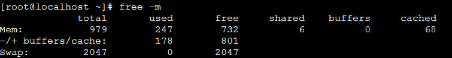

# 一、线程栈（thread dump）

## 1、概念

线程栈是某个时间点，JVM所有线程的活动状态的一个汇总；通过线程栈，可以查看某个时间点，各个线程正在做什么，通常使用线程栈来定位软件运行时的各种问题，例如 CPU 使用率特别高，或者是响应很慢，性能大幅度下滑

## 2、线程栈信息

线程栈包含了多个线程的活动信息，一个线程的活动信息通常看起来如下所示
```
"main" prio=10 tid=0x00007faac0008800 nid=0x9f0 waiting on condition [0x00007faac6068000]
   java.lang.Thread.State: TIMED_WAITING (sleeping)
        at java.lang.Thread.sleep(Native Method)
        at ThreadDump.main(ThreadDump.java:4)
```

- 线程的名字：其中 main 就是线程的名字，需要注意的是，当使用 Thread 类来创建一条线程，并且没有指定线程的名字时，这条线程的命名规则为 Thread-i，i 代表数字。如果使用 ThreadFactory 来创建线程，则线程的命名规则为 ** pool-i-thread-j**，i 和 j 分别代表数字；

- 线程的优先级：prio=10 代表线程的优先级为 10

- 线程 id：tid=0x00007faac0008800 代表线程 id 为 0x00007faac0008800，而** nid=0x9f0** 代表该线程对应的操作系统级别的线程 id。所谓的 nid，换种说法就是 native id。在操作系统中，分为内核级线程和用户级线程，JVM 的线程是用户态线程，内核不知情，但每一条 JVM 的线程都会映射到操作系统一条具体的线程；

- 线程的状态：java.lang.Thread.State: TIMED_WAITING (sleeping) 以及 waiting on condition 代表线程当前的状态；

- 线程占用的内存地址：[0x00007faac6068000] 代表当前线程占用的内存地址；

- 线程的调用栈：at java.lang.Thread.sleep(Native Method)* 以及它之后的相类似的信息，代表线程的调用栈

## 3、线程状态

- 代码1：

    ```java
    public static void main(String[] args) throws InterruptedException {
            int sum = 0;
            while (true) {
                int i = 0;
                int j = 1;
                sum = i + j;
            }
    }
    ```
    main 线程对应的线程栈就是

    ```java
    "main" prio=10 tid=0x00007fe1b4008800 nid=0x1292 runnable [0x00007fe1bd88f000]
    java.lang.Thread.State: RUNNABLE
            at ThreadDump.main(ThreadDump.java:7)
    ```
    其线程状态是：runnable

- 如果是以下代码，两个线程会竞争同一个锁，其中只有一个线程能获得锁，然后进行 sleep(time)，从而进入 TIMED_WAITING 状态，另外一个线程由于等待锁，会进入 BLOCKED 状态

    ```java
    public static void main(String[] args) throws InterruptedException {
        Thread t1 = new Thread(new Runnable() {
            @Override
            public void run() {
                try {
                    fun1();
                } catch (InterruptedException e) {
                    e.printStackTrace();
                }
            }
        });
        t1.setDaemon(false);
        t1.setName("MyThread1");
        Thread t2 = new Thread(new Runnable() {
            @Override
            public void run() {
                try {
                    fun2();
                } catch (InterruptedException e) {
                    e.printStackTrace();
                }
            }
        });
        t2.setDaemon(false);
        t2.setName("MyThread2");
        t1.start();
        t2.start();
        */
        
    }
    private static synchronized void fun1() throws InterruptedException {
        System.out.println("t1 acquire");
        Thread.sleep(Integer.MAX_VALUE);
    }
    private static synchronized void fun2() throws InterruptedException {
        System.out.println("t2 acquire");
        Thread.sleep(Integer.MAX_VALUE);
    }
    ```
    对应的线程栈为：
    ```
    "MyThread2" prio=10 tid=0x00007ff1e40b1000 nid=0x12eb waiting for monitor entry [0x00007ff1e07f6000]
    java.lang.Thread.State: BLOCKED (on object monitor)
            at ThreadDump.fun2(ThreadDump.java:45)
            - waiting to lock <0x00000000eb8602f8> (a java.lang.Class for ThreadDump)
            at ThreadDump.access$100(ThreadDump.java:1)
            at ThreadDump$2.run(ThreadDump.java:25)
            at java.lang.Thread.run(Thread.java:745)

    "MyThread1" prio=10 tid=0x00007ff1e40af000 nid=0x12ea waiting on condition [0x00007ff1e08f7000]
    java.lang.Thread.State: TIMED_WAITING (sleeping)
            at java.lang.Thread.sleep(Native Method)
            at ThreadDump.fun1(ThreadDump.java:41)
            - locked <0x00000000eb8602f8> (a java.lang.Class for ThreadDump)
            at ThreadDump.access$000(ThreadDump.java:1)
            at ThreadDump$1.run(ThreadDump.java:10)
            at java.lang.Thread.run(Thread.java:745)
    ```
    可以看到，t1 线程的调用栈里有这么一句 ** - locked <0x00000000eb8602f8> (a java.lang.Class for ThreadDump)**，说明它获得了锁，并且进行 sleep(sometime)操作，因此状态为 TIMED_WAITING。而 t2 线程由于获取不到锁，所以在它的调用栈里能看到 - waiting to lock <0x00000000eb8602f8> (a java.lang.Class for ThreadDump)，说明它正在等待锁，因此进入 BLOCKED 状态

- 对于 WAITING 状态的线程栈
    ```java
    private static final Object lock = new Object();
        public static void main(String[] args) throws InterruptedException {
            synchronized (lock) {
                lock.wait();
            }
        }
    ```

    得到的线程栈为：
    ```
    "main" prio=10 tid=0x00007f1fdc008800 nid=0x13fe in Object.wait() [0x00007f1fe1fec000]
    java.lang.Thread.State: WAITING (on object monitor)
        at java.lang.Object.wait(Native Method)
        - waiting on <0x00000000eb860640> (a java.lang.Object)
        at java.lang.Object.wait(Object.java:503)
        at ThreadDump.main(ThreadDump.java:7)
        - locked <0x00000000eb860640> (a java.lang.Object)
    ```

## 3、如何输出线程栈

由于线程栈反映的是 JVM 在某个时间点的线程状态，因此分析线程栈时，为避免偶然性，有必要多输出几份进行分析

- （1）获得JVM进程ID
    - jps 命令：
    ```
    [root@localhost ~]# jps
    5163 ThreadDump
    5173 Jps
    ```
    - ps -ef | grep java
    ```
    [root@localhost ~]# ps -ef | grep java
    root       5163   2479  0 01:18 pts/0    00:00:00 java ThreadDump
    root       5185   2553  0 01:18 pts/1    00:00:00 grep --color=auto java
    ```

- （2）获取线程栈信息
    - jstack命令：JDK自带
        ```
        [root@localhost ~]# jstack 5163
        ```
        详细日志查看：[threadump](https://github.com/chenlanqing/learningNote/blob/master/Java/log/threadump.md)

    - kill -3 [pid]

        Java虚拟机提供了线程转储(Thread dump)的后门， 通过这个后门， 可以将线程堆栈打印出来，这个后门就是通过向Java进程发送一个QUIT信号， Java虚拟机收到该信号之后， 将系统当前的JAVA线程调用堆栈打印出来；

## 4、如何使用线程栈定位问题

### 4.1、发现死锁

当两个或多个线程正在等待被对方占有的锁，死锁就会发生。死锁会导致两个线程无法继续运行，被永远挂起

下列代码发生死锁：
```java
ublic class ThreadDump {    
    public static void main(String[] args) throws InterruptedException {
        Object lock1 = new Object();
        Object lock2 = new Object();        
        new Thread1(lock1, lock2).start();
        new Thread2(lock1, lock2).start();
    }
    private static class Thread1 extends Thread {
        Object lock1 = null;
        Object lock2 = null;        
        public Thread1(Object lock1, Object lock2) {
            this.lock1 = lock1;
            this.lock2 = lock2;
            this.setName(getClass().getSimpleName());
        }        
        public void run() {
            synchronized (lock1) {
                try {
                    Thread.sleep(2);
                } catch(Exception e) {
                    e.printStackTrace();
                }                
                synchronized (lock2) {                    
                }
            }
        }
    }
    
    private static class Thread2 extends Thread {
        Object lock1 = null;
        Object lock2 = null;        
        public Thread2(Object lock1, Object lock2) {
            this.lock1 = lock1;
            this.lock2 = lock2;
            this.setName(getClass().getSimpleName());
        }        
        public void run() {
            synchronized (lock2) {
                try {
                    Thread.sleep(2);
                } catch(Exception e) {
                    e.printStackTrace();
                }                
                synchronized (lock1) {
                    
                }
            }
        }
    }
}
```

对线线程栈为：
```
"Thread2" prio=10 tid=0x00007f9bf40a1000 nid=0x1472 waiting for monitor entry [0x00007f9bf8944000]
   java.lang.Thread.State: BLOCKED (on object monitor)
        at ThreadDump$Thread2.run(ThreadDump.java:63)
        - waiting to lock <0x00000000eb860498> (a java.lang.Object)
        - locked <0x00000000eb8604a8> (a java.lang.Object)

"Thread1" prio=10 tid=0x00007f9bf409f000 nid=0x1471 waiting for monitor entry [0x00007f9bf8a45000]
   java.lang.Thread.State: BLOCKED (on object monitor)
        at ThreadDump$Thread1.run(ThreadDump.java:38)
        - waiting to lock <0x00000000eb8604a8> (a java.lang.Object)
        - locked <0x00000000eb860498> (a java.lang.Object)

Found one Java-level deadlock:
=============================
"Thread2":
  waiting to lock monitor 0x00007f9be4004f88 (object 0x00000000eb860498, a java.lang.Object),
  which is held by "Thread1"
"Thread1":
  waiting to lock monitor 0x00007f9be40062c8 (object 0x00000000eb8604a8, a java.lang.Object),
  which is held by "Thread2"

Java stack information for the threads listed above:
===================================================
"Thread2":
        at ThreadDump$Thread2.run(ThreadDump.java:63)
        - waiting to lock <0x00000000eb860498> (a java.lang.Object)
        - locked <0x00000000eb8604a8> (a java.lang.Object)
"Thread1":
        at ThreadDump$Thread1.run(ThreadDump.java:38)
        - waiting to lock <0x00000000eb8604a8> (a java.lang.Object)
        - locked <0x00000000eb860498> (a java.lang.Object)

Found 1 deadlock.
```
可以看到，当发生了死锁的时候，堆栈中直接打印出了死锁的信息** Found one Java-level deadlock: **，并给出了分析信息

### 4.2、定位 CPU 过高的原因

首先需要借助操作系统提供的一些工具，来定位消耗 CPU 过高的 native 线程。不同的操作系统，提供的不同的 CPU 统计命令如下所示：

操作系统|	solaris	|linux	|aix
-------|----------|--------|-----
命令名称|`prstat -L <pid>`|`top -p <pid`>|ps -emo THREAD

以 Linux 为例，首先通过 `top -p <pid>` 输出该进程的信息，然后输入 H，查看所有的线程的统计情况
```
top - 02:04:54 up  2:43,  3 users,  load average: 0.10, 0.05, 0.05
Threads:  13 total,   0 running,  13 sleeping,   0 stopped,   0 zombie
%Cpu(s):  97.74 us,  0.2 sy,  0.0 ni, 2.22 id,  0.0 wa,  0.0 hi,  0.0 si,  0.0 st
KiB Mem:   1003456 total,   722012 used,   281444 free,        0 buffers
KiB Swap:  2097148 total,    62872 used,  2034276 free.    68880 cached Mem

PID USER PR NI VIRT RES SHR S %CPU %MEM TIME+ COMMAND
3368 zmw2 25 0 256m 9620 6460 R 93.3 0.7 5:42.06 java
3369 zmw2 15 0 256m 9620 6460 S 0.0 0.7 0:00.00 java
3370 zmw2 15 0 256m 9620 6460 S 0.0 0.7 0:00.00 java
3371 zmw2 15 0 256m 9620 6460 S 0.0 0.7 0:00.00 java
3372 zmw2 15 0 256m 9620 6460 S 0.0 0.7 0:00.00 java
3373 zmw2 15 0 256m 9620 6460 S 0.0 0.7 0:00.00 java
3374 zmw2 15 0 256m 9620 6460 S 0.0 0.7 0:00.00 java
3375 zmw2 15 0 256m 9620 6460 S 0.0 0.7 0:00.00 java
```
这个命令输出的PID代表的是 native 线程的id，如上所示，id为 3368 的 native 线程消耗 CPU最高。在Java ThreadDump文件中，每个线程都有`tid=...nid=...`的属性，其中nid就是native thread id，只不过nid中用16进制来表示。例如上面的例子中3368的十六进制表示为0xd28.在Java线程中查找nid=0xd28即是本地线程对应Java线程

```
"main" prio=1 tid=0x0805c988 nid=0xd28 runnable [0xfff65000..0xfff659c8]
at java.lang.String.indexOf(String.java:1352)
at java.io.PrintStream.write(PrintStream.java:460)
- locked <0xc8bf87d8> (a java.io.PrintStream)
at java.io.PrintStream.print(PrintStream.java:602)
at MyTest.fun2(MyTest.java:16)
- locked <0xc8c1a098> (a java.lang.Object)
at MyTest.fun1(MyTest.java:8)
- locked <0xc8c1a090> (a java.lang.Object)
at MyTest.main(MyTest.java:26)
```
导致 CPU 过高的原因有以下几种原因：
- Java 代码死循环
- Java 代码使用了复杂的算法，或者频繁调用
- JVM 自身的代码导致 CPU 很高

如果在Java线程堆栈中找到了对应的线程ID,并且该Java线程正在执行Native code,说明导致CPU过高的问题代码在JNI调用中，此时需要打印出 Native 线程的线程栈，在 linux 下，使用 `pstack <pid>` 命令。

如果在 native 线程堆栈中可以找到对应的消耗 CPU 过高的线程 id，可以直接定位为 native 代码的问题;

PS：十进制转换为16进制：`printf '%x\n' 6642`

### 4.3、定位性能下降原因

性能下降一般是由于资源不足所导致。如果资源不足， 那么有大量的线程在等待资源， 打印的线程堆栈如果发现大量的线程停在同样的调用上下文上， 那么就说明该系统资源是瓶颈；

导致资源不足的原因可能有：
- 资源数量配置太少（如连接池连接配置过少等），而系统当前的压力比较大，资源不足导致了某些线程不能及时获得资源而等待在那里(即挂起)；
- 获得资源的线程把持资源时间太久， 导致资源不足，例如以下代码：
    ```
    void fun1() {
        Connection conn = ConnectionPool.getConnection();//获取一个数据库连接
        //使用该数据库连接访问数据库
        //数据库返回结果，访问完成
        //做其它耗时操作,但这些耗时操作数据库访问无关，
        conn.close(); //释放连接回池
    }
    ```
- 设计不合理导致资源占用时间过久，如SQL语句设计不恰当，或者没有索引导致的数据库访问太慢等；
- 资源用完后，在某种异常情况下，没有关闭或者回池，导致可用资源泄漏或者减少，从而导致资源竞；

### 4.4、定位系统假死原因

导致系统挂死的原因有很多，其中有一个最常见的原因是线程挂死。每次打印线程堆栈，该线程必然都在同一个调用上下文上，因此定位该类型的问题原理是，通过打印多次堆栈，找出对应业务逻辑使用的线程， 通过对比前后打印的堆栈确认该线程执行的代码段是否一直没有执行完成。 通过打印多次堆栈，找到挂起的线程（即不退出）；

导致线程无法退出的原因可能有：
- 线程正在执行死循环的代码
- 资源不足或者资源泄漏，造成当前线程阻塞在锁对象上（即wait在锁对象上），长期得不到唤醒(notify)。
- 如果当前程序和外部通信，当外部程序挂起无返回时，也会导致当前线程挂起

# 二、Heap Dump分析

常见配置：`-XX:+HeapDumpOnOutOfMemoryError -XX:HeapDumpPath=. -XX:+PrintGCDateStamps -XX:+PrintGCDetails -Xloggc:gc.log -XX:+UseGCLogFileRotation -XX:NumberOfGCLogFiles=10 -XX:GCLogFileSize=100M`

## 1、发生OOM之后

如果OOM发生之后，想办法得到Heap dump
- 项目启动之初，给定虚拟机餐厨：`-XX:+HeapDumpOnOutOfMemoryError`
- 通过jmap命令获取：`jmap -dump:live,format=b,file=<filepath> <pid>`

## 2、OOM可能原因

- 代码问题；
- 配置问题；
- 内存不够

90%的问题都是代码问题

## 3、Heap Dump分析

- 如果是Metaspace/PermGen OOM，一般是Class对象问题；
- 如果是Heap Space OOME，瞄准占空间最大的对象；

# 三、线上问题排查思路


[Java 线上问题排查思路与工具使用](https://blog.csdn.net/gitchat/article/details/79019454)

## 1、常见线上问题
所有 Java 服务的线上问题从系统表象来看归结起来总共有四方面：CPU、内存、磁盘、网络，基于这些现象我们可以将线上问题分成两大类: 系统异常、业务服务异常

- **系统异常**

    常见的系统异常现象包括：CPU 占用率过高、CPU 上下文切换频率次数较高、磁盘满了、磁盘 I/O 过于频繁、网络流量异常（连接数过多）、系统可用内存长期处于较低值（导致oom killer）等等；

    这些问题可以通过 top（cpu）、free（内存）、df（磁盘）、dstat（网络流量)=）、pstack、vmstat、strace（底层系统调用）等工具获取系统异常现象数据

- **业务异常**

    常见的业务服务异常现象包括: PV 量过高、服务调用耗时异常、线程死锁、多线程并发问题、频繁进行 Full GC、异常安全攻击扫描等

## 2、问题定位

一般会采用排除法，从外部排查到内部排查的方式来定位线上服务问题：
- 首先我们要排除其他进程 (除主进程之外) 可能引起的故障问题；
- 然后排除业务应用可能引起的故障问题；
- 可以考虑是否为运营商或者云服务提供商所引起的故障

### 2.1、定位流程

- 系统异常排查流程

    

- 业务异常排查流程

    

## 3、Linux常用的性能分析工具

Linux 常用的性能分析工具使用包括：top（cpu）、free（内存）、df（磁盘）、dstat（网络流量)=）、pstack、vmstat、strace（底层系统调用）

### 3.1、CPU

CPU 是系统重要的监控指标，能够分析系统的整体运行状况。监控指标一般包括运行队列、CPU 使用率和上下文切换等；

top命令是Linux下常用的CPU性能分析工具，能够实时显示系统中各个进程的资源占用状况，常用于服务端性能分析


top命令显示了各个进程CPU使用情况，一般CPU使用率从高到低排序展示输出。其中Load Average显示最近1分钟、5分钟和15分钟的系统平均负载，上图各值为0.33、0.15、0.05

一般会关注 CPU 使用率最高的进程

- PID : 进程 id
- USER : 进程所有者
- PR : 进程优先级
- NI : nice 值。负值表示高优先级，正值表示低优先级
- VIRT : 进程使用的虚拟内存总量，单位 kb。VIRT=SWAP+RES
- RES : 进程使用的、未被换出的物理内存大小，单位 kb。RES=CODE+DATA
- SHR : 共享内存大小，单位 kb
- S : 进程状态。D= 不可中断的睡眠状态 R= 运行 S= 睡眠 T= 跟踪 / 停止 Z= 僵尸进程
- %CPU : 上次更新到现在的 CPU 时间占用百分比
- %MEM : 进程使用的物理内存百分比
- TIME+ : 进程使用的 CPU 时间总计，单位 1/100 秒
- COMMAND : 进程名称

查询占用CPU高的线程ID
- 通过 `top` 命令找到占用cpu最高的 `pid[进程id]`；
- 通过 `top -Hp pid` 查看进程中占用cpu过高的 `tid[线程id]`；
- 通过 `printf  pid |grep tid` 把`线程id`转化为十六进制；
- 通过 `jstack pid | grep tid -A 30` 定位线程堆栈信息

### 3.2、内存

内存是排查线上问题的重要参考依据，内存问题很多时候是引起 CPU 使用率较高的见解因素

系统内存：free是显示的当前内存的使用，-m 的意思是 M 字节来显示内容



部分参数：
- total 内存总数: 979M
- used 已经使用的内存数: 247M
- free 空闲的内存数: 732M
- shared 当前已经废弃不用 , 总是 0
- buffers Buffer 缓存内存数: 0M

jvm old区占用过高排查思路：
- `top`查看占用cpu高的进程
- `jstat -gcutil pid` 时间间隔 查看gc状况
- `jmap -dump:format=b,file=name.dump pid`  导出dump文件
- 用visualVM分析dump文件

### 3.3、磁盘

- df
```
[root@localhost ~]# df -h
文件系统                 容量   已用   可用   已用%   挂载点
/dev/mapper/centos-root   18G  1.6G   16G    9%     /
devtmpfs                 484M     0  484M    0%     /dev
tmpfs                    490M     0  490M    0%     /dev/shm
tmpfs                    490M  6.6M  484M    2%     /run
tmpfs                    490M     0  490M    0%     /sys/fs/cgroup
/dev/sda1                497M   96M  401M   20%     /boot
```
- du命令是查看当前指定文件或目录（会递归显示子目录）占用磁盘空间大小

### 3.4、网络

dstat 命令可以集成了 vmstat、iostat、netstat 等等工具能完成的任务， 

dstat参数：
- -c：cpu 情况
- -d：磁盘读写
- -n：网络状况
- -l：显示系统负载
- -m：显示形同内存状况
- -p：显示系统进程信息
- -r：显示系统IO 情况

```
root@localhost ~]# dstat
You did not select any stats, using -cdngy by default.
----total-cpu-usage---- -dsk/total- -net/total- ---paging-- ---system--
usr sys idl wai hiq siq| read  writ| recv  send|  in   out | int   csw 
  0   1  99   1   0   0| 113k   22k|   0     0 |   0     0 |  53   103 
  0   0 100   0   0   0|   0     0 | 180B  934B|   0     0 |  21    20 
  0   0 100   0   0   0|   0     0 |  60B  406B|   0     0 |  20    19 
  0   0 100   0   0   0|   0     0 | 120B  406B|   0     0 |  16    12 
  0   0 100   0   0   0|   0     0 | 419B  346B|   0     0 |  27    33 
  0   0 100   0   0   0|   0     0 | 180B  346B|   0     0 |  18    18 
  0   1  99   0   0   0|   0   396k| 120B  346B|   0     0 |  76   133 
  0   0 100   0   0   0|   0     0 | 212B  346B|   0     0 |  36    57 
  0   0 100   0   0   0|   0     0 |  60B  346B|   0     0 |  38    55 
  0   0 100   0   0   0|   0     0 | 212B  466B|   0     0 |  41    63 
  0   0 100   0   0   0|   0     0 | 451B  346B|   0     0 |  44    70 
  0   0 100   0   0   0|   0     0 | 212B  346B|   0     0 |  38    58 
```

### 3.5、其他

vmstat：是Virtual Meomory Statistics（虚拟内存统计）的缩写，是实时系统监控工具；该命令通过使用 knlist 子程序和 /dev/kmen 伪设备驱动器访问这些数据，输出信息直接打印在屏幕

## 4、常见线上问题排查思路

### 4.1、Full GC次数过多

**问题特征：**
- 线上多个线程的CPU都超过了100%，通过jstack命令可以看到这些线程主要是垃圾回收线程
- 通过jstat命令监控GC情况，可以看到Full GC次数非常多，并且次数在不断增加：`jstat -gcutil pid` 查看内存使用和 gc 情况

**排查过程：**
- 通过 `top` 命令找到占用cpu最高的 `pid[进程id]`；
- 通过 `top -Hp pid` 查看进程中占用cpu过高的 `tid[线程id]`；
- 通过 `printf  pid |grep tid` 把`线程id`转化为十六进制；
- 通过 `jstack pid | grep tid -A 30` 定位线程堆栈信息

总结来说，对于Full GC次数过多，主要有以下两种原因：
- 代码中一次获取了大量的对象，导致内存溢出，此时可以通过eclipse的mat工具查看内存中有哪些对象比较多；
- 内存占用不高，但是Full GC次数还是比较多，此时可能是显示的 System.gc()调用导致GC次数过多，这可以通过添加 -XX:+DisableExplicitGC来禁用JVM对显示GC的响应

**持续 FullGC：**

[CMS引起的持续Full GC](../Java虚拟机/JVM-GC垃圾回收机制.md#64CMS中YoungGc的实现过程)

**频繁Full GC**
- 首先想到的是要先紧急处理，然后再分析原因，紧急处理大概有三种可选方案：重启、限流、扩容  三板斧；
- 其次，明确方向，一般来说，引起full gc的主要原因有两大类：
    - 一是应用资源配置问题，资源配置这块，要检查jvm参数配置是否合理；
    - 二是程序问题。大部分full gc都是由程序问题引起得，主要有两方面原因，一是程序存在大对象，二是存在内存泄漏；
- 最重要的一点，分析dump文件，但是要保证取得事发时内存快照，分析软件可以用MAT和VisualVM，对于我们遇到的这个问题，其实还可以用jstack获取当前进程所有的线程进行分析；
- Full GC时要及时告警，避免开发响应滞后于业务，另外，在实践中要合理设置JVM参数，这样也可以尽量避免full gc；

### 4.2、CPU过高

- [CPU-100%问题排查](https://mp.weixin.qq.com/s/goL4USSfLOtBxjSENnP0Qg)

- CPU过高可能是系统频繁的进行Full GC，导致系统缓慢；
- Full GC次数过多
- 无限while循环
- 频繁GC
- 频繁创建新的对象：合理使用单例
- 序列化与反序列化
- 正则表达式
- 频繁的线程上下文切换

排查过程：
- `top`：使用top查找到使用 CPU 最多的某个进程，记录它的 pid。使用 Shift + P 快捷键可以按 CPU 的使用率进行排序
- `top -Hp $PID`：再次使用 top 命令，加 -H 参数，查看某个进程中使用 CPU 最多的某个线程，记录线程的 ID
- `printf %x $tid`：使用 printf 函数，将十进制的 tid 转化成十六进制，为后面查找 jstack 日志做准备
- `jstack 进程PID | vim +/十六进制线程PID`，例如：`jstack 1040|vim +/0x431`

### 4.3、不定期出现的接口耗时现象

首先找到该接口，通过压测工具不断加大访问力度，如果说该接口中有某个位置是比较耗时的，由于我们的访问的频率非常高，那么大多数的线程最终都将阻塞于该阻塞点，这样通过多个线程具有相同的堆栈日志，我们基本上就可以定位到该接口中比较耗时的代码的位置

### 4.4、某个线程进入WAITING状态

正常情况下，线上大多数线程都是处于`TIMED_WAITING`状态。

解决这个问题的思路主要如下：
- 通过grep在jstack日志中找出所有的处于`TIMED_WAITING`状态的线程，将其导出到某个文件中；
- 等待一段时间之后，比如10s，再次对jstack日志进行grep，将其导出到另一个文件：`jstack -l pid | grep BLOCKED`
- 重复步骤2，待导出`3~4`个文件之后，我们对导出的文件进行对比，找出其中在这几个文件中一直都存在的用户线程，这个线程基本上就可以确认是包含了处于等待状态有问题的线程。因为正常的请求线程是不会在20~30s之后还是处于等待状态的。
- 经过排查得到这些线程之后，我们可以继续对其堆栈信息进行排查，如果该线程本身就应该处于等待状态，比如用户创建的线程池中处于空闲状态的线程，那么这种线程的堆栈信息中是不会包含用户自定义的类的。这些都可以排除掉，而剩下的线程基本上就可以确认是我们要找的有问题的线程。通过其堆栈信息，我们就可以得出具体是在哪个位置的代码导致该线程处于等待状态了；

### 4.5、死锁

#### 4.5.1、java死锁

jstack可以帮助我们检查死锁，并且在日志中打印具体的死锁线程信息

#### 4.5.2、数据库死锁

通过命令查找死锁信息：`SHOW ENGINE INNODB STATUS`，一般日志里会记录产生死锁的SQL

### 4.6、长时间GC停顿

可能导致GC长暂停的不同场景：

#### 4.6.1、碎片化

正是因为碎片化问题--CMS最致命的缺陷，导致这个统治了OLAP系统十多年的垃圾回收器直接退出历史舞台。

对于于CMS，由于老年代的碎片化问题，在YGC时可能碰到晋升失败（promotion failures，即使老年代还有足够多有效的空间，但是仍然可能导致分配失败，因为没有足够连续的空间），从而触发Concurrent Mode Failure，发生会完全STW的FullGC；

为什么CMS场景下会有碎片化问题？由于CMS在老年代回收时，采用的是标记清理（Mark-Sweep）算法，它在垃圾回收时并不会压缩堆，日积月累，导致老年代的碎片化问题会越来越严重，直到发生单线程的Mark-Sweep-Compact GC，即FullGC，会完全STW。如果堆比较大的话，STW的时间可能需要好几秒，甚至十多秒，几十秒都有可能

#### 4.6.2、GC时操作系统的活动

当发生GC时，一些操作系统的活动，比如swap，可能导致GC停顿时间更长，这些停顿可能是几秒，甚至几十秒级别。

如果你的系统配置了允许使用swap空间，操作系统可能把JVM进程的非活动内存页移到swap空间，从而释放内存给当前活动进程（可能是操作系统上其他进程，取决于系统调度）。Swapping由于需要访问磁盘，所以相比物理内存，它的速度慢的令人发指。所以，如果在GC的时候，系统正好需要执行Swapping，那么GC停顿的时间一定会非常非常非常恐怖；

#### 4.6.3、堆空间不够

如果应用程序需要的内存比我们执行的Xmx还要大，也会导致频繁的垃圾回收，甚至OOM。由于堆空间不足，对象分配失败，JVM就需要调用GC尝试回收已经分配的空间，但是GC并不能释放更多的空间，从而又回导致GC，进入恶性循环。应用运行时，频繁的FullGC会引起长时间停顿；

如果在老年代的空间不够的话，也会导致频繁FullGC，这类问题比较好办，给足老年代和永久代

#### 4.6.4、JVM Bug

有时候，GC的长时间停顿就有可能是BUG引起的。例如，下面列举的这些JVM的BUG，就可能导致Java应用在GC时长时间停顿

#### 4.6.5、显示System.gc调用

检查是否有显示的System.gc调用，应用中的一些类里，或者第三方模块中调用System.gc调用从而触发STW的FullGC，也可能会引起非常长时间的停顿。

如果你使用了RMI，能观察到固定时间间隔的FullGC，也是由于RMI的实现调用了System.gc。这个时间间隔可以通过系统属性配置：
```
-Dsun.rmi.dgc.server.gcInterval=7200000
-Dsun.rmi.dgc.client.gcInterval=7200000
```
JDK 1.4.2和5.0的默认值是60000毫秒，即1分钟；JDK6以及以后的版本，默认值是3600000毫秒，即1个小时.

如果你要关闭通过调用System.gc()触发FullGC，配置JVM参数`-XX:+DisableExplicitGC`即可；

#### 4.6.6、如何排查解决

- 配置JVM参数：`-XX:+PrintGCDetails -XX:+PrintHeapAtGC -XX:+PrintGCTimeStamps -XX:+PrintGCDateStamps and -XX:+PrintGCApplicationStoppedTime`. 如果是CMS，还需要添加`-XX:PrintFLSStatistics=2`，然后收集GC日志。因为GC日志能告诉我们GC频率，是否长时间停顿等重要信息。
- 使用vmstat, iostat, netstat和mpstat等工具监控系统全方位健康状况。
- 使用GCHisto工具可视化分析GC日志，弄明白消耗了很长时间的GC，以及这些GC的出现是否有一定的规律。
- 尝试从GC日志中能否找出一下JVM堆碎片化的表征。
- 监控指定应用的堆大小是否足够。
- 检查你运行的JVM版本，是否有与长时间停顿相关的BUG，然后升级到修复问题的最新JDK。

### 4.7、线程池

#### 4.7.1、线程池满了

Java 线程池以有界队列的线程池为例，当新任务提交时，如果运行的线程少于 corePoolSize，则创建新线程来处理请求。如果正在运行的线程数等于 corePoolSize 时，则新任务被添加到队列中，直到队列满。当队列满了后，会继续开辟新线程来处理任务，但不超过 maximumPoolSize。当任务队列满了并且已开辟了最大线程数，此时又来了新任务，ThreadPoolExecutor 会拒绝服务。

**下游 RT 高，超时时间不合理：**
- 业务监控
- sunfire
- eagleeye

**数据库慢 sql 或者数据库死锁：**
- 日志关键字 “Deadlock found when trying to get lock”
- Jstack 或 zprofiler 查看阻塞态线程；

**Java 代码死锁：**
- `jstack –l pid | grep -i –E 'BLOCKED | deadlock'`
- dump thread 通过 zprofiler 分析阻塞线程和持锁情况

#### 4.7.2、线程池拒绝策略引发Full GC

- [线程池拒绝策略引发Full GC问题分析](https://mp.weixin.qq.com/s?__biz=Mzg3NjU3NTkwMQ==&mid=2247551081&idx=1&sn=1bd4c366fa2aecdb2ee1ebe7ceb78ae6&scene=21)

### 4.8、NoSuchMethodException

**jar 包冲突：**

java 在装载一个目录下所有 jar 包时，它加载的顺序完全取决于操作系统。
- `mvn dependency:tree` 分析报错方法所在的 jar 包版本，留下新的
- `arthas：sc -d ClassName`
- `XX：+TraceClassLoading`

## 5、Redis线上问题

### 5.1、问题处理思路


### 5.2、内存告警

如果出现如下异常提示信息：
```
OOM command not allowed when used memory
```
**设置合理的内存大小：**

设置maxmemory和相对应的回收策略算法，设置最好为物理内存的3/4，或者比例更小，因为redis复制数据等其他服务时，也是需要缓存的，以防缓存数据过大导致redis崩溃，造成系统出错不可用
- 通过redis.conf配置文件指定：`maxmemory xxx`
- 通过命令修改：`config set maxmemory xxx`

**设置合理的内存淘汰策略：**

[Redis数据淘汰](../分布式/Redis与Memcached.md#2Redis数据淘汰策略)

**查看大key：**

- 有工具的情况下，安装工具dbatools redisTools,列出最大的前N个key：`/data/program/dbatools-master/redisTools/redis-cli-new -h <ip> -p <port> --bigkeys --bigkey-numb 3`
- 原生命令：`/usr/local/redis-3.0.5/src/redis-cli -c -h <ip> -p <port> --bigkeys`
- 分析rdb文件中的全部key/某种类型的占用量：`rdb -c memory dump.rdb -t list -f dump-formal-list.csv`
- 无工具情况下：`debug object key`

### 5.3、Redis的慢命令

**设置Redis的慢命令的时间阈值(单位：微秒)**
- 通过redis.conf命令：
    ```
    # 执行时间大于多少微秒(microsecond，1秒 = 1,000,000 微秒)的查询进行记录。
    slowlog-log-lower-than 1000
    # 最多能保存多少条日志
    slowlog-max-len 200
    ```
- 通过命令方式：
    ```
    # 配置查询时间超过1毫秒的， 第一个参数单位是微秒
    config set slowlog-log-lower-than 1000
    # 保存200条慢查记录
    config set slowlog-max-len 200
    ```

**查看Redis的慢命令：** `slowlog get`

### 5.4、连接过多

- 通过redis.conf 配置文件指定最大连接数：`maxclients 10000`
- 通过命令行：`config set maxclients xxx`

### 5.5、线上Redis节点挂掉一个之后的处理流程

**查看节点状态：**

执行 cluster nodes 后发现会有一个节点dead

**移除错误的节点**

## 6、MySQL应用连接

比如，遇到这样的场景，发现应用很多请求都卡死了，查看堆栈发现很多都卡在查询数据库上了，可以通过查询服务器上MySQL的端口连接数；
```bash
netstat -anp | grep 3306 | wc -l
```

# 四、Java动态追踪技术

## 1、直接操作字节码

ASM

## 2、btrace

BTrace是基于Java语言的一个安全的、可提供动态追踪服务的工具。BTrace基于ASM、Java Attach Api、Instruments开发，为用户提供了很多注解；

BTrace主要有下面几个模块：
- BTrace脚本：利用BTrace定义的注解，我们可以很方便地根据需要进行脚本的开发。
- Compiler：将BTrace脚本编译成BTrace class文件。
- Client：将class文件发送到Agent。
- Agent：基于Java的Attach Api，Agent可以动态附着到一个运行的JVM上，然后开启一个BTrace Server，接收client发过来的BTrace脚本；解析脚本，然后根据脚本中的规则找到要修改的类；修改字节码后，调用Java Instrument的reTransform接口，完成对对象行为的修改并使之生效

## 3、Arthas

(https://alibaba.github.io/arthas/index.html)


**1、Java 基础、线程池、JVM**

Java 应用线上问题排查思路、常用工具小结：https://ricstudio.top/archives/java-online-question-probe

详解一次由读写锁引起的内存泄漏 ：https://mp.weixin.qq.com/s/UPCIgL0_SLyOF5SNFgL27w

一次 Java 线程池误用引发的血案（OOM）和总结 - 文西（字节架构师）：https://zhuanlan.zhihu.com/p/32867181

一次线程池引发的线上故障分析：https://mp.weixin.qq.com/s/wFePJPkGv5v34GpalGOkYw

线程池运用不当的一次线上事故：https://www.heapdump.cn/article/646639

Java 中 9 种常见的 CMS GC 问题分析与解决: https://tech.meituan.com/2020/11/12/java-9-cms-gc.html

**2、MySQL 死锁、事务、编码、慢查询**

MySQL死锁系列-线上死锁问题排查思路:https://cloud.tencent.com/developer/article/1722416

一个诡异的 MySQL 查询超时问题，居然隐藏着存在了两年的 BUG：https://www.cnblogs.com/coderw/p/14676343.html

MySQL 可重复读，差点就让我背上了一个 P0 事故！：https://mp.weixin.qq.com/s/1nd0OE_6FKklus0FpOlTlA

慢查询引发的车祸现场，案例分析！：https://mp.weixin.qq.com/s/sL64uQP0iHKxkMFx1QGLkg

为什么不建议在MySQL中使用UTF-8？: https://mp.weixin.qq.com/s/X_OV4aUeJiFN9DIWMNpICA

**3、Redis 高可用、高性能、分布式锁**

Redis为什么变慢了？一文讲透如何排查Redis性能问题 | 万字长文：https://mp.weixin.qq.com/s/Qc4t_-_pL4w8VlSoJhRDcg

如何从0到1构建一个稳定、高性能的Redis集群？（附16张图解）：https://mp.weixin.qq.com/s/q79ji-cgfUMo7H0p254QRg

颠覆认知——Redis会遇到的15个「坑」，你踩过几个？：https://mp.weixin.qq.com/s/CHtZI9k2qQ_YJb5Mwzrukw

Redis——由分布式锁造成的重大事故：https://juejin.cn/post/6854573212831842311

**4、Kafka**

一次 Kafka 消息堆积问题排查：https://mp.weixin.qq.com/s/VgXukc39tFBXrR0yKg7vdA

记一次 Kafka 重启失败问题排查：https://mp.weixin.qq.com/s/ee7_mhxnj05DxK3EJihyfQ

记一次 Kafka 集群线上扩容：https://mp.weixin.qq.com/s/n2dMrs21nUU15Vza0VV1pA


**5、 Spring Boot**

警惕 Spring Boot Actuator 引发的安全问题 - Kirito 的技术分享：https://mp.weixin.qq.com/s/tC-QjYZVMhCCvIsBX-z9zw

**6、网络**

万字长文让你掌握网络问题排查技巧！：https://mp.weixin.qq.com/s/nEMSqw7nPR_WaZ19gh810A


# 参考资料

* [Btrace简介](https://www.jianshu.com/p/dbb3a8b5c92f)
* [使用线程栈](https://www.jianshu.com/p/e92532f29349)
* [Java 线上问题排查思路与工具使用](https://blog.csdn.net/gitchat/article/details/79019454)
* [java问题排查工具单](https://yq.aliyun.com/articles/69520?utm_content=m_10360)
* [Java问题排查工具箱](https://mp.weixin.qq.com/s/X4l9LhjZybqr5jc7RLfcOA)
* [Java线上问题排查套路](https://mp.weixin.qq.com/s?__biz=MzI4ODQ3NjE2OA==&mid=2247486948&idx=1&sn=54cec00fabc562384ac72266e003cbbd)
* [线程堆栈分析](http://fastthread.io/)
* [系统问题、CPU、FullGC问题排查思路](https://mp.weixin.qq.com/s/wTEMbOGiXA8xfyFascoMpA)
* [问题排查与优化手册](https://developer.aliyun.com/article/767550?utm_content=g_1000152822)
* [JVM问题排除思路](https://mp.weixin.qq.com/s/zshcVuQreAB8YHwjBL0EmA)
