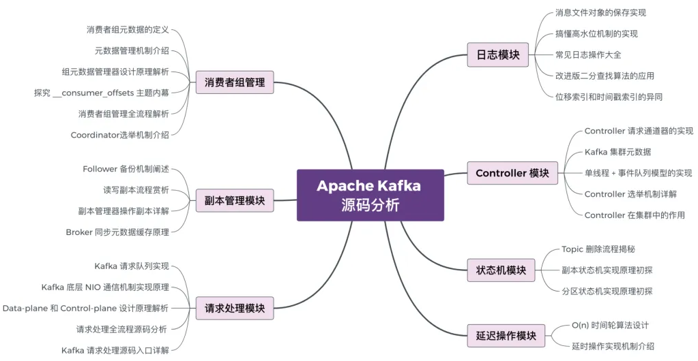

# 一、源码

## 1、源码导入idea

- （1）安装JDK、gradle 环境；
- （2）下载kafka源码；
- （3）执行kafka文件的中的：`./gradlew`
- （4）因为kafka需要生成对应的java类（org.apache.kafka.common.message包的类），需要打包命令：`./gradlew jar` 或者`./gradlew clean releaseTarGz`

## 2、源码模块说明

# 二、日志模块

# 三、请求处理模块

# 四、Controller模块

https://mp.weixin.qq.com/s/UdzdvSymNeu_99JUTHMOuQ