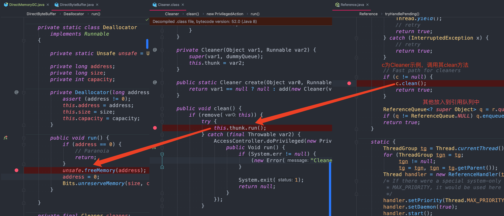

# 1、概述

Unsafe是位于`sun.misc`包下的一个类，主要提供一些用于执行低级别、不安全操作的方法，如直接访问系统内存资源、自主管理内存资源等，这些方法在提升Java运行效率、增强Java语言底层资源操作能力方面起到了很大的作用。但由于Unsafe类使Java语言拥有了类似C语言指针一样操作内存空间的能力，这无疑也增加了程序发生相关指针问题的风险。在程序中过度、不正确使用Unsafe类会使得程序出错的概率变大，使得Java这种安全的语言变得不再“安全”，因此对Unsafe的使用一定要慎重；

## 1.1、基本介绍


如下Unsafe源码所示，Unsafe类为一单例实现，提供静态方法getUnsafe获取Unsafe实例，当且仅当调用getUnsafe方法的类为引导类加载器所加载时才合法，否则抛出SecurityException异常：
```java
public final class Unsafe {
    private static final Unsafe theUnsafe;
    private Unsafe() {
    }
    @CallerSensitive
    public static Unsafe getUnsafe() {
        Class var0 = Reflection.getCallerClass();
        // 仅在引导类加载器 BootstrapClassLoader 加载时才合法
        if (!VM.isSystemDomainLoader(var0.getClassLoader())) {
            throw new SecurityException("Unsafe");
        } else {
            return theUnsafe;
        }
    }
}
```

从源码中发现，内部使用自旋的方式进行CAS更新(while循环进行CAS更新，如果更新失败，则循环再次重试)。

又从Unsafe类中发现，原子操作其实只支持下面三个方法：
```java
public final native boolean compareAndSwapObject(Object paramObject1, long paramLong, Object paramObject2, Object paramObject3);
public final native boolean compareAndSwapInt(Object paramObject, long paramLong, int paramInt1, int paramInt2);
public final native boolean compareAndSwapLong(Object paramObject, long paramLong1, long paramLong2, long paramLong3);
```

## 1.2、如何使用

### 1.2.1、方式一：设置包路径

从getUnsafe方法的使用限制条件出发，通过Java命令行命令`-Xbootclasspath/a`把调用Unsafe相关方法的类A所在jar包路径追加到默认的bootstrap路径中，使得A被引导类加载器加载，从而通过Unsafe.getUnsafe方法安全的获取Unsafe实例：`java -Xbootclasspath/a: ${path}   // 其中path为调用Unsafe相关方法的类所在jar包路径`

### 1.2.2、方式二：反射

通过反射获取单例对象theUnsafe
```java
public static void main(String args[]) throws Throwable {
    Field f = Unsafe.class.getDeclaredField("theUnsafe");
    f.setAccessible(true);
    Unsafe unsafe = (Unsafe) f.get(null);
}
```
**注意：**Unsafe在JDK11无法直接使用：sun.misc.Unsafe，需要在 源码包中新建文件： module-info.java，该文件内容如下：
```java
module unsafe{
    requires jdk.unsupported;
}
// 最终目录结构是：
├── src
│   ├── main
│   │   ├── java
│   │   │   ├── com
│   │   │   │   └── blue
│   │   │   │       └── fish
│   │   │   │           └── example
│   │   │   │               ├── ExampleApplication.java
│   │   │   └── module-info.java
```

# 2、功能介绍


Unsafe提供的API大致可分为内存操作、CAS、Class相关、对象操作、线程调度、系统信息获取、内存屏障、数组操作等几类

## 2.1、内存操作

这部分主要包含堆外内存的分配、拷贝、释放、给定地址值操作等方法。
```java
//分配内存, 相当于C++的malloc函数
public native long allocateMemory(long bytes);
//扩充内存
public native long reallocateMemory(long address, long bytes);
//释放内存
public native void freeMemory(long address);
//在给定的内存块中设置值
public native void setMemory(Object o, long offset, long bytes, byte value);
//内存拷贝
public native void copyMemory(Object srcBase, long srcOffset, Object destBase, long destOffset, long bytes);
//获取给定地址值，忽略修饰限定符的访问限制。与此类似操作还有: getInt，getDouble，getLong，getChar等
public native Object getObject(Object o, long offset);
//为给定地址设置值，忽略修饰限定符的访问限制，与此类似操作还有: putInt,putDouble，putLong，putChar等
public native void putObject(Object o, long offset, Object x);
//获取给定地址的byte类型的值（当且仅当该内存地址为allocateMemory分配时，此方法结果为确定的）
public native byte getByte(long address);
//为给定地址设置byte类型的值（当且仅当该内存地址为allocateMemory分配时，此方法结果才是确定的）
public native void putByte(long address, byte x);
```
通常，我们在Java中创建的对象都处于堆内内存（heap）中，堆内内存是由JVM所管控的Java进程内存，并且它们遵循JVM的内存管理机制，JVM会采用垃圾回收机制统一管理堆内存。与之相对的是堆外内存，存在于JVM管控之外的内存区域，Java中对堆外内存的操作，依赖于Unsafe提供的操作堆外内存的native方法

**使用堆外内存的原因：**
- 对垃圾回收停顿的改善：由于堆外内存是直接受操作系统管理而不是JVM，所以当我们使用堆外内存时，即可保持较小的堆内内存规模。从而在GC时减少回收停顿对于应用的影响。
- 提升程序I/O操作的性能：通常在I/O通信过程中，会存在堆内内存到堆外内存的数据拷贝操作，对于需要频繁进行内存间数据拷贝且生命周期较短的暂存数据，都建议存储到堆外内存。

**典型应用：**

DirectByteBuffer是Java用于实现堆外内存的一个重要类，通常用在通信过程中做缓冲池，如在Netty、MINA等NIO框架中应用广泛。DirectByteBuffer对于堆外内存的创建、使用、销毁等逻辑均由Unsafe提供的堆外内存API来实现。

下面是DirectByteBuffer构造函数，创建DirectByteBuffer的时候，通过`Unsafe.allocateMemory`分配内存、`Unsafe.setMemory`进行内存初始化，而后构建Cleaner对象用于跟踪DirectByteBuffer对象的垃圾回收，以实现当DirectByteBuffer被垃圾回收时，分配的堆外内存一起被释放：
```java
DirectByteBuffer(int cap) {                   // package-private
    super(-1, 0, cap, cap);
    boolean pa = VM.isDirectMemoryPageAligned();
    int ps = Bits.pageSize();
    long size = Math.max(1L, (long)cap + (pa ? ps : 0));
    // 校验堆外内存释放有足够空间： -XX:MaxDirectMemorySize
    Bits.reserveMemory(size, cap);
    long base = 0;
    try {
        // 分配内存，并返回基地址
        base = unsafe.allocateMemory(size);
    } catch (OutOfMemoryError x) {
        Bits.unreserveMemory(size, cap);
        throw x;
    }
    // 内存初始化
    unsafe.setMemory(base, size, (byte) 0);
    if (pa && (base % ps != 0)) {
        // Round up to page boundary
        address = base + ps - (base & (ps - 1));
    } else {
        address = base;
    }
    // 跟踪DirectByteBuffer对象的垃圾回收，以实现堆外内存的释放；
    cleaner = Cleaner.create(this, new Deallocator(base, size, cap));
    att = null;
}
```

**那么如何通过构建垃圾回收追踪对象Cleaner实现堆外内存释放呢？**

Cleaner继承自Java四大引用类型之一的虚引用PhantomReference（众所周知，无法通过虚引用获取与之关联的对象实例，且当对象仅被虚引用引用时，在任何发生GC的时候，其均可被回收），通常PhantomReference与引用队列ReferenceQueue结合使用，可以实现虚引用关联对象被垃圾回收时能够进行系统通知、资源清理等功能。如下图所示，当某个被Cleaner引用的对象将被回收时，JVM垃圾收集器会将此对象的引用放入到对象引用中的pending链表中，等待Reference-Handler进行相关处理。其中，Reference-Handler为一个拥有最高优先级的守护线程，会循环不断的处理pending链表中的对象引用，执行Cleaner的clean方法进行相关清理工作


所以当DirectByteBuffer仅被Cleaner引用（即为虚引用）时，其可以在任意GC时段被回收。当DirectByteBuffer实例对象被回收时，在Reference-Handler线程操作中，会调用Cleaner的clean方法根据创建Cleaner时传入的Deallocator来进行堆外内存的释放
```java
public static void main(String[] args) throws InterruptedException {
    ByteBuffer buffer = ByteBuffer.allocateDirect(1024*1024*512);
    ReferenceQueue<ByteBuffer> rq = new ReferenceQueue<>();
    PhantomReference reference =  ((DirectBuffer)buffer).cleaner();
    // ((DirectBuffer)buffer).cleaner().clean();
    buffer = null;
    System.gc();
    Thread.sleep(500);
}
```
回收过程：



## 2.2、CAS相关

```java
/**
  * @param o         包含要修改field的对象
  * @param offset    对象中某field的偏移量
  * @param expected  期望值
  * @param update    更新值
  * @return          true | false
  */
public final native boolean compareAndSwapObject(Object o, long offset,  Object expected, Object update);

public final native boolean compareAndSwapInt(Object o, long offset, int expected,int update);
  
public final native boolean compareAndSwapLong(Object o, long offset, long expected, long update);
```

关于CAS，参考[CAS](../Java基础/Java并发与多线程.md#2CAS)

CAS在java.util.concurrent.atomic相关类、Java AQS、CurrentHashMap等实现上有非常广泛的应用。比如，AtomicInteger的实现中，静态字段valueOffset即为字段value的内存偏移地址，valueOffset的值在AtomicInteger初始化时，在静态代码块中通过Unsafe的objectFieldOffset方法获取。在AtomicInteger中提供的线程安全方法中，通过字段valueOffset的值可以定位到AtomicInteger对象中value的内存地址，从而可以根据CAS实现对value字段的原子操作

CAS底层实现位于：unsafe.cpp，可以看到它通过 `Atomic::cmpxchg` 来实现比较和替换操作。其中参数x是即将更新的值，参数e是原内存的值
```cpp
UNSAFE_ENTRY(jboolean, Unsafe_CompareAndSwapInt(JNIEnv *env, jobject unsafe, jobject obj, jlong offset, jint e, jint x))
  UnsafeWrapper("Unsafe_CompareAndSwapInt");
  oop p = JNIHandles::resolve(obj);
  jint* addr = (jint *) index_oop_from_field_offset_long(p, offset);
  return (jint)(Atomic::cmpxchg(x, addr, e)) == e;
UNSAFE_END
```

## 2.3、线程调度

包括线程挂起、恢复、锁机制等方法
```java
//取消阻塞线程
public native void unpark(Object thread);
//阻塞线程
public native void park(boolean isAbsolute, long time);
//获得对象锁（可重入锁）
@Deprecated
public native void monitorEnter(Object o);
//释放对象锁
@Deprecated
public native void monitorExit(Object o);
//尝试获取对象锁
@Deprecated
public native boolean tryMonitorEnter(Object o);
```
方法park、unpark即可实现线程的挂起与恢复，将一个线程进行挂起是通过park方法实现的，调用park方法后，线程将一直阻塞直到超时或者中断等条件出现；unpark可以终止一个挂起的线程，使其恢复正常；

**典型应用：**Java锁和同步器框架的核心类AbstractQueuedSynchronizer，就是通过调用LockSupport.park()和LockSupport.unpark()实现线程的阻塞和唤醒的，而LockSupport的park、unpark方法实际是调用Unsafe的park、unpark方式来实现；

## 2.4、Class相关

此部分主要提供Class和它的静态字段的操作相关方法，包含静态字段内存定位、定义类、定义匿名类、检验&确保初始化等。
```java
//获取给定静态字段的内存地址偏移量，这个值对于给定的字段是唯一且固定不变的
public native long staticFieldOffset(Field f);
//获取一个静态类中给定字段的对象指针
public native Object staticFieldBase(Field f);
//判断是否需要初始化一个类，通常在获取一个类的静态属性的时候（因为一个类如果没初始化，它的静态属性也不会初始化）使用。 当且仅当ensureClassInitialized方法不生效时返回false。
public native boolean shouldBeInitialized(Class<?> c);
//检测给定的类是否已经初始化。通常在获取一个类的静态属性的时候（因为一个类如果没初始化，它的静态属性也不会初始化）使用。
public native void ensureClassInitialized(Class<?> c);
//定义一个类，此方法会跳过JVM的所有安全检查，默认情况下，ClassLoader（类加载器）和ProtectionDomain（保护域）实例来源于调用者
public native Class<?> defineClass(String name, byte[] b, int off, int len, ClassLoader loader, ProtectionDomain protectionDomain);
//定义一个匿名类
public native Class<?> defineAnonymousClass(Class<?> hostClass, byte[] data, Object[] cpPatches);
```

**典型应用**

从Java 8开始，JDK使用`invokedynamic`及`VM Anonymous Class`结合来实现Java语言层面上的[Lambda表达式](../Java基础/Java基础知识.md#8.3Lambda原理)
- `invokedynamic`： invokedynamic是Java 7为了实现在JVM上运行动态语言而引入的一条新的虚拟机指令，它可以实现在运行期动态解析出调用点限定符所引用的方法，然后再执行该方法，invokedynamic指令的分派逻辑是由用户设定的引导方法决定。
- `VM Anonymous Class`：可以看做是一种模板机制，针对于程序动态生成很多结构相同、仅若干常量不同的类时，可以先创建包含常量占位符的模板类，而后通过`Unsafe.defineAnonymousClass方`法定义具体类时填充模板的占位符生成具体的匿名类。生成的匿名类不显式挂在任何ClassLoader下面，只要当该类没有存在的实例对象、且没有强引用来引用该类的Class对象时，该类就会被GC回收。故而`VM Anonymous Class`相比于Java语言层面的匿名内部类无需通过ClassClassLoader进行类加载且更易回收。

在Lambda表达式实现中，通过`invokedynamic`指令调用引导方法生成调用点，在此过程中，会通过ASM动态生成字节码，而后利用Unsafe的defineAnonymousClass方法定义实现相应的函数式接口的匿名类，然后再实例化此匿名类，并返回与此匿名类中函数式方法的方法句柄关联的调用点；而后可以通过此调用点实现调用相应Lambda表达式定义逻辑的功能

```java
public class Test {
    public static void main(String[] args) {
        Consumer<String> consumer = s -> System.out.println(s);
        consumer.accept("lambda");
    }
}
```
上述反编译字节码：
```java
SourceFile: "Test.java"
InnerClasses:
  public static final #63= #62 of #66;    // Lookup=class java/lang/invoke/MethodHandles$Lookup of class java/lang/invoke/MethodHandles
BootstrapMethods:
  0: #32 REF_invokeStatic java/lang/invoke/LambdaMetafactory.metafactory:(Ljava/lang/invoke/MethodHandles$Lookup;Ljava/lang/String;Ljava/lang/invoke/MethodType;Ljava/lang/invoke/MethodType;Ljava/lang/invoke/MethodHandle;Ljava/lang/invoke/MethodType;)Ljava/lang/invoke/CallSite;
    Method arguments:
      #33 (Ljava/lang/Object;)V
      #34 REF_invokeStatic com/blue/fish/example/bytecode/Test.lambda$main$0:(Ljava/lang/String;)V
      #35 (Ljava/lang/String;)V
```
可以从中看到main方法的指令实现、invokedynamic指令调用的引导方法BootstrapMethods、及静态方法`lambda$main$0`（实现了Lambda表达式中字符串打印逻辑）等。在引导方法执行过程中，会通过Unsafe.defineAnonymousClass生成如下实现Consumer接口的匿名类。其中，accept方法通过调用Test类中的静态方法lambda$main$0来实现Lambda表达式中定义的逻辑

## 2.5、对象操作

此部分主要包含对象成员属性相关操作及非常规的对象实例化方式等相关方法
```java
//返回对象成员属性在内存地址相对于此对象的内存地址的偏移量
public native long objectFieldOffset(Field f);
//获得给定对象的指定地址偏移量的值，与此类似操作还有：getInt，getDouble，getLong，getChar等
public native Object getObject(Object o, long offset);
//给定对象的指定地址偏移量设值，与此类似操作还有：putInt，putDouble，putLong，putChar等
public native void putObject(Object o, long offset, Object x);
//从对象的指定偏移量处获取变量的引用，使用volatile的加载语义
public native Object getObjectVolatile(Object o, long offset);
//存储变量的引用到对象的指定的偏移量处，使用volatile的存储语义
public native void putObjectVolatile(Object o, long offset, Object x);
//有序、延迟版本的putObjectVolatile方法，不保证值的改变被其他线程立即看到。只有在field被volatile修饰符修饰时有效
public native void putOrderedObject(Object o, long offset, Object x);
//绕过构造方法、初始化代码来创建对象
public native Object allocateInstance(Class<?> cls) throws InstantiationException;
```

**典型应用：**

- 常规对象实例化方式：我们通常所用到的创建对象的方式，从本质上来讲，都是通过new机制来实现对象的创建。但是，new机制有个特点就是当类只提供有参的构造函数且无显示声明无参构造函数时，则必须使用有参构造函数进行对象构造，而使用有参构造函数时，必须传递相应个数的参数才能完成对象实例化。
- 非常规的实例化方式：而Unsafe中提供allocateInstance方法，仅通过Class对象就可以创建此类的实例对象，而且不需要调用其构造函数、初始化代码、JVM安全检查等。它抑制修饰符检测，也就是即使构造器是private修饰的也能通过此方法实例化，只需提类对象即可创建相应的对象。由于这种特性，allocateInstance在java.lang.invoke、Objenesis（提供绕过类构造器的对象生成方式）、Gson（反序列化时用到）中都有相应的应用；

## 2.6、数组相关

与数据操作相关的arrayBaseOffset与arrayIndexScale这两个方法，两者配合起来使用，即可定位数组中每个元素在内存中的位置
```java
//返回数组中第一个元素的偏移地址
public native int arrayBaseOffset(Class<?> arrayClass);
//返回数组中一个元素占用的大小
public native int arrayIndexScale(Class<?> arrayClass);
```
典型应用
这两个与数据操作相关的方法，在java.util.concurrent.atomic 包下的AtomicIntegerArray（可以实现对Integer数组中每个元素的原子性操作）中有典型的应用，如下图AtomicIntegerArray源码所示，通过Unsafe的arrayBaseOffset、arrayIndexScale分别获取数组首元素的偏移地址base及单个元素大小因子scale。后续相关原子性操作，均依赖于这两个值进行数组中元素的定位；

## 2.7、内存屏障

在Java 8中引入，用于定义内存屏障（也称内存栅栏，内存栅障，屏障指令等，是一类同步屏障指令，是CPU或编译器在对内存随机访问的操作中的一个同步点，使得此点之前的所有读写操作都执行后才可以开始执行此点之后的操作），避免代码重排序
```java
//内存屏障，禁止load操作重排序。屏障前的load操作不能被重排序到屏障后，屏障后的load操作不能被重排序到屏障前
public native void loadFence();
//内存屏障，禁止store操作重排序。屏障前的store操作不能被重排序到屏障后，屏障后的store操作不能被重排序到屏障前
public native void storeFence();
//内存屏障，禁止load、store操作重排序
public native void fullFence();
```

**典型应用：**

在Java 8中引入了一种锁的新机制——StampedLock，它可以看成是读写锁的一个改进版本。StampedLock提供了一种乐观读锁的实现，这种乐观读锁类似于无锁的操作，完全不会阻塞写线程获取写锁，从而缓解读多写少时写线程“饥饿”现象。由于StampedLock提供的乐观读锁不阻塞写线程获取读锁，当线程共享变量从主内存load到线程工作内存时，会存在数据不一致问题，所以当使用StampedLock的乐观读锁时；

## 2.8、系统相关

这部分包含两个获取系统相关信息的方法。
```java
//返回系统指针的大小。返回值为4（32位系统）或 8（64位系统）。
public native int addressSize();  
//内存页的大小，此值为2的幂次方。
public native int pageSize();
```

为java.nio下的工具类Bits中计算待申请内存所需内存页数量的静态方法，其依赖于Unsafe中pageSize方法获取系统内存页大小实现后续计算逻辑
```java
private static int pageSize = -1;
static int pageSize() {
    if (pageSize == -1)
        pageSize = unsafe().pageSize();
    return pageSize;
}
static int pageCount(long size) {
    return (int)(size + (long)pageSize() - 1L) / pageSize();
}
```

# 3、内存拷贝

Slice使用Unsafe#copyMemory实现了高效的内存拷贝：  https://github.com/airlift/slice

# 参考资料

- [Java魔法类Unsafe](https://tech.meituan.com/2019/02/14/talk-about-java-magic-class-unsafe.html)