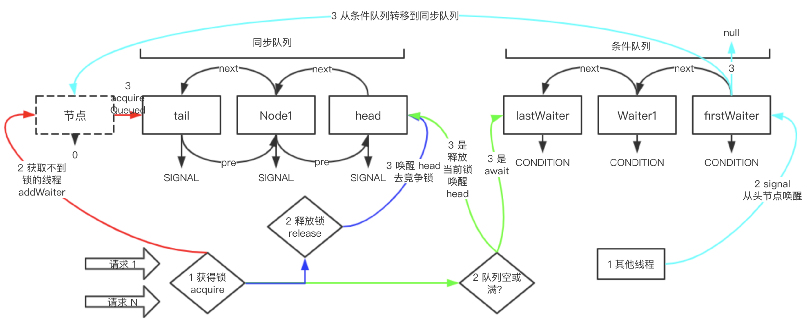
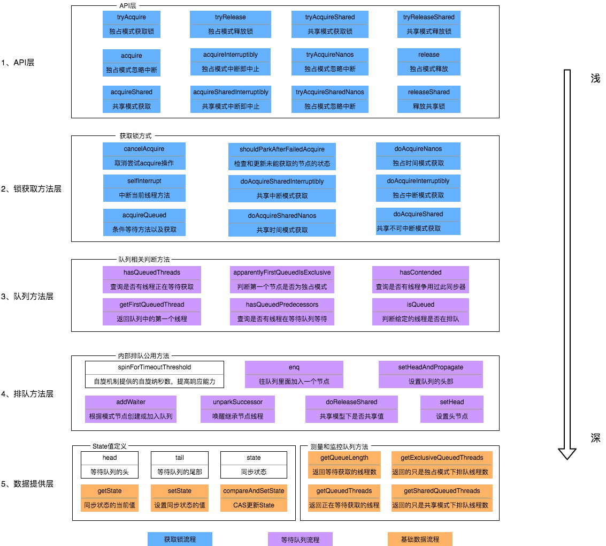
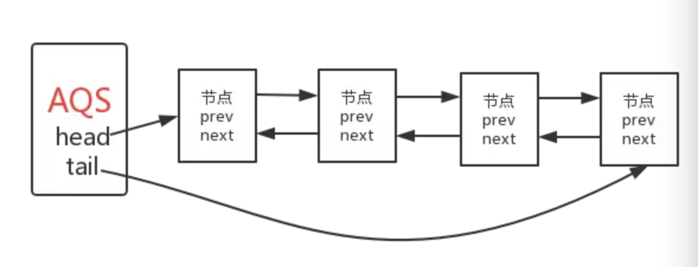
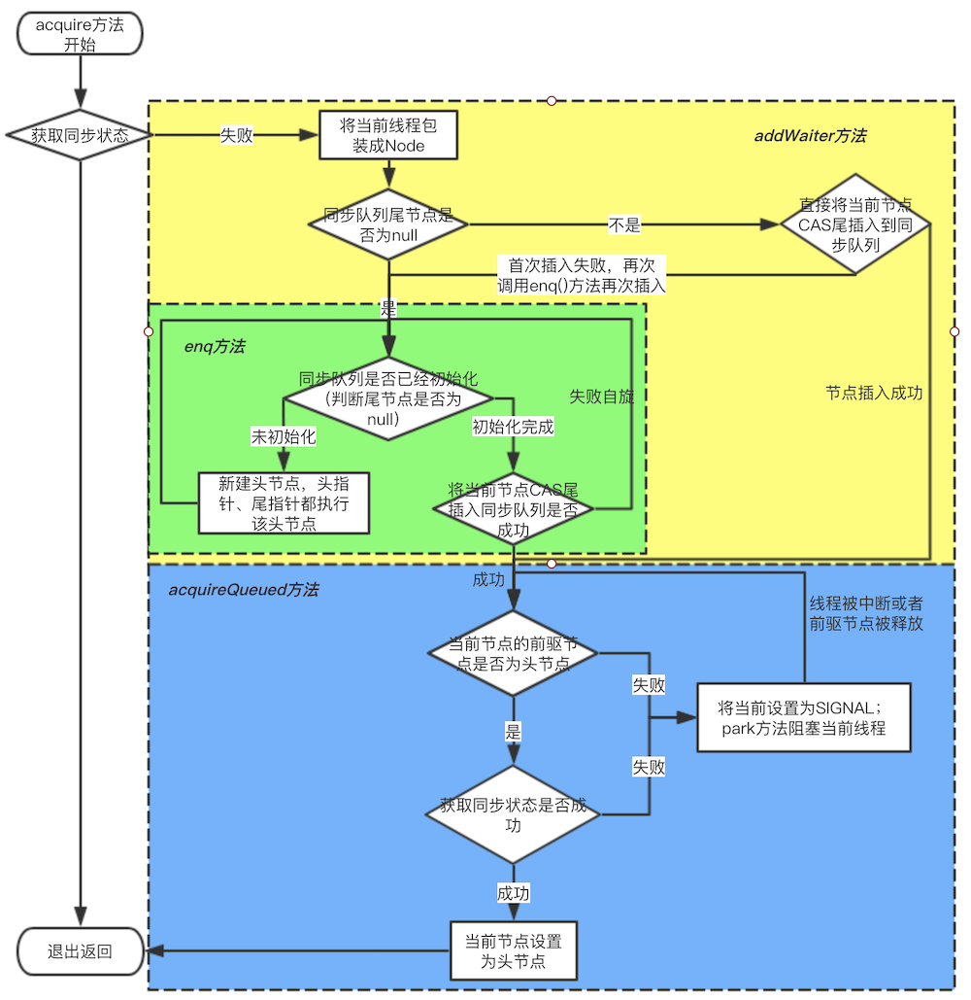
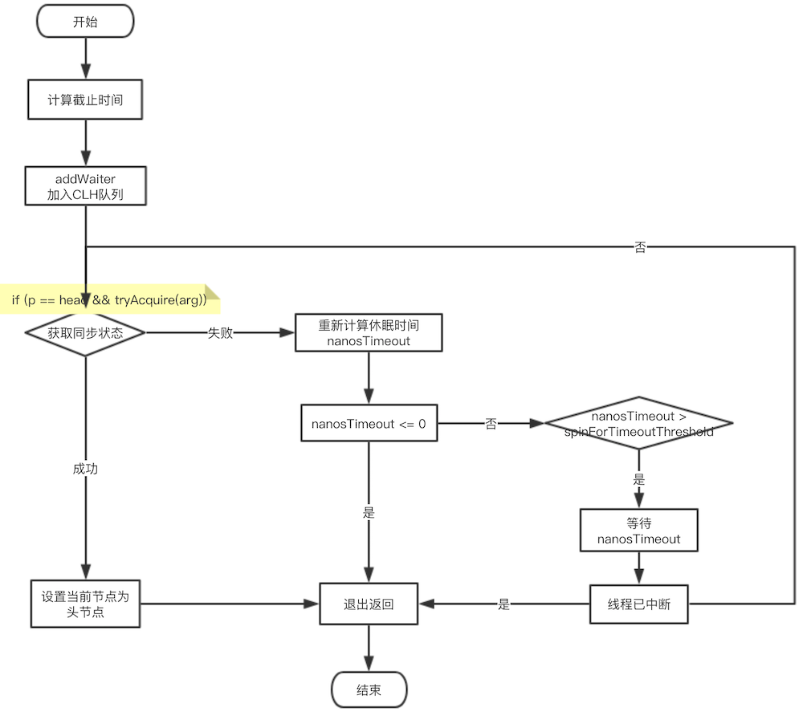

# 一、概述

```java
public abstract class AbstractQueuedSynchronizer extends AbstractOwnableSynchronizer implements java.io.Serializable{
	// 头结点，你直接把它当做 当前持有锁的线程 可能是最好理解的
	private transient volatile Node head;
	// 阻塞的尾节点，每个新的节点进来，都插入到最后，也就形成了一个链表
	private transient volatile Node tail;
	// 这个是最重要的，不过也是最简单的，代表当前锁的状态，0代表没有被占用，大于0代表有线程持有当前锁
	// 之所以说大于0，而不是等于1，是因为锁可以重入嘛，每次重入都加上1
	private volatile int state;
	// 代表当前持有独占锁的线程，举个最重要的使用例子，因为锁可以重入
	// reentrantLock.lock()可以嵌套调用多次，所以每次用这个来判断当前线程是否已经拥有了锁
	// if (currentThread == getExclusiveOwnerThread()) {state++}
	private transient Thread exclusiveOwnerThread; //继承自AbstractOwnableSynchronizer
}
```

整体架构



## 1、设计思想

AQS，抽象队列同步器，是构建锁或者其他同步组件的基础框架，是JUC并发包中的核心基础组件
- 仅从 AQS 本身来说，它仅仅提供独占锁和共享锁两种方式， AQS 本身不存在所谓的公平和非公平锁。
- AQS 是继承自 AbstractOwnableSynchronizer(AOS)，AOS 里面只有一个属性：`exclusiveOwnerThread--用来标识当前占有锁的线程`，加上该属性的get和set方法。<br>
	
	***为什么需要将持有锁的线程的标识向上抽取***<br>
	AOS 有段注释如下：同步器是需要被线程互斥访问的，AOS 提供了一个基本概念，那就是创建锁时赋予一个对于这个锁的所有权。AOS 本身不会去管理或者使用这些信息。然而子类或者工具类在适当的时候会去维护这些信息来控制和监听访问控制权。

	AQS 是在1.5产生， 而 AOS 是在1.6之后才产生的。也就是说在AQS的整个声明过程中，都没有用到 AOS 中声明的属性或者方法，这些属性或者方法是在 AQS 的子类中才用的到，也就是在 1.6之后对子类进行增强。为什么不把 AOS 声明的属性直接放到 AQS中？可能是因为 AQS 不需要这些属性，不对 AQS 做过多侵入。

- AQS 核心是通过一个共享变量state来同步状态，变量的状态由子类去维护，AQS需要做的是：线程阻塞队列维护、线程阻塞和唤醒；一个先进先出的等待线程队列，以实现多线程间竞争和等待；当`state>0`时表示已经获取了锁，当`state = 0`时表示释放了锁。它提供了三个方法`（getState()、setState(int newState)、compareAndSetState(int expect,int update)）`来对同步状态state进行操作，当然AQS可以确保对state的操作是安全的

- AQS内部维护着一个FIFO队列，该队列就是CLH同步队列；AQS 底层是由同步队列 + 条件队列联手组成，同步队列管理着获取不到锁的线程的排队和释放，条件队列是在一定场景下，对同步队列的补充，比如获得锁的线程从空队列中拿数据，肯定是拿不到数据的，这时候条件队列就会管理该线程，使该线程阻塞

- AQS 基于模板模式设计， 其任何一个子类只能支持 AQS 当中的独占锁和共享锁中的一种，所以 AQS 没有抽象方法，所有方法都有默认实现

## 2、AQS 对外公开的方法不需要子类实现的

- AQS 仅仅只是提供独占锁和共享锁两种方式，但是每种方式都有响应中断和不响应中断的区别，所以说AQS锁的更细粒度的划分为：

	- acquire：不响应中断的独占锁
	- acquireInterruptibly： 响应中断的独占锁
	- acquireShared：不响应中断的共享锁
	- acquireSharedInterruptibly：响应中断的共享锁

- 释放锁的方式只有两种：

	- release：独占锁的释放
	- releaseShared：共享锁的释放

上述方法都是 final 的

## 3、AQS 是基于模板模式的实现

不过其模板模式的实现有些特别，整个类中没有抽象方法，取而代之的是需要子类去实现那些方法通过一个方法体。在上面的方法都调用了与之相对应的try方法。在这里需要注意的一点是，acquire和acquireInterruptibly在 AQS 中调用的是同一个try方法；acquireShared和acquireSharedInterruptibly也是调用相同的try方法，并且try方法在AQS中都提供了空实现，并抛出 UnsupportedOperationException 异常来让子类直到。作者暗示着子类应该去重写这些try方法，至于如何去重写try方法，完全是子类的自由

AQS 一共有五处方法供子类实现：
- `tryAcquire`：尝试在独占模式下acquire，方法应当查询在独占模式下对象的 state 字段是否允许 acquire，如果允许，那么可以 acquire。方法通常在线程中执行 acquire 调用，如果方法失败了， acquire 方法会将线程加入等待队列(如果线程还没有加入等待队列)直到它被其他线程发出的信号释放。
- `tryRelease`：尝试在独占模式下设置状态来反映对节点的释放，方法通常在线程执行释放节点时调用；
- `tryAcquireShared`：尝试在共享模式下 acquire， 方法应当查询在共享模式下对象的 state 字段是否允许 acquire，如果允许，那么可以 acquire，方法通常在线程中执行 acquire 调用，如果方法失败了， acquire 方法会将线程加入等待队列(如果线程还没有加入等待队列)直到它被其他线程发出的信号释放。
- `tryReleaseShared`：尝试在共享模式下设置状态来反映对节点的释放，方法通常在线程执行释放节点时调用；
- `isHeldExclusively`：当前同步器是否在独占模式下被线程占用，一般该方法表示是否被当前线程独占；

## 4、CLH同步队列

- AQS内部维护着一个FIFO队列，该队列就是CLH同步队列；
- CLH同步队列是一个FIFO双向队列，底层是一个双向链表，AQS依赖它来完成同步状态的管理，当前线程如果获取同步状态失败时，AQS则会将当前线程已经等待状态等信息构造成一个节点（Node）并将其加入到CLH同步队列，同时会阻塞当前线程，当同步状态释放时，会把首节点唤醒（公平锁），使其再次尝试获取同步状态；
- 同步队列的作用：阻塞获取不到锁的线程，并在适当时机释放这些线程
- 在CLH同步队列中，一个节点表示一个线程，它保存着线程的引用（thread）、状态（waitStatus）、前驱节点（prev）、后继节点（next）

## 5、条件队列

条件队列和同步队列的功能一样，管理获取不到锁的线程，底层数据结构也是链表队列，但条件队列不直接和锁打交道，但常常和锁配合使用，是一定的场景下，对锁功能的一种补充
```java
// 条件队列，从属性上可以看出是链表结构
public class ConditionObject implements Condition, java.io.Serializable {
    private static final long serialVersionUID = 1173984872572414699L;
    // 条件队列中第一个 node
    private transient Node firstWaiter;
    // 条件队列中最后一个 node
    private transient Node lastWaiter;
}  
```
ConditionObject 我们就称为条件队列，我们需要使用时，直接 new ConditionObject () 即可。ConditionObject 是实现 Condition 接口的

## 6、同步状态

在同步器中，我们有两个状态，一个叫做 state，一个叫做 waitStatus，两者是完全不同的概念
- **state是锁的状态**
	- 对于独占模式来说，通常就是 0 代表可获取锁，1 代表锁被别人获取了，可重入锁例外；
	- 共享模式下，每个线程都可以对 state 进行加减操作；独占模式和共享模式对于 state 的操作完全不一样；

- **waitStatus 是节点（Node）的状态**，其种类很多，一共有初始化 (0)、CANCELLED (1)、SIGNAL (-1)、CONDITION (-2)、PROPAGATE (-3)：
	```java
	// waitStatus 的状态有以下几种
    // 被取消
    static final int CANCELLED =  1;
    // SIGNAL 状态的意义：同步队列中的节点在自旋获取锁的时候，如果前一个节点的状态是 SIGNAL，那么自己就可以阻塞休息了，否则自己一直自旋尝试获得锁
    static final int SIGNAL    = -1;
    // 表示当前 node 正在条件队列中，当有节点从同步 队列转移到条件队列时，状态就会被更改成 CONDITION
    static final int CONDITION = -2;
    // 无条件传播,共享模式下，该状态的进程处于可运行状态
    static final int PROPAGATE = -3;
	```

## 7、主要方法与属性



上图中有颜色的为Method，无颜色的为Attribution。

# 二、源码分析

## 1、基本数据结构-Node

### 1.1、关于 Node 需要注意点

- AQS 的等待队列是 CLH lock队列，CLH 经常用于自旋锁，AQS 中的CLH可以简单的理解为"等待锁的线程队列"，队列中每个节点(线程)只需要等待其前驱节点释放锁；
- 每个节点持有一个 "status" 字段用于是否一条线程应当阻塞的追踪， 但是 state 字段并不保证加锁；
- 一条线程所在节点如果它处于队列头的下一个节点，那么它会尝试 acquire， 但是 acquire 并不保证成功，只是有权利去竞争
- 要进入队列，你只需要自动将它拼接在队列尾部即可；要从队列中移出，你只需要设置 header字段；
- 同步队列是一个双向队列，AQS通过持有头尾指针管理同步队列

### 1.2、Node 结构



head-头指针 <br>
tail-尾指针<br>
prev-指向前驱节点指针<br>
next-与prev相反，指向后置节点；<br>

关键不同就是next指针，因为 AQS 中线程不是一直在自旋的，可能会返回睡眠和唤醒，这就需要前继释放锁的时候通过next指针找到其后继将其唤醒。也就是 AQS 的等待队列中后继是被前继唤醒的。AQS 结合了自旋和睡眠/唤醒两种方法的优点；

### 1.3、Node 主要代码

```java
//标记当前结点是共享模式
static final Node SHARED = new Node();
//标记当前结点是独占模式
static final Node EXCLUSIVE = null;
//代表线程已经被取消
static final int CANCELLED = 1;
//代表后续节点需要唤醒
static final int SIGNAL = -1;
//代表线程在condition queue中，等待某一条件
static final int CONDITION = -2;
//代表后续结点会传播唤醒的操作，共享模式下起作用
static final int PROPAGATE = -3;
//结点的等待状态，用来控制线程的阻塞/唤醒，以及避免不必要的调用LockSupport的park/unpark方法，主要值上述四个
volatile int waitStatus
//拥有当前结点的线程。
volatile Thread thread；
// 当前节点的前驱节点
volatile Node prev;
// 当前节点的后继节点
volatile Node next;
```

### 1.4、Node节点的状态

```java
//代表线程已经被取消
static final int CANCELLED = 1;
//代表后续节点需要唤醒
static final int SIGNAL = -1;
//代表线程在condition queue中，等待某一条件
static final int CONDITION = -2;
//代表后续结点会传播唤醒的操作，共享模式下起作用
static final int PROPAGATE = -3;
```

## 2、独占锁与共享锁

### 2.1、获取不中断独占锁



- acquire 方法：
	```java
	// 排它模式下，尝试获得锁
	public final void acquire(int arg) {
		// tryAcquire 方法是需要实现类去实现的，实现思路一般都是 cas 给 state 赋值来决定是否能获得锁
		if (!tryAcquire(arg) &&
			// addWaiter 入参代表是排他模式
			acquireQueued(addWaiter(Node.EXCLUSIVE), arg))
			selfInterrupt();
	}
	```
- addWaiter 方法：
	```java
	/******************************* addWaiter start  *********************************/
	// 方法主要目的：node 追加到同步队列的队尾，入参 mode 表示 Node 的模式（排它模式还是共享模式），出参是新增的 node
	// 主要思路：
	// 新 node.pre = 队尾
	// 队尾.next = 新 node
	private Node addWaiter(Node mode) {
		// 初始化 Node
		Node node = new Node(Thread.currentThread(), mode);
		// 这里的逻辑和 enq 一致，enq 的逻辑仅仅多了队尾是空，初始化的逻辑；这个思路在 java 源码中很常见，先简单的尝试放一下，成功立马返回，如果不行，再 while 循环，很多时候，这种算法可以帮忙解决大部分的问题，大部分的入队可能一次都能成功，无需自旋
		Node pred = tail;
		if (pred != null) {
			node.prev = pred;
			if (compareAndSetTail(pred, node)) {
				pred.next = node;
				return node;
			}
		}
		//自旋保证node加入到队尾
		enq(node);
		return node;
	}
	// 线程加入同步队列中方法，追加到队尾
	// 这里需要重点注意的是，返回值是添加 node 的前一个节点
	private Node enq(final Node node) {
		for (;;) {
			// 得到队尾节点
			Node t = tail;
			// 如果队尾为空，说明当前同步队列都没有初始化，进行初始化
			// tail = head = new Node();
			if (t == null) {
				if (compareAndSetHead(new Node()))
					tail = head;
			// 队尾不为空，将当前节点追加到队尾
			} else {
				node.prev = t;
				// node 追加到队尾
				if (compareAndSetTail(t, node)) {
					t.next = node;
					return t;
				}
			}
		}
	}
	```
	是在 addWaiter 方法中，并没有进入方法后立马就自旋，而是先尝试一次追加到队尾，如果失败才自旋，因为大部分操作可能一次就会成功

- acquireQueued 方法：阻塞当前线程
	```java
	// 主要做两件事情：
	// 1：通过不断的自旋尝试使自己前一个节点的状态变成 signal，然后阻塞自己。
	// 2：获得锁的线程执行完成之后，释放锁时，会把阻塞的 node 唤醒，node 唤醒之后再次自旋，尝试获得锁
	// 返回 false 表示获得锁成功，返回 true 表示失败
	final boolean acquireQueued(final Node node, int arg) {
		boolean failed = true;
		try {
			boolean interrupted = false;
			// 自旋
			for (;;) {
				// 选上一个节点
				final Node p = node.predecessor();
				// 有两种情况会走到 p == head：
				// 1:node 之前没有获得锁，进入 acquireQueued 方法时，才发现他的前置节点就是头节点，于是尝试获得一次锁；
				// 2:node 之前一直在阻塞沉睡，然后被唤醒，此时唤醒 node 的节点正是其前一个节点，也能走到 if
				// 如果自己 tryAcquire 成功，就立马把自己设置成 head，把上一个节点移除
				// 如果 tryAcquire 失败，尝试进入同步队列
				if (p == head && tryAcquire(arg)) {
					// 获得锁，设置成 head 节点
					setHead(node);
					//p被回收
					p.next = null; // help GC
					failed = false;
					return interrupted;
				}
				// shouldParkAfterFailedAcquire 把 node 的前一个节点状态置为 SIGNAL
				// 只要前一个节点状态是 SIGNAL了，那么自己就可以阻塞(park)了
				// parkAndCheckInterrupt 阻塞当前线程
				if (shouldParkAfterFailedAcquire(p, node) &&
					// 线程是在这个方法里面阻塞的，醒来的时候仍然在无限 for 循环里面，就能再次自旋尝试获得锁
					parkAndCheckInterrupt())
					interrupted = true;
			}
		} finally {
			// 如果获得node的锁失败，将 node 从队列中移除
			if (failed)
				cancelAcquire(node);
		}
	}
	```
	shouldParkAfterFailedAcquire：这个方法的主要目的就是把前一个节点的状态置为 SIGNAL，只要前一个节点的状态是 SIGNAL，当前节点就可以阻塞了（parkAndCheckInterrupt 就是使节点阻塞的方法）：
	```java
	// 当前线程可以安心阻塞的标准，就是前一个节点线程状态是 SIGNAL 了。
	// 入参 pred 是前一个节点，node 是当前节点。
	// 关键操作：
	// 1：确认前一个节点是否有效，无效的话，一直往前找到状态不是取消的节点。
	// 2: 把前一个节点状态置为 SIGNAL。
	// 1、2 两步操作，有可能一次就成功，有可能需要外部循环多次才能成功（外面是个无限的 for 循环），但最后一定是可以成功的
	private static boolean shouldParkAfterFailedAcquire(Node pred, Node node) {
		int ws = pred.waitStatus;
		// 如果前一个节点 waitStatus 状态已经是 SIGNAL 了，直接返回，不需要在自旋了
		if (ws == Node.SIGNAL)
			return true;
		// 如果当前节点状态已经被取消了。
		if (ws > 0) {
			// Predecessor was cancelled. Skip over predecessors and indicate retry.
			// 找到前一个状态不是取消的节点，因为把当前 node 挂在有效节点身上；因为节点状态是取消的话，是无效的，是不能作为 node 的前置节点的，所以必须找到 node 的有效节点才行
			do {
				node.prev = pred = pred.prev;
			} while (pred.waitStatus > 0);
			pred.next = node;
		// 否则直接把节点状态置 为SIGNAL
		} else {
			// waitStatus must be 0 or PROPAGATE.  Indicate that we need a signal, but don't park yet.  Caller will need to retry to make sure it cannot acquire before parking.
			compareAndSetWaitStatus(pred, ws, Node.SIGNAL);
		}
		return false;
	}
	```

**总结**：acquire 方法大致分为三步：
- 使用 tryAcquire 方法尝试获得锁，获得锁直接返回，获取不到锁的走步骤2；
- 把当前线程组装成节点（Node），追加到同步队列的尾部（addWaiter）；
- 自旋，使同步队列中当前节点的前置节点状态为 signal 后，然后阻塞自己

### 2.2、获取共享锁

acquireShared 整体流程和 acquire 相同，代码也很相似
```java
public final void acquireShared(int arg) {
	if (tryAcquireShared(arg) < 0)
		doAcquireShared(arg);
}
```
节点获得排它锁时，仅仅把自己设置为同步队列的头节点即可（setHead 方法），但如果是共享锁的话，还会去唤醒自己的后续节点，一起来获得该锁（setHeadAndPropagate 方法）
```java
private void doAcquireShared(int arg) {
	// node追加到同步队列末位，其为 SHARED模式
	final Node node = addWaiter(Node.SHARED);
	boolean failed = true;
	try {
		boolean interrupted = false;
		for (;;) {
			final Node p = node.predecessor();
			if (p == head) {
				int r = tryAcquireShared(arg);
				// 大于0，说明成功获取到锁
				if (r >= 0) {
					// 不仅需要把当前节点设置为head，还会唤醒头节点的后续节点
					setHeadAndPropagate(node, r);
					p.next = null; // help GC
					if (interrupted)
						selfInterrupt();
					failed = false;
					return;
				}
			}
			if (shouldParkAfterFailedAcquire(p, node) &&
				parkAndCheckInterrupt())
				interrupted = true;
		}
	} finally {
		if (failed)
			cancelAcquire(node);
	}
}
```
```java
// 主要做两件事情
// 1:把当前节点设置成头节点
// 2:看看后续节点有无正在等待，并且也是共享模式的，有的话唤醒这些节点
private void setHeadAndPropagate(Node node, int propagate) {
    Node h = head; // Record old head for check below
    // 当前节点设置成头节点
    setHead(node);
    // propagate > 0 表示已经有节点获得共享锁了
    if (propagate > 0 || h == null || h.waitStatus < 0 ||
        (h = head) == null || h.waitStatus < 0) {
        Node s = node.next;
        //共享模式，还唤醒头节点的后置节点
        if (s == null || s.isShared())
            doReleaseShared();
    }
}
// 释放后置共享节点
private void doReleaseShared() {
    for (;;) {
        Node h = head;
        // 还没有到队尾，此时队列中至少有两个节点
        if (h != null && h != tail) {
            int ws = h.waitStatus;
            // 如果队列状态是 SIGNAL ，说明后续节点都需要唤醒
            if (ws == Node.SIGNAL) {
                // CAS 保证只有一个节点可以运行唤醒的操作
                if (!compareAndSetWaitStatus(h, Node.SIGNAL, 0))
                    continue;            // loop to recheck cases
                // 进行唤醒操作
                unparkSuccessor(h);
            }
            else if (ws == 0 &&
                     !compareAndSetWaitStatus(h, 0, Node.PROPAGATE))
                continue;                // loop on failed CAS
        }
        // 第一种情况，头节点没有发生移动，结束。
        // 第二种情况，因为此方法可以被两处调用，一次是获得锁的地方，一处是释放锁的地方，
        // 加上共享锁的特性就是可以多个线程获得锁，也可以释放锁，这就导致头节点可能会发生变化，
        // 如果头节点发生了变化，就继续循环，一直循环到头节点不变化时，结束循环。
        if (h == head)                   // loop if head changed
            break;
    }
}
```
当一个线程获得锁后，它就会去唤醒排在它后面的其它节点，让其它节点也能够获得锁

### 2.3、独占锁的释放（release()方法）

```java
// unlock 的基础方法
public final boolean release(int arg) {
    // tryRelease 交给实现类去实现，一般就是用当前同步器状态减去 arg，如果返回 true 说明成功释放锁。
    if (tryRelease(arg)) {
        Node h = head;
        // 头节点不为空，并且非初始化状态
        if (h != null && h.waitStatus != 0)
            // 从头开始唤醒等待锁的节点
            unparkSuccessor(h);
        return true;
    }
    return false;
}
// 很有意思的方法，当线程释放锁成功后，从 node 开始唤醒同步队列中的节点
// 通过唤醒机制,保证线程不会一直在同步队列中阻塞等待
private void unparkSuccessor(Node node) {
    // node 节点是当前释放锁的节点，也是同步队列的头节点
    int ws = node.waitStatus;
    // 如果节点需要被通知，把节点的状态置为初始化（SIGNAL）
    if (ws < 0)
        compareAndSetWaitStatus(node, ws, 0);

    // 拿出 node 节点的后面一个节点
    Node s = node.next;
    // s 为空，表示 node 的后一个节点为空
    // s.waitStatus 大于0，代表 s 节点已经被取消了
    // 遇到以上这两种情况，就从队尾开始，向前遍历，找到第一个 waitStatus 字段不是被取消的
    if (s == null || s.waitStatus > 0) {
        s = null;
        // 这里从尾迭代，而不是从头开始迭代是有原因的。
        // 主要是因为节点被阻塞的时候，是在 acquireQueued 方法里面被阻塞的，唤醒时也一定会在 acquireQueued 方法里面被唤醒，唤醒之后的条件是，判断当前节点的前置节点是否是头节点，这里是判断当前节点的前置节点，所以这里必须使用从尾到头的迭代顺序才行，目的就是为了过滤掉无效的前置节点，不然节点被唤醒时，发现其前置节点还是无效节点，就又会陷入阻塞。
        for (Node t = tail; t != null && t != node; t = t.prev)
            // t.waitStatus <= 0 说明 t 没有被取消，肯定还在等待被唤醒
            if (t.waitStatus <= 0)
                s = t;
    }
    // 唤醒以上代码找到的线程
    if (s != null)
        LockSupport.unpark(s.thread);
}
```
- 每一次锁释放后就会唤醒队列中该节点的后继节点所引用的线程，从而进一步可以佐证获得锁的过程是一个FIFO（先进先出）的过程

### 2.4、释放共享锁 releaseShared

释放共享锁的方法是 releaseShared，主要分成两步：
- tryReleaseShared 尝试释放当前共享锁，失败返回 false，成功走 2；
- 唤醒当前节点的后续阻塞节点，这个方法我们之前看过了，线程在获得共享锁的时候，就会去唤醒其后面的节点，方法名称为：doReleaseShared
```java
// 共享模式下，释放当前线程的共享锁
public final boolean releaseShared(int arg) {
    if (tryReleaseShared(arg)) {
        // 这个方法就是线程在获得锁时，唤醒后续节点时调用的方法
        doReleaseShared();
        return true;
    }
    return false;
}
```

### 2.5、独占锁获取和释放总结

- 线程获取锁失败，线程被封装成Node进行入队操作，核心方法在于`addWaiter()`和`enq()`，同时`enq()`完成对同步队列的头结点初始化工作以及CAS操作失败的重试；
- 线程获取锁是一个自旋的过程，当且仅当`“当前节点”`的前驱节点是头结点并且成功获得同步状态时，节点出队即该节点引用的线程获得锁，否则，当不满足条件时就会调用`LookSupport.park()`方法使得线程阻塞；
- 释放锁的时候会唤醒后继节点；

总体来说：在获取同步状态时，AQS维护一个同步队列，获取同步状态失败的线程会加入到队列中进行自旋；移除队列（或停止自旋）的条件是前驱节点是头结点并且成功获得了同步状态。在释放同步状态时，同步器会调用unparkSuccessor()方法唤醒后继节点。

对于锁的释放不区分共享锁和排它锁

## 3、可中断式独占锁

获取可中断式独占锁（acquireInterruptibly方法）

该方法在等待获取同步状态时，如果当前线程被中断了，会立刻响应中断抛出异常InterruptedException
```java
public final void acquireInterruptibly(int arg) throws InterruptedException {
	if (Thread.interrupted())
		throw new InterruptedException();
	if (!tryAcquire(arg))
		doAcquireInterruptibly(arg);
}
```
可响应中断式锁可调用方法`lock.lockInterruptibly()`；而该方法其底层会调用AQS的`acquireInterruptibly`方法

在获取同步状态失败后就会调用`doAcquireInterruptibly`方法：
```java
private void doAcquireInterruptibly(int arg) throws InterruptedException {
	// 将节点插入到同步队列中
	final Node node = addWaiter(Node.EXCLUSIVE);
	boolean failed = true;
	try {
		for (;;) {
			final Node p = node.predecessor();
			if (p == head && tryAcquire(arg)) {
				setHead(node);
				p.next = null; // help GC
				failed = false;
				return;
			}
			if (shouldParkAfterFailedAcquire(p, node) &&
				parkAndCheckInterrupt())
				throw new InterruptedException();
		}
	} finally {
		if (failed)
			cancelAcquire(node);
	}
}
```
`doAcquireInterruptibly(int arg)`方法与`acquire(int arg)`方法仅有两个差别：
- 方法声明抛出InterruptedException异常
- 在中断方法处不再是使用interrupted标志，而是直接抛出InterruptedException异常

## 4、超时获取独占锁

通过调用`tryAcquireNanos(int arg,long nanos)`方式达到超时等待获取锁的效果，该方法会在三种情况下才会返回
- 在超时时间内，当前线程成功获取了锁；
- 当前线程在超时时间内被中断；
- 超时时间结束，仍未获得锁返回false
```java
public final boolean tryAcquireNanos(int arg, long nanosTimeout) throws InterruptedException {
	if (Thread.interrupted())
		throw new InterruptedException();
	return tryAcquire(arg) ||
		doAcquireNanos(arg, nanosTimeout);
}
```
`tryAcquireNanos(int arg, long nanosTimeout)`方法超时获取最终是在`doAcquireNanos(int arg, long nanosTimeout)`中实现的，如下
```java
private boolean doAcquireNanos(int arg, long nanosTimeout) throws InterruptedException {
	if (nanosTimeout <= 0L)
		return false;
	final long deadline = System.nanoTime() + nanosTimeout;
	final Node node = addWaiter(Node.EXCLUSIVE); // 新增node节点
	boolean failed = true;
	try {
		for (;;) {
			final Node p = node.predecessor();
			if (p == head && tryAcquire(arg)) {//获取同步状态成功
				setHead(node);
				p.next = null; // help GC
				failed = false;
				return true;
			}
			/**
			 * 获取失败，做超时、中断判断
			 */
			 // 重新计算需要休眠的时间
			nanosTimeout = deadline - System.nanoTime();
			// 已经超时，返回false
			if (nanosTimeout <= 0L)
				return false;
			// 如果没有超时，则等待nanosTimeout纳秒；该线程会直接从LockSupport.parkNanos中返回，LockSupport为JUC提供的一个阻塞和唤醒的工具类
			if (shouldParkAfterFailedAcquire(p, node) &&
				nanosTimeout > spinForTimeoutThreshold)
				LockSupport.parkNanos(this, nanosTimeout);
			// 线程是否已经中断了
			if (Thread.interrupted())
				throw new InterruptedException();
		}
	} finally {
		if (failed)
			cancelAcquire(node);
	}
}
```


## 5、阻塞与唤醒

在线程获取同步状态时如果获取失败，则加入CLH同步队列，通过通过自旋的方式不断获取同步状态，但是在自旋的过程中则需要判断当前线程是否需要阻塞，其主要方法在`acquireQueued()`：
```java
final boolean acquireQueued(final Node node, int arg) {
	boolean failed = true;
	try {
		boolean interrupted = false;
		for (;;) {
			final Node p = node.predecessor();
			if (p == head && tryAcquire(arg)) {
				setHead(node);
				p.next = null; // help GC
				failed = false;
				return interrupted;
			}
			if (shouldParkAfterFailedAcquire(p, node) &&
				parkAndCheckInterrupt())
				interrupted = true;
		}
	} finally {
		if (failed)
			cancelAcquire(node);
	}
}
```
通过这段代码我们可以看到，在获取同步状态失败后，线程并不是立马进行阻塞，需要检查该线程的状态，检查状态的方法为 `shouldParkAfterFailedAcquire(Node pred, Node node)` 方法，该方法主要靠前驱节点判断当前线程是否应该被阻塞，代码如下：
```java
private static boolean shouldParkAfterFailedAcquire(Node pred, Node node) {
	// 前驱节点
	int ws = pred.waitStatus;
	// 状态为signal，表示当前线程处于等待状态，直接放回true
	if (ws == Node.SIGNAL)
		return true;
	// 前驱节点状态 > 0 ，则为Cancelled,表明该节点已经超时或者被中断了，需要从同步队列中取消
	if (ws > 0) {
		do {
			node.prev = pred = pred.prev;
		} while (pred.waitStatus > 0);
		pred.next = node;
	// 前驱节点状态为Condition、propagate
	} else {
		compareAndSetWaitStatus(pred, ws, Node.SIGNAL);
	}
	return false;
}
```
这段代码主要检查当前线程是否需要被阻塞，具体规则如下：
- 如果当前线程的前驱节点状态为`SINNAL`，则表明当前线程需要被阻塞，调用`unpark()`方法唤醒，直接返回true，当前线程阻塞；
- 如果当前线程的前驱节点状态为`CANCELLED（ws > 0）`，则表明该线程的前驱节点已经等待超时或者被中断了，则需要从`CLH`队列中将该前驱节点删除掉，直到回溯到前驱节点状态 <= 0 ，返回false；
- 如果前驱节点非`SINNAL`，非`CANCELLED`，则通过CAS的方式将其前驱节点设置为`SINNAL`，返回false；

如果`shouldParkAfterFailedAcquire(Node pred, Node node)` 方法返回true，则调用`parkAndCheckInterrupt()`方法阻塞当前线程：
```java
private final boolean parkAndCheckInterrupt() {
	LockSupport.park(this);
	return Thread.interrupted();
}
```
parkAndCheckInterrupt() 方法主要是把当前线程挂起，从而阻塞住线程的调用栈，同时返回当前线程的中断状态。其内部则是调用LockSupport工具类的park()方法来阻塞该方法

当线程释放同步状态后，则需要唤醒该线程的后继节点：
```java
public final boolean release(int arg) {
	if (tryRelease(arg)) {
		Node h = head;
		if (h != null && h.waitStatus != 0)
			//唤醒后继节点
			unparkSuccessor(h);
		return true;
	}
	return false;
}
```
调用unparkSuccessor(Node node)唤醒后继节点：
```java
private void unparkSuccessor(Node node) {
	//当前节点状态
	int ws = node.waitStatus;
	//当前状态 < 0 则设置为 0
	if (ws < 0)
		compareAndSetWaitStatus(node, ws, 0);

	//当前节点的后继节点
	Node s = node.next;
	//后继节点为null或者其状态 > 0 (超时或者被中断了)
	if (s == null || s.waitStatus > 0) {
		s = null;
		//从tail节点来找可用节点
		for (Node t = tail; t != null && t != node; t = t.prev)
			if (t.waitStatus <= 0)
				s = t;
	}
	//唤醒后继节点
	if (s != null)
		LockSupport.unpark(s.thread);
}
```

# 三、AbstractQueuedLongSynchronizer

AbstractQueuedSynchronizer的一个版本，其中同步状态由long类型维护。该类与AbstractQueuedSynchronizer具有完全相同的结构、属性和方法，唯一的例外是所有与状态相关的参数和结果都定义为long而不是int。

# 四、面试题

## 1、同步队列入队、出队时机

**同步队列入队时机：**
- 多个线程请求锁，获取不到锁的线程需要到同步队列中排队阻塞；
- 条件队列中的节点被唤醒，会从条件队列中转移到同步队列中来。

**同步队列出队时机：**
- 锁释放时，头节点出队；
- 获得锁的线程，进入条件队列时，会释放锁，同步队列头节点开始竞争锁。

四个时机的过程可以参考 AQS 源码：1-参考 acquire 方法执行过程、2-参考 signal 方法、3-参考 release 方法、4-参考 await 方法

## 2、为什么有同步对还需要条件队列

的确，一般情况下，我们只需要有同步队列就好了，但在上锁后，需要操作队列的场景下，一个同步队列就搞不定了，需要条件队列进行功能补充，比如当队列满时，执行 put 操作的线程会进入条件队列等待，当队列空时，执行 take 操作的线程也会进入条件队列中等待，从一定程度上来看，条件队列是对同步队列的场景功能补充

## 3、条件队列中的元素入队和出队的时机和过程

- 入队时机：执行 await 方法时，当前线程会释放锁，并进入到条件队列。

- 出队时机：执行 signal、signalAll 方法时，节点会从条件队列中转移到同步队列中。

具体的执行过程，可以参考源码解析中 await 和 signal 方法

## 4、条件队列中的节点转移到同步队列中去的时机和过程

**转移时机：**当有线程执行 signal、signalAll 方法时，从条件队列的头节点开始，转移到同步队列中去。

**转移过程主要是以下几步：**
- 找到条件队列的头节点，头节点 next 属性置为 null，从条件队列中移除了；
- 头节点追加到同步队列的队尾；
- 头节点状态（waitStatus）从 CONDITION 修改成 0（初始化状态）；
- 将节点的前一个节点状态置为 SIGNAL

## 5、线程入条件队列时，为什么需要释放持有的锁

如果当前线程不释放锁，一旦跑去条件队里中阻塞了，后续所有的线程都无法获得锁；

正确的场景应该是：当前线程释放锁，到条件队列中去阻塞后，其他线程仍然可以获得当前锁。

## 6、自定义锁，大概的实现思路是什么样子的

可以参考ReentrantLock的实现来描述
- 新建内部类继承 AQS，并实现 AQS 的 tryAcquire 和 tryRelease 两个方法，在 tryAcquire 方法里面实现控制能否获取锁，比如当同步器状态 state 是 0 时，即可获得锁，在 tryRelease 方法里面控制能否释放锁，比如将同步器状态递减到 0 时，即可释放锁；
- 对外提供 lock、release 两个方法，lock 表示获得锁的方法，底层调用 AQS 的 acquire 方法，release 表示释放锁的方法，底层调用 AQS 的 release 方法

# 参考资料

* [AQS独占模式](http://www.cnblogs.com/xrq730/p/7056614.html)
* [AQS源码分析](http://blog.csdn.net/pfnie/article/category/7161421)
* [AQS框架概述](http://www.cnblogs.com/zhanjindong/p/java-concurrent-package-aqs-overview.html)
* [AQS](https://segmentfault.com/a/1190000017372067)
* [AQS原理分析](https://tech.meituan.com/2019/12/05/aqs-theory-and-apply.html)


