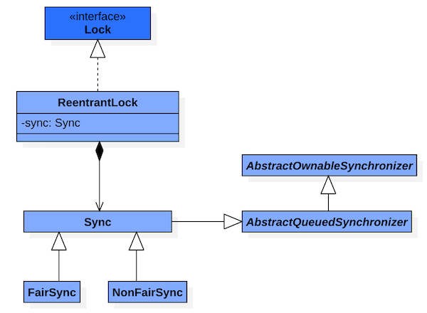

# 一、ReentrantLock

## 1、签名



```java
public class ReentrantLock implements Lock, java.io.Serializable {
    // 创建一个 ReentrantLock ，默认是“非公平锁”。
	ReentrantLock()
	// 创建策略是fair的 ReentrantLock。fair为true表示是公平锁，fair为false表示是非公平锁。
	ReentrantLock(boolean fair)
	// 查询当前线程保持此锁的次数。
	int getHoldCount()
	// 返回目前拥有此锁的线程，如果此锁不被任何线程拥有，则返回 null。
	protected Thread getOwner()
	// 返回一个 collection，它包含可能正等待获取此锁的线程。
	protected Collection<Thread> getQueuedThreads()
	// 返回正等待获取此锁的线程估计数。
	int getQueueLength()
	// 返回一个 collection，它包含可能正在等待与此锁相关给定条件的那些线程。
	protected Collection<Thread> getWaitingThreads(Condition condition)
	// 返回等待与此锁相关的给定条件的线程估计数。
	int getWaitQueueLength(Condition condition)
	// 查询给定线程是否正在等待获取此锁。
	boolean hasQueuedThread(Thread thread)
	// 查询是否有些线程正在等待获取此锁。
	boolean hasQueuedThreads()
	// 查询是否有些线程正在等待与此锁有关的给定条件。
	boolean hasWaiters(Condition condition)
	// 如果是“公平锁”返回true，否则返回false。
	boolean isFair()
	// 查询当前线程是否保持此锁。
	boolean isHeldByCurrentThread()
	// 查询此锁是否由任意线程保持。
	boolean isLocked()
	// 获取锁。
	void lock()
	// 如果当前线程未被中断，则获取锁。
	void lockInterruptibly()
	// 返回用来与此 Lock 实例一起使用的 Condition 实例。
	Condition newCondition()
	// 仅在调用时锁未被另一个线程保持的情况下，才获取该锁。
	boolean tryLock()
	// 如果锁在给定等待时间内没有被另一个线程保持，且当前线程未被中断，则获取该锁。
	boolean tryLock(long timeout， TimeUnit unit)
	// 试图释放此锁。
	void unlock()
}
```

## 2、概述

- 在同一个时间点只能被一个线程持有，而可重入即可以被单个线程多次获取。主要是修改state值，重入多少次，就得释放多少次锁，保证释放之后state变为0；
- ReentrantLock 分为"公平锁"和"非公平锁"，区别在于获取锁的机制上是否公平.
- ReentrantLock 是通过一个 FIFO 的等待队列来管理获取该锁的所有线程。"公平锁"的机制下，线程依次排队获取；而"非公平锁"在锁是可获取状态时，不管自己是不是在队列的开头都会获取锁。
- ReentrantLock中，包含了Sync对象.而且，Sync 是 AQS 的子类;更重要的是，Sync 有两个子类 FairSync（公平锁）和	NonFairSync（非公平锁）；ReentrantLock 是一个独占锁，至于它到底是公平锁还是非公平锁，就取决于sync对象是"FairSync的实例"还是"NonFairSync的实例"；
- 提供了一个Condition类，可以分组唤醒需要唤醒的线程.
- 公平性、可重入、可中断、超时机制；
- Sync为ReentrantLock里面的一个内部类，它继承AQS（[AbstractQueuedSynchronizer](AbstractQueuedSynchronizer.md)），它有两个子类：公平锁FairSync和非公平锁NonfairSync。ReentrantLock里面大部分的功能都是委托给Sync来实现的，同时Sync内部定义了lock()抽象方法由其子类去实现，默认实现了nonfairTryAcquire(int acquires)方法，可以看出它是非公平锁的默认实现方式。下面我们看非公平锁的lock()方法：

## 3、公平锁

是按照通过CLH等待线程按照先来先得的规则，公平的获取锁；获取锁是通过lock()函数，是在ReentrantLock.java的FairSync类中实现

## 4、非公平锁

则当线程要获取锁时，它会无视CLH等待队列而直接获取锁

## 5、保证可见性

```java
class LockDemo{
	private final Lock rtl = new ReentrantLock();
	int value;
	public void addOne(){
		rtl.lock();
		try{
			value += 1;
		} finally{
			rtl.unlock();
		}
	}
}
```

利用volatile的相关的happens-before规则。ReentrantLock中有一个实现锁的Sync中其持有一个volatile的成员变量state，获取锁的时候，会读写state的值；解锁的时候，也会读写state的值。

在执行`value+1`之前，程序会先读写一次volatile变量state，在执行`value+1`之后，又读写了一次volatile变量state，根据happens-before规则：
- 顺序性规则：对于线程T1，`value+1` happens-before 释放锁的操作 unlock();
- volatile变量规则：由于state=1会先读取state，所以线程T1的 unlock() 操作 happens-before 线程T2的 lock 操作；
- 传递性规则：线程T1的`value+1` happens-before 线程T2的 lock 操作


# 二、Condition

## 1、签名

```java
public interface Condition {
    // 造成当前线程在接到信号或被中断之前一直处于等待状态
    void await() throws InterruptedException;
    // 造成当前线程在接到信号之前一直处于等待状态。【注意：该方法对中断不敏感】
    void awaitUninterruptibly();
    // 造成当前线程在接到信号、被中断或到达指定等待时间之前一直处于等待状态。返回值表示剩余时间，如果在nanosTimesout之前唤醒，那么返回值 = nanosTimeout – 消耗时间，
    // 如果返回值 <= 0 ,则可以认定它已经超时了
    long awaitNanos(long nanosTimeout) throws InterruptedException;
    // 造成当前线程在接到信号、被中断或到达指定等待时间之前一直处于等待状态
    boolean await(long time, TimeUnit unit) throws InterruptedException;
    // 造成当前线程在接到信号、被中断或到达指定最后期限之前一直处于等待状态。如果没有到指定时间就被通知，则返回true，否则表示到了指定时间，返回返回false
    boolean awaitUntil(Date deadline) throws InterruptedException;
    // 唤醒一个等待线程。该线程从等待方法返回前必须获得与Condition相关的锁
    void signal();
    // 唤醒所有等待线程。能够从等待方法返回的线程必须获得与Condition相关的锁
    void signalAll();
}
```

## 2、概述

- 为线程提供了一种更为灵活的等待/通知模式，线程在调用await方法后执行挂起操作，直到线程等待的某个条件为真时才会被唤醒；
- Condition必须要配合锁一起使用，因为对共享状态变量的访问发生在多线程环境下。一个Condition的实例必须与一个Lock绑定，因此Condition一般都是作为Lock的内部实现
- 获取一个Condition必须要通过Lock的newCondition()方法。该方法定义在接口Lock下面，返回的结果是绑定到此 Lock 实例的新 Condition 实例；

## 3、Condition的实现

Condition为一个接口，其下仅有一个实现类ConditionObject；由于Condition的操作需要获取相关的锁，而AQS则是同步锁的实现基础，所以ConditionObject则定义为AQS的内部类
```java
public class ConditionObject implements Condition, java.io.Serializable {
    private transient Node firstWaiter;
    private transient Node lastWaiter;
    // Creates a new {@code ConditionObject} instance.
    public ConditionObject() { }
}
```

### 3.1、等待队列

每个Condition对象都包含着一个FIFO队列，该队列是Condition对象通知/等待功能的关键。在队列中每一个节点都包含着一个线程引用，该线程就是在该Condition对象上等待的线程；

Node里面包含了当前线程的引用。Node定义与AQS的CLH同步队列的节点使用的都是同一个类（AbstractQueuedSynchronized.Node静态内部类）

一个线程获取锁后，通过调用Condition的await()方法，会将当前线程先加入到条件队列中，然后释放锁，最后通过isOnSyncQueue(Node node)方法不断自检看节点是否已经在CLH同步队列了，如果是则尝试获取锁，否则一直挂起。当线程调用signal()方法后，程序首先检查当前线程是否获取了锁，然后通过doSignal(Node first)方法唤醒CLH同步队列的首节点。被唤醒的线程，将从await()方法中的while循环中退出来，然后调用acquireQueued()方法竞争同步状态。


# 参考资料

* [ReentrantLock](https://www.cnblogs.com/maypattis/p/6403682.html)
* [Condition](http://cmsblogs.com/?p=2222&okjozg=erwtf2)
* [AQS](https://javadoop.com/post/AbstractQueuedSynchronizer-2)
