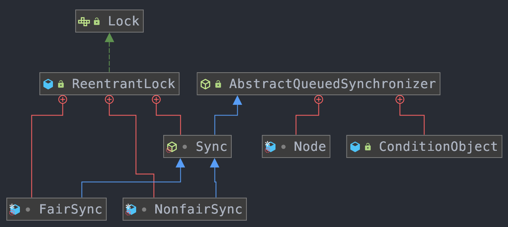
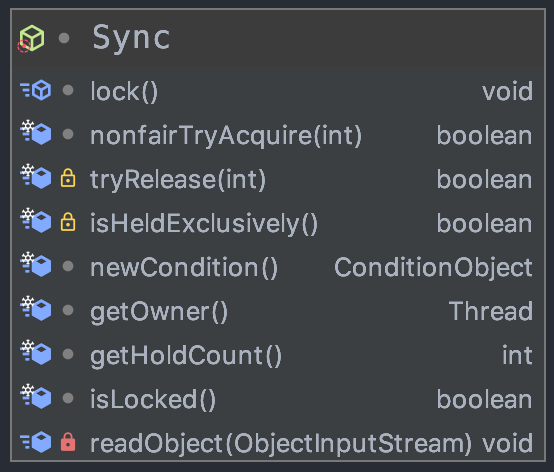
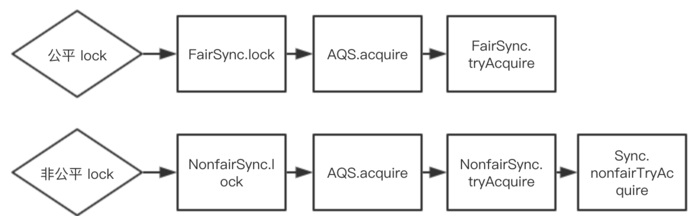

# 一、ReentrantLock

整体结构：



## 1、签名

ReentrantLock实现了Lock接口，Lock接口中定义了lock与unlock相关操作，并且还存在newCondition方法，表示生成一个条件
```java
public class ReentrantLock implements Lock, java.io.Serializable {
    // 创建一个 ReentrantLock ，默认是“非公平锁”。
	ReentrantLock()
	// 创建策略是fair的 ReentrantLock。fair为true表示是公平锁，fair为false表示是非公平锁。
	ReentrantLock(boolean fair)
	// 查询当前线程保持此锁的次数。
	int getHoldCount()
	// 返回目前拥有此锁的线程，如果此锁不被任何线程拥有，则返回 null。
	protected Thread getOwner()
	// 返回一个 collection，它包含可能正等待获取此锁的线程。
	protected Collection<Thread> getQueuedThreads()
	// 返回正等待获取此锁的线程估计数。
	int getQueueLength()
	// 返回一个 collection，它包含可能正在等待与此锁相关给定条件的那些线程。
	protected Collection<Thread> getWaitingThreads(Condition condition)
	// 返回等待与此锁相关的给定条件的线程估计数。
	int getWaitQueueLength(Condition condition)
	// 查询给定线程是否正在等待获取此锁。
	boolean hasQueuedThread(Thread thread)
	// 查询是否有些线程正在等待获取此锁。
	boolean hasQueuedThreads()
	// 查询是否有些线程正在等待与此锁有关的给定条件。
	boolean hasWaiters(Condition condition)
	// 如果是“公平锁”返回true，否则返回false。
	boolean isFair()
	// 查询当前线程是否保持此锁。
	boolean isHeldByCurrentThread()
	// 查询此锁是否由任意线程保持。
	boolean isLocked()
	// 获取锁。
	void lock()
	// 如果当前线程未被中断，则获取锁。
	void lockInterruptibly()
	// 返回用来与此 Lock 实例一起使用的 Condition 实例。
	Condition newCondition()
	// 仅在调用时锁未被另一个线程保持的情况下，才获取该锁。
	boolean tryLock()
	// 如果锁在给定等待时间内没有被另一个线程保持，且当前线程未被中断，则获取该锁。
	boolean tryLock(long timeout， TimeUnit unit)
	// 试图释放此锁。
	void unlock()
}
```
通过分析ReentrantLock的源码，可知对其操作都转化为对Sync对象的操作，由于Sync继承了AQS，所以基本上都可以转化为对AQS的操作

## 2、概述

ReentrantLock意思为可重入锁，指的是一个线程能够对一个临界资源重复加锁
- 在同一个时间点只能被一个线程持有，而可重入即可以被单个线程多次获取。主要是修改state值，重入多少次，就得释放多少次锁，保证释放之后state变为0；
- ReentrantLock 分为"公平锁"和"非公平锁"，区别在于获取锁的机制上是否公平；
- ReentrantLock 是通过一个 FIFO 的等待队列来管理获取该锁的所有线程。"公平锁"的机制下，线程依次排队获取；而"非公平锁"在锁是可获取状态时，不管自己是不是在队列的开头都会获取锁。
- ReentrantLock中，包含了Sync对象。而且Sync 是 AQS 的子类，其中Sync 有两个子类 FairSync（公平锁）和	NonFairSync（非公平锁）；ReentrantLock 是一个独占锁，至于它到底是公平锁还是非公平锁，就取决于sync对象是"FairSync的实例"还是"NonFairSync的实例"；默认是非公平锁
- 提供了一个Condition类，可以分组唤醒需要唤醒的线程。
- 公平性、可重入、可中断、超时机制；
- Sync为ReentrantLock里面的一个内部类，它继承AQS（[AbstractQueuedSynchronizer](AbstractQueuedSynchronizer.md)），它有两个子类：公平锁FairSync和非公平锁NonfairSync。ReentrantLock里面大部分的功能都是委托给Sync来实现的，同时Sync内部定义了lock()抽象方法由其子类去实现，默认实现了nonfairTryAcquire(int acquires)方法，可以看出它是非公平锁的默认实现方式。

## 3、Sync同步器



从其类图中可以看出，lock 方法是个抽象方法，留给 FairSync 和 NonfairSync 两个子类去实现
```java
abstract static class Sync extends AbstractQueuedSynchronizer {
    // 序列号
    private static final long serialVersionUID = -5179523762034025860L;
    // 获取锁
    abstract void lock();
    // 非公平方式获取
    final boolean nonfairTryAcquire(int acquires) {
        // 当前线程
        final Thread current = Thread.currentThread();
        // 获取状态
        int c = getState();
        if (c == 0) { // 表示没有线程正在竞争该锁
            if (compareAndSetState(0, acquires)) { // 比较并设置状态成功，状态0表示锁没有被占用
                // 设置当前线程独占
                setExclusiveOwnerThread(current); 
                return true; // 成功
            }
        }
        else if (current == getExclusiveOwnerThread()) { // 当前线程拥有该锁
            int nextc = c + acquires; // 增加重入次数
            if (nextc < 0) // overflow
                throw new Error("Maximum lock count exceeded");
            // 设置状态
            setState(nextc); 
            // 成功
            return true; 
        }
        // 失败
        return false;
    }
    // 试图在共享模式下获取对象状态，此方法应该查询是否允许它在共享模式下获取对象状态，如果允许，则获取它
    protected final boolean tryRelease(int releases) {
        int c = getState() - releases;
        if (Thread.currentThread() != getExclusiveOwnerThread()) // 当前线程不为独占线程
            throw new IllegalMonitorStateException(); // 抛出异常
        // 释放标识
        boolean free = false; 
        if (c == 0) {
            free = true;
            // 已经释放，清空独占
            setExclusiveOwnerThread(null); 
        }
        // 设置标识
        setState(c); 
        return free; 
    }
    // 判断资源是否被当前线程占有
    protected final boolean isHeldExclusively() {
        // While we must in general read state before owner,
        // we don't need to do so to check if current thread is owner
        return getExclusiveOwnerThread() == Thread.currentThread();
    }

    // 新生一个条件
    final ConditionObject newCondition() {
        return new ConditionObject();
    }

    // Methods relayed from outer class
    // 返回资源的占用线程
    final Thread getOwner() {        
        return getState() == 0 ? null : getExclusiveOwnerThread();
    }
    // 返回状态
    final int getHoldCount() {            
        return isHeldExclusively() ? getState() : 0;
    }
    // 资源是否被占用
    final boolean isLocked() {        
        return getState() != 0;
    }
    /**
        * Reconstitutes the instance from a stream (that is, deserializes it).
        */
    // 自定义反序列化逻辑
    private void readObject(java.io.ObjectInputStream s)
        throws java.io.IOException, ClassNotFoundException {
        s.defaultReadObject();
        setState(0); // reset to unlocked state
    }
}　　
```

### 3.1、非公平获取锁：nonfairTryAcquire

```java
// 尝试获得非公平锁
final boolean nonfairTryAcquire(int acquires) {
    final Thread current = Thread.currentThread();
    int c = getState();
    // 同步器的状态是 0，表示同步器的锁没有人持有
    if (c == 0) {
        // 当前线程持有锁
        if (compareAndSetState(0, acquires)) {
            // 标记当前持有锁的线程是谁
            setExclusiveOwnerThread(current);
            return true;
        }
    }
    // 如果当前线程已经持有锁了，同一个线程可以对同一个资源重复加锁，代码实现的是可重入锁
    else if (current == getExclusiveOwnerThread()) {
        // 当前线程持有锁的数量 + acquires
        int nextc = c + acquires;
        // int 是有最大值的，<0 表示持有锁的数量超过了 int 的最大值
        if (nextc < 0) // overflow
            throw new Error("Maximum lock count exceeded");
        setState(nextc);
        return true;
    }
    //否则线程进入同步队列
    return false;
}
```
通过代码可以看出：
- 通过判断 AQS 的 state 的状态来决定是否可以获得锁，0 表示锁是空闲的；
- else if 的代码体现了可重入加锁，同一个线程对共享资源重入加锁，底层实现就是把 state + 1，并且可重入的次数是有限制的，为 Integer 的最大值；
- 这个方法是非公平的，所以只有非公平锁才会用到，公平锁是另外的实现

无参的 tryLock 方法调用的就是此方法，tryLock 的方法源码如下：
```java
public boolean tryLock() {
    // 入参数是 1 表示尝试获得一次锁
    return sync.nonfairTryAcquire(1);
}
```

### 3.2、释放锁：tryRelease

```java
// 释放锁方法，非公平和公平锁都使用
protected final boolean tryRelease(int releases) {
    // 当前同步器的状态减去释放的个数，releases 一般为 1
    int c = getState() - releases;
    // 当前线程根本都不持有锁，报错
    if (Thread.currentThread() != getExclusiveOwnerThread())
        throw new IllegalMonitorStateException();
    boolean free = false;
    // 如果 c 为 0，表示当前线程持有的锁都释放了
    if (c == 0) {
        free = true;
        setExclusiveOwnerThread(null);
    }
    // 如果 c 不为 0，那么就是可重入锁，并且锁没有释放完，用 state 减去 releases 即可，无需做其他操作
    setState(c);
    return free;
}
```
tryRelease 方法是公平锁和非公平锁都公用的，在锁释放的时候，是没有公平和非公平的说法的。

从代码中可以看到，锁最终被释放的标椎是 state 的状态为 0，在重入加锁的情况下，需要重入解锁相应的次数后，才能最终把锁释放，比如线程 A 对共享资源 B 重入加锁 5 次，那么释放锁的话，也需要释放 5 次之后，才算真正的释放该共享资源了

## 4、公平锁

FairSync 公平锁只实现了 lock 和 tryAcquire 两个方法，lock 方法非常简单，如下：
```java
// acquire 是 AQS 的方法，表示先尝试获得锁，失败之后进入同步队列阻塞等待
final void lock() {
    acquire(1);
}
```
tryAcquire 方法是 AQS 在 acquire 方法中留给子类实现的抽象方法，FairSync 中实现的源码如下：
```java
// 是按照通过CLH等待线程按照先来先得的规则，公平的获取锁；获取锁是通过lock()函数，是在ReentrantLock.java的FairSync类中实现，吞吐量比较低；
protected final boolean tryAcquire(int acquires) {
    final Thread current = Thread.currentThread();
    int c = getState();
    if (c == 0) {
        // hasQueuedPredecessors 是实现公平的关键
        // 会判断当前线程是不是属于同步队列的头节点的下一个节点(头节点是释放锁的节点)
        // 如果是(返回false)，符合先进先出的原则，可以获得锁
        // 如果不是(返回true)，则继续等待
        if (!hasQueuedPredecessors() &&
            compareAndSetState(0, acquires)) {
            setExclusiveOwnerThread(current);
            return true;
        }
    }
    // 可重入锁
    else if (current == getExclusiveOwnerThread()) {
        int nextc = c + acquires;
        if (nextc < 0)
            throw new Error("Maximum lock count exceeded");
        setState(nextc);
        return true;
    }
    return false;
}
```
当资源空闲时，它总是会先判断sync队列(AbstractQueuedSynchronizer中的数据结构)是否有等待时间更长的线程，如果存在，则将该线程加入到等待队列的尾部，实现了公平获取原则。其中，FairSync类的lock的方法调用如下，只给出了主要的方法；

只要资源被其他线程占用，该线程就会添加到sync queue中的尾部，而不会先尝试获取资源。这也是和Nonfair最大的区别，Nonfair每一次都会尝试去获取资源，如果此时该资源恰好被释放，则会被当前线程获取，这就造成了不公平的现象，当获取不成功，再加入队列尾部

## 5、非公平锁

### 5.1、lock()

从lock方法的源码可知，每一次都尝试获取锁，而并不会按照公平等待的原则进行等待，让等待时间最久的线程获得锁
- 在当线程要获取锁时，它会无视CLH等待队列而直接获取锁；
- 是不完全按照请求的顺序，在一定的情况下，可以插队；
- 提交效率，避免唤醒带来的空档期；减少切换成本
- 可能存在饥饿问题，也就是某些线程在长时间内得不到执行。
- tryLock使用的是非公平锁

NonfairSync 底层实现了 lock 和 tryAcquire 两个方法
```java
// 加锁
final void lock() {
    // 若通过CAS设置变量State（同步状态）成功，也就是获取锁成功，则将当前线程设置为独占线程。
    if (compareAndSetState(0, 1))
        // cas 赋值成功，代表拿到当前锁，记录拿到锁的线程
        setExclusiveOwnerThread(Thread.currentThread());
    else
        // 若通过CAS设置变量State（同步状态）失败，也就是获取锁失败，则进入Acquire方法进行后续处理
        // acquire 是抽象类AQS的方法,
        // 会再次尝试获得锁，失败会进入到同步队列中
        acquire(1);
}
// 直接使用的是 Sync.nonfairTryAcquire 方法 
protected final boolean tryAcquire(int acquires) {
    return nonfairTryAcquire(acquires);
}
```
对比公平与非公平锁，发现主要区别是：hasQueuedPredecessors，公平锁是将所有的线程放在一个队列中，一个线程执行完成后，从队列中取出下一个线程，而非公平锁则没有这个队列

### 5.2、lockInterruptibly()

### 5.1、lock 与 lockInterruptibly 的区别

- lock有限考虑获取锁，待获取锁成功后才响应中断。ReentrantLock.lock 方法不允许Thread.interrupt中断，及时检测到 Thread.isInterrupted = true，也一样会继续尝试获取锁，失败则继续休眠；只是在最后获取锁成功会把当前线程置为 interrupted 状态；

- lockInterruptibly 有限考虑响应中断，而不是响应锁的普通获取或重入获取； lockInterruptibly 允许在等待时，有其他线程调用等待线程的 Thread.interrupt 并直接返回，时不用获取锁，而是抛出 InterruptedException；

由于 lock 方法的强制忽略中断，所以只有 acquireQueued方法内部真正获得许可以后，去判断 Thread.isInterrupted 是否是中断状态。如果不是则无所谓，是中断状态会做中断操作，当然这个中断操作仅仅是一个标记，会向商场进行传递，最终由 selfInterrupt()来做真正的中断操作；

## 6、如何将lock、tryLock、unlock串起来

### 6.1、加锁

```java
public void lock() {
    sync.lock();
}
```



### 6.2、tryLock 尝试加锁

tryLock 有两个方法，一种是无参的，一种提供了超时时间的入参，两种内部是不同的实现机制，代码分别如下：
```java
// 无参构造器
public boolean tryLock() {
    return sync.nonfairTryAcquire(1);
}
// timeout 为超时的时间，在时间内，仍没有得到锁，会返回 false
public boolean tryLock(long timeout, TimeUnit unit)
        throws InterruptedException {
    return sync.tryAcquireNanos(1, unit.toNanos(timeout));
}
```

- 无参方法调用关系：`非公平的 tryLock -> Sync.nonfairTryAcquire`；无参的tryLock没有公平锁的实现，只有非公平锁的实现；
- 带有超时时间的有参 tryLock 的调用实现图：
	- 公平锁：FairSync.tryAcquire
	- 非公平锁：`NonFairSync.tryAcquire -> Sync.nonfairTryAcquire`

### 6.3、释放锁

unlock 释放锁的方法，底层调用的是 Sync 同步器的 release 方法，release 是 AQS 的方法，分成两步：
- 尝试释放锁，如果释放失败，直接返回 false；
- 释放成功，从同步队列的头节点的下一个节点开始唤醒，让其去竞争锁

## 7、保证可见性

```java
class LockDemo{
	private final Lock rtl = new ReentrantLock();
	int value;
	public void addOne(){
		rtl.lock();
		try{
			value += 1;
		} finally{
			rtl.unlock();
		}
	}
}
```

利用volatile的相关的happens-before规则。ReentrantLock中有一个实现锁的Sync中其持有一个volatile的成员变量state，获取锁的时候，会读写state的值；解锁的时候，也会读写state的值。

在执行`value+1`之前，程序会先读写一次volatile变量state，在执行`value+1`之后，又读写了一次volatile变量state，根据happens-before规则：
- 顺序性规则：对于线程T1，`value+1` happens-before 释放锁的操作 unlock();
- volatile变量规则：由于state=1会先读取state，所以线程T1的 unlock() 操作 happens-before 线程T2的 lock 操作；
- 传递性规则：线程T1的`value+1` happens-before 线程T2的 lock 操作

# 二、Condition

## 1、签名

```java
public interface Condition {
    // 造成当前线程在接到信号或被中断之前一直处于等待状态
    void await() throws InterruptedException;
    // 造成当前线程在接到信号之前一直处于等待状态。【注意：该方法对中断不敏感】
    void awaitUninterruptibly();
    // 造成当前线程在接到信号、被中断或到达指定等待时间之前一直处于等待状态。返回值表示剩余时间，如果在nanosTimesout之前唤醒，那么返回值 = nanosTimeout – 消耗时间，
    // 如果返回值 <= 0 ,则可以认定它已经超时了
    long awaitNanos(long nanosTimeout) throws InterruptedException;
    // 造成当前线程在接到信号、被中断或到达指定等待时间之前一直处于等待状态
    boolean await(long time, TimeUnit unit) throws InterruptedException;
    // 造成当前线程在接到信号、被中断或到达指定最后期限之前一直处于等待状态。如果没有到指定时间就被通知，则返回true，否则表示到了指定时间，返回返回false
    boolean awaitUntil(Date deadline) throws InterruptedException;
    // 唤醒一个等待线程。该线程从等待方法返回前必须获得与Condition相关的锁
    void signal();
    // 唤醒所有等待线程。能够从等待方法返回的线程必须获得与Condition相关的锁
    void signalAll();
}
```

## 2、概述

- 为线程提供了一种更为灵活的等待/通知模式，线程在调用await方法后执行挂起操作，直到线程等待的某个条件为真时才会被唤醒；
- Condition必须要配合锁一起使用，因为对共享状态变量的访问发生在多线程环境下。一个Condition的实例必须与一个Lock绑定，因此Condition一般都是作为Lock的内部实现
- 获取一个Condition必须要通过Lock的newCondition()方法。该方法定义在接口Lock下面，返回的结果是绑定到此 Lock 实例的新 Condition 实例；

## 3、Condition的实现

Condition为一个接口，其下仅有一个实现类ConditionObject；由于Condition的操作需要获取相关的锁，而AQS则是同步锁的实现基础，所以ConditionObject则定义为AQS的内部类
```java
public class ConditionObject implements Condition, java.io.Serializable {
    private transient Node firstWaiter;
    private transient Node lastWaiter;
    // Creates a new {@code ConditionObject} instance.
    public ConditionObject() { }
}
```

### 3.1、等待队列

每个Condition对象都包含着一个FIFO队列，该队列是Condition对象通知/等待功能的关键。在队列中每一个节点都包含着一个线程引用，该线程就是在该Condition对象上等待的线程；

Node里面包含了当前线程的引用。Node定义与AQS的CLH同步队列的节点使用的都是同一个类（AbstractQueuedSynchronized.Node静态内部类）

一个线程获取锁后，通过调用Condition的await()方法，会将当前线程先加入到条件队列中，然后释放锁，最后通过isOnSyncQueue(Node node)方法不断自检看节点是否已经在CLH同步队列了，如果是则尝试获取锁，否则一直挂起。当线程调用signal()方法后，程序首先检查当前线程是否获取了锁，然后通过doSignal(Node first)方法唤醒CLH同步队列的首节点。被唤醒的线程，将从await()方法中的while循环中退出来，然后调用acquireQueued()方法竞争同步状态。


# 参考资料

* [ReentrantLock](https://www.cnblogs.com/maypattis/p/6403682.html)
* [Condition](http://cmsblogs.com/?p=2222&okjozg=erwtf2)
* [AQS](https://javadoop.com/post/AbstractQueuedSynchronizer-2)
