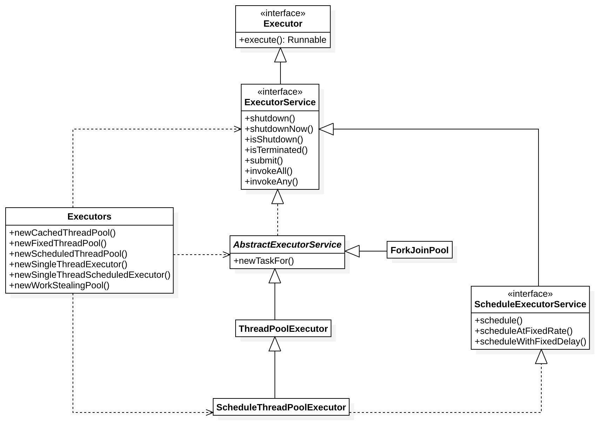
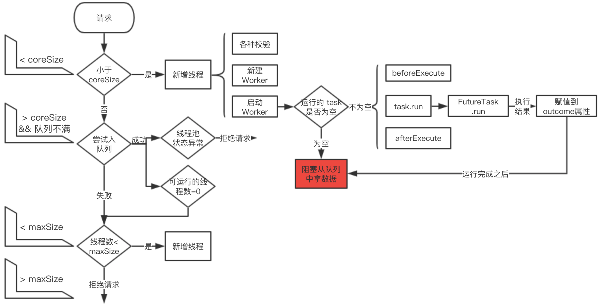
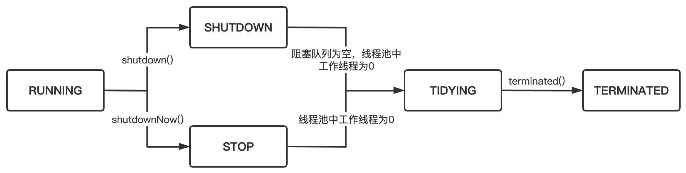
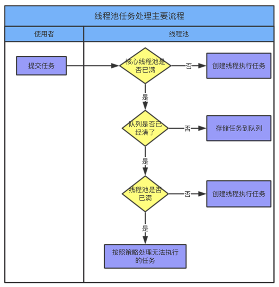
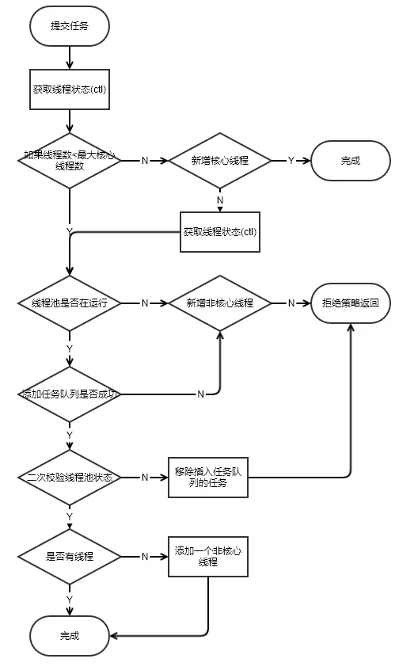
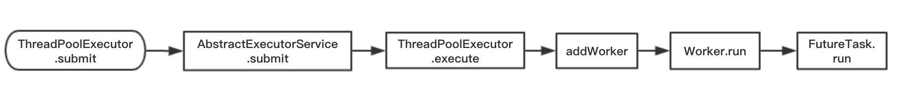
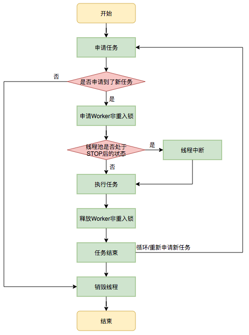
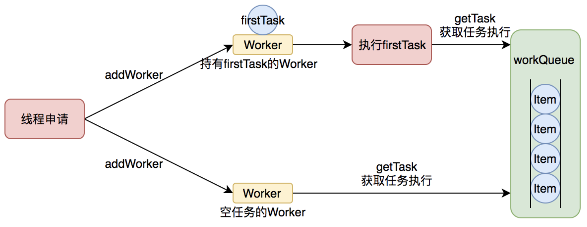
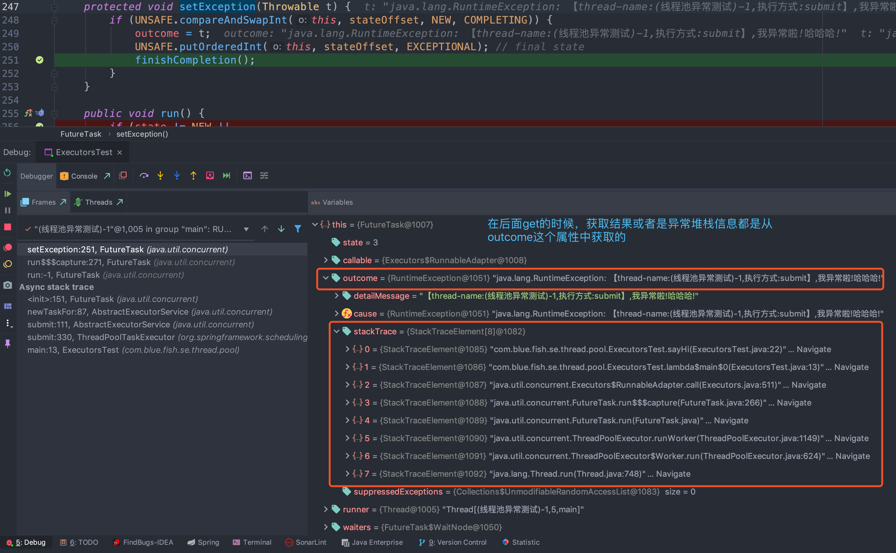
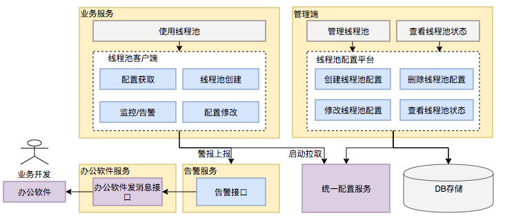

# 1、概要

## 1.1、为什么使用线程池

线程池（Thread Pool）是一种基于池化思想管理线程的工具，经常出现在多线程服务中。

线程过多会带来额外的开销，其中包括创建销毁线程的开销、调度线程的开销等等，同时也降低了计算机的整体性能。线程池维护多个线程，等待监督管理者分配可并发执行的任务。这种做法，一方面避免了处理任务时创建销毁线程开销的代价，另一方面避免了线程数量膨胀导致的过分调度问题，保证了对内核的充分利用

- 降低资源消耗：通过池化技术重复利用已创建的线程，降低线程创建和销毁造成的损耗。
- 提高响应速度：任务到达时，无需等待线程创建即可立即执行。
- 提高线程的可管理性：线程是稀缺资源，如果无限制创建，不仅会消耗系统资源，还会因为线程的不合理分布导致资源调度失衡，降低系统的稳定性。使用线程池可以进行统一的分配、调优和监控。
- 提供更多更强大的功能：线程池具备可拓展性，允许开发人员向其中增加更多的功能。比如延时定时线程池ScheduledThreadPoolExecutor，就允许任务延期执行或定期执行

线程重用：线程的创建和销毁开销是巨大的，而通过线程池的重用大大减少了这些不必要的开销，当然既然少了这么多开销，其线程执行速度也是突飞猛进的提升。
控制线程池的并发数：线程不是并发的越多，性能越高，反而在线程并发太多时，线程的切换会消耗系统大量的资源，可以通过设置线程池最大并发线程数目，维持系统高性能。
线程池可以对线程进行管理：虽然线程提供了线程组操控线程，但是线程池拥有更多管理线程的API。
可以储存需要执行的任务：当任务提交过多时，可以将任务储存起来，等待线程处理。


## 1.2、线程池解决的问题

线程池解决的核心问题就是资源管理问题。在并发环境下，系统不能够确定在任意时刻中，有多少任务需要执行，有多少资源需要投入；

为解决资源分配这个问题，线程池采用了“池化”（Pooling）思想。池化，顾名思义，是为了最大化收益并最小化风险，而将资源统一在一起管理的一种思想

## 1.3、应用范围

- 需要大量线程来完成的任务，且完成任务时间较短，如web服务完成网页请求这样的任务。但是对于长时间的任务，比如一个ftp连接请求；
- 对性能要求苛刻的应用，比如要求服务器迅速响应客户请求；
- 接受突发性的大量请求，但不至于使服务器因此产生大量线程的应用；

## 1.4、如何设计一个线程池

- 基本组成部分
	- 线程池管理器：用于创建并管理线程池，包括创建线程池、销毁线程池、添加新任务等功能；
	- 工作线程：线程池中的线程；
	- 任务接口：每个任务必须实现的接口，以供工作线程调度任务执行；
	- 任务队列：用于存放没有处理的任务，提供一种缓存机制；

## 1.5、线程池原理

预先启动一些线程，线程无限循环从任务队列中获取一个任务进行执行，直到线程池被关闭。如果某个线程因为执行某个任务发生异常而终止，那么重新创建一个新的线程而已。如此反复。线程池的实现类是 ThreadPoolExecutor 类；

核心工作线程值在初始的时候被创建，当新任务来到的时候被启动，但是我们可以通过重写 prestartCoreThread 或 prestartAllCoreThreads 方法来改变这种行为。通常场景我们可以在应用启动的时候来 WarmUp 核心线程，从而达到任务过来能够立马执行的结果，使得初始任务处理的时间得到一定优化

# 2、JDK线程池结构

Executor框架结构：



- Executor 是一个基础的接口，其初衷是将任务提交和任务执行细节解耦，用户无需关注如何创建线程，如何调度线程来执行任务，用户只需提供Runnable对象，将任务的运行逻辑提交到执行器(Executor)中，由Executor框架完成线程的调配和任务的执行部分，其只有一个方法：
	```java
	void execute(Runnable command);
	```
- ExecutorService不仅提供Service管理功能，如shutdown等方法，也提供了更加全面的提交任务机制，如返回 Future，其解决了Runnable无法返回结果的困扰；
- AbstractExecutorService，其实现了非常有用的一些方法供子类直接使用，将执行任务的流程串联了起来，保证下层的实现只需关注一个执行任务的方法即可
- Java提供了几种基础实现：ThreadPoolExecutor、ScheduleThreadPoolExecutor、ForkJoinPool；
- ThreadPoolExecutor：一方面维护自身的生命周期，另一方面同时管理线程和任务
- Executors 提供了各种方便的静态工厂方法；
- 由于线程池支持获取线程执行的结果，所以，引入了Future接口，RunnableFuture 继承自此接口，其主要实现类是FutureTask；在线程池的使用过程中，我们是往线程池提交任务（task），使用过线程池的都知道，我们提交的每个任务是实现了 Runnable 接口的，其实就是先将 Runnable 的任务包装成 FutureTask，然后再提交到线程池

## 2.1、Executor

```java
public interface Executor {
    void execute(Runnable command);
}
```
如果我们希望线程池同步执行每一个任务，我们可以这么实现这个接口：
```java
class DirectExecutor implements Executor {
    public void execute(Runnable r) {
        r.run();// 这里不是用的new Thread(r).start()，也就是说没有启动任何一个新的线程。
    }
}
```
我们希望每个任务提交进来后，直接启动一个新的线程来执行这个任务，我们可以这么实现：
```java
class ThreadPerTaskExecutor implements Executor {
    public void execute(Runnable r) {
        new Thread(r).start();  // 每个任务都用一个新的线程来执行
    }
}
```
Executor是基于生产者-消费者模式，提交任务的操作相当于生产者，执行任务的线程相当于消费者；

Executor接口职责并不是提供一个线程池的接口，而是提供一个“将来执行命令”的接口。真正能代表线程池意义的，是ThreadPoolExecutor类，而不是Executor接口；

## 2.2、ExecutorService-真正的线程池接口

这个接口继承自Executor，主要是添加了一些线程池生命周期的管理方法；
```java
// 关闭，不会接受新的任务，也不会等待未完成的任务
// 如果需要等待未完成的任务，可以使用 awaitTermination 方法
void shutdown();
// executor 是否已经关闭了，返回值 true 表示已关闭
boolean isShutdown();
// 所有的任务是否都已经终止，是的话，返回 true
boolean isTerminated();
// 在超时时间内，等待剩余的任务终止
boolean awaitTermination(long timeout, TimeUnit unit) throws InterruptedException;
// 提交有返回值的任务，使用 get 方法可以阻塞等待任务的执行结果返回
<T> Future<T> submit(Callable<T> task);
// 提交没有返回值的任务，如果使用 get 方法的话，任务执行完之后得到的是 null 值
Future<?> submit(Runnable task);
// 给定任务集合，返回已经执行完成的 Future 集合，每个返回的 Future 都是 isDone = true 的状态
<T> List<Future<T>> invokeAll(Collection<? extends Callable<T>> tasks) throws InterruptedException;
// 给定任务中有一个执行成功就返回，如果抛异常，其余未完成的任务将被取消
<T> T invokeAny(Collection<? extends Callable<T>> tasks) throws InterruptedException, ExecutionException;
```
ExecutorService的生命周期有三种状态：运行、关闭、终止。
- ExecutorService在创建时处于运行状态；
- shutdown方法将执行平滑的关闭过程：不再接受新的任务，同时等待已经提交的任务执行完成，包括那些还未开始执行的任务。
- shutdownNow方法将执行粗暴的关闭过程：它将尝试取消所有运行中的任务，并且不再启动队列中尚未开始执行的任务；

在ExecutorService关闭后提交的任务将由拒绝策略来进行处理；

## 2.3、AbstractExecutorService

其是一个抽象类，封装了 Executor 的很多通用功能：
```java
// 把 Runnable 转化成 RunnableFuture
// RunnableFuture 是一个接口，实现了 Runnable 和 Future
// FutureTask 是 RunnableFuture 的实现类，主要是对任务进行各种管理
// Runnable + Future => RunnableFuture => FutureTask
protected <T> RunnableFuture<T> newTaskFor(Runnable runnable, T value) {
    return new FutureTask<T>(runnable, value);
}
protected <T> RunnableFuture<T> newTaskFor(Callable<T> callable) {
    return new FutureTask<T>(callable);
}
// 提交无返回值的任务
public Future<?> submit(Runnable task) {
    if (task == null) throw new NullPointerException();
    // ftask 其实是 FutureTask
    RunnableFuture<Void> ftask = newTaskFor(task, null);
    execute(ftask);
    return ftask;
}
// 提交有返回值的任务
public <T> Future<T> submit(Callable<T> task) {
    if (task == null) throw new NullPointerException();
    // ftask 其实是 FutureTask
    RunnableFuture<T> ftask = newTaskFor(task);
    execute(ftask);
    return ftask;
}
public <T> List<Future<T>> invokeAll(Collection<? extends Callable<T>> tasks)
    throws InterruptedException {
    if (tasks == null)
        throw new NullPointerException();
    ArrayList<Future<T>> futures = new ArrayList<Future<T>>(tasks.size());
    boolean done = false;
    try {
        for (Callable<T> t : tasks) {
            RunnableFuture<T> f = newTaskFor(t);
            futures.add(f);
            execute(f);
        }
        for (int i = 0, size = futures.size(); i < size; i++) {
            Future<T> f = futures.get(i);
            if (!f.isDone()) {
                try {
                    f.get();
                } catch (CancellationException ignore) {
                } catch (ExecutionException ignore) {
                    // 如果线程里抛出了异常，都被包装成了ExecutionException，而ThreadPoolExecutor#invokeAll方法里忽略了这个异常，导致我们根本捕捉不到异常
                }
            }
        }
        done = true;
        return futures;
    } finally {
        if (!done)
            for (int i = 0, size = futures.size(); i < size; i++)
                futures.get(i).cancel(true);
    }
}
```

## 2.4、ThreadPoolExecutor

ExecutorService 的默认实现，线程池中最核心的一个类，其继承自 AbstractExecutorService

## 2.5、ScheduledThreadPoolExecutor

**Timer/TimerTask存在问题：**
- Timer 支持基于绝对时间而不是相对时间的调度机制，因此任务的执行对系统时钟变化很敏感，而ScheduledThreadPoolExecutor只支持基于相对时间的调度；
- Timer 实际就是根据任务的执行时间维护了一个优先队列，并且起了一个线程不断地拉取任务执行；首先优先队列的插入和删除的时间复杂度是$O(logN)$，当数据量大的时候，频繁的入堆出堆性能有待考虑；在执行所有定时任务时只会创建一个线程。如果某个任务执行时间过长，那么将破坏其他TimerTask的定时精确性；
- Timer 创建的线程没有处理异常，因此一旦抛出非受检异常，该线程会立即终止，也不会恢复线程的运行；

**ScheduledExecutorService：和Timer/TimerTask类似，解决那些需要任务重复执行的问题**
- 继承`ThreadPoolExecutor`的`ScheduledExecutorService`接口实现，周期性任务调度的类实现；提供了`“延迟”`和`“周期执行”`功能的ThreadPoolExecutor；
- 一旦启用已延迟的任务就执行它，但是有关何时启用，启用后何时执行则没有任何实时保证。按照提交的先进先出 (FIFO) 顺序来启用那些被安排在同一执行时间的任务；
- 一般通过`Executors.newScheduledThreadPool(int);`来构造一个`ScheduledThreadPoolExecutor`对象；
- 它所使用的阻塞队列变成了 DelayedWorkQueue，而不是`ThreadLocalExecutor`的`LinkedBlockingQueue`；
- `DelayedWorkQueue` 为 `ScheduledThreadPoolExecutor` 中的内部类，它其实和阻塞队列 DelayQueue 有点儿类似。 DelayQueue 是可以提供延迟的阻塞队列，它只有在延迟期满时才能从中提取元素，其列头是延迟期满后保存时间最长的Delayed元素。如果延迟都还没有期满，则队列没有头部，并且 poll 将返回 null；

**ScheduledThreadPoolExecutor内部结构**

`ScheduledThreadPoolExecutor`内部构造了两个内部类 `ScheduledFutureTask` 和 `DelayedWorkQueue`:
- `ScheduledFutureTask`: 继承了FutureTask，说明是一个异步运算任务；最上层分别实现了Runnable、Future、Delayed接口，说明它是一个可以延迟执行的异步运算任务；
- `DelayedWorkQueue`: 这是 `ScheduledThreadPoolExecutor` 为存储周期或延迟任务专门定义的一个延迟队列，继承了 AbstractQueue，为了契合 `ThreadPoolExecutor` 也实现了 `BlockingQueue` 接口；它内部只允许存储 `RunnableScheduledFuture` 类型的任务；与 DelayQueue 的不同之处就是它只允许存放 `RunnableScheduledFuture` 对象，并且自己实现了二叉堆(DelayQueue 是利用了 PriorityQueue 的二叉堆结构)；

**ScheduledThreadPoolExecutor的定时API**

ScheduledThreadPoolExecutor 是继承 ThreadPoolExecutor，实现 ScheduledExecutorService 接口的，主要关于定时执行的方法：
```java
// 可以获取到定时任务执行的结果，创建并执行在给定延迟后启用的ScheduledFuture
schedule(Callable<V> callable, long delay, TimeUnit unit);
// 创建并执行在给定延迟后启用的一次性操作
schedule(Runnable command, long delay, TimeUnit unit);
// 创建并执行一个在给定初始延迟后首次启用的定期操作，后续操作具有给定的周期；也就是将在initialDelay后开始执行，然后在 
// initialDelay+period 后执行，接着在initialDelay + 2 * period后执行，依此类推。 
// 如果任务的执行遇到异常，则后续的执行被抑制。 否则，任务将仅通过取消或终止执行人终止；如果任务执行时间比其周期长，则后续执行可能会迟到，但不会同时执行
scheduleAtFixedRate(Runnable command, long initialDelay, long period, TimeUnit unit);
// 创建并执行一个在给定初始延迟后首次启用的定期操作，随后，在每一次执行终止和下一次执行开始之间都存在给定的延迟。
// 如果任务的执行遇到异常，则后续的执行被抑制。 否则，任务将仅通过取消或终止执行人终止
scheduleWithFixedDelay(Runnable command, long initialDelay, long delay, TimeUnit unit);
```
**scheduleAtFixedRate 与 scheduleWithFixedDelay 区别：**
- scheduleAtFixedRate 的period时间包含任务执行的时间以及到下一次任务之间的区间；比如period时间是5秒，但是任务执行时长是6秒，那么就得等到6秒后才执行下一次；如果任务执行时长是3秒，那么5秒之后就会执行下一次任务；
    ```
    start-----------[----------------]+++++++[-----------------][---------
        |init delay | execution time | idle  | execution time |
                    |          period        |
    ```
- scheduleWithFixedDelay 的 delay 是在上一次任务执行终止到下一次任务执行之间的间隔，不包含任务执行的时间长；比如一个任务设置的delay是10秒，然后其任务执行大概是10秒，那么下一次执行要等到20秒才执行；
    ```
    start-----------[----------------]+++++++[-----------------]+++++++[---------
        |init delay | execution time | delay  | execution time | delay |
    ```
    ```java
    ScheduledExecutorService pool = new ScheduledThreadPoolExecutor(2, Executors.defaultThreadFactory());
    pool.scheduleAtFixedRate(() -> {
        Thread.sleep(6000);
        System.out.println("scheduleAtFixedRate: " + LocalDateTime.now());
    }, 1, 5000, TimeUnit.MILLISECONDS);
    pool.scheduleWithFixedDelay(() -> {
        Thread.sleep(5000);
        System.out.println("scheduleWithFixedDelay: " + LocalDateTime.now());
    }, 1, 5000, TimeUnit.MILLISECONDS);
    ```
ScheduledFutureTask.cancel本质上由其父类 FutureTask.cancel 实现。取消任务成功后会根据removeOnCancel参数决定是否从队列中移除此任务

## 2.6、ForkJoinPool

JDK7提供的类，把一个任务拆分成若干个小任务（Fork），最终再把每个小任务的结果汇总（Join）的框架；比较适合分而治之、递归计算的CPU密集场景；其使用的是工作窃取算法；

对于一般的队列来说，入队元素都是在“队尾”，出队元素在“队首”，要满足“工作窃取”的需求，任务队列应该支持从“队尾”出队元素，这样可以减少与其它工作线程的冲突（因为正常情况下，其它工作线程从“队首”获取自己任务队列中的任务），但是Fork/Join框架并没有直接利用LinkedBlockingDeque作为任务队列，而是自己重新实现了一个；

ForkJoinPool构建方式：
- 通过3种构造器的任意一种进行构造；
- 通过ForkJoinPool.commonPool()静态方法构造

## 2.7、Executors创建线程池

Executors 提供了5种不同的线程池创建方式
- newCachedThreadPool()：用来处理大量短时间工作任务的线程池，其内部使用 SynchronousQueue作为工作队列具有以下几个特点：
	- 它会试图缓存线程并重用，当无缓存线程可用时，就会创建新的工作线程；
	- 如果线程限制的时间超过60秒，则会被终止并移出缓存；
	- 长时间闲置时，这种线程池，不会消耗什么资源；

- newFixedThreadPool(int nThreads)：重用指定数目的线程，其背后使用的是无界工作队列，任何时候最大只有nThreads个工作线程是活动的。这意味着，如果任务数量超过了活动队列数目，将在工作队列等待空闲线程出现；如果有工作线程退出，将会有新的工作线程被创建，以补足指定的数目nthreads；

- newSingleThreadExecutor()：其她点在于工作线程数目被限制为1，操作一个无界的工作队列，所以它保证了所有任务都是被顺序执行的，最大会有一个任务处于活动状态，并且不允许使用者改动线程池实例，因此可以避免其改变线程数目；

- newSingleThreadScheduledExecutor()和newScheduledThreadPool(int corePoolSize)创建的是个ScheduledExecutorService，可以进行定时或周期性的工作调度，区别在于单一工作线程还是多个工作线程；

- newWorkStealingPool()，Java8加入的方法，其内部会构建ForkJoinPool，利用work-stealing算法，并行的处理任务，不保证处理顺序

***为什么不建议使用JDK自身提供的构建线程池的方式？***

使用Executors创建线程池可能会导致OOM（OutOfMemory ,内存溢出）。
- FixedThreadPool 和 SingleThreadPool：允许的请求队列长（LinkedBlockingQueue）度为 Integer.MAX_VALUE，可能会堆积大量的请求，从而导致 OOM。
- CachedThreadPool 和 ScheduledThreadPool：允许的创建线程数量（最大线程数量）为 Integer.MAX_VALUE，可能会创建大量的线程，从而导致 OOM

比如
- newFixedThreadPool
	```java
	public static ExecutorService newFixedThreadPool(int nThreads, ThreadFactory threadFactory) {
		return new ThreadPoolExecutor(nThreads, nThreads, 0L, TimeUnit.MILLISECONDS, new LinkedBlockingQueue<Runnable>(), threadFactory);
	}
	```
	```
	Exception in thread "main" java.lang.OutOfMemoryError: GC overhead limit exceeded
		at java.util.concurrent.LinkedBlockingQueue.offer(LinkedBlockingQueue.java:416)
		at java.util.concurrent.ThreadPoolExecutor.execute(ThreadPoolExecutor.java:1371)
		at com.learning.example.thread.pool.ExecutorsDemo.main(ExecutorsDemo.java:17)
	```
	真正的导致OOM的其实是 LinkedBlockingQueue.offer
- ArrayBlockingQueue是一个用数组实现的有界阻塞队列，必须设置容量。
- LinkedBlockingQueue是一个用链表实现的有界阻塞队列，容量可以选择进行设置，不设置的话，将是一个无边界的阻塞队列，最大长度为Integer.MAX_VALUE
  
除了调用`ThreadPoolExecutor`构造器之外，还可以使用Apache和Guava来使用线程池，可以使用guava的`ThreadFactoryBuilder`

# 3、ThreadPoolExecutor实现

线程池在内部实际上构建了一个生产者消费者模型，将线程和任务两者解耦，并不直接关联，从而良好的缓冲任务，复用线程
```java
public class ThreadPoolExecutor extends AbstractExecutorService {
    public ThreadPoolExecutor(int corePoolSize, int maximumPoolSize, long keepAliveTime, TimeUnit unit, BlockingQueue<Runnable> workQueue,
                                ThreadFactory threadFactory,  RejectedExecutionHandler handler) {
        if (corePoolSize < 0 || maximumPoolSize <= 0 || maximumPoolSize < corePoolSize ||  keepAliveTime < 0)
            throw new IllegalArgumentException();
        if (workQueue == null || threadFactory == null || handler == null)
            throw new NullPointerException();
        this.acc = System.getSecurityManager() == null ? null : AccessController.getContext();
        this.corePoolSize = corePoolSize;
        this.maximumPoolSize = maximumPoolSize;
        this.workQueue = workQueue;
        this.keepAliveTime = unit.toNanos(keepAliveTime);
        this.threadFactory = threadFactory;
        this.handler = handler;
    }
    // 线程池最大容量
    private int largestPoolSize;
    // 已经完成的任务数
    private long completedTaskCount;
    // 用户可控制的参数都是 volatile 修饰的，可以使用 threadFactory 创建 thread，创建失败一般不抛出异常，只有在 OutOfMemoryError 时候才会
    private volatile ThreadFactory threadFactory;
    // 饱和或者运行中拒绝任务的 handler 处理类
    private volatile RejectedExecutionHandler handler;
    // 线程存活时间设置
    private volatile long keepAliveTime;
    // 设置 true 的话，核心线程空闲 keepAliveTime 时间后，也会被回收
    private volatile boolean allowCoreThreadTimeOut;
    // 核心线程数大小
    private volatile int corePoolSize;
    // maxSize 最大限制 (2^29)-1，最大线程数
    private volatile int maximumPoolSize;
    // 默认的拒绝策略
    private static final RejectedExecutionHandler defaultHandler =new AbortPolicy();
    // 队列会 hold 住任务，并且利用队列的阻塞的特性，来保持线程的存活周期
    private final BlockingQueue<Runnable> workQueue;
    // 大多数情况下是控制对 workers 的访问权限
    private final ReentrantLock mainLock = new ReentrantLock();
    private final Condition termination = mainLock.newCondition();
    // 包含线程池中所有的工作线程
    private final HashSet<Worker> workers = new HashSet<Worker>();
...
}
```



## 3.1、核心参数

- corePoolSize：核心线程数大小，`当线程数 < corePoolSize`，会创建线程执行runnable；如果等于0，则任务执行完之后，没有任何请求进入时销毁线程池的线程；如果大于0，即使本地任务执行完毕，核心线程也不会被销毁；

- maximumPoolSize：最大线程数， `当线程数 >= corePoolSize`的时候，会把runnable放入workQueue中；largestPoolSize：记录了曾经出现的最大线程个数；如果待执行的线程数大于此值，需要借助第5个参数的帮助，缓存在队列中；如果`maximumPoolSize=corePoolSize`，即是固定大小线程池；

- keepAliveTime：保持存活时间，当线程数大于`corePoolSize`的空闲线程能保持的最大时间。在默认情况下，当线程池的线程数大于 `corePoolSize` 时，并且线程空闲的时间超过 keepAliveTime，当前线程就会被回收，keepAliveTime才起作用；但是当 ThreadPoolExecutor的 `allowCoreThreadTimeOut=true`时，核心线程超时后也会被回收。通过 setKeepAliveTime 方法可以动态的设置 keepAliveTime 的值；

    如果 keepAliveTime 设置成负数，在线程池初始化时，就会直接报 IllegalArgumentException 的异常，而设置成 0，队列如果是 LinkedBlockingQueue 的话，执行 workQueue.poll (keepAliveTime, TimeUnit.NANOSECONDS) 方法时，如果队列中没有任务，会直接返回 null，导致线程立马返回，不会无限阻塞

- unit：时间单位

- workQueue：保存任务的阻塞队列；当请求的线程数大于 `corePoolSize` 时，线程进入 BlockingQueue。比如使用的LinkedBlockingQueue是单向链表，使用锁来控制入队和出队的原子性；两个锁分别控制元素的添加和获取，是一个生产消费模型队列；线程池提供了 getQueue () 方法方便我们进行监控和调试，严禁用于其他目的，remove 和 purge 两个方法可以对队列中的元素进行操作

- threadFactory：创建线程的工厂；线程池的命名是通过给这个factory增加组名前缀来实现的。在虚拟机栈分析时，就可以知道线程任务是由哪个线程工厂产生的；新的线程被默认 ThreadFactory 创建时，优先级会被限制成 `NORM_PRIORITY`，默认会被设置成非守护线程，这个和新建线程的继承是不同的
  
    Executors提供了两种线程工厂：
    - DefaultThreadFactory：默认的线程工厂，创建的线程拥有相同优先级、非守护线程、有线程名称；
    - PrivilegedThreadFactory：在DefaultThreadFactory基础上，可以让运行在这个线程中的任务拥有和这个线程相同的访问控制和ClassLoader

- handler：拒绝策略，默认有四种拒绝策略；当超过参数 workQueue的任务缓存区上限的时候，就可以通过该策略处理请求，这是一种简单的限流保护

- workers：保持工作线程的集合，线程的工作线程被抽象为静态内部类，是基于AQS实现的，线程池底层的存储结构其实就是一个HashSet

## 3.2、核心线程数与最大线程数

### 3.2.1、两者之间的关系

- corePoolSize 与 maximumPoolSize:
	* 如果线程池中的实际线程数 < corePoolSize， 新增一个线程处理新的任务；如果新增不成功，会放到任务队列中 workQueue.offer(command)；
	* 如果线程池中的实际线程数 >= corePoolSize， 新任务会放到workQueue中；如果添加队列成功，判断当前池内线程数是否为 0，如果是则创建一个firstTask为null的worker，这个worker会从等待队列中获取任务并执行；
	* 如果阻塞队列达到上限，且当前线程池的实际线程数 < maximumPoolSize，新增线程来处理任务；
	* 如果阻塞队列满了，且这时线程池的实际线程数 >= maximumPoolSize，那么线程池已经达到极限，会根据拒绝策略`RejectedExecutionHandler`拒绝新的任务。
    * 线程池创建后，不会立即创建核心线程，核心线程（core threads）需要到任务提交后才创建的，但我们可以分别使用 prestartCoreThread、prestartAllCoreThreads 两个方法来提前创建一个、所有的 core threads；

- 如果线程池阻塞队列达到极限时，在运行一段时间后，阻塞队列中的任务执行完成了，线程池会将超过核心线程数的线程在一段时间内自动回收，在秒杀的业务场景中会有这样的情况发生。

> 注意：在1.6版本之后，如果 corePoolSize=0，提交任务时如果线程池为空，则会立即创建一个线程来执行任务（先排队再获取）；如果提交任务的时候，线程池不为空，则先在等待队列中排队，只有队列满了才会创建新线程

### 3.2.2、动态设置核心线程数与最大线程数

一般来说，coreSize 和 maxSize 在线程池初始化时就已经设定了，但我们也可以通过 setCorePoolSize、setMaximumPoolSize 方法动态的修改这两个值；

**setCorePoolSize**
```java
// 如果新设置的值小于 coreSize，多余的线程在空闲时会被回收（不保证一定可以回收成功）， 如果大于 coreSize，会新创建线程
public void setCorePoolSize(int corePoolSize) {
    if (corePoolSize < 0)
        throw new IllegalArgumentException();
    int delta = corePoolSize - this.corePoolSize;
    this.corePoolSize = corePoolSize;
    // 活动的线程大于新设置的核心线程数
    if (workerCountOf(ctl.get()) > corePoolSize)
        // 尝试将可以获得锁的 worker 中断，只会循环一次
        // 最后并不能保证活动的线程数一定小于核心线程数
        interruptIdleWorkers();
    // 设置的核心线程数大于原来的核心线程数
    else if (delta > 0) {
        // 并不清楚应该新增多少线程，取新增核心线程数和等待队列数据的最小值，够用就好
        int k = Math.min(delta, workQueue.size());
        // 新增线程直到k，如果期间等待队列空了也不会再新增
        while (k-- > 0 && addWorker(null, true)) {
            if (workQueue.isEmpty())
                break;
        }
    }
}
```

**setMaximumPoolSize**
```java
// 如果 maxSize 大于原来的值，直接设置。
// 如果 maxSize 小于原来的值，尝试干掉一些 worker
public void setMaximumPoolSize(int maximumPoolSize) {
    if (maximumPoolSize <= 0 || maximumPoolSize < corePoolSize)
        throw new IllegalArgumentException();
    this.maximumPoolSize = maximumPoolSize;
    if (workerCountOf(ctl.get()) > maximumPoolSize)
        interruptIdleWorkers();
}
```

### 3.2.3、设置队列的大小

一般线程池创建后是无法修改队列容量的，比如 ArrayBlockingQueue 是传入了容量是一个有界数组，LinkedBlockingQueue 里面的capacity是final修饰的成员变量；

如果需要修改按照思路自定义一个队列，让其可以对 Capacity 参数进行修改即可，就拿 LinkedBlockingQueue 来说，把 LinkedBlockingQueue 粘贴一份出来，修改个名字，然后把 Capacity 参数的 final 修饰符去掉，并提供其对应的 get/set 方法（注意保证线程安全），创建线程池的时候就可以使用定义的阻塞队列了；

## 3.3、线程池状态

线程池内部使用一个变量维护两个值：运行状态(runState)和线程数量 (workerCount)，采用一个 32 位的整数来存放线程池的状态和当前池中的线程数，其中高 3 位用于存放线程池状态（runState），低 29 位表示线程数（workerCount），用一个变量去存储两个值，可避免在做相关决策时，出现不一致的情况，不必为了维护两者的一致，而占用锁资源
```java
private final AtomicInteger ctl = new AtomicInteger(ctlOf(RUNNING, 0));
// 这里 COUNT_BITS 设置为 29(32-3)，意味着前三位用于存放线程状态，后29位用于存放线程数
private static final int COUNT_BITS = Integer.SIZE - 3;
// 000 11111111111111111111111111111
// 这里得到的是 29 个 1，也就是说线程池的最大线程数是 2^29-1=536870911
// 以我们现在计算机的实际情况，这个数量还是够用的
private static final int CAPACITY   = (1 << COUNT_BITS) - 1;
// 我们说了，线程池的状态存放在高 3 位中
// 运算结果为 111跟29个0：111 00000000000000000000000000000
private static final int RUNNING    = -1 << COUNT_BITS;
// 000 00000000000000000000000000000
private static final int SHUTDOWN   =  0 << COUNT_BITS;
// 001 00000000000000000000000000000
private static final int STOP       =  1 << COUNT_BITS;
// 010 00000000000000000000000000000
private static final int TIDYING    =  2 << COUNT_BITS;
// 011 00000000000000000000000000000
private static final int TERMINATED =  3 << COUNT_BITS;
// 将整数 c 的低 29 位修改为 0，就得到了线程池的状态
private static int runStateOf(int c)     { return c & ~CAPACITY; }
// 将整数 c 的高 3 为修改为 0，就得到了线程池中的线程数
private static int workerCountOf(int c)  { return c & CAPACITY; }
// 通过状态和线程数生成ctl
private static int ctlOf(int rs, int wc) { return rs | wc; }
/*
 * Bit field accessors that don't require unpacking ctl.
 * These depend on the bit layout and on workerCount being never negative.
 */
private static boolean runStateLessThan(int c, int s) {
    return c < s;
}
private static boolean runStateAtLeast(int c, int s) {
    return c >= s;
}
private static boolean isRunning(int c) {
    return c < SHUTDOWN;
}
```
- RUNNING：接受新的任务，处理等待队列中的任务，其是小于0的；
- SHUTDOWN：不接受新的任务提交，但是会继续处理等待队列中的任务
- STOP：不接受新的任务提交，不再处理等待队列中的任务，中断正在执行任务的线程
- TIDYING：所有的任务都销毁了，workCount 为 0。线程池的状态在转换为 TIDYING 状态时，会执行钩子方法 terminated()
- TERMINATED：terminated() 方法结束后，线程池的状态就会变成这个

`RUNNING 定义为 -1，SHUTDOWN 定义为 0，其他的都比 0 大，所以等于 0 的时候不能提交任务，大于 0 的话，连正在执行的任务也需要中断`

状态转变过程：
- `RUNNING -> SHUTDOWN`：调用 shutdown(),finalize()；
- `(RUNNING or SHUTDOWN) -> STOP`：调用shutdownNow()
- `SHUTDOWN -> TIDYING`：workerCount ==0
- `STOP -> TIDYING`: workerCount ==0
- `TIDYING -> TERMINATED` -> terminated() 执行完成之后



## 3.4、任务提交

**submit()方法执行机制：**

```java
public Future<?> submit(Runnable task) {
    if (task == null) throw new NullPointerException();
    RunnableFuture<Void> ftask = newTaskFor(task, null);
    execute(ftask);
    return ftask;
}
public <T> Future<T> submit(Runnable task, T result) {
    if (task == null) throw new NullPointerException();
    RunnableFuture<T> ftask = newTaskFor(task, result);
    execute(ftask);
    return ftask;
}
public <T> Future<T> submit(Callable<T> task) {
    if (task == null) throw new NullPointerException();
    RunnableFuture<T> ftask = newTaskFor(task);
    execute(ftask);
    return ftask;
}
```
- 将 Runnable 或者 Callable 包装成 FutureTask 而已。可以看到，最终还是调用 Execute 方法
- 包装成 FutureTask 主要是可以返回一个 Future 对象，我们可以调用其 get 方法获取任务执行的结果；
- Runnable 和 Callable 是通过 FutureTask 进行统一的，FutureTask 有个属性是 Callable，同时也实现了 Runnable 接口，两者的统一转化是在 FutureTask 的构造器里实现的，FutureTask 的最终目标是把 Runnable 和 Callable 都转化成 Callable，Runnable 转化成 Callable 是通过 RunnableAdapter 适配器进行实现的。
- 线程池的 submit 底层的逻辑只认 FutureTask，不认 Runnable 和 Callable 的差异，所以只要都转化成 FutureTask，底层实现都会是同一套

**execute方法执行机制：**



详细流程：



- 一个任务提交，如果线程池大小没达到corePoolSize，则每次都启动一个worker也就是一个线程来立即执行；(执行这个步骤时需要获取全局锁)
- 如果来不及执行，则把多余的线程放到workQueue，等待已启动的worker来循环执行；
- 如果队列workQueue都放满了还没有执行，则在maximumPoolSize下面启动新的worker来循环执行workQueue；
- 如果启动到maximumPoolSize还有任务进来，线程池已达到满负载，此时就执行任务拒绝RejectedExecutionHandler；
- 线程池核心代码：
	```java
	public void execute(Runnable command) {
		if (command == null)
			throw new NullPointerException();
		int c = ctl.get();
		// 判断当前线程数是否小于 corePoolSize，如果是，使用入参任务通过 addWork方法创建一个新的线程.
		// 如果能完成新线程的创建execute方法结束，成果提交任务.
		if (workerCountOf(c) < corePoolSize) {
			if (addWorker(command， true))// true表示会再次检查workCount是否小于corePoolSize
				return;
			c = ctl.get();// 线程池状态可能发生变化
		}
		// 如果上面没有完成任务提交；状态为运行并且能发成功加入任务到工作队列后，在进行一次check，如果状态在任务
		// 加入了任务队列后变为非运行(可能线程池被关闭了)，非运行状态下当然需要reject;
		// 然后在判断当前线程数是否为0，如果是，新增一个线程;
		if (isRunning(c) && workQueue.offer(command)) {
			int recheck = ctl.get();
			if (! isRunning(recheck) && remove(command))
				reject(command);
			else if (workerCountOf(recheck) == 0)
				addWorker(null， false);
		}
		// 如果任务不能加入到工作队列，将尝试使用任务增加一个线程，如果失败，则是线程池已经shutdown或者线程池已经
		// 达到饱和状态，所以reject这个任务.
		else if (!addWorker(command， false))
			reject(command);
	}
	
	```
	```java
	// ctl变量有双重角色，通过高低位的不同，既表示线程池状态，又表示工厂线程数目
	private final AtomicInteger ctl = new AtomicInteger(ctlOf(RUNNING, 0));
	```

具体方法调用过程：



## 3.5、增加线程与启动线程

### 3.5.1、增加线程：addWorker

线程池使用 addWorker 方法新建线程，第一个参数代表要执行的任务，线程会将这个任务执行完毕后再从队列取任务执行。第二参数是核心线程的标志，它并不是 Worker 本身的属性，在这里只用来判断工作线程数量是否超标；

第一部分进行一些前置判断，并使用循环 CAS 结构将线程数量加1。代码如下
```java
private boolean addWorker(Runnable firstTask, boolean core) {
    retry: //这个语法不常用，用于给外层 for 循环命名。方便嵌套 for 循环中，break 和 continue 指定是外层还是内层循环
    for (;;) {
        int c = ctl.get();
        int rs = runStateOf(c);
        // rs >= SHUTDOWN 表示线程状态不正常，firstTask 不为空代表这个方法用于添加任务，为空代表新建线程。SHUTDOWN 状态下不接受新任务，但处理队列中的任务。这就是第二个判断的逻辑。
        if (rs >= SHUTDOWN && !(rs == SHUTDOWN && firstTask == null && !workQueue.isEmpty()))
            return false;
        // 使用循环 CAS 自旋，增加线程数量直到成功为止
        for (;;) {
            int wc = workerCountOf(c);
            //判断是否超过线程容量
            if (wc >= CAPACITY ||
                wc >= (core ? corePoolSize : maximumPoolSize))
                return false;
            //使用 CAS 将线程数量加1
            if (compareAndIncrementWorkerCount(c))
                break retry;
            //修改不成功说明线程数量有变化
            //重新判断线程池状态，有变化时跳到外层循环重新获取线程池状态
            c = ctl.get();  // Re-read ctl
            if (runStateOf(c) != rs)
                continue retry;
            //到这里说明状态没有变化，重新尝试增加线程数量
        }
    }
    boolean workerStarted = false;
    boolean workerAdded = false;
    Worker w = null;
    try {
        // 巧妙的设计，Worker 本身是个 Runnable.
        // 在初始化的过程中，会把 worker 丢给 thread 去初始化
        w = new Worker(firstTask);
        final Thread t = w.thread;
        if (t != null) {
            final ReentrantLock mainLock = this.mainLock;
            mainLock.lock();
            try {
                int rs = runStateOf(ctl.get());
                if (rs < SHUTDOWN || (rs == SHUTDOWN && firstTask == null)) {
                    if (t.isAlive()) // precheck that t is startable
                        throw new IllegalThreadStateException();
                    workers.add(w);
                    int s = workers.size();
                    if (s > largestPoolSize)
                        largestPoolSize = s;
                    workerAdded = true;
                }
            } finally {
                mainLock.unlock();
            }
            if (workerAdded) {
                // 启动线程，实际上去执行 Worker.run 方法
                t.start();
                workerStarted = true;
            }
        }
    } finally {
        if (! workerStarted)
            addWorkerFailed(w);
    }
    return workerStarted;
}
```


线程池状态 > SHUTDOWN时（即为STOP，TIDYING，TERMINATED这三种），线程池会拒绝所有的新提交任务

### 3.5.2、启动线程：runWorker

第二部分负责新建并启动线程，并将 Worker 添加至 Hashset 中。代码很简单，用了 ReentrantLock 确保线程安全

上面代码中 `t.start();`会执行到 Worker 的 run 方法上：
```java
public void run() {
    runWorker(this);
}
final void runWorker(Worker w) {
    Thread wt = Thread.currentThread();
    Runnable task = w.firstTask;
    //帮助gc回收
    w.firstTask = null;
    w.unlock(); // allow interrupts
    boolean completedAbruptly = true;
    try {
        // task 为空的情况：
        // 1：任务入队列了，极限情况下，发现没有运行的线程，于是新增一个线程；
        // 2：线程执行完任务执行，再次回到 while 循环。
        // 如果 task 为空，会使用 getTask 方法阻塞从队列中拿数据，如果拿不到数据，会阻塞住，循环从阻塞队列中拿去数据执行
        while (task != null || (task = getTask()) != null) {
            //锁住 worker
            w.lock();
            // 线程池 stop 中,但是线程没有到达中断状态，帮助线程中断
            if ((runStateAtLeast(ctl.get(), STOP) ||  (Thread.interrupted() && runStateAtLeast(ctl.get(), STOP))) &&  !wt.isInterrupted())
                wt.interrupt();
            try {
                //执行 before 钩子函数
                beforeExecute(wt, task);
                Throwable thrown = null;
                try {
                    //同步执行任务，task是 FutureTask 类
                    task.run();
                    ...
                } finally {
                    //执行 after 钩子函数,如果这里抛出异常，会覆盖 catch 的异常
                    //所以这里异常最好不要抛出来
                    afterExecute(task, thrown);
                }
            } finally {
                //任务执行完成，计算解锁
                task = null;
                w.completedTasks++;
                w.unlock();
            }
        }
        completedAbruptly = false;
    } finally {
        //做一些抛出异常的善后工作
        processWorkerExit(w, completedAbruptly);
    }
}
// getTask这部分进行了多次判断，为的是控制线程的数量，使其符合线程池的状态。如果线程池现在不应该持有那么多线程，则会返回null值。工作线程Worker会不断接收新任务去执行，而当工作线程Worker接收不到任务的时候，就会开始被回收
private Runnable getTask() {
    boolean timedOut = false; // Did the last poll() time out?
    for (;;) {
        int c = ctl.get();
        int rs = runStateOf(c);
        // 判断线程池状态是否停止了，或者说是任务队列已经空了
        if (rs >= SHUTDOWN && (rs >= STOP || workQueue.isEmpty())) {
            decrementWorkerCount();
            return null;
        }
        int wc = workerCountOf(c);
        // Are workers subject to culling?
        boolean timed = allowCoreThreadTimeOut || wc > corePoolSize;
        if ((wc > maximumPoolSize || (timed && timedOut))
            && (wc > 1 || workQueue.isEmpty())) {
            if (compareAndDecrementWorkerCount(c))
                return null;
            continue;
        }
        try {
            Runnable r = timed ? workQueue.poll(keepAliveTime, TimeUnit.NANOSECONDS) :  workQueue.take();
            if (r != null)
                return r;
            timedOut = true;
        } catch (InterruptedException retry) {
            timedOut = false;
        }
    }
}
```


下面主要是不同队列策略表现：
- 直接递交：一种比较好的默认选择是使用 SynchronousQueue，这种策略会将提交的任务直接传送给工作线程，而不持有。如果当前没有工作线程来处理，即任务放入队列失败，则根据线程池的实现，会引发新的工作线程创建，因此新提交的任务会被处理。这种策略在当提交的一批任务之间有依赖关系的时候避免了锁竞争消耗。值得一提的是，这种策略最好是配合 unbounded 线程数来使用，从而避免任务被拒绝。同时我们必须要考虑到一种场景，当任务到来的速度大于任务处理的速度，将会引起无限制的线程数不断的增加。

- 无界队列：使用无界队列如 LinkedBlockingQueue 没有指定最大容量的时候，将会引起当核心线程都在忙的时候，新的任务被放在队列上，因此，永远不会有大于 corePoolSize 的线程被创建，因此 maximumPoolSize 参数将失效。这种策略比较适合所有的任务都不相互依赖，独立执行。举个例子，如网页服务器中，每个线程独立处理请求。但是当任务处理速度小于任务进入速度的时候会引起队列的无限膨胀。

- 有界队列：有界队列如 ArrayBlockingQueue 帮助限制资源的消耗，但是不容易控制。队列长度和 maximumPoolSize 这两个值会相互影响，使用大的队列和小 maximumPoolSize 会减少 CPU 的使用、操作系统资源、上下文切换的消耗，但是会降低吞吐量，如果任务被频繁的阻塞如IO线程，系统其实可以调度更多的线程。使用小的队列通常需要大 maximumPoolSize，从而使得 CPU更忙一些，但是又会增加降低吞吐量的线程调度的消耗。总结一下是 IO 密集型可以考虑多些线程来平衡 CPU 的使用，CPU 密集型可以考虑少些线程减少线程调度的消耗

## 3.6、Worker

### 3.6.1、Worker线程

Worker 本身并不区分核心线程和非核心线程，核心线程只是概念模型上的叫法，特性是依靠对线程数量的判断来实现的，可以理解成线程池中任务运行的最小单元
- 继承自 AQS，没有使用可重入锁ReentrantLock，而是使用AQS，为的就是实现不可重入的特性去反应线程现在的执行状态
- 构造方法传入 Runnable，代表第一个执行的任务，可以为空。构造方法中新建一个线程；构造函数主要是做三件事：
	- 设置同步状态state为-1，同步状态大于0表示就已经获取了锁；
	- 设置将当前任务task设置为firstTask；
	- 利用Worker本身对象this和ThreadFactory创建线程对象。
- 实现了 Runnable 接口，在新建线程时传入 this。因此线程启动时，会执行 Worker 本身的 run 方法；
- run 方法调用了 ThreadPoolExecutor 的 runWorker 方法，负责实际执行任务
```java
// 线程池中任务执行的最小单元：Worker 继承 AQS，具有锁功能；Worker 实现 Runnable，本身是一个可执行的任务
private final class Worker extends AbstractQueuedSynchronizer implements Runnable{
    // 任务运行的线程，thread是在调用构造方法时通过ThreadFactory来创建的线程，可以用来执行任务
    final Thread thread;
    // 需要执行的任务
    Runnable firstTask;
    // 非常巧妙的设计,Worker本身是个 Runnable,把自己作为任务传递给 thread
    // 内部有个属性又设置了 Runnable
    Worker(Runnable firstTask) {
        setState(-1); // inhibit interrupts until runWorker
        this.firstTask = firstTask;
        // 把 Worker 自己作为 thread 运行的任务
        this.thread = getThreadFactory().newThread(this);
    }

   /** Worker 本身是 Runnable，run 方法是 Worker 执行的入口， runWorker 是外部的方法 */
    public void run() {
        runWorker(this);
    }
    // Lock methods
    // 0 代表没有锁住，1 代表锁住
    protected boolean isHeldExclusively() {
        return getState() != 0;
    }
    // 尝试加锁，CAS 赋值为 1，表示锁住
    protected boolean tryAcquire(int unused) {
        if (compareAndSetState(0, 1)) {
            setExclusiveOwnerThread(Thread.currentThread());
            return true;
        }
        return false;
    }
    // 尝试释放锁，释放锁没有 CAS 校验，可以任意的释放锁
    protected boolean tryRelease(int unused) {
        setExclusiveOwnerThread(null);
        setState(0);
        return true;
    }
    public void lock()        { acquire(1); }
    public boolean tryLock()  { return tryAcquire(1); }
    public void unlock()      { release(1); }
    public boolean isLocked() { return isHeldExclusively(); }
    void interruptIfStarted() {
        Thread t;
        if (getState() >= 0 && (t = thread) != null && !t.isInterrupted()) {
            try {
                t.interrupt();
            } catch (SecurityException ignore) {
            }
        }
    }
}
```

worker工作模型：



线程池需要管理线程的生命周期，需要在线程长时间不运行的时候进行回收。线程池使用一张Hash表去持有线程的引用，这样可以通过添加引用、移除引用这样的操作来控制线程的生命周期

“线程池中的线程”，其实就是Worker；等待队列中的元素，是我们提交的Runnable任务；

每一个Worker在创建出来的时候，会调用它本身的run()方法，实现是runWorker(this)，这个实现的核心是一个while循环，这个循环不结束，Worker线程就不会终止，就是这个基本逻辑。
- 在这个while条件中，有个getTask()方法是核心中的核心，它所做的事情就是从等待队列中取出任务来执行：
- 如果没有达到 corePoolSize，则创建的Worker在执行完它承接的任务后，会用workQueue.take()取任务、注意，这个接口是阻塞接口，如果取不到任务，Worker线程一直阻塞。
- 如果超过了corePoolSize，或者allowCoreThreadTimeOut，一个Worker在空闲了之后，会用workQueue.poll(keepAliveTime, TimeUnit.NANOSECONDS)取任务。注意，这个接口只阻塞等待keepAliveTime时间，超过这个时间返回null，则Worker的while循环执行结束，则被终止了；

> 核心线程（Worker）即使一直空闲也不终止，是通过workQueue.take()实现的，它会一直阻塞到从等待队列中取到新的任务。非核心线程空闲指定时间后终止是通过`workQueue.poll(keepAliveTime, TimeUnit.NANOSECONDS)`实现的，一个空闲的Worker只等待keepAliveTime，如果还没有取到任务则循环终止，线程也就运行结束了

## 3.7、拒绝策略

- [DiscardPolicy may block invokeAll forever](https://bugs.openjdk.org/browse/JDK-8286463)

```java
public interface RejectedExecutionHandler {
    void rejectedExecution(Runnable r, ThreadPoolExecutor executor);
}
```

### 3.7.1、JDK实现的拒绝策略

四种策略都是静态内部类，在默认情况下，ThreadPoolExecutor使用抛弃策略：`private static final RejectedExecutionHandler defaultHandler = new AbortPolicy();`
- `AbortPolicy`：当触发拒绝策略时，直接抛出拒绝执行的异常RejectedExecutionException，中止策略的意思也就是打断当前执行流程。Tomcat中的拒绝策略也是类似的，一般是系统比较关键的业务推荐使用此策略，这样系统在不能够承载更大的并发量时，能够及时通过异常发现问题；
- `DiscardPolicy`：直接丢弃该任务，什么也不做。使用此策略，无法从异常中发现问题，一般是在无关紧要的业务中使用此策略；这种丢弃策略虽然不执行子线程的任务，但是还是会返回future对象(其实在这种情况下我们已经不需要线程池返回的结果了)，然后后续代码即使判断了future!=null也没用，这样的话还是会走到future.get()方法，如果get方法没有设置超时时间会导致一直阻塞下去!
- `DiscardOldestPolicy`：在线程池没有关闭（调用shutDown）的情况下，丢弃线程池任务队列中等待最久-即队列首部的任务，并尝试直接执行该触发饱和策略的任务；根据实际业务判断是否允许丢弃老的任务；
- `CallerRunsPolicy`：调用者运行策略，在线程池没有关闭（调用shut Down）的情况下，直接由调用线程来执行该任务。当触发拒绝策略时，只要线程池没有关闭，就由提交任务的当前线程处理

    使用场景：一般在不允许失败的、对性能要求不高、并发量较小的场景下使用，因为线程池一般情况下不会关闭，也就是提交的任务一定会被运行，但是由于是调用者线程自己执行的，当多次提交任务时，就会阻塞后续任务执行，性能和效率自然就慢了

### 3.7.2、第三方拒绝策略

**1、Dubbo中实现的拒绝策略：**
```java
// 继承自线程池默认的拒绝策略
public class AbortPolicyWithReport extends ThreadPoolExecutor.AbortPolicy {
    protected static final Logger logger = LoggerFactory.getLogger(AbortPolicyWithReport.class);
    private final String threadName;
    private final URL url;
    private static volatile long lastPrintTime = 0;
    private static Semaphore guard = new Semaphore(1);
    public AbortPolicyWithReport(String threadName, URL url) {
        this.threadName = threadName;
        this.url = url;
    }
    @Override
    public void rejectedExecution(Runnable r, ThreadPoolExecutor e) {
        String msg = String.format("Thread pool is EXHAUSTED!" +
                        " Thread Name: %s, Pool Size: %d (active: %d, core: %d, max: %d, largest: %d), Task: %d (completed: %d)," +
                        " Executor status:(isShutdown:%s, isTerminated:%s, isTerminating:%s), in %s://%s:%d!",
                threadName, e.getPoolSize(), e.getActiveCount(), e.getCorePoolSize(), e.getMaximumPoolSize(), e.getLargestPoolSize(),
                e.getTaskCount(), e.getCompletedTaskCount(), e.isShutdown(), e.isTerminated(), e.isTerminating(),
                url.getProtocol(), url.getIp(), url.getPort());
        logger.warn(msg);
        dumpJStack();
        throw new RejectedExecutionException(msg);
    }
    private void dumpJStack() {
       //省略实现
    }
}
```
当dubbo的工作线程触发了线程拒绝后，主要做了三个事情，原则就是尽量让使用者清楚触发线程拒绝策略的真实原因
- 输出了一条警告级别的日志，日志内容为线程池的详细设置参数，以及线程池当前的状态，还有当前拒绝任务的一些详细信息。可以说，这条日志，使用dubbo的有过生产运维经验的或多或少是见过的，这个日志简直就是日志打印的典范，其他的日志打印的典范还有spring。得益于这么详细的日志，可以很容易定位到问题所在
- 输出当前线程堆栈详情，这个太有用了，当你通过上面的日志信息还不能定位问题时，案发现场的dump线程上下文信息就是你发现问题的救命稻草。
- 继续抛出拒绝执行异常，使本次任务失败，这个继承了JDK默认拒绝策略的特性；

**2、Netty中的线程池拒绝策略：**

```java
private static final class NewThreadRunsPolicy implements RejectedExecutionHandler {
    NewThreadRunsPolicy() {
        super();
    }
    public void rejectedExecution(Runnable r, ThreadPoolExecutor executor) {
        try {
            final Thread t = new Thread(r, "Temporary task executor");
            t.start();
        } catch (Throwable e) {
            throw new RejectedExecutionException(
                    "Failed to start a new thread", e);
        }
    }
}
```
Netty中的实现很像JDK中的CallerRunsPolicy，舍不得丢弃任务。不同的是，CallerRunsPolicy是直接在调用者线程执行的任务。而 Netty是新建了一个线程来处理的。所以，Netty的实现相较于调用者执行策略的使用面就可以扩展到支持高效率高性能的场景了。但是也要注意一点，Netty的实现里，在创建线程时未做任何的判断约束，也就是说只要系统还有资源就会创建新的线程来处理，直到new不出新的线程了，才会抛创建线程失败的异常；

**3、ActiveMq中的线程池拒绝策略：**
```java
new RejectedExecutionHandler() {
    @Override
    public void rejectedExecution(final Runnable r, final ThreadPoolExecutor executor) {
        try {
            executor.getQueue().offer(r, 60, TimeUnit.SECONDS);
        } catch (InterruptedException e) {
            throw new RejectedExecutionException("Interrupted waiting for BrokerService.worker");
        }
        throw new RejectedExecutionException("Timed Out while attempting to enqueue Task.");
    }
});
```
ActiveMq中的策略属于最大努力执行任务型，当触发拒绝策略时，在尝试一分钟的时间重新将任务塞进任务队列，当一分钟超时还没成功时，就抛出异常

**4、pinpoint中的线程池拒绝策略：**
```java
public class RejectedExecutionHandlerChain implements RejectedExecutionHandler {
    private final RejectedExecutionHandler[] handlerChain;
    public static RejectedExecutionHandler build(List<RejectedExecutionHandler> chain) {
        Objects.requireNonNull(chain, "handlerChain must not be null");
        RejectedExecutionHandler[] handlerChain = chain.toArray(new RejectedExecutionHandler[0]);
        return new RejectedExecutionHandlerChain(handlerChain);
    }
    private RejectedExecutionHandlerChain(RejectedExecutionHandler[] handlerChain) {
        this.handlerChain = Objects.requireNonNull(handlerChain, "handlerChain must not be null");
    }
    @Override
    public void rejectedExecution(Runnable r, ThreadPoolExecutor executor) {
        for (RejectedExecutionHandler rejectedExecutionHandler : handlerChain) {
            rejectedExecutionHandler.rejectedExecution(r, executor);
        }
    }
}
```
pinpoint的拒绝策略实现很有特点，其定义了一个拒绝策略链，包装了一个拒绝策略列表，当触发拒绝策略时，会将策略链中的rejectedExecution依次执行一遍

### 3.7.3、自定义拒绝策略

如果需要自定义拒绝策略，一般实现： RejectedExecutionHandler 接口即可，但是在自定义拒绝策略时，需要注意：

## 3.8、设置线程池线程的名称

线程池中的线程是通过线程工厂来创建的即`ThreadFactory`，那么设置线程名称也是通过其实现的，`ThreadPoolExecutor`默认使用的线程工厂是`Executors.DefaultThreadFactory`
```java
static class DefaultThreadFactory implements ThreadFactory {
	// poolNumber是static的原子变量用来记录当前线程池的编号是应用级别的，所有线程池公用一个，比如创建第一个线程池时候线程池编号为1，创建第二个线程池时候线程池的编号为2，这里pool-1-thread-1里面的pool-1中的1就是这个值
	private static final AtomicInteger poolNumber = new AtomicInteger(1);
	private final ThreadGroup group;
	// threadNumber是线程池级别的，每个线程池有一个该变量用来记录该线程池中线程的编号，这里pool-1-thread-1里面的thread-1中的1就是这个值
	private final AtomicInteger threadNumber = new AtomicInteger(1);
	// namePrefix是线程池中线程的前缀，默认固定为pool
	private final String namePrefix;

	DefaultThreadFactory() {
		SecurityManager s = System.getSecurityManager();
		group = (s != null) ? s.getThreadGroup() : Thread.currentThread().getThreadGroup();
		namePrefix = "pool-" + poolNumber.getAndIncrement() + "-thread-";
	}

	public Thread newThread(Runnable r) {
		// 具体创建线程，可知线程的名称使用namePrefix + threadNumber.getAndIncrement()拼接的
		Thread t = new Thread(group, r, namePrefix + threadNumber.getAndIncrement(),0);
		if (t.isDaemon())
			t.setDaemon(false);
		if (t.getPriority() != Thread.NORM_PRIORITY)
			t.setPriority(Thread.NORM_PRIORITY);
		return t;
	}
}
```
那么，如果需要自定义名称的话，可以手动实现一个`ThreadFactory`
```java
// 命名线程工厂
static class NamedThreadFactory implements ThreadFactory {
	private static final AtomicInteger poolNumber = new AtomicInteger(1);
	private final ThreadGroup group;
	private final AtomicInteger threadNumber = new AtomicInteger(1);
	private final String namePrefix;

	NamedThreadFactory(String name) {
		SecurityManager s = System.getSecurityManager();
		group = (s != null) ? s.getThreadGroup() : Thread.currentThread().getThreadGroup();
		if (null == name || name.isEmpty()) {
			name = "pool";
		}
		namePrefix = name + "-" + poolNumber.getAndIncrement() + "-thread-";
	}

	public Thread newThread(Runnable r) {
		Thread t = new Thread(group, r, namePrefix + threadNumber.getAndIncrement(), 0);
		if (t.isDaemon())
			t.setDaemon(false);
		if (t.getPriority() != Thread.NORM_PRIORITY)
			t.setPriority(Thread.NORM_PRIORITY);
		return t;
	}
}
// 创建线程池的时候可以使用如下
static ThreadPoolExecutor executorOne = new ThreadPoolExecutor(5, 5, 1, TimeUnit.MINUTES, new LinkedBlockingQueue<>(), new NamedThreadFactory("ASYN-ACCEPT-POOL"));
static ThreadPoolExecutor executorTwo = new ThreadPoolExecutor(5, 5, 1, TimeUnit.MINUTES, new LinkedBlockingQueue<>(), new NamedThreadFactory("ASYN-PROCESS-POOL"));
```

## 3.9、线程回收

线程池中线程的销毁依赖JVM自动的回收，线程池做的工作是根据当前线程池的状态维护一定数量的线程引用，防止这部分线程被JVM回收，当线程池决定哪些线程需要回收时，只需要将其引用消除即可。Worker被创建出来后，就会不断地进行轮询，然后获取任务去执行，核心线程可以无限等待获取任务，非核心线程要限时获取任务。当Worker无法获取到任务，也就是获取的任务为空时，循环会结束，Worker会主动消除自身在线程池内的引用；

线程池中的线程并没有核心与非核心的标记，只是一种动态的概念。在JDK6之前，线程池会尽量保持corePoolSize个核心线程，即使这些线程闲置了很长时间；从JDK1.6开始，提供了方法allowsCoreThreadTimeOut，如果传参为true，则允许闲置的核心线程被终止；

请注意这种策略和`corePoolSize=0`的区别，区别是：
- `corePoolSize=0`：在一般情况下只使用一个线程消费任务，只有当并发请求特别多、等待队列都满了之后，才开始用多线程。
- `allowsCoreThreadTimeOut=true && corePoolSize>1`：在一般情况下就开始使用多线程（corePoolSize个），当并发请求特别多，等待队列都满了之后，继续加大线程数。但是当请求没有的时候，允许核心线程也终止；

> 所以`corePoolSize=0`的效果，基本等同于`allowsCoreThreadTimeOut=true && corePoolSize=1`，但实现细节其实不同

```java
public void allowCoreThreadTimeOut(boolean value) {
    if (value && keepAliveTime <= 0)
        throw new IllegalArgumentException("Core threads must have nonzero keep alive times");
    if (value != allowCoreThreadTimeOut) {
        allowCoreThreadTimeOut = value;
        if (value)
            interruptIdleWorkers();
    }
}
final void runWorker(Worker w) {
    Thread wt = Thread.currentThread();
    Runnable task = w.firstTask;
    w.firstTask = null;
    w.unlock(); // allow interrupts
    boolean completedAbruptly = true;
    try {
        // 当执行任务时getTask为null的时候，会跳出while信息
        while (task != null || (task = getTask()) != null) {
            w.lock();
            ....
        }
        completedAbruptly = false;
    } finally {
        // processWorkerExit 会调用tryTerminate()，向任意空闲线程发出中断信号。所有被阻塞的线程，最终都会被一个个唤醒，回收
        processWorkerExit(w, completedAbruptly);
    }
}
private Runnable getTask() {
    boolean timedOut = false; // 上次从队列中 poll() 是否超时
    for (;;) {
        int c = ctl.get();
        int rs = runStateOf(c);

        // Check if queue empty only if necessary.
        if (rs >= SHUTDOWN && (rs >= STOP || workQueue.isEmpty())) {
            decrementWorkerCount();
            return null;
        }
        int wc = workerCountOf(c);// 获取当前工作线程数
        // 是否剔除 worker？核心线程是否超时或工作线程数大于核心线程数
        boolean timed = allowCoreThreadTimeOut || wc > corePoolSize;
        // 
        if ((wc > maximumPoolSize || (timed && timedOut)) && (wc > 1 || workQueue.isEmpty())) {
            if (compareAndDecrementWorkerCount(c))
                return null;
            continue;
        }
        try {
            //poll() 和 take() 都可以从队列中获取任务出来。具体使用哪个方法根据 timed 来判断。take()是没有就阻塞直到有，这里的 poll() 加了一个超时控制。
           try {
            Runnable r = timed ? workQueue.poll(keepAliveTime, TimeUnit.NANOSECONDS) : workQueue.take();
            if (r != null)
                return r;
            timedOut = true;
        } catch (InterruptedException retry) {
            timedOut = false;
        }
    }
}
```

## 3.10、线程池异常

线程中发生的异常都被包装成了 ExecutionException

### 3.10.1、线程池中异常处理方式

- **1、使用`ExecutorService.submit`执行任务，利用返回的Future对象的get方法接收抛出的异常，然后进行处理**

    利用Future.get得到任务抛出的异常的缺点在于，我们需要显式的遍历Future，调用get方法获取每个任务执行抛出的异常，然后处理

- **2、重写`ThreadPoolExecutor.afterExecute`方法，处理传递到afterExecute方法中的异常：**

    `protected void afterExecute(Runnable r, Throwable t) { ....}`

- **3、为工作者线程设置 UncaughtExceptionHandler ，在uncaughtException方法中处理异常**

    当一个线程因为未捕获的异常而退出时，JVM会把这个事件报告给应用提供的`UncaughtExceptionHandler`异常处理器，如果没有提供任何的异常处理器，那么默认的行为就是将堆栈信息输送到`System.err`；

    *注意，这个方案不适用于使用submit方式提交任务的情况，原因是：FutureTask的run方法捕获异常后保存，不再重新抛出，意味着runWorker方法并不会捕获到抛出的异常，线程也就不会退出，也不会执行我们设置的`UncaughtExceptionHandler`，只能在execute.execute()使用*

    如何为工作者线程设置UncaughtExceptionHandler呢？ThreadPoolExecutor的构造函数提供一个ThreadFactory，可以在其中设置我们自定义的UncaughtExceptionHandler；
    ```java
    ThreadFactory factory = new ThreadFactory() {
        @Override
        public Thread newThread(Runnable r) {
            Thread thread = new Thread(r);

            thread.setUncaughtExceptionHandler(new Thread.UncaughtExceptionHandler() {
                @Override
                public void uncaughtException(Thread t, Throwable e) {
                    
                }
            });
            return thread;
        }
    };
    ```

- **4、在我们提供的Runnable的run方法中捕获任务代码可能抛出的所有异常，包括未检测异常**

    这种方法比较简单，也有他的局限性，不够灵活，我们的处理被局限在了线程代码边界之内；不论是用execute还是submit，都可以自己在业务代码上加try-catch进行异常处理。一般推荐使用这种方式，因为可以对不同业务场景的异常进行差异化处理，至少在日志打印层面上是不一样的；

### 3.10.2、线程池中线程发生异常，线程池如何处理该线程

- （1）当执行方式是execute时，可以看到堆栈异常的输出。
- （2）当执行方式是submit时，执行任务时抛出了运行时异常：
    - 子线程中捕获了异常，则调用返回的 future 的 get 方法，不会抛出异常
    - 子线程中没有捕获异常，则调用返回的 future 的 get 方法，会抛出异常。
- （3）不会影响线程池里面其他线程的正常执行；
- （4）线程池会把这个线程移除掉，并创建一个新的线程放到线程池中；

### 3.10.3、execute方法抛出异常

直接提交execute方法，最终执行线程方法是：`java.util.concurrent.ThreadPoolExecutor#runWorker`
```java
final void runWorker(Worker w) {
    // 省略无关代码
    try {
        while (task != null || (task = getTask()) != null) {
            // 省略无关代码
            try {
                beforeExecute(wt, task);
                Throwable thrown = null;
                try {
                    // 执行runnable的run方法，由于抛出了异常
                    task.run();
                } catch (RuntimeException x) {
                    // 由于Runnable的run方法内无法抛出检查异常，所以这里会捕获到RuntimeException，这里会触发线程的UncaughtExceptionHandler的处理机制
                    thrown = x; throw x;
                } catch (Error x) {
                    thrown = x; throw x;
                } catch (Throwable x) {
                    thrown = x; throw new Error(x);
                } finally {
                    afterExecute(task, thrown);
                }
            } finally {
                task = null;
                w.completedTasks++;
                w.unlock();
            }
        }
        completedAbruptly = false;
    } finally {
        processWorkerExit(w, completedAbruptly);
    }
}
```
假如我们使用的线程工厂是默认的线程工厂，会在`java.lang.ThreadGroup#uncaughtException`进行了异常处理
```java
// Thread类
// 分发一个未处理的异常到处理器；该方法只能有JVM调用
private void dispatchUncaughtException(Throwable e) {
    getUncaughtExceptionHandler().uncaughtException(this, e);
}
// 如果未声明对应的 UncaughtExceptionHandler，用 ThreadGroup 的；
// 如果有自定义的 UncaughtExceptionHandler 可以通过 ThreadFactory 创建线程的时候指定
public UncaughtExceptionHandler getUncaughtExceptionHandler() {
    return uncaughtExceptionHandler != null ? uncaughtExceptionHandler : group;
}
// ThreadGroup.uncaughtException
public void uncaughtException(Thread t, Throwable e) {
    if (parent != null) {
        parent.uncaughtException(t, e);
    } else {
        // 没有自定义 UncaughtExceptionHandler
        Thread.UncaughtExceptionHandler ueh = Thread.getDefaultUncaughtExceptionHandler();
        if (ueh != null) {
            ueh.uncaughtException(t, e);
        } else if (!(e instanceof ThreadDeath)) {
            System.err.print("Exception in thread \"" + t.getName() + "\" ");
            // 打印堆栈信息
            e.printStackTrace(System.err);
        }
    }
}
```

### 3.10.4、当执行方式是submit

本质也是提交到execute方法执行，最终执行线程方法是：`java.util.concurrent.ThreadPoolExecutor#runWorker`：
```java
final void runWorker(Worker w) {
    // 省略无关代码
    try {
        while (task != null || (task = getTask()) != null) {
            // 省略无关代码
            try {
               // 省略无关代码
                try {
                    // 如果submit提交的，那么整个task是FutureTask，其执行的是FutureTask的run方法
                    task.run();
                } catch (RuntimeException x) {
                    thrown = x; throw x;
                // 省略无关代码
                }
            } finally {
                // 省略无关代码
            }
        }
        completedAbruptly = false;
    } finally {
       // 省略无关代码
    }
}
```
FutureTask 的run方法：
```java
public void run() {
    if (state != NEW || !UNSAFE.compareAndSwapObject(this, runnerOffset,  null, Thread.currentThread()))
        return;
    try {
        Callable<V> c = callable;
        if (c != null && state == NEW) {
            V result;
            boolean ran;
            try {
                // call即是真正执行的代码
                result = c.call();
                ran = true;
            } catch (Throwable ex) {
                // 捕获了异常
                result = null;
                ran = false;
                // 通过setException将异常堆栈信息保存起来了，必须通过Future.get获取结果时抛出异常
                setException(ex);
            }
            if (ran)
                set(result);
        }
    } finally {
        // 省略代码
    }
}
```
setException：



通过上面的debug信息可以看到，outcome是异常的堆栈信息

Future在获取结果的时候调用的是 `FutureTask`的get方法：
```java
private static final int NEW          = 0;//线程任务创建
private static final int COMPLETING   = 1;//任务执行中
private static final int NORMAL       = 2;//任务执行结束
private static final int EXCEPTIONAL  = 3;//任务异常
private static final int CANCELLED    = 4;//任务取消成功
private static final int INTERRUPTING = 5;//任务正在被打断中
private static final int INTERRUPTED  = 6;//任务被打断成功
public V get() throws InterruptedException, ExecutionException {
    int s = state;
    // 如果是为1或者0等待线程执行完成
    if (s <= COMPLETING)
        // 阻塞，等待线程执行完毕
        s = awaitDone(false, 0L);
    // s 为当前任务的状态
    return report(s);
}
private V report(int s) throws ExecutionException {
    Object x = outcome;
    // 如果是NORMAL，代表任务正常结束，返回对应的结果
    if (s == NORMAL)
        return (V)x;
    // 任务取消成功、任务正在被打断中、任务被打断成功，抛出取消异常
    if (s >= CANCELLED)
        throw new CancellationException();
    // 综合前面，这里只有是状态是 3，即任务异常，抛出该异常，outcome 就是之前setException的里异常信息
    throw new ExecutionException((Throwable)x);
}
```

### 3.10.5、异常的线程被线程池回收

看源码：
```java
final void runWorker(Worker w) {
    Thread wt = Thread.currentThread();
    Runnable task = w.firstTask;
    w.firstTask = null;
    w.unlock(); // allow interrupts
    boolean completedAbruptly = true;
    try {
        while (task != null || (task = getTask()) != null) {
            ....
        }
        completedAbruptly = false;
    } finally {
        processWorkerExit(w, completedAbruptly);
    }
}
private Runnable getTask() {
    boolean timedOut = false; // Did the last poll() time out?
    for (;;) {
        int c = ctl.get();
        ...
        try {
            Runnable r = timed ?
                workQueue.poll(keepAliveTime, TimeUnit.NANOSECONDS) :
                workQueue.take();
            if (r != null)
                return r;
            timedOut = true;
        } catch (InterruptedException retry) {
            timedOut = false;
        }
    }
}
```
getTask如果没有发生异常，不会走到最外层的finally，因为这里会调用 workQueue.take() 方法，阻塞等待

如果发生了异常，会走到 finally中：
```java
/**
 * Performs cleanup and bookkeeping for a dying worker. Called only from worker threads. Unless completedAbruptly is set, assumes that workerCount has already been adjusted to account for exit. This method removes thread from worker set, and possibly terminates the pool or replaces the worker if either it exited due to user task exception or if fewer than corePoolSize workers are running or queue is non-empty but there are no workers
 */
private void processWorkerExit(Worker w, boolean completedAbruptly) {
    if (completedAbruptly) // If abrupt, then workerCount wasn't adjusted
        decrementWorkerCount();
    final ReentrantLock mainLock = this.mainLock;
    mainLock.lock();
    try {
        completedTaskCount += w.completedTasks;
        workers.remove(w); // 这里会移除该线程
    } finally {
        mainLock.unlock();
    }
    ...
    if (runStateLessThan(c, STOP)) {
        ...
        addWorker(null, false);
    }
}
```

### 3.10.6、线程池拒绝异常

不论是用 submit 还是 execute 方法往线程池里面提交任务，如果由于线程池满了，导致抛出拒绝异常呢？ RejectedExecutionException 异常也是一个 RuntimeException
```java
public class RejectedExecutionException extends RuntimeException {}
```
对于这个异常，如果不进行捕获，是不是不会打印日志呢？
```java
public static void main(String[] args) {
    ThreadPoolExecutor executor = new ThreadPoolExecutor(2,2,30,TimeUnit.SECONDS, new ArrayBlockingQueue<>(5));
    for (int i = 0; i < 10; i++) {
        executor.submit(() -> hi("submit"));
    }
}
private static void hi(String name) throws RuntimeException {
    String str = "[Thread-name" + Thread.currentThread().getName() + ", 执行方式:" + name + "]";
    System.out.println(str);
    try {
        TimeUnit.SECONDS.sleep(5);
    } catch (InterruptedException e) {
        e.printStackTrace();
    }
    throw new RuntimeException(str + ", 发生异常了....");
}
```
定义的这个线程池最大容量是 7 个任务。在循环体中扔 10 个比较耗时的任务进去。有 3 个任务它处理不了，那么肯定是会触发拒绝策略的，打印日志如下：
```java
Exception in thread "main" java.util.concurrent.RejectedExecutionException: Task java.util.concurrent.FutureTask@55d56113
	at java.base/java.util.concurrent.ThreadPoolExecutor$AbortPolicy.rejectedExecution(ThreadPoolExecutor.java:2055)
	at com.ebon.thread.RejectExceptionDemo.main(RejectExceptionDemo.java:12)
[Thread-namepool-1-thread-2, 执行方式:submit]
[Thread-namepool-1-thread-1, 执行方式:submit]
[Thread-namepool-1-thread-1, 执行方式:submit]
[Thread-namepool-1-thread-2, 执行方式:submit]
[Thread-namepool-1-thread-1, 执行方式:submit]
[Thread-namepool-1-thread-2, 执行方式:submit]
[Thread-namepool-1-thread-2, 执行方式:submit]
```
如果你没有捕获异常，JVM 会帮你调用这个方法：
```java
/**
 * Dispatch an uncaught exception to the handler. This method is
 * intended to be called only by the JVM.
 */
// java.lang.Thread#dispatchUncaughtException
private void dispatchUncaughtException(Throwable e) {
    getUncaughtExceptionHandler().uncaughtException(this, e);
}
```
而这个方法里面，会输出错误堆栈：
```java
// java.lang.ThreadGroup#uncaughtException
public void uncaughtException(Thread t, Throwable e) {
    if (parent != null) {
        parent.uncaughtException(t, e);
    } else {
        Thread.UncaughtExceptionHandler ueh =
            Thread.getDefaultUncaughtExceptionHandler();
        if (ueh != null) {
            ueh.uncaughtException(t, e);
        } else if (!(e instanceof ThreadDeath)) {
            System.err.print("Exception in thread \"" + t.getName() + "\" ");
            e.printStackTrace(System.err);
        }
    }
}
```
所以，当我们没有捕获异常的时候，会在这里打印一次堆栈日志;

如果捕获异常：
```java

```
结果如下：
```java
java.util.concurrent.RejectedExecutionException: Task java.util.concurrent.FutureTask@55d56113[Not completed, task = java.util.concurrent.Executors$RunnableAdapter@64bfbc86[Wrapped task = com.ebon.thread.RejectExceptionDemo$$Lambda$14/0x0000000800066840@64bf3bbf]] rejected from 
	at com.ebon.thread.RejectExceptionDemo.main(RejectExceptionDemo.java:14)
java.util.concurrent.RejectedExecutionException: Task java.util.concurrent.FutureTask@60c6f5b[Not completed, task = java.util.concurrent.Executors$RunnableAdapter@1e127982[Wrapped task = com.ebon.thread.RejectExceptionDemo$$Lambda$14/0x0000000800066840@64bf3bbf]] rejected from java.util.concurrent.ThreadPoolExecutor@148080bb[Running, pool size = 2, active threads = 2, queued tasks = 5, completed tasks = 0]
	...
	at com.ebon.thread.RejectExceptionDemo.main(RejectExceptionDemo.java:14)
java.util.concurrent.RejectedExecutionException: Task java.util.concurrent.FutureTask@31dc339b[Not completed, task = java.util.concurrent.Executors$RunnableAdapter@3c0f93f1[Wrapped task = com.ebon.thread.RejectExceptionDemo$$Lambda$14/0x0000000800066840@64bf3bbf]] rejected from java.util.concurrent.ThreadPoolExecutor@148080bb[Running, pool size = 2, active threads = 2, queued tasks = 5, completed tasks = 0]
	at com.ebon.thread.RejectExceptionDemo.main(RejectExceptionDemo.java:14)
[Thread-namepool-1-thread-2, 执行方式:submit]
[Thread-namepool-1-thread-1, 执行方式:submit]
[Thread-namepool-1-thread-1, 执行方式:submit]
[Thread-namepool-1-thread-2, 执行方式:submit]
[Thread-namepool-1-thread-1, 执行方式:submit]
[Thread-namepool-1-thread-2, 执行方式:submit]
[Thread-namepool-1-thread-1, 执行方式:submit]
```
这个异常日志的打印和哪种方式提交任务没有关系，不论哪种，只要你没有捕获异常，则都会触发 dispatchUncaughtException 方法

**关于：java.lang.Thread#dispatchUncaughtException**
- submit 方法提交一个会抛出运行时异常的任务，捕不捕获异常都可以：无论如何都不会触发 dispatchUncaughtException 方法。因为 submit 方法提交，不论你捕获与否，源码里面都帮你捕获了
- execute 方法提交一个会抛出运行时异常的任务，不捕获异常：如果不捕获异常，会触发 dispatchUncaughtException 方法，因为 runWorker 方法的源码里面虽然捕获了异常，但是又抛出去了，而我们没有捕获，所以会触发 dispatchUncaughtException 方法
```java
// java.util.concurrent.ThreadPoolExecutor#runWorker
try {
    task.run();
    afterExecute(task, null);
} catch (Throwable ex) {
    afterExecute(task, ex);
    throw ex;
}
```
- submit 或者 execute 提交，让线程池饱和之后抛出拒绝异常，代码没有捕获异常，和第二种其实是一样的。没有捕获，就会触发

## 3.11、获取线程执行结果

```java
// 其参数Runnable，该接口的run方法是没有返回值的，所以这个方法的返回的Future仅可以用来断言任务已经结束；
public Future<?> submit(Runnable task) {
	if (task == null) throw new NullPointerException();
	RunnableFuture<Void> ftask = newTaskFor(task, null);
	execute(ftask);
	return ftask;
}
// 假设这个方法返回的Future对象是f，f.get的返回值就是传给submit方法的参数result
public <T> Future<T> submit(Runnable task, T result) {
	if (task == null) throw new NullPointerException();
	RunnableFuture<T> ftask = newTaskFor(task, result);
	execute(ftask);
	return ftask;
}
// Callable接口的call方法有返回值，可以通过Future的get获取任务的执行结果
public <T> Future<T> submit(Callable<T> task) {
	if (task == null) throw new NullPointerException();
	RunnableFuture<T> ftask = newTaskFor(task);
	execute(ftask);
	return ftask;
}
```
如果需要获取提交任务执行的结果，一般建议是使用带超时时间参数的get方法，防止因为阻塞影响
```java
V get(long timeout, TimeUnit unit) throws InterruptedException, ExecutionException, TimeoutException;
```

## 3.12、线程池任务取消

通过Future取消线程池中的任务
```java
// 该方法是非阻塞的
// 如果任务运行之前调用了该方法，那么任务就不会被运行；
// 如果任务已经完成或者已经被取消，那么该方法方法不起作用；
// 如果任务正在运行，并且 cancel 传入参数为 true，那么便会去终止与 Future 关联的任务
// cancel(false) 与 cancel(true）的区别在于，cancel(false) 只 取消已经提交但还没有被运行的任务（即任务就不会被安排运行）；而 cancel(true) 会取消所有已经提交的任务，包括 正在等待的 和 正在运行的 任务
boolean cancel(boolean mayInterruptIfRunning);
// 该方法是非阻塞的。在任务结束之前，如果任务被取消了，该方法返回 true，否则返回 false；如果任务已经完成，该方法则一直返回 false
boolean isCancelled();
// 该方法同样是非阻塞的。如果任务已经结束（正常结束，或者被取消，或者执行出错），返回 true，否则返回 false
boolean isDone();
```
当任务被取消时，Future 的 get 方法抛出了 CancellationException 异常，并且成功的取消了任务；

虽然取消了任务，Future 的 get 方法也对我们的取消做出了响应（即抛出 CancellationException 异常），但是任务并没有停止，而是直到任务运行完毕了，程序才结束；
FutureTask中cancel的实现中：cancel(true) 方法的原理是向正在运行任务的线程发送中断指令 —— 即调用运行任务的 Thread 的 interrupt() 方法。 如果一个任务是可取消的，那么它应该可以对 Thread 的 interrupt() 方法做出被取消时的响应。
```java
public boolean cancel(boolean mayInterruptIfRunning) {
    if (!(state == NEW &&
            UNSAFE.compareAndSwapInt(this, stateOffset, NEW,
                mayInterruptIfRunning ? INTERRUPTING : CANCELLED)))
        return false;
    try {    // in case call to interrupt throws exception
        if (mayInterruptIfRunning) {
            try {
                Thread t = runner;
                if (t != null)
                    t.interrupt();
            } finally { // final state
                UNSAFE.putOrderedInt(this, stateOffset, INTERRUPTED);
            }
        }
    } finally {
        finishCompletion();
    }
    return true;
}
```
如果要通过 Future 的 cancel 方法取消正在运行的任务，那么该任务必定是可以对线程中断做出响应 的任务。通过 Thread.currentThread().isInterrupted() 方法，我们可以判断任务是否被取消，从而做出相应的取消任务的响应

## 3.13、线程池关闭

- shutdown：将线程池的状态设置成SHUTDOWN状态，然后中断所有没有正在执行任务的线程，新任务不能被提交（提交会抛出异常）
    ```java
    public void shutdown() {
        final ReentrantLock mainLock = this.mainLock;
        mainLock.lock();
        try {
            checkShutdownAccess();
            advanceRunState(SHUTDOWN); // 原子性的修改线程池的状态为SHUTDOWN状态
            interruptIdleWorkers();// 中断空闲的线程
            onShutdown(); // hook for ScheduledThreadPoolExecutor
        } finally {
            mainLock.unlock();
        }
        tryTerminate();
    }
    ```
    - 如果线程正在执行线程池里的任务，即便任务处于阻塞状态，线程也不会被中断，而是继续执行。
    - 如果线程池阻塞等待从队列里读取任务，则会被唤醒，但是会继续判断队列是否为空，如果不为空会继续从队列里读取任务，为空则线程退出；
    - 可以通过isShutdown方法判断当前线程是否停止了；
    - isTerminated 是否线程池中断；
    - awaitTermination 等待中断

- shutdownNow执行逻辑：将线程池状态修改为STOP，然后尝试停止所有的正在执行或暂停任务的线程，并返回等待执行任务的列表；新任务不能被提交（提交会抛出异常）
    ```java
    public List<Runnable> shutdownNow() {
        List<Runnable> tasks;
        final ReentrantLock mainLock = this.mainLock;
        mainLock.lock();
        try {
            checkShutdownAccess();
            advanceRunState(STOP);// 原子性的修改线程池的状态为STOP状态
            interruptWorkers();// 遍历线程池里的所有工作线程，然后调用线程的interrupt方法
            tasks = drainQueue();// 将队列里还没有执行的任务放到列表里，返回给调用方
        } finally {
            mainLock.unlock();
        }
        tryTerminate();
        return tasks;
    }
    ```
    当我们调用线程池的shutdownNow时：
    - 如果线程正在getTask方法中执行，则会通过for循环进入到if语句，于是getTask返回null。从而线程退出。不管线程池里是否有未完成的任务。
    - 如果线程因为执行提交到线程池里的任务而处于阻塞状态，则会导致报错(如果任务里没有捕获InterruptedException异常)，否则线程会执行完当前任务，然后通过getTask方法返回为null来退出；
    - 该方法会返回被中断的线程

调用上述两个方法中任何一个，isShutdown 方法就会返回 true。当所有的任务都已关闭后，才表示线程池关闭成功，这时调用 isTerminaed 方法会返回 true

## 3.14、钩子函数

ThreadPoolExecutor 提供了 protected 类型可以被覆盖的钩子方法，允许用户在任务执行之前会执行之后做一些事情。我们可以通过它来实现比如初始化 ThreadLocal、收集统计信息、如记录日志等操作。这类 Hook 如 beforeExecute 和 afterExecute。另外还有一个 Hook 可以用来在任务被执行完的时候让用户插入逻辑，如 terminated。如果 hook 方法执行失败，则内部的工作线程的执行将会失败或被中断；另外还可以通过hook来暂停线程或恢复线程
- 提供在每个任务执行之前 beforeExecute 和执行之后 afterExecute 的钩子方法，主要用于操作执行环境，比如初始化 ThreadLocals、收集统计数据、添加日志条目等；
- 如果在执行器执行完成之后想干一些事情，可以实现 terminated 方法，如果钩子方法执行时发生异常，工作线程可能会失败并立即终止

## 3.15、总结

- 所谓线程池本质是一个hashSet。多余的任务会放在阻塞队列中
- 线程池提供了两个钩子（beforeExecute，afterExecute）给我们，我们继承线程池，在执行任务前后做一些事情
- 线程池原理关键技术：锁（lock,cas）、阻塞队列、hashSet（资源池）
- 使用该线程池是，一定要注意控制并发的任务数，否则创建大量的线程可能导致严重的性能问题

# 4、线程池配置

- [合理设置线程池参数](https://juejin.cn/post/7280429214608146490)

## 4.1、不同业务场景如何配置线程池参数

- CPU密集型任务：需要尽量压榨CPU，参考值可以设为`N*CPU + 1`；比 CPU 核心数多出来的一个线程是为了防止线程偶发的缺页中断，或者其它原因导致的任务暂停而带来的影响。一旦任务暂停，CPU 就会处于空闲状态，而在这种情况下多出来的一个线程就可以充分利用 CPU 的空闲时间。要最高效地利用 CPU，任务并行数应当等于 CPU 的核心数，避免任务在 CPU 核之间频繁切换；
- IO密集型任务：参考值可以设置为 `2*N*CPU`；这种任务应用起来，系统会用大部分的时间来处理 I/O 交互，而线程在处理 I/O 的时间段内不会占用 CPU 来处理，这时就可以将 CPU 交出给其它线程使用。因此在 I/O 密集型任务的应用中，我们可以多配置一些线程，具体的计算方法是 2N；
- 混合型任务：一般核心线程可以设置为 `N*U(1 + WT/ST)` U-目标CPU利用率，WT-线程等待时间，ST-线程运行时间；

CPU 密集型简单理解就是利用 CPU 计算能力的任务比如你在内存中对大量数据进行排序。单凡涉及到网络读取，文件读取这类都是 IO 密集型，这类任务的特点是 CPU 计算耗费时间相比于等待 IO 操作完成的时间来说很少，大部分时间都花在了等待 IO 操作完成上；

## 4.2、科学设置线程池

- 如果需要达到某个QPS，使用如下计算公式：<br>
	设置的线程数 = 目标QPS * (1 / 任务实际处理时间)<br>
	假设目标QPS=100， 任务的实际处理时间 0.2s， 100 * 0.2 = 20个线程，这里的20个线程必须对应物理的20个CPU核心，<br>
	否则不能达到预估的QPS目标。<br>

- 如果IO任务较多，使用阿姆达尔定律来计算：<br>
	设置的线程数 = CPU 核数 * (1 + io/computing)<br>
	假设4核 CPU，每个任务中的 IO 任务占总任务的80%， 4 * (1 + 4) = 20个线程，这里的20个线程对应的是4核心的 CPU。<br>

- 线程队列大小的设置：按照目标响应时间计算队列大小<br>
	队列大小 = 线程数 * (目标响应时间/任务实际处理时间)<br>
	假设目标相应时间为0.4s，计算阻塞队列的长度为20 * (0.4 / 0.2) = 40。<br>

假设现在机器上某一时间段只会运行一种业务，业务的实时性要求较高，每个请求的平均 rt 是 200ms，请求超时时间是 2000ms，机器是 4 核 CPU，内存 16G，一台机器的 qps 是 100，这时候我们可以模拟一下如何设置：
- 4 核 CPU，假设 CPU 能够跑满，每个请求的 rt 是 200ms，就是 200 ms 能执行 4 条请求，2000ms 内能执行 2000/200 * 4 = 40 条请求；
- 200 ms 能执行 4 条请求，实际上 4 核 CPU 的性能远远高于这个，我们可以拍脑袋加 10 条，也就是说 2000ms 内预估能够执行 50 条；
- 一台机器的 qps 是 100，此时我们计算一台机器 2 秒内最多处理 50 条请求，所以此时如果不进行 rt 优化的话，我们需要加至少一台机器

线程池可以大概这么设置：`ThreadPoolExecutor executor = new ThreadPoolExecutor(15, 15, 365L, TimeUnit.DAYS, new LinkedBlockingQueue(35));`

[如何科学设置线程池中线程数](https://www.javacodegeeks.com/2012/03/threading-stories-about-robust-thread.html)

设置线程池中线程个数和队列大小：
```java
/**
 * A class that calculates the optimal thread pool boundaries. It takes the desired target utilization and the desired
 * work queue memory consumption as input and retuns thread count and work queue capacity.
 */
public abstract class PoolSizeCalculator {
    /**
     * The sample queue size to calculate the size of a single {@link Runnable} element.
     */
    private final int SAMPLE_QUEUE_SIZE = 1000;
    /**
     * Accuracy of test run. It must finish within 20ms of the testTime otherwise we retry the test. This could be
     * configurable.
     */
    private final int EPSYLON = 20;
    /**
     * Control variable for the CPU time investigation.
     */
    private volatile boolean expired;
    /**
     * Time (millis) of the test run in the CPU time calculation.
     */
    private final long testtime = 3000;
    /**
     * Calculates the boundaries of a thread pool for a given {@link Runnable}.
     *
     * @param targetUtilization    CPU目标利用率 (0 <= targetUtilization <= 1)
     * @param targetQueueSizeBytes BlockingQueue占用内存带下，byte
     */
    protected void calculateBoundaries(BigDecimal targetUtilization, BigDecimal targetQueueSizeBytes) {
        calculateOptimalCapacity(targetQueueSizeBytes);
        Runnable task = creatTask();
        start(task);
        start(task); // warm up phase
        long cputime = getCurrentThreadCPUTime();
        start(task); // test intervall
        cputime = getCurrentThreadCPUTime() - cputime;
        long waittime = (testtime * 1000000) - cputime;
        calculateOptimalThreadCount(cputime, waittime, targetUtilization);
    }
    private void calculateOptimalCapacity(BigDecimal targetQueueSizeBytes) {
        long mem = calculateMemoryUsage();
        BigDecimal queueCapacity = targetQueueSizeBytes.divide(new BigDecimal(mem), RoundingMode.HALF_UP);
        System.out.println("Target queue memory usage (bytes): " + targetQueueSizeBytes);
        System.out.println("createTask() produced " + creatTask().getClass().getName() + " which took " + mem
                + " bytes in a queue");
        System.out.println("Formula: " + targetQueueSizeBytes + " / " + mem);
        System.out.println("* Recommended queue capacity (bytes): " + queueCapacity);
    }
    /**
     * Brian Goetz' optimal thread count formula, see 'Java Concurrency in Practice' (chapter 8.2)
     *
     * @param cpu               cpu time consumed by considered task
     * @param wait              wait time of considered task
     * @param targetUtilization target utilization of the system
     */
    private void calculateOptimalThreadCount(long cpu, long wait, BigDecimal targetUtilization) {
        BigDecimal waitTime = new BigDecimal(wait);
        BigDecimal computeTime = new BigDecimal(cpu);
        BigDecimal numberOfCPU = new BigDecimal(Runtime.getRuntime().availableProcessors());
        BigDecimal optimalthreadcount = numberOfCPU.multiply(targetUtilization).multiply( new BigDecimal(1).add(waitTime.divide(computeTime, RoundingMode.HALF_UP)));
        System.out.println("Number of CPU: " + numberOfCPU);
        System.out.println("Target utilization: " + targetUtilization);
        System.out.println("Elapsed time (nanos): " + (testtime * 1000000));
        System.out.println("Compute time (nanos): " + cpu);
        System.out.println("Wait time (nanos): " + wait);
        System.out.println("Formula: " + numberOfCPU + " * " + targetUtilization + " * (1 + " + waitTime + " / " + computeTime + ")");
        System.out.println("* Optimal thread count: " + optimalthreadcount);
    }
    /**
     * Runs the {@link Runnable} over a period defined in {@link #testtime}. Based on Heinz Kabbutz' ideas
     * (http://www.javaspecialists.eu/archive/Issue124.html).
     *
     * @param task the runnable under investigation
     */
    public void start(Runnable task) {
        long start = 0;
        int runs = 0;
        do {
            if (++runs > 5) {
                throw new IllegalStateException("Test not accurate");
            }
            expired = false;
            start = System.currentTimeMillis();
            Timer timer = new Timer();
            timer.schedule(new TimerTask() {
                public void run() {
                    expired = true;
                }
            }, testtime);
            while (!expired) {
                task.run();
            }
            start = System.currentTimeMillis() - start;
            timer.cancel();
        } while (Math.abs(start - testtime) > EPSYLON);
        collectGarbage(3);
    }
    private void collectGarbage(int times) {
        for (int i = 0; i < times; i++) {
            System.gc();
            try {
                Thread.sleep(10);
            } catch (InterruptedException e) {
                Thread.currentThread().interrupt();
                break;
            }
        }
    }
    /**
     * Calculates the memory usage of a single element in a work queue. Based on Heinz Kabbutz' ideas
     * (http://www.javaspecialists.eu/archive/Issue029.html).
     * @return memory usage of a single {@link Runnable} element in the thread pools work queue
     */
    public long calculateMemoryUsage() {
        BlockingQueue<Runnable> queue = createWorkQueue();
        for (int i = 0; i < SAMPLE_QUEUE_SIZE; i++) {
            queue.add(creatTask());
        }
        long mem0 = Runtime.getRuntime().totalMemory() - Runtime.getRuntime().freeMemory();
        long mem1 = Runtime.getRuntime().totalMemory() - Runtime.getRuntime().freeMemory();
        queue = null;
        collectGarbage(15);
        mem0 = Runtime.getRuntime().totalMemory() - Runtime.getRuntime().freeMemory();
        queue = createWorkQueue();
        for (int i = 0; i < SAMPLE_QUEUE_SIZE; i++) {
            queue.add(creatTask());
        }
        collectGarbage(15);
        mem1 = Runtime.getRuntime().totalMemory() - Runtime.getRuntime().freeMemory();
        return (mem1 - mem0) / SAMPLE_QUEUE_SIZE;
    }
    /**
     * Create your runnable task here.
     * @return an instance of your runnable task under investigation
     */
    protected abstract Runnable creatTask();
    /**
     * Return an instance of the queue used in the thread pool.
     * @return queue instance
     */
    protected abstract BlockingQueue<Runnable> createWorkQueue();
    /**
     * Calculate current cpu time. Various frameworks may be used here, depending on the operating system in use. (e.g.
     * http://www.hyperic.com/products/sigar). The more accurate the CPU time measurement, the more accurate the results
     * for thread count boundaries.
     * @return 当前线程占用的总时间
     */
    protected abstract long getCurrentThreadCPUTime();

}
// 实现Demo
public class MyPoolSizeCalculator extends PoolSizeCalculator {
    public static void main(String[] args) {
        MyPoolSizeCalculator calculator = new MyPoolSizeCalculator();
        calculator.calculateBoundaries(
            new BigDecimal(1.0),
            new BigDecimal(100000));
    }
    @Override
    protected long getCurrentThreadCPUTime() {
        return ManagementFactory.getThreadMXBean().getCurrentThreadCpuTime();
    }
    @Override
    protected Runnable creatTask() {
        return new AsynchronousTask();
    }
    @Override
    protected BlockingQueue<Runnable> createWorkQueue() {
        return new LinkedBlockingQueue<>();
    }
    static class AsynchronousTask implements Runnable {
        @Override
        public void run() {
        }
    }
}
```

# 5、线程池最佳实践

- [如何设置：corePoolSize、maxPoolSize、workQueue](https://juejin.cn/post/7329028515382313012)

合理设置`corePoolSize、maxPoolSize、workQueue`容量三者之间的关系；

## 5.1、核心线程数等于最大线程数

`ThreadPoolExecutor executor = new ThreadPoolExecutor(10, 10, 600000L, TimeUnit.DAYS, new LinkedBlockingQueue());`

在初始化 ThreadPoolExecutor 的时候，coreSize 和 maxSize 是相等的，这样设置的话，随着请求的不断增加，会是这样的现象：
- `请求数 < coreSize `时，新增线程；
- `请求数 >= coreSize && 队列不满`时，添加任务入队；
- 队列满时，此时因为 coreSize 和 maxSize 相等，任务会被直接拒绝；

这样写的目的是：是想让线程一下子增加到 maxSize，并且不要回收线程，防止线程回收，避免不断增加回收的损耗，一般来说业务流量都有波峰低谷，在流量低谷时，线程不会被回收；流量波峰时，maxSize 的线程可以应对波峰，不需要慢慢初始化到 maxSize 的过程

这样设置的前提是：
- allowCoreThreadTimeOut 我们采取默认 false，而不会主动设置成 true，allowCoreThreadTimeOut 是 false 的话，当线程空闲时，就不会回收核心线程；
- keepAliveTime 和 TimeUnit 我们都会设置很大，这样线程空闲的时间就很长，线程就不会轻易的被回收。

存在问题：一次启动线程池的时候会创建核心线程消费，所以第一批的时候队列容量+核心线程数>任务数就不会触发拒绝策略。后面核心线程都创建了，提交任务就单纯去添加队列了。此时任务数>队列容量，且添加速度超过了队列释放空间速度就会触发拒绝策略；

## 5.2、maxSize无界与SynchronousQueue

如果要使用 SynchronousQueue 的话，我们需要尽量将 maxSize 设置大一点，这样就可以接受更多的请求，不然存在如下情况：

假设我们设置 maxSize 是 10 的话，选择 SynchronousQueue 队列，假设所有请求都执行 put 操作，没有请求执行 take 操作，前 10 个 put 请求会消耗 10 个线程，都阻塞在 put 操作上，第 11 个请求过来后，请求就会被拒绝，所以我们才说尽量把 maxSize 设置大一点，防止请求被拒绝；

maxSize 无界 + SynchronousQueue 这样的组合方式优缺点都很明显：

**优点：**当任务被消费时，才会返回，这样请求就能够知道当前请求是已经在被消费了，如果是其他的队列的话，我们只知道任务已经被提交成功了，但无法知道当前任务是在被消费中，还是正在队列中堆积；

**缺点：**
- 比较消耗资源，大量请求到来时，我们会新建大量的线程来处理请求；
- 如果请求的量难以预估的话，maxSize 的大小也很难设置；

## 5.3、maxSize 有界与Queue 无界

在一些对实时性要求不大，但流量忽高忽低的场景下，可以使用 maxSize 有界 + Queue 无界的组合方式；

**优点：**
- 电脑 cpu 固定的情况下，每秒能同时工作的线程数是有限的，此时开很多的线程其实也是浪费，还不如把这些请求放到队列中去等待，这样可以减少线程之间的 CPU 的竞争；
- LinkedBlockingQueue 默认构造器构造出来的链表的最大容量是 Integer 的最大值，非常适合流量忽高忽低的场景，当流量高峰时，大量的请求被阻塞在队列中，让有限的线程可以慢慢消费；

**缺点：**流量高峰时，大量的请求被阻塞在队列中，对于请求的实时性难以保证，所以当对请求的实时性要求较高的场景，不能使用该组合；

## 5.4、maxSize 有界 与 Queue 有界

是对上面Queue无界组合缺点的弥补

## 5.5、keepAliveTime 设置无穷大

有些场景下我们不想让空闲的线程被回收，于是就把 keepAliveTime 设置成 0，实际上这种设置是错误的，当我们把 keepAliveTime 设置成 0 时，线程使用 poll 方法在队列上进行超时阻塞时，会立马返回 null，也就是空闲线程会立马被回收。

所以如果我们想要空闲的线程不被回收，我们可以设置 keepAliveTime 为无穷大值，并且设置 TimeUnit 为时间的大单位，比如我们设置 keepAliveTime 为 365，TimeUnit 为 TimeUnit.DAYS，意思是线程空闲 1 年内都不会被回收。

在实际的工作中，机器的内存一般都够大，我们合理设置 maxSize 后，即使线程空闲，我们也不希望线程被回收，我们常常也会设置 keepAliveTime 为无穷大

## 5.6、线程池不共用

不同类别的业务用不同的线程池。

使用的是无界队列，假如我们线程池的核心线程数为 n，父任务数量为 n，父任务下面有两个子任务，其中一个已经执行完成，另外一个被放在了任务队列中。由于父任务把线程池核心线程资源用完，所以子任务因为无法获取到线程资源无法正常执行，一直被阻塞在队列中。父任务等待子任务执行完成，而子任务等待父任务释放线程池资源，这也就造成了 "死锁"；

解决方法也很简单，就是新增加一个用于执行子任务的线程池专门为其服务（也就是所谓的线程隔离）。

## 5.7、线程池使用注意点

- 线程池的使用要考虑线程最大数量和最小数最小数量，避免任务堆积
- 对于单部的服务，线程的最大数量应该等于线程的最小数量，而混布的服务，适当的拉开最大最小数量的差距，能够整体调整CPU内核的利用率.
- 线程队列大小一定要设置有界队列，否则压力过大就会拖垮整个服务，避免过度扩展线程池，一般使用ThreadPoolExecutor构造函数，如果是Spring，可以使用ThreadPoolTaskExecutor
- 必要时才使用线程池，须进行设计性能评估和压测；
- 须考虑线程池的失败策略，失败后的补偿；
- 后台批处理服务须与线上面向用户的服务进行分离；
- 避免在线程池中使用`ThreadLocal`，因为可能存在造成数据混乱的情况
- 线程池不共用
- 线程命名，默认情况下创建的线程名字类似 pool-1-thread-n 这样的，没有业务含义，不利于定位问题。可以自己实现ThreadFactory，或者利用 guava 的 ThreadFactoryBuilder；
- 搞清楚核心线程数、最大线程数、任务队列的工作原理，核心线程用完了是先放任务队列，队列满了才会继续增加线程数至最大线程数；
- 前台应用队列长度一定不能太大，根据线程数、接口RT、客户端所能接受的RT来计算队列长度；
- 分清我们的应用是CPU密集型还是IO密集型，大多数情况我们的业务应用都是IO密集型的，这种情况下不必拘泥于线程数跟核数保持一致；
- 用Runtime.getRuntime().availableProcessors()设置线程数的时候，你以为取到的是虚拟机的线程数，但很可能取到的是物理机的线程数，要注意这个坑；
- 前台应用的线程数必须通过压测不断调整，才能获得合理的线程数，但一旦依赖接口的RT等情况发生变化，线程数就可能不再合理，所以合理的线程数很难保持；
- 后台应用如果不关心响应的及时性，可以设置较大的队列，但要关注机器内存，也要主要机器重启时的任务丢失问题；
- 使用 Spring 内部线程池时，一定要手动自定义线程池，配置合理的参数，不然会出现生产问题（一个请求创建一个线程）。

其他需要注意事项：
- 如果不需要同步获取任务结果，尽量使用execute方式提交任务，并且对于异常要谨慎处理，防止频繁销毁和创建线程；
- 如果需要使用submit方式提交任务，同步获取结果时尽量使用超时获取方式，避免出现一直阻塞问题导致内存泄漏的问题；
- 谨慎使用拒绝策略，熟悉拒绝策略和线程提交方式配合使用可能存在的问题，如DiscardPolicy和submit方式提交任务就可能存在获取结果阻塞等待情况；
- 线程池线程要有辨识度，也就是有自己的命名规则，方便问题排查


# 6、线程池监控

- [Hippo4J-监控线程池](https://hippo4j.cn/docs/user_docs/intro)
- [基于配置中心的轻量级动态线程池-DynamicTp](https://gitee.com/yanhom/dynamic-tp)

线程池监控的两种常规思路：
- 线程池运行时埋点，每一次运行任务都进行统计
- 定时获取线程池的运行数据（推荐使用）

主要监控指标：
- 线程池当前负载：当前线程数 / 最大线程数
- 线程池峰值负载：当前线程数 / 最大线程数，线程池运行期间最大的负载
- 核心线程数：线程池的核心线程数
- 最大线程数：线程池限制同时存在的线程数
- 当前线程数：当前线程池的线程数
- 活跃线程数：执行任务的线程的大致数目
- 最大出现线程数：线程池中运行以来同时存在的最大线程数
- 阻塞队列：线程池暂存任务的容器
- 队列容量：队列中允许元素的最大数量
- 队列元素：队列中已存放的元素数量
- 队列剩余容量：队列中还可以存放的元素数量
- 线程池任务完成总量：已完成执行的任务的大致总数
- 拒绝策略执行次数：运行时抛出的拒绝次数总数

当前线程数、活跃线程数、最大出现线程数、线程池任务完成总量 的线程池 API 会先获取到 mainLock，然后才开始计算，但是如果频繁获取这把锁，会导致原有线程池任务执行性能受到影响，所以应该避免频繁获取这几项参数；

通过一些手段来检测线程池的运行状态比如 SpringBoot 中的 Actuator 组件。

还可以利用 ThreadPoolExecutor 的相关 API 做一个简陋的监控。ThreadPoolExecutor 提供了线程池当前的线程数和活跃线程数、已经执行完成的任务数、正在排队中的任务数等等，基于JDK原生线程池ThreadPoolExecutor提供的几个public的getter方法，可以读取到当前线程池的运行状态以及参数；

ThreadPoolExecutor 中获取线程池数据的API：
- getTaskCount ： 返回计划执行的任务总数，只是个近似值；
- getCompletedTaskCount ： 获取已完成的任务数量；
- getActiveCount ： 返回正在执行的任务线程的总数，近似值；
- getCorePoolSize / setCorePoolSize ： 获取核心线程数/设置核心线程数
- getKeepAliveTime / setKeepAliveTime ： 获取线程超时时间/设置线程超时时间
- getLargestPoolSize ： 返回线程池中存在过的最大线程数
- getMaximumPoolSize / setMaximumPoolSize ： 获取最大线程数/设置最大线程数；
- getPoolSize ： 线程池中当前的线程数
- getQueue ： 获取到队列
- getRejectedExecutionHandler / setRejectedExecutionHandler ： 获取或者设置拒绝策略
- getThreadFactory / setThreadFactory ： 获取线程工厂/设置线程工厂

# 7、动态化线程池

- [dynamictp-基于配置中心的轻量级动态可监控线程池](https://dynamictp.cn/)
- [DynamicTP-源码分析](https://dynamictp.cn/guide/other/articles.html)

## 7.1、整体设计

动态化线程池的核心设计包括以下三个方面：
- 简化线程池配置：线程池构造参数有8个，但是最核心的是3个：corePoolSize、maximumPoolSize，workQueue，它们最大程度地决定了线程池的任务分配和线程分配策略。考虑到在实际应用中我们获取并发性的场景主要是两种：
    - （1）并行执行子任务，提高响应速度。这种情况下，应该使用同步队列，没有什么任务应该被缓存下来，而是应该立即执行。
    - （2）并行执行大批次任务，提升吞吐量。这种情况下，应该使用有界队列，使用队列去缓冲大批量的任务，队列容量必须声明，防止任务无限制堆积。所以线程池只需要提供这三个关键参数的配置，并且提供两种队列的选择，就可以满足绝大多数的业务需求；
- 参数可动态修改：为了解决参数不好配，修改参数成本高等问题。在Java线程池留有高扩展性的基础上，封装线程池，允许线程池监听同步外部的消息，根据消息进行修改配置。将线程池的配置放置在平台侧，允许开发同学简单的查看、修改线程池配置；
- 增加线程池监控：对某事物缺乏状态的观测，就对其改进无从下手。在线程池执行任务的生命周期添加监控能力，帮助开发同学了解线程池状态



## 7.2、功能架构

动态化线程池提供如下功能：
- 动态调参：支持线程池参数动态调整、界面化操作；包括修改线程池核心大小、最大核心大小、队列长度等；参数修改后及时生效。 
- 任务监控：支持应用粒度、线程池粒度、任务粒度的Transaction监控；可以看到线程池的任务执行情况、最大任务执行时间、平均任务执行时间、95/99线等。 
- 负载告警：线程池队列任务积压到一定值的时候会通过大象（美团内部通讯工具）告知应用开发负责人；当线程池负载数达到一定阈值的时候会通过大象告知应用开发负责人。 
- 操作监控：创建/修改和删除线程池都会通知到应用的开发负责人；
- 操作日志：可以查看线程池参数的修改记录，谁在什么时候修改了线程池参数、修改前的参数值是什么；
- 权限校验：只有应用开发负责人才能够修改应用的线程池参数；

# 8、线程池的锁

## 8.1、mainLock

```java
    /**
     * Lock held on access to workers set and related bookkeeping.
     * While we could use a concurrent set of some sort, it turns out
     * to be generally preferable to use a lock. Among the reasons is
     * that this serializes interruptIdleWorkers, which avoids
     * unnecessary interrupt storms, especially during shutdown.
     * Otherwise exiting threads would concurrently interrupt those
     * that have not yet interrupted. It also simplifies some of the
     * associated statistics bookkeeping of largestPoolSize etc. We
     * also hold mainLock on shutdown and shutdownNow, for the sake of
     * ensuring workers set is stable while separately checking
     * permission to interrupt and actually interrupting.
     */
    private final ReentrantLock mainLock = new ReentrantLock();
    /**
     * Set containing all worker threads in pool. Accessed only when
     * holding mainLock.
     */
    private final HashSet<Worker> workers = new HashSet<>();
```
主要作用是保护下面的 workers 集合，它是一个线程不安全的集合，可以查看上面的 [addWorkers](#351增加线程：addWorker) 方法里面讲到的它们如何使用
- 用 mainLock 来实现串行化，同时保证了 Set 集合不会出现并发访问的情况，因此，不需要并发安全的 Set 集合；并发的时候，只想要有一个线程能发起中断的操作，所以锁是必须要有的。有了锁这个大前提后，反正 Set 集合也会被锁起来，索性就不需要并发安全的 Set 了；
- 加锁好维护 largestPoolSize 这个参数；

## 8.2、Worker 对象

```java
private final class Worker extends AbstractQueuedSynchronizer implements Runnable{
}
```
worker 类存在的主要意义就是为了维护线程的中断状态

# 9、线程池扩展

## 9.1、Tomcat线程池

tomcat的线程池是定制版的线程池，tomcat线程池的使用：
```java
// org.apache.catalina.core.StandardThreadExecutor#startInternal
// 定制版的任务队列
taskqueue = new TaskQueue(maxQueueSize);
// 定制版的线程工厂
TaskThreadFactory tf = new TaskThreadFactory(namePrefix,daemon,getThreadPriority());
// 定制版的线程池
executor = new ThreadPoolExecutor(getMinSpareThreads(), getMaxThreads(), maxIdleTime, TimeUnit.MILLISECONDS,taskqueue, tf);
```
- Tomcat 有自己的定制版任务队列和线程工厂，并且可以限制任务队列的长度，它的最大长度是 maxQueueSize。
- Tomcat 对线程数也有限制，设置了核心线程数（minSpareThreads）和最大线程池数（maxThreads）

原生ThreadPoolExecutor的处理逻辑比较简单，详情查看[3.4、任务提交](#34任务提交)，而Tomcat 线程池扩展了原生的 ThreadPoolExecutor，通过重写 execute 方法实现了自己的任务处理逻辑：
- 前 corePoolSize 个任务时，来一个任务就创建一个新线程；
- 再来任务的话，就把任务添加到任务队列里让所有的线程去抢，如果队列满了就创建临时线程；
- 如果总线程数达到 maximumPoolSize，则继续尝试把任务添加到任务队列中去；
- 如果缓冲队列也满了，插入失败，执行拒绝策略；

查看下面的源码发现，Tomcat线程池与原生线程池的区别：Tomcat 在线程总数达到最大数时，不是立即执行拒绝策略，而是再尝试向任务队列添加任务，添加失败后再执行拒绝策略
```java
public class ThreadPoolExecutor extends java.util.concurrent.ThreadPoolExecutor {
    ...
    public void execute(Runnable command, long timeout, TimeUnit unit) {
        submittedCount.incrementAndGet();
        try {
            // 调用Java原生线程池的execute去执行任务
            super.execute(command);
        } catch (RejectedExecutionException rx) {
            // 如果总线程数达到maximumPoolSize，Java原生线程池执行拒绝策略
            if (super.getQueue() instanceof TaskQueue) {
                final TaskQueue queue = (TaskQueue)super.getQueue();
                try {
                    //继续尝试把任务放到任务队列中去
                    if (!queue.force(command, timeout, unit)) {
                        submittedCount.decrementAndGet();
                        //如果缓冲队列也满了，插入失败，执行拒绝策略。
                        throw new RejectedExecutionException("...");
                    }
                } 
            }
        }
    }
}
```
Tomcat 的任务队列 TaskQueue 扩展了 Java 中的 LinkedBlockingQueue，我们知道 LinkedBlockingQueue 默认情况下长度是没有限制的，除非给它一个 capacity。因此 Tomcat 给了它一个 capacity，TaskQueue 的构造函数中有个整型的参数 capacity，TaskQueue 将 capacity 传给父类 LinkedBlockingQueue 的构造函数
```java
public class TaskQueue extends LinkedBlockingQueue<Runnable> {
    public TaskQueue(int capacity) {
        super(capacity);
    }
    ...
}
```
这个 capacity 参数是通过 Tomcat 的 maxQueueSize 参数来设置的，但问题是默认情况下 maxQueueSize 的值是Integer.MAX_VALUE，等于没有限制，这样就带来一个问题：当前线程数达到核心线程数之后，再来任务的话线程池会把任务添加到任务队列，并且总是会成功，这样永远不会有机会创建新线程了；

为了解决这个问题，TaskQueue 重写了 LinkedBlockingQueue 的 offer 方法，在合适的时机返回 false，返回 false 表示任务添加失败，这时线程池会创建新的线程。那什么是合适的时机呢？请看下面 offer 方法的核心源码：
```java
public class TaskQueue extends LinkedBlockingQueue<Runnable> {
    ...
    @Override
    //线程池调用任务队列的方法时，当前线程数肯定已经大于核心线程数了
    public boolean offer(Runnable o) {
        //如果线程数已经到了最大值，不能创建新线程了，只能把任务添加到任务队列。
        if (parent.getPoolSize() == parent.getMaximumPoolSize()) 
            return super.offer(o);
        //执行到这里，表明当前线程数大于核心线程数，并且小于最大线程数。
        //表明是可以创建新线程的，那到底要不要创建呢？分两种情况：
        //1. 如果已提交的任务数小于当前线程数，表示还有空闲线程，无需创建新线程
        if (parent.getSubmittedCount()<=(parent.getPoolSize())) 
            return super.offer(o);
        //2. 如果已提交的任务数大于当前线程数，线程不够用了，返回false去创建新线程
        if (parent.getPoolSize()<parent.getMaximumPoolSize()) 
            return false;
        //默认情况下总是把任务添加到任务队列
        return super.offer(o);
    }
}
```
只有当前线程数大于核心线程数、小于最大线程数，并且已提交的任务个数大于当前线程数时，也就是说线程不够用了，但是线程数又没达到极限，才会去创建新的线程。这就是为什么 Tomcat 需要维护已提交任务数这个变量，它的目的就是在任务队列的长度无限制的情况下，让线程池有机会创建新的线程

## 9.2、Spring中使用线程池

在Spring中使用线程的姿势：
```java
@Configuration
public class ThreadPoolConfiguration {
    @Bean
    public ThreadPoolExecutor jobExecutor() {
        return ThreadPoolBuilder.newBuilder()
                .corePoolSize(10)
                .maximumPoolSize(15)
                .keepAliveTime(15000)
                .timeUnit(TimeUnit.MILLISECONDS)
                .workQueue(LINKED_BLOCKING_QUEUE.getName(), 3000)
                .build();
    }
    ...
}
```
定义很多个线程池实例，分别执行不同的功能；但是这样使用 ThreadPoolExecutor 有个问题，Spring 容器关闭的时候可能任务队列里的任务还没处理完，有丢失任务的风险；

我们知道 Spring 中的 Bean 是有生命周期的，如果 Bean 实现了 Spring 相应的生命周期接口（InitializingBean、DisposableBean接口），在 Bean 初始化、容器关闭的时候会调用相应的方法来做相应处理。

所以建议最好不要直接使用 ThreadPoolExecutor 在 Spring 环境中，可以使用 Spring 提供的 ThreadPoolTaskExecutor 或者 ThreadPoolTaskScheduler ，或者 [DynamicTp](https://dynamictp.cn/) 框架提供的 DtpExecutor 线程池实现；

# 参考文章

* [线程池的使用](http://www.cnblogs.com/dolphin0520/p/3932921.html)
* [线程池原理](http://www.cnblogs.com/cm4j/p/thread-pool.html)
* [线程池](https://mp.weixin.qq.com/s/pnjWFG7iujO3LzpM79pt7w)
* [ThreadPoolExecutor源码分析](https://mp.weixin.qq.com/s/vVFbVZUqSsTdoAb9Djvk5A)
* [Java线程池设计思想及源码解读](https://javadoop.com/2017/09/05/java-thread-pool/)
* [线程池异常处理](https://mp.weixin.qq.com/s/wrTVGLDvhE-eb5lhygWEqQ)
* [Java线程池实现原理](https://tech.meituan.com/2020/04/02/java-pooling-pratice-in-meituan.html)
* [线程池故障分析](https://mp.weixin.qq.com/s/fBHl2XShpBpvHofYK2i6JQ)
* [父子线程问题](https://mp.weixin.qq.com/s/XH6ANUTdUHx6C_mt2Vx6Xg)
