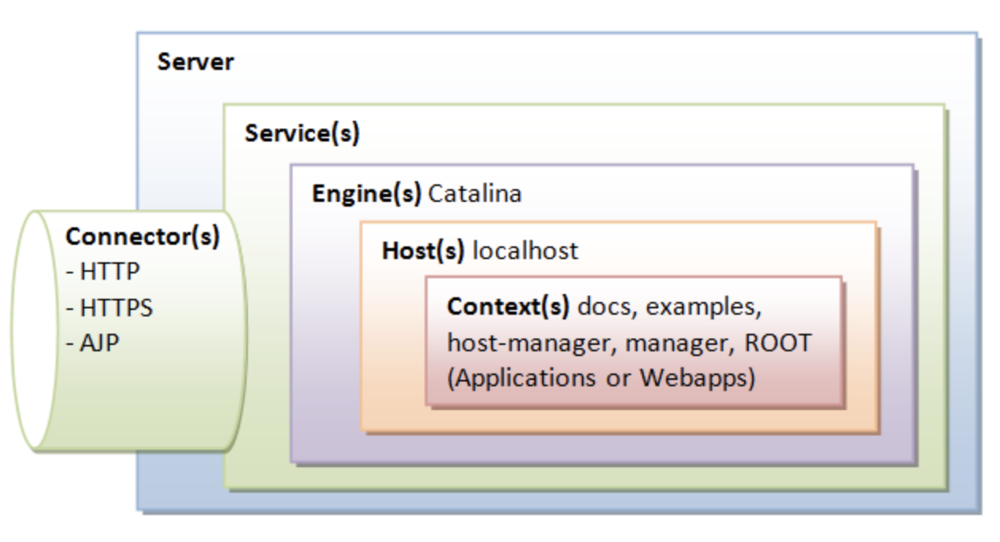

<!-- START doctoc generated TOC please keep comment here to allow auto update -->
<!-- DON'T EDIT THIS SECTION, INSTEAD RE-RUN doctoc TO UPDATE -->
**目录**

- [一、Tomcat](#%E4%B8%80tomcat)
  - [1、Tomcat架构](#1tomcat%E6%9E%B6%E6%9E%84)
- [二、Tomcat生命周期](#%E4%BA%8Ctomcat%E7%94%9F%E5%91%BD%E5%91%A8%E6%9C%9F)
- [三、Tomcat 类加载](#%E4%B8%89tomcat-%E7%B1%BB%E5%8A%A0%E8%BD%BD)
  - [1、Web服务器需要解决的问题](#1web%E6%9C%8D%E5%8A%A1%E5%99%A8%E9%9C%80%E8%A6%81%E8%A7%A3%E5%86%B3%E7%9A%84%E9%97%AE%E9%A2%98)
  - [2、Tomcat类库结构](#2tomcat%E7%B1%BB%E5%BA%93%E7%BB%93%E6%9E%84)
  - [3、Tomcat类加载器机制](#3tomcat%E7%B1%BB%E5%8A%A0%E8%BD%BD%E5%99%A8%E6%9C%BA%E5%88%B6)
    - [3.1、Tomcat中的类加载器](#31tomcat%E4%B8%AD%E7%9A%84%E7%B1%BB%E5%8A%A0%E8%BD%BD%E5%99%A8)
    - [3.2、tomcat 类加载顺序](#32tomcat-%E7%B1%BB%E5%8A%A0%E8%BD%BD%E9%A1%BA%E5%BA%8F)
    - [3.3、Tomcat类加载过程](#33tomcat%E7%B1%BB%E5%8A%A0%E8%BD%BD%E8%BF%87%E7%A8%8B)
    - [3.4、tomcat 如何隔离多个应用](#34tomcat-%E5%A6%82%E4%BD%95%E9%9A%94%E7%A6%BB%E5%A4%9A%E4%B8%AA%E5%BA%94%E7%94%A8)
    - [3.5、如何破坏双亲委托](#35%E5%A6%82%E4%BD%95%E7%A0%B4%E5%9D%8F%E5%8F%8C%E4%BA%B2%E5%A7%94%E6%89%98)
  - [4、线程上下文类加载器-ThreadContextClassLoader（TCCL）](#4%E7%BA%BF%E7%A8%8B%E4%B8%8A%E4%B8%8B%E6%96%87%E7%B1%BB%E5%8A%A0%E8%BD%BD%E5%99%A8-threadcontextclassloadertccl)
    - [4.1、线程上下文类加载器的产生](#41%E7%BA%BF%E7%A8%8B%E4%B8%8A%E4%B8%8B%E6%96%87%E7%B1%BB%E5%8A%A0%E8%BD%BD%E5%99%A8%E7%9A%84%E4%BA%A7%E7%94%9F)
    - [4.2、线程上下文类加载器应用](#42%E7%BA%BF%E7%A8%8B%E4%B8%8A%E4%B8%8B%E6%96%87%E7%B1%BB%E5%8A%A0%E8%BD%BD%E5%99%A8%E5%BA%94%E7%94%A8)
    - [4.3、Tomcat为什么要设置线程上下文类加载器](#43tomcat%E4%B8%BA%E4%BB%80%E4%B9%88%E8%A6%81%E8%AE%BE%E7%BD%AE%E7%BA%BF%E7%A8%8B%E4%B8%8A%E4%B8%8B%E6%96%87%E7%B1%BB%E5%8A%A0%E8%BD%BD%E5%99%A8)
  - [5、问题扩展](#5%E9%97%AE%E9%A2%98%E6%89%A9%E5%B1%95)
- [四、Tomcat启动流程](#%E5%9B%9Btomcat%E5%90%AF%E5%8A%A8%E6%B5%81%E7%A8%8B)
- [五、Tomcat与HTTP请求](#%E4%BA%94tomcat%E4%B8%8Ehttp%E8%AF%B7%E6%B1%82)
- [六、Web应用加载](#%E5%85%ADweb%E5%BA%94%E7%94%A8%E5%8A%A0%E8%BD%BD)
- [七、Tomcat与数据源](#%E4%B8%83tomcat%E4%B8%8E%E6%95%B0%E6%8D%AE%E6%BA%90)
- [八、Tomcat调试与监控](#%E5%85%ABtomcat%E8%B0%83%E8%AF%95%E4%B8%8E%E7%9B%91%E6%8E%A7)
  - [1、远程调试Tomcat](#1%E8%BF%9C%E7%A8%8B%E8%B0%83%E8%AF%95tomcat)
    - [1.1、JDWP协议](#11jdwp%E5%8D%8F%E8%AE%AE)
    - [1.2、配置tomcat远程调试](#12%E9%85%8D%E7%BD%AEtomcat%E8%BF%9C%E7%A8%8B%E8%B0%83%E8%AF%95)
  - [2、tomcat-manager监控](#2tomcat-manager%E7%9B%91%E6%8E%A7)
- [九、Tomcat优化](#%E4%B9%9Dtomcat%E4%BC%98%E5%8C%96)
  - [1、内存优化](#1%E5%86%85%E5%AD%98%E4%BC%98%E5%8C%96)
  - [2、线程优化](#2%E7%BA%BF%E7%A8%8B%E4%BC%98%E5%8C%96)
  - [3、配置优化](#3%E9%85%8D%E7%BD%AE%E4%BC%98%E5%8C%96)
- [十、其他](#%E5%8D%81%E5%85%B6%E4%BB%96)
  - [1、Tomcat中设计模式](#1tomcat%E4%B8%AD%E8%AE%BE%E8%AE%A1%E6%A8%A1%E5%BC%8F)
    - [1.1、门面模式（外观模式）](#11%E9%97%A8%E9%9D%A2%E6%A8%A1%E5%BC%8F%E5%A4%96%E8%A7%82%E6%A8%A1%E5%BC%8F)
    - [1.2、观察者模式](#12%E8%A7%82%E5%AF%9F%E8%80%85%E6%A8%A1%E5%BC%8F)
    - [1.3、命令模式](#13%E5%91%BD%E4%BB%A4%E6%A8%A1%E5%BC%8F)
    - [1.4、责任链模式](#14%E8%B4%A3%E4%BB%BB%E9%93%BE%E6%A8%A1%E5%BC%8F)
  - [2、Tomcat控制输出乱码](#2tomcat%E6%8E%A7%E5%88%B6%E8%BE%93%E5%87%BA%E4%B9%B1%E7%A0%81)
- [参考文章](#%E5%8F%82%E8%80%83%E6%96%87%E7%AB%A0)

<!-- END doctoc generated TOC please keep comment here to allow auto update -->

# 一、Tomcat

## 1、Tomcat架构

### 1.1、Tomcat整体架构



最顶层是Server，即一个Tomcat实例，一个Server中有一个或多个Service，一个Service有一个或多个连接器和一个容器组成；连接器与容器之间通过ServletRequest和ServletResponse连通

tomcat由Server、Service、Engine、Connerctor、Host、Context组件组成，其中带有s的代表在一个tomcat实例上可以存在多个组件，比如Context(s)，tomcat允许我们部署多个应用，每个应用对应一个Context。这些组件在tomcat的conf/server.xml文件中可以找到，对tomcat的调优需要改动该文件；

Tomcat要实现主要两个核心功能：
- 处理Socket连接，负责网络字节流与Request和Response对象的转化；
- 加载和管理Servlet请求，以及处理具体的Request请求；

Tomcat设计了两个核心的核心组件：连接器（Connector）和容器（Container）来分别做上述两件事情，连接器负责对外服务，容器负责内部处理；

### 1.1、连接器

连接器对Servlet容器屏蔽了协议以及IO模型等的区别，无论是ajp和http，在容器中获取到的都是一个标准的ervletRequest对象。

连接器主要实现3个功能：
- 网络通信；
- 应用层协议解析
- Tomcat Request/Response 与 ServletRequest和ServletResponse的转化

连接器主要有三个接口来实现该类：EndPoint、Processor、Adapter

### 1.2、

## 2、Tomcat-NIO模型

## 3、Tomcat与Jetty

### 3.1、Jetty

- Jetty 也是 Http 服务器 + Servlet 容器， 更小巧， 更易于定制
- Jetty 架构： 多个 Connector + 多个 Handler + 一个全局线程池(Connector 和 Handler 共享)
- 多个 Connector 在不同端口监听请求， 可以根据应用场景选择 Handler ： ServletHandler 和 SessionHandler
- Jetty 用 Server 启动和协调上述组件
- Jetty 与 Tomcat 的区别
    - Jetty 没有 Service 的概念， Jetty 的 Connector 被 Handler 共享
    - Tomcat 连接器有自己的线程池， Jetty Connector 使用全局线程池
- Connector 组件， 完成 I/O 模型 + 协议封装
    - 只支持 NIO 模型， 通过 Connection 组件封装协议
    - Java NIO 核心组件为： Channel， Buffer， Selector
        - Channel 即一个 socket 连接
        - Channel 通过 Buffer 间接读写数据
        - Selector 检测 Channel 的 I/O 事件， 可以处理多个 Channel， 减少线程切换开销
    - NIO 完成三个功能： 监听连接， I/O 事件查询， 数据读写， 对应的 Jetty 封装为 Acceptor， SelectorManager， Connection
    - Acceptor 接受请求
        - Jetty 有独立 Acceptor 线程组处理连接请求
        - Connector 的实现类 ServerConnector 中有 _acceptors 数组， 保存固定数目的 Acceptor.
        - Acceptor 是 Connector 内部类， 是 Runnable 的. 通过 getExecutor 得到线程以执行
        - Acceptor 通过阻塞接受连接， 接受连接后， 调用 accepted， 其将 SocketChannel 设为非阻塞， 交给 Selector 处理
    - SelectorManager 管理 Selector
        - 被管理的 Selector 叫 ManagedSelector， 保存于 SelectorManager 的一个数组中
        - SelectorManager 选择一个 Selector， 并创建一个任务 Accept 给 ManagedSelector， ManagerSelector 实现：
            - 调用 register 将 Channel 注册到 Selector， 拿到 SelectionKey
            - 创建 EndPoint 和 Connection， 并与 SelectionKey(Channel) 绑定
        - 当有 I/O 事件时， ManagedSelector 调用 EndPoint 返回一个 Runnable 对象， 并扔给线程池执行
    - Connection
        - 上述 Runnable 对象会调用 Connection 处理请求， 得到 Request 并调用 Handler 容器处理
        - 具体实现类 HttpConnection
            - 请求处理： 在 EndPoint 中注册一系列回调函数， 数据到达时调用. ( 用回调函数模拟异步 I/O ). 在回调方法中读数据， 解析请求并存到 Request
            - 相应处理： Handler 返回 Response， HttpConnection 通过 EndPoint 写到 Channel

# 二、Tomcat生命周期

# 三、Tomcat 类加载

## 1、Web服务器需要解决的问题

- 部署在同一个Web容器上的两个Web应用程序所使用的Java类库可以实现相互隔离；
- 部署在同一个Web容器上的两个Web应用程序所使用的Java类库可以互相共享；
- Web容器需要尽可能地保证自身的安全不受部署的Web应用程序影响；
- 支持JSP应用的Web容器，大多数都需要支持HotSwap功能；

## 2、Tomcat类库结构

在Tomcat目录结构中，有3组目录`("/common/*"、"/server/*"、"/shared/*")`可以存放Java类库，另外还可以加上Web应用程序自身的目录`“/WEB-INF/*”`.放在这四个目录下的含义分别为：

- （1）`/common` 目录下的：类库可以被Tomcat和所有Web程序共同使用；
- （2）`/server`目录：类库可以被Tomcat使用，对所有web应用程序不可见；
- （3）`/shared`目录：类库可被所有的web应用程序共同使用，但对Tomcat自己不可见；
- （4）`/WebApp/WEB-INF`目录：类库仅仅可以被此Web应用程序使用，对Tomcat和其他Web应用程序都不可见。

为了支持上述目录结构，并对目录里面的类库进行加载和隔离。Tomcat自定义了多个类加载器。

对于Tomcat6.x以后的版本，只有指定了`tomcat/conf/catalina.properties`配置文件的`server.loader`和`share.loader`项后才会真正建立`Catalina ClassLoader`和`Shared ClassLoader`的实例，否则在用到这两个类加载器的地方都会用`Common ClassLoader`的实例代替。而默认的配置文件中没有设置这两个loader项，所以Tomcat 6.x顺理成章地把`/common、/server和/shared`三个目录默认合并到一起变成一个`/lib`目录，这个目录里的类库相当于以前`/common`目录中类库的作用；

## 3、Tomcat类加载器机制


### 3.1、Tomcat中的类加载器

- `Bootstrap 引导类加载器`：加载JVM启动所需的类，以及标准扩展类（位于jre/lib/ext下）
- `System 系统类加载器`：加载tomcat启动的类，比如`bootstrap.jar`，通常在`catalina.bat`或者`catalina.sh`中指定。位于`CATALINA_HOME/bin`下
- `Common 通用类加载器`：加载tomcat使用以及应用通用的一些类，位于`CATALINA_HOME/lib`下，比如servlet-api.jar
- `webapp 应用类加载器`：每个应用在部署后，都会创建一个唯一的类加载器.该类加载器会加载位于` WEB-INF/lib`下的jar文件中的class和` WEB-INF/classes`下的class文件

### 3.2、tomcat 类加载顺序

当应用需要到某个类时，则会按照下面的顺序进行类加载：
- （1）使用bootstrap引导类加载器加载
- （2）使用system系统类加载器加载
- （3）使用应用类加载器在WEB-INF/classes中加载
- （4）使用应用类加载器在WEB-INF/lib中加载
- （5）使用common类加载器在CATALINA_HOME/lib中加载

### 3.3、Tomcat类加载过程

主要处理逻辑在：`org.apache.catalina.startup.Bootstrap#init()`
```java
public void init() throws Exception {
    // 初始化commonLoader、catalinaLoader、sharedLoader，关于ClassLoader的后面再看
    initClassLoaders();

    // 设置上下文类加载器为 catalinaLoader
    Thread.currentThread().setContextClassLoader(catalinaLoader);
    SecurityClassLoad.securityClassLoad(catalinaLoader);

    // 反射方法实例化Catalina，后面初始化Catalina用了很多反射，不知道意图是什么
    Class<?> startupClass = catalinaLoader.loadClass("org.apache.catalina.startup.Catalina");
    Object startupInstance = startupClass.getConstructor().newInstance();

    //TODO 为Catalina对象设置其父加载器为shared类加载器，默认情况下就是catalina类加载器

    // 引用Catalina实例
    catalinaDaemon = startupInstance;
}
```

catalina.properties：
```
common.loader=${catalina.base}/lib,${catalina.base}/lib/*.jar,${catalina.home}/lib,${catalina.home}/lib/*.jar
server.loader=
shared.loader=
```

由ClassLoaderFactory 创建类加载器。在创建 URLClassLoader 的时候还需要考虑 jdk 对权限控制的影响，因此 tomcat 利用 AccessController 创建 URLClassLoader


### 3.4、tomcat 如何隔离多个应用

- **WebappClassLoader**

    对于每个webapp应用，都会对应唯一的StandContext，在StandContext会引用WebAppLoader，该类又会引用WebAppClassLoader，WebAppClassLoader 就是真正加载webappd的classLoader。WebappClassLoader加载class的步骤：

    - （1）先检查webappclassloader的缓冲容器是否有该类；
    - （2）为防止webapp覆盖j2se类，尝试用systemclassloader加载；
    - （3）进行安全性检查
    - （4）通过检查后，判断delegate的值来决定是否委托给父类加载器（默认是否）；
    - （5）通过WebappClassLoader自己加载class
    - （6）最后无条件地委托给父加载器；
    - （7）如果都没有加载成功，则抛出ClassNotFoundException异

    *不同的StandardContext有不同的WebappClassLoader，那么不同的webapp的类装载器就是不一致的。装载器的不一致带来了名称空间不一致，所以webapp之间是相互隔离的*

- **WebappLoader**

    在tomcat中，每个webapp对应一个`StandardContext`，在start过程便会实例化WebappLoader，并且调用其start方法完成初始化，包括创建`ParallelWebappClassLoader`实例，然后，还会启动Context的子容器。注意，这两个过程，都会将线程上下文类加载器指定为`ParallelWebappClassLoader`类加载器，在完成 webapp 相关的类加载之后，又将线程上下文类加载器设置为 catalina 类加载器；

- **Hotswap**

    可以为 Context 组件指定 reloadable 属性，如果设为 true，tomcat便会启用 Hotswap，定期扫描类文件的变动，如果有变动，则重启 webapp 从而达到 Hotswap 的目的；

    这个参数由 Context 指定的，但是会通过 WebappLoader#setContext(Context context) 方法调用，从而传递给 WebappLoader；

    WebappLoader 提供了后台定时任务的方法，Context 容器会间隔性地进行调用，它用于监听 class、jar 等文件的变更，一旦有变动，便会对 Context 容器进行 reload 操作

### 3.5、如何破坏双亲委托

- webappClassLoader上面有一个common的类加载器，它是所有webappClassLoader的父加载器，多个应用汇存在公有的类库，而公有的类库都会使用commonclassloader来实现；
- 如果不是公有的类呢，这些类就会使用webappClassLoader加载，而webappClassLoader的实现并没有走双亲委派的模式
- 加载本类的classloader未知时，为了隔离不同的调用者，即类的隔离，采用了上下文类加载的模式加载类.
- 当前高层的接口在低层去实现，而高层的类有需要低层的类加载的时候，这个时候，需要使用上下文类加载器去实现

## 4、线程上下文类加载器-ThreadContextClassLoader（TCCL）

问题：在《深入理解java虚拟机》一书中，作者在类加载实践分析tomcat一节中，提出了一个思考题

***如果有10个Web应用程序都是用Spring来进行组织和管理的话，Spring要对用户程序的类进行管理，自然要能访问到用户程序的类，而用户的程序”显然是放在/WebApp/WEB-INF目录中的，那么被CommonClassLoader或 SharedClassLoader加载的Spring如何访问并不在其加载范围内的用户程序呢？***

Java上下文类加载器的作用就是为了SPI机制才存在的；

### 4.1、线程上下文类加载器的产生

Java提供了很多服务提供者接口（Service Provider Interface，SPI），允许第三方接口为这些接口提供实现。常见的SPI有：JDBC、JCE、JNDI、JBI等；这些SPI的接口由Java核心库来提供，而这些SPI的实现代码则作为Java应用所依赖的jar包被包含进类路径里。SPI接口的代码则经常需要加载具体的实现类。

那么问题来了，SPI的接口是Java核心库的一部分，是由启动类加载器来加载的；SPI的实现类是由系统类加载器来加载的。引导类加载器是无法找到SPI的实现类的，因为按照双亲委托模型，Bootstrap ClassLoader无法委派给AppClassLoader来加载类；而线程上下文类加载器破坏了“双亲委托模型”，可以再执行中抛弃双亲委派模型，使程序逆向使用类加载器。有了线程上下文类加载器，JNDI服务使用这个线程上下文类加载器去加载所需要的SPI代码，也就是父类加载器请求子类加载器去完成类加载动作；

使用线程上下文类加载器，可以在执行线程中抛弃双亲委派加载链模式，使用线程上下文里的类加载器加载类。线程上下文从根本解决了一般应用不能违背双亲委派模式的问题。使java类加载体系显得更灵活

### 4.2、线程上下文类加载器应用

java提供是jdbc Driver就是基于SPI的

### 4.3、Tomcat为什么要设置线程上下文类加载器

```java
// 设置上下文类加载器为 catalinaLoader
Thread.currentThread().setContextClassLoader(catalinaLoader);
SecurityClassLoad.securityClassLoad(catalinaLoader);
```
- 一方面，很多诸如 ClassUtils 之类的编码，他们在获取 ClassLoader 的时候，都是先尝试从 Thread 上下文中获取 ClassLoader，例如：`ClassLoader cl = Thread.currentThread().getContextClassLoader();`
- 另一方面，在没有显式指定类加载器的情况下，默认使用线程的上下文类加载器加载类，由于 tomcat 的大部分 jar 包都在 ${catalina.hom}/lib 目录，因此需要将线程类加载器指定为 catalina 类加载器，否则加载不了相关的类

## 5、问题扩展

- 为什么web应用中src文件夹的会优先jar包中的class？

    因为src文件夹中的文件java以及webContent，中的JSP都会在tomcat启动时，被编译成class文件放在WEB-INF/class 中，外部引用的jar包，则相当于放在 WEB-INF/lib 中；java文件或者JSP文件编译出的class优先加载

- 版本问题：

    在 `CATALINA_HOME/lib`以及`WEB-INF/lib`中放置了不同版本的jar包，此时就会导致某些情况下报加载不到类的错误。还有如果多个应用使用同一jar包文件，当放置了多份，就可能导致多个应用间出现类加载不到的错误；

# 四、Tomcat启动流程

http://cxis.me/2017/05/10/tomcat7%E5%90%AF%E5%8A%A8%E6%B5%81%E7%A8%8B%E6%BA%90%E7%A0%81%E5%88%86%E6%9E%90/
https://github.com/c-rainstorm/blog/blob/master/tomcat/%E8%B0%88%E8%B0%88%20Tomcat%20%E6%9E%B6%E6%9E%84%E5%8F%8A%E5%90%AF%E5%8A%A8%E8%BF%87%E7%A8%8B%5B%E5%90%AB%E9%83%A8%E7%BD%B2%5D.md

# 五、Tomcat与HTTP请求

# 六、Web应用加载

# 七、Tomcat与数据源

https://www.cnblogs.com/ShawnYang/p/7451459.html

# 八、Tomcat调试与监控

## 1、远程调试Tomcat

### 1.1、JDWP协议
Java Debug Wire Protocol缩写，它定义了调试器与被调试的java虚拟机之间通信协议

### 1.2、配置tomcat远程调试

- 修改文件：startup.sh

    在如下脚本中加入 jpda：
    ```shell
    exec "$PRGDIR"/"$EXECUTABLE" jpda start "$@"
    ```

- 修改catalina.sh：
    ```shell
    if [ "$1" = "jpda" ] ; then
        if [ -z "$JPDA_TRANSPORT" ]; then
            JPDA_TRANSPORT="dt_socket"
        fi
        if [ -z "$JPDA_ADDRESS" ]; then
            JPDA_ADDRESS="localhost:8000"
        fi
        if [ -z "$JPDA_SUSPEND" ]; then
            JPDA_SUSPEND="n"
        fi
        if [ -z "$JPDA_OPTS" ]; then
            JPDA_OPTS="-agentlib:jdwp=transport=$JPDA_TRANSPORT,address=$JPDA_ADDRESS,server=y,suspend=$JPDA_SUSPEND"
        fi
        CATALINA_OPTS="$JPDA_OPTS $CATALINA_OPTS"
        shift
    fi
    ```
    修改上述脚本的 JPDA_ADDRESS="localhost:8000"，只需要配置端口即可
    
## 2、tomcat-manager监控

在低版本是默认开启的，而高版本因为安全因素默认是关闭的；

- 文档地址：{tomcat}/webapps/docs/manager-howto.html

- 开启步骤：
    - conf/tomcat-users.xml 添加用户
    - conf/Catalina/localhost/manager.xml 配置允许的远程连接

# 九、Tomcat优化

- 参数maxThreads、maxConnections、acceptAccount区别；
- tomcat默认支持并发数，怎么修改

## 1、内存优化

## 2、线程优化

参考文档：{tomcat}/webapps/docs/config/http.html

- maxConnections：最大连接数

- acceptCount

- maxThreads：工作线程数

- minSpareThreads：最小空闲的工作线程

## 3、配置优化

- autoDeploy

    host.html

- enableLookups：DNS查询

    http.html

- reloadable：false

    contex.html

- protocol

    server.xml


# 十、其他

## 1、Tomcat中设计模式

### 1.1、门面模式（外观模式）


### 1.2、观察者模式


### 1.3、命令模式


### 1.4、责任链模式


## 2、Tomcat控制输出乱码

在catalina.sh文件中找到`JAVA_OPTS`
```
JAVA_OPTS="$JAVA_OPTS -XX:+PrintGCDetails  -XX:+PrintGCTimeStamps  -XX:+PrintGCDateStamps  -Xloggc:$CATALINA_HOME/logs/gc.log -Dorg.apache.catalina.security.SecurityListener.UMASK=`umask`"
```
加上：`-Dfile.encoding=UTF8 -Dsun.jnu.encoding=UTF8`

# 参考文章

* [Tomcat8官方文档](https://tomcat.apache.org/tomcat-8.0-doc/index.html)
* [类加载体系](http：//blog.csdn.net/beliefer/article/details/50995516)
* [Tomcat源码分析](https：//blog.csdn.net/column/details/tomcat7-internal.html)
* [Tomcat基本结构](http：//zouzls.github.io/2017/03/29/SpringStart/)
* [线程上下文类加载器](https://blog.csdn.net/yangcheng33/article/details/52631940)
* [JDWP 协议及实现](https://www.ibm.com/developerworks/cn/java/j-lo-jpda3/)
* [Tomca实现原理](http://www.iocoder.cn/Tomcat/Tomcat-collection/)
* [Tomcat一次完整的请求](https://www.jianshu.com/p/7b6ce4b90bae)