# 一、Tomcat

## 1、Tomcat架构

### 1.1、Tomcat整体架构

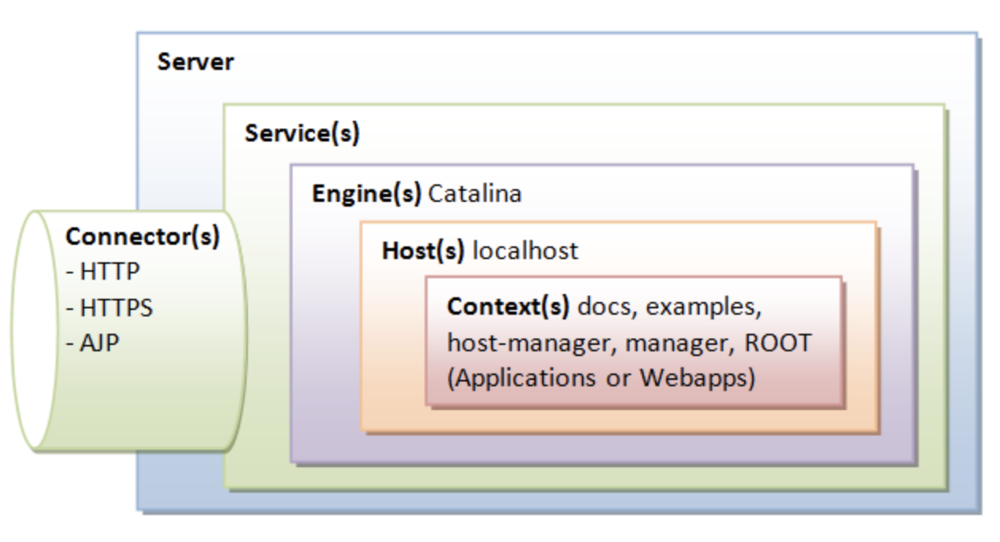

tomcat由Server、Service、Engine、Connerctor、Host、Context组件组成，其中带有s的代表在一个tomcat实例上可以存在多个组件，比如Context(s)，tomcat允许我们部署多个应用，每个应用对应一个Context。这些组件在tomcat的conf/server.xml文件中可以找到，对tomcat的调优需要改动该文件；

Tomcat要实现主要两个核心功能：
- 处理Socket连接，负责网络字节流与Request和Response对象的转化；
- 加载和管理Servlet请求，以及处理具体的Request请求；

Tomcat设计了两个核心的核心组件：连接器（Connector）和容器（Container）来分别做上述两件事情，连接器负责对外服务，容器负责内部处理；

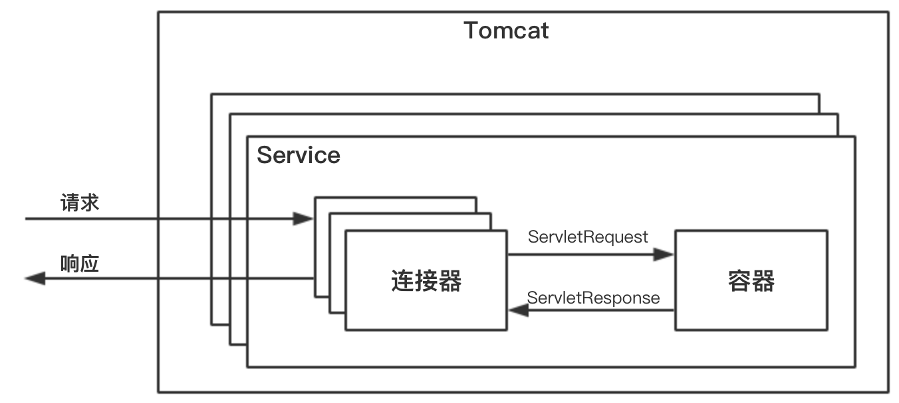

最顶层是Server，即一个Tomcat实例，一个Server中有一个或多个Service，一个Service有一个或多个连接器和一个容器组成；连接器与容器之间通过ServletRequest和ServletResponse连通；

### 1.2、连接器Connector

连接器对Servlet容器屏蔽了协议以及IO模型等的区别，无论是ajp和http，在容器中获取到的都是一个标准的ervletRequest对象。

连接器主要实现3个功能：
- 网络通信；
- 应用层协议解析
- Tomcat Request/Response 与 ServletRequest和ServletResponse的转化

连接器主要有三个接口来实现该类：EndPoint、Processor、Adapter。EndPoint负责提供字节流给Processor，Processor负责提供Tomcat Request对象给Adapter，Adapter负责提供Servlet对象给容器；

由于IO模型和应用层协议可以自由组合，比如NIO+HTTP或者NIO2.0+AJP，Tomcat将网络通信和应用层协议解析放在一起考虑，设计了一个ProtocolHandler的接口来封装两种变化点。各种协议和通信模型的组合具有相应的具体实现类，比如Http11NioProtocol。

可以看下ProtocolHandler接口的继承关系：

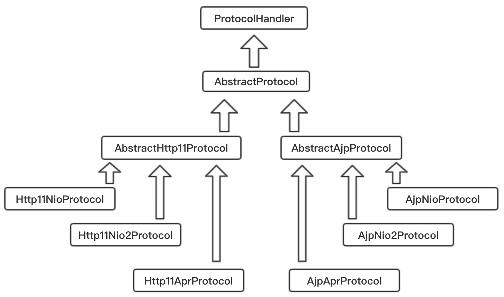

连接器的三个核心组件：EndPoint、Processor、Adapter分别用来做三件事情，其中EndPoint 和Processor放在一起抽象成了Protocol组件，关系如下：

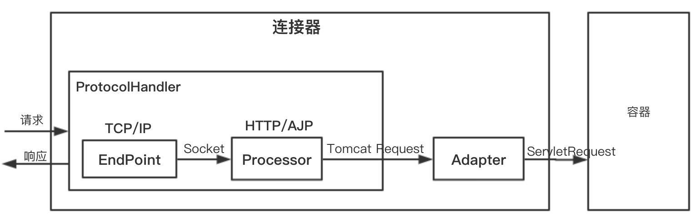

#### 1.2.1、ProtocolHandler组件

用来处理网络连接和应用层协议，包含了EndPoint和Processor

**EndPoint**

EndPoint是通信端点，即通信监听的端口，是具体的Socket接收和发送处理器，用来实现TCP/IP协议的；其实是利用Socket借口将底层传来的数据转换为HTTP格式的数据，是间接的实现；

EndPoint是一个接口，具体抽象实现类：AbstractEndPoint，其具体的子类Nio2Endpoint、NioEndpoint有两个重要的子组件：Acceptor和SocketProcessor（内部类实现方式）
- Acceptor：用于监听Socket连接请求；
- SocketProcessor：用于处理接收到的Socket请求，其实现与Runnable接口，其一般提交给线程池进行处理；

**Processor**

Processor是用来实现HTTP协议的，Processor接收Socket，读取字节解析成Tomcat Request和Response对象，并通过Adapter提交到容器处理。Processor是对应用层协议的抽象；


总结：EndPoint接收到Sokcet连接后，生成一个SocketProcessor任务提交到线程池处理，SocketProcessor的run方法调用Processor组件去解析应用层协议，Processor同解析生成Request对象后，会调用Adapter的Service方法；

#### 1.2.2、Adapter组件


### 1.3、容器Container

在Tomcat里，容器是用来装在Servlet的。

#### 1.3.1、容器的层次结构

容器设计了4种容器，分别是Engine、Host、Context和Wrapper，这四种容器父子关系，其关系如下图：

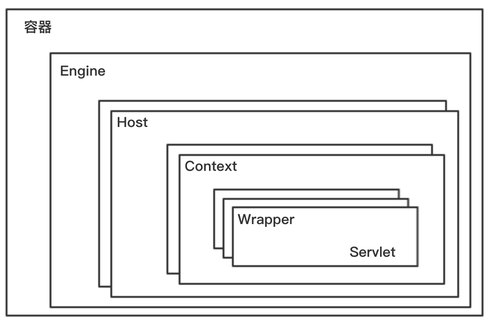

Tomcat通过一种分层架构，使得Servlet容器具有很好的灵活性：Context表示一个web应用程序；Wrapper表示一个Servlet，一个Web应用可能有多个Servlet；Host代表的是一个虚拟主机或者说一个站点；Tomcat可以配置多个虚拟主机地址，而一个虚拟主机可以部署多个web应用程序；Engine表示引擎，用来虚拟管理多个虚拟站点，一个Service最多有一个Engine；

可以查看Tomcat中[server.xml](server.xml)，能够发现其架构关系；Tomcat采用组件化的设计，其构成组件都是可配置的，其中最外层是server
```xml
<Server>                            <!-- 顶层组件，可以包含多个Service -->
    <Service>                       <!-- 顶层组件，可以包含一个Engine，多个连接器  -->
        <Connector></Connector>     <!-- 连接器组件，代表通信接口  -->
        <Engine>                    <!-- 容器组件，一个Engin组件处理Service中所有的请求，包含多个Host -->
            <Host>                  <!-- 容器组件，处理特定的Host下客户请求，可以包含多个Context -->
                <Context></Context> <!-- 容器组件，为特点的web应用处理所有的客户请求 -->
            </Host>
        </Engine>
    </Service>
</Server>
```
Tomcat使用组合模式来管理这些容器；其具体实现是所有容器组件都实现了Container接口，因此组合模式可以使得用户对单容器对象（Wrapper）和组合容器对象（Context、Host、Engine）的使用具有一致性。Container接口定义：
```java
public interface Container extends Lifecycle {
    public void setName(String name);
    public Container getParent();
    public void setParent(Container container);
    public void addChild(Container child);
    public void removeChild(Container child);
    public Container findChild(String name);
}
```

#### 1.3.2、请求定位Servlet过程

Tomcat主要是通过Mapper组件来完成的。Mapper组件的功能就是将用户请求的URL定位到一个Servlet中。其主要原理是：Mapper组件中保存了web应用的配置信息，即容器组件与访问路径的映射关系。当一个请求到来时，Mapper组件通过解析请求URL的域名和路径，再到自己保存的Map里查找，定位到一个Servlet。一个请求URL最后只会定位到一个Wrapper容器即一个Servlet；
- 首先，根据协议和端口号选定Service和Engin，Service确定了意味着Engine也就确定了；
- 然后，根据域名选定Host：Service和Engin确定后，mapper组件通过URL中域名查找指定的Host容器；
- 之后，根据URL路径找到Context组件，匹配相应的web应用的路径；
- 最后，根据URL路径找到Wrapper（Servlet）：Context确定后，Mapper根据web.xml中配置的Servlet的映射路径找到具体的Wrapper和Servlet；

整个过程中，连接器的adapter会调用容器的Service方法来执行Servlet，最先拿到请求的是Engine容器，Engine容器对请求做相应的处理后，会把请求传给自己的子容器Host继续处理，最终整个请求会传给Wrapper容器，整个调用过程是怎么实现的？使用的是**Pipeline-Valve**管道。

Pipeline-Valve是责任链模式，责任链模式指在一个请求处理的过程中有很多处理者一次对请求进行处理，每个处理者负责做自己相应的处理，处理完后将再调用下一个处理者继续处理；
```java
public interface Valve {
  public Valve getNext();
  public void setNext(Valve valve);
  // invoke是用来处理请求的，getNext和setNext是将Valve串起来的；
  public void invoke(Request request, Response response)
}
public interface Pipeline extends Contained {
  public void addValve(Valve valve);
  public Valve getBasic();
  public void setBasic(Valve valve);
  public Valve getFirst();
}
```
Pipeline维护Valve链表。每一个容器都有一个Pipeline对象，只要触发Pipeline的第一个Valve，容器里Pipeline的Valve就会被调用；不同容器之间的Pipeline通过getBasic方法，其负责调用下层容器的Pipeline里的第一个Valve；整个调用过程由连接器中的Adapter触发，调用Engine的第一个Valve
```java
connector.getService().getContainer().getPipeline().getFirst().invoke(request, response);
```
Wrapper容器在最后一个Valve中会创建一个Filter链，调用doFilter方法。

Valve和Filter区别：
- Valve是Tomcat的私有机制；Filter是Servelt API公有的标准，所有Web容器都支持Filter机制；
- Valve工作在web容器基本，拦截所有应用的请求；而Servlet Filter工作在应用级别；

## 2、Tomcat-NIO模型

## 3、Tomcat与Jetty

### 3.1、Jetty

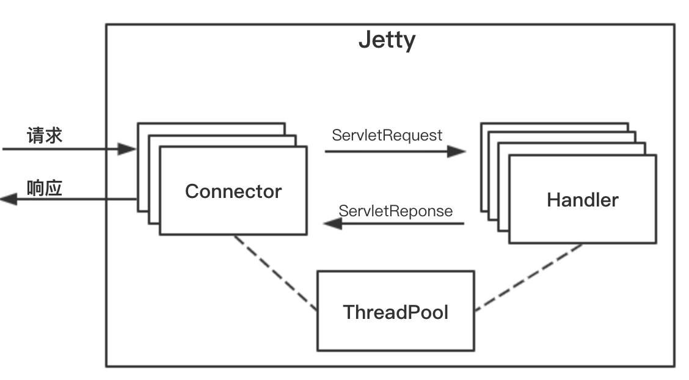

- Jetty 也是 Http 服务器 + Servlet 容器， 更小巧， 更易于定制
- Jetty 架构： 多个 Connector + 多个 Handler + 一个全局线程池(Connector 和 Handler 共享)
- 多个 Connector 在不同端口监听请求， 可以根据应用场景选择 Handler ： ServletHandler 和 SessionHandler
- Jetty 用 Server 启动和协调上述组件
- Jetty 与 Tomcat 的区别
    - Jetty 没有 Service 的概念， Jetty 的 Connector 被 Handler 共享
    - Tomcat 连接器有自己的线程池， Jetty Connector 使用全局线程池
- Connector 组件， 完成 I/O 模型 + 协议封装
    - 只支持 NIO 模型， 通过 Connection 组件封装协议
    - Java NIO 核心组件为： Channel， Buffer， Selector
        - Channel 即一个 socket 连接
        - Channel 通过 Buffer 间接读写数据
        - Selector 检测 Channel 的 I/O 事件， 可以处理多个 Channel， 减少线程切换开销
    - NIO 完成三个功能： 监听连接， I/O 事件查询， 数据读写， 对应的 Jetty 封装为 Acceptor， SelectorManager， Connection
    - Acceptor 接受请求
        - Jetty 有独立 Acceptor 线程组处理连接请求
        - Connector 的实现类 ServerConnector 中有 _acceptors 数组， 保存固定数目的 Acceptor.
        - Acceptor 是 Connector 内部类， 是 Runnable 的. 通过 getExecutor 得到线程以执行
        - Acceptor 通过阻塞接受连接， 接受连接后， 调用 accepted， 其将 SocketChannel 设为非阻塞， 交给 Selector 处理
    - SelectorManager 管理 Selector
        - 被管理的 Selector 叫 ManagedSelector， 保存于 SelectorManager 的一个数组中
        - SelectorManager 选择一个 Selector， 并创建一个任务 Accept 给 ManagedSelector， ManagerSelector 实现：
            - 调用 register 将 Channel 注册到 Selector， 拿到 SelectionKey
            - 创建 EndPoint 和 Connection， 并与 SelectionKey(Channel) 绑定
        - 当有 I/O 事件时， ManagedSelector 调用 EndPoint 返回一个 Runnable 对象， 并扔给线程池执行
    - Connection
        - 上述 Runnable 对象会调用 Connection 处理请求， 得到 Request 并调用 Handler 容器处理
        - 具体实现类 HttpConnection
            - 请求处理： 在 EndPoint 中注册一系列回调函数， 数据到达时调用. ( 用回调函数模拟异步 I/O ). 在回调方法中读数据， 解析请求并存到 Request
            - 相应处理： Handler 返回 Response， HttpConnection 通过 EndPoint 写到 Channel

# 二、Tomcat生命周期

第一部分中各个组件的层次关系，图中红色虚线表示一个请求在Tomcat的流转过程

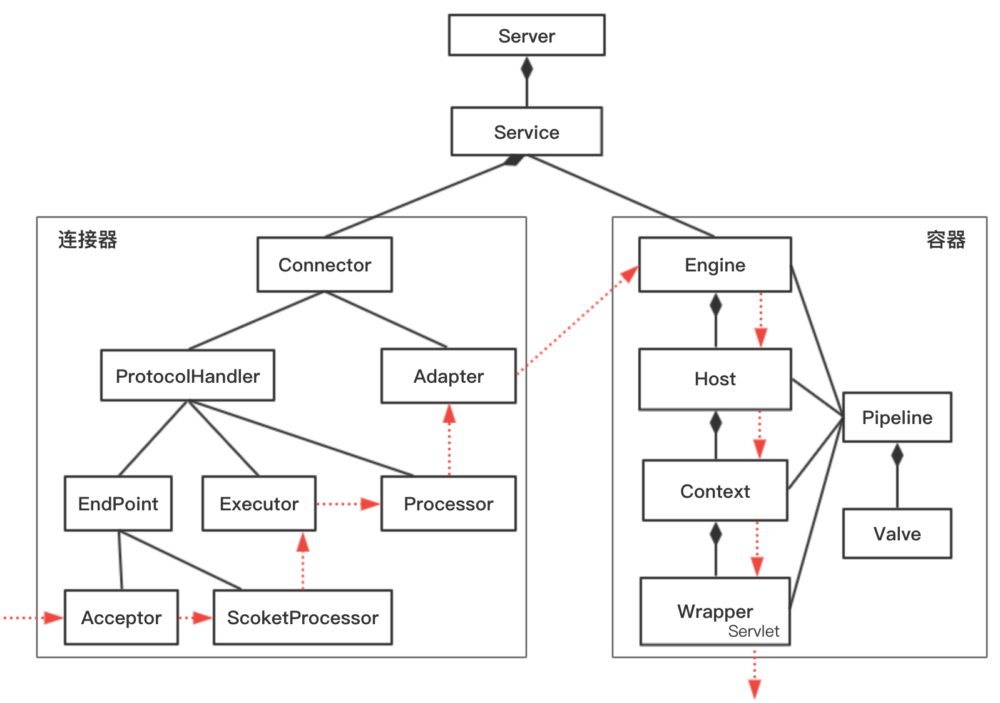

上面描述了组件之间的静态关系，如果让一个系统能够对外提供服务，需要创建、组织并启动这些组件；在服务停止时需要释放资源。Tomcat需要动态的管理这些组件的生命周期；

分析这些组件有两层关系：
- 第一层关系组件有大有小，大组件管理小组件；
- 第二层关系是组件有内有外，外层组件控制内层组件，请求是由外层组件来驱动的；

## 1、一键启停：LifeCycle接口

上面每个组件都要经历创建、初始化、启动等过程，这些不变点抽象出来为一个接口，即LifeCycle，其内有如下方法：init、start、stop、destroy，每个具体的组件去实现这些方法。在父组件的init方法需要创建子组件并调用子组件的init方法，这就是组合模式，并且只需要调用最顶层组件，也就是Server组件的init和start方法，整个Tomcat就启动起来了；

## 2、可扩展性：LifeCycle事件

组件的init和start调用是由它的父组件状态变化触发的，上层组件的初始化触发子组件的初始化，可以把组件的生命周期定义为一个个状态，把状态的转变看作是一个事件，事件是由监听器的，在监听器可以实现一些逻辑，可以方便添加和删除监听器，这就是观察者模式；

具体来说是在LifeCycle接口加入两个方法：添加监听器和删除监听器，除此之外还定义了一个Enum表示组件有哪些状态，以及在什么状态下触发什么事件；因此LifeCycle接口和LifeCycleState就定义成了下面这样的：

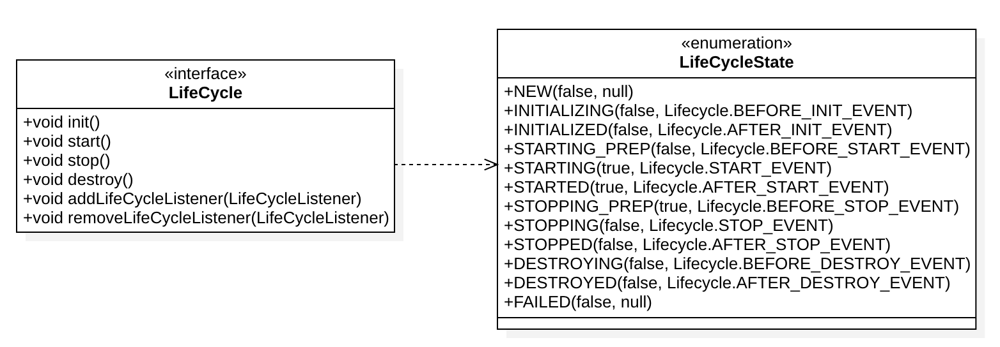

一旦组件达到相应的状态就会触发相应的事件；

## 3、重用性：LifeCycleBase抽象基类

不同的类实现接口时往往会有相同的逻辑，为了避免每个类都去实现一遍，定义了一个基类来实现共同的逻辑，让各个子类去继承基类，而不是直接实现接口，达到代码重用目的；

基类中会定义一些抽象方法，基类不会去实现这些方法，而是调用这些方法来实现基本的骨架逻辑。抽象方法需要各个子类去实现的，子类必须实现。

Tomcat中定义了一个基类LifecycleBase来实现LifeCycle接口，把公共的逻辑放在该类中，如生命周期中状态的转变与维护、生命事件的触发以及监听器添加和删除等，而子类负责自己的初始化、启动和停止方法。避免与基类中方法同名，把具体子类的实现方法改名字，在后面加上internal等；

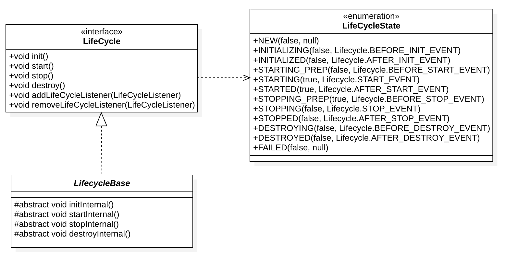

LifecycleBase实现了LifeCycle接口中所有方法，还定义了相应的抽象方法交给具体的子类去实现，典型的模板设计模式

LifecycleBase中init方法的实现：
```java
@Override
public final synchronized void init() throws LifecycleException {
    // 1、状态检查：检查状态的合法性，当前是NEW状态才往下进行
    if (!state.equals(LifecycleState.NEW)) {
        invalidTransition(Lifecycle.BEFORE_INIT_EVENT);
    }
    // 2、触发INITIALIZING事件的监听器，setStateInternal会去调用监听器的业务方法
    setStateInternal(LifecycleState.INITIALIZING, null, false);

    try {
        // 3、调用具体子类的初始化方法
        initInternal();
    } catch (Throwable t) {
        ExceptionUtils.handleThrowable(t);
        setStateInternal(LifecycleState.FAILED, null, false);
        throw new LifecycleException(
                sm.getString("lifecycleBase.initFail",toString()), t);
    }
    // 4、触发 INITIALIZED事件的监听器
    setStateInternal(LifecycleState.INITIALIZED, null, false);
}
```

什么时候、谁把监听器注册进来的：
- Tomcat自定义了一些监听器，这些监听器是父组件在创建子组件的过程中注册到子组件的。
- 可以再Server.xml中定义自己的监听器，Tomcat会在启动时解析server.xml，创建并注册到容器组件

## 4、生命周期管理总体类图

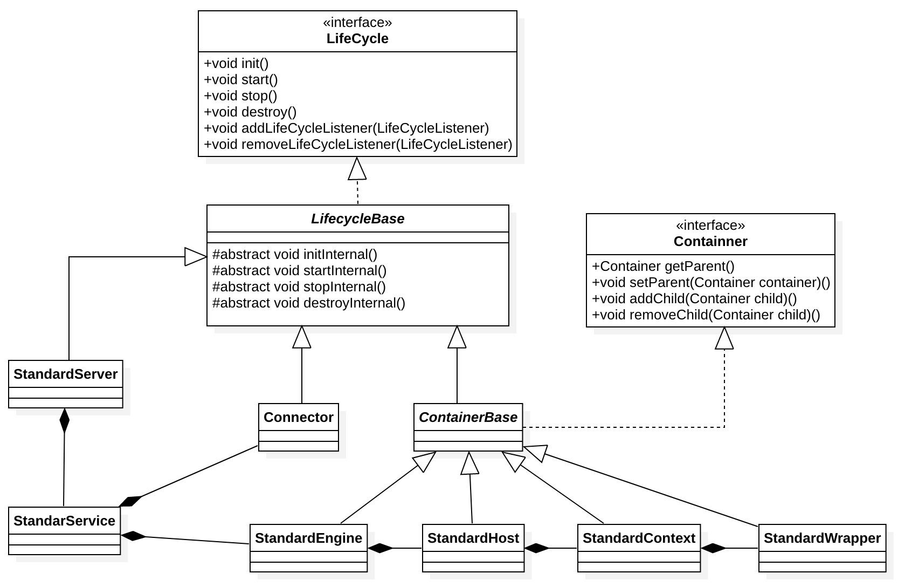

StandardServer、StandardService 等都是Server和Service的具体实现类，都继承了LifecycleBase；

StandardEngine、StandardHost、StandardContext和StandardWrapper都是相应容器组件的具体实现类，都是容器，所以继承了ContainnerBae接口，也继承了LifecycleBase类，生命周期管理接口和功能接口是分开的，符合接口分离原则；

# 三、Tomcat启动组件

http://cxis.me/2017/05/10/tomcat7%E5%90%AF%E5%8A%A8%E6%B5%81%E7%A8%8B%E6%BA%90%E7%A0%81%E5%88%86%E6%9E%90/
https://github.com/c-rainstorm/blog/blob/master/tomcat/%E8%B0%88%E8%B0%88%20Tomcat%20%E6%9E%B6%E6%9E%84%E5%8F%8A%E5%90%AF%E5%8A%A8%E8%BF%87%E7%A8%8B%5B%E5%90%AB%E9%83%A8%E7%BD%B2%5D.md

启动Tomcat可以通过${CATALINA_HOME}/bin目录下的脚本startup.sh来启动Tomcat，执行该脚本之后，会发生如下流程：

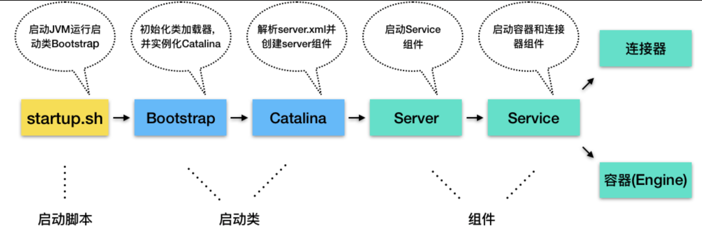

## 1、Catalina

Catalina的主要任务时创建Server，它通过解析server.xml，把配置在server.xml的各种组件都创建出来，接着调用Server的init方法和start方法，Tomcat就启动起来了。

Catalina在JVM中注册了一个关闭钩子，优雅的停止Tomcat并清理资源；
```java
public void start() {
    //1. 如果持有的 Server 实例为空，就解析 server.xml 创建出来
    if (getServer() == null) {
        load();
    }
    //2. 如果创建失败，报错退出
    if (getServer() == null) {
        log.fatal(sm.getString("catalina.noServer"));
        return;
    }

    //3. 启动 Server
    try {
        getServer().start();
    } catch (LifecycleException e) {
        return;
    }

    // 创建并注册关闭钩子
    if (useShutdownHook) {
        if (shutdownHook == null) {
            shutdownHook = new CatalinaShutdownHook();
        }
        Runtime.getRuntime().addShutdownHook(shutdownHook);
    }

    // 用 await 方法监听停止请求
    if (await) {
        await();
        stop();
    }
}
/**
 * Await and shutdown.
 */
public void await() {
    getServer().await();
}
```
Tomcat的关闭钩子实际上就是执行了Server的stop方法，Server的stop方法会释放和清理所有的资源
```java
protected class CatalinaShutdownHook extends Thread {
    @Override
    public void run() {
        try {
            if (getServer() != null) {
                Catalina.this.stop();
            }
        } catch (Throwable ex) {
            ExceptionUtils.handleThrowable(ex);
            log.error(sm.getString("catalina.shutdownHookFail"), ex);
        } finally {
            // If JULI is used, shut JULI down *after* the server shuts down
            // so log messages aren't lost
            LogManager logManager = LogManager.getLogManager();
            if (logManager instanceof ClassLoaderLogManager) {
                ((ClassLoaderLogManager) logManager).shutdown();
            }
        }
    }
}
```

## 2、Server组件

Server组件的具体实现类是StandardServer；首先StandardServer是继承了LifecycleBase，生命周期被统一管理，并且其子组件为Service，因此还需要管理Service的生命周期；

Server在内部维护了若干Service组件，其是以数组来保存的，Server将一个Service添加到数组中；
```java
@Override
public void addService(Service service) {
    service.setServer(this);
    synchronized (servicesLock) {
        // 创建一个长度 +1 的新数组，在添加过程中动态的扩展数组长度，当添加一个新的Service实例时，进行数组复制，为了节省内存空间；
        Service results[] = new Service[services.length + 1];
        // 将老的数据复制过去
        System.arraycopy(services, 0, results, 0, services.length);
        results[services.length] = service;
        services = results;

        // 启动 Service 组件
        if (getState().isAvailable()) {
            try {
                service.start();
            } catch (LifecycleException e) {
                // Ignore
            }
        }
        // 触发监听事件
        support.firePropertyChange("service", null, service);
    }
}
```

除此之外，Server组件还有一个重要的任务是启动一个Socket来监听停止端口，也就是能我们为什么能够通过shutdown命令来关闭Tomcat。

Catalina启动时最后有一个await方法，其调用的就是Server的await方法；在await方法里会创建一个Socket监听8005端口，并且是在一个死循环里接收Socket上的连接请求，如果有新的连接到来就建立连接，然后从Socket读取数据；如果读取到的数据是停止命令“SHUTDOWN”，就退出循环，进入stop流程；

## 3、Service组件

其具体实现类是StandardService，其基本定义及关键的成员变量：
```java
public class StandardService extends LifecycleBase implements Service {
    // 名字
    private String name = null;
    //Server 实例
    private Server server = null;
    // 连接器数组
    protected Connector connectors[] = new Connector[0];
    private final Object connectorsLock = new Object();
    // 对应的 Engine 容器
    private Engine engine = null;
    // 映射器及其监听器
    protected final Mapper mapper = new Mapper();
    protected final MapperListener mapperListener = new MapperListener(this);
    ...
}
```

MapperListener是因为Tomcat支持热部署，当web应用的部署发生变化时，Mapper中的映射信息需要发生变化，MapperListener是一个监听器，其会监听容器的变化，并把信息更新到Mapper中，是一个典型的观察者模式；

看下Service的启动方法startInternal：
```java
protected void startInternal() throws LifecycleException {
    //1. 触发启动监听器
    setState(LifecycleState.STARTING);
    //2. 先启动 Engine，Engine 会启动它子容器
    if (engine != null) {
        synchronized (engine) {
            engine.start();
        }
    }
    //3. 再启动 Mapper 监听器
    mapperListener.start();
    //4. 最后启动连接器，连接器会启动它子组件，比如 Endpoint
    synchronized (connectorsLock) {
        for (Connector connector: connectors) {
            if (connector.getState() != LifecycleState.FAILED) {
                connector.start();
            }
        }
    }
}
```

Service先启动了Engine组件，再启动Mapper监听器，最后才是启动连接器。因为内层组件启动好了才能堆外提供服务，才能启动外层的连接器组件。而Mapper也依赖容器组件，容器组件启动好了才能监听其变化，因此Mapper和MapperListener在容器组件之后才启动。组件停止的顺序跟启动顺序正好相反。

## 4、Engine组件

Engine本质上是一个容器，因此StandardEngine其继承了ContainerBase基类，并且实现了Engine接口
```java
public class StandardEngine extends ContainerBase implements Engine {
}
```
Engine的子容器是Host，所以其持有了一个Host容器的数组，这些功能被抽象到了ContainerBase里：`protected final HashMap<String, Container> children = new HashMap<>();`，使用HashMap主要是HashMap能够快速的查找子容器。

ContainerBase用HashMap保存子容器，还实现了子容器的增删查改，子组件的启动和停止都提供了默认实现。ContainerBase会用专门的线程池来启动子容器：
```java
for (int i = 0; i < children.length; i++) {
   results.add(startStopExecutor.submit(new StartChild(children[i])));
}
```
Engine在启动Host子容器时直接重用了该方法

StandardEngine对请求的处理，把请求转发给某一个Host子容器来处理，具体是通过Valve来实现的:
```java
final class StandardEngineValve extends ValveBase {
    public final void invoke(Request request, Response response)
      throws IOException, ServletException {
      // 拿到请求中的 Host 容器
      Host host = request.getHost();
      if (host == null) {
          return;
      }
      // 调用 Host 容器中的 Pipeline 中的第一个 Valve
      host.getPipeline().getFirst().invoke(request, response);
  }
}
```
处理请求的Host容器对象是从请求中拿到的，因为在请求到达Engine容器之前，Mapper组件已经对请求进行了路由处理，Mapper组件通过请求的URL定位了相应的容器，并且把容器对象保存到请求对象中；

## 5、从Tomcat看设计规范

- 组件化及可配置：

    Tomcat和jetty都是基于组件的，可以通过xml文件或者代码的或者配置组件；主要考虑两点：
    - 面向接口编程；
    - web容器提供一个载体把组件组装在一起工作；

- 组件的创建

    web容器启动之间不知道需要创建哪些组件，也就是说需要通过反射机制动态的创建；

- 组件的生命周期管理

- 组件的骨架抽象类和模板模式

# 四、Tomcat 类加载

## 1、Web服务器需要解决的问题

- 部署在同一个Web容器上的两个Web应用程序所使用的Java类库可以实现相互隔离；
- 部署在同一个Web容器上的两个Web应用程序所使用的Java类库可以互相共享；
- Web容器需要尽可能地保证自身的安全不受部署的Web应用程序影响；
- 支持JSP应用的Web容器，大多数都需要支持HotSwap功能；

## 2、Tomcat类库结构

在Tomcat目录结构中，有3组目录`("/common/*"、"/server/*"、"/shared/*")`可以存放Java类库，另外还可以加上Web应用程序自身的目录`“/WEB-INF/*”`.放在这四个目录下的含义分别为：

- （1）`/common` 目录下的：类库可以被Tomcat和所有Web程序共同使用；
- （2）`/server`目录：类库可以被Tomcat使用，对所有web应用程序不可见；
- （3）`/shared`目录：类库可被所有的web应用程序共同使用，但对Tomcat自己不可见；
- （4）`/WebApp/WEB-INF`目录：类库仅仅可以被此Web应用程序使用，对Tomcat和其他Web应用程序都不可见。

为了支持上述目录结构，并对目录里面的类库进行加载和隔离。Tomcat自定义了多个类加载器。

对于Tomcat6.x以后的版本，只有指定了`tomcat/conf/catalina.properties`配置文件的`server.loader`和`share.loader`项后才会真正建立`Catalina ClassLoader`和`Shared ClassLoader`的实例，否则在用到这两个类加载器的地方都会用`Common ClassLoader`的实例代替。而默认的配置文件中没有设置这两个loader项，所以Tomcat 6.x顺理成章地把`/common、/server和/shared`三个目录默认合并到一起变成一个`/lib`目录，这个目录里的类库相当于以前`/common`目录中类库的作用；

## 3、Tomcat类加载器机制


### 3.1、Tomcat中的类加载器

- `Bootstrap 引导类加载器`：加载JVM启动所需的类，以及标准扩展类（位于jre/lib/ext下）
- `System 系统类加载器`：加载tomcat启动的类，比如`bootstrap.jar`，通常在`catalina.bat`或者`catalina.sh`中指定。位于`CATALINA_HOME/bin`下
- `Common 通用类加载器`：加载tomcat使用以及应用通用的一些类，位于`CATALINA_HOME/lib`下，比如servlet-api.jar
- `webapp 应用类加载器`：每个应用在部署后，都会创建一个唯一的类加载器.该类加载器会加载位于` WEB-INF/lib`下的jar文件中的class和` WEB-INF/classes`下的class文件

### 3.2、tomcat 类加载顺序

当应用需要到某个类时，则会按照下面的顺序进行类加载：
- （1）使用bootstrap引导类加载器加载
- （2）使用system系统类加载器加载
- （3）使用应用类加载器在WEB-INF/classes中加载
- （4）使用应用类加载器在WEB-INF/lib中加载
- （5）使用common类加载器在CATALINA_HOME/lib中加载

### 3.3、Tomcat类加载过程

主要处理逻辑在：`org.apache.catalina.startup.Bootstrap#init()`
```java
public void init() throws Exception {
    // 初始化commonLoader、catalinaLoader、sharedLoader，关于ClassLoader的后面再看
    initClassLoaders();

    // 设置上下文类加载器为 catalinaLoader
    Thread.currentThread().setContextClassLoader(catalinaLoader);
    SecurityClassLoad.securityClassLoad(catalinaLoader);

    // 反射方法实例化Catalina，后面初始化Catalina用了很多反射，不知道意图是什么
    Class<?> startupClass = catalinaLoader.loadClass("org.apache.catalina.startup.Catalina");
    Object startupInstance = startupClass.getConstructor().newInstance();

    //TODO 为Catalina对象设置其父加载器为shared类加载器，默认情况下就是catalina类加载器

    // 引用Catalina实例
    catalinaDaemon = startupInstance;
}
```

catalina.properties：
```
common.loader=${catalina.base}/lib,${catalina.base}/lib/*.jar,${catalina.home}/lib,${catalina.home}/lib/*.jar
server.loader=
shared.loader=
```

由ClassLoaderFactory 创建类加载器。在创建 URLClassLoader 的时候还需要考虑 jdk 对权限控制的影响，因此 tomcat 利用 AccessController 创建 URLClassLoader


### 3.4、tomcat 如何隔离多个应用

- **WebappClassLoader**

    对于每个webapp应用，都会对应唯一的StandContext，在StandContext会引用WebAppLoader，该类又会引用WebAppClassLoader，WebAppClassLoader 就是真正加载webappd的classLoader。WebappClassLoader加载class的步骤：

    - （1）先检查webappclassloader的缓冲容器是否有该类；
    - （2）为防止webapp覆盖j2se类，尝试用systemclassloader加载；
    - （3）进行安全性检查
    - （4）通过检查后，判断delegate的值来决定是否委托给父类加载器（默认是否）；
    - （5）通过WebappClassLoader自己加载class
    - （6）最后无条件地委托给父加载器；
    - （7）如果都没有加载成功，则抛出ClassNotFoundException异

    *不同的StandardContext有不同的WebappClassLoader，那么不同的webapp的类装载器就是不一致的。装载器的不一致带来了名称空间不一致，所以webapp之间是相互隔离的*

- **WebappLoader**

    在tomcat中，每个webapp对应一个`StandardContext`，在start过程便会实例化WebappLoader，并且调用其start方法完成初始化，包括创建`ParallelWebappClassLoader`实例，然后，还会启动Context的子容器。注意，这两个过程，都会将线程上下文类加载器指定为`ParallelWebappClassLoader`类加载器，在完成 webapp 相关的类加载之后，又将线程上下文类加载器设置为 catalina 类加载器；

- **Hotswap**

    可以为 Context 组件指定 reloadable 属性，如果设为 true，tomcat便会启用 Hotswap，定期扫描类文件的变动，如果有变动，则重启 webapp 从而达到 Hotswap 的目的；

    这个参数由 Context 指定的，但是会通过 WebappLoader#setContext(Context context) 方法调用，从而传递给 WebappLoader；

    WebappLoader 提供了后台定时任务的方法，Context 容器会间隔性地进行调用，它用于监听 class、jar 等文件的变更，一旦有变动，便会对 Context 容器进行 reload 操作

### 3.5、如何破坏双亲委托

- webappClassLoader上面有一个common的类加载器，它是所有webappClassLoader的父加载器，多个应用汇存在公有的类库，而公有的类库都会使用commonclassloader来实现；
- 如果不是公有的类呢，这些类就会使用webappClassLoader加载，而webappClassLoader的实现并没有走双亲委派的模式
- 加载本类的classloader未知时，为了隔离不同的调用者，即类的隔离，采用了上下文类加载的模式加载类.
- 当前高层的接口在低层去实现，而高层的类有需要低层的类加载的时候，这个时候，需要使用上下文类加载器去实现

## 4、线程上下文类加载器-ThreadContextClassLoader（TCCL）

问题：在《深入理解java虚拟机》一书中，作者在类加载实践分析tomcat一节中，提出了一个思考题

***如果有10个Web应用程序都是用Spring来进行组织和管理的话，Spring要对用户程序的类进行管理，自然要能访问到用户程序的类，而用户的程序”显然是放在/WebApp/WEB-INF目录中的，那么被CommonClassLoader或 SharedClassLoader加载的Spring如何访问并不在其加载范围内的用户程序呢？***

Java上下文类加载器的作用就是为了SPI机制才存在的；

### 4.1、线程上下文类加载器的产生

Java提供了很多服务提供者接口（Service Provider Interface，SPI），允许第三方接口为这些接口提供实现。常见的SPI有：JDBC、JCE、JNDI、JBI等；这些SPI的接口由Java核心库来提供，而这些SPI的实现代码则作为Java应用所依赖的jar包被包含进类路径里。SPI接口的代码则经常需要加载具体的实现类。

那么问题来了，SPI的接口是Java核心库的一部分，是由启动类加载器来加载的；SPI的实现类是由系统类加载器来加载的。引导类加载器是无法找到SPI的实现类的，因为按照双亲委托模型，Bootstrap ClassLoader无法委派给AppClassLoader来加载类；而线程上下文类加载器破坏了“双亲委托模型”，可以再执行中抛弃双亲委派模型，使程序逆向使用类加载器。有了线程上下文类加载器，JNDI服务使用这个线程上下文类加载器去加载所需要的SPI代码，也就是父类加载器请求子类加载器去完成类加载动作；

使用线程上下文类加载器，可以在执行线程中抛弃双亲委派加载链模式，使用线程上下文里的类加载器加载类。线程上下文从根本解决了一般应用不能违背双亲委派模式的问题。使java类加载体系显得更灵活

### 4.2、线程上下文类加载器应用

java提供是jdbc Driver就是基于SPI的

### 4.3、Tomcat为什么要设置线程上下文类加载器

```java
// 设置上下文类加载器为 catalinaLoader
Thread.currentThread().setContextClassLoader(catalinaLoader);
SecurityClassLoad.securityClassLoad(catalinaLoader);
```
- 一方面，很多诸如 ClassUtils 之类的编码，他们在获取 ClassLoader 的时候，都是先尝试从 Thread 上下文中获取 ClassLoader，例如：`ClassLoader cl = Thread.currentThread().getContextClassLoader();`
- 另一方面，在没有显式指定类加载器的情况下，默认使用线程的上下文类加载器加载类，由于 tomcat 的大部分 jar 包都在 ${catalina.hom}/lib 目录，因此需要将线程类加载器指定为 catalina 类加载器，否则加载不了相关的类

## 5、问题扩展

- 为什么web应用中src文件夹的会优先jar包中的class？

    因为src文件夹中的文件java以及webContent，中的JSP都会在tomcat启动时，被编译成class文件放在WEB-INF/class 中，外部引用的jar包，则相当于放在 WEB-INF/lib 中；java文件或者JSP文件编译出的class优先加载

- 版本问题：

    在 `CATALINA_HOME/lib`以及`WEB-INF/lib`中放置了不同版本的jar包，此时就会导致某些情况下报加载不到类的错误。还有如果多个应用使用同一jar包文件，当放置了多份，就可能导致多个应用间出现类加载不到的错误；

# 五、Tomcat与HTTP请求

# 六、Web应用加载

# 七、Tomcat与数据源

https://www.cnblogs.com/ShawnYang/p/7451459.html

# 八、Tomcat调试与监控

## 1、远程调试Tomcat

### 1.1、JDWP协议

Java Debug Wire Protocol缩写，它定义了调试器与被调试的java虚拟机之间通信协议

### 1.2、配置tomcat远程调试

- 修改文件：startup.sh

    在如下脚本中加入 jpda：
    ```shell
    exec "$PRGDIR"/"$EXECUTABLE" jpda start "$@"
    ```

- 修改catalina.sh：
    ```shell
    if [ "$1" = "jpda" ] ; then
        if [ -z "$JPDA_TRANSPORT" ]; then
            JPDA_TRANSPORT="dt_socket"
        fi
        if [ -z "$JPDA_ADDRESS" ]; then
            JPDA_ADDRESS="localhost:8000"
        fi
        if [ -z "$JPDA_SUSPEND" ]; then
            JPDA_SUSPEND="n"
        fi
        if [ -z "$JPDA_OPTS" ]; then
            JPDA_OPTS="-agentlib:jdwp=transport=$JPDA_TRANSPORT,address=$JPDA_ADDRESS,server=y,suspend=$JPDA_SUSPEND"
        fi
        CATALINA_OPTS="$JPDA_OPTS $CATALINA_OPTS"
        shift
    fi
    ```
    修改上述脚本的 JPDA_ADDRESS="localhost:8000"，只需要配置端口即可
    
## 2、tomcat-manager监控

在低版本是默认开启的，而高版本因为安全因素默认是关闭的；

- 文档地址：{tomcat}/webapps/docs/manager-howto.html

- 开启步骤：
    - conf/tomcat-users.xml 添加用户
    - conf/Catalina/localhost/manager.xml 配置允许的远程连接

## 3、Tomcat调优参数

在做Tomcat的调优时，最重要是就是Connector（连接器）的调优了（少数情况下，也可能会配置Executor）
```xml
<Executor name="tomcatThreadPool" namePrefix="catalina-exec-" maxThreads="150" minSpareThreads="4"/>

<Connector port="8080" protocol="HTTP/1.1" connectionTimeout="20000" redirectPort="8443" executor="tomcatThreadPool"/>
<!-- 一个文件中可以有多个Connector以及多个Executor -->
```
- Connector：负责接收客户端的请求以及向客户端回送响应的消息
- Executor：指定线程池，从而在多个Connector(主要)及其他组件之间共享

# 九、Tomcat优化

## 1、提高Tomcat启动速度

**清理Tomcat：**

- 清理不必要的web应用：主要是删除webapps文件下不需要的工程，一般是host-manager、example、doc等默认工程，还有之前部署过的但是用不着的工程；
- 清理xml配置文件：保持配置文件的简洁；
- 清理JAR文件：可以删除不必要的jar文件，JVM的类加载器在加载类时需要查找没一个jar文件。web应用下的lib目录不应该出现Servlet API或者Tomcat本身的jar；
- 清理其他文件：及时清理日志，删除logs文件下不需要的日志文件。同样还有work文件夹下的catalina目录；

**禁止Tomcat TLD扫描：**

- Tomcat为了支持JSP，在应用启动时会扫描jar包里的TLD文件，加载里面定义的标签库。可以配置不扫描这些jar包。

    如果没有使用JSP作为页面模板，可以把TLD扫描禁止掉，在context.xml文件中的Context标签下加上JarScanner和JarScanFilter
    ```xml
    <Context>
        <JarScanner>
            <JarScanfilter defaultTldScan="false"/>
        </JarScanner>
    </Context>
    ```
    如果项目使用了JSP作为web页面模块，意味着TLD扫描无法避免，但是可以通过配置告诉Tomcat，只扫描那些包含TLD文件的JAR包。在Tomcat的conf目录下的catalina.properties文件，在这个文件里的jarsToSkip配置上，加上jar包；
    ```
    tomcat.util.scan.StandardJarScanFilter.jarsToSkip=xxx.jar
    ```

**关闭WebSocket支持：**

- Tomcat会扫描WebSocket注解的API实现，比如`@ServerEndPoint`注解的类。注解扫描一般是比较慢的，如果不需要使用WebSocket可以关闭它。在context.xml中，给Context标签增加一个containerSciFilter的属性：
    ```xml
    <Context containerSciFilter="org.apache.tomcat.websocket.server.WsSci">
       ...
    </Context>
    ```
    如果不需要WebSockets这个功能，可以把Tomcat lib目录下的websocket-api.jar和tomcat-websocket.jar两个jar包删掉；

**关闭JSP支持：**

- 跟关闭WebSocket一样，不需要使用JSP，可以通过类似方法关闭JSP功能
    ```xml
    <Context containerSciFilter="org.apache.tomcat.websocket.server.WsSci | org.apache.jasper.servlet.JasperInitializer">
       ...
    </Context>
    ```

**禁止Servlet注解扫描：**

- Servlet3.0引入了注解Servlet，Tomcat为了支持会在web应用启动时扫描类文件，如果没有使用Servlet注解功能，可以不用去扫描。在web应用下的web.xml文件，设置`<web-app>`元素的metadata-complete="true"，其表示web.xml里的配置的Servlet是完整的
    ```xml
    <web-app metada-complete="true">
    ...
    </web-app>
    ```

**配置Web-Fragment扫描：**

- Servlet3.0引入了“web模块部署莫奥数片段”的web-fragment.xml，其是一个部署描述文件，可以完成web.xml的配置功能。而该文件只能放在JAR文件的META-INF目录下，而jar包通常放在WEB-INF/lib目录下，因此Tomcat需要对Jar文件进行扫描才能支持这个功能；

    可以通过web.xml里面的`<absolute-ordering>`元素直接指定哪些jar包需要扫描web fragment，如果`<absolute-ordering>`是空的，表示不需要扫描
    ```xml
    <web-app>
        <absolute-orderind />
    </web-app>
    ```

**随机数熵源优化：**

- Tomcat7以上版本依赖Java的SecureRandom类来生成随机数，比如SessionId，而JVM默认使用阻塞式熵源(/dev/random)，在某些情况下就会导致Tomcat启动变慢。当阻塞时间较长时，可能会看到这样的警告日志：
    ```
    <DATE> org.apache.catalina.util.SessionIdGenerator createSecureRandomINFO: Creation of SecureRandom instance for session ID generation using [SHA1PRNG] took [8152] milliseconds.
    ```
    通过设置，可以让JVM使用非阻塞式的熵源，参数是：`-Djava.security.egd=file:/dev/./urandom`，或者设置java.security文件位于目录（$JAVA_HOME/jre/lib/security）之下的`securerandom.source=file:/dev/./urandom`；

    注意，这里的`/dev/./urandom`有个./的原因是Oracle JRE的bug。阻塞式熵源安全性(/dev/random)比较高，非阻塞式熵源安全性会低一些；

**并且启动多个web应用：**

- Tomcat默认情况下，web应用时一个一个启动的，所有web应用启动完成，Tomcat才算启动完毕；如果一个web应用下有多个web应用，为了优化启动速度，可以配置多个应用并行启动。通过修改server.xml中Host元素的startStopThreads属性来完成。该属性表述想用多少个线程来启动web应用，如果设置成0，表示需要并行启动web应用
    ```xml
    <Engine startStopThreads="0">
        <Host startStopThreads="0">
            ...
        </Host>
    </Engine>
    ```

## 2、内存优化

## 3、线程优化

- 参数maxThreads、maxConnections、acceptAccount区别；
- tomcat默认支持并发数，怎么修改

参考文档：{tomcat}/webapps/docs/config/http.html

- maxConnections：最大连接数

- acceptCount

- maxThreads：工作线程数

- minSpareThreads：最小空闲的工作线程

## 4、配置优化

- autoDeploy

    host.html

- enableLookups：DNS查询

    http.html

- reloadable：false

    contex.html

- protocol

    server.xml


# 十、其他

## 1、Tomcat中设计模式

### 1.1、门面模式（外观模式）


### 1.2、观察者模式


### 1.3、命令模式


### 1.4、责任链模式


### 1.5、模板设计模式


## 2、Tomcat控制输出乱码

在catalina.sh文件中找到`JAVA_OPTS`
```
JAVA_OPTS="$JAVA_OPTS -XX:+PrintGCDetails  -XX:+PrintGCTimeStamps  -XX:+PrintGCDateStamps  -Xloggc:$CATALINA_HOME/logs/gc.log -Dorg.apache.catalina.security.SecurityListener.UMASK=`umask`"
```
加上：`-Dfile.encoding=UTF8 -Dsun.jnu.encoding=UTF8`

# 参考文章

* [Tomcat8官方文档](https://tomcat.apache.org/tomcat-8.0-doc/index.html)
* [类加载体系](http：//blog.csdn.net/beliefer/article/details/50995516)
* [Tomcat源码分析](https：//blog.csdn.net/column/details/tomcat7-internal.html)
* [Tomcat基本结构](http：//zouzls.github.io/2017/03/29/SpringStart/)
* [线程上下文类加载器](https://blog.csdn.net/yangcheng33/article/details/52631940)
* [JDWP 协议及实现](https://www.ibm.com/developerworks/cn/java/j-lo-jpda3/)
* [Tomca实现原理](http://www.iocoder.cn/Tomcat/Tomcat-collection/)
* [Tomcat一次完整的请求](https://www.jianshu.com/p/7b6ce4b90bae)