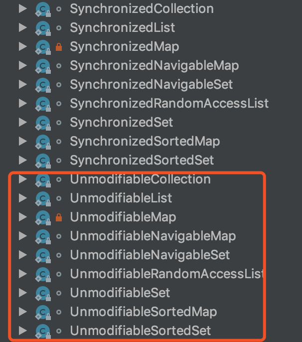

**工具类特征：**


# 一、Arrays

## 1、sort(int[] a)

### 1.1、JDK1.6

#### 1.1.1、源码
```java
// int类型数组排序
public static void sort(int[] a) {
    sort1(a, 0, a.length);
}
private static void sort1(int x[], int off, int len) {
    // Insertion sort on smallest arrays
    if (len < 7) {
        for (int i = off; i < len + off; i++)
            for (int j = i; j > off && x[j - 1] > x[j]; j--)
                swap(x, j, j - 1);
        return;
    }
    // Choose a partition element, v
    int m = off + (len >> 1);       // Small arrays, middle element
    if (len > 7) {
        int l = off;
        int n = off + len - 1;
        if (len > 40) {        // Big arrays, pseudomedian of 9
            int s = len / 8;
            l = med3(x, l, l + s, l + 2 * s);
            m = med3(x, m - s, m, m + s);
            n = med3(x, n - 2 * s, n - s, n);
        }
        m = med3(x, l, m, n); // Mid-size, med of 3
    }
    int v = x[m];

    // Establish Invariant: v* (<v)* (>v)* v*
    int a = off, b = a, c = off + len - 1, d = c;
    while (true) {
        while (b <= c && x[b] <= v) {
            if (x[b] == v)
                swap(x, a++, b);
            b++;
        }
        while (c >= b && x[c] >= v) {
            if (x[c] == v)
                swap(x, c, d--);
            c--;
        }
        if (b > c)
            break;
        swap(x, b++, c--);
    }
    // Swap partition elements back to middle
    int s, n = off + len;
    s = Math.min(a - off, b - a);
    vecswap(x, off, b - s, s);
    s = Math.min(d - c, n - d - 1);
    vecswap(x, b, n - s, s);

    // Recursively sort non-partition-elements
    if ((s = b - a) > 1)
        sort1(x, off, s);
    if ((s = d - c) > 1)
        sort1(x, n - s, s);
}
/**
 * Swaps x[a] with x[b].
 */
private static void swap(int x[], int a, int b) {
    int t = x[a];
    x[a] = x[b];
    x[b] = t;
}
/**
 * Swaps x[a .. (a+n-1)] with x[b .. (b+n-1)].
 */
private static void vecswap(int x[], int a, int b, int n) {
    for (int i = 0; i < n; i++, a++, b++)
        swap(x, a, b);
}
/**
 * Returns the index of the median of the three indexed integers.
 */
private static int med3(int x[], int a, int b, int c) {
    return (x[a] < x[b] ?
            (x[b] < x[c] ? b : x[a] < x[c] ? c : a) :
            (x[b] > x[c] ? b : x[a] > x[c] ? c : a));
}
```
#### 1.1.2、分析
- （1）数组长度小于7，那么排序时基于基本的插入排序算法
- （2）数组长度大于7，那么在使用的优化后的快速排序，对应数组长度在7和40之间的数组，取的切分元素相对来说简单点
	
### 1.2、JDK1.7

#### 1.2.1、源码：
```java
public static void sort(int[] a) {
    DualPivotQuicksort.sort(a);
}

// 下面方法来自：java.util.DualPivotQuicksort#sort(int[])
public static void sort(int[] a) {
    sort(a, 0, a.length - 1);
}
/**
 * If the length of an array to be sorted is less than this
 * constant, Quicksort is used in preference to merge sort.
 */
private static final int QUICKSORT_THRESHOLD = 286;
/**
 * The maximum number of runs in merge sort.
 */
private static final int MAX_RUN_COUNT = 67;
/**
 * The maximum length of run in merge sort.
 */
private static final int MAX_RUN_LENGTH = 33;

public static void sort(int[] a, int left, int right) {
    // Use Quicksort on small arrays
    if (right - left < QUICKSORT_THRESHOLD) {
        sort(a, left, right, true);
        return;
    }

    /*
     * Index run[i] is the start of i-th run
     * (ascending or descending sequence).
     */
    int[] run = new int[MAX_RUN_COUNT + 1];
    int count = 0; run[0] = left;

    // Check if the array is nearly sorted
    for (int k = left; k < right; run[count] = k) {
        if (a[k] < a[k + 1]) { // ascending
            while (++k <= right && a[k - 1] <= a[k]);
        } else if (a[k] > a[k + 1]) { // descending
            while (++k <= right && a[k - 1] >= a[k]);
            for (int lo = run[count] - 1, hi = k; ++lo < --hi; ) {
                int t = a[lo]; a[lo] = a[hi]; a[hi] = t;
            }
        } else { // equal
            for (int m = MAX_RUN_LENGTH; ++k <= right && a[k - 1] == a[k]; ) {
                if (--m == 0) {
                    sort(a, left, right, true);
                    return;
                }
            }
        }

        /*
         * The array is not highly structured,
         * use Quicksort instead of merge sort.
         */
        if (++count == MAX_RUN_COUNT) {
            sort(a, left, right, true);
            return;
        }
    }

    // Check special cases
    if (run[count] == right++) { // The last run contains one element
        run[++count] = right;
    } else if (count == 1) { // The array is already sorted
        return;
    }

    /*
     * Create temporary array, which is used for merging.
     * Implementation note: variable "right" is increased by 1.
     */
    int[] b; byte odd = 0;
    for (int n = 1; (n <<= 1) < count; odd ^= 1);

    if (odd == 0) {
        b = a; a = new int[b.length];
        for (int i = left - 1; ++i < right; a[i] = b[i]);
    } else {
        b = new int[a.length];
    }

    // Merging
    for (int last; count > 1; count = last) {
        for (int k = (last = 0) + 2; k <= count; k += 2) {
            int hi = run[k], mi = run[k - 1];
            for (int i = run[k - 2], p = i, q = mi; i < hi; ++i) {
                if (q >= hi || p < mi && a[p] <= a[q]) {
                    b[i] = a[p++];
                } else {
                    b[i] = a[q++];
                }
            }
            run[++last] = hi;
        }
        if ((count & 1) != 0) {
            for (int i = right, lo = run[count - 1]; --i >= lo;
                 b[i] = a[i]
                    );
            run[++last] = right;
        }
        int[] t = a; a = b; b = t;
    }
}

/**
 * Sorts the specified range of the array by Dual-Pivot Quicksort.
 *
 * @param a the array to be sorted
 * @param left the index of the first element, inclusive, to be sorted
 * @param right the index of the last element, inclusive, to be sorted
 * @param leftmost indicates if this part is the leftmost in the range
 */
private static void sort(int[] a, int left, int right, boolean leftmost){}
```
在JDK7中，排序使用的双轴快速排序，其要比传统的单轴排序要快

- 双轴快速排序：如果数组的长度小于QUICKSORT_THRESHOLD的话就会使用这个双轴快速排序，而这个值是286
```java
if (right - left < QUICKSORT_THRESHOLD) {
    sort(a, left, right, true);
    return;
}
```
### 1.3、JDK1.8

#### 1.3.1、源码

```java
public static void sort(int[] a) {
    DualPivotQuicksort.sort(a, 0, a.length - 1, null, 0, 0);
}
```
DualPivotQuicksort.sort方法
```java
private static final int QUICKSORT_THRESHOLD = 286;
static void sort(int[] a, int left, int right,
                 int[] work, int workBase, int workLen) {
    // Use Quicksort on small arrays，QUICKSORT_THRESHOLD为286，当要排序区间小于286时，发现调用了本类的重载sort方法
    if (right - left < QUICKSORT_THRESHOLD) {
        sort(a, left, right, true);
        return;
    }

    /**
         * run[i] 意味着第i个有序数列开始的位置，（升序或者降序）
         **/
    int[] run =new int[MAX_RUN_COUNT + 1];
    int count=0; run[0] = left;

    // 检查数组是不是已经接近有序状态
    for(int k = left; k < right; run[count] = k) {
        if(a[k] < a[k + 1]){ // 升序
            while(++k <= right && a[k - 1] <= a[k]) ;
        } else if(a[k] > a[k + 1]) { // 降序
            while(++k <=right && a[k - 1] >= a[k]);
            //如果是降序的，找出k之后，把数列倒置
            for (int lo = run[count],hi = k;++lo < --hi) {
                int t = a[lo]; a[lo] = a[hi]; a[hi] = t;
            }
        } else { // 相等
            for(int m = MAX_RUN_LENGTH; ++k <=right && a[k - 1] == a[k];) {
                // 数列中有至少MAX_RUN_LENGTH的数据相等的时候，直接使用快排。
                // 这里为什么这么处理呢？
                if(--m == 0){
                    sort(a, left, right, true);
                    return;
                }
            }
        }

        /**
             * 数组并非高度有序，使用快速排序,因为数组中有序数列的个数超过了MAX_RUN_COUNT
             */
        if(++count == MAX_RUN_COUNT) {
            sort(a, left, right, true);
            return;
        }
    }
    //检查特殊情况
    if(run[count] == right++){ // 最后一个有序数列只有最后一个元素
        run[++count] =right; // 那给最后一个元素的后面加一个哨兵
    } else if(count == 1) { // 整个数组中只有一个有序数列，说明数组已经有序啦，不需要排序了
        return;
    }

    /**
         * 创建合并用的临时数组。
         * 注意： 这里变量right被加了1，它在数列最后一个元素位置+1的位置
         * 这里没看懂，没发现后面的奇数处理和偶数处理有什么不同
         */
    int[] b; byte odd=0;
    for(int n=1; (n <<= 1) < count; odd ^=1);

    if(odd == 0) {
        b=a;a= new int[b.length];
        for(int i=left -1; ++i < right; a[i] = b[i]);
    } else {
        b=new int[a.length];
    }

    // 合并
    // 最外层循环，直到count为1，也就是栈中待合并的序列只有一个的时候，标志合并成功
    // a 做原始数组，b 做目标数组
    for(int last; count > 1; count = last) { 
        // 遍历数组，合并相邻的两个升序序列
        for(int k = (last = 0) + 2; k <= count; k += 2) {
            // 合并run[k-2] 与 run[k-1]两个序列
            int hi = run[k], mi = run[k - 1];
            for(int i = run[k - 2], p = i,q = mi; i < hi; ++i){
                // 这里我给源码加了一个括号，这样好理解一点。 之前总觉得它会出现数组越界问题，
                // 后来加了这个括号之后发现是没有问题的
                if(q >= hi  ||  (p < mi && a[p] <= a[q])) {
                    b[i] = a[p++];
                } else {
                    b[i] = a[q++];
                }
            }
            // 这里把合并之后的数列往前移动
            run[++last] = hi;
        }
        // 如果栈的长度为奇数，那么把最后落单的有序数列copy过对面
        if((count & 1) != 0) {
            for(int i = right, lo =run[count -1]; --i >= lo; b[i] = a[i]);
            run[++last] = right;
        }
        //临时数组，与原始数组对调，保持a做原始数组，b 做目标数组
        int[] t = a; a = b; b = t;
    }
}


int length = right - left + 1;
// INSERTION_SORT_THRESHOLD为47，发现当要排序的个数小于47个时，采用插入排序，采用了哨兵方法，对于新元素从他前一个一个一个比较
// Use insertion sort on tiny arrays
if (length < INSERTION_SORT_THRESHOLD) {
    if (leftmost) {
        /*
                 * Traditional (without sentinel) insertion sort,
                 * optimized for server VM, is used in case of
                 * the leftmost part.
                 */
        for (int i = left, j = i; i < right; j = ++i) {
            int ai = a[i + 1];
            while (ai < a[j]) {
                a[j + 1] = a[j];
                if (j-- == left) {
                    break;
                }
            }
            a[j + 1] = ai;
        }
    } else {
        /**
                * 首先跨过开头的升序的部分
                */
        do {
            if(left > right) {
                return;
            }
        }while(a[++left] >= a[left - 1]);

        /**
                 * 这里用到了成对插入排序方法，它比简单的插入排序算法效率要高一些
                 * 因为这个分支执行的条件是左边是有元素的
                 * 所以可以直接从left开始往前查找。
                 */
        for(int k = left; ++left <= right; k = ++left) {
            int a1 = a[k], a2 = a[left];

            //保证a1>=a2
            if(a1 < a2) {
                a2 = a1; a1 = a[left];
            }
            //先把两个数字中较大的那个移动到合适的位置
            while(a1 < a[--k]) {
                a[k + 2] = a[k]; //这里每次需要向左移动两个元素
            }
            a[++k + 1] = a1;
            //再把两个数字中较小的那个移动到合适的位置
            while(a2 < a[--k]) {
                a[k + 1] = a[k]; //这里每次需要向左移动一个元素
            }
            a[k + 1] = a2;
        }
        int last = a[right];

        while(last < a[--right]) {
            a[right + 1] = last;
        }
        a[right + 1] = last;
    }
    return;
}

```
至于大过INSERTION_SORT_THRESHOLD（47）的，用一种快速排序(双轴快排)的方法：
- 从数列中挑出五个元素，称为 “基准”（pivot）；
- 重新排序数列，所有元素比基准值小的摆放在基准前面，所有元素比基准值大的摆在基准的后面（相同的数可以到任一边）。在这个分区退出之后，该基准就处于数列的中间位置。这个称为分区（partition）操作；
- 递归地（recursive）把小于基准值元素的子数列和大于基准值元素的子数列排序。


**总结，插入排序，快速排序，归并排序三种排序的组合**


# 二、Collections


## 1、sort()方法实现
```java
public static <T extends Comparable<? super T>> void sort(List<T> list)
```

### 1.1、JDK1.6
#### 1.1.1、源码
```java
// 基本方法
public static <T extends Comparable<? super T>> void sort(List<T> list) {
    Object[] a = list.toArray();
    Arrays.sort(a);
    ListIterator<T> i = list.listIterator();
    for (int j=0; j<a.length; j++) {
        i.next();
        i.set((T)a[j]);
    }
}
/**********************下面方法未自Arrays***********************/
// 调用 Arrays.sort(Object[] a) 排序方法，This algorithm offers guaranteed n*log(n) performance.
public static void sort(Object[] a) {
    Object[] aux = (Object[])a.clone();
    mergeSort(aux, a, 0, a.length, 0);
}
/**
 * Tuning parameter: list size at or below which insertion sort will be
 * used in preference to mergesort or quicksort.
 */
private static final int INSERTIONSORT_THRESHOLD = 7;
/**
 * Src is the source array that starts at index 0
 * Dest is the (possibly larger) array destination with a possible offset
 * low is the index in dest to start sorting
 * high is the end index in dest to end sorting
 * off is the offset to generate corresponding low, high in src
 */
private static void mergeSort(Object[] src,
                              Object[] dest,
                              int low,
                              int high,
                              int off) {
    int length = high - low;

    // Insertion sort on smallest arrays
    if (length < INSERTIONSORT_THRESHOLD) {
        for (int i = low; i < high; i++)
            for (int j = i; j > low &&
                    ((Comparable) dest[j - 1]).compareTo(dest[j]) > 0; j--)
                swap(dest, j, j - 1);
        return;
    }

    // Recursively sort halves of dest into src
    int destLow = low;
    int destHigh = high;
    low += off;
    high += off;
    int mid = (low + high) >>> 1;
    mergeSort(dest, src, low, mid, -off);
    mergeSort(dest, src, mid, high, -off);

    // If list is already sorted, just copy from src to dest.  This is an
    // optimization that results in faster sorts for nearly ordered lists.
    if (((Comparable) src[mid - 1]).compareTo(src[mid]) <= 0) {
        System.arraycopy(src, low, dest, destLow, length);
        return;
    }

    // Merge sorted halves (now in src) into dest
    for (int i = destLow, p = low, q = mid; i < destHigh; i++) {
        if (q >= high || p < mid && ((Comparable) src[p]).compareTo(src[q]) <= 0)
            dest[i] = src[p++];
        else
            dest[i] = src[q++];
    }
}

private static void swap(Object[] x, int a, int b) {
    Object t = x[a];
    x[a] = x[b];
    x[b] = t;
}
```
	
### 1.2、JDK1.7
#### 1.2.1、源码
```java
public static <T extends Comparable<? super T>> void sort(List<T> list) {
    Object[] a = list.toArray();
    Arrays.sort(a);
    ListIterator<T> i = list.listIterator();
    for (int j=0; j<a.length; j++) {
        i.next();
        i.set((T)a[j]);
    }
}

//Arrays.sort方法
public static void sort(Object[] a) {
    if (LegacyMergeSort.userRequested)
        legacyMergeSort(a);
    else
        ComparableTimSort.sort(a);
}
static final class LegacyMergeSort {
    private static final boolean userRequested =
        java.security.AccessController.doPrivileged(
            new sun.security.action.GetBooleanAction(
                "java.util.Arrays.useLegacyMergeSort")).booleanValue();
}
/** To be removed in a future release. */
private static void legacyMergeSort(Object[] a) {
    Object[] aux = a.clone();
    mergeSort(aux, a, 0, a.length, 0);
}
private static void mergeSort(Object[] src,
                              Object[] dest,
                              int low,
                              int high,
                              int off) {
    int length = high - low;

    // Insertion sort on smallest arrays
    if (length < INSERTIONSORT_THRESHOLD) {
        for (int i=low; i<high; i++)
            for (int j=i; j>low &&
                     ((Comparable) dest[j-1]).compareTo(dest[j])>0; j--)
                swap(dest, j, j-1);
        return;
    }

    // Recursively sort halves of dest into src
    int destLow  = low;
    int destHigh = high;
    low  += off;
    high += off;
    int mid = (low + high) >>> 1;
    mergeSort(dest, src, low, mid, -off);
    mergeSort(dest, src, mid, high, -off);

    // If list is already sorted, just copy from src to dest.  This is an
    // optimization that results in faster sorts for nearly ordered lists.
    if (((Comparable)src[mid-1]).compareTo(src[mid]) <= 0) {
        System.arraycopy(src, low, dest, destLow, length);
        return;
    }

    // Merge sorted halves (now in src) into dest
    for(int i = destLow, p = low, q = mid; i < destHigh; i++) {
        if (q >= high || p < mid && ((Comparable)src[p]).compareTo(src[q])<=0)
            dest[i] = src[p++];
        else
            dest[i] = src[q++];
    }
}

/**
 * Swaps x[a] with x[b].
 */
private static void swap(Object[] x, int a, int b) {
    Object t = x[a];
    x[a] = x[b];
    x[b] = t;
}

// ComparableTimSort

```

### 1.3、JDK1.8

## 2常见内部类



### 2.1、SynchronizedList

### 2.2、SynchronizedMap

### 2.3、SynchronizedSet


### 2.4、SynchronizedSortedMap

### 2.5、SynchronizedSortedSet


### 2.6、一系列的不可变集合

- UnmodifiableCollection：为只读集合

# 三、Objects
