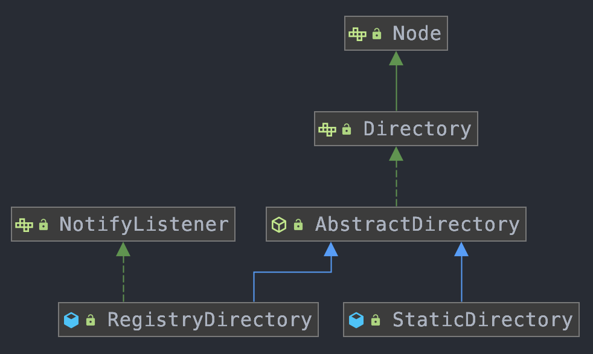

注：dubbo的源码版本是2.7.5

# 1、Dubbo架构描述

## 1.1、基本架构


Dubbo从逻辑上来看，大致可以分为三层结构：业务层（Service）、RPC、Remote三层：
- config 配置层：对外配置接口，以 `ServiceConfig, ReferenceConfig` 为中心，可以直接初始化配置类，也可以通过 spring 解析配置生成配置类
- proxy 服务代理层：服务接口透明代理，生成服务的客户端 Stub 和服务器端 `Skeleton`, 以 `ServiceProxy` 为中心，扩展接口为 `ProxyFactory`
- registry 注册中心层：封装服务地址的注册与发现，以服务 URL 为中心，扩展接口为 `RegistryFactory, Registry, RegistryService`
- cluster 路由层：封装多个提供者的路由及负载均衡，并桥接注册中心，以 Invoker 为中心，扩展接口为 `Cluster, Directory, Router, LoadBalance`
- monitor 监控层：RPC 调用次数和调用时间监控，以 Statistics 为中心，扩展接口为 `MonitorFactory, Monitor, MonitorService`
- protocol 远程调用层：封装 RPC 调用，以 Invocation, Result 为中心，扩展接口为 `Protocol, Invoker, Exporter`
- exchange 信息交换层：封装请求响应模式，同步转异步，以 Request, Response 为中心，扩展接口为 `Exchanger, ExchangeChannel, ExchangeClient, ExchangeServer`
- transport 网络传输层：抽象 mina 和 netty 为统一接口，以 Message 为中心，扩展接口为 `Channel, Transporter, Client, Server, Codec`
- serialize 数据序列化层：可复用的一些工具，扩展接口为 `Serialization, ObjectInput, ObjectOutput, ThreadPool`

## 1.2、微内核

Dubbo 采用 微内核（Microkernel） + 插件（Plugin） 模式，简单来说就是微内核架构。微内核只负责组装插件；

微内核架构包含两类组件：核心系统（core system） 和 插件模块（plug-in modules），核心系统提供系统所需核心能力，插件模块可以扩展系统的功能；

通常情况下，微核心都会采用 Factory、IoC、OSGi 等方式管理插件生命周期。Dubbo 不想依赖 Spring 等 IoC 容器，也不想自已造一个小的 IoC 容器（过度设计），因此采用了一种最简单的 Factory 方式管理插件 ：JDK 标准的 SPI 扩展机制 （java.util.ServiceLoader）

## 1.3、URL

Dubbo 中任意的一个实现都可以抽象为一个 URL，Dubbo 使用 URL 来统一描述了所有对象和配置信息，并贯穿在整个 Dubbo 框架之中
```w
dubbo://172.17.32.91:20880/org.apache.dubbo.demo.DemoService?anyhost=true&application=dubbo-demo-api-provider&dubbo=2.0.2&interface=org.apache.dubbo.demo.DemoService&methods=sayHello,sayHelloAsync&pid=32508&release=&side=provider&timestamp=1593253404714dubbo://172.17.32.91:20880/org.apache.dubbo.demo.DemoService?anyhost=true&application=dubbo-demo-api-provider&dubbo=2.0.2&interface=org.apache.dubbo.demo.DemoService&methods=sayHello,sayHelloAsync&pid=32508&release=&side=provider&timestamp=1593253404714
```
- protocol：dubbo 协议。
- username/password：没有用户名和密码。
- host/port：172.17.32.91:20880。
- path：org.apache.dubbo.demo.DemoService。
- parameters：参数键值对，这里是问号后面的参数。


w# 2、Dubbo扩展点加载机制

## 2.1、加载机制概述

### 2.1.1、Dubbo中SPI概述

[什么是SPI](../../Java基础/Java基础知识.md#二十二JavaSPI机制)

Dubbo中关于SPI的加载，都是用过`ExtensionLoader`类来加载的，使用双重检验锁来解决线程安全问题；Dubbo的SPI的包含负载均衡算法、Filter、集群容错、编码、协议、序列化等，比如LoadBalance（负载均衡）

```java
@SPI(RandomLoadBalance.NAME)
public interface LoadBalance {
    @Adaptive("loadbalance")
    <T> Invoker<T> select(List<Invoker<T>> invokers, URL url, Invocation invocation) throws RpcException;
}
```

**约定**：在扩展类的 jar 包内，放置扩展点配置文件 `META-INF/dubbo/`接口全限定名，内容为：`配置名=扩展实现类全限定名`，多个实现类用换行符分隔，其配置路径一般有三个：`META-INF/services/`、`META-INF/dubbo/`、`META-INF/dubbo/internal/`
- `META-INF/services/` 目录：该目录下的 SPI 配置文件用来兼容 JDK SPI 。
- `META-INF/dubbo/` 目录：该目录用于存放用户自定义 SPI 配置文件。
- `META-INF/dubbo/internal/` 目录：该目录用于存放 Dubbo 内部使用的 SPI 配置文件

### 2.1.2、Dubbo中SPI与JDK中的SPI区别

- 提升性能：JDK的spi要用for循环，然后if判断才能获取到指定的spi对象；dubbo用指定的key就可以获取；
    ```java
    //返回指定名字的扩展
    public T getExtension(String name){}
    ```
- JDK的SPI不支持默认值；dubbo增加了默认值的设计；
- Dubbo的spi增加了IoC、AOP，一个扩展可以直接注入其他扩展；Dubbo支持包装扩展类，一般是把通用的抽象逻辑放到包装类中，用于实现扩展点的APO特性；
- JDK的SPI会一次性实例化扩展点的所有实现，如果有扩展实现则初始化很耗时，如果没有也加载，浪费资源；
- JDK的SPI如果扩展加载失败，则连扩展的名称都获取不到；Dubbo SPI 在抛出异常的时候，会携带该扩展名信息，而不是简单地提示扩展实现类无法加载；
- Dubbo的SPI只是加载配置文件中的类，并分成不同的种类缓存在内存中，而不会立即全部初始化，在性能上有更好的表现；

### 2.1.5、扩展点分类与缓存

Dubbo SPI可以分为 Class缓存、实例缓存；这两种缓存又能根据扩展类的种类分为普通扩展类、包装扩展类（Wrapper）、自适应扩展类（Adaptive）等；
- Class缓存：Dubbo SPI获取扩展类时，会从缓存中读取，如果缓存中不存在，则加载配置文件，根据配置把Class缓存到内存中，并不会直接初始化；
- 实例缓存：Dubbo SPI中不仅缓存Class，也缓存Class实例化后的对象；每次获取时，先会从缓存中读取，如果缓存中读不到，则重新加载并缓存起来；Dubbo SPI缓存的Class并不全部实例化，而是按需实例化并缓存；

根据不同的特性分为不同的类别：
- 普通扩展类：配置在SPI配置文件中扩展类实现；
- 包装扩展类：这类Wrapper类没有具体的实现，只是做了通用逻辑的抽象，并且需要抽象方法中传入一个具体的扩展接口的实现；wrapper包装类包装顺序是否有相关限制
- 自适应扩展类：一个扩展接口会有多个实现类，具体使用哪个实现类可以不写死在配置或代码中，在运行时，通过传入URL中的某个参数动态来确定，使用Adaptive注解来出咯；
- 其他缓存：扩展类加载器缓存、扩展名缓存；

### 2.1.4、扩展点特性

**1、自动包装**

自动包装在Extension加载扩展时，如果返现这个扩展类包含其他扩展点作为构造函数的参数，则这个扩展类就会被认为是Wrapper

**2、自动加载**

如果某个扩展类是另外一个扩展点类的成员属性，并且拥有setter方法，那么框架也会自动注入对应的扩展点实例。ExtensionLoader在初始化时，会自动通过setter方法注入实现类；

**3、自适应**

在Dubbo中，使用`@Adaptive`注解，可以动态通过URL中参数来确定要使用具体的哪个实现类。从而解决自动加载中实例注入的问题；

**4、自动激活**

使用 `@Aactivate` 注解，可以标记对应的扩展点默认被激活使用。该注解还可以通过传入不同的参数，设置扩展点在不同条件下被自动激活；

## 2.2、扩展点注解

### 2.2.1、扩展点注解：@SPI

该注解可以使用在类、接口和枚举类上，Dubbo中都是使用在接口上的，主要是用来标记这个接口是一个扩展点，可以有多个不同的内置实现或者用定义的实现。运行时会用过配置找到具体的实现类

```java
@Retention(RetentionPolicy.RUNTIME)
@Target({ElementType.TYPE})
public @interface SPI {
    // 默认扩展名
    String value() default "";
}
```

### 2.2.2、扩展点自适应注解：@Adaptive

该注解可以标记在类、接口、枚举类和方法上。在整个Dubbo中，只有少数地方用在类级别上，比如 AdaptiveExtensionFactory和 AdaptiveCompiler。

如果标注在接口的方法上，即方法级别注解，则可以用个参数动态获取实现类，在第一个getExtension时会自动生成和编译一个动态的Apdative类，从而达到动态实现的效果，比如如下生成的类：
```java
package com.blue.fish.dubbo.extension.adaptive;
import org.apache.dubbo.common.extension.ExtensionLoader;
public class SimpleExt$Adaptive implements SimpleExt {
    public java.lang.String echo(org.apache.dubbo.common.URL arg0, java.lang.String arg1) {
        if (arg0 == null) throw new IllegalArgumentException("url == null");
        org.apache.dubbo.common.URL url = arg0;
        /**
         * 如果 @Adaptive 注解没有传入key的值，则默认会把类名转换为key，比如：SimpleExt 会转换成 simple.ext
         * 根据key获取对应扩展点实现名称，第一个参数是key，第二个是获取不到时默认值
         * URL中没有“simple.ext”这个key，因此extName 取值为 simpleImpl，
         * 如果 @Adaptive 注解中有key参数，如果 @Adaptive("second")，则会变成 url.getParameter("second", "simpleImpl");
         */
        String extName = url.getParameter("second", "simpleImpl");
        if (extName == null)
            throw new IllegalStateException("Failed to get extension (SimpleExt) name from url (" + url.toString() + ") use keys([second])");
        SimpleExt extension = (SimpleExt) ExtensionLoader.getExtensionLoader(SimpleExt.class).getExtension(extName);
        return extension.echo(arg0, arg1);
    }
}
```

当标注在实现类上，则整个实现类会直接作为默认实现，不再自动生成代码清单。在扩展点接口的多个实现里，只有一个实现上可以加@Adaptive注解。如果多个实现类都有该注解，则会抛出异常

```java
@Documented
@Retention(RetentionPolicy.RUNTIME)
@Target({ElementType.TYPE, ElementType.METHOD})
public @interface Adaptive {
    String[] value() default {};
}
```
该注解可以传入参数，是一个数组。Adaptive 可以传入多个值，在初始化 Adaptive 注解的接口时，会先对传入的URL进行key值匹配，第一个key没有匹配上，匹配第二个，以此类推；知道所有的key匹配完毕，如果还没有匹配到，则使用 @SPI 注解中添加的默认值再去匹配。如果 @SPI 注解中也没有填写默认值，则会抛出 IllegalStateException；

如果包装类没有使用 Adaptive 指定的 key值，也没有填写 SPI 默认值，则Dubbo会指定把接口名称根据驼峰大小写分开，并用 `.` 符号链接起来，以此来作为默认实现类的名，比如 `org.apache.dubbo.xxx.YyyInvokerWrapper` 中的 YyyInvokerWrapper 会被转换为 yyy.invoker.wrapper；

放在实现类上的 Adaptive 注解主要是为了固定对应的实现。在代码中会缓存与 Adaptive 有关的对象；


### 2.2.3、扩展点自动激活注解：@Activate

该注解可以标记在类、接口、枚举类和方法上，主要使用在有多个扩展点的实现、需要根据不同的条件被激活的场景，入Filter需要同时激活多个，因为每个FIlter实现的是不同的功能

```java
@Documented
@Retention(RetentionPolicy.RUNTIME)
@Target({ElementType.TYPE, ElementType.METHOD})
public @interface Activate {
    // URL中的分组如果匹配则激活，可以设置多个
    String[] group() default {};
    // 查找URL中如果含有该key的值，则会激活
    String[] value() default {};
    @Deprecated
    String[] before() default {};
    @Deprecated
    String[] after() default {};
    // 直接的排序信息
    int order() default 0;
}
```

## 2.3、ExtensionLoader 工作原理

ExtensionLoader 是整个扩展机制的主要逻辑类，实现了配置的加载、扩展类缓存、自适应对象生成等工作

Extension有三个主要逻辑入库：getExtension（获取普通扩展类）、getAdaptiveExtension（获取自适应扩展类）、getActivateExtension（获取自动激活的扩展类），其中getExtension是最核心的方法，是吸纳了一个完整的普通扩展类加载过程，加载过程中的每一步，都会先检查缓存中是否已经存在所需的数据，如果存在，则直接从缓存中读取，没有则重新加载，该方法每次只会根据名称返回一个扩展点实现类

### 2.3.1、ExtensionLoader初始化

其构造方法是私有的，一般同一个静态方法getExtensionLoader来获取ExtensionLoader的实例

```java
// 扩展类与对应的扩展类加载器缓存
private static final ConcurrentMap<Class<?>, ExtensionLoader<?>> EXTENSION_LOADERS = new ConcurrentHashMap<>(64);
private ExtensionLoader(Class<?> type) {
    this.type = type;
    // 判断构造时是否为 ExtensionFactory 类，一般在使用的时候这个type肯定不是 ExtensionFactory 类，又会回到ExtensionLoader.getExtensionLoader
    objectFactory = (type == ExtensionFactory.class ? null:ExtensionLoader.getExtensionLoader(ExtensionFactory.class).getAdaptiveExtension());
}
@SuppressWarnings("unchecked")
public static <T> ExtensionLoader<T> getExtensionLoader(Class<T> type) {
    // 省略判断代码
    // 通过传入的 type 从缓存中获取对应的 ExtensionLoader，如果为空，构造一个新的ExtensionLoader
    ExtensionLoader<T> loader = (ExtensionLoader<T>) EXTENSION_LOADERS.get(type);
    if (loader == null) {
        EXTENSION_LOADERS.putIfAbsent(type, new ExtensionLoader<T>(type));
        loader = (ExtensionLoader<T>) EXTENSION_LOADERS.get(type);
    }
    return loader;
}
```
上面会去构造一个  ExtensionFactory 的实例，具体如何构造后面会有 ExtensionFactory的原理

### 2.3.2、getExtension实现原理

方法大致流程图：


```java
// getExtension
public T getExtension(String name) {
    if (StringUtils.isEmpty(name)) {
        throw new IllegalArgumentException("Extension name == null");
    }
    // 获取默认的扩展
    if ("true".equals(name)) {
        return getDefaultExtension();
    }
    final Holder<Object> holder = getOrCreateHolder(name);
    Object instance = holder.get();
    if (instance == null) {
        synchronized (holder) {
            instance = holder.get();
            if (instance == null) {
                // 创建扩展
                instance = createExtension(name);
                holder.set(instance);
            }
        }
    }
    return (T) instance;
}
```
createExtension：
```java
// createExtension
private T createExtension(String name) {
    Class<?> clazz = getExtensionClasses().get(name);
    // ......
    try {
        T instance = (T) EXTENSION_INSTANCES.get(clazz);
        if (instance == null) {
            // 初始化Class
            EXTENSION_INSTANCES.putIfAbsent(clazz, clazz.newInstance());
            instance = (T) EXTENSION_INSTANCES.get(clazz);
        }
        // 向扩展类中注入依赖的属性
        injectExtension(instance);
        // ？？？？ warpper包装类的执行是否有顺序限制？
        Set<Class<?>> wrapperClasses = cachedWrapperClasses;
        if (CollectionUtils.isNotEmpty(wrapperClasses)) {
            // 遍历扩展点包装类，用于初始化包装类实例，比如服务暴露过程中 Protocol 具体调用，经过包装后其调用链
            // QosProtocolWrapper.export -> ProtocolListenerWrapper.export -> ProtocolFilterWrapper.export -> DubboProtocol.export
            for (Class<?> wrapperClass : wrapperClasses) {
                // 找到构造方法参数类型为type的包装类，为其注入扩展类实例
                instance = injectExtension((T) wrapperClass.getConstructor(type).newInstance(instance));
            }
        }
        // 如果是 Lifecycle 接口的实现类，会有相应的生命周期的变化
        initExtension(instance);
        return instance;
    } 
}
```
getExtensionClasses
```java
// getExtensionClasses
private Map<String, Class<?>> getExtensionClasses() {
    // 默认从缓存中获取classes，没有的话通过DCL加载Class
    Map<String, Class<?>> classes = cachedClasses.get();
    if (classes == null) {
        synchronized (cachedClasses) {
            classes = cachedClasses.get();
            if (classes == null) {
                // 加载Class
                classes = loadExtensionClasses();
                cachedClasses.set(classes);
            }
        }
    }
    return classes;
}
```
loadExtensionClasses
```java
private static final String SERVICES_DIRECTORY = "META-INF/services/";
private static final String DUBBO_DIRECTORY = "META-INF/dubbo/";
private static final String DUBBO_INTERNAL_DIRECTORY = DUBBO_DIRECTORY + "internal/";
// loadExtensionClasses
private Map<String, Class<?>> loadExtensionClasses() {
    // 缓存默认的扩展名，即通过SPI注解获取其对应的值，保存到属性 cachedDefaultName
    cacheDefaultExtensionName();
    Map<String, Class<?>> extensionClasses = new HashMap<>();
    // 从配置的三个配置文件目录中加载对应的Class，strategies表示的上述三个配置文件目录
    for (LoadingStrategy strategy : strategies) {
        loadDirectory(extensionClasses, strategy.directory(), type.getName(), strategy.preferExtensionClassLoader(), strategy.excludedPackages());
        loadDirectory(extensionClasses, strategy.directory(), type.getName().replace("org.apache", "com.alibaba"), strategy.preferExtensionClassLoader(), strategy.excludedPackages());
    }
    return extensionClasses;
}
```
loadDirectory：
```java
private void loadDirectory(Map<String, Class<?>> extensionClasses, String dir, String type, boolean extensionLoaderClassLoaderFirst, String... excludedPackages) {
    String fileName = dir + type;
    try {
        // 通过一系列方法查找资源文件
        if (urls != null) {
            while (urls.hasMoreElements()) {
                java.net.URL resourceURL = urls.nextElement();
                // 加载对应的资源
                loadResource(extensionClasses, classLoader, resourceURL, excludedPackages);
            }
        }
    } 
}
```
loadResource：
```java
private void loadResource(Map<String, Class<?>> extensionClasses, ClassLoader classLoader,java.net.URL resourceURL, String... excludedPackages) {
    try {
        try (BufferedReader reader = new BufferedReader(new InputStreamReader(resourceURL.openStream(), StandardCharsets.UTF_8))) {
            String line;
            while ((line = reader.readLine()) != null) {
                if (line.length() > 0) {
                    try {
                        
                        if (line.length() > 0 && !isExcluded(line, excludedPackages)) {
                            // 把Class加载到JVM中，但是并没有做初始化
                            loadClass(extensionClasses, resourceURL, Class.forName(line, true, classLoader), name);
                        }
                    } 
                }
            }
        }
    } catch (Throwable t) {
        logger.error("Exception occurred when loading extension class (interface: " +
                type + ", class file: " + resourceURL + ") in " + resourceURL, t);
    }
}
```
loadClass：
```java
private void loadClass(Map<String, Class<?>> extensionClasses, java.net.URL resourceURL, Class<?> clazz, String name) throws NoSuchMethodException {
    if (clazz.isAnnotationPresent(Adaptive.class)) {
        // 如果是自适应（Adaptive）则缓存，缓存的自适应只有一个，如果存在多个会抛出异常
        cacheAdaptiveClass(clazz);
    } else if (isWrapperClass(clazz)) {
        // 如果是包装类扩展，则直接加入到对应的Set集合中，
        cacheWrapperClass(clazz);
    } else {
        clazz.getConstructor();
        if (StringUtils.isEmpty(name)) {
            name = findAnnotationName(clazz);
            if (name.length() == 0) {
                throw new IllegalStateException("No such extension name for the class " + clazz.getName() + " in the config " + resourceURL);
            }
        }
        String[] names = NAME_SEPARATOR.split(name);
        if (ArrayUtils.isNotEmpty(names)) {
            // 如果有自动激活注解（Activate），则缓存到自动激活的缓存中
            cacheActivateClass(clazz, names[0]);
            // 普通的扩展类缓存
            for (String n : names) {
                cacheName(clazz, n);
                saveInExtensionClass(extensionClasses, clazz, n);
            }
        }
    }
}
```

### 2.3.3、getAdaptiveExtension实现原理

获取自适应扩展的流程大致如下：


```java
public T getAdaptiveExtension() {
    // 从缓存中拿取数据
    Object instance = cachedAdaptiveInstance.get();
    if (instance == null) {
        if (createAdaptiveInstanceError != null) {
            throw new IllegalStateException("Failed to create adaptive instance: " +
                    createAdaptiveInstanceError.toString(),
                    createAdaptiveInstanceError);
        }
        // DCL
        synchronized (cachedAdaptiveInstance) {
            instance = cachedAdaptiveInstance.get();
            if (instance == null) {
                try {
                    // 创建自适应扩展，并缓存
                    instance = createAdaptiveExtension();
                    cachedAdaptiveInstance.set(instance);
                } catch (Throwable t) {
                    createAdaptiveInstanceError = t;
                    throw new IllegalStateException("Failed to create adaptive instance: " + t.toString(), t);
                }
            }
        }
    }

    return (T) instance;
}
```
createAdaptiveExtension：
```java
private T createAdaptiveExtension() {
    try {
        /*
            主要做了三件时间：
            1、调用 getAdaptiveExtensionClass 方法获取自适应拓展 Class 对象
            2、通过反射进行实例化
            3、调用 injectExtension 方法向拓展实例中注入依赖；Dubbo 中有两种类型的自适应扩展，一种是手工编码的，一种是自动生成的。
            手工编码的自适应扩展中可能存在着一些依赖，而自动生成的 Adaptive 扩展则不会依赖其他类；这里主要是为手工编码的自适应扩展设置依赖
            */
        return injectExtension((T) getAdaptiveExtensionClass().newInstance());
    } catch (Exception e) {
        throw new IllegalStateException("Can't create adaptive extension " + type + ", cause: " + e.getMessage(), e);
    }
}
```
getAdaptiveExtensionClass：
```java
private Class<?> getAdaptiveExtensionClass() {
    // 通过 SPI 获取所有的扩展类
    getExtensionClasses();
    // 检查缓存，如果缓存不为空，则直接返回缓存
    if (cachedAdaptiveClass != null) {
        return cachedAdaptiveClass;
    }
    // 创建自适应扩展类
    return cachedAdaptiveClass = createAdaptiveExtensionClass();
}
private Class<?> createAdaptiveExtensionClass() {
    // 生成自适应扩展代码：构造一个 AdaptiveClassCodeGenerator 实例，需要具体的类型以及缓存的默认扩展，调用generate方法生成自适应扩展代码
    String code = new AdaptiveClassCodeGenerator(type, cachedDefaultName).generate();
    // 获取到对应的类加载器
    ClassLoader classLoader = findClassLoader();
    org.apache.dubbo.common.compiler.Compiler compiler = ExtensionLoader.getExtensionLoader(org.apache.dubbo.common.compiler.Compiler.class).getAdaptiveExtension();
    return compiler.compile(code, classLoader);
}
```
AdaptiveClassCodeGenerator.generate
```java
public String generate() {
    // 判断type是否有 @Adaptive 注解的方法，如果没有，直接抛出异常
    if (!hasAdaptiveMethod()) {
        throw new IllegalStateException("No adaptive method exist on extension " + type.getName() + ", refuse to create the adaptive class!");
    }
    StringBuilder code = new StringBuilder();
    // 生成包名
    code.append(generatePackageInfo());
    // 生成导入信息
    code.append(generateImports());
    // 生成类声明
    code.append(generateClassDeclaration());
    Method[] methods = type.getMethods();
    for (Method method : methods) {
        // 生成方法列表：如果是未注解 Adaptive的方法，生成的方法内容是抛出 UnsupportedOperationException 异常信息
        code.append(generateMethod(method));
    }
    code.append("}");
    if (logger.isDebugEnabled()) {
        logger.debug(code.toString());
    }
    return code.toString();
}
```

### 2.3.4、getActivateExtension实现原理

```java
public List<T> getActivateExtension(URL url, String[] values, String group) {
    List<T> activateExtensions = new ArrayList<>();
    List<String> names = values == null ? new ArrayList<>(0) : Arrays.asList(values);
    // names里面不包含"-default"的value，即如果有该值，则所有的默认的 @Activate都不会被激活，只有URL参数指定的扩展点会被激活
    if (!names.contains(REMOVE_VALUE_PREFIX + DEFAULT_KEY)) {
        getExtensionClasses();
        for (Map.Entry<String, Object> entry : cachedActivates.entrySet()) {
            String name = entry.getKey();
            Object activate = entry.getValue();

            String[] activateGroup, activateValue;

            if (activate instanceof Activate) {
                activateGroup = ((Activate) activate).group();
                activateValue = ((Activate) activate).value();
            } else if (activate instanceof com.alibaba.dubbo.common.extension.Activate) {
                activateGroup = ((com.alibaba.dubbo.common.extension.Activate) activate).group();
                activateValue = ((com.alibaba.dubbo.common.extension.Activate) activate).value();
            } else {
                continue;
            }
            if (isMatchGroup(group, activateGroup)
                    && !names.contains(name)
                    && !names.contains(REMOVE_VALUE_PREFIX + name)
                    && isActive(activateValue, url)) {
                activateExtensions.add(getExtension(name));
            }
        }
        activateExtensions.sort(ActivateComparator.COMPARATOR);
    }
    List<T> loadedExtensions = new ArrayList<>();
    for (int i = 0; i < names.size(); i++) {
        String name = names.get(i);
        // 如果传入的"-"符号开头的扩展点名，则该扩展点也不会被自动激活；
        if (!name.startsWith(REMOVE_VALUE_PREFIX)
                && !names.contains(REMOVE_VALUE_PREFIX + name)) {
            if (DEFAULT_KEY.equals(name)) {
                if (!loadedExtensions.isEmpty()) {
                    activateExtensions.addAll(0, loadedExtensions);
                    loadedExtensions.clear();
                }
            } else {
                loadedExtensions.add(getExtension(name));
            }
        }
    }
    if (!loadedExtensions.isEmpty()) {
        activateExtensions.addAll(loadedExtensions);
    }
    return activateExtensions;
}
```
主线流程主要有四步：
- （1）检查缓存，如果缓存中没有，则初始化所有扩展类实现的集合；
- （2）遍历整个 @Activate 注解集合，根据传入URL匹配条件（匹配group、name等），得到所有符合激活条件的扩展类实现。然后根据 @Activate 中配置的before、after、order等参数进行排序；
- （3）遍历所有与用户自定义扩展类名称，根据用户URL配置的属性，调整扩展点集合顺序；
- （4）返回所有自动激活类集合；

### 2.3.5、ExtensionFactory实现原理

## 2.2、Dubbo中已经实现的扩展


```
random=com.alibaba.dubbo.rpc.cluster.loadbalance.RandomLoadBalance
roundrobin=com.alibaba.dubbo.rpc.cluster.loadbalance.RoundRobinLoadBalance
leastactive=com.alibaba.dubbo.rpc.cluster.loadbalance.LeastActiveLoadBalance
consistenthash=com.alibaba.dubbo.rpc.cluster.loadbalance.ConsistentHashLoadBalance
```

## 2.3、自定义扩展的实现，以Filter为例

- 编写Filter的实现类：
    ```java
    public class MyFilter implements Filter {
        @Override
        public Result invoke(Invoker<?> invoker, Invocation invocation) throws RpcException {
            return null;
        }
    }
    ```
- 在resources目录下新建META-INF/dubbo/com.alibaba.dubbo.rpc.Filter文件；
- 在该文件中填入如下内容：`MyFilterExt=com.blue.fish.dubbo.provider.filter.MyFilter`，等号后面是自定义Filter的实现类全路径；
- 如果需要引用该Filter的话，在对应的配置上加上即可，比如：`<dubbo:provider filter="MyFilterExt"/>`；

## 2.5、SPI与IOC

objectFactory就是dubbo的IoC提供对象。SpiExtensionFactory

injectExtension

## 2.6、SPI与AOP

WrapperClass

# 3、配置解析

## 3.1、基于schema设计解析

利用Spring配置文件扩展出自定义的解析方式，dubbo配置约束文件在 `dubbo-config/dubbo-config-spring/src/main/resources/duubo.xsd`。

duubo.xsd 文件用来约束使用xml配置是的标签和对应的属性，如`<dubbo:service>、<dubbo:reference>`等，Spring在解析到自定义的namespace标签时，会查找对应的`spring.schemas`和`spring.handlers`文件，最终触发Dubbo的`DubboNamespaceHandler`类来进行初始化和解析
```
// spring.schemas文件内容：
http\://dubbo.apache.org/schema/dubbo/dubbo.xsd=META-INF/dubbo.xsd
http\://code.alibabatech.com/schema/dubbo/dubbo.xsd=META-INF/compat/dubbo.xsd

// spring.handlers文件内容：
http\://dubbo.apache.org/schema/dubbo=org.apache.dubbo.config.spring.schema.DubboNamespaceHandler
http\://code.alibabatech.com/schema/dubbo=org.apache.dubbo.config.spring.schema.DubboNamespaceHandler
```
spring.schemas 文件指明约束文件的具体路径，spring.handlers 文件指明使用 DubboNamespaceHandler 类解析标签；Spring 解析扩展代码可以参考：`BeanDefinitionParserDelegate#parseCustomElement(org.w3c.dom.Element)`

Dubbo的很多配置粒度是针对方法级别的；

## 3.2、基于xml配置

Dubbo注册属性解析处理器：
```java
public class DubboNamespaceHandler extends NamespaceHandlerSupport implements ConfigurableSourceBeanMetadataElement {
    static {
        Version.checkDuplicate(DubboNamespaceHandler.class);
    }
    @Override
    public void init() {
        // 针对不同的配置解析类
        registerBeanDefinitionParser("application", new DubboBeanDefinitionParser(ApplicationConfig.class, true));
        registerBeanDefinitionParser("module", new DubboBeanDefinitionParser(ModuleConfig.class, true));
        registerBeanDefinitionParser("registry", new DubboBeanDefinitionParser(RegistryConfig.class, true));
        registerBeanDefinitionParser("config-center", new DubboBeanDefinitionParser(ConfigCenterBean.class, true));
        registerBeanDefinitionParser("metadata-report", new DubboBeanDefinitionParser(MetadataReportConfig.class, true));
        registerBeanDefinitionParser("monitor", new DubboBeanDefinitionParser(MonitorConfig.class, true));
        registerBeanDefinitionParser("metrics", new DubboBeanDefinitionParser(MetricsConfig.class, true));
        registerBeanDefinitionParser("ssl", new DubboBeanDefinitionParser(SslConfig.class, true));
        registerBeanDefinitionParser("provider", new DubboBeanDefinitionParser(ProviderConfig.class, true));
        registerBeanDefinitionParser("consumer", new DubboBeanDefinitionParser(ConsumerConfig.class, true));
        registerBeanDefinitionParser("protocol", new DubboBeanDefinitionParser(ProtocolConfig.class, true));
        registerBeanDefinitionParser("service", new DubboBeanDefinitionParser(ServiceBean.class, true));
        registerBeanDefinitionParser("reference", new DubboBeanDefinitionParser(ReferenceBean.class, false));
        // 针对注解的配置
        registerBeanDefinitionParser("annotation", new AnnotationBeanDefinitionParser());
    }
    @Override
    public BeanDefinition parse(Element element, ParserContext parserContext) {
        BeanDefinitionRegistry registry = parserContext.getRegistry();
        registerAnnotationConfigProcessors(registry);
        registerApplicationListeners(registry);
        BeanDefinition beanDefinition = super.parse(element, parserContext);
        setSource(beanDefinition);
        return beanDefinition;
    }
    private void registerApplicationListeners(BeanDefinitionRegistry registry) {
        registerBeans(registry, DubboLifecycleComponentApplicationListener.class);
        registerBeans(registry, DubboBootstrapApplicationListener.class);
    }
    private void registerAnnotationConfigProcessors(BeanDefinitionRegistry registry) {
        AnnotationConfigUtils.registerAnnotationConfigProcessors(registry);
    }
}
```

在启动的时候，通过Spring解析器，会调用 BeanDefinitionParser 实现类的parse方法：
```java
/**
*
* 本质是把属性注入到Spring框架的BeanDefinition，如果属性是引用对象，则dubbo默认会创建 RuntimeBeanReference类型注入，运行时又spring注入引用对象；
*
* dubbo只做属性提取的事情，运行时属性注入和转换都是Spring来处理的，Spring做数据初始化和换号参考：{@link BeanWrapperImpl}
*/
@SuppressWarnings("unchecked")
private static BeanDefinition parse(Element element, ParserContext parserContext, Class<?> beanClass, boolean required) {
    // 生成Spring的Bean定义，指定BeanClass交给Spring反射创建实例
    RootBeanDefinition beanDefinition = new RootBeanDefinition();
    beanDefinition.setBeanClass(beanClass);
    beanDefinition.setLazyInit(false);
    String id = element.getAttribute("id");
    // 确保Spring容器没有重复的Bean定义
    if (StringUtils.isEmpty(id) && required) {
        // 依次尝试xml配置标签的name和interface作为Bean唯一id
        String generatedBeanName = element.getAttribute("name");
        if (StringUtils.isEmpty(generatedBeanName)) {
            // 如果协议标签没有指定name，默认使用dubbo
            if (ProtocolConfig.class.equals(beanClass)) {
                generatedBeanName = "dubbo";
            } else {
                generatedBeanName = element.getAttribute("interface");
            }
        }
        if (StringUtils.isEmpty(generatedBeanName)) {
            generatedBeanName = beanClass.getName();
        }
        id = generatedBeanName;
        int counter = 2;
        // 检查重复Bean，如果有则生成唯一id
        while (parserContext.getRegistry().containsBeanDefinition(id)) {
            id = generatedBeanName + (counter++);
        }
    }
    if (StringUtils.isNotEmpty(id)) {
        if (parserContext.getRegistry().containsBeanDefinition(id)) {
            throw new IllegalStateException("Duplicate spring bean id " + id);
        }
        // 每次解析会向Spring注册新的BeanDefinition，后续会追加属性
        parserContext.getRegistry().registerBeanDefinition(id, beanDefinition);
        beanDefinition.getPropertyValues().addPropertyValue("id", id);
    }
    if (ProtocolConfig.class.equals(beanClass)) {
        // 如果时候<dubbo:protocol>配置
        for (String name : parserContext.getRegistry().getBeanDefinitionNames()) {
            BeanDefinition definition = parserContext.getRegistry().getBeanDefinition(name);
            PropertyValue property = definition.getPropertyValues().getPropertyValue("protocol");
            if (property != null) {
                Object value = property.getValue();
                if (value instanceof ProtocolConfig && id.equals(((ProtocolConfig) value).getName())) {
                    definition.getPropertyValues().addPropertyValue("protocol", new RuntimeBeanReference(id));
                }
            }
        }
    } else if (ServiceBean.class.equals(beanClass)) {
        // 如果<dubbo:service>配置了class属性，那么为具体的class配置的类注册Bean，并注入ref属性，类似如下配置：
        /**
            * <dubbo:service interface="com.blue.fish.dubbo.service.UserService" class="com.blue.fish.dubbo.provider.user.UserServiceImpl"/>
            * 这里会将赋值给 beanDefinition 的ref属性
            */
        String className = element.getAttribute("class");
        if (StringUtils.isNotEmpty(className)) {
            RootBeanDefinition classDefinition = new RootBeanDefinition();
            classDefinition.setBeanClass(ReflectUtils.forName(className));
            classDefinition.setLazyInit(false);
            // 主要解析<dubbo:service>标签中的 name、class和ref等属性，其会把key-value的键值对提取出来放到BeanDefinition中，运行时，Spring会自动处理注入值
            parseProperties(element.getChildNodes(), classDefinition);
            beanDefinition.getPropertyValues().addPropertyValue("ref", new BeanDefinitionHolder(classDefinition, id + "Impl"));
        }
    } else if (ProviderConfig.class.equals(beanClass)) {
        // <dubbo:provider>，该标签可能嵌套了 <dubbo:service> 如果使用了嵌套标签，则内部的标签对象会自动持有外层标签的对象；
        parseNested(element, parserContext, ServiceBean.class, true, "service", "provider", id, beanDefinition);
    } else if (ConsumerConfig.class.equals(beanClass)) {
        // <dubbo:consumer>
        parseNested(element, parserContext, ReferenceBean.class, false, "reference", "consumer", id, beanDefinition);
    }
    Set<String> props = new HashSet<>();
    ManagedMap parameters = null;
    // 获取具体配置对象的所有方法，比如ProviderConfig类
    /**
    * 当前标签的 attribute 获取方式
    * 1、查找配置对象的get、set和is前缀的方法，如果标签属性名和方法名相同，则通过反射调用存储标签对应的值；
    * 2、如果没有与get、set和is前缀匹配的方法，则当做parameters参数存储，是一个map对象，其定义在 AbstractMethodConfig 中；
    */
    for (Method setter : beanClass.getMethods()) {
        String name = setter.getName();
        // 查找所有set前缀的方法，并且只有一个参数的public方法
        if (name.length() > 3 && name.startsWith("set")
                && Modifier.isPublic(setter.getModifiers())
                && setter.getParameterTypes().length == 1) {
            Class<?> type = setter.getParameterTypes()[0];
            // 获取具体的属性，按照驼峰命名规则，比如setTimeout，那么其属性为 timeout
            String beanProperty = name.substring(3, 4).toLowerCase() + name.substring(4);
            String property = StringUtils.camelToSplitName(beanProperty, "-");
            props.add(property);
            // 判断setter方法和getter方法是否匹配
            Method getter = null;
            try {
                getter = beanClass.getMethod("get" + name.substring(3), new Class<?>[0]);
            } catch (NoSuchMethodException e) {
                try {
                    getter = beanClass.getMethod("is" + name.substring(3), new Class<?>[0]);
                } catch (NoSuchMethodException e2) {
                }
            }
            // 如果没有对应的getter方法或者is前缀的方法，跳过
            if (getter == null || !Modifier.isPublic(getter.getModifiers()) || !type.equals(getter.getReturnType())) {
                continue;
            }
            if ("parameters".equals(property)) {
                // 如果是 parameters，按照parameter解析
                parameters = parseParameters(element.getChildNodes(), beanDefinition);
            } else if ("methods".equals(property)) {
                parseMethods(id, element.getChildNodes(), beanDefinition, parserContext);
            } else if ("arguments".equals(property)) {
                parseArguments(id, element.getChildNodes(), beanDefinition, parserContext);
            } else {
                // 直接获取标签的属性值
                String value = element.getAttribute(property);
                if (value != null) {
                    value = value.trim();
                    if (value.length() > 0) {
                        if ("registry".equals(property) && RegistryConfig.NO_AVAILABLE.equalsIgnoreCase(value)) {
                            // 注册中心的配置，且配置为 N/A
                            RegistryConfig registryConfig = new RegistryConfig();
                            registryConfig.setAddress(RegistryConfig.NO_AVAILABLE);
                            beanDefinition.getPropertyValues().addPropertyValue(beanProperty, registryConfig);
                        } else if ("provider".equals(property) || "registry".equals(property) || ("protocol".equals(property) && AbstractServiceConfig.class.isAssignableFrom(beanClass))) {
                            beanDefinition.getPropertyValues().addPropertyValue(beanProperty + "Ids", value);
                        } else {
                            Object reference;
                            if (isPrimitive(type)) {
                                if ("async".equals(property) && "false".equals(value)
                                        || "timeout".equals(property) && "0".equals(value)
                                        || "delay".equals(property) && "0".equals(value)
                                        || "version".equals(property) && "0.0.0".equals(value)
                                        || "stat".equals(property) && "-1".equals(value)
                                        || "reliable".equals(property) && "false".equals(value)) {
                                    // backward compatibility for the default value in old version's xsd
                                    value = null;
                                }
                                reference = value;
                            } else if (ONRETURN.equals(property) || ONTHROW.equals(property) || ONINVOKE.equals(property)) {
                                int index = value.lastIndexOf(".");
                                String ref = value.substring(0, index);
                                String method = value.substring(index + 1);
                                reference = new RuntimeBeanReference(ref);
                                beanDefinition.getPropertyValues().addPropertyValue(property + METHOD, method);
                            } else {
                                if ("ref".equals(property) && parserContext.getRegistry().containsBeanDefinition(value)) {
                                    BeanDefinition refBean = parserContext.getRegistry().getBeanDefinition(value);
                                    if (!refBean.isSingleton()) {
                                        throw new IllegalStateException("The exported service ref " + value + " must be singleton! Please set the " + value + " bean scope to singleton, eg: <bean id=\"" + value + "\" scope=\"singleton\" ...>");
                                    }
                                }
                                reference = new RuntimeBeanReference(value);
                            }
                            // 把匹配到的属性注入到Spring的bean中
                            beanDefinition.getPropertyValues().addPropertyValue(beanProperty, reference);
                        }
                    }
                }
            }
        }
    }
    // 剩余不匹配的attribute当做parameter注入到Bean，props中保存了所有正确解析的属性
    NamedNodeMap attributes = element.getAttributes();
    int len = attributes.getLength();
    for (int i = 0; i < len; i++) {
        Node node = attributes.item(i);
        String name = node.getLocalName();
        // 排除已经解析的值；
        if (!props.contains(name)) {
            if (parameters == null) {
                parameters = new ManagedMap();
            }
            String value = node.getNodeValue();
            parameters.put(name, new TypedStringValue(value, String.class));
        }
    }
    if (parameters != null) {
        beanDefinition.getPropertyValues().addPropertyValue("parameters", parameters);
    }
    return beanDefinition;
}
```
Dubbo只做了属性获取，运行时属性注入和转换都是Spring处理的，Spring如何做数据初始化和转换参考：BeanWrapperImpl

## 3.2、基于注解配置解析

相关注解：
```java
@EnableDubboConfig
@DubboComponentScan
public @interface EnableDubbo {
    ...
}

@Import(DubboConfigConfigurationRegistrar.class)
public @interface EnableDubboConfig {
    boolean multiple() default true;
}

@Import(DubboComponentScanRegistrar.class)
public @interface DubboComponentScan {
    ...
}
```

- 对于服务提供端：ServiceAnnotationBeanPostProcessor
- 对于服务消费端：ReferenceAnnotationBeanPostProcessor

# 4、服务暴露原理

## 4.1、配置初始化

Dubbo根据有优先级会对配置信息做聚合处理，默认覆盖策略遵循以下规则：
- （1）`-D` 传递给JVM参数优先级最高，比如：`-Dduubo.protocol.port=20880`
- （2）代码或xml配置优先级次高；
- （3）配置文件优先级最低

一般使用`dubbo.properties`作为默认是，只有xml没有配置时，`dubbo.properties`配置项才会生效，通常用于共享公共配置；

Dubbo配置也会受到provider的影响
- 如果只有provider端指定配置，则会自动透传都客户端，比如超时
- 如果客户端也配置了相应属性，则服务端配置会被覆盖

不同配置查找顺序：
- 方法级优先，接口级次之，全局配置再次之。
- 如果级别一样，则消费方优先，提供方次之

Dubbo在暴露服务之前，要检查各种配置、设置参数信息，还要补充一些缺省的配置项，然后封装URL对象信息 。在这里，我们必须重视URL对象，Dubbo 使用 URL 作为配置载体，所有的拓展点都是通过 URL 获取配置

## 4.2、远程服务暴露

整体来看，Dubbo做服务暴露分为两部分，第一步将持有的服务实例通过代理转换成 Invoker，第二步把 Invoker 通过具体的协议转换成 Exporter。Invoker 是实体域，它是 Dubbo 的核心模型，其它模型都向它靠扰，或转换成它，它代表一个可执行体，可向它发起 invoke 调用，它有可能是一个本地的实现，也可能是一个远程的实现，也可能一个集群实现。

Dubbo服务暴露的入口点在 ServiceConfig.doExport，无论是xml还是注解，都会转化成ServiceBean，其继承ServiceConfig，在服务暴露前会按照配置覆盖策略完成配置读取，这两者关系如下：


Dubbo服务暴露的入口是：`OneTimeExecutionApplicationContextEventListener.onApplicationEvent`，onApplicationEvent 是一个事件响应方法，该方法会在收到 Spring 上下文刷新事件后执行服务暴露操作：


大致流程图：


主要分为三步：
- （1）检测配置，如果有些配置空的话会默认创建，并且组装成 URL；
- （2）暴露服务，包括暴露到本地的服务和远程的服务；
- （3）注册服务至注册中心；

### 4.2.1、服务入口

OneTimeExecutionApplicationContextEventListener 类有一个模板方法 onApplicationContextEvent，其有两个具体的实现类：DubboBootstrapApplicationListener、DubboLifecycleComponentApplicationListener，那么服务暴露的是是 DubboBootstrapApplicationListener：
```java
// Dubbo启动器监听器，其 onApplicationContextEvent 会调用 {@link DubboBootstrap} 的 start 或者 stop 方法；
public class DubboBootstrapApplicationListener extends OneTimeExecutionApplicationContextEventListener implements Ordered {
    public static final String BEAN_NAME = "dubboBootstrapApplicationListener";
    private final DubboBootstrap dubboBootstrap;
    // 获取 dubboBootstrap实例
    public DubboBootstrapApplicationListener() {
        this.dubboBootstrap = DubboBootstrap.getInstance();
    }
    @Override
    public void onApplicationContextEvent(ApplicationContextEvent event) {
        // 判断具体的事件
        if (event instanceof ContextRefreshedEvent) {
            // context刷新事件，会调用 DubboBootstrap 的start方法
            onContextRefreshedEvent((ContextRefreshedEvent) event);
        } else if (event instanceof ContextClosedEvent) {
            // context关闭事件，会调用 DubboBootstrap 的stop方法
            onContextClosedEvent((ContextClosedEvent) event);
        }
    }
    private void onContextRefreshedEvent(ContextRefreshedEvent event) {
        dubboBootstrap.start();
    }
    private void onContextClosedEvent(ContextClosedEvent event) {
        dubboBootstrap.stop();
    }
    @Override
    public int getOrder() {
        return LOWEST_PRECEDENCE;
    }
}
```

### 4.2.2、启动：DubboBootstrap

```java
// DubboBootstrap 构造函数
private DubboBootstrap() {
    configManager = ApplicationModel.getConfigManager();
    environment = ApplicationModel.getEnvironment();
    DubboShutdownHook.getDubboShutdownHook().register();
    ShutdownHookCallbacks.INSTANCE.addCallback(new ShutdownHookCallback() {
        @Override
        public void callback() throws Throwable {
            DubboBootstrap.this.destroy();
        }
    });
}
// DubboBootstrap.start 方法
public DubboBootstrap start() {
    // CAS 操作
    if (started.compareAndSet(false, true)) {
        // 初始化参数
        initialize();
        if (logger.isInfoEnabled()) {
            logger.info(NAME + " is starting...");
        }
        // 1. 暴露服务
        exportServices();
        // Not only provider register
        if (!isOnlyRegisterProvider() || hasExportedServices()) {
            // 2. export MetadataService
            exportMetadataService();
            //3. Register the local ServiceInstance if required
            registerServiceInstance();
        }
        referServices();
        if (logger.isInfoEnabled()) {
            logger.info(NAME + " has started.");
        }
    }
    return this;
}
private void exportServices() {
    // 获取所有需要暴露的服务循环处理
    configManager.getServices().forEach(sc -> {
        // TODO, compatible with ServiceConfig.export()
        ServiceConfig serviceConfig = (ServiceConfig) sc;
        serviceConfig.setBootstrap(this);
        // 是否异步操作
        if (exportAsync) {
            ExecutorService executor = executorRepository.getServiceExporterExecutor();
            Future<?> future = executor.submit(() -> {
                sc.export();
            });
            asyncExportingFutures.add(future);
        } else {
            sc.export();
            exportedServices.add(sc);
        }
    });
}
```

### 4.2.3、ServiceConfig.export

```java
public synchronized void export() {
    ...
    // 检查和更新配置
    checkAndUpdateSubConfigs();
    //init serviceMetadata
    serviceMetadata.setVersion(version);
    serviceMetadata.setGroup(group);
    serviceMetadata.setDefaultGroup(group);
    serviceMetadata.setServiceType(getInterfaceClass());
    serviceMetadata.setServiceInterfaceName(getInterface());
    serviceMetadata.setTarget(getRef());
    // 是否延迟暴露服务等
    if (shouldDelay()) {
        DELAY_EXPORT_EXECUTOR.schedule(this::doExport, getDelay(), TimeUnit.MILLISECONDS);
    } else {
        doExport();
    }
    exported();
}
protected synchronized void doExport() {
    ....
    // 真正暴露服务的接口
    doExportUrls();
}
// 上面主要是做些配置校验：
/*
检测 <dubbo:service> 标签的 interface 属性合法性，不合法则抛出异常
检测 ProviderConfig、ApplicationConfig 等核心配置类对象是否为空，若为空，则尝试从其他配置类对象中获取相应的实例。
检测并处理泛化服务和普通服务类
检测本地存根配置，并进行相应的处理
对 ApplicationConfig、RegistryConfig 等配置类进行检测，为空则尝试创建，若无法创建则抛出异常
*/
```

### 4.2.4、多协议多注册中心暴露：ServiceConfig.doExportUrls

```java
private void doExportUrls() {
    // 注册一个当前Service服务到ServiceRepository中
    ServiceRepository repository = ApplicationModel.getServiceRepository();
    ServiceDescriptor serviceDescriptor = repository.registerService(getInterfaceClass());
    repository.registerProvider(
            getUniqueServiceName(),
            ref,
            serviceDescriptor,
            this,
            serviceMetadata
    );
    // 获取当前服务对应的注册中心实例，loadRegistries主要做如下事情：
    List<URL> registryURLs = ConfigValidationUtils.loadRegistries(this, true);
    // 遍历 protocols，并在每个协议下导出服务
    for (ProtocolConfig protocolConfig : protocols) {
        String pathKey = URL.buildKey(getContextPath(protocolConfig).map(p -> p + "/" + path).orElse(path), group, version);
        // In case user specified path, register service one more time to map it to path.
        repository.registerService(pathKey, interfaceClass);
        // TODO, uncomment this line once service key is unified
        serviceMetadata.setServiceKey(pathKey);
        // 如果服务指定暴露多个协议，则依次暴露服务
        doExportUrlsFor1Protocol(protocolConfig, registryURLs);
    }
}
```
loadRegistries 方法主要包含如下的逻辑：
- 检测是否存在注册中心配置类，不存在则抛出异常
- 构建参数映射集合，也就是 map
- 构建注册中心链接列表
- 遍历链接列表，并根据条件决定是否将其添加到 registryList 中

### 4.2.5、ServiceConfig.doExportUrlsFor1Protocol：

构造URL：com.alibaba.dubbo.common.URL

```java
private void doExportUrlsFor1Protocol(ProtocolConfig protocolConfig, List<URL> registryURLs) {
    // 协议默认是dubbo
    String name = protocolConfig.getName();
    if (StringUtils.isEmpty(name)) {
        name = DUBBO;
    }
    // 添加 side、版本、时间戳以及进程号等信息到 map 中
    Map<String, String> map = new HashMap<String, String>();
    map.put(SIDE_KEY, PROVIDER_SIDE);
    // 读取其他配置到map中，用于构造URL
    ServiceConfig.appendRuntimeParameters(map);
    AbstractConfig.appendParameters(map, getMetrics());
    AbstractConfig.appendParameters(map, getApplication());
    AbstractConfig.appendParameters(map, getModule());
    // remove 'default.' prefix for configs from ProviderConfig
    // appendParameters(map, provider, Constants.DEFAULT_KEY);
    AbstractConfig.appendParameters(map, provider);
    AbstractConfig.appendParameters(map, protocolConfig);
    AbstractConfig.appendParameters(map, this);
    MetadataReportConfig metadataReportConfig = getMetadataReportConfig();
    if (metadataReportConfig != null && metadataReportConfig.isValid()) {
        map.putIfAbsent(METADATA_KEY, REMOTE_METADATA_STORAGE_TYPE);
    }
    // methods 为 MethodConfig 集合，MethodConfig 中存储了 <dubbo:method> 标签的配置信息
    if (CollectionUtils.isNotEmpty(getMethods())) {
        ....
    }
    // 检测 generic 是否为 "true"，并根据检测结果向 map 中添加不同的信息
    if (ProtocolUtils.isGeneric(generic)) {
        map.put(GENERIC_KEY, generic);
        map.put(METHODS_KEY, ANY_VALUE);
    } else {
        String revision = Version.getVersion(interfaceClass, version);
        if (revision != null && revision.length() > 0) {
            map.put(REVISION_KEY, revision);
        }
        // 为接口生成包裹类 Wrapper，Wrapper 中包含了接口的详细信息，比如接口方法名数组，字段信息等
        String[] methods = Wrapper.getWrapper(interfaceClass).getMethodNames();
        if (methods.length == 0) {
            logger.warn("No method found in service interface " + interfaceClass.getName());
            map.put(METHODS_KEY, ANY_VALUE);
        } else {
            map.put(METHODS_KEY, StringUtils.join(new HashSet<String>(Arrays.asList(methods)), ","));
        }
    }
    // token
    if(ConfigUtils.isEmpty(token) && provider != null) {
        token = provider.getToken();
    }

    if (!ConfigUtils.isEmpty(token)) {
        if (ConfigUtils.isDefault(token)) {
            map.put(TOKEN_KEY, UUID.randomUUID().toString());
        } else {
            map.put(TOKEN_KEY, token);
        }
    }

    //init serviceMetadata attachments
    serviceMetadata.getAttachments().putAll(map);

    // export service
    String host = findConfigedHosts(protocolConfig, registryURLs, map);
    Integer port = findConfigedPorts(protocolConfig, name, map);
    URL url = new URL(name, host, port, getContextPath(protocolConfig).map(p -> p + "/" + path).orElse(path), map);

    // You can customize Configurator to append extra parameters
    if (ExtensionLoader.getExtensionLoader(ConfiguratorFactory.class)
            .hasExtension(url.getProtocol())) {
        url = ExtensionLoader.getExtensionLoader(ConfiguratorFactory.class)
                .getExtension(url.getProtocol()).getConfigurator(url).configure(url);
    }
    .....
}
```

### 4.2.6、导出服务：服务导出分为导出到本地 (JVM)，和导出到远程

```java
private void doExportUrlsFor1Protocol(ProtocolConfig protocolConfig, List<URL> registryURLs) {
    ....
    String scope = url.getParameter(SCOPE_KEY);
    if (!SCOPE_NONE.equalsIgnoreCase(scope)) {

        // 本地服务暴露: scope != remote
        if (!SCOPE_REMOTE.equalsIgnoreCase(scope)) {
            exportLocal(url);
        }
        // 远程服务暴露: scope != local
        if (!SCOPE_LOCAL.equalsIgnoreCase(scope)) {
            if (CollectionUtils.isNotEmpty(registryURLs)) {
                for (URL registryURL : registryURLs) {
                    // 如果协议名称是 injvm，不注册
                    if (LOCAL_PROTOCOL.equalsIgnoreCase(url.getProtocol())) {
                        continue;
                    }
                    url = url.addParameterIfAbsent(DYNAMIC_KEY, registryURL.getParameter(DYNAMIC_KEY));
                    URL monitorUrl = ConfigValidationUtils.loadMonitor(this, registryURL);
                    if (monitorUrl != null) {
                        // 如果配置了监控地址，则服务调用信息会上报
                        url = url.addParameterAndEncoded(MONITOR_KEY, monitorUrl.toFullString());
                    }
                    if (logger.isInfoEnabled()) {
                        if (url.getParameter(REGISTER_KEY, true)) {
                            logger.info("Register dubbo service " + interfaceClass.getName() + " url " + url + " to registry " + registryURL);
                        } else {
                            logger.info("Export dubbo service " + interfaceClass.getName() + " to url " + url);
                        }
                    }
                    // For providers, this is used to enable custom proxy to generate invoker
                    String proxy = url.getParameter(PROXY_KEY);
                    if (StringUtils.isNotEmpty(proxy)) {
                        registryURL = registryURL.addParameter(PROXY_KEY, proxy);
                    }
                    // 通过动态代理转换成 Invoker，registryUrl存储的是注册中心地址，使用export作为key追加服务元数据信息
                    Invoker<?> invoker = PROXY_FACTORY.getInvoker(ref, (Class) interfaceClass, registryURL.addParameterAndEncoded(EXPORT_KEY, url.toFullString()));
                    // 将生产的代理 Invoker 和 当前ServiceConfig包装一下
                    DelegateProviderMetaDataInvoker wrapperInvoker = new DelegateProviderMetaDataInvoker(invoker, this);
                    // 服务暴露后向注册中心注册服务信息
                    /**
                        * 这里在真正执行的时候会根据 invoker.getUrl.getProtocol来判断具体的Protocol实现类。
                        * Protocol有三个包装类：ProtocolFilterWrapper、ProtocolListenerWrapper、QosProtocolWrapper，
                        * 那边在通过ExtensionLoader获取扩展的时候，会将这三个包装类放到缓存：cacheWrapperClass。
                        * 在getExtension的时候，比如当前是registry，其对于的Protocol实现类是：RegistryProtocol，会将上述三个包装类包装 RegistryProtocol，
                        * 那么最终的 PROTOCOL 真正形成如下调用链：QosProtocolWrapper.export -> ProtocolListenerWrapper.export -> ProtocolFilterWrapper.export -> RegistryProtocol.export
                        */
                    Exporter<?> exporter = PROTOCOL.export(wrapperInvoker);
                    exporters.add(exporter);
                }
            } else {
                // 处理没有注册中心场景，直接暴露服务
                if (logger.isInfoEnabled()) {
                    logger.info("Export dubbo service " + interfaceClass.getName() + " to url " + url);
                }
                Invoker<?> invoker = PROXY_FACTORY.getInvoker(ref, (Class) interfaceClass, url);
                DelegateProviderMetaDataInvoker wrapperInvoker = new DelegateProviderMetaDataInvoker(invoker, this);
                Exporter<?> exporter = PROTOCOL.export(wrapperInvoker);
                exporters.add(exporter);
            }
            /**
                * @since 2.7.0
                * ServiceData Store
                */
            WritableMetadataService metadataService = WritableMetadataService.getExtension(url.getParameter(METADATA_KEY, DEFAULT_METADATA_STORAGE_TYPE));
            if (metadataService != null) {
                metadataService.publishServiceDefinition(url);
            }
        }
    }
    this.urls.add(url);
}
```
根据URL中scope参数值，判断：
* 1、scope = none，不导出服务
* 2、scope != remote，导出到本地
* 3、scope != local，导出到远程

#### 4.2.6.1、创建invoker

#### 4.2.6.2、导出服务到本地

#### 4.2.6.3、导出服务到远程

dubbo://192.168.31.196:20880/org.apache.dubbo.samples.annotation.api.GreetingService?anyhost=true&application=samples-annotation-provider&bind.ip=192.168.31.196&bind.port=20880&deprecated=false&dubbo=2.0.2&dynamic=true&generic=false&interface=org.apache.dubbo.samples.annotation.api.GreetingService&methods=greeting,replyGreeting&pid=11517&release=2.7.5&revision=1.0.0_annotation&side=provider&timeout=1000&timestamp=1584849181681&version=1.0.0_annotation

# 5、服务引入与消费原理

Dubbo 服务引用的时机有两个，第一个是饿汉式的，第二个是懒汉式的。
- 第一个是在 Spring 容器调用 ReferenceBean 的 afterPropertiesSet 方法时引用服务；
- 第二个是在 ReferenceBean 对应的服务被注入到其他类中时引用。这两个引用服务的时机区别在于；

默认情况下，Dubbo 使用懒汉式引用服务。如果需要使用饿汉式，可通过配置 `<dubbo:reference>` 的 init 属性开启。

按照 Dubbo 默认配置进行分析，整个分析过程从 ReferenceBean 的 getObject 方法开始：
- 当我们的服务被注入到其他类中时，Spring 会第一时间调用 getObject 方法，并由该方法执行服务引用逻辑。按照惯例，在进行具体工作之前，需先进行配置检查与收集工作；
- 接着根据收集到的信息决定服务用的方式，有三种，第一种是引用本地 (JVM) 服务，第二是通过直连方式引用远程服务，第三是通过注册中心引用远程服务。不管是哪种引用方式，最后都会得到一个 Invoker 实例。如果有多个注册中心，多个服务提供者，这个时候会得到一组 Invoker 实例，此时需要通过集群管理类 Cluster 将多个 Invoker 合并成一个实例。合并后的 Invoker 实例已经具备调用本地或远程服务的能力了，但并不能将此实例暴露给用户使用，这会对用户业务代码造成侵入。此时框架还需要通过代理工厂类 (ProxyFactory) 为服务接口生成代理类，并让代理类去调用 Invoker 逻辑。避免了 Dubbo 框架代码对业务代码的侵入；

服务引用的入口方法为 ReferenceBean 的 getObject 方法，该方法定义在 Spring 的 FactoryBean 接口中，ReferenceBean 实现了这个方法：
```java
/**
* 如果使用的是xml，那么入口方法在这里
* @return
*/
@Override
public Object getObject() {
    return get();
}
// ReferenceConfig：服务引用的真正入口点，无论是xml还是注解
public synchronized T get() {
    if (destroyed) {
        throw new IllegalStateException("The invoker of ReferenceConfig(" + url + ") has already destroyed!");
    }
    if (ref == null) {
        init();
    }
    return ref;
}
```
注解入口：org.apache.dubbo.config.spring.beans.factory.annotation.ReferenceAnnotationBeanPostProcessor#doGetInjectedBean

## 5.1、ReferenceConfig.init 方法

```java
public synchronized void init() {
    // 省略代码：主要是做一些校验、加载配置
    String hostToRegistry = ConfigUtils.getSystemProperty(DUBBO_IP_TO_REGISTRY);
    if (StringUtils.isEmpty(hostToRegistry)) {
        hostToRegistry = NetUtils.getLocalHost();
    } else if (isInvalidLocalHost(hostToRegistry)) {
        throw new IllegalArgumentException("Specified invalid registry ip from property:" + DUBBO_IP_TO_REGISTRY + ", value:" + hostToRegistry);
    }
    map.put(REGISTER_IP_KEY, hostToRegistry);

    serviceMetadata.getAttachments().putAll(map);

    // 创建代理类
    ref = createProxy(map);

    serviceMetadata.setTarget(ref);
    serviceMetadata.addAttribute(PROXY_CLASS_REF, ref);
    ConsumerModel consumerModel = repository.lookupReferredService(serviceMetadata.getServiceKey());
    consumerModel.setProxyObject(ref);
    consumerModel.init(attributes);

    initialized = true;

    // dispatch a ReferenceConfigInitializedEvent since 2.7.4
    dispatch(new ReferenceConfigInitializedEvent(this, invoker));
}
```

## 5.2、服务引用：createProxy

从字面意思上来看，createProxy 似乎只是用于创建代理对象的。但实际上并非如此，该方法还会调用其他方法构建以及合并 Invoker 实例
```java
/**
    * 1、用于创建代理对象；
    * 2、调用其他方法构建以及合并 Invoker 实例
    * @param map
    * @return
    */
@SuppressWarnings({"unchecked", "rawtypes", "deprecation"})
private T createProxy(Map<String, String> map) {
    // shouldJvmRefer() 主要判断是否为JVM内部引用
    if (shouldJvmRefer(map)) {
        // 生成本地引用 URL，协议为 injvm
        URL url = new URL(LOCAL_PROTOCOL, LOCALHOST_VALUE, 0, interfaceClass.getName()).addParameters(map);
        // 调用 refer 方法构建 InjvmInvoker 实例
        invoker = REF_PROTOCOL.refer(interfaceClass, url);
        if (logger.isInfoEnabled()) {
            logger.info("Using injvm service " + interfaceClass.getName());
        }
    } else {
        // 远程引用
        urls.clear();
        if (url != null && url.length() > 0) { // url 不为空，表明用户可能想进行点对点调用
            // 当需要配置多个 url 时，可用分号进行分割，这里会进行切分
            String[] us = SEMICOLON_SPLIT_PATTERN.split(url);
            if (us != null && us.length > 0) {
                for (String u : us) {
                    URL url = URL.valueOf(u);
                    if (StringUtils.isEmpty(url.getPath())) {
                        url = url.setPath(interfaceName);
                    }
                    // 检测 url 协议是否为 registry，若是，表明用户想使用指定的注册中心
                    if (UrlUtils.isRegistry(url)) {
                        urls.add(url.addParameterAndEncoded(REFER_KEY, StringUtils.toQueryString(map)));
                    } else {
                        // 合并 url，移除服务提供者的一些配置（这些配置来源于用户配置的 url 属性），
                        // 比如线程池相关配置。并保留服务提供者的部分配置，比如版本，group，时间戳等
                        // 最后将合并后的配置设置为 url 查询字符串中。
                        urls.add(ClusterUtils.mergeUrl(url, map));
                    }
                }
            }
        } else { // assemble URL from register center's configuration
            // 如果协议不是JVM，检查注册中心
            if (!LOCAL_PROTOCOL.equalsIgnoreCase(getProtocol())) {
                checkRegistry();
                // 获取注册中心URLS
                List<URL> us = ConfigValidationUtils.loadRegistries(this, false);
                if (CollectionUtils.isNotEmpty(us)) {
                    for (URL u : us) {
                        URL monitorUrl = ConfigValidationUtils.loadMonitor(this, u);
                        if (monitorUrl != null) {
                            map.put(MONITOR_KEY, URL.encode(monitorUrl.toFullString()));
                        }
                        urls.add(u.addParameterAndEncoded(REFER_KEY, StringUtils.toQueryString(map)));
                    }
                }
                // 未配置注册中心，抛出异常
                if (urls.isEmpty()) {
                    throw new IllegalStateException("No such any registry to reference " + interfaceName + " on the consumer " + NetUtils.getLocalHost() + " use dubbo version " + Version.getVersion() + ", please config <dubbo:registry address=\"...\" /> to your spring config.");
                }
            }
        }
        // 单个注册中心或服务提供者，服务直连
        if (urls.size() == 1) {
            // 调用 RegistryProtocol 的 refer 构建 Invoker 实例
            invoker = REF_PROTOCOL.refer(interfaceClass, urls.get(0));
        } else {
            // 多个注册中心或多个服务提供者，或者两者混合
            List<Invoker<?>> invokers = new ArrayList<Invoker<?>>();
            URL registryURL = null;
            for (URL url : urls) {
                invokers.add(REF_PROTOCOL.refer(interfaceClass, url));
                if (UrlUtils.isRegistry(url)) {
                    registryURL = url; // use last registry url
                }
            }
            if (registryURL != null) { // registry url is available
                // 如果注册中心链接不为空，则将使用 AvailableCluster
                URL u = registryURL.addParameterIfAbsent(CLUSTER_KEY, ZoneAwareCluster.NAME);
                // 创建 StaticDirectory 实例，并由 Cluster 对多个 Invoker 进行合并
                // The invoker wrap relation would be like: ZoneAwareClusterInvoker(StaticDirectory) -> FailoverClusterInvoker(RegistryDirectory, routing happens here) -> Invoker
                invoker = CLUSTER.join(new StaticDirectory(u, invokers));
            } else { // not a registry url, must be direct invoke.
                invoker = CLUSTER.join(new StaticDirectory(invokers));
            }
        }
    }
    // 判断：是否需要做检查 且 当前 invoker是否可用
    if (shouldCheck() && !invoker.isAvailable()) {
        invoker.destroy();
        throw new IllegalStateException("Failed to check the status of the service "
                + interfaceName
                + ". No provider available for the service "
                + (group == null ? "" : group + "/")
                + interfaceName +
                (version == null ? "" : ":" + version)
                + " from the url "
                + invoker.getUrl()
                + " to the consumer "
                + NetUtils.getLocalHost() + " use dubbo version " + Version.getVersion());
    }
    
    /**
        * @since 2.7.0
        * ServiceData Store
        */
    String metadata = map.get(METADATA_KEY);
    WritableMetadataService metadataService = WritableMetadataService.getExtension(metadata == null ? DEFAULT_METADATA_STORAGE_TYPE : metadata);
    if (metadataService != null) {
        URL consumerURL = new URL(CONSUMER_PROTOCOL, map.remove(REGISTER_IP_KEY), 0, map.get(INTERFACE_KEY), map);
        metadataService.publishServiceDefinition(consumerURL);
    }
    // 生成服务代理类
    return (T) PROXY_FACTORY.getProxy(invoker, ProtocolUtils.isGeneric(generic));
}
```

## 5.3、创建 Invoker

Invoker 是 Dubbo 的核心模型，代表一个可执行体。在服务提供方，Invoker 用于调用服务提供类。在服务消费方，Invoker 用于执行远程调用。Invoker 是由 Protocol 实现类构建而来。Protocol主要实现类：RegistryProtocol、DubboProtocol。
```java
//  refer方法在父类AbstractProtocol上，提供看一个模板方法 protocolBindingRefer 由具体子类来实现
@Override
public <T> Invoker<T> refer(Class<T> type, URL url) throws RpcException {
    return new AsyncToSyncInvoker<>(protocolBindingRefer(type, url));
}
protected abstract <T> Invoker<T> protocolBindingRefer(Class<T> type, URL url) throws RpcException;
// DubboProtocol
@Override
public <T> Invoker<T> protocolBindingRefer(Class<T> serviceType, URL url) throws RpcException {
    optimizeSerialization(url);
    // 创建RPC Invoker， getClients 方法用于获取客户端实例，实例类型为 ExchangeClient
    DubboInvoker<T> invoker = new DubboInvoker<T>(serviceType, url, getClients(url), invokers);
    invokers.add(invoker);
    return invoker;
}
```
getClients获取客户端实例：
```java
private ExchangeClient[] getClients(URL url) {
    // 是否共享连接
    boolean useShareConnect = false;
    // 获取连接数，默认为0
    int connections = url.getParameter(CONNECTIONS_KEY, 0);
    List<ReferenceCountExchangeClient> shareClients = null;
    // 如果未配置 connections，则共享连接，否则就用一个连接
    if (connections == 0) {
        useShareConnect = true;
        /*
            * The xml configuration should have a higher priority than properties.
            */
        String shareConnectionsStr = url.getParameter(SHARE_CONNECTIONS_KEY, (String) null);
        connections = Integer.parseInt(StringUtils.isBlank(shareConnectionsStr) ? ConfigUtils.getProperty(SHARE_CONNECTIONS_KEY,
                DEFAULT_SHARE_CONNECTIONS) : shareConnectionsStr);
        // 获取共享客户端
        shareClients = getSharedClient(url, connections);
    }
    ExchangeClient[] clients = new ExchangeClient[connections];
    for (int i = 0; i < clients.length; i++) {
        if (useShareConnect) {
            clients[i] = shareClients.get(i);
        } else {
            // 初始化新的客户端
            clients[i] = initClient(url);
        }
    }
    return clients;
}
private ExchangeClient initClient(URL url) {
    // 获取客户端类型，默认为 netty
    String str = url.getParameter(CLIENT_KEY, url.getParameter(SERVER_KEY, DEFAULT_REMOTING_CLIENT));
    // 添加编解码和心跳包参数到 url 中
    url = url.addParameter(CODEC_KEY, DubboCodec.NAME);
    // enable heartbeat by default
    url = url.addParameterIfAbsent(HEARTBEAT_KEY, String.valueOf(DEFAULT_HEARTBEAT));
    // 检测客户端类型是否存在，不存在则抛出异常
    if (str != null && str.length() > 0 && !ExtensionLoader.getExtensionLoader(Transporter.class).hasExtension(str)) {
        throw new RpcException("Unsupported client type: " + str + "," +
                " supported client type is " + StringUtils.join(ExtensionLoader.getExtensionLoader(Transporter.class).getSupportedExtensions(), " "));
    }
    ExchangeClient client;
    try {
        // 获取 lazy 配置，并根据配置值决定创建的客户端类型
        if (url.getParameter(LAZY_CONNECT_KEY, false)) {
            // 懒加载实例
            client = new LazyConnectExchangeClient(url, requestHandler);
        } else {
            // 创建普通 ExchangeClient 实例
            client = Exchangers.connect(url, requestHandler);
        }
    }
    ...
    return client;
}
// Exchangers
public static ExchangeClient connect(URL url, ExchangeHandler handler) throws RemotingException {
    if (url == null) {
        throw new IllegalArgumentException("url == null");
    }
    if (handler == null) {
        throw new IllegalArgumentException("handler == null");
    }
    url = url.addParameterIfAbsent(Constants.CODEC_KEY, "exchange");
    // 获取 Exchanger 实例，默认为 HeaderExchangeClient
    return getExchanger(url).connect(url, handler);
}
// HeaderExchanger
@Override
public ExchangeClient connect(URL url, ExchangeHandler handler) throws RemotingException {
    // 这里包含了多个调用，分别如下：
    // 1. 创建 HeaderExchangeHandler 对象
    // 2. 创建 DecodeHandler 对象
    // 3. 通过 Transporters 构建 Client 实例
    // 4. 创建 HeaderExchangeClient 对象
    return new HeaderExchangeClient(Transporters.connect(url, new DecodeHandler(new HeaderExchangeHandler(handler))), true);
}
```
最终是通过Transporter.connect创建连接，默认是Netty的，那么创建Client就是NettyClient
```java
/**
 * Default extension of {@link Transporter} using netty4.x.
 */
public class NettyTransporter implements Transporter {
    public static final String NAME = "netty";
    // 省略代码
    @Override
    public Client connect(URL url, ChannelHandler listener) throws RemotingException {
        return new NettyClient(url, listener);
    }
}
```

## 5.4、创建代理

Invoker 创建完毕后，接下来要做的事情是为服务接口生成代理对象。有了代理对象，即可进行远程调用。代理对象生成的入口方法为 ProxyFactory 的 getProxy。具体调用的是 AbstractProxyFactory
```java
public abstract class AbstractProxyFactory implements ProxyFactory {
    @Override
    public <T> T getProxy(Invoker<T> invoker) throws RpcException {
        // 调用重载方法
        return getProxy(invoker, false);
    }
    @Override
    public <T> T getProxy(Invoker<T> invoker, boolean generic) throws RpcException {
        Set<Class<?>> interfaces = new HashSet<>();
        // 获取接口列表
        String config = invoker.getUrl().getParameter(INTERFACES);
        if (config != null && config.length() > 0) {
            // 切分接口列表
            String[] types = COMMA_SPLIT_PATTERN.split(config);
            for (String type : types) {
                // TODO can we load successfully for a different classloader?.
                interfaces.add(ReflectUtils.forName(type));
            }
        }

        if (generic) {
            if (!GenericService.class.isAssignableFrom(invoker.getInterface())) {
                interfaces.add(com.alibaba.dubbo.rpc.service.GenericService.class);
            }
            try {
                // find the real interface from url
                String realInterface = invoker.getUrl().getParameter(Constants.INTERFACE);
                interfaces.add(ReflectUtils.forName(realInterface));
            } catch (Throwable e) {
                // ignore
            }
        }

        interfaces.add(invoker.getInterface());
        interfaces.addAll(Arrays.asList(INTERNAL_INTERFACES));
        // 模板方法，由具体的子类实现，默认是：JavassistProxyFactory
        return getProxy(invoker, interfaces.toArray(new Class<?>[0]));
    }
    public abstract <T> T getProxy(Invoker<T> invoker, Class<?>[] types);
}
```
JavassistProxyFactory.getProxy
```java
public class JavassistProxyFactory extends AbstractProxyFactory {
    @Override
    @SuppressWarnings("unchecked")
    public <T> T getProxy(Invoker<T> invoker, Class<?>[] interfaces) {
        // 生成 Proxy 子类（Proxy 是抽象类）。并调用 Proxy 子类的 newInstance 方法创建 Proxy 实例
        return (T) Proxy.getProxy(interfaces).newInstance(new InvokerInvocationHandler(invoker));
    }
    // 省略代码
}
```

# 6、优雅停机

## 6.1、停机不当问题

- 服务停止时，没有关闭对应的监控，导致应用停止后发生大量报警。
- 应用停止时，没有通知外部调用方，很多请求还会过来，导致很多调用失败。
- 应用停止时，有线程正在执行中，执行了一半，JVM进程就被干掉了。
- 应用启动时，服务还没准备好，就开始对外提供服务，导致很多失败调用。
- 应用启动时，没有检查应用的健康状态，就开始对外提供服务，导致很多失败调用

`kill -9`之所以不建议使用，是因为`kill -9`特别强硬，系统会发出`SIGKILL`信号，他要求接收到该信号的程序应该立即结束运行，不能被阻塞或者忽略；

当使用`kill -15`时，系统会发送一个`SIGTERM`的信号给对应的程序。当程序接收到该信号后，具体要如何处理是自己可以决定的。`kill -15`会通知到应用程序，这就是操作系统对于优雅上下线的最基本的支持

## 6.2、dubbo优雅停机原理

主要是借助JVM的 shutdown hook机制或者说是 Spring的事件机制实现优雅停机；


Dubbo实现的优雅停机机制包括6个步骤：
- （1）收到进程退出信号，Spring容器会触发容器销毁事件；
- （2）provider端会取消注册服务元数据信息；
- （3）consumer端会收到最新地址列表（不包括准备停止的地址）；
- （4）Dubbo协议会发生readonly事件报文通知consumer服务不可用；（考虑到注册中心推送服务的网络延迟）
- （5）服务端等待已经执行的任务结束并拒绝信任务执行；

## 6.3、dubbo2.5X缺陷

 Dubbo 2.5.x 的优雅停机时序：
```
Registry 注销
等待 -Ddubbo.service.shutdown.wait 秒，等待消费方收到下线通知
Protocol 注销
    DubboProtocol 注销
		NettyServer 注销
			等待处理中的请求完毕
            停止发送心跳
            关闭 Netty 相关资源
		NettyClient 注销
            停止发送心跳
            等待处理中的请求完毕
            关闭 Netty 相关资源
```
如果在不使用spring的情况下确实是没有问题的，但由于现在大多数开发者选择使用 Spring 构建 Dubbo 应用，上述的方案会存在一些缺陷；由于 Spring 框架本身也依赖于 shutdown hook 执行优雅停机，并且与 Dubbo 的优雅停机会并发执行，而 Dubbo 的一些 Bean 受 Spring 托管，当 Spring 容器优先关闭时，会导致 Dubbo 的优雅停机流程无法获取相关的 Bean，从而优雅停机失效；

## 6.4、Spring 容器下 Dubbo 的优雅停机

增加 ShutdownHookListener

https://www.cnkirito.moe/dubbo-gracefully-shutdown/

# 7、Dubbo编解码器

其大致结构：


Dubbo协议设计参考了TCP/IP协议，16字节长的报文头部主要携带了魔法数（0xdabb），以及请求报文是否Request、Response、心跳和事件的信息，请求时也会携带当前报文体内序列化协议编号

其协议结构如下：


Dubbo协议字段解析：
偏移比特位 | 字段描述 | 作用
---------|----------|-----
0~7 | 魔数高位 | 存储的是魔法数的高位（0xda00）
8~15|魔法数低位 | 存储的是魔法数的低位（0xbb）
16 | 数据包类型 | 是否为双向的RPC调用（比如方法调用有返回值），0-Response、1-Request
17 | 调用方式 | 仅在第16位被被设置为1的情况下有效，0位单向调用、1-双向调用
18 | 事件标识 | 0-为当前数据包是请求或响应包；1-当前数据包是心跳包，设置了心跳报文不会透传到业务方法调用，仅用于框架内部保活机制；
19~23 | 序列化器编号 | 2-Hessian2Serialization、3-JavaSerialization、4-CompactedSerialization、6-FastJsonSerialization、7-NativeJavaSerialization、8-KroySerialization、9-FastSerialization
24~31 | 状态 | 20-OK、30-CLIENT_TIMEOUT、31-SERVER_TIMEOUT、40-BAD_REQUEST、50-BAD_RESPONSE ...
32~95 | 请求编号 | 这8个字节存储RPC请求的唯一ID，用来将请求和响应关联
96~127 | 消息体长度 | 占用4个字节存储消息体长度，在一次RPC请求过程中，消息体中一次会存储7部分内容，严格按照顺序写入和读取：Dubbo版本号、服务接口名、服务接口版本、方法名、参数类型、方法参数值和请求额外参数（attachment）

在网络通信中（基于TCP）需要解决网络粘包/拆包的问题，一些常用的方法比如：回车、换行和特殊分隔符，而通过前面Dubbo协议设计可以看出Dubbo是使用特殊符号 0xdabb 魔法数来分割处理粘包问题的；

客户端在多线程并发调用服务时，Dubbo通过协议头中全局请求ID标识找正确响应调用线程的

# 8、ChannelHandler

# 9、Dubbo调用过程


- 首先在客户端启动时会从注册中心拉取和订阅对应的服务列表，Cluster会把拉取的服务列表聚合成一个invoker，每次RPC调用前都会通过`Directory#list`获取providers，获取这些服务列表给后续路由和负载均衡使用；
- Dubbo发起服务调用时，所有路由和负载均衡都是在客户端实现的。客户端调用首先会触发路由操作，然后将路由结果得到的服务列表作为负载均衡的参数，经过负载均衡后选择一台机器进行RPC调用；
- 客户端会将请求交给底层IO线程处理，主要处理读写、序列化与反序列等逻辑，这里不能阻塞操作；Dubbo中有两种类似线程池：一种是IO线程池，另一种是Dubbo业务线程；
- Dubbo将服务调用和telent调用做了端口复用。

首先服务消费者通过代理对象 Proxy 发起远程调用，接着通过网络客户端 Client 将编码后的请求发送给服务提供方的网络层上，也就是 Server。Server 在收到请求后，首先要做的事情是对数据包进行解码。然后将解码后的请求发送至分发器 Dispatcher，再由分发器将请求派发到指定的线程池上，最后由线程池调用具体的服务

## 9.1、调用方式

Dubbo 支持同步和异步两种调用方式，其中异步调用还可细分为“有返回值”的异步调用和“无返回值”的异步调用。所谓“无返回值”异步调用是指服务消费方只管调用，但不关心调用结果，此时 Dubbo 会直接返回一个空的 RpcResult。若要使用异步特性，需要服务消费方手动进行配置。默认情况下，Dubbo 使用同步调用方式

真正调用时，Dubbo会创建一个代理类，假设这里只有一个服务PayService，Dubbo 默认使用 Javassist 框架为服务接口生成动态代理类，反编译可以查看到其代码：
```java
/*
 * Arthas 反编译步骤：
 * 1. 启动 Arthas
 *    java -jar arthas-boot.jar
 *
 * 2. 输入编号选择进程
 *    Arthas 启动后，会打印 Java 应用进程列表，如下：
 *   [1]: 8161 org.apache.zookeeper.server.quorum.QuorumPeerMain
 *   [2]: 37540 org.jetbrains.jps.cmdline.Launcher
 *   [3]: 30820 org.jetbrains.jps.cmdline.Launcher
 *   [4]: 37541 com.blue.fish.dubbo.ConsumerAnnotation
 *   [5]: 36166 com.blue.fish.dubbo.provider.ProviderAnnotation
 *   [6]: 14317
 * 这里输入编号 4，让 Arthas 关联到启动类为 com.....ConsumerAnnotation 的 Java 进程上
 *
 * 3. 由于 Demo 项目中只有一个服务接口，因此此接口的代理类类名为 proxy0，此时使用 sc 命令搜索这个类名。
 *    $ sc *.proxy0
 *    org.apache.dubbo.common.bytecode.proxy0
 *
 * 4. 使用 jad 命令反编译 org.apache.dubbo.common.bytecode.proxy0
 *    $ jad org.apache.dubbo.common.bytecode.proxy0
 */
public class proxy0 implements ClassGenerator.DC,PayService,Destroyable,EchoService {
    public static Method[] methods;
    private InvocationHandler handler;
    public proxy0(InvocationHandler invocationHandler) {
        this.handler = invocationHandler;
    }

    public proxy0() {
    }
    @Override
    public void $destroy() {
        Object[] arrobject = new Object[]{};
        Object object = this.handler.invoke(this, methods[0], arrobject);
    }
    // 回声测试
    @Override
    public Object $echo(Object object) {
        // 将参数存储到 Object 数组中
        Object[] arrobject = new Object[]{object};
        // 调用 InvocationHandler 实现类的 invoke 方法得到调用结果
        Object object2 = this.handler.invoke(this, methods[1], arrobject);
        // 返回调用结果
        return object2;
    }
    public String pay(String string) {
        Object[] arrobject = new Object[]{string};
        Object object = this.handler.invoke(this, methods[2], arrobject);
        return (String)object;
    }
}
```
真正执行的是调用 InvocationHandler的invoke方法去执行的，Dubbo中有一个实现类：InvokerInvocationHandler：
```java
InvokerInvocationHandler implements InvocationHandler {
    private static final Logger logger = LoggerFactory.getLogger(InvokerInvocationHandler.class);
    private final Invoker<?> invoker;
    @Override
    public Object invoke(Object proxy, Method method, Object[] args) throws Throwable {
        // 拦截定义在 Object 类中的方法（未被子类重写），比如 wait/notify
        if (method.getDeclaringClass() == Object.class) {
            return method.invoke(invoker, args);
        }
        String methodName = method.getName();
        Class<?>[] parameterTypes = method.getParameterTypes();
        // 如果 toString、hashCode 和 equals 等方法被子类重写了，这里也直接调用
        if (parameterTypes.length == 0) {
            if ("toString".equals(methodName)) {
                return invoker.toString();
            } else if ("$destroy".equals(methodName)) {
                invoker.destroy();
                return null;
            } else if ("hashCode".equals(methodName)) {
                return invoker.hashCode();
            }
        } else if (parameterTypes.length == 1 && "equals".equals(methodName)) {
            return invoker.equals(args[0]);
        }
        // 将 method 和 args 封装到 RpcInvocation 中，并执行后续的调用
        RpcInvocation rpcInvocation = new RpcInvocation(method, invoker.getInterface().getName(), args);
        String serviceKey = invoker.getUrl().getServiceKey();
        rpcInvocation.setTargetServiceUniqueName(serviceKey);
        if (consumerModel != null) {
            rpcInvocation.put(Constants.CONSUMER_MODEL, consumerModel);
            rpcInvocation.put(Constants.METHOD_MODEL, consumerModel.getMethodModel(method));
        }
        return invoker.invoke(rpcInvocation).recreate();
    }
}
```
InvokerInvocationHandler 中的 invoker 成员变量类型为 MockClusterInvoker，MockClusterInvoker 内部封装了服务降级逻辑：
```java
public class MockClusterInvoker<T> implements Invoker<T> {
    @Override
    public Result invoke(Invocation invocation) throws RpcException {
        Result result = null;
        // 获取 mock 配置值
        String value = getUrl().getMethodParameter(invocation.getMethodName(), MOCK_KEY, Boolean.FALSE.toString()).trim();
        if (value.length() == 0 || "false".equalsIgnoreCase(value)) {
            // 无 mock 逻辑，直接调用其他 Invoker 对象的 invoke 方法，比如 FailoverClusterInvoker
            result = this.invoker.invoke(invocation);
        } else if (value.startsWith("force")) {
            if (logger.isWarnEnabled()) {
                logger.warn("force-mock: " + invocation.getMethodName() + " force-mock enabled , url : " + getUrl());
            }
            // force:xxx 直接执行 mock 逻辑，不发起远程调用
            result = doMockInvoke(invocation, null);
        } else {
            // fail:xxx 表示消费方对调用服务失败后，再执行 mock 逻辑，不抛出异常
            try {
                result = this.invoker.invoke(invocation);
                //fix:#4585
                if(result.getException() != null && result.getException() instanceof RpcException){
                    RpcException rpcException= (RpcException)result.getException();
                    if(rpcException.isBiz()){
                        throw  rpcException;
                    }else {
                        // 调用失败，执行 mock 逻辑
                        result = doMockInvoke(invocation, rpcException);
                    }
                }

            } catch (RpcException e) {
                ...
                // 调用失败，执行 mock 逻辑
                result = doMockInvoke(invocation, e);
            }
        }
        return result;
    }
}
```
无 mock 逻辑，直接调用其他 Invoker 对象的 invoke 方法，实际上会调用 AbstractClusterInvoker#invoker，该方法会调用AbstractClusterInvoker的抽象方法 doInvoker，那么实际上是调用其子类的，比如 FailoverClusterInvoker，默认就是 FailoverClusterInvoker；
```java
// AbstractClusterInvoker
public Result invoke(final Invocation invocation) throws RpcException {
    checkWhetherDestroyed();
    // binding attachments into invocation.
    Map<String, Object> contextAttachments = RpcContext.getContext().getObjectAttachments();
    if (contextAttachments != null && contextAttachments.size() != 0) {
        ((RpcInvocation) invocation).addObjectAttachments(contextAttachments);
    }
    // 通过方法名找 Invoker，然后服务的路由过滤一波，也有再造一个 MockInvoker 的，list是调用 AbstractDirectory的list方法
    List<Invoker<T>> invokers = list(invocation);
    LoadBalance loadbalance = initLoadBalance(invokers, invocation);
    RpcUtils.attachInvocationIdIfAsync(getUrl(), invocation);
    return doInvoke(invocation, invokers, loadbalance);
}
protected abstract Result doInvoke(Invocation invocation, List<Invoker<T>> invokers, LoadBalance loadbalance) throws RpcException;
```

Dubbo 实现同步和异步调用比较关键的一点就在于由谁调用 ResponseFuture 的 get 方法。同步调用模式下，由框架自身调用 ResponseFuture 的 get 方法。异步调用模式下，则由用户调用该方法。ResponseFuture 是一个接口，其默认实现类是 DefaultFuture；

当服务消费者还未接收到调用结果时，用户线程调用 get 方法会被阻塞住。同步调用模式下，框架获得 DefaultFuture 对象后，会立即调用 get 方法进行等待。而异步模式下则是将该对象封装到 FutureAdapter 实例中，并将 FutureAdapter 实例设置到 RpcContext 中，供用户使用。FutureAdapter 是一个适配器，用于将 Dubbo 中的 ResponseFuture 与 JDK 中的 Future 进行适配。这样当用户线程调用 Future 的 get 方法时，经过 FutureAdapter 适配，最终会调用 ResponseFuture 实现类对象的 get 方法，也就是 DefaultFuture 的 get 方法；


响应数据解码完成后，Dubbo 会将响应对象派发到线程池上。要注意的是，线程池中的线程并非用户的调用线程，所以要想办法将响应对象从线程池线程传递到用户线程上。前面提到用户线程在发送完请求后的动作，即调用 DefaultFuture 的 get 方法等待响应对象的到来。当响应对象到来后，用户线程会被唤醒，并通过调用编号获取属于自己的响应对象；

一般情况下，服务消费方会并发调用多个服务，每个用户线程发送请求后，会调用不同 DefaultFuture 对象的 get 方法进行等待。 一段时间后，服务消费方的线程池会收到多个响应对象；

DefaultFuture 被创建时，会要求传入一个 Request 对象。此时 DefaultFuture 可从 Request 对象中获取调用编号，并将 <调用编号, DefaultFuture 对象> 映射关系存入到静态 Map 中，即 FUTURES。线程池中的线程在收到 Response 对象后，会根据 Response 对象中的调用编号到 FUTURES 集合中取出相应的 DefaultFuture 对象，然后再将 Response 对象设置到 DefaultFuture 对象中。最后再唤醒用户线程，这样用户线程即可从 DefaultFuture 对象中获取调用结果了

# 10、集群容错

## 10.1、Cluster层

Cluster可以看做是一个集群容错层，该层中包含Cluster、Directory、Router、LoadBalance 几大核心接口。Cluster是容错接口，提供Failover、Failfast等容错策略；

Cluster层总体工作流程：
- 生成invoker对象。不同的Cluster实现会生成不同类型的ClusterInvoker对象并返回。然后调用 ClusterInvoker 的 invoke 方法，正式开始调用流程；
- 获得可调用的服务列表，首先做前置校验，检查远程服务是否已被销毁。然后通过Directory#list 方法获取所有可用的服务列表。接着使用Router接口处理该服务列表，根据路由规则过滤一部分服务，最终返回剩余的服务列表；
- 做负载均衡，根据得到的服务列表还需要通过不同的负载均衡策略选出一个服务，用作最后的调用；
- 做RPC调用，首先保存每次调用 Invoker 到RPC上下文，并做RPC调用。然后处理调用结果，对应调用出现异常、成功、失败等成功，每种容错策略会有不同的处理方式；


- 这里的 Invoker 是 Provider 的一个可调用 Service 的抽象，Invoker 封装了 Provider 地址及 Service 接口信息
- Directory 代表多个 Invoker，可以把它看成 `List<Invoker>` ，但与 List 不同的是，它的值可能是动态变化的，比如注册中心推送变更
- Cluster 将 Directory 中的多个 Invoker 伪装成一个 Invoker，对上层透明，伪装过程包含了容错逻辑，调用失败后，重试另一个
- Router 负责从多个 Invoker 中按路由规则选出子集，比如读写分离，应用隔离等
- LoadBalance 负责从多个 Invoker 中选出具体的一个用于本次调用，选的过程包含了负载均衡算法，调用失败后，需要重选

## 10.2、容错机制实现

Cluster接口一共有9种不同的实现，每种实现分别对应不同的ClusterInvoker。

### 10.2.1、容错机制描述

容错机制的特性：
- Failover：当出现失败时，会重试其他服务器。用户可以 retries=2 设置重试次数。Dubbo的默认容错机制，会对请求做负载均衡。通常使用在读操作或幂等的写操作上，但重试会导致接口延迟增大；
- Failfast：快速失败，当请求失败后，快速返回异常结果，不做任何重试。会对请求做负载均衡，通常使用在非幂等接口的调用上；
- Failsafe：当出现异常，直接忽略异常。会对请求做负载均衡。不关心调用成功，并且不想抛出异常影响外层调用，如果某些不重要的日志同步；
- Failback：请求失败，会自动记录在失败队列中，并由一个定时线程池定时重试，适用于一些异步或最终一致性的请求。请求做负载均衡；
- Forking：同时调用多个相同的服务，只要其中一个返回，则立即返回结果。用过可以配置fork="最大并行调用数" 参数来确定最大并行调用的服务数据量；
- Broadcast：广播调用所有可用的服务，任意一节点报错则报错，由于是广播，因此请求不需要做负载均衡；

**配置**

按照以下示例在服务提供方和消费方配置集群模式

`<dubbo:service cluster="failsafe" />` 或者 `<dubbo:reference cluster="failsafe" />`

### 10.2.2、Cluster接口关系

当上层调用 Invoker 时，无论实际存在多少个，只需要同Cluster，即可完成整个调用容错逻辑，包括获取服务列表、路由、负载均衡等；Cluster接口知识串联起整个逻辑，其中 ClusterInvoker 只实现了容错策略部分；

```java
@SPI(FailoverCluster.NAME)
public interface Cluster {
    @Adaptive
    <T> Invoker<T> join(Directory<T> directory) throws RpcException;
}
public abstract class AbstractCluster implements Cluster {
    ...
}
public class FailoverCluster extends AbstractCluster {
    public final static String NAME = "failover";
    @Override
    public <T> AbstractClusterInvoker<T> doJoin(Directory<T> directory) throws RpcException {
        return new FailoverClusterInvoker<>(directory);
    }
```

Cluster接口的类图关系


ClusterInvoker总体类结构


### 10.2.3、Failover策略

Cluster接口有SPI注解 `@SPI(FailoverCluster.NAME)`，即默认是实现 Failover，相应的逻辑实现代码：

```java
public class FailoverClusterInvoker<T> extends AbstractClusterInvoker<T> {
    public FailoverClusterInvoker(Directory<T> directory) {
        super(directory);
    }
    @Override
    @SuppressWarnings({"unchecked", "rawtypes"})
    public Result doInvoke(Invocation invocation, final List<Invoker<T>> invokers, LoadBalance loadbalance) throws RpcException {
        List<Invoker<T>> copyInvokers = invokers;
        // 校验 invoker列表是否为空，该方法是在父类 AbstractClusterInvoker 上的，很多具体实现类都可以复用
        checkInvokers(copyInvokers, invocation);
        String methodName = RpcUtils.getMethodName(invocation);
        // 获取重试次数的配置
        int len = getUrl().getMethodParameter(methodName, RETRIES_KEY, DEFAULT_RETRIES) + 1;
        if (len <= 0) {
            len = 1;
        }
        // retry loop.
        RpcException le = null; // last exception.
        List<Invoker<T>> invoked = new ArrayList<Invoker<T>>(copyInvokers.size()); // invoked invokers.
        Set<String> providers = new HashSet<String>(len);
        for (int i = 0; i < len; i++) {
            //Reselect before retry to avoid a change of candidate `invokers`.
            //NOTE: if `invokers` changed, then `invoked` also lose accuracy.
            if (i > 0) {
                // 如果i>0，表示有过一次失败，，那么会再次校验节点是否被销毁、传入的invoker列表是否为空
                checkWhetherDestroyed();
                copyInvokers = list(invocation);
                // check again
                checkInvokers(copyInvokers, invocation);
            }
            // 负载均衡策略，调用的是父类的方法，统一的负载均衡策略
            Invoker<T> invoker = select(loadbalance, invocation, copyInvokers, invoked);
            invoked.add(invoker);
            RpcContext.getContext().setInvokers((List) invoked);
            try {
                // 真正远程调用
                Result result = invoker.invoke(invocation);
                if (le != null && logger.isWarnEnabled()) {
                    logger.warn("Although retry the method " + methodName + " in the service " + getInterface().getName()  + " was successful by the provider " + invoker.getUrl().getAddress() + ", but there have been failed providers " + providers + " (" + providers.size() + "/" + copyInvokers.size()  + ") from the registry " + directory.getUrl().getAddress()  + " on the consumer " + NetUtils.getLocalHost()  + " using the dubbo version " + Version.getVersion() + ". Last error is: " + le.getMessage(), le);
                }
                return result;
            } catch (RpcException e) {
                if (e.isBiz()) { // biz exception.
                    throw e;
                }
                le = e;
            } catch (Throwable e) {
                le = new RpcException(e.getMessage(), e);
            } finally {
                providers.add(invoker.getUrl().getAddress());
            }
        }
        // 如果重试次数执行完，仍未正确执行，抛出异常信息
        throw new RpcException(le.getCode(), "Failed to invoke the method " + methodName + " in the service " + getInterface().getName() + ". Tried " + len + " times of the providers " + providers + " (" + providers.size() + "/" + copyInvokers.size() + ") from the registry " + directory.getUrl().getAddress() + " on the consumer " + NetUtils.getLocalHost() + " using the dubbo version " + Version.getVersion() + ". Last error is: "  + le.getMessage(), le.getCause() != null ? le.getCause() : le);
    }
}
```
- 校验：校验从AbstractClusterInvoker传入的 Invoker 列表是否为空；
- 获取配置参数：从调用URL中获取对应的 retries重试次数；
- 初始化一些集合和对象：用于保存调用过程中出现的异常、记录调用了哪些节点；
- 使用for循环实现重试，for循环的次数就是重试的次数，成功则返回，否则继续循环。如果for循环完，还没有一个成功的返回，则抛出异常；
    - 校验：如果for循环次数大于1，即有过一次失败，则会再次校验节点是否被销毁、传入的Invoker列表是否为空；
    - 负载均衡：调用 select 方法做负载均衡，得到要调用的节点，把已经调用的节点信息放进 RPC 上下文中；
    - 远程调用：调用 invoker#invoke 方法做远程调用，成功则返回，异常则记录异常信息，再做下次循环；


### 10.2.4、Failfast策略

Failfast会在失败后直接抛出异常并返回，过程非常简单，也不做任何中间信息的记录
```java
public class FailfastClusterInvoker<T> extends AbstractClusterInvoker<T> {
    public FailfastClusterInvoker(Directory<T> directory) {
        super(directory);
    }
    @Override
    public Result doInvoke(Invocation invocation, List<Invoker<T>> invokers, LoadBalance loadbalance) throws RpcException {
        // 校验
        checkInvokers(invokers, invocation);
        // 负载均衡
        Invoker<T> invoker = select(loadbalance, invocation, invokers, null);
        try {
            // 远程调用
            return invoker.invoke(invocation);
        } catch (Throwable e) {
            // 捕获异常，直接封装成 RpcException
            if (e instanceof RpcException && ((RpcException) e).isBiz()) { // biz exception.
                throw (RpcException) e;
            }
            throw new RpcException(e instanceof RpcException ? ((RpcException) e).getCode() : 0, "Failfast invoke providers "+invoker.getUrl() + " "+loadbalance.getClass().getSimpleName() +" select from all providers " + invokers + " for service " + getInterface().getName()+" method " + invocation.getMethodName() + " on consumer " + NetUtils.getLocalHost()  + " use dubbo version " + Version.getVersion() + ", but no luck to perform the invocation. Last error is: " + e.getMessage(), e.getCause() != null ? e.getCause() : e);
        }
    }
}
```

### 10.2.5、Failsafe策略

Failsafe调用时如果出现异常，则会直接忽略：
```java
public class FailsafeClusterInvoker<T> extends AbstractClusterInvoker<T> {
    public FailsafeClusterInvoker(Directory<T> directory) {
        super(directory);
    }
    @Override
    public Result doInvoke(Invocation invocation, List<Invoker<T>> invokers, LoadBalance loadbalance) throws RpcException {
        try {
            // 校验
            checkInvokers(invokers, invocation);
            // 负载均衡
            Invoker<T> invoker = select(loadbalance, invocation, invokers, null);
            // 远程调用
            return invoker.invoke(invocation);
        } catch (Throwable e) {
            logger.error("Failsafe ignore exception: " + e.getMessage(), e);
            // 异常发生，直接返回一个空的结果集
            return AsyncRpcResult.newDefaultAsyncResult(null, null, invocation); // ignore
        }
    }
}
```

### 10.2.6、Failback策略

Failback调用失败时会定期重试。Failback内部定义了一个 RetryTimerTask 重试的定时任务，如果调用失败，会创建一个 RetryTimerTask ，交由Timer来执行；
```java
public class FailbackClusterInvoker<T> extends AbstractClusterInvoker<T> {

    private static final Logger logger = LoggerFactory.getLogger(FailbackClusterInvoker.class);

    private static final long RETRY_FAILED_PERIOD = 5;

    private final int retries;

    private final int failbackTasks;

    private volatile Timer failTimer;

    public FailbackClusterInvoker(Directory<T> directory) {
        super(directory);

        int retriesConfig = getUrl().getParameter(RETRIES_KEY, DEFAULT_FAILBACK_TIMES);
        if (retriesConfig <= 0) {
            retriesConfig = DEFAULT_FAILBACK_TIMES;
        }
        int failbackTasksConfig = getUrl().getParameter(FAIL_BACK_TASKS_KEY, DEFAULT_FAILBACK_TASKS);
        if (failbackTasksConfig <= 0) {
            failbackTasksConfig = DEFAULT_FAILBACK_TASKS;
        }
        retries = retriesConfig;
        failbackTasks = failbackTasksConfig;
    }

    private void addFailed(LoadBalance loadbalance, Invocation invocation, List<Invoker<T>> invokers, Invoker<T> lastInvoker) {
        if (failTimer == null) {
            synchronized (this) {
                if (failTimer == null) {
                    failTimer = new HashedWheelTimer(
                            new NamedThreadFactory("failback-cluster-timer", true),
                            1,
                            TimeUnit.SECONDS, 32, failbackTasks);
                }
            }
        }
        RetryTimerTask retryTimerTask = new RetryTimerTask(loadbalance, invocation, invokers, lastInvoker, retries, RETRY_FAILED_PERIOD);
        try {
            failTimer.newTimeout(retryTimerTask, RETRY_FAILED_PERIOD, TimeUnit.SECONDS);
        } catch (Throwable e) {
            logger.error("Failback background works error,invocation->" + invocation + ", exception: " + e.getMessage());
        }
    }

    @Override
    protected Result doInvoke(Invocation invocation, List<Invoker<T>> invokers, LoadBalance loadbalance) throws RpcException {
        Invoker<T> invoker = null;
        try {
            checkInvokers(invokers, invocation);
            invoker = select(loadbalance, invocation, invokers, null);
            return invoker.invoke(invocation);
        } catch (Throwable e) {
            logger.error("Failback to invoke method " + invocation.getMethodName() + ", wait for retry in background. Ignored exception: "
                    + e.getMessage() + ", ", e);
            // 执行发生异常时，会添加到失败任务里做重试
            addFailed(loadbalance, invocation, invokers, invoker);
            return AsyncRpcResult.newDefaultAsyncResult(null, null, invocation); // ignore
        }
    }

    @Override
    public void destroy() {
        super.destroy();
        if (failTimer != null) {
            failTimer.stop();
        }
    }

    /**
     * RetryTimerTask
     */
    private class RetryTimerTask implements TimerTask {
        private final Invocation invocation;
        private final LoadBalance loadbalance;
        private final List<Invoker<T>> invokers;
        private final int retries;
        private final long tick;
        private Invoker<T> lastInvoker;
        private int retryTimes = 0;
        RetryTimerTask(LoadBalance loadbalance, Invocation invocation, List<Invoker<T>> invokers, Invoker<T> lastInvoker, int retries, long tick) {
            this.loadbalance = loadbalance;
            this.invocation = invocation;
            this.invokers = invokers;
            this.retries = retries;
            this.tick = tick;
            this.lastInvoker=lastInvoker;
        }
        @Override
        public void run(Timeout timeout) {
            try {
                Invoker<T> retryInvoker = select(loadbalance, invocation, invokers, Collections.singletonList(lastInvoker));
                lastInvoker = retryInvoker;
                retryInvoker.invoke(invocation);
            } catch (Throwable e) {
                logger.error("Failed retry to invoke method " + invocation.getMethodName() + ", waiting again.", e);
                if ((++retryTimes) >= retries) {
                    logger.error("Failed retry times exceed threshold (" + retries + "), We have to abandon, invocation->" + invocation);
                } else {
                    rePut(timeout);
                }
            }
        }
        private void rePut(Timeout timeout) {
            if (timeout == null) {
                return;
            }
            Timer timer = timeout.timer();
            if (timer.isStop() || timeout.isCancelled()) {
                return;
            }
            timer.newTimeout(timeout.task(), tick, TimeUnit.SECONDS);
        }
    }
}
```

## 10.3、Directory实现

整个容错过程中首先会使用 Directory#list 获取所有的 Invoker列表，主要有两种实现：静态的Invoker列表和动态的Invoker列表。静态Invoker是用户自己设置的invoker列表；动态列表是根据注册中心的数据动态变化，动态更新invoker列表；其类结构如下：



- AbstractDirectory 实现了 Directory 接口的所有方法，并提供一个 doList的模板方法，由具体子类来实现；
- RegistryDirectory 属于 Directory 的动态列表实现，会自动从注册中心更新 Invoker列表、配置信息、路由列表等；其实现了NofityListener，当注册中心节点信息发生变化后，RegistryDirectory 可以通过此接口方法得到变更信息，并根据变更信息动态调整内部 Invoker 列表；

    RegistryDirectory 中有几个比较重要的逻辑：
    - Invoker 的列举逻辑；
    - 第接收服务配置变更的逻辑；
    - Invoker 列表的刷新逻辑；
- StaticRegistry：Directory的静态列表实现，即传入的 Invoker列表封装成静态的 Directory 对象，里面的列表是不会变的；

## 10.4、路由的实现

在Directory获取所有 Invoker列表时候，会调用路由接口，路由接口根据用户配置的不同路由策略对 Invoker 列表进行过滤，只返回符合规则的 Invoker。

路由的总体结构，路由分为：条件路由、脚本路由、文件路由、App路由、Service路由以及Tag路由。


所有路由策略都是由对应的RouterFactory来创建，其是一个SPI接口，没有设置默认值，但是有 Adaptive 注解，因此其会根据URL中的protocol参数确定要初始化哪一个具体的Router实现。
```java
@SPI
public interface RouterFactory {
    @Adaptive("protocol")
    Router getRouter(URL url);
}
```
对应的SPI配置文件能够看到，URL中protocol可以设置的值：
```
file=org.apache.dubbo.rpc.cluster.router.file.FileRouterFactory
script=org.apache.dubbo.rpc.cluster.router.script.ScriptRouterFactory
condition=org.apache.dubbo.rpc.cluster.router.condition.ConditionRouterFactory
service=org.apache.dubbo.rpc.cluster.router.condition.config.ServiceRouterFactory
app=org.apache.dubbo.rpc.cluster.router.condition.config.AppRouterFactory
tag=org.apache.dubbo.rpc.cluster.router.tag.TagRouterFactory
mock=org.apache.dubbo.rpc.cluster.router.mock.MockRouterFactory
```

## 10.5、负载均衡的实现

### 10.5.1、概述

负载均衡的整体结构：


前面所有容错策略中都调用了 抽象父类 AbstractClusterInvoker 中定义的 `Invoker<T> select` 方法，并不是直接调用 LoadBalance的方法，其在封装了一些新的特性：
- 粘滞连接：主要用于状态服务，尽可能让客户端总数向同一提供者发起调用，除非该提供者宕机了，再连接一台。粘滞连接将自动开启延迟连接，以减少长连接数：`<dubbo:reference interface="com.blue.fish.dubbo.service.UserService" id="userService" sticky="true"/>`
- 可用检测：如果调用的URL中含有`cluster.availablecheck=false`，则不会检测远程服务是否可用，直接调用；如果不设置，则默认会开启检查，对所有服务都做是否可用检查，如果不可用，则重新负载均衡
- 避免重复调用：对于已经调用过的远程服务，避免重复选择，每次都使用同一个节点。

```java
protected Invoker<T> select(LoadBalance loadbalance, Invocation invocation, List<Invoker<T>> invokers, List<Invoker<T>> selected) throws RpcException {
    if (CollectionUtils.isEmpty(invokers)) {
        return null;
    }
    String methodName = invocation == null ? StringUtils.EMPTY_STRING : invocation.getMethodName();
    // 判断是否是粘滞连接
    boolean sticky = invokers.get(0).getUrl().getMethodParameter(methodName, CLUSTER_STICKY_KEY, DEFAULT_CLUSTER_STICKY);
    // 如果有粘滞的Invoker 且当前的 Invoker 列表不包含该粘滞的 Invoker，将之前设置的粘滞的 Invoker 置为 null
    if (stickyInvoker != null && !invokers.contains(stickyInvoker)) {
        stickyInvoker = null;
    }
    // 如果是支持粘滞连接，（粘滞的Invoker不为null，或者 选择的 Invokers 不包含 粘滞的Invoker）
    if (sticky && stickyInvoker != null && (selected == null || !selected.contains(stickyInvoker))) {
        // 可用性检查且粘滞的Invoker可用，直接返回
        if (availablecheck && stickyInvoker.isAvailable()) {
            return stickyInvoker;
        }
    }
    Invoker<T> invoker = doSelect(loadbalance, invocation, invokers, selected);
    if (sticky) {
        stickyInvoker = invoker;
    }
    return invoker;
}
private Invoker<T> doSelect(LoadBalance loadbalance, Invocation invocation,  List<Invoker<T>> invokers, List<Invoker<T>> selected) throws RpcException {
    if (CollectionUtils.isEmpty(invokers)) {
        return null;
    }
    if (invokers.size() == 1) {
        return invokers.get(0);
    }
    Invoker<T> invoker = loadbalance.select(invokers, getUrl(), invocation);
    //If the `invoker` is in the  `selected` or invoker is unavailable && availablecheck is true, reselect.
    if ((selected != null && selected.contains(invoker)) || (!invoker.isAvailable() && getUrl() != null && availablecheck)) {
        try {
            // 重新做负载均衡
            Invoker<T> rInvoker = reselect(loadbalance, invocation, invokers, selected, availablecheck);
            if (rInvoker != null) {
                invoker = rInvoker;
            } else {
                //Check the index of current selected invoker, if it's not the last one, choose the one at index+1.
                int index = invokers.indexOf(invoker);
                try {
                    //Avoid collision
                    invoker = invokers.get((index + 1) % invokers.size());
                } catch (Exception e) {
                }
            }
        } catch (Throwable t) {
        }
    }
    return invoker;
}
private Invoker<T> reselect(LoadBalance loadbalance, Invocation invocation,
                            List<Invoker<T>> invokers, List<Invoker<T>> selected, boolean availablecheck) throws RpcException {
    //Allocating one in advance, this list is certain to be used.
    List<Invoker<T>> reselectInvokers = new ArrayList<>(invokers.size() > 1 ? (invokers.size() - 1) : invokers.size());
    // First, try picking a invoker not in `selected`.
    for (Invoker<T> invoker : invokers) {
        if (availablecheck && !invoker.isAvailable()) {
            continue;
        }
        if (selected == null || !selected.contains(invoker)) {
            reselectInvokers.add(invoker);
        }
    }
    if (!reselectInvokers.isEmpty()) {
        return loadbalance.select(reselectInvokers, getUrl(), invocation);
    }
    // Just pick an available invoker using loadbalance policy
    if (selected != null) {
        for (Invoker<T> invoker : selected) {
            if ((invoker.isAvailable()) /*available first */ && !reselectInvokers.contains(invoker)) {
                reselectInvokers.add(invoker);
            }
        }
    }
    if (!reselectInvokers.isEmpty()) {
        return loadbalance.select(reselectInvokers, getUrl(), invocation);
    }
    return null;
}
@Override
public Result invoke(final Invocation invocation) throws RpcException {
    checkWhetherDestroyed();
    // binding attachments into invocation.
    Map<String, Object> contextAttachments = RpcContext.getContext().getObjectAttachments();
    if (contextAttachments != null && contextAttachments.size() != 0) {
        ((RpcInvocation) invocation).addObjectAttachments(contextAttachments);
    }
    List<Invoker<T>> invokers = list(invocation);
    LoadBalance loadbalance = initLoadBalance(invokers, invocation);
    RpcUtils.attachInvocationIdIfAsync(getUrl(), invocation);
    return doInvoke(invocation, invokers, loadbalance);
}
```

### 10.5.2、负载均衡的策略

在集群负载均衡时，Dubbo 提供了多种均衡策略，缺省为按照权重设置随机概率做负载均衡
- RandomLoadBalance：随机，按权重设置随机概率。在一个截面上碰撞的概率高，但调用量越大分布越均匀，而且按概率使用权重后也比较均匀，有利于动态调整提供者权重；
- RoundRobinLoadBalance：轮循，按公约后的权重设置轮循比率。存在慢的提供者累积请求的问题，比如：第二台机器很慢，但没挂，当请求调到第二台时就卡在那，久而久之，所有请求都卡在调到第二台上；
- LeastActiveLoadBalance：最少活跃调用数，相同活跃数的随机，活跃数指调用前后计数差。使慢的提供者收到更少请求，因为越慢的提供者的调用前后计数差会越大；初始状态下所有服务提供者的活跃数均为 0（每个服务提供者的中特定方法都对应一个活跃数，我在后面的源码中会提到），每收到一个请求后，对应的服务提供者的活跃数 +1，当这个请求处理完之后，活跃数 -1；
- ConsistentHashLoadBalance：一致性 Hash，具体是哪个服务提供者处理请求是由你的请求的参数决定的，也就是说相同参数的请求总是发到同一个服务提供者。当某一台提供者挂时，原本发往该提供者的请求，基于虚拟节点，平摊到其它提供者，不会引起剧烈变动。[算法](http://en.wikipedia.org/wiki/Consistent_hashing)参见：缺省只对第一个参数 Hash，如果要修改，请配置 `<dubbo:parameter key="hash.arguments" value="0,1" />`；缺省用 160 份虚拟节点，如果要修改，请配置 `<dubbo:parameter key="hash.nodes" value="320" />`；

负载配置有如下几种方式：
- 服务端服务级别：`<dubbo:service interface="..." loadbalance="roundrobin" />`
- 客户端服务级别：`<dubbo:reference interface="..." loadbalance="roundrobin" />`

- 服务端方法级别：
    ```xml
    <dubbo:service interface="...">
        <dubbo:method name="..." loadbalance="roundrobin"/>
    </dubbo:service>
    ```

- 客户端方法级别：
    ```xml
    <dubbo:reference interface="...">
        <dubbo:method name="..." loadbalance="roundrobin"/>
    </dubbo:reference>
    ```

负载均衡除还可以自行进行扩展，已有的扩展：
```
org.apache.dubbo.rpc.cluster.loadbalance.RandomLoadBalance
org.apache.dubbo.rpc.cluster.loadbalance.RoundRobinLoadBalance
org.apache.dubbo.rpc.cluster.loadbalance.LeastActiveLoadBalance
```
扩展的接口：`org.apache.dubbo.rpc.cluster.LoadBalance`，扩展需要的工程目录：
```
src
 |-main
    |-java
        |-com
            |-xxx
                |-XxxLoadBalance.java (实现LoadBalance接口)
    |-resources
        |-META-INF
            |-dubbo
                |-org.apache.dubbo.rpc.cluster.LoadBalance (纯文本文件，内容为：xxx=com.xxx.XxxLoadBalance)
```

### 10.5.3、Random负载均衡

Random 负载均衡是按照权重设置随机概率做负载均衡的。

按照权重设置随机概率做负载均衡，计算步骤：
* 1、计算总权重并判断每个 Invoker 的权重是否一样，遍历整个 Invoker 列表，求和总权重。在遍历过程中，会对比每个 Invoker 的权重，判断所有 Invoker 的权重是否相同；
* 2、如果权重相同，则说明每个 Invoker 的概率都一样，那么直接用 nextInt 随机选一个 Invoker 返回即可；
* 3、如果权重不同，则首先得到偏移值，然后根据偏移值找到对应的 Invoker

```java
public class RandomLoadBalance extends AbstractLoadBalance {
    public static final String NAME = "random";
    @Override
    protected <T> Invoker<T> doSelect(List<Invoker<T>> invokers, URL url, Invocation invocation) {
        // Number of invokers
        int length = invokers.size();
        // Every invoker has the same weight?
        boolean sameWeight = true;
        // the weight of every invokers
        int[] weights = new int[length];
        // the first invoker's weight
        int firstWeight = getWeight(invokers.get(0), invocation);
        weights[0] = firstWeight;
        // The sum of weights
        int totalWeight = firstWeight;
        for (int i = 1; i < length; i++) {
            int weight = getWeight(invokers.get(i), invocation);
            // save for later use
            weights[i] = weight;
            // Sum
            totalWeight += weight;
            if (sameWeight && weight != firstWeight) {
                sameWeight = false;
            }
        }
        if (totalWeight > 0 && !sameWeight) {
            // If (not every invoker has the same weight & at least one invoker's weight>0), select randomly based on totalWeight.
            int offset = ThreadLocalRandom.current().nextInt(totalWeight);
            // Return a invoker based on the random value.
            for (int i = 0; i < length; i++) {
                offset -= weights[i];
                if (offset < 0) {
                    return invokers.get(i);
                }
            }
        }
        // 如果所有权重都相同 或者 总权重等于 0，随机返回一个
        return invokers.get(ThreadLocalRandom.current().nextInt(length));
    }
}
```

算法思路：

假设我们有一组服务器 servers = [A, B, C]，他们对应的权重为 weights = [5, 3, 2]，权重总和为10。现在把这些权重值平铺在一维坐标值上，[0, 5) 区间属于服务器 A，[5, 8) 区间属于服务器 B，[8, 10) 区间属于服务器 C。接下来通过随机数生成器生成一个范围在 [0, 10) 之间的随机数，然后计算这个随机数会落到哪个区间上。比如数字3会落到服务器 A 对应的区间上，此时返回服务器 A 即可

### 10.5.4、RoundRobin负载均衡

权重轮询负载均衡会根据设置的权重来判断轮询的比例；权重轮询又分为普通权重轮询和平滑权重轮询。普通权重轮询会造成某个节点会突然被频繁选中，很容易让一个节点流量暴增；平滑权重轮询时会穿插选中其他节点，让整个服务器选中的过程比较均匀，不会频繁调用某一个几点；Dubbo主要是平滑权重轮询；

Dubbo中轮询算法主要逻辑：
- （1）每次请求做负载均衡，会遍历所有课调用的节点（Invoker列表）。对于每个Invoker，让它的 current = current + weight。同时累加每个Invoker的 weight 到 totalWeight，即 totalWeight = totalWeight + weight；
- （2）遍历完所有 Invoker 后， current 值最大的节点就是本次要选中的节点。最后把该节点的 current 值减去 totalWeight，即 current = current - totalWeight

```java
public class RoundRobinLoadBalance extends AbstractLoadBalance {
    public static final String NAME = "roundrobin";
    private static final int RECYCLE_PERIOD = 60000;
    // 封装了每个Invoker的权重，对象保存了三个属性
    protected static class WeightedRoundRobin {
        // 对象设置的权重
        private int weight;
        // 表示该节点被所有线程选中的权重综合
        private AtomicLong current = new AtomicLong(0);
        // 最后一次更新的时间，用于后续缓存超时的判断
        private long lastUpdate;
        public int getWeight() {
            return weight;
        }
        public void setWeight(int weight) {
            this.weight = weight;
            current.set(0);
        }
        public long increaseCurrent() {
            return current.addAndGet(weight);
        }
        public void sel(int total) {
            current.addAndGet(-1 * total);
        }
        public long getLastUpdate() {
            return lastUpdate;
        }
        public void setLastUpdate(long lastUpdate) {
            this.lastUpdate = lastUpdate;
        }
    }
    private ConcurrentMap<String, ConcurrentMap<String, WeightedRoundRobin>> methodWeightMap = new ConcurrentHashMap<String, ConcurrentMap<String, WeightedRoundRobin>>();
    private AtomicBoolean updateLock = new AtomicBoolean();
    protected <T> Collection<String> getInvokerAddrList(List<Invoker<T>> invokers, Invocation invocation) {
        String key = invokers.get(0).getUrl().getServiceKey() + "." + invocation.getMethodName();
        Map<String, WeightedRoundRobin> map = methodWeightMap.get(key);
        if (map != null) {
            return map.keySet();
        }
        return null;
    }
    @Override
    protected <T> Invoker<T> doSelect(List<Invoker<T>> invokers, URL url, Invocation invocation) {
        // key是URL的serviceKey + 方法名
        String key = invokers.get(0).getUrl().getServiceKey() + "." + invocation.getMethodName();
        // 初始化权重缓存map
        ConcurrentMap<String, WeightedRoundRobin> map = methodWeightMap.computeIfAbsent(key, k -> new ConcurrentHashMap<>());
        int totalWeight = 0;
        long maxCurrent = Long.MIN_VALUE;
        long now = System.currentTimeMillis();
        Invoker<T> selectedInvoker = null;
        WeightedRoundRobin selectedWRR = null;
        for (Invoker<T> invoker : invokers) {
            String identifyString = invoker.getUrl().toIdentityString();
            int weight = getWeight(invoker, invocation);
            WeightedRoundRobin weightedRoundRobin = map.get(identifyString);

            if (weightedRoundRobin == null) {
                // 没有权重信息生成权重信息
                weightedRoundRobin = new WeightedRoundRobin();
                weightedRoundRobin.setWeight(weight);
                map.putIfAbsent(identifyString, weightedRoundRobin);
                weightedRoundRobin = map.get(identifyString);
            }
            if (weight != weightedRoundRobin.getWeight()) {
                // 权重已经变化
                weightedRoundRobin.setWeight(weight);
            }
            long cur = weightedRoundRobin.increaseCurrent();
            weightedRoundRobin.setLastUpdate(now);
            if (cur > maxCurrent) {
                maxCurrent = cur;
                selectedInvoker = invoker;
                selectedWRR = weightedRoundRobin;
            }
            totalWeight += weight;
        }
        if (!updateLock.get() && invokers.size() != map.size()) {
            if (updateLock.compareAndSet(false, true)) {
                try {
                    // copy -> modify -> update reference
                    ConcurrentMap<String, WeightedRoundRobin> newMap = new ConcurrentHashMap<>(map);
                    newMap.entrySet().removeIf(item -> now - item.getValue().getLastUpdate() > RECYCLE_PERIOD);
                    methodWeightMap.put(key, newMap);
                } finally {
                    updateLock.set(false);
                }
            }
        }
        if (selectedInvoker != null) {
            selectedWRR.sel(totalWeight);
            return selectedInvoker;
        }
        // should not happen here
        return invokers.get(0);
    }
}
```

### 10.5.5、LeastActive负载均衡

LeastActive负载均衡为最少活跃调用数负载均衡，即框架会绩效每个Invoker的活跃数，每次只从活跃数最少的Invoker里选一个节点。这个负载均衡策略需要配置 ActiveLimitFilter 过滤器来计算每个接口方法的活跃数。其最终还是会根据权重做负载均衡的时候使用的算法和Random是一样的。

初始状态下所有服务提供者的活跃数均为 0（每个服务提供者的中特定方法都对应一个活跃数，我在后面的源码中会提到），每收到一个请求后，对应的服务提供者的活跃数 +1，当这个请求处理完之后，活跃数 -1。因此，Dubbo 就认为谁的活跃数越少，谁的处理速度就越快，性能也越好，这样的话，我就优先把请求给活跃数少的服务提供者处理。

如果有多个服务提供者的活跃数相等怎么办？很简单，那就再走一遍 RandomLoadBalance

```java
public class LeastActiveLoadBalance extends AbstractLoadBalance {

    public static final String NAME = "leastactive";

    @Override
    protected <T> Invoker<T> doSelect(List<Invoker<T>> invokers, URL url, Invocation invocation) {
        // Invoker的数量
        int length = invokers.size();
        // The least active value of all invokers
        int leastActive = -1;
        // The number of invokers having the same least active value (leastActive)
        int leastCount = 0;
        // The index of invokers having the same least active value (leastActive)
        int[] leastIndexes = new int[length];
        // the weight of every invokers
        int[] weights = new int[length];
        // The sum of the warmup weights of all the least active invokers
        int totalWeight = 0;
        // The weight of the first least active invoker
        int firstWeight = 0;
        // Every least active invoker has the same weight value?
        boolean sameWeight = true;
        //遍历所有Invoker，不断寻找最小的活跃数，如果有多个Invoker的活跃数都等于 leastActive，则把他们保存到同一个集合中，最后在这个Invoker中随机选择一个Invoker
        for (int i = 0; i < length; i++) {
            Invoker<T> invoker = invokers.get(i);
            // 获取 invoker 对应的活跃(active)数
            int active = RpcStatus.getStatus(invoker.getUrl(), invocation.getMethodName()).getActive();
            // Get the weight of the invoker's configuration. The default value is 100.
            int afterWarmup = getWeight(invoker, invocation);
            // save for later use
            weights[i] = afterWarmup;
            // If it is the first invoker or the active number of the invoker is less than the current least active number
            if (leastActive == -1 || active < leastActive) {
                // Reset the active number of the current invoker to the least active number
                leastActive = active;
                // Reset the number of least active invokers
                leastCount = 1;
                // Put the first least active invoker first in leastIndexes
                leastIndexes[0] = i;
                // Reset totalWeight
                totalWeight = afterWarmup;
                // Record the weight the first least active invoker
                firstWeight = afterWarmup;
                // Each invoke has the same weight (only one invoker here)
                sameWeight = true;
                // If current invoker's active value equals with leaseActive, then accumulating.
            } else if (active == leastActive) {
                // 当前 Invoker的活跃数与技术相同，说明有N个Invoker都是最小技术，全部保存到集合中，后续就在里面根据权重选择一个节点
                // Record the index of the least active invoker in leastIndexes order
                leastIndexes[leastCount++] = i;
                // Accumulate the total weight of the least active invoker
                totalWeight += afterWarmup;
                // If every invoker has the same weight?
                if (sameWeight && i > 0
                        && afterWarmup != firstWeight) {
                    sameWeight = false;
                }
            }
        }
        // 如果只有一个Invoker，直接返回
        if (leastCount == 1) {
            // If we got exactly one invoker having the least active value, return this invoker directly.
            return invokers.get(leastIndexes[0]);
        }
        // 如果权重不一样，则使用和Random负载均衡一样的权重算法找到一个 Invoker 返回
        if (!sameWeight && totalWeight > 0) {
            // If (not every invoker has the same weight & at least one invoker's weight>0), select randomly based on 
            // totalWeight.
            int offsetWeight = ThreadLocalRandom.current().nextInt(totalWeight);
            // Return a invoker based on the random value.
            for (int i = 0; i < leastCount; i++) {
                int leastIndex = leastIndexes[i];
                offsetWeight -= weights[leastIndex];
                if (offsetWeight < 0) {
                    return invokers.get(leastIndex);
                }
            }
        }
        // If all invokers have the same weight value or totalWeight=0, return evenly.
        // 如果权重相同，则直接随机选择一个返回
        return invokers.get(leastIndexes[ThreadLocalRandom.current().nextInt(leastCount)]);
    }
}
```
最少活跃的计数是如何知道的呢？

在 ActiveLimitFilter 中，只要进来一个请求，该方法的调用的计数就会原子性+1，整个Invoker调用过程会包在 try...catch...finally 中，无论调用结束或出现异常，finally 都会把计算原子-1。该原子计数就是最少活跃数；

活跃数是通过 RpcStatus 中的一个 ConcurrentMap 保存的，根据 URL 以及服务提供者被调用的方法的名称，我们便可以获取到对应的活跃数。也就是说服务提供者中的每一个方法的活跃数都是互相独立的；

### 10.5.5、ConsistentHashLoadBalance

一致性Hash负载均衡可以让参数相同的请求每次都路由到相同的机器上。这种方式可以让负载均衡方式相对平均

Dubbo 为了避免数据倾斜问题（节点不够分散，大量请求落到同一节点），还引入了虚拟节点的概念。通过虚拟节点可以让节点更加分散，有效均衡各个节点的请求量


这里相同颜色的节点均属于同一个服务提供者，比如 Invoker1-1，Invoker1-2，……, Invoker1-160。这样做的目的是通过引入虚拟节点，让 Invoker 在圆环上分散开来，避免数据倾斜问题。所谓数据倾斜是指，由于节点不够分散，导致大量请求落到了同一个节点上，而其他节点只会接收到了少量请求的情况。

# 11、Dubbo扩展点

从前面Dubbo架构中可以看出，Dubbo按照逻辑来分的话，可以从上到下分为业务、RPC、Remote桑额领域。

# 12、高级特性

# 13、过滤器

## 13.1、过滤器概述

过滤器提供了服务提供者和服务消费者调用过程的拦截，每次调用RPC的时候，对应的过滤器都会生效。Dubbo内置的过滤器都是默认生效的，如果我们自行扩展过滤器，启用方式有两种：使用@Activate注解默认启用，另一种方式是在配置文件中配置，如：
```xml
<!-- 消费方调用过程拦截 -->
<dubbo:reference filter="xxx,yyy" />
<!-- 消费方调用过程缺省拦截器，将拦截所有reference -->
<dubbo:consumer filter="xxx,yyy"/>
<!-- 提供方调用过程拦截 -->
<dubbo:service filter="xxx,yyy" />
<!-- 提供方调用过程缺省拦截器，将拦截所有service -->
<dubbo:provider filter="xxx,yyy"/>
```
Filter配置的一些默认规则：
- 过滤器顺序：
    - 用户自定义的过滤器的顺序默认会在框架内置过滤器之后，也可使用`filter="xxx,default"`这种配置方式让自定义的过滤器顺序靠前；
    - 在配置`filter="xxx,yyy"`时，写在前面的xxx会比yyy的顺序靠前；
- 剔除过滤器：对于一些默认过滤器或自动激活的过滤器，有些方法不想使用这些过滤器，可以使用 `-` 加过滤器名称来过滤，如`filter="-xxFilter"`会让xxFilter不生效；如果不想使用所有默认启用的过滤器，可以配置 `filter="-default"`来进行剔除；
- 过滤器的叠加：如果服务提供者、消费者都配置了过滤器，则两边的过滤器不会相互覆盖，而是相互叠加，都会生效；如果需要覆盖，可以再消费方使用`-`的方式剔除相应的过滤器；

## 13.2、过滤器的整体结构


从上图中可以看到 CompatibleFilter 比较突出，其只继承了Filter的接口，不会被默认激活的，其他的内置过滤器都使用了`@Activate`注解，默认被激活的。

所有的过滤器会被分为消费者和服务提供者两种类型，消费者类型的过滤器只会在服务引入时被加入Invoker，服务提供者类型的过滤器只会在服务暴露的时候被加入对应的 Invoker。MonitorFilter 会同时在暴露和引用时被加入 Invoker。

过滤器名称  |                   作用            |   使用方
-----------|----------------------------------|------------
AccessLogFilter | 打印每一次请求的访问日志，如果需要访问的日志只出现在指定的appender中，可以再log的配置文件配置additivity | 服务提供者
ActiveLimitFilter | 用于限制消费者端对服务端的最大并行调用数 | 消费端
ExecuteLimitFilter | 用于限制服务端的最大并行调用数 | 服务提供者
ClassLoderFilter | 用于切换不同线程的类加载器，服务调用完成后会还原回去 | 服务提供方
CompatibleFilter | 用于实验返回值与调用程序的对象版本兼容，默认不启用； | -
ConsumerContextFilter| 为消费者把一些上下文信息设置到当前线程的RpcContext对象中，包括 invocation、localhost、remote host等； | 消费者
ContextFilter | 同 ConsumerContextFilter，但是是为服务提供者服务的 | 服务提供者
DeprecatedFilter | 如果调用的方法被标记为已弃用，那么 DeprecatedFilter 将记录一个错误消息 | 消费者
EchoFilter | 用于回声测试 | 服务提供者
ExceptionFilter | 用于统一的异常处理，防止出现序列化失败 | 服务提供者
GenericFilter | 用于服务提供者端实现泛化调用，实现序列化的检查和处理 | 服务提供者
GenericImplFilter | 同 GenericFilter，但是用于消费者端 | 消费者
TimeoutFilter | 如果某些服务调用超时，则自动记录告警日志 | 服务提供者
TokenFilter | 服务提供者下发令牌给消费者，通常用于防止消费者绕过注册中心直接调用服务提供者 | 服务提供者
TpsLimitFilter | 用于服务端的限流，注意与 ExecuteLimitFilter 的区别 | 服务提供者
FutureFilter | 在发起 Invoker或得到返回值、出现异常时触发回调事件 | 消费者
TraceFilter | Trace指令的使用 | 服务提供者
MonitorFilter | 监控统计所有接口的调用情况 | 服务提供者、消费者

**Dubbo如何保证服务提供者不会使用消费者的过滤器呢？**

在@Activat注解上，该注解可以设置过滤器激活的条件和顺序，比如TokenFilter，其有相关注解：`@Activate(group = CommonConstants.PROVIDER, value = TOKEN_KEY)`
```java
@Activate(group = CommonConstants.PROVIDER, value = TOKEN_KEY)
public class TokenFilter implements Filter {
    ...
}
```

## 13.3、过滤器链初始化

默认的过滤器实现类都会在扩展点初始化时进行加载和排序（ExtensionLoader.getActivateExtension）。所有的Filter都会连接成一个过滤器链，每个请求都会经过整个链路中的每个Filter。

过滤器链的形成，服务暴露和引用都会使用 Protocol层，而 ProtocolFilterWrapper 则实现了过滤器链组装的
```java
public class ProtocolFilterWrapper implements Protocol {
    ... 
    @Override
    public <T> Exporter<T> export(Invoker<T> invoker) throws RpcException {
        if (UrlUtils.isRegistry(invoker.getUrl())) {
            return protocol.export(invoker);
        }
        // 构造拦截器链（会过滤 provider 端分组），然后出发dubbo协议暴露，这里传入group是 provider，表示自己是服务提供者类型的调用链
        return protocol.export(buildInvokerChain(invoker, SERVICE_FILTER_KEY, CommonConstants.PROVIDER));
    }
    @Override
    public <T> Invoker<T> refer(Class<T> type, URL url) throws RpcException {
        if (UrlUtils.isRegistry(url)) {
            return protocol.refer(type, url);
        }
        // 这里传入group是 consumer，表示自己是消费者类型的调用链
        return buildInvokerChain(protocol.refer(type, url), REFERENCE_FILTER_KEY, CommonConstants.CONSUMER);
    }
    ...
}
```
buildInvokerChain 的过程，总体上说分为两步：
- （1）获取并遍历所有过滤器；
- （2）使用装饰器模式，增强原有Invoker，组装过滤器链；
```java
private static <T> Invoker<T> buildInvokerChain(final Invoker<T> invoker, String key, String group) {
    // 保存真实的Invoker引用，后续用于把真正的调用者保存到过滤器的最后
    Invoker<T> last = invoker;
    // 根据group等从扩展中获取激活的Filter
    List<Filter> filters = ExtensionLoader.getExtensionLoader(Filter.class).getActivateExtension(invoker.getUrl(), key, group);
    if (!filters.isEmpty()) {
        for (int i = filters.size() - 1; i >= 0; i--) {// 倒序遍历，即从尾到头
            final Filter filter = filters.get(i);
            // 把真实的invoker放到拦截器的末尾，保证真实的服务调用是在最后触发的
            final Invoker<T> next = last;
            // 为每个Filter生成一个exporter
            last = new Invoker<T>() {
                // 省略代码
                @Override
                public Result invoke(Invocation invocation) throws RpcException {
                    Result asyncResult;
                    try {
                        // 每次调用的都会传递给下一个拦截器，设置过滤器链的下一个几点，不断循环成过滤器链
                        asyncResult = filter.invoke(next, invocation);
                    } catch (Exception e) {
                        if (filter instanceof ListenableFilter) {
                            ListenableFilter listenableFilter = ((ListenableFilter) filter);
                            try {
                                Filter.Listener listener = listenableFilter.listener(invocation);
                                if (listener != null) {
                                    listener.onError(e, invoker, invocation);
                                }
                            } finally {
                                listenableFilter.removeListener(invocation);
                            }
                        } else if (filter instanceof Filter.Listener) {
                            Filter.Listener listener = (Filter.Listener) filter;
                            listener.onError(e, invoker, invocation);
                        }
                        throw e;
                    } finally {

                    }
                    return asyncResult.whenCompleteWithContext((r, t) -> {
                        if (filter instanceof ListenableFilter) {
                            ListenableFilter listenableFilter = ((ListenableFilter) filter);
                            Filter.Listener listener = listenableFilter.listener(invocation);
                            try {
                                if (listener != null) {
                                    if (t == null) {
                                        listener.onResponse(r, invoker, invocation);
                                    } else {
                                        listener.onError(t, invoker, invocation);
                                    }
                                }
                            } finally {
                                listenableFilter.removeListener(invocation);
                            }
                        } else if (filter instanceof Filter.Listener) {
                            Filter.Listener listener = (Filter.Listener) filter;
                            if (t == null) {
                                listener.onResponse(r, invoker, invocation);
                            } else {
                                listener.onError(t, invoker, invocation);
                            }
                        }
                    });
                }
                // 省略无关代码
            };
        }
    }
    return last;
}
```
倒序遍历时因为通过从里到外构造匿名类的方式构造Invoker，只有倒序，最外层的Invoker才能是第一个过滤器，假设：

有过滤器 A、B、C 和 Invoker，会按照C、B、A倒序遍历，过滤器构建顺序为：C->Invoker，B->C->Invoker，A->B->C->Invoker。


# 参考资料

- [Dubbo官方文档](http://dubbo.apache.org/zh-cn/docs/user/quick-start.html)